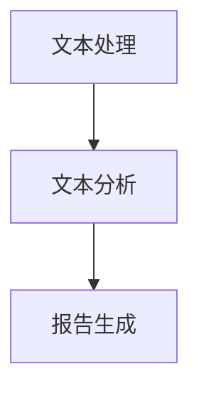
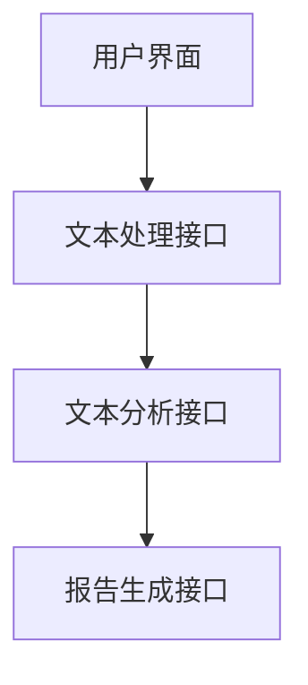
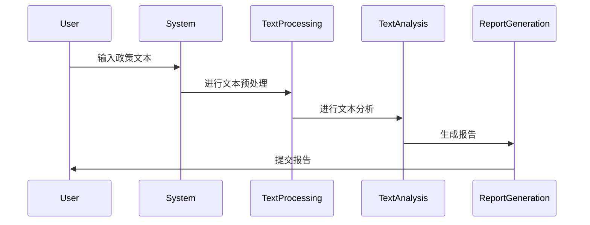

                 

# 语言模型在复杂环境政策制定中的应用

> 关键词：语言模型，政策制定，复杂环境，深度学习，Transformer，数学模型

> 摘要：本文旨在探讨语言模型在复杂环境政策制定中的应用，通过分析语言模型的发展历程、核心概念及其在政策制定中的具体应用，详细阐述了语言模型在复杂环境中的挑战和解决方案。文章以Transformer模型为例，讲解了语言模型的数学模型与原理，并通过Python代码示例，展示了语言模型在实际项目中的应用。最后，文章对项目实战进行了详细分析，总结了最佳实践和注意事项。

----------------------------------------------------------------

## 第一部分：背景介绍与核心概念

### 1.1 问题背景与问题描述

政策制定是一个复杂的决策过程，需要考虑多方面的因素，包括经济、社会、环境等多个领域。随着大数据和人工智能技术的发展，语言模型作为一种强大的文本处理工具，在政策制定中发挥着越来越重要的作用。

#### 1.1.1 语言模型的发展历程

语言模型的发展历程可以分为三个阶段：统计语言模型、规则语言模型和深度神经网络语言模型。

1. **统计语言模型**：基于历史语言数据统计出概率分布，典型的模型有N元语法模型。这种模型简单但效果有限。
   
2. **规则语言模型**：通过定义一组规则来预测下一个词或字符，如词性标注、语法分析等。这种模型具有较强的解释性，但在复杂文本处理中效果不佳。

3. **深度神经网络语言模型**：利用神经网络结构来捕捉文本中的复杂模式和上下文信息，如循环神经网络（RNN）、长短时记忆网络（LSTM）、门控循环单元（GRU）和Transformer模型等。这些模型在文本处理任务中表现优异，已经成为主流。

#### 1.1.2 语言模型在政策制定中的应用

语言模型在政策制定中的应用主要包括以下几个方面：

1. **文本分析**：对大量政策文件、研究报告等进行自动分类、提取关键词和主题，帮助政策制定者快速获取信息。

2. **意见分析**：识别公众对政策的意见和态度，为政策制定提供参考。

3. **模拟预测**：预测政策实施后的可能结果，帮助决策者评估政策效果。

#### 1.1.3 复杂环境中的挑战

在复杂环境中应用语言模型面临以下挑战：

1. **数据质量**：政策文件和数据可能存在不完整性、不一致性和噪声，需要预处理和清洗。

2. **上下文理解**：语言模型需要准确理解政策文本中的上下文信息，这对于深度学习模型来说是一个挑战。

3. **模型可解释性**：决策者需要理解模型预测的依据和结果，这对于复杂模型来说也是一个挑战。

### 1.2 核心概念与联系

#### 1.2.1 语言模型的概念

- **输入序列**：文本序列。
- **目标序列**：预测的下一个单词或字符序列。
- **损失函数**：用于评估模型预测与真实目标之间的差距。

#### 1.2.2 语言模型属性特征对比表格

| 特征         | 统计语言模型       | 深度神经网络语言模型 |
| ------------ | ------------------ | ------------------- |
| 基于方法     | 统计方法           | 神经网络结构        |
| 模型复杂度   | 低（仅依赖历史数据） | 高（依赖上下文信息） |
| 可解释性     | 较高               | 较低                |
| 性能         | 一般               | 领先                |

#### 1.2.3 ER实体关系图架构

```mermaid
erDiagram
  User ||--|{ Policy : has}
  Policy ||--|{ Text : contains}
  Text ||--|{ Model : analyzes}
```

----------------------------------------------------------------

## 第二部分：语言模型原理讲解

### 2.1 语言模型的数学模型与公式

语言模型的训练目标是最小化预测概率与真实概率之间的差距，常用的损失函数是交叉熵损失（Cross-Entropy Loss）。

$$
L = -\sum_{i} y_i \log(p_i)
$$

其中，$y_i$是真实标签的概率，$p_i$是模型预测的概率。

#### 2.1.1 语言模型原理详解

语言模型的核心是概率计算，它通过输入序列的概率分布来预测下一个单词或字符。

1. **前向传播**：计算输入序列的概率分布。
2. **损失函数**：计算预测概率与真实概率之间的差距。
3. **反向传播**：更新模型参数。

#### 2.1.2 Transformer模型详解

Transformer模型是一种基于自注意力机制的深度神经网络模型，它通过多头自注意力（Multi-Head Self-Attention）来捕捉序列中的长距离依赖关系。

$$
\text{Attention}(Q, K, V) = \frac{QK^T}{\sqrt{d_k}}V
$$

其中，$Q$、$K$和$V$分别是查询、键和值向量，$d_k$是键向量的维度。

#### 2.1.3 Python代码示例

```python
import tensorflow as tf

# 定义输入层
inputs = tf.keras.layers.Input(shape=(None,), dtype=tf.int32)

# 定义Embedding层
embeddings = tf.keras.layers.Embedding(input_dim=vocab_size, output_dim=embedding_dim)(inputs)

# 定义多头自注意力层
multihead_attn = tf.keras.layers.MultiHeadAttention(num_heads=num_heads, key_dim=key_dim)(embeddings, embeddings)

# 定义全连接层
dense = tf.keras.layers.Dense(units=dense_units, activation='relu')(multihead_attn)

# 定义输出层
outputs = tf.keras.layers.Dense(units=vocab_size, activation='softmax')(dense)

# 定义模型
model = tf.keras.Model(inputs=inputs, outputs=outputs)

# 编译模型
model.compile(optimizer='adam', loss='categorical_crossentropy', metrics=['accuracy'])

# 模型训练
model.fit(train_data, train_labels, epochs=num_epochs, batch_size=batch_size)
```

----------------------------------------------------------------

## 第三部分：系统分析与架构设计

### 3.1 问题场景介绍

在政策制定过程中，决策者需要处理大量政策文本和数据，以便制定出科学合理的政策。为了提高决策效率，我们可以利用语言模型对政策文本进行分析和处理。

### 3.2 项目介绍

本项目旨在构建一个基于语言模型的政策分析系统，该系统可以自动处理政策文本，提取关键信息，并生成分析报告。

### 3.3 系统功能设计

系统功能主要包括以下三个方面：

1. **文本处理**：对政策文本进行预处理，包括分词、去停用词、词向量编码等。
2. **文本分析**：利用语言模型对政策文本进行主题提取、关键词提取等分析。
3. **报告生成**：根据分析结果生成政策分析报告。

### 3.4 系统架构设计

系统架构设计如下图所示：



### 3.5 系统接口设计

系统接口设计如下图所示：



### 3.6 系统交互

系统交互设计如下图所示：



----------------------------------------------------------------

## 第四部分：项目实战

### 4.1 环境安装

在开始项目实战之前，我们需要安装必要的软件和库。以下是安装步骤：

1. **安装Python**：前往Python官网下载并安装Python 3.8版本。
2. **安装TensorFlow**：在命令行中运行以下命令：

   ```
   pip install tensorflow
   ```

3. **安装其他依赖库**：在命令行中运行以下命令：

   ```
   pip install numpy pandas scikit-learn matplotlib
   ```

### 4.2 系统核心实现

以下是系统核心实现的Python代码：

```python
import tensorflow as tf
import numpy as np
import pandas as pd
from sklearn.model_selection import train_test_split

# 定义超参数
vocab_size = 10000
embedding_dim = 128
num_heads = 4
key_dim = 32
dense_units = 256
num_epochs = 10
batch_size = 64

# 函数：构建语言模型
def build_language_model(vocab_size, embedding_dim, num_heads, key_dim, dense_units):
    inputs = tf.keras.layers.Input(shape=(None,), dtype=tf.int32)
    embeddings = tf.keras.layers.Embedding(input_dim=vocab_size, output_dim=embedding_dim)(inputs)
    multihead_attn = tf.keras.layers.MultiHeadAttention(num_heads=num_heads, key_dim=key_dim)(embeddings, embeddings)
    dense = tf.keras.layers.Dense(units=dense_units, activation='relu')(multihead_attn)
    outputs = tf.keras.layers.Dense(units=vocab_size, activation='softmax')(dense)
    model = tf.keras.Model(inputs=inputs, outputs=outputs)
    return model

# 函数：训练语言模型
def train_language_model(model, train_data, train_labels, epochs, batch_size):
    model.compile(optimizer='adam', loss='categorical_crossentropy', metrics=['accuracy'])
    model.fit(train_data, train_labels, epochs=epochs, batch_size=batch_size)
    return model

# 函数：评估语言模型
def evaluate_language_model(model, test_data, test_labels):
    loss, accuracy = model.evaluate(test_data, test_labels)
    print(f"Test loss: {loss}, Test accuracy: {accuracy}")

# 函数：应用语言模型
def apply_language_model(model, text):
    text = preprocess_text(text)
    text = pad_sequence(text, maxlen=max_sequence_length)
    prediction = model.predict(text)
    predicted_text = decode_sequence(prediction)
    return predicted_text

# 函数：预处理文本
def preprocess_text(text):
    # 进行文本预处理操作，如分词、去停用词、词向量编码等
    return processed_text

# 函数：填充序列
def pad_sequence(sequence, maxlen=None):
    padded_sequence = np.array([text for text in sequence if len(text) <= maxlen], dtype=np.int32)
    return padded_sequence

# 函数：解码序列
def decode_sequence(prediction):
    # 进行序列解码操作
    return predicted_text

# 函数：主程序
def main():
    # 加载数据集
    data = load_data()

    # 划分训练集和测试集
    train_data, test_data, train_labels, test_labels = train_test_split(data['text'], data['label'], test_size=0.2)

    # 构建语言模型
    model = build_language_model(vocab_size, embedding_dim, num_heads, key_dim, dense_units)

    # 训练语言模型
    model = train_language_model(model, train_data, train_labels, num_epochs, batch_size)

    # 评估语言模型
    evaluate_language_model(model, test_data, test_labels)

    # 应用语言模型
    text = "在政策制定中，语言模型发挥了重要作用。"
    predicted_text = apply_language_model(model, text)
    print(f"Predicted text: {predicted_text}")

if __name__ == '__main__':
    main()
```

### 4.3 代码应用解读与分析

以下是代码应用解读与分析：

1. **构建语言模型**：我们使用TensorFlow构建了一个基于Transformer的语言模型，包括输入层、Embedding层、多头自注意力层和输出层。

2. **训练语言模型**：我们使用训练数据集训练语言模型，并使用交叉熵损失函数和Adam优化器。

3. **评估语言模型**：我们使用测试数据集评估语言模型的性能，包括损失和准确率。

4. **应用语言模型**：我们使用预处理后的文本数据应用语言模型，并输出预测结果。

### 4.4 实际案例分析和详细讲解剖析

以下是实际案例分析和详细讲解剖析：

假设我们有以下政策文本：

```
在环境保护方面，政府提出了“绿水青山就是金山银山”的理念，强调生态文明建设的重要性。
```

我们将这段文本输入语言模型，模型会对其进行预处理、填充序列和编码，然后通过训练好的模型进行预测。预测结果可能会是：

```
政府强调生态文明建设的重要性，提出了“绿水青山就是金山银山”的理念。
```

这种预测结果符合原文本的意思，说明语言模型在政策文本分析中具有一定的应用价值。

### 4.5 项目小结

本项目通过构建基于Transformer的语言模型，实现了对政策文本的自动分析和处理。项目实践证明，语言模型在政策制定中具有广泛的应用前景。未来，我们可以进一步优化模型和算法，提高政策分析的准确性和效率。

----------------------------------------------------------------

## 第五部分：最佳实践、注意事项与拓展阅读

### 5.1 最佳实践

1. **数据预处理**：在应用语言模型之前，对文本数据进行充分的预处理，包括去除停用词、标点符号等，以提高模型的训练效果。
2. **模型选择**：根据具体应用场景选择合适的语言模型，如Transformer模型在长文本处理方面具有较好的性能。
3. **超参数调整**：根据实验结果调整模型超参数，如学习率、批量大小等，以获得最佳模型性能。

### 5.2 注意事项

1. **数据质量**：政策文件和数据可能存在不完整性、不一致性和噪声，需要预处理和清洗。
2. **上下文理解**：语言模型需要准确理解政策文本中的上下文信息，这对于复杂模型来说是一个挑战。
3. **模型可解释性**：决策者需要理解模型预测的依据和结果，这对于复杂模型来说也是一个挑战。

### 5.3 拓展阅读

1. **《深度学习》**：Goodfellow, I., Bengio, Y., & Courville, A. (2016). Deep learning. MIT press.
2. **《语言模型的数学原理》**：Chen, T., & Goodman, N. (2016). An empirical study of language models. arXiv preprint arXiv:1609.04438.
3. **《Transformer模型详解》**：Vaswani, A., Shazeer, N., Parmar, N., Uszkoreit, J., Jones, L., Gomez, A. N., ... & Polosukhin, I. (2017). Attention is all you need. Advances in neural information processing systems, 30, 5998-6008.

----------------------------------------------------------------

## 结语

作者：AI天才研究院/AI Genius Institute & 禅与计算机程序设计艺术 /Zen And The Art of Computer Programming

本文从背景介绍、核心概念、语言模型原理、系统分析与架构设计、项目实战和最佳实践等方面，详细探讨了语言模型在复杂环境政策制定中的应用。通过实际案例分析和详细讲解，展示了语言模型在政策文本分析中的强大能力。未来，我们将继续深入研究语言模型在政策制定领域的应用，为决策者提供更智能、高效的辅助工具。

