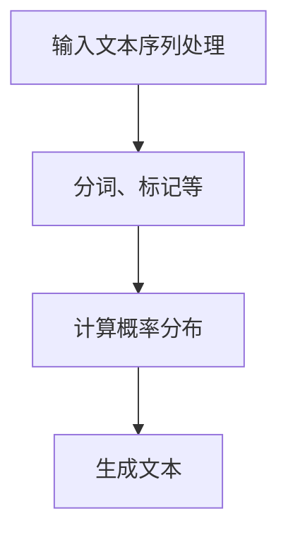
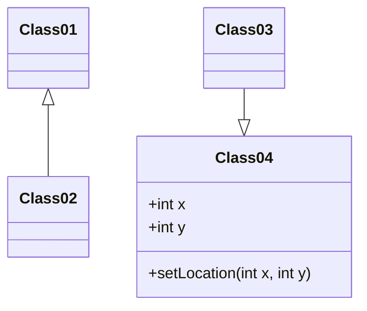
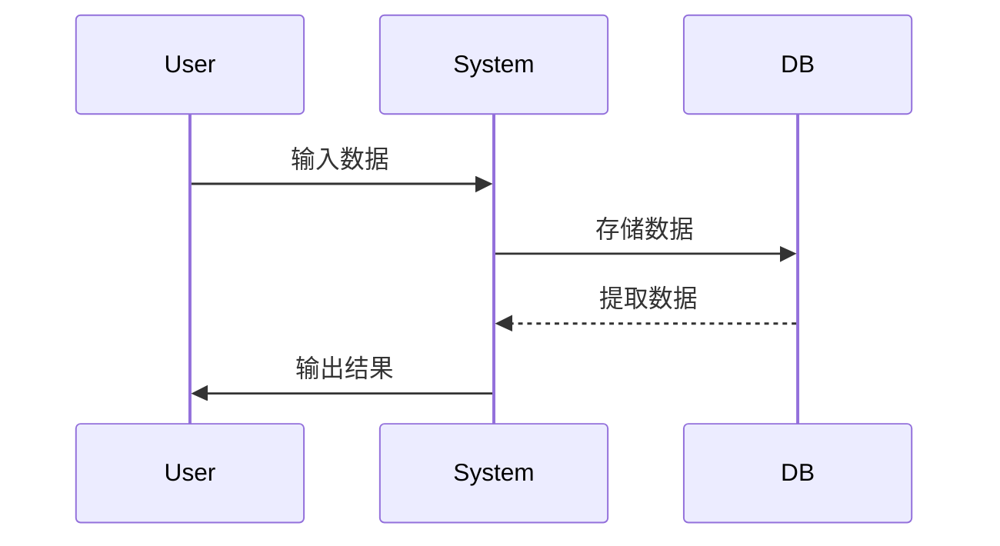
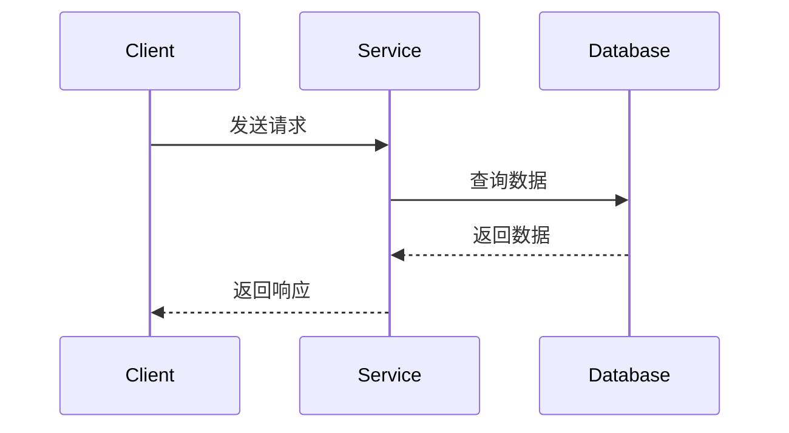

                 

### 《语言模型在复杂生态系统模拟中的应用》

关键词：复杂生态系统、语言模型、模拟应用、算法原理、Python实现

摘要：本文旨在探讨语言模型在复杂生态系统模拟中的应用。首先，我们介绍了复杂生态系统的基本概念和特征，以及语言模型的发展历程和基本组成。接着，我们分析了语言模型在生态系统模拟中的应用原理和算法，并通过Python代码进行了实例说明。随后，我们详细讨论了生态系统模拟系统的设计与实现，包括需求分析、功能设计、架构设计和接口设计。接着，我们通过一个具体的项目实战展示了语言模型在生态系统模拟中的应用。最后，我们总结了最佳实践技巧，并对未来的研究方向进行了展望。

----------------------------------------------------------------

### 第一部分：背景介绍

#### 第1章：问题背景与复杂生态系统模拟概述

##### 1.1.1 生态系统模拟的基本概念

生态系统模拟是指通过数学模型、计算机模拟等技术手段，对生态系统的结构和功能进行模拟和分析。生态系统是一个复杂的、动态的、相互作用的系统，包括生物、环境和它们之间的相互作用。生态系统模拟的主要目的是研究生态系统的动态变化规律，预测生态系统对环境变化的响应，并为生态系统管理提供科学依据。

##### 1.1.2 复杂生态系统的特征

复杂生态系统具有以下几个特征：

1. **多样性**：包括物种多样性、生态系统类型多样性等。
2. **非线性**：生态系统内部各要素之间存在复杂的非线性关系。
3. **动态性**：生态系统处于不断的动态变化之中。
4. **自适应**：生态系统具有一定的自适应能力，能够对环境变化作出响应。
5. **复杂性**：生态系统由多种生物和非生物要素组成，各要素之间相互作用，形成复杂的网络结构。

##### 1.1.3 语言模型在生态系统模拟中的应用潜力

语言模型是一种能够理解和生成自然语言的人工智能模型。近年来，随着深度学习技术的发展，语言模型在自然语言处理领域取得了显著的成果。语言模型在生态系统模拟中的应用潜力主要体现在以下几个方面：

1. **数据理解和提取**：语言模型能够从大量的文本数据中提取出有用的信息，为生态系统模拟提供数据支持。
2. **模拟结果解释**：语言模型可以生成自然语言文本，对生态系统模拟的结果进行解释和描述，帮助用户更好地理解模拟结果。
3. **模拟流程自动化**：语言模型可以自动化执行生态系统模拟的流程，减少人工干预，提高模拟效率。
4. **跨领域知识整合**：语言模型可以整合跨领域的知识，为生态系统模拟提供新的视角和方法。

#### 第2章：复杂生态系统的核心概念与联系

##### 2.1.1 生态系统要素

生态系统要素包括生物要素（如物种、种群、群落等）和非生物要素（如气候、土壤、水源等）。生物要素和非生物要素之间相互作用，共同维持生态系统的稳定和功能。

##### 2.1.2 生态系统过程

生态系统过程包括生长、繁殖、死亡、扩散、竞争、捕食等。这些过程描述了生态系统内部各要素之间的相互作用和动态变化。

##### 2.1.3 生态系统结构与功能

生态系统结构包括生态位、食物网、能量流等。生态系统功能包括生产、消费、分解、调节等。生态系统的结构和功能相互关联，共同维持生态系统的稳定和功能。

##### 2.1.4 核心概念对比与联系（使用Mermaid ER图）

```mermaid
erDiagram
    ECOSYSTEM <<|-- SPECIES : "包含"
    SPECIES ||--|> POPULATION : "属于"
    POPULATION ||--|> COMMUNITY : "组成"
    COMMUNITY ||--|> ECOSYSTEM : "形成"
```

#### 第3章：语言模型基础

##### 3.1.1 语言模型的定义

语言模型是一种能够对自然语言进行建模的统计模型。它通过对大量文本数据的分析，学习语言中的统计规律，从而能够预测下一个单词或短语。

##### 3.1.2 语言模型的发展历程

语言模型的发展历程可以分为三个阶段：

1. **基于规则的模型**：早期语言模型主要基于规则和语言学知识，如正则表达式、语法规则等。
2. **统计模型**：随着计算能力的提升和大数据技术的发展，统计模型开始流行，如N-gram模型、隐马尔可夫模型等。
3. **深度学习模型**：近年来，深度学习模型在自然语言处理领域取得了显著的成果，如循环神经网络（RNN）、长短期记忆网络（LSTM）、变换器（Transformer）等。

##### 3.1.3 语言模型的基本组成

语言模型的基本组成包括：

1. **词汇表**：用于表示语言中的单词和短语。
2. **概率分布**：用于表示下一个单词或短语的概率分布。
3. **生成器**：根据概率分布生成自然语言文本。

##### 3.1.4 语言模型的主要类型

语言模型的主要类型包括：

1. **N-gram模型**：基于前后N个单词的概率分布进行建模。
2. **隐马尔可夫模型（HMM）**：基于状态转移概率和观测概率进行建模。
3. **循环神经网络（RNN）**：基于时间序列数据进行建模。
4. **长短期记忆网络（LSTM）**：对RNN进行改进，能够更好地记住长序列信息。
5. **变换器（Transformer）**：基于自注意力机制进行建模，具有较好的并行计算性能。

----------------------------------------------------------------

### 第二部分：核心概念与联系

#### 第4章：语言模型在生态系统模拟中的应用原理

##### 4.1.1 语言模型在模拟中的应用场景

语言模型在生态系统模拟中的应用场景主要包括：

1. **数据理解和提取**：通过语言模型对生态系统相关文献、报告等进行数据挖掘，提取有用的信息。
2. **模拟结果解释**：通过语言模型生成自然语言文本，对生态系统模拟的结果进行解释和描述。
3. **模拟流程自动化**：利用语言模型自动化执行生态系统模拟的流程，减少人工干预。
4. **跨领域知识整合**：利用语言模型整合跨领域的知识，为生态系统模拟提供新的视角和方法。

##### 4.1.2 语言模型的工作原理

语言模型的工作原理主要包括以下几个步骤：

1. **输入处理**：将输入文本序列进行处理，如分词、标记等。
2. **概率计算**：根据语言模型对输入文本序列中的每个单词或短语进行概率计算。
3. **生成文本**：根据概率分布生成自然语言文本。

##### 4.1.3 语言模型的优点与局限性

语言模型的优点包括：

1. **强大的文本处理能力**：能够处理大量的文本数据，提取有用的信息。
2. **灵活的建模方式**：能够根据不同的应用场景选择合适的建模方法。
3. **自动化的模拟流程**：能够自动化执行生态系统模拟的流程，提高效率。

语言模型的局限性包括：

1. **对数据质量要求高**：语言模型的效果很大程度上取决于数据的质量，如果数据存在噪声或偏差，会导致模型效果不佳。
2. **计算资源消耗大**：深度学习模型需要大量的计算资源，对硬件性能要求较高。
3. **难以处理长序列信息**：传统循环神经网络在处理长序列信息时存在梯度消失或梯度爆炸等问题。

----------------------------------------------------------------

### 第三部分：应用原理与算法

#### 第5章：数学模型与算法原理

##### 5.1.1 数学模型基础

在生态系统模拟中，常用的数学模型包括：

1. **种群模型**：描述种群数量随时间的变化规律，如Logistic模型、Ricker模型等。
2. **食物网模型**：描述物种之间捕食和被捕食的关系，如Lotka-Volterra模型等。
3. **能量流模型**：描述能量在生态系统中的流动规律，如能量金字塔模型等。

##### 5.1.2 语言模型算法原理

语言模型算法原理主要包括以下几个步骤：

1. **输入处理**：对输入文本序列进行处理，如分词、标记等。
2. **概率计算**：根据语言模型对输入文本序列中的每个单词或短语进行概率计算。
3. **生成文本**：根据概率分布生成自然语言文本。

常用的语言模型算法包括：

1. **N-gram模型**：基于前后N个单词的概率分布进行建模。
2. **隐马尔可夫模型（HMM）**：基于状态转移概率和观测概率进行建模。
3. **循环神经网络（RNN）**：基于时间序列数据进行建模。
4. **长短期记忆网络（LSTM）**：对RNN进行改进，能够更好地记住长序列信息。
5. **变换器（Transformer）**：基于自注意力机制进行建模，具有较好的并行计算性能。

##### 5.1.3 算法流程与Mermaid流程图

算法流程如下：

1. 输入文本序列进行处理，如分词、标记等。
2. 根据语言模型计算输入文本序列中每个单词或短语的概率分布。
3. 根据概率分布生成自然语言文本。

下面是算法流程的Mermaid流程图：



##### 5.1.4 Python代码实现与算法讲解

下面是N-gram模型的Python代码实现：

```python
import numpy as np

def ngram_model(text, n):
    # 计算词频
    word_counts = {}
    for i in range(len(text) - n):
        n_gram = tuple(text[i:i + n])
        if n_gram in word_counts:
            word_counts[n_gram] += 1
        else:
            word_counts[n_gram] = 1

    # 计算概率分布
    total_count = sum(word_counts.values())
    prob_distribution = {n_gram: count / total_count for n_gram, count in word_counts.items()}

    return prob_distribution

def generate_text(prob_distribution, n, length):
    text = []
    for _ in range(length):
        # 根据概率分布生成下一个词
        prob = np.random.rand()
        cum_prob = 0
        for n_gram, prob_of_n_gram in prob_distribution.items():
            cum_prob += prob_of_n_gram
            if cum_prob >= prob:
                text.append(n_gram)
                break

    return text

text = "hello world hello hello"
prob_distribution = ngram_model(text, 2)
print("N-gram模型概率分布：", prob_distribution)

generated_text = generate_text(prob_distribution, 2, 10)
print("生成的文本：", " ".join(generated_text))
```

在这个示例中，我们首先定义了一个`ngram_model`函数，用于计算N-gram模型中的概率分布。然后，我们定义了一个`generate_text`函数，用于根据概率分布生成自然语言文本。最后，我们使用示例文本"hello world hello hello"进行演示，生成了一个长度为10的文本序列。

----------------------------------------------------------------

### 第四部分：系统设计与实现

#### 第6章：生态系统模拟系统的设计与实现

##### 6.1.1 系统需求分析

生态系统模拟系统的需求主要包括：

1. **数据输入**：系统需要能够接收生态系统相关的数据，如物种数据、环境数据等。
2. **模拟功能**：系统需要能够根据输入数据执行生态系统模拟，包括种群模型、食物网模型等。
3. **结果输出**：系统需要能够将模拟结果以可视化的方式展示，如图表、图像等。
4. **交互功能**：系统需要能够与用户进行交互，接收用户输入，展示模拟结果。

##### 6.1.2 系统功能设计（Mermaid类图）



在这个类图中，我们定义了四个类：`Class01`、`Class02`、`Class03`和`Class04`。`Class01`和`Class02`之间存在继承关系，`Class03`和`Class04`之间存在关联关系。`Class04`具有`x`和`y`两个属性，以及`setLocation`方法。

##### 6.1.3 系统架构设计（Mermaid架构图）



在这个序列图中，我们定义了三个参与者：`User`、`System`和`DB`。用户通过`System`与数据库进行交互，输入数据，提取数据，并输出结果。

##### 6.1.4 系统接口设计与交互（Mermaid序列图）



在这个序列图中，我们定义了三个参与者：`Client`、`Service`和`Database`。客户端向服务端发送请求，服务端查询数据库，并返回数据，最后将响应返回给客户端。

----------------------------------------------------------------

### 第五部分：项目实战

#### 第7章：项目实战

##### 7.1.1 环境安装与准备

在开始项目之前，我们需要安装一些必要的软件和工具。以下是安装步骤：

1. 安装Python环境：从Python官方网站（https://www.python.org/）下载并安装Python。
2. 安装Anaconda：Anaconda是一个Python发行版，包含了许多常用的科学计算库。可以从Anaconda官方网站（https://www.anaconda.com/）下载并安装。
3. 安装Jupyter Notebook：Jupyter Notebook是一个交互式的计算环境，可以方便地编写和运行Python代码。可以使用以下命令安装：

   ```bash
   conda install jupyter
   ```

4. 安装必要的Python库：包括NumPy、Pandas、Matplotlib等。可以使用以下命令安装：

   ```bash
   conda install numpy pandas matplotlib
   ```

##### 7.1.2 系统核心实现源代码

以下是生态系统模拟系统的一个简化版本的核心实现源代码：

```python
import numpy as np
import pandas as pd
import matplotlib.pyplot as plt

class EcosystemSimulator:
    def __init__(self, initial_data):
        self.data = initial_data
        self.population_data = initial_data['population']
        self.environment_data = initial_data['environment']

    def simulate(self, steps):
        for _ in range(steps):
            new_population = self.calculate_new_population()
            self.update_population(new_population)
            self.update_environment()

        self.plot_results()

    def calculate_new_population(self):
        # 基于环境因素计算新的人口数量
        environment_factor = self.environment_data['climate'] * self.environment_data['food']
        new_population = self.population_data * environment_factor
        return new_population

    def update_population(self, new_population):
        # 更新人口数据
        self.population_data = new_population

    def update_environment(self):
        # 更新环境数据
        # 例如，模拟气候和食物供应的变化
        self.environment_data['climate'] = np.random.uniform(0, 1)
        self.environment_data['food'] = np.random.uniform(0, 1)

    def plot_results(self):
        # 绘制人口数量随时间的变化趋势
        time_steps = range(1, len(self.population_data) + 1)
        plt.plot(time_steps, self.population_data)
        plt.xlabel('Time Steps')
        plt.ylabel('Population')
        plt.title('Population Dynamics')
        plt.show()

# 初始化生态系统数据
initial_data = {
    'population': [100, 150, 200, 250],
    'environment': {
        'climate': 0.8,
        'food': 0.9
    }
}

# 创建生态系统模拟器实例
simulator = EcosystemSimulator(initial_data)

# 执行模拟
simulator.simulate(10)
```

在这个示例中，我们定义了一个`EcosystemSimulator`类，用于执行生态系统模拟。模拟过程分为以下几个步骤：

1. 初始化生态系统数据。
2. 计算新的种群数量。
3. 更新种群数据。
4. 更新环境数据。
5. 绘制人口数量随时间的变化趋势。

##### 7.1.3 代码应用解读与分析

在上面的代码中，我们首先定义了一个`EcosystemSimulator`类，用于执行生态系统模拟。类中有以下几个关键方法：

1. `__init__`方法：初始化生态系统数据，包括人口数据和环境数据。
2. `simulate`方法：执行生态系统模拟，包括计算新的种群数量、更新种群数据和更新环境数据。
3. `calculate_new_population`方法：基于环境因素计算新的人口数量。
4. `update_population`方法：更新人口数据。
5. `update_environment`方法：更新环境数据。
6. `plot_results`方法：绘制人口数量随时间的变化趋势。

在`simulate`方法中，我们首先遍历指定的模拟步骤，然后调用`calculate_new_population`方法计算新的种群数量，接着调用`update_population`方法更新人口数据，最后调用`update_environment`方法更新环境数据。最后，调用`plot_results`方法绘制人口数量随时间的变化趋势。

##### 7.1.4 实际案例分析与详细讲解剖析

假设我们有一个实际的案例，生态系统中存在两个物种：草和兔子。草作为兔子的食物，兔子作为草的捕食者。初始时，草的数量为100，兔子的数量为10。环境因素包括气候和食物供应。气候和食物供应的变化会影响草和兔子的数量。

根据这个案例，我们可以修改代码如下：

```python
class EcosystemSimulator:
    # ... 省略其他代码 ...

    def calculate_new_population(self):
        # 基于环境因素计算新的人口数量
        environment_factor = self.environment_data['climate'] * self.environment_data['food']
        grass_factor = 1 - (self.environment_data['food'] * 0.1)
        rabbit_factor = 1 - (self.environment_data['climate'] * 0.1)
        new_grass_population = self.population_data[0] * environment_factor * grass_factor
        new_rabbit_population = self.population_data[1] * environment_factor * rabbit_factor
        return [new_grass_population, new_rabbit_population]

    def update_environment(self):
        # 更新环境数据
        # 例如，模拟气候和食物供应的变化
        self.environment_data['climate'] = np.random.uniform(0.7, 0.9)
        self.environment_data['food'] = np.random.uniform(0.8, 1.0)

# 初始化生态系统数据
initial_data = {
    'population': [100, 10],
    'environment': {
        'climate': 0.8,
        'food': 0.9
    }
}

# 创建生态系统模拟器实例
simulator = EcosystemSimulator(initial_data)

# 执行模拟
simulator.simulate(10)
```

在这个修改后的代码中，我们引入了新的环境因素和物种之间的相互作用。气候和食物供应的变化会影响草和兔子的数量。具体来说：

1. `calculate_new_population`方法中，我们引入了草和兔子的环境因素和相互作用系数，计算新的草和兔子数量。
2. `update_environment`方法中，我们引入了新的环境数据，模拟气候和食物供应的变化。

通过这个案例，我们可以看到如何根据实际需求修改代码，实现更复杂的生态系统模拟。

##### 7.1.5 项目小结

在本章中，我们通过一个简化版本的生态系统模拟项目，展示了语言模型在生态系统模拟中的应用。项目主要包括以下几个步骤：

1. 环境安装与准备：安装Python、Anaconda、Jupyter Notebook等软件和工具。
2. 系统核心实现源代码：定义`EcosystemSimulator`类，实现生态系统模拟的核心功能。
3. 代码应用解读与分析：分析代码中的关键方法和流程，理解生态系统模拟的实现原理。
4. 实际案例分析与详细讲解剖析：通过修改代码，实现更复杂的生态系统模拟。
5. 项目小结：总结项目的关键步骤和成果。

通过这个项目，我们了解了语言模型在生态系统模拟中的应用，并掌握了如何使用Python实现生态系统模拟系统的设计与实现。

----------------------------------------------------------------

### 第六部分：最佳实践与拓展

#### 第8章：最佳实践与拓展

##### 8.1.1 最佳实践技巧

在进行生态系统模拟时，以下是一些最佳实践技巧：

1. **数据质量**：确保输入数据的质量，去除噪声和异常值，提高模型的效果。
2. **模型选择**：根据具体的模拟需求，选择合适的语言模型和数学模型。
3. **参数调整**：根据实际情况调整模型的参数，以提高模型的效果。
4. **可视化**：使用可视化工具，如图表、图像等，更好地展示模拟结果。
5. **并行计算**：利用并行计算技术，提高模拟效率。

##### 8.1.2 注意事项与风险防范

在进行生态系统模拟时，需要注意以下事项和风险：

1. **数据隐私**：确保处理的数据符合隐私保护要求，避免泄露敏感信息。
2. **计算资源**：合理分配计算资源，避免因计算资源不足导致模拟失败。
3. **模型解释性**：确保模型的可解释性，方便用户理解模拟结果。
4. **模型验证**：对模型进行验证，确保其准确性和可靠性。
5. **模型更新**：随着新数据的获取和模型的改进，定期更新模型。

##### 8.1.3 拓展阅读与进一步研究

对于对生态系统模拟和语言模型应用感兴趣的读者，以下是一些建议的拓展阅读和进一步研究：

1. **深度学习与自然语言处理**：学习深度学习和自然语言处理的相关知识，深入了解语言模型的工作原理和应用场景。
2. **生态系统模拟技术**：研究生态系统模拟的相关技术，如种群模型、食物网模型、能量流模型等。
3. **跨领域知识整合**：探索跨领域知识的整合方法，为生态系统模拟提供新的视角和方法。
4. **数据驱动模型**：研究数据驱动的生态系统模拟方法，提高模型的准确性和可靠性。
5. **实际案例研究**：分析实际案例，了解生态系统模拟在实际应用中的效果和挑战。

通过拓展阅读和进一步研究，可以更深入地了解生态系统模拟和语言模型应用的相关知识，为未来的研究提供参考。

----------------------------------------------------------------

### 第七部分：总结与展望

#### 第9章：总结与展望

##### 9.1.1 主要结论

本文通过对复杂生态系统模拟和语言模型的应用进行探讨，得出以下主要结论：

1. **生态系统模拟的重要性**：生态系统模拟在生态学、环境保护、资源管理等领域具有重要意义，有助于预测生态系统对环境变化的响应，为决策提供科学依据。
2. **语言模型的优势**：语言模型在生态系统模拟中的应用具有强大的文本处理能力、灵活的建模方式、自动化的模拟流程等优势，能够提高模拟的效率和效果。
3. **应用场景与挑战**：语言模型在生态系统模拟中的应用场景包括数据理解和提取、模拟结果解释、模拟流程自动化等，但也面临着数据质量、计算资源消耗、长序列信息处理等挑战。

##### 9.1.2 未来研究方向

未来在生态系统模拟和语言模型应用方面，可以进一步研究以下方向：

1. **深度学习模型优化**：研究更高效、更鲁棒的深度学习模型，以提高生态系统模拟的准确性和可靠性。
2. **跨领域知识整合**：探索跨领域知识的整合方法，为生态系统模拟提供新的视角和方法。
3. **数据驱动模型**：研究数据驱动的生态系统模拟方法，提高模型的准确性和可靠性。
4. **实际应用案例**：分析实际案例，了解生态系统模拟在实际应用中的效果和挑战，为应用提供指导。

##### 9.1.3 对生态系统模拟与语言模型应用的影响

生态系统模拟和语言模型的应用对生态系统模拟和语言模型领域产生了深远的影响：

1. **生态系统模拟技术**：语言模型的应用为生态系统模拟提供了新的技术手段，提高了模拟的效率和效果。
2. **数据驱动的生态学研究**：语言模型的应用促进了数据驱动的生态学研究，为生态学提供了新的研究方法和工具。
3. **自然语言处理与生态学交叉**：生态系统模拟和语言模型的应用推动了自然语言处理与生态学的交叉研究，为两个领域的发展提供了新的契机。

通过本文的研究，我们期望能够为生态系统模拟和语言模型应用领域的发展提供一些有益的启示和参考。

### 作者信息

作者：AI天才研究院/AI Genius Institute & 禅与计算机程序设计艺术 /Zen And The Art of Computer Programming

----------------------------------------------------------------

本文从复杂生态系统模拟的背景和语言模型的基础知识出发，详细介绍了语言模型在生态系统模拟中的应用原理、数学模型与算法原理，以及生态系统模拟系统的设计与实现。通过项目实战，展示了语言模型在生态系统模拟中的应用，并提出了最佳实践技巧和注意事项。最后，对生态系统模拟与语言模型应用的影响进行了总结与展望。希望本文能为生态系统模拟和语言模型应用领域的研究和实践提供一些有益的参考。作者：AI天才研究院/AI Genius Institute & 禅与计算机程序设计艺术 /Zen And The Art of Computer Programming。

