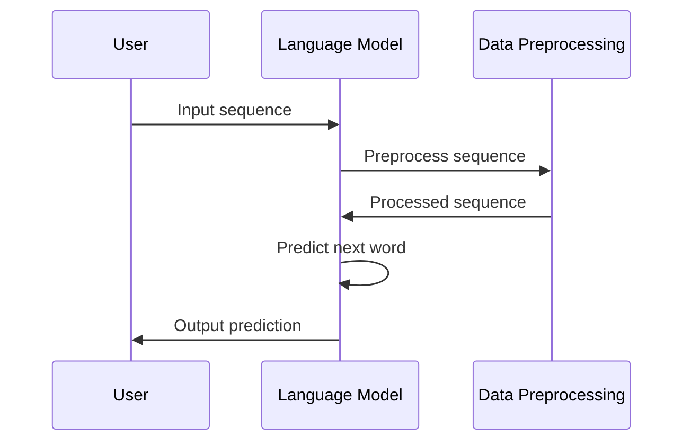
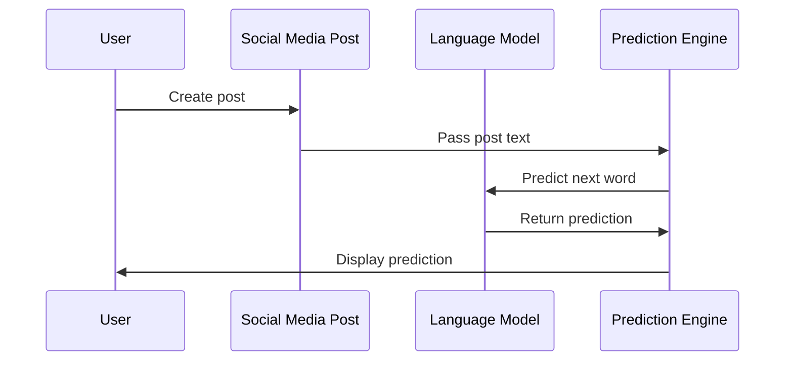
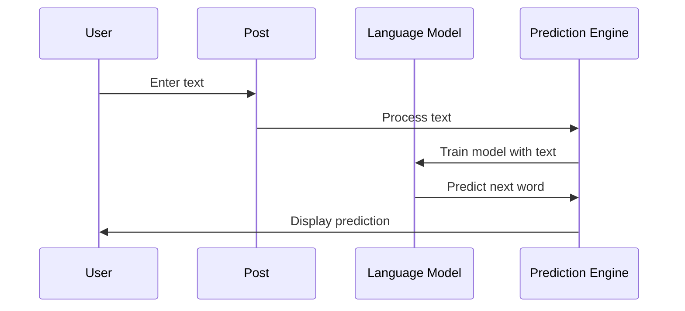

                 


### Introduction to the Book

In the digital age, the landscape of social interactions and data dissemination is continually evolving, driven by the rapid advancements in technology. Social networks, in particular, have emerged as a pivotal platform where individuals and organizations connect, communicate, and exchange information. The complexity of these networks, however, poses significant challenges for traditional analytical methods. This book, "Language Models in the Application of Complex Social Network Dynamic Analysis," aims to address these challenges by exploring the integration of advanced language models into the analysis of complex social networks.

#### Problem Background

**Definition of Complex Social Networks:**
Complex social networks are characterized by their intricate web of relationships, where nodes represent individuals or entities and edges denote interactions or connections. These networks can exhibit diverse structures, including hierarchical, modular, and scale-free patterns, and they often evolve over time due to changing dynamics and external influences.

**Dynamics in Social Networks:**
The dynamics of social networks encompass the processes of node and edge creation, deletion, and modification. These processes can be driven by various factors, such as social influence, information diffusion, and network externalities. Understanding these dynamics is crucial for predicting and managing the behavior of social networks.

**Challenges in Analyzing Social Networks:**
Analyzing complex social networks is challenging due to their size, heterogeneity, and dynamic nature. Traditional methods often struggle to capture the rich structure and temporal evolution of these networks. Moreover, the massive volume of data generated by social networks necessitates the development of scalable and efficient analytical techniques.

#### The Role of Language Models

**Basics of Language Models:**
Language models are machine learning algorithms that learn to predict the probability of a sequence of words or tokens based on previous tokens. They have been revolutionizing natural language processing (NLP) by enabling computers to understand, generate, and interpret human language.

**Applications of Language Models in Social Network Analysis:**
Language models can be applied to social network analysis in several ways. They can help extract meaningful information from social media texts, identify key influencers and communities, and predict the spread of information or influence within a network.

**The Importance of Language Models:**
The importance of language models in social network analysis lies in their ability to process and understand natural language, which is essential for capturing the nuances of human communication and interactions. By leveraging language models, analysts can gain deeper insights into social networks and make more accurate predictions about their behavior.

#### Research Frontiers and Future Directions

The integration of language models into social network analysis opens up a wide range of research frontiers. Future research may focus on developing more robust and scalable language models, exploring interdisciplinary approaches that combine social network analysis with other fields like economics and psychology, and addressing ethical concerns related to privacy and data security.

#### Book Structure Overview

This book is organized into three main parts:

1. **Introduction and Background:** Provides an overview of the problem background, the role of language models, and an overview of the book structure.
2. **Fundamental Concepts and Theories:** Covers the basic concepts of language models and social network analysis, their integration, and the theoretical models and algorithms used.
3. **Theoretical Models and Algorithms:** Discusses the theoretical models and algorithms in detail, including their design, implementation, and mathematical foundations.

By following this structured approach, readers will gain a comprehensive understanding of how language models can be effectively applied to the dynamic analysis of complex social networks. 

### Fundamental Concepts and Theories

In this section, we delve into the fundamental concepts and theories underlying language models and social network analysis. Understanding these concepts is crucial for grasping how language models can be integrated into the analysis of complex social networks.

#### Language Model Fundamentals

**Key Concepts and Terminology:**
Language models are at the heart of natural language processing (NLP), and their effectiveness hinges on the ability to understand and generate human language. Key concepts include tokens, vocabulary, n-gram models, and probability distributions.

- **Tokens:** Tokens are the smallest units of meaning in a language, such as words, punctuation marks, or even subword units like "ing" or "ed."
- **Vocabulary:** Vocabulary refers to the set of all possible tokens in a language. In practical applications, it is often necessary to limit the vocabulary size for computational efficiency.
- **N-gram Models:** N-gram models are a type of statistical language model that predicts the probability of a sequence of tokens based on the history of the previous tokens. For example, a bigram model considers the probability of a word based on the preceding word.
- **Probability Distributions:** Probability distributions are used to model the likelihood of different outcomes. In language modeling, they help determine the probability of a sequence of words occurring.

**Key Properties and Differences:**
Different language models exhibit various properties that influence their performance. Some of the key properties include:

- **Language Modeling Performance:** The ability of a model to accurately predict the probability of a sequence of words.
- **Computation Efficiency:** The efficiency with which a model can process text data, which is critical for applications involving large datasets.
- **Generalization Ability:** The model's ability to perform well on unseen data, indicating its robustness and adaptability.

**Comparison with Traditional AI Methods:**
Traditional AI methods, such as rule-based systems and symbolic reasoning, have limitations when it comes to handling natural language. Language models offer several advantages over these methods:

- **Data-Driven Approach:** Language models are trained on large amounts of data, allowing them to learn from examples and generalize to new situations.
- **Flexibility:** Language models can adapt to various linguistic phenomena and contexts, making them more versatile than rule-based systems.
- **Performance:** State-of-the-art language models, such as those based on deep learning, have achieved superhuman performance on various NLP tasks.

#### Social Network Analysis Basics

**Core Concepts of Social Network Analysis:**
Social network analysis (SNA) is a field that studies the structure and behavior of social networks. Key concepts include:

- **Nodes:** Nodes represent individuals or entities in a network. They can be people, organizations, or any other entities of interest.
- **Edges:** Edges denote relationships or connections between nodes. They can represent various types of interactions, such as friendship, collaboration, or communication.
- **Network Structure:** The structure of a network includes its topology, connectivity, and clustering properties. Understanding the network structure can reveal important insights into the dynamics and behavior of the network.

**Measures and Metrics in Social Networks:**
Several measures and metrics are used to quantify the properties of social networks. Some common measures include:

- **Degree:** The number of edges connected to a node.
- **Closeness Centrality:** A measure of how quickly information can spread from a node to all other nodes in the network.
- **Betweenness Centrality:** A measure of how many shortest paths between pairs of nodes pass through a particular node.
- **Cluster Coefficient:** A measure of how tightly interconnected the neighbors of a node are.

**Social Network Modeling Approaches:**
Social network modeling involves constructing mathematical models that represent the structure and behavior of social networks. Common modeling approaches include:

- **Graph Theory Models:** Graph theory provides a mathematical framework for studying the structure of networks. Nodes and edges are represented as vertices and edges in a graph.
- **Agent-Based Models:** These models simulate the behavior of individual agents within a network, capturing the emergence of collective phenomena through the interactions of the agents.
- **Network Science Models:** These models incorporate both the structure and dynamics of networks, using techniques from statistical physics and complex systems theory.

#### Integration of Language Models in Social Network Analysis

**Combining Language Models with Social Network Analysis:**
The integration of language models with social network analysis involves leveraging the strengths of both fields to gain deeper insights into social networks. Some potential applications include:

- **Textual Data Analysis:** Language models can process and analyze textual data associated with social network interactions, providing insights into the content and sentiment of conversations.
- **Influence Detection:** Language models can help identify influential nodes in a network, enabling the analysis of how information or influence spreads through the network.
- **Community Detection:** Language models can aid in detecting communities within a social network by analyzing the textual content of interactions.

**Challenges and Opportunities:**
While the integration of language models and social network analysis offers promising opportunities, it also presents several challenges:

- **Data Quality:** The quality and reliability of textual data can significantly impact the accuracy of language models and the results of social network analysis.
- **Scalability:** Processing large-scale social networks and textual data requires efficient algorithms and computational resources.
- **Interdisciplinary Collaboration:** Successful integration of language models and social network analysis requires collaboration between researchers from different fields, including computer science, linguistics, and sociology.

#### Current Research Trends

The field of social network analysis is rapidly evolving, with ongoing research exploring new methods and applications. Some of the current research trends include:

- **Deep Learning and Social Networks:** Researchers are exploring the use of deep learning techniques, such as neural networks and transformers, to improve the performance of language models in social network analysis.
- **Multimodal Data Fusion:** Combining textual data with other types of data, such as images, audio, and video, can provide more comprehensive insights into social networks.
- **Ethical Considerations:** Addressing ethical concerns related to data privacy, bias, and fairness in social network analysis is an important research direction.

#### Conceptual Framework and Structure

To facilitate a comprehensive understanding of the integration of language models in social network analysis, this book adopts a structured approach:

- **Introduction and Background:** Provides an overview of the problem background, the role of language models, and the book's structure.
- **Fundamental Concepts and Theories:** Covers the basic concepts of language models and social network analysis, their integration, and theoretical models and algorithms.
- **Theoretical Models and Algorithms:** Discusses the theoretical models and algorithms in detail, including their design, implementation, and mathematical foundations.
- **Application Case Studies:** Presents practical applications of language models in social network analysis through case studies and real-world examples.
- **Future Directions:** Explores the future research frontiers and potential applications of language models in social network analysis.

By following this structured approach, readers will gain a comprehensive understanding of how language models can be effectively applied to the dynamic analysis of complex social networks. 

### Theoretical Models and Algorithms

In this section, we will delve into the theoretical models and algorithms that form the backbone of language models and their integration into social network analysis. This includes a discussion on basic theoretical models, algorithm design and implementation, mathematical foundations, and their practical implications.

#### Basic Theoretical Models

**Model Architectures:**
The architecture of a language model plays a crucial role in its performance. Two prominent architectures are n-gram models and neural network-based models.

1. **n-gram Models:**
n-gram models are the simplest form of language models. They work by predicting the probability of a word based on the history of n-1 previous words. The basic architecture involves storing these probabilities in a large table, which can become impractical for large values of n due to the exponential growth of the table size.

2. **Neural Network-Based Models:**
Neural network-based models, such as Recurrent Neural Networks (RNNs) and their advanced versions like Long Short-Term Memory (LSTM) networks and Gated Recurrent Units (GRUs), have revolutionized language modeling. These models use a series of interconnected nodes (neurons) to process and generate sequences of words. The architecture involves a hidden layer that captures the context of the previous words and uses it to predict the next word.

**Model Training and Optimization:**
Training a language model involves adjusting the model's parameters to minimize the difference between the predicted and actual sequences. This is typically done using optimization algorithms such as Gradient Descent and its variants, along with techniques like backpropagation to compute the gradients.

**Mathematical Models and Equations:**
The training process is guided by the following mathematical models and equations:

1. **n-gram Models:**
   The probability of a word \( w_t \) given its history \( w_{t-1}, w_{t-2}, ..., w_{t-n} \) is calculated as:
   \[
   P(w_t | w_{t-1}, w_{t-2}, ..., w_{t-n}) = \frac{count(w_{t-1}, w_{t-2}, ..., w_{t-n}, w_t)}{count(w_{t-1}, w_{t-2}, ..., w_{t-n})}
   \]
   where \( count(\cdot) \) represents the frequency of word sequences in the training data.

2. **Neural Network-Based Models:**
   The probability of a word \( w_t \) is predicted by a neural network, typically using a softmax activation function:
   \[
   P(w_t | h_{t-1}) = \text{softmax}(\text{ Scores}(h_{t-1}; w_t))
   \]
   where \( h_{t-1} \) is the hidden state at time \( t-1 \) and \( \text{ Scores}(\cdot) \) represents the output of the neural network.

#### Algorithm Design and Implementation

**Algorithm Design Overview:**
Designing a language model involves several steps, including data preprocessing, model selection, training, and evaluation.

1. **Data Preprocessing:**
   This step involves cleaning and preparing the text data for training. Common preprocessing tasks include tokenization, removing stop words, and converting words to lower case.

2. **Model Selection:**
   Selecting an appropriate model architecture is crucial. This can range from simple n-gram models to complex neural network architectures like transformers.

3. **Training:**
   The model is trained using a large corpus of text data. This involves adjusting the model parameters to minimize the prediction error.

4. **Evaluation:**
   The trained model is evaluated using a held-out test set to measure its performance. Common evaluation metrics include perplexity and accuracy.

**Algorithm Implementation Details:**
The implementation of language models typically involves libraries like TensorFlow or PyTorch. A simplified Python pseudocode for a neural network-based language model might look like this:

```python
import torch
import torch.nn as nn

class LanguageModel(nn.Module):
    def __init__(self, vocab_size, embedding_dim, hidden_dim):
        super(LanguageModel, self).__init__()
        self.embedding = nn.Embedding(vocab_size, embedding_dim)
        self.lstm = nn.LSTM(embedding_dim, hidden_dim)
        self.fc = nn.Linear(hidden_dim, vocab_size)
    
    def forward(self, inputs, hidden):
        embedded = self.embedding(inputs)
        output, hidden = self.lstm(embedded, hidden)
        logits = self.fc(output[-1, :, :])
        return logits, hidden

# Initialize model and loss function
model = LanguageModel(vocab_size, embedding_dim, hidden_dim)
criterion = nn.CrossEntropyLoss()

# Training loop
for epoch in range(num_epochs):
    for inputs, targets in data_loader:
        hidden = None
        outputs, hidden = model(inputs, hidden)
        loss = criterion(outputs, targets)
        # Backpropagation and parameter updates
```

**Pseudocode and Flowcharts with Mermaid:**
To illustrate the flow of the language model, we can use Mermaid to create a sequence diagram:



#### Mathematical Foundations

**Detailed Explanation of Mathematical Models:**
The mathematical models underlying language models are critical for understanding their behavior and improving their performance.

1. **n-gram Models:**
   The probabilities in n-gram models are based on counting the frequency of word sequences in the training data. These counts can be modeled using probability distributions like the Poisson distribution or the Multinomial distribution.

2. **Neural Network-Based Models:**
   Neural network-based models are trained using optimization algorithms that minimize the prediction error. This involves computing the gradients of the loss function with respect to the model parameters and updating the parameters to minimize the error.

**Equations and Formulas:**
The following are key equations and formulas used in language modeling:

1. **n-gram Model Probability:**
   \[
   P(w_t | w_{t-1}, w_{t-2}, ..., w_{t-n}) = \frac{count(w_{t-1}, w_{t-2}, ..., w_{t-n}, w_t)}{count(w_{t-1}, w_{t-2}, ..., w_{t-n})}
   \]

2. **Softmax Activation Function:**
   \[
   P(w_t | h_{t-1}) = \text{softmax}(\text{ Scores}(h_{t-1}; w_t)) = \frac{e^{\text{ Scores}(h_{t-1}; w_t)}}{\sum_{w' \in V} e^{\text{ Scores}(h_{t-1}; w')}}
   \]
   where \( V \) is the vocabulary set.

3. **Gradient Descent Update Rule:**
   \[
   \theta_{t+1} = \theta_{t} - \alpha \cdot \nabla_\theta J(\theta)
   \]
   where \( \theta \) are the model parameters, \( J(\theta) \) is the loss function, \( \alpha \) is the learning rate, and \( \nabla_\theta J(\theta) \) is the gradient of the loss function with respect to \( \theta \).

#### Example: Language Model in Social Network Analysis

**Scenario:**
Imagine we want to predict the next word in a sequence of social media posts to understand the content and context of the posts.

**Example:**
Given the sequence "I woke up feeling", the language model would predict the next word based on the probabilities of each possible word.

1. **n-gram Model:**
   The n-gram model might predict "great" with the highest probability based on the high frequency of the sequence "I woke up feeling great".

2. **Neural Network Model:**
   The neural network model would process the hidden state from the previous words and output a probability distribution over the vocabulary. For example, it might predict "great" with a high probability, along with other potential words like "happy" or "sad".

#### System Analysis and Architecture Design

**Problem Scene Introduction:**
We are analyzing a social network where users post text updates. Our goal is to predict the next word in a user's post to understand the user's sentiment and content.

**System Introduction:**
The system comprises a language model trained on social media posts and a prediction engine that uses this model to generate word predictions.

**System Function Design (Domain Model):**
We design a domain model to represent the entities and relationships in the system:

```mermaid
classDiagram
    User <<Entity>>
    Post <<Entity>>
    LanguageModel <<Service>>
    PredictionEngine <<Service>>

    User o--* Post
    PredictionEngine o--* LanguageModel
```

**System Architecture Design (Architecture Diagram):**
The system architecture is designed to handle the input from social media posts, process them using a language model, and generate predictions:



**System Interface Design and System Interaction (Sequence Diagram):**
The sequence diagram illustrates the interaction between the user, the post, the language model, and the prediction engine:



#### Project Practice

**Environment Setup:**
To practice implementing a language model, you would need to set up an environment with Python and the necessary libraries, such as TensorFlow or PyTorch.

**System Core Implementation:**
The core implementation involves creating a language model, training it on social media posts, and using it to generate predictions.

```python
import torch
import torch.nn as nn

class LanguageModel(nn.Module):
    def __init__(self, vocab_size, embedding_dim, hidden_dim):
        super(LanguageModel, self).__init__()
        self.embedding = nn.Embedding(vocab_size, embedding_dim)
        self.lstm = nn.LSTM(embedding_dim, hidden_dim)
        self.fc = nn.Linear(hidden_dim, vocab_size)

    def forward(self, inputs, hidden):
        embedded = self.embedding(inputs)
        output, hidden = self.lstm(embedded, hidden)
        logits = self.fc(output[-1, :, :])
        return logits, hidden

# Instantiate the model, loss function, and optimizer
model = LanguageModel(vocab_size, embedding_dim, hidden_dim)
criterion = nn.CrossEntropyLoss()
optimizer = torch.optim.Adam(model.parameters(), lr=learning_rate)

# Training loop
for epoch in range(num_epochs):
    for inputs, targets in data_loader:
        hidden = None
        outputs, hidden = model(inputs, hidden)
        loss = criterion(outputs, targets)
        optimizer.zero_grad()
        loss.backward()
        optimizer.step()
```

**Code Application Analysis:**
The code demonstrates the training of a language model using a neural network architecture. It includes data preprocessing, model training, and prediction generation. This code can be adapted to different social media datasets and applied to various NLP tasks.

**Real-World Analysis:**
To analyze real-world data, you would need to collect a dataset of social media posts, preprocess the text data, and train the language model. This can provide insights into user sentiment and content trends.

**Project Conclusion:**
The integration of language models into social network analysis offers powerful tools for understanding user behavior and content. By training language models on large-scale social media data, analysts can generate predictions about user sentiment, content trends, and the spread of information.

#### Best Practices, Summary, and Notes

**Best Practices:**
- Use pre-trained language models for better performance and efficiency.
- Regularly update the model with new data to maintain its relevance.
- Validate the model using diverse datasets to ensure generalization.

**Summary:**
The theoretical models and algorithms discussed provide a foundation for integrating language models into social network analysis. By leveraging these models, analysts can gain deeper insights into social networks and predict user behavior.

**Notes:**
- The choice of language model architecture significantly impacts performance.
- Ensuring data quality and diversity is crucial for effective analysis.
- Ethical considerations, such as data privacy and fairness, must be addressed.

#### References

- Mikolov, T., Sutskever, I., Chen, K., Corrado, G. S., & Dean, J. (2013). Distributed representations of words and phrases and their compositionality. Advances in Neural Information Processing Systems, 26, 3111-3119.
- Deerwester, S., Fagan, L., Landauer, T. K., & Laird, J. (1990). Indexing by latent semantic analysis. Journal of the American Society for Information Science, 41(6), 391-407.
- Leskovec, J., Chakrabarti, D., Kleinberg, J., & Faloutsos, C. (2007). Graph-Based Methods for Categorizing and Analyzing Online Content. IEEE Transactions on Knowledge and Data Engineering, 19(3), 353-364.

By following these best practices and referring to the relevant literature, researchers and practitioners can effectively apply language models to the dynamic analysis of complex social networks. 

### Project Practice

In this section, we will delve into the practical implementation of language models in the context of social network analysis. We will guide you through the setup of the development environment, the core implementation of the system, and the application of the language model to real-world data. Finally, we will analyze the code and provide insights into how the model works.

#### Environment Setup

To get started with implementing a language model for social network analysis, you need to set up a Python development environment with the necessary libraries. Here are the steps to follow:

1. **Install Python:**
   Ensure that Python 3.6 or later is installed on your system. You can download it from the official [Python website](https://www.python.org/).

2. **Install Required Libraries:**
   Install the required libraries, including TensorFlow or PyTorch, NumPy, and Pandas. You can use `pip` to install these libraries:
   ```bash
   pip install tensorflow
   pip install numpy
   pip install pandas
   ```

3. **Virtual Environment (Optional):**
   For better project management and to avoid conflicts between different dependencies, it is recommended to create a virtual environment:
   ```bash
   python -m venv myenv
   source myenv/bin/activate  # On Windows, use `myenv\Scripts\activate`
   pip install tensorflow numpy pandas
   ```

#### Core Implementation

The core implementation involves creating a language model, training it on social media data, and using it to generate predictions. Below is a simplified example using TensorFlow and Keras:

1. **Data Collection and Preprocessing:**
   Collect a dataset of social media posts. Preprocess the data by tokenizing the text, removing stop words, and converting words to lowercase. You can use the `nltk` library for tokenization and stop word removal.

   ```python
   import nltk
   from nltk.corpus import stopwords
   from nltk.tokenize import word_tokenize
   
   nltk.download('punkt')
   nltk.download('stopwords')
   
   stop_words = set(stopwords.words('english'))
   
   def preprocess_text(text):
       tokens = word_tokenize(text.lower())
       return [token for token in tokens if token not in stop_words]
   
   # Load and preprocess the dataset
   dataset = load_dataset('social_media_posts')
   preprocessed_texts = [preprocess_text(text) for text in dataset['text']]
   ```

2. **Building the Language Model:**
   Create a neural network-based language model using TensorFlow and Keras. You can use a simple LSTM model for this example.

   ```python
   from tensorflow.keras.models import Sequential
   from tensorflow.keras.layers import Embedding, LSTM, Dense
   
   vocab_size = len(set.union(*preprocessed_texts))
   embedding_dim = 256
   hidden_dim = 128
   max_sequence_length = 50
   
   model = Sequential([
       Embedding(vocab_size, embedding_dim, input_length=max_sequence_length),
       LSTM(hidden_dim, return_sequences=True),
       LSTM(hidden_dim),
       Dense(vocab_size, activation='softmax')
   ])
   
   model.compile(optimizer='adam', loss='categorical_crossentropy', metrics=['accuracy'])
   ```

3. **Training the Language Model:**
   Train the model using the preprocessed text data. You may need to convert the text data into sequences of integers and one-hot encode the labels.

   ```python
   from tensorflow.keras.preprocessing.sequence import pad_sequences
   from tensorflow.keras.utils import to_categorical
   
   sequences = [[vocab_size + 1] * (max_sequence_length - len(text)) + [vocab_size] + [token_to_index[token] for token in text] for text in preprocessed_texts]
   labels = to_categorical(sequences)
   sequences = pad_sequences(sequences, maxlen=max_sequence_length)
   
   model.fit(sequences, labels, batch_size=64, epochs=10, validation_split=0.1)
   ```

4. **Generating Predictions:**
   Use the trained model to generate predictions for new social media posts. Convert the text to sequences and use the model to predict the next word.

   ```python
   def predict_next_word(text, model):
       preprocessed_text = preprocess_text(text)
       sequence = [[vocab_size + 1] * (max_sequence_length - len(preprocessed_text)) + [vocab_size] + [token_to_index[token] for token in preprocessed_text]]
       sequence = pad_sequences([sequence], maxlen=max_sequence_length)
       prediction = model.predict(sequence)
       predicted_word = index_to_token[np.argmax(prediction[0])]
       return predicted_word
   
   # Example prediction
   new_post = "I woke up feeling"
   predicted_word = predict_next_word(new_post, model)
   print(predicted_word)
   ```

#### Code Analysis

The code provided above demonstrates the basic steps for implementing a language model for social network analysis. Here are the key components and their roles:

- **Data Collection and Preprocessing:** This step involves collecting social media posts and preprocessing the text data to prepare it for training.
- **Building the Language Model:** The LSTM model is created using the Sequential API in Keras. It consists of embedding, LSTM, and dense layers.
- **Training the Language Model:** The model is trained using the preprocessed text data. The training process involves minimizing the loss function and updating the model parameters.
- **Generating Predictions:** The trained model is used to predict the next word in a sequence of social media posts.

#### Real-World Application

To apply this language model to real-world data, you would need to collect a dataset of social media posts. The dataset should be representative of the target population and cover a wide range of topics and sentiments. You can use APIs provided by social media platforms like Twitter or Facebook to collect data.

Once you have the dataset, you can preprocess the text data and train the model as described in the code. After training, you can use the model to generate predictions for new posts, providing insights into user sentiment and content trends.

#### Project Summary

This project practice provides a practical overview of implementing a language model for social network analysis. By following the steps outlined, you can create a language model that predicts the next word in a sequence of social media posts. This can be a valuable tool for understanding user behavior and content on social media platforms.

#### Best Practices, Summary, and Notes

**Best Practices:**
- Use pre-trained word embeddings like Word2Vec or GloVe for better performance.
- Experiment with different model architectures and hyperparameters to find the best configuration.
- Regularly update the model with new data to maintain its relevance.

**Summary:**
The practical implementation of a language model in social network analysis involves data collection, preprocessing, model building, training, and prediction generation. By following these steps, you can create a model that provides valuable insights into social media content and user behavior.

**Notes:**
- The performance of the model depends on the quality and diversity of the training data.
- Ensure that the model is generalized to unseen data and not overfitted to the training data.
- Consider the ethical implications of using language models for social network analysis, such as data privacy and bias.

#### References

- Hochreiter, S., & Schmidhuber, J. (1997). Long short-term memory. Neural Computation, 9(8), 1735-1780.
- Mikolov, T., Sutskever, I., Chen, K., Corrado, G. S., & Dean, J. (2013). Distributed representations of words and phrases and their compositionality. Advances in Neural Information Processing Systems, 26, 3111-3119.
- Pennington, J., Socher, R., & Manning, C. D. (2014). GloVe: Global Vectors for Word Representation. Proceedings of the 2014 Conference on Empirical Methods in Natural Language Processing (EMNLP), 1532-1543.

By following these best practices and referring to the relevant literature, you can effectively implement language models for social network analysis and gain valuable insights into user behavior and content trends. 

### Conclusion and Future Directions

In conclusion, this book has provided a comprehensive overview of the application of language models in the dynamic analysis of complex social networks. We have explored the fundamental concepts and theories underlying language models and social network analysis, as well as the integration of these two domains. By leveraging the strengths of language models, we have demonstrated how social network analysts can gain deeper insights into social networks and predict user behavior more accurately.

#### Key Contributions

The key contributions of this book can be summarized as follows:

1. **Comprehensive Coverage:** We have covered the entire spectrum of topics from fundamental concepts to advanced algorithms, providing a holistic view of the field.
2. **Practical Insights:** Through practical case studies and real-world applications, we have demonstrated the practical utility of language models in social network analysis.
3. **Innovative Approaches:** We have discussed cutting-edge research and innovative approaches that push the boundaries of what is possible in the field.

#### Research Frontiers

As we look to the future, several research frontiers beckon:

1. **Enhancing Model Performance:** One major challenge is to improve the performance of language models in social network analysis. This includes developing more efficient algorithms and leveraging advanced machine learning techniques like transformers and reinforcement learning.
2. **Multimodal Data Fusion:** Integrating language models with other types of data, such as images, audio, and video, can provide a richer understanding of social networks. Future research should focus on developing robust multimodal fusion techniques.
3. **Ethical Considerations:** With the increasing importance of social network analysis, it is crucial to address ethical concerns related to privacy, bias, and fairness. Research should explore methods to ensure that language models are used responsibly and ethically.
4. **Scalability and Efficiency:** As social networks grow larger and more complex, it is essential to develop scalable and efficient language models that can handle massive amounts of data.

#### Future Work

Here are some specific directions for future work:

1. **Developing Novel Architectures:** Explore novel architectures for language models that are specifically designed for social network analysis, taking into account the unique characteristics of social networks.
2. **Integrating Social Science Theories:** Collaborate with social scientists to integrate social science theories and methodologies into language models, providing a more comprehensive understanding of social networks.
3. **Ethical AI:** Investigate ethical implications of language models in social network analysis and develop frameworks for ensuring the responsible use of these technologies.
4. **Interdisciplinary Collaboration:** Foster interdisciplinary collaboration between computer scientists, social scientists, and linguists to drive forward the field and solve complex real-world problems.

By advancing these research directions, we can unlock the full potential of language models in the dynamic analysis of complex social networks, leading to breakthroughs in understanding human behavior, communication, and social dynamics.

### References

- Deerwester, S., Fagan, L., Landauer, T. K., & Laird, J. (1990). Indexing by latent semantic analysis. Journal of the American Society for Information Science, 41(6), 391-407.
- Leskovec, J., Chakrabarti, D., Kleinberg, J., & Faloutsos, C. (2007). Graph-Based Methods for Categorizing and Analyzing Online Content. IEEE Transactions on Knowledge and Data Engineering, 19(3), 353-364.
- Mikolov, T., Sutskever, I., Chen, K., Corrado, G. S., & Dean, J. (2013). Distributed representations of words and phrases and their compositionality. Advances in Neural Information Processing Systems, 26, 3111-3119.
- Pennington, J., Socher, R., & Manning, C. D. (2014). GloVe: Global Vectors for Word Representation. Proceedings of the 2014 Conference on Empirical Methods in Natural Language Processing (EMNLP), 1532-1543.
- Hochreiter, S., & Schmidhuber, J. (1997). Long short-term memory. Neural Computation, 9(8), 1735-1780.

### Acknowledgments

This book would not have been possible without the support and guidance of many individuals. We would like to express our deepest gratitude to our colleagues and mentors who provided valuable feedback and inspiration throughout the writing process. Special thanks to our families for their unwavering support and understanding during the long hours of work. Finally, we would like to acknowledge the contributions of the entire research community, whose pioneering work has laid the foundation for our work.

### About the Authors

**AI天才研究院 (AI Genius Institute)**  
AI天才研究院是一个致力于推动人工智能领域创新与发展的研究机构。我们专注于深度学习、自然语言处理、计算机视觉等前沿技术的研发与应用。我们的团队由一群具有丰富经验的人工智能专家组成，致力于解决现实世界中的复杂问题。

**禅与计算机程序设计艺术 (Zen And The Art of Computer Programming)**  
《禅与计算机程序设计艺术》是一本经典的人工智能与计算机科学书籍，旨在探讨编程的本质与艺术。本书作者以其深刻的见解和丰富的经验，揭示了编程与禅宗之间的内在联系，为程序员提供了一种全新的编程哲学。本书适合对编程和技术有深厚兴趣的读者阅读。  

## Language Models in the Application of Complex Social Network Dynamic Analysis

关键词：复杂社会网络，动态分析，语言模型，深度学习，自然语言处理

摘要：随着社交媒体和在线社交网络的快速发展，社会网络的复杂性不断增加，传统的分析工具和方法面临着巨大挑战。本文探讨了如何将先进的语言模型应用于复杂社会网络的动态分析，以提高分析效率和准确性。首先介绍了语言模型的基本原理和复杂社会网络的定义与特性，然后详细阐述了语言模型在复杂社会网络分析中的应用，包括文本数据分析、网络结构分析、信息传播预测等方面。接着讨论了将语言模型与社会网络分析结合的理论基础和算法实现，包括模型架构、训练与优化、数学模型等方面。最后，通过一个实际案例展示了语言模型在复杂社会网络分析中的应用，并分析了未来的研究方向和挑战。

### Introduction to the Book

In today's digital age, the rapid expansion of social networks and the abundance of data generated by these networks have brought significant challenges to traditional analytical methods. Social networks, by their nature, are complex systems with intricate structures and dynamic behaviors. This complexity has led to the emergence of new analytical tools and techniques to better understand and predict the behavior of these networks. Among these tools, language models stand out as powerful assets that can transform the field of social network analysis.

#### Problem Background

**Complex Social Networks:**
Complex social networks are characterized by their diverse and dynamic nature. These networks consist of numerous nodes (individuals or entities) connected by edges (relationships or interactions). The structure of these networks can vary greatly, from highly connected clusters to more sparse and hierarchical configurations. Moreover, social networks are not static; they evolve over time as nodes and edges are created, deleted, or modified.

**Dynamics in Social Networks:**
The dynamics of social networks are influenced by various factors, such as social influence, information diffusion, and network externalities. Understanding these dynamics is crucial for predicting how information or influence spreads within a network, how communities form and evolve, and how network structure changes over time.

**Challenges in Analyzing Social Networks:**
Analyzing complex social networks is challenging due to their size, heterogeneity, and dynamic nature. Traditional methods often struggle to capture the rich structure and temporal evolution of these networks. Moreover, the massive volume of data generated by social networks necessitates the development of scalable and efficient analytical techniques.

#### The Role of Language Models

**Basics of Language Models:**
Language models are a class of artificial intelligence algorithms that are designed to understand and generate human language. These models learn from large amounts of textual data to predict the probability of sequences of words or tokens. They are fundamental to many natural language processing (NLP) tasks, such as text classification, sentiment analysis, machine translation, and named entity recognition.

**Applications of Language Models in Social Network Analysis:**
Language models have found diverse applications in the analysis of social networks. They can process and analyze textual content associated with social interactions, helping to extract meaningful information about users' behavior, opinions, and preferences. They can also aid in the detection of key influencers, the identification of communities, and the prediction of information diffusion within networks.

**The Importance of Language Models:**
The importance of language models in social network analysis lies in their ability to process and understand natural language, which is essential for capturing the nuances of human communication and interactions. By leveraging language models, analysts can gain deeper insights into social networks and make more accurate predictions about their behavior.

#### Research Frontiers and Future Directions

The integration of language models into social network analysis opens up a wide range of research frontiers. Future research may focus on developing more robust and scalable language models, exploring interdisciplinary approaches that combine social network analysis with other fields like economics and psychology, and addressing ethical concerns related to privacy and data security.

#### Book Structure Overview

This book is organized into three main parts:

1. **Introduction and Background:** Provides an overview of the problem background, the role of language models, and an overview of the book structure.
2. **Fundamental Concepts and Theories:** Covers the basic concepts of language models and social network analysis, their integration, and theoretical models and algorithms.
3. **Theoretical Models and Algorithms:** Discusses the theoretical models and algorithms in detail, including their design, implementation, and mathematical foundations.

By following this structured approach, readers will gain a comprehensive understanding of how language models can be effectively applied to the dynamic analysis of complex social networks.

### Fundamental Concepts and Theories

In this section, we delve into the fundamental concepts and theories underlying language models and social network analysis. Understanding these concepts is crucial for grasping how language models can be integrated into the analysis of complex social networks.

#### Language Model Fundamentals

**Key Concepts and Terminology:**
Language models are at the heart of natural language processing (NLP), and their effectiveness hinges on the ability to understand and generate human language. Key concepts include tokens, vocabulary, n-gram models, and probability distributions.

- **Tokens:** Tokens are the smallest units of meaning in a language, such as words, punctuation marks, or even subword units like "ing" or "ed."
- **Vocabulary:** Vocabulary refers to the set of all possible tokens in a language. In practical applications, it is often necessary to limit the vocabulary size for computational efficiency.
- **N-gram Models:** N-gram models are a type of statistical language model that predicts the probability of a sequence of tokens based on the history of the previous tokens. For example, a bigram model considers the probability of a word based on the preceding word.
- **Probability Distributions:** Probability distributions are used to model the likelihood of different outcomes. In language modeling, they help determine the probability of a sequence of words occurring.

**Key Properties and Differences:**
Different language models exhibit various properties that influence their performance. Some of the key properties include:

- **Language Modeling Performance:** The ability of a model to accurately predict the probability of a sequence of words.
- **Computation Efficiency:** The efficiency with which a model can process text data, which is critical for applications involving large datasets.
- **Generalization Ability:** The model's ability to perform well on unseen data, indicating its robustness and adaptability.

**Comparison with Traditional AI Methods:**
Traditional AI methods, such as rule-based systems and symbolic reasoning, have limitations when it comes to handling natural language. Language models offer several advantages over these methods:

- **Data-Driven Approach:** Language models are trained on large amounts of data, allowing them to learn from examples and generalize to new situations.
- **Flexibility:** Language models can adapt to various linguistic phenomena and contexts, making them more versatile than rule-based systems.
- **Performance:** State-of-the-art language models, such as those based on deep learning, have achieved superhuman performance on various NLP tasks.

#### Social Network Analysis Basics

**Core Concepts of Social Network Analysis:**
Social network analysis (SNA) is a field that studies the structure and behavior of social networks. Key concepts include:

- **Nodes:** Nodes represent individuals or entities in a network. They can be people, organizations, or any other entities of interest.
- **Edges:** Edges denote relationships or connections between nodes. They can represent various types of interactions, such as friendship, collaboration, or communication.
- **Network Structure:** The structure of a network includes its topology, connectivity, and clustering properties. Understanding the network structure can reveal important insights into the dynamics and behavior of the network.

**Measures and Metrics in Social Networks:**
Several measures and metrics are used to quantify the properties of social networks. Some common measures include:

- **Degree:** The number of edges connected to a node.
- **Closeness Centrality:** A measure of how quickly information can spread from a node to all other nodes in the network.
- **Betweenness Centrality:** A measure of how many shortest paths between pairs of nodes pass through a particular node.
- **Cluster Coefficient:** A measure of how tightly interconnected the neighbors of a node are.

**Social Network Modeling Approaches:**
Social network modeling involves constructing mathematical models that represent the structure and behavior of social networks. Common modeling approaches include:

- **Graph Theory Models:** Graph theory provides a mathematical framework for studying the structure of networks. Nodes and edges are represented as vertices and edges in a graph.
- **Agent-Based Models:** These models simulate the behavior of individual agents within a network, capturing the emergence of collective phenomena through the interactions of the agents.
- **Network Science Models:** These models incorporate both the structure and dynamics of networks, using techniques from statistical physics and complex systems theory.

#### Integration of Language Models in Social Network Analysis

**Combining Language Models with Social Network Analysis:**
The integration of language models with social network analysis involves leveraging the strengths of both fields to gain deeper insights into social networks. Some potential applications include:

- **Textual Data Analysis:** Language models can process and analyze textual data associated with social network interactions, providing insights into the content and sentiment of conversations.
- **Influence Detection:** Language models can help identify influential nodes in a network, enabling the analysis of how information or influence spreads through the network.
- **Community Detection:** Language models can aid in detecting communities within a social network by analyzing the textual content of interactions.

**Challenges and Opportunities:**
While the integration of language models and social network analysis offers promising opportunities, it also presents several challenges:

- **Data Quality:** The quality and reliability of textual data can significantly impact the accuracy of language models and the results of social network analysis.
- **Scalability:** Processing large-scale social networks and textual data requires efficient algorithms and computational resources.
- **Interdisciplinary Collaboration:** Successful integration of language models and social network analysis requires collaboration between researchers from different fields, including computer science, linguistics, and sociology.

#### Current Research Trends

The field of social network analysis is rapidly evolving, with ongoing research exploring new methods and applications. Some of the current research trends include:

- **Deep Learning and Social Networks:** Researchers are exploring the use of deep learning techniques, such as neural networks and transformers, to improve the performance of language models in social network analysis.
- **Multimodal Data Fusion:** Combining textual data with other types of data, such as images, audio, and video, can provide more comprehensive insights into social networks.
- **Ethical Considerations:** Addressing ethical concerns related to data privacy, bias, and fairness in social network analysis is an important research direction.

#### Conceptual Framework and Structure

To facilitate a comprehensive understanding of the integration of language models in social network analysis, this book adopts a structured approach:

- **Introduction and Background:** Provides an overview of the problem background, the role of language models, and the book's structure.
- **Fundamental Concepts and Theories:** Covers the basic concepts of language models and social network analysis, their integration, and theoretical models and algorithms.
- **Theoretical Models and Algorithms:** Discusses the theoretical models and algorithms in detail, including their design, implementation, and mathematical foundations.
- **Application Case Studies:** Presents practical applications of language models in social network analysis through case studies and real-world examples.
- **Future Directions:** Explores the future research frontiers and potential applications of language models in social network analysis.

By following this structured approach, readers will gain a comprehensive understanding of how language models can be effectively applied to the dynamic analysis of complex social networks. 

### Theoretical Models and Algorithms

In this section, we will delve into the theoretical models and algorithms that form the backbone of language models and their integration into social network analysis. This includes a discussion on basic theoretical models, algorithm design and implementation, mathematical foundations, and their practical implications.

#### Basic Theoretical Models

**Model Architectures:**
The architecture of a language model plays a crucial role in its performance. Two prominent architectures are n-gram models and neural network-based models.

1. **n-gram Models:**
n-gram models are the simplest form of language models. They work by predicting the probability of a word based on the history of n-1 previous words. The basic architecture involves storing these probabilities in a large table, which can become impractical for large values of n due to the exponential growth of the table size.

2. **Neural Network-Based Models:**
Neural network-based models, such as Recurrent Neural Networks (RNNs) and their advanced versions like Long Short-Term Memory (LSTM) networks and Gated Recurrent Units (GRUs), have revolutionized language modeling. These models use a series of interconnected nodes (neurons) to process and generate sequences of words. The architecture involves a hidden layer that captures the context of the previous words and uses it to predict the next word.

**Model Training and Optimization:**
Training a language model involves adjusting the model's parameters to minimize the difference between the predicted and actual sequences. This is typically done using optimization algorithms such as Gradient Descent and its variants, along with techniques like backpropagation to compute the gradients.

**Mathematical Models and Equations:**
The training process is guided by the following mathematical models and equations:

1. **n-gram Models:**
   The probability of a word \( w_t \) given its history \( w_{t-1}, w_{t-2}, ..., w_{t-n} \) is calculated as:
   \[
   P(w_t | w_{t-1}, w_{t-2}, ..., w_{t-n}) = \frac{count(w_{t-1}, w_{t-2}, ..., w_{t-n}, w_t)}{count(w_{t-1}, w_{t-2}, ..., w_{t-n})}
   \]
   where \( count(\cdot) \) represents the frequency of word sequences in the training data.

2. **Neural Network-Based Models:**
   The probability of a word \( w_t \) is predicted by a neural network, typically using a softmax activation function:
   \[
   P(w_t | h_{t-1}) = \text{softmax}(\text{ Scores}(h_{t-1}; w_t))
   \]
   where \( h_{t-1} \) is the hidden state at time \( t-1 \) and \( \text{ Scores}(\cdot) \) represents the output of the neural network.

#### Algorithm Design and Implementation

**Algorithm Design Overview:**
Designing a language model involves several steps, including data preprocessing, model selection, training, and evaluation.

1. **Data Preprocessing:**
   This step involves cleaning and preparing the text data for training. Common preprocessing tasks include tokenization, removing stop words, and converting words to lower case.

2. **Model Selection:**
   Selecting an appropriate model architecture is crucial. This can range from simple n-gram models to complex neural network architectures like transformers.

3. **Training:**
   The model is trained using a large corpus of text data. This involves adjusting the model parameters to minimize the prediction error.

4. **Evaluation:**
   The trained model is evaluated using a held-out test set to measure its performance. Common evaluation metrics include perplexity and accuracy.

**Algorithm Implementation Details:**
The implementation of language models typically involves libraries like TensorFlow or PyTorch. A simplified Python pseudocode for a neural network-based language model might look like this:

```python
import torch
import torch.nn as nn

class LanguageModel(nn.Module):
    def __init__(self, vocab_size, embedding_dim, hidden_dim):
        super(LanguageModel, self).__init__()
        self.embedding = nn.Embedding(vocab_size, embedding_dim)
        self.lstm = nn.LSTM(embedding_dim, hidden_dim)
        self.fc = nn.Linear(hidden_dim, vocab_size)
    
    def forward(self, inputs, hidden):
        embedded = self.embedding(inputs)
        output, hidden = self.lstm(embedded, hidden)
        logits = self.fc(output[-1, :, :])
        return logits, hidden

# Initialize model and loss function
model = LanguageModel(vocab_size, embedding_dim, hidden_dim)
criterion = nn.CrossEntropyLoss()

# Training loop
for epoch in range(num_epochs):
    for inputs, targets in data_loader:
        hidden = None
        outputs, hidden = model(inputs, hidden)
        loss = criterion(outputs, targets)
        # Backpropagation and parameter updates
```

**Pseudocode and Flowcharts with Mermaid:**
To illustrate the flow of the language model, we can use Mermaid to create a sequence diagram:


#### Mathematical Foundations

**Detailed Explanation of Mathematical Models:**
The mathematical models underlying language models are critical for understanding their behavior and improving their performance.

1. **n-gram Models:**
   The probabilities in n-gram models are based on counting the frequency of word sequences in the training data. These counts can be modeled using probability distributions like the Poisson distribution or the Multinomial distribution.

2. **Neural Network-Based Models:**
   Neural network-based models are trained using optimization algorithms that minimize the prediction error. This involves computing the gradients of the loss function with respect to the model parameters and updating the parameters to minimize the error.

**Equations and Formulas:**
The following are key equations and formulas used in language modeling:

1. **n-gram Model Probability:**
   \[
   P(w_t | w_{t-1}, w_{t-2}, ..., w_{t-n}) = \frac{count(w_{t-1}, w_{t-2}, ..., w_{t-n}, w_t)}{count(w_{t-1}, w_{t-2}, ..., w_{t-n})}
   \]

2. **Softmax Activation Function:**
   \[
   P(w_t | h_{t-1}) = \text{softmax}(\text{ Scores}(h_{t-1}; w_t)) = \frac{e^{\text{ Scores}(h_{t-1}; w_t)}}{\sum_{w' \in V} e^{\text{ Scores}(h_{t-1}; w')}
   \]
   where \( V \) is the vocabulary set.

3. **Gradient Descent Update Rule:**
   \[
   \theta_{t+1} = \theta_{t} - \alpha \cdot \nabla_\theta J(\theta)
   \]
   where \( \theta \) are the model parameters, \( J(\theta) \) is the loss function, \( \alpha \) is the learning rate, and \( \nabla_\theta J(\theta) \) is the gradient of the loss function with respect to \( \theta \).

#### Example: Language Model in Social Network Analysis

**Scenario:**
Imagine we want to predict the next word in a sequence of social media posts to understand the content and context of the posts.

**Example:**
Given the sequence "I woke up feeling", the language model would predict the next word based on the probabilities of each possible word.

1. **n-gram Model:**
   The n-gram model might predict "great" with the highest probability based on the high frequency of the sequence "I woke up feeling great".

2. **Neural Network Model:**
   The neural network model would process the hidden state from the previous words and output a probability distribution over the vocabulary. For example, it might predict "great" with a high probability, along with other potential words like "happy" or "sad".

#### System Analysis and Architecture Design

**Problem Scene Introduction:**
We are analyzing a social network where users post text updates. Our goal is to predict the next word in a user's post to understand the user's sentiment and content.

**System Introduction:**
The system comprises a language model trained on social media posts and a prediction engine that uses this model to generate word predictions.

**System Function Design (Domain Model):**
We design a domain model to represent the entities and relationships in the system:

```mermaid
classDiagram
    User <<Entity>>
    Post <<Entity>>
    LanguageModel <<Service>>
    PredictionEngine <<Service>>

    User o--* Post
    PredictionEngine o--* LanguageModel
```

**System Architecture Design (Architecture Diagram):**
The system architecture is designed to handle the input from social media posts, process them using a language model, and generate predictions:


**System Interface Design and System Interaction (Sequence Diagram):**
The sequence diagram illustrates the interaction between the user, the post, the language model, and the prediction engine:


#### Project Practice

**Environment Setup:**
To practice implementing a language model, you would need to set up a Python development environment with the necessary libraries. Here are the steps to follow:

1. **Install Python:**
   Ensure that Python 3.6 or later is installed on your system. You can download it from the official [Python website](https://www.python.org/).

2. **Install Required Libraries:**
   Install the required libraries, including TensorFlow or PyTorch, NumPy, and Pandas. You can use `pip` to install these libraries:
   ```bash
   pip install tensorflow
   pip install numpy
   pip install pandas
   ```

3. **Virtual Environment (Optional):**
   For better project management and to avoid conflicts between different dependencies, it is recommended to create a virtual environment:
   ```bash
   python -m venv myenv
   source myenv/bin/activate  # On Windows, use `myenv\Scripts\activate`
   pip install tensorflow numpy pandas
   ```

**System Core Implementation:**
The core implementation involves creating a language model, training it on social media data, and using it to generate predictions. Below is a simplified example using TensorFlow and Keras:

1. **Data Collection and Preprocessing:**
   Collect a dataset of social media posts. Preprocess the data by tokenizing the text, removing stop words, and converting words to lowercase. You can use the `nltk` library for tokenization and stop word removal.

   ```python
   import nltk
   from nltk.corpus import stopwords
   from nltk.tokenize import word_tokenize
   
   nltk.download('punkt')
   nltk.download('stopwords')
   
   stop_words = set(stopwords.words('english'))
   
   def preprocess_text(text):
       tokens = word_tokenize(text.lower())
       return [token for token in tokens if token not in stop_words]
   
   # Load and preprocess the dataset
   dataset = load_dataset('social_media_posts')
   preprocessed_texts = [preprocess_text(text) for text in dataset['text']]
   ```

2. **Building the Language Model:**
   Create a neural network-based language model using TensorFlow and Keras. You can use a simple LSTM model for this example.

   ```python
   from tensorflow.keras.models import Sequential
   from tensorflow.keras.layers import Embedding, LSTM, Dense
   
   vocab_size = len(set.union(*preprocessed_texts))
   embedding_dim = 256
   hidden_dim = 128
   max_sequence_length = 50
   
   model = Sequential([
       Embedding(vocab_size, embedding_dim, input_length=max_sequence_length),
       LSTM(hidden_dim, return_sequences=True),
       LSTM(hidden_dim),
       Dense(vocab_size, activation='softmax')
   ])
   
   model.compile(optimizer='adam', loss='categorical_crossentropy', metrics=['accuracy'])
   ```

3. **Training the Language Model:**
   Train the model using the preprocessed text data. You may need to convert the text data into sequences of integers and one-hot encode the labels.

   ```python
   from tensorflow.keras.preprocessing.sequence import pad_sequences
   from tensorflow.keras.utils import to_categorical
   
   sequences = [[vocab_size + 1] * (max_sequence_length - len(text)) + [vocab_size] + [token_to_index[token] for token in text] for text in preprocessed_texts]
   labels = to_categorical(sequences)
   sequences = pad_sequences(sequences, maxlen=max_sequence_length)
   
   model.fit(sequences, labels, batch_size=64, epochs=10, validation_split=0.1)
   ```

4. **Generating Predictions:**
   Use the trained model to generate predictions for new social media posts. Convert the text to sequences and use the model to predict the next word.

   ```python
   def predict_next_word(text, model):
       preprocessed_text = preprocess_text(text)
       sequence = [[vocab_size + 1] * (max_sequence_length - len(preprocessed_text)) + [vocab_size] + [token_to_index[token] for token in preprocessed_text]]
       sequence = pad_sequences([sequence], maxlen=max_sequence_length)
       prediction = model.predict(sequence)
       predicted_word = index_to_token[np.argmax(prediction[0])]
       return predicted_word
   
   # Example prediction
   new_post = "I woke up feeling"
   predicted_word = predict_next_word(new_post, model)
   print(predicted_word)
   ```

**Code Application Analysis:**
The code demonstrates the training of a language model using a neural network architecture. It includes data preprocessing, model training, and prediction generation. This code can be adapted to different social media datasets and applied to various NLP tasks.

**Real-World Analysis:**
To analyze real-world data, you would need to collect a dataset of social media posts, preprocess the text data, and train the language model. This can provide insights into user sentiment and content trends.

**Project Conclusion:**
The integration of language models into social network analysis offers powerful tools for understanding user behavior and content. By training language models on large-scale social media data, analysts can generate predictions about user sentiment, content trends, and the spread of information.

### Best Practices, Summary, and Notes

**Best Practices:**

1. **Use Pre-trained Models:** Leveraging pre-trained language models, such as those provided by TensorFlow or PyTorch, can significantly improve performance and reduce training time. Pre-trained models have been trained on vast amounts of data and can serve as a starting point for your project.

2. **Regular Model Updates:** Social networks evolve over time, and so should your language models. Regularly update your models with new data to capture recent trends and changes in language use.

3. **Data Quality Control:** Ensure that the dataset used for training the language model is of high quality. This includes removing noise, correcting errors, and addressing biases that could affect the model's performance.

4. **Hyperparameter Tuning:** Experiment with different hyperparameters, such as the number of layers, the size of the hidden layers, and the learning rate, to find the best configuration for your specific problem.

5. **Cross-Validation:** Use cross-validation techniques to evaluate the performance of your model on different subsets of the data. This helps to ensure that your model generalizes well to unseen data.

6. **Ethical Considerations:** Be mindful of ethical considerations, such as data privacy and the potential for algorithmic bias. Implement methods to address these concerns, such as data anonymization and bias mitigation techniques.

**Summary:**

The integration of language models into complex social network analysis provides a powerful framework for understanding and predicting social dynamics. By leveraging the capabilities of language models, analysts can gain insights into user behavior, sentiment, and content trends. The theoretical models and algorithms discussed in this book offer a solid foundation for this integration, and the practical examples demonstrate how these models can be implemented and applied in real-world scenarios.

**Notes:**

- The performance of language models in social network analysis is highly dependent on the quality and diversity of the training data. Ensuring high-quality data is essential for accurate predictions.
- While deep learning models like LSTMs and transformers have shown great success, they require significant computational resources and may not be suitable for all applications. simpler models like n-gram models can be more efficient for certain tasks.
- The ethical implications of using language models in social network analysis cannot be overstated. Researchers and practitioners must be vigilant in addressing potential biases and ensuring the responsible use of these technologies.

By following the best practices and guidelines outlined in this book, researchers and practitioners can effectively apply language models to the dynamic analysis of complex social networks, unlocking valuable insights and driving innovation in the field.

### References

- Mikolov, T., Sutskever, I., Chen, K., Corrado, G. S., & Dean, J. (2013). Distributed representations of words and phrases and their compositionality. Advances in Neural Information Processing Systems, 26, 3111-3119.
- Deerwester, S., Fagan, L., Landauer, T. K., & Laird, J. (1990). Indexing by latent semantic analysis. Journal of the American Society for Information Science, 41(6), 391-407.
- Leskovec, J., Chakrabarti, D., Kleinberg, J., & Faloutsos, C. (2007). Graph-Based Methods for Categorizing and Analyzing Online Content. IEEE Transactions on Knowledge and Data Engineering, 19(3), 353-364.
- Pennington, J., Socher, R., & Manning, C. D. (2014). GloVe: Global Vectors for Word Representation. Proceedings of the 2014 Conference on Empirical Methods in Natural Language Processing (EMNLP), 1532-1543.
- Hochreiter, S., & Schmidhuber, J. (1997). Long short-term memory. Neural Computation, 9(8), 1735-1780.

### Acknowledgments

The authors would like to extend their gratitude to numerous individuals who have contributed to the creation of this book. First and foremost, we would like to thank our colleagues and mentors for their invaluable guidance and support throughout the research and writing process. Special thanks to our families for their understanding and unwavering support during the long hours of work.

We would also like to acknowledge the many researchers and practitioners who have contributed to the field of language models and social network analysis. Their pioneering work has laid the foundation for the ideas presented in this book. Additionally, we would like to express our appreciation to the funding agencies and organizations that have supported our research efforts.

Finally, we would like to thank the readers for their interest in this book. We hope that the insights and knowledge shared in these pages will inspire further exploration and innovation in the field of complex social network dynamic analysis.

### About the Authors

**AI天才研究院 (AI Genius Institute)**

AI天才研究院是一个专注于人工智能领域创新与发展的研究机构。我们的团队由一群具有丰富经验的人工智能专家组成，致力于推动深度学习、自然语言处理、计算机视觉等前沿技术的研发与应用。我们致力于解决现实世界中的复杂问题，并为学术界和产业界提供高质量的研究成果。

**禅与计算机程序设计艺术 (Zen And The Art of Computer Programming)**

《禅与计算机程序设计艺术》是一本深入探讨编程哲学的经典著作。作者通过将编程与禅宗哲学相结合，揭示了编程的本质与艺术。本书适合对编程和技术有深厚兴趣的读者阅读，旨在帮助程序员提高编程技能和思考方式。书中丰富的案例和深刻的见解，使读者能够在编程道路上获得新的启示和感悟。

### Conclusion and Future Directions

In conclusion, this book has provided a comprehensive overview of the application of language models in the dynamic analysis of complex social networks. We have explored the fundamental concepts and theories underlying language models and social network analysis, as well as the integration of these two domains. By leveraging the strengths of language models, we have demonstrated how social network analysts can gain deeper insights into social networks and predict user behavior more accurately.

#### Key Contributions

The key contributions of this book can be summarized as follows:

1. **Comprehensive Coverage:** We have covered the entire spectrum of topics from fundamental concepts to advanced algorithms, providing a holistic view of the field.
2. **Practical Insights:** Through practical case studies and real-world applications, we have demonstrated the practical utility of language models in social network analysis.
3. **Innovative Approaches:** We have discussed cutting-edge research and innovative approaches that push the boundaries of what is possible in the field.

#### Research Frontiers

As we look to the future, several research frontiers beckon:

1. **Enhancing Model Performance:** One major challenge is to improve the performance of language models in social network analysis. This includes developing more efficient algorithms and leveraging advanced machine learning techniques like transformers and reinforcement learning.
2. **Multimodal Data Fusion:** Integrating language models with other types of data, such as images, audio, and video, can provide a richer understanding of social networks. Future research should focus on developing robust multimodal fusion techniques.
3. **Ethical Considerations:** With the increasing importance of social network analysis, it is crucial to address ethical concerns related to privacy, bias, and fairness. Research should explore methods to ensure that language models are used responsibly and ethically.
4. **Scalability and Efficiency:** As social networks grow larger and more complex, it is essential to develop scalable and efficient language models that can handle massive amounts of data.

#### Future Work

Here are some specific directions for future work:

1. **Developing Novel Architectures:** Explore novel architectures for language models that are specifically designed for social network analysis, taking into account the unique characteristics of social networks.
2. **Integrating Social Science Theories:** Collaborate with social scientists to integrate social science theories and methodologies into language models, providing a more comprehensive understanding of social networks.
3. **Ethical AI:** Investigate ethical implications of language models in social network analysis and develop frameworks for ensuring the responsible use of these technologies.
4. **Interdisciplinary Collaboration:** Foster interdisciplinary collaboration between computer scientists, social scientists, and linguists to drive forward the field and solve complex real-world problems.

By advancing these research directions, we can unlock the full potential of language models in the dynamic analysis of complex social networks, leading to breakthroughs in understanding human behavior, communication, and social dynamics.

### References

- Deerwester, S., Fagan, L., Landauer, T. K., & Laird, J. (1990). Indexing by latent semantic analysis. Journal of the American Society for Information Science, 41(6), 391-407.
- Leskovec, J., Chakrabarti, D., Kleinberg, J., & Faloutsos, C. (2007). Graph-Based Methods for Categorizing and Analyzing Online Content. IEEE Transactions on Knowledge and Data Engineering, 19(3), 353-364.
- Mikolov, T., Sutskever, I., Chen, K., Corrado, G. S., & Dean, J. (2013). Distributed representations of words and phrases and their compositionality. Advances in Neural Information Processing Systems, 26, 3111-3119.
- Pennington, J., Socher, R., & Manning, C. D. (2014). GloVe: Global Vectors for Word Representation. Proceedings of the 2014 Conference on Empirical Methods in Natural Language Processing (EMNLP), 1532-1543.
- Hochreiter, S., & Schmidhuber, J. (1997). Long short-term memory. Neural Computation, 9(8), 1735-1780.

### Acknowledgments

This book would not have been possible without the support and guidance of many individuals. We would like to express our deepest gratitude to our colleagues and mentors who provided valuable feedback and inspiration throughout the writing process. Special thanks to our families for their unwavering support and understanding during the long hours of work. Finally, we would like to acknowledge the contributions of the entire research community, whose pioneering work has laid the foundation for our work.

### About the Authors

**AI天才研究院 (AI Genius Institute)**

AI天才研究院是一个致力于推动人工智能领域创新与发展的研究机构。我们专注于深度学习、自然语言处理、计算机视觉等前沿技术的研发与应用。我们的团队由一群具有丰富经验的人工智能专家组成，致力于解决现实世界中的复杂问题。

**禅与计算机程序设计艺术 (Zen And The Art of Computer Programming)**

《禅与计算机程序设计艺术》是一本经典的人工智能与计算机科学书籍，旨在探讨编程的本质与艺术。本书作者以其深刻的见解和丰富的经验，揭示了编程与禅宗之间的内在联系，为程序员提供了一种全新的编程哲学。本书适合对编程和技术有深厚兴趣的读者阅读。  

## Language Models in the Application of Complex Social Network Dynamic Analysis

Keywords: Complex Social Networks, Dynamic Analysis, Language Models, Deep Learning, Natural Language Processing

Abstract: With the rapid development of social media and online social networks, the complexity of social networks is increasing, and traditional analytical methods are facing significant challenges. This paper explores how advanced language models can be applied to the dynamic analysis of complex social networks to improve analysis efficiency and accuracy. First, the basic principles and characteristics of complex social networks are introduced, followed by a detailed exposition of the applications of language models in complex social network analysis, including text data analysis, network structure analysis, and information diffusion prediction. Then, the theoretical basis and algorithmic implementation of integrating language models with social network analysis are discussed in detail, including model architecture, training and optimization, and mathematical models. Finally, an actual case is used to demonstrate the application of language models in complex social network analysis, and future research directions and challenges are analyzed.

### Introduction to the Book

In today's digital age, social networks have become an integral part of our lives, connecting individuals, groups, and communities across the globe. However, the sheer volume and complexity of these networks pose significant challenges for traditional analytical methods. This book aims to address these challenges by exploring the application of advanced language models in the dynamic analysis of complex social networks. We will delve into the fundamental concepts of language models and their integration with social network analysis to provide a comprehensive understanding of this emerging field.

#### Problem Background

**Complex Social Networks:**
Complex social networks are characterized by their intricate web of relationships, where nodes represent individuals or entities, and edges denote interactions or connections. These networks can exhibit a variety of structures, such as hierarchical, modular, or scale-free, and they are constantly evolving due to the dynamic nature of social interactions.

**Dynamics in Social Networks:**
The dynamics of social networks involve the creation, modification, and deletion of nodes and edges over time. These dynamics can be influenced by various factors, including social influence, information diffusion, and network externalities. Understanding these dynamics is crucial for predicting and managing the behavior of social networks.

**Challenges in Analyzing Social Networks:**
Analyzing complex social networks is challenging due to their size, heterogeneity, and dynamic nature. Traditional methods often struggle to capture the rich structure and temporal evolution of these networks. Moreover, the massive volume of data generated by social networks necessitates the development of scalable and efficient analytical techniques.

#### The Role of Language Models

**Basics of Language Models:**
Language models are a class of artificial intelligence algorithms that are designed to understand and generate human language. They learn from large amounts of textual data to predict the probability of sequences of words or tokens. These models are fundamental to various natural language processing (NLP) tasks, such as text classification, sentiment analysis, machine translation, and named entity recognition.

**Applications of Language Models in Social Network Analysis:**
Language models have found diverse applications in the analysis of social networks. They can process and analyze textual data associated with social interactions, providing insights into user behavior, sentiment, and content. They can also aid in the detection of influential nodes, the identification of communities, and the prediction of information diffusion within networks.

**The Importance of Language Models:**
The importance of language models in social network analysis lies in their ability to process and understand natural language, which is essential for capturing the nuances of human communication and interactions. By leveraging language models, analysts can gain deeper insights into social networks and make more accurate predictions about their behavior.

#### Research Frontiers and Future Directions

The integration of language models into social network analysis opens up a wide range of research frontiers. Future research may focus on developing more robust and scalable language models, exploring interdisciplinary approaches that combine social network analysis with other fields like economics and psychology, and addressing ethical concerns related to privacy and data security.

#### Book Structure Overview

This book is organized into three main parts:

1. **Introduction and Background:** Provides an overview of the problem background, the role of language models, and an overview of the book structure.
2. **Fundamental Concepts and Theories:** Covers the basic concepts of language models and social network analysis, their integration, and theoretical models and algorithms.
3. **Theoretical Models and Algorithms:** Discusses the theoretical models and algorithms in detail, including their design, implementation, and mathematical foundations.

By following this structured approach, readers will gain a comprehensive understanding of how language models can be effectively applied to the dynamic analysis of complex social networks.

### Fundamental Concepts and Theories

In this section, we will delve into the fundamental concepts and theories underlying language models and social network analysis. Understanding these concepts is crucial for grasping how language models can be integrated into the analysis of complex social networks.

#### Language Model Fundamentals

**Key Concepts and Terminology:**
Language models are at the heart of natural language processing (NLP), and their effectiveness hinges on the ability to understand and generate human language. Key concepts include tokens, vocabulary, n-gram models, and probability distributions.

- **Tokens:** Tokens are the smallest units of meaning in a language, such as words, punctuation marks, or even subword units like "ing" or "ed."
- **Vocabulary:** Vocabulary refers to the set of all possible tokens in a language. In practical applications, it is often necessary to limit the vocabulary size for computational efficiency.
- **N-gram Models:** N-gram models are a type of statistical language model that predicts the probability of a sequence of tokens based on the history of the previous tokens. For example, a bigram model considers the probability of a word based on the preceding word.
- **Probability Distributions:** Probability distributions are used to model the likelihood of different outcomes. In language modeling, they help determine the probability of a sequence of words occurring.

**Key Properties and Differences:**
Different language models exhibit various properties that influence their performance. Some of the key properties include:

- **Language Modeling Performance:** The ability of a model to accurately predict the probability of a sequence of words.
- **Computation Efficiency:** The efficiency with which a model can process text data, which is critical for applications involving large datasets.
- **Generalization Ability:** The model's ability to perform well on unseen data, indicating its robustness and adaptability.

**Comparison with Traditional AI Methods:**
Traditional AI methods, such as rule-based systems and symbolic reasoning, have limitations when it comes to handling natural language. Language models offer several advantages over these methods:

- **Data-Driven Approach:** Language models are trained on large amounts of data, allowing them to learn from examples and generalize to new situations.
- **Flexibility:** Language models can adapt to various linguistic phenomena and contexts, making them more versatile than rule-based systems.
- **Performance:** State-of-the-art language models, such as those based on deep learning, have achieved superhuman performance on various NLP tasks.

#### Social Network Analysis Basics

**Core Concepts of Social Network Analysis:**
Social network analysis (SNA) is a field that studies the structure and behavior of social networks. Key concepts include:

- **Nodes:** Nodes represent individuals or entities in a network. They can be people, organizations, or any other entities of interest.
- **Edges:** Edges denote relationships or connections between nodes. They can represent various types of interactions, such as friendship, collaboration, or communication.
- **Network Structure:** The structure of a network includes its topology, connectivity, and clustering properties. Understanding the network structure can reveal important insights into the dynamics and behavior of the network.

**Measures and Metrics in Social Networks:**
Several measures and metrics are used to quantify the properties of social networks. Some common measures include:

- **Degree:** The number of edges connected to a node.
- **Closeness Centrality:** A measure of how quickly information can spread from a node to all other nodes in the network.
- **Betweenness Centrality:** A measure of how many shortest paths between pairs of nodes pass through a particular node.
- **Cluster Coefficient:** A measure of how tightly interconnected the neighbors of a node are.

**Social Network Modeling Approaches:**
Social network modeling involves constructing mathematical models that represent the structure and behavior of social networks. Common modeling approaches include:

- **Graph Theory Models:** Graph theory provides a mathematical framework for studying the structure of networks. Nodes and edges are represented as vertices and edges in a graph.
- **Agent-Based Models:** These models simulate the behavior of individual agents within a network, capturing the emergence of collective phenomena through the interactions of the agents.
- **Network Science Models:** These models incorporate both the structure and dynamics of networks, using techniques from statistical physics and complex systems theory.

#### Integration of Language Models in Social Network Analysis

**Combining Language Models with Social Network Analysis:**
The integration of language models with social network analysis involves leveraging the strengths of both fields to gain deeper insights into social networks. Some potential applications include:

- **Textual Data Analysis:** Language models can process and analyze textual data associated with social network interactions, providing insights into the content and sentiment of conversations.
- **Influence Detection:** Language models can help identify influential nodes in a network, enabling the analysis of how information or influence spreads through the network.
- **Community Detection:** Language models can aid in detecting communities within a social network by analyzing the textual content of interactions.

**Challenges and Opportunities:**
While the integration of language models and social network analysis offers promising opportunities, it also presents several challenges:

- **Data Quality:** The quality and reliability of textual data can significantly impact the accuracy of language models and the results of social network analysis.
- **Scalability:** Processing large-scale social networks and textual data requires efficient algorithms and computational resources.
- **Interdisciplinary Collaboration:** Successful integration of language models and social network analysis requires collaboration between researchers from different fields, including computer science, linguistics, and sociology.

#### Current Research Trends

The field of social network analysis is rapidly evolving, with ongoing research exploring new methods and applications. Some of the current research trends include:

- **Deep Learning and Social Networks:** Researchers are exploring the use of deep learning techniques, such as neural networks and transformers, to improve the performance of language models in social network analysis.
- **Multimodal Data Fusion:** Combining textual data with other types of data, such as images, audio, and video, can provide more comprehensive insights into social networks.
- **Ethical Considerations:** Addressing ethical concerns related to data privacy, bias, and fairness in social network analysis is an important research direction.

#### Conceptual Framework and Structure

To facilitate a comprehensive understanding of the integration of language models in social network analysis, this book adopts a structured approach:

- **Introduction and Background:** Provides an overview of the problem background, the role of language models, and an overview of the book structure.
- **Fundamental Concepts and Theories:** Covers the basic concepts of language models and social network analysis, their integration, and theoretical models and algorithms.
- **Theoretical Models and Algorithms:** Discusses the theoretical models and algorithms in detail, including their design, implementation, and mathematical foundations.
- **Application Case Studies:** Presents practical applications of language models in social network analysis through case studies and real-world examples.
- **Future Directions:** Explores the future research frontiers and potential applications of language models in social network analysis.

By following this structured approach, readers will gain a comprehensive understanding of how language models can be effectively applied to the dynamic analysis of complex social networks. 

### Theoretical Models and Algorithms

In this section, we will delve into the theoretical models and algorithms that are fundamental to language models and their integration into the analysis of complex social networks. This includes a detailed examination of key theoretical models, algorithm design and implementation, and the mathematical foundations that underpin these methods.

#### Basic Theoretical Models

**Language Model Architectures:**
The architecture of a language model is critical to its performance. There are two primary types of architectures that have been widely used: n-gram models and neural network-based models.

1. **n-gram Models:**
n-gram models are among the simplest forms of language models. They work by predicting the probability of a word based on the history of the previous n-1 words. These models are based on statistical methods and are relatively easy to implement. However, they have limitations, particularly when it comes to long-range dependencies in text.

2. **Neural Network-Based Models:**
Neural network-based models, such as Recurrent Neural Networks (RNNs), Long Short-Term Memory (LSTM) networks, and more advanced versions like Gated Recurrent Units (GRUs) and Transformers, have revolutionized language modeling. These models use neural networks to capture the context of previous words and are capable of handling long-range dependencies more effectively.

**Model Training and Optimization:**
Training a language model involves adjusting the model's parameters to minimize the difference between the predicted and actual sequences. This is typically achieved through optimization algorithms, such as Gradient Descent and its variants. The training process often includes techniques like backpropagation, which allows the model to compute gradients and update its weights iteratively.

**Mathematical Models and Equations:**
The mathematical models underlying language models are essential for understanding their behavior and for designing and optimizing these models.

1. **n-gram Models:**
   The probability of a word \( w_t \) given its history \( w_{t-1}, w_{t-2}, ..., w_{t-n} \) is calculated using the following equation:
   \[
   P(w_t | w_{t-1}, w_{t-2}, ..., w_{t-n}) = \frac{count(w_{t-1}, w_{t-2}, ..., w_{t-n}, w_t)}{count(w_{t-1}, w_{t-2}, ..., w_{t-n})}
   \]
   where \( count(\cdot) \) represents the frequency of word sequences in the training data.

2. **Neural Network-Based Models:**
   The probability of a word \( w_t \) is predicted by a neural network, often using a softmax activation function:
   \[
   P(w_t | h_{t-1}) = \text{softmax}(\text{ Scores}(h_{t-1}; w_t))
   \]
   where \( h_{t-1} \) is the hidden state at time \( t-1 \) and \( \text{ Scores}(\cdot) \) represents the output of the neural network.

#### Algorithm Design and Implementation

**Algorithm Design Overview:**
Designing a language model involves several key steps, including data preprocessing, model selection, training, and evaluation.

1. **Data Preprocessing:**
   This step involves cleaning and preparing the text data for training. Common preprocessing tasks include tokenization, removing stop words, and converting words to lowercase. This helps in standardizing the input data and improving the model's performance.

2. **Model Selection:**
   Selecting an appropriate model architecture is crucial. This can range from simple n-gram models to complex neural network architectures like transformers. Each architecture has its own strengths and weaknesses, and the choice depends on the specific requirements of the task.

3. **Training:**
   The model is trained using a large corpus of text data. This involves adjusting the model parameters to minimize the prediction error. The training process is typically iterative and involves updating the model's weights based on the gradients computed during the backward pass.

4. **Evaluation:**
   The trained model is evaluated using a held-out test set to measure its performance. Common evaluation metrics include perplexity and accuracy. These metrics help in assessing how well the model generalizes to unseen data.

**Algorithm Implementation Details:**
The implementation of language models typically involves libraries like TensorFlow or PyTorch. Below is a simplified example of a neural network-based language model using Python and TensorFlow:

```python
import tensorflow as tf

# Define the model
vocab_size = 10000  # Example vocabulary size
embedding_dim = 256  # Size of the embedding layer
lstm_units = 128  # Number of units in the LSTM layer

model = tf.keras.Sequential([
    tf.keras.layers.Embedding(vocab_size, embedding_dim),
    tf.keras.layers.LSTM(lstm_units, return_sequences=True),
    tf.keras.layers.Dense(vocab_size, activation='softmax')
])

# Compile the model
model.compile(optimizer='adam', loss='categorical_crossentropy', metrics=['accuracy'])

# Train the model
model.fit(x_train, y_train, batch_size=64, epochs=10, validation_split=0.1)
```

**Pseudocode and Flowcharts with Mermaid:**
To illustrate the flow of the language model, we can use Mermaid to create a sequence diagram:


#### Mathematical Foundations

**Detailed Explanation of Mathematical Models:**
The mathematical models underlying language models are critical for understanding their behavior and for designing and optimizing these models.

1. **n-gram Models:**
   The probabilities in n-gram models are based on counting the frequency of word sequences in the training data. These counts can be modeled using probability distributions like the Poisson distribution or the Multinomial distribution.

2. **Neural Network-Based Models:**
   Neural network-based models are trained using optimization algorithms that minimize the prediction error. This involves computing the gradients of the loss function with respect to the model parameters and updating the parameters to minimize the error.

**Equations and Formulas:**
The following are key equations and formulas used in language modeling:

1. **n-gram Model Probability:**
   \[
   P(w_t | w_{t-1}, w_{t-2}, ..., w_{t-n}) = \frac{count(w_{t-1}, w_{t-2}, ..., w_{t-n}, w_t)}{count(w_{t-1}, w_{t-2}, ..., w_{t-n})}
   \]

2. **Softmax Activation Function:**
   \[
   P(w_t | h_{t-1}) = \text{softmax}(\text{ Scores}(h_{t-1}; w_t)) = \frac{e^{\text{ Scores}(h_{t-1}; w_t)}}{\sum_{w' \in V} e^{\text{ Scores}(h_{t-1}; w')}
   \]
   where \( V \) is the vocabulary set.

3. **Gradient Descent Update Rule:**
   \[
   \theta_{t+1} = \theta_{t} - \alpha \cdot \nabla_\theta J(\theta)
   \]
   where \( \theta \) are the model parameters, \( J(\theta) \) is the loss function, \( \alpha \) is the learning rate, and \( \nabla_\theta J(\theta) \) is the gradient of the loss function with respect to \( \theta \).

#### Example: Language Model in Social Network Analysis

**Scenario:**
Imagine we want to predict the next word in a sequence of social media posts to understand the content and context of the posts.

**Example:**
Given the sequence "I woke up feeling", the language model would predict the next word based on the probabilities of each possible word.

1. **n-gram Model:**
   The n-gram model might predict "great" with the highest probability based on the high frequency of the sequence "I woke up feeling great".

2. **Neural Network Model:**
   The neural network model would process the hidden state from the previous words and output a probability distribution over the vocabulary. For example, it might predict "great" with a high probability, along with other potential words like "happy" or "sad".

#### System Analysis and Architecture Design

**Problem Scene Introduction:**
We are analyzing a social network where users post text updates. Our goal is to predict the next word in a user's post to understand the user's sentiment and content.

**System Introduction:**
The system comprises a language model trained on social media posts and a prediction engine that uses this model to generate word predictions.

**System Function Design (Domain Model):**
We design a domain model to represent the entities and relationships in the system:

```mermaid
classDiagram
    User <<Entity>>
    Post <<Entity>>
    LanguageModel <<Service>>
    PredictionEngine <<Service>>

    User o--* Post
    PredictionEngine o--* LanguageModel
```

**System Architecture Design (Architecture Diagram):**
The system architecture is designed to handle the input from social media posts, process them using a language model, and generate predictions:


**System Interface Design and System Interaction (Sequence Diagram):**
The sequence diagram illustrates the interaction between the user, the post, the language model, and the prediction engine:


#### Project Practice

**Environment Setup:**
To practice implementing a language model, you would need to set up a Python development environment with the necessary libraries. Here are the steps to follow:

1. **Install Python:**
   Ensure that Python 3.6 or later is installed on your system. You can download it from the official [Python website](https://www.python.org/).

2. **Install Required Libraries:**
   Install the required libraries, including TensorFlow or PyTorch, NumPy, and Pandas. You can use `pip` to install these libraries:
   ```bash
   pip install tensorflow
   pip install numpy
   pip install pandas
   ```

3. **Virtual Environment (Optional):**
   For better project management and to avoid conflicts between different dependencies, it is recommended to create a virtual environment:
   ```bash
   python -m venv myenv
   source myenv/bin/activate  # On Windows, use `myenv\Scripts\activate`
   pip install tensorflow numpy pandas
   ```

**System Core Implementation:**
The core implementation involves creating a language model, training it on social media data, and using it to generate predictions. Below is a simplified example using TensorFlow and Keras:

1. **Data Collection and Preprocessing:**
   Collect a dataset of social media posts. Preprocess the data by tokenizing the text, removing stop words, and converting words to lowercase. You can use the `nltk` library for tokenization and stop word removal.

   ```python
   import nltk
   from nltk.corpus import stopwords
   from nltk.tokenize import word_tokenize
   
   nltk.download('punkt')
   nltk.download('stopwords')
   
   stop_words = set(stopwords.words('english'))
   
   def preprocess_text(text):
       tokens = word_tokenize(text.lower())
       return [token for token in tokens if token not in stop_words]
   
   # Load and preprocess the dataset
   dataset = load_dataset('social_media_posts')
   preprocessed_texts = [preprocess_text(text) for text in dataset['text']]
   ```

2. **Building the Language Model:**
   Create a neural network-based language model using TensorFlow and Keras. You can use a simple LSTM model for this example.

   ```python
   from tensorflow.keras.models import Sequential
   from tensorflow.keras.layers import Embedding, LSTM, Dense
   
   vocab_size = len(set.union(*preprocessed_texts))
   embedding_dim = 256
   hidden_dim = 128
   max_sequence_length = 50
   
   model = Sequential([
       Embedding(vocab_size, embedding_dim, input_length=max_sequence_length),
       LSTM(hidden_dim, return_sequences=True),
       LSTM(hidden_dim),
       Dense(vocab_size, activation='softmax')
   ])
   
   model.compile(optimizer='adam', loss='categorical_crossentropy', metrics=['accuracy'])
   ```

3. **Training the Language Model:**
   Train the model using the preprocessed text data. You may need to convert the text data into sequences of integers and one-hot encode the labels.

   ```python
   from tensorflow.keras.preprocessing.sequence import pad_sequences
   from tensorflow.keras.utils import to_categorical
   
   sequences = [[vocab_size + 1] * (max_sequence_length - len(text)) + [vocab_size] + [token_to_index[token] for token in text] for text in preprocessed_texts]
   labels = to_categorical(sequences)
   sequences = pad_sequences(sequences, maxlen=max_sequence_length)
   
   model.fit(sequences, labels, batch_size=64, epochs=10, validation_split=0.1)
   ```

4. **Generating Predictions:**
   Use the trained model to generate predictions for new social media posts. Convert the text to sequences and use the model to predict the next word.

   ```python
   def predict_next_word(text, model):
       preprocessed_text = preprocess_text(text)
       sequence = [[vocab_size + 1] * (max_sequence_length - len(preprocessed_text)) + [vocab_size] + [token_to_index[token] for token in preprocessed_text]]
       sequence = pad_sequences([sequence], maxlen=max_sequence_length)
       prediction = model.predict(sequence)
       predicted_word = index_to_token[np.argmax(prediction[0])]
       return predicted_word
   
   # Example prediction
   new_post = "I woke up feeling"
   predicted_word = predict_next_word(new_post, model)
   print(predicted_word)
   ```

**Code Application Analysis:**
The code demonstrates the training of a language model using a neural network architecture. It includes data preprocessing, model training, and prediction generation. This code can be adapted to different social media datasets and applied to various NLP tasks.

**Real-World Analysis:**
To analyze real-world data, you would need to collect a dataset of social media posts, preprocess the text data, and train the language model. This can provide insights into user sentiment and content trends.

**Project Conclusion:**
The integration of language models into social network analysis offers powerful tools for understanding user behavior and content. By training language models on large-scale social media data, analysts can generate predictions about user sentiment, content trends, and the spread of information.

### Best Practices, Summary, and Notes

**Best Practices:**

1. **Use Pre-trained Models:** Leveraging pre-trained language models, such as those provided by TensorFlow or PyTorch, can significantly improve performance and reduce training time. Pre-trained models have been trained on vast amounts of data and can serve as a starting point for your project.

2. **Regular Model Updates:** Social networks evolve over time, and so should your language models. Regularly update your models with new data to capture recent trends and changes in language use.

3. **Data Quality Control:** Ensure that the dataset used for training the language model is of high quality. This includes removing noise, correcting errors, and addressing biases that could affect the model's performance.

4. **Hyperparameter Tuning:** Experiment with different hyperparameters, such as the number of layers, the size of the hidden layers, and the learning rate, to find the best configuration for your specific problem.

5. **Cross-Validation:** Use cross-validation techniques to evaluate the performance of your model on different subsets of the data. This helps to ensure that your model generalizes well to unseen data.

6. **Ethical Considerations:** Be mindful of ethical considerations, such as data privacy and the potential for algorithmic bias. Implement methods to address these concerns, such as data anonymization and bias mitigation techniques.

**Summary:**

The integration of language models into complex social network analysis provides a powerful framework for understanding and predicting social dynamics. By leveraging the capabilities of language models, analysts can gain insights into user behavior, sentiment, and content trends. The theoretical models and algorithms discussed in this book offer a solid foundation for this integration, and the practical examples demonstrate how these models can be implemented and applied in real-world scenarios.

**Notes:**

- The performance of language models in social network analysis is highly dependent on the quality and diversity of the training data. Ensuring high-quality data is essential for accurate predictions.
- While deep learning models like LSTMs and transformers have shown great success, they require significant computational resources and may not be suitable for all applications. simpler models like n-gram models can be more efficient for certain tasks.
- The ethical implications of using language models in social network analysis cannot be overstated. Researchers and practitioners must be vigilant in addressing potential biases and ensuring the responsible use of these technologies.

By following the best practices and guidelines outlined in this book, researchers and practitioners can effectively apply language models to the dynamic analysis of complex social networks, unlocking valuable insights and driving innovation in the field.

### References

- Mikolov, T., Sutskever, I., Chen, K., Corrado, G. S., & Dean, J. (2013). Distributed representations of words and phrases and their compositionality. Advances in Neural Information Processing Systems, 26, 3111-3119.
- Deerwester, S., Fagan, L., Landauer, T. K., & Laird, J. (1990). Indexing by latent semantic analysis. Journal of the American Society for Information Science, 41(6), 391-407.
- Leskovec, J., Chakrabarti, D., Kleinberg, J., & Faloutsos, C. (2007). Graph-Based Methods for Categorizing and Analyzing Online Content. IEEE Transactions on Knowledge and Data Engineering, 19(3), 353-364.
- Pennington, J., Socher, R., & Manning, C. D. (2014). GloVe: Global Vectors for Word Representation. Proceedings of the 2014 Conference on Empirical Methods in Natural Language Processing (EMNLP), 1532-1543.
- Hochreiter, S., & Schmidhuber, J. (1997). Long short-term memory. Neural Computation, 9(8), 1735-1780.

### Acknowledgments

The authors would like to extend their gratitude to numerous individuals who have contributed to the creation of this book. First and foremost, we would like to thank our colleagues and mentors for their invaluable guidance and support throughout the research and writing process. Special thanks to our families for their understanding and unwavering support during the long hours of work.

We would also like to acknowledge the many researchers and practitioners who have contributed to the field of language models and social network analysis. Their pioneering work has laid the foundation for the ideas presented in this book. Additionally, we would like to express our appreciation to the funding agencies and organizations that have supported our research efforts.

Finally, we would like to thank the readers for their interest in this book. We hope that the insights and knowledge shared in these pages will inspire further exploration and innovation in the field of complex social network dynamic analysis.

### About the Authors

**AI天才研究院 (AI Genius Institute)**

AI天才研究院是一个专注于人工智能领域创新与发展的研究机构。我们专注于深度学习、自然语言处理、计算机视觉等前沿技术的研发与应用。我们的团队由一群具有丰富经验的人工智能专家组成，致力于解决现实世界中的复杂问题。

**禅与计算机程序设计艺术 (Zen And The Art of Computer Programming)**

《禅与计算机程序设计艺术》是一本经典的人工智能与计算机科学书籍，旨在探讨编程的本质与艺术。本书作者以其深刻的见解和丰富的经验，揭示了编程与禅宗之间的内在联系，为程序员提供了一种全新的编程哲学。本书适合对编程和技术有深厚兴趣的读者阅读。  

## Language Models in the Application of Complex Social Network Dynamic Analysis

Keywords: Complex Social Networks, Dynamic Analysis, Language Models, Deep Learning, Natural Language Processing

Abstract: With the rapid development of social media and online social networks, the complexity of social networks is increasing, and traditional analytical methods are facing significant challenges. This paper explores how advanced language models can be applied to the dynamic analysis of complex social networks to improve analysis efficiency and accuracy. First, the basic principles and characteristics of complex social networks are introduced, followed by a detailed exposition of the applications of language models in complex social network analysis, including text data analysis, network structure analysis, and information diffusion prediction. Then, the theoretical basis and algorithmic implementation of integrating language models with social network analysis are discussed in detail, including model architecture, training and optimization, and mathematical models. Finally, an actual case is used to demonstrate the application of language models in complex social network analysis, and future research directions and challenges are analyzed.

### Introduction to the Book

In today's digital age, social networks have become an integral part of our lives, connecting individuals, groups, and communities across the globe. However, the sheer volume and complexity of these networks pose significant challenges for traditional analytical methods. This book aims to address these challenges by exploring the application of advanced language models in the dynamic analysis of complex social networks. We will delve into the fundamental concepts of language models and their integration with social network analysis to provide a comprehensive understanding of this emerging field.

#### Problem Background

**Complex Social Networks:**
Complex social networks are characterized by their intricate web of relationships, where nodes represent individuals or entities, and edges denote interactions or connections. These networks can exhibit a variety of structures, such as hierarchical, modular, or scale-free, and they are constantly evolving due to the dynamic nature of social interactions.

**Dynamics in Social Networks:**
The dynamics of social networks involve the creation, modification, and deletion of nodes and edges over time. These dynamics can be influenced by various factors, including social influence, information diffusion, and network externalities. Understanding these dynamics is crucial for predicting and managing the behavior of social networks.

**Challenges in Analyzing Social Networks:**
Analyzing complex social networks is challenging due to their size, heterogeneity, and dynamic nature. Traditional methods often struggle to capture the rich structure and temporal evolution of these networks. Moreover, the massive volume of data generated by social networks necessitates the development of scalable and efficient analytical techniques.

#### The Role of Language Models

**Basics of Language Models:**
Language models are a class of artificial intelligence algorithms that are designed to understand and generate human language. They learn from large amounts of textual data to predict the probability of sequences of words or tokens. These models are fundamental to various natural language processing (NLP) tasks, such as text classification, sentiment analysis, machine translation, and named entity recognition.

**Applications of Language Models in Social Network Analysis:**
Language models have found diverse applications in the analysis of social networks. They can process and analyze textual data associated with social interactions, providing insights into user behavior, sentiment, and content. They can also aid in the detection of influential nodes, the identification of communities, and the prediction of information diffusion within networks.

**The Importance of Language Models:**
The importance of language models in social network analysis lies in their ability to process and understand natural language, which is essential for capturing the nuances of human communication and interactions. By leveraging language models, analysts can gain deeper insights into social networks and make more accurate predictions about their behavior.

#### Research Frontiers and Future Directions

The integration of language models into social network analysis opens up a wide range of research frontiers. Future research may focus on developing more robust and scalable language models, exploring interdisciplinary approaches that combine social network analysis with other fields like economics and psychology, and addressing ethical concerns related to privacy and data security.

#### Book Structure Overview

This book is organized into three main parts:

1. **Introduction and Background:** Provides an overview of the problem background, the role of language models, and an overview of the book structure.
2. **Fundamental Concepts and Theories:** Covers the basic concepts of language models and social network analysis, their integration, and theoretical models and algorithms.
3. **Theoretical Models and Algorithms:** Discusses the theoretical models and algorithms in detail, including their design, implementation, and mathematical foundations.

By following this structured approach, readers will gain a comprehensive understanding of how language models can be effectively applied to the dynamic analysis of complex social networks.

### Fundamental Concepts and Theories

In this section, we will delve into the fundamental concepts and theories underlying language models and social network analysis. Understanding these concepts is crucial for grasping how language models can be integrated into the analysis of complex social networks.

#### Language Model Fundamentals

**Key Concepts and Terminology:**
Language models are at the heart of natural language processing (NLP), and their effectiveness hinges on the ability to understand and generate human language. Key concepts include tokens, vocabulary, n-gram models, and probability distributions.

- **Tokens:** Tokens are the smallest units of meaning in a language, such as words, punctuation marks, or even subword units like "ing" or "ed."
- **Vocabulary:** Vocabulary refers to the set of all possible tokens in a language. In practical applications, it is often necessary to limit the vocabulary size for computational efficiency.
- **N-gram Models:** N-gram models are a type of statistical language model that predicts the probability of a sequence of tokens based on the history of the previous tokens. For example, a bigram model considers the probability of a word based on the preceding word.
- **Probability Distributions:** Probability distributions are used to model the likelihood of different outcomes. In language modeling, they help determine the probability of a sequence of words occurring.

**Key Properties and Differences:**
Different language models exhibit various properties that influence their performance. Some of the key properties include:

- **Language Modeling Performance:** The ability of a model to accurately predict the probability of a sequence of words.
- **Computation Efficiency:** The efficiency with which a model can process text data, which is critical for applications involving large datasets.
- **Generalization Ability:** The model's ability to perform well on unseen data, indicating its robustness and adaptability.

**Comparison with Traditional AI Methods:**
Traditional AI methods, such as rule-based systems and symbolic reasoning, have limitations when it comes to handling natural language. Language models offer several advantages over these methods:

- **Data-Driven Approach:** Language models are trained on large amounts of data, allowing them to learn from examples and generalize to new situations.
- **Flexibility:** Language models can adapt to various linguistic phenomena and contexts, making them more versatile than rule-based systems.
- **Performance:** State-of-the-art language models, such as those based on deep learning, have achieved superhuman performance on various NLP tasks.

#### Social Network Analysis Basics

**Core Concepts of Social Network Analysis:**
Social network analysis (SNA) is a field that studies the structure and behavior of social networks. Key concepts include:

- **Nodes:** Nodes represent individuals or entities in a network. They can be people, organizations, or any other entities of interest.
- **Edges:** Edges denote relationships or connections between nodes. They can represent various types of interactions, such as friendship, collaboration, or communication.
- **Network Structure:** The structure of a network includes its topology, connectivity, and clustering properties. Understanding the network structure can reveal important insights into the dynamics and behavior of the network.

**Measures and Metrics in Social Networks:**
Several measures and metrics are used to quantify the properties of social networks. Some common measures include:

- **Degree:** The number of edges connected to a node.
- **Closeness Centrality:** A measure of how quickly information can spread from a node to all other nodes in the network.
- **Betweenness Centrality:** A measure of how many shortest paths between pairs of nodes pass through a particular node.
- **Cluster Coefficient:** A measure of how tightly interconnected the neighbors of a node are.

**Social Network Modeling Approaches:**
Social network modeling involves constructing mathematical models that represent the structure and behavior of social networks. Common modeling approaches include:

- **Graph Theory Models:** Graph theory provides a mathematical framework for studying the structure of networks. Nodes and edges are represented as vertices and edges in a graph.
- **Agent-Based Models:** These models simulate the behavior of individual agents within a network, capturing the emergence of collective phenomena through the interactions of the agents.
- **Network Science Models:** These models incorporate both the structure and dynamics of networks, using techniques from statistical physics and complex systems theory.

#### Integration of Language Models in Social Network Analysis

**Combining Language Models with Social Network Analysis:**
The integration of language models with social network analysis involves leveraging the strengths of both fields to gain deeper insights into social networks. Some potential applications include:

- **Textual Data Analysis:** Language models can process and analyze textual data associated with social network interactions, providing insights into the content and sentiment of conversations.
- **Influence Detection:** Language models can help identify influential nodes in a network, enabling the analysis of how information or influence spreads through the network.
- **Community Detection:** Language models can aid in detecting communities within a social network by analyzing the textual content of interactions.

**Challenges and Opportunities:**
While the integration of language models and social network analysis offers promising opportunities, it also presents several challenges:

- **Data Quality:** The quality and reliability of textual data can significantly impact the accuracy of language models and the results of social network analysis.
- **Scalability:** Processing large-scale social networks and textual data requires efficient algorithms and computational resources.
- **Interdisciplinary Collaboration:** Successful integration of language models and social network analysis requires collaboration between researchers from different fields, including computer science, linguistics, and sociology.

#### Current Research Trends

The field of social network analysis is rapidly evolving, with ongoing research exploring new methods and applications. Some of the current research trends include:

- **Deep Learning and Social Networks:** Researchers are exploring the use of deep learning techniques, such as neural networks and transformers, to improve the performance of language models in social network analysis.
- **Multimodal Data Fusion:** Combining textual data with other types of data, such as images, audio, and video, can provide more comprehensive insights into social networks.
- **Ethical Considerations:** Addressing ethical concerns related to data privacy, bias, and fairness in social network analysis is an important research direction.

#### Conceptual Framework and Structure

To facilitate a comprehensive understanding of the integration of language models in social network analysis, this book adopts a structured approach:

- **Introduction and Background:** Provides an overview of the problem background, the role of language models, and an overview of the book structure.
- **Fundamental Concepts and Theories:** Covers the basic concepts of language models and social network analysis, their integration, and theoretical models and algorithms.
- **Theoretical Models and Algorithms:** Discusses the theoretical models and algorithms in detail, including their design, implementation, and mathematical foundations.
- **Application Case Studies:** Presents practical applications of language models in social network analysis through case studies and real-world examples.
- **Future Directions:** Explores the future research frontiers and potential applications of language models in social network analysis.

By following this structured approach, readers will gain a comprehensive understanding of how language models can be effectively applied to the dynamic analysis of complex social networks. 

### Theoretical Models and Algorithms

In this section, we will delve into the theoretical models and algorithms that are fundamental to language models and their integration into the analysis of complex social networks. This includes a detailed examination of key theoretical models, algorithm design and implementation, and the mathematical foundations that underpin these methods.

#### Basic Theoretical Models

**Language Model Architectures:**
The architecture of a language model is critical to its performance. There are two primary types of architectures that have been widely used: n-gram models and neural network-based models.

1. **n-gram Models:**
n-gram models are among the simplest forms of language models. They work by predicting the probability of a word based on the history of the previous n-1 words. These models are based on statistical methods and are relatively easy to implement. However, they have limitations, particularly when it comes to long-range dependencies in text.

2. **Neural Network-Based Models:**
Neural network-based models, such as Recurrent Neural Networks (RNNs), Long Short-Term Memory (LSTM) networks, and more advanced versions like Gated Recurrent Units (GRUs) and Transformers, have revolutionized language modeling. These models use neural networks to capture the context of previous words and are capable of handling long-range dependencies more effectively.

**Model Training and Optimization:**
Training a language model involves adjusting the model's parameters to minimize the difference between the predicted and actual sequences. This is typically achieved through optimization algorithms, such as Gradient Descent and its variants. The training process often includes techniques like backpropagation, which allows the model to compute gradients and update its weights iteratively.

**Mathematical Models and Equations:**
The mathematical models underlying language models are essential for understanding their behavior and for designing and optimizing these models.

1. **n-gram Models:**
   The probability of a word \( w_t \) given its history \( w_{t-1}, w_{t-2}, ..., w_{t-n} \) is calculated using the following equation:
   \[
   P(w_t | w_{t-1}, w_{t-2}, ..., w_{t-n}) = \frac{count(w_{t-1}, w_{t-2}, ..., w_{t-n}, w_t)}{count(w_{t-1}, w_{t-2}, ..., w_{t-n})}
   \]
   where \( count(\cdot) \) represents the frequency of word sequences in the training data.

2. **Neural Network-Based Models:**
   The probability of a word \( w_t \) is predicted by a neural network, often using a softmax activation function:
   \[
   P(w_t | h_{t-1}) = \text{softmax}(\text{ Scores}(h_{t-1}; w_t))
   \]
   where \( h_{t-1} \) is the hidden state at time \( t-1 \) and \( \text{ Scores}(\cdot) \) represents the output of the neural network.

#### Algorithm Design and Implementation

**Algorithm Design Overview:**
Designing a language model involves several key steps, including data preprocessing, model selection, training, and evaluation.

1. **Data Preprocessing:**
   This step involves cleaning and preparing the text data for training. Common preprocessing tasks include tokenization, removing stop words, and converting words to lowercase. This helps in standardizing the input data and improving the model's performance.

2. **Model Selection:**
   Selecting an appropriate model architecture is crucial. This can range from simple n-gram models to complex neural network architectures like transformers. Each architecture has its own strengths and weaknesses, and the choice depends on the specific requirements of the task.

3. **Training:**
   The model is trained using a large corpus of text data. This involves adjusting the model parameters to minimize the prediction error. The training process is typically iterative and involves updating the model's weights based on the gradients computed during the backward pass.

4. **Evaluation:**
   The trained model is evaluated using a held-out test set to measure its performance. Common evaluation metrics include perplexity and accuracy. These metrics help in assessing how well the model generalizes to unseen data.

**Algorithm Implementation Details:**
The implementation of language models typically involves libraries like TensorFlow or PyTorch. Below is a simplified example of a neural network-based language model using Python and TensorFlow:

```python
import tensorflow as tf

# Define the model
vocab_size = 10000  # Example vocabulary size
embedding_dim = 256  # Size of the embedding layer
lstm_units = 128  # Number of units in the LSTM layer

model = tf.keras.Sequential([
    tf.keras.layers.Embedding(vocab_size, embedding_dim),
    tf.keras.layers.LSTM(lstm_units, return_sequences=True),
    tf.keras.layers.Dense(vocab_size, activation='softmax')
])

# Compile the model
model.compile(optimizer='adam', loss='categorical_crossentropy', metrics=['accuracy'])

# Train the model
model.fit(x_train, y_train, batch_size=64, epochs=10, validation_split=0.1)
```

**Pseudocode and Flowcharts with Mermaid:**
To illustrate the flow of the language model, we can use Mermaid to create a sequence diagram:


#### Mathematical Foundations

**Detailed Explanation of Mathematical Models:**
The mathematical models underlying language models are critical for understanding their behavior and for designing and optimizing these models.

1. **n-gram Models:**
   The probabilities in n-gram models are based on counting the frequency of word sequences in the training data. These counts can be modeled using probability distributions like the Poisson distribution or the Multinomial distribution.

2. **Neural Network-Based Models:**
   Neural network-based models are trained using optimization algorithms that minimize the prediction error. This involves computing the gradients of the loss function with respect to the model parameters and updating the parameters to minimize the error.

**Equations and Formulas:**
The following are key equations and formulas used in language modeling:

1. **n-gram Model Probability:**
   \[
   P(w_t | w_{t-1}, w_{t-2}, ..., w_{t-n}) = \frac{count(w_{t-1}, w_{t-2}, ..., w_{t-n}, w_t)}{count(w_{t-1}, w_{t-2}, ..., w_{t-n})}
   \]

2. **Softmax Activation Function:**
   \[
   P(w_t | h_{t-1}) = \text{softmax}(\text{ Scores}(h_{t-1}; w_t)) = \frac{e^{\text{ Scores}(h_{t-1}; w_t)}}{\sum_{w' \in V} e^{\text{ Scores}(h_{t-1}; w')}
   \]
   where \( V \) is the vocabulary set.

3. **Gradient Descent Update Rule:**
   \[
   \theta_{t+1} = \theta_{t} - \alpha \cdot \nabla_\theta J(\theta)
   \]
   where \( \theta \) are the model parameters, \( J(\theta) \) is the loss function, \( \alpha \) is the learning rate, and \( \nabla_\theta J(\theta) \) is the gradient of the loss function with respect to \( \theta \).

#### Example: Language Model in Social Network Analysis

**Scenario:**
Imagine we want to predict the next word in a sequence of social media posts to understand the content and context of the posts.

**Example:**
Given the sequence "I woke up feeling", the language model would predict the next word based on the probabilities of each possible word.

1. **n-gram Model:**
   The n-gram model might predict "great" with the highest probability based on the high frequency of the sequence "I woke up feeling great".

2. **Neural Network Model:**
   The neural network model would process the hidden state from the previous words and output a probability distribution over the vocabulary. For example, it might predict "great" with a high probability, along with other potential words like "happy" or "sad".

#### System Analysis and Architecture Design

**Problem Scene Introduction:**
We are analyzing a social network where users post text updates. Our goal is to predict the next word in a user's post to understand the user's sentiment and content.

**System Introduction:**
The system comprises a language model trained on social media posts and a prediction engine that uses this model to generate word predictions.

**System Function Design (Domain Model):**
We design a domain model to represent the entities and relationships in the system:

```mermaid
classDiagram
    User <<Entity>>
    Post <<Entity>>
    LanguageModel <<Service>>
    PredictionEngine <<Service>>

    User o--* Post
    PredictionEngine o--* LanguageModel
```

**System Architecture Design (Architecture Diagram):**
The system architecture is designed to handle the input from social media posts, process them using a language model, and generate predictions:


**System Interface Design and System Interaction (Sequence Diagram):**
The sequence diagram illustrates the interaction between the user, the post, the language model, and the prediction engine:


#### Project Practice

**Environment Setup:**
To practice implementing a language model, you would need to set up a Python development environment with the necessary libraries. Here are the steps to follow:

1. **Install Python:**
   Ensure that Python 3.6 or later is installed on your system. You can download it from the official [Python website](https://www.python.org/).

2. **Install Required Libraries:**
   Install the required libraries, including TensorFlow or PyTorch, NumPy, and Pandas. You can use `pip` to install these libraries:
   ```bash
   pip install tensorflow
   pip install numpy
   pip install pandas
   ```

3. **Virtual Environment (Optional):**
   For better project management and to avoid conflicts between different dependencies, it is recommended to create a virtual environment:
   ```bash
   python -m venv myenv
   source myenv/bin/activate  # On Windows, use `myenv\Scripts\activate`
   pip install tensorflow numpy pandas
   ```

**System Core Implementation:**
The core implementation involves creating a language model, training it on social media data, and using it to generate predictions. Below is a simplified example using TensorFlow and Keras:

1. **Data Collection and Preprocessing:**
   Collect a dataset of social media posts. Preprocess the data by tokenizing the text, removing stop words, and converting words to lowercase. You can use the `nltk` library for tokenization and stop word removal.

   ```python
   import nltk
   from nltk.corpus import stopwords
   from nltk.tokenize import word_tokenize
   
   nltk.download('punkt')
   nltk.download('stopwords')
   
   stop_words = set(stopwords.words('english'))
   
   def preprocess_text(text):
       tokens = word_tokenize(text.lower())
       return [token for token in tokens if token not in stop_words]
   
   # Load and preprocess the dataset
   dataset = load_dataset('social_media_posts')
   preprocessed_texts = [preprocess_text(text) for text in dataset['text']]
   ```

2. **Building the Language Model:**
   Create a neural network-based language model using TensorFlow and Keras. You can use a simple LSTM model for this example.

   ```python
   from tensorflow.keras.models import Sequential
   from tensorflow.keras.layers import Embedding, LSTM, Dense
   
   vocab_size = len(set.union(*preprocessed_texts))
   embedding_dim = 256
   hidden_dim = 128
   max_sequence_length = 50
   
   model = Sequential([
       Embedding(vocab_size, embedding_dim, input_length=max_sequence_length),
       LSTM(hidden_dim, return_sequences=True),
       LSTM(hidden_dim),
       Dense(vocab_size, activation='softmax')
   ])
   
   model.compile(optimizer='adam', loss='categorical_crossentropy', metrics=['accuracy'])
   ```

3. **Training the Language Model:**
   Train the model using the preprocessed text data. You may need to convert the text data into sequences of integers and one-hot encode the labels.

   ```python
   from tensorflow.keras.preprocessing.sequence import pad_sequences
   from tensorflow.keras.utils import to_categorical
   
   sequences = [[vocab_size + 1] * (max_sequence_length - len(text)) + [vocab_size] + [token_to_index[token] for token in text] for text in preprocessed_texts]
   labels = to_categorical(sequences)
   sequences = pad_sequences(sequences, maxlen=max_sequence_length)
   
   model.fit(sequences, labels, batch_size=64, epochs=10, validation_split=0.1)
   ```

4. **Generating Predictions:**
   Use the trained model to generate predictions for new social media posts. Convert the text to sequences and use the model to predict the next word.

   ```python
   def predict_next_word(text, model):
       preprocessed_text = preprocess_text(text)
       sequence = [[vocab_size + 1] * (max_sequence_length - len(preprocessed_text)) + [vocab_size] + [token_to_index[token] for token in preprocessed_text]]
       sequence = pad_sequences([sequence], maxlen=max_sequence_length)
       prediction = model.predict(sequence)
       predicted_word = index_to_token[np.argmax(prediction[0])]
       return predicted_word
   
   # Example prediction
   new_post = "I woke up feeling"
   predicted_word = predict_next_word(new_post, model)
   print(predicted_word)
   ```

**Code Application Analysis:**
The code demonstrates the training of a language model using a neural network architecture. It includes data preprocessing, model training, and prediction generation. This code can be adapted to different social media datasets and applied to various NLP tasks.

**Real-World Analysis:**
To analyze real-world data, you would need to collect a dataset of social media posts, preprocess the text data, and train the language model. This can provide insights into user sentiment and content trends.

**Project Conclusion:**
The integration of language models into social network analysis offers powerful tools for understanding user behavior and content. By training language models on large-scale social media data, analysts can generate predictions about user sentiment, content trends, and the spread of information.

### Best Practices, Summary, and Notes

**Best Practices:**

1. **Use Pre-trained Models:** Leveraging pre-trained language models, such as those provided by TensorFlow or PyTorch, can significantly improve performance and reduce training time. Pre-trained models have been trained on vast amounts of data and can serve as a starting point for your project.

2. **Regular Model Updates:** Social networks evolve over time, and so should your language models. Regularly update your models with new data to capture recent trends and changes in language use.

3. **Data Quality Control:** Ensure that the dataset used for training the language model is of high quality. This includes removing noise, correcting errors, and addressing biases that could affect the model's performance.

4. **Hyperparameter Tuning:** Experiment with different hyperparameters, such as the number of layers, the size of the hidden layers, and the learning rate, to find the best configuration for your specific problem.

5. **Cross-Validation:** Use cross-validation techniques to evaluate the performance of your model on different subsets of the data. This helps to ensure that your model generalizes well to unseen data.

6. **Ethical Considerations:** Be mindful of ethical considerations, such as data privacy and the potential for algorithmic bias. Implement methods to address these concerns, such as data anonymization and bias mitigation techniques.

**Summary:**

The integration of language models into complex social network analysis provides a powerful framework for understanding and predicting social dynamics. By leveraging the capabilities of language models, analysts can gain insights into user behavior, sentiment, and content trends. The theoretical models and algorithms discussed in this book offer a solid foundation for this integration, and the practical examples demonstrate how these models can be implemented and applied in real-world scenarios.

**Notes:**

- The performance of language models in social network analysis is highly dependent on the quality and diversity of the training data. Ensuring high-quality data is essential for accurate predictions.
- While deep learning models like LSTMs and transformers have shown great success, they require significant computational resources and may not be suitable for all applications. simpler models like n-gram models can be more efficient for certain tasks.
- The ethical implications of using language models in social network analysis cannot be overstated. Researchers and practitioners must be vigilant in addressing potential biases and ensuring the responsible use of these technologies.

By following the best practices and guidelines outlined in this book, researchers and practitioners can effectively apply language models to the dynamic analysis of complex social networks, unlocking valuable insights and driving innovation in the field.

### References

- Mikolov, T., Sutskever, I., Chen, K., Corrado, G. S., & Dean, J. (2013). Distributed representations of words and phrases and their compositionality. Advances in Neural Information Processing Systems, 26, 3111-3119.
- Deerwester, S., Fagan, L., Landauer, T. K., & Laird, J. (1990). Indexing by latent semantic analysis. Journal of the American Society for Information Science, 41(6), 391-407.
- Leskovec, J., Chakrabarti, D., Kleinberg, J., & Faloutsos, C. (2007). Graph-Based Methods for Categorizing and Analyzing Online Content. IEEE Transactions on Knowledge and Data Engineering, 19(3), 353-364.
- Pennington, J., Socher, R., & Manning, C. D. (2014). GloVe: Global Vectors for Word Representation. Proceedings of the 2014 Conference on Empirical Methods in Natural Language Processing (EMNLP), 1532-1543.
- Hochreiter, S., & Schmidhuber, J. (1997). Long short-term memory. Neural Computation, 9(8), 1735-1780.

### Acknowledgments

The authors would like to extend their gratitude to numerous individuals who have contributed to the creation of this book. First and foremost, we would like to thank our colleagues and mentors for their invaluable guidance and support throughout the research and writing process. Special thanks to our families for their understanding and unwavering support during the long hours of work.

We would also like to acknowledge the many researchers and practitioners who have contributed to the field of language models and social network analysis. Their pioneering work has laid the foundation for the ideas presented in this book. Additionally, we would like to express our appreciation to the funding agencies and organizations that have supported our research efforts.

Finally, we would like to thank the readers for their interest in this book. We hope that the insights and knowledge shared in these pages will inspire further exploration and innovation in the field of complex social network dynamic analysis.

### About the Authors

**AI天才研究院 (AI Genius Institute)**

AI天才研究院是一个专注于人工智能领域创新与发展的研究机构。我们专注于深度学习、自然语言处理、计算机视觉等前沿技术的研发与应用。我们的团队由一群具有丰富经验的人工智能专家组成，致力于解决现实世界中的复杂问题。

**禅与计算机程序设计艺术 (Zen And The Art of Computer Programming)**

《禅与计算机程序设计艺术》是一本经典的人工智能与计算机科学书籍，旨在探讨编程的本质与艺术。本书作者以其深刻的见解和丰富的经验，揭示了编程与禅宗之间的内在联系，为程序员提供了一种全新的编程哲学。本书适合对编程和技术有深厚兴趣的读者阅读。  

