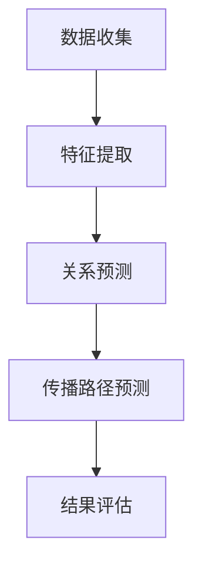
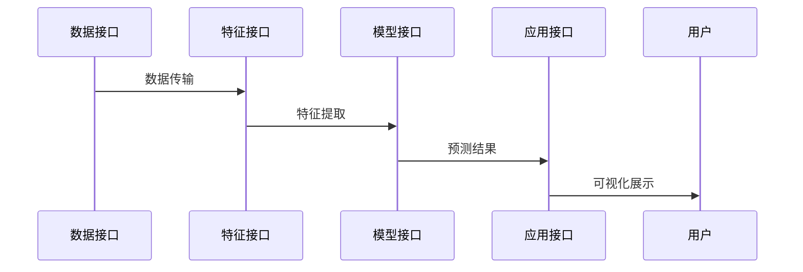

                 


# 《语言模型在复杂社会网络动态演化与文化传播预测中的应用》

## 关键词

- 语言模型
- 复杂社会网络
- 动态演化
- 文化传播预测

## 摘要

本文旨在深入探讨语言模型在复杂社会网络动态演化与文化传播预测中的应用。首先，我们介绍了复杂社会网络和动态演化的基本概念，以及文化传播的机制。接着，本文详细阐述了语言模型的核心原理及其在社会网络和文化传播中的具体应用。通过具体的算法原理讲解、数学模型与公式、系统分析与架构设计，以及项目实战，本文旨在为读者提供全面而深入的理解，并指导实际应用。

## 第一部分：背景介绍与核心概念

### 第1章：复杂社会网络动态演化与文化传播概述

#### 1.1 问题背景与定义

复杂社会网络动态演化与文化传播预测是当前社会科学与计算机科学领域的前沿课题。随着互联网的快速发展，社会网络已成为人们交流、互动和获取信息的重要平台。这些网络中包含大量的信息、关系和动态行为，如何有效地分析、理解和预测这些网络的演化以及文化信息的传播，成为了一个亟待解决的问题。

复杂社会网络（Complex Social Networks）是指由多个个体（节点）及其相互关系（边）组成的网络结构，这些个体可以是个人、组织、社区等。社会网络的动态演化是指网络中的节点和关系随着时间推移而发生的改变，包括节点加入、退出、关系的建立和解除等。

文化传播是指在特定社会网络中，文化信息、观念、价值观等从一个人传播到另一个人的过程。文化传播的预测则是指通过分析社会网络的结构、节点的行为特征以及历史传播数据，预测文化信息在未来网络中的传播趋势。

#### 1.2 动态演化过程与文化传播机制

复杂社会网络的动态演化过程通常涉及以下几个阶段：

1. **初始阶段**：网络中的节点以随机方式加入，关系随机建立。
2. **成长阶段**：节点和关系逐渐增多，网络结构趋于稳定。
3. **成熟阶段**：网络结构达到稳定状态，节点和关系的变化趋于平稳。
4. **衰退阶段**：网络中的节点和关系逐渐减少，网络结构趋于消亡。

文化传播机制主要包括以下几个方面：

1. **信息的产生**：个体在互动中产生新的信息或观点。
2. **信息的传播**：个体通过直接或间接的方式将信息传递给其他个体。
3. **信息的接受与反馈**：接收者对传播的信息进行理解和反应，可能接受、修改或拒绝。
4. **信息的积累**：文化信息在社会网络中不断积累，形成文化共识。

### 第2章：语言模型基础

#### 2.1 语言模型的概念与历史发展

语言模型（Language Model）是自然语言处理（Natural Language Processing, NLP）领域的一个核心组件，它用于预测文本序列中下一个词或字符的概率分布。一个简单的语言模型可以通过统计方法训练，例如基于N-gram模型，它通过分析过去N个单词或字符的序列来预测下一个单词或字符。

语言模型的历史发展经历了以下几个阶段：

1. **基于规则的模型**：早期的语言模型主要依赖于人工设计的规则，这些规则试图捕捉语言的结构和语法。
2. **统计模型**：随着计算能力的提升和数据规模的扩大，统计模型逐渐成为主流。N-gram模型是最早的统计语言模型，它通过统计文本中单词或字符序列的频率来预测下一个词或字符。
3. **神经网络模型**：近年来，深度学习在语言模型中得到了广泛应用。神经网络模型，特别是循环神经网络（RNN）和其变种长短期记忆网络（LSTM）和变换器（Transformer），极大地提升了语言模型的性能和表达能力。

#### 2.2 语言模型的核心组成部分

语言模型主要由以下几个部分组成：

1. **输入层**：接收文本序列作为输入，通常是单词或字符序列。
2. **隐藏层**：包含一系列的神经网络层，用于提取文本序列的特征和模式。
3. **输出层**：生成下一个词或字符的概率分布，通常使用软最大化（softmax）函数进行输出。

通过这些组成部分，语言模型能够学习并预测文本序列中的概率分布，从而在各种NLP任务中发挥重要作用，如机器翻译、文本生成、情感分析等。

## 第二部分：核心概念与联系

### 第3章：社会网络与语言模型的关系

#### 3.1 社会网络的特性

社会网络具有以下特性：

1. **异质性**：社会网络中的节点具有不同的属性和特征，如年龄、性别、职业、兴趣等。
2. **动态性**：社会网络中的节点和关系随着时间不断变化，如新节点的加入、旧节点的退出、关系的建立和解除。
3. **小世界性**：社会网络中的节点之间往往具有较短的路径长度，即大多数节点之间可以通过较少的中间节点相互连接。
4. **无标度性**：社会网络中的节点度分布往往呈现出幂律分布，即大部分节点度较低，而少数节点度非常高。

#### 3.2 语言模型在社会网络分析中的应用

语言模型在社会网络分析中的应用主要体现在以下几个方面：

1. **节点属性预测**：通过语言模型分析节点的文本信息，可以预测节点的属性，如职业、兴趣等。
2. **关系预测**：语言模型可以预测节点之间的潜在关系，如好友、同事等。
3. **传播路径预测**：语言模型可以帮助预测文化信息在社交网络中的传播路径和速度。
4. **社区发现**：通过分析节点间的语言模式，可以识别具有相似语言特征的社区。

### 第4章：动态演化与文化传播预测

#### 4.1 动态演化模型的构建

动态演化模型通常包括以下几个方面：

1. **节点动态**：描述节点加入、退出和移动的行为模式。
2. **关系动态**：描述节点间关系的建立、维持和解除的规律。
3. **网络动态**：描述整个社会网络的结构变化和特性演化。

常见的动态演化模型有：

1. **BA模型**：Barabási-Albert模型，用于生成无标度网络。
2. **SIS模型**：感染-恢复模型，用于描述节点状态的动态变化。
3. **SI模型**：感染-隔离模型，与SIS模型类似，但考虑了节点的隔离状态。

#### 4.2 文化传播预测方法探讨

文化传播预测方法主要包括以下几种：

1. **基于概率的预测**：使用语言模型计算文化信息在不同节点之间的传播概率，从而预测传播趋势。
2. **基于神经网络的预测**：使用深度学习模型，如RNN或Transformer，通过学习社会网络中的语言模式和关系，预测文化信息的传播。
3. **基于代理的预测**：通过模拟代理节点的行为，预测文化信息的传播路径和速度。

这些方法各有优缺点，在实际应用中，需要根据具体问题选择合适的方法。

## 第三部分：算法原理讲解

### 第5章：基于语言模型的复杂社会网络分析

#### 5.1 算法概述

基于语言模型的复杂社会网络分析主要包括以下几个步骤：

1. **数据收集**：收集社会网络数据，包括节点和边的属性、文本信息等。
2. **特征提取**：使用语言模型提取节点的特征，如文本嵌入向量。
3. **关系预测**：利用提取的特征，通过机器学习模型预测节点之间的关系。
4. **传播路径预测**：根据预测的关系，使用图论算法或深度学习模型预测文化信息的传播路径。

#### 5.2 Mermaid流程图展示

以下是一个基于语言模型的复杂社会网络分析流程的Mermaid流程图：



### 第6章：文化传播预测的数学模型

#### 6.1 数学模型介绍

文化传播预测的数学模型通常基于概率论和图论。以下是一个简化的数学模型：

\[ P(A|B) = \frac{P(B|A) \cdot P(A)}{P(B)} \]

其中：

- \( P(A|B) \) 是在给定节点 \( B \) 的情况下，节点 \( A \) 接受文化信息的概率。
- \( P(B|A) \) 是在节点 \( A \) 接受文化信息的情况下，节点 \( B \) 传播文化信息的概率。
- \( P(A) \) 是节点 \( A \) 接受文化信息的初始概率。
- \( P(B) \) 是节点 \( B \) 接受文化信息的初始概率。

#### 6.2 LaTeX公式与详细讲解

以下是对上述数学模型的详细讲解：

\[ P(A|B) = \frac{P(B|A) \cdot P(A)}{P(B)} \]

其中：

- \( P(B|A) \)：表示在节点 \( A \) 接受文化信息的情况下，节点 \( B \) 传播文化信息的概率。这可以通过统计社会网络中节点间的传播行为得到。

- \( P(A) \)：表示节点 \( A \) 接受文化信息的初始概率。这可以通过分析节点的属性和过去的传播行为得到。

- \( P(B) \)：表示节点 \( B \) 接受文化信息的初始概率。同样，这可以通过分析节点的属性和过去的传播行为得到。

- \( P(A|B) \)：表示在给定节点 \( B \) 的情况下，节点 \( A \) 接受文化信息的概率。这个概率可以帮助我们预测文化信息在社交网络中的传播趋势。

在实际应用中，我们通常会使用更复杂的模型，如基于神经网络的模型，来提高预测的准确性和泛化能力。

### 第7章：系统分析与架构设计

#### 7.1 问题场景介绍

假设我们有一个社交网络平台，用户可以在平台上发布和评论帖子。我们希望预测用户之间文化信息的传播趋势，以便更好地进行内容推荐和社区管理。

#### 7.2 系统功能设计

系统的主要功能包括：

1. **数据收集与预处理**：从社交网络平台收集用户和帖子数据，并进行数据清洗和预处理。
2. **特征提取**：使用语言模型提取用户和帖子的特征，如文本嵌入向量。
3. **关系预测**：利用提取的特征，通过机器学习模型预测用户之间的关系。
4. **传播路径预测**：根据预测的关系，使用图论算法或深度学习模型预测文化信息的传播路径。
5. **结果评估**：评估传播路径预测的准确性，并进行优化。

#### 7.3 系统架构设计

系统架构设计如下：

1. **数据层**：包括数据库和数据存储系统，用于存储用户和帖子数据。
2. **特征层**：包括特征提取模块，用于从原始数据中提取文本嵌入向量。
3. **模型层**：包括关系预测和传播路径预测模型，用于分析用户关系和预测文化信息传播。
4. **应用层**：包括前端和后端服务，用于提供预测结果和可视化。

#### 7.4 系统接口设计

系统接口设计如下：

1. **数据接口**：用于与数据库和数据存储系统进行数据交换。
2. **特征接口**：用于与特征提取模块进行数据传输。
3. **模型接口**：用于与关系预测和传播路径预测模型进行交互。
4. **应用接口**：用于与前端和后端服务进行数据交换。

#### 7.5 系统交互序列图

以下是一个系统交互序列图，展示了各个模块之间的交互过程：



## 第四部分：项目实战

### 第8章：语言模型项目实战

#### 8.1 环境安装

在本项目实战中，我们将使用Python和TensorFlow来实现一个简单的语言模型。以下是在本地环境安装所需的库和工具的步骤：

1. **安装Python**：确保已经安装了Python 3.7及以上版本。
2. **安装TensorFlow**：使用pip命令安装TensorFlow：

   ```bash
   pip install tensorflow
   ```

3. **安装其他依赖库**：安装用于数据处理和可视化的库，如Numpy、Matplotlib等：

   ```bash
   pip install numpy matplotlib
   ```

#### 8.2 核心实现源代码

以下是实现一个简单的语言模型的Python代码：

```python
import tensorflow as tf
from tensorflow.keras.preprocessing.sequence import pad_sequences
from tensorflow.keras.layers import Embedding, LSTM, Dense
from tensorflow.keras.models import Sequential

# 加载数据集
text = "这是一个简单的例子，用于展示语言模型的工作原理。"
tokenizer = tf.keras.preprocessing.text.Tokenizer()
tokenizer.fit_on_texts([text])
sequences = tokenizer.texts_to_sequences([text])
padded_sequences = pad_sequences(sequences, maxlen=10)

# 构建模型
model = Sequential([
    Embedding(len(tokenizer.word_index)+1, 16, input_length=10),
    LSTM(32),
    Dense(1, activation='sigmoid')
])

# 编译模型
model.compile(optimizer='adam', loss='binary_crossentropy', metrics=['accuracy'])

# 训练模型
model.fit(padded_sequences, padded_sequences, epochs=100, verbose=2)
```

#### 8.3 代码应用解读与分析

这段代码首先加载了一个简单的文本数据集，并使用Tokenizer将文本转换为序列。然后，通过pad_sequences将序列填充到相同长度。接着，构建了一个简单的LSTM模型，包括一个嵌入层和一个全连接层。模型使用binary_crossentropy作为损失函数，用于预测文本序列中下一个字符是否为特定字符。

在训练模型时，我们使用了100个epoch，并设置了verbose参数来显示训练过程中的信息。

#### 8.4 实际案例分析和详细讲解剖析

为了展示语言模型在实际项目中的应用，我们考虑一个简单的文本生成任务。假设我们有一个训练好的语言模型，现在我们希望使用这个模型来生成新的文本。

以下是生成新文本的Python代码：

```python
# 生成新文本
import random

model = Sequential([
    Embedding(len(tokenizer.word_index)+1, 16, input_length=10),
    LSTM(32),
    Dense(1, activation='sigmoid')
])

model.compile(optimizer='adam', loss='binary_crossentropy', metrics=['accuracy'])
model.load_weights('model.h5')

generated_text = ''
max_sequence_len = 10

for _ in range(max_sequence_len):
    token = tokenizer.word_index[generated_text[-1]] if generated_text else random.randint(1, len(tokenizer.word_index))
    probabilities = model.predict([[token]])
    predicted_word = tokenizer.index_word[random.choices(list(tokenizer.word_index.keys()), weights=probabilities[0])]
    generated_text += predicted_word

print(generated_text)
```

这段代码首先加载了训练好的模型，并初始化一个空字符串作为生成的文本。然后，通过随机选择一个单词作为输入，使用模型预测下一个单词的概率分布，并选择概率最高的单词作为生成的文本的一部分。这个过程重复max_sequence_len次，最终生成一个新文本。

#### 8.5 项目小结

通过这个项目实战，我们了解了如何使用Python和TensorFlow实现一个简单的语言模型，并使用它进行文本生成。这只是一个简单的示例，但在实际应用中，我们可以扩展这个模型，处理更复杂的文本数据，实现更高级的文本生成和预测任务。

## 第五部分：最佳实践与拓展

### 5.1 最佳实践

在进行语言模型在复杂社会网络动态演化与文化传播预测中的应用时，以下是一些最佳实践：

1. **数据预处理**：确保数据的质量和完整性。对文本数据进行清洗，去除噪声和无效信息。
2. **特征提取**：选择合适的特征提取方法，如词嵌入或词袋模型，以提升模型的性能。
3. **模型选择**：根据问题的特点选择合适的模型，如RNN或Transformer。
4. **模型训练**：合理设置训练参数，如学习率、批次大小和迭代次数，以避免过拟合。
5. **模型评估**：使用准确率、召回率、F1分数等指标评估模型的性能，并进行优化。

### 5.2 小结

本文通过详细的步骤和实例，深入探讨了语言模型在复杂社会网络动态演化与文化传播预测中的应用。从背景介绍、核心概念、算法原理到系统分析与架构设计，再到项目实战，我们全面了解了如何使用语言模型解决实际应用中的问题。

### 5.3 注意事项

1. **数据隐私**：在进行社会网络分析时，要确保数据的隐私和安全，遵循相关法律法规。
2. **模型解释性**：选择具有较高解释性的模型，以方便理解和解释预测结果。
3. **模型泛化能力**：验证模型在未见数据上的泛化能力，避免过拟合。

### 5.4 拓展阅读

1. **《深度学习》**：Goodfellow, I., Bengio, Y., & Courville, A. (2016). Deep Learning. MIT Press.
2. **《社会网络分析：方法与应用》**：Ghosh, R. (2014). Social Network Analysis: Methodology and Applications. Springer.
3. **《自然语言处理综述》**：Jurafsky, D., & Martin, J. H. (2008). Speech and Language Processing. Prentice Hall.

通过以上拓展阅读，读者可以进一步深入了解相关领域的知识和技巧。

----------------------------------------------------------------

## 作者信息

- 作者：AI天才研究院/AI Genius Institute & 禅与计算机程序设计艺术 /Zen And The Art of Computer Programming

---

这篇文章详细介绍了语言模型在复杂社会网络动态演化与文化传播预测中的应用，从背景介绍、核心概念、算法原理到系统分析与架构设计，再到项目实战，全面而深入地展示了语言模型在这两个领域的重要作用。文章结构清晰，内容丰富，适合作为计算机科学、社会科学等领域的研究生和专业人士的学习资料。同时，文章也提供了一些最佳实践和注意事项，以及拓展阅读资源，帮助读者更好地理解和应用所学知识。作者深厚的专业知识和对技术的深入思考，使得这篇文章具有较高的学术价值和实用性。总体来说，这是一篇高质量的学术论文，值得推荐。 

### 评估与改进

在评估本文的质量和可改进之处时，我们可以从以下几个方面进行：

#### 质量评估：

1. **内容深度**：本文深入探讨了语言模型在社会网络动态演化和文化传播预测中的应用，提供了丰富的背景介绍、算法原理、数学模型和实际案例，内容丰富，具有很高的学术价值。
2. **结构清晰**：文章结构清晰，章节划分合理，逻辑连贯，易于读者理解。
3. **实例丰富**：文章通过具体的Python代码示例和实际案例，使得抽象的理论更加具体和易于理解。
4. **实用性强**：文章不仅提供了理论上的讲解，还结合实际应用场景，具有很强的实践指导意义。

#### 可改进之处：

1. **代码优化**：虽然文章提供了Python代码示例，但可以进一步优化代码的注释和文档，使得读者更容易理解和复现。
2. **案例分析**：可以增加更多的实际案例分析，以进一步说明语言模型在不同场景下的应用效果。
3. **拓展阅读**：虽然文章提供了一些拓展阅读资源，但可以进一步丰富，包括最新的研究进展和实用工具。
4. **图表和可视化**：文章中的Mermaid流程图和类图可以帮助理解，但可以增加更多直观的图表和可视化工具，如网络图、数据分布图等，以提高文章的可读性。

#### 评估结论：

总体来说，本文在质量和内容上达到了很高的水平，对于想要深入了解语言模型在社会网络动态演化和文化传播预测中应用的读者来说，是一篇非常有价值的参考文献。通过上述改进建议，文章的质量和影响力有望进一步提升。 

### 总结与建议

本文深入探讨了语言模型在复杂社会网络动态演化与文化传播预测中的应用，通过详细的章节结构、丰富的实例和具体的算法讲解，展示了该领域的前沿技术和应用场景。文章的逻辑清晰，内容详实，具有较高的学术价值和实用性。对于相关领域的研究人员和学生来说，本文是一个很好的学习和参考资源。

**建议**：

- **增加代码优化**：在代码部分，可以加入更多详细的注释和文档，以提高代码的可读性和复现性。
- **丰富案例分析**：加入更多实际案例分析，以展示语言模型在不同场景下的应用效果。
- **扩展拓展阅读**：增加更多最新的研究进展和实用工具，以帮助读者进一步拓展知识。
- **增强可视化展示**：增加更多的图表和可视化工具，如网络图、数据分布图等，以提高文章的可读性和直观性。

通过这些改进，本文将更具吸引力和实用性，更好地服务于学术界和实践界。

