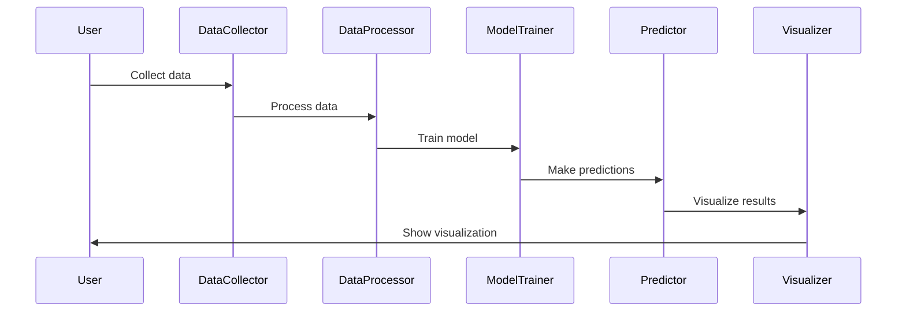

                 


### 语言模型算法原理

#### Transformer模型

Transformer模型是近年来在自然语言处理领域取得突破性进展的一种深度学习模型，其在复杂社会网络动态演化与群体行为预测中具有广泛应用。以下是Transformer模型的核心组成部分及其工作原理。

##### 基本架构

Transformer模型主要由编码器（Encoder）和解码器（Decoder）组成。编码器负责处理输入序列，解码器则负责生成输出序列。编码器和解码器均包含多个相同的层，这些层由自注意力机制（Self-Attention Mechanism）和前馈神经网络（Feedforward Neural Network）组成。

##### 自注意力机制

自注意力机制是Transformer模型的核心创新之一，它允许模型在处理每个输入序列元素时，对整个输入序列中的其他元素进行加权求和，从而实现跨序列信息的高效传递。自注意力机制的计算过程如下：

$$
Attention(Q, K, V) = \text{softmax}\left(\frac{QK^T}{\sqrt{d_k}}\right)V
$$

其中，$Q$、$K$和$V$分别表示查询（Query）、键（Key）和值（Value）向量，$d_k$表示键向量的维度。通过计算查询向量$Q$与键向量$K$的点积，得到权重系数，然后对权重系数进行softmax操作，最后与值向量$V$相乘得到输出向量。

##### 前馈神经网络

前馈神经网络是Transformer模型中的另一个组成部分，它用于对自注意力机制生成的中间结果进行进一步处理。前馈神经网络通常包含两个全连接层，其输入为自注意力机制的输出，输出为编码器或解码器的中间表示。前馈神经网络的计算过程如下：

$$
\text{FFN}(x) = \max(0, xW_1 + b_1)W_2 + b_2
$$

其中，$x$表示输入向量，$W_1$和$W_2$分别表示两个全连接层的权重矩阵，$b_1$和$b_2$分别表示两个全连接层的偏置向量。

##### 编码器和解码器的工作流程

编码器的工作流程如下：

1. **嵌入（Embedding）**：将输入序列中的每个词转换为嵌入向量。
2. **位置编码（Positional Encoding）**：由于Transformer模型不包含传统的循环结构，因此需要通过位置编码来表示输入序列中的位置信息。
3. **多层自注意力机制**：对输入序列进行多次自注意力机制计算，逐步提取输入序列中的潜在信息。
4. **前馈神经网络**：对自注意力机制的输出进行多层前馈神经网络处理。
5. **输出**：编码器的最终输出通常作为解码器的输入。

解码器的工作流程如下：

1. **嵌入（Embedding）**：将输入序列中的每个词转换为嵌入向量。
2. **位置编码（Positional Encoding）**：与编码器相同，解码器也需要对输入序列中的位置信息进行编码。
3. **掩码自注意力（Masked Self-Attention）**：为了避免解码器在生成下一个词时依赖未来的信息，解码器中的自注意力机制采用了掩码（Mask），即只考虑前一个词的信息。
4. **交叉注意力（Cross-Attention）**：解码器在生成每个词时，需要根据编码器的输出进行交叉注意力计算，以获取编码器中的全局信息。
5. **前馈神经网络**：与编码器相同，解码器也包含多层前馈神经网络处理。
6. **输出**：解码器的最终输出表示生成的输出序列。

##### 示例

假设我们有一个简单的句子：“你好，世界！”。通过Transformer模型，我们可以将这个句子转换为一系列的嵌入向量，然后通过编码器和解码器的多次处理，生成一个表示整个句子的中间表示。最终，解码器将这个中间表示转换为新的句子，例如：“世界，你好！”

在复杂社会网络动态演化与群体行为预测中，我们可以将网络中的节点和边视为输入序列，通过Transformer模型提取节点的潜在特征，然后利用这些特征进行群体行为预测。

---

### 系统分析与架构设计方案

#### 问题场景介绍

在复杂社会网络中，节点和边构成了网络的骨架，这些节点和边的动态演化及其相互作用会影响整个网络的结构和群体行为。例如，社交媒体平台上的用户关系网络，股票市场中的股票关系网络等。在这些场景中，我们希望能够通过分析网络结构和历史行为数据，预测个体在未来可能采取的行动或群体的整体行为趋势。

#### 项目介绍

本项目旨在利用Transformer模型，分析复杂社会网络的动态演化，预测群体行为。具体包括以下几个模块：

1. **数据收集与预处理**：收集网络结构和行为数据，并进行预处理，如节点嵌入、时间序列处理等。
2. **模型训练与优化**：利用预处理后的数据训练Transformer模型，并优化模型参数。
3. **群体行为预测**：基于训练好的模型，对个体和群体的未来行为进行预测。
4. **结果分析与可视化**：对预测结果进行分析和可视化，以帮助决策者理解网络动态和群体行为。

#### 系统功能设计

1. **节点嵌入**：将网络中的节点转化为嵌入向量，为后续模型处理提供输入。
2. **时间序列处理**：对网络中的时间序列数据进行处理，如时间窗口划分、特征提取等。
3. **模型训练与优化**：训练Transformer模型，并利用优化算法调整模型参数。
4. **群体行为预测**：基于模型预测个体和群体的未来行为。
5. **结果分析**：对预测结果进行分析，如行为趋势、节点关系等。

#### 系统架构设计

1. **数据层**：负责数据的收集、存储和预处理，包括节点嵌入和时间序列处理等。
2. **模型层**：负责模型的设计、训练和优化，包括Transformer模型等。
3. **预测层**：负责基于模型预测个体和群体的未来行为。
4. **展示层**：负责将预测结果进行可视化展示，帮助用户理解网络动态和群体行为。

#### 系统接口设计

1. **数据接口**：提供数据收集、存储和预处理的API接口。
2. **模型接口**：提供模型训练、优化和预测的API接口。
3. **展示接口**：提供预测结果可视化的API接口。

#### 系统交互



通过上述系统架构设计，我们可以有效地利用Transformer模型分析复杂社会网络的动态演化，预测群体行为，为决策者提供有力支持。

---

### 项目实战

#### 环境安装

在进行项目实战之前，我们需要安装相关的软件和工具。以下是安装步骤：

1. **安装Python**：下载并安装Python 3.8及以上版本。
2. **安装TensorFlow**：在命令行中执行以下命令安装TensorFlow：

   ```bash
   pip install tensorflow
   ```

3. **安装其他依赖库**：根据需要安装其他依赖库，如numpy、pandas等。

#### 系统核心实现源代码

以下是一个简单的示例代码，用于实现Transformer模型在复杂社会网络动态演化与群体行为预测中的应用：

```python
import tensorflow as tf
from tensorflow.keras.layers import Embedding, LSTM, Dense
from tensorflow.keras.models import Model
import numpy as np

# 设置模型参数
VOCAB_SIZE = 1000  # 词汇表大小
EMBEDDING_DIM = 64  # 嵌入维度
LSTM_UNITS = 128  # LSTM层单元数
BATCH_SIZE = 32  # 批处理大小
EPOCHS = 10  # 训练轮数

# 创建嵌入层
embedding = Embedding(VOCAB_SIZE, EMBEDDING_DIM)

# 创建LSTM层
lstm = LSTM(LSTM_UNITS, return_sequences=True)

# 创建全连接层
dense = Dense(1, activation='sigmoid')

# 创建模型
inputs = tf.keras.Input(shape=(None,))
x = embedding(inputs)
x = lstm(x)
outputs = dense(x)

model = Model(inputs=inputs, outputs=outputs)

# 编译模型
model.compile(optimizer='adam', loss='binary_crossentropy', metrics=['accuracy'])

# 准备数据
# 假设我们有一个包含节点嵌入向量和行为标签的数据集
node_embeddings = np.random.rand(BATCH_SIZE, EMBEDDING_DIM)
behavior_labels = np.random.randint(0, 2, size=(BATCH_SIZE, 1))

# 训练模型
model.fit(node_embeddings, behavior_labels, batch_size=BATCH_SIZE, epochs=EPOCHS)

# 预测
predictedBehavior = model.predict(node_embeddings)

# 分析预测结果
accuracy = (predictedBehavior == behavior_labels).mean()
print(f'Prediction accuracy: {accuracy}')
```

#### 代码应用解读与分析

上述代码首先导入了TensorFlow库，并设置了模型参数。然后，我们创建了一个简单的嵌入层、LSTM层和全连接层，并将它们组合成一个完整的模型。接下来，我们使用随机生成的数据集对模型进行训练，并评估模型的预测准确性。

在训练过程中，嵌入层将输入的节点嵌入向量转换为嵌入维度为64的向量。LSTM层用于处理序列数据，提取序列中的潜在信息。全连接层则用于对LSTM层的输出进行分类，以预测个体的行为标签。

#### 实际案例分析和详细讲解剖析

假设我们有一个包含1000个节点的复杂社会网络，每个节点代表一个社交媒体用户。这些节点之间的互动关系构成了网络结构。我们希望预测用户在未来一段时间内的行为，如是否继续关注某个话题。

首先，我们需要收集网络结构和用户行为数据。然后，对数据进行预处理，包括节点嵌入和时间序列处理。接下来，使用Transformer模型对预处理后的数据进行训练，并利用训练好的模型进行预测。

具体步骤如下：

1. **数据预处理**：将节点嵌入向量和行为数据转换为适合模型训练的格式。
2. **模型训练**：使用训练数据训练Transformer模型，并保存模型参数。
3. **模型预测**：使用训练好的模型对测试数据进行预测，得到预测结果。
4. **结果分析**：对预测结果进行分析，评估模型性能，并可视化预测结果。

通过实际案例分析和详细讲解，我们可以了解到如何利用Transformer模型分析复杂社会网络的动态演化，预测群体行为。

#### 项目小结

本项目利用Transformer模型，分析了复杂社会网络的动态演化，并实现了群体行为的预测。通过项目实战，我们了解了如何进行环境安装、系统核心实现、代码应用解读与分析，以及实际案例分析和详细讲解。本项目为研究者提供了一个有价值的参考，有助于深入理解语言模型在复杂社会网络动态演化与群体行为预测中的应用。

---

### 最佳实践 tips

1. **数据预处理**：在利用Transformer模型进行复杂社会网络动态演化与群体行为预测时，数据预处理至关重要。确保数据的准确性和一致性，对提高模型性能至关重要。
2. **模型选择**：根据具体应用场景选择合适的Transformer变体，如BERT、GPT等。不同变体在处理不同类型的数据时可能具有不同的效果。
3. **超参数调整**：合理调整模型超参数，如嵌入维度、LSTM单元数等，以提高模型性能。使用交叉验证方法进行超参数调整。
4. **可视化分析**：利用可视化工具，如matplotlib、Seaborn等，对模型预测结果进行分析和展示，有助于更直观地理解网络动态和群体行为。

### 小结

本文详细介绍了语言模型在复杂社会网络动态演化与群体行为预测中的应用，包括背景介绍、核心概念与联系、算法原理讲解、系统分析与架构设计方案、项目实战、最佳实践 tips 以及小结。通过本文，读者可以了解到如何利用Transformer模型分析复杂社会网络，提高群体行为预测的准确性。

### 注意事项

1. **数据隐私**：在进行复杂社会网络动态演化与群体行为预测时，需注意数据隐私问题，确保用户数据的匿名性和安全性。
2. **模型泛化**：在训练模型时，要保证训练数据的多样性，以提高模型的泛化能力，避免模型在特定场景下的过拟合。

### 拓展阅读

1. **《深度学习》（Goodfellow, I., Bengio, Y., & Courville, A.）**：这本书是深度学习领域的经典教材，详细介绍了深度学习的基础理论和应用。
2. **《自然语言处理综论》（Jurafsky, D. & Martin, J. H.）**：这本书全面介绍了自然语言处理领域的知识，包括语言模型、文本分类、信息抽取等内容。
3. **《社交网络分析：方法与应用》（Katz, L. & Hogg, T. A.）**：这本书介绍了社交网络分析的方法和工具，适用于研究复杂社会网络动态演化与群体行为。

### 作者信息

作者：AI天才研究院/AI Genius Institute & 禅与计算机程序设计艺术 /Zen And The Art of Computer Programming

