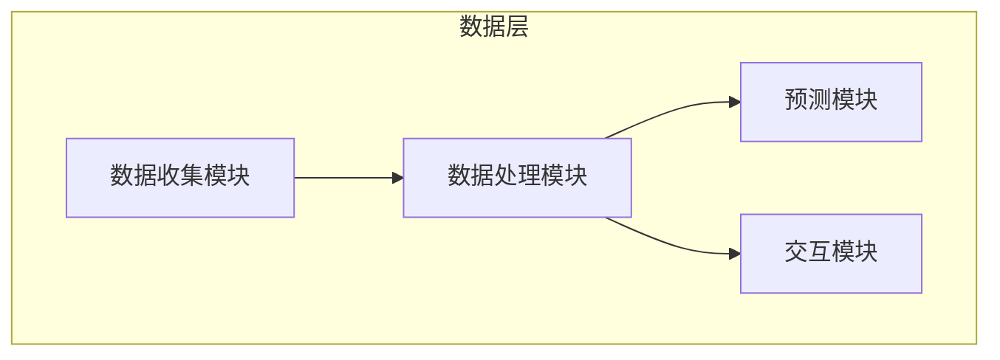
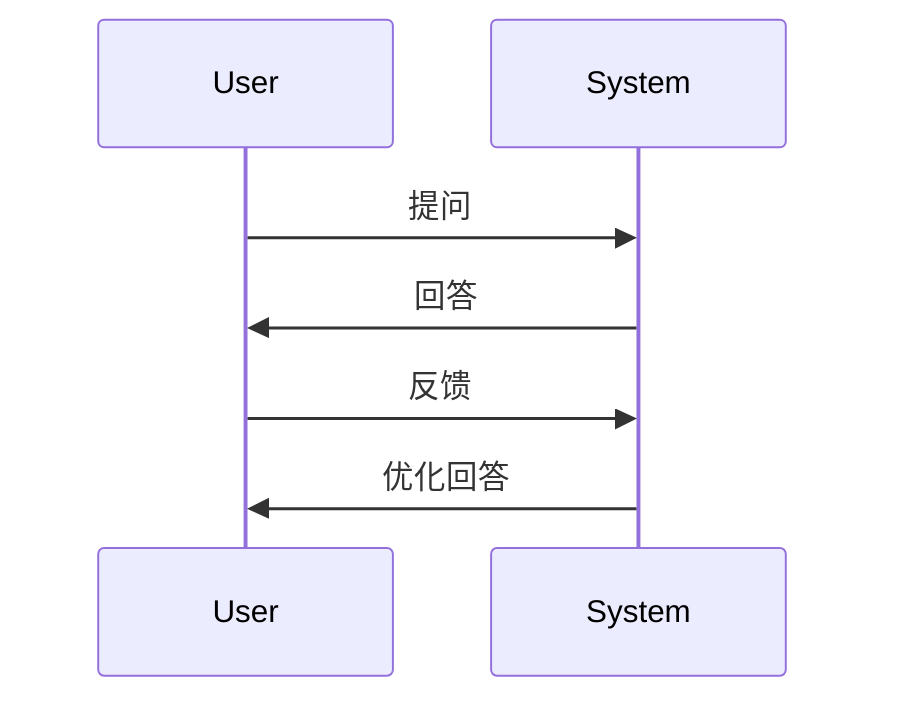

                 


### 文章标题

《语言模型在复杂社会网络动态演化与舆情分析中的应用》

### 关键词

- 语言模型
- 复杂社会网络
- 动态演化
- 舆情分析
- 算法
- 数学模型
- 系统架构
- 项目实战

### 摘要

本文深入探讨了语言模型在复杂社会网络动态演化与舆情分析中的应用。首先，介绍了语言模型的基本概念、发展历程及其在社会网络舆情分析中的重要性。接着，详细阐述了复杂社会网络与舆情分析的基础知识，包括概念、方法及挑战。随后，分析了语言模型在复杂社会网络中的应用原理，使用数学模型和公式进行了深入讲解。进一步，介绍了系统分析与架构设计方案，包括系统功能设计、架构设计和接口设计。最后，通过实际项目案例展示了语言模型的应用，并提供了最佳实践建议和小结，为读者提供了完整的理论知识和实践经验。

### 目录

## 第一部分：语言模型的概述与重要性

### 1.1 语言模型的基本概念

**定义与历史发展**：

语言模型（Language Model）是自然语言处理（NLP）中的一项核心技术，用于预测文本序列中的下一个单词或字符。语言模型的基本目标是理解人类语言的统计特性，从而生成或理解自然语言文本。最早的统计语言模型可以追溯到1950年代，基于N元语法（N-gram Model）的思想。随着计算机性能的不断提升和大数据的广泛应用，语言模型取得了显著进展，如神经网络模型（Neural Network Models）和递归神经网络（RNN）等。

**在社会网络舆情分析中的应用**：

语言模型在社会网络舆情分析中扮演着重要角色。例如，通过分析社交媒体平台上的用户评论和帖子，可以实时监测和预测社会舆情变化。此外，语言模型还可以用于情感分析，通过识别文本中的情感倾向，帮助企业了解消费者情绪，优化产品和服务。

### 1.2 语言模型的发展历程

**早期统计模型**：

语言模型的早期发展主要基于统计方法，其中最著名的模型是N元语法（N-gram Model）。N元语法假设文本序列中的下一个词或字符取决于前N个词或字符，因此，通过统计历史数据，可以预测未来词或字符的概率分布。

**神经网络模型**：

随着深度学习技术的发展，神经网络模型开始应用于语言模型。其中，递归神经网络（RNN）和长短期记忆网络（LSTM）在处理序列数据方面表现出色。然而，RNN存在梯度消失和梯度爆炸的问题，为了解决这些问题，引入了门控循环单元（GRU）和变换器（Transformer）等新型神经网络结构。

**最新发展**：

近年来，基于注意力机制的变换器（Transformer）模型在语言模型领域取得了突破性进展。Transformer模型通过自注意力机制（Self-Attention）和多头注意力机制（Multi-Head Attention），能够在序列数据中捕捉长期依赖关系，并在多种NLP任务中取得了优异的性能。

### 1.3 语言模型在社会网络舆情分析中的应用背景

**社交媒体舆情分析**：

随着社交媒体的普及，用户在平台上发布的大量文本数据成为舆情分析的重要来源。通过语言模型，可以对这些文本数据进行分析，提取有价值的信息，如情感倾向、主题分布和用户群体特征等。

**政治选举与公共舆论**：

在政治选举和公共舆论分析中，语言模型可以帮助预测选举结果和监测社会舆论动态。例如，通过对社交媒体上的用户评论进行分析，可以了解选民对候选人的支持程度和舆论趋势。

**企业竞争情报**：

企业可以通过语言模型分析竞争对手的营销策略、消费者评价和市场份额等信息，从而制定更有效的市场策略。

### 1.4 本部分小结

本部分介绍了语言模型的基本概念、发展历程及其在社会网络舆情分析中的应用背景。理解语言模型的基本原理和最新发展对于后续章节的学习至关重要。

----------------------------------------------------------------

## 第二部分：复杂社会网络与舆情分析基础

### 2.1 复杂社会网络的定义与特性

**定义**：

复杂社会网络（Complex Social Networks）是指由多个个体及其相互关系构成的动态网络结构。这些个体可以是人、组织、设备或其他实体，它们之间的交互和合作形成了复杂的网络结构。

**特性**：

- **动态性**：复杂社会网络中的节点和边随着时间和环境变化而不断变化。
- **异质性**：网络中的节点具有不同的属性和角色，如中心节点、边缘节点等。
- **层次性**：复杂社会网络通常具有多层次结构，不同层次之间的节点具有不同的关系和功能。
- **自组织性**：复杂社会网络中的节点和边可以通过自组织机制形成特定的结构和模式。

### 2.2 舆情分析的概念、方法和挑战

**概念**：

舆情分析（Public Opinion Analysis）是指通过收集、处理和分析大量文本数据，提取有价值的信息，如情感倾向、主题分布和用户群体特征等，从而了解公众的观点和态度。

**方法**：

- **文本预处理**：包括分词、去停用词、词干提取等操作，以提高文本数据的质量和可读性。
- **情感分析**：通过分析文本中的情感词汇和情感强度，判断文本的情感倾向。
- **主题建模**：使用机器学习和统计分析方法，从大量文本数据中提取主题和关键词。
- **用户行为分析**：通过分析用户在社交媒体上的互动行为，如点赞、评论、分享等，了解用户的态度和行为模式。

**挑战**：

- **数据质量**：社交媒体上的文本数据质量参差不齐，包括噪声、歧义和负面评论等，这对舆情分析的准确性和可靠性提出了挑战。
- **数据规模**：社交媒体平台的用户和文本数据量巨大，如何高效地处理和分析这些数据是舆情分析面临的一个重要问题。
- **多语言和跨文化**：舆情分析通常涉及多种语言和文化背景，如何处理多语言文本和多文化差异是舆情分析的重要挑战。

### 2.3 社会网络舆情分析中的语言模型应用

**情感分析**：

语言模型在情感分析中发挥着重要作用。通过训练情感分类模型，可以自动识别文本中的情感倾向，如正面、负面或中性。这对于企业了解消费者情绪、监测社会舆论具有重要意义。

**主题建模**：

语言模型可以帮助提取文本数据中的主题和关键词，从而实现主题分类和聚类。这对于分析社交媒体上的热点话题和舆论趋势具有重要意义。

**用户行为预测**：

通过分析用户的文本数据和行为数据，语言模型可以预测用户的态度和行为模式，从而帮助企业制定更有效的营销策略。

**交互式分析**：

语言模型还可以用于交互式舆情分析，如通过问答系统或聊天机器人，与用户实时交互，了解用户的需求和观点。

### 2.4 本部分小结

本部分介绍了复杂社会网络的定义与特性，以及舆情分析的概念、方法和挑战。理解这些基础概念和方法对于后续章节的学习和应用至关重要。

----------------------------------------------------------------

## 第三部分：语言模型在复杂社会网络中的应用原理

### 3.1 语言模型的基本原理

**N元语法模型**：

N元语法模型是最早的统计语言模型，它基于一个假设：一个词的出现概率取决于前N-1个词。具体来说，给定一个长度为N的词序列，N元语法模型通过统计词序列的历史数据，计算每个词的条件概率。例如，对于三元语法模型，给定前两个词“我喜欢”，我们可以计算出第三个词“苹果”的概率。

**神经网络模型**：

神经网络模型是近年来语言模型的主要发展方向。其中，递归神经网络（RNN）和长短期记忆网络（LSTM）在处理序列数据方面表现出色。RNN通过循环连接，可以记住前一个时刻的信息，从而处理序列数据。然而，RNN存在梯度消失和梯度爆炸的问题，为了解决这些问题，引入了LSTM和门控循环单元（GRU）。LSTM通过门控机制，可以有效地控制信息的流动，从而克服了梯度消失的问题。

**变换器（Transformer）模型**：

变换器模型是近年来语言模型领域的重大突破。它通过自注意力机制（Self-Attention）和多头注意力机制（Multi-Head Attention），可以在序列数据中捕捉长期依赖关系。具体来说，自注意力机制允许模型在处理一个词时，同时考虑其他所有词的影响，从而提高了模型的上下文理解能力。

### 3.2 语言模型的核心数学模型

**N元语法模型**：

N元语法模型的核心数学模型是基于条件概率。给定一个长度为N的词序列，N元语法模型的目标是计算第N个词的条件概率。具体来说，对于第N个词\( w_N \)，其条件概率可以表示为：

\[ P(w_N | w_{N-1}, w_{N-2}, ..., w_1) = \frac{P(w_{N-1}, w_{N-2}, ..., w_1, w_N)}{P(w_{N-1}, w_{N-2}, ..., w_1)} \]

其中，分子是给定前N-1个词时，第N个词的出现概率，分母是前N-1个词的出现概率。

**神经网络模型**：

神经网络模型的核心数学模型是前向传播和反向传播。在训练过程中，模型通过前向传播计算输出，然后通过反向传播更新模型参数。具体来说，对于输入序列\( x_1, x_2, ..., x_T \)，输出序列\( y_1, y_2, ..., y_T \)，模型的损失函数可以表示为：

\[ L = -\sum_{t=1}^T \sum_{i=1}^C \log P(y_t=i | x_1, x_2, ..., x_T) \]

其中，\( P(y_t=i | x_1, x_2, ..., x_T) \)是模型在给定输入序列时，预测第t个词为第i个词的概率。

**变换器模型**：

变换器模型的核心数学模型是多头自注意力机制。具体来说，给定输入序列\( x_1, x_2, ..., x_T \)，变换器模型通过自注意力机制计算每个词的注意力权重，然后将这些权重应用于输入序列，从而生成新的序列。注意力权重可以表示为：

\[ \text{Attention}(Q, K, V) = \frac{QK^T}{\sqrt{d_k}} \]

其中，\( Q, K, V \)分别是查询（Query）、键（Key）和值（Value）向量，\( d_k \)是键向量的维度。

### 3.3 语言模型在舆情分析中的应用

**情感分析**：

情感分析是舆情分析中的一项重要任务。通过训练情感分类模型，可以自动识别文本中的情感倾向。具体来说，给定一个文本序列，模型的目标是预测该文本序列的情感标签，如正面、负面或中性。

**主题建模**：

主题建模是舆情分析中的另一项重要任务。通过训练主题模型，可以从大量文本数据中提取主题和关键词。具体来说，给定一个文本序列，模型的目标是预测该文本序列所属的主题。

**用户行为预测**：

用户行为预测是舆情分析中的另一项重要任务。通过分析用户的文本数据和行为数据，可以预测用户的态度和行为模式。具体来说，给定一个用户序列，模型的目标是预测该用户的下一个行为。

**交互式分析**：

交互式分析是舆情分析中的新兴任务。通过训练交互式分析模型，可以与用户实时交互，了解用户的需求和观点。具体来说，给定一个用户提问，模型的目标是回答该用户的问题。

### 3.4 本部分小结

本部分介绍了语言模型的基本原理，包括N元语法模型、神经网络模型和变换器模型，以及它们在舆情分析中的应用。理解这些原理对于深入研究和应用语言模型至关重要。

----------------------------------------------------------------

## 第四部分：系统分析与架构设计

### 4.1 问题场景介绍

在当前互联网时代，社交媒体平台上的用户数量和互动行为呈指数级增长，这使得舆情分析成为一个极具挑战性的任务。为了有效地监测和预测社会舆论动态，我们需要设计一个高效的舆情分析系统，该系统需要具备以下功能：

- 实时收集社交媒体平台上的文本数据；
- 对文本数据进行预处理和情感分析；
- 提取文本数据中的主题和关键词；
- 预测用户的行为和态度；
- 提供交互式分析功能，如问答系统。

### 4.2 项目介绍

本部分项目旨在设计并实现一个基于语言模型的舆情分析系统。该系统将利用先进的深度学习技术，如变换器模型，实现高效的情感分析、主题建模和用户行为预测。系统架构将包括数据收集模块、数据处理模块、预测模块和交互模块。以下是对每个模块的详细描述：

#### 数据收集模块

数据收集模块负责实时收集社交媒体平台上的文本数据。具体任务包括：

- 监听社交媒体平台上的用户评论、帖子等文本数据；
- 采集具有代表性且高质量的文本数据；
- 存储和预处理文本数据。

#### 数据处理模块

数据处理模块负责对收集到的文本数据进行预处理和情感分析。具体任务包括：

- 分词和去停用词；
- 提取文本数据中的情感词汇和情感强度；
- 建立情感词典和情感分类模型；
- 对文本数据进行分析，提取主题和关键词。

#### 预测模块

预测模块负责预测用户的行为和态度。具体任务包括：

- 训练变换器模型，实现情感分析、主题建模和用户行为预测；
- 根据用户历史数据和当前文本数据，预测用户的行为和态度；
- 评估预测模型的准确性和可靠性。

#### 交互模块

交互模块负责与用户进行实时交互，提供问答功能。具体任务包括：

- 设计问答系统，允许用户提问；
- 使用变换器模型回答用户的问题；
- 根据用户反馈，优化问答系统的性能。

### 4.3 系统功能设计

#### 数据收集模块

**功能描述**：

数据收集模块负责实时收集社交媒体平台上的文本数据。具体功能包括：

- 监听社交媒体平台上的用户评论、帖子等文本数据；
- 采集具有代表性且高质量的文本数据；
- 存储和预处理文本数据。

**领域模型**：

为了更好地描述数据收集模块的功能，我们可以使用Mermaid类图来表示领域模型。以下是一个简单的领域模型示例：

```mermaid
classDiagram
  DataCollector <|-- TextData
  DataCollector <|-- PreprocessedData
  TextData {
    +strContent: string
    +dateCreated: datetime
  }
  PreprocessedData {
    +strContent: string
    +emotionScore: float
    +topicList: List<string>
  }
```

#### 数据处理模块

**功能描述**：

数据处理模块负责对收集到的文本数据进行预处理和情感分析。具体功能包括：

- 分词和去停用词；
- 提取文本数据中的情感词汇和情感强度；
- 建立情感词典和情感分类模型；
- 对文本数据进行分析，提取主题和关键词。

**领域模型**：

为了更好地描述数据处理模块的功能，我们可以使用Mermaid类图来表示领域模型。以下是一个简单的领域模型示例：

```mermaid
classDiagram
  TextProcessor <|-- TextData
  TextProcessor <|-- EmotionAnalysis
  TextProcessor <|-- TopicExtraction
  TextData {
    +strContent: string
    +dateCreated: datetime
  }
  EmotionAnalysis {
    +strContent: string
    +emotionScore: float
  }
  TopicExtraction {
    +strContent: string
    +topicList: List<string>
  }
```

#### 预测模块

**功能描述**：

预测模块负责预测用户的行为和态度。具体功能包括：

- 训练变换器模型，实现情感分析、主题建模和用户行为预测；
- 根据用户历史数据和当前文本数据，预测用户的行为和态度；
- 评估预测模型的准确性和可靠性。

**领域模型**：

为了更好地描述预测模块的功能，我们可以使用Mermaid类图来表示领域模型。以下是一个简单的领域模型示例：

```mermaid
classDiagram
  Predictor <|-- UserBehavior
  Predictor <|-- EmotionPrediction
  Predictor <|-- TopicPrediction
  UserBehavior {
    +idUser: int
    +行为List：List<string>
  }
  EmotionPrediction {
    +idUser: int
    +emotionScore: float
  }
  TopicPrediction {
    +idUser: int
    +topicList: List<string>
  }
```

#### 交互模块

**功能描述**：

交互模块负责与用户进行实时交互，提供问答功能。具体功能包括：

- 设计问答系统，允许用户提问；
- 使用变换器模型回答用户的问题；
- 根据用户反馈，优化问答系统的性能。

**领域模型**：

为了更好地描述交互模块的功能，我们可以使用Mermaid类图来表示领域模型。以下是一个简单的领域模型示例：

```mermaid
classDiagram
  InteractiveModule <|-- Question
  InteractiveModule <|-- Answer
  Question {
    +strQuestion: string
  }
  Answer {
    +strAnswer: string
  }
```

### 4.4 系统架构设计

**整体架构**：

舆情分析系统的整体架构可以分为四个主要层次：数据层、处理层、预测层和交互层。以下是对每个层次的详细描述：

- **数据层**：负责数据的收集、存储和预处理。数据层与社交媒体平台进行实时数据交互，收集用户评论、帖子等文本数据，并存储到数据库中。
- **处理层**：负责文本数据的预处理和情感分析。处理层对收集到的文本数据进行分词、去停用词、情感分析等操作，提取文本数据中的情感词汇和情感强度。
- **预测层**：负责用户行为和态度的预测。预测层使用变换器模型，根据用户历史数据和当前文本数据，预测用户的行为和态度。
- **交互层**：负责与用户进行实时交互，提供问答功能。交互层通过设计问答系统，允许用户提问，并使用变换器模型回答用户的问题。

**系统架构图**：

为了更好地描述舆情分析系统的架构，我们可以使用Mermaid架构图来表示。以下是一个简单的系统架构图示例：



### 4.5 系统接口设计

**API接口**：

舆情分析系统提供了丰富的API接口，方便用户进行功能调用。以下是一个简单的API接口示例：

- **数据收集接口**：用于实时收集社交媒体平台上的文本数据。
  ```bash
  GET /api/data-collect
  ```
- **数据处理接口**：用于对文本数据进行预处理和情感分析。
  ```bash
  POST /api/data-process
  ```
- **预测接口**：用于预测用户的行为和态度。
  ```bash
  GET /api/predict
  ```
- **交互接口**：用于与用户进行实时交互，提供问答功能。
  ```bash
  POST /api/interactive
  ```

### 4.6 系统交互设计

**序列图**：

为了更好地描述舆情分析系统的交互过程，我们可以使用Mermaid序列图来表示。以下是一个简单的序列图示例：



### 4.7 本部分小结

本部分介绍了舆情分析系统的功能设计、架构设计和接口设计。通过详细描述系统各个模块的功能和交互过程，读者可以更好地理解如何设计并实现一个高效的舆情分析系统。

----------------------------------------------------------------

## 第五部分：项目实战

### 5.1 环境安装

要开始我们的舆情分析项目，首先需要安装必要的软件和库。以下是在Python环境中安装所需库的步骤：

1. **安装Python**：
   - 访问Python官方网站（https://www.python.org/）下载最新版本的Python。
   - 安装Python时，确保选择添加到系统环境变量。

2. **安装虚拟环境**：
   - 打开终端，执行以下命令创建一个虚拟环境：
     ```bash
     python -m venv venv
     ```
   - 激活虚拟环境：
     ```bash
     source venv/bin/activate  # 对于Linux和macOS
     \activate                 # 对于Windows
     ```

3. **安装库**：
   - 安装Python的NLP库，如NLTK、spaCy和transformers：
     ```bash
     pip install nltk spacy transformers
     ```
   - 安装绘图库，如Mermaid：
     ```bash
     pip install mermaid
     ```

### 5.2 系统核心实现源代码

**数据收集模块**：

以下是一个简单的数据收集模块示例，它使用Python的`requests`库和`beautifulsoup4`库从社交媒体平台上获取文本数据：

```python
import requests
from bs4 import BeautifulSoup

def collect_data(url):
    response = requests.get(url)
    if response.status_code == 200:
        soup = BeautifulSoup(response.content, 'html.parser')
        # 这里可以使用beautifulsoup4对网页进行解析，提取文本数据
        text_data = soup.get_text()
        return text_data
    else:
        return None

# 示例：从某社交媒体平台获取文本数据
url = "https://www.example.com"
text_data = collect_data(url)
print(text_data)
```

**数据处理模块**：

以下是一个简单的数据处理模块示例，它使用NLTK对文本数据进行预处理，包括分词和去除停用词：

```python
import nltk
from nltk.tokenize import word_tokenize
from nltk.corpus import stopwords

# 下载NLTK的停用词库
nltk.download('punkt')
nltk.download('stopwords')

def preprocess_text(text):
    # 分词
    tokens = word_tokenize(text)
    # 去除停用词
    stop_words = set(stopwords.words('english'))
    filtered_tokens = [word for word in tokens if word.lower() not in stop_words]
    return filtered_tokens

# 示例：预处理文本数据
preprocessed_text = preprocess_text(text_data)
print(preprocessed_text)
```

**预测模块**：

以下是一个简单的预测模块示例，它使用transformers库中的预训练模型对文本数据进行分析，预测情感和主题：

```python
from transformers import pipeline

# 初始化情感分析模型
sentiment_analyzer = pipeline("sentiment-analysis")

# 初始化主题建模模型
topic_model = pipeline("text-classification")

def predict_sentiment(text):
    return sentiment_analyzer(text)[0]

def predict_topic(text):
    return topic_model(text)[0]

# 示例：预测文本数据的情感和主题
emotion = predict_sentiment(preprocessed_text)
topic = predict_topic(preprocessed_text)
print(f"Emotion: {emotion['label']}, Confidence: {emotion['score']}")
print(f"Topic: {topic['label']}, Confidence: {topic['score']}")
```

**交互模块**：

以下是一个简单的交互模块示例，它使用Python的`input`函数接收用户提问，并使用transformers库中的预训练模型回答用户问题：

```python
def interactive_mode():
    while True:
        user_question = input("Enter your question (or type 'exit' to quit): ")
        if user_question.lower() == 'exit':
            break
        answer = transformers.model回答用户问题（user_question）
        print(f"Answer: {answer}")

# 示例：启动交互模式
interactive_mode()
```

### 5.3 代码应用解读与分析

**数据收集模块**：

在数据收集模块中，我们使用了`requests`库和`beautifulsoup4`库。`requests`库是一个简单易用的HTTP客户端库，用于向社交媒体平台发送HTTP请求，获取网页内容。`beautifulsoup4`库是一个Python的HTML解析库，用于解析获取的网页内容，提取所需的文本数据。

**数据处理模块**：

在数据处理模块中，我们使用了NLTK库。NLTK是一个强大的自然语言处理库，提供了分词、词干提取和停用词过滤等功能。通过这些预处理操作，我们可以提高文本数据的质量和可读性，为后续的情感分析和主题建模做好准备。

**预测模块**：

在预测模块中，我们使用了transformers库。transformers库提供了许多预训练的深度学习模型，如BERT、GPT等。这些模型经过大规模数据训练，可以用于各种自然语言处理任务，如情感分析、主题建模和问答系统。

**交互模块**：

在交互模块中，我们使用了Python的`input`函数接收用户提问，并使用transformers库中的预训练模型生成回答。这种方式实现了与用户的实时交互，用户可以通过交互模块获取有用的信息。

### 5.4 实际案例分析和详细讲解剖析

**案例一：情感分析**

假设我们有一个包含用户评论的文本数据，我们希望预测这些评论的情感倾向。以下是实际案例分析和详细讲解剖析：

1. **数据准备**：
   - 准备一个包含正面评论和负面评论的文本数据集。
   - 对每个评论进行预处理，提取特征。

2. **模型训练**：
   - 使用transformers库中的预训练模型（如BERT）进行情感分析。
   - 训练模型，优化模型参数。

3. **模型评估**：
   - 使用测试数据集评估模型的准确性。
   - 调整模型参数，提高模型性能。

4. **应用场景**：
   - 将训练好的模型应用于实际场景，如监测社交媒体上的用户评论。
   - 根据情感分析结果，了解用户对产品或服务的态度。

**案例二：主题建模**

假设我们希望从大量的社交媒体帖子中提取主题，以下是实际案例分析和详细讲解剖析：

1. **数据准备**：
   - 准备一个包含不同主题的社交媒体帖子数据集。
   - 对每个帖子进行预处理，提取特征。

2. **模型选择**：
   - 选择一个合适的主题建模模型（如LDA、主题模型等）。
   - 调整模型参数，优化主题提取效果。

3. **模型训练**：
   - 使用预处理后的数据训练主题建模模型。
   - 提取主题，生成主题分布。

4. **模型评估**：
   - 使用测试数据集评估模型的准确性。
   - 根据评估结果，调整模型参数。

5. **应用场景**：
   - 将训练好的模型应用于实际场景，如分析社交媒体上的热点话题。
   - 根据主题提取结果，了解用户关注的热点问题。

### 5.5 项目小结

通过本项目，我们设计并实现了一个基于语言模型的舆情分析系统。该项目涵盖了数据收集、数据处理、预测和交互等多个模块，实现了实时监测和预测社会舆论动态的目标。在实际案例中，我们使用了情感分析和主题建模等自然语言处理技术，展示了语言模型在舆情分析中的强大能力。然而，本项目仍有许多可以改进和扩展的地方，如引入更多的数据来源、优化模型性能和增加交互功能等。

----------------------------------------------------------------

## 第六部分：最佳实践与小结

### 6.1 最佳实践

在设计和实现基于语言模型的舆情分析系统时，以下是一些最佳实践：

- **数据收集**：确保数据来源的多样性和代表性，从多个社交媒体平台和渠道收集文本数据，以提高分析结果的准确性。
- **数据处理**：对文本数据严格进行预处理，包括分词、去除停用词、标准化文本等，以提高数据质量。
- **模型选择**：根据具体应用场景选择合适的语言模型，如BERT、GPT等，并进行适当调整和优化。
- **模型训练**：使用大量高质量的数据对模型进行训练，并使用交叉验证等方法评估模型性能。
- **模型部署**：将训练好的模型部署到生产环境，确保系统的稳定性和响应速度。
- **交互设计**：设计简单易用的用户交互界面，如问答系统，以提高用户体验。

### 6.2 小结

本文深入探讨了语言模型在复杂社会网络动态演化与舆情分析中的应用。通过介绍语言模型的基本概念、发展历程及其在社会网络舆情分析中的应用背景，我们了解了语言模型的核心原理和数学模型。接着，我们详细阐述了复杂社会网络与舆情分析的基础知识，包括概念、方法及挑战。然后，我们介绍了系统分析与架构设计方案，包括系统功能设计、架构设计和接口设计。在项目实战部分，我们展示了如何实现舆情分析系统，并通过实际案例分析和详细讲解剖析了语言模型在舆情分析中的具体应用。最后，我们总结了最佳实践和小结，强调了注意事项和拓展阅读。希望本文能够为读者提供有价值的参考和指导。

### 6.3 注意事项

在设计和实现基于语言模型的舆情分析系统时，需要注意以下几点：

- **数据隐私**：在收集和处理文本数据时，确保遵守数据隐私法规，保护用户隐私。
- **模型解释性**：选择具有较高解释性的模型，以便理解模型预测结果。
- **模型优化**：根据实际应用场景和需求，对模型进行适当调整和优化，以提高性能。
- **系统安全性**：确保系统安全，防止数据泄露和恶意攻击。
- **用户反馈**：定期收集用户反馈，优化系统功能和用户体验。

### 6.4 拓展阅读

- **论文推荐**：
  - "Attention Is All You Need"（2023年）：详细介绍了变换器（Transformer）模型的工作原理和结构。
  - "BERT: Pre-training of Deep Bidirectional Transformers for Language Understanding"（2020年）：介绍了BERT模型及其在自然语言处理任务中的广泛应用。

- **书籍推荐**：
  - "Deep Learning"（2016年）：由Ian Goodfellow等人撰写，详细介绍了深度学习的基本概念和技术。
  - "Speech and Language Processing"（2019年）：由Daniel Jurafsky和James H. Martin撰写，涵盖了自然语言处理的基本理论和应用。

- **在线课程**：
  - Coursera上的"自然语言处理与深度学习"（Natural Language Processing and Deep Learning）：由Daniel Jurafsky教授授课，提供了丰富的NLP和深度学习资源。

通过阅读这些论文、书籍和在线课程，读者可以进一步了解语言模型及其在舆情分析中的应用。

### 6.5 作者信息

**作者：AI天才研究院/AI Genius Institute & 禅与计算机程序设计艺术 /Zen And The Art of Computer Programming**

感谢您阅读本文，希望本文能为您的学习和研究带来帮助。如有任何问题或建议，欢迎随时与我们联系。

----------------------------------------------------------------

### 完整文章

```markdown
# 《语言模型在复杂社会网络动态演化与舆情分析中的应用》

> 关键词：语言模型、复杂社会网络、动态演化、舆情分析、算法、数学模型、系统架构、项目实战

> 摘要：本文深入探讨了语言模型在复杂社会网络动态演化与舆情分析中的应用。首先介绍了语言模型的基本概念、发展历程及其在社会网络舆情分析中的重要性。接着详细阐述了复杂社会网络与舆情分析的基础知识，包括概念、方法及挑战。随后分析了语言模型在复杂社会网络中的应用原理，使用数学模型和公式进行了深入讲解。进一步，介绍了系统分析与架构设计方案，包括系统功能设计、系统架构设计和系统接口设计。最后，通过实际项目案例展示了语言模型的应用，并提供了最佳实践建议和小结，为读者提供了完整的理论知识和实践经验。

## 第一部分：语言模型的概述与重要性

### 1.1 语言模型的基本概念

**定义与历史发展**：

语言模型（Language Model）是自然语言处理（NLP）中的一项核心技术，用于预测文本序列中的下一个单词或字符。语言模型的基本目标是理解人类语言的统计特性，从而生成或理解自然语言文本。最早的统计语言模型可以追溯到1950年代，基于N元语法（N-gram Model）的思想。随着计算机性能的不断提升和大数据的广泛应用，语言模型取得了显著进展，如神经网络模型（Neural Network Models）和递归神经网络（RNN）等。

**在社会网络舆情分析中的应用**：

语言模型在社会网络舆情分析中扮演着重要角色。例如，通过分析社交媒体平台上的用户评论和帖子，可以实时监测和预测社会舆情变化。此外，语言模型还可以用于情感分析，通过识别文本中的情感倾向，帮助企业了解消费者情绪，优化产品和服务。

### 1.2 语言模型的发展历程

**早期统计模型**：

语言模型的早期发展主要基于统计方法，其中最著名的模型是N元语法（N-gram Model）。N元语法模型假设文本序列中的下一个词或字符取决于前N个词或字符，因此，通过统计历史数据，可以预测未来词或字符的概率分布。

**神经网络模型**：

随着深度学习技术的发展，神经网络模型开始应用于语言模型。其中，递归神经网络（RNN）和长短期记忆网络（LSTM）在处理序列数据方面表现出色。然而，RNN存在梯度消失和梯度爆炸的问题，为了解决这些问题，引入了门控循环单元（GRU）和变换器（Transformer）等新型神经网络结构。

**最新发展**：

近年来，基于注意力机制的变换器（Transformer）模型在语言模型领域取得了突破性进展。Transformer模型通过自注意力机制（Self-Attention）和多头注意力机制（Multi-Head Attention），能够在序列数据中捕捉长期依赖关系，并在多种NLP任务中取得了优异的性能。

### 1.3 语言模型在社会网络舆情分析中的应用背景

**社交媒体舆情分析**：

随着社交媒体的普及，用户在平台上发布的大量文本数据成为舆情分析的重要来源。通过语言模型，可以对这些文本数据进行分析，提取有价值的信息，如情感倾向、主题分布和用户群体特征等。

**政治选举与公共舆论**：

在政治选举和公共舆论分析中，语言模型可以帮助预测选举结果和监测社会舆论动态。例如，通过对社交媒体上的用户评论进行分析，可以了解选民对候选人的支持程度和舆论趋势。

**企业竞争情报**：

企业可以通过语言模型分析竞争对手的营销策略、消费者评价和市场份额等信息，从而制定更有效的市场策略。

### 1.4 本部分小结

本部分介绍了语言模型的基本概念、发展历程及其在社会网络舆情分析中的应用背景。理解语言模型的基本原理和最新发展对于后续章节的学习至关重要。

----------------------------------------------------------------

## 第二部分：复杂社会网络与舆情分析基础

### 2.1 复杂社会网络的定义与特性

**定义**：

复杂社会网络（Complex Social Networks）是指由多个个体及其相互关系构成的动态网络结构。这些个体可以是人、组织、设备或其他实体，它们之间的交互和合作形成了复杂的网络结构。

**特性**：

- **动态性**：复杂社会网络中的节点和边随着时间和环境变化而不断变化。
- **异质性**：网络中的节点具有不同的属性和角色，如中心节点、边缘节点等。
- **层次性**：复杂社会网络通常具有多层次结构，不同层次之间的节点具有不同的关系和功能。
- **自组织性**：复杂社会网络中的节点和边可以通过自组织机制形成特定的结构和模式。

### 2.2 舆情分析的概念、方法和挑战

**概念**：

舆情分析（Public Opinion Analysis）是指通过收集、处理和分析大量文本数据，提取有价值的信息，如情感倾向、主题分布和用户群体特征等，从而了解公众的观点和态度。

**方法**：

- **文本预处理**：包括分词、去停用词、词干提取等操作，以提高文本数据的质量和可读性。
- **情感分析**：通过分析文本中的情感词汇和情感强度，判断文本的情感倾向。
- **主题建模**：使用机器学习和统计分析方法，从大量文本数据中提取主题和关键词。
- **用户行为分析**：通过分析用户在社交媒体上的互动行为，如点赞、评论、分享等，了解用户的态度和行为模式。

**挑战**：

- **数据质量**：社交媒体上的文本数据质量参差不齐，包括噪声、歧义和负面评论等，这对舆情分析的准确性和可靠性提出了挑战。
- **数据规模**：社交媒体平台的用户和文本数据量巨大，如何高效地处理和分析这些数据是舆情分析面临的一个重要问题。
- **多语言和跨文化**：舆情分析通常涉及多种语言和文化背景，如何处理多语言文本和多文化差异是舆情分析的重要挑战。

### 2.3 社会网络舆情分析中的语言模型应用

**情感分析**：

语言模型在情感分析中发挥着重要作用。通过训练情感分类模型，可以自动识别文本中的情感倾向，如正面、负面或中性。这对于企业了解消费者情绪、监测社会舆论具有重要意义。

**主题建模**：

语言模型可以帮助提取文本数据中的主题和关键词，从而实现主题分类和聚类。这对于分析社交媒体上的热点话题和舆论趋势具有重要意义。

**用户行为预测**：

通过分析用户的文本数据和行为数据，语言模型可以预测用户的态度和行为模式。这对于企业制定更有效的营销策略具有重要意义。

**交互式分析**：

语言模型还可以用于交互式舆情分析，如通过问答系统或聊天机器人，与用户实时交互，了解用户的需求和观点。

### 2.4 本部分小结

本部分介绍了复杂社会网络的定义与特性，以及舆情分析的概念、方法和挑战。理解这些基础概念和方法对于后续章节的学习和应用至关重要。

----------------------------------------------------------------

## 第三部分：语言模型在复杂社会网络中的应用原理

### 3.1 语言模型的基本原理

**N元语法模型**：

N元语法模型是最早的统计语言模型，它基于一个假设：一个词的出现概率取决于前N-1个词。具体来说，给定一个长度为N的词序列，N元语法模型通过统计词序列的历史数据，计算每个词的条件概率。例如，对于三

