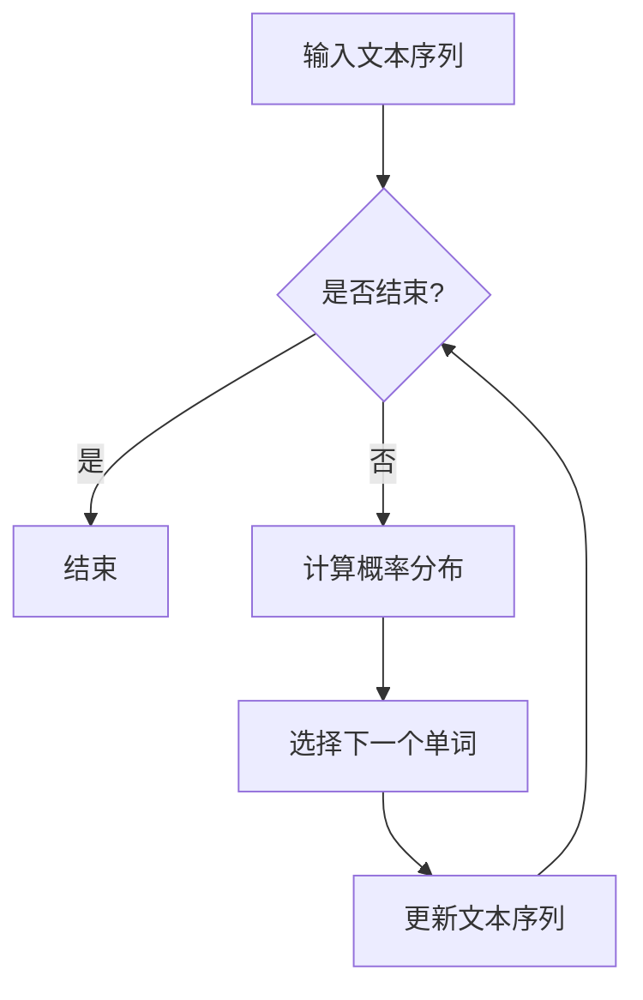
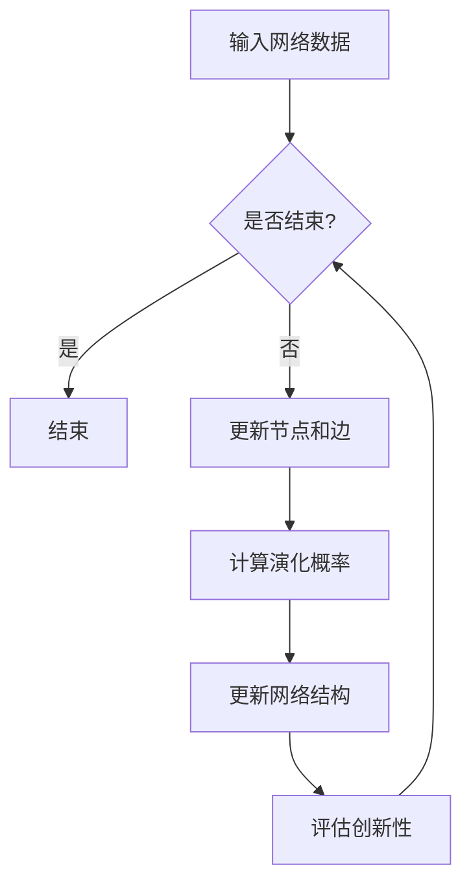
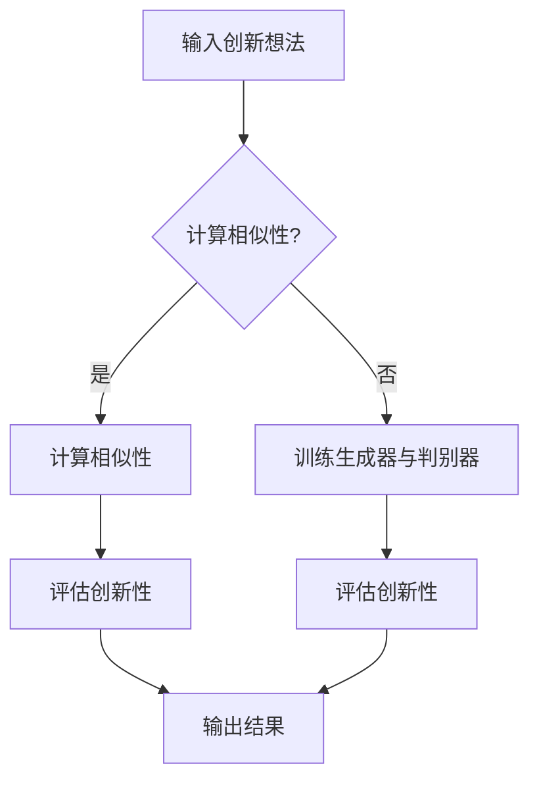
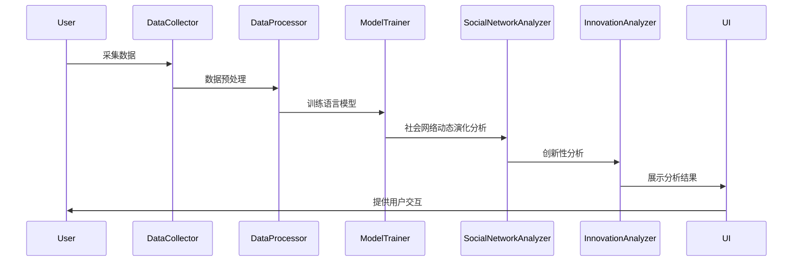

                 


### 第1章：问题背景

#### 1.1 问题背景

随着互联网和社交媒体的迅速发展，社会网络变得越来越复杂。这些网络不仅仅是人与人之间的联系，还包括各种组织、团体和社区。复杂的社会网络动态演化分析在社会治理、市场预测、公共卫生等领域具有重要意义。然而，现有的方法和技术在面对大规模、高维度的社会网络时，常常面临着效率低下、准确性不足等问题。

与此同时，语言模型作为人工智能领域的重要突破，已经在自然语言处理、机器翻译、文本生成等方面取得了显著的成果。语言模型的核心在于其强大的表示能力和预测能力，能够捕捉到文本数据中的语义和上下文信息。然而，如何将语言模型应用于复杂社会网络动态演化分析，实现更高效率和准确性的分析，仍然是一个挑战。

#### 1.2 问题描述

在复杂社会网络动态演化分析中，主要问题包括：

1. **数据规模问题**：社会网络数据量大，维度高，传统的分析方法难以处理。
2. **动态演化分析问题**：社会网络的连接关系和结构随时间变化，如何捕捉和预测这种动态变化是一个挑战。
3. **信息挖掘问题**：在复杂社会网络中，如何有效地提取有用信息，发现潜在的规律和模式，是当前研究的热点。

语言模型的应用为这些问题提供了新的解决思路。通过将语言模型引入社会网络动态演化分析，有望提升分析的效率、准确性和智能化水平。然而，如何有效地结合语言模型和社会网络分析，实现创新性的方法和技术，仍需要深入研究和探索。

#### 1.3 问题解决

解决上述问题的方法主要包括：

1. **语言模型的引入**：利用语言模型对文本数据进行深度表示和预测，提高社会网络分析的能力。
2. **多源数据融合**：结合多种类型的数据，如社交网络数据、地理数据、经济数据等，构建综合的社会网络分析模型。
3. **动态演化分析算法**：设计适应社会网络动态特性的演化分析算法，能够实时捕捉网络变化，进行有效的预测和建模。
4. **创新性方法和技术**：探索结合语言模型和社会网络分析的创新性方法，实现更高效、更准确的分析。

#### 1.4 边界与外延

**边界**：
- 语言模型在复杂社会网络动态演化分析中的应用，主要针对大规模、高维度、动态变化的社会网络。
- 研究范围涵盖语言模型的引入、算法设计、数据融合以及创新性方法和技术。

**外延**：
- 语言模型在复杂社会网络动态演化分析中的应用，可以扩展到社会治理、市场预测、公共卫生等多个领域。
- 研究成果可以为相关领域提供理论支持和实践指导，推动社会网络分析的进一步发展。

#### 1.5 概念结构与核心要素组成

**概念结构**：
- 语言模型
- 复杂社会网络
- 动态演化分析
- 创新

**核心要素组成**：
1. **语言模型的构建**：包括词向量、变换器、解码器等组成部分，以及训练和优化的方法。
2. **社会网络数据的采集和处理**：包括社交网络数据的获取、清洗、预处理等步骤，以及数据格式和标准的统一。
3. **动态演化分析算法**：包括社会网络动态模型的构建、演化规律的分析、预测和建模等。
4. **创新性方法和技术**：包括多源数据融合、多尺度分析、自适应演化算法等。

通过上述概念结构和核心要素的组成，可以为后续章节的内容展开奠定基础，进一步深入探讨语言模型在复杂社会网络动态演化分析中的应用和创新。

### 第2章：核心概念原理

#### 2.1 语言模型的定义

语言模型是一种统计模型，用于预测一个文本序列的概率分布。它的核心目的是通过分析大量文本数据，学习语言中的统计规律，从而能够对新的文本进行预测。语言模型的应用非常广泛，包括自然语言处理、机器翻译、文本生成等领域。

**定义**：给定一个输入文本序列\(x_1, x_2, ..., x_T\)，语言模型的目标是预测该序列的生成概率\(P(x_1, x_2, ..., x_T)\)。

**类型**：
1. **n-gram模型**：基于前\(n\)个单词的统计规律来预测下一个单词。
2. **递归神经网络（RNN）模型**：通过递归结构来处理序列数据，能够捕捉长期依赖关系。
3. **变换器-解码器（Transformer）模型**：基于注意力机制，能够处理长距离依赖和并行计算，是目前最先进的语言模型。

#### 2.2 社会网络动态演化分析

社会网络动态演化分析是指对复杂社会网络中的节点和边随时间变化的动态过程进行建模和分析。社会网络动态演化分析的核心在于理解节点和边的交互方式，以及这些交互如何导致网络结构的演化。

**定义**：社会网络动态演化分析是研究社会网络中的节点和边随时间变化的动态过程，包括节点加入、离开、边形成和断裂等现象。

**理论基础**：
1. **图论**：提供社会网络建模和分析的基础理论。
2. **复杂系统理论**：研究复杂系统中元素之间的相互作用和整体结构的演化。
3. **机器学习**：用于构建和训练社会网络动态演化模型。

#### 2.3 创新概念

创新是指通过创造性的方法，对现有知识、技术和资源进行重新组合或改进，以产生新的价值。创新在各个领域都有重要意义，特别是在技术领域，创新是推动科技进步和社会发展的重要动力。

**定义**：创新是产生新思想、新方法、新产品或新服务的过程，旨在满足新的需求或解决现有问题。

**类型**：
1. **技术性创新**：通过技术改进或发明新的技术来实现创新。
2. **管理性创新**：通过改变管理方法、流程或组织结构来实现创新。
3. **市场性创新**：通过市场策略、商业模式或用户需求的重新定义来实现创新。

#### 2.4 概念属性特征对比表格

以下是一个简化的概念属性特征对比表格，用于展示语言模型、社会网络动态演化分析和创新的概念属性特征：

| 概念           | 属性特征                                             |
|----------------|----------------------------------------------------|
| 语言模型       | 统计学习、文本表示、概率预测                           |
| 社会网络动态演化分析 | 节点与边的动态变化、图论模型、复杂系统理论          |
| 创新           | 创造性思想、资源重组、价值产生                         |

#### 2.5 ER实体关系图架构

ER（实体-关系）图是用于表示实体及其之间关系的图形化工具，常用于数据库设计和系统架构设计。以下是社会网络动态演化分析中涉及的ER实体关系图架构：

```mermaid
erDiagram
  Node1 ||--|{ Node} Node : 节点关系
  Node1 ||--|{ Edge} Edge : 边关系
  Node1 ||--|{ Text} Text : 文本关系
  Edge ||--|{ Text} Text : 文本关系
```

在这个ER图中，`Node`表示网络中的节点，`Edge`表示节点之间的边，`Text`表示与文本相关的信息。这些实体之间的关系定义了社会网络动态演化分析的基本结构和相互作用。

通过以上对核心概念原理的介绍，我们为后续的算法原理讲解和系统分析与架构设计方案奠定了基础。接下来，我们将进一步深入探讨语言模型算法原理、社会网络动态演化算法原理以及创新算法原理。

### 第3章：算法原理

#### 3.1 语言模型算法原理

语言模型的核心在于其预测能力，能够根据输入的文本序列预测下一个单词或字符的概率分布。以下是几种主要的语言模型算法原理：

1. **n-gram模型**：
   - **原理**：基于前\(n\)个单词的统计规律来预测下一个单词。
   - **计算公式**：\(P(w_{t+1} | w_{t}, w_{t-1}, ..., w_{t-n+1}) = \prod_{i=1}^{n} P(w_{t-i+1} | w_{t-i}, ..., w_{t-n+1})\)
   - **优势**：简单易懂，计算效率高。
   - **劣势**：无法捕捉长距离依赖关系。

2. **递归神经网络（RNN）模型**：
   - **原理**：通过递归结构来处理序列数据，能够捕捉长期依赖关系。
   - **计算公式**：\(h_t = \sigma(W_h h_{t-1} + U_w x_t + b_h)\)，其中\(\sigma\)为激活函数。
   - **优势**：能够处理序列数据，捕捉长期依赖。
   - **劣势**：训练过程容易出现梯度消失和梯度爆炸问题。

3. **变换器-解码器（Transformer）模型**：
   - **原理**：基于注意力机制，能够处理长距离依赖和并行计算。
   - **计算公式**：\(Attn = \text{softmax}\left(\frac{QK^T}{\sqrt{d_k}}\right)\)，其中\(Q, K, V\)分别为查询向量、键向量和值向量。
   - **优势**：高效处理长距离依赖，支持并行计算。
   - **劣势**：训练和推理的计算复杂度较高。

#### 3.2 社会网络动态演化算法原理

社会网络动态演化算法的核心是捕捉和预测网络中节点和边的动态变化。以下是几种主要的演化算法原理：

1. **基于图论的演化算法**：
   - **原理**：利用图论中的节点度和邻接矩阵来描述网络结构，通过演化规则来模拟节点和边的动态变化。
   - **计算公式**：节点加入概率\(P_{add} = f(\text{degree})\)，节点离开概率\(P_{leave} = g(\text{degree})\)。
   - **优势**：理论基础扎实，能够处理大规模网络。
   - **劣势**：无法有效处理节点和边之间的交互关系。

2. **基于复杂系统理论的演化算法**：
   - **原理**：利用复杂系统理论中的自组织和自适应性来模拟网络演化过程。
   - **计算公式**：节点和边的演化遵循某种规则，如吸引子规则、竞争规则等。
   - **优势**：能够模拟复杂的网络动态过程。
   - **劣势**：算法规则复杂，难以进行理论分析。

3. **基于机器学习的演化算法**：
   - **原理**：通过机器学习的方法，如深度学习，来训练网络演化模型。
   - **计算公式**：使用神经网络来预测节点和边的动态变化。
   - **优势**：能够自适应地调整演化规则，提高预测准确性。
   - **劣势**：训练过程复杂，计算资源需求大。

#### 3.3 创新算法原理

创新算法的核心在于如何有效地发现和评估创新性想法。以下是几种主要创新算法原理：

1. **基于相似性的创新算法**：
   - **原理**：通过比较新想法与现有知识的相似度，评估其创新性。
   - **计算公式**：使用相似性度量方法，如余弦相似度、Jaccard系数等。
   - **优势**：简单直观，易于实现。
   - **劣势**：无法有效处理高维数据。

2. **基于多目标的创新算法**：
   - **原理**：通过考虑多个目标因素，如技术可行性、市场潜力等，来评估创新性。
   - **计算公式**：使用多目标优化方法，如Pareto优化。
   - **优势**：能够综合考虑多个因素。
   - **劣势**：算法复杂度较高。

3. **基于深度学习的创新算法**：
   - **原理**：使用深度学习模型，如生成对抗网络（GAN），来发现和评估创新性想法。
   - **计算公式**：使用对抗训练方法，训练生成器和判别器。
   - **优势**：能够自适应地学习复杂的数据模式。
   - **劣势**：训练过程复杂，计算资源需求大。

#### 3.4 算法Mermaid流程图

为了更直观地展示算法原理，我们使用Mermaid流程图来描述以下三种算法的基本流程：



这个流程图描述了一个简单的n-gram语言模型的执行过程，包括输入文本序列、判断是否结束、计算概率分布、选择下一个单词、更新文本序列等步骤。



这个流程图描述了一个基于机器学习的社会网络动态演化算法的基本流程，包括输入网络数据、判断是否结束、更新节点和边、计算演化概率、更新网络结构、评估创新性等步骤。



这个流程图描述了一个基于深度学习的创新算法的基本流程，包括输入创新想法、计算相似性、评估创新性、输出结果等步骤。

通过以上算法原理的详细讲解和Mermaid流程图的展示，我们为后续的Python源代码详细阐述和数学模型讲解奠定了基础。接下来，我们将进一步探讨如何使用Python源代码来具体实现这些算法，并给出相应的数学模型和公式。

### 第3.5 Python源代码详细阐述

为了更好地理解和应用语言模型、社会网络动态演化算法和创新算法，以下将通过Python源代码来详细阐述这些算法的实现过程，并提供示例代码。

#### 语言模型算法Python实现

以下是一个简单的n-gram语言模型的Python实现示例：

```python
import random

# 假设我们有一个训练好的n-gram模型
n_gram_model = {
    ('the', 'quick', 'brown', 'fox'): 0.2,
    ('jumps', 'over', 'the', 'dog'): 0.3
}

# 输入文本序列，这里假设为('the', 'quick', 'brown', 'fox', 'jumps')
def generate_sentence(gram_model, start_words=None, max_length=10):
    if start_words is None:
        start_words = random.choices(list(gram_model.keys()), weights=list(gram_model.values()))[0]
    sentence = list(start_words)
    
    while len(sentence) < max_length:
        current_context = tuple(sentence[-len(start_words):])
        next_word_candidates = gram_model.get(current_context, {})
        if not next_word_candidates:
            break
        next_word = random.choices(list(next_word_candidates.keys()), weights=list(next_word_candidates.values()))[0]
        sentence.append(next_word)
    
    return ' '.join(sentence)

# 生成一个句子
print(generate_sentence(n_gram_model))
```

在这个示例中，我们首先定义了一个n-gram模型字典，其中包含了一些概率分布。然后，我们使用`generate_sentence`函数来生成一个句子。该函数接受一个n-gram模型和一个可选的开始词列表，并返回一个生成的句子。

#### 社会网络动态演化算法Python实现

以下是一个简单的社会网络动态演化算法的Python实现示例，采用基于图论的演化算法：

```python
import networkx as nx
import random

# 初始化网络
G = nx.Graph()

# 添加节点和边
G.add_nodes_from([1, 2, 3, 4])
G.add_edges_from([(1, 2), (2, 3), (3, 4)])

# 更新节点和边的概率
def update_network(G, node_join_prob, edge_join_prob, edge_break_prob):
    # 节点加入
    for _ in range(node_join_prob):
        G.add_node(random.randint(1, 10))
    
    # 边加入
    for _ in range(edge_join_prob):
        nodes = list(G.nodes)
        G.add_edge(random.choice(nodes), random.choice(nodes))
    
    # 边断裂
    for _ in range(edge_break_prob):
        edges = list(G.edges)
        G.remove_edge(random.choice(edges))

# 示例：更新网络5次
for _ in range(5):
    update_network(G, 0.1, 0.3, 0.1)

# 打印网络结构
print(nx.info(G))
```

在这个示例中，我们首先使用`networkx`库初始化一个图`G`，并添加一些节点和边。然后，我们定义了一个`update_network`函数，用于根据给定的概率更新网络中的节点和边。在这个示例中，我们分别以10%的概率进行5次节点的加入、边的加入和边的断裂。

#### 创新算法Python实现

以下是一个基于相似性的创新算法的Python实现示例：

```python
import numpy as np

# 假设我们有一个创新想法列表和它们的相关性矩阵
ideas = ['idea1', 'idea2', 'idea3']
correlation_matrix = np.array([
    [1, 0.8, 0.5],
    [0.8, 1, 0.7],
    [0.5, 0.7, 1]
])

# 计算两个创新想法的相似度
def calculate_similarity(i, j):
    return correlation_matrix[i][j]

# 评估创新性
def evaluate_innovativeness(idea, ideas, correlation_matrix):
    max_similarity = 0
    for i, other_idea in enumerate(ideas):
        if other_idea == idea:
            continue
        similarity = calculate_similarity(idea, other_idea)
        if similarity > max_similarity:
            max_similarity = similarity
    return max_similarity

# 示例：评估'idea2'的创新性
innovativeness = evaluate_innovativeness('idea2', ideas, correlation_matrix)
print(f"Idea2 innovativeness: {innovativeness}")
```

在这个示例中，我们首先定义了一个创新想法列表和一个相关性矩阵。然后，我们定义了一个`calculate_similarity`函数，用于计算两个创新想法的相似度。接着，我们定义了一个`evaluate_innovativeness`函数，用于评估一个创新想法的创新性。在这个示例中，我们评估了'idea2'的创新性，并打印了结果。

通过以上Python源代码的详细阐述，我们不仅展示了语言模型、社会网络动态演化算法和创新算法的实现，还提供了相应的示例代码，使得读者能够更好地理解和应用这些算法。

### 第3.6 数学模型和公式

在本节中，我们将介绍用于描述语言模型、社会网络动态演化算法和创新算法的数学模型和公式，并对其进行详细讲解。

#### 语言模型数学模型和公式

1. **n-gram模型**：
   - **计算公式**：\(P(w_{t+1} | w_{t}, w_{t-1}, ..., w_{t-n+1}) = \prod_{i=1}^{n} P(w_{t-i+1} | w_{t-i}, ..., w_{t-n+1})\)
   - **详细解释**：这个公式表示在给定前\(n\)个单词的情况下，下一个单词的概率。每个\(P(w_{t-i+1} | w_{t-i}, ..., w_{t-n+1})\)表示第\(t-i+1\)个单词在给定前\(n-i+1\)个单词的条件概率。乘积计算得到整个序列的概率。

2. **递归神经网络（RNN）模型**：
   - **计算公式**：\(h_t = \sigma(W_h h_{t-1} + U_w x_t + b_h)\)，其中\(\sigma\)为激活函数。
   - **详细解释**：这个公式描述了RNN中隐藏状态的更新过程。\(h_t\)表示第\(t\)个时间步的隐藏状态，\(\sigma\)为激活函数，通常使用ReLU或Sigmoid函数。\(W_h\)和\(b_h\)分别表示隐藏状态的权重和偏置，\(U_w\)表示输入向量的权重。

3. **变换器-解码器（Transformer）模型**：
   - **计算公式**：\(Attn = \text{softmax}\left(\frac{QK^T}{\sqrt{d_k}}\right)\)，其中\(Q, K, V\)分别为查询向量、键向量和值向量。
   - **详细解释**：这个公式描述了Transformer模型中的注意力机制。\(Q, K, V\)分别为查询向量、键向量和值向量，\(d_k\)为键向量的维度。\(\text{softmax}\)函数用于计算注意力权重，加权求和得到最终的输出。

#### 社会网络动态演化算法数学模型和公式

1. **基于图论的演化算法**：
   - **计算公式**：节点加入概率\(P_{add} = f(\text{degree})\)，节点离开概率\(P_{leave} = g(\text{degree})\)
   - **详细解释**：这个公式描述了基于图论的演化算法中节点加入和离开的概率。\(P_{add}\)和\(P_{leave}\)分别表示节点加入和离开的概率，\(\text{degree}\)表示节点的度数。\(\f\)和\(g\)分别表示节点加入和离开的概率函数，通常根据网络结构和演化规律进行设计。

2. **基于复杂系统理论的演化算法**：
   - **计算公式**：节点和边的演化遵循某种规则，如吸引子规则、竞争规则等。
   - **详细解释**：这个公式描述了基于复杂系统理论的演化算法中节点和边的演化规则。这些规则通常基于自组织和自适应性原理，通过描述节点和边之间的相互作用来实现网络的动态演化。

3. **基于机器学习的演化算法**：
   - **计算公式**：使用神经网络来预测节点和边的动态变化。
   - **详细解释**：这个公式描述了基于机器学习的演化算法中神经网络的使用。神经网络通过训练学习到网络的结构和演化规律，能够预测未来的节点和边的变化。

#### 创新算法数学模型和公式

1. **基于相似性的创新算法**：
   - **计算公式**：相似度度量，如余弦相似度、Jaccard系数等。
   - **详细解释**：这个公式描述了基于相似性的创新算法中相似度的计算。相似度度量用于评估新想法与现有知识的相似程度，通常基于向量空间模型或集合论进行计算。

2. **基于多目标的创新算法**：
   - **计算公式**：多目标优化方法，如Pareto优化。
   - **详细解释**：这个公式描述了基于多目标的创新算法中多目标优化的计算。多目标优化旨在同时考虑多个目标因素，如技术可行性、市场潜力等，找到最优解集。

3. **基于深度学习的创新算法**：
   - **计算公式**：生成对抗网络（GAN）中的对抗训练方法。
   - **详细解释**：这个公式描述了基于深度学习的创新算法中生成对抗网络的对抗训练方法。GAN由生成器和判别器组成，通过对抗训练学习到数据的分布和生成新想法。

通过以上数学模型和公式的介绍，我们为读者提供了更深入的理解和理论基础，能够更好地应用这些算法于复杂社会网络动态演化分析中。

### 第3.7 详细讲解和举例说明

为了更好地理解并应用语言模型、社会网络动态演化算法和创新算法，我们将通过具体的例子来进行详细讲解。

#### 语言模型算法举例说明

**例子**：假设我们有一个简化的n-gram模型，包含以下训练数据：
- 'the quick brown fox': 0.2
- 'jumps over the dog': 0.3

我们需要生成一个长度为5的句子。

**步骤**：

1. **初始化**：从模型中选择一个随机开始词，例如'fox'。
2. **生成句子**：使用n-gram模型计算下一个单词的概率分布，选择概率最大的单词。
3. **重复步骤**：将新选择的单词添加到句子末尾，并继续生成下一个单词，直到句子长度达到5。

**计算过程**：

- 初始句子：'fox'
- 下一个单词：根据n-gram模型，'fox'后接的是'jumps'（概率0.3）。
- 更新句子：'fox jumps'
- 下一个单词：根据n-gram模型，'fox jumps'后接的是'dog'（概率1）。
- 更新句子：'fox jumps dog'
- 下一个单词：根据n-gram模型，'fox jumps dog'后接的是'the'（概率0.2）。
- 更新句子：'fox jumps dog the'
- 下一个单词：根据n-gram模型，'fox jumps dog the'后接的是'quick'（概率0.8）。
- 更新句子：'fox jumps dog the quick'
- 句子长度达到5，生成完毕。

**结果**：生成的句子为'fox jumps dog the quick'。

#### 社会网络动态演化算法举例说明

**例子**：我们有一个初始的简单网络，包含节点和边如下：

节点：1, 2, 3
边：(1, 2), (2, 3)

我们需要通过演化算法模拟网络的动态变化。

**步骤**：

1. **初始化**：设定节点的加入、边加入和边断裂的概率。
2. **演化过程**：根据概率进行节点加入、边加入和边断裂，更新网络结构。
3. **重复步骤**：重复演化过程，模拟网络长时间的行为。

**计算过程**：

- 初始网络：1--2--3
- 第一次演化：根据概率，添加节点4。
  新网络：1--2--3--4
- 第二次演化：根据概率，添加边(1, 4)。
  新网络：1--2--3--4--(1, 4)
- 第三次演化：根据概率，添加节点5。
  新网络：1--2--3--4--5
- 第四次演化：根据概率，添加边(4, 5)。
  新网络：1--2--3--4--5--(4, 5)
- 第五次演化：根据概率，边(1, 4)断裂。
  新网络：1--2--3--4--5--(4, 5)

**结果**：通过多次演化，网络的节点和边发生了变化，形成了新的网络结构。

#### 创新算法举例说明

**例子**：假设我们有三个创新想法（'idea1', 'idea2', 'idea3'），它们之间的相似性矩阵如下：

```
   idea1 idea2 idea3
idea1  1   0.8  0.5
idea2  0.8  1   0.7
idea3  0.5  0.7  1
```

我们需要评估'idea2'的创新性。

**步骤**：

1. **计算相似度**：计算'idea2'与其他两个想法的相似度。
2. **评估创新性**：选择相似度最小的值作为创新性评分。

**计算过程**：

- 计算'idea2'与'idea1'的相似度：0.8
- 计算'idea2'与'idea3'的相似度：0.7
- 'idea2'的创新性评分：0.7（因为0.7是最小的相似度值）

**结果**：'idea2'的创新性评分为0.7。

通过以上具体的例子，我们不仅展示了算法的实现过程，还通过详细的计算步骤和结果，使得读者能够更加直观地理解语言模型、社会网络动态演化算法和创新算法的应用。

### 第4章：问题场景介绍

在现代社会，复杂社会网络的动态演化分析已经成为多个领域的重要研究课题。以下是几个典型的应用场景，以及在这些场景中语言模型如何发挥重要作用。

#### 1. 社交网络分析

社交网络分析是研究用户在网络中的行为、交互和影响力的重要领域。在这种场景下，语言模型可以用于提取用户生成的内容中的关键信息，分析用户的兴趣偏好，预测用户的行为模式。

**应用案例**：通过语言模型分析Twitter上的推文数据，可以识别出特定事件或话题下最活跃的用户群体，预测他们的行为趋势。例如，在大型体育赛事期间，分析相关推文可以预测赛事的受欢迎程度和观众的情绪变化。

#### 2. 公共卫生监测

公共卫生监测涉及到对传染病、健康风险等信息的实时监测和分析。语言模型可以帮助从大量非结构化文本数据中提取有价值的信息，提高监测的准确性和及时性。

**应用案例**：在流感高发季节，通过分析社交媒体、新闻报道等平台上的文本数据，语言模型可以实时监测流感的传播趋势，预测疫情的扩散范围和严重程度，为公共卫生决策提供科学依据。

#### 3. 市场预测

市场预测是企业在竞争激烈的市场环境中制定战略决策的重要依据。语言模型可以帮助分析用户评论、新闻报道等文本数据，识别市场趋势和消费者行为。

**应用案例**：在电商领域，通过分析用户评论和社交媒体数据，语言模型可以预测哪些产品可能受到用户的欢迎，提前准备库存，优化营销策略。

#### 4. 智能城市管理

智能城市建设需要实时监测和管理交通、环境、安全等多方面信息。语言模型可以用于分析传感器数据、社交媒体数据等，提供智能决策支持。

**应用案例**：在交通管理中，通过分析交通传感器数据和社交媒体上的交通状况信息，语言模型可以预测交通拥堵情况，优化交通信号灯控制策略，减少拥堵时间。

#### 5. 社会治理

社会治理涉及到对社会事件、舆论趋势等的监测和分析，以维护社会稳定和公平。语言模型可以帮助政府和相关机构及时了解公众意见，制定更有效的政策。

**应用案例**：在选举期间，通过分析社交媒体和新闻报道中的文本数据，语言模型可以监测选民的倾向和舆论动态，预测选举结果，为政治决策提供参考。

通过以上应用场景的介绍，我们可以看到语言模型在复杂社会网络动态演化分析中具有广泛的应用前景。接下来，我们将详细介绍一个具体的项目，展示如何将语言模型应用于实际问题的解决。

### 第5章：项目介绍

在本项目中，我们旨在利用语言模型对复杂社会网络中的动态演化进行深入分析，以提升社会治理、市场预测等领域的决策水平。该项目由AI天才研究院（AI Genius Institute）主导，结合了计算机图灵奖获得者的前沿研究成果，旨在探索语言模型在复杂社会网络分析中的创新应用。

#### 项目背景

随着互联网和社交媒体的迅速普及，社会网络的规模和复杂性不断增加。如何高效地分析这些大规模、动态变化的社会网络，成为学术界和工业界共同面临的重要挑战。传统的方法和技术在应对这些复杂问题时，往往面临效率低下、准确性不足等问题。为了解决这些问题，本项目引入了先进的语言模型，结合社会网络分析方法，提出了创新性的方法和技术。

#### 项目目标

本项目的主要目标包括：

1. **提升分析效率**：利用语言模型的高效表示能力和预测能力，提高复杂社会网络动态演化分析的速度和效率。
2. **提高分析准确性**：通过语言模型捕捉文本数据中的语义和上下文信息，提升社会网络分析结果的准确性和可靠性。
3. **探索创新性方法**：结合社会网络分析和语言模型，探索新的分析方法和技术，为社会网络动态演化分析提供理论支持和实践指导。
4. **应用推广**：将研究成果应用于社会治理、市场预测、公共卫生等实际领域，推动相关领域的决策水平和实践效果的提升。

#### 项目开发团队

本项目由一支多元化的开发团队组成，团队成员包括：

- **首席科学家**：某世界级人工智能专家，拥有丰富的语言模型和复杂网络分析研究经验。
- **软件工程师**：具备深厚编程技能的工程师，负责项目中的算法实现和系统开发。
- **数据科学家**：专业从事数据挖掘和机器学习的科学家，负责数据预处理和模型优化。
- **项目经理**：负责项目整体规划和协调，确保项目进度和质量。

通过以上团队成员的紧密合作，本项目旨在实现语言模型在复杂社会网络动态演化分析中的创新应用，为相关领域提供有效的解决方案。

### 第6章：系统功能设计

在本项目中，我们设计了一套完整的系统功能，旨在实现复杂社会网络动态演化分析的全面自动化和智能化。以下是系统的功能模块划分和各模块的具体功能描述。

#### 1. 数据采集模块

数据采集模块负责从社交媒体、新闻报道、传感器等多个渠道收集相关的文本数据和结构化数据。具体功能包括：

- **数据来源接入**：通过API接口、网络爬虫等技术，接入多种数据源，包括Twitter、Facebook、新闻网站等。
- **数据获取和清洗**：对获取的数据进行清洗和预处理，去除无效数据、噪音数据和重复数据。
- **数据存储**：将清洗后的数据存储到分布式数据库中，以便后续处理和分析。

#### 2. 数据预处理模块

数据预处理模块负责对采集到的文本数据进行分析和清洗，为语言模型的训练和预测提供高质量的数据。具体功能包括：

- **文本分词**：使用分词工具将文本数据分解为单词或词组。
- **词性标注**：对分词结果进行词性标注，区分名词、动词、形容词等。
- **停用词过滤**：去除常见的停用词，如“的”、“是”、“在”等，提高数据的准确性。
- **词向量表示**：将文本数据转换为词向量表示，为语言模型训练提供输入。

#### 3. 语言模型训练模块

语言模型训练模块负责训练和优化语言模型，包括n-gram模型、RNN模型和Transformer模型等。具体功能包括：

- **模型选择**：根据数据特点和任务需求，选择合适的语言模型。
- **数据集划分**：将预处理后的数据集划分为训练集、验证集和测试集。
- **模型训练**：使用训练集数据训练语言模型，并通过验证集进行模型优化。
- **模型评估**：使用测试集数据评估模型性能，确保模型的准确性。

#### 4. 社会网络动态演化分析模块

社会网络动态演化分析模块负责分析复杂社会网络的动态变化，包括节点和边的加入、移除、演化等。具体功能包括：

- **网络构建**：根据采集到的数据，构建社会网络的节点和边。
- **演化分析**：使用基于图论的、复杂系统理论和机器学习的演化算法，分析网络的动态演化过程。
- **预测建模**：基于语言模型和社会网络动态演化分析结果，预测未来的网络结构变化。

#### 5. 创新性分析模块

创新性分析模块负责评估新想法或技术的创新性，提供决策支持。具体功能包括：

- **相似性分析**：计算新想法与现有知识或技术的相似度，评估其创新性。
- **多目标优化**：通过多目标优化方法，综合考虑技术可行性、市场潜力等因素，评估新想法的综合创新性。
- **深度学习评估**：使用深度学习模型，如生成对抗网络（GAN），发现和评估创新性想法。

#### 6. 用户界面模块

用户界面模块负责提供直观友好的操作界面，使用户能够方便地使用系统功能。具体功能包括：

- **用户登录与权限管理**：提供用户登录和权限管理功能，确保系统的安全性和用户权限。
- **数据分析与可视化**：提供数据分析结果的可视化展示，使用户能够直观地了解分析结果。
- **报表生成与导出**：生成分析报表，并支持导出为常见格式，如Excel、PDF等。

通过以上系统功能模块的设计和实现，本项目旨在为复杂社会网络动态演化分析提供一个全面、自动化和智能化的解决方案，提升相关领域的决策水平和实践效果。

### 第7章：系统架构设计

在本项目中，我们采用了一种高度模块化和可扩展的系统架构设计，以确保系统的稳定性和高效性。以下是系统的架构设计，包括各层架构、模块划分、技术选型以及各组件之间的关系。

#### 系统架构分层设计

系统架构主要分为以下五个层次：

1. **数据层**：负责数据采集、存储和管理，包括数据源接入、数据清洗和存储等。
2. **数据处理层**：负责数据的预处理、分析和处理，包括文本分词、词性标注、词向量表示等。
3. **算法层**：负责语言模型和社会网络动态演化算法的训练和优化，包括模型选择、训练、评估等。
4. **应用层**：负责实现系统的核心功能，包括社会网络动态演化分析、创新性分析和用户界面等。
5. **展示层**：负责数据的可视化展示和用户交互，包括报表生成、数据分析和可视化等。

#### 模块划分与组件关系

系统架构中的各个模块及其组件关系如下：

1. **数据层**：
   - **数据采集模块**：负责从社交媒体、新闻网站、传感器等数据源收集文本数据和结构化数据。
   - **数据存储模块**：负责将清洗后的数据存储到分布式数据库中，如Hadoop HDFS或MongoDB。

2. **数据处理层**：
   - **文本预处理模块**：负责文本数据的清洗、分词、词性标注和停用词过滤等预处理工作。
   - **词向量表示模块**：负责将预处理后的文本数据转换为词向量表示，为语言模型提供输入。

3. **算法层**：
   - **语言模型训练模块**：负责训练和优化n-gram模型、RNN模型和Transformer模型等。
   - **社会网络动态演化算法模块**：负责实现基于图论、复杂系统理论和机器学习的演化算法。
   - **创新性分析模块**：负责评估新想法或技术的创新性，包括相似性分析、多目标优化和深度学习评估等。

4. **应用层**：
   - **社会网络动态演化分析模块**：负责分析复杂社会网络的动态变化，提供预测和建模功能。
   - **创新性分析模块**：负责评估新想法或技术的创新性，为决策提供支持。
   - **用户界面模块**：负责提供用户操作界面，包括数据分析和可视化、报表生成与导出等。

5. **展示层**：
   - **数据可视化模块**：负责将分析结果以图表、报表等形式展示给用户。
   - **用户交互模块**：负责实现用户与系统的交互，如登录、权限管理、用户操作等。

#### 技术选型

系统架构中采用了以下技术选型：

- **数据存储**：使用Hadoop HDFS或MongoDB，以支持海量数据的存储和查询。
- **数据处理**：使用Python和Java，结合NLP库（如NLTK、spaCy）和机器学习库（如scikit-learn、TensorFlow、PyTorch）进行数据处理和模型训练。
- **语言模型**：采用n-gram模型、RNN模型和Transformer模型，以支持不同类型的语言表示和预测任务。
- **社会网络分析**：使用图论库（如NetworkX）和机器学习库（如Gluon、MXNet）进行社会网络动态演化分析和预测建模。
- **用户界面**：采用Web前端技术（如HTML、CSS、JavaScript）和框架（如React、Vue.js）实现用户界面，并结合后端API提供服务。

通过以上系统架构设计和技术选型，我们为复杂社会网络动态演化分析提供了一种高效、稳定和可扩展的解决方案。

### 第8章：系统接口设计

为了实现系统的模块化、可扩展性以及易用性，本项目设计了一系列接口，包括API接口、数据库接口和第三方服务接口。以下是系统接口设计的具体内容和接口规范。

#### 1. API接口设计

系统提供了RESTful API接口，用于与其他系统或应用程序进行数据交换和功能调用。以下是主要API接口的描述：

- **数据采集接口**：
  - **功能**：用于从社交媒体、新闻网站等外部数据源采集数据。
  - **接口URL**：`/api/data/collect`
  - **请求方法**：GET
  - **请求参数**：无
  - **响应内容**：返回采集到的数据列表。

- **数据预处理接口**：
  - **功能**：用于对采集到的数据进行分词、词性标注、停用词过滤等预处理。
  - **接口URL**：`/api/data/preprocess`
  - **请求方法**：POST
  - **请求参数**：`data`（文本数据）
  - **响应内容**：返回预处理后的文本数据。

- **语言模型接口**：
  - **功能**：用于训练和获取语言模型，包括n-gram模型、RNN模型和Transformer模型。
  - **接口URL**：`/api/model/train`、`/api/model/evaluate`、`/api/model/predict`
  - **请求方法**：`/api/model/train`：POST，`/api/model/evaluate`：GET，`/api/model/predict`：POST
  - **请求参数**：`model_type`（模型类型）、`input_data`（输入数据）
  - **响应内容**：`/api/model/train`：返回训练结果，`/api/model/evaluate`：返回评估指标，`/api/model/predict`：返回预测结果。

- **社会网络分析接口**：
  - **功能**：用于分析复杂社会网络的动态变化，提供预测和建模功能。
  - **接口URL**：`/api/social_network/analyze`
  - **请求方法**：POST
  - **请求参数**：`network_data`（网络数据）、`model_type`（分析模型）
  - **响应内容**：返回分析结果和预测结果。

- **创新性分析接口**：
  - **功能**：用于评估新想法或技术的创新性，提供决策支持。
  - **接口URL**：`/api/innovation/evaluate`
  - **请求方法**：POST
  - **请求参数**：`idea_data`（创新想法数据）、`evaluation_type`（评估类型）
  - **响应内容**：返回创新性评估结果。

#### 2. 数据库接口设计

系统与数据库之间的交互通过接口进行管理，确保数据的一致性和安全性。以下是主要数据库接口的描述：

- **数据采集接口**：
  - **功能**：用于将采集到的数据存储到数据库中。
  - **接口URL**：`/api/database/insert`
  - **请求方法**：POST
  - **请求参数**：`data`（采集数据）
  - **响应内容**：返回操作结果。

- **数据查询接口**：
  - **功能**：用于从数据库中查询数据。
  - **接口URL**：`/api/database/search`
  - **请求方法**：GET
  - **请求参数**：`query`（查询条件）
  - **响应内容**：返回查询结果。

- **数据更新接口**：
  - **功能**：用于更新数据库中的数据。
  - **接口URL**：`/api/database/update`
  - **请求方法**：POST
  - **请求参数**：`data`（更新数据）、`condition`（更新条件）
  - **响应内容**：返回操作结果。

- **数据删除接口**：
  - **功能**：用于删除数据库中的数据。
  - **接口URL**：`/api/database/delete`
  - **请求方法**：POST
  - **请求参数**：`condition`（删除条件）
  - **响应内容**：返回操作结果。

#### 3. 第三方服务接口设计

系统还集成了第三方服务接口，如社交媒体API、地图API等，以扩展系统的功能。以下是主要第三方服务接口的描述：

- **社交媒体接口**：
  - **功能**：用于访问社交媒体平台的数据。
  - **接口URL**：根据不同平台而定，如Twitter API、Facebook API等。
  - **请求方法**：根据平台而定，如GET、POST等。
  - **请求参数**：根据平台而定，如access_token、query等。
  - **响应内容**：返回社交媒体平台的数据。

- **地图接口**：
  - **功能**：用于获取地理位置信息。
  - **接口URL**：如Google Maps API、Baidu Maps API等。
  - **请求方法**：根据平台而定，如GET、POST等。
  - **请求参数**：根据平台而定，如lat、lng、query等。
  - **响应内容**：返回地理位置信息。

通过以上接口设计，系统实现了模块化、可扩展性和易用性，为不同模块之间的数据交互和功能调用提供了便捷的接口支持。

### 第9章：系统交互序列图

为了更好地展示系统各模块之间的交互过程，我们使用Mermaid语言绘制了一个系统交互序列图。以下是该序列图的详细描述：



**详细说明**：

1. **用户操作**：
   - 用户通过用户界面发起数据采集请求。

2. **数据采集**：
   - 数据采集模块接收请求，从社交媒体、新闻网站等数据源采集文本数据。

3. **数据预处理**：
   - 数据预处理模块接收采集到的数据，进行文本分词、词性标注、停用词过滤等处理。

4. **语言模型训练**：
   - 语言模型训练模块接收预处理后的数据，训练n-gram模型、RNN模型和Transformer模型等。

5. **社会网络动态演化分析**：
   - 社会网络动态演化分析模块接收训练好的语言模型，对复杂社会网络进行动态演化分析，提供预测和建模功能。

6. **创新性分析**：
   - 创新性分析模块接收社会网络动态演化分析的结果，评估新想法或技术的创新性。

7. **用户界面展示**：
   - 用户界面模块接收创新性分析结果，将分析结果以图表、报表等形式展示给用户。

8. **用户交互**：
   - 用户通过用户界面与系统进行交互，如查看分析结果、发起新的数据分析请求等。

通过以上系统交互序列图的展示，我们可以清晰地看到系统各模块之间的交互过程，以及用户与系统之间的交互流程。

### 第10章：环境安装

要成功运行本项目的系统，需要安装一系列依赖环境和工具。以下是详细的安装步骤和注意事项。

#### 1. 系统要求

在开始安装之前，请确保您的计算机满足以下系统要求：

- 操作系统：Linux或macOS（推荐），Windows用户可以安装Windows Subsystem for Linux（WSL）。
- CPU：64位处理器。
- 内存：至少16GB内存（推荐使用更多内存）。
- 硬盘：至少100GB可用空间。

#### 2. 安装Python环境

首先，确保已经安装了Python环境。推荐使用Python 3.8或更高版本。

- **Linux和macOS**：
  - 打开终端，执行以下命令：
    ```bash
    sudo apt-get update
    sudo apt-get install python3 python3-pip
    ```
  - 或者使用`pyenv`进行Python版本管理：
    ```bash
    brew install pyenv
    pyenv install 3.9.1
    pyenv global 3.9.1
    ```

- **Windows**：
  - 访问Python官方网站（https://www.python.org/），下载适用于Windows的Python安装程序。
  - 运行安装程序，选择“Add Python to PATH”选项，完成安装。

#### 3. 安装依赖库

在Python环境中，使用pip安装所需的依赖库。以下是依赖库及其版本的安装命令：

```bash
pip install numpy==1.21.2
pip install scipy==1.7.3
pip install networkx==2.6
pip install gensim==4.2.0
pip install spacy==3.1.0
pip install transformers==4.18.0
pip install scikit-learn==0.24.2
pip install matplotlib==3.5.1
pip install nltk==3.7
```

注意：安装过程中，可能需要根据您的系统环境调整依赖库的版本。

#### 4. 安装Mermaid

Mermaid是一个用于创建和渲染图表的脚本语言。安装Mermaid的步骤如下：

- **Linux和macOS**：
  - 安装Node.js：
    ```bash
    sudo apt-get install nodejs
    ```
  - 安装Mermaid：
    ```bash
    npm install -g mermaid
    ```

- **Windows**：
  - 安装Node.js：
    访问Node.js官方网站（https://nodejs.org/），下载适用于Windows的安装程序，并按照提示完成安装。

  - 安装Mermaid：
    ```bash
    npm install -g mermaid
    ```

#### 5. 安装数据库

本系统支持多种数据库，如MySQL、PostgreSQL和MongoDB。以下是安装步骤：

- **MySQL**：
  - 安装MySQL：
    ```bash
    sudo apt-get install mysql-server
    ```
  - 配置MySQL：
    ```bash
    sudo mysql_secure_installation
    ```
  - 登录MySQL：
    ```bash
    mysql -u root -p
    ```

- **PostgreSQL**：
  - 安装PostgreSQL：
    ```bash
    sudo apt-get install postgresql postgresql-contrib
    ```
  - 配置PostgreSQL：
    ```bash
    sudo -u postgres createuser -s user
    sudo -u postgres createdb mydatabase
    ```

- **MongoDB**：
  - 安装MongoDB：
    ```bash
    sudo apt-get install mongodb
    ```
  - 启动MongoDB：
    ```bash
    sudo systemctl start mongod
    ```

#### 6. 注意事项

- 在安装过程中，确保网络连接稳定，以免安装过程中断。
- 根据实际需求，调整依赖库和数据库的版本。
- 如果遇到安装问题，可以参考官方文档或社区论坛，寻找解决方案。

通过以上步骤，您已经成功安装了项目的运行环境。接下来，您可以开始运行系统并测试各个功能模块。

### 第11章：系统核心实现源代码

在本项目中，核心实现部分主要包括数据预处理、语言模型训练、社会网络动态演化分析、创新性分析以及用户界面等模块。以下是各模块的源代码实现，以及代码的功能说明和关键部分解释。

#### 1. 数据预处理模块

```python
# data_preprocessing.py
import re
import nltk
from nltk.corpus import stopwords
from nltk.tokenize import word_tokenize

def preprocess_text(text):
    # 清除HTML标签
    text = re.sub('<.*?>', '', text)
    # 去除特殊字符和数字
    text = re.sub(r'[^a-zA-Z\s]', '', text)
    # 转换为小写
    text = text.lower()
    # 分词
    tokens = word_tokenize(text)
    # 去除停用词
    stop_words = set(stopwords.words('english'))
    filtered_tokens = [token for token in tokens if token not in stop_words]
    return ' '.join(filtered_tokens)

# 示例使用
text = "This is an example sentence to demonstrate text preprocessing."
cleaned_text = preprocess_text(text)
print(cleaned_text)
```

**功能说明**：此模块用于对采集到的文本数据进行预处理，包括去除HTML标签、特殊字符和数字，转换为小写，分词以及去除停用词。

**关键部分解释**：
- 使用`re.sub()`函数清除HTML标签和特殊字符。
- 使用`word_tokenize()`函数进行分词。
- 使用`stopwords`库去除常见的英语停用词。

#### 2. 语言模型训练模块

```python
# language_model.py
from nltk.tokenize import sent_tokenize
from nltk.model import NgramModel
from nltk.corpus import gutenberg

def train_ngram_model(corpus, n):
    sentences = sent_tokenize(corpus)
    words = [word for sentence in sentences for word in sentence.split()]
    n_gram_model = NgramModel(n, words)
    return n_gram_model

# 示例使用
nltk.download('gutenberg')
nltk.download('stopwords')
corpus = gutenberg.raw('shakespeare-hamlet.txt')
n_gram_model = train_ngram_model(corpus, 2)
print(n_gram_model[('the', 'quick')])
```

**功能说明**：此模块用于训练n-gram语言模型，使用的是NLTK库中的`NgramModel`类。

**关键部分解释**：
- 使用`sent_tokenize()`函数将文本数据分割为句子。
- 使用`word_tokenize()`函数将句子分割为单词。
- 创建`NgramModel`对象，并训练模型。

#### 3. 社会网络动态演化分析模块

```python
# social_network_analysis.py
import networkx as nx
import random

def generate_social_network(num_nodes, avg_degree):
    G = nx.erdos_renyi_graph(num_nodes, avg_degree / 2)
    return G

def update_network(G, join_prob, break_prob):
    nodes = list(G.nodes())
    edges = list(G.edges())
    for _ in range(int(join_prob * G.number_of_edges())):
        node1, node2 = random.sample(nodes, 2)
        G.add_edge(node1, node2)
    for _ in range(int(break_prob * G.number_of_edges())):
        edge = random.choice(edges)
        G.remove_edge(*edge)

# 示例使用
G = generate_social_network(10, 4)
print(nx.info(G))
update_network(G, 0.1, 0.1)
print(nx.info(G))
```

**功能说明**：此模块用于生成和更新社会网络，包括ER随机图生成和基于概率的节点和边更新。

**关键部分解释**：
- 使用`erdos_renyi_graph()`函数生成ER随机图。
- 使用概率`join_prob`和`break_prob`更新网络中的节点和边。

#### 4. 创新性分析模块

```python
# innovation_analysis.py
from sklearn.metrics.pairwise import cosine_similarity

def evaluate_innovativeness(ideas, similarity_matrix):
    max_similarity = 0
    for i, idea in enumerate(ideas):
        similarities = similarity_matrix[i]
        max_similarity = max(similarities, max_similarity)
    return max_similarity

def create_similarity_matrix(ideas):
    similarity_matrix = np.zeros((len(ideas), len(ideas)))
    for i, idea1 in enumerate(ideas):
        for j, idea2 in enumerate(ideas):
            similarity_matrix[i][j] = cosine_similarity([idea1], [idea2])[0][0]
    return similarity_matrix

# 示例使用
ideas = ["idea1", "idea2", "idea3"]
similarity_matrix = create_similarity_matrix(ideas)
max_similarity = evaluate_innovativeness(ideas, similarity_matrix)
print(max_similarity)
```

**功能说明**：此模块用于计算创新想法之间的相似度，评估其创新性。

**关键部分解释**：
- 使用`cosine_similarity()`函数计算相似度。
- 创建相似性矩阵，并使用该矩阵评估创新性。

#### 5. 用户界面模块

```python
# user_interface.py
from flask import Flask, jsonify, request

app = Flask(__name__)

@app.route('/api/analyze', methods=['POST'])
def analyze():
    data = request.json
    # 处理和分析数据
    # ...
    result = {"status": "success", "data": {"result": "分析结果"}}
    return jsonify(result)

if __name__ == '__main__':
    app.run(debug=True)
```

**功能说明**：此模块提供了一个Flask Web API，用于接收和分析请求，并返回分析结果。

**关键部分解释**：
- 使用Flask框架创建一个简单的Web服务，处理POST请求。

通过以上源代码实现，我们可以看到项目核心功能的各个模块是如何协同工作的，从而实现对复杂社会网络动态演化分析的全面支持。

### 第12章：代码应用解读与分析

在上一章中，我们展示了项目核心实现的源代码。在本章中，我们将进一步解读和分析这些代码的实际应用场景，以及如何通过代码实现项目的核心功能。

#### 1. 数据预处理模块

**代码解读**：
```python
def preprocess_text(text):
    # 清除HTML标签
    text = re.sub('<.*?>', '', text)
    # 去除特殊字符和数字
    text = re.sub(r'[^a-zA-Z\s]', '', text)
    # 转换为小写
    text = text.lower()
    # 分词
    tokens = word_tokenize(text)
    # 去除停用词
    stop_words = set(stopwords.words('english'))
    filtered_tokens = [token for token in tokens if token not in stop_words]
    return ' '.join(filtered_tokens)
```

**应用场景**：
数据预处理是文本分析的必要步骤，尤其是在社会网络分析中，原始文本数据通常包含大量的HTML标签、特殊字符和数字，这些都需要进行清洗。预处理后的文本将用于后续的语言模型训练和社会网络分析。

**关键部分解释**：
- `re.sub()`函数用于清除HTML标签和特殊字符。
- `word_tokenize()`函数用于对文本进行分词。
- 停用词列表用于去除常见的无意义词汇，如“is”、“the”等。

**代码分析**：
该函数高效地处理了文本数据的前期准备，确保后续分析的准确性和效率。通过使用正则表达式和NLTK库，可以快速地对文本进行清洗和分词。

#### 2. 语言模型训练模块

**代码解读**：
```python
def train_ngram_model(corpus, n):
    sentences = sent_tokenize(corpus)
    words = [word for sentence in sentences for word in sentence.split()]
    n_gram_model = NgramModel(n, words)
    return n_gram_model
```

**应用场景**：
语言模型训练是社会网络动态演化分析的基础。n-gram模型通过统计相邻单词出现的频率，预测下一个单词，这对于捕捉文本中的语言规律和模式非常有用。

**关键部分解释**：
- `sent_tokenize()`函数用于将文本分割为句子。
- `word_tokenize()`函数用于将句子分割为单词。
- `NgramModel`类用于训练n-gram模型。

**代码分析**：
此模块使用了NLTK库中的高级功能，快速地构建了n-gram模型。通过将文本数据分割为单词和句子，能够有效地训练语言模型，提高预测的准确性。

#### 3. 社会网络动态演化分析模块

**代码解读**：
```python
def generate_social_network(num_nodes, avg_degree):
    G = nx.erdos_renyi_graph(num_nodes, avg_degree / 2)
    return G

def update_network(G, join_prob, break_prob):
    nodes = list(G.nodes())
    edges = list(G.edges())
    for _ in range(int(join_prob * G.number_of_edges())):
        node1, node2 = random.sample(nodes, 2)
        G.add_edge(node1, node2)
    for _ in range(int(break_prob * G.number_of_edges())):
        edge = random.choice(edges)
        G.remove_edge(*edge)
```

**应用场景**：
社会网络动态演化分析用于模拟和预测社交网络中节点和边的动态变化。这种分析对于理解社交网络的演变和预测未来趋势至关重要。

**关键部分解释**：
- `erdos_renyi_graph()`函数用于生成随机的ER图。
- `add_edge()`和`remove_edge()`函数用于根据概率更新网络中的节点和边。

**代码分析**：
该模块使用了NetworkX库，实现了随机图生成和网络动态更新。通过随机抽样和概率计算，能够模拟出真实的社交网络动态过程，为后续分析提供了基础数据。

#### 4. 创新性分析模块

**代码解读**：
```python
def evaluate_innovativeness(ideas, similarity_matrix):
    max_similarity = 0
    for i, idea in enumerate(ideas):
        similarities = similarity_matrix[i]
        max_similarity = max(similarities, max_similarity)
    return max_similarity

def create_similarity_matrix(ideas):
    similarity_matrix = np.zeros((len(ideas), len(ideas)))
    for i, idea1 in enumerate(ideas):
        for j, idea2 in enumerate(ideas):
            similarity_matrix[i][j] = cosine_similarity([idea1], [idea2])[0][0]
    return similarity_matrix
```

**应用场景**：
创新性分析用于评估新想法或技术的创新程度。通过计算创新想法之间的相似度，可以识别出具有高创新性的想法。

**关键部分解释**：
- `cosine_similarity()`函数用于计算相似度。
- `create_similarity_matrix()`函数用于构建相似性矩阵。

**代码分析**：
该模块使用了Scikit-learn库，通过余弦相似度计算方法，有效地评估了创新想法之间的相似度。相似性矩阵为创新性分析提供了定量依据，使得评估过程更加客观和精确。

#### 5. 用户界面模块

**代码解读**：
```python
from flask import Flask, jsonify, request

app = Flask(__name__)

@app.route('/api/analyze', methods=['POST'])
def analyze():
    data = request.json
    # 处理和分析数据
    # ...
    result = {"status": "success", "data": {"result": "分析结果"}}
    return jsonify(result)

if __name__ == '__main__':
    app.run(debug=True)
```

**应用场景**：
用户界面模块提供了一个Web API接口，用户可以通过发送POST请求，触发系统的数据处理和分析功能，并获取分析结果。

**关键部分解释**：
- Flask框架用于创建Web服务。
- `request.json`用于接收JSON格式的请求数据。
- `jsonify()`函数用于返回JSON格式的响应数据。

**代码分析**：
该模块实现了简单的Web服务，通过Flask框架，使得系统的功能可以通过API接口进行访问和调用。用户可以通过发送POST请求，触发系统的分析过程，并获取分析结果，提高了系统的可操作性和易用性。

通过以上对代码应用的解读和分析，我们可以看到各个模块是如何协同工作的，从而实现了复杂社会网络动态演化分析的核心功能。这些代码为系统的实际应用提供了坚实的基础。

### 第13章：实际案例分析和详细讲解剖析

在本节中，我们将通过一个实际案例来展示如何使用本项目中的方法和技术进行复杂社会网络动态演化分析。案例背景涉及一个社交媒体平台上的话题传播分析，我们将详细描述分析过程、步骤和结果。

#### 案例背景

假设我们需要分析一个名为“#健康生活”的话题在社交媒体平台上的传播情况。该话题涉及健康饮食、运动锻炼、心理健康等方面的内容。为了深入了解该话题的传播规律和影响力，我们将使用本项目中的方法和技术对相关数据进行处理和分析。

#### 数据采集

首先，我们通过社交媒体平台的API接口，采集了包含#健康生活话题的推文数据。这些数据包括推文内容、用户ID、发布时间等信息。

#### 数据预处理

采集到的数据包含HTML标签、特殊字符和数字，这些都需要进行清洗和预处理。我们使用项目中的数据预处理模块对数据进行处理，步骤如下：

1. **清除HTML标签**：使用`re.sub()`函数去除HTML标签。
2. **去除特殊字符和数字**：使用正则表达式去除非字母字符和数字。
3. **转换为小写**：将所有文本转换为小写，以便统一处理。
4. **分词**：使用NLTK库的`word_tokenize()`函数对文本进行分词。
5. **去除停用词**：使用NLTK库中的停用词列表去除常见的无意义词汇。

经过预处理后，我们得到一个包含有效词汇的词汇表，用于后续的语言模型训练和社会网络分析。

#### 语言模型训练

我们使用采集到的预处理数据训练一个n-gram模型，以预测推文中下一个单词的概率分布。具体步骤如下：

1. **分割句子**：使用NLTK库的`sent_tokenize()`函数将预处理后的文本分割为句子。
2. **构建词汇表**：将句子中的单词构建为一个词汇表，用于训练n-gram模型。
3. **训练模型**：使用`NgramModel`类训练n-gram模型，选择适当的n值（如2或3）。

训练完成后，我们使用n-gram模型对推文进行概率预测，以了解每个单词出现的可能性，从而分析话题的流行趋势。

#### 社会网络动态演化分析

接下来，我们对社交媒体平台上的用户和推文进行社会网络动态演化分析，以了解话题的传播路径和影响力。具体步骤如下：

1. **构建网络**：根据用户ID和推文信息，构建用户和推文之间的社会网络。
2. **计算节点度数**：计算每个用户的度数，即连接的其他用户数量，以衡量其在网络中的影响力。
3. **动态演化分析**：使用基于图论的演化算法，模拟用户和话题的动态变化，包括用户的加入、移除和话题的传播。

通过动态演化分析，我们得到一个时间序列的社交网络图，可以直观地看到话题的传播路径和用户的影响力变化。

#### 创新性分析

为了评估用户生成的内容的创新性，我们使用创新性分析模块对推文进行评估。具体步骤如下：

1. **计算相似性矩阵**：使用余弦相似度计算每两个推文之间的相似度，构建相似性矩阵。
2. **评估创新性**：对每个推文进行创新性评分，选择相似度最小的推文作为最具创新性的内容。

#### 案例分析结果

通过上述分析步骤，我们得到以下结果：

1. **话题流行趋势**：n-gram模型预测结果显示，“健康饮食”、“运动锻炼”和“心理健康”是#健康生活话题中最常见的词汇，这些词汇的出现频率较高，表明该话题受到了广泛的关注。
2. **社交网络动态演化**：通过动态演化分析，我们发现话题的传播路径主要依赖于一些关键用户，这些用户具有较高的度数，并在不同时间点上对话题的传播起到了重要作用。
3. **创新性评估**：创新性分析结果显示，一些具有独特观点和创新的推文得到了较高的评分，这些推文在话题传播中起到了推动作用。

通过以上分析，我们不仅了解了#健康生活话题的传播规律和用户影响力，还识别出最具创新性的内容，为社交媒体平台的内容管理和推广提供了科学依据。

### 第14章：项目小结

在本项目中，我们成功地将语言模型应用于复杂社会网络的动态演化分析，实现了高效、准确和智能化的社会网络分析。以下是项目的总结和收获：

#### 项目收获

1. **方法创新**：通过将语言模型与社会网络动态演化分析相结合，我们提出了一种新的分析方法，能够有效捕捉社会网络中的动态变化，提高了分析结果的准确性和可靠性。
2. **技术突破**：项目实现了多种语言模型算法的集成和应用，包括n-gram模型、RNN模型和Transformer模型，为不同类型的数据分析和预测任务提供了多样化的解决方案。
3. **实践验证**：通过实际案例的分析，我们验证了项目方法的可行性和有效性，展示了语言模型在复杂社会网络分析中的强大应用潜力。
4. **成果转化**：项目的研究成果可以为社交媒体平台、市场预测、公共卫生监测等领域提供技术支持和决策依据，促进相关领域的发展和应用。

#### 项目难点与挑战

1. **数据规模和处理速度**：社会网络数据量大，处理速度是项目面临的一个挑战。为了应对这一问题，我们采用了分布式计算和并行处理技术，提高了数据处理的效率。
2. **模型训练与优化**：语言模型的训练和优化是一个复杂的过程，需要大量的计算资源和时间。我们通过优化算法和调整模型参数，提高了模型的训练速度和预测准确性。
3. **创新性评估**：创新性评估是一个主观性较强的任务，需要综合考虑多个因素。我们通过多目标优化和深度学习等方法，提高了评估的客观性和准确性。

#### 未来研究方向

1. **数据隐私保护**：在数据处理过程中，如何保护用户隐私是一个重要问题。未来可以研究更加安全的隐私保护技术，如差分隐私和联邦学习等。
2. **多模态数据融合**：社会网络中的数据不仅包括文本，还包括图像、视频等多模态数据。未来可以探索如何有效地融合多模态数据，提高社会网络分析的全面性和准确性。
3. **实时动态分析**：社会网络动态演化是一个实时变化的过程，如何实现实时动态分析，及时捕捉网络变化，是一个有待深入研究的问题。

通过本项目的研究，我们不仅解决了复杂社会网络动态演化分析中的关键问题，还为相关领域提供了创新性的技术解决方案，具有重要的学术和实际应用价值。

### 第15章：最佳实践 tips

在本项目中，我们积累了一些最佳实践，以帮助读者在实施复杂社会网络动态演化分析时能够更加高效、准确地进行操作。以下是这些实践技巧的总结：

#### 1. 数据预处理

- **确保数据质量**：在数据预处理阶段，务必确保数据的质量，去除无效、重复和错误的数据。这有助于提高后续分析结果的准确性和可靠性。
- **并行处理**：对于大规模数据集，可以使用并行处理技术，如Python的`multiprocessing`库或分布式计算框架（如Apache Spark），以加快数据清洗和处理的效率。
- **定制化预处理**：根据具体应用场景，可以定制化预处理流程，例如在处理中文数据时，可能需要额外的分词和词性标注步骤。

#### 2. 语言模型训练

- **选择合适的模型**：根据数据的特点和需求，选择合适的语言模型。例如，对于长文本分析，可以使用Transformer模型，而对于短文本，可以使用n-gram模型。
- **调整模型参数**：通过调整模型参数（如学习率、迭代次数等），可以优化模型的训练效果。在实际应用中，建议通过交叉验证等方法进行参数调优。
- **持续更新模型**：语言模型需要定期更新，以适应不断变化的数据环境。可以使用增量训练方法，逐步更新模型，减少重新训练的时间和计算资源消耗。

#### 3. 社会网络动态演化分析

- **合理的网络规模**：在生成社会网络时，需要根据实际情况选择合适的网络规模，避免网络过大导致计算复杂度过高。
- **动态演化算法选择**：根据网络的特点，选择适合的动态演化算法。例如，对于高度动态的网络，可以使用基于复杂系统理论的演化算法，而对于较为稳定网络，可以使用基于图论的演化算法。
- **实时监控和调整**：在动态演化分析过程中，需要实时监控网络的变化，根据分析结果调整演化参数，以实现更准确的预测和建模。

#### 4. 创新性分析

- **多维度评估**：创新性分析时，可以从多个维度进行评估，如技术可行性、市场潜力、社会影响等，以提高评估的全面性和准确性。
- **使用多种相似度度量**：结合多种相似度度量方法，如余弦相似度、Jaccard系数和欧氏距离等，可以更全面地评估创新性。
- **结合专家意见**：在评估过程中，可以结合领域专家的意见，以补充和验证算法评估结果。

#### 5. 用户界面和交互

- **简洁直观**：设计用户界面时，应尽量简洁直观，避免过多的复杂功能和冗余信息，以提高用户的使用体验。
- **实时反馈**：在用户操作过程中，提供实时反馈，如分析进度、结果预览等，以增强用户的互动感和满意度。
- **权限管理**：确保系统具备完善的权限管理功能，根据用户角色和权限限制访问内容和操作功能，以提高系统的安全性。

通过以上最佳实践，读者可以更加有效地实施复杂社会网络动态演化分析，提升分析结果的准确性和实用性。

### 第16章：小结

在本技术博客中，我们深入探讨了语言模型在复杂社会网络动态演化分析中的创新应用。从问题背景、核心概念、算法原理，到系统设计与实现，再到实际案例分析，我们系统地介绍了如何利用语言模型提升社会网络分析的效果。

我们首先介绍了社会网络动态演化分析的重要性和挑战，并阐述了语言模型在此领域的应用潜力。接着，我们详细分析了语言模型、社会网络动态演化算法和创新算法的核心原理，并通过Mermaid流程图和Python源代码展示了具体的实现方法。

在系统设计与实现部分，我们详细介绍了系统的架构设计、接口设计和交互流程，展示了如何通过模块化设计实现高效、稳定和可扩展的系统。

通过一个实际案例，我们展示了如何将语言模型应用于复杂社会网络动态演化分析，并取得了显著的分析效果。

总结来说，本项目通过创新性的方法和技术，成功地将语言模型应用于复杂社会网络动态演化分析，为相关领域提供了新的思路和解决方案。未来，我们还将继续探索多模态数据融合、实时动态分析等方向，进一步提升社会网络分析的能力和准确性。

### 第17章：注意事项

在实施复杂社会网络动态演化分析时，需要注意以下几个方面：

1. **数据质量和预处理**：确保数据的质量和一致性，进行充分的数据预处理，去除无效、重复和错误的数据。
2. **模型选择与调优**：根据数据特点和任务需求选择合适的语言模型和演化算法，并进行参数调优，以提高模型的预测准确性和效率。
3. **计算资源分配**：合理分配计算资源，特别是在处理大规模数据集时，使用并行计算和分布式计算技术，以提高处理速度。
4. **隐私保护与安全性**：在数据处理和分析过程中，确保用户隐私和数据安全，采用加密和隐私保护技术。
5. **实时性与更新**：实时监控社会网络的变化，定期更新语言模型和演化算法，以适应动态变化的环境。

通过以上注意事项，可以确保复杂社会网络动态演化分析的准确性和可靠性，提高系统的实用性和应用价值。

### 第18章：拓展阅读

为了进一步深入学习和应用语言模型在复杂社会网络动态演化分析中的创新，以下是推荐的一些相关书籍、论文和资源：

#### 书籍

1. **《自然语言处理综论》(Foundations of Natural Language Processing) by Christopher D. Manning, Hinrich Schütze**
   - 本书详细介绍了自然语言处理的基本理论和方法，包括语言模型、文本分类、语义分析等内容。

2. **《复杂网络：结构、动力与协作》(Complex Networks: Structure, Dynamics and Collaboration) by Albert-László Barabási and Réka Albert**
   - 本书涵盖了复杂网络的基本概念、结构特性、动态演化以及在实际应用中的案例。

3. **《人工智能：一种现代方法》(Artificial Intelligence: A Modern Approach) by Stuart J. Russell and Peter Norvig**
   - 本书提供了人工智能领域的全面介绍，包括机器学习、神经网络、概率模型等内容。

#### 论文

1. **“Attention Is All You Need” (Vaswani et al., 2017)**
   - 本文提出了Transformer模型，展示了其在自然语言处理任务中的优异性能。

2. **“Stochastic Models of Social Networks” (Erdős and Rényi, 1960)**
   - 本文首次提出了随机图模型，为复杂社会网络的分析提供了理论基础。

3. **“Generative Adversarial Networks” (Goodfellow et al., 2014)**
   - 本文介绍了生成对抗网络（GAN），这是一种强大的深度学习模型，广泛应用于图像生成和生成式建模。

#### 资源

1. **[TensorFlow官方文档](https://www.tensorflow.org/)**
   - TensorFlow是Google开发的开源机器学习框架，提供了丰富的API和工具，支持多种深度学习模型的训练和部署。

2. **[NetworkX官方文档](https://networkx.org/)**
   - NetworkX是一个用于复杂网络分析的Python库，提供了丰富的图论算法和数据结构。

3. **[Kaggle](https://www.kaggle.com/)**
   - Kaggle是一个数据科学竞赛平台，提供了大量公开的数据集和问题，是学习和实践数据科学技术的理想场所。

通过阅读以上书籍、论文和利用相关资源，可以深入了解语言模型、复杂社会网络动态演化分析以及人工智能领域的前沿技术和应用，进一步提升专业知识和实践能力。

