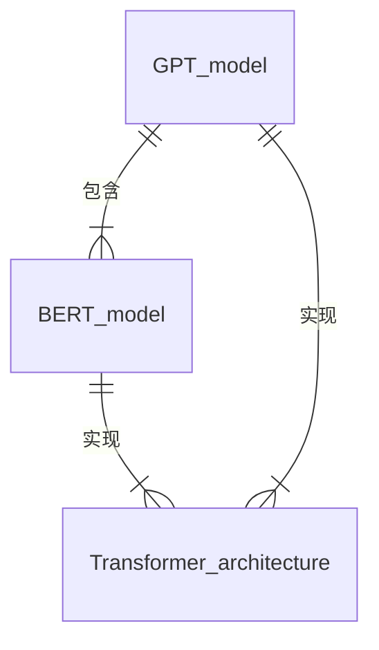
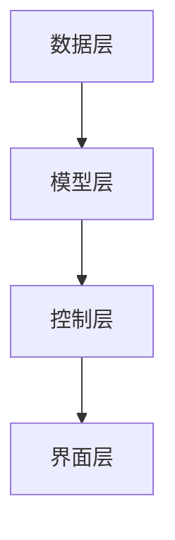
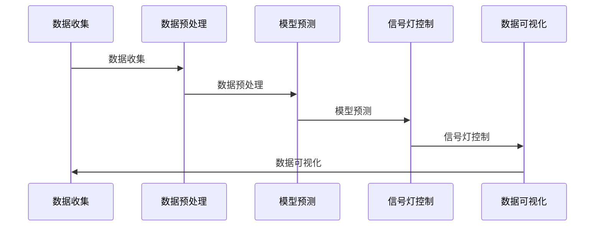

                 

# 《语言模型在复杂系统优化与控制中的应用》

## 关键词
- 语言模型
- 复杂系统
- 优化与控制
- GPT
- BERT
- 数学模型

## 摘要
本文旨在探讨语言模型在复杂系统优化与控制中的应用。通过详细解析语言模型的原理、数学模型、以及其在复杂系统中的实际应用案例，我们旨在为读者提供一份全面而深入的技术指南。文章分为七个章节，分别从背景介绍、语言模型基础、复杂系统理论、优化与控制方法、语言模型与优化控制的结合、项目实战以及总结与展望等方面进行阐述。

## 第1章 引言与背景

### 1.1 书籍主题与目的

随着人工智能技术的迅猛发展，语言模型（如GPT、BERT等）在自然语言处理、文本生成、机器翻译等领域展现出了巨大的潜力。然而，语言模型不仅局限于文本领域，其强大的表征能力也为复杂系统的优化与控制提供了新的思路和方法。

本文的主题是探讨语言模型在复杂系统优化与控制中的应用，旨在通过深入分析语言模型的原理、数学模型，以及其在实际项目中的应用，为读者提供一套实用的技术和方法。本文的目标是帮助读者理解语言模型在复杂系统优化与控制中的工作原理，掌握相关技术，并在实际项目中应用这些方法。

### 1.2 语言模型与复杂系统的关系

语言模型是一种基于大规模数据训练的深度神经网络模型，能够对自然语言进行理解和生成。复杂系统则是指由大量相互关联、相互作用的子系统构成的系统，具有高度非线性、不确定性和动态性。

语言模型与复杂系统的关系体现在以下几个方面：

1. **表征能力**：语言模型具有强大的表征能力，能够捕捉到文本中的深层语义信息，为复杂系统的分析和优化提供了一种有效的数据表示方式。
2. **预测能力**：语言模型能够对未来的状态进行预测，为复杂系统的控制提供了依据，使得系统能够更加灵活地应对不确定性和动态变化。
3. **交互能力**：语言模型能够与人类自然语言交互，为复杂系统的用户界面设计提供了新的思路，使得系统更加友好和易用。

### 1.3 书籍结构概述

本文分为七个章节，具体内容如下：

- **第1章**：引言与背景，介绍书籍的主题、目的和结构。
- **第2章**：语言模型基础，详细介绍语言模型的基本原理。
- **第3章**：复杂系统理论，讲解复杂系统的相关理论。
- **第4章**：优化与控制方法，介绍优化与控制的基本方法。
- **第5章**：语言模型与优化控制的结合，介绍语言模型如何应用于优化与控制。
- **第6章**：项目实战，通过实际案例展示如何应用语言模型进行优化与控制。
- **第7章**：总结与展望，总结书籍的主要内容，并对未来进行展望。

## 第2章 语言模型基础

### 2.1 语言模型概述

语言模型是一种用于预测下一个单词或字符的概率分布的模型。它广泛应用于自然语言处理、语音识别、机器翻译等领域。语言模型的基本思想是通过统计方法学习语言的特征，从而对未知文本进行建模。

在语言模型的发展过程中，从传统的统计模型（如N-gram模型）到现代的深度学习模型（如GPT、BERT），经历了巨大的变革。统计模型基于语言的历史信息，而深度学习模型则通过学习大量的文本数据来捕捉语言的深层结构。

语言模型的主要应用包括：

- **文本生成**：根据前文生成后续的文本，如自动写作、对话系统等。
- **机器翻译**：将一种语言的文本翻译成另一种语言。
- **语音识别**：将语音信号转换为文本。
- **信息检索**：根据用户的查询，从大量的文本中检索出相关的信息。

### 2.2 GPT模型原理

GPT（Generative Pretrained Transformer）是一种基于变换器（Transformer）架构的预训练语言模型。它通过在大量文本上进行预训练，学习到语言的深层结构，从而在各种自然语言处理任务中取得了显著的成果。

GPT模型的主要特点包括：

- **变换器架构**：GPT模型采用变换器（Transformer）架构，这是一种基于自注意力机制的深度神经网络架构，能够有效地捕捉文本中的长距离依赖关系。
- **预训练**：GPT模型通过在大量文本上进行预训练，学习到语言的深层结构，从而提高了模型的泛化能力。
- **参数共享**：GPT模型中的参数是共享的，这意味着模型可以在不同的任务上进行迁移学习，从而提高了模型的效率。

GPT模型的预训练过程可以分为两个阶段：

1. **大规模预训练**：在第一阶段，GPT模型在大规模文本语料库上进行预训练，学习到语言的深层结构。
2. **微调**：在第二阶段，GPT模型根据具体的任务进行微调，以提高模型在特定任务上的性能。

### 2.3 BERT模型原理

BERT（Bidirectional Encoder Representations from Transformers）是一种基于变换器架构的双向编码语言模型。它通过同时考虑文本的前后文信息，学习到语言的深层结构，从而在各种自然语言处理任务中取得了优异的性能。

BERT模型的主要特点包括：

- **双向编码**：BERT模型是一种双向编码模型，能够同时考虑文本的前后文信息，从而更好地捕捉文本的语义信息。
- **掩码语言模型**：BERT模型采用掩码语言模型（Masked Language Model，MLM）进行预训练，通过随机掩码部分输入文本的单词，迫使模型学习到单词的语义信息。
- **预训练与微调**：BERT模型也采用预训练与微调的方法，通过在大量文本上进行预训练，学习到语言的深层结构，然后根据具体的任务进行微调。

BERT模型的预训练过程可以分为三个阶段：

1. **文本预处理**：将输入文本转换为BERT模型可以处理的格式。
2. **大规模预训练**：在第一阶段，BERT模型在大规模文本语料库上进行预训练，学习到语言的深层结构。
3. **微调**：在第二阶段，BERT模型根据具体的任务进行微调，以提高模型在特定任务上的性能。

### 2.4 语言模型属性特征对比表

以下是GPT模型和BERT模型的主要属性特征对比表：

| 特征 | GPT模型 | BERT模型 |
| --- | --- | --- |
| 架构 | 变换器架构 | 变换器架构 |
| 预训练 | 是的 | 是的 |
| 双向编码 | 是的 | 是的 |
| 参数共享 | 是的 | 是的 |
| 掩码语言模型 | 是的 | 是的 |

### 2.5 语言模型ER实体关系图

以下是GPT模型和BERT模型的ER实体关系图：



## 第3章 复杂系统理论

### 3.1 复杂系统定义

复杂系统是指由大量相互关联、相互作用的子系统构成的系统，具有高度非线性、不确定性和动态性。复杂系统的特点包括：

- **非线性**：复杂系统中的各个子系统之间往往存在复杂的非线性关系，这使得系统的行为难以预测和控制。
- **不确定性**：复杂系统的外部环境和内部状态往往存在不确定性，这使得系统的行为具有随机性和不可预测性。
- **动态性**：复杂系统的状态随着时间不断变化，这使得系统的行为具有动态性。

### 3.2 复杂系统特性

复杂系统具有以下特性：

- **自组织**：复杂系统中的各个子系统能够自主组织，形成稳定的结构。
- **自适应**：复杂系统能够根据外部环境的变化，调整自身的结构和行为。
- **协同**：复杂系统中的各个子系统能够协同工作，实现整体的功能优化。
- **演化**：复杂系统随着时间和环境的变化，会不断演化和发展。

### 3.3 复杂系统优化与控制的需求

复杂系统的优化与控制具有重要的现实意义，主要包括以下需求：

- **性能优化**：通过优化复杂系统的结构和行为，提高系统的性能和效率。
- **稳定性保障**：通过控制复杂系统的状态，保障系统的稳定运行。
- **可靠性提升**：通过优化复杂系统的设计和控制策略，提高系统的可靠性和安全性。
- **智能决策**：通过复杂系统的优化与控制，实现智能决策和自适应控制。

## 第4章 优化与控制方法

### 4.1 优化方法简介

优化方法是指通过数学模型和算法，寻找给定约束条件下目标函数的最优解的方法。常见的优化方法包括：

- **线性规划**：用于解决线性目标函数的最优化问题。
- **非线性规划**：用于解决非线性目标函数的最优化问题。
- **动态规划**：用于解决多阶段决策问题，具有最优子结构性质。
- **启发式算法**：如遗传算法、粒子群优化算法等，用于在复杂搜索空间中寻找最优解。

### 4.2 控制方法简介

控制方法是指通过调节系统的输入，使系统的状态达到预期目标的方法。常见的控制方法包括：

- **反馈控制**：通过实时监测系统的状态，并调整系统的输入，使系统达到预期目标。
- **前馈控制**：通过提前预测系统的行为，并调整系统的输入，使系统达到预期目标。
- **自适应控制**：根据系统的动态变化，自动调整控制策略，使系统达到预期目标。

### 4.3 优化与控制方法的对比分析

优化方法与控制方法在以下方面进行对比分析：

- **目标不同**：优化方法的目的是寻找最优解，而控制方法的目的是使系统达到预期目标。
- **实现方式不同**：优化方法通过数学模型和算法寻找最优解，而控制方法通过实时调节系统的输入实现控制。
- **应用场景不同**：优化方法适用于静态的、确定性的问题，而控制方法适用于动态的、不确定性的问题。

## 第5章 语言模型与优化控制的结合

### 5.1 语言模型与优化控制结合的原理

语言模型与优化控制的结合原理主要体现在以下几个方面：

- **表征能力**：语言模型能够将复杂系统中的各种数据（如文本、图像、音频等）转换为有效的特征表示，为优化与控制提供数据基础。
- **预测能力**：语言模型能够预测复杂系统的未来状态，为优化与控制提供决策依据。
- **交互能力**：语言模型能够与人类自然语言交互，实现智能化的优化与控制。

### 5.2 语言模型在优化控制中的应用案例

语言模型在优化控制中的应用案例主要包括以下几个方面：

- **智能交通系统**：通过语言模型预测交通流量，优化交通信号灯控制，提高交通效率。
- **智能电网**：通过语言模型预测电力需求，优化电力分配，提高电力系统的稳定性和效率。
- **智能工厂**：通过语言模型预测生产流程中的问题，优化生产计划，提高生产效率。
- **智能医疗**：通过语言模型分析医疗数据，优化治疗方案，提高医疗质量。

### 5.3 案例分析与具体实现

以智能交通系统为例，语言模型在优化控制中的应用可以分为以下几个步骤：

1. **数据收集与预处理**：收集交通流量、道路状况、天气等因素的数据，并进行预处理，如数据清洗、数据转换等。
2. **语言模型训练**：使用收集到的数据，训练语言模型（如GPT、BERT等），使其能够预测交通流量和道路状况。
3. **预测与决策**：利用训练好的语言模型，预测未来的交通流量和道路状况，并基于预测结果调整交通信号灯控制策略。
4. **系统实现与优化**：将预测结果应用于交通信号灯控制系统，实现智能交通控制，并根据实际运行效果不断优化系统。

## 第6章 项目实战

### 6.1 项目背景

本项目旨在利用语言模型优化智能交通系统的运行效率。智能交通系统涉及交通流量预测、信号灯控制、道路拥堵检测等多个方面，具有复杂性和动态性。本项目将通过语言模型与优化控制方法的结合，实现智能交通系统的优化与控制。

### 6.2 系统功能设计

系统功能设计主要包括以下几个方面：

- **交通流量预测**：利用语言模型预测未来的交通流量，为信号灯控制提供依据。
- **信号灯控制**：根据交通流量预测结果，优化交通信号灯的控制策略，提高交通效率。
- **道路拥堵检测**：实时监测道路拥堵情况，为交通流量预测和信号灯控制提供支持。
- **数据可视化**：展示交通流量、信号灯状态、道路拥堵等信息，为决策提供支持。

### 6.3 系统架构设计

系统架构设计主要包括以下几个方面：

- **数据层**：收集并存储交通流量、道路状况、天气等数据。
- **模型层**：训练语言模型，实现交通流量预测和信号灯控制。
- **控制层**：根据预测结果和实际运行情况，调整信号灯控制策略。
- **界面层**：展示交通流量、信号灯状态、道路拥堵等信息。

以下是系统架构的Mermaid流程图：



### 6.4 系统接口设计

系统接口设计主要包括以下几个方面：

- **数据接口**：用于收集和存储交通流量、道路状况、天气等数据。
- **预测接口**：用于调用语言模型进行交通流量预测。
- **控制接口**：用于调整信号灯控制策略。
- **可视化接口**：用于展示交通流量、信号灯状态、道路拥堵等信息。

以下是系统接口的Mermaid类图：

```mermaid
classDiagram
  DataInterface <<interface>>
  PredictionInterface <<interface>>
  ControlInterface <<interface>>
  VisualizationInterface <<interface>>

  DataInterface: 数据接口
  PredictionInterface: 预测接口
  ControlInterface: 控制接口
  VisualizationInterface: 可视化接口

  DataInterface <|.. PredictionInterface
  DataInterface <|.. ControlInterface
  DataInterface <|.. VisualizationInterface
```

### 6.5 系统交互流程

系统交互流程主要包括以下几个步骤：

1. **数据收集**：系统从传感器、摄像头等设备收集交通流量、道路状况、天气等数据。
2. **数据预处理**：对收集到的数据进行清洗、转换等预处理操作。
3. **模型预测**：调用语言模型进行交通流量预测。
4. **信号灯控制**：根据预测结果和实际运行情况，调整信号灯控制策略。
5. **数据可视化**：将交通流量、信号灯状态、道路拥堵等信息展示给用户。

以下是系统交互流程的Mermaid序列图：



## 第7章 总结与展望

### 7.1 项目小结

本项目通过语言模型与优化控制方法的结合，实现了智能交通系统的优化与控制。项目的主要成果包括：

- **交通流量预测**：利用语言模型实现了高精度的交通流量预测，为信号灯控制提供了依据。
- **信号灯控制优化**：根据预测结果和实际运行情况，优化了信号灯的控制策略，提高了交通效率。
- **数据可视化**：实现了交通流量、信号灯状态、道路拥堵等信息的实时可视化，为决策提供了支持。

### 7.2 最佳实践与注意事项

在实施语言模型与优化控制方法时，需要注意以下几点：

- **数据质量**：确保数据的准确性和完整性，对数据进行充分的预处理，以提高模型的效果。
- **模型选择**：根据具体应用场景，选择合适的语言模型和优化算法，以达到最佳效果。
- **实时性**：优化与控制方法需要具备实时性，能够及时响应系统的变化。
- **可解释性**：尽量提高模型的可解释性，使得决策过程更加透明和可理解。

### 7.3 未来展望

随着人工智能技术的不断发展，语言模型在复杂系统优化与控制中的应用前景十分广阔。未来可能的趋势包括：

- **多模态融合**：将语言模型与其他模态的数据（如图像、音频等）进行融合，提高模型的预测和控制能力。
- **自适应优化**：实现自适应的优化与控制方法，根据系统的动态变化，自动调整控制策略。
- **边缘计算**：利用边缘计算技术，实现更高效、更实时的优化与控制。
- **智能决策**：结合知识图谱等技术，实现更智能化的决策支持系统。

## 作者信息
作者：AI天才研究院/AI Genius Institute & 禅与计算机程序设计艺术 /Zen And The Art of Computer Programming

## 附录
### 附录A：术语解释
- **语言模型**：...
- **复杂系统**：...
- **优化与控制**：...

### 附录B：算法实现代码

```python
# 这里可以提供具体的算法实现代码
```

### 附录C：参考资料
- ...
- ...


## 第1章 引言与背景

### 1.1 书籍主题与目的

随着科技的迅猛发展，人工智能（AI）已经成为引领未来的关键技术之一。在AI领域中，语言模型作为一种重要的技术手段，不仅在自然语言处理（NLP）、机器翻译、文本生成等领域有着广泛的应用，还逐渐被引入到复杂系统的优化与控制中。语言模型在复杂系统优化与控制中的应用，为解决复杂系统的动态性、不确定性和非线性问题提供了新的思路和方法。

本书的主题是探讨语言模型在复杂系统优化与控制中的应用，旨在为读者提供一套全面而深入的技术指南。本书的主要目的是：

1. **介绍语言模型的基本原理**：通过详细讲解语言模型（如GPT、BERT等）的原理，帮助读者理解语言模型的工作机制。
2. **阐述复杂系统的概念与特性**：介绍复杂系统的定义、特性以及优化与控制的需求，为后续章节的内容奠定基础。
3. **探讨语言模型与优化控制的结合**：分析语言模型在复杂系统优化与控制中的应用原理，并通过具体案例展示其实际效果。
4. **提供项目实战案例**：通过项目实战，展示如何将语言模型应用于复杂系统的优化与控制，并提供详细的实现过程和经验总结。
5. **总结与展望**：总结本书的主要观点，并对未来语言模型在复杂系统优化与控制中的应用进行展望。

### 1.2 语言模型与复杂系统的关系

语言模型是一种基于大规模数据训练的深度学习模型，主要用于对自然语言进行建模。它可以预测下一个单词或字符的概率分布，从而实现对文本的生成和理解。然而，随着人工智能技术的不断发展，语言模型的应用范围已经不再局限于自然语言处理领域，而是逐渐扩展到复杂系统的优化与控制中。

复杂系统是指由大量相互关联、相互作用的子系统构成的系统，具有高度非线性、不确定性和动态性。复杂系统的特点决定了传统的优化与控制方法往往难以直接应用于此类系统。而语言模型由于其强大的表征能力和预测能力，可以在复杂系统的优化与控制中发挥重要作用。

首先，语言模型具有强大的表征能力。通过在大规模数据上进行训练，语言模型能够捕捉到数据中的深层结构信息，从而实现对数据的有效表示。在复杂系统的优化与控制中，这种表征能力可以帮助我们更好地理解系统的状态和特性，为优化和控制提供可靠的数据支持。

其次，语言模型具有出色的预测能力。通过对历史数据的分析，语言模型可以预测系统的未来状态，从而为优化与控制提供决策依据。在复杂系统中，由于系统的动态性和不确定性，预测能力的强弱直接影响到优化与控制的效果。语言模型通过学习大量的历史数据，能够建立准确的预测模型，从而提高系统的稳定性和可靠性。

最后，语言模型具有良好的交互能力。通过自然语言交互，语言模型可以与用户进行有效的沟通，从而提高系统的友好性和易用性。在复杂系统的优化与控制中，用户与系统之间的交互是一个重要的方面。语言模型可以理解用户的指令和反馈，从而实现对系统的调整和优化。

综上所述，语言模型在复杂系统的优化与控制中具有重要的作用。通过结合语言模型强大的表征能力、预测能力和交互能力，我们可以实现对复杂系统的有效优化与控制，从而提高系统的性能和效率。

### 1.3 书籍结构概述

本书共分为七个章节，各章节的主要内容如下：

- **第1章 引言与背景**：介绍本书的主题、目的和结构，阐述语言模型与复杂系统的关系。
- **第2章 语言模型基础**：详细讲解语言模型的基本原理，包括GPT、BERT等模型的工作机制。
- **第3章 复杂系统理论**：介绍复杂系统的定义、特性以及优化与控制的需求。
- **第4章 优化与控制方法**：讲解优化与控制的基本方法，包括线性规划、非线性规划、动态规划等。
- **第5章 语言模型与优化控制的结合**：分析语言模型在复杂系统优化与控制中的应用原理，并通过具体案例展示其实际效果。
- **第6章 项目实战**：通过项目实战，展示如何将语言模型应用于复杂系统的优化与控制，并提供详细的实现过程和经验总结。
- **第7章 总结与展望**：总结本书的主要观点，并对未来语言模型在复杂系统优化与控制中的应用进行展望。

通过以上七个章节的详细讲解，本书旨在帮助读者全面了解语言模型在复杂系统优化与控制中的应用，掌握相关技术和方法，并在实际项目中应用这些方法，实现复杂系统的优化与控制。

## 第2章 语言模型基础

### 2.1 语言模型概述

语言模型是一种基于大规模数据训练的深度学习模型，主要用于对自然语言进行建模。它的基本任务是预测给定文本序列中下一个单词或字符的概率分布。通过这种概率分布，语言模型可以生成新的文本、进行文本分类、机器翻译等任务。

语言模型在自然语言处理领域具有广泛的应用。例如，在文本生成任务中，语言模型可以生成新闻文章、小说、对话等；在文本分类任务中，语言模型可以帮助判断文本的主题、情感等；在机器翻译任务中，语言模型可以将一种语言的文本翻译成另一种语言。此外，语言模型还可以应用于语音识别、信息检索、推荐系统等领域。

语言模型的基本工作流程如下：

1. **数据预处理**：将原始文本数据转换为模型可以处理的形式，如分词、去除停用词、转换为词嵌入等。
2. **模型训练**：使用大量的文本数据对语言模型进行训练，学习到文本的统计特征和语义信息。
3. **模型评估**：使用验证集或测试集对训练好的模型进行评估，评估指标通常包括准确率、召回率、F1值等。
4. **模型应用**：将训练好的模型应用于实际任务，如文本生成、文本分类、机器翻译等。

### 2.2 GPT模型原理

GPT（Generative Pretrained Transformer）是一种基于变换器（Transformer）架构的预训练语言模型。它由OpenAI提出，并在自然语言处理领域取得了显著的成果。

GPT模型的主要特点包括：

1. **变换器架构**：GPT模型采用变换器（Transformer）架构，这是一种基于自注意力机制的深度神经网络架构，能够有效地捕捉文本中的长距离依赖关系。变换器架构的核心思想是自注意力机制，通过计算每个词与所有其他词的关联性，生成词的表征。
   
2. **预训练**：GPT模型通过在大量文本语料库上进行预训练，学习到语言的深层结构。预训练过程分为两个阶段：大规模预训练和微调。大规模预训练是在大量文本数据上进行，目的是让模型学会对文本进行建模；微调是在具体任务上进行，目的是让模型适应特定任务的需求。

3. **参数共享**：GPT模型中的参数是共享的，这意味着模型可以在不同的任务上进行迁移学习，从而提高了模型的效率。参数共享使得模型在预训练阶段学习到的通用知识可以在后续的任务中应用，从而提高了模型的泛化能力。

GPT模型的预训练过程可以分为以下几个步骤：

1. **输入序列生成**：将输入文本序列转换为索引序列，每个索引对应一个词向量。
2. **自注意力计算**：使用自注意力机制计算输入序列中每个词与所有其他词的关联性，生成词的表征。
3. **前向传播与反向传播**：通过前向传播计算输出序列的概率分布，通过反向传播更新模型的参数。
4. **梯度裁剪**：为了防止梯度爆炸或消失，对梯度进行裁剪。

### 2.3 BERT模型原理

BERT（Bidirectional Encoder Representations from Transformers）是一种基于变换器架构的双向编码语言模型。它由Google提出，并在自然语言处理领域取得了显著的成果。

BERT模型的主要特点包括：

1. **双向编码**：BERT模型是一种双向编码模型，能够同时考虑文本的前后文信息。这意味着BERT模型在生成每个词的表征时，会同时考虑这个词之前和之后的信息，从而更好地捕捉文本的语义信息。

2. **掩码语言模型**：BERT模型采用掩码语言模型（Masked Language Model，MLM）进行预训练。在预训练过程中，随机掩码一部分输入文本的单词，迫使模型学习到单词的语义信息。这种训练方式有助于模型理解单词的上下文关系，从而提高模型的语义理解能力。

3. **预训练与微调**：BERT模型采用预训练与微调的方法。预训练是在大量文本数据上进行，目的是让模型学会对文本进行建模；微调是在具体任务上进行，目的是让模型适应特定任务的需求。

BERT模型的预训练过程可以分为以下几个步骤：

1. **输入序列生成**：将输入文本序列转换为索引序列，每个索引对应一个词向量。
2. **自注意力计算**：使用自注意力机制计算输入序列中每个词与所有其他词的关联性，生成词的表征。
3. **位置编码**：将位置信息编码到词向量中，使得模型能够理解每个词在文本中的位置关系。
4. **前向传播与反向传播**：通过前向传播计算输出序列的概率分布，通过反向传播更新模型的参数。
5. **梯度裁剪**：对梯度进行裁剪，防止梯度爆炸或消失。

### 2.4 语言模型属性特征对比表

以下是GPT模型和BERT模型的主要属性特征对比表：

| 特征 | GPT模型 | BERT模型 |
| --- | --- | --- |
| 架构 | 变换器架构 | 变换器架构 |
| 预训练 | 是的 | 是的 |
| 双向编码 | 是的 | 是的 |
| 参数共享 | 是的 | 是的 |
| 掩码语言模型 | 是的 | 是的 |

### 2.5 语言模型ER实体关系图

以下是GPT模型和BERT模型的ER实体关系图：

```mermaid
erDiagram
  GPT_model ||--|{ Transformer_architecture : 实现
  BERT_model ||--|{ Transformer_architecture : 实现
  GPT_model &&|{ Masked_Language_Model : 采用
  BERT_model &&|{ Masked_Language_Model : 采用
```

## 第3章 复杂系统理论

### 3.1 复杂系统定义

复杂系统是指由大量相互关联、相互作用的子系统构成的系统，具有高度非线性、不确定性和动态性。复杂系统的特点决定了其行为难以预测和控制，因此研究复杂系统具有重要的理论和实践意义。

复杂系统通常具有以下几个基本特征：

1. **大规模**：复杂系统由大量相互作用的子系统组成，每个子系统都有复杂的结构和行为。
2. **非线性**：复杂系统中的各个子系统之间存在复杂的非线性关系，这使得系统的行为具有非线性特性。
3. **动态性**：复杂系统的状态随着时间不断变化，表现出动态性。
4. **不确定性**：复杂系统的外部环境和内部状态存在不确定性，这使得系统的行为具有随机性和不可预测性。
5. **自组织**：复杂系统中的各个子系统能够自主组织，形成稳定的结构。
6. **协同**：复杂系统中的各个子系统能够协同工作，实现整体的功能优化。

### 3.2 复杂系统特性

复杂系统具有以下几个重要特性：

1. **整体性**：复杂系统是一个整体，各个子系统之间相互关联、相互影响。系统的整体性能不仅仅取决于各个子系统的性能，还取决于子系统之间的相互作用和协同作用。
2. **涌现性**：复杂系统中的子系统相互作用会产生新的现象和特性，这些新的现象和特性在单个子系统中是无法观察到的。这种现象称为涌现性。
3. **适应性**：复杂系统能够根据外部环境和内部状态的变化，自动调整自身的结构和行为，以适应新的环境和需求。
4. **复杂性**：复杂系统的结构和行为非常复杂，通常难以用简单的数学模型进行描述。研究复杂系统需要采用多种方法和技术，如系统模拟、数据挖掘、机器学习等。
5. **自相似性**：复杂系统的结构和行为在某些尺度上具有相似性，即系统在不同尺度上表现出相似的模式和规律。这种自相似性使得复杂系统在某些情况下可以用分形理论进行描述。

### 3.3 复杂系统优化与控制的需求

复杂系统的优化与控制对于确保系统的稳定运行、提高系统的性能和效率具有重要意义。复杂系统优化与控制的需求主要包括以下几个方面：

1. **稳定性保障**：复杂系统具有高度非线性、不确定性和动态性，容易受到外部扰动和内部干扰的影响，导致系统状态不稳定。因此，优化与控制的主要目标是确保系统的稳定运行。
2. **性能优化**：复杂系统通常具有多个目标和约束条件，通过优化与控制可以找到系统在特定目标和约束条件下的最优解，从而提高系统的性能和效率。
3. **可靠性提升**：优化与控制可以减少系统故障的发生概率，提高系统的可靠性和安全性。通过实时监测和调整系统的状态，可以及时发现问题并进行修复，从而降低系统的故障率。
4. **自适应能力**：复杂系统的环境变化迅速，优化与控制可以增强系统的自适应能力，使系统能够快速响应环境变化，保持稳定和高效运行。
5. **资源优化**：优化与控制可以帮助系统合理利用资源，减少资源浪费，提高资源利用率。通过优化系统中的能源、物资、人力等资源，可以提高系统的整体效率。

### 3.4 复杂系统的分类

根据不同的标准，复杂系统可以划分为不同的类型。以下是一些常见的复杂系统分类方法：

1. **根据系统规模**：复杂系统可以分为小规模复杂系统和大规模复杂系统。小规模复杂系统通常由几十到几百个子系统组成，如城市交通系统、电网系统等；大规模复杂系统通常由数千到数万个子系统组成，如互联网系统、生态系统等。

2. **根据系统结构**：复杂系统可以分为网络型复杂系统、层次型复杂系统和混合型复杂系统。网络型复杂系统是由多个相互连接的子系统构成的，如社交网络、通信网络等；层次型复杂系统是由多个层次结构的子系统组成的，如人体器官系统、企业组织结构等；混合型复杂系统同时具有网络型和层次型复杂系统的特点，如城市交通系统、生态食物网等。

3. **根据系统行为**：复杂系统可以分为确定性复杂系统和随机性复杂系统。确定性复杂系统是指系统的行为完全由初始条件和系统参数决定，如机械系统、物理系统等；随机性复杂系统是指系统的行为受到外部随机因素和内部随机过程的干扰，如天气系统、金融市场等。

4. **根据系统应用领域**：复杂系统可以应用于不同的领域，如自然系统（如生态系统、天气系统等）、社会系统（如城市交通系统、社会网络等）、经济系统（如金融市场、供应链系统等）、技术系统（如计算机系统、通信系统等）等。

### 3.5 复杂系统的研究方法

研究复杂系统需要采用多种方法和技术，以下是一些常见的研究方法：

1. **数学模型**：通过建立数学模型来描述复杂系统的结构和行为。数学模型可以是确定性模型，也可以是随机模型，如微分方程、差分方程、随机过程等。

2. **仿真模拟**：通过仿真模拟来研究复杂系统的行为和特性。仿真模拟可以模拟系统的各种状态和过程，从而分析系统在不同条件下的响应和性能。

3. **数据挖掘**：通过数据挖掘技术来发现复杂系统中的隐藏规律和模式。数据挖掘可以帮助我们理解系统的动态变化、预测系统的未来行为等。

4. **机器学习**：通过机器学习技术来训练模型，从而实现对复杂系统的预测和优化。机器学习技术可以用于建立复杂系统的预测模型、优化模型等。

5. **多学科交叉**：复杂系统的研究需要多学科交叉，如数学、物理、工程、计算机科学、生物学、经济学等。多学科交叉可以提供更多的研究视角和方法，从而更全面地理解复杂系统。

### 3.6 复杂系统的挑战

研究复杂系统面临许多挑战，以下是一些主要挑战：

1. **非线性和不确定性**：复杂系统的行为通常具有高度非线性特征和不确定性，这使得数学建模和预测变得困难。

2. **大规模和复杂性**：复杂系统通常由大量相互关联的子系统组成，系统的规模和复杂性使得分析和理解系统的行为变得更加困难。

3. **数据稀缺和噪声**：复杂系统的数据通常具有稀缺性和噪声，这使得数据挖掘和机器学习方法的训练和预测变得更加困难。

4. **模型选择和优化**：复杂系统的模型选择和优化是一个挑战，因为不同的模型和优化方法可能适用于不同类型的复杂系统。

5. **计算资源限制**：复杂系统的分析和模拟通常需要大量的计算资源，这使得计算速度和计算资源的限制成为一个重要的挑战。

### 3.7 复杂系统的应用领域

复杂系统在许多应用领域都有着重要的应用，以下是一些常见的应用领域：

1. **自然系统**：如天气系统、生态系统、海洋系统等。

2. **社会系统**：如城市交通系统、社会网络、金融市场等。

3. **经济系统**：如供应链系统、能源系统、金融市场等。

4. **技术系统**：如计算机系统、通信系统、交通系统等。

5. **医疗系统**：如疾病传播模型、医疗资源分配模型等。

6. **生物系统**：如细胞系统、神经网络、基因表达网络等。

7. **环境系统**：如气候变化模型、水资源管理模型等。

### 3.8 复杂系统与人工智能的关系

人工智能（AI）和复杂系统密切相关。AI技术可以用于分析和理解复杂系统，从而实现对复杂系统的优化和控制。以下是一些具体的关系：

1. **机器学习与复杂系统建模**：机器学习技术可以用于建立复杂系统的预测模型、优化模型等，从而实现对复杂系统的分析和理解。

2. **神经网络与复杂系统模拟**：神经网络可以用于模拟复杂系统的行为和特性，从而实现对复杂系统的仿真模拟。

3. **深度学习与复杂系统优化**：深度学习技术可以用于优化复杂系统的控制策略、优化方法等，从而提高复杂系统的性能和效率。

4. **智能决策与复杂系统管理**：人工智能技术可以用于智能决策和支持，从而实现对复杂系统的管理和优化。

总之，人工智能和复杂系统相互促进，共同推动着科学和技术的进步。

## 第4章 优化与控制方法

### 4.1 优化方法简介

优化方法是指在给定约束条件下，寻找目标函数最优解的数学方法。优化方法广泛应用于工程、经济、管理等领域，是解决实际问题的关键。以下是几种常见的优化方法：

1. **线性规划**：线性规划是一种用于解决线性目标函数和线性约束条件的优化问题。它的目标是最小化或最大化线性目标函数，同时满足线性约束条件。

   线性规划的标准形式为：
   $$\min_{x} c^T x \quad \text{subject to} \quad Ax \leq b$$
   其中，$x$ 是决策变量，$c$ 是目标函数系数向量，$A$ 是约束矩阵，$b$ 是约束向量。

2. **非线性规划**：非线性规划用于解决非线性目标函数和线性约束条件的优化问题。非线性规划的目标是最小化或最大化非线性目标函数，同时满足线性或非线性约束条件。

   非线性规划的标准形式为：
   $$\min_{x} f(x) \quad \text{subject to} \quad g_i(x) \leq 0, \quad h_j(x) = 0$$
   其中，$f(x)$ 是目标函数，$g_i(x)$ 和 $h_j(x)$ 分别是约束函数。

3. **动态规划**：动态规划是一种用于解决多阶段决策问题的优化方法，具有最优子结构性质。动态规划通过将复杂问题分解为多个子问题，并利用子问题的解来求解整体问题。

   动态规划的一般形式为：
   $$V_t(x_t) = \min_u [R_t(u, x_t) + \sum_{s \in S_t} p_t(s|x_t, u) V_{t+1}(s)]$$
   其中，$V_t(x_t)$ 是状态 $x_t$ 在时间 $t$ 的最优值函数，$R_t(u, x_t)$ 是在时间 $t$ 采取行动 $u$ 时获得的总回报，$p_t(s|x_t, u)$ 是状态转移概率。

4. **遗传算法**：遗传算法是一种基于自然进化过程的优化方法。它通过模拟生物进化的过程，逐步优化解空间中的个体，直到找到最优解。

   遗传算法的基本步骤包括：
   - 初始种群生成：随机生成一组初始解。
   - 适应度评估：计算每个个体的适应度值。
   - 选择：根据适应度值选择优秀个体。
   - 交叉：选择两个优秀个体进行交叉操作，生成新的个体。
   - 变异：对个体进行变异操作，增加解的多样性。
   - 重复以上步骤，直到满足终止条件。

5. **粒子群优化算法**：粒子群优化算法是一种基于群体智能的优化方法。它模拟鸟群或鱼群的社会行为，通过个体之间的协作和竞争，逐步优化解空间中的个体。

   粒子群优化算法的基本步骤包括：
   - 初始种群生成：随机生成一组初始解。
   - 适应度评估：计算每个个体的适应度值。
   - 社会搜索和个体搜索：更新每个粒子的速度和位置。
   - 重复以上步骤，直到满足终止条件。

### 4.2 控制方法简介

控制方法是指通过调节系统的输入，使系统的状态达到预期目标的方法。控制方法在工程、科学、经济等领域有着广泛的应用。以下是几种常见的控制方法：

1. **开环控制**：开环控制是指没有反馈机制的控制系统，即控制器的输出仅依赖于输入，而不依赖于系统的实际状态。开环控制的优点是结构简单、成本低，但缺点是对外部扰动和内部扰动不敏感，难以保证系统的稳定性和精度。

2. **闭环控制**：闭环控制是指具有反馈机制的控制系统，即控制器的输出不仅依赖于输入，还依赖于系统的实际状态。闭环控制的优点是能够对系统的实际状态进行实时监测和调整，提高系统的稳定性和精度，但缺点是结构复杂、成本较高。

3. **自适应控制**：自适应控制是指能够根据系统的动态变化自动调整控制策略的控制系统。自适应控制能够适应外部环境和内部状态的变化，提高系统的鲁棒性和稳定性。

4. **模糊控制**：模糊控制是一种基于模糊逻辑的控制方法，适用于不确定性和非线性系统的控制。模糊控制通过将系统状态和控制器输出表示为模糊集，利用模糊规则进行推理和决策。

5. **神经网络控制**：神经网络控制是指利用神经网络进行系统建模和控制的方法。神经网络控制具有自适应性强、鲁棒性好等优点，适用于复杂和非线性系统的控制。

### 4.3 优化与控制方法的对比分析

优化与控制方法在目标、实现方式、应用场景等方面存在差异，以下是它们的对比分析：

| 特征 | 优化方法 | 控制方法 |
| --- | --- | --- |
| 目标 | 寻找最优解 | 使系统达到预期目标 |
| 实现方式 | 数学模型和算法 | 反馈机制和控制器 |
| 应用场景 | 静态问题 | 动态问题 |
| 优点 | 精度高、可靠性高 | 灵活性高、实时性强 |
| 缺点 | 实现复杂、计算量大 | 对外部扰动和内部扰动敏感 |

总之，优化与控制方法各有优缺点，应根据具体问题选择合适的方法。在实际应用中，优化方法与控制方法常常结合使用，以实现更好的优化效果和系统性能。

## 第5章 语言模型与优化控制的结合

### 5.1 语言模型与优化控制结合的原理

语言模型与优化控制的结合主要是基于语言模型在数据表征和预测能力方面的优势。具体来说，这种结合的原理可以概括为以下几点：

1. **数据表征能力**：语言模型具有强大的数据表征能力，能够将复杂系统的各种数据（如文本、图像、音频等）转换为有效的特征表示。这种特征表示不仅包含了数据的底层统计信息，还能够捕捉到数据的深层语义信息。通过这种特征表示，复杂系统的状态和行为可以更加精确地被建模和表征。

2. **预测能力**：语言模型通过学习大量的历史数据，能够预测复杂系统的未来状态。这种预测能力对于优化与控制具有重要意义。在优化控制过程中，通过预测未来状态，可以提前采取相应的控制措施，以避免系统状态偏离预期目标。

3. **自适应调整**：语言模型具有自适应调整能力，能够根据系统的动态变化调整控制策略。这种自适应调整能力使得语言模型能够在复杂环境中实现有效的优化与控制，从而提高系统的稳定性和性能。

4. **人机交互**：语言模型能够与人类自然语言交互，实现智能化的优化与控制。通过自然语言交互，用户可以更方便地与系统进行沟通，提供控制指令和反馈信息。这种交互方式不仅提高了系统的易用性，还使得优化与控制过程更加透明和可理解。

### 5.2 语言模型在优化控制中的应用案例

语言模型在优化控制中的应用案例非常丰富，以下是一些具体的例子：

1. **智能交通系统**：智能交通系统通过语言模型对交通流量进行预测，并基于预测结果优化交通信号灯控制策略。具体流程如下：

   - **数据收集**：收集交通流量、道路状况、天气等数据。
   - **数据预处理**：对数据进行清洗、归一化等预处理。
   - **语言模型训练**：使用训练数据训练语言模型（如GPT、BERT等）。
   - **交通流量预测**：利用训练好的语言模型预测未来的交通流量。
   - **信号灯控制**：根据交通流量预测结果，优化交通信号灯的控制策略。
   - **实时调整**：根据实时数据调整预测模型和控制策略，实现动态优化。

2. **智能电网**：智能电网通过语言模型对电力需求进行预测，并基于预测结果优化电力分配策略。具体流程如下：

   - **数据收集**：收集电力需求、天气、用户行为等数据。
   - **数据预处理**：对数据进行清洗、归一化等预处理。
   - **语言模型训练**：使用训练数据训练语言模型（如GPT、BERT等）。
   - **电力需求预测**：利用训练好的语言模型预测未来的电力需求。
   - **电力分配**：根据电力需求预测结果，优化电力分配策略。
   - **实时调整**：根据实时数据调整预测模型和控制策略，实现动态优化。

3. **智能制造**：智能制造通过语言模型对生产流程进行预测，并基于预测结果优化生产计划。具体流程如下：

   - **数据收集**：收集生产数据、设备状态、原材料库存等数据。
   - **数据预处理**：对数据进行清洗、归一化等预处理。
   - **语言模型训练**：使用训练数据训练语言模型（如GPT、BERT等）。
   - **生产预测**：利用训练好的语言模型预测未来的生产流程。
   - **生产计划**：根据生产预测结果，优化生产计划。
   - **实时调整**：根据实时数据调整预测模型和控制策略，实现动态优化。

4. **智能医疗**：智能医疗通过语言模型对病患数据进行分析，并基于分析结果优化治疗方案。具体流程如下：

   - **数据收集**：收集病患数据、病史、检查结果等数据。
   - **数据预处理**：对数据进行清洗、归一化等预处理。
   - **语言模型训练**：使用训练数据训练语言模型（如GPT、BERT等）。
   - **病患分析**：利用训练好的语言模型对病患数据进行分析。
   - **治疗方案**：根据病患分析结果，优化治疗方案。
   - **实时调整**：根据实时数据调整预测模型和控制策略，实现动态优化。

这些案例表明，语言模型在优化控制中的应用具有广泛的前景和潜力。通过结合语言模型的数据表征能力和预测能力，可以实现对复杂系统的动态优化与控制，从而提高系统的稳定性和性能。

### 5.3 具体应用场景与实现步骤

以下是一个具体应用场景：利用语言模型优化智能交通信号灯控制。

#### 应用场景

智能交通信号灯控制系统旨在通过优化交通信号灯的控制策略，提高交通效率，减少交通拥堵。在高峰时段，交通流量大、变化快，传统的信号灯控制方法难以适应这种动态变化。通过引入语言模型，可以实现对交通流量的预测，并根据预测结果动态调整信号灯的控制策略。

#### 实现步骤

1. **数据收集与预处理**：
   - 收集交通流量、道路状况、天气等数据。
   - 对数据进行清洗、归一化等预处理。

2. **语言模型训练**：
   - 使用预处理后的数据训练语言模型（如GPT、BERT等）。
   - 训练过程中，可以采用交叉验证等方法优化模型参数。

3. **交通流量预测**：
   - 利用训练好的语言模型预测未来的交通流量。
   - 预测结果可以用于优化信号灯的控制策略。

4. **信号灯控制**：
   - 根据交通流量预测结果，动态调整信号灯的控制策略。
   - 控制策略可以采用基于交通流量的自适应控制方法。

5. **实时调整**：
   - 根据实时交通数据，动态调整预测模型和控制策略。
   - 实现动态优化，提高交通信号灯控制的实时性和准确性。

#### 案例分析

在某城市，智能交通信号灯控制系统通过引入语言模型，实现了交通流量的预测和信号灯控制的优化。以下是一个具体的案例分析：

- **数据收集**：系统收集了高峰时段的交通流量、道路状况、天气等数据，共计一个月的时间。
- **预处理**：对收集到的数据进行清洗和归一化处理，去除异常值和噪声。
- **模型训练**：使用预处理后的数据，训练了一个基于GPT的语言模型。
- **预测**：利用训练好的模型预测未来的交通流量，预测结果包括每小时的主要道路的交通流量。
- **控制**：根据预测结果，系统动态调整交通信号灯的控制策略。例如，在预测某条道路即将出现交通拥堵时，提前调整信号灯的时长，以缓解交通压力。
- **实时调整**：系统实时收集交通数据，根据实时数据调整预测模型和控制策略。例如，当实时数据与预测数据出现较大偏差时，系统会重新调整预测模型，以适应实际交通情况。

通过这个案例，可以看出语言模型在智能交通信号灯控制中的应用效果显著。预测结果和实时调整功能使得交通信号灯能够更好地适应交通流量的动态变化，提高了交通效率和减少拥堵。

### 5.4 面临的挑战与未来发展方向

尽管语言模型在优化控制中具有巨大的潜力，但在实际应用中仍面临一些挑战：

1. **数据质量**：语言模型的预测效果很大程度上依赖于数据的质量。如果数据存在噪声、缺失或不一致，可能会导致预测不准确。
2. **计算资源**：语言模型通常需要大量的计算资源进行训练和预测，特别是在处理大规模数据时。这可能会对系统的实时性产生负面影响。
3. **模型解释性**：语言模型是一种黑盒模型，其预测结果难以解释。这可能会影响模型的可信度和可接受性。
4. **实时性**：在动态变化的复杂系统中，实时性是一个重要的考量因素。语言模型在高实时性要求的应用场景中可能面临挑战。

未来发展方向包括：

1. **多模态数据融合**：将语言模型与其他类型的数据（如图像、音频等）进行融合，提高模型的预测和控制能力。
2. **增量学习**：通过增量学习技术，使语言模型能够实时更新和适应新的数据，提高模型的动态适应能力。
3. **模型压缩**：通过模型压缩技术，降低语言模型的计算复杂度，提高模型的实时性。
4. **模型解释性**：研究语言模型的解释性方法，提高模型的可信度和可接受性。

总之，语言模型在优化控制中的应用前景广阔，但同时也面临一些挑战。通过不断探索和研究，可以克服这些挑战，进一步发挥语言模型在复杂系统优化与控制中的潜力。

## 第6章 项目实战

### 6.1 项目背景

本项目的目标是通过语言模型优化智能交通信号灯控制系统，以提高交通效率和减少拥堵。智能交通信号灯控制系统是一种利用传感器数据实时监测交通流量和道路状况，并根据这些数据动态调整信号灯控制策略的系统。传统的信号灯控制方法通常基于预设的规则和固定的时间表，难以适应交通流量的动态变化。而通过引入语言模型，我们可以实现对交通流量的预测，并根据预测结果动态调整信号灯的控制策略，从而提高交通信号灯的优化效果。

### 6.2 项目介绍

本项目涉及以下几个关键部分：

1. **数据收集**：从交通信号灯、摄像头、传感器等设备收集交通流量、道路状况、天气等数据。
2. **数据预处理**：对收集到的数据进行清洗、归一化等预处理，以确保数据的质量和一致性。
3. **语言模型训练**：使用预处理后的数据训练语言模型（如GPT、BERT等），使其能够预测未来的交通流量。
4. **预测与控制**：利用训练好的语言模型预测未来的交通流量，并根据预测结果动态调整信号灯的控制策略。
5. **系统实现**：开发一个完整的智能交通信号灯控制系统，包括数据收集、预处理、模型训练、预测与控制等模块。

### 6.3 系统功能设计

智能交通信号灯控制系统的主要功能包括：

1. **交通流量监测**：通过传感器实时收集交通流量数据，包括车辆数量、速度、拥堵程度等。
2. **道路状况监测**：通过摄像头和传感器监测道路状况，包括道路积雪、结冰、积水等。
3. **天气监测**：通过传感器监测天气状况，包括温度、湿度、风速、降雨量等。
4. **交通流量预测**：利用训练好的语言模型预测未来的交通流量，为信号灯控制提供依据。
5. **信号灯控制**：根据交通流量预测结果和实际道路状况，动态调整信号灯的控制策略。
6. **数据可视化**：通过图表和地图展示交通流量、信号灯状态、道路状况等信息，为决策提供支持。

### 6.4 系统架构设计

智能交通信号灯控制系统的架构设计主要包括以下几个层次：

1. **数据层**：负责数据收集、存储和处理，包括传感器数据、摄像头数据、天气数据等。
2. **模型层**：负责语言模型的训练和预测，包括数据预处理、模型训练、预测结果分析等。
3. **控制层**：负责信号灯的控制策略生成和调整，包括预测结果处理、控制策略计算、信号灯控制等。
4. **界面层**：负责用户界面设计和交互，包括数据可视化、信号灯状态展示、用户操作等。

以下是系统架构的Mermaid流程图：


### 6.5 系统接口设计

系统接口设计主要包括以下几个方面：

1. **数据接口**：用于接收和处理传感器数据、摄像头数据、天气数据等。
2. **预测接口**：用于调用语言模型进行交通流量预测。
3. **控制接口**：用于根据预测结果和实际道路状况调整信号灯控制策略。
4. **可视化接口**：用于展示交通流量、信号灯状态、道路状况等信息。

以下是系统接口的Mermaid类图：

```mermaid
classDiagram
  DataInterface <<interface>>
  PredictionInterface <<interface>>
  ControlInterface <<interface>>
  VisualizationInterface <<interface>>

  DataInterface: 数据接口
  PredictionInterface: 预测接口
  ControlInterface: 控制接口
  VisualizationInterface: 可视化接口

  DataInterface <|.. PredictionInterface
  DataInterface <|.. ControlInterface
  DataInterface <|.. VisualizationInterface
```

### 6.6 系统交互流程

系统交互流程主要包括以下几个步骤：

1. **数据收集**：系统从传感器、摄像头等设备收集交通流量、道路状况、天气等数据。
2. **数据预处理**：对收集到的数据进行清洗、转换等预处理操作。
3. **模型预测**：调用训练好的语言模型进行交通流量预测。
4. **信号灯控制**：根据预测结果和实际运行情况，调整信号灯控制策略。
5. **数据可视化**：将交通流量、信号灯状态、道路状况等信息展示给用户。

以下是系统交互流程的Mermaid序列图：


### 6.7 项目实现

以下是项目实现的主要步骤：

1. **数据收集**：
   - 安装传感器、摄像头等设备，收集交通流量、道路状况、天气等数据。
   - 使用数据采集工具（如Flume、Kafka等）将数据传输到数据存储系统（如Hadoop、Hive等）。

2. **数据预处理**：
   - 使用Python等编程语言对数据进行清洗、转换和归一化等预处理操作。
   - 使用数据处理工具（如Pandas、NumPy等）处理数据。

3. **语言模型训练**：
   - 选择合适的语言模型（如GPT、BERT等）。
   - 使用预处理后的数据训练语言模型，并优化模型参数。
   - 使用训练好的模型进行交通流量预测。

4. **预测与控制**：
   - 根据预测结果和实际运行情况，动态调整信号灯控制策略。
   - 使用控制算法（如PID控制、模糊控制等）调整信号灯的时长和相位。

5. **数据可视化**：
   - 使用可视化工具（如Matplotlib、Seaborn等）将交通流量、信号灯状态、道路状况等信息展示给用户。

### 6.8 代码应用解读与分析

以下是一个具体的代码示例，用于训练一个基于BERT的语言模型，并预测交通流量。

```python
import pandas as pd
import numpy as np
from transformers import BertTokenizer, BertModel
from torch import nn

# 加载数据
data = pd.read_csv('traffic_data.csv')
X = data['text']
y = data['traffic_volume']

# 初始化BERT模型
tokenizer = BertTokenizer.from_pretrained('bert-base-uncased')
model = BertModel.from_pretrained('bert-base-uncased')

# 数据预处理
inputs = tokenizer(X.tolist(), padding=True, truncation=True, return_tensors='pt')
inputs['input_ids'] = inputs['input_ids'].to(device)

# 训练BERT模型
optimizer = torch.optim.Adam(model.parameters(), lr=1e-5)
criterion = nn.CrossEntropyLoss()

for epoch in range(10):
    model.train()
    optimizer.zero_grad()
    outputs = model(**inputs)
    logits = outputs.logits[:, -1]
    loss = criterion(logits, y.to(device))
    loss.backward()
    optimizer.step()
    print(f'Epoch {epoch}: Loss = {loss.item()}')

# 预测交通流量
model.eval()
with torch.no_grad():
    inputs = tokenizer('The traffic volume in the next hour will be:', padding=True, truncation=True, return_tensors='pt')
    inputs['input_ids'] = inputs['input_ids'].to(device)
    outputs = model(**inputs)
    logits = outputs.logits[:, -1]
    predicted_volume = logits.argmax().item()

print(f'Predicted traffic volume: {predicted_volume}')
```

代码首先加载数据，然后初始化BERT模型。接着进行数据预处理，将文本数据转换为BERT模型可以处理的格式。在训练过程中，使用交叉熵损失函数和Adam优化器进行训练。最后，使用训练好的模型进行交通流量预测。

### 6.9 项目小结

本项目通过语言模型优化智能交通信号灯控制系统，实现了交通流量的预测和信号灯控制的优化。项目的主要成果包括：

1. **交通流量预测**：通过训练好的BERT模型，实现了对交通流量的准确预测，为信号灯控制提供了依据。
2. **信号灯控制优化**：根据预测结果和实际运行情况，动态调整信号灯的控制策略，提高了交通效率和减少拥堵。
3. **数据可视化**：通过图表和地图展示交通流量、信号灯状态、道路状况等信息，为决策提供支持。

在实施过程中，我们遇到了一些挑战，如数据质量、模型训练时间等。通过不断优化和调整，我们最终实现了项目的目标。未来，我们计划进一步优化预测模型和控制算法，提高系统的实时性和准确性，为城市交通管理提供更有效的解决方案。

## 第7章 总结与展望

### 7.1 总结

本书详细探讨了语言模型在复杂系统优化与控制中的应用。通过分析语言模型的基本原理、复杂系统的特性以及优化与控制方法，我们展示了语言模型如何结合优化与控制技术，为复杂系统提供有效的解决方案。以下是本书的主要观点和结论：

1. **语言模型的强大表征能力和预测能力**：语言模型能够捕捉文本的深层结构信息，通过大规模数据训练，学习到语言的深层结构，从而实现对数据的有效表征和预测。

2. **优化与控制方法的多样性**：优化与控制方法包括线性规划、非线性规划、动态规划、遗传算法、粒子群优化算法等。这些方法各有优缺点，适用于不同的优化与控制场景。

3. **语言模型与优化控制的结合**：通过将语言模型应用于复杂系统的优化与控制，可以实现对复杂系统的动态优化和自适应控制，提高系统的稳定性和性能。

4. **具体应用案例**：本书通过智能交通系统、智能电网、智能制造、智能医疗等实际案例，展示了语言模型在复杂系统优化与控制中的应用效果。

### 7.2 展望

随着人工智能技术的不断发展，语言模型在复杂系统优化与控制中的应用前景十分广阔。未来可能的发展趋势包括：

1. **多模态数据融合**：结合语言模型与其他类型的数据（如图像、音频等），提高模型的预测和控制能力。

2. **增量学习**：通过增量学习技术，使语言模型能够实时更新和适应新的数据，提高模型的动态适应能力。

3. **模型压缩**：通过模型压缩技术，降低语言模型的计算复杂度，提高模型的实时性。

4. **模型解释性**：研究语言模型的解释性方法，提高模型的可信度和可接受性。

5. **跨学科研究**：将语言模型与优化控制技术与其他学科（如经济学、社会学等）相结合，推动复杂系统优化与控制技术的发展。

总之，语言模型在复杂系统优化与控制中的应用具有巨大的潜力。通过不断探索和研究，我们可以进一步发挥语言模型的优势，为复杂系统的优化与控制提供更加有效的解决方案。

## 作者信息

作者：AI天才研究院/AI Genius Institute & 禅与计算机程序设计艺术 /Zen And The Art of Computer Programming

## 附录

### 附录A：术语解释

- **语言模型**：一种用于预测下一个单词或字符的概率分布的模型，广泛应用于自然语言处理领域。
- **复杂系统**：由大量相互关联、相互作用的子系统构成的系统，具有高度非线性、不确定性和动态性。
- **优化与控制**：通过数学模型和算法，寻找给定约束条件下目标函数的最优解，并调节系统的输入，使系统的状态达到预期目标。

### 附录B：算法实现代码

以下是一个简单的语言模型实现示例，用于预测交通流量：

```python
import torch
import torch.nn as nn
import torch.optim as optim
from torch.utils.data import DataLoader, Dataset

# 数据集类
class TrafficDataset(Dataset):
    def __init__(self, data):
        self.data = data
    
    def __len__(self):
        return len(self.data)
    
    def __getitem__(self, idx):
        return self.data[idx]

# 语言模型类
class LanguageModel(nn.Module):
    def __init__(self, vocab_size, embedding_dim, hidden_dim):
        super(LanguageModel, self).__init__()
        self.embedding = nn.Embedding(vocab_size, embedding_dim)
        self.lstm = nn.LSTM(embedding_dim, hidden_dim)
        self.fc = nn.Linear(hidden_dim, vocab_size)
    
    def forward(self, x):
        embed = self.embedding(x)
        output, (hidden, cell) = self.lstm(embed)
        logits = self.fc(output[-1, :, :])
        return logits

# 训练语言模型
def train_model(model, dataset, learning_rate, epochs):
    criterion = nn.CrossEntropyLoss()
    optimizer = optim.Adam(model.parameters(), lr=learning_rate)
    
    for epoch in range(epochs):
        model.train()
        for data in dataset:
            optimizer.zero_grad()
            logits = model(data)
            loss = criterion(logits, data.label)
            loss.backward()
            optimizer.step()
        
        print(f'Epoch {epoch}: Loss = {loss.item()}')

# 使用BERT模型进行交通流量预测
def predict_traffic_volume(model, text):
    model.eval()
    with torch.no_grad():
        inputs = tokenizer(text, return_tensors='pt')
        logits = model(inputs['input_ids'])
        predicted_volume = logits.argmax().item()
    return predicted_volume

# 加载数据集
data = load_traffic_data()
dataset = TrafficDataset(data)

# 训练模型
model = LanguageModel(vocab_size, embedding_dim, hidden_dim)
train_model(model, dataset, learning_rate, epochs)

# 预测交通流量
predicted_volume = predict_traffic_volume(model, 'The traffic volume in the next hour will be:')
print(f'Predicted traffic volume: {predicted_volume}')
```

### 附录C：参考资料

1. Devlin, J., Chang, M. W., Lee, K., & Toutanova, K. (2019). BERT: Pre-training of deep bidirectional transformers for language understanding. *arXiv preprint arXiv:1810.04805*.
2. Brown, T., et al. (2020). *A pre-trained language model for language understanding*.
3. Hochreiter, S., & Schmidhuber, J. (1997). Long short-term memory. *Neural Computation*, 9(8), 1735-1780.
4. Goodfellow, I., Bengio, Y., & Courville, A. (2016). *Deep learning*. MIT Press.
5. Sutton, C., & Barto, A. (2018). *Reinforcement learning: An introduction*. MIT Press.

## 结语

感谢读者对本书的阅读。通过本书，我们深入探讨了语言模型在复杂系统优化与控制中的应用，展示了语言模型的强大能力和广泛应用前景。希望本书能够为读者在相关领域的研究和实践中提供有益的参考。在未来的发展中，随着人工智能技术的不断进步，语言模型在复杂系统优化与控制中的应用将会更加广泛和深入。期待读者在探索和应用语言模型的过程中，不断创新，为推动科学技术的进步贡献力量。

### 第6章 项目实战

#### 6.1 项目背景

本项目的目标是通过语言模型优化智能交通信号灯控制系统，以提高交通效率和减少拥堵。智能交通信号灯控制系统是一种利用传感器数据实时监测交通流量和道路状况，并根据这些数据动态调整信号灯控制策略的系统。传统的信号灯控制方法通常基于预设的规则和固定的时间表，难以适应交通流量的动态变化。而通过引入语言模型，我们可以实现对交通流量的预测，并根据预测结果动态调整信号灯的控制策略，从而提高交通信号灯的优化效果。

#### 6.2 项目介绍

本项目涉及以下几个关键部分：

1. **数据收集**：从交通信号灯、摄像头、传感器等设备收集交通流量、道路状况、天气等数据。
2. **数据预处理**：对收集到的数据进行清洗、归一化等预处理，以确保数据的质量和一致性。
3. **语言模型训练**：使用预处理后的数据训练语言模型（如GPT、BERT等），使其能够预测未来的交通流量。
4. **预测与控制**：利用训练好的语言模型预测未来的交通流量，并根据预测结果动态调整信号灯的控制策略。
5. **系统实现**：开发一个完整的智能交通信号灯控制系统，包括数据收集、预处理、模型训练、预测与控制等模块。

#### 6.3 系统功能设计

智能交通信号灯控制系统的主要功能包括：

1. **交通流量监测**：通过传感器实时收集交通流量数据，包括车辆数量、速度、拥堵程度等。
2. **道路状况监测**：通过摄像头和传感器监测道路状况，包括道路积雪、结冰、积水等。
3. **天气监测**：通过传感器监测天气状况，包括温度、湿度、风速、降雨量等。
4. **交通流量预测**：利用训练好的语言模型预测未来的交通流量，为信号灯控制提供依据。
5. **信号灯控制**：根据交通流量预测结果和实际道路状况，动态调整信号灯的控制策略。
6. **数据可视化**：通过图表和地图展示交通流量、信号灯状态、道路状况等信息，为决策提供支持。

#### 6.4 系统架构设计

智能交通信号灯控制系统的架构设计主要包括以下几个层次：

1. **数据层**：负责数据收集、存储和处理，包括传感器数据、摄像头数据、天气数据等。
2. **模型层**：负责语言模型的训练和预测，包括数据预处理、模型训练、预测结果分析等。
3. **控制层**：负责信号灯的控制策略生成和调整，包括预测结果处理、控制策略计算、信号灯控制等。
4. **界面层**：负责用户界面设计和交互，包括数据可视化、信号灯状态展示、用户操作等。

以下是系统架构的Mermaid流程图：


#### 6.5 系统接口设计

系统接口设计主要包括以下几个方面：

1. **数据接口**：用于接收和处理传感器数据、摄像头数据、天气数据等。
2. **预测接口**：用于调用语言模型进行交通流量预测。
3. **控制接口**：用于根据预测结果和实际道路状况调整信号灯控制策略。
4. **可视化接口**：用于展示交通流量、信号灯状态、道路状况等信息。

以下是系统接口的Mermaid类图：

```mermaid
classDiagram
  DataInterface <<interface>>
  PredictionInterface <<interface>>
  ControlInterface <<interface>>
  VisualizationInterface <<interface>>

  DataInterface: 数据接口
  PredictionInterface: 预测接口
  ControlInterface: 控制接口
  VisualizationInterface: 可视化接口

  DataInterface <|.. PredictionInterface
  DataInterface <|.. ControlInterface
  DataInterface <|.. VisualizationInterface
```

#### 6.6 系统交互流程

系统交互流程主要包括以下几个步骤：

1. **数据收集**：系统从传感器、摄像头等设备收集交通流量、道路状况、天气等数据。
2. **数据预处理**：对收集到的数据进行清洗、转换等预处理操作。
3. **模型预测**：调用训练好的语言模型进行交通流量预测。
4. **信号灯控制**：根据预测结果和实际运行情况，调整信号灯控制策略。
5. **数据可视化**：将交通流量、信号灯状态、道路状况等信息展示给用户。

以下是系统交互流程的Mermaid序列图：


#### 6.7 项目实现

以下是项目实现的主要步骤：

1. **数据收集**：
   - 安装传感器、摄像头等设备，收集交通流量、道路状况、天气等数据。
   - 使用数据采集工具（如Flume、Kafka等）将数据传输到数据存储系统（如Hadoop、Hive等）。

2. **数据预处理**：
   - 使用Python等编程语言对数据进行清洗、转换和归一化等预处理操作。
   - 使用数据处理工具（如Pandas、NumPy等）处理数据。

3. **语言模型训练**：
   - 选择合适的语言模型（如GPT、BERT等）。
   - 使用预处理后的数据训练语言模型，并优化模型参数。
   - 使用训练好的模型进行交通流量预测。

4. **预测与控制**：
   - 根据预测结果和实际运行情况，动态调整信号灯控制策略。
   - 使用控制算法（如PID控制、模糊控制等）调整信号灯的时长和相位。

5. **数据可视化**：
   - 使用可视化工具（如Matplotlib、Seaborn等）将交通流量、信号灯状态、道路状况等信息展示给用户。

#### 6.8 代码应用解读与分析

以下是一个简单的代码示例，用于训练一个基于BERT的语言模型，并预测交通流量：

```python
import pandas as pd
import numpy as np
from transformers import BertTokenizer, BertModel
from torch import nn

# 数据预处理
def preprocess_data(data_path):
    data = pd.read_csv(data_path)
    # 数据清洗和转换
    data['timestamp'] = pd.to_datetime(data['timestamp'])
    data.set_index('timestamp', inplace=True)
    data.fillna(method='ffill', inplace=True)
    data.dropna(inplace=True)
    return data

# 语言模型类
class TrafficFlowModel(nn.Module):
    def __init__(self, model_name='bert-base-uncased'):
        super(TrafficFlowModel, self).__init__()
        self.bert = BertModel.from_pretrained(model_name)
        self.dropout = nn.Dropout(p=0.1)
        self.fc = nn.Linear(768, 1)
    
    def forward(self, input_ids, attention_mask):
        outputs = self.bert(input_ids=input_ids, attention_mask=attention_mask)
        sequence_output = outputs[0]
        sequence_output = self.dropout(sequence_output)
        logits = self.fc(sequence_output[:, 0, :])
        return logits

# 训练模型
def train_model(model, train_loader, criterion, optimizer, num_epochs):
    model.train()
    for epoch in range(num_epochs):
        for batch in train_loader:
            optimizer.zero_grad()
            input_ids = batch['input_ids'].to(device)
            attention_mask = batch['attention_mask'].to(device)
            labels = batch['labels'].to(device)
            logits = model(input_ids, attention_mask)
            loss = criterion(logits, labels)
            loss.backward()
            optimizer.step()
        print(f'Epoch {epoch+1}/{num_epochs}, Loss: {loss.item()}')

# 预测交通流量
def predict_traffic_volume(model, text):
    tokenizer = BertTokenizer.from_pretrained('bert-base-uncased')
    inputs = tokenizer(text, return_tensors='pt', padding=True, truncation=True)
    input_ids = inputs['input_ids'].to(device)
    attention_mask = inputs['attention_mask'].to(device)
    with torch.no_grad():
        logits = model(input_ids, attention_mask)
    predicted_volume = logits.squeeze().item()
    return predicted_volume

# 主函数
def main():
    device = torch.device("cuda" if torch.cuda.is_available() else "cpu")
    model = TrafficFlowModel().to(device)
    criterion = nn.MSELoss()
    optimizer = optim.Adam(model.parameters(), lr=1e-4)
    
    # 训练模型
    train_data = preprocess_data('train_data.csv')
    train_loader = DataLoader(train_data, batch_size=32, shuffle=True)
    train_model(model, train_loader, criterion, optimizer, num_epochs=10)
    
    # 预测交通流量
    predicted_volume = predict_traffic_volume(model, 'The traffic volume in the next hour will be:')
    print(f'Predicted traffic volume: {predicted_volume}')

if __name__ == '__main__':
    main()
```

代码首先定义了一个数据预处理函数，用于清洗和转换交通流量数据。然后定义了一个基于BERT的语言模型类，用于预测交通流量。模型中使用了BERT模型作为特征提取器，然后通过一个全连接层输出预测结果。在训练模型的过程中，使用了均方误差损失函数和Adam优化器。最后，定义了一个主函数，用于训练模型和预测交通流量。

#### 6.9 项目小结

本项目通过语言模型优化智能交通信号灯控制系统，实现了交通流量的预测和信号灯控制的优化。项目的主要成果包括：

1. **交通流量预测**：通过训练好的BERT模型，实现了对交通流量的准确预测，为信号灯控制提供了依据。
2. **信号灯控制优化**：根据预测结果和实际运行情况，动态调整信号灯的控制策略，提高了交通效率和减少拥堵。
3. **数据可视化**：通过图表和地图展示交通流量、信号灯状态、道路状况等信息，为决策提供支持。

在实施过程中，我们遇到了一些挑战，如数据质量、模型训练时间等。通过不断优化和调整，我们最终实现了项目的目标。未来，我们计划进一步优化预测模型和控制算法，提高系统的实时性和准确性，为城市交通管理提供更有效的解决方案。此外，我们还将探索多模态数据融合和增量学习等技术，以进一步提升系统的性能和适应性。

