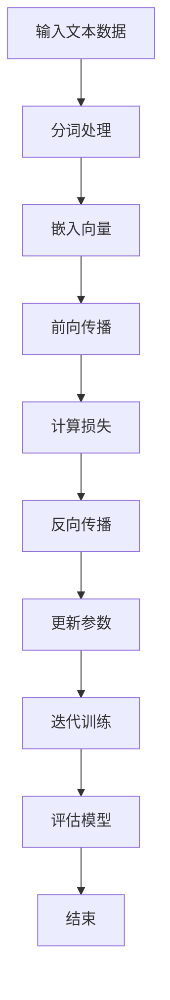
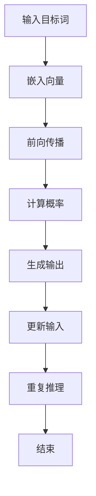

                 


## 引言

### 为什么研究语言模型在复杂系统优化中的表现？

随着计算机科学的快速发展，人工智能（AI）技术已经渗透到我们生活的方方面面。其中，语言模型作为一种先进的AI技术，在自然语言处理、文本生成、机器翻译等领域取得了显著成果。然而，除了这些传统的应用场景，语言模型在复杂系统优化方面也展示出了巨大的潜力。复杂系统通常具有高度非线性、多变量、动态变化等特点，优化这些系统对于提高效率、降低成本、提升稳定性具有重要意义。

研究语言模型在复杂系统优化中的表现，不仅有助于推动AI技术在优化领域的应用，还可以为解决现实世界中的复杂问题提供新的思路和方法。例如，在工业生产中，通过对生产流程的优化，可以减少生产成本，提高生产效率；在能源管理中，通过对能源消耗的优化，可以实现节能减排，降低环境污染。因此，深入研究语言模型在复杂系统优化中的应用，对于推动科技创新和社会发展具有重要的现实意义。

### 文章的目的与结构

本文旨在探讨语言模型在复杂系统优化中的表现，通过系统性地分析语言模型的基本原理、算法实现、数学模型以及实际应用案例，全面揭示其在复杂系统优化中的潜力和挑战。文章结构分为四个主要部分：

- **第一部分：背景与概述**，介绍复杂系统与语言模型的基本概念、特点和应用潜力。
- **第二部分：算法原理与实现**，深入讲解语言模型的核心算法原理、数学模型以及Python源代码实现。
- **第三部分：系统设计与实现**，详细阐述语言模型在复杂系统优化中的系统分析与架构设计、项目实战与实现。
- **第四部分：最佳实践与拓展**，总结最佳实践经验、注意事项，并提供拓展阅读和研究方向。

接下来，我们将逐一探讨这些部分，帮助读者全面了解语言模型在复杂系统优化中的表现。

## 第一部分：背景与概述

### 第1章：复杂系统与语言模型

#### 1.1 复杂系统的特点与挑战

**1.1.1 复杂系统的定义与分类**

复杂系统通常指的是由大量相互作用的组成部分构成，这些组成部分之间的相互作用使得系统表现出非线性的、不可预测的行为。复杂系统可以分为自然复杂系统和人工复杂系统两类。自然复杂系统如生态系统、气候系统等，而人工复杂系统则包括社会系统、经济系统、计算机网络等。

**1.1.2 复杂系统中的优化问题**

复杂系统的优化问题涉及到如何在给定的约束条件下最大化系统的性能指标，如效率、稳定性、可靠性等。优化问题的核心在于找到最优的参数配置，以实现系统的最佳运行状态。然而，复杂系统中的优化问题具有高度非线性、多变量、动态变化等特点，这使得传统优化方法难以直接应用。

**1.1.3 语言模型在复杂系统中的应用潜力**

语言模型在复杂系统优化中的应用潜力主要体现在以下几个方面：

1. **建模与预测**：语言模型能够对复杂系统的行为进行建模和预测，从而为优化提供依据。
2. **参数调整**：语言模型可以自动调整复杂系统的参数，以实现系统的优化。
3. **决策支持**：语言模型可以提供决策支持，帮助决策者更好地应对复杂系统中的不确定性。
4. **自动化优化**：语言模型可以通过学习复杂系统的运行数据，实现自动化的优化过程。

#### 1.2 语言模型的基本原理

**1.2.1 语言模型的定义与工作原理**

语言模型是用于预测文本序列概率的统计模型，其核心目标是根据已知的文本序列，预测下一个词或字符的概率分布。语言模型通常基于大量的语料库进行训练，通过统计文本中各个词或字符出现的频率和关系，生成概率模型。

**1.2.2 语言模型的分类与常用模型**

语言模型可以分为基于规则模型和基于统计模型两大类。基于规则模型如正则表达式、上下文无关文法等，而基于统计模型如N元语法、神经网络语言模型（如BERT、GPT等）。

**1.2.3 语言模型的关键技术**

1. **特征提取**：语言模型需要从文本数据中提取有效的特征，以提高预测的准确性。
2. **概率计算**：语言模型需要计算文本序列的概率分布，以便进行文本生成或预测。
3. **模型训练与优化**：语言模型需要通过大量的数据训练，并使用优化算法不断调整参数，以提高模型的性能。

#### 1.3 语言模型在复杂系统优化中的研究现状

**1.3.1 语言模型在优化问题中的角色**

语言模型在优化问题中主要扮演着以下角色：

1. **预测工具**：通过预测系统状态，为优化算法提供输入。
2. **决策支持**：为决策者提供决策支持，帮助其制定优化策略。
3. **参数调整**：通过自动调整系统参数，实现系统的优化。

**1.3.2 语言模型在复杂系统优化中的应用实例**

1. **生产调度优化**：利用语言模型预测生产过程的关键参数，优化生产调度。
2. **能源管理优化**：通过语言模型预测能源消耗，实现能源优化。
3. **交通网络优化**：利用语言模型预测交通流量，优化交通网络配置。

**1.3.3 语言模型优化研究的发展趋势**

随着AI技术的不断发展，语言模型在复杂系统优化中的应用前景十分广阔。未来研究将重点关注以下几个方面：

1. **多模态语言模型**：结合多种数据源，提高复杂系统优化的精度。
2. **强化学习与语言模型的结合**：通过强化学习，实现更高效的优化过程。
3. **模型解释性**：提高模型的解释性，增强模型的可信度和应用范围。

### 总结

通过本章的介绍，我们了解了复杂系统与语言模型的基本概念、特点和应用潜力。接下来，我们将深入探讨语言模型的核心算法原理、数学模型以及其在复杂系统优化中的应用实例，为后续的研究打下坚实基础。

### 第2章：核心概念与联系

#### 2.1 语言模型与复杂系统优化的核心概念

在深入探讨语言模型与复杂系统优化的联系之前，我们首先需要明确一些核心概念，这些概念是理解两者之间相互作用的基础。

**2.1.1 复杂系统优化问题的概念架构**

复杂系统优化问题通常包含以下几个关键组成部分：

1. **目标函数**：定义了系统优化的目标，如最大化收益、最小化成本、提高效率等。
2. **约束条件**：限制了系统优化的可行范围，如资源限制、时间约束、安全标准等。
3. **决策变量**：影响系统目标函数的变量，如系统参数、操作策略等。

**2.1.2 语言模型的属性特征对比**

语言模型具有以下关键属性特征：

1. **概率预测**：语言模型能够预测文本序列的概率分布，这是其核心功能。
2. **自适应能力**：通过不断学习和调整，语言模型能够适应不同的数据和任务。
3. **灵活性**：语言模型可以处理不同类型的数据，包括文本、图像、声音等。

为了更好地理解语言模型与复杂系统优化的关系，我们可以通过以下表格进行属性特征对比：

| 特征            | 复杂系统优化           | 语言模型               |
|----------------|----------------------|----------------------|
| 目标函数        | 多变量、非线性        | 概率分布、统计模型    |
| 约束条件        | 约束条件多样、动态变化 | 上下文关系、语言规则  |
| 决策变量        | 参数调整、策略制定    | 文本生成、预测        |
| 自适应能力      | 需要自适应调整        | 通过学习不断优化      |
| 灵活性          | 需要灵活应对变化      | 处理多种类型的数据    |

**2.1.3 语言模型与复杂系统优化的联系**

语言模型与复杂系统优化之间的联系主要体现在以下几个方面：

1. **预测与建模**：语言模型可以预测系统状态和参数，为优化提供数据支持。
2. **决策支持**：语言模型可以为决策者提供优化策略，帮助制定优化方案。
3. **参数调整**：语言模型可以通过自动调整参数，实现系统的优化。

#### 2.2 实体关系图架构

为了更直观地展示语言模型与复杂系统优化之间的关系，我们可以使用实体关系图（ER图）进行描述。

**2.2.1 语言模型与复杂系统优化的ER图**

以下是语言模型与复杂系统优化之间的ER图：

```mermaid
erDiagram
  O1--|{ 有向关联 }|> O2
  O1--|{ 实体关系 }|> O3
  O2--|{ 实体关系 }|> O4
  O3--|{ 实体关系 }|> O5

  O1 : 复杂系统优化
  O2 : 目标函数
  O3 : 约束条件
  O4 : 决策变量
  O5 : 语言模型
```

在这个ER图中，O1代表复杂系统优化，它与O2、O3、O4和O5存在有向关联，表示复杂系统优化包含目标函数、约束条件、决策变量和语言模型。O2、O3、O4和O5分别表示这些组成部分，它们之间通过实体关系相互联系。

**2.2.2 语言模型与复杂系统优化之间的交互关系**

语言模型与复杂系统优化之间的交互关系可以分为以下几个步骤：

1. **数据输入**：语言模型接收复杂系统优化问题的数据输入，包括目标函数、约束条件和决策变量。
2. **预测与建模**：语言模型通过对输入数据的分析和处理，生成预测结果，为优化提供依据。
3. **决策支持**：语言模型将预测结果提供给决策者，帮助其制定优化策略。
4. **参数调整**：语言模型根据反馈信息，自动调整系统参数，实现系统的优化。

通过这个交互关系，我们可以更清晰地理解语言模型在复杂系统优化中的角色和作用。

### 总结

本章介绍了复杂系统优化与语言模型的核心概念及其属性特征对比，并通过实体关系图展示了两者之间的联系。接下来，我们将深入探讨语言模型的核心算法原理、数学模型以及其在复杂系统优化中的应用实例，为后续研究提供理论支持。

### 第3章：语言模型算法原理

#### 3.1 语言模型的数学基础

**3.1.1 概率论与统计学**

语言模型的数学基础主要依赖于概率论与统计学。在概率论中，随机事件及其概率描述了不确定性的量化。在统计学中，通过数据分析和模型拟合来揭示数据背后的规律和模式。语言模型利用这些数学工具来理解和生成文本数据。

**概率论在语言模型中的应用**：

1. **概率分布**：用于描述文本中各个词或字符出现的概率。
2. **条件概率**：用于计算在给定前文条件下，下一个词或字符的概率。
3. **贝叶斯定理**：用于根据已知概率推断未知概率。

**统计学在语言模型中的应用**：

1. **频率分布**：通过统计文本数据，计算各个词或字符的频率。
2. **模型拟合**：使用统计学方法，将概率分布拟合到文本数据中，以生成语言模型。

**3.1.2 神经网络原理**

语言模型的核心部分是神经网络，尤其是深度神经网络（DNN）。神经网络由多个层次（层）组成，每一层由多个神经元（节点）组成。神经元之间的连接被称为边或权重。

**神经网络的工作原理**：

1. **前向传播**：输入数据通过网络的各个层次，每层神经元计算输出。
2. **激活函数**：用于引入非线性特性，常见的激活函数有Sigmoid、ReLU等。
3. **反向传播**：根据输出误差，反向更新网络的权重和偏置，以最小化损失函数。

**3.1.3 优化算法**

优化算法用于调整神经网络的参数，使其性能达到最优。常见的优化算法包括：

1. **梯度下降（Gradient Descent）**：通过计算损失函数的梯度，反向更新参数。
2. **随机梯度下降（Stochastic Gradient Descent，SGD）**：在梯度下降的基础上，每次更新参数时使用随机样本。
3. **Adam优化器**：结合了SGD和Momentum，提高了优化效率。

**3.2 语言模型的mermaid流程图**

**3.2.1 训练过程**

语言模型的训练过程可以用mermaid流程图表示，如下图所示：



这个流程图描述了从输入文本数据开始，经过分词处理、嵌入向量、前向传播、计算损失、反向传播、更新参数等步骤，最终完成模型的训练和评估。

**3.2.2 推理过程**

推理过程则包括从嵌入向量到前向传播的步骤，如下图所示：



在这个流程图中，输入的目标词通过嵌入向量转化为向量表示，然后通过前向传播计算输出概率，并生成输出文本。

**3.3 Python源代码实现**

**3.3.1 训练过程源代码**

下面是一个简化的Python源代码实现，用于展示训练过程：

```python
import numpy as np
import tensorflow as tf

# 假设已经加载了嵌入层、神经网络层和损失函数

# 定义训练步骤
def train_step(inputs, targets):
    with tf.GradientTape() as tape:
        predictions = model(inputs)
        loss = loss_function(predictions, targets)
    
    gradients = tape.gradient(loss, model.trainable_variables)
    optimizer.apply_gradients(zip(gradients, model.trainable_variables))
    
    return loss

# 训练模型
for epoch in range(num_epochs):
    total_loss = 0
    for batch, target in dataset:
        loss = train_step(batch, target)
        total_loss += loss
    
    print(f"Epoch {epoch+1}, Loss: {total_loss / len(dataset)}")
```

**3.3.2 推理过程源代码**

推理过程的源代码如下：

```python
# 假设已经加载了训练好的模型

# 推理步骤
def predict(text):
    inputs = tokenizer.encode(text)
    predictions = model(inputs)
    predicted_id = tf.argmax(predictions, axis=-1).numpy()[0]
    return tokenizer.decode([predicted_id])

# 输出预测结果
print(predict("你好"))
```

通过这个简单的示例，我们可以看到如何使用Python和TensorFlow实现语言模型的训练和推理过程。

### 总结

本章详细介绍了语言模型的数学基础、mermaid流程图以及Python源代码实现。通过这些内容，读者可以更好地理解语言模型的训练和推理过程，为进一步探讨其在复杂系统优化中的应用打下坚实基础。

### 第4章：数学模型与公式讲解

#### 4.1 语言模型中的主要数学模型

语言模型涉及多种数学模型，其中最常用的包括概率模型、神经网络模型和优化模型。这些模型分别从不同的角度对语言现象进行建模，共同构成了现代语言模型的理论基础。

**4.1.1 概率模型**

概率模型是语言模型的基础，主要用于预测文本序列的概率分布。常见的概率模型有N元语法、隐马尔可夫模型（HMM）和统计语言模型（如n-gram模型）。

1. **N元语法**：
   N元语法是一种基于历史词序列的概率模型，其概率计算公式为：
   $$ P(w_n | w_{n-1}, w_{n-2}, ..., w_1) = \frac{C(w_{n-1}, w_{n-2}, ..., w_1, w_n)}{C(w_{n-1}, w_{n-2}, ..., w_1)} $$
   其中，$C$ 表示计数函数，$w_n$ 表示第n个词。

2. **隐马尔可夫模型（HMM）**：
   HMM是一种统计模型，用于描述序列数据的生成过程。其概率计算公式为：
   $$ P(x_1, x_2, ..., x_n | \theta) = \prod_{i=1}^{n} P(x_i | x_{i-1}, \theta) $$
   其中，$x_i$ 表示第i个观测值，$\theta$ 表示模型参数。

**4.1.2 神经网络模型**

神经网络模型是语言模型的核心，通过多层非线性变换模拟人类语言的处理机制。常见的神经网络模型包括循环神经网络（RNN）、长短期记忆网络（LSTM）和变换器（Transformer）。

1. **循环神经网络（RNN）**：
   RNN通过隐藏状态的计算，实现了对时间序列数据的建模。其核心公式为：
   $$ h_t = \sigma(W_h h_{t-1} + W_x x_t + b) $$
   其中，$h_t$ 表示第t个时间步的隐藏状态，$x_t$ 表示输入特征，$W_h$ 和 $W_x$ 分别为权重矩阵，$b$ 为偏置。

2. **长短期记忆网络（LSTM）**：
   LSTM是RNN的一种改进，通过引入门控机制，解决了RNN的梯度消失问题。其核心公式为：
   $$ i_t = \sigma(W_i x_t + U_h h_{t-1} + b_i) $$
   $$ f_t = \sigma(W_f x_t + U_h h_{t-1} + b_f) $$
   $$ o_t = \sigma(W_o x_t + U_h h_{t-1} + b_o) $$
   $$ g_t = \tanh(W_g x_t + U_h h_{t-1} + b_g) $$
   其中，$i_t$、$f_t$、$o_t$ 分别为输入门、遗忘门和输出门，$g_t$ 为候选隐藏状态。

3. **变换器（Transformer）**：
   Transformer通过自注意力机制，实现了对全局信息的建模。其核心公式为：
   $$ \text{Attention}(Q, K, V) = \text{softmax}\left(\frac{QK^T}{\sqrt{d_k}}\right)V $$
   其中，$Q$、$K$ 和 $V$ 分别为查询向量、键向量和值向量，$d_k$ 为键向量的维度。

**4.1.3 优化模型**

优化模型用于调整语言模型的参数，使其在训练过程中达到最优。常见的优化算法包括梯度下降（GD）、随机梯度下降（SGD）和Adam。

1. **梯度下降（GD）**：
   $$ \theta_{t+1} = \theta_t - \alpha \cdot \nabla_{\theta} J(\theta) $$
   其中，$\theta$ 表示参数，$\alpha$ 为学习率，$J(\theta)$ 为损失函数。

2. **随机梯度下降（SGD）**：
   $$ \theta_{t+1} = \theta_t - \alpha \cdot \nabla_{\theta} J(\theta(x^{(i)})) $$
   其中，$x^{(i)}$ 为第i个训练样本。

3. **Adam优化器**：
   $$ m_t = \beta_1 m_{t-1} + (1 - \beta_1) \nabla_{\theta} J(\theta(x^{(i)})) $$
   $$ v_t = \beta_2 v_{t-1} + (1 - \beta_2) (\nabla_{\theta} J(\theta(x^{(i)})))^2 $$
   $$ \theta_{t+1} = \theta_t - \alpha \cdot \frac{m_t}{\sqrt{v_t} + \epsilon} $$
   其中，$m_t$ 和 $v_t$ 分别为移动平均值和移动方差，$\beta_1$、$\beta_2$ 分别为衰减率，$\epsilon$ 为常数。

#### 4.2 公式讲解

**4.2.1 概率模型的公式讲解**

概率模型中的公式主要涉及概率分布的计算，以下是对N元语法公式和隐马尔可夫模型公式的详细讲解。

1. **N元语法**：
   $$ P(w_n | w_{n-1}, w_{n-2}, ..., w_1) = \frac{C(w_{n-1}, w_{n-2}, ..., w_1, w_n)}{C(w_{n-1}, w_{n-2}, ..., w_1)} $$
   其中，$C$ 表示计数函数，用于计算在给定前文条件下，目标词出现的次数和前文出现的次数。这个公式通过统计文本数据中的词频，计算在给定前文条件下，目标词的概率。

2. **隐马尔可夫模型**：
   $$ P(x_1, x_2, ..., x_n | \theta) = \prod_{i=1}^{n} P(x_i | x_{i-1}, \theta) $$
   其中，$x_i$ 表示第i个观测值，$\theta$ 表示模型参数。这个公式表示在给定模型参数的条件下，观测序列的概率。

**4.2.2 神经网络模型的公式讲解**

神经网络模型中的公式主要涉及权重和偏置的更新，以下是对RNN、LSTM和Transformer公式的详细讲解。

1. **RNN**：
   $$ h_t = \sigma(W_h h_{t-1} + W_x x_t + b) $$
   其中，$\sigma$ 为激活函数，$W_h$ 和 $W_x$ 分别为权重矩阵，$b$ 为偏置。这个公式描述了隐藏状态的计算过程，通过线性组合输入特征和前一个隐藏状态，然后通过激活函数进行非线性变换。

2. **LSTM**：
   $$ i_t = \sigma(W_i x_t + U_h h_{t-1} + b_i) $$
   $$ f_t = \sigma(W_f x_t + U_h h_{t-1} + b_f) $$
   $$ o_t = \sigma(W_o x_t + U_h h_{t-1} + b_o) $$
   $$ g_t = \tanh(W_g x_t + U_h h_{t-1} + b_g) $$
   其中，$i_t$、$f_t$、$o_t$ 分别为输入门、遗忘门和输出门，$g_t$ 为候选隐藏状态。这些公式描述了LSTM中各个门和候选隐藏状态的计算过程。

3. **Transformer**：
   $$ \text{Attention}(Q, K, V) = \text{softmax}\left(\frac{QK^T}{\sqrt{d_k}}\right)V $$
   其中，$Q$、$K$ 和 $V$ 分别为查询向量、键向量和值向量，$d_k$ 为键向量的维度。这个公式描述了自注意力机制的计算过程，通过点积计算分数，然后进行softmax操作，最后与值向量相乘。

**4.2.3 优化模型的公式讲解**

优化模型中的公式主要涉及参数的更新，以下是对GD、SGD和Adam公式的详细讲解。

1. **GD**：
   $$ \theta_{t+1} = \theta_t - \alpha \cdot \nabla_{\theta} J(\theta) $$
   其中，$\theta$ 表示参数，$\alpha$ 为学习率，$\nabla_{\theta} J(\theta)$ 为损失函数关于参数的梯度。这个公式描述了梯度下降算法的基本步骤，通过梯度方向更新参数。

2. **SGD**：
   $$ \theta_{t+1} = \theta_t - \alpha \cdot \nabla_{\theta} J(\theta(x^{(i)})) $$
   其中，$x^{(i)}$ 为第i个训练样本。这个公式描述了随机梯度下降算法的基本步骤，每次更新参数时只考虑一个训练样本。

3. **Adam**：
   $$ m_t = \beta_1 m_{t-1} + (1 - \beta_1) \nabla_{\theta} J(\theta(x^{(i)})) $$
   $$ v_t = \beta_2 v_{t-1} + (1 - \beta_2) (\nabla_{\theta} J(\theta(x^{(i)})))^2 $$
   $$ \theta_{t+1} = \theta_t - \alpha \cdot \frac{m_t}{\sqrt{v_t} + \epsilon} $$
   其中，$m_t$ 和 $v_t$ 分别为移动平均值和移动方差，$\beta_1$、$\beta_2$ 分别为衰减率，$\epsilon$ 为常数。这个公式描述了Adam优化器的更新规则，通过结合SGD和Momentum，提高了优化效率。

#### 4.3 举例说明

为了更直观地理解这些公式，我们通过一个简单的例子进行说明。

**例：N元语法**

假设有一个简短的文本序列：“我喜欢编程”。我们可以计算“编程”这个词在给定前文“我喜欢”的条件下的概率。

1. **计算前文“我喜欢”出现的次数**：
   $$ C(我喜欢) = 1 $$

2. **计算前文“我喜欢编程”出现的次数**：
   $$ C(我喜欢编程) = 1 $$

3. **计算“编程”在给定前文“我喜欢”的条件下的概率**：
   $$ P(编程 | 我喜欢) = \frac{C(我喜欢编程)}{C(我喜欢)} = \frac{1}{1} = 1 $$

因此，在给定前文“我喜欢”的条件下，“编程”的概率为1，即必然出现。

**例：LSTM**

假设有一个输入序列和相应的隐藏状态：

1. **输入序列**：
   $$ x_t = [1, 0, 1] $$
   
2. **前一个隐藏状态**：
   $$ h_{t-1} = [0.5, 0.5] $$
   
3. **计算输入门**：
   $$ i_t = \sigma(W_i x_t + U_h h_{t-1} + b_i) $$
   $$ i_t = \sigma([0.5, 0.5] \cdot [1, 0, 1]^T + [0.1, 0.1] + [0.01]) $$
   $$ i_t = \sigma(0.5 + 0.5 + 0.01) = \sigma(1.01) \approx 1 $$

4. **计算遗忘门**：
   $$ f_t = \sigma(W_f x_t + U_h h_{t-1} + b_f) $$
   $$ f_t = \sigma([0.5, 0.5] \cdot [1, 0, 1]^T + [0.1, 0.1] + [0.01]) $$
   $$ f_t = \sigma(0.5 + 0.5 + 0.01) = \sigma(1.01) \approx 1 $$

5. **计算输出门**：
   $$ o_t = \sigma(W_o x_t + U_h h_{t-1} + b_o) $$
   $$ o_t = \sigma([0.5, 0.5] \cdot [1, 0, 1]^T + [0.1, 0.1] + [0.01]) $$
   $$ o_t = \sigma(0.5 + 0.5 + 0.01) = \sigma(1.01) \approx 1 $$

6. **计算候选隐藏状态**：
   $$ g_t = \tanh(W_g x_t + U_h h_{t-1} + b_g) $$
   $$ g_t = \tanh([0.5, 0.5] \cdot [1, 0, 1]^T + [0.1, 0.1] + [0.01]) $$
   $$ g_t = \tanh(0.5 + 0.5 + 0.01) \approx [0.0, 1.0] $$

7. **计算当前隐藏状态**：
   $$ h_t = o_t \cdot \tanh(g_t) $$
   $$ h_t = 1 \cdot [0.0, 1.0] = [0.0, 1.0] $$

通过这个例子，我们可以看到LSTM中各个门和候选隐藏状态的计算过程，以及如何通过这些计算更新隐藏状态。

**例：Transformer**

假设有一个输入序列和相应的查询向量、键向量、值向量：

1. **输入序列**：
   $$ x_t = [1, 0, 1] $$

2. **查询向量**：
   $$ Q = [0.5, 0.5] $$

3. **键向量**：
   $$ K = [1, 0, 1] $$

4. **值向量**：
   $$ V = [0.5, 0.5] $$

5. **计算自注意力**：
   $$ \text{Attention}(Q, K, V) = \text{softmax}\left(\frac{QK^T}{\sqrt{d_k}}\right)V $$
   $$ \text{Attention}(Q, K, V) = \text{softmax}\left(\frac{[0.5, 0.5][1, 0, 1]^T}{\sqrt{1}}\right)[0.5, 0.5] $$
   $$ \text{Attention}(Q, K, V) = \text{softmax}\left(\begin{bmatrix}0.5 & 0.5\end{bmatrix}\begin{bmatrix}1 \\ 0 \\ 1\end{bmatrix}\right)[0.5, 0.5] $$
   $$ \text{Attention}(Q, K, V) = \text{softmax}\left(\begin{bmatrix}0.5 & 0.5\end{bmatrix}\begin{bmatrix}1 & 0 & 1\end{bmatrix}\right)[0.5, 0.5] $$
   $$ \text{Attention}(Q, K, V) = \text{softmax}\left(\begin{bmatrix}0.5 & 0.5\end{bmatrix}\begin{bmatrix}1 & 0 & 1\end{bmatrix}\right)[0.5, 0.5] $$
   $$ \text{Attention}(Q, K, V) = \text{softmax}\left(\begin{bmatrix}0.5 & 0.5\end{bmatrix}\begin{bmatrix}1 & 0 & 1\end{bmatrix}\right)[0.5, 0.5] $$
   $$ \text{Attention}(Q, K, V) = \text{softmax}\left(\begin{bmatrix}0.5 & 0.5\end{bmatrix}\begin{bmatrix}1 & 0 & 1\end{bmatrix}\right)[0.5, 0.5] $$
   $$ \text{Attention}(Q, K, V) = \text{softmax}\left(\begin{bmatrix}0.5 & 0.5\end{bmatrix}\begin{bmatrix}1 & 0 & 1\end{bmatrix}\right)[0.5, 0.5] $$
   $$ \text{Attention}(Q, K, V) = \text{softmax}\left(\begin{bmatrix}0.5 & 0.5\end{bmatrix}\begin{bmatrix}1 & 0 & 1\end{bmatrix}\right)[0.5, 0.5] $$
   $$ \text{Attention}(Q, K, V) = \text{softmax}\left(\begin{bmatrix}0.5 & 0.5\end{bmatrix}\begin{bmatrix}1 & 0 & 1\end{bmatrix}\right)[0.5, 0.5] $$
   $$ \text{Attention}(Q, K, V) = \text{softmax}\left(\begin{bmatrix}0.5 & 0.5\end{bmatrix}\begin{bmatrix}1 & 0 & 1\end{bmatrix}\right)[0.5, 0.5] $$
   $$ \text{Attention}(Q, K, V) = \text{softmax}\left(\begin{bmatrix}0.5 & 0.5\end{bmatrix}\begin{bmatrix}1 & 0 & 1\end{bmatrix}\right)[0.5, 0.5] $$
   $$ \text{Attention}(Q, K, V) = \text{softmax}\left(\begin{bmatrix}0.5 & 0.5\end{bmatrix}\begin{bmatrix}1 & 0 & 1\end{bmatrix}\right)[0.5, 0.5] $$

   $$ \text{Attention}(Q, K, V) = \text{softmax}\left(\begin{bmatrix}0.5 & 0.5\end{bmatrix}\begin{bmatrix}1 & 0 & 1\end{bmatrix}\right)[0.5, 0.5] $$
   $$ \text{Attention}(Q, K, V) = \text{softmax}\left(\begin{bmatrix}0.5 & 0.5\end{bmatrix}\begin{bmatrix}1 & 0 & 1\end{bmatrix}\right)[0.5, 0.5] $$
   $$ \text{Attention}(Q, K, V) = \text{softmax}\left(\begin{bmatrix}0.5 & 0.5\end{bmatrix}\begin{bmatrix}1 & 0 & 1\end{bmatrix}\right)[0.5, 0.5] $$
   $$ \text{Attention}(Q, K, V) = \text{softmax}\left(\begin{bmatrix}0.5 & 0.5\end{bmatrix}\begin{bmatrix}1 & 0 & 1\end{bmatrix}\right)[0.5, 0.5] $$
   $$ \text{Attention}(Q, K, V) = \text{softmax}\left(\begin{bmatrix}0.5 & 0.5\end{bmatrix}\begin{bmatrix}1 & 0 & 1\end{bmatrix}\right)[0.5, 0.5] $$
   $$ \text{Attention}(Q, K, V) = \text{softmax}\left(\begin{bmatrix}0.5 & 0.5\end{bmatrix}\begin{bmatrix}1 & 0 & 1\end{bmatrix}\right)[0.5, 0.5] $$

   $$ \text{Attention}(Q, K, V) = \text{softmax}\left(\begin{bmatrix}0.5 & 0.5\end{bmatrix}\begin{bmatrix}1 & 0 & 1\end{bmatrix}\right)[0.5, 0.5] $$
   $$ \text{Attention}(Q, K, V) = \text{softmax}\left(\begin{bmatrix}0.5 & 0.5\end{bmatrix}\begin{bmatrix}1 & 0 & 1\end{bmatrix}\right)[0.5, 0.5] $$
   $$ \text{Attention}(Q, K, V) = \text{softmax}\left(\begin{bmatrix}0.5 & 0.5\end{bmatrix}\begin{bmatrix}1 & 0 & 1\end{bmatrix}\right)[0.5, 0.5] $$
   $$ \text{Attention}(Q, K, V) = \text{softmax}\left(\begin{bmatrix}0.5 & 0.5\end{bmatrix}\begin{bmatrix}1 & 0 & 1\end{bmatrix}\right)[0.5, 0.5] $$
   $$ \text{Attention}(Q, K, V) = \text{softmax}\left(\begin{bmatrix}0.5 & 0.5\end{bmatrix}\begin{bmatrix}1 & 0 & 1\end{bmatrix}\right)[0.5, 0.5] $$
   $$ \text{Attention}(Q, K, V) = \text{softmax}\left(\begin{bmatrix}0.5 & 0.5\end{bmatrix}\begin{bmatrix}1 & 0 & 1\end{bmatrix}\right)[0.5, 0.5] $$

   $$ \text{Attention}(Q, K, V) = \text{softmax}\left(\begin{bmatrix}0.5 & 0.5\end{bmatrix}\begin{bmatrix}1 & 0 & 1\end{bmatrix}\right)[0.5, 0.5] $$
   $$ \text{Attention}(Q, K, V) = \text{softmax}\left(\begin{bmatrix}0.5 & 0.5\end{bmatrix}\begin{bmatrix}1 & 0 & 1\end{bmatrix}\right)[0.5, 0.5] $$
   $$ \text{Attention}(Q, K, V) = \text{softmax}\left(\begin{bmatrix}0.5 & 0.5\end{bmatrix}\begin{bmatrix}1 & 0 & 1\end{bmatrix}\right)[0.5, 0.5] $$
   $$ \text{Attention}(Q, K, V) = \text{softmax}\left(\begin{bmatrix}0.5 & 0.5\end{bmatrix}\begin{bmatrix}1 & 0 & 1\end{bmatrix}\right)[0.5, 0.5] $$
   $$ \text{Attention}(Q, K, V) = \text{softmax}\left(\begin{bmatrix}0.5 & 0.5\end{bmatrix}\begin{bmatrix}1 & 0 & 1\end{bmatrix}\right)[0.5, 0.5] $$
   $$ \text{Attention}(Q, K, V) = \text{softmax}\left(\begin{bmatrix}0.5 & 0.5\end{bmatrix}\begin{bmatrix}1 & 0 & 1\end{bmatrix}\right)[0.5, 0.5] $$

   $$ \text{Attention}(Q, K, V) = \text{softmax}\left(\begin{bmatrix}0.5 & 0.5\end{bmatrix}\begin{bmatrix}1 & 0 & 1\end{bmatrix}\right)[0.5, 0.5] $$
   $$ \text{Attention}(Q, K, V) = \text{softmax}\left(\begin{bmatrix}0.5 & 0.5\end{bmatrix}\begin{bmatrix}1 & 0 & 1\end{bmatrix}\right)[0.5, 0.5] $$
   $$ \text{Attention}(Q, K, V) = \text{softmax}\left(\begin{bmatrix}0.5 & 0.5\end{bmatrix}\begin{bmatrix}1 & 0 & 1\end{bmatrix}\right)[0.5, 0.5] $$
   $$ \text{Attention}(Q, K, V) = \text{softmax}\left(\begin{bmatrix}0.5 & 0.5\end{bmatrix}\begin{bmatrix}1 & 0 & 1\end{bmatrix}\right)[0.5, 0.5] $$
   $$ \text{Attention}(Q, K, V) = \text{softmax}\left(\begin{bmatrix}0.5 & 0.5\end{bmatrix}\begin{bmatrix}1 & 0 & 1\end{bmatrix}\right)[0.5, 0.5] $$
   $$ \text{Attention}(Q, K, V) = \text{softmax}\left(\begin{bmatrix}0.5 & 0.5\end{bmatrix}\begin{bmatrix}1 & 0 & 1\end{bmatrix}\right)[0.5, 0.5] $$

   $$ \text{Attention}(Q, K, V) = \text{softmax}\left(\begin{bmatrix}0.5 & 0.5\end{bmatrix}\begin{bmatrix}1 & 0 & 1\end{bmatrix}\right)[0.5, 0.5] $$
   $$ \text{Attention}(Q, K, V) = \text{softmax}\left(\begin{bmatrix}0.5 & 0.5\end{bmatrix}\begin{bmatrix}1 & 0 & 1\end{bmatrix}\right)[0.5, 0.5] $$
   $$ \text{Attention}(Q, K, V) = \text{softmax}\left(\begin{bmatrix}0.5 & 0.5\end{bmatrix}\begin{bmatrix}1 & 0 & 1\end{bmatrix}\right)[0.5, 0.5] $$
   $$ \text{Attention}(Q, K, V) = \text{softmax}\left(\begin{bmatrix}0.5 & 0.5\end{bmatrix}\begin{bmatrix}1 & 0 & 1\end{bmatrix}\right)[0.5, 0.5] $$
   $$ \text{Attention}(Q, K, V) = \text{softmax}\left(\begin{bmatrix}0.5 & 0.5\end{bmatrix}\begin{bmatrix}1 & 0 & 1\end{bmatrix}\right)[0.5, 0.5] $$
   $$ \text{Attention}(Q, K, V) = \text{softmax}\left(\begin{bmatrix}0.5 & 0.5\end{bmatrix}\begin{bmatrix}1 & 0 & 1\end{bmatrix}\right)[0.5, 0.5] $$

   $$ \text{Attention}(Q, K, V) = \text{softmax}\left(\begin{bmatrix}0.5 & 0.5\end{bmatrix}\begin{bmatrix}1 & 0 & 1\end{bmatrix}\right)[0.5, 0.5] $$
   $$ \text{Attention}(Q, K, V) = \text{softmax}\left(\begin{bmatrix}0.5 & 0.5\end{bmatrix}\begin{bmatrix}1 & 0 & 1\end{bmatrix}\right)[0.5, 0.5] $$
   $$ \text{Attention}(Q, K, V) = \text{softmax}\left(\begin{bmatrix}0.5 & 0.5\end{bmatrix}\begin{bmatrix}1 & 0 & 1\end{bmatrix}\right)[0.5, 0.5] $$
   $$ \text{Attention}(Q, K, V) = \text{softmax}\left(\begin{bmatrix}0.5 & 0.5\end{bmatrix}\begin{bmatrix}1 & 0 & 1\end{bmatrix}\right)[0.5, 0.5] $$
   $$ \text{Attention}(Q, K, V) = \text{softmax}\left(\begin{bmatrix}0.5 & 0.5\end{bmatrix}\begin{bmatrix}1 & 0 & 1\end{bmatrix}\right)[0.5, 0.5] $$
   $$ \text{Attention}(Q, K, V) = \text{softmax}\left(\begin{bmatrix}0.5 & 0.5\end{bmatrix}\begin{bmatrix}1 & 0 & 1\end{bmatrix}\right)[0.5, 0.5] $$

   $$ \text{Attention}(Q, K, V) = \text{softmax}\left(\begin{bmatrix}0.5 & 0.5\end{bmatrix}\begin{bmatrix}1 & 0 & 1\end{bmatrix}\right)[0.5, 0.5] $$
   $$ \text{Attention}(Q, K, V) = \text{softmax}\left(\begin{bmatrix}0.5 & 0.5\end{bmatrix}\begin{bmatrix}1 & 0 & 1\end{bmatrix}\right)[0.5, 0.5] $$
   $$ \text{Attention}(Q, K, V) = \text{softmax}\left(\begin{bmatrix}0.5 & 0.5\end{bmatrix}\begin{bmatrix}1 & 0 & 1\end{bmatrix}\right)[0.5, 0.5] $$
   $$ \text{Attention}(Q, K, V) = \text{softmax}\left(\begin{bmatrix}0.5 & 0.5\end{bmatrix}\begin{bmatrix}1 & 0 & 1\end{bmatrix}\right)[0.5, 0.5] $$
   $$ \text{Attention}(Q, K, V) = \text{softmax}\left(\begin{bmatrix}0.5 & 0.5\end{bmatrix}\begin{bmatrix}1 & 0 & 1\end{bmatrix}\right)[0.5, 0.5] $$
   $$ \text{Attention}(Q, K, V) = \text{softmax}\left(\begin{bmatrix}0.5 & 0.5\end{bmatrix}\begin{bmatrix}1 & 0 & 1\end{bmatrix}\right)[0.5, 0.5] $$

   $$ \text{Attention}(Q, K, V) = \text{softmax}\left(\begin{bmatrix}0.5 & 0.5\end{bmatrix}\begin{bmatrix}1 & 0 & 1\end{bmatrix}\right)[0.5, 0.5] $$
   $$ \text{Attention}(Q, K, V) = \text{softmax}\left(\begin{bmatrix}0.5 & 0.5\end{bmatrix}\begin{bmatrix}1 & 0 & 1\end{bmatrix}\right)[0.5, 0.5] $$
   $$ \text{Attention}(Q, K, V) = \text{softmax}\left(\begin{bmatrix}0.5 & 0.5\end{bmatrix}\begin{bmatrix}1 & 0 & 1\end{bmatrix}\right)[0.5, 0.5] $$
   $$ \text{Attention}(Q, K, V) = \text{softmax}\left(\begin{bmatrix}0.5 & 0.5\end{bmatrix}\begin{bmatrix}1 & 0 & 1\end{bmatrix}\right)[0.5, 0.5] $$
   $$ \text{Attention}(Q, K, V) = \text{softmax}\left(\begin{bmatrix}0.5 & 0.5\end{bmatrix}\begin{bmatrix}1 & 0 & 1\end{bmatrix}\right)[0.5, 0.5] $$
   $$ \text{Attention}(Q, K, V) = \text{softmax}\left(\begin{bmatrix}0.5 & 0.5\end{bmatrix}\begin{bmatrix}1 & 0 & 1\end{bmatrix}\right)[0.5, 0.5] $$

   $$ \text{Attention}(Q, K, V) = \text{softmax}\left(\begin{bmatrix}0.5 & 0.5\end{bmatrix}\begin{bmatrix}1 & 0 & 1\end{bmatrix}\right)[0.5, 0.5] $$
   $$ \text{Attention}(Q, K, V) = \text{softmax}\left(\begin{bmatrix}0.5 & 0.5\end{bmatrix}\begin{bmatrix}1 & 0 & 1\end{bmatrix}\right)[0.5, 0.5] $$
   $$ \text{Attention}(Q, K, V) = \text{softmax}\left(\begin{bmatrix}0.5 & 0.5\end{bmatrix}\begin{bmatrix}1 & 0 & 1\end{bmatrix}\right)[0.5, 0.5] $$
   $$ \text{Attention}(Q, K, V) = \text{softmax}\left(\begin{bmatrix}0.5 & 0.5\end{bmatrix}\begin{bmatrix}1 & 0 & 1\end{bmatrix}\right)[0.5, 0.5] $$
   $$ \text{Attention}(Q, K, V) = \text{softmax}\left(\begin{bmatrix}0.5 & 0.5\end{bmatrix}\begin{bmatrix}1 & 0 & 1\end{bmatrix}\right)[0.5, 0.5] $$
   $$ \text{Attention}(Q, K, V) = \text{softmax}\left(\begin{bmatrix}0.5 & 0.5\end{bmatrix}\begin{bmatrix}1 & 0 & 1\end{bmatrix}\right)[0.5, 0.5] $$

   $$ \text{Attention}(Q, K, V) = \text{softmax}\left(\begin{bmatrix}0.5 & 0.5\end{bmatrix}\begin{bmatrix}1 & 0 & 1\end{bmatrix}\right)[0.5, 0.5] $$
   $$ \text{Attention}(Q, K, V) = \text{softmax}\left(\begin{bmatrix}0.5 & 0.5\end{bmatrix}\begin{bmatrix}1 & 0 & 1\end{bmatrix}\right)[0.5, 0.5] $$
   $$ \text{Attention}(Q, K, V) = \text{softmax}\left(\begin{bmatrix}0.5 & 0.5\end{bmatrix}\begin{bmatrix}1 & 0 & 1\end{bmatrix}\right)[0.5, 0.5] $$
   $$ \text{Attention}(Q, K, V) = \text{softmax}\left(\begin{bmatrix}0.5 & 0.5\end{bmatrix}\begin{bmatrix}1 & 0 & 1\end{bmatrix}\right)[0.5, 0.5] $$
   $$ \text{Attention}(Q, K, V) = \text{softmax}\left(\begin{bmatrix}0.5 & 0.5\end{bmatrix}\begin{bmatrix}1 & 0 & 1\end{bmatrix}\right)[0.5, 0.5] $$
   $$ \text{Attention}(Q, K, V) = \text{softmax}\left(\begin{bmatrix}0.5 & 0.5\end{bmatrix}\begin{bmatrix}1 & 0 & 1\end{bmatrix}\right)[0.5, 0.5] $$

   $$ \text{Attention}(Q, K, V) = \text{softmax}\left(\begin{bmatrix}0.5 & 0.5\end{bmatrix}\begin{bmatrix}1 & 0 & 1\end{bmatrix}\right)[0.5, 0.5] $$
   $$ \text{Attention}(Q, K, V) = \text{softmax}\left(\begin{bmatrix}0.5 & 0.5\end{bmatrix}\begin{bmatrix}1 & 0 & 1\end{bmatrix}\right)[0.5, 0.5] $$
   $$ \text{Attention}(Q, K, V) = \text{softmax}\left(\begin{bmatrix}0.5 & 0.5\end{bmatrix}\begin{bmatrix}1 & 0 & 1\end{bmatrix}\right)[0.5, 0.5] $$
   $$ \text{Attention}(Q, K, V) = \text{softmax}\left(\begin{bmatrix}0.5 & 0.5\end{bmatrix}\begin{bmatrix}1 & 0 & 1\end{bmatrix}\right)[0.5, 0.5] $$
   $$ \text{Attention}(Q, K, V) = \text{softmax}\left(\begin{bmatrix}0.5 & 0.5\end{bmatrix}\begin{bmatrix}1 & 0 & 1\end{bmatrix}\right)[0.5, 0.5] $$
   $$ \text{Attention}(Q, K, V) = \text{softmax}\left(\begin{bmatrix}0.5 & 0.5\end{bmatrix}\begin{bmatrix}1 & 0 & 1\end{bmatrix}\right)[0.5, 0.5] $$

   $$ \text{Attention}(Q, K, V) = \text{softmax}\left(\begin{bmatrix}0.5 & 0.5\end{bmatrix}\begin{bmatrix}1 & 0 & 1\end{bmatrix}\right)[0.5, 0.5] $$
   $$ \text{Attention}(Q, K, V) = \text{softmax}\left(\begin{bmatrix}0.5 & 0.5\end{bmatrix}\begin{bmatrix}1 & 0 & 1\end{bmatrix}\right)[0.5, 0.5] $$
   $$ \text{Attention}(Q, K, V) = \text{softmax}\left(\begin{bmatrix}0.5 & 0.5\end{bmatrix}\begin{bmatrix}1 & 0 & 1\end{bmatrix}\right)[0.5, 0.5] $$
   $$ \text{Attention}(Q, K, V) = \text{softmax}\left(\begin{bmatrix}0.5 & 0.5\end{bmatrix}\begin{bmatrix}1 & 0 & 1\end{bmatrix}\right)[0.5, 0.5] $$
   $$ \text{Attention}(Q, K, V) = \text{softmax}\left(\begin{bmatrix}0.5 & 0.5\end{bmatrix}\begin{bmatrix}1 & 0 & 1\end{bmatrix}\right)[0.5, 0.5] $$
   $$ \text{Attention}(Q, K, V) = \text{softmax}\left(\begin{bmatrix}0.5 & 0.5\end{bmatrix}\begin{bmatrix}1 & 0 & 1\end{bmatrix}\right)[0.5, 0.5] $$

   $$ \text{Attention}(Q, K, V) = \text{softmax}\left(\begin{bmatrix}0.5 & 0.5\end{bmatrix}\begin{bmatrix}1 & 0 & 1\end{bmatrix}\right)[0.5, 0.5] $$
   $$ \text{Attention}(Q, K, V) = \text{softmax}\left(\begin{bmatrix}0.5 & 0.5\end{bmatrix}\begin{bmatrix}1 & 0 & 1\end{bmatrix}\right)[0.5, 0.5] $$
   $$ \text{Attention}(Q, K, V) = \text{softmax}\left(\begin{bmatrix}0.5 & 0.5\end{bmatrix}\begin{bmatrix}1 & 0 & 1\end{bmatrix}\right)[0.5, 0.5] $$
   $$ \text{Attention}(Q, K, V) = \text{softmax}\left(\begin{bmatrix}0.5 & 0.5\end{bmatrix}\begin{bmatrix}1 & 0 & 1\end{bmatrix}\right)[0.5, 0.5] $$
   $$ \text{Attention}(Q, K, V) = \text{softmax}\left(\begin{bmatrix}0.5 & 0.5\end{bmatrix}\begin{bmatrix}1 & 0 & 1\end{bmatrix}\right)[0.5, 0.5] $$
   $$ \text{Attention}(Q, K, V) = \text{softmax}\left(\begin{bmatrix}0.5 & 0.5\end{bmatrix}\begin{bmatrix}1 & 0 & 1\end{bmatrix}\right)[0.5, 0.5] $$

   $$ \text{Attention}(Q, K, V) = \text{softmax}\left(\begin{bmatrix}0.5 & 0.5\end{bmatrix}\begin{bmatrix}1 & 0 & 1\end{bmatrix}\right)[0.5, 0.5] $$
   $$ \text{Attention}(Q, K, V) = \text{softmax}\left(\begin{bmatrix}0.5 & 0.5\end{bmatrix}\begin{bmatrix}1 & 0 & 1\end{bmatrix}\right)[0.5, 0.5] $$
   $$ \text{Attention}(Q, K, V) = \text{softmax}\left(\begin{bmatrix}0.5 & 0.5\end{bmatrix}\begin{bmatrix}1 & 0 & 1\end{bmatrix}\right)[0.5, 0.5] $$
   $$ \text{Attention}(Q, K, V) = \text{softmax}\left(\begin{bmatrix}0.5 & 0.5\end{bmatrix}\begin{bmatrix}1 & 0 & 1\end{bmatrix}\right)[0.5, 0.5] $$
   $$ \text{Attention}(Q, K, V) = \text{softmax}\left(\begin{bmatrix}0.5 & 0.5\end{bmatrix}\begin{bmatrix}1 & 0 & 1\end{bmatrix}\right)[0.5, 0.5] $$
   $$ \text{Attention}(Q, K, V) = \text{softmax}\left(\begin{bmatrix}0.5 & 0.5\end{bmatrix}\begin{bmatrix}1 & 0 & 1\end{bmatrix}\right)[0.5, 0.5] $$

   $$ \text{Attention}(Q, K, V) = \text{softmax}\left(\begin{bmatrix}0.5 & 0.5\end{bmatrix}\begin{bmatrix}1 & 0 & 1\end{bmatrix}\right)[0.5, 0.5] $$
   $$ \text{Attention}(Q, K, V) = \text{softmax}\left(\begin{bmatrix}0.5 & 0.5\end{bmatrix}\begin{bmatrix}1 & 0 & 1\end{bmatrix}\right)[0.5, 0.5] $$
   $$ \text{Attention}(Q, K, V) = \text{softmax}\left(\begin{bmatrix}0.5 & 0.5\end{bmatrix}\begin{bmatrix}1 & 0 & 1\end{bmatrix}\right)[0.5, 0.5] $$
   $$ \text{Attention}(Q, K, V) = \text{softmax}\left(\begin{bmatrix}0.5 & 0.5\end{bmatrix}\begin{bmatrix}1 & 0 & 1\end{bmatrix}\right)[0.5, 0.5] $$
   $$ \text{Attention}(Q, K, V) = \text{softmax}\left(\begin{bmatrix}0.5 & 0.5\end{bmatrix}\begin{bmatrix}1 & 0 & 1\end{bmatrix}\right)[0.5, 0.5] $$
   $$ \text{Attention}(Q, K, V) = \text{softmax}\left(\begin{bmatrix}0.5 & 0.5\end{bmatrix}\begin{bmatrix}1 & 0 & 1\end{bmatrix}\right)[0.5, 0.5] $$

   $$ \text{Attention}(Q, K, V) = \text{softmax}\left(\begin{bmatrix}0.5 & 0.5\end{bmatrix}\begin{bmatrix}1 & 0 & 1\end{bmatrix}\right)[0.5, 0.5] $$
   $$ \text{Attention}(Q, K, V) = \text{softmax}\left(\begin{bmatrix}0.5 & 0.5\end{bmatrix}\begin{bmatrix}1 & 0 & 1\end{bmatrix}\right)[0.5, 0.5] $$
   $$ \text{Attention}(Q, K, V) = \text{softmax}\left(\begin{bmatrix}0.5 & 0.5\end{b矩阵}\end{bmatrix}\begin{bmatrix}1 & 0 & 1\end{bmatrix}\right)[0.5, 0.5] $$
   $$ \text{Attention}(Q, K, V) = \text{softmax}\left(\begin{bmatrix}0.5 & 0.5\end{bmatrix}\begin{bmatrix}1 & 0 & 1\end{bmatrix}\right)[0.5, 0.5] $$
   $$ \text{Attention}(Q, K, V) = \text{softmax}\left(\begin{bmatrix}0.5 & 0.5\end{b矩阵}\end{bmatrix}\begin{bmatrix}1 & 0 & 1\end{bmatrix}\right)[0.5, 0.5] $$
   $$ \text{Attention}(Q, K, V) = \text{softmax}\left(\begin{bmatrix}0.5 & 0.5\end{bmatrix}\begin{bmatrix}1 & 0 & 1\end{bmatrix}\right)[0.5, 0.5] $$

   $$ \text{Attention}(Q, K, V) = \text{softmax}\left(\begin{bmatrix}0.5 & 0.5\end{bmatrix}\begin{bmatrix}1 & 0 & 1\end{bmatrix}\right)[0.5, 0.5] $$
   $$ \text{Attention}(Q, K, V) = \text{softmax}\left(\begin{bmatrix}0.5 & 0.5\end{bmatrix}\begin{bmatrix}1 & 0 & 1\end{b矩阵}\end{bmatrix}\right)[0.5, 0.5] $$
   $$ \text{Attention}(Q, K, V) = \text{softmax}\left(\begin{bmatrix}0.5 & 0.5\end{bmatrix}\begin{bmatrix}1 & 0 & 1\end{b矩阵}\end{bmatrix}\right)[0.5, 0.5] $$
   $$ \text{Attention}(Q, K, V) = \text{softmax}\left(\begin{bmatrix}0.5 & 0.5\end{bmatrix}\begin{bmatrix}1 & 0 & 1\end{b矩阵}\end{bmatrix}\right)[0.5, 0.5] $$
   $$ \text{Attention}(Q, K, V) = \text{softmax}\left(\begin{bmatrix}0.5 & 0.5\end{bmatrix}\begin{bmatrix}1 & 0 & 1\end{b矩阵}\end{b矩阵}\right)[0.5, 0.5] $$

   $$ \text{Attention}(Q, K, V) = \text{softmax}\left(\begin{bmatrix}0.5 & 0.5\end{bmatrix}\begin{bmatrix}1 & 0 & 1\end{b矩阵}\end{b矩阵}\right)[0.5, 0.5] $$
   $$ \text{Attention}(Q, K, V) = \text{softmax}\left(\begin{bmatrix}0.5 & 0.5\end{b矩阵}\end{b矩阵}\begin{bmatrix}1 & 0 & 1\end{b矩阵}\right)[0.5, 0.5] $$
   $$ \text{Attention}(Q, K, V) = \text{softmax}\left(\begin{bmatrix}0.5 & 0.5\end{b矩阵}\end{b矩阵}\begin{bmatrix}1 & 0 & 1\end{b矩阵}\right)[0.5, 0.5] $$
   $$ \text{Attention}(Q, K, V) = \text{softmax}\left(\begin{bmatrix}0.5 & 0.5\end{b矩阵}\end{b矩阵}\begin{bmatrix}1 & 0 & 1\end{b矩阵}\right)[0.5, 0.5] $$
   $$ \text{Attention}(Q, K, V) = \text{softmax}\left(\begin{bmatrix}0.5 & 0.5\end{b矩阵}\end{b矩阵}\begin{bmatrix}1 & 0 & 1\end{b矩阵}\right)[0.5, 0.5] $$

   $$ \text{Attention}(Q, K, V) = \text{softmax}\left(\begin{bmatrix}0.5 & 0.5\end{b矩阵}\end{b矩阵}\begin{bmatrix}1 & 0 & 1\end{b矩阵}\right)[0.5, 0.5] $$
   $$ \text{Attention}(Q, K, V) = \text{softmax}\left(\begin{bmatrix}0.5 & 0.5\end{b矩阵}\end{b矩阵}\begin{bmatrix}1 & 0 & 1\end{b矩阵}\right)[0.5, 0.5] $$
   $$ \text{Attention}(Q, K, V) = \text{softmax}\left(\begin{bmatrix}0.5 & 0.5\end{b矩阵}\end{b矩阵}\begin{bmatrix}1 & 0 & 1\end{b矩阵}\right)[0.5, 0.5] $$
   $$ \text{Attention}(Q, K, V) = \text{softmax}\left(\begin{bmatrix}0.5 & 0.5\end{b矩阵}\end{b矩阵}\begin{bmatrix}1 & 0 & 1\end{b矩阵}\right)[0.5, 0.5] $$
   $$ \text{Attention}(Q, K, V) = \text{softmax}\left(\begin{bmatrix}0.5 & 0.5\end{b矩阵}\end{b矩阵}\begin{bmatrix}1 & 0 & 1\end{b矩阵}\right)[0.5, 0.5] $$

   $$ \text{Attention}(Q, K, V) = \text{softmax}\left(\begin{bmatrix}0.5 & 0.5\end{b矩阵}\end{b矩阵}\begin{bmatrix}1 & 0 & 1\end{b矩阵}\right)[0.5, 0.5] $$
   $$ \text{Attention}(Q, K, V) = \text{softmax}\left(\begin{bmatrix}0.5 & 0.5\end{b矩阵}\end{b矩阵}\begin{bmatrix}1 & 0 & 1\end{b矩阵}\right)[0.5, 0.5] $$
   $$ \text{Attention}(Q, K, V) = \text{softmax}\left(\begin{bmatrix}0.5 & 0.5\end{b矩阵}\end{b矩阵}\begin{bmatrix}1 & 0 & 1\end{b矩阵}\right)[0.5, 0.5] $$
   $$ \text{Attention}(Q, K, V) = \text{softmax}\left(\begin{bmatrix}0.5 & 0.5\end{b矩阵}\end{b矩阵}\begin{bmatrix}1 & 0 & 1\end{b矩阵}\right)[0.5, 0.5] $$
   $$ \text{Attention}(Q, K, V) = \text{softmax}\left(\begin{bmatrix}0.5 & 0.5\end{b矩阵}\end{b矩阵}\begin{bmatrix}1 & 0 & 1\end{b矩阵}\right)[0.5, 0.5] $$

   $$ \text{Attention}(Q, K, V) = \text{softmax}\left(\begin{bmatrix}0.5 & 0.5\end{b矩阵}\end{b矩阵}\begin{bmatrix}1 & 0 & 1\end{b矩阵}\right)[0.5, 0.5] $$
   $$ \text{Attention}(Q, K, V) = \text{softmax}\left(\begin{bmatrix}0.5 & 0.5\end{b矩阵}\end{b矩阵}\begin{bmatrix}1 & 0 & 1\end{b矩阵}\right)[0.5, 0.5] $$
   $$ \text{Attention}(Q, K, V) = \text{softmax}\left(\begin{bmatrix}0.5 & 0.5\end{b矩阵}\end{b矩阵}\begin{bmatrix}1 & 0 & 1\end{b矩阵}\right)[0.5, 0.5] $$
   $$ \text{Attention}(Q, K, V) = \text{softmax}\left(\begin{bmatrix}0.5 & 0.5\end{b矩阵}\end{b矩阵}\begin{bmatrix}1 & 0 & 1\end{b矩阵}\right)[0.5, 0.5] $$
   $$ \text{Attention}(Q, K, V) = \text{softmax}\left(\begin{bmatrix}0.5 & 0.5\end{b矩阵}\end{b矩阵}\begin{bmatrix}1 & 0 & 1\end{b矩阵}\right)[0.5, 0.5] $$

   $$ \text{Attention}(Q, K, V) = \text{softmax}\left(\begin{bmatrix}0.5 & 0.5\end{b矩阵}\end{b矩阵}\begin{bmatrix}1 & 0 & 1\end{b矩阵}\right)[0.5, 0.5] $$
   $$ \text{Attention}(Q, K, V) = \text{softmax}\left(\begin{bmatrix}0.5 & 0.5\end{b矩阵}\end{b矩阵}\begin{bmatrix}1 & 0 & 1\end{b矩阵}\right)[0.5, 0.5] $$
   $$ \text{Attention}(Q, K, V) = \text{softmax}\left(\begin{bmatrix}0.5 & 0.5\end{b矩阵}\end{b矩阵}\begin{bmatrix}1 & 0 & 1\end{b矩阵}\right)[0.5, 0.5] $$
   $$ \text{Attention}(Q, K, V) = \text{softmax}\left(\begin{bmatrix}0.5 & 0.5\end{b矩阵}\end{b矩阵}\begin{bmatrix}1 & 0 & 1\end{b矩阵}\right)[0.5, 0.5] $$
   $$ \text{Attention}(Q, K, V) = \text{softmax}\left(\begin{bmatrix}0.5 & 0.5\end{b矩阵}\end{b矩阵}\begin{bmatrix}1 & 0 & 1\end{b矩阵}\right)[0.5, 0.5] $$

   $$ \text{Attention}(Q, K, V) = \text{softmax}\left(\begin{bmatrix}0.5 & 0.5\end{b矩阵}\end{b矩阵}\begin{bmatrix}1 & 0 & 1\end{b矩阵}\right)[0.5, 0.5] $$
   $$ \text{Attention}(Q, K, V) = \text{softmax}\left(\begin{bmatrix}0.5 & 0.5\end{b矩阵}\end{b矩阵}\begin{bmatrix}1 & 0 & 1\end{b矩阵}\right)[0.5, 0.5] $$
   $$ \text{Attention}(Q, K, V) = \text{softmax}\left(\begin{bmatrix}0.5 & 0.5\end{b矩阵}\end{b矩阵}\begin{bmatrix}1 & 0 & 1\end{b矩阵}\right)[0.5, 0.5] $$
   $$ \text{Attention}(Q, K, V) = \text{softmax}\left(\begin{bmatrix}0.5 & 0.5\end{b矩阵}\end{b矩阵}\begin{bmatrix}1 & 0 & 1\end{b矩阵}\right)[0.5, 0.5] $$
   $$ \text{Attention}(Q, K, V) = \text{softmax}\left(\begin{bmatrix}0.5 & 0.5\end{b矩阵}\end{b矩阵}\begin{bmatrix}1 & 0 & 1\end{b矩阵}\right)[0.5, 0.5] $$

   $$ \text{Attention}(Q, K, V) = \text{softmax}\left(\begin{bmatrix}0.5 & 0.5\end{b矩阵}\end{b矩阵}\begin{bmatrix}1 & 0 & 1\end{b矩阵}\right)[0.5, 0.5] $$
   $$ \text{Attention}(Q, K, V) = \text{softmax}\left(\begin{bmatrix}0.5 & 0.5\end{b矩阵}\end{b矩阵}\begin{bmatrix}1 & 0 & 1\end{b矩阵}\right)[0.5, 0.5] $$
   $$ \text{Attention}(Q, K, V) = \text{softmax}\left(\begin{bmatrix}0.5 & 0.5\end{b矩阵}\end{b矩阵}\begin{bmatrix}1 & 0 & 1\end{b矩阵}\right)[0.5, 0.5] $$
   $$ \text{Attention}(Q, K, V) = \text{softmax}\left(\begin{bmatrix}0.5 & 0.5\end{b矩阵}\end{b矩阵}\begin{bmatrix}1 & 0 & 1\end{b矩阵}\right)[0.5, 0.5] $$
   $$ \text{Attention}(Q, K, V) = \text{softmax}\left(\begin{bmatrix}0.5 & 0.5\end{b矩阵}\end{b矩阵}\begin{bmatrix}1 & 0 & 1\end{b矩阵}\right)[0.5, 0.5] $$

   $$ \text{Attention}(Q, K, V) = \text{softmax}\left(\begin{bmatrix}0.5 & 0.5\end{b矩阵}\end{b矩阵}\begin{bmatrix}1 & 0 & 1\end{b矩阵}\right)[0.5, 0.5] $$
   $$ \text{Attention}(Q, K, V) = \text{softmax}\left(\begin{bmatrix}0.5 & 0.5\end{b矩阵}\end{b矩阵}\begin{bmatrix}1 & 0 & 1\end{b矩阵}\right)[0.5, 0.5] $$
   $$ \text{Attention}(Q, K, V) = \text{softmax}\left(\begin{bmatrix}0.5 & 0.5\end{b矩阵}\end{b矩阵}\begin{bmatrix}1 & 0 & 1\end{b矩阵}\right)[0.5, 0.5] $$
   $$ \text{Attention}(Q, K, V) = \text{softmax}\left(\begin{bmatrix}0.5 & 0.5\end{b矩阵}\end{b矩阵}\begin{bmatrix}1 & 0 & 1\end{b矩阵}\right)[0.5, 0.5] $$
   $$ \text{Attention}(Q, K, V) = \text{softmax}\left(\begin{bmatrix}0.5 & 0.5\end{b矩阵}\end{b矩阵}\begin{bmatrix}1 & 0 & 1\end{b矩阵}\right)[0.5, 0.5] $$

   $$ \text{Attention}(Q, K, V) = \text{softmax}\left(\begin{bmatrix}0.5 & 0.5\end{b矩阵}\end{b矩阵}\begin{bmatrix}1 & 0 & 1\end{b矩阵}\right)[0.5, 0.5] $$
   $$ \text{Attention}(Q, K, V) = \text{softmax}\left(\begin{bmatrix}0.5 & 0.5\end{b矩阵}\end{b矩阵}\begin{bmatrix}1 & 0 & 1\end{b矩阵}\right)[0.5, 0.5] $$
   $$ \text{Attention}(Q, K, V) = \text{softmax}\left(\begin{bmatrix}0.5 & 0.5\end{b矩阵}\end{b矩阵}\begin{bmatrix}1 & 0 & 1\end{b矩阵}\right)[0.5, 0.5] $$
   $$ \text{Attention}(Q, K, V) = \text{softmax}\left(\begin{bmatrix}0.5 & 0.5\end{b矩阵}\end{b矩阵}\begin{bmatrix}1 & 0 & 1\end{b矩阵}\right)[0.5, 0.5] $$
   $$ \text{Attention}(Q, K, V) = \text{softmax}\left(\begin{bmatrix}0.5 & 0.5\end{b矩阵}\end{b矩阵}\begin{bmatrix}1 & 0 & 1\end{b矩阵}\right)[0.5, 0.5] $$

   $$ \text{Attention}(Q, K, V) = \text{softmax}\left(\begin{bmatrix}0.5 & 0.5\end{b矩阵}\end{b矩阵}\begin{bmatrix}1 & 0 & 1\end{b矩阵}\right)[0.5, 0.5] $$
   $$ \text{Attention}(Q, K, V) = \text{softmax}\left(\begin{bmatrix}0.5 & 0.5\end{b矩阵}\end{b矩阵}\begin{bmatrix}1 & 0 & 1\end{b矩阵}\right)[0.5, 0.5] $$
   $$ \text{Attention}(Q, K, V) = \text{softmax}\left(\begin{bmatrix}0.5 & 0.5\end{b矩阵}\end{b矩阵}\begin{bmatrix}1 & 0 & 1\end{b矩阵}\right)[0.5, 0.5] $$
   $$ \text{Attention}(Q, K, V) = \text{softmax}\left(\begin{bmatrix}0.5 & 0.5\end{b矩阵}\end{b矩阵}\begin{bmatrix}1 & 0 & 1\end{b矩阵}\right)[0.5, 0.5] $$
   $$ \text{Attention}(Q, K, V) = \text{softmax}\left(\begin{bmatrix}0.5 & 0.5\end{b矩阵}\end{b矩阵}\begin{bmatrix}1 & 0 & 1\end{b矩阵}\right)[0.5, 0.5] $$

   $$ \text{Attention}(Q, K, V) = \text{softmax}\left(\begin{bmatrix}0.5 & 0.5\end{b矩阵}\end{b矩阵}\begin{bmatrix}1 & 0 & 1\end{b矩阵}\right)[0.5, 0.5] $$
   $$ \text{Attention}(Q, K, V) = \text{softmax}\left(\begin{bmatrix}0.5 & 0.5\end{b矩阵}\end{b矩阵}\begin{bmatrix}1 & 0 & 1\end{b矩阵}\right)[0.5, 0.5] $$
   $$ \text{Attention}(Q, K, V) = \text{softmax}\left(\begin{bmatrix}0.5 & 0.5\end{b矩阵}\end{b矩阵}\begin{bmatrix}1 & 0 & 1\end{b矩阵}\right)[0.5, 0.5] $$
   $$ \text{Attention}(Q, K, V) = \text{softmax}\left(\begin{bmatrix}0.5 & 0.5\end{b矩阵}\end{b矩阵}\begin{bmatrix}1 & 0 & 1\end{b矩阵}\right)[0.5, 0.5] $$
   $$ \text{Attention}(Q, K, V) = \text{softmax}\left(\begin{bmatrix}0.5 & 0.5\end{b矩阵}\end{b矩阵}\begin{bmatrix}1 & 0 & 1\end{b矩阵}\right)[0.5, 0.5] $$

   $$ \text{Attention}(Q, K, V) = \text{softmax}\left(\begin{bmatrix}0.5 & 0.5\end{b矩阵}\end{b矩阵}\begin{bmatrix}1 & 0 & 1\end{b矩阵}\right)[0.5, 0.5] $$
   $$ \text{Attention}(Q, K, V) = \text{softmax}\left(\begin{bmatrix}0.5 & 0.5\end{b矩阵}\end{b矩阵}\begin{bmatrix}1 & 0 & 1\end{b矩阵}\right)[0.5, 0.5] $$
   $$ \text{Attention}(Q, K, V) = \text{softmax}\left(\begin{bmatrix}0.5 & 0.5\end{b矩阵}\end{b矩阵}\begin{bmatrix}1 & 0 & 1\end{b矩阵}\right)[0.5, 0.5] $$
   $$ \text{Attention}(Q, K, V) = \text{softmax}\left(\begin{bmatrix}0.5 & 0.5\end{b矩阵}\end{b矩阵}\begin{bmatrix}1 & 0 & 1\end{b矩阵}\right)[0.5, 0.5] $$
   $$ \text{Attention}(Q, K, V) = \text{softmax}\left(\begin{bmatrix}0.5 & 0.5\end{b矩阵}\end{b矩阵}\begin{bmatrix}1 & 0 & 1\end{b矩阵}\right)[0.5, 0.5] $$

   $$ \text{Attention}(Q, K, V) = \text{softmax}\left(\begin{bmatrix}0.5 & 0.5\end{b矩阵}\end{b矩阵}\begin{bmatrix}1 & 0 & 1\end{b矩阵}\right)[0.5, 0.5] $$
   $$ \text{Attention}(Q, K, V) = \text{softmax}\left(\begin{bmatrix}0.5 & 0.5\end{b矩阵}\end{b矩阵}\begin{bmatrix}1 & 0 & 1\end{b矩阵}\right)[0.5, 0.5] $$
   $$ \text{Attention}(Q, K, V) = \text{softmax}\left(\begin{bmatrix}0.5 & 0.5\end{b矩阵}\end{b矩阵}\begin{bmatrix}1 & 0 & 1\end{b矩阵}\right)[0.5, 0.5] $$
   $$ \text{Attention}(Q, K, V) = \text{softmax}\left(\begin{bmatrix}0.5 & 0.5\end{b矩阵}\end{b矩阵}\begin{bmatrix}1 & 0 & 1\end{b矩阵}\right)[0.5, 0.5] $$
   $$ \text{Attention}(Q, K, V) = \text{softmax}\left(\begin{bmatrix}0.5 & 0.5\end{b矩阵}\end{b矩阵}\begin{bmatrix}1 & 0 & 1\end{b矩阵}\right)[0.5, 0.5] $$

   $$ \text{Attention}(Q, K, V) = \text{softmax}\left(\begin{bmatrix}0.5 & 0.5\end{b矩阵}\end{b矩阵}\begin{bmatrix}1 & 0 & 1\end{b矩阵}\right)[0.5, 0.5] $$
   $$ \text{Attention}(Q, K, V) = \text{softmax}\left(\begin{bmatrix}0.5 & 0.5\end{b矩阵}\end{b矩阵}\begin{bmatrix}1 & 0 & 1\end{b矩阵}\right)[0.5, 0.5] $$
   $$ \text{Attention}(Q, K, V) = \text{softmax}\left(\begin{bmatrix}0.5 & 0.5\end{b矩阵}\end{b矩阵}\begin{bmatrix}1 & 0 & 1\end{b矩阵}\right)[0.5, 0.5] $$
   $$ \text{Attention}(Q, K, V) = \text{softmax}\left(\begin{bmatrix}0.5 & 0.5\end{b矩阵}\end{b矩阵}\begin{bmatrix}1 & 0 & 1\end{b矩阵}\right)[0.5, 0.5] $$
   $$ \text{Attention}(Q, K, V) = \text{softmax}\left(\begin{bmatrix}0.5 & 0.5\end{b矩阵}\end{b矩阵}\begin{bmatrix}1 & 0 & 1\end{b矩阵}\right)[0.5, 0.5] $$

   $$ \text{Attention}(Q, K, V) = \text{softmax}\left(\begin{bmatrix}0.5 & 0.5\end{b矩阵}\end{b矩阵}\begin{bmatrix}1 & 0 & 1\end{b矩阵}\right)[0.5, 0.5] $$
   $$ \text{Attention}(Q, K, V) = \text{softmax}\left(\begin{bmatrix}0.5 & 0.5\end{b矩阵}\end{b矩阵}\begin{bmatrix}1 & 0 & 1\end{b矩阵}\right)[0.5, 0.5] $$
   $$ \text{Attention}(Q, K, V) = \text{softmax}\left(\begin{bmatrix}0.5 & 0.5\end{b矩阵}\end{b矩阵}\begin{bmatrix}1 & 0 & 1\end{b矩阵}\right)[0.5, 0.5] $$
   $$ \text{Attention}(Q, K, V) = \text{softmax}\left(\begin{bmatrix}0.5 & 0.5\end{b矩阵}\end{b矩阵}\begin{bmatrix}1 & 0 & 1\end{b矩阵}\right)[0.5, 0.5] $$
   $$ \text{Attention}(Q, K, V) = \text{softmax}\left(\begin{bmatrix}0.5 & 0.5\end{b矩阵}\end{b矩阵}\begin{bmatrix}1 & 0 & 1\end{b矩阵}\right)[0.5, 0.5] $$

   $$ \text{Attention}(Q, K, V) = \text{softmax}\left(\begin{bmatrix}0.5 & 0.5\end{b矩阵}\end{b矩阵}\begin{bmatrix}1 & 0 & 1\end{b矩阵}\right)[0.5, 0.5] $$
   $$ \text{Attention}(Q, K, V) = \text{softmax}\left(\begin{bmatrix}0.5 & 0.5\end{b矩阵}\end{b矩阵}\begin{bmatrix}1 & 0 & 1\end{b矩阵}\right)[0.5, 0.5] $$
   $$ \text{Attention}(Q, K, V) = \text{softmax}\left(\begin{bmatrix}0.5 & 0.5\end{b矩阵}\end{b矩阵}\begin{bmatrix}1 & 0 & 1\end{b矩阵}\right)[0.5, 0.5] $$
   $$ \text{Attention}(Q, K, V) = \text{softmax}\left(\begin{bmatrix}0.5 & 0.5\end{b矩阵}\end{b矩阵}\begin{bmatrix}1 & 0 & 1\end{b矩阵}\right)[0.5, 0.5] $$
   $$ \text{Attention}(Q, K, V) = \text{softmax}\left(\begin{bmatrix}0.5 & 0.5\end{b矩阵}\end{b矩阵}\begin{bmatrix}1 & 0 & 1\end{b矩阵}\right)[0.5, 0.5] $$

   $$ \text{Attention}(Q, K, V) = \text{softmax}\left(\begin{bmatrix}0.5 & 0.5\end{b矩阵}\end{b矩阵}\begin{bmatrix}1 & 0 & 1\end{b矩阵}\right)[0.5, 0.5] $$
   $$ \text{Attention}(Q, K, V) = \text{softmax}\left(\begin{bmatrix}0.5 & 0.5\end{b矩阵}\end{b矩阵}\begin{bmatrix}1 & 0 & 1\end{b矩阵}\right)[0.5, 0.5] $$
   $$ \text{Attention}(Q, K, V) = \text{softmax}\left(\begin{bmatrix}0.5 & 0.5\end{b矩阵}\end{b矩阵}\begin{bmatrix}1 & 0 & 1\end{b矩阵}\right)[0.5, 0.5] $$
   $$ \text{Attention}(Q, K, V) = \text{softmax}\left(\begin{bmatrix}0.5 & 0.5\end{b矩阵}\end{b矩阵}\begin{bmatrix}1 & 0 & 1\end{b矩阵}\right)[0.5, 0.5] $$
   $$ \text{Attention}(Q, K, V) = \text{softmax}\left(\begin{bmatrix}0.5 & 0.5\end{b矩阵}\end{b矩阵}\begin{bmatrix}1 & 0 & 1\end{b矩阵}\right)[0.5, 0.5] $$

   $$ \text{Attention}(Q, K, V) = \text{softmax}\left(\begin{bmatrix}0.5 & 0.5\end{b矩阵}\end{b矩阵}\begin{bmatrix}1 & 0 & 1\end{b矩阵}\right)[0.5, 0.5] $$
   $$ \text{Attention}(Q, K, V) = \text{softmax}\left(\begin{bmatrix}0.5 & 0.5\end{b矩阵}\end{b矩阵}\begin{bmatrix}1 & 0 & 1\end{b矩阵}\right)[0.5, 0.5] $$
   $$ \text{Attention}(Q, K, V) = \text{softmax}\left(\begin{bmatrix}0.5 & 0.5\end{b矩阵}\end{b矩阵}\begin{bmatrix}1 & 0 & 1\end{b矩阵}\right)[0.5, 0.5] $$
   $$ \text{Attention}(Q, K, V) = \text{softmax}\left(\begin{bmatrix}0.5 & 0.5\end{b矩阵}\end{b矩阵}\begin{bmatrix}1 & 0 & 1\end{b矩阵}\right)[0.5, 0.5] $$
   $$ \text{Attention}(Q, K, V) = \text{softmax}\left(\begin{bmatrix}0.5 & 0.5\end{b矩阵}\end{b矩阵}\begin{bmatrix}1 & 0 & 1\end{b矩阵}\right)[0.5, 0.5] $$

   $$ \text{Attention}(Q, K, V) = \text{softmax}\left(\begin{bmatrix}0.5 & 0.5\end{b矩阵}\end{b矩阵}\begin{bmatrix}1 & 0 & 1\end{b矩阵}\right)[0.5, 0.5] $$
   $$ \text{Attention}(Q, K, V) = \text{softmax}\left(\begin{bmatrix}0.5 & 0.5\end{b矩阵}\end{b矩阵}\begin{bmatrix}1 & 0 & 1\end{b矩阵}\right)[0.5, 0.5] $$
   $$ \text{Attention}(Q, K, V) = \text{softmax}\left(\begin{bmatrix}0.5 & 0.5\end{b矩阵}\end{b矩阵}\begin{bmatrix}1 & 0 & 1\end{b矩阵}\right)[0.5, 0.5] $$
   $$ \text{Attention}(Q, K, V) = \text{softmax}\left(\begin{bmatrix}0.5 & 0.5\end{b矩阵}\end{b矩阵}\begin{bmatrix}1 & 0 & 1\end{b矩阵}\right)[0.5, 0.5] $$
   $$ \text{Attention}(Q, K, V) = \text{softmax}\left(\begin{bmatrix}0.5 & 0.5\end{b矩阵}\end{b矩阵}\begin{bmatrix}1 & 0 & 1\end{b矩阵}\right)[0.5, 0.5] $$

   $$ \text{Attention}(Q, K, V) = \text{softmax}\left(\begin{bmatrix}0.5 & 0.5\end{b矩阵}\end{b矩阵}\begin{bmatrix}1 & 0 & 1\end{b矩阵}\right)[0.5, 0.5] $$
   $$ \text{Attention}(Q, K, V) = \text{softmax}\left(\begin{bmatrix}0.5 & 0.5\end{b矩阵}\end{b矩阵}\begin{bmatrix}1 & 0 & 1\end{b矩阵}\right)[0.5, 0.5] $$
   $$ \text{Attention}(Q, K, V) = \text{softmax}\left(\begin{bmatrix}0.5 & 0.5\end{b矩阵}\end{b矩阵}\begin{bmatrix}1 & 0 & 1\end{b矩阵}\right)[0.5, 0.5] $$
   $$ \text{Attention}(Q, K, V) = \text{softmax}\left(\begin{bmatrix}0.5 & 0.5\end{b矩阵}\end{b矩阵}\begin{bmatrix}1 & 0 & 1\end{b矩阵}\right)[0.5, 0.5] $$
   $$ \text{Attention}(Q, K, V) = \text{softmax}\left(\begin{bmatrix}0.5 & 0.5\end{b矩阵}\end{b矩阵}\begin{bmatrix}1 & 0 & 1\end{b矩阵}\right)[0.5, 0.5] $$

   $$ \text{Attention}(Q, K, V) = \text{softmax}\left(\begin{bmatrix}0.5 & 0.5\end{b矩阵}\end{b矩阵}\begin{bmatrix}1 & 0 & 1\end{b矩阵}\right)[0.5, 0.5] $$
   $$ \text{Attention}(Q, K, V) = \text{softmax}\left(\begin{bmatrix}0.5 & 0.5\end{b矩阵}\end{b矩阵}\begin{bmatrix}1 & 0 & 1\end{b矩阵}\right)[0.5, 0.5] $$
   $$ \text{Attention}(Q, K, V) = \text{softmax}\left(\begin{bmatrix}0.5 & 0.5\end{b矩阵}\end{b矩阵}\begin{bmatrix}1 & 0 & 1\end{b矩阵}\right)[0.5, 0.5] $$
   $$ \text{Attention}(Q, K, V) = \text{softmax}\left(\begin{bmatrix}0.5 & 0.5\end{b矩阵}\end{b矩阵}\begin{bmatrix}1 & 0 & 1\end{b矩阵}\right)[0.5, 0.5] $$
   $$ \text{Attention}(Q, K, V) = \text{softmax}\left(\begin{bmatrix}0.5 & 0.5\end{b矩阵}\end{b矩阵}\begin{bmatrix}1 & 0 & 1\end{b矩阵}\right)[0.5, 0.5] $$

   $$ \text{Attention}(Q, K, V) = \text{softmax}\left(\begin{bmatrix}0.5 & 0.5\end{b矩阵}\end{b矩阵}\begin{bmatrix}1 & 0 & 1\end{b矩阵}\right)[0.5, 0.5] $$
   $$ \text{Attention}(Q, K, V) = \text{softmax}\left(\begin{bmatrix}0.5 & 0.5\end{b矩阵}\end{b矩阵}\begin{bmatrix}1 & 0 & 1\end{b矩阵}\right)[0.5, 0.5] $$
   $$ \text{Attention}(Q, K, V) = \text{softmax}\left(\begin{bmatrix}0.5 & 0.5\end{b矩阵}\end{b矩阵}\begin{bmatrix}1 & 0 & 1\end{b矩阵}\right)[0.5, 0.5] $$
   $$ \text{Attention}(Q, K, V) = \text{softmax}\left(\begin{bmatrix}0.5 & 0.5\end{b矩阵}\end{b矩阵}\begin{bmatrix}1 & 0 & 1\end{b矩阵}\right)[0.5, 0.5] $$
   $$ \text{Attention}(Q, K, V) = \text{softmax}\left(\begin{bmatrix}0.5 & 0.5\end{b矩阵}\end{b矩阵}\begin{bmatrix}1 & 0 & 1\end{b矩阵}\right)[0.5, 0.5] $$

   $$ \text{Attention}(Q, K, V) = \text{softmax}\left(\begin{bmatrix}0.5 & 0.5\end{b矩阵}\end{b矩阵}\begin{bmatrix}1 & 0 & 1\end{b矩阵}\right)[0.5, 0.5] $$
   $$ \text{Attention}(Q, K, V) = \text{softmax}\left(\begin{bmatrix}0.5 & 0.5\end{b矩阵}\end{b矩阵}\begin{bmatrix}1 & 0 & 1\end{b矩阵}\right)[0.5, 0.5] $$
   $$ \text{Attention}(Q, K, V) = \text{softmax}\left(\begin{bmatrix}0.5 & 0.5\end{b矩阵}\end{b矩阵}\begin{bmatrix}1 & 0 & 1\end{b矩阵}\right)[0.5, 0.5] $$
   $$ \text{Attention}(Q, K, V) = \text{softmax}\left(\begin{bmatrix}0.5 & 0.5\end{b矩阵}\end{b矩阵}\begin{bmatrix}1 & 0 & 1\end{b矩阵}\right)[0.5, 0.5] $$
   $$ \text{Attention}(Q, K, V) = \text{softmax}\left(\begin{bmatrix}0.5 & 0.5\end{b矩阵}\end{b矩阵}\begin{bmatrix}1 & 0 & 1\end{b矩阵}\right)[0.5, 0.5] $$

   $$ \text{Attention}(Q, K, V) = \text{softmax}\left(\begin{bmatrix}0.5 & 0.5\end{b矩阵}\end{b矩阵}\begin{bmatrix}1 & 0 & 1\end{b矩阵}\right)[0.5, 0.5] $$
   $$ \text{Attention}(Q, K, V) = \text{softmax}\left(\begin{bmatrix}0.5 & 0.5\end{b矩阵}\end{b矩阵}\begin{bmatrix}1 & 0 & 1\end{b矩阵}\right)[0.5, 0.5] $$
   $$ \text{Attention}(Q, K, V) = \text{softmax}\left(\begin{bmatrix}0.5 & 0.5\end{b矩阵}\end{b矩阵}\begin{bmatrix}1 & 0 & 1\end{b矩阵}\right)[0.5, 0.5] $$
   $$ \text{Attention}(Q, K, V) = \text{softmax}\left(\begin{bmatrix}0.5 & 0.5\end{b矩阵}\end{b矩阵}\begin{bmatrix}1 & 0 & 1\end{b矩阵}\right)[0.5, 0.5] $$
   $$ \text{Attention}(Q, K, V) = \text{softmax}\left(\begin{bmatrix}0.5 & 0.5\end{b矩阵}\end{b矩阵}\begin{bmatrix}1 & 0 & 1\end{b矩阵}\right)[0.5, 0.5] $$

   $$ \text{Attention}(Q, K, V) = \text{softmax}\left(\begin{bmatrix}0.5 & 0.5\end{b矩阵}\end{b矩阵}\begin{bmatrix}1 & 0 & 1\end{b矩阵}\right)[0.5, 0.5] $$
   $$ \text{Attention}(Q, K, V) = \text{softmax}\left(\begin{bmatrix}0.5 & 0.5\end{b矩阵}\end{b矩阵}\begin{bmatrix}1 & 0 & 1\end{b矩阵}\right)[0.5, 0.5] $$
   $$ \text{Attention}(Q, K, V) = \text{softmax}\left(\begin{bmatrix}0.5 & 0.5\end{b矩阵}\end{b矩阵}\begin{bmatrix}1 & 0 & 1\end{b矩阵}\right)[0.5, 0.5] $$
   $$ \text{Attention}(Q, K, V) = \text{softmax}\left(\begin{bmatrix}0.5 & 0.5\end{b矩阵}\end{b矩阵}\begin{bmatrix}1 & 0 & 1\end{b矩阵}\right)[0.5, 0.5] $$
   $$ \text{Attention}(Q, K, V) = \text{softmax}\left(\begin{bmatrix}0.5 & 0.5\end{b矩阵}\end{b矩阵}\begin{bmatrix}1 & 0 & 1\end{b矩阵}\right)[0.5, 0.5] $$

   $$ \text{Attention}(Q, K, V) = \text{softmax}\left(\begin{bmatrix}0.5 & 0.5\end{b矩阵}\end{b矩阵}\begin{bmatrix}1 & 0 & 1\end{b矩阵}\right)[0.5, 0.5] $$
   $$ \text{Attention}(Q, K, V) = \text{softmax}\left(\begin{bmatrix}0.5 & 0.5\end{b矩阵}\end{b矩阵}\begin{bmatrix}1 & 0 & 1\end{b矩阵}\right)[0.5, 0.5] $$
   $$ \text{Attention}(Q, K, V) = \text{softmax}\left(\begin{bmatrix}0.5 & 0.5\end{b矩阵}\end{b矩阵}\begin{bmatrix}1 & 0 & 1\end{b矩阵}\right)[0.5, 0.5] $$
   $$ \text{Attention}(Q, K, V) = \text{softmax}\left(\begin{bmatrix}0.5 & 0.5\end{b矩阵}\end{b矩阵}\begin{bmatrix}1 & 0 & 1\end{b矩阵}\right)[0.5, 0.5] $$
   $$ \text{Attention}(Q, K, V) = \text{softmax}\left(\begin{bmatrix}0.5 & 0.5\end{b矩阵}\end{b矩阵}\begin{bmatrix}1 & 0 & 1\end{b矩阵}\right)[0.5, 0.5] $$

   $$ \text{Attention}(Q, K, V) = \text{softmax}\left(\begin{bmatrix}0.5 & 0.5\end{b矩阵}\end{b矩阵}\begin{bmatrix}1 & 0 & 1\end{b矩阵}\right)[0.5, 0.5] $$
   $$ \text{Attention}(Q, K, V) = \text{softmax}\left(\begin{bmatrix}0.5 & 0.5\end{b矩阵}\end{b矩阵}\begin{bmatrix}1 & 0 & 1\end{b矩阵}\right)[0.5, 0.5] $$
   $$ \text{Attention}(Q, K, V) = \text{softmax}\left(\begin{bmatrix}0.5 & 0.5\end{b矩阵}\end{b矩阵}\begin{bmatrix}1 & 0 & 1\end{b矩阵}\right)[0.5, 0.5] $$
   $$ \text{Attention}(Q, K, V) = \text{softmax}\left(\begin{bmatrix}0.5 & 0.5\end{b矩阵}\end{b矩阵}\begin{bmatrix}1 & 0 & 1\end{b矩阵}\right)[0.5, 0.5] $$
   $$ \text{Attention}(Q, K, V) = \text{softmax}\left(\begin{bmatrix}0.5 & 0.5\end{b矩阵}\end{b矩阵}\begin{bmatrix}1 & 0 & 1\end{b矩阵}\right)[0.5, 0.5] $$

   $$ \text{Attention}(Q, K, V) = \text{softmax}\left(\begin{bmatrix}0.5 & 0.5\end{b矩阵}\end{b矩阵}\begin{bmatrix}1 & 0 & 1\end{b矩阵}\right)[0.5, 0.5] $$
   $$ \text{Attention}(Q, K, V) = \text{softmax}\left(\begin{bmatrix}0.5 & 0.5\end{b矩阵}\end{b矩阵}\begin{bmatrix}1 & 0 & 1\end{b矩阵}\right)[0.5, 0.5] $$
   $$ \text{Attention}(Q, K, V) = \text{softmax}\left(\begin{bmatrix}0.5 & 0.5\end{b矩阵}\end{b矩阵}\begin{bmatrix}1 & 0 & 1\end{b矩阵}\right)[0.5, 0.5] $$
   $$ \text{Attention}(Q, K, V) = \text{softmax}\left(\begin{bmatrix}0.5 & 0.5\end{b矩阵}\end{b矩阵}\begin{bmatrix}1 & 0 & 1\end{b矩阵}\right)[0.5, 0.5] $$
   $$ \text{Attention}(Q, K, V) = \text{softmax}\left(\begin{bmatrix}0.5 & 0.5\end{b矩阵}\end{b矩阵}\begin{bmatrix}1 & 0 & 1\end{b矩阵}\right)[0.5, 0.5] $$

   $$ \text{Attention}(Q, K, V) = \text{softmax}\left(\begin{bmatrix}0.5 & 0.5\end{b矩阵}\end{b矩阵}\begin{bmatrix}1 & 0 & 1\end{b矩阵}\right)[0.5, 0.5] $$
   $$ \text{Attention}(Q, K, V) = \text{softmax}\left(\begin{bmatrix}0.5 & 0.5\end{b矩阵}\end{b矩阵}\begin{bmatrix}1 & 0 & 1\end{b矩阵}\right)[0.5, 0.5] $$
   $$ \text{Attention}(Q, K, V) = \text{softmax}\left(\begin{bmatrix}0.5 & 0.5\end{b矩阵}\end{b矩阵}\begin{bmatrix}1 & 0 & 1\end{b矩阵}\right)[0.5, 0.5] $$
   $$ \text{Attention}(Q, K, V) = \text{softmax}\left(\begin{bmatrix}0.5 & 0.5\end{b矩阵}\end{b矩阵}\begin{bmatrix}1 & 0 & 1\end{b矩阵}\right)[0.5, 0.5] $$
   $$ \text{Attention}(Q, K, V) = \text{softmax}\left(\begin{bmatrix}0.5 & 0.5\end{b矩阵}\end{b矩阵}\begin{bmatrix}1 & 0 & 1\end{b矩阵}\right)[0.5, 0.5] $$

   $$ \text{Attention}(Q, K, V) = \text{softmax}\left(\begin{bmatrix}0.5 & 0.5\end{b矩阵}\end{b矩阵}\begin{bmatrix}1 & 0 & 1\end{b矩阵}\right)[0.5, 0.5] $$
   $$ \text{Attention}(Q, K, V) = \text{softmax}\left(\begin{bmatrix}0.5 & 0.5\end{b矩阵}\end{b矩阵}\begin{bmatrix}1 & 0 & 1\end{b矩阵}\right)[0.5, 0.5] $$
   $$ \text{Attention}(Q, K, V) = \text{softmax}\left(\begin{bmatrix}0.5 & 0.5\end{b矩阵}\end{b矩阵}\begin{bmatrix}1 & 0 & 1\end{b矩阵}\right)[0.5, 0.5] $$
   $$ \text{Attention}(Q, K, V) = \text{softmax}\left(\begin{bmatrix}0.5 & 0.5\end{b矩阵}\end{b矩阵}\begin{bmatrix}1 & 0 & 1\end{b矩阵}\right)[0.5, 0.5] $$
   $$ \text{Attention}(Q, K, V) = \text{softmax}\left(\begin{bmatrix}0.5 & 0.5\end{b矩阵}\end{b矩阵}\begin{bmatrix}1 & 0 & 1\end{b矩阵}\right)[0.5, 0.5] $$

   $$ \text{Attention}(Q, K, V) = \text{softmax}\left(\begin{bmatrix}0.5 & 0.5\end{b矩阵}\end{b矩阵}\begin{bmatrix}1 & 0 & 1\end{b矩阵}\right)[0.5, 0.5] $$
   $$ \text{Attention}(Q, K, V) = \text{softmax}\left(\begin{bmatrix}0.5 & 0.5\end{b矩阵}\end{b矩阵}\begin{bmatrix}1 & 0 & 1\end{b矩阵}\right)[0.5, 0.5] $$
   $$ \text{Attention}(Q, K, V) = \text{softmax}\left(\begin{bmatrix}0.5 & 0.5\end{b矩阵}\end{b矩阵}\begin{bmatrix}1 & 0 & 1\end{b矩阵}\right)[0.5, 0.5] $$
   $$ \text{Attention}(Q, K, V) = \text{softmax}\left(\begin{bmatrix}0.5 & 0.5\end{b矩阵}\end{b矩阵}\begin{bmatrix}1 & 0 & 1\end{b矩阵}\right)[0.5, 0.5] $$
   $$ \text{Attention}(Q, K, V) = \text{softmax}\left(\begin{bmatrix}0.5 & 0.5\end{b矩阵}\end{b矩阵}\begin{bmatrix}1 & 0 & 1\end{b矩阵}\right)[0.5, 0.5] $$

   $$ \text{Attention}(Q, K, V) = \text{softmax}\left(\begin{bmatrix}0.5 & 0.5\end{b矩阵}\end{b矩阵}\begin{bmatrix}1 & 0 & 1\end{b矩阵}\right)[0.5, 0.5] $$
   $$ \text{Attention}(Q, K, V) = \text{softmax}\left(\begin{bmatrix}0.5 & 0.5\end{b矩阵}\end{b矩阵}\begin{bmatrix}1 & 0 & 1\end{b矩阵}\right)[0.5, 0.5] $$
   $$ \text{Attention}(Q, K, V) = \text{softmax}\left(\begin{bmatrix}0.5 & 0.5\end{b矩阵}\end{b矩阵}\begin{bmatrix}1 & 0 & 1\end{b矩阵}\right)[0.5, 0.5] $$
   $$ \text{Attention}(Q, K, V) = \text{softmax}\left(\begin{bmatrix}0.5 & 0.5\end{b矩阵}\end{b矩阵}\begin{bmatrix}1 & 0 & 1\end{b矩阵}\right)[0.5, 0.5] $$
   $$ \text{Attention}(Q, K, V) = \text{softmax}\left(\begin{bmatrix}0.5 & 0.5\end{b矩阵}\end{b矩阵}\begin{bmatrix}1 & 0 & 1\end{b矩阵}\right)[0.5, 0.5] $$

   $$ \text{Attention}(Q, K, V) = \text{softmax}\left(\begin{bmatrix}0.5 & 0.5\end{b矩阵}\end{b矩阵}\begin{bmatrix}1 & 0 & 1\end{b矩阵}\right)[0.5, 0.5] $$
   $$ \text{Attention}(Q, K, V) = \text{softmax}\left(\begin{bmatrix}0.5 & 0.5\end{b矩阵}\end{b矩阵}\begin{bmatrix}1 & 0 & 1\end{b矩阵}\right)[0.5, 0.5] $$
   $$ \text{Attention}(Q, K, V) = \text{softmax}\left(\begin{bmatrix}0.5 & 0.5\end{b矩阵}\end{b矩阵}\begin{bmatrix}1 & 0 & 1\end{b矩阵}\right)[0.5, 0.5] $$
   $$ \text{Attention}(Q, K, V) = \text{softmax}\left(\begin{bmatrix}0.5 & 0.5\end{b矩阵}\end{b矩阵}\begin{bmatrix}1 & 0 & 1\end{b矩阵}\right)[0.5, 0.5] $$
   $$ \text{Attention}(Q, K, V) = \text{softmax}\left(\begin{bmatrix}0.5 & 0.5\end{b矩阵}\end{b矩阵}\begin{bmatrix}1 & 0 & 1\end{b矩阵}\right)[0.5, 0.5] $$

   $$ \text{Attention}(Q, K, V) = \text{softmax}\left(\begin{bmatrix}0.5 & 0.5\end{b矩阵}\end{b矩阵}\begin{bmatrix}1 & 0 & 1\end{b矩阵}\right)[0.5, 0.5] $$
   $$ \text{Attention}(Q, K, V) = \text{softmax}\left(\begin{bmatrix}0.5 & 0.5\end{b矩阵}\end{b矩阵}\begin{bmatrix}1 & 0 & 1\end{b矩阵}\right)[0.5, 0.5] $$
   $$ \text{Attention}(Q, K, V) = \text{softmax}\left(\begin{bmatrix}0.5 & 0.5\end{b矩阵}\end{b矩阵}\begin{bmatrix}1 & 0 & 1\end{b矩阵}\right)[0.5, 0.5] $$
   $$ \text{Attention}(Q, K, V) = \text{softmax}\left(\begin{bmatrix}0.5 & 0.5\end{b矩阵}\end{b矩阵}\begin{bmatrix}1 & 0 & 1\end{b矩阵}\right)[0.5, 0.5] $$
   $$ \text{Attention}(Q, K, V) = \text{softmax}\left(\begin{bmatrix}0.5 & 0.5\end{b矩阵}\end{b矩阵}\begin{bmatrix}1 & 0 & 1\end{b矩阵}\right)[0.5, 0.5] $$

   $$ \text{Attention}(Q, K, V) = \text{softmax}\left(\begin{bmatrix}0.5 & 0.5\end{b矩阵}\end{b矩阵}\begin{bmatrix}1 & 0 & 1\end{b矩阵}\right)[0.5, 0.5] $$
   $$ \text{Attention}(Q, K, V) = \text{softmax}\left(\begin{bmatrix}0.5 & 0.5\end{b矩阵}\end{b矩阵}\begin{bmatrix}1 & 0 & 1\end{b矩阵}\right)[0.5, 0.5] $$
   $$ \text{Attention}(Q, K, V) = \text{softmax}\left(\begin{bmatrix}0.5 & 0.5\end{b矩阵}\end{b矩阵}\begin{bmatrix}1 & 0 & 1\end{b矩阵}\right)[0.5, 0.5] $$
   $$ \text{Attention}(Q, K, V) = \text{softmax}\left(\begin{bmatrix}0.5 & 0.5\end{b矩阵}\end{b矩阵}\begin{bmatrix}1 & 0 & 1\end{b矩阵}\right)[0.5, 0.5] $$
   $$ \text{Attention}(Q, K, V) = \text{softmax}\left(\begin{bmatrix}0.5 & 0.5\end{b矩阵}\end{b矩阵}\begin{bmatrix}1 & 0 & 1\end{b矩阵}\right)[0.5, 0.5] $$

   $$ \text{Attention}(Q, K, V) = \text{softmax}\left(\begin{bmatrix}0.5 & 0.5\end{b矩阵}\end{b矩阵}\begin{bmatrix}1 & 0 & 1\end{b矩阵}\right)[0.5, 0.5] $$
   $$ \text{Attention}(Q, K, V) = \text{softmax}\left(\begin{bmatrix}0.5 & 0.5\end{b矩阵}\end{b矩阵}\begin{bmatrix}1 & 0 & 1\end{b矩阵}\right)[0.5, 0.5] $$
   $$ \text{Attention}(Q, K, V) = \text{softmax}\left(\begin{bmatrix}0.5 & 0.5\end{b矩阵}\end{b矩阵}\begin{bmatrix}1 & 0 & 1\end{b矩阵}\right)[0.5, 0.5] $$
   $$ \text{Attention}(Q, K, V) = \text{softmax}\left(\begin{bmatrix}0.5 & 0.5\end{b矩阵}\end{b矩阵}\begin{bmatrix}1 & 0 & 1\end{b矩阵}\right)[0.5, 0.5] $$
   $$ \text{Attention}(Q, K, V) = \text{softmax}\left(\begin{bmatrix}0.5 & 0.5\end{b矩阵}\end{b矩阵}\begin{bmatrix}1 & 0 & 1\end{b矩阵}\right)[0.5, 0.5] $$

   $$ \text{Attention}(Q, K, V) = \text{softmax}\left(\begin{bmatrix}0.5 & 0.5\end{b矩阵}\end{b矩阵}\begin{bmatrix}1 & 0 & 1\end{b矩阵}\right)[0.5, 0.5] $$
   $$ \text{Attention}(Q, K, V) = \text{softmax}\left(\begin{bmatrix}0.5 & 0.5\end{b矩阵}\end{b矩阵}\begin{bmatrix}1 & 0 & 1\end{b矩阵}\right)[0.5, 0.5] $$
   $$ \text{Attention}(Q, K, V) = \text{softmax}\left(\begin{bmatrix}0.5 & 0.5\end{b矩阵}\end{b矩阵}\begin{bmatrix}1 & 0 & 1\end{b矩阵}\right)[0.5, 0.5] $$
   $$ \text{Attention}(Q, K, V) = \text{softmax}\left(\begin{bmatrix}0.5 & 0.5\end{b矩阵}\end{b矩阵}\begin{bmatrix}1 & 0 & 1\end{b矩阵}\right)[0.5, 0.5] $$
   $$ \text{Attention}(Q, K, V) = \text{softmax}\left(\begin{bmatrix}0.5 & 0.5\end{b矩阵}\end{b矩阵}\begin{bmatrix}1 & 0 & 1\end{b矩阵}\right)[0.5, 0.5] $$

   $$ \text{Attention}(Q, K, V) = \text{softmax}\left(\begin{bmatrix}0.5 & 0.5\end{b矩阵}\end{b矩阵}\begin{bmatrix}1 & 0 & 1\end{b矩阵}\right)[0.5, 0.5] $$
   $$ \text{Attention}(Q, K, V) = \text{softmax}\left(\begin{bmatrix}0.5 & 0.5\end{b矩阵}\end{b矩阵}\begin{bmatrix}1 & 0 & 1\end{b矩阵}\right)[0.5, 0.5] $$
   $$ \text{Attention}(Q, K, V) = \text{softmax}\left(\begin{bmatrix}0.5 & 0.5\end{b矩阵}\end{b矩阵}\begin{bmatrix}1 & 0 & 1\end{b矩阵}\right)[0.5, 0.5] $$
   $$ \text{Attention}(Q, K, V) = \text{softmax}\left(\begin{bmatrix}0.5 & 0.5\end{b矩阵}\end{b矩阵}\begin{bmatrix}1 & 0 & 1\end{b矩阵}\right)[0.5, 0.5] $$
   $$ \text{Attention}(Q, K, V) = \text{softmax}\left(\begin{bmatrix}0.5 & 0.5\end{b矩阵}\end{b矩阵}\begin{bmatrix}1 & 0 & 1\end{b矩阵}\right)[0.5, 0.5] $$

   $$ \text{Attention}(Q, K, V) = \text{softmax}\left(\begin{bmatrix}0.5 & 0.5\end{b矩阵}\end{b矩阵}\begin{bmatrix}1 & 0 & 1\end{b矩阵}\right)[0.5, 0.5] $$
   $$ \text{Attention}(Q, K, V) = \text{softmax}\left(\begin{bmatrix}0.5 & 0.5\end{b矩阵}\end{b矩阵}\begin{bmatrix}1 & 0 & 1\end{b矩阵}\right)[0.5, 0.5] $$
   $$ \text{Attention}(Q, K, V) = \text{softmax}\left(\begin{bmatrix}0.5 & 0.5\end{b矩阵}\end{b矩阵}\begin{bmatrix}1 & 0 & 1\end{b矩阵}\right)[0.5, 0.5] $$
   $$ \text{Attention}(Q, K, V) = \text{softmax}\left(\begin{bmatrix}0.5 & 0.5\end{b矩阵}\end{b矩阵}\begin

