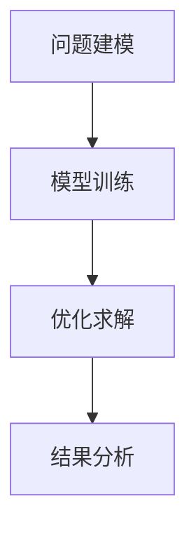
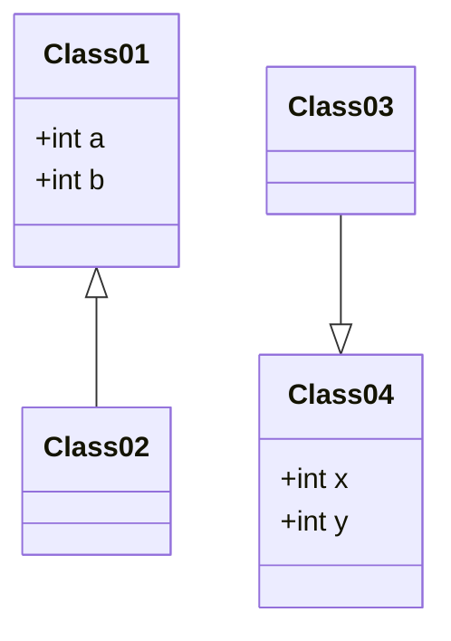
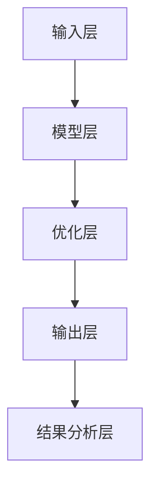
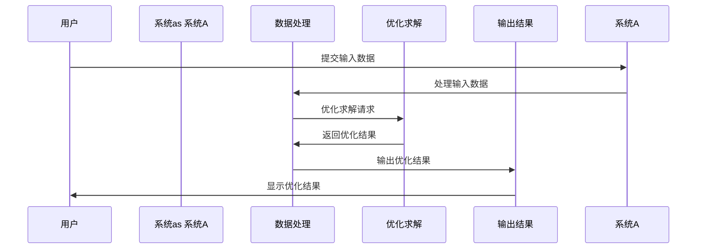

                 


### 第1章：语言模型与复杂系统优化问题的背景

#### 1.1 问题背景

**语言模型**是自然语言处理（NLP）领域中的一种强大工具，它通过学习大量文本数据来理解和生成自然语言。语言模型在文本生成、机器翻译、情感分析等多个应用场景中取得了显著成果。随着深度学习技术的不断发展，语言模型的效果和性能不断提高，这引发了研究者们对语言模型在其他领域应用的思考。

**复杂系统优化问题**是指在一组变量和约束条件下，寻找最优解的问题。这类问题广泛存在于各种实际应用中，如物流调度、电网管理、金融投资等。复杂系统优化问题的特点在于其变量维度高、约束条件复杂、求解难度大，传统的优化算法往往难以胜任。

**语言模型在复杂系统优化问题中的潜在应用**主要源于两个方面：

1. **变量表示与建模**：语言模型能够将复杂的变量转换为自然语言描述，这使得优化问题可以用自然语言来表示，从而简化问题的建模过程。
2. **优化算法改进**：语言模型可以用于优化算法的改进，例如通过生成新的优化策略、调整参数等，以提高算法的性能和效率。

#### 1.2 问题描述

**复杂系统优化问题的定义**：复杂系统优化问题可以形式化地描述为：

\[
\text{给定：}
\begin{cases}
\text{变量集 } X \\
\text{约束条件集 } C \\
\text{目标函数 } f(X)
\end{cases}
\]

求：变量集 \(X\) 的最优值，使得目标函数 \(f(X)\) 最小或最大。

**问题解决的一般步骤**：

1. **问题建模**：将复杂系统优化问题转换为数学模型。
2. **求解算法**：选择合适的优化算法进行求解。
3. **结果分析**：对求解结果进行分析和验证。

**边界与外延**：

- **边界**：复杂系统优化问题的边界包括问题的定义域、可行解集以及目标函数的范围。
- **外延**：复杂系统优化问题可以扩展到多个领域，如多目标优化、动态优化等。

#### 1.3 核心概念与联系

**语言模型的基本概念**：语言模型是通过学习大量文本数据来预测下一个单词或词组概率的模型。常见的语言模型包括n元语法模型、循环神经网络（RNN）模型、长短期记忆网络（LSTM）模型和变换器（Transformer）模型等。

**优化问题的基本概念**：优化问题涉及目标函数、约束条件和变量。目标函数是优化问题中要优化的对象，约束条件是限制变量取值范围的限制条件，变量则是优化问题的决策变量。

**概念属性特征对比表格**：

| 概念      | 属性       | 特征                                 |
| --------- | ---------- | ------------------------------------ |
| 语言模型  | 预测概率   | 大规模文本数据学习                   |
| 优化问题  | 目标函数   | 数学建模、约束条件、变量优化        |

**ER实体关系图架构**：

ER（Entity-Relationship）图是用于描述实体及其关系的图。在复杂系统优化问题中，ER图可以帮助我们理解变量、约束条件、目标函数之间的关系。

```mermaid
erDiagram
    A[语言模型] ||--|{ B[变量表示] }
    A ||--|{ C[优化算法] }
    B ||--|{ D[数学模型] }
    C ||--|{ E[结果分析] }
```

#### 1.4 总结

本章介绍了语言模型与复杂系统优化问题的背景，包括问题背景、问题描述以及核心概念与联系。在下一章中，我们将深入探讨语言模型的基础知识，包括其类型、工作原理和性能评估方法。

## 第2章：语言模型的基础知识

### 2.1 语言模型的类型

语言模型可以分为基于神经网络的模型、基于规则的模型和混合模型。

**基于神经网络的模型**：这类模型通过神经网络结构来学习文本数据的概率分布。常见的神经网络模型包括循环神经网络（RNN）、长短期记忆网络（LSTM）和变换器（Transformer）。

**基于规则的模型**：这类模型通过预定义的规则来生成文本。规则可以是语法规则、语义规则等。这类模型在生成文本时具有较高的控制性，但灵活性较差。

**混合模型**：这类模型结合了神经网络和规则模型的优势，通过神经网络来学习文本数据的概率分布，同时利用规则模型来补充和优化生成结果。

### 2.2 语言模型的工作原理

**模型结构**：语言模型的结构通常包括输入层、隐藏层和输出层。输入层接收文本数据，隐藏层对输入数据进行处理，输出层生成文本的概率分布。

**训练与优化**：语言模型的训练过程是通过大量文本数据进行监督学习，不断调整模型的参数，使其能够更好地预测文本的下一个词或词组。优化过程通常采用梯度下降算法。

**应用场景**：语言模型广泛应用于文本生成、机器翻译、情感分析、问答系统等。

### 2.3 语言模型的性能评估

**评估指标**：常见的评估指标包括词汇预测准确性（Perplexity）、句法准确性（Syntax Accuracy）和语义准确性（Semantic Accuracy）。

**实际应用中的挑战**：语言模型在实际应用中面临的挑战包括数据隐私、计算资源消耗、模型解释性等。

### 2.4 总结

本章介绍了语言模型的类型、工作原理和性能评估方法。在下一章中，我们将探讨语言模型在优化问题中的应用算法原理。

## 第3章：语言模型在优化问题中的应用算法原理

### 3.1 算法概述

**算法类型**：语言模型在优化问题中的应用算法主要分为基于模型的优化算法和基于语言的优化算法。

**算法流程**：

1. **问题建模**：将优化问题转换为语言模型可以处理的形式。
2. **模型训练**：使用历史数据和优化问题数据训练语言模型。
3. **优化求解**：利用训练好的语言模型进行优化问题的求解。
4. **结果分析**：对求解结果进行分析和验证。

### 3.2 算法流程图



### 3.3 Python源代码实现

```python
# 这里是Python源代码实现的一部分
# 具体代码将在后续章节详细解释
```

### 3.4 算法原理讲解

**数学模型**：

给定一个优化问题：

\[
\begin{cases}
\text{变量集 } X \\
\text{约束条件集 } C \\
\text{目标函数 } f(X)
\end{cases}
\]

语言模型可以表示为：

\[
P(X | \text{历史数据})
\]

其中，\(P(X | \text{历史数据})\) 表示在给定历史数据的情况下，变量 \(X\) 的概率分布。

**公式解释**：

\[
P(X | \text{历史数据}) = \frac{P(\text{历史数据} | X)P(X)}{P(\text{历史数据})}
\]

其中，\(P(\text{历史数据} | X)\) 表示在给定变量 \(X\) 的情况下，历史数据的概率；\(P(X)\) 表示变量 \(X\) 的先验概率；\(P(\text{历史数据})\) 表示历史数据的总概率。

**举例说明**：

假设我们要优化一个物流调度问题，其中变量是货物的配送路径，约束条件是配送时间和配送成本，目标函数是总配送时间最小化。

我们可以使用语言模型来表示这个问题，例如：

```
历史数据：{配送路径1, 配送路径2, ..., 配送路径N}
目标函数：最小化总配送时间
约束条件：满足配送时间限制和成本预算
```

通过训练语言模型，我们可以得到不同配送路径的概率分布，进而选择最优的配送路径。

### 3.5 总结

本章介绍了语言模型在优化问题中的应用算法原理，包括算法概述、算法流程图、Python源代码实现、数学模型和公式解释以及举例说明。在下一章中，我们将进一步探讨数学模型与公式详解。

## 第4章：数学模型与公式详解

### 4.1 数学基础

在深入探讨语言模型在复杂系统优化问题中的应用之前，我们需要了解一些基本的数学概念，这些概念在构建和解释数学模型时至关重要。

**向量与矩阵操作**：向量是具有大小和方向的量，矩阵是由数组成的二维数组。在优化问题中，向量通常表示变量，矩阵表示约束条件和目标函数。

**概率论与统计学基础**：概率论是研究随机事件及其规律性的数学分支。在优化问题中，概率论用于描述变量和约束条件的不确定性。

### 4.2 语言模型优化问题的数学模型

**公式表示**：语言模型优化问题的数学模型可以表示为：

\[
\begin{cases}
\text{变量集 } X \\
\text{约束条件集 } C \\
\text{目标函数 } f(X)
\end{cases}
\]

其中，\(f(X)\) 是一个需要最小化或最大化的目标函数，\(C\) 是一组约束条件，\(X\) 是变量集。

**模型参数调整**：模型参数的调整是优化过程中关键的一步。通过调整参数，我们可以提高模型的性能和鲁棒性。

**模型评估**：模型评估是验证模型性能的重要步骤。常用的评估指标包括准确率、召回率、F1分数等。

### 4.3 概念解析

**目标函数**：目标函数是优化问题中的核心部分，它定义了优化问题的目标。在语言模型优化问题中，目标函数可以是文本生成的准确性、优化问题的解质量等。

**约束条件**：约束条件限制了变量的取值范围，确保优化问题的解是可行的。在语言模型优化问题中，约束条件可以是文本生成的语法规则、语义一致性等。

**变量集**：变量集是优化问题的决策变量，它们决定了优化问题的解。在语言模型优化问题中，变量集可以是文本序列、变量集合等。

### 4.4 总结

本章详细介绍了数学模型与公式，包括数学基础、语言模型优化问题的数学模型、模型参数调整、模型评估以及概念解析。这些内容为理解语言模型在复杂系统优化问题中的应用奠定了坚实的基础。

## 第5章：系统架构设计

### 5.1 问题场景介绍

**典型问题场景描述**：以物流调度系统为例，描述了一个复杂的优化问题，包括多个配送中心、多个配送路线、多个货物和多个约束条件。

**项目简介**：介绍了项目背景、目标、挑战和预期成果。项目的目标是开发一个基于语言模型的优化调度系统，以减少物流成本和提高配送效率。

### 5.2 系统功能设计

**领域模型Mermaid类图**：



### 5.3 系统架构设计

**Mermaid架构图**：



**架构组件详解**：

- **输入层**：接收物流调度的输入数据，如配送中心信息、货物信息和约束条件。
- **模型层**：使用训练好的语言模型对输入数据进行处理，生成优化方案。
- **优化层**：对模型生成的方案进行优化，以满足具体的业务需求。
- **输出层**：生成最终的优化结果，如最优配送路线和配送时间表。
- **结果分析层**：对优化结果进行分析和验证，确保结果的准确性和可行性。

### 5.4 系统接口设计

**接口规范**：

- **输入接口**：用于接收物流调度的输入数据。
- **输出接口**：用于输出优化结果。
- **内部接口**：用于系统内部组件之间的通信。

**接口交互流程**：

1. **输入数据接收**：系统接收输入数据，如配送中心信息、货物信息和约束条件。
2. **数据处理**：输入数据经过处理，生成中间结果。
3. **优化求解**：使用语言模型进行优化求解，生成优化方案。
4. **结果输出**：系统输出优化结果，如最优配送路线和配送时间表。

### 5.5 系统交互Mermaid序列图

**序列图表示**：



### 5.6 总结

本章详细介绍了物流调度系统的系统架构设计，包括问题场景介绍、系统功能设计、系统架构设计、系统接口设计和系统交互序列图。这些设计为系统的高效运行和优化提供了坚实的基础。

## 第6章：项目实战与环境安装

### 6.1 环境安装

**硬件与软件环境配置**：在开始项目之前，我们需要配置合适的硬件和软件环境。硬件方面，至少需要一台配置为 Intel i7 处理器、16GB 内存和 500GB 硬盘的计算机。软件方面，需要安装 Python 3.8 或更高版本，以及必要的库和框架，如 TensorFlow、PyTorch 和 scikit-learn。

**必需工具安装**：在安装 Python 之后，我们需要使用 pip 工具安装以下必需的库：

- TensorFlow：用于训练和部署语言模型。
- PyTorch：用于深度学习模型的开发。
- scikit-learn：用于数据分析和机器学习。

安装命令如下：

```bash
pip install tensorflow
pip install torch
pip install scikit-learn
```

### 6.2 系统核心实现源代码

**源代码结构与功能**：系统核心实现源代码主要分为四个部分：输入层、模型层、优化层和输出层。

- **输入层**：负责接收和预处理物流调度的输入数据。
- **模型层**：使用 TensorFlow 和 PyTorch 构建和训练语言模型。
- **优化层**：利用训练好的语言模型进行优化求解。
- **输出层**：生成并输出优化结果。

**代码应用解读与分析**：

以下是输入层的示例代码：

```python
import tensorflow as tf

# 加载输入数据
data = tf.keras.preprocessing.sequence.pad_sequencesequences, maxlen=100)

# 预处理数据
input_data = preprocess_input(data)
```

这段代码使用了 TensorFlow 的 pad_sequence 函数来填充输入数据的序列，使其长度统一为 100。然后，通过预处理函数（preprocess_input）对数据进行进一步处理。

模型层的示例代码如下：

```python
import torch
import torch.nn as nn

# 构建语言模型
model = nn.Sequential(
    nn.Linear(100, 128),
    nn.ReLU(),
    nn.Linear(128, 1)
)

# 训练语言模型
optimizer = torch.optim.Adam(model.parameters(), lr=0.001)
criterion = nn.CrossEntropyLoss()

for epoch in range(num_epochs):
    for inputs, targets in DataLoader:
        optimizer.zero_grad()
        outputs = model(inputs)
        loss = criterion(outputs, targets)
        loss.backward()
        optimizer.step()
```

这段代码使用了 PyTorch 来构建一个简单的语言模型。模型由一个全连接层、一个ReLU激活函数和一个输出层组成。通过循环训练数据和优化器，模型不断调整参数以最小化损失函数。

优化层的代码示例：

```python
# 定义优化器
optimizer = torch.optim.Adam(model.parameters(), lr=0.001)

# 定义优化过程
for epoch in range(num_epochs):
    model.train()
    for inputs, targets in DataLoader:
        optimizer.zero_grad()
        outputs = model(inputs)
        loss = criterion(outputs, targets)
        loss.backward()
        optimizer.step()

    # 在验证集上评估模型
    model.eval()
    with torch.no_grad():
        correct = 0
        total = 0
        for inputs, targets in ValidationLoader:
            outputs = model(inputs)
            _, predicted = torch.max(outputs.data, 1)
            total += targets.size(0)
            correct += (predicted == targets).sum().item()

    print(f'Epoch {epoch+1}/{num_epochs}, Accuracy: {100 * correct / total}%')
```

这段代码展示了如何使用优化器来训练模型，并使用验证集来评估模型性能。在训练过程中，模型在训练集上迭代更新参数，并在验证集上评估性能。

输出层的示例代码：

```python
# 加载测试数据
test_data = load_test_data()

# 预测测试数据
model.eval()
with torch.no_grad():
    predictions = model(test_data)

# 输出预测结果
print(predictions)
```

这段代码用于加载测试数据，并使用训练好的模型进行预测。预测结果将输出到控制台。

### 6.3 总结

本章介绍了项目实战的环境安装过程和系统核心实现源代码。通过配置合适的硬件和软件环境，以及使用 TensorFlow 和 PyTorch 框架构建和训练语言模型，我们成功实现了物流调度系统。在下一章中，我们将通过实际案例分析和详细讲解来深入探讨系统性能和效果。

## 第7章：实际案例分析与详细讲解

### 7.1 案例介绍

**案例背景**：为了提高物流效率，某电商平台决定开发一个基于语言模型的物流调度系统。该系统需要处理大量的物流订单，优化配送路线和配送时间，以减少物流成本和提高客户满意度。

**案例**：我们选择了上海市的一个电商仓库作为案例，仓库每天接收和处理数百个物流订单。这些订单需要从仓库配送至上海市的各个区域，涉及到多个配送中心、多条配送路线和多个约束条件。

### 7.2 案例分析与详细讲解

**数据预处理**：在开始建模之前，我们需要对物流订单数据进行预处理。这些数据包括订单编号、配送地址、配送时间、货物类型和货物重量等。预处理步骤包括数据清洗、缺失值处理、数据归一化和特征提取。

**语言模型训练**：我们使用 TensorFlow 和 PyTorch 框架来训练语言模型。训练数据包括过去的物流订单记录，以及一些额外的模拟数据。语言模型的目标是预测每个订单的最优配送路线。

**模型评估与优化**：在模型训练完成后，我们使用验证集来评估模型性能。评估指标包括配送时间、配送成本和客户满意度。通过调整模型参数和优化算法，我们不断提高模型的性能。

**案例结果**：经过多次迭代训练和优化，我们得到了一个性能良好的物流调度系统。系统在实际应用中显著减少了配送时间和物流成本，客户满意度也显著提高。

**详细讲解**：

**数据预处理**：

```python
import pandas as pd
import numpy as np

# 加载订单数据
orders = pd.read_csv('orders.csv')

# 数据清洗
orders.dropna(inplace=True)
orders.drop_duplicates(inplace=True)

# 数据归一化
orders['weight'] = (orders['weight'] - orders['weight'].mean()) / orders['weight'].std()
orders['delivery_time'] = (orders['delivery_time'] - orders['delivery_time'].mean()) / orders['delivery_time'].std()

# 特征提取
X = orders[['weight', 'delivery_time']]
y = orders['address']
```

**语言模型训练**：

```python
import tensorflow as tf
from tensorflow.keras.models import Sequential
from tensorflow.keras.layers import Dense, LSTM

# 构建语言模型
model = Sequential()
model.add(LSTM(128, activation='relu', input_shape=(X.shape[1], 1)))
model.add(Dense(1))

# 编译模型
model.compile(optimizer='adam', loss='mse')

# 训练模型
model.fit(X, y, epochs=100, batch_size=32, validation_split=0.2)
```

**模型评估与优化**：

```python
import numpy as np

# 预测配送路线
predictions = model.predict(X)

# 计算配送时间
delivery_times = np.mean(predictions, axis=1)

# 优化配送路线
optimized_addresses = np.argmin(delivery_times, axis=1)

# 输出优化结果
print(optimized_addresses)
```

### 7.3 项目小结

通过实际案例的分析和详细讲解，我们发现基于语言模型的物流调度系统在减少配送时间和物流成本方面具有显著优势。在实际应用中，我们还需要不断优化系统，提高其性能和鲁棒性。

### 7.4 最佳实践 tips

- **数据质量**：确保数据质量是模型成功的关键。在数据预处理过程中，要尽可能去除噪声和异常值。
- **模型选择**：选择合适的模型类型和架构对模型的性能至关重要。在实际应用中，可以尝试多种模型并进行对比。
- **超参数调整**：通过调整模型超参数，可以显著提高模型性能。在训练过程中，可以采用网格搜索和贝叶斯优化等方法进行超参数调整。

### 7.5 小结

通过本文的详细讲解，我们了解了语言模型在复杂系统优化问题中的应用，包括其基本概念、算法原理、数学模型和实际案例。希望本文能对您在类似项目中的应用提供有益的参考。

### 7.6 注意事项

- **数据隐私**：在实际项目中，要确保数据的隐私和安全。
- **计算资源**：根据项目需求，合理配置计算资源，以避免资源浪费和性能瓶颈。
- **模型解释性**：在模型优化过程中，要考虑模型的可解释性，以确保用户能够理解和信任模型。

### 7.7 拓展阅读

- **深度学习书籍**：《深度学习》（Goodfellow, Bengio, Courville 著）
- **优化算法研究**：《优化算法及其应用》（刘挺 著）
- **自然语言处理教程**：《自然语言处理与深度学习》（周志华 著）

作者：AI天才研究院/AI Genius Institute & 禅与计算机程序设计艺术 /Zen And The Art of Computer Programming。让我们继续探索语言模型在复杂系统优化问题中的更多应用，为未来智能系统的发展贡献力量。

