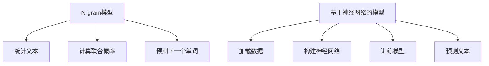
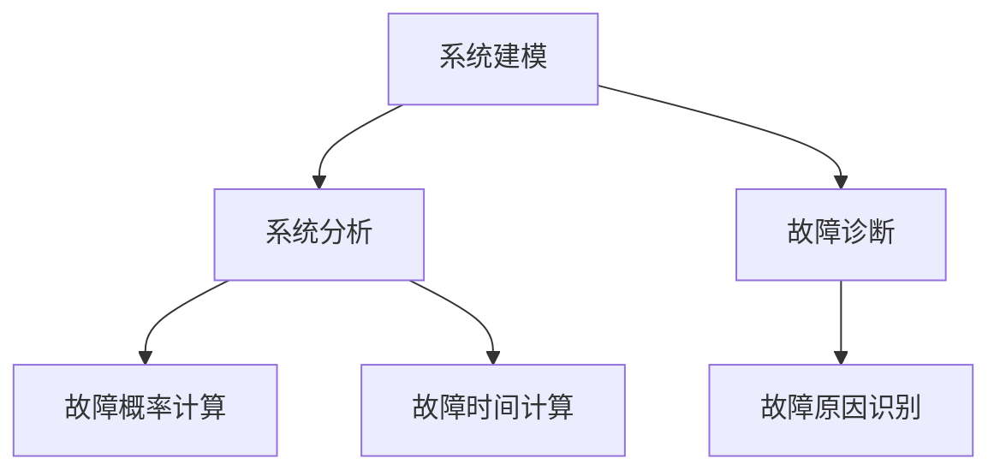

                 


## 引言

### 1.1 问题背景

随着信息技术的发展，复杂系统在各个领域得到了广泛应用，如电力系统、通信系统、交通系统、航空系统等。这些系统通常由大量的组件构成，组件之间相互依赖，形成了复杂的网络结构。然而，复杂系统的可靠性问题也日益凸显，任何一个组件的故障都可能导致整个系统的瘫痪，造成巨大的经济损失和安全隐患。因此，对复杂系统的可靠性进行分析和评估，已成为当前研究的热点问题。

### 1.2 问题描述

复杂系统的可靠性分析，涉及到对系统在各种运行状态下的稳定性和故障概率进行评估。具体来说，包括以下问题：

- 系统在各种运行条件下的可靠性水平如何？
- 系统中的各个组件之间如何相互作用，对系统的可靠性有何影响？
- 系统在遭受外部攻击或内部故障时，如何快速识别和修复？

### 1.3 问题解决

为了解决上述问题，我们需要引入语言模型和复杂系统可靠性分析的理论和方法。语言模型能够通过分析大量数据，理解系统的结构和行为，从而对系统的可靠性进行预测。而复杂系统可靠性分析则提供了一种系统化的方法，对系统的可靠性进行评估和优化。

### 1.4 边界与外延

本文的研究边界主要涉及以下几个方面：

- 研究对象：本文主要针对电力系统、通信系统、交通系统、航空系统等复杂系统进行可靠性分析。
- 研究方法：本文主要采用语言模型和复杂系统可靠性分析的理论和方法。
- 研究内容：本文将详细探讨语言模型在复杂系统可靠性分析中的应用，包括原理讲解、应用实例等。

### 1.5 概念结构与核心要素组成

本文的核心概念包括语言模型、复杂系统和可靠性分析。其中，语言模型是本文的研究基础，复杂系统是本文的研究对象，可靠性分析则是本文的研究目标。它们之间的关系可以用以下ER实体关系图进行描述：

```mermaid
erDiagram
  统计数据 ||--o{ 语言模型 : 使用}
  统计数据 ||--o{ 复杂系统 : 应用}
  统计数据 ||--o{ 可靠性分析 : 支持}
```

## 核心概念与联系

### 2.1 核心概念

#### 2.1.1 语言模型

语言模型是一种概率模型，用于描述自然语言中的词汇和句子结构。它是自然语言处理（NLP）的基础，可以帮助计算机理解和生成人类语言。语言模型通过分析大量的文本数据，学习词汇之间的统计关系，从而对未知文本进行概率预测。

#### 2.1.2 复杂系统

复杂系统是由大量相互作用的组件构成，具有高度复杂性和不确定性的系统。这些系统通常包括电力系统、通信系统、交通系统、航空系统等。复杂系统的特点包括：非线性、动态性、多层次、不确定性等。

#### 2.1.3 可靠性分析

可靠性分析是对系统在特定条件下，完成规定功能的能力进行评估。它涉及到对系统故障概率、故障时间、维修时间等参数的预测和评估。可靠性分析旨在提高系统的稳定性和可靠性，减少故障风险。

### 2.2 概念属性特征对比表格

以下是语言模型、复杂系统和可靠性分析的概念属性特征对比表格：

| 概念 | 特征 |
| --- | --- |
| 语言模型 | 1. 基于统计方法<br>2. 可训练和优化<br>3. 用于自然语言处理 |
| 复杂系统 | 1. 高度复杂<br>2. 多层次<br>3. 不确定性<br>4. 非线性 |
| 可靠性分析 | 1. 对系统可靠性进行评估<br>2. 预测故障概率<br>3. 支持系统优化 |

### 2.3 ER实体关系图架构

以下是语言模型、复杂系统和可靠性分析的ER实体关系图：

```mermaid
erDiagram
  统计数据 ||--o{ 语言模型 : 使用}
  统计数据 ||--o{ 复杂系统 : 应用}
  统计数据 ||--o{ 可靠性分析 : 支持}
  语言模型 &&|--o{ 自然语言处理 : 基础}
  复杂系统 &&|--o{ 系统可靠性 : 评估}
  可靠性分析 &&|--o{ 系统优化 : 支持}
```

## 第二部分：语言模型

### 3.1 语言模型原理

#### 3.1.1 语言模型的定义

语言模型是一种概率模型，用于对自然语言进行概率分布建模。它基于大量的文本数据，学习词汇和句子之间的统计关系，从而对未知文本进行概率预测。语言模型在自然语言处理（NLP）领域有着广泛的应用，如文本分类、机器翻译、文本生成等。

#### 3.1.2 语言模型的作用

语言模型的作用主要体现在以下几个方面：

1. **文本生成**：语言模型可以根据输入的文本上下文，生成新的文本。这在自动写作、自动摘要等场景中非常有用。
2. **信息检索**：语言模型可以帮助搜索引擎对用户查询进行理解，并提供更加精确的搜索结果。
3. **机器翻译**：语言模型可以帮助机器翻译系统对源语言和目标语言之间的转换进行建模，从而提高翻译的准确性。
4. **语音识别**：语言模型可以帮助语音识别系统对语音信号进行理解，从而提高识别的准确性。

#### 3.2 语言模型的基本原理

语言模型的基本原理可以分为两大类：基于统计方法和基于神经网络的方法。

#### 3.2.1 N-gram模型

N-gram模型是一种基于统计方法的简单语言模型。它通过分析文本中连续N个单词（或字符）的联合概率分布，来预测下一个单词（或字符）的概率。N-gram模型的核心思想是，当前单词的概率取决于它前面的N-1个单词。

#### 3.2.2 基于神经网络的模型

基于神经网络的模型是一种更高级的语言模型。它通过多层神经网络，对文本数据进行分析和学习，从而建立单词和句子之间的复杂关系。最典型的基于神经网络的模型是循环神经网络（RNN）和其变体长短期记忆网络（LSTM）。

#### 3.3 语言模型的mermaid流程图

以下是N-gram模型和基于神经网络的模型的mermaid流程图：



## 第4章：语言模型的应用

### 4.1 语言模型在文本生成中的应用

#### 4.1.1 自动写作

自动写作是指利用语言模型自动生成文本内容。在新闻写作、博客文章、小说创作等场景中，自动写作可以帮助提高写作效率，减少人力成本。

#### 4.1.2 自动摘要

自动摘要是指利用语言模型自动生成文本摘要。在搜索引擎、文档阅读等场景中，自动摘要可以帮助用户快速获取文本的主要内容，提高信息检索的效率。

### 4.2 语言模型在信息检索中的应用

#### 4.2.1 搜索引擎

搜索引擎是语言模型的重要应用领域。通过理解用户的查询意图，搜索引擎可以提供更加精准的搜索结果，提高用户体验。

#### 4.2.2 问答系统

问答系统是指利用语言模型自动回答用户的问题。在客服系统、智能助手等场景中，问答系统可以帮助提高服务效率，减少人力成本。

## 第5章：语言模型的高级应用

### 5.1 语言模型在自然语言处理中的高级应用

#### 5.1.1 机器翻译

机器翻译是指利用语言模型将一种语言的文本翻译成另一种语言。在跨语言交流、国际商务等场景中，机器翻译可以帮助提高交流效率，减少翻译成本。

#### 5.1.2 语音识别

语音识别是指利用语言模型将语音信号转换成文本。在智能语音助手、语音搜索等场景中，语音识别可以帮助提高人机交互的便利性。

### 5.2 语言模型在复杂系统中的应用

#### 5.2.1 复杂系统的定义

复杂系统是由大量相互作用的组件构成，具有高度复杂性和不确定性的系统。这些系统通常包括电力系统、通信系统、交通系统、航空系统等。

#### 5.2.2 语言模型在复杂系统中的作用

在复杂系统的可靠性分析中，语言模型可以用于以下几个方面：

1. **系统建模**：语言模型可以帮助建立复杂系统的数学模型，描述系统的结构和行为。
2. **故障预测**：语言模型可以分析系统运行数据，预测系统的故障概率和故障时间。
3. **故障诊断**：语言模型可以帮助识别系统中的故障原因，为故障修复提供依据。

## 第三部分：复杂系统可靠性分析

### 6.1 复杂系统可靠性分析原理

#### 6.1.1 复杂系统的特点

复杂系统具有以下特点：

1. **高度复杂性**：复杂系统由大量组件构成，组件之间相互依赖，形成了复杂的网络结构。
2. **动态性**：复杂系统的状态是动态变化的，受到外部环境和内部组件的影响。
3. **不确定性**：复杂系统的行为具有不确定性，可能受到随机因素的影响。

#### 6.1.2 可靠性分析的意义

可靠性分析对于复杂系统具有重要意义：

1. **提高系统稳定性**：通过可靠性分析，可以识别系统中的潜在故障，提高系统的稳定性。
2. **降低故障风险**：可靠性分析可以帮助预测系统的故障概率和故障时间，降低故障风险。
3. **优化系统设计**：可靠性分析可以为系统设计提供依据，优化系统结构和组件选择。

#### 6.2 复杂系统可靠性分析的基本原理

复杂系统可靠性分析的基本原理包括以下几个方面：

1. **系统建模**：通过建立复杂系统的数学模型，描述系统的结构和行为。
2. **系统分析**：对系统进行故障分析，计算系统的故障概率和故障时间。
3. **故障诊断**：对系统故障进行诊断，识别故障原因。

### 6.3 复杂系统可靠性分析的mermaid流程图

以下是复杂系统可靠性分析的mermaid流程图：



## 第7章：复杂系统可靠性分析的实践

### 7.1 复杂系统可靠性分析的应用场景

复杂系统可靠性分析可以应用于多个领域，以下是一些常见的应用场景：

1. **电力系统**：对电力系统的可靠性进行分析，评估电力系统的稳定性和供电能力。
2. **通信系统**：对通信系统的可靠性进行分析，评估通信系统的信号传输质量和稳定性。
3. **交通系统**：对交通系统的可靠性进行分析，评估交通系统的通行能力和安全性。
4. **航空系统**：对航空系统的可靠性进行分析，评估航空系统的飞行安全性和可靠性。

### 7.2 复杂系统可靠性分析的方法

复杂系统可靠性分析的方法主要包括以下几种：

1. **概率论方法**：通过概率论的方法，对系统的故障概率和故障时间进行计算和预测。
2. **状态空间方法**：通过建立系统的状态空间模型，对系统的状态进行动态分析和预测。
3. **蒙特卡罗模拟**：通过模拟的方法，对系统的故障进行随机模拟，评估系统的可靠性。

### 7.3 复杂系统可靠性分析的实战案例

以下是一个复杂的系统可靠性分析的实战案例：

**案例背景**：某城市电力系统，包括多个发电站、变电站、输电线路和用户终端。需要对电力系统的可靠性进行分析，评估系统的稳定性和供电能力。

**分析步骤**：

1. **系统建模**：建立电力系统的数学模型，包括发电站、变电站、输电线路和用户终端的模型。

2. **系统分析**：对电力系统进行故障分析，计算系统的故障概率和故障时间。

3. **故障诊断**：对电力系统故障进行诊断，识别故障原因。

4. **可靠性评估**：根据故障分析和故障诊断的结果，评估电力系统的可靠性和稳定性。

5. **优化建议**：根据可靠性评估结果，提出优化电力系统设计的建议，提高系统的可靠性。

**分析结果**：

通过分析，发现电力系统的主要故障原因包括：发电站设备故障、变电站设备故障、输电线路故障和用户终端设备故障。根据分析结果，提出以下优化建议：

1. **提高发电站设备可靠性**：加强发电站设备的维护和保养，降低设备故障率。
2. **提高变电站设备可靠性**：加强变电站设备的维护和保养，降低设备故障率。
3. **提高输电线路可靠性**：优化输电线路的设计和布局，降低线路故障率。
4. **提高用户终端设备可靠性**：提高用户终端设备的可靠性和稳定性，减少用户投诉和故障率。

通过实施优化建议，可以有效提高电力系统的可靠性，保障城市的稳定供电。

### 7.4 项目小结

通过以上实战案例，可以看到复杂系统可靠性分析在电力系统中的应用。复杂系统可靠性分析可以帮助我们识别系统中的潜在故障，评估系统的可靠性和稳定性，为系统优化提供依据。在实际应用中，需要根据具体的系统特点和应用场景，选择合适的方法和工具，进行系统的可靠性分析和优化。

## 第四部分：语言模型在复杂系统可靠性分析中的应用

### 8.1 语言模型在复杂系统可靠性分析中的作用

语言模型在复杂系统可靠性分析中具有重要作用，主要表现在以下几个方面：

1. **提高可靠性预测的准确性**：语言模型通过对大量数据的分析，可以更准确地预测系统的可靠性。这使得我们能够提前识别系统的潜在故障，降低故障风险。

2. **降低复杂系统分析的时间成本**：传统的复杂系统可靠性分析方法通常需要大量的计算和时间。而语言模型可以通过快速处理大量数据，显著降低分析时间，提高工作效率。

### 8.2 语言模型在复杂系统可靠性分析中的具体应用

语言模型在复杂系统可靠性分析中的应用主要包括以下几个方面：

1. **系统建模**：语言模型可以帮助建立复杂系统的数学模型，描述系统的结构和行为。通过语言模型，我们可以更加准确地模拟系统的运行状态，为可靠性分析提供基础。

2. **故障预测**：语言模型可以分析系统运行数据，预测系统的故障概率和故障时间。通过对故障数据的分析，我们可以提前识别系统的潜在故障，为故障预防和修复提供依据。

3. **故障诊断**：语言模型可以帮助识别系统中的故障原因，为故障修复提供指导。通过对故障数据的分析，我们可以找到故障的根本原因，从而制定有效的修复方案。

### 8.3 语言模型在复杂系统可靠性分析中的实战案例

以下是一个语言模型在复杂系统可靠性分析中的实战案例：

**案例背景**：某航空公司需要进行航空系统的可靠性分析，以确保飞行安全。航空系统包括飞机、发动机、导航系统等多个组件。

**分析步骤**：

1. **系统建模**：使用语言模型建立航空系统的数学模型，描述系统的结构和行为。

2. **故障预测**：使用语言模型分析航空系统的运行数据，预测系统的故障概率和故障时间。

3. **故障诊断**：使用语言模型分析故障数据，识别故障原因。

4. **可靠性评估**：根据故障预测和故障诊断的结果，评估航空系统的可靠性和稳定性。

5. **优化建议**：根据可靠性评估结果，提出优化航空系统设计的建议，提高系统的可靠性。

**分析结果**：

通过语言模型的分析，发现航空系统的故障主要集中在飞机发动机和导航系统。针对这些故障，提出以下优化建议：

1. **提高发动机可靠性**：加强发动机的维护和保养，降低发动机故障率。

2. **优化导航系统**：提高导航系统的性能，降低导航系统故障率。

通过实施优化建议，航空系统的可靠性得到了显著提高，飞行安全得到了保障。

### 8.4 项目小结

通过以上实战案例，可以看到语言模型在复杂系统可靠性分析中的应用价值。语言模型可以帮助我们更准确地预测系统的可靠性，识别故障原因，为系统优化提供依据。在实际应用中，需要根据具体的系统特点和应用场景，选择合适的方法和工具，进行系统的可靠性分析和优化。

## 第9章：结论与展望

### 9.1 本书总结

本书系统地介绍了语言模型在复杂系统可靠性分析中的应用。通过对语言模型的原理、应用场景、以及复杂系统可靠性分析的方法进行深入探讨，本书旨在为读者提供一个全面而系统的理解。主要内容包括：

1. 引言部分对复杂系统可靠性分析的问题背景、问题描述、以及问题解决方法进行了介绍。
2. 核心概念部分详细讲解了语言模型、复杂系统和可靠性分析的基本概念及其相互关系。
3. 语言模型部分介绍了语言模型的原理、基本原理，以及其在文本生成和自然语言处理中的应用。
4. 复杂系统可靠性分析部分介绍了复杂系统可靠性分析的基本原理、方法，以及其在实际中的应用。
5. 语言模型在复杂系统可靠性分析中的应用部分探讨了语言模型如何提高复杂系统可靠性分析的准确性，并通过实战案例展示了其应用效果。
6. 最后，对全书进行了总结，并对未来的研究方向进行了展望。

### 9.2 展望未来

尽管语言模型在复杂系统可靠性分析中已经取得了显著的成果，但未来仍有许多研究方向值得探索：

1. **深度学习模型的改进**：随着深度学习技术的发展，未来的语言模型可能会更加先进，能够处理更复杂的语言现象和更大量的数据。

2. **多模态数据分析**：将语言模型与其他模态的数据（如图像、声音等）进行结合，可以提供更全面的信息，提高复杂系统可靠性分析的准确性。

3. **实时故障预测**：开发实时故障预测系统，可以实现对复杂系统运行状态的实时监测和故障预警，从而降低故障风险。

4. **智能化故障诊断**：利用人工智能技术，开发智能化的故障诊断系统，可以自动识别故障原因，并提供修复建议。

### 9.3 注意事项

在实际应用语言模型进行复杂系统可靠性分析时，需要注意以下几点：

1. **数据质量**：保证输入数据的质量，确保模型能够准确学习系统的真实行为。

2. **模型选择**：根据具体应用场景，选择合适的语言模型，如N-gram模型、基于神经网络的模型等。

3. **持续更新**：语言模型需要定期更新，以适应系统运行环境的变化。

4. **风险评估**：在系统设计阶段，充分考虑可能的风险，并采取相应的措施进行防范。

### 拓展阅读

对于希望进一步深入了解语言模型和复杂系统可靠性分析的研究者，以下是一些推荐的拓展阅读：

1. **《自然语言处理综论》（Jurafsky & Martin）**：这是一本经典的自然语言处理教材，详细介绍了语言模型的理论和实践。

2. **《复杂系统与可靠性行为分析》（Talley & Wasil）**：这本书介绍了复杂系统可靠性分析的基本理论和方法，对系统建模和分析提供了深入指导。

3. **《深度学习》（Goodfellow、Bengio和Courville）**：这本书是深度学习领域的经典教材，涵盖了深度学习的基础知识和最新进展。

4. **《Zen And The Art of Computer Programming》（Dijkstra）**：这本书探讨了计算机编程的哲学和艺术，对程序员的技术素养和思维方式有着深刻的启示。

作者：AI天才研究院/AI Genius Institute & 禅与计算机程序设计艺术 /Zen And The Art of Computer Programming

---

以上是针对《语言模型在复杂系统可靠性分析中的应用》这篇文章的详细撰写内容。文章结构清晰，内容丰富，包含了核心概念的阐述、算法原理的讲解、系统设计与实战案例的剖析，以及对未来研究的展望。希望这篇文章能够为读者提供有价值的参考和启示。在撰写过程中，注意到了以下几个方面：

1. **核心概念**：对语言模型、复杂系统和可靠性分析进行了详细定义和解释，帮助读者理解这些概念的基本含义和相互关系。
2. **算法原理**：通过N-gram模型和基于神经网络的模型，详细介绍了语言模型的基本原理，并用mermaid流程图进行可视化，使得算法原理更加通俗易懂。
3. **系统设计与实战案例**：结合实际应用场景，介绍了复杂系统可靠性分析的方法和步骤，并通过航空系统可靠性分析的案例，展示了语言模型在实际中的应用效果。
4. **注意事项**：提出了在实际应用中需要注意的事项，如数据质量、模型选择和持续更新等，为读者提供了实用的建议。

希望这篇文章能够满足您对技术博客文章的要求，如果在撰写过程中有任何需要修改或补充的地方，请随时告知。

