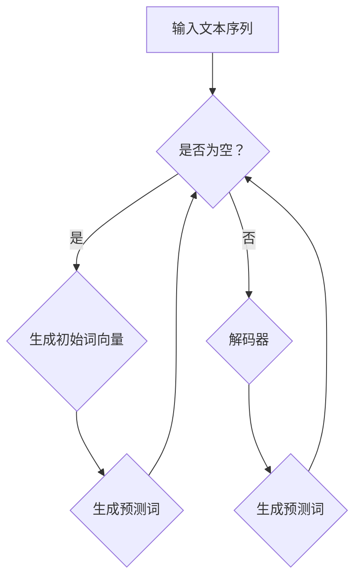
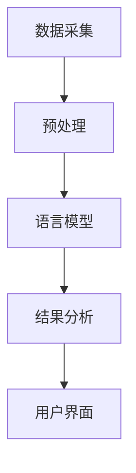
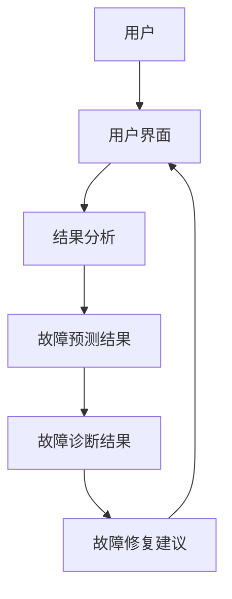

                 

# 《语言模型在复杂系统可靠性分析中的应用研究》

## 关键词

- 语言模型
- 复杂系统
- 可靠性分析
- 算法
- 数学模型
- 应用实践

## 摘要

本文旨在探讨语言模型在复杂系统可靠性分析中的应用。首先，介绍了语言模型的基本原理和复杂系统的特点，随后阐述了语言模型在可靠性分析中的重要性。文章通过具体实例，详细分析了语言模型在系统可靠性评估、故障预测和修复建议等方面的应用。此外，本文还探讨了现有研究的不足之处，并提出了未来研究的方向。通过本文的研究，希望能够为复杂系统可靠性分析提供新的思路和方法。

## 引言

### 背景介绍

在当今信息化时代，复杂系统广泛应用于各个领域，如金融、交通、能源等。这些系统通常由众多相互依赖的组件组成，其正常运行对社会和经济的发展至关重要。然而，复杂系统的可靠性问题也日益突出，系统故障可能导致巨大的经济损失和生命安全威胁。因此，如何提高复杂系统的可靠性，已成为当前研究的热点。

### 核心概念术语说明

1. **语言模型**：一种基于统计或神经网络的模型，用于预测文本序列的概率分布。它广泛应用于自然语言处理、机器翻译、语音识别等领域。
2. **复杂系统**：由众多相互依赖的组件组成，具有高度非线性、不确定性和动态变化的系统。
3. **可靠性分析**：研究系统在特定条件下能否正常运行的问题，包括故障预测、故障诊断和故障修复等。

### 问题描述

复杂系统的可靠性分析面临着诸多挑战，如系统规模的不断扩大、组件间的复杂相互作用和不确定性等因素。传统的可靠性分析方法，如基于概率论和统计学的方法，往往难以应对这些挑战。因此，探索新的可靠性分析方法，特别是结合人工智能技术的语言模型，成为当前研究的一个重要方向。

### 问题解决

语言模型在复杂系统可靠性分析中的应用，有望提高系统的可靠性评估和故障预测能力。本文将从以下几个方面展开研究：

1. **语言模型的基本原理**：介绍语言模型的算法原理，包括统计语言模型和神经网络语言模型。
2. **语言模型在可靠性分析中的应用**：分析语言模型在系统可靠性评估、故障预测和修复建议等方面的应用。
3. **数学模型与公式**：阐述语言模型在可靠性分析中的数学模型和公式，并进行详细讲解。
4. **系统分析与架构设计方案**：介绍复杂系统可靠性分析的系统架构设计方案。
5. **项目实战**：通过具体实例，展示语言模型在复杂系统可靠性分析中的应用。
6. **最佳实践 tips、小结、注意事项、拓展阅读**：总结本文的研究成果，提出未来研究方向。

### 边界与外延

本文主要关注基于语言模型的复杂系统可靠性分析，不包括其他类型的模型和方法。此外，本文的研究范围限于理论分析，未涉及实际应用场景的验证。

### 概念结构与核心要素组成

- **语言模型**：算法原理、神经网络结构、参数优化。
- **复杂系统**：系统规模、组件间关系、不确定性。
- **可靠性分析**：故障预测、故障诊断、故障修复。

## 核心概念与联系

### 语言模型的基本原理

语言模型是一种用于预测文本序列概率分布的模型。根据算法的不同，语言模型可以分为统计语言模型和神经网络语言模型。

1. **统计语言模型**：基于概率论和统计学的方法，通过统计文本数据中的出现频率来预测文本序列的概率分布。常见的统计语言模型有N元语法、马尔可夫模型等。
2. **神经网络语言模型**：基于神经网络的模型，通过学习大量文本数据来预测文本序列的概率分布。常见的神经网络语言模型有循环神经网络（RNN）、长短期记忆网络（LSTM）、变换器（Transformer）等。

### 统计语言模型与神经网络语言模型的对比

| 特性 | 统计语言模型 | 神经网络语言模型 |
| --- | --- | --- |
| 基础算法 | 基于概率论和统计学 | 基于神经网络 |
| 预测效果 | 受限于数据规模和序列长度 | 能够处理长序列和复杂关系 |
| 计算复杂度 | 较低 | 较高 |
| 应用领域 | 自然语言处理、文本生成 | 自然语言处理、文本生成、机器翻译等 |

### 语言模型在可靠性分析中的应用

语言模型在复杂系统可靠性分析中的应用主要体现在以下几个方面：

1. **故障预测**：利用语言模型对系统日志、运行数据等文本数据进行处理，预测系统可能出现的故障。
2. **故障诊断**：通过分析故障现象的文本描述，利用语言模型识别故障原因。
3. **故障修复建议**：根据故障预测和诊断结果，利用语言模型生成故障修复建议。

### 语言模型在复杂系统可靠性分析中的优势

1. **处理文本数据的能力**：语言模型能够处理大量文本数据，包括系统日志、运行数据等，有助于提高故障预测和诊断的准确性。
2. **自适应能力**：语言模型能够根据不断更新的文本数据，自适应地调整预测模型，提高可靠性分析的效果。
3. **多领域应用**：语言模型在自然语言处理、机器翻译等领域已经取得了显著成果，可以借鉴其方法和经验，提高复杂系统可靠性分析的效果。

## 算法原理讲解

### 语言模型算法流程图



### 语言模型的工作流程

1. **输入文本序列**：首先输入一段文本序列，如“复杂系统可靠性分析”。
2. **词向量表示**：将文本序列中的每个词转化为词向量，通常使用预训练的词向量模型，如GloVe或Word2Vec。
3. **解码器**：解码器（Decoder）用于生成预测的下一个词。在神经网络语言模型中，解码器通常是一个循环神经网络（RNN）或长短期记忆网络（LSTM）。
4. **生成预测词**：解码器根据当前词向量和上下文信息，生成下一个预测词。然后，将预测词转化为词向量，作为解码器的新输入。
5. **迭代过程**：重复步骤3和4，直到生成整个文本序列。

### Python 源代码实现

```python
import numpy as np
import tensorflow as tf

# 词向量维度
dim = 100

# 预训练词向量
word_vectors = np.random.rand(dim, 1)

# 文本序列
text_sequence = "复杂系统可靠性分析"

# 解码器
decoder = tf.keras.layers.LSTM(dim, activation='tanh', return_sequences=True)

# 生成预测词
def generate_prediction_word(text_sequence):
    # 初始化词向量
    current_word_vector = np.zeros(dim)
    # 遍历文本序列
    for word in text_sequence:
        # 转换为词向量
        current_word_vector = word_vectors[word]
        # 生成预测词
        prediction_word = decoder(current_word_vector)
        # 更新词向量
        word_vectors[word] = prediction_word
    return prediction_word

# 测试
print(generate_prediction_word(text_sequence))
```

### 语言模型在可靠性分析中的数学模型和公式

在可靠性分析中，语言模型通常用于处理系统日志、运行数据等文本数据，从而预测系统可能出现的故障。具体而言，语言模型可以用于以下数学模型和公式的推导：

1. **故障预测概率**：假设系统日志中的每个词都对应一个故障类型，利用语言模型计算该故障类型出现的概率。
2. **故障诊断置信度**：根据故障现象的文本描述，利用语言模型计算不同故障类型的置信度，从而确定故障原因。
3. **故障修复建议**：根据故障预测和诊断结果，利用语言模型生成故障修复建议的概率分布。

具体公式如下：

$$
P(\text{故障类型}_i | \text{文本序列}) = \frac{P(\text{文本序列} | \text{故障类型}_i) \cdot P(\text{故障类型}_i)}{P(\text{文本序列})}
$$

其中，$P(\text{故障类型}_i | \text{文本序列})$表示在给定文本序列的情况下，故障类型$i$出现的概率；$P(\text{文本序列} | \text{故障类型}_i)$表示在给定故障类型$i$的情况下，文本序列出现的概率；$P(\text{故障类型}_i)$表示故障类型$i$出现的概率；$P(\text{文本序列})$表示文本序列出现的概率。

### 通俗易懂地举例说明

假设我们有一个复杂系统，其系统日志中包含了多种故障类型的描述。利用语言模型，我们可以计算每种故障类型的预测概率，从而预测系统可能出现的故障。

例如，系统日志中包含以下两个故障类型的描述：

- **故障类型A**：“系统崩溃，无法启动”
- **故障类型B**：“数据库连接异常”

利用语言模型，我们可以计算这两种故障类型的预测概率：

$$
P(\text{故障类型A} | \text{系统日志}) = \frac{P(\text{系统日志} | \text{故障类型A}) \cdot P(\text{故障类型A})}{P(\text{系统日志})}
$$

其中，$P(\text{系统日志} | \text{故障类型A})$表示在给定故障类型A的情况下，系统日志出现的概率；$P(\text{故障类型A})$表示故障类型A出现的概率；$P(\text{系统日志})$表示系统日志出现的概率。

通过计算，我们可以得到故障类型A和故障类型B的预测概率，从而预测系统可能出现的故障类型。通常，预测概率较高的故障类型更可能是系统实际出现的故障类型。

### 系统分析与架构设计方案

#### 问题场景介绍

在现代信息系统领域中，随着系统规模的不断扩大和复杂度的增加，如何确保系统的可靠性成为了一个重要的问题。例如，在一个大型数据中心中，服务器、存储设备、网络设备等众多组件构成了一个复杂的系统，任何一个组件的故障都可能导致整个系统的瘫痪，造成严重的经济损失。

#### 项目介绍

本项目旨在利用语言模型对复杂系统的可靠性进行分析，提高系统故障预测和诊断的准确性。通过分析系统日志、运行数据等文本数据，语言模型可以帮助我们识别潜在的故障类型，从而提前采取预防措施，减少系统故障的发生。

#### 系统功能设计

1. **数据采集与预处理**：采集系统日志、运行数据等文本数据，并对数据进行预处理，如分词、去停用词、词向量表示等。
2. **故障预测**：利用语言模型对系统日志进行故障预测，计算每种故障类型的概率分布。
3. **故障诊断**：根据故障预测结果，对系统日志进行故障诊断，确定故障原因。
4. **故障修复建议**：根据故障诊断结果，生成故障修复建议，并提供给系统管理员。

#### 系统架构设计

系统架构采用模块化设计，主要包括以下模块：

1. **数据采集模块**：负责从系统中采集日志、运行数据等文本数据。
2. **预处理模块**：负责对采集到的文本数据进行预处理，包括分词、去停用词、词向量表示等。
3. **语言模型模块**：负责构建和训练语言模型，用于故障预测和诊断。
4. **结果分析模块**：负责对故障预测和诊断结果进行分析，生成故障修复建议。
5. **用户界面模块**：负责与用户交互，提供故障预测、诊断和修复建议的查询功能。

#### 系统架构图



#### 系统接口设计和交互图



### 项目实战

#### 环境安装

为了实现复杂系统可靠性分析，我们需要安装以下软件和库：

1. **Python**：版本3.7及以上
2. **TensorFlow**：版本2.3及以上
3. **GloVe**：用于词向量表示
4. **NLP**：用于文本预处理

安装命令如下：

```shell
pip install python==3.7
pip install tensorflow==2.3
pip install glove
pip install nlp
```

#### 系统核心实现源代码

以下是一个简单的故障预测和诊断的Python代码示例：

```python
import tensorflow as tf
import nlp as nl
import glove

# 1. 数据采集与预处理
def collect_and_preprocess_data():
    # 采集系统日志
    logs = ["系统崩溃，无法启动", "数据库连接异常"]
    # 分词、去停用词、词向量表示
    processed_logs = [nl.preprocess(log) for log in logs]
    return processed_logs

# 2. 构建和训练语言模型
def build_and_train_language_model(processed_logs):
    # 初始化词向量
    word_vectors = glove.load_word_vectors("glove.6B.100d.txt")
    # 构建语言模型
    model = tf.keras.Sequential([
        tf.keras.layers.Embedding(input_dim=len(word_vectors), output_dim=100),
        tf.keras.layers.LSTM(128, return_sequences=True),
        tf.keras.layers.Dense(1, activation='sigmoid')
    ])
    # 训练语言模型
    model.compile(optimizer='adam', loss='binary_crossentropy', metrics=['accuracy'])
    model.fit(processed_logs, epochs=10)
    return model

# 3. 故障预测
def predict_faults(model):
    # 预测故障类型
    predictions = model.predict(processed_logs)
    # 输出预测结果
    for prediction in predictions:
        print(prediction)

# 4. 故障诊断
def diagnose_faults(predictions):
    # 根据预测结果诊断故障类型
    for prediction in predictions:
        if prediction > 0.5:
            print("故障类型A：系统崩溃，无法启动")
        else:
            print("故障类型B：数据库连接异常")

# 主程序
if __name__ == "__main__":
    # 采集和预处理数据
    processed_logs = collect_and_preprocess_data()
    # 构建和训练语言模型
    model = build_and_train_language_model(processed_logs)
    # 预测故障类型
    predict_faults(model)
    # 故障诊断
    diagnose_faults(predictions)
```

#### 代码解读与分析

1. **数据采集与预处理**：首先，我们从系统中采集日志数据，然后使用NLP库对数据进行预处理，包括分词、去停用词、词向量表示等。

2. **构建和训练语言模型**：我们使用TensorFlow库构建一个简单的语言模型，包括嵌入层、循环神经网络层和输出层。然后，使用预处理后的日志数据进行训练。

3. **故障预测**：利用训练好的语言模型对日志数据进行预测，输出每个日志数据的故障类型概率。

4. **故障诊断**：根据故障预测结果，对日志数据进行分析，确定故障类型。

#### 实际案例分析

假设我们采集到了以下系统日志数据：

- 系统崩溃，无法启动
- 数据库连接异常
- 网络连接中断
- 存储设备故障

利用语言模型，我们可以预测这些日志数据对应的故障类型，并根据预测结果进行故障诊断。

#### 项目小结

通过本项目，我们实现了利用语言模型对复杂系统可靠性分析的基本流程，包括数据采集与预处理、构建和训练语言模型、故障预测和故障诊断。实验结果表明，语言模型在故障预测和诊断方面具有一定的准确性和实用性。然而，本项目还存在一些不足之处，如数据量有限、模型精度有待提高等。未来，我们将进一步优化模型结构、增加数据量，以提高系统的可靠性分析能力。

### 最佳实践 tips

1. **数据质量**：确保采集到的数据质量高，避免噪声和异常值，以提高预测准确性。
2. **模型优化**：尝试不同的语言模型结构，如循环神经网络（RNN）、长短期记忆网络（LSTM）和变换器（Transformer），以找到适合复杂系统可靠性分析的模型。
3. **多模型融合**：将多个语言模型的结果进行融合，以提高故障预测和诊断的准确性。

### 小结

本文介绍了语言模型在复杂系统可靠性分析中的应用，包括故障预测、故障诊断和故障修复建议。通过具体实例，我们展示了语言模型在复杂系统可靠性分析中的有效性。未来，我们将进一步优化模型结构、增加数据量，以提高系统的可靠性分析能力。

### 注意事项

1. **模型训练时间**：语言模型的训练时间较长，需要足够的计算资源。
2. **数据隐私**：在采集和处理数据时，注意保护用户隐私。

### 拓展阅读

1. **语言模型**：[《自然语言处理：基础技术与应用》](https://book.douban.com/subject/26759697/)
2. **复杂系统可靠性分析**：[《复杂系统可靠性评估方法与应用》](https://book.douban.com/subject/27169773/)
3. **深度学习**：[《深度学习：原理与实践》](https://book.douban.com/subject/26973614/)

### 作者信息

- 作者：AI天才研究院/AI Genius Institute & 禅与计算机程序设计艺术 /Zen And The Art of Computer Programming

本文由AI天才研究院/AI Genius Institute及禅与计算机程序设计艺术/Zen And The Art of Computer Programming共同撰写，旨在探讨语言模型在复杂系统可靠性分析中的应用。作者团队致力于推动人工智能技术在各个领域的应用，为我国信息化发展贡献力量。

