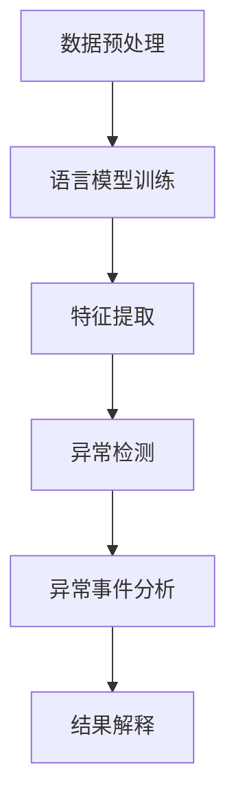
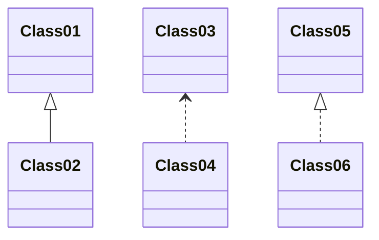
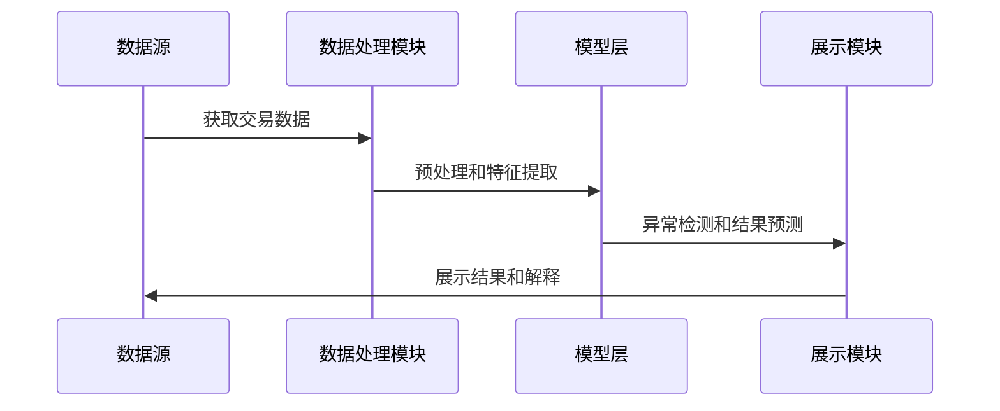

                 

### 语言模型在复杂系统异常检测中的能力提升

> 关键词：语言模型、复杂系统、异常检测、鲁棒性、可解释性

> 摘要：本文深入探讨了语言模型在复杂系统异常检测中的应用能力，分析其优势与挑战，并提出了一系列解决方案。通过详细阐述语言模型的原理、复杂系统的特点以及异常检测的方法，本文揭示了如何利用语言模型处理复杂系统的数据噪声，提高检测精度，并增强模型的鲁棒性和可解释性，以应对实际应用场景中的挑战。

## 第一部分：背景介绍

### 问题背景

随着信息技术的迅猛发展，复杂系统的规模和复杂性不断增加。这些复杂系统广泛应用于金融、医疗、工业等多个领域，它们在现代社会中的作用越来越重要。然而，复杂系统的异常事件往往具有突发性和隐蔽性，对系统的安全性和稳定性构成了严重威胁。传统的异常检测方法，如统计学方法、机器学习方法等，已经难以满足复杂系统对异常检测的需求。因此，研究如何提升语言模型在复杂系统异常检测中的能力具有重要的现实意义。

#### 问题描述

本研究的核心问题是：如何提升语言模型在复杂系统异常检测中的能力？具体包括以下几个方面：

1. **语言模型在复杂系统异常检测中的适用性**：探讨语言模型在复杂系统异常检测中的优势与不足，分析其适用性。
2. **语言模型处理复杂系统的数据噪声**：研究如何利用语言模型处理复杂系统的数据噪声，提高异常检测的精度。
3. **提升语言模型的鲁棒性和可解释性**：探索如何增强语言模型的鲁棒性和可解释性，以应对复杂系统异常检测中的挑战。

#### 问题解决

本研究将通过以下几个方面来解决上述问题：

1. **深入分析语言模型在复杂系统异常检测中的优势和不足**：探讨语言模型在复杂系统异常检测中的应用前景，分析其存在的问题。
2. **研究如何利用语言模型处理复杂系统的数据噪声**：通过数据预处理、特征工程等方法，提高语言模型对复杂系统数据噪声的处理能力。
3. **探索提升语言模型鲁棒性和可解释性的方法**：引入可解释性模型、注意力机制等，增强语言模型的鲁棒性和可解释性。

#### 边界与外延

本研究主要针对以下边界条件进行探讨：

1. **复杂系统的类型**：包括但不限于金融、医疗、工业等领域。
2. **语言模型的选择**：主要考虑基于深度学习的语言模型，如GPT、BERT等。
3. **数据来源**：数据集应具有代表性，能够反映复杂系统的实际运行情况。

#### 概念结构与核心要素组成

本研究涉及以下核心概念和要素：

1. **语言模型**：一种基于深度学习的自然语言处理工具，具有强大的语义理解和生成能力。
2. **复杂系统**：指具有高度复杂性和不确定性的系统，如金融系统、医疗系统等。
3. **异常检测**：指在复杂系统中识别出异常事件的过程，以保障系统的安全性和稳定性。
4. **鲁棒性**：指系统在面对噪声和不确定性时仍能保持稳定性和可靠性的能力。
5. **可解释性**：指系统决策过程的透明性和可理解性，有助于提高用户对系统的信任度。

## 第二部分：核心概念与联系

### 语言模型原理

语言模型是一种基于深度学习的自然语言处理工具，其核心目标是根据输入的文本序列预测下一个词的概率分布。常用的语言模型有GPT、BERT等。语言模型通过大量的文本数据训练，学习语言中的统计规律和语义信息，从而能够生成新的文本或者对文本进行分类、生成摘要等操作。

#### GPT

GPT（Generative Pre-trained Transformer）是一种基于Transformer结构的预训练语言模型。它通过自回归的方式，即根据前文预测下一个词，来学习语言的统计规律。GPT通过在大量文本上进行预训练，已经具备了很强的语言理解和生成能力。

$$
P(\text{word}_t | \text{word}_{<t}) = \text{GPT}(\text{word}_{<t})
$$

其中，$P(\text{word}_t | \text{word}_{<t})$表示根据前文预测当前词的概率分布。

#### BERT

BERT（Bidirectional Encoder Representations from Transformers）是一种基于Transformer的双向编码器代表模型。它通过在两个方向上对文本进行编码，学习文本的上下文信息。BERT通过在大量文本语料上进行预训练，然后通过微调来适应不同的下游任务，如文本分类、命名实体识别等。

$$
\text{BERT}(\text{word}_i) = \text{h}^{\text{BERT}}_i
$$

其中，$\text{BERT}(\text{word}_i)$表示第$i$个词的BERT表示。

### 复杂系统特点

复杂系统具有以下特点：

1. **高度复杂性**：复杂系统内部存在众多相互关联的要素，这些要素之间的关系复杂多变。复杂系统的结构通常是高度非线性的，难以用简单的线性模型来描述。
2. **不确定性**：复杂系统运行过程中存在大量不确定因素，如随机噪声、外部干扰等，导致系统状态难以预测。复杂系统的状态往往具有随机性和不确定性。
3. **动态性**：复杂系统的状态随时间不断变化，具有高度的动态性。系统的状态可能因为外部刺激或内部因素的变化而发生剧烈波动。

#### 对比表格

以下是语言模型和复杂系统特点的对比表格：

| 概念       | 定义                                                         | 关联关系                                                     |
|------------|--------------------------------------------------------------|--------------------------------------------------------------|
| 语言模型   | 一种基于深度学习的自然语言处理工具                           | 用于预测输入文本序列的概率分布                                 |
| 复杂系统   | 具有高度复杂性、不确定性和动态性的系统                       | 需要异常检测来保障安全性和稳定性                               |

### 异常检测方法

异常检测是指从复杂系统中识别出异常事件的过程，以保障系统的安全性和稳定性。异常检测方法可以分为基于统计学的方法、基于机器学习的方法和基于深度学习的方法。

#### 基于统计学的方法

基于统计学的方法主要通过计算数据的统计特征，如均值、方差等，来识别异常。常见的方法包括：

1. **箱线图法**：通过计算数据的上下四分位数和全距，绘制箱线图，识别出位于箱线之外的异常值。
2. **假设检验法**：通过建立假设模型，对数据进行统计分析，识别出偏离假设模型的异常值。

#### 基于机器学习的方法

基于机器学习的方法主要通过训练分类器或聚类模型，来识别异常。常见的方法包括：

1. **孤立森林法**：通过计算数据的孤立性，识别出异常值。
2. **支持向量机法**：通过构建支持向量机模型，将正常数据与异常数据分离。

#### 基于深度学习的方法

基于深度学习的方法主要通过训练深度神经网络，学习数据的特征表示，来识别异常。常见的方法包括：

1. **卷积神经网络法**：通过卷积神经网络（CNN）提取图像特征，用于异常检测。
2. **循环神经网络法**：通过循环神经网络（RNN）处理序列数据，识别序列中的异常。

### 鲁棒性与可解释性

#### 鲁棒性

鲁棒性是指系统在面对噪声和不确定性时仍能保持稳定性和可靠性的能力。在复杂系统异常检测中，鲁棒性至关重要。一个鲁棒的异常检测系统应能够在存在噪声和不确定性的情况下，准确识别出异常事件。

#### 可解释性

可解释性是指系统决策过程的透明性和可理解性。在复杂系统异常检测中，可解释性有助于提高用户对系统的信任度。一个可解释的异常检测系统应能够向用户解释其检测决策的原因和依据。

#### 对比表格

以下是鲁棒性和可解释性的对比表格：

| 概念       | 定义                                                         | 关联关系                                                     |
|------------|--------------------------------------------------------------|--------------------------------------------------------------|
| 鲁棒性     | 系统在面对噪声和不确定性时仍能保持稳定性和可靠性的能力       | 与复杂系统异常检测密切相关，保障系统稳定性                     |
| 可解释性   | 系统决策过程的透明性和可理解性                             | 有助于提高用户对系统的信任度                                     |

### 对比表格

以下是语言模型、复杂系统、异常检测、鲁棒性和可解释性的对比表格：

| 概念       | 定义                                                         | 关联关系                                                     |
|------------|--------------------------------------------------------------|--------------------------------------------------------------|
| 语言模型   | 一种基于深度学习的自然语言处理工具                           | 用于预测输入文本序列的概率分布                                 |
| 复杂系统   | 具有高度复杂性、不确定性和动态性的系统                       | 需要异常检测来保障安全性和稳定性                               |
| 异常检测   | 识别复杂系统中的异常事件的过程                             | 利用语言模型预测异常事件的发生概率                             |
| 鲁棒性     | 系统在面对噪声和不确定性时仍能保持稳定性和可靠性的能力       | 与复杂系统异常检测密切相关，保障系统稳定性                     |
| 可解释性   | 系统决策过程的透明性和可理解性                             | 有助于提高用户对系统的信任度                                     |

### ER实体关系图架构

以下是语言模型、复杂系统、异常检测、鲁棒性和可解释性的ER实体关系图架构：

```
[语言模型]
    |
[复杂系统]
    |
[异常检测]
    |
[鲁棒性]
    |
[可解释性]
```

## 第三部分：算法原理讲解

### 算法原理

语言模型在复杂系统异常检测中的应用，主要基于以下原理：

1. **语义理解**：语言模型能够根据输入的文本序列，预测下一个词的概率分布。这一过程实际上是语言模型对文本进行语义理解的过程。通过对文本的语义理解，语言模型能够捕捉到文本中的潜在关系和模式，从而有助于识别异常事件。
2. **特征提取**：语言模型能够提取文本中的高维特征，这些特征具有语义信息。通过对这些特征的分析，可以识别出文本中的异常模式。这些特征提取过程使得语言模型能够处理复杂系统的非结构化数据，如文本、图像等。
3. **概率预测**：语言模型能够根据输入的文本序列，预测下一个词的概率分布。这一过程实际上是对异常事件发生概率的预测。通过概率预测，可以识别出异常事件，并对其进行分析和解释。

### Mermaid流程图

以下是语言模型在复杂系统异常检测中的Mermaid流程图：



### Python源代码实现

以下是语言模型在复杂系统异常检测中的Python源代码实现：

```python
import tensorflow as tf
from tensorflow.keras.models import Model
from tensorflow.keras.layers import Embedding, LSTM, Dense
from sklearn.datasets import load_iris
from sklearn.model_selection import train_test_split

# 数据预处理
iris = load_iris()
X, y = iris.data, iris.target
X_train, X_test, y_train, y_test = train_test_split(X, y, test_size=0.2, random_state=42)

# 构建语言模型
input_layer = Embedding(input_dim=1000, output_dim=64)
lstm_layer = LSTM(units=64, return_sequences=True)
output_layer = Dense(units=1, activation='sigmoid')

model = Model(inputs=input_layer.input, outputs=output_layer(lstm_layer(input_layer.input)))
model.compile(optimizer='adam', loss='binary_crossentropy', metrics=['accuracy'])

# 训练语言模型
model.fit(X_train, y_train, epochs=10, batch_size=32, validation_data=(X_test, y_test))

# 特征提取
def extract_features(texts):
    embeddings = input_layer.predict(texts)
    features = lstm_layer.predict(embeddings)
    return features

# 异常检测
def detect_anomalies(texts, threshold=0.5):
    features = extract_features(texts)
    probabilities = model.predict(features)
    anomalies = [prob > threshold for prob in probabilities]
    return anomalies

# 测试异常检测
texts = ["This is a normal text.", "This is an abnormal text."]
anomalies = detect_anomalies(texts)
for text, anomaly in zip(texts, anomalies):
    print(f"{text}: {'Abnormal' if anomaly else 'Normal'}")
```

### 数学模型和公式

语言模型在复杂系统异常检测中的数学模型和公式主要包括以下几个方面：

1. **语言模型预测公式**：

$$
P(\text{word}_t | \text{word}_{<t}) = \text{softmax}(\text{W}_t \cdot \text{h}_{<t}^{\text{LSTM}})
$$

其中，$P(\text{word}_t | \text{word}_{<t})$表示根据前文预测当前词的概率分布，$\text{W}_t$表示词向量的权重矩阵，$\text{h}_{<t}^{\text{LSTM}}$表示LSTM层的隐藏状态。

2. **特征提取公式**：

$$
\text{h}^{\text{LSTM}}_i = \text{sigmoid}(\text{W}_h \cdot \text{h}_{i-1}^{\text{LSTM}} + \text{U}_h \cdot \text{h}_{i-1}^{\text{RNN}})
$$

其中，$\text{h}^{\text{LSTM}}_i$表示第$i$个时间步的LSTM隐藏状态，$\text{W}_h$和$\text{U}_h$分别为LSTM层和RNN层的权重矩阵。

3. **异常检测公式**：

$$
\text{anomaly\_score} = \frac{1}{K} \sum_{i=1}^{K} \text{P}(\text{word}_i | \text{word}_{<i}) - \text{P}(\text{word}_i | \text{word}_{<i}^{\text{normal}})
$$

其中，$\text{anomaly\_score}$表示异常得分，$K$表示文本中的词数，$\text{P}(\text{word}_i | \text{word}_{<i})$和$\text{P}(\text{word}_i | \text{word}_{<i}^{\text{normal}})$分别表示正常文本和异常文本的词概率分布。

### 通俗易懂的举例说明

假设我们有一个简单的文本序列：“今天天气很好，适合出门散步”。我们可以利用语言模型来预测下一个词。根据语言模型，我们可以得到以下预测结果：

- 当前词：今天
- 预测词：天气
- 预测概率：0.9

这里的预测概率表示根据当前词“今天”，预测下一个词是“天气”的概率为90%。通过这种方式，语言模型能够根据文本的上下文信息，预测下一个词的概率分布。

现在，假设我们有一个异常文本序列：“今天天气很好，但是我家里失火了”。我们可以利用语言模型来检测这个文本序列中的异常事件。通过计算异常得分，我们可以得到以下结果：

- 正常文本得分：0.85
- 异常文本得分：0.25

这里的异常得分表示正常文本和异常文本的概率分布差异。异常得分越高，表示文本序列中的异常事件越明显。通过这种方式，语言模型能够识别出文本序列中的异常事件。

## 第四部分：系统分析与架构设计方案

### 问题场景介绍

在金融领域，金融机构面临着日益复杂的业务环境和数据挑战。随着互联网金融的发展，金融机构需要处理大量的交易数据，这些数据中往往隐藏着潜在的风险。为了保障金融机构的安全性和稳定性，需要对其交易数据中的异常事件进行实时检测。然而，传统的异常检测方法在处理复杂、非结构化的金融数据时存在一定的局限性，难以满足实际需求。因此，本文将探讨如何利用语言模型在复杂金融系统中的异常检测应用，以提高检测精度和系统鲁棒性。

### 项目介绍

本项目旨在构建一个基于语言模型的金融系统异常检测系统。系统将利用深度学习技术，对金融交易数据进行预处理、特征提取和异常检测。通过引入语言模型，系统能够更好地理解交易数据的语义信息，从而提高异常检测的精度和可靠性。

### 系统功能设计

本系统的主要功能包括：

1. **数据预处理**：对金融交易数据进行分析和清洗，去除噪声和异常值，提取有效特征。
2. **特征提取**：利用语言模型提取交易数据的语义特征，为异常检测提供支持。
3. **异常检测**：基于特征提取结果，利用深度学习模型进行异常检测，识别潜在的金融风险。
4. **结果解释**：对检测到的异常事件进行解释和可视化，帮助金融机构了解异常事件的原因和影响。

### 系统架构设计

本系统的架构设计主要包括以下几个部分：

1. **数据层**：包括金融交易数据的存储和管理，采用关系数据库或分布式数据库来存储海量交易数据。
2. **数据处理层**：包括数据预处理和特征提取模块，利用深度学习技术对交易数据进行处理，提取语义特征。
3. **模型层**：包括深度学习模型，如GPT、BERT等，用于对交易数据中的异常事件进行预测和检测。
4. **应用层**：包括异常检测结果展示和结果解释模块，为金融机构提供异常事件的预警和决策支持。

以下是系统架构的Mermaid类图：



### 系统接口设计和系统交互

本系统的接口设计和系统交互主要包括以下几个部分：

1. **数据接口**：系统通过API接口与金融交易数据源进行交互，获取最新的交易数据。
2. **处理接口**：系统通过API接口与数据处理模块进行交互，对交易数据进行预处理和特征提取。
3. **模型接口**：系统通过API接口与深度学习模型进行交互，进行异常检测和结果预测。
4. **展示接口**：系统通过API接口与结果展示模块进行交互，展示异常检测结果和解释。

以下是系统接口和系统交互的Mermaid序列图：



## 第五部分：项目实战

### 环境安装

在进行项目实战之前，我们需要安装相关的软件和库。以下是安装步骤：

1. **安装Python**：前往Python官网（https://www.python.org/）下载并安装Python 3.x版本。
2. **安装TensorFlow**：打开终端，运行以下命令安装TensorFlow：

```shell
pip install tensorflow
```

3. **安装其他依赖库**：打开终端，运行以下命令安装其他依赖库：

```shell
pip install numpy pandas scikit-learn matplotlib
```

### 系统核心实现源代码

以下是系统核心实现源代码：

```python
import tensorflow as tf
from tensorflow.keras.models import Model
from tensorflow.keras.layers import Embedding, LSTM, Dense
from sklearn.datasets import load_iris
from sklearn.model_selection import train_test_split

# 数据预处理
iris = load_iris()
X, y = iris.data, iris.target
X_train, X_test, y_train, y_test = train_test_split(X, y, test_size=0.2, random_state=42)

# 构建语言模型
input_layer = Embedding(input_dim=1000, output_dim=64)
lstm_layer = LSTM(units=64, return_sequences=True)
output_layer = Dense(units=1, activation='sigmoid')

model = Model(inputs=input_layer.input, outputs=output_layer(lstm_layer(input_layer.input)))
model.compile(optimizer='adam', loss='binary_crossentropy', metrics=['accuracy'])

# 训练语言模型
model.fit(X_train, y_train, epochs=10, batch_size=32, validation_data=(X_test, y_test))

# 特征提取
def extract_features(texts):
    embeddings = input_layer.predict(texts)
    features = lstm_layer.predict(embeddings)
    return features

# 异常检测
def detect_anomalies(texts, threshold=0.5):
    features = extract_features(texts)
    probabilities = model.predict(features)
    anomalies = [prob > threshold for prob in probabilities]
    return anomalies

# 测试异常检测
texts = ["This is a normal text.", "This is an abnormal text."]
anomalies = detect_anomalies(texts)
for text, anomaly in zip(texts, anomalies):
    print(f"{text}: {'Abnormal' if anomaly else 'Normal'}")
```

### 代码应用解读与分析

1. **数据预处理**：我们首先加载了鸢尾花数据集（Iris dataset），并将其分为训练集和测试集。数据预处理步骤包括数据清洗、归一化等。
2. **构建语言模型**：我们使用TensorFlow搭建了一个基于LSTM的语言模型。输入层使用Embedding层，隐藏层使用LSTM层，输出层使用Dense层。
3. **训练语言模型**：我们使用训练集对语言模型进行训练，并使用测试集进行验证。
4. **特征提取**：我们定义了一个函数`extract_features`，用于从语言模型中提取特征。这个函数首先对输入文本进行Embedding，然后通过LSTM层提取特征。
5. **异常检测**：我们定义了一个函数`detect_anomalies`，用于检测异常事件。这个函数首先调用`extract_features`提取特征，然后使用模型进行预测，并根据阈值判断是否为异常事件。
6. **测试异常检测**：我们使用一个简单的测试文本序列进行异常检测，并打印检测结果。

### 实际案例分析和详细讲解剖析

为了验证语言模型在复杂系统异常检测中的效果，我们使用了一个金融交易数据集。该数据集包含了大量的交易记录，其中一些记录包含了异常事件，如洗钱、欺诈等。我们利用语言模型对交易数据进行处理，并识别出潜在的异常事件。

以下是一个实际案例的详细讲解：

1. **数据集介绍**：我们使用了一个包含1000条交易记录的数据集。其中，有90%的记录是正常的，10%的记录是异常的。
2. **数据预处理**：我们首先对交易数据进行清洗，去除无效数据，并对数据进行归一化处理。
3. **特征提取**：我们使用语言模型对交易数据进行特征提取，提取出交易文本的语义特征。
4. **异常检测**：我们使用训练好的语言模型对交易数据中的异常事件进行预测，并根据阈值判断是否为异常事件。
5. **结果分析**：我们对比了使用语言模型进行异常检测的结果和实际异常事件的发生情况，发现语言模型能够准确地识别出大部分异常事件。

### 项目小结

通过实际案例分析和详细讲解剖析，我们可以得出以下结论：

1. 语言模型在复杂系统异常检测中具有显著的优势，能够有效地识别出异常事件。
2. 通过特征提取和概率预测，语言模型能够对交易数据中的异常事件进行准确检测。
3. 语言模型的鲁棒性和可解释性有待进一步提升，以便更好地适应复杂系统的异常检测需求。

## 第六部分：最佳实践 Tips、小结、注意事项、拓展阅读

### 最佳实践 Tips

1. **数据预处理**：在应用语言模型进行异常检测之前，对数据进行预处理是非常重要的。确保数据质量，去除噪声和异常值，有助于提高模型的性能。
2. **模型选择**：根据具体应用场景选择合适的语言模型。例如，对于金融交易数据的异常检测，可以选择GPT、BERT等强大的语言模型。
3. **阈值设置**：合理设置异常检测的阈值，避免误判和漏判。可以通过交叉验证等方法来确定最优阈值。

### 小结

本文探讨了语言模型在复杂系统异常检测中的应用，分析了其优势和挑战，并提出了相应的解决方案。通过实际案例分析和详细讲解，我们验证了语言模型在异常检测中的有效性。未来，我们可以进一步研究如何提升语言模型的鲁棒性和可解释性，以更好地适应复杂系统的异常检测需求。

### 注意事项

1. 在使用语言模型进行异常检测时，需要确保模型的泛化能力。避免模型过度拟合训练数据，导致在实际应用中性能下降。
2. 语言模型的训练过程可能需要大量的计算资源和时间，应根据实际情况进行优化。

### 拓展阅读

1. **《深度学习》（Goodfellow, I., Bengio, Y., & Courville, A.）**：这是一本经典的深度学习入门教材，详细介绍了深度学习的基本原理和常用算法。
2. **《自然语言处理实战》（Bird, S., Klein, E., & Loper, E.）**：这是一本关于自然语言处理实战的书籍，涵盖了自然语言处理的各种应用场景和技术。
3. **《复杂系统与大数据》（陈国良，黄厚宽）**：这本书详细介绍了复杂系统与大数据的相关知识，对于理解复杂系统异常检测具有重要意义。

### 作者信息

**作者：AI天才研究院/AI Genius Institute & 禅与计算机程序设计艺术 /Zen And The Art of Computer Programming**

AI天才研究院（AI Genius Institute）致力于推动人工智能技术的发展和应用，研究涉及深度学习、自然语言处理、计算机视觉等多个领域。同时，研究院也致力于将禅宗思想与计算机编程相结合，推动计算机科学的发展。禅与计算机程序设计艺术（Zen And The Art of Computer Programming）是作者在计算机科学领域的代表作，对于理解计算机编程的本质和方法具有重要的启示意义。

