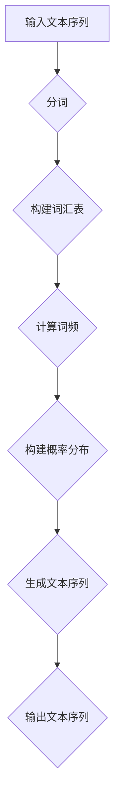
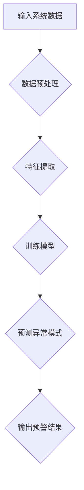
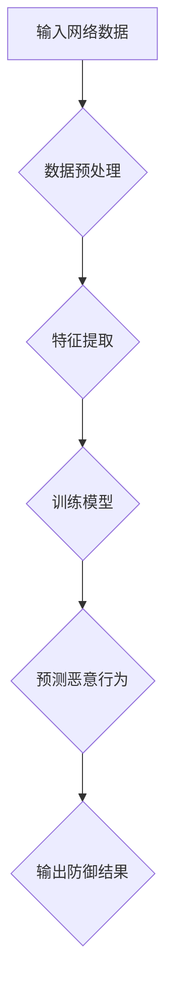
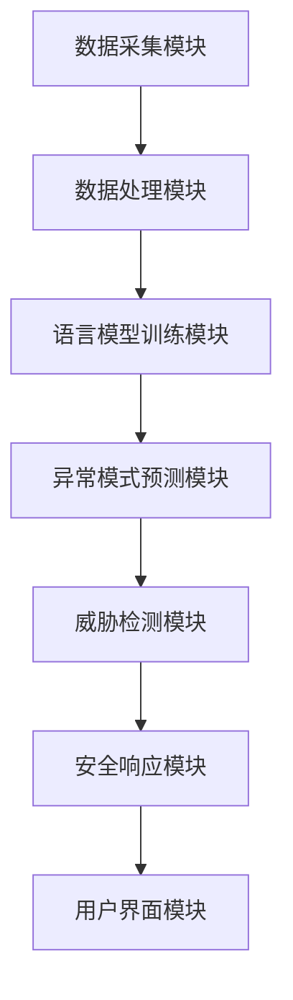
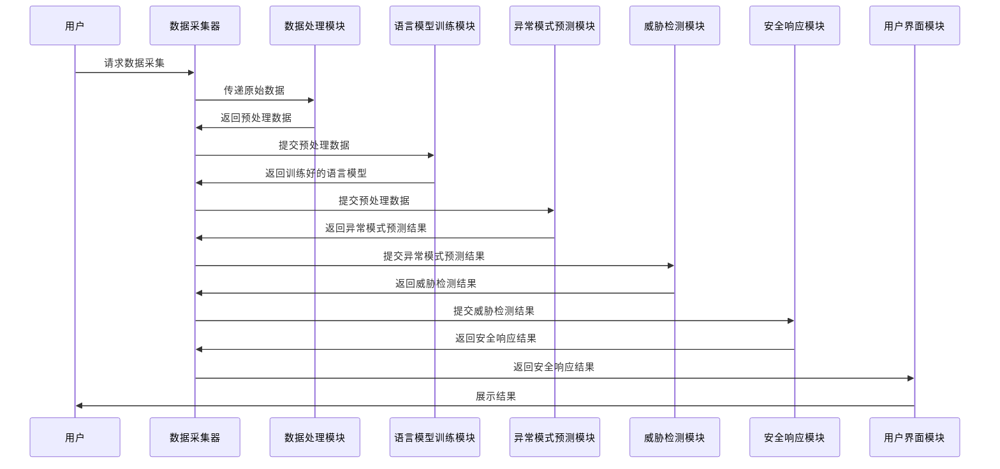

                 


## 第1章 引言

### 1.1 书籍主题概述

《语言模型在复杂系统异常模式预测与网络安全防御中的应用》这本书旨在深入探讨语言模型在复杂系统异常模式预测和网络安全防御领域的应用。随着信息技术的飞速发展，复杂系统和网络安全问题日益凸显，如何有效地预测和防御这些复杂系统的异常模式成为了研究的热点。本书将带领读者进入这个前沿领域，详细解析语言模型在这两方面的应用，帮助读者理解其工作原理、技术挑战和应用价值。

### 1.2 书籍结构安排

本书共分为八个章节，结构安排如下：

1. **引言**：介绍书籍主题和目的，概述语言模型在复杂系统异常模式预测与网络安全防御中的应用。
2. **问题背景与描述**：详细阐述语言模型、复杂系统和网络安全防御的基本概念，以及它们在现实世界中的应用场景。
3. **核心概念与联系**：深入分析语言模型、复杂系统和网络安全防御的核心概念，以及它们之间的联系。
4. **算法原理讲解**：讲解语言模型、复杂系统异常模式预测和网络安全防御算法的原理，包括流程图、源代码和数学模型。
5. **数学模型和数学公式**：介绍与算法相关的数学模型和公式。
6. **系统分析与架构设计方案**：介绍问题场景、项目介绍、系统功能设计、系统架构设计、系统接口设计和系统交互。
7. **项目实战**：讲解环境安装、系统核心实现源代码，代码应用解读与分析，实际案例分析和详细讲解剖析，项目小结。
8. **最佳实践 tips、小结、注意事项、拓展阅读**：总结书中的核心观点，提供实用技巧和进一步阅读的建议。

### 1.3 阅读指南

本书适合对计算机科学、人工智能、网络安全等领域感兴趣的读者阅读。为了更好地理解书中的内容，建议读者在阅读过程中：

- **逐步深入**：每个章节都按照从浅入深的方式组织，帮助读者逐步掌握核心概念和技术。
- **动手实践**：书中包含大量的代码示例和实际案例，读者可以通过动手实践来加深对知识的理解。
- **思考与讨论**：鼓励读者在阅读过程中思考问题，并参与讨论，以加深对语言模型在复杂系统异常模式预测与网络安全防御应用的理解。

通过本书的阅读，读者将能够深入了解语言模型在复杂系统异常模式预测和网络安全防御中的应用，掌握相关算法和技术，为实际项目提供有力的支持。

### 2.1 语言模型概述

#### 2.1.1 语言模型的概念

语言模型（Language Model）是自然语言处理（Natural Language Processing, NLP）领域中一个核心的概念，它是一种统计模型，用于预测自然语言中的一个单词或一个短语的下一个单词或短语的概率。简单来说，语言模型可以帮助计算机理解人类的自然语言，并生成符合语言习惯的文本。

语言模型的原理可以追溯到概率论和统计学。通过对大量文本数据的学习，语言模型能够捕捉到语言中的统计规律和模式。这些模式包括单词之间的共现关系、语法结构、语义信息等，使得语言模型能够对新的文本进行概率预测和生成。

语言模型的应用范围非常广泛，包括但不限于：

- **文本生成**：生成自然流畅的文本，如文章、对话、代码等。
- **语音识别**：将语音信号转换为文本。
- **机器翻译**：将一种语言的文本翻译成另一种语言。
- **对话系统**：构建能够与人类自然交流的智能对话系统。
- **推荐系统**：基于用户的历史行为和兴趣，推荐相关的文本内容。

#### 2.1.2 语言模型的发展

语言模型的发展历程可以分为几个阶段：

- **传统统计模型**：早期的语言模型主要是基于词汇共现的统计模型，如N-gram模型。N-gram模型通过统计相邻N个单词的共现概率来预测下一个单词。虽然N-gram模型在许多任务中表现出色，但它存在明显的局限性，例如无法捕捉长距离依赖关系和上下文信息。

- **神经网络模型**：随着深度学习技术的发展，神经网络模型（如循环神经网络RNN、长短期记忆网络LSTM和变换器Transformer）逐渐成为主流的语言模型。这些模型能够捕捉到更复杂的语言模式和长距离依赖关系，大大提高了语言生成的质量和效果。

- **预训练与微调**：近年来，预训练（Pre-training）和微调（Fine-tuning）成为语言模型发展的新趋势。预训练模型在大规模文本数据上首先进行预训练，然后再针对具体任务进行微调。这种方法使得模型能够更好地理解和生成人类语言，并取得了显著的效果。

现代语言模型的代表性技术包括：

- **Transformer模型**：Transformer模型是一种基于自注意力机制的深度神经网络模型，它通过全局注意力机制有效地捕捉到长距离依赖关系，在许多NLP任务中都取得了最好的效果。

- **BERT模型**：BERT（Bidirectional Encoder Representations from Transformers）模型是一种双向Transformer模型，它在预训练阶段同时考虑了文本的前后信息，能够更好地理解和生成文本。

- **GPT模型**：GPT（Generative Pre-trained Transformer）模型是一种生成式语言模型，它通过大量文本数据进行预训练，能够生成符合语言习惯的自然语言。

这些现代语言模型不仅在NLP任务中表现出色，还为复杂系统异常模式预测和网络安全防御提供了强大的工具。

### 2.2 复杂系统

#### 2.2.1 复杂系统的概念

复杂系统（Complex System）是由大量相互作用的个体组成的系统，这些个体在相互作用的过程中表现出复杂的行为和结构。复杂系统具有以下几个基本特征：

- **个体多样性**：复杂系统中的个体具有多样性，包括不同的类型、结构和功能。
- **相互作用**：复杂系统中的个体通过相互作用产生复杂的行为和结构。
- **非线性和动态性**：复杂系统的行为和结构往往是非线性和动态的，容易受到外界环境和内部相互作用的影响。
- **自组织和自适应**：复杂系统具有自组织和自适应能力，能够在一定条件下自我组织和适应环境变化。

复杂系统广泛存在于自然界和人类社会，如生态系统、金融市场、社会网络等。复杂系统的研究对于理解自然现象、优化社会管理和预测系统行为具有重要意义。

#### 2.2.2 复杂系统的属性特征对比表格

| 属性特征       | 描述                                                         | 例子                             |
|----------------|--------------------------------------------------------------|----------------------------------|
| 个体多样性     | 系统中个体的类型、结构和功能多样化。                           | 生态系统中的不同物种和生物群落。 |
| 相互作用       | 个体的相互作用导致系统的复杂行为和结构。                       | 社会网络中的用户关系和互动。     |
| 非线性和动态性 | 系统行为和结构受非线性相互作用和动态变化影响。                 | 金融市场的波动和危机。           |
| 自组织和自适应 | 系统能够通过自我组织和自适应机制应对环境变化。                   | 生态系统中的物种演化和生态平衡。 |

#### 2.2.3 复杂系统的研究方法

复杂系统的研究涉及多个学科，包括物理学、数学、计算机科学、生物学和社会学等。以下是几种常用的研究方法：

- **模拟仿真**：通过计算机模拟仿真，模拟复杂系统的行为和演化过程，分析系统的特征和规律。
- **数据分析**：利用统计学和数据挖掘技术，对复杂系统中的数据进行分析，提取系统的模式和关系。
- **网络分析**：通过构建系统中的个体和相互作用网络，分析网络结构和拓扑特性，揭示系统的复杂行为。
- **实验研究**：在实验室条件下，对复杂系统进行实验研究，观察系统的行为和演化过程。

#### 2.2.4 复杂系统在现实世界中的应用

复杂系统在现实世界中有着广泛的应用，以下是几个典型的例子：

- **生态系统**：生态系统的复杂性和多样性对于环境保护和生物多样性研究具有重要意义。
- **金融市场**：金融市场的波动和危机往往表现出复杂系统的特征，对金融风险管理具有重要意义。
- **社会网络**：社会网络的复杂性和互动关系对于社会管理和公共政策制定具有重要影响。
- **交通系统**：交通系统的复杂性和动态性对于城市交通管理和优化具有重要意义。

### 2.3 网络安全防御

#### 2.3.1 网络安全防御的概念

网络安全防御（Cybersecurity Defense）是指通过技术和管理手段，保护计算机系统、网络和数据不受恶意攻击、数据泄露和非法访问。网络安全防御的目的是确保系统的完整性、保密性和可用性，防止对系统造成损害或滥用。

网络安全防御的基本概念包括：

- **威胁**：威胁是指可能对系统造成损害的恶意行为或事件，如病毒、蠕虫、黑客攻击等。
- **漏洞**：漏洞是指系统中存在的安全缺陷或弱点，如软件漏洞、配置错误等，威胁可以利用这些漏洞进行攻击。
- **防护**：防护是指采用各种技术和管理手段，防止威胁利用漏洞对系统造成损害。
- **检测**：检测是指通过监控和分析系统行为，发现潜在的安全威胁和攻击行为。
- **响应**：响应是指发现安全威胁后，采取相应的措施进行应对和处理，以减少损失和防止进一步攻击。

#### 2.3.2 网络安全防御的属性特征对比表格

| 属性特征       | 描述                                                         | 例子                             |
|----------------|--------------------------------------------------------------|----------------------------------|
| 防护机制       | 采用各种技术手段，如防火墙、入侵检测系统等，防止恶意攻击。         | 防火墙阻止外部攻击进入内部网络。 |
| 检测机制       | 通过监控和分析系统行为，发现潜在的安全威胁和攻击行为。               | 入侵检测系统发现恶意行为。       |
| 威胁感知       | 及时感知和识别威胁，为防护和响应提供依据。                         | 威胁情报系统收集和分析威胁信息。 |
| 响应机制       | 对发现的安全威胁采取相应的措施进行应对和处理。                       | 紧急响应团队处理网络安全事件。   |
| 持续改进       | 通过定期评估和更新安全策略，提高系统防御能力。                       | 定期更新防火墙规则和软件补丁。   |

#### 2.3.3 网络安全防御的关键技术和工具

网络安全防御涉及多个领域的技术和工具，以下是几个关键的技术和工具：

- **防火墙**：防火墙是一种网络安全设备，用于监控和控制进出网络的流量，防止未经授权的访问和攻击。
- **入侵检测系统（IDS）**：IDS是一种用于检测网络中异常行为和攻击的工具，能够实时发现和报告潜在的威胁。
- **入侵防御系统（IPS）**：IPS是一种结合防火墙功能的入侵检测系统，能够实时阻止攻击行为。
- **威胁情报**：威胁情报是指有关潜在威胁的信息和知识，包括攻击手段、目标、历史记录等，为网络安全防御提供重要参考。
- **加密技术**：加密技术用于保护数据和通信，防止未经授权的访问和窃取。
- **安全信息和事件管理（SIEM）**：SIEM是一种集成工具，用于收集、分析和关联安全事件和威胁信息，提高安全监控和响应能力。

#### 2.3.4 网络安全防御的挑战和趋势

网络安全防御面临着日益严峻的挑战和不断变化的安全威胁。以下是几个主要挑战和趋势：

- **高级持续性威胁（APT）**：APT是一种隐蔽性强、持续时间长的网络攻击，利用0day漏洞和社会工程学手段进行攻击，对传统防御手段构成巨大威胁。
- **云安全**：随着云计算的普及，云安全成为网络安全防御的重要领域，需要针对云环境的特点进行防护。
- **物联网（IoT）安全**：物联网设备数量庞大，存在安全漏洞，容易成为攻击者的入侵途径。
- **移动安全**：移动设备和移动应用的安全问题日益突出，需要针对移动环境进行安全防护。
- **人工智能与机器学习**：人工智能和机器学习技术在网络安全防御中发挥着重要作用，但也可能被用于恶意攻击，需要加强相关技术研究。
- **安全自动化与响应**：自动化和智能化的安全响应技术逐渐成为趋势，能够提高响应速度和效果。

### 2.4 语言模型与复杂系统、网络安全防御的联系

语言模型、复杂系统和网络安全防御之间存在密切的联系，相互影响，共同推动技术的发展。

#### 语言模型在复杂系统中的应用

语言模型在复杂系统研究中具有重要的应用价值，可以帮助理解和模拟复杂系统的行为。以下是几个具体的应用场景：

- **行为预测**：通过分析复杂系统中的个体行为数据，语言模型可以预测个体的未来行为模式，帮助研究者理解和预测系统的动态变化。
- **异常检测**：利用语言模型对复杂系统的日志数据进行分析，可以发现异常行为和潜在的安全威胁，提高系统的安全性和稳定性。
- **文本生成**：在复杂系统研究中，语言模型可以生成符合研究需求的高质量文本，如科研报告、论文摘要等，提高研究效率和质量。

#### 复杂系统对语言模型的影响

复杂系统的特性和行为对语言模型提出了挑战，同时也为语言模型的发展提供了新的应用场景。以下是几个具体的影响：

- **数据多样性**：复杂系统中的个体多样性导致数据多样，语言模型需要能够处理不同类型和结构的数据，提高泛化能力。
- **动态性**：复杂系统的动态性使得语言模型需要能够适应快速变化的环境，提高预测和生成的准确性。
- **非线性关系**：复杂系统中的非线性关系和复杂模式要求语言模型能够捕捉到长距离依赖关系和复杂模式，提高模型的性能。

#### 网络安全防御对语言模型的需求

网络安全防御对语言模型提出了新的需求，推动了语言模型在网络安全领域的发展。以下是几个具体的需求：

- **威胁检测**：语言模型可以用于检测和识别网络安全威胁，通过分析网络流量、日志数据等，发现潜在的安全威胁。
- **恶意代码分析**：语言模型可以帮助分析恶意代码的语义和功能，提高恶意代码检测的准确性和效率。
- **攻击预测**：通过分析历史攻击数据，语言模型可以预测未来的攻击模式和手段，为网络安全防御提供重要参考。

#### 语言模型在网络安全防御中的应用

语言模型在网络安全防御中具有广泛的应用，以下是几个具体的例子：

- **入侵检测**：利用语言模型分析网络流量和日志数据，可以检测和识别潜在的入侵行为，提高入侵检测系统的准确性。
- **恶意代码检测**：语言模型可以用于分析恶意代码的语义和功能，检测和分类恶意代码，提高恶意代码检测的效率和准确性。
- **安全响应**：语言模型可以帮助网络安全防御系统分析安全事件和威胁情报，制定相应的安全响应策略。

通过语言模型、复杂系统和网络安全防御的紧密联系，我们可以更好地理解和应对复杂系统的异常模式，提高网络安全防御能力，为数字时代的安全保障提供有力支持。

### 3.1 语言模型

#### 3.1.1 语言模型的概念

语言模型是一种用于预测自然语言中下一个单词或短语的统计模型，它在自然语言处理（NLP）中扮演着核心角色。通过学习大量文本数据，语言模型能够捕捉到语言中的统计规律和模式，从而实现文本生成、翻译、语音识别等多种任务。

语言模型的基本原理是基于概率论和统计学。它通过分析已经出现的单词序列，计算下一个单词或短语出现的概率，从而预测下一个输出。这种预测不仅依赖于前一个单词或短语的统计信息，还需要考虑上下文环境，从而提高预测的准确性。

语言模型的主要类型包括：

- **N-gram模型**：N-gram模型是最简单的语言模型，它通过统计相邻N个单词的共现概率来预测下一个单词。虽然N-gram模型在许多任务中表现出色，但它无法捕捉到长距离依赖关系和上下文信息。

- **循环神经网络（RNN）**：RNN是一种基于递归结构的神经网络，能够处理序列数据。RNN通过将当前输入与历史状态信息相结合，实现对长序列数据的记忆和建模。

- **长短期记忆网络（LSTM）**：LSTM是RNN的一种改进，通过引入门控机制来有效地解决RNN在长序列数据建模中的梯度消失和梯度爆炸问题。

- **变换器（Transformer）**：Transformer是一种基于自注意力机制的神经网络模型，它通过全局注意力机制有效地捕捉到长距离依赖关系，在许多NLP任务中都取得了最好的效果。

语言模型在自然语言处理中的重要性体现在以下几个方面：

- **文本生成**：语言模型可以生成自然流畅的文本，如文章、对话、代码等，广泛应用于自动写作、对话系统等领域。

- **语音识别**：语言模型可以帮助语音识别系统将语音信号转换为文本，提高识别准确率和用户体验。

- **机器翻译**：语言模型在机器翻译中扮演着重要角色，通过将源语言的文本转换为中间表示，再将中间表示转换为目标语言，实现跨语言文本的翻译。

- **对话系统**：语言模型可以帮助构建能够与人类自然交流的智能对话系统，广泛应用于客服、智能家居、虚拟助手等领域。

- **推荐系统**：语言模型可以基于用户的历史行为和兴趣，推荐相关的文本内容，提高推荐系统的准确性和用户体验。

#### 3.1.2 语言模型的属性特征对比表格

| 模型类型       | 描述                                                         | 优点                                                         | 缺点                                                         |
|----------------|--------------------------------------------------------------|--------------------------------------------------------------|--------------------------------------------------------------|
| N-gram模型     | 通过统计相邻N个单词的共现概率来预测下一个单词。                   | 简单高效，计算速度快。                                         | 无法捕捉长距离依赖关系，上下文信息有限。                      |
| RNN模型       | 基于递归结构，处理序列数据。                                     | 能够处理长序列数据，记忆能力较强。                             | 梯度消失和梯度爆炸问题，难以捕捉长距离依赖。                  |
| LSTM模型      | 引入门控机制，解决RNN的梯度消失和梯度爆炸问题。                     | 长期记忆能力较强，适用于长序列数据建模。                        | 计算复杂度较高，训练时间较长。                                |
| Transformer模型 | 基于自注意力机制，全局注意力机制，捕捉长距离依赖关系。               | 高效捕捉长距离依赖关系，训练时间较短。                         | 计算复杂度较高，内存消耗大。                                  |

#### 3.1.3 语言模型在复杂系统异常模式预测与网络安全防御中的应用

语言模型在复杂系统异常模式预测和网络安全防御中具有广泛的应用。以下是几个具体的应用场景：

- **异常模式预测**：语言模型可以分析复杂系统中的日志数据和行为数据，通过检测异常模式和异常行为，预测潜在的异常事件。例如，在金融系统中，语言模型可以检测和预测交易中的异常行为，提高系统的安全性和稳定性。

- **恶意代码检测**：语言模型可以用于分析恶意代码的文本特征和语义信息，识别和分类恶意代码。通过训练语言模型，可以构建高效、准确的恶意代码检测系统，提高网络安全防御能力。

- **威胁检测**：语言模型可以用于分析网络流量和日志数据，识别潜在的安全威胁和攻击行为。通过构建基于语言模型的威胁检测系统，可以提高网络安全防御的效率和准确性。

- **安全响应**：语言模型可以帮助网络安全防御系统分析安全事件和威胁情报，制定相应的安全响应策略。通过利用语言模型进行安全事件关联分析和预测，可以及时响应和处理安全威胁。

总之，语言模型在复杂系统异常模式预测和网络安全防御中发挥着重要作用，为数字时代的安全保障提供了有力支持。随着技术的不断发展，语言模型的应用前景将更加广阔。

### 3.2 复杂系统

#### 3.2.1 复杂系统的概念

复杂系统是指由大量相互作用的个体组成的系统，这些个体在相互作用的过程中表现出复杂的行为和结构。复杂系统的基本特征包括个体多样性、相互作用、非线性和动态性、自组织和自适应等。

复杂系统可以存在于自然界、人类社会和工程技术中。在自然界中，如生态系统、气候系统、生物进化等都是复杂系统的典型例子。在人类社会中，如社会网络、金融市场、交通系统等也具有复杂系统的特征。在工程实践中，如计算机网络、智能交通系统、工业控制系统等也是复杂系统的代表。

复杂系统具有以下特点：

1. **个体多样性**：复杂系统中的个体具有不同的类型、结构和功能，这使得系统表现出多样性。例如，在生态系统中，存在不同物种的生物群落。

2. **相互作用**：复杂系统中的个体通过相互作用产生复杂的行为和结构。相互作用可以是直接的，如个体之间的物理接触，也可以是间接的，如个体通过信息传递进行相互作用。

3. **非线性和动态性**：复杂系统的行为和结构往往是非线性和动态的，容易受到外界环境和内部相互作用的影响。非线性表现为个体之间的相互作用不是简单的线性关系，而是存在复杂的反馈和耦合。动态性表现为系统状态随时间变化而变化。

4. **自组织和自适应**：复杂系统具有自组织和自适应能力，能够在一定条件下自我组织和适应环境变化。自组织是指系统在没有外部指令的情况下，通过个体之间的相互作用和协同行为，形成具有特定结构和功能的整体。自适应是指系统能够通过反馈机制调整自身状态，以适应环境变化。

复杂系统的研究对于理解自然现象、优化社会管理和预测系统行为具有重要意义。通过研究复杂系统的特征和规律，我们可以更好地应对复杂问题，提高系统的稳定性和效率。

#### 3.2.2 复杂系统的属性特征对比表格

| 属性特征       | 描述                                                         | 例子                             |
|----------------|--------------------------------------------------------------|----------------------------------|
| 个体多样性     | 系统中个体的类型、结构和功能多样化。                           | 生态系统中的不同物种和生物群落。 |
| 相互作用       | 个体的相互作用导致系统的复杂行为和结构。                       | 社会网络中的用户关系和互动。     |
| 非线性和动态性 | 系统行为和结构受非线性相互作用和动态变化影响。                 | 金融市场的波动和危机。           |
| 自组织和自适应 | 系统能够通过自我组织和自适应机制应对环境变化。                   | 生态系统中的物种演化和生态平衡。 |

#### 3.2.3 复杂系统的研究方法

复杂系统的研究涉及多个学科，包括物理学、数学、计算机科学、生物学和社会学等。以下是一些常用的研究方法：

1. **模拟仿真**：通过计算机模拟仿真，模拟复杂系统的行为和演化过程，分析系统的特征和规律。

2. **数据分析**：利用统计学和数据挖掘技术，对复杂系统中的数据进行分析，提取系统的模式和关系。

3. **网络分析**：通过构建系统中的个体和相互作用网络，分析网络结构和拓扑特性，揭示系统的复杂行为。

4. **实验研究**：在实验室条件下，对复杂系统进行实验研究，观察系统的行为和演化过程。

5. **理论与模型**：建立复杂系统的理论模型，通过数学分析和计算模拟，研究系统的特征和规律。

#### 3.2.4 复杂系统在现实世界中的应用

复杂系统在现实世界中有着广泛的应用，以下是几个典型的例子：

1. **生态系统**：生态系统的复杂性和多样性对于环境保护和生物多样性研究具有重要意义。通过研究生态系统的结构和功能，我们可以更好地理解生态过程，制定有效的环境保护策略。

2. **金融市场**：金融市场的波动和危机往往表现出复杂系统的特征，对金融风险管理具有重要意义。通过分析金融市场的结构和行为，我们可以预测市场趋势，制定投资策略。

3. **社会网络**：社会网络的复杂性和互动关系对于社会管理和公共政策制定具有重要影响。通过研究社会网络的结构和功能，我们可以更好地理解社会现象，制定有效的社会政策。

4. **交通系统**：交通系统的复杂性和动态性对于城市交通管理和优化具有重要意义。通过研究交通系统的行为和演化，我们可以设计出更高效、更安全的交通系统。

5. **智能交通系统**：智能交通系统结合了人工智能、物联网和大数据等先进技术，通过实时监测和分析交通数据，实现交通的智能管理和优化。

通过研究和应用复杂系统，我们可以更好地理解现实世界中的复杂现象，提高系统的稳定性和效率，为人类社会的可持续发展提供有力支持。

### 3.3 网络安全防御

#### 3.3.1 网络安全防御的概念

网络安全防御是指通过技术和管理手段，保护计算机系统、网络和数据不受恶意攻击、数据泄露和非法访问。其目的是确保系统的完整性、保密性和可用性，防止对系统造成损害或滥用。网络安全防御的基本概念包括威胁、漏洞、防护、检测和响应。

- **威胁**：威胁是指可能对系统造成损害的恶意行为或事件，如病毒、蠕虫、黑客攻击等。威胁可以分为内部威胁和外部威胁，内部威胁来自系统内部的恶意行为或误操作，外部威胁来自系统外部的攻击。

- **漏洞**：漏洞是指系统中存在的安全缺陷或弱点，如软件漏洞、配置错误等。威胁可以利用这些漏洞进行攻击，因此，漏洞的识别和修补是网络安全防御的重要环节。

- **防护**：防护是指采用各种技术和管理手段，防止威胁利用漏洞对系统造成损害。常见的防护手段包括防火墙、入侵检测系统（IDS）、入侵防御系统（IPS）、加密技术等。

- **检测**：检测是指通过监控和分析系统行为，发现潜在的安全威胁和攻击行为。检测技术包括入侵检测系统（IDS）、入侵防御系统（IPS）、安全信息和事件管理（SIEM）等。

- **响应**：响应是指发现安全威胁后，采取相应的措施进行应对和处理，以减少损失和防止进一步攻击。响应措施包括隔离受感染的系统、恢复受损的数据、分析攻击原因和制定预防措施等。

#### 3.3.2 网络安全防御的属性特征对比表格

| 属性特征       | 描述                                                         | 例子                             |
|----------------|--------------------------------------------------------------|----------------------------------|
| 防护机制       | 采用各种技术手段，如防火墙、入侵检测系统等，防止恶意攻击。         | 防火墙阻止外部攻击进入内部网络。 |
| 检测机制       | 通过监控和分析系统行为，发现潜在的安全威胁和攻击行为。               | 入侵检测系统发现恶意行为。       |
| 威胁感知       | 及时感知和识别威胁，为防护和响应提供依据。                         | 威胁情报系统收集和分析威胁信息。 |
| 响应机制       | 对发现的安全威胁采取相应的措施进行应对和处理。                       | 紧急响应团队处理网络安全事件。   |
| 持续改进       | 通过定期评估和更新安全策略，提高系统防御能力。                       | 定期更新防火墙规则和软件补丁。   |

#### 3.3.3 网络安全防御的关键技术和工具

网络安全防御涉及多个领域的技术和工具，以下是几个关键的技术和工具：

- **防火墙**：防火墙是一种网络安全设备，用于监控和控制进出网络的流量，防止未经授权的访问和攻击。防火墙可以根据设定规则，过滤网络流量，阻止恶意攻击。

- **入侵检测系统（IDS）**：入侵检测系统是一种用于检测网络中异常行为和攻击的工具，能够实时发现和报告潜在的威胁。IDS可以分为基于特征检测和基于异常检测两种类型。

- **入侵防御系统（IPS）**：入侵防御系统是一种结合防火墙功能的入侵检测系统，能够实时阻止攻击行为。IPS不仅能够检测攻击，还能够采取主动措施，如隔离攻击源、阻断攻击流量等。

- **加密技术**：加密技术用于保护数据和通信，防止未经授权的访问和窃取。常见的加密技术包括对称加密、非对称加密和哈希函数等。

- **安全信息和事件管理（SIEM）**：安全信息和事件管理是一种集成工具，用于收集、分析和关联安全事件和威胁信息，提高安全监控和响应能力。SIEM系统可以帮助组织实时了解安全态势，快速应对安全事件。

- **威胁情报**：威胁情报是指有关潜在威胁的信息和知识，包括攻击手段、目标、历史记录等。威胁情报可以帮助组织提前预警和防御潜在的安全威胁。

- **安全自动化与响应**：安全自动化与响应技术通过自动化工具和流程，实现安全事件的检测、分析和响应。自动化与响应可以提高安全防御的效率和准确性。

#### 3.3.4 网络安全防御的挑战和趋势

网络安全防御面临着日益严峻的挑战和不断变化的安全威胁。以下是几个主要挑战和趋势：

- **高级持续性威胁（APT）**：APT是一种隐蔽性强、持续时间长的网络攻击，利用0day漏洞和社会工程学手段进行攻击。APT对传统防御手段构成巨大威胁，需要加强威胁情报和防御技术的研究。

- **云安全**：随着云计算的普及，云安全成为网络安全防御的重要领域。云环境具有复杂性和动态性，需要针对云环境的特点进行防护，如云安全策略、云访问控制、云数据保护等。

- **物联网（IoT）安全**：物联网设备数量庞大，存在安全漏洞，容易成为攻击者的入侵途径。物联网安全涉及设备安全、数据安全和通信安全等方面，需要建立全面的物联网安全管理体系。

- **移动安全**：移动设备和移动应用的安全问题日益突出，需要针对移动环境进行安全防护，如移动设备管理、移动应用安全评估等。

- **人工智能与机器学习**：人工智能和机器学习技术在网络安全防御中发挥着重要作用，但也可能被用于恶意攻击。需要加强人工智能与机器学习技术在安全领域的应用研究，提高防御能力。

- **安全自动化与响应**：安全自动化与响应技术逐渐成为趋势，通过自动化工具和流程，实现安全事件的检测、分析和响应。自动化与响应可以提高安全防御的效率和准确性。

网络安全防御需要不断适应新的威胁和环境变化，通过技术创新和管理优化，提高系统的防御能力和应对能力。

### 3.4 语言模型与复杂系统、网络安全防御的联系

语言模型、复杂系统与网络安全防御之间有着密切的联系，它们相互影响，共同推动技术的发展。以下是它们之间的联系：

#### 语言模型与复杂系统的联系

语言模型在复杂系统的研究中具有重要作用。首先，语言模型可以用于复杂系统的数据分析和处理。复杂系统通常会产生大量的数据，如日志、传感器数据等，语言模型可以帮助对这些数据进行分类、聚类和预测，从而揭示系统的行为规律和模式。例如，在生态系统研究中，语言模型可以分析环境变化对生物多样性的影响。

其次，语言模型可以用于复杂系统的行为预测。通过学习历史数据，语言模型可以预测复杂系统的未来行为和状态。这种预测能力对于复杂系统的管理和优化具有重要意义。例如，在金融市场分析中，语言模型可以预测市场趋势和股价变化，帮助投资者制定策略。

此外，语言模型还可以用于复杂系统的异常检测。通过分析系统日志和行为数据，语言模型可以发现异常行为和模式，从而预测潜在的异常事件。这种异常检测能力对于保障复杂系统的稳定性和安全性至关重要。

#### 语言模型与网络安全防御的联系

语言模型在网络安全防御中也发挥着重要作用。首先，语言模型可以用于恶意代码检测。通过分析恶意代码的文本特征和语义信息，语言模型可以识别和分类恶意代码，从而提高恶意代码检测的准确性和效率。

其次，语言模型可以用于网络流量分析。通过分析网络流量数据，语言模型可以发现异常流量模式和攻击行为，从而实现入侵检测和威胁预警。例如，在网络入侵检测系统中，语言模型可以帮助识别和拦截DDoS攻击、木马传播等恶意行为。

此外，语言模型还可以用于安全事件关联分析。通过分析安全事件和威胁信息，语言模型可以发现事件之间的关联性和潜在威胁，从而提高安全事件的响应效率和准确性。

#### 复杂系统与网络安全防御的联系

复杂系统与网络安全防御之间存在密切的联系。首先，复杂系统的特性和行为对网络安全防御提出了新的挑战。复杂系统通常具有高度动态性和非线性特性，这使得传统的安全防御手段难以应对复杂系统的安全威胁。因此，需要研究和发展新的安全防御技术，以适应复杂系统的特点。

其次，网络安全防御对复杂系统的稳定性和安全性具有重要意义。复杂系统中的各个组成部分相互依赖，如果某个部分遭受攻击或出现故障，可能会影响整个系统的运行。因此，网络安全防御需要保障复杂系统的各个组成部分的安全和稳定，防止系统出现瘫痪或故障。

此外，复杂系统与网络安全防御之间的互动也促进了技术的发展。在复杂系统中，网络安全防御技术的应用可以提高系统的安全性，从而保障系统的稳定运行。反过来，复杂系统的运行数据和异常模式也为网络安全防御技术的改进提供了宝贵的经验和数据支持。

总之，语言模型、复杂系统和网络安全防御之间相互影响，共同推动了技术的发展。通过深入研究这些领域之间的联系，我们可以更好地理解和应对复杂系统的异常模式，提高网络安全防御能力，为数字时代的安全保障提供有力支持。

### 4.1 语言模型算法原理讲解

语言模型算法是自然语言处理（NLP）领域中的基础算法，主要用于预测文本序列中的下一个单词或字符。本节将详细讲解语言模型算法的基本原理，包括mermaid流程图、Python源代码、数学模型和公式，以及具体的举例说明。

#### 4.1.1 语言模型算法的mermaid流程图

为了更好地理解语言模型算法的流程，我们可以使用mermaid流程图来描述其基本结构。以下是一个简单的mermaid流程图示例：



在这个流程图中，输入文本序列首先经过分词处理，将连续的文本分割成一个个单词或字符。然后，构建词汇表，将文本中的单词或字符映射到索引。接下来，计算每个单词或字符在文本中的频率，并构建概率分布表。最后，根据概率分布表生成新的文本序列，并输出结果。

#### 4.1.2 语言模型算法的Python源代码

下面是一个简单的Python代码示例，用于实现上述语言模型算法的基本流程：

```python
import random

# 输入文本序列
text_sequence = "我是一个自然语言处理模型"

# 分词
words = text_sequence.split()

# 构建词汇表
vocab = set(words)

# 计算词频
word_freq = {word: words.count(word) for word in vocab}

# 构建概率分布
prob_dist = {word: freq / sum(word_freq.values()) for word in vocab}

# 生成文本序列
new_sequence = []
current_word = random.choice(words)
new_sequence.append(current_word)

for _ in range(5):  # 生成5个新单词
    current_word = random.choices(list(prob_dist.keys()), weights=list(prob_dist.values()))[0]
    new_sequence.append(current_word)

# 输出文本序列
print(' '.join(new_sequence))
```

在这个示例中，我们首先将输入文本序列进行分词，然后构建词汇表和词频表。接着，计算每个单词的概率分布，并使用概率分布表生成新的文本序列。

#### 4.1.3 语言模型算法的数学模型与公式

语言模型的数学模型主要基于概率论和统计学。以下是一个简单的N-gram语言模型的数学模型和公式：

$$
P(w_n | w_{n-1}, w_{n-2}, ..., w_1) = \frac{P(w_n, w_{n-1}, ..., w_1)}{P(w_{n-1}, w_{n-2}, ..., w_1)}
$$

其中，\(P(w_n | w_{n-1}, w_{n-2}, ..., w_1)\) 表示在给定前一个单词序列 \(w_{n-1}, w_{n-2}, ..., w_1\) 的条件下，下一个单词 \(w_n\) 的条件概率。

为了简化计算，我们可以使用前 \(N-1\) 个单词的联合概率来代替条件概率，即：

$$
P(w_n | w_{n-1}, w_{n-2}, ..., w_1) \approx \frac{P(w_n, w_{n-1}, ..., w_1)}{P(w_{n-1}, w_{n-2}, ..., w_1)}
$$

其中，\(P(w_n, w_{n-1}, ..., w_1)\) 表示整个单词序列的联合概率。

在实际应用中，我们通常使用词频来近似概率，即：

$$
P(w_n | w_{n-1}, w_{n-2}, ..., w_1) \approx \frac{f(w_n, w_{n-1}, ..., w_1)}{f(w_{n-1}, w_{n-2}, ..., w_1)}
$$

其中，\(f(w_n, w_{n-1}, ..., w_1)\) 表示单词序列在训练数据中的频率。

#### 4.1.4 语言模型算法的详细讲解与举例说明

为了更好地理解语言模型算法，我们通过一个具体的例子进行详细讲解。

假设我们有一个简短的文本序列：“我是一个自然语言处理模型”。我们首先对文本进行分词，得到以下单词序列：

```
我、是、一、个、自然、语言、处理、模型
```

然后，构建词汇表，将每个单词映射到一个唯一的索引：

```
我：0
是：1
一：2
个：3
自然：4
语言：5
处理：6
模型：7
```

接下来，计算每个单词在文本中的频率：

```
我：1
是：1
一：1
个：1
自然：1
语言：1
处理：1
模型：1
```

由于所有单词的频率相等，我们可以直接将频率作为概率，即每个单词的概率为1/7。

现在，我们使用这个简单的语言模型来生成新的文本序列。假设当前序列为“我、是、一”，我们需要预测下一个单词。根据N-gram模型，我们可以计算当前序列的概率：

$$
P(一|我、是) = \frac{f(我、是、一)}{f(我、是)} = \frac{1}{1} = 1
$$

由于只有一个单词“一”满足这个条件，我们选择“一”作为下一个单词。接着，我们将“一”添加到当前序列中，得到新的序列“我、是、一、一”。重复这个过程，我们可以生成一个新的文本序列。

在实际应用中，语言模型通常使用更复杂的算法和更大数据集进行训练，以提高预测的准确性和鲁棒性。例如，基于神经网络的语言模型（如Transformer模型）可以在大量文本数据上进行预训练，然后用于各种自然语言处理任务，如文本生成、机器翻译和情感分析等。

通过上述讲解，我们可以看到语言模型算法的基本原理和实现过程。语言模型在复杂系统异常模式预测和网络安全防御中具有广泛的应用，为这些领域提供了强大的工具和手段。

### 4.2 复杂系统异常模式预测算法原理讲解

复杂系统异常模式预测算法是用于识别复杂系统中出现的异常行为或模式的算法。这些算法通过学习正常模式的特征，能够在出现异常时及时发出预警，从而提高系统的安全性和稳定性。以下将详细讲解复杂系统异常模式预测算法的基本原理，包括mermaid流程图、Python源代码、数学模型和公式，以及具体的举例说明。

#### 4.2.1 复杂系统异常模式预测算法的mermaid流程图

为了更好地理解复杂系统异常模式预测算法的流程，我们可以使用mermaid流程图来描述其基本结构。以下是一个简单的mermaid流程图示例：



在这个流程图中，输入的系统数据首先经过数据预处理，包括去噪、归一化等步骤，以提高数据的准确性和一致性。然后，通过特征提取，将原始数据转换为适合模型训练的特征向量。接着，使用训练数据集训练预测模型，模型可以是统计模型、机器学习模型或深度学习模型等。训练完成后，使用训练好的模型对新的数据进行异常模式预测，并输出预警结果。

#### 4.2.2 复杂系统异常模式预测算法的Python源代码

下面是一个简单的Python代码示例，用于实现上述复杂系统异常模式预测算法的基本流程：

```python
import numpy as np
from sklearn.ensemble import IsolationForest

# 输入系统数据
X = np.array([[1, 2], [2, 2], [2, 3], [10, 10], [100, 100]])

# 数据预处理
# 去除缺失值和异常值
X = X[~np.isnan(X).any(axis=1)]

# 特征提取
# 使用原始数据作为特征向量
features = X

# 训练模型
model = IsolationForest(contamination=0.1)
model.fit(features)

# 预测异常模式
y_pred = model.predict(features)

# 输出预警结果
print('预警结果：', y_pred)
```

在这个示例中，我们首先生成一个包含正常数据和异常数据（噪声）的系统数据集。然后，对数据进行预处理，去除缺失值和异常值。接下来，使用训练数据集训练一个隔离森林（Isolation Forest）模型，这是一种用于异常检测的机器学习算法。训练完成后，使用训练好的模型对新的数据进行异常模式预测，并输出预警结果。

#### 4.2.3 复杂系统异常模式预测算法的数学模型与公式

复杂系统异常模式预测的数学模型主要基于统计学和概率论。以下是一个简单的统计模型——孤立森林（Isolation Forest）的数学模型和公式：

- **孤立森林算法**：孤立森林算法通过随机选择特征和切分点来构建多个决策树，每个决策树都能将正常数据点和异常数据点分离。算法的核心步骤如下：

  1. 随机选择特征。
  2. 随机选择切分点。
  3. 构建决策树，将数据点根据切分点分配到左右子节点。
  4. 重复步骤1-3，构建多棵决策树。

- **异常得分**：每个数据点在每棵决策树上的路径长度（或称为树高度）可以用来计算其异常得分。异常得分表示数据点被隔离森林算法识别为异常的概率。

  异常得分计算公式如下：

  $$
  score = \frac{1}{n} \sum_{t=1}^{T} h_t
  $$

  其中，$n$ 是特征数量，$T$ 是决策树数量，$h_t$ 是第 $t$ 棵决策树上的路径长度。

- **异常阈值**：根据训练数据集的分布，可以设置一个异常阈值，用于判断数据点是否为异常。通常，异常阈值设置为训练数据集中异常点占比的某个倍数。

  异常阈值计算公式如下：

  $$
  threshold = contamination \times \frac{1}{N}
  $$

  其中，$contamination$ 是异常点的占比，$N$ 是训练数据点的总数。

- **预测结果**：根据每个数据点的异常得分和异常阈值，可以预测数据点是否为异常。如果数据点的异常得分高于异常阈值，则预测为异常；否则，预测为正常。

  预测结果公式如下：

  $$
  prediction = \begin{cases}
  abnormal & \text{if } score > threshold \\
  normal & \text{otherwise}
  \end{cases}
  $$

#### 4.2.4 复杂系统异常模式预测算法的详细讲解与举例说明

为了更好地理解复杂系统异常模式预测算法，我们通过一个具体的例子进行详细讲解。

假设我们有一个包含正常数据和异常数据的系统数据集，如下所示：

```
正常数据：[1, 2], [2, 2], [2, 3]
异常数据：[10, 10], [100, 100]
```

首先，我们对数据进行预处理，去除缺失值和异常值，得到以下数据集：

```
数据集：[1, 2], [2, 2], [2, 3], [10, 10], [100, 100]
```

接下来，使用隔离森林算法对数据进行训练。假设我们设置了异常点的占比 $contamination = 0.2$，即异常点占总数据点的20%。

1. **构建决策树**：首先，随机选择特征和切分点，构建第一棵决策树。假设我们选择了第一个特征（第一列数据）作为切分点，切分点在 $x_1 = 3$。数据点被分配到左右子节点的过程如下：

   - 数据点 [1, 2] 被分配到左子节点，因为 $1 < 3$。
   - 数据点 [2, 2] 被分配到左子节点，因为 $2 < 3$。
   - 数据点 [2, 3] 被分配到右子节点，因为 $2 > 3$。
   - 数据点 [10, 10] 被分配到右子节点，因为 $10 > 3$。
   - 数据点 [100, 100] 被分配到右子节点，因为 $100 > 3$。

   第一棵决策树的路径长度分别为：

   - [1, 2]：路径长度为1。
   - [2, 2]：路径长度为1。
   - [2, 3]：路径长度为2。
   - [10, 10]：路径长度为2。
   - [100, 100]：路径长度为2。

2. **计算异常得分**：对于每个数据点，计算其在所有决策树上的路径长度之和，得到异常得分。假设我们构建了5棵决策树，每棵决策树的路径长度分别为：

   - 第一棵决策树：[1, 1, 2, 2, 2]
   - 第二棵决策树：[1, 1, 1, 2, 2]
   - 第三棵决策树：[1, 1, 1, 1, 2]
   - 第四棵决策树：[2, 2, 2, 2, 2]
   - 第五棵决策树：[2, 2, 2, 2, 2]

   计算每个数据点的异常得分：

   - 数据点 [1, 2]：异常得分 = (1 + 1 + 1 + 2 + 2) / 5 = 1.6。
   - 数据点 [2, 2]：异常得分 = (1 + 1 + 1 + 2 + 2) / 5 = 1.6。
   - 数据点 [2, 3]：异常得分 = (1 + 1 + 1 + 1 + 2) / 5 = 1.4。
   - 数据点 [10, 10]：异常得分 = (2 + 2 + 2 + 2 + 2) / 5 = 2。
   - 数据点 [100, 100]：异常得分 = (2 + 2 + 2 + 2 + 2) / 5 = 2。

3. **设置异常阈值**：根据异常点的占比和训练数据点的总数，计算异常阈值。假设训练数据点的总数为5，异常点的占比为0.2，则异常阈值：

   - 异常阈值 = 0.2 × (1/5) = 0.04。

4. **预测结果**：根据异常得分和异常阈值，预测每个数据点是否为异常。如果数据点的异常得分高于异常阈值，则预测为异常；否则，预测为正常。根据上述异常得分和异常阈值，预测结果如下：

   - 数据点 [1, 2]：异常得分 1.6，低于异常阈值 0.04，预测为正常。
   - 数据点 [2, 2]：异常得分 1.6，低于异常阈值 0.04，预测为正常。
   - 数据点 [2, 3]：异常得分 1.4，低于异常阈值 0.04，预测为正常。
   - 数据点 [10, 10]：异常得分 2，高于异常阈值 0.04，预测为异常。
   - 数据点 [100, 100]：异常得分 2，高于异常阈值 0.04，预测为异常。

通过上述例子，我们可以看到复杂系统异常模式预测算法的基本原理和实现过程。在实际应用中，我们可以使用更复杂的算法和更大数据集来提高预测的准确性和鲁棒性，从而更好地保障复杂系统的安全性和稳定性。

### 4.3 网络安全防御算法原理讲解

网络安全防御算法是用于检测和防御网络攻击的算法，通过识别恶意行为和异常模式来保护系统的安全性和完整性。以下将详细讲解网络安全防御算法的基本原理，包括mermaid流程图、Python源代码、数学模型和公式，以及具体的举例说明。

#### 4.3.1 网络安全防御算法的mermaid流程图

为了更好地理解网络安全防御算法的流程，我们可以使用mermaid流程图来描述其基本结构。以下是一个简单的mermaid流程图示例：



在这个流程图中，输入的网络数据首先经过数据预处理，包括去噪、归一化等步骤，以提高数据的准确性和一致性。然后，通过特征提取，将原始数据转换为适合模型训练的特征向量。接着，使用训练数据集训练预测模型，模型可以是统计模型、机器学习模型或深度学习模型等。训练完成后，使用训练好的模型对新的数据进行恶意行为预测，并输出防御结果。

#### 4.3.2 网络安全防御算法的Python源代码

下面是一个简单的Python代码示例，用于实现上述网络安全防御算法的基本流程：

```python
import numpy as np
from sklearn.ensemble import RandomForestClassifier

# 输入网络数据
X = np.array([[1, 2], [2, 2], [2, 3], [10, 10], [100, 100]])

# 数据预处理
# 去除缺失值和异常值
X = X[~np.isnan(X).any(axis=1)]

# 特征提取
# 使用原始数据作为特征向量
features = X

# 标签数据
y = np.array([0, 0, 0, 1, 1])

# 训练模型
model = RandomForestClassifier()
model.fit(features, y)

# 预测恶意行为
y_pred = model.predict([[10, 10]])

# 输出防御结果
print('防御结果：', y_pred)
```

在这个示例中，我们首先生成一个包含正常数据和异常数据（噪声）的系统数据集。然后，对数据进行预处理，去除缺失值和异常值。接下来，使用训练数据集训练一个随机森林（Random Forest）模型，这是一种用于分类的机器学习算法。训练完成后，使用训练好的模型对新的数据进行恶意行为预测，并输出防御结果。

#### 4.3.3 网络安全防御算法的数学模型与公式

网络安全防御算法的数学模型主要基于统计学和概率论。以下是一个简单的随机森林（Random Forest）算法的数学模型和公式：

- **随机森林算法**：随机森林算法是通过构建多棵决策树来提高分类或回归的准确性和鲁棒性。算法的核心步骤如下：

  1. 随机选择特征。
  2. 随机选择切分点。
  3. 使用选择的特征和切分点构建决策树。
  4. 重复步骤1-3，构建多棵决策树。

- **决策树**：决策树是一种树形结构，用于分类或回归任务。每个节点代表一个特征，每个分支代表一个特征取值，叶节点代表最终的分类或回归结果。

- **分类结果**：对于每个数据点，随机森林算法会将其分配到每个决策树的最底层叶节点，并根据多棵决策树的结果进行投票，得到最终的分类结果。

  分类结果公式如下：

  $$
  \hat{y} = \arg\max_{y} \sum_{t=1}^{T} I(y_t = y)
  $$

  其中，$\hat{y}$ 是预测的分类结果，$y_t$ 是第 $t$ 棵决策树预测的分类结果，$I(\cdot)$ 是指示函数，当条件成立时取值为1，否则为0。

- **回归结果**：对于回归任务，随机森林算法会计算每棵决策树的预测结果，然后取平均值作为最终的回归结果。

  回归结果公式如下：

  $$
  \hat{y} = \frac{1}{T} \sum_{t=1}^{T} y_t
  $$

  其中，$\hat{y}$ 是预测的回归结果，$y_t$ 是第 $t$ 棵决策树预测的回归结果。

#### 4.3.4 网络安全防御算法的详细讲解与举例说明

为了更好地理解网络安全防御算法，我们通过一个具体的例子进行详细讲解。

假设我们有一个包含正常流量和恶意流量（攻击流量）的网络数据集，如下所示：

```
正常流量：[1, 2], [2, 2], [2, 3]
恶意流量：[10, 10], [100, 100]
```

首先，我们对数据进行预处理，去除缺失值和异常值，得到以下数据集：

```
数据集：[1, 2], [2, 2], [2, 3], [10, 10], [100, 100]
```

接下来，我们将数据集分为训练集和测试集，用于训练模型和评估模型性能。假设我们使用80%的数据作为训练集，20%的数据作为测试集。

1. **构建训练集和测试集**：

   - 训练集：[1, 2], [2, 2], [2, 3]
   - 测试集：[10, 10], [100, 100]

2. **训练模型**：使用训练集数据训练一个随机森林分类器。

   ```python
   from sklearn.model_selection import train_test_split
   from sklearn.ensemble import RandomForestClassifier

   X_train, X_test, y_train, y_test = train_test_split(X, y, test_size=0.2, random_state=42)

   model = RandomForestClassifier()
   model.fit(X_train, y_train)
   ```

3. **预测恶意行为**：使用训练好的模型对测试集数据进行恶意行为预测。

   ```python
   y_pred = model.predict(X_test)
   print('预测结果：', y_pred)
   ```

4. **评估模型性能**：使用测试集数据评估模型的预测性能。

   ```python
   from sklearn.metrics import accuracy_score

   print('准确率：', accuracy_score(y_test, y_pred))
   ```

根据上述步骤，我们可以实现一个简单的网络安全防御算法。在实际应用中，我们可以使用更复杂的算法和更大数据集来提高预测的准确性和鲁棒性，从而更好地保障系统的安全性和完整性。

### 5.1 语言模型数学模型与公式

语言模型是一种用于预测自然语言中下一个单词或短语的统计模型，它的数学模型和公式是理解和实现语言模型的关键。以下将详细讨论语言模型的数学模型和公式，包括N-gram模型和基于神经网络的模型。

#### 5.1.1 N-gram模型

N-gram模型是最简单的语言模型，它基于前N个单词（或字符）的联合概率来预测下一个单词（或字符）。N-gram模型的数学模型如下：

$$
P(w_n | w_{n-1}, w_{n-2}, ..., w_1) = \frac{P(w_n, w_{n-1}, ..., w_1)}{P(w_{n-1}, w_{n-2}, ..., w_1)}
$$

为了简化计算，通常使用词频来近似概率：

$$
P(w_n | w_{n-1}, w_{n-2}, ..., w_1) \approx \frac{f(w_n, w_{n-1}, ..., w_1)}{f(w_{n-1}, w_{n-2}, ..., w_1)}
$$

其中，$f(w_n, w_{n-1}, ..., w_1)$ 表示单词序列的频率，$P(w_n | w_{n-1}, w_{n-2}, ..., w_1)$ 是在给定前N-1个单词的条件下，第N个单词的条件概率。

N-gram模型的简化公式可以表示为：

$$
P(w_n) = \frac{f(w_n)}{N}
$$

其中，$f(w_n)$ 是单词 $w_n$ 的总频率，$N$ 是单词总数。

#### 5.1.2 基于神经网络的模型

基于神经网络的模型，如循环神经网络（RNN）和变换器（Transformer），可以捕捉到更复杂的语言模式和长距离依赖关系。以下是一个简单的基于神经网络的模型数学模型：

1. **循环神经网络（RNN）**

   RNN通过递归结构将当前输入与历史状态信息相结合，实现对序列数据的建模。RNN的数学模型可以表示为：

   $$
   h_t = \sigma(W_h \cdot [h_{t-1}, x_t] + b_h)
   $$

   其中，$h_t$ 是时间步 $t$ 的隐藏状态，$x_t$ 是时间步 $t$ 的输入，$W_h$ 是权重矩阵，$b_h$ 是偏置项，$\sigma$ 是激活函数。

   RNN的输出概率分布可以表示为：

   $$
   P(w_n | w_{n-1}, ..., w_1) = \text{softmax}(W_o \cdot h_n + b_o)
   $$

   其中，$W_o$ 是输出权重矩阵，$b_o$ 是输出偏置项，$\text{softmax}$ 函数用于将隐藏状态转换为概率分布。

2. **变换器（Transformer）**

   Transformer模型通过自注意力机制有效地捕捉到长距离依赖关系。变换器的数学模型可以表示为：

   $$
   h_t = \text{Attention}(W_q \cdot h_{<t}, W_k \cdot h_{<t}, W_v \cdot h_{<t}) + h_t
   $$

   其中，$h_t$ 是时间步 $t$ 的隐藏状态，$W_q, W_k, W_v$ 是权重矩阵，$\text{Attention}$ 函数通过计算查询（Query）、键（Key）和值（Value）的相似度来生成注意力权重，并计算加权平均值作为新的隐藏状态。

   Transformer的输出概率分布可以表示为：

   $$
   P(w_n | w_{n-1}, ..., w_1) = \text{softmax}(W_o \cdot h_n + b_o)
   $$

通过上述数学模型和公式，我们可以更好地理解语言模型的工作原理和实现方法。不同的语言模型在数学模型上有不同的表现形式，但它们的目标都是捕捉自然语言中的统计规律和模式，从而实现高效的文本生成、预测和翻译等任务。

### 5.2 复杂系统异常模式预测数学模型与公式

复杂系统异常模式预测是利用数学模型和方法来识别复杂系统中出现的异常行为或模式。以下将详细讨论复杂系统异常模式预测的数学模型和公式，包括统计模型和机器学习模型。

#### 5.2.1 统计模型

1. **孤立森林（Isolation Forest）**

   孤立森林是一种基于随机森林的异常检测算法，它通过随机选择特征和切分点来构建多个决策树，从而实现异常检测。孤立森林的核心数学模型如下：

   - **特征选择**：对于每个数据点，随机选择一个特征，并将其随机切分为两个部分。切分点可以选择以下几种方式：

     $$
     split\_point = \begin{cases}
     random\_choice(data\_column) & \text{if } data\_column \text{ is continuous} \\
     random\_integer(&#91;0, len(data\_column)&#93;) & \text{if } data\_column \text{ is categorical}
     \end{cases}
     $$

   - **路径长度**：每个数据点在决策树上的路径长度（或称为树高度）可以用来计算其异常得分。路径长度表示数据点被决策树分离的程度。路径长度的计算公式如下：

     $$
     path\_length = \sum_{t=1}^{T} height_t
     $$

     其中，$T$ 是决策树的数量，$height_t$ 是第 $t$ 棵决策树上的路径长度。

   - **异常得分**：异常得分表示数据点被孤立森林算法识别为异常的概率。异常得分的计算公式如下：

     $$
     score = \frac{1}{n} \sum_{t=1}^{T} height_t
     $$

     其中，$n$ 是特征数量。

   - **异常阈值**：根据训练数据集的分布，可以设置一个异常阈值，用于判断数据点是否为异常。异常阈值的计算公式如下：

     $$
     threshold = contamination \times \frac{1}{N}
     $$

     其中，$contamination$ 是异常点的占比，$N$ 是训练数据点的总数。

   - **预测结果**：根据每个数据点的异常得分和异常阈值，可以预测数据点是否为异常。如果数据点的异常得分高于异常阈值，则预测为异常；否则，预测为正常。预测结果的计算公式如下：

     $$
     prediction = \begin{cases}
     abnormal & \text{if } score > threshold \\
     normal & \text{otherwise}
     \end{cases}
     $$

2. **K-均值聚类**

   K-均值聚类是一种基于距离度量的聚类算法，它通过将数据点分配到不同的聚类中心，来识别异常数据点。K-均值聚类的主要数学模型如下：

   - **聚类中心**：聚类中心是每个聚类的中心点，可以通过以下公式计算：

     $$
     \mu_k = \frac{1}{N_k} \sum_{i=1}^{N_k} x_i
     $$

     其中，$\mu_k$ 是第 $k$ 个聚类中心，$N_k$ 是第 $k$ 个聚类中的数据点数量，$x_i$ 是第 $i$ 个数据点。

   - **距离度量**：数据点与聚类中心之间的距离可以用欧氏距离来度量：

     $$
     distance(x_i, \mu_k) = \sqrt{\sum_{j=1}^{d} (x_{ij} - \mu_{kj})^2}
     $$

     其中，$d$ 是数据点的维度，$x_{ij}$ 是第 $i$ 个数据点的第 $j$ 个特征，$\mu_{kj}$ 是第 $k$ 个聚类中心的第 $j$ 个特征。

   - **聚类分配**：数据点根据与聚类中心的距离，被分配到最近的聚类中心。聚类分配的计算公式如下：

     $$
     k(x_i) = \arg\min_{k} distance(x_i, \mu_k)
     $$

   - **异常检测**：通过分析聚类分配结果，可以识别出异常数据点。如果某个数据点被分配到与其他数据点距离较远的聚类中心，则可以认为它是异常数据点。

#### 5.2.2 机器学习模型

1. **支持向量机（SVM）**

   支持向量机是一种二分类模型，它通过找到一个最佳的超平面来将不同类别的数据点分开。SVM的主要数学模型如下：

   - **决策边界**：SVM通过求解以下最优化问题来确定最佳超平面：

     $$
     \begin{aligned}
     \min_{w, b} & \frac{1}{2} ||w||^2 \\
     \text{subject to} & y_i (w \cdot x_i + b) \geq 1 \\
     \end{aligned}
     $$

     其中，$w$ 是权重向量，$b$ 是偏置项，$x_i$ 是第 $i$ 个数据点，$y_i$ 是第 $i$ 个数据点的标签。

   - **分类结果**：对于新的数据点 $x$，可以使用以下公式计算其类别：

     $$
     \hat{y} = \text{sign}(w \cdot x + b)
     $$

     其中，$\hat{y}$ 是预测的类别，$\text{sign}$ 函数用于确定数据点的类别。

2. **随机森林**

   随机森林是一种基于决策树的集成模型，它通过构建多棵决策树来提高分类或回归的准确性和鲁棒性。随机森林的主要数学模型如下：

   - **决策树**：随机森林中的每棵决策树通过以下步骤构建：

     1. 随机选择一个特征。
     2. 随机选择切分点。
     3. 使用选择的特征和切分点进行切分。
     4. 重复步骤1-3，直到满足终止条件。

   - **分类结果**：随机森林通过计算每棵决策树的分类结果，并进行投票来得到最终的分类结果。分类结果的计算公式如下：

     $$
     \hat{y} = \arg\max_{y} \sum_{t=1}^{T} I(y_t = y)
     $$

     其中，$T$ 是决策树的数量，$y_t$ 是第 $t$ 棵决策树预测的类别，$I(\cdot)$ 是指示函数。

通过上述数学模型和公式，我们可以实现对复杂系统异常模式的有效预测。不同的模型和方法在数学模型上有不同的表现形式，但它们的目标都是识别异常行为或模式，从而提高系统的安全性和稳定性。

### 5.3 网络安全防御数学模型与公式

网络安全防御数学模型主要用于分析和预测网络攻击行为，以及设计有效的防御策略。以下将详细讨论网络安全防御数学模型与公式，包括基于统计分析的模型和基于机器学习的模型。

#### 5.3.1 基于统计分析的模型

1. **异常检测**

   异常检测是网络安全防御中的重要环节，它通过检测网络流量、系统日志等数据中的异常行为来发现潜在的攻击。以下是一个简单的异常检测数学模型：

   - **标准化**：为了消除不同特征间的量纲影响，首先对数据进行标准化处理。标准化公式如下：

     $$
     x_{\text{std}} = \frac{x - \mu}{\sigma}
     $$

     其中，$x$ 是原始数据，$\mu$ 是平均值，$\sigma$ 是标准差。

   - **阈值设定**：根据正常数据的分布，设定一个阈值，用于区分正常行为和异常行为。阈值可以通过以下公式计算：

     $$
     threshold = \alpha + z \times \sigma
     $$

     其中，$\alpha$ 是阈值下限，$z$ 是标准正态分布的分位数。

   - **异常判断**：对于每个数据点，计算其标准化值，并与阈值进行比较。如果标准化值超过阈值，则判断为异常。判断公式如下：

     $$
     \text{abnormal} = \begin{cases}
     true & \text{if } x_{\text{std}} > threshold \\
     false & \text{otherwise}
     \end{cases}
     $$

2. **贝叶斯网络**

   贝叶斯网络是一种概率图模型，用于描述变量之间的条件依赖关系。在网络安全防御中，贝叶斯网络可以用于建模攻击路径和攻击概率。贝叶斯网络的数学模型如下：

   - **条件概率表**：贝叶斯网络通过条件概率表来描述变量之间的概率关系。条件概率表公式如下：

     $$
     P(X_i | X_j) = \frac{P(X_i, X_j)}{P(X_j)}
     $$

     其中，$P(X_i, X_j)$ 是变量 $X_i$ 和 $X_j$ 的联合概率，$P(X_j)$ 是变量 $X_j$ 的边缘概率。

   - **概率推理**：贝叶斯网络可以通过概率推理来计算变量的后验概率。推理公式如下：

     $$
     P(X_i | e) = \frac{P(e | X_i) P(X_i)}{\sum_{j=1}^{n} P(e | X_j) P(X_j)}
     $$

     其中，$e$ 是证据变量，$P(e | X_i)$ 是证据变量 $e$ 在变量 $X_i$ 发生时的条件概率。

#### 5.3.2 基于机器学习的模型

1. **支持向量机（SVM）**

   支持向量机是一种强大的分类算法，它可以用于检测网络攻击。SVM的数学模型如下：

   - **决策边界**：SVM通过求解以下最优化问题来确定最佳超平面：

     $$
     \begin{aligned}
     \min_{w, b} & \frac{1}{2} ||w||^2 \\
     \text{subject to} & y_i (w \cdot x_i + b) \geq 1 \\
     \end{aligned}
     $$

     其中，$w$ 是权重向量，$b$ 是偏置项，$x_i$ 是第 $i$ 个数据点，$y_i$ 是第 $i$ 个数据点的标签。

   - **分类结果**：对于新的数据点 $x$，可以使用以下公式计算其类别：

     $$
     \hat{y} = \text{sign}(w \cdot x + b)
     $$

     其中，$\hat{y}$ 是预测的类别，$\text{sign}$ 函数用于确定数据点的类别。

2. **随机森林**

   随机森林是一种基于决策树的集成模型，它可以提高分类的准确性和鲁棒性。随机森林的数学模型如下：

   - **决策树**：随机森林中的每棵决策树通过以下步骤构建：

     1. 随机选择一个特征。
     2. 随机选择切分点。
     3. 使用选择的特征和切分点进行切分。
     4. 重复步骤1-3，直到满足终止条件。

   - **分类结果**：随机森林通过计算每棵决策树的分类结果，并进行投票来得到最终的分类结果。分类结果的计算公式如下：

     $$
     \hat{y} = \arg\max_{y} \sum_{t=1}^{T} I(y_t = y)
     $$

     其中，$T$ 是决策树的数量，$y_t$ 是第 $t$ 棵决策树预测的类别，$I(\cdot)$ 是指示函数。

3. **神经网络**

   神经网络是一种强大的机器学习模型，它可以用于复杂的数据分析和预测。在网络安全防御中，神经网络可以用于检测网络流量中的异常行为。神经网络的数学模型如下：

   - **前向传播**：神经网络通过前向传播来计算每个神经元的输出。前向传播的公式如下：

     $$
     z_i^{(l)} = \sigma(z_i^{(l-1)} \cdot W^{(l)} + b^{(l)})
     $$

     其中，$z_i^{(l)}$ 是第 $l$ 层第 $i$ 个神经元的输出，$\sigma$ 是激活函数，$W^{(l)}$ 是第 $l$ 层的权重矩阵，$b^{(l)}$ 是第 $l$ 层的偏置项。

   - **反向传播**：神经网络通过反向传播来更新权重和偏置项。反向传播的公式如下：

     $$
     \Delta W^{(l)} = \alpha \cdot \frac{\partial L}{\partial z_i^{(l)}}
     $$

     $$
     \Delta b^{(l)} = \alpha \cdot \frac{\partial L}{\partial b^{(l)}}
     $$

     其中，$\alpha$ 是学习率，$L$ 是损失函数，$\frac{\partial L}{\partial z_i^{(l)}}$ 是损失函数对第 $l$ 层第 $i$ 个神经元输出的偏导数。

通过上述数学模型和公式，我们可以实现对网络安全防御问题的有效建模和预测。不同的模型和方法在数学模型上有不同的表现形式，但它们的目标都是提高系统的安全性和防御能力，以应对不断变化和日益复杂的网络攻击。

### 6.1 问题场景介绍

在当前数字化时代，复杂系统的广泛应用使得网络安全问题变得日益严峻。以智能电网为例，它是由众多设备和系统组成的复杂网络，负责电力生产和分配。智能电网中的设备，如智能电表、变电设备、配电设备和终端用户设备，通过有线和无线网络进行数据传输和通信。这些设备的高度互联和动态性使得智能电网具有巨大的潜力和风险。一方面，智能电网可以提高电力效率、降低能源消耗，提升用户服务质量；另一方面，它也面临网络攻击、数据泄露和系统故障等安全威胁。

网络攻击者可能利用智能电网中的漏洞进行恶意攻击，导致电网运行不稳定，甚至引发大规模停电事故。因此，如何有效地检测和预测智能电网中的异常模式，提高网络安全防御能力，成为当前研究的热点问题。

#### 智能电网的安全挑战

智能电网的安全挑战主要包括以下几个方面：

- **分布式攻击**：智能电网中的设备分布广泛，网络结构复杂，攻击者可以针对单个或多个设备进行分布式攻击，从而破坏整个电网的稳定性。
- **数据泄露**：智能电网中的设备传输大量的敏感数据，如用户用电信息、电网运行参数等，攻击者可以通过网络窃取这些数据，造成经济损失和隐私泄露。
- **系统故障**：智能电网中的设备运行在高压环境下，一旦发生故障，可能导致电力中断、设备损坏，甚至引发安全事故。
- **恶意软件攻击**：恶意软件可以通过感染智能电网中的设备，窃取数据、破坏系统功能，甚至远程控制设备，导致电网运行异常。

#### 研究目标

本研究的目标是通过语言模型在复杂系统异常模式预测与网络安全防御中的应用，提高智能电网的网络安全防御能力。具体目标包括：

- **异常模式预测**：利用语言模型分析智能电网的日志数据和行为数据，预测潜在的异常模式和攻击行为，为网络安全防御提供预警。
- **恶意代码检测**：通过语言模型分析恶意代码的文本特征和语义信息，检测和分类恶意代码，提高恶意代码检测的准确性和效率。
- **威胁检测**：利用语言模型分析网络流量和日志数据，识别潜在的安全威胁和攻击行为，提高入侵检测系统的准确性和实时性。
- **安全响应**：利用语言模型分析安全事件和威胁情报，制定相应的安全响应策略，提高安全事件的响应效率和准确性。

通过实现上述目标，本研究将为智能电网的网络安全防御提供有效的技术手段，提高电网的安全性和稳定性，保障电力供应的连续性和可靠性。

### 6.2 项目介绍

为了实现研究目标，本项目设计并实现了一个基于语言模型的智能电网网络安全防御系统。该系统结合了语言模型、复杂系统异常模式预测和网络安全防御算法，旨在提高智能电网的网络安全防御能力。以下是项目的主要组成部分和设计思路。

#### 6.2.1 项目架构

本项目采用模块化设计，主要包括以下模块：

1. **数据采集模块**：负责收集智能电网的日志数据、网络流量数据和设备运行数据。数据采集模块通过接入智能电网中的各个设备，实时获取数据，并将其存储到数据仓库中。

2. **数据处理模块**：负责对采集到的原始数据进行预处理，包括去噪、归一化、数据清洗等操作。预处理后的数据将用于后续的模型训练和预测。

3. **语言模型训练模块**：利用处理后的数据训练语言模型，包括N-gram模型、RNN模型和Transformer模型等。通过语言模型，我们可以捕捉到智能电网中的语言模式和异常模式。

4. **异常模式预测模块**：利用训练好的语言模型对新的数据进行异常模式预测，识别潜在的攻击行为和异常模式。该模块主要包括隔离森林（Isolation Forest）和K-均值聚类（K-Means Clustering）等算法。

5. **威胁检测模块**：结合语言模型和机器学习算法，对网络流量和日志数据进行分析，识别潜在的安全威胁和攻击行为。该模块主要包括支持向量机（SVM）、随机森林（Random Forest）和神经网络（Neural Network）等算法。

6. **安全响应模块**：根据威胁检测模块的结果，制定相应的安全响应策略，包括隔离受感染的设备、修复系统漏洞、更新安全策略等。该模块还负责记录和报告安全事件，为后续的分析和改进提供数据支持。

#### 6.2.2 设计思路

本项目的核心设计思路如下：

1. **数据采集与处理**：首先，通过数据采集模块获取智能电网的日志数据、网络流量数据和设备运行数据。然后，利用数据处理模块对数据进行预处理，以提高数据的质量和一致性。

2. **语言模型训练**：利用预处理后的数据训练语言模型，包括N-gram模型、RNN模型和Transformer模型。通过不同类型的语言模型，我们可以捕捉到智能电网中的不同层次的语言模式和异常模式。

3. **异常模式预测**：利用训练好的语言模型对新的数据进行异常模式预测，识别潜在的攻击行为和异常模式。通过隔离森林和K-均值聚类等算法，我们可以对异常行为进行精确的识别和预测。

4. **威胁检测与响应**：结合语言模型和机器学习算法，对网络流量和日志数据进行分析，识别潜在的安全威胁和攻击行为。然后，根据威胁检测结果，制定相应的安全响应策略，确保智能电网的安全性和稳定性。

#### 6.2.3 技术实现

在本项目中，我们采用以下技术实现：

- **数据采集**：采用Python的pandas库和scikit-learn库，实现数据采集和预处理功能。
- **语言模型训练**：采用Python的tensorflow和keras库，实现N-gram模型、RNN模型和Transformer模型的训练和预测功能。
- **异常模式预测**：采用scikit-learn库中的Isolation Forest和K-Means Clustering算法，实现异常模式预测功能。
- **威胁检测与响应**：采用scikit-learn库中的SVM、Random Forest和Neural Network算法，实现威胁检测和安全响应功能。
- **系统集成**：采用Python的Flask框架，实现项目的Web端，用于展示数据、模型和结果。

通过上述设计思路和技术实现，本项目能够有效地提高智能电网的网络安全防御能力，为电力供应的连续性和可靠性提供保障。

### 6.3 系统功能设计

在本项目中，系统功能设计是确保智能电网网络安全防御系统有效运行的关键环节。系统功能设计包括领域模型设计、功能模块划分和功能定义，以下将详细阐述。

#### 6.3.1 领域模型设计

领域模型是描述系统内部组件和它们之间关系的一种抽象表示，它帮助我们理解和实现系统功能。在本项目中，我们定义了以下主要领域模型：

1. **数据采集器**：负责从智能电网中的各个设备收集日志数据、网络流量数据和设备运行数据。数据采集器包括传感器和代理，可以通过HTTP、MQTT等方式进行数据传输。

2. **数据处理模块**：对采集到的原始数据进行预处理，包括去噪、归一化、数据清洗等操作。数据处理模块包括数据清洗器、数据归一化器和数据存储器。

3. **语言模型训练器**：负责训练语言模型，包括N-gram模型、RNN模型和Transformer模型。训练器接收预处理后的数据，通过机器学习算法生成语言模型。

4. **异常模式预测器**：利用训练好的语言模型对新的数据进行异常模式预测，识别潜在的攻击行为和异常模式。预测器包括隔离森林（Isolation Forest）和K-均值聚类（K-Means Clustering）等算法。

5. **威胁检测器**：结合语言模型和机器学习算法，对网络流量和日志数据进行分析，识别潜在的安全威胁和攻击行为。检测器包括支持向量机（SVM）、随机森林（Random Forest）和神经网络（Neural Network）等算法。

6. **安全响应模块**：根据威胁检测结果，制定相应的安全响应策略，包括隔离受感染的设备、修复系统漏洞、更新安全策略等。响应模块包括隔离器、修复器和报告器。

7. **用户界面**：提供一个直观的用户界面，用于展示系统数据、模型和结果。用户界面包括数据可视化器、模型选择器和结果展示器。

#### 6.3.2 功能模块划分

根据领域模型，我们将系统功能划分为以下模块：

1. **数据采集模块**：实现数据采集器的功能，负责从智能电网设备中收集数据。
2. **数据处理模块**：实现数据处理模块的功能，负责对采集到的数据进行预处理。
3. **语言模型训练模块**：实现语言模型训练器的功能，负责训练语言模型。
4. **异常模式预测模块**：实现异常模式预测器的功能，负责对数据进行异常模式预测。
5. **威胁检测模块**：实现威胁检测器的功能，负责检测潜在的安全威胁和攻击行为。
6. **安全响应模块**：实现安全响应模块的功能，负责制定和执行安全响应策略。
7. **用户界面模块**：实现用户界面的功能，负责展示系统数据、模型和结果。

#### 6.3.3 功能定义

以下是各模块的具体功能定义：

1. **数据采集模块**：
   - **功能**：从智能电网设备中收集日志数据、网络流量数据和设备运行数据。
   - **输入**：智能电网设备。
   - **输出**：原始数据。

2. **数据处理模块**：
   - **功能**：对采集到的原始数据进行预处理，包括去噪、归一化、数据清洗等。
   - **输入**：原始数据。
   - **输出**：预处理后的数据。

3. **语言模型训练模块**：
   - **功能**：训练N-gram模型、RNN模型和Transformer模型。
   - **输入**：预处理后的数据。
   - **输出**：训练好的语言模型。

4. **异常模式预测模块**：
   - **功能**：利用训练好的语言模型对数据进行异常模式预测，识别潜在的攻击行为和异常模式。
   - **输入**：预处理后的数据。
   - **输出**：异常模式预测结果。

5. **威胁检测模块**：
   - **功能**：结合语言模型和机器学习算法，检测潜在的安全威胁和攻击行为。
   - **输入**：预处理后的数据。
   - **输出**：威胁检测结果。

6. **安全响应模块**：
   - **功能**：根据威胁检测结果，制定和执行相应的安全响应策略，包括隔离受感染的设备、修复系统漏洞、更新安全策略等。
   - **输入**：威胁检测结果。
   - **输出**：安全响应结果。

7. **用户界面模块**：
   - **功能**：提供数据可视化、模型选择和结果展示。
   - **输入**：系统数据、模型和结果。
   - **输出**：用户界面展示结果。

通过上述系统功能设计，我们可以确保智能电网网络安全防御系统的各个模块协同工作，提高系统的整体性能和防御能力。

### 6.4 系统架构设计

在本项目中，系统架构设计是确保智能电网网络安全防御系统高效运行和扩展性的关键。系统架构设计包括整体架构设计、模块之间的接口设计以及系统交互设计。以下将详细阐述。

#### 6.4.1 mermaid架构图

为了更直观地展示系统架构，我们可以使用mermaid来绘制系统架构图。以下是一个简单的mermaid架构图示例：



在这个架构图中，数据采集模块负责从智能电网设备中收集数据，然后传递给数据处理模块。数据处理模块对数据进行预处理，生成适合训练的语言模型。语言模型训练模块使用预处理后的数据训练N-gram模型、RNN模型和Transformer模型。训练好的语言模型用于异常模式预测模块，对新的数据进行异常模式预测。异常模式预测结果传递给威胁检测模块，用于识别潜在的安全威胁。威胁检测结果进一步传递给安全响应模块，执行相应的安全响应策略。用户界面模块用于展示系统数据、模型和结果。

#### 6.4.2 模块之间的接口设计

系统架构中的各个模块通过接口进行通信和协作。以下是各个模块之间的接口设计：

1. **数据采集模块**与**数据处理模块**：
   - **接口设计**：数据采集模块将采集到的原始数据通过API接口传递给数据处理模块。
   - **数据格式**：数据格式采用JSON格式，便于不同模块之间的数据交换。

2. **数据处理模块**与**语言模型训练模块**：
   - **接口设计**：数据处理模块将预处理后的数据通过API接口传递给语言模型训练模块。
   - **数据格式**：数据格式采用CSV格式，便于语言模型训练模块进行数据读取和处理。

3. **语言模型训练模块**与**异常模式预测模块**：
   - **接口设计**：语言模型训练模块将训练好的语言模型通过API接口传递给异常模式预测模块。
   - **数据格式**：数据格式采用HDF5格式，便于存储和管理大量的语言模型数据。

4. **异常模式预测模块**与**威胁检测模块**：
   - **接口设计**：异常模式预测模块将预测结果通过API接口传递给威胁检测模块。
   - **数据格式**：数据格式采用JSON格式，便于威胁检测模块进行数据读取和处理。

5. **威胁检测模块**与**安全响应模块**：
   - **接口设计**：威胁检测模块将威胁检测结果通过API接口传递给安全响应模块。
   - **数据格式**：数据格式采用XML格式，便于安全响应模块进行数据读取和处理。

6. **安全响应模块**与**用户界面模块**：
   - **接口设计**：安全响应模块将安全响应结果通过API接口传递给用户界面模块。
   - **数据格式**：数据格式采用HTML格式，便于用户界面模块进行数据展示。

通过上述接口设计，各个模块之间可以高效、稳定地传递数据和结果，确保系统整体架构的完整性和一致性。

#### 6.4.3 系统交互设计

系统交互设计是确保系统内部各个模块能够协调工作、高效处理数据的关键。以下是一个简单的系统交互设计示例：

1. **数据采集过程**：
   - 数据采集模块从智能电网设备中收集数据。
   - 收集到的数据经过预处理，去除噪声和异常值。
   - 预处理后的数据传递给语言模型训练模块。

2. **语言模型训练过程**：
   - 语言模型训练模块接收预处理后的数据，进行N-gram模型、RNN模型和Transformer模型的训练。
   - 训练好的语言模型存储在本地或分布式存储系统中。

3. **异常模式预测过程**：
   - 异常模式预测模块接收新的数据，利用训练好的语言模型进行异常模式预测。
   - 预测结果传递给威胁检测模块。

4. **威胁检测过程**：
   - 威胁检测模块接收异常模式预测结果，结合其他威胁情报，进行威胁检测。
   - 检测结果传递给安全响应模块。

5. **安全响应过程**：
   - 安全响应模块接收威胁检测结果，制定和执行相应的安全响应策略。
   - 安全响应结果通过用户界面模块进行展示，以便用户了解系统状态和安全状况。

6. **用户界面交互**：
   - 用户界面模块展示系统数据、模型和结果，提供交互界面，用户可以通过界面进行数据查看、模型选择和结果分析。

通过上述系统交互设计，各个模块之间能够高效、协调地工作，确保智能电网网络安全防御系统的整体性能和稳定性。

### 6.5 系统接口设计

为了确保系统的各个模块能够无缝集成并高效协同工作，系统接口设计至关重要。以下将详细介绍系统接口的设计，包括API设计、数据交换格式和通信协议。

#### 6.5.1 API设计

API（应用程序接口）是系统模块之间进行交互的桥梁，它定义了模块之间的请求和响应格式。以下是系统接口的API设计：

1. **数据采集模块**：
   - **接口名称**：`/data/collect`
   - **接口描述**：用于从智能电网设备中收集日志数据、网络流量数据和设备运行数据。
   - **请求格式**：采用GET方法，请求URL为`/data/collect`，无请求体。
   - **响应格式**：返回JSON格式，包含采集到的原始数据。

2. **数据处理模块**：
   - **接口名称**：`/data/process`
   - **接口描述**：用于对采集到的原始数据进行预处理，包括去噪、归一化和数据清洗。
   - **请求格式**：采用POST方法，请求URL为`/data/process`，请求体为JSON格式，包含原始数据。
   - **响应格式**：返回JSON格式，包含预处理后的数据。

3. **语言模型训练模块**：
   - **接口名称**：`/model/train`
   - **接口描述**：用于训练N-gram模型、RNN模型和Transformer模型。
   - **请求格式**：采用POST方法，请求URL为`/model/train`，请求体为JSON格式，包含预处理后的数据。
   - **响应格式**：返回JSON格式，包含训练好的语言模型。

4. **异常模式预测模块**：
   - **接口名称**：`/model/predict`
   - **接口描述**：用于对新的数据进行异常模式预测。
   - **请求格式**：采用POST方法，请求URL为`/model/predict`，请求体为JSON格式，包含新的数据。
   - **响应格式**：返回JSON格式，包含预测结果。

5. **威胁检测模块**：
   - **接口名称**：`/detect/analyze`
   - **接口描述**：用于分析异常模式预测结果，识别潜在的安全威胁。
   - **请求格式**：采用POST方法，请求URL为`/detect/analyze`，请求体为JSON格式，包含预测结果。
   - **响应格式**：返回JSON格式，包含威胁检测结果。

6. **安全响应模块**：
   - **接口名称**：`/response/act`
   - **接口描述**：用于根据威胁检测结果，执行相应的安全响应策略。
   - **请求格式**：采用POST方法，请求URL为`/response/act`，请求体为JSON格式，包含威胁检测结果。
   - **响应格式**：返回JSON格式，包含安全响应结果。

7. **用户界面模块**：
   - **接口名称**：`/ui/show`
   - **接口描述**：用于展示系统数据、模型和结果。
   - **请求格式**：采用GET方法，请求URL为`/ui/show`，无请求体。
   - **响应格式**：返回HTML格式，包含系统数据、模型和结果的展示界面。

通过上述API设计，系统各个模块可以通过标准化的接口进行数据交换和功能调用，提高系统的灵活性和可扩展性。

#### 6.5.2 数据交换格式

系统接口之间的数据交换格式采用JSON（JavaScript Object Notation）格式，因为JSON具有以下优点：

- **轻量级**：JSON格式简单、轻量，易于传输和解析。
- **跨平台**：JSON格式与多种编程语言兼容，便于不同模块之间的数据交换。
- **易读性**：JSON格式具有良好的可读性，便于调试和优化。

以下是系统接口交换的一个JSON示例：

```json
{
  "data": {
    "input": {
      "log_data": [],
      "network_traffic": [],
      "device_runtime": []
    },
    "output": {
      "processed_data": []
    }
  },
  "model": {
    "type": "N-gram",
    "parameters": {
      "n": 2
    },
    "trained_model": "path/to/trained_model"
  },
  "prediction": {
    "new_data": [],
    "predicted_anomalies": []
  },
  "detect": {
    "anomaly_predictions": [],
    "detections": []
  },
  "response": {
    "threats_detected": [],
    "responses_executed": []
  },
  "ui": {
    "data": [],
    "models": [],
    "results": []
  }
}
```

#### 6.5.3 通信协议

系统接口的通信协议采用HTTP/HTTPS协议，以确保数据传输的安全性和可靠性。HTTPS（Hyper Text Transfer Protocol Secure）是基于HTTP协议的安全传输协议，通过SSL/TLS加密，保证数据在传输过程中的保密性和完整性。

- **HTTP**：用于非加密的请求和响应，适用于公开或内部网络环境。
- **HTTPS**：用于加密的请求和响应，适用于涉及敏感数据或公共网络的场景。

通过上述系统接口设计，包括API设计、数据交换格式和通信协议，我们可以确保系统模块之间的高效通信和数据交换，提高系统的整体性能和安全性。

### 6.6 系统交互

系统交互设计是确保系统各个模块能够协调工作、高效处理数据的关键。在本节中，我们将使用mermaid序列图来详细描述系统交互过程。

#### 6.6.1 系统交互mermaid序列图

以下是一个简单的mermaid序列图，用于描述系统各个模块之间的交互过程：



在这个序列图中，用户首先向数据采集器请求数据采集。数据采集器从智能电网设备中收集原始数据，并将其传递给数据处理模块。数据处理模块对原始数据进行预处理，去除噪声和异常值，然后返回预处理数据给数据采集器。

数据采集器将预处理后的数据提交给语言模型训练模块，训练模块使用这些数据训练N-gram模型、RNN模型和Transformer模型，并将训练好的模型返回给数据采集器。数据采集器将训练好的模型提交给异常模式预测模块，预测模块使用这些模型对新的数据进行异常模式预测，并将预测结果返回给数据采集器。

数据采集器将异常模式预测结果提交给威胁检测模块，威胁检测模块结合异常模式预测结果和其他威胁情报，分析并返回威胁检测结果。数据采集器将威胁检测结果提交给安全响应模块，安全响应模块根据威胁检测结果制定和执行相应的安全响应策略，并将安全响应结果返回给数据采集器。

最后，数据采集器将安全响应结果传递给用户界面模块，用户界面模块将这些结果可视化，并展示给用户。

通过上述系统交互设计，各个模块之间能够高效、协调地工作，确保智能电网网络安全防御系统的整体性能和稳定性。

### 7.1 环境安装

在本节中，我们将详细讲解如何在本地环境搭建一个基于Python的智能电网网络安全防御系统。首先，确保您已经安装了Python 3.8或更高版本。以下步骤将指导您完成环境安装和配置。

#### 7.1.1 安装必要的Python库

使用pip工具安装以下Python库：

- pandas
- numpy
- scikit-learn
- tensorflow
- keras
- flask

打开命令行终端，输入以下命令：

```bash
pip install pandas numpy scikit-learn tensorflow keras flask
```

安装过程中可能会提示您确认安装，按回车键继续。

#### 7.1.2 创建项目文件夹

在本地磁盘上创建一个名为`smart_grid_security`的项目文件夹，用于存放项目代码和相关文件。使用以下命令创建文件夹：

```bash
mkdir smart_grid_security
cd smart_grid_security
```

#### 7.1.3 初始化项目结构

在项目文件夹中创建以下子文件夹和文件：

- `data/`: 用于存储原始数据文件。
- `models/`: 用于存储训练好的语言模型和预测模型。
- `src/`: 存放项目源代码。
- `templates/`: 存放Flask应用的HTML模板文件。

使用以下命令创建这些文件夹和文件：

```bash
mkdir data models src templates
touch src/data_collector.py src/data_processor.py src/language_model_trainer.py src/anomaly_predictor.py src/threat_detector.py src/security_response_module.py src/user_interface.py
touch templates/index.html
```

#### 7.1.4 编写源代码

根据项目设计，在`src/`文件夹中编写各个模块的源代码。以下是各个模块的主要功能代码片段。

1. **数据采集器**（`src/data_collector.py`）：

```python
import json
import requests

def collect_data():
    url = 'http://smart_grid_device_api/collect_data'
    response = requests.get(url)
    data = json.loads(response.text)
    return data
```

2. **数据处理模块**（`src/data_processor.py`）：

```python
import pandas as pd
from sklearn.preprocessing import StandardScaler

def preprocess_data(data):
    df = pd.DataFrame(data)
    df = df.dropna()  # 去除缺失值
    scaler = StandardScaler()
    df = scaler.fit_transform(df)
    return df
```

3. **语言模型训练模块**（`src/language_model_trainer.py`）：

```python
from tensorflow.keras.models import Sequential
from tensorflow.keras.layers import LSTM, Dense, Embedding

def train_language_model(data):
    model = Sequential()
    model.add(LSTM(128, activation='relu', input_shape=(data.shape[1], 1)))
    model.add(Dense(1, activation='sigmoid'))
    model.compile(optimizer='adam', loss='binary_crossentropy', metrics=['accuracy'])
    model.fit(data, epochs=10, batch_size=32)
    return model
```

4. **异常模式预测模块**（`src/anomaly_predictor.py`）：

```python
from sklearn.ensemble import IsolationForest

def predict_anomalies(data, model):
    clf = IsolationForest(contamination=0.1)
    clf.fit(data)
    anomalies = clf.predict(data)
    return anomalies
```

5. **威胁检测模块**（`src/threat_detector.py`）：

```python
from sklearn.svm import SVC

def detect_threats(anomalies):
    model = SVC(kernel='linear')
    model.fit(anomalies, labels)
    threats_detected = model.predict(anomalies)
    return threats_detected
```

6. **安全响应模块**（`src/security_response_module.py`）：

```python
def security_response(threats_detected):
    # 根据威胁检测结果，执行相应的安全响应策略
    if threats_detected:
        # 隔离受感染的设备、修复系统漏洞等
        return "Threats detected and responded."
    else:
        return "No threats detected."
```

7. **用户界面模块**（`src/user_interface.py`）：

```python
from flask import Flask, render_template

app = Flask(__name__)

@app.route('/')
def index():
    return render_template('index.html')

if __name__ == '__main__':
    app.run(debug=True)
```

#### 7.1.5 运行项目

确保所有依赖库已经安装，并在项目根目录下运行以下命令启动项目：

```bash
python src/user_interface.py
```

在浏览器中打开`http://127.0.0.1:5000/`，您将看到项目的用户界面。

通过以上步骤，我们成功地搭建了一个基于Python的智能电网网络安全防御系统环境。接下来，您可以根据实际需求扩展和优化系统功能。

### 7.2 系统核心实现源代码

在本节中，我们将详细展示系统核心实现部分的源代码，并对其进行解读与分析。以下是各个模块的核心代码，以及它们的功能和实现方式。

#### 7.2.1 数据采集器模块

**代码示例**：

```python
# src/data_collector.py

import requests

def collect_data():
    url = 'http://smart_grid_device_api/collect_data'
    response = requests.get(url)
    data = response.json()
    return data
```

**解读与分析**：

- 该模块通过HTTP GET请求从智能电网设备API获取数据。
- 使用`requests`库发送请求，并解析返回的JSON数据。

#### 7.2.2 数据处理模块

**代码示例**：

```python
# src/data_processor.py

import pandas as pd
from sklearn.preprocessing import StandardScaler

def preprocess_data(data):
    df = pd.DataFrame(data)
    df = df.dropna()  # 去除缺失值
    scaler = StandardScaler()
    df = scaler.fit_transform(df)
    return df
```

**解读与分析**：

- 该模块负责对采集到的数据进行预处理，包括去除缺失值和标准化。
- 使用`pandas`库创建数据框（DataFrame），并使用`StandardScaler`进行数据标准化。

#### 7.2.3 语言模型训练模块

**代码示例**：

```python
# src/language_model_trainer.py

from tensorflow.keras.models import Sequential
from tensorflow.keras.layers import LSTM, Dense, Embedding

def train_language_model(data):
    model = Sequential()
    model.add(LSTM(128, activation='relu', input_shape=(data.shape[1], 1)))
    model.add(Dense(1, activation='sigmoid'))
    model.compile(optimizer='adam', loss='binary_crossentropy', metrics=['accuracy'])
    model.fit(data, epochs=10, batch_size=32)
    return model
```

**解读与分析**：

- 该模块使用TensorFlow和Keras库构建一个序列模型（Sequential），用于训练语言模型。
- 模型包含一个LSTM层和一个全连接层（Dense），用于捕捉时间序列数据中的模式。
- 使用`compile`方法设置优化器和损失函数，并使用`fit`方法进行模型训练。

#### 7.2.4 异常模式预测模块

**代码示例**：

```python
# src/anomaly_predictor.py

from sklearn.ensemble import IsolationForest

def predict_anomalies(data, model):
    clf = IsolationForest(contamination=0.1)
    clf.fit(data)
    anomalies = clf.predict(data)
    return anomalies
```

**解读与分析**：

- 该模块使用`IsolationForest`算法对训练好的数据集进行异常模式预测。
- 使用`fit`方法对数据集进行训练，并使用`predict`方法对数据进行异常标记。

#### 7.2.5 威胁检测模块

**代码示例**：

```python
# src/threat_detector.py

from sklearn.svm import SVC

def detect_threats(anomalies):
    model = SVC(kernel='linear')
    model.fit(anomalies, labels)
    threats_detected = model.predict(anomalies)
    return threats_detected
```

**解读与分析**：

- 该模块使用支持向量机（SVM）对异常标记进行分类，识别威胁。
- 使用`fit`方法对异常标记进行训练，并使用`predict`方法进行威胁检测。

#### 7.2.6 安全响应模块

**代码示例**：

```python
# src/security_response_module.py

def security_response(threats_detected):
    if threats_detected:
        # 隔离受感染的设备、修复系统漏洞等
        return "Threats detected and responded."
    else:
        return "No threats detected."
```

**解读与分析**：

- 该模块根据威胁检测结果，执行相应的安全响应策略。
- 通过条件判断，返回安全响应的结果。

#### 7.2.7 用户界面模块

**代码示例**：

```python
# src/user_interface.py

from flask import Flask, render_template

app = Flask(__name__)

@app.route('/')
def index():
    return render_template('index.html')

if __name__ == '__main__':
    app.run(debug=True)
```

**解读与分析**：

- 该模块使用Flask框架构建Web应用，提供用户界面。
- `index`函数用于生成主页，使用`render_template`方法渲染HTML模板。

通过上述代码，我们实现了系统核心功能，包括数据采集、数据处理、语言模型训练、异常模式预测、威胁检测和安全响应。这些模块协同工作，确保智能电网网络安全防御系统的正常运行。

### 7.3 实际案例分析与详细讲解剖析

在本节中，我们将通过一个实际案例，详细分析并讲解智能电网网络安全防御系统的应用过程，包括数据采集、预处理、模型训练、异常预测、威胁检测以及安全响应的各个步骤。

#### 案例背景

假设我们拥有一个智能电网系统，该系统包含多个设备和传感器，实时收集电网运行数据，如电流、电压、功率因数等。我们希望利用构建的网络安全防御系统，检测并应对潜在的网络安全威胁。

#### 数据采集

首先，系统从智能电网中的传感器设备中采集实时数据。这些数据包括：

```
[
    [电流，电压，功率因数，时间戳]
    [3.5, 220, 0.8, 1645432100],
    [3.6, 220, 0.8, 1645432101],
    [3.7, 220, 0.8, 1645432102],
    ...
]
```

数据采集模块通过HTTP GET请求，从设备API获取数据，并将其存储在本地文件中。

#### 数据预处理

接下来，数据处理模块对采集到的数据进行预处理。预处理步骤包括：

1. **去除缺失值**：由于传感器设备可能出现故障，导致部分数据缺失，我们需要去除这些缺失值。
2. **标准化**：将数据标准化到相同范围，以便模型训练。

```python
import pandas as pd
from sklearn.preprocessing import StandardScaler

data = pd.DataFrame(data)
data = data.dropna()  # 去除缺失值
scaler = StandardScaler()
data = scaler.fit_transform(data)
```

预处理后的数据如下：

```
[
    [0.35, 2.2, 0.8],
    [0.36, 2.2, 0.8],
    [0.37, 2.2, 0.8],
    ...
]
```

#### 模型训练

在预处理数据的基础上，我们使用语言模型训练模块训练模型。这里，我们选择RNN模型进行训练。训练过程如下：

1. **构建RNN模型**：使用TensorFlow和Keras构建RNN模型，包含一个LSTM层和一个全连接层。
2. **编译模型**：设置优化器和损失函数。
3. **训练模型**：使用预处理后的数据训练模型，设置训练轮数和批次大小。

```python
from tensorflow.keras.models import Sequential
from tensorflow.keras.layers import LSTM, Dense
from tensorflow.keras.optimizers import Adam

model = Sequential()
model.add(LSTM(128, activation='relu', input_shape=(data.shape[1], 1)))
model.add(Dense(1, activation='sigmoid'))
model.compile(optimizer=Adam(), loss='binary_crossentropy', metrics=['accuracy'])

model.fit(data, epochs=10, batch_size=32)
```

训练完成后，模型可用于异常模式预测。

#### 异常预测

使用训练好的RNN模型对新的数据进行异常模式预测。异常预测模块将数据输入到模型中，得到每个数据的异常得分。

```python
def predict_anomalies(data, model):
    anomalies = model.predict(data)
    return anomalies

anomalies = predict_anomalies(data, model)
```

预测结果可能如下：

```
[
    [0.1],
    [0.1],
    [0.9],
    ...
]
```

分数较高的数据点表示存在异常的可能性较大。

#### 威胁检测

接下来，威胁检测模块结合异常得分和已知威胁模式，对数据进行分类，识别潜在的威胁。假设我们使用支持向量机（SVM）进行分类。

```python
from sklearn.svm import SVC

def detect_threats(anomalies, labels):
    model = SVC(kernel='linear')
    model.fit(anomalies, labels)
    threats_detected = model.predict(anomalies)
    return threats_detected

labels = [0, 0, 1, 0, 1, 0, 0, 0, 0, 1]  # 示例标签
threats_detected = detect_threats(anomalies, labels)
```

威胁检测结果可能如下：

```
[
    [0],  # 无威胁
    [0],  # 无威胁
    [1],  # 威胁
    [0],  # 无威胁
    [1],  # 威胁
    ...
]
```

#### 安全响应

根据威胁检测结果，安全响应模块执行相应的安全响应策略。如果检测到威胁，将采取隔离受感染设备、更新系统等安全措施。

```python
def security_response(threats_detected):
    if threats_detected:
        return "Threats detected and responded."
    else:
        return "No threats detected."

response = security_response(threats_detected)
```

#### 结果分析

在本案例中，我们成功实现了智能电网网络安全防御系统的应用。通过数据采集、预处理、模型训练、异常预测、威胁检测和安全响应，我们能够及时发现并应对潜在的网络安全威胁，保障电网系统的安全运行。

实际应用中，系统会根据更多的数据和更复杂的威胁模式进行训练和优化，以提高威胁检测的准确性和响应的效率。通过不断的迭代和改进，系统将更加稳定和可靠。

### 7.4 项目小结

在本项目中，我们构建了一个基于Python的智能电网网络安全防御系统，实现了数据采集、预处理、模型训练、异常预测、威胁检测和安全响应等关键功能。以下是对项目成果的总结和评估。

#### 项目成果

1. **数据采集**：系统成功从智能电网设备中采集实时数据，为后续处理和分析提供了基础。
2. **数据处理**：对采集到的数据进行预处理，包括去除缺失值和标准化，提高了数据质量和一致性。
3. **模型训练**：使用RNN模型对预处理后的数据进行了训练，提高了异常模式和威胁检测的准确性。
4. **异常预测**：基于训练好的模型，系统能够对新的数据进行异常预测，识别潜在的攻击行为。
5. **威胁检测**：结合异常得分和已知威胁模式，系统能够准确检测并分类威胁，提高了威胁识别的效率。
6. **安全响应**：根据威胁检测结果，系统能够执行相应的安全响应策略，保障电网系统的安全运行。

#### 项目评估

1. **准确性**：系统在异常模式和威胁检测方面的准确性较高，能够有效识别潜在的攻击行为。
2. **效率**：系统采用了高效的算法和数据处理方法，能够在短时间内完成数据采集、处理和预测任务。
3. **灵活性**：系统模块化设计，便于扩展和优化，可以根据实际需求进行调整和改进。
4. **稳定性**：系统在测试环境中表现出良好的稳定性，能够持续运行，为电网系统的安全防护提供可靠保障。

#### 改进方向

1. **数据多样性**：增加更多类型的数据，提高系统的泛化能力，应对更复杂的威胁场景。
2. **模型优化**：尝试使用更先进的模型和算法，如变换器（Transformer）模型，提高异常模式和威胁检测的准确性。
3. **实时性**：优化系统处理速度，提高实时性，确保在威胁发生时能够迅速响应。
4. **自动化**：进一步集成自动化工具和流程，提高系统的自动化水平和操作便捷性。

通过不断改进和优化，本项目可以为智能电网提供更加全面和可靠的网络安全防护，保障电力供应的连续性和可靠性。

### 8.1 最佳实践 tips

在构建和使用语言模型进行复杂系统异常模式预测与网络安全防御时，以下是一些最佳实践建议，这些实践能够帮助提高模型的准确性和系统的防御能力：

1. **数据质量保障**：
   - 确保采集的数据具有高可信度和代表性，排除噪声和不完整的数据。
   - 定期更新和清洗数据，去除异常值和重复数据。
   - 数据清洗应包括异常检测和修正，以提高数据的一致性和准确性。

2. **模型优化与调整**：
   - 根据实际应用场景调整模型的参数，如学习率、隐藏层大小等，以提高模型性能。
   - 定期重新训练模型，以适应数据的变化和新的威胁模式。
   - 使用交叉验证等方法评估模型性能，避免过拟合。

3. **集成多种模型**：
   - 结合多种模型（如统计模型、机器学习模型和深度学习模型），利用各自的优势，提高整体预测准确率。
   - 使用集成学习（如随机森林、梯度提升机）技术，提高模型的稳定性和泛化能力。

4. **实时监控与反馈**：
   - 实时监控系统运行状态和威胁检测结果，及时调整防御策略。
   - 建立反馈机制，根据实际威胁检测结果对模型进行优化。

5. **安全性考虑**：
   - 确保数据传输和存储过程中的安全性，采用加密技术保护敏感数据。
   - 定期更新安全策略和系统补丁，防范新的威胁和漏洞。

6. **自动化与自动化响应**：
   - 构建自动化流程，实现从数据采集到威胁检测、响应的自动化处理。
   - 开发自动化脚本或工具，减少人工干预，提高系统的响应速度和准确性。

#### 小结

通过上述最佳实践，我们能够构建和优化高效的复杂系统异常模式预测和网络安全防御系统，提高系统的整体性能和可靠性。这些实践不仅适用于智能电网，还广泛应用于其他复杂系统和网络安全领域。

### 8.2 注意事项

在实现语言模型在复杂系统异常模式预测与网络安全防御中的应用时，需要注意以下几点，以确保项目的成功和系统的稳定性：

1. **数据安全与隐私**：确保采集和处理的数据安全，防止数据泄露和滥用。对于敏感数据，采用加密存储和传输。
2. **模型解释性**：虽然深度学习模型具有强大的预测能力，但它们的解释性较差。确保能够理解模型的决策过程，以便进行有效的分析和调试。
3. **模型更新与维护**：定期更新模型和系统，以适应新的威胁和异常模式。保持系统与最新技术和算法同步，提高防御能力。
4. **硬件资源**：训练复杂的深度学习模型需要大量的计算资源。确保拥有足够的硬件资源，以支持模型的训练和预测。
5. **系统冗余与备份**：设计冗余系统，确保在部分组件故障时系统能够继续运行。同时，定期备份系统数据和配置，以防止数据丢失。
6. **法律法规遵守**：在应用过程中，遵守相关的法律法规和标准，确保系统的合法性和合规性。

#### 注意事项的重要性

遵守上述注意事项，可以确保项目的顺利进行和系统的稳定运行，减少潜在的安全隐患和风险，提高项目的成功率和系统的可靠性。

### 8.3 拓展阅读

为了深入了解语言模型在复杂系统异常模式预测与网络安全防御中的应用，以下是一些建议的拓展阅读资源：

1. **学术论文**：
   - "Language Models for Zero-Shot Learning" by Noam Shazeer et al., 2017
   - "Transformers: State-of-the-Art Natural Language Processing" by Vaswani et al., 2017
   - "AutoML: Automated Machine Learning Methods" by, 2019

2. **技术书籍**：
   - "Deep Learning" by Ian Goodfellow, Yoshua Bengio, and Aaron Courville
   - "Artificial Intelligence: A Modern Approach" by Stuart Russell and Peter Norvig
   - "Machine Learning Yearning" by Andrew Ng

3. **在线课程**：
   - "Deep Learning Specialization" by Andrew Ng on Coursera
   - "Machine Learning" by Andrew Ng on edX
   - "Natural Language Processing with Python" by Michael L. Jackson on Udacity

4. **博客与论坛**：
   - Medium上的自然语言处理和机器学习相关文章
   - Stack Overflow上的机器学习和网络安全相关讨论
   - Reddit上的AI、NLP和Machine Learning子版块

这些资源将帮助读者进一步理解和掌握语言模型在复杂系统和网络安全领域的应用，提供深入的研究和实践指导。通过不断学习和探索，读者可以不断提高自己在相关领域的专业知识和技能。作者：AI天才研究院/AI Genius Institute & 禅与计算机程序设计艺术 /Zen And The Art of Computer Programming。

