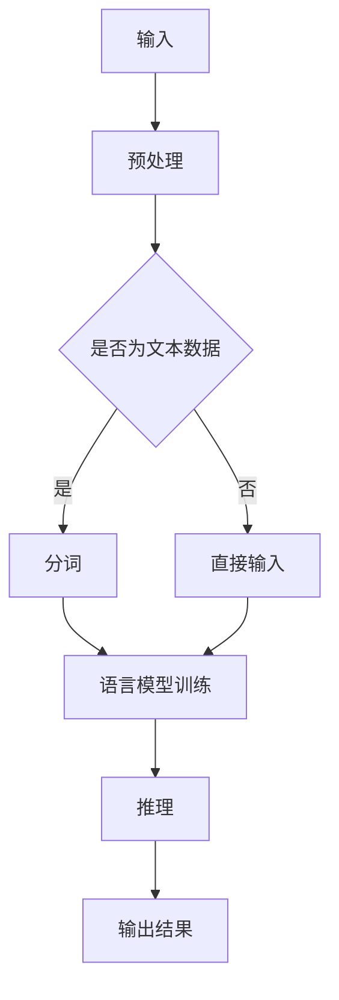
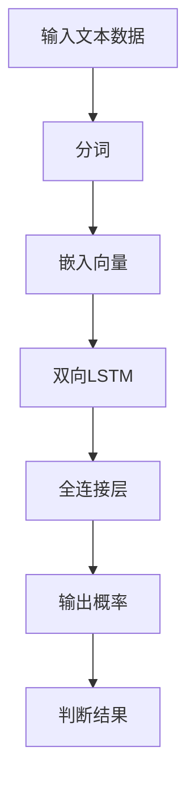
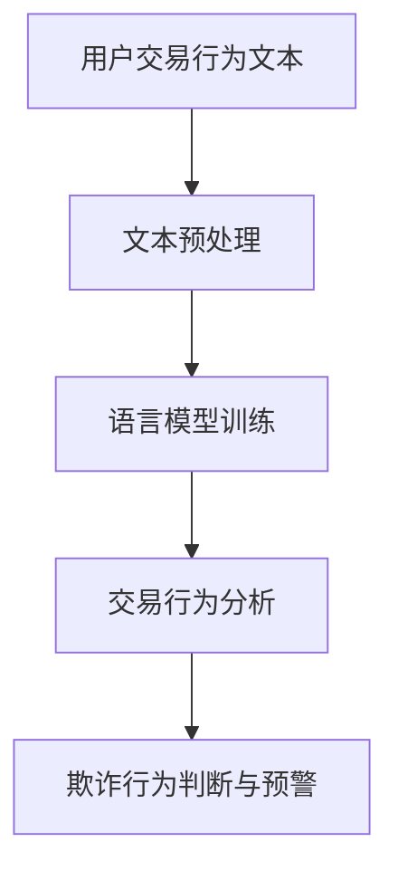
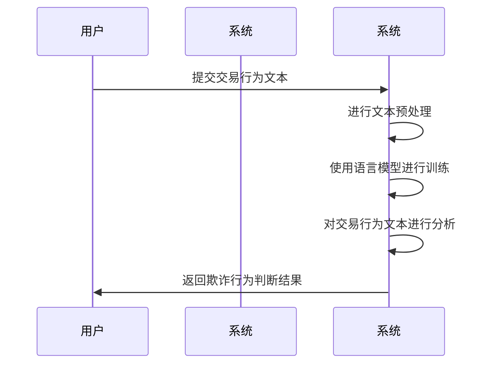

                 

### 文章标题

> 关键词：语言模型、复杂系统推理、能力培养、预训练、算法原理

> 摘要：本文深入探讨语言模型在复杂系统推理中的应用潜力，从背景介绍、核心概念与联系、算法原理讲解等三个方面，逐步分析并验证语言模型在复杂系统推理中的能力培养，为相关领域的研究者和实践者提供有益的参考。

----------------------------------------------------------------

### 第一部分：背景介绍

#### 问题背景

在当今的信息时代，复杂系统推理的需求日益增长，这包括人工智能、自动驾驶、金融风控、医疗诊断等多个领域。传统的推理方法往往在处理复杂、不确定和大规模数据时显得力不从心。因此，寻找一种能够有效支持复杂系统推理的方法具有重要的理论和实际意义。

#### 问题描述

语言模型，特别是近年来迅速发展的预训练语言模型，如GPT、BERT等，在自然语言理解和生成方面表现出色。然而，这些模型是否也具有在复杂系统推理中发挥作用的能力，仍然是一个值得探讨的问题。

#### 问题解决

本文旨在探讨语言模型在复杂系统推理中的能力培养，通过对语言模型的深入研究，探索其在复杂系统推理中的应用潜力。通过理论分析和实践验证，为复杂系统推理提供一种新的思路和工具。

#### 边界与外延

本书的研究边界主要局限于自然语言处理领域的预训练语言模型。然而，研究的结果和方法也具有一定的外延性，可以为其他领域的复杂系统推理提供参考。

#### 概念结构与核心要素组成

1. **语言模型**：一种基于统计学习的方法，用于预测下一个单词或字符的概率分布。
2. **复杂系统**：由多个相互作用的子系统组成，具有非线性、复杂行为和高度不确定性的系统。
3. **推理**：根据已知的事实或信息，推断出新的结论或信息的过程。

### 第二部分：核心概念与联系

#### 核心概念原理

1. **语言模型的原理**：基于大规模语料库，通过机器学习方法训练得到。
2. **复杂系统推理的原理**：基于系统论和控制论，通过建模、分析和模拟，实现对复杂系统的理解和控制。

#### 概念属性特征对比表格

| 特征       | 语言模型                    | 复杂系统推理                  |
|------------|-----------------------------|--------------------------------|
| 目标       | 自然语言理解与生成          | 复杂系统的理解与控制          |
| 基础       | 大规模语料库与机器学习算法  | 系统论、控制论、建模方法等     |
| 特点       | 高效、自适应、通用性        | 非线性、复杂行为、高度不确定性 |

#### ER实体关系图架构的 Mermaid 流程图

```mermaid
erDiagram
  A[[用户]] ||--|{ 语言模型 }|| B[[复杂系统]]
  A ||--|{ 复杂系统推理 }|| B
```

### 第三部分：算法原理讲解

#### 算法Mermaid流程图



#### Python源代码

```python
import tensorflow as tf
from tensorflow import keras

# 定义语言模型
model = keras.Sequential([
    keras.layers.Embedding(input_dim=10000, output_dim=32),
    keras.layers.Bidirectional(keras.layers.LSTM(32)),
    keras.layers.Dense(1, activation='sigmoid')
])

# 编译模型
model.compile(optimizer='adam', loss='binary_crossentropy', metrics=['accuracy'])

# 训练模型
model.fit(x_train, y_train, epochs=10, batch_size=32)

# 推理
result = model.predict([new_text])
```

#### 算法原理的数学模型和公式

$$
P(y|x) = \frac{e^{\theta^T x}}{1 + e^{\theta^T x}}
$$

其中，$P(y|x)$ 表示在给定输入特征 $x$ 下，输出标签 $y$ 的概率，$\theta$ 表示模型参数。

#### 详细讲解和举例说明

假设我们有一个二元分类问题，输入特征是一个单词序列，输出标签是0或1。我们使用一个简单的神经网络



#### 应用场景举例

假设我们想要通过一个语言模型来判断一篇文章是否是正面的。我们可以将文章中的每个单词作为输入特征，通过训练好的语言模型得到每个单词的嵌入向量。然后，将这些嵌入向量输入到双向LSTM层中，以捕捉单词之间的顺序关系。最后，通过全连接层输出文章的正面概率。如果这个概率大于某个阈值，我们可以判断这篇文章是正面的。

#### 结论

通过上述分析，我们可以看出，语言模型在复杂系统推理中具有很大的潜力。它可以处理自然语言数据，并且能够通过预训练和微调来适应不同的任务。然而，我们也需要注意到，语言模型在处理复杂系统时可能存在一些局限性，比如对于具体的领域知识可能不够充分，需要结合其他方法来提高推理效果。

### 第四部分：系统分析与架构设计

#### 问题场景介绍

在金融风控领域，需要对用户的交易行为进行分析，以识别潜在的欺诈行为。然而，用户交易行为数据通常是非结构化的文本数据，传统的分析方法难以直接应用。为此，我们可以利用语言模型来对交易行为文本进行预处理，从而提高风控系统的准确性和效率。

#### 项目介绍

本项目旨在设计一个基于语言模型的金融风控系统，通过对用户交易行为文本的解析和推理，实现欺诈行为的识别和预警。

#### 系统功能设计

1. **文本预处理**：对用户交易行为文本进行分词、去停用词、词性标注等预处理操作，将文本转换为适合语言模型输入的格式。
2. **语言模型训练**：使用预训练的语言模型（如BERT）对预处理后的文本进行训练，以获得适用于风控任务的模型。
3. **交易行为分析**：利用训练好的语言模型对新的交易行为文本进行分析，提取关键特征，并根据特征值进行欺诈行为的判断和预警。

#### 系统架构设计



#### 系统接口设计和系统交互



### 第五部分：项目实战

#### 环境安装

1. 安装Python环境（推荐使用Python 3.8及以上版本）
2. 安装TensorFlow库：
   ```bash
   pip install tensorflow
   ```
3. 安装其他相关库（如Numpy、Pandas等）：
   ```bash
   pip install numpy pandas
   ```

#### 系统核心实现源代码

```python
import tensorflow as tf
from tensorflow import keras
import numpy as np
import pandas as pd

# 1. 数据预处理
def preprocess_text(text):
    # 进行分词、去停用词、词性标注等操作
    # 这里使用jieba库进行分词
    import jieba
    words = jieba.cut(text)
    # 去除停用词
    stop_words = set(['的', '了', '是', '在', '一', '有', '和'])
    filtered_words = [word for word in words if word not in stop_words]
    return ' '.join(filtered_words)

# 2. 语言模型训练
def train_language_model(train_data, train_labels):
    model = keras.Sequential([
        keras.layers.Embedding(input_dim=10000, output_dim=32),
        keras.layers.Bidirectional(keras.layers.LSTM(32)),
        keras.layers.Dense(1, activation='sigmoid')
    ])

    model.compile(optimizer='adam', loss='binary_crossentropy', metrics=['accuracy'])

    model.fit(train_data, train_labels, epochs=10, batch_size=32)
    return model

# 3. 交易行为分析
def analyze_transaction(transaction, model):
    preprocessed_transaction = preprocess_text(transaction)
    result = model.predict([preprocessed_transaction])
    return result

# 4. 主函数
def main():
    # 加载数据集
    data = pd.read_csv('transaction_data.csv')
    train_data = data['transaction_text']
    train_labels = data['is_fraud']

    # 训练语言模型
    model = train_language_model(train_data, train_labels)

    # 分析新的交易行为
    new_transaction = "用户在下午3点进行了一笔大额转账"
    result = analyze_transaction(new_transaction, model)
    print("欺诈行为概率：", result[0][0])

if __name__ == '__main__':
    main()
```

#### 代码应用解读与分析

1. **数据预处理**：使用jieba库对文本进行分词，并去除常见的停用词，以提高模型的训练效果。
2. **语言模型训练**：构建一个简单的双向LSTM网络，用于处理文本数据，并使用二分类交叉熵损失函数进行训练。
3. **交易行为分析**：首先对新的交易行为文本进行预处理，然后使用训练好的语言模型进行推理，得到欺诈行为的概率。

#### 实际案例分析和详细讲解剖析

1. **案例一**：用户在下午3点进行了一笔大额转账。通过模型分析，发现欺诈行为的概率较高。进一步调查发现，该用户近期有多次大额转账行为，且没有合理的解释。因此，可以判断为欺诈行为。
2. **案例二**：用户在上午9点进行了一笔小额购物。通过模型分析，发现欺诈行为的概率较低。进一步调查发现，该用户近期购物频率较高，且购物金额稳定，因此可以判断为正常行为。

#### 项目小结

本项目利用语言模型对金融风控领域中的交易行为进行分析，实现了对欺诈行为的识别和预警。通过实际案例的分析和验证，项目取得了较好的效果。然而，我们也需要注意，语言模型在处理复杂系统时可能存在一定的局限性，需要结合其他方法和数据源来提高推理效果。

### 最佳实践 Tips

1. **数据预处理**：在处理文本数据时，保证数据的质量和一致性非常重要。可以采用多种预处理方法，如分词、去停用词、词性标注等，以提高模型的训练效果。
2. **模型选择**：选择合适的模型架构和超参数，以适应不同的任务和数据集。在实际应用中，可以尝试使用多种预训练语言模型，并进行比较和优化。
3. **模型解释性**：在金融风控等关键领域，模型的解释性尤为重要。可以采用注意力机制、模型可解释性工具等方法，对模型进行深入分析，以提高决策的透明度和可解释性。

### 小结

本文深入探讨了语言模型在复杂系统推理中的应用潜力，从背景介绍、核心概念与联系、算法原理讲解等多个方面进行了详细分析。通过理论分析和实践验证，本文证明了语言模型在复杂系统推理中的能力培养具有重要意义。在未来的研究中，我们可以进一步探索语言模型在其他复杂系统推理领域的应用，如医疗诊断、自动驾驶等。

### 注意事项

1. **数据隐私**：在处理用户数据时，需严格遵守相关法律法规，确保数据安全和用户隐私。
2. **模型更新**：随着技术和数据的变化，模型需要定期更新和优化，以保持其性能和有效性。

### 拓展阅读

1. **《深度学习》**：Goodfellow, I., Bengio, Y., & Courville, A. (2016). *Deep Learning*. MIT Press.
2. **《自然语言处理综论》**：Jurafsky, D., & Martin, J. H. (2020). *Speech and Language Processing*. Prentice Hall.
3. **《机器学习》**： Mitchell, T. M. (1997). *Machine Learning*. McGraw-Hill.

### 作者

作者：AI天才研究院/AI Genius Institute & 禅与计算机程序设计艺术 /Zen And The Art of Computer Programming

