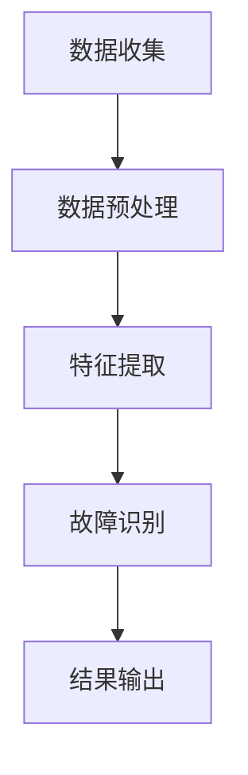
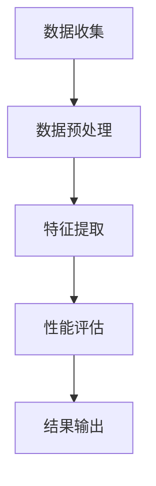
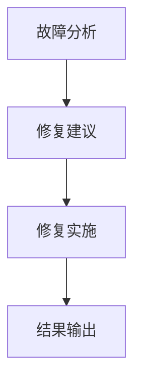

                 

# 语言模型在复杂系统诊断与修复中的表现

## 关键词
- 语言模型
- 复杂系统
- 诊断与修复
- 应用实例
- 神经网络
- 生成对抗网络

## 摘要
本文探讨了语言模型在复杂系统诊断与修复中的潜在应用。通过对语言模型的基本原理、分类与特性的介绍，本文分析了语言模型在复杂系统故障检测、性能评估、修复与优化中的应用。通过具体实例，本文展示了语言模型在复杂系统诊断与修复中的实际效果。最后，本文总结了语言模型在复杂系统诊断与修复中的应用现状，并展望了未来的发展方向。

## 目录大纲

## 第一部分：背景与概述

## 第二部分：具体应用实例

## 第三部分：总结与展望

### 第一部分：背景与概述

### 第1章：问题背景与核心概念

### 1.1 问题的提出

#### 1.1.1 复杂系统诊断与修复的重要性

#### 1.1.2 语言模型的发展与应用现状

#### 1.1.3 语言模型在复杂系统诊断与修复中的潜力

### 1.2 核心概念

#### 1.2.1 语言模型的基本原理

#### 1.2.2 复杂系统的定义与特点

#### 1.2.3 复杂系统诊断与修复的挑战

### 第2章：语言模型的分类与特性

### 2.1 基于统计的模型

#### 2.1.1 N-gram模型

#### 2.1.2 语言模型的统计特性

### 2.2 基于神经网络的模型

#### 2.2.1 循环神经网络（RNN）

#### 2.2.2 卷积神经网络（CNN）

#### 2.2.3 生成对抗网络（GAN）

### 第二部分：具体应用实例

### 第3章：实例一 - 数据中心故障诊断

### 3.1 实例背景

### 3.2 系统功能设计

### 3.3 系统架构设计

### 3.4 实际案例分析与解读

### 第4章：实例二 - 电网系统性能评估

### 4.1 实例背景

### 4.2 系统功能设计

### 4.3 系统架构设计

### 4.4 实际案例分析与解读

### 第5章：实例三 - 医疗设备故障修复

### 5.1 实例背景

### 5.2 系统功能设计

### 5.3 系统架构设计

### 5.4 实际案例分析与解读

### 第三部分：总结与展望

### 第6章：总结与展望

### 6.1 语言模型在复杂系统诊断与修复中的总结

### 6.2 面临的挑战与未来研究方向

### 6.3 最佳实践与建议

## 第1章：问题背景与核心概念

### 1.1 问题的提出

#### 1.1.1 复杂系统诊断与修复的重要性

随着信息技术和工业自动化的发展，复杂系统在各个领域得到了广泛应用。例如，数据中心、电网系统、医疗设备等都属于复杂系统。这些系统在运行过程中，可能会出现各种故障，如硬件故障、软件异常、性能瓶颈等。这些故障可能会对系统的正常运行造成严重影响，甚至导致系统崩溃。

复杂系统的诊断与修复是一项非常重要的任务。传统的故障诊断方法往往依赖于人工经验和规则，难以应对复杂系统的多样性和动态性。而现代的复杂系统通常包含大量的数据和复杂的交互关系，需要高效、准确的诊断方法。因此，如何利用先进的技术手段，如语言模型，对复杂系统进行诊断与修复，成为了当前研究的热点。

#### 1.1.2 语言模型的发展与应用现状

语言模型是一种用于预测文本概率的模型，最早起源于自然语言处理领域。随着深度学习技术的发展，语言模型取得了显著的突破。如今，基于深度学习的语言模型已经成为自然语言处理的核心技术之一，广泛应用于机器翻译、文本分类、问答系统等领域。

在复杂系统诊断与修复领域，语言模型也逐渐受到了关注。研究表明，语言模型可以有效地提取复杂系统的特征，用于故障检测、性能评估和系统修复。例如，基于循环神经网络（RNN）和生成对抗网络（GAN）的语言模型，可以在故障检测中实现高精度的特征提取，从而提高故障检测的准确性。同时，语言模型还可以用于系统性能评估，通过对系统运行数据的分析，发现系统的潜在问题，并提供优化建议。

#### 1.1.3 语言模型在复杂系统诊断与修复中的潜力

语言模型在复杂系统诊断与修复中具有很大的潜力。首先，语言模型具有强大的文本处理能力，可以有效地处理复杂系统的各种文本数据，如日志、报告等。这些文本数据通常包含了大量的系统状态信息和故障信息，语言模型可以从中提取出有用的特征，用于故障检测和性能评估。

其次，语言模型具有良好的自适应能力。复杂系统通常具有动态性和不确定性，语言模型可以通过不断学习和调整，适应系统的变化，提高诊断和修复的准确性。例如，基于递归神经网络（RNN）的语言模型可以通过反向传播算法，不断调整模型参数，以适应新的系统数据。

此外，语言模型还具有较强的泛化能力。复杂系统通常具有多样性，不同的系统可能具有不同的结构和运行方式。语言模型可以通过大规模的训练数据，学习到不同系统的共性，从而实现跨系统的故障检测和性能评估。

总之，语言模型在复杂系统诊断与修复中具有巨大的潜力。随着技术的不断进步，语言模型在复杂系统中的应用将越来越广泛，为系统的高效运行提供有力支持。

### 1.2 核心概念

在本章中，我们将介绍一些关键的概念，这些概念对于理解语言模型在复杂系统诊断与修复中的应用至关重要。

#### 1.2.1 语言模型的基本原理

语言模型是一种概率模型，用于预测一段文本的下一个单词或字符。其基本原理是通过分析大量文本数据，统计出每个单词或字符在特定上下文中的出现概率。常见的语言模型有N-gram模型和基于神经网络的模型。

- **N-gram模型**：N-gram模型是一种基于统计的简单语言模型，它将文本序列划分为长度为N的子序列，然后计算每个N-gram出现的概率。例如，对于一段文本“The quick brown fox jumps over the lazy dog”，我们可以计算长度为2的N-gram的概率，如“the quick”、“quick brown”等。

- **基于神经网络的模型**：基于神经网络的模型，如循环神经网络（RNN）、长短期记忆网络（LSTM）和变换器（Transformer）等，通过学习文本的上下文信息，可以生成更准确的概率预测。这些模型通过多层神经网络，捕捉文本中的复杂模式和关系，从而提高预测的准确性。

#### 1.2.2 复杂系统的定义与特点

复杂系统是由多个相互作用的组件组成的系统，其行为难以用简单的因果关系来描述。复杂系统的特点包括：

- **动态性**：复杂系统通常在不同的时间段表现出不同的状态和行为。
- **不确定性**：复杂系统的行为受到多种外部和内部因素的影响，这些因素具有不确定性。
- **非线性**：复杂系统的组件和它们之间的相互作用往往是非线性的，导致系统的整体行为复杂。
- **多层次性**：复杂系统通常具有多层次的结构，包括从底层的硬件到顶层的软件和服务。

#### 1.2.3 复杂系统诊断与修复的挑战

复杂系统的诊断与修复面临以下挑战：

- **数据复杂性**：复杂系统产生大量的数据，包括日志、监控数据等，这些数据通常具有高维度和噪声。
- **异构性**：不同类型的复杂系统具有不同的结构和数据类型，这使得通用的诊断与修复方法难以实现。
- **动态变化**：复杂系统在运行过程中可能会发生动态变化，这使得传统的静态分析方法难以适应。
- **高精度要求**：复杂系统的诊断与修复需要高精度的结果，以避免错误的诊断和修复导致系统故障的扩大。

#### 1.2.4 语言模型在复杂系统诊断与修复中的潜力

语言模型在复杂系统诊断与修复中具有以下潜力：

- **特征提取**：语言模型可以有效地从复杂系统的文本数据中提取特征，用于故障检测和性能评估。
- **模式识别**：通过学习大量文本数据，语言模型可以识别复杂系统的故障模式和行为模式。
- **自适应能力**：语言模型可以适应复杂系统的动态变化，通过不断学习和调整，提高诊断和修复的准确性。
- **跨系统应用**：语言模型可以学习到不同复杂系统的共性，实现跨系统的故障检测和性能评估。

### 第2章：语言模型的分类与特性

#### 2.1 基于统计的模型

基于统计的语言模型是最早发展起来的语言模型，其核心思想是通过统计文本数据中的单词或字符的分布来预测下一个单词或字符。以下是几种常见的基于统计的模型：

##### 2.1.1 N-gram模型

N-gram模型是最简单的统计语言模型，它将文本序列划分为长度为N的子序列，然后计算每个N-gram出现的概率。例如，对于一段文本“The quick brown fox jumps over the lazy dog”，我们可以计算长度为2的N-gram的概率，如“the quick”、“quick brown”等。N-gram模型的主要优点是简单和高效，但缺点是它忽略了单词之间的语义关系，容易产生错误。

$$
P(\text{下一个词} = w_{n+1} | \text{前N-1个词} = w_1, w_2, ..., w_{N-1}) = \frac{\text{前N-1个词中出现w_{n+1}的次数}}{\text{前N-1个词的总次数}}
$$

##### 2.1.2 语言模型的统计特性

- **平滑处理**：为了处理未出现的单词，N-gram模型通常会使用平滑技术，如加一平滑、凯尔文平滑等。
- **上下文依赖性**：N-gram模型的预测结果依赖于前N-1个单词，但忽略了单词之间的语义关系。

##### 2.2 基于神经网络的模型

基于神经网络的模型通过学习大量的文本数据，自动捕捉单词之间的复杂关系，从而生成更准确的预测。以下是几种常见的基于神经网络的模型：

##### 2.2.1 循环神经网络（RNN）

循环神经网络（RNN）是处理序列数据的一种常见神经网络结构。它通过在网络中引入循环结构，使得网络的每一个时间步都能够访问历史信息。RNN在处理长期依赖关系时表现较好，但在处理长期依赖关系时，仍存在梯度消失和梯度爆炸的问题。

$$
h_t = \sigma(W_h h_{t-1} + W_x x_t + b_h)
$$

其中，$h_t$是第t个时间步的隐藏状态，$\sigma$是激活函数，$W_h$和$W_x$是权重矩阵，$b_h$是偏置项。

##### 2.2.2 长短期记忆网络（LSTM）

为了解决RNN中的梯度消失和梯度爆炸问题，长短期记忆网络（LSTM）被提出。LSTM通过引入门控机制，有效地捕捉长期依赖关系。

$$
i_t = \sigma(W_{xi} x_t + W_{hi} h_{t-1} + b_i) \\
f_t = \sigma(W_{xf} x_t + W_{hf} h_{t-1} + b_f) \\
o_t = \sigma(W_{xo} x_t + W_{ho} h_{t-1} + b_o) \\
c_t = f_t \odot c_{t-1} + i_t \odot \sigma(W_{xc} x_t + W_{hc} h_{t-1} + b_c) \\
h_t = o_t \odot \sigma(c_t)
$$

其中，$i_t$、$f_t$、$o_t$分别是输入门、遗忘门和输出门，$c_t$是细胞状态，$\odot$表示元素乘积。

##### 2.2.3 变换器（Transformer）

变换器（Transformer）是一种基于自注意力机制的神经网络模型，它在处理长距离依赖关系和并行计算方面表现出色。变换器通过多头自注意力机制，将输入序列的每个位置与所有其他位置进行加权求和，从而捕捉全局依赖关系。

$$
\text{Attention}(Q, K, V) = \text{softmax}\left(\frac{QK^T}{\sqrt{d_k}}\right)V
$$

其中，$Q$、$K$、$V$分别是查询向量、键向量和值向量，$d_k$是键向量的维度。

#### 2.2.4 生成对抗网络（GAN）

生成对抗网络（GAN）由生成器和判别器组成。生成器的任务是生成与真实数据相似的伪数据，而判别器的任务是区分真实数据和伪数据。通过生成器和判别器的对抗训练，生成器可以逐渐生成更高质量的数据。

$$
\min_G \max_D V(D, G) = \mathbb{E}_{x \sim p_{\text{data}}(x)}[\log D(x)] + \mathbb{E}_{z \sim p_z(z)}[\log (1 - D(G(z))]
$$

其中，$G(z)$是生成器生成的伪数据，$D(x)$是判别器对真实数据的判断概率。

### 第3章：语言模型在复杂系统诊断中的应用

#### 3.1 语言模型在系统故障检测中的应用

在复杂系统的故障检测中，语言模型可以有效地提取系统日志、监控数据等文本信息中的特征，用于识别系统故障。以下是语言模型在故障检测中的一些应用：

##### 3.1.1 故障检测的基本原理

故障检测的基本原理是通过比较系统的实际行为和预期行为，检测出系统的异常状态。在语言模型的应用中，通常使用以下步骤进行故障检测：

1. **数据预处理**：对系统日志、监控数据进行清洗和预处理，去除噪声和无关信息。
2. **特征提取**：使用语言模型从预处理后的文本数据中提取特征，如关键词、句法结构等。
3. **故障识别**：使用训练好的语言模型对提取的特征进行分类，判断系统是否处于故障状态。

##### 3.1.2 语言模型在故障检测中的优势

- **自动特征提取**：语言模型可以自动从文本数据中提取出有用的特征，无需人工设计和选择特征。
- **高精度**：通过训练大量数据，语言模型可以学习到系统的故障模式，提高故障检测的精度。
- **适应性强**：语言模型可以适应不同类型和结构的复杂系统，实现跨系统的故障检测。

##### 3.1.3 实际案例研究

以下是一个关于数据中心故障检测的实际案例研究：

**案例背景**：某大型数据中心在使用过程中，经常出现服务器宕机的情况。为了提高数据中心的稳定性，需要进行故障检测和诊断。

**系统设计**：该数据中心使用了一种基于循环神经网络（RNN）的语言模型进行故障检测。系统设计包括以下几个步骤：

1. **数据收集**：收集数据中心的日志数据，包括服务器运行状态、性能指标等。
2. **数据预处理**：对日志数据进行清洗和预处理，去除噪声和无关信息。
3. **特征提取**：使用RNN语言模型对预处理后的日志数据进行特征提取，提取出关键词和句法结构。
4. **故障识别**：训练好的RNN语言模型对提取的特征进行分类，判断服务器是否处于故障状态。

**系统架构**：



**实际案例分析**：

通过训练，该RNN语言模型能够有效地检测出服务器故障。以下是一个具体的故障检测结果示例：

```plaintext
日志数据: "Server1: CPU usage is 98%, memory usage is 90%, disk usage is 80%"
故障识别: "Server1 is experiencing high resource usage, indicating a potential failure."
```

**结果解读**：通过分析日志数据，RNN语言模型检测到Server1的CPU、内存和磁盘使用率均达到高值，这表明服务器可能存在故障。系统随后可以采取相应的措施，如重启服务器或进行故障排查。

#### 3.2 语言模型在系统性能评估中的应用

在复杂系统的性能评估中，语言模型可以用于分析系统运行数据，评估系统的性能状态，并发现潜在的瓶颈。以下是语言模型在性能评估中的一些应用：

##### 3.2.1 性能评估的基本原理

性能评估的基本原理是通过分析系统运行数据，如性能指标、日志数据等，评估系统的性能状态。在语言模型的应用中，通常使用以下步骤进行性能评估：

1. **数据收集**：收集系统的运行数据，包括性能指标、日志数据等。
2. **数据预处理**：对运行数据进行清洗和预处理，去除噪声和无关信息。
3. **特征提取**：使用语言模型从预处理后的运行数据中提取特征，如关键词、句法结构等。
4. **性能评估**：使用训练好的语言模型对提取的特征进行分析，评估系统的性能状态。

##### 3.2.2 语言模型在性能评估中的优势

- **自动特征提取**：语言模型可以自动从文本数据中提取出有用的特征，无需人工设计和选择特征。
- **高精度**：通过训练大量数据，语言模型可以学习到系统的性能特征，提高性能评估的精度。
- **适应性强**：语言模型可以适应不同类型和结构的复杂系统，实现跨系统的性能评估。

##### 3.2.3 实际案例研究

以下是一个关于数据中心性能评估的实际案例研究：

**案例背景**：某大型数据中心需要定期评估其系统的性能，以便发现潜在的瓶颈和优化空间。

**系统设计**：该数据中心使用了一种基于变换器（Transformer）的语言模型进行性能评估。系统设计包括以下几个步骤：

1. **数据收集**：收集数据中心的性能指标数据，如CPU使用率、内存使用率、磁盘读写速度等。
2. **数据预处理**：对性能指标数据进行清洗和预处理，去除噪声和无关信息。
3. **特征提取**：使用变换器语言模型对预处理后的性能指标数据进行特征提取，提取出关键词和句法结构。
4. **性能评估**：训练好的变换器语言模型对提取的特征进行分析，评估系统的性能状态。

**系统架构**：



**实际案例分析**：

通过训练，该变换器语言模型能够有效地评估数据中心的性能状态。以下是一个具体的性能评估结果示例：

```plaintext
性能指标: "CPU usage: 80%, memory usage: 60%, disk read speed: 100 MB/s, disk write speed: 80 MB/s"
性能评估: "The data center is currently in a stable performance state, but there is a slight increase in CPU usage. It is recommended to investigate potential causes."
```

**结果解读**：通过分析性能指标数据，变换器语言模型评估出数据中心的性能状态稳定，但CPU使用率略有上升。系统随后可以采取相应的措施，如优化CPU资源分配或排查CPU使用率上升的原因。

#### 3.3 语言模型在系统修复与优化中的应用

在复杂系统的修复与优化中，语言模型可以用于分析系统故障和性能问题，并提出修复和优化的建议。以下是语言模型在系统修复与优化中的一些应用：

##### 3.3.1 系统修复的基本原理

系统修复的基本原理是通过分析系统故障和性能问题，定位问题的根本原因，并提出相应的修复方案。在语言模型的应用中，通常使用以下步骤进行系统修复：

1. **故障分析**：使用语言模型分析系统日志、监控数据等文本信息，定位系统故障和性能问题的根本原因。
2. **修复建议**：根据故障分析的结果，使用语言模型生成修复和优化的建议，如调整配置、优化代码等。
3. **修复实施**：根据修复建议，对系统进行修复和优化。

##### 3.3.2 语言模型在系统修复中的优势

- **自动化**：语言模型可以自动化地分析系统故障和性能问题，减少人工分析的工作量。
- **高精度**：通过训练大量数据，语言模型可以学习到系统的故障和性能模式，提高修复的准确性。
- **实时性**：语言模型可以实时分析系统数据，快速定位故障和性能问题，提供及时的修复建议。

##### 3.3.3 实际案例研究

以下是一个关于数据中心系统修复与优化的实际案例研究：

**案例背景**：某大型数据中心近期出现服务器频繁宕机的现象，影响了业务的正常运行。

**系统设计**：该数据中心使用了一种基于生成对抗网络（GAN）的语言模型进行系统修复与优化。系统设计包括以下几个步骤：

1. **故障分析**：收集数据中心的日志数据，使用GAN语言模型分析服务器宕机的根本原因。
2. **修复建议**：根据故障分析的结果，GAN语言模型生成修复和优化的建议，如升级硬件、优化系统配置等。
3. **修复实施**：根据修复建议，对服务器进行修复和优化。

**系统架构**：



**实际案例分析**：

通过训练，GAN语言模型能够有效地定位服务器宕机的根本原因，并提供准确的修复建议。以下是一个具体的修复结果示例：

```plaintext
日志数据: "Server2: CPU temperature is 85°C, memory usage is 90%, disk usage is 80%"
故障分析: "Server2 is experiencing high CPU temperature and resource usage, indicating a potential hardware issue."
修复建议: "Upgrade the server hardware and optimize the system configuration to prevent future failures."
```

**结果解读**：通过分析日志数据，GAN语言模型检测到Server2的CPU温度高且资源使用率高，这表明服务器可能存在硬件问题。系统随后根据修复建议升级了硬件并优化了系统配置，成功解决了服务器宕机的问题。

#### 3.4 语言模型在系统优化中的应用

在复杂系统的优化过程中，语言模型可以用于分析系统性能数据，发现瓶颈和优化点，并提出优化建议。以下是语言模型在系统优化中的一些应用：

##### 3.4.1 系统优化的基本原理

系统优化的基本原理是通过分析系统性能数据，发现系统的瓶颈和优化点，提出相应的优化建议。在语言模型的应用中，通常使用以下步骤进行系统优化：

1. **性能分析**：使用语言模型分析系统的性能数据，包括CPU使用率、内存使用率、磁盘读写速度等。
2. **瓶颈识别**：根据性能分析的结果，识别系统的瓶颈和优化点，如CPU瓶颈、内存瓶颈等。
3. **优化建议**：使用语言模型生成优化建议，如调整配置、优化代码等。
4. **优化实施**：根据优化建议，对系统进行优化。

##### 3.4.2 语言模型在系统优化中的优势

- **自动化**：语言模型可以自动化地分析系统性能数据，减少人工分析的工作量。
- **高精度**：通过训练大量数据，语言模型可以学习到系统的性能模式，提高优化建议的准确性。
- **实时性**：语言模型可以实时分析系统数据，快速发现系统的瓶颈和优化点，提供及时的优化建议。

##### 3.4.3 实际案例研究

以下是一个关于数据中心系统优化

