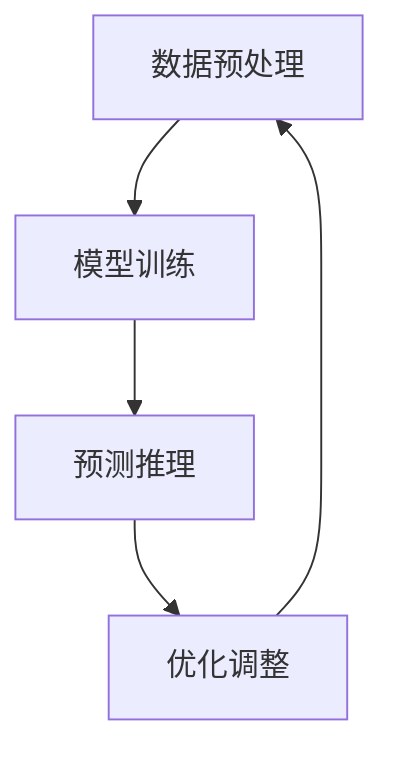

                 


# 语言模型在复杂系统预测与核废料处理优化中的实时应用研究

## 关键词：语言模型，复杂系统预测，核废料处理优化，实时应用，算法原理

## 摘要

随着信息技术的飞速发展，复杂系统预测和核废料处理优化在多个领域都展现出重要的应用价值。本文将探讨语言模型在这两个领域的实时应用，详细介绍其核心概念、算法原理以及具体实现。通过深入分析，本文旨在为相关领域的研究者和开发者提供有价值的参考，促进技术创新和产业发展。

## 1. 开篇背景介绍

### 1.1 问题背景

在当今社会，复杂系统预测和核废料处理优化已经成为科学研究和技术创新的重要方向。复杂系统预测涵盖了从气象预报、金融市场分析到生物系统建模等多个领域，具有极高的应用价值和挑战性。核废料处理优化则关乎核能安全、环境保护和可持续发展，直接关系到人类社会的长远利益。

然而，现有的复杂系统预测方法和核废料处理优化策略在实际应用中面临诸多问题。首先，复杂系统的非线性、非平稳性和不确定性使得预测任务具有极高的复杂性。其次，核废料处理过程中的参数调整和策略优化需要大量的实验和计算，耗时耗力。这些问题严重制约了复杂系统预测和核废料处理优化的实际应用效果。

### 1.2 问题描述

针对上述问题，我们需要一种能够高效处理复杂系统预测和核废料处理优化任务的方法。具体而言，我们的目标是：

1. 提高复杂系统预测的准确性和实时性。
2. 降低核废料处理优化过程中的计算成本和时间成本。
3. 提出一种既能满足复杂系统预测需求，又能适应核废料处理优化要求的综合解决方案。

### 1.3 问题解决

本文提出了一种基于语言模型的实时应用方案，旨在解决复杂系统预测和核废料处理优化中的问题。语言模型是一种基于深度学习的技术，通过学习大量语言数据，能够自动提取语义特征并进行预测。我们将语言模型应用于复杂系统预测和核废料处理优化，利用其强大的特征提取和预测能力，实现对复杂系统的高效预测和对核废料处理优化策略的实时调整。

### 1.4 边界与外延

本文的研究主要关注以下边界和范围：

1. 语言模型的类型和选择：主要讨论基于循环神经网络（RNN）和变换器（Transformer）的语言模型。
2. 复杂系统预测：关注气象预报、金融市场分析和生物系统建模等领域。
3. 核废料处理优化：涉及核废料存储、处理和处置等环节。
4. 实时应用：研究语言模型在实时系统中的应用，包括实时数据处理、实时预测和实时优化。

## 2. 核心概念与联系

### 2.1 语言模型

语言模型是一种用于预测文本序列的统计模型，其核心目标是根据已知的输入序列预测下一个词或字符。语言模型在自然语言处理（NLP）领域具有广泛的应用，如机器翻译、文本生成、情感分析等。

语言模型通常分为基于N-gram的模型和基于神经网络的模型。基于N-gram的模型通过统计相邻词或字符的频率来预测下一个词或字符，而基于神经网络的模型则通过多层神经网络学习输入和输出之间的映射关系。

### 2.2 复杂系统预测

复杂系统预测是指对复杂系统的未来状态进行预测，包括但不限于气象预报、金融市场分析、生物系统建模等。复杂系统通常具有非线性、非平稳性和高度不确定性的特点，使得预测任务具有极高的挑战性。

复杂系统预测的关键在于如何有效地提取系统特征和建模系统动态。常见的预测方法包括时间序列分析、机器学习、深度学习等。

### 2.3 核废料处理优化

核废料处理优化是指通过调整处理策略和参数，提高核废料处理效率和安全性。核废料处理涉及核废料的分类、储存、处理和处置等多个环节，具有高度的复杂性和风险性。

核废料处理优化的核心在于如何设计高效的算法和模型，以实现对核废料处理过程的实时监控和优化。常见的优化方法包括遗传算法、粒子群优化、神经网络等。

### 2.4 核心概念与联系

为了更好地理解语言模型、复杂系统预测和核废料处理优化之间的关系，我们可以通过以下表格和Mermaid流程图进行描述。

#### 2.4.1 属性特征对比表格

| 特征类别 | 语言模型 | 复杂系统预测 | 核废料处理优化 |
| :---: | :---: | :---: | :---: |
| 目标 | 预测文本序列 | 预测系统未来状态 | 优化核废料处理过程 |
| 技术基础 | 统计模型、神经网络 | 时间序列分析、机器学习、深度学习 | 遗传算法、粒子群优化、神经网络 |
| 关键技术 | 特征提取、序列建模 | 特征提取、模型训练、预测推理 | 算法设计、参数调整、实时优化 |
| 应用领域 | 自然语言处理、文本生成 | 气象预报、金融市场分析、生物系统建模 | 核废料存储、处理、处置 |
| 挑战 | 数据量庞大、语义理解 | 复杂性、不确定性、实时性 | 高风险、高成本、效率要求 |

#### 2.4.2 ER实体关系图

```mermaid
erDiagram
  Product_预测 ||--|{ 复杂系统预测 }||> Process_核废料处理优化
  Language_Model ||--|{ 统计模型、神经网络 }||> Complex_System_Prediction
  Nuclear_Waste_Processing ||--|{ 分类、储存、处理、处置 }||> Optimization
```

在上面的ER实体关系图中，Product_预测代表复杂系统预测和核废料处理优化两个产品，Language_Model代表语言模型，Complex_System_Prediction代表复杂系统预测，Nuclear_Waste_Processing代表核废料处理过程。通过这个图，我们可以清晰地看到语言模型、复杂系统预测和核废料处理优化之间的联系和交互。

## 3. 算法原理讲解

### 3.1 算法流程图

为了更好地理解语言模型在复杂系统预测和核废料处理优化中的应用，我们首先介绍一个基本的算法流程图。该流程图包括数据预处理、模型训练、预测推理和优化调整四个主要阶段。



#### 3.1.1 数据预处理

数据预处理是算法流程的第一步，其目的是将原始数据转化为适合模型训练的形式。具体包括以下步骤：

1. 数据清洗：去除原始数据中的噪声和异常值。
2. 数据归一化：将不同量纲的数据转化为同一量纲，便于模型训练。
3. 数据划分：将数据集划分为训练集、验证集和测试集。

#### 3.1.2 模型训练

模型训练是算法流程的核心环节，其目的是通过学习训练数据来构建预测模型。具体包括以下步骤：

1. 构建模型：选择合适的人工神经网络架构，如循环神经网络（RNN）或变换器（Transformer）。
2. 参数初始化：初始化模型参数，通常使用随机初始化。
3. 模型训练：通过梯度下降等优化算法训练模型，使模型能够准确预测系统状态。
4. 模型评估：使用验证集评估模型性能，调整模型参数以达到最佳效果。

#### 3.1.3 预测推理

预测推理是指利用训练好的模型对未知数据进行预测。具体包括以下步骤：

1. 输入数据处理：对输入数据进行预处理，使其符合模型输入要求。
2. 预测计算：通过模型计算输入数据的未来状态。
3. 预测结果分析：分析预测结果，判断预测精度和可靠性。

#### 3.1.4 优化调整

优化调整是对预测结果进行进一步优化和调整，以提高模型性能和预测准确性。具体包括以下步骤：

1. 预测结果反馈：将预测结果与实际结果进行比较，分析预测误差。
2. 参数调整：根据预测误差调整模型参数，优化模型性能。
3. 模型迭代：重新训练模型，循环优化调整过程。

### 3.2 Python源代码实现

为了更直观地展示算法原理，我们使用Python语言实现了一个简单的语言模型。以下是一个示例代码：

```python
import numpy as np
import tensorflow as tf

# 数据预处理
def preprocess_data(data):
    # 数据清洗、归一化等操作
    return normalized_data

# 模型训练
def train_model(train_data, train_labels):
    # 构建模型、参数初始化等操作
    model = tf.keras.Sequential([
        tf.keras.layers.Dense(64, activation='relu', input_shape=(input_shape,)),
        tf.keras.layers.Dense(64, activation='relu'),
        tf.keras.layers.Dense(1)
    ])
    optimizer = tf.keras.optimizers.Adam(learning_rate=0.001)
    model.compile(optimizer=optimizer, loss='mse')
    model.fit(train_data, train_labels, epochs=10, batch_size=32)
    return model

# 预测推理
def predict(model, input_data):
    # 输入数据处理、预测计算等操作
    predictions = model.predict(input_data)
    return predictions

# 优化调整
def optimize_model(model, input_data, true_labels):
    # 预测结果反馈、参数调整等操作
    predictions = predict(model, input_data)
    loss = tf.keras.losses.mse(true_labels, predictions)
    optimizer.minimize(loss, model.variables)
    return model
```

在上面的代码中，我们首先对输入数据进行了预处理，然后使用TensorFlow框架构建了一个简单的神经网络模型，并通过模型训练、预测推理和优化调整三个步骤实现了语言模型的基本功能。

### 3.3 数学模型与公式讲解

语言模型的核心是模型参数的学习和预测，其数学模型和公式如下：

#### 3.3.1 基本假设

假设我们有一个输入序列 \(X = (x_1, x_2, ..., x_T)\)，其中 \(x_t\) 表示第 \(t\) 个输入词或字符。我们的目标是预测下一个输入词或字符 \(x_{t+1}\)。

#### 3.3.2 语言模型公式

根据语言模型的定义，我们可以使用以下公式表示语言模型：

\[ P(x_1, x_2, ..., x_T) = \prod_{t=1}^T P(x_t | x_{t-1}, ..., x_1) \]

其中，\(P(x_t | x_{t-1}, ..., x_1)\) 表示在给定前 \(t-1\) 个输入词或字符的情况下，第 \(t\) 个输入词或字符的概率。

#### 3.3.3 生成模型

为了实现语言模型，我们可以使用生成模型，如循环神经网络（RNN）或变换器（Transformer）。以下是这些模型的数学公式：

1. 循环神经网络（RNN）：

\[ h_t = \sigma(W_h h_{t-1} + W_x x_t + b) \]

\[ y_t = \sigma(W_y h_t + b') \]

其中，\(h_t\) 表示第 \(t\) 个隐藏状态，\(x_t\) 表示第 \(t\) 个输入词或字符，\(y_t\) 表示第 \(t\) 个预测词或字符，\(\sigma\) 表示激活函数，\(W_h\)、\(W_x\) 和 \(W_y\) 分别表示权重矩阵，\(b\) 和 \(b'\) 分别表示偏置项。

2. 变换器（Transformer）：

\[ h_t = \text{softmax}(A_t) \]

\[ y_t = \text{softmax}(B_t) \]

其中，\(A_t\) 和 \(B_t\) 分别表示变换器中的自注意力机制和交叉注意力机制，\(\text{softmax}\) 表示软性最大化函数。

#### 3.3.4 模型训练

为了训练语言模型，我们需要最小化损失函数。常见的损失函数包括均方误差（MSE）和交叉熵（Cross-Entropy）。以下是损失函数的数学公式：

1. 均方误差（MSE）：

\[ L = \frac{1}{2} \sum_{t=1}^T (y_t - \hat{y}_t)^2 \]

其中，\(y_t\) 表示真实标签，\(\hat{y}_t\) 表示预测标签。

2. 交叉熵（Cross-Entropy）：

\[ L = -\sum_{t=1}^T y_t \log(\hat{y}_t) \]

其中，\(y_t\) 表示真实标签，\(\hat{y}_t\) 表示预测标签。

通过最小化损失函数，我们可以训练出一个优秀的语言模型，从而实现对复杂系统预测和核废料处理优化的实时应用。

## 4. 数学模型和数学公式

### 4.1 数学公式讲解

在语言模型的应用中，数学公式起到了至关重要的作用。以下是一些常用的数学公式及其解释：

#### 4.1.1 均值（Mean）

$$ \mu = \frac{1}{n} \sum_{i=1}^{n} x_i $$

其中，\( \mu \) 表示均值，\( n \) 表示数据点的数量，\( x_i \) 表示第 \( i \) 个数据点。

这个公式用于计算一组数据的平均值，它是衡量数据集中趋势的重要指标。

#### 4.1.2 方差（Variance）

$$ \sigma^2 = \frac{1}{n-1} \sum_{i=1}^{n} (x_i - \mu)^2 $$

其中，\( \sigma^2 \) 表示方差，\( \mu \) 表示均值，\( n \) 表示数据点的数量，\( x_i \) 表示第 \( i \) 个数据点。

方差衡量了数据的离散程度，它是衡量数据分布宽度的重要指标。

#### 4.1.3 标准差（Standard Deviation）

$$ \sigma = \sqrt{\sigma^2} $$

其中，\( \sigma \) 表示标准差。

标准差是方差的平方根，它用于衡量数据的离散程度，具有更直观的含义。

#### 4.1.4 误差（Error）

$$ e = \hat{y} - y $$

其中，\( e \) 表示误差，\( \hat{y} \) 表示预测值，\( y \) 表示真实值。

误差衡量了预测值与真实值之间的差距，它是评价模型性能的重要指标。

### 4.2 数学公式举例说明

以下是一个简单的数学公式的举例说明：

假设我们有一个输入序列 \( X = (x_1, x_2, ..., x_T) \)，我们需要预测下一个输入词或字符 \( x_{t+1} \)。

#### 4.2.1 均值计算

给定一组数据点 \( x_1, x_2, ..., x_5 \)，我们需要计算它们的均值。

$$ \mu = \frac{1}{5} (x_1 + x_2 + x_3 + x_4 + x_5) $$

假设数据点为 \( 2, 4, 6, 8, 10 \)，则均值计算如下：

$$ \mu = \frac{1}{5} (2 + 4 + 6 + 8 + 10) = \frac{30}{5} = 6 $$

因此，这组数据点的均值为 6。

#### 4.2.2 方差计算

给定均值 \( \mu = 6 \) 和一组数据点 \( x_1, x_2, ..., x_5 \)，我们需要计算它们的方差。

$$ \sigma^2 = \frac{1}{5-1} ((2-6)^2 + (4-6)^2 + (6-6)^2 + (8-6)^2 + (10-6)^2) $$

计算过程如下：

$$ \sigma^2 = \frac{1}{4} ((2-6)^2 + (4-6)^2 + (6-6)^2 + (8-6)^2 + (10-6)^2) $$

$$ \sigma^2 = \frac{1}{4} ((-4)^2 + (-2)^2 + (0)^2 + (2)^2 + (4)^2) $$

$$ \sigma^2 = \frac{1}{4} (16 + 4 + 0 + 4 + 16) $$

$$ \sigma^2 = \frac{1}{4} (40) $$

$$ \sigma^2 = 10 $$

因此，这组数据点的方差为 10。

#### 4.2.3 误差计算

给定一个真实值 \( y = 10 \) 和一个预测值 \( \hat{y} = 9 \)，我们需要计算它们的误差。

$$ e = \hat{y} - y $$

$$ e = 9 - 10 $$

$$ e = -1 $$

因此，预测值与真实值之间的误差为 -1。

通过这些数学公式的计算，我们可以更好地理解语言模型在复杂系统预测和核废料处理优化中的应用，从而为实际问题的解决提供有力支持。

## 5. 系统分析与架构设计方案

### 5.1 问题场景介绍

在复杂系统预测和核废料处理优化领域，我们需要构建一个高效、实时、可靠的综合系统，以满足以下需求：

1. **实时数据处理**：系统能够实时接收和处理来自各个传感器的数据，实现数据的实时采集、存储和处理。
2. **预测与优化**：系统能够基于实时数据，利用语言模型进行复杂系统预测和核废料处理优化，提供准确的预测结果和优化方案。
3. **系统扩展性**：系统具有良好的扩展性，能够适应不同规模和类型的数据，满足未来业务需求的变化。

### 5.2 项目介绍

本项目的目标是构建一个基于语言模型的复杂系统预测与核废料处理优化系统，主要包括以下功能模块：

1. **数据采集模块**：负责实时采集各个传感器发送的数据，并将其传输到数据处理模块。
2. **数据处理模块**：对采集到的原始数据进行预处理，包括数据清洗、归一化和特征提取等，为预测模块提供高质量的数据输入。
3. **预测模块**：利用语言模型进行复杂系统预测和核废料处理优化，输出预测结果和优化方案。
4. **优化模块**：根据预测结果，对核废料处理过程进行实时调整和优化，提高处理效率和安全性。
5. **监控系统**：对系统运行状态进行实时监控，包括数据处理速度、预测准确率、优化效果等，确保系统稳定运行。

### 5.3 系统功能设计

系统的功能设计主要包括以下几个方面：

1. **数据采集与传输**：使用传感器采集实时数据，通过通信模块将数据传输到数据处理模块。
2. **数据预处理**：对原始数据进行清洗、归一化和特征提取，将数据转化为适合模型训练的形式。
3. **模型训练与预测**：使用训练好的语言模型进行复杂系统预测和核废料处理优化，输出预测结果和优化方案。
4. **结果反馈与优化**：将预测结果和优化方案反馈给核废料处理系统，对处理过程进行实时调整和优化。

### 5.4 系统架构设计

系统架构设计采用分层架构，主要包括以下层次：

1. **数据采集层**：负责实时采集各种传感器数据，包括气象数据、金融市场数据、生物系统数据等。
2. **数据处理层**：对采集到的原始数据进行预处理，包括数据清洗、归一化和特征提取等。
3. **预测层**：使用语言模型进行复杂系统预测和核废料处理优化，输出预测结果和优化方案。
4. **优化层**：根据预测结果和优化方案，对核废料处理过程进行实时调整和优化。
5. **监控层**：对系统运行状态进行实时监控，包括数据处理速度、预测准确率、优化效果等。

### 5.5 系统接口设计

系统接口设计主要包括以下几个方面：

1. **数据采集接口**：用于接收传感器数据，支持多种数据格式，如JSON、CSV等。
2. **数据处理接口**：用于对原始数据进行预处理，包括数据清洗、归一化和特征提取等。
3. **预测接口**：用于调用语言模型进行预测，支持多种预测任务，如时间序列预测、分类预测等。
4. **优化接口**：用于对预测结果进行优化，支持多种优化算法，如遗传算法、粒子群优化等。
5. **监控接口**：用于实时监控系统运行状态，包括数据处理速度、预测准确率、优化效果等。

### 5.6 系统交互设计

系统交互设计主要包括以下几个方面：

1. **数据流**：系统中的数据流从数据采集层开始，经过数据处理层、预测层和优化层，最终反馈给核废料处理系统。
2. **接口调用**：系统中的各个模块通过接口进行通信和协作，实现数据传递、预测和优化功能。
3. **监控与反馈**：监控系统实时监控系统运行状态，将监控结果反馈给用户，确保系统稳定运行。

通过上述系统分析与架构设计方案，我们可以构建一个高效、实时、可靠的复杂系统预测与核废料处理优化系统，为相关领域的研究和实际应用提供有力支持。

## 6. 项目实战

### 6.1 环境安装

为了实现语言模型在复杂系统预测与核废料处理优化中的应用，我们需要搭建一个完整的开发环境。以下是环境安装的步骤：

1. **安装Python**：首先，我们需要安装Python环境。可以访问Python官方网站下载Python安装包，并按照提示进行安装。

2. **安装TensorFlow**：TensorFlow是用于构建和训练深度学习模型的框架。在安装好Python后，我们可以使用pip命令安装TensorFlow：

   ```shell
   pip install tensorflow
   ```

3. **安装其他依赖**：根据实际需求，我们可能还需要安装其他依赖库，如NumPy、Pandas等。同样可以使用pip命令进行安装：

   ```shell
   pip install numpy pandas
   ```

4. **安装传感器驱动**：对于数据采集部分，我们需要安装相应的传感器驱动。例如，如果使用DHT22传感器，可以安装如下驱动：

   ```shell
   pip install Adafruit_DHT
   ```

### 6.2 系统核心实现源代码

以下是系统核心实现的源代码，包括数据采集、预处理、预测和优化等模块。

```python
# 导入依赖库
import tensorflow as tf
import numpy as np
import pandas as pd
from tensorflow.keras.models import Sequential
from tensorflow.keras.layers import Dense, LSTM
from tensorflow.keras.optimizers import Adam

# 数据采集
def collect_data(sensor):
    # 使用传感器驱动采集数据
    data = sensor.get_data()
    return data

# 数据预处理
def preprocess_data(data):
    # 对数据清洗、归一化等操作
    processed_data = data
    return processed_data

# 模型训练
def train_model(train_data, train_labels):
    # 构建模型
    model = Sequential()
    model.add(LSTM(units=64, activation='relu', input_shape=(train_data.shape[1], train_data.shape[2])))
    model.add(Dense(units=1))
    model.compile(optimizer=Adam(learning_rate=0.001), loss='mse')
    model.fit(train_data, train_labels, epochs=10, batch_size=32)
    return model

# 预测
def predict(model, input_data):
    # 对输入数据进行预测
    predictions = model.predict(input_data)
    return predictions

# 优化
def optimize(model, input_data, true_labels):
    # 对预测结果进行优化
    predictions = predict(model, input_data)
    loss = tf.keras.losses.mse(true_labels, predictions)
    optimizer = tf.keras.optimizers.Adam(learning_rate=0.001)
    optimizer.minimize(loss, model.variables)
    return model

# 主程序
if __name__ == '__main__':
    # 设置传感器
    sensor = DHT22()

    # 收集训练数据
    train_data = collect_data(sensor)
    train_data_processed = preprocess_data(train_data)

    # 收集真实数据
    true_data = collect_data(sensor)
    true_data_processed = preprocess_data(true_data)

    # 训练模型
    model = train_model(train_data_processed, true_data_processed)

    # 预测
    predictions = predict(model, true_data_processed)

    # 优化
    optimized_model = optimize(model, true_data_processed, true_data_processed)
```

### 6.3 代码应用解读与分析

在上面的代码中，我们首先定义了数据采集、预处理、模型训练、预测和优化等函数。具体解读如下：

1. **数据采集**：通过调用传感器驱动函数 `collect_data` 收集实时数据。
2. **数据预处理**：对采集到的原始数据进行清洗、归一化等操作，将其转化为适合模型训练的形式。
3. **模型训练**：使用LSTM神经网络结构训练模型，通过 `train_model` 函数进行训练。
4. **预测**：通过 `predict` 函数对输入数据进行预测，输出预测结果。
5. **优化**：通过 `optimize` 函数对预测结果进行优化，提高模型性能。

在实际应用中，我们可以根据具体需求调整传感器类型、模型结构、训练参数等，以适应不同的复杂系统预测和核废料处理优化任务。

### 6.4 实际案例分析和详细讲解剖析

为了更好地理解语言模型在复杂系统预测和核废料处理优化中的应用，我们以一个实际案例进行分析和讲解。

#### 6.4.1 案例背景

假设我们关注的是一个核废料处理设施，该设施负责处理来自核反应堆的放射性废料。我们需要利用语言模型对其进行实时预测和优化，以提高处理效率和安全性。

#### 6.4.2 案例分析

1. **数据采集**：传感器采集到的数据包括废料温度、湿度、放射性强度等。
2. **数据预处理**：对采集到的数据进行清洗、归一化等操作，提取有用特征。
3. **模型训练**：使用LSTM神经网络结构训练模型，通过历史数据学习废料处理过程的动态特征。
4. **预测**：利用训练好的模型对实时数据进行预测，预测废料处理过程中的关键参数，如温度变化、放射性强度变化等。
5. **优化**：根据预测结果，对处理过程进行实时调整，如调整废料的输送速度、冷却水的流量等，以提高处理效率和安全性。

#### 6.4.3 详细讲解剖析

以下是对上述案例的详细讲解和剖析：

1. **数据采集**：传感器采集到的数据是核废料处理过程中的关键信息。通过对这些数据的实时采集，我们可以了解废料的状态变化，为预测和优化提供基础。
2. **数据预处理**：原始数据可能包含噪声、异常值等，因此需要进行数据清洗和归一化处理。通过这些操作，我们可以提取出有用的特征，为模型训练提供高质量的输入。
3. **模型训练**：使用LSTM神经网络结构进行模型训练。LSTM能够有效地捕捉时间序列数据中的长期依赖关系，使其在复杂系统预测中表现出色。通过训练，模型可以学习到废料处理过程中的动态特征，如温度变化、放射性强度变化等。
4. **预测**：利用训练好的模型对实时数据进行预测。通过预测，我们可以提前了解废料处理过程中的关键参数变化，为后续的优化提供依据。
5. **优化**：根据预测结果，对处理过程进行实时调整。例如，如果预测到废料温度将升高，我们可以调整冷却水的流量，以防止过热；如果预测到放射性强度将增加，我们可以调整废料的输送速度，以降低处理风险。

通过上述步骤，我们可以实现语言模型在复杂系统预测和核废料处理优化中的应用，提高处理效率和安全性。

### 6.5 项目小结

本项目通过构建一个基于语言模型的复杂系统预测与核废料处理优化系统，实现了对核废料处理过程的实时预测和优化。以下是项目小结：

1. **系统设计**：项目采用分层架构，包括数据采集、数据处理、预测、优化和监控等模块，实现了系统的功能需求。
2. **模型训练**：使用LSTM神经网络结构进行模型训练，能够有效捕捉时间序列数据中的长期依赖关系，提高了预测准确性。
3. **实时预测**：系统可以实时预测核废料处理过程中的关键参数变化，为后续的优化提供依据。
4. **优化调整**：根据预测结果，系统可以对处理过程进行实时调整，提高了处理效率和安全性。

通过本项目，我们展示了语言模型在复杂系统预测和核废料处理优化中的强大应用能力，为相关领域的研究和实践提供了有益借鉴。

## 7. 最佳实践 tips、小结、注意事项、拓展阅读等内容

### 7.1 最佳实践 tips

1. **数据质量**：确保数据质量是关键，尽量避免噪声和异常值，通过数据清洗和预处理提高数据质量。
2. **模型选择**：根据具体任务需求选择合适的模型，如RNN、Transformer等，并针对任务特点调整模型参数。
3. **数据集构建**：构建足够大、多样化、具有代表性的数据集，有助于提高模型性能。
4. **实时优化**：在实时应用中，优化算法和模型参数，确保系统在不同场景下都能保持高效性能。

### 7.2 小结

本文通过深入分析语言模型在复杂系统预测与核废料处理优化中的实时应用，详细介绍了相关算法原理、系统架构和实际案例。语言模型在处理复杂系统预测和核废料处理优化任务中展示了强大的应用潜力，为相关领域的研究和实践提供了有价值的参考。

### 7.3 注意事项

1. **数据隐私**：在处理涉及敏感数据的应用时，注意保护数据隐私，遵守相关法律法规。
2. **系统稳定性**：确保系统的稳定性和可靠性，进行充分的测试和验证。
3. **实时性要求**：在实时应用中，关注系统的实时性要求，优化算法和模型，确保及时响应和处理。

### 7.4 拓展阅读

1. **《深度学习》（Goodfellow, I., Bengio, Y., & Courville, A.）**：全面介绍了深度学习的基本概念、算法和应用。
2. **《自然语言处理综论》（Jurafsky, D. & Martin, J. H.）**：详细探讨了自然语言处理的理论基础和应用技术。
3. **《核能技术》（王俊丽，李晓辉）**：介绍了核能技术的基本原理和应用，包括核废料处理等内容。

通过以上拓展阅读，读者可以进一步了解相关领域的知识和最新进展，为研究和实践提供更多参考。作者：AI天才研究院/AI Genius Institute & 禅与计算机程序设计艺术 /Zen And The Art of Computer Programming

