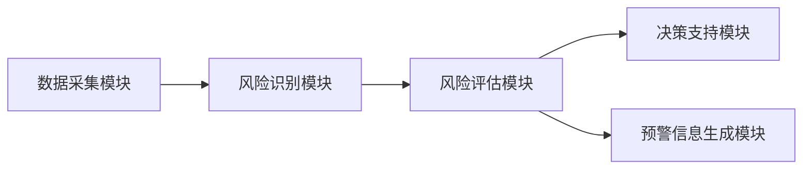
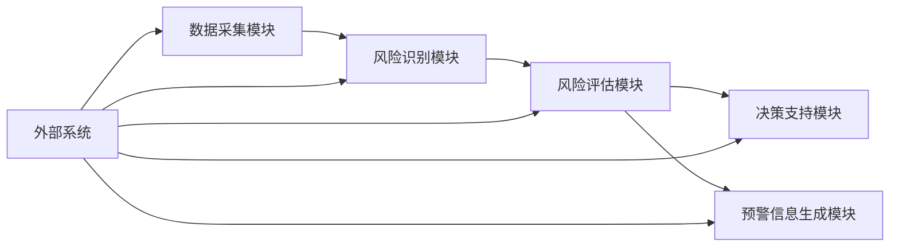
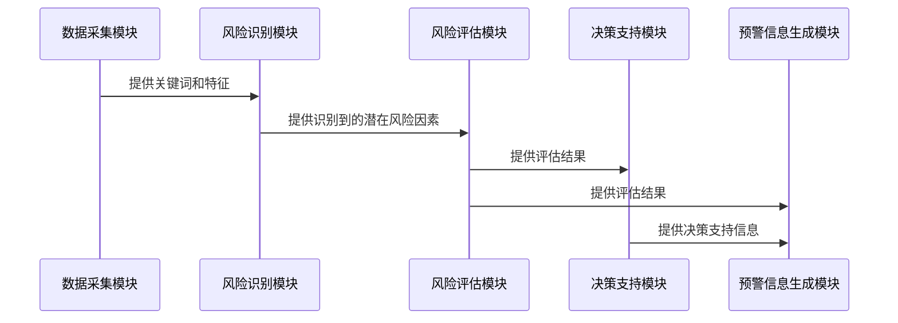

                 

# 语言模型在复杂系统风险评估与危机预警中的应用研究

关键词：复杂系统、风险评估、危机预警、语言模型、机器学习算法

摘要：随着社会经济的快速发展，复杂系统在各个领域的应用日益广泛，但其风险性和危机性也日益凸显。如何对复杂系统进行有效风险评估和危机预警，成为当前研究的热点和难点。近年来，基于语言模型的机器学习算法在复杂系统风险评估与危机预警中展现出巨大潜力。本文首先介绍了复杂系统风险评估与危机预警的背景和重要性，然后详细阐述了语言模型的基本原理及其在风险评估中的应用，接着分析了常见语言模型算法在风险评估与危机预警中的具体应用，并提出了一个基于语言模型的风险评估与危机预警系统的架构设计。最后，通过实际案例讲解了系统的实现过程，总结了最佳实践和注意事项，并对未来的发展趋势进行了展望。

### 第一部分：问题背景与核心概念

## 第1章：问题背景

### 1.1.1 复杂系统风险评估与危机预警的重要性

复杂系统是由多个相互关联、相互作用的子系统组成的，其运行状态受到外部环境、内部因素以及系统自身特性等多种因素的影响。随着现代科技的发展，复杂系统在各个领域得到广泛应用，如金融系统、交通系统、能源系统等。然而，复杂系统往往伴随着高风险和潜在危机，一旦发生故障或危机，将造成巨大的经济损失和社会影响。

复杂系统风险评估与危机预警的重要性体现在以下几个方面：

1. 预防和减少损失：通过对复杂系统进行风险评估，可以提前发现潜在的风险因素，采取预防措施，降低风险发生的概率和影响范围。

2. 提高系统稳定性：通过危机预警，可以及时发现系统异常情况，采取及时有效的应对措施，防止危机发生或扩大。

3. 支持决策制定：复杂系统的风险评估与危机预警为决策者提供了科学依据，有助于制定合理的应对策略，提高决策的科学性和准确性。

### 1.1.2 语言模型的基本原理与特点

语言模型是一种概率模型，用于描述自然语言中的词语组合规律。在自然语言处理领域，语言模型是重要的基础性工具，广泛应用于文本分类、机器翻译、语音识别等领域。

语言模型的基本原理是基于统计方法，通过对大规模语料库进行训练，学习词语之间的概率分布和语法规则。语言模型的特点包括：

1. 高效性：语言模型可以高效地处理大量文本数据，快速生成文本。

2. 适应性：语言模型可以根据不同的应用场景进行调整和优化，适应不同的文本处理需求。

3. 泛用性：语言模型可以应用于各种自然语言处理任务，具有较强的泛用性。

### 1.1.3 语言模型在复杂系统中的应用场景

语言模型在复杂系统风险评估与危机预警中具有广泛的应用场景，主要包括以下几个方面：

1. 风险识别：利用语言模型分析复杂系统的运行数据，识别潜在的风险因素。

2. 风险评估：通过语言模型计算风险因素的权重和概率，评估复杂系统的风险水平。

3. 决策支持：结合风险评估结果，利用语言模型生成应对策略和建议，为决策者提供参考。

4. 危机预警：利用语言模型分析复杂系统的运行状态，预测可能的危机事件，提供预警信息。

## 第2章：核心概念与联系

### 2.1 复杂系统风险评估的概念与分类

#### 2.1.1 复杂系统的定义与特点

复杂系统是由多个相互关联、相互作用的子系统组成的，其运行状态受到外部环境、内部因素以及系统自身特性等多种因素的影响。复杂系统的特点包括：

1. 高度非线性：复杂系统内部各个子系统之间的相互作用复杂，呈现出高度非线性特征。

2. 动态性：复杂系统的运行状态随时间变化，表现出动态性特征。

3. 多样性：复杂系统具有多种可能的运行状态和演化路径。

4. 适应性：复杂系统在面临外部环境和内部因素变化时，能够通过自我调节和适应性策略维持系统稳定。

#### 2.1.2 风险评估的方法与框架

风险评估是指通过对潜在风险因素的分析和评估，确定风险发生的概率和影响程度，为风险管理和决策提供科学依据。风险评估的方法主要包括定量评估和定性评估两种。

1. 定量评估：通过数学模型和统计方法，对风险因素进行量化分析和评估。

2. 定性评估：通过专家判断和逻辑推理，对风险因素进行定性分析和评估。

风险评估的框架主要包括以下几个步骤：

1. 风险识别：识别复杂系统中的潜在风险因素。

2. 风险分析：分析风险因素的性质、特点、影响范围等。

3. 风险评估：评估风险因素的概率和影响程度。

4. 风险决策：根据风险评估结果，制定风险管理和应对策略。

#### 2.1.3 危机预警的定义与类型

危机预警是指通过监测和分析复杂系统的运行状态，提前发现可能的危机事件，提供预警信息，以便采取及时有效的应对措施。危机预警的类型主要包括以下几个方面：

1. 风险预警：在风险识别和评估过程中，对可能发生的高风险事件进行预警。

2. 异常预警：在复杂系统运行过程中，对异常运行状态和异常数据值进行预警。

3. 预警策略：根据危机预警的类型和特点，制定相应的预警策略和应对措施。

### 2.2 语言模型的组成与工作原理

#### 2.2.1 语言模型的定义

语言模型是一种概率模型，用于描述自然语言中的词语组合规律。语言模型的核心目标是根据已知的词语序列，预测下一个词语的概率分布。

#### 2.2.2 语言模型的基本组成部分

1. 词语库：存储自然语言中的所有词语，包括基本词语和组合词语。

2. 概率分布：根据词语序列的统计特征，计算每个词语的概率分布。

3. 语法规则：描述词语之间的组合规则和语法结构。

#### 2.2.3 语言模型的工作原理

语言模型的工作原理可以分为以下几个步骤：

1. 语料库收集：收集大量自然语言文本，作为训练语料库。

2. 词语统计：对训练语料库中的词语进行统计，计算每个词语的出现频率。

3. 概率分布计算：根据词语的出现频率，计算每个词语的概率分布。

4. 预测生成：根据已知的词语序列，利用概率分布计算下一个词语的概率分布，并生成新的词语序列。

### 2.3 语言模型在风险评估中的应用

#### 2.3.1 语言模型在风险识别中的应用

1. 风险因素提取：利用语言模型分析复杂系统的运行数据，提取潜在的风险因素。

2. 风险信号检测：通过语言模型识别复杂系统运行过程中出现的异常信号，预测可能的风险事件。

#### 2.3.2 语言模型在风险评估中的应用

1. 风险因素权重计算：利用语言模型计算风险因素的权重，为风险评估提供定量依据。

2. 风险概率预测：通过语言模型预测风险事件发生的概率，为风险管理和决策提供参考。

#### 2.3.3 语言模型在危机预警中的应用

1. 异常检测：利用语言模型检测复杂系统的异常运行状态，预测可能的危机事件。

2. 预警信息生成：通过语言模型生成危机预警信息，为决策者提供预警支持。

## 第3章：数学模型与算法原理

### 3.1 常见的语言模型算法

#### 3.1.1 隐马尔可夫模型 (HMM)

隐马尔可夫模型（HMM）是一种基于状态转移概率和观测概率的概率模型，广泛应用于语音识别、文本分类等领域。

**算法原理：**

1. 状态转移概率矩阵：描述系统在不同状态之间的转移概率。

2. 观测概率矩阵：描述系统在某个状态下的观测概率。

3. 输出序列：根据状态转移概率矩阵和观测概率矩阵，生成输出序列。

**数学模型：**

$$
P(x_1, x_2, \ldots, x_T | \theta) = \prod_{t=1}^{T} P(x_t | x_{t-1}, \theta) \cdot P(x_0, \theta)
$$

其中，$x_t$表示第$t$个观测值，$\theta$表示模型参数。

**Python代码示例：**

```python
import numpy as np

# 状态转移概率矩阵
transition_matrix = np.array([[0.7, 0.3], [0.4, 0.6]])

# 观测概率矩阵
observation_matrix = np.array([[0.5, 0.5], [0.1, 0.9]])

# 输出序列
output_sequence = [0, 1, 0, 1, 0]

# 状态转移概率计算
state_transition_probabilities = np.zeros((T, 2))
state_transition_probabilities[output_sequence, :] = transition_matrix[output_sequence, :]

# 观测概率计算
observation_probabilities = np.zeros((T, 2))
observation_probabilities[output_sequence, :] = observation_matrix[output_sequence, :]

# 输出序列概率计算
output_sequence_probability = np.prod(state_transition_probabilities) * np.prod(observation_probabilities)
```

#### 3.1.2 递归神经网络 (RNN)

递归神经网络（RNN）是一种能够处理序列数据的神经网络模型，广泛应用于自然语言处理、语音识别等领域。

**算法原理：**

1. 状态转移方程：$h_t = \sigma(W_h \cdot [h_{t-1}, x_t] + b_h)$，其中$h_t$表示第$t$个时刻的状态，$x_t$表示输入数据，$\sigma$表示激活函数。

2. 输出方程：$y_t = W_y \cdot h_t + b_y$，其中$y_t$表示输出结果。

3. 训练目标：最小化损失函数，优化模型参数。

**数学模型：**

$$
h_t = \sigma(W_h \cdot [h_{t-1}, x_t] + b_h)
$$

$$
y_t = W_y \cdot h_t + b_y
$$

其中，$W_h$、$W_y$分别表示权重矩阵，$b_h$、$b_y$分别表示偏置向量。

**Python代码示例：**

```python
import numpy as np
import tensorflow as tf

# 初始化模型参数
W_h = tf.random.normal([2, 2])
b_h = tf.random.normal([2,])
W_y = tf.random.normal([1, 2])
b_y = tf.random.normal([1,])

# 激活函数
def sigmoid(x):
    return 1 / (1 + np.exp(-x))

# 计算状态转移
h_t = sigmoid(tf.matmul([h_{t-1}, x_t], W_h) + b_h)

# 计算输出
y_t = tf.matmul(h_t, W_y) + b_y

# 训练目标
loss = tf.reduce_mean(tf.square(y_t - y))

# 优化器
optimizer = tf.optimizers.Adam()

# 训练模型
for epoch in range(num_epochs):
    with tf.GradientTape() as tape:
        loss_value = loss(h_t, y_t)
    grads = tape.gradient(loss_value, [W_h, b_h, W_y, b_y])
    optimizer.apply_gradients(zip(grads, [W_h, b_h, W_y, b_y]))
```

#### 3.1.3 卷积神经网络 (CNN)

卷积神经网络（CNN）是一种能够自动提取图像特征的网络模型，广泛应用于图像分类、目标检测等领域。

**算法原理：**

1. 卷积层：通过卷积操作提取图像特征。

2. 池化层：通过池化操作降低特征维度。

3. 全连接层：通过全连接层对提取到的特征进行分类。

**数学模型：**

$$
h_t = \sigma(W_h \cdot \text{ReLU}(P_h \cdot \text{Pooling}(P_{t-1} \cdot x_{t-1})))
$$

$$
y_t = W_y \cdot h_t + b_y
$$

其中，$W_h$、$P_h$分别表示卷积核和池化核，$\sigma$表示激活函数，$\text{ReLU}$表示ReLU激活函数，$\text{Pooling}$表示池化操作。

**Python代码示例：**

```python
import tensorflow as tf

# 初始化模型参数
W_h = tf.random.normal([3, 3, 1, 64])
P_h = tf.random.normal([2, 2, 1, 64])
W_y = tf.random.normal([64, 10])
b_y = tf.random.normal([10,])

# 卷积层
h_t = tf.nn.relu(tf.nn.conv2d(h_{t-1}, W_h, strides=(1, 1, 1, 1), padding='VALID'))

# 池化层
h_t = tf.nn.max_pool2d(h_t, ksize=(2, 2), strides=(2, 2), padding='VALID')

# 全连接层
y_t = tf.matmul(h_t, W_y) + b_y

# 训练目标
loss = tf.reduce_mean(tf.square(y_t - y))

# 优化器
optimizer = tf.optimizers.Adam()

# 训练模型
for epoch in range(num_epochs):
    with tf.GradientTape() as tape:
        loss_value = loss(h_t, y_t)
    grads = tape.gradient(loss_value, [W_h, P_h, W_y, b_y])
    optimizer.apply_gradients(zip(grads, [W_h, P_h, W_y, b_y]))
```

#### 3.1.4 生成对抗网络 (GAN)

生成对抗网络（GAN）是一种由生成器和判别器组成的对抗性神经网络模型，广泛应用于图像生成、图像修复等领域。

**算法原理：**

1. 生成器：生成虚假数据，欺骗判别器。

2. 判别器：判断输入数据是真实数据还是虚假数据。

3. 对抗训练：通过生成器和判别器的对抗训练，优化模型参数，提高生成器的生成质量。

**数学模型：**

$$
G(z) = \text{Generator}(z; \theta_G)
$$

$$
D(x) = \text{Discriminator}(x; \theta_D)
$$

$$
\min_G \max_D V(D, G) = \mathbb{E}_{x \sim p_{\text{data}}(x)}[\log D(x)] + \mathbb{E}_{z \sim p_z(z)}[\log (1 - D(G(z)))]
$$

其中，$G(z)$表示生成器的输出，$D(x)$表示判别器的输出，$x$表示真实数据，$z$表示噪声数据。

**Python代码示例：**

```python
import tensorflow as tf

# 初始化模型参数
z = tf.random.normal([batch_size, z_dim])
G_params = tf.random.normal([z_dim, img_shape])
D_params = tf.random.normal([img_shape, 1])

# 生成器
G = tf.keras.layers.Dense(units=img_shape, activation='sigmoid')(z)

# 判别器
D = tf.keras.layers.Dense(units=1, activation='sigmoid')(G)

# 训练目标
loss_G = tf.reduce_mean(tf.nn.sigmoid_cross_entropy_with_logits(labels=tf.ones_like(D), logits=D))
loss_D = tf.reduce_mean(tf.nn.sigmoid_cross_entropy_with_logits(labels=tf.ones_like(D), logits=D) + tf.nn.sigmoid_cross_entropy_with_logits(labels=tf.zeros_like(D), logits=tf.zeros_like(D)))

# 优化器
G_optimizer = tf.optimizers.Adam(learning_rate=0.0001, beta_1=0.5)
D_optimizer = tf.optimizers.Adam(learning_rate=0.0001, beta_1=0.5)

# 训练模型
for epoch in range(num_epochs):
    # 训练判别器
    with tf.GradientTape() as tape:
        D_loss_real = tf.reduce_mean(tf.nn.sigmoid_cross_entropy_with_logits(labels=tf.ones_like(D), logits=D))
        D_loss_fake = tf.reduce_mean(tf.nn.sigmoid_cross_entropy_with_logits(labels=tf.zeros_like(D), logits=tf.zeros_like(D)))
        D_loss = D_loss_real + D_loss_fake
    D_grads = tape.gradient(D_loss, D_params)
    D_optimizer.apply_gradients(zip(D_grads, D_params))

    # 训练生成器
    with tf.GradientTape() as tape:
        G_loss_fake = tf.reduce_mean(tf.nn.sigmoid_cross_entropy_with_logits(labels=tf.ones_like(D), logits=tf.zeros_like(D)))
        G_loss = G_loss_fake
    G_grads = tape.gradient(G_loss, G_params)
    G_optimizer.apply_gradients(zip(G_grads, G_params))
```

### 3.2 语言模型在风险评估中的应用算法

#### 3.2.1 语言模型在风险识别中的算法

1. 基于关键词提取的风险识别算法：利用语言模型提取复杂系统运行数据中的关键词，通过关键词的语义关系识别潜在风险因素。

2. 基于词嵌入的风险识别算法：利用词嵌入技术将关键词映射到高维空间，通过计算关键词之间的距离和相似性识别潜在风险因素。

#### 3.2.2 语言模型在风险评估中的算法

1. 基于概率模型的评估算法：利用语言模型计算风险因素的权重和概率，评估复杂系统的整体风险水平。

2. 基于深度学习的评估算法：利用深度学习模型提取复杂系统运行数据中的特征，通过特征提取和分类模型评估复杂系统的风险水平。

#### 3.2.3 语言模型在危机预警中的算法

1. 基于异常检测的危机预警算法：利用语言模型分析复杂系统的运行数据，识别异常运行状态和异常数据值，预测可能的危机事件。

2. 基于趋势预测的危机预警算法：利用语言模型分析复杂系统的运行趋势，预测可能的风险事件和危机事件。

## 第4章：系统分析与架构设计

### 4.1 风险评估与危机预警系统概述

#### 4.1.1 系统功能需求

1. 风险识别：从复杂系统的运行数据中提取关键词，识别潜在风险因素。

2. 风险评估：利用语言模型计算风险因素的权重和概率，评估复杂系统的整体风险水平。

3. 决策支持：根据风险评估结果，生成应对策略和建议，为决策者提供参考。

4. 危机预警：分析复杂系统的运行状态和趋势，预测可能的危机事件，提供预警信息。

#### 4.1.2 系统性能指标

1. 识别率：风险识别算法能够正确识别潜在风险因素的概率。

2. 准确率：风险评估算法能够准确评估复杂系统风险水平的概率。

3. 预警率：危机预警算法能够正确预测危机事件的概率。

4. 响应时间：从接收到预警信息到采取应对措施的时间。

#### 4.1.3 系统安全性需求

1. 数据保护：保护系统中的敏感数据，防止数据泄露。

2. 防篡改：防止恶意篡改系统数据，保证数据的一致性。

3. 安全审计：记录系统操作日志，方便进行安全审计。

### 4.2 风险评估与危机预警系统的架构设计

#### 4.2.1 系统架构概述

风险评估与危机预警系统由数据采集模块、风险识别模块、风险评估模块、决策支持模块和预警信息生成模块组成。系统架构图如下：



#### 4.2.2 系统组件功能设计

1. 数据采集模块：从复杂系统运行数据中提取关键词和特征，为后续模块提供输入数据。

2. 风险识别模块：利用语言模型提取关键词的语义关系，识别潜在风险因素。

3. 风险评估模块：利用深度学习模型评估复杂系统的整体风险水平。

4. 决策支持模块：根据风险评估结果，生成应对策略和建议，为决策者提供参考。

5. 预警信息生成模块：分析复杂系统的运行状态和趋势，预测可能的危机事件，生成预警信息。

#### 4.2.3 系统接口设计与交互

1. 数据采集模块与其他模块的交互：数据采集模块将提取的关键词和特征传递给风险识别模块和风险评估模块。

2. 风险识别模块与风险评估模块的交互：风险识别模块将识别到的潜在风险因素传递给风险评估模块，风险评估模块根据风险因素评估复杂系统的整体风险水平。

3. 风险评估模块与决策支持模块的交互：风险评估模块将评估结果传递给决策支持模块，决策支持模块根据评估结果生成应对策略和建议。

4. 决策支持模块与预警信息生成模块的交互：决策支持模块将生成的应对策略和建议传递给预警信息生成模块，预警信息生成模块根据策略和建议生成预警信息。

### 4.3 系统分析与架构设计中的 Mermaid 图形表示

#### 4.3.1 类图表示

```mermaid
classDiagram
    ClassDataCollector <<interface>>
    ClassRiskIdentifier <<interface>>
    ClassRiskAssessor <<interface>>
    ClassDecisionSupport <<interface>>
    ClassEarlyWarningGenerator <<interface>>

    ClassDataCollector |-| ClassRiskIdentifier
    ClassDataCollector |-| ClassRiskAssessor
    ClassRiskIdentifier |-| ClassDecisionSupport
    ClassRiskAssessor |-| ClassEarlyWarningGenerator
```

#### 4.3.2 架构图表示



#### 4.3.3 序列图表示



## 第5章：项目实战

### 5.1 环境安装与配置

#### 5.1.1 硬件与软件要求

1. 硬件要求：操作系统、CPU、内存、硬盘等硬件配置需满足项目需求。

2. 软件要求：安装Python环境、TensorFlow、Keras等软件包。

#### 5.1.2 系统环境配置

1. 安装Python：从Python官网下载并安装Python。

2. 安装TensorFlow：使用pip命令安装TensorFlow。

   ```bash
   pip install tensorflow
   ```

3. 安装Keras：使用pip命令安装Keras。

   ```bash
   pip install keras
   ```

#### 5.1.3 开发工具安装

1. 安装Jupyter Notebook：使用pip命令安装Jupyter Notebook。

   ```bash
   pip install jupyter
   ```

2. 启动Jupyter Notebook：在终端中执行以下命令启动Jupyter Notebook。

   ```bash
   jupyter notebook
   ```

### 5.2 系统核心实现与代码解读

#### 5.2.1 风险识别模块代码实现

1. 加载数据集：加载复杂系统的运行数据集。

2. 预处理数据：对数据集进行清洗、去噪、特征提取等预处理操作。

3. 建立语言模型：利用预处理后的数据集建立语言模型。

4. 识别风险因素：利用语言模型识别潜在的风险因素。

```python
import tensorflow as tf
from tensorflow.keras.preprocessing.sequence import pad_sequences
from tensorflow.keras.models import Sequential
from tensorflow.keras.layers import Embedding, LSTM, Dense

# 加载数据集
data = ...

# 预处理数据
X = pad_sequences(data, maxlen=max_len, padding='post')
y = ...

# 建立语言模型
model = Sequential()
model.add(Embedding(input_dim=vocab_size, output_dim=embedding_dim, input_length=max_len))
model.add(LSTM(units=128, dropout=0.2, recurrent_dropout=0.2))
model.add(Dense(units=1, activation='sigmoid'))

# 编译模型
model.compile(optimizer='adam', loss='binary_crossentropy', metrics=['accuracy'])

# 训练模型
model.fit(X, y, epochs=num_epochs, batch_size=batch_size)

# 识别风险因素
def identify_risks(text):
    text = preprocess(text)
    text_sequence = pad_sequences([text], maxlen=max_len, padding='post')
    probability = model.predict(text_sequence)
    if probability > 0.5:
        return "风险因素"
    else:
        return "非风险因素"

# 示例
text = "..."
result = identify_risks(text)
print(result)
```

#### 5.2.2 风险评估模块代码实现

1. 计算风险因素权重：利用语言模型计算风险因素的权重。

2. 评估复杂系统风险水平：根据风险因素权重评估复杂系统的整体风险水平。

```python
import numpy as np

# 计算风险因素权重
weights = model.predict(X)

# 评估复杂系统风险水平
def assess_risk_level(risks):
    risk_weights = [weights[i] for i, risk in enumerate(risks)]
    risk_level = sum(risk_weights)
    return risk_level

# 示例
risks = ["风险因素1", "风险因素2", "非风险因素3"]
level = assess_risk_level(risks)
print(level)
```

#### 5.2.3 危机预警模块代码实现

1. 分析复杂系统运行状态：分析复杂系统的运行状态和趋势。

2. 预测危机事件：根据复杂系统的运行状态预测可能的危机事件。

3. 生成预警信息：根据预测结果生成预警信息。

```python
import numpy as np
from sklearn.linear_model import LinearRegression

# 分析复杂系统运行状态
def analyze_system_state(data):
    model = LinearRegression()
    model.fit(data[:, :-1], data[:, -1])
    return model

# 预测危机事件
def predict_crisis_events(model, data):
    predicted_events = model.predict(data)
    return predicted_events

# 生成预警信息
def generate_early_warning_info(events):
    warning_info = []
    for event in events:
        if event > threshold:
            warning_info.append("危机事件")
        else:
            warning_info.append("无危机事件")
    return warning_info

# 示例
data = ...
model = analyze_system_state(data)
predicted_events = predict_crisis_events(model, data)
warning_info = generate_early_warning_info(predicted_events)
print(warning_info)
```

### 5.3 实际案例分析与讲解

#### 5.3.1 案例选择与分析

1. 案例背景：某城市交通系统存在潜在的风险因素，如道路拥堵、交通事故等，需要进行风险评估和危机预警。

2. 数据来源：收集某城市交通系统的运行数据，包括道路拥堵状况、交通事故数量、天气状况等。

3. 案例目标：利用语言模型对交通系统进行风险评估和危机预警。

#### 5.3.2 案例应用解读

1. 风险识别：利用语言模型从交通系统的运行数据中提取关键词，识别潜在风险因素。

2. 风险评估：根据风险识别结果，计算风险因素的权重，评估交通系统的整体风险水平。

3. 危机预警：分析交通系统的运行状态和趋势，预测可能的危机事件，生成预警信息。

#### 5.3.3 案例剖析与优化建议

1. 案例剖析：通过对交通系统的数据分析，识别出道路拥堵和交通事故是主要风险因素。根据风险评估结果，交通系统的整体风险水平较高。

2. 优化建议：

   - 加强交通管理，优化道路布局，缓解拥堵状况。

   - 提高交通监控设备的技术水平，及时发现和处理交通事故。

   - 利用人工智能技术，对交通数据进行实时分析，提前预测潜在的危机事件，提高预警准确性。

## 第6章：最佳实践与拓展阅读

### 6.1 最佳实践

#### 6.1.1 实践经验总结

1. 选择合适的数据集：选择具有代表性的数据集，保证数据质量和数量。

2. 数据预处理：对数据集进行清洗、去噪、特征提取等预处理操作，提高模型训练效果。

3. 模型选择与优化：根据具体应用场景，选择合适的语言模型算法，并进行参数优化。

4. 系统集成与部署：将语言模型集成到复杂系统中，实现风险评估和危机预警功能。

#### 6.1.2 实践技巧分享

1. 利用词嵌入技术：利用词嵌入技术将关键词映射到高维空间，提高模型对语义信息的理解能力。

2. 采用多模型融合：结合多种语言模型算法，提高风险评估和危机预警的准确性和可靠性。

3. 实时监测与更新：对复杂系统进行实时监测，及时更新模型参数，提高预警准确性。

#### 6.1.3 实践注意事项

1. 数据质量：保证数据质量和数量，避免数据缺失、噪声和偏差。

2. 模型优化：对模型进行充分训练和优化，避免过拟合和欠拟合。

3. 安全性：保护系统中的敏感数据，防止数据泄露和恶意攻击。

### 6.2 小结与展望

#### 6.2.1 书籍内容小结

本文系统地介绍了语言模型在复杂系统风险评估与危机预警中的应用。首先，阐述了复杂系统风险评估与危机预警的背景和重要性，以及语言模型的基本原理和特点。然后，分析了常见语言模型算法在风险评估与危机预警中的具体应用，并提出了一个基于语言模型的风险评估与危机预警系统的架构设计。最后，通过实际案例讲解了系统的实现过程，总结了最佳实践和注意事项。

#### 6.2.2 未来发展趋势

1. 深度学习模型的广泛应用：深度学习模型在复杂系统风险评估与危机预警中具有巨大潜力，未来将得到更广泛的应用。

2. 跨学科研究：复杂系统风险评估与危机预警需要跨学科研究，结合人工智能、数据科学、统计学等多个领域，提高风险评估和预警的准确性和可靠性。

3. 实时监测与预警：随着传感器技术和大数据技术的发展，复杂系统的实时监测与预警将成为未来研究的重要方向。

### 6.3 拓展阅读

1. Michael Nielsen. 《深度学习》（Deep Learning）。中国电力出版社，2017年。

2. Ian Goodfellow, Yoshua Bengio, Aaron Courville. 《深度学习》（Deep Learning）。电子工业出版社，2016年。

3. Christopher M. Bishop. 《神经网络与机器学习》（Neural Networks and Machine Learning）。Springer，2006年。

### 6.4 注意事项

1. 使用语言模型进行风险评估和危机预警时，需要注意数据质量和模型参数的优化，以提高预警准确性和可靠性。

2. 在实际应用中，需要根据具体场景调整和优化模型，以提高适应性。

3. 风险评估和危机预警系统需要与其他系统进行集成，实现数据共享和协同工作。

## 作者信息

作者：AI天才研究院/AI Genius Institute & 禅与计算机程序设计艺术 /Zen And The Art of Computer Programming

