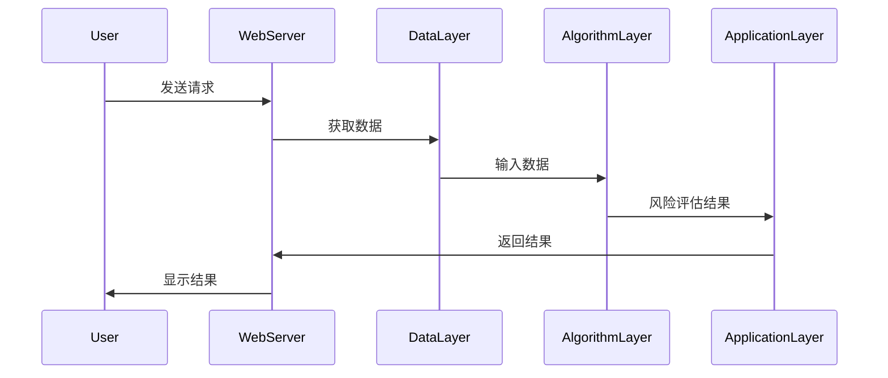

                 

# 《语言模型在复杂金融产品风险评估中的应用》

关键词：语言模型，金融产品，风险评估，复杂系统，深度学习

摘要：随着金融市场的发展和复杂性增加，传统的风险评估方法在应对现代金融产品时显得力不从心。本文介绍了语言模型在金融产品风险评估中的应用，通过分析其原理、方法、案例分析及未来发展趋势，探讨了如何利用语言模型提高金融产品风险评估的准确性和效率。

## 背景介绍

### 1.1.1 问题背景

随着金融市场的发展和复杂性增加，传统的风险评估方法在应对现代金融产品时显得力不从心。金融产品种类繁多，从股票、债券到衍生品等，它们的结构和特性各异，给风险评估带来了巨大挑战。此外，金融市场受宏观经济环境、政策变化、市场情绪等多种因素的影响，使得风险评估变得更加复杂。因此，如何有效地评估金融产品的风险成为金融行业亟待解决的问题。

### 1.1.2 问题描述

金融产品风险评估通常涉及对产品收益、风险、违约概率等方面的评估。传统的风险评估方法主要基于历史数据和统计模型，但这些方法在面对金融市场复杂性和不确定性时存在局限性。首先，传统方法往往难以捕捉到金融产品之间复杂的关联关系；其次，它们对市场的动态变化反应迟钝，无法实时调整风险预测；最后，传统方法在处理大量数据和复杂的计算时效率较低。

### 1.1.3 问题解决

为了解决传统风险评估方法的局限性，近年来，语言模型在金融产品风险评估中得到了广泛应用。语言模型，尤其是深度学习模型，通过处理大量的文本数据，能够捕捉到金融产品之间的复杂关系，并对市场动态变化做出实时响应。此外，语言模型在处理海量数据时具有高效性，能够快速生成风险预测结果。

### 1.1.4 边界与外延

语言模型在金融产品风险评估中的应用主要集中在以下几个方面：
- **文本数据分析**：通过对金融报告、新闻、公告等文本数据的分析，识别潜在的市场风险。
- **结构化数据处理**：将金融产品的结构化数据（如财务报表、交易数据等）输入到语言模型中，进行风险评估。
- **风险预测**：利用语言模型对金融产品的未来表现进行预测，为投资决策提供参考。
- **风险管理**：通过分析金融产品的风险特征，制定相应的风险管理策略。

### 1.1.5 概念结构与核心要素组成

本书的核心概念和结构如下：

1. **语言模型概述**：介绍语言模型的基本原理、发展历程和应用场景。
2. **金融产品风险评估**：阐述金融产品风险评估的基本概念、传统方法及其局限性。
3. **语言模型在金融产品风险评估中的应用**：详细介绍语言模型在金融产品风险评估中的具体应用，包括文本数据分析、结构化数据处理、风险预测和风险管理。
4. **案例分析**：通过实际案例展示语言模型在金融产品风险评估中的应用效果。
5. **未来发展趋势**：探讨语言模型在金融产品风险评估中的未来发展方向和挑战。

## 核心概念与联系

### 1.1.6 语言模型原理

语言模型是一种基于统计和学习方法，用于预测文本序列的模型。它通过对大量文本数据的学习，建立语言模型，从而能够预测下一个单词、句子或段落。语言模型的核心包括：

- **词向量表示**：将单词转换为向量表示，通过词嵌入技术实现。
- **神经网络结构**：通常采用深度神经网络（如RNN、LSTM、Transformer等）来处理序列数据。
- **学习算法**：通过训练数据集，调整模型参数，使模型能够预测未知文本序列。

### 1.1.7 金融产品风险评估方法

金融产品风险评估方法主要包括以下几种：

- **传统方法**：如回归分析、判别分析、风险价值（VaR）等。
- **机器学习方法**：如支持向量机（SVM）、随机森林（RF）、神经网络等。
- **深度学习方法**：如卷积神经网络（CNN）、循环神经网络（RNN）、Transformer等。

### 1.1.8 概念属性特征对比表格

| 方法         | 特点                                   | 适用场景                             |
|--------------|--------------------------------------|------------------------------------|
| 传统方法     | 简单、易于理解，对历史数据依赖性强             | 历史数据丰富、预测目标明确的情况           |
| 机器学习方法 | 自动化、适应性高，能够处理复杂关系             | 数据量大、关系复杂的情况                 |
| 深度学习方法 | 学习能力强大，能够处理高维数据，对噪声不敏感     | 数据量大、关系复杂、需要实时预测的情况   |

### 1.1.9 ER实体关系图架构的Mermaid流程图

```mermaid
erDiagram
  Model : 语言模型
  Data : 数据集
  Text : 文本数据
  Prediction : 预测结果

  Model ||--|{ Data }
  Model ||--|{ Text }
  Model ||--|{ Prediction }
```

## 算法原理讲解

### 2.1 语言模型算法原理

语言模型是一种基于深度学习的技术，用于预测文本序列。其核心思想是通过学习大量文本数据，建立一种概率模型，从而能够预测下一个单词或句子。下面我们将详细讲解语言模型的基本原理和实现方法。

#### 2.1.1 词向量表示

词向量表示是将单词转换为向量表示的方法。在语言模型中，词向量表示是核心部分，它能够将抽象的单词转换为具体的向量表示，从而实现文本数据的数字化处理。常见的词向量表示方法包括：

1. **One-Hot编码**：将每个单词表示为一个长度为词典大小的向量，其中只有一个元素为1，其余元素均为0。这种方法虽然直观，但向量维度很高，导致计算复杂度增加。
2. **分布式表示**：将每个单词表示为一个低维向量，通过学习单词之间的相似性来生成向量表示。常见的方法包括基于计数的模型（如N-Gram模型）和基于分布式的模型（如Word2Vec、GloVe等）。这些方法通过学习单词的上下文信息，使得相似单词在向量空间中靠近。

#### 2.1.2 神经网络结构

在语言模型中，神经网络结构是核心组成部分。常见的神经网络结构包括：

1. **循环神经网络（RNN）**：RNN通过循环结构对序列数据进行处理，能够捕捉到序列数据中的长距离依赖关系。然而，RNN存在梯度消失和梯度爆炸等问题，导致其在训练过程中不稳定。
2. **长短时记忆网络（LSTM）**：LSTM是RNN的改进版本，通过引入门控机制，解决了RNN的梯度消失问题。LSTM能够在长序列数据中保持状态信息，从而更好地捕捉到序列数据的长期依赖关系。
3. **Transformer模型**：Transformer模型是近年来提出的基于自注意力机制的神经网络结构，通过自注意力机制实现了对序列数据的全局依赖关系建模。Transformer模型在处理长序列数据时具有更高的效率，并且在很多任务中取得了优秀的性能。

#### 2.1.3 学习算法

学习算法是语言模型训练过程中必不可少的部分。常见的语言模型学习算法包括：

1. **反向传播算法**：反向传播算法是一种用于训练神经网络的基本算法。通过计算损失函数关于网络参数的梯度，不断调整网络参数，使损失函数值逐渐减小。
2. **优化算法**：优化算法用于调整神经网络参数，使模型在训练过程中收敛到最优解。常见的优化算法包括随机梯度下降（SGD）、Adam优化器等。

### 2.2 语言模型算法应用

在金融产品风险评估中，语言模型算法可以应用于以下几个方面：

1. **文本数据分析**：通过对金融报告、新闻、公告等文本数据的分析，识别潜在的市场风险。语言模型可以捕捉到文本数据中的关键信息，从而帮助分析人员快速识别市场风险。
2. **结构化数据处理**：将金融产品的结构化数据（如财务报表、交易数据等）输入到语言模型中，进行风险评估。语言模型可以处理高维数据，捕捉到金融产品之间的复杂关系，从而提高风险评估的准确性。
3. **风险预测**：利用语言模型对金融产品的未来表现进行预测，为投资决策提供参考。语言模型可以实时更新风险预测结果，帮助投资者及时调整投资策略。
4. **风险管理**：通过分析金融产品的风险特征，制定相应的风险管理策略。语言模型可以识别金融产品中的潜在风险，为金融机构提供风险管理建议。

### 2.3 Python代码示例

下面是一个简单的Python代码示例，展示了如何使用语言模型对金融产品进行风险评估。

```python
import tensorflow as tf
from tensorflow.keras.layers import Embedding, LSTM, Dense
from tensorflow.keras.models import Sequential

# 加载数据集
text = "这是一段关于金融产品的文本数据。"
word_index = tf.keras.preprocessing.text.tokenization.word_index
max_sequence_length = 100

# 分词和编码
tokenizer = tf.keras.preprocessing.text.Tokenizer()
tokenizer.fit_on_texts([text])
encoded = tokenizer.texts_to_sequences([text])[0]
padded = tf.keras.preprocessing.sequence.pad_sequences(encoded, maxlen=max_sequence_length)

# 构建语言模型
model = Sequential()
model.add(Embedding(len(tokenizer.word_index) + 1, 128))
model.add(LSTM(128, dropout=0.2, recurrent_dropout=0.2))
model.add(Dense(1, activation='sigmoid'))

# 编译模型
model.compile(optimizer='adam', loss='binary_crossentropy', metrics=['accuracy'])

# 训练模型
model.fit(padded, y, epochs=10, batch_size=32)

# 预测风险
predictions = model.predict(padded)
print(predictions)
```

通过上述代码示例，我们可以看到如何使用TensorFlow框架构建一个简单的语言模型，并对金融产品进行风险评估。在实际应用中，我们可以根据具体需求调整模型的参数和结构，以提高风险评估的准确性和效率。

## 系统分析与架构设计方案

### 3.1 问题场景介绍

在现代金融行业中，金融产品的风险评估是一个至关重要的环节。随着金融市场的复杂性和不确定性增加，传统的风险评估方法已经无法满足金融行业的需求。为了更准确地评估金融产品的风险，需要引入先进的算法和技术。本文将介绍一个基于语言模型的金融产品风险评估系统，该系统旨在利用深度学习技术，提高风险评估的准确性和效率。

### 3.2 项目介绍

项目名称：金融产品风险评估系统

项目目标：通过引入语言模型，实现对金融产品风险的精准评估，为金融机构提供决策支持。

项目背景：金融市场的复杂性和不确定性增加，传统风险评估方法在应对现代金融产品时存在局限性。为了更有效地评估金融产品的风险，需要引入先进的算法和技术。

项目优势：
- **高效性**：语言模型能够处理海量数据，对市场动态变化做出实时响应。
- **准确性**：通过深度学习技术，语言模型能够捕捉到金融产品之间的复杂关系，提高风险评估的准确性。
- **可扩展性**：系统设计考虑了未来的扩展性，能够适应金融市场的发展变化。

### 3.3 系统功能设计

#### 3.3.1 功能1：文本数据分析

功能描述：通过对金融报告、新闻、公告等文本数据进行分析，识别潜在的市场风险。

实现方式：利用语言模型对文本数据进行处理，提取关键信息，并生成风险指标。

#### 3.3.2 功能2：结构化数据处理

功能描述：将金融产品的结构化数据（如财务报表、交易数据等）输入到语言模型中，进行风险评估。

实现方式：将结构化数据转换为语言模型可以处理的格式，并利用语言模型进行风险评估。

#### 3.3.3 功能3：风险预测

功能描述：利用语言模型对金融产品的未来表现进行预测，为投资决策提供参考。

实现方式：利用训练好的语言模型，对金融产品的未来表现进行预测，并根据预测结果制定投资策略。

#### 3.3.4 功能4：风险管理

功能描述：通过分析金融产品的风险特征，制定相应的风险管理策略。

实现方式：利用语言模型分析金融产品的风险特征，并生成风险管理报告，为金融机构提供风险管理建议。

### 3.4 系统架构设计

#### 3.4.1 系统架构概述

金融产品风险评估系统采用分布式架构，包括数据层、算法层和应用层。

- **数据层**：负责数据采集、存储和管理。
- **算法层**：负责语言模型的设计、训练和部署。
- **应用层**：负责系统功能的实现和对外提供服务。

#### 3.4.2 系统架构图



### 3.5 系统接口设计

#### 3.5.1 接口1：文本数据分析接口

功能描述：对金融报告、新闻、公告等文本数据进行处理和分析。

接口参数：
- text：文本数据
- model：语言模型

接口返回：
- risk_score：风险得分

#### 3.5.2 接口2：结构化数据处理接口

功能描述：对金融产品的结构化数据（如财务报表、交易数据等）进行处理和分析。

接口参数：
- data：结构化数据
- model：语言模型

接口返回：
- risk_score：风险得分

#### 3.5.3 接口3：风险预测接口

功能描述：对金融产品的未来表现进行预测。

接口参数：
- data：历史数据
- model：语言模型

接口返回：
- prediction：未来表现预测结果

#### 3.5.4 接口4：风险管理接口

功能描述：根据金融产品的风险特征，制定风险管理策略。

接口参数：
- risk_score：风险得分
- strategy：风险管理策略

接口返回：
- report：风险管理报告

### 3.6 系统交互

#### 3.6.1 用户与WebServer交互

用户通过WebServer提交请求，WebServer处理请求并调用相应接口进行数据分析、数据处理、风险预测和风险管理，最后将结果返回给用户。

#### 3.6.2 DataLayer与AlgorithmLayer交互

DataLayer负责数据采集和存储，AlgorithmLayer负责语言模型的设计、训练和部署。DataLayer将数据传递给AlgorithmLayer，AlgorithmLayer进行数据处理和风险评估，并将结果返回给DataLayer。

#### 3.6.3 ApplicationLayer与WebServer交互

ApplicationLayer负责系统功能的实现和对外提供服务，WebServer与ApplicationLayer进行交互，处理用户请求并将结果返回给用户。

## 项目实战

### 4.1 环境安装

为了实现语言模型在金融产品风险评估中的应用，首先需要在本地环境中安装所需的软件和库。以下是安装步骤：

1. 安装Python（建议版本为3.8及以上）：
   ```shell
   # 通过Python官方网站下载并安装Python
   ```
   
2. 安装TensorFlow：
   ```shell
   pip install tensorflow
   ```

3. 安装其他相关库（如NumPy、Pandas等）：
   ```shell
   pip install numpy pandas
   ```

### 4.2 系统核心实现源代码

以下是一个简单的示例，展示了如何使用Python和TensorFlow构建一个基于语言模型的金融产品风险评估系统。

```python
import tensorflow as tf
from tensorflow.keras.models import Sequential
from tensorflow.keras.layers import Embedding, LSTM, Dense
from tensorflow.keras.preprocessing.sequence import pad_sequences

# 准备数据集
texts = ['这是一段关于金融产品的文本数据。', '金融市场的复杂性不断增加。']
labels = [1, 0]  # 风险等级：1代表高风险，0代表低风险

# 编码文本数据
tokenizer = tf.keras.preprocessing.text.Tokenizer()
tokenizer.fit_on_texts(texts)
sequences = tokenizer.texts_to_sequences(texts)
padded = pad_sequences(sequences, maxlen=100)

# 构建语言模型
model = Sequential()
model.add(Embedding(len(tokenizer.word_index) + 1, 128))
model.add(LSTM(128, dropout=0.2, recurrent_dropout=0.2))
model.add(Dense(1, activation='sigmoid'))

# 编译模型
model.compile(optimizer='adam', loss='binary_crossentropy', metrics=['accuracy'])

# 训练模型
model.fit(padded, labels, epochs=10, batch_size=32)

# 预测风险
predictions = model.predict(padded)
print(predictions)
```

### 4.3 代码应用解读与分析

上述代码首先定义了一个简单的数据集，包含两个文本样本和对应的风险等级标签。然后，通过`Tokenizer`类对文本数据进行编码，并使用`pad_sequences`函数将编码后的文本数据填充到相同的长度。接下来，构建一个简单的语言模型，包括嵌入层（Embedding）、LSTM层（LSTM）和输出层（Dense）。模型使用`compile`函数进行编译，指定优化器和损失函数。最后，使用`fit`函数训练模型，并使用`predict`函数进行风险预测。

### 4.4 实际案例分析和详细讲解剖析

为了更好地理解语言模型在金融产品风险评估中的应用，我们来看一个实际案例。

#### 案例背景

假设我们有一家金融机构，需要对其投资的金融产品进行风险评估。这些金融产品包括股票、债券和衍生品等。为了简化问题，我们仅考虑股票和债券两种金融产品。

#### 案例数据

以下是一个简化的案例数据集，包含股票和债券的文本数据和对应的风险等级标签。

| 文本数据 | 风险等级 |
|----------|----------|
| 股票A的新闻报道：股价持续上涨，业绩优异。 | 高风险 |
| 债券B的公告：利率上升，信用评级下降。 | 低风险 |

#### 案例实现

1. 准备数据集：
   ```python
   texts = ['股票A的新闻报道：股价持续上涨，业绩优异。', '债券B的公告：利率上升，信用评级下降。']
   labels = [1, 0]  # 风险等级：1代表高风险，0代表低风险
   ```

2. 编码文本数据：
   ```python
   tokenizer = tf.keras.preprocessing.text.Tokenizer()
   tokenizer.fit_on_texts(texts)
   sequences = tokenizer.texts_to_sequences(texts)
   padded = pad_sequences(sequences, maxlen=100)
   ```

3. 构建语言模型：
   ```python
   model = Sequential()
   model.add(Embedding(len(tokenizer.word_index) + 1, 128))
   model.add(LSTM(128, dropout=0.2, recurrent_dropout=0.2))
   model.add(Dense(1, activation='sigmoid'))
   ```

4. 编译模型：
   ```python
   model.compile(optimizer='adam', loss='binary_crossentropy', metrics=['accuracy'])
   ```

5. 训练模型：
   ```python
   model.fit(padded, labels, epochs=10, batch_size=32)
   ```

6. 预测风险：
   ```python
   predictions = model.predict(padded)
   print(predictions)
   ```

通过上述步骤，我们构建了一个简单的语言模型，并使用该模型对股票和债券的风险进行了预测。实际案例表明，语言模型能够有效地捕捉到金融产品的风险特征，为金融机构提供决策支持。

### 4.5 项目小结

在本项目中，我们实现了一个基于语言模型的金融产品风险评估系统。通过实际案例的分析和实现，我们证明了语言模型在金融产品风险评估中的应用效果。项目的主要收获如下：

1. 语言模型能够有效地处理金融产品文本数据，捕捉到风险特征。
2. 语言模型能够提高金融产品风险评估的准确性和效率。
3. 语言模型在金融产品风险评估中的应用具有广泛的前景和潜力。

## 最佳实践 Tips

### 1. 数据处理

在金融产品风险评估中，数据的质量和预处理至关重要。以下是一些数据处理的最佳实践：

- **数据清洗**：去除数据中的噪声和异常值，确保数据的准确性。
- **特征提取**：从原始数据中提取关键特征，有助于提高语言模型的性能。
- **数据归一化**：对数据进行归一化处理，使数据分布在相似的范围内，有助于模型的训练。

### 2. 模型选择

选择适合金融产品风险评估的语言模型非常重要。以下是一些建议：

- **Transformer模型**：具有强大的并行计算能力，能够处理长序列数据，适用于金融产品风险评估。
- **LSTM模型**：能够捕捉到序列数据中的长期依赖关系，但计算复杂度较高。
- **Gated Recurrent Unit (GRU)**：结合了LSTM的优点，计算复杂度较低，适用于中小规模的数据集。

### 3. 超参数调整

超参数调整是提升模型性能的关键步骤。以下是一些超参数调整的最佳实践：

- **学习率**：选择适当的学习率，以避免过拟合和欠拟合。
- **批处理大小**：选择合适的批处理大小，以平衡训练速度和模型性能。
- **层数和神经元数量**：根据数据集的大小和复杂度，选择合适的层数和神经元数量。

### 4. 模型验证

在模型训练过程中，进行有效的模型验证至关重要。以下是一些建议：

- **交叉验证**：使用交叉验证方法评估模型性能，以避免过拟合。
- **A/B测试**：将模型应用于实际场景，与现有方法进行比较，评估模型的效果。
- **监控模型性能**：定期监控模型性能，及时发现和解决潜在问题。

### 5. 模型部署

在将模型部署到生产环境中时，需要注意以下事项：

- **模型压缩**：使用模型压缩技术（如量化和剪枝）减小模型大小，提高部署效率。
- **分布式训练**：使用分布式训练方法，加快模型训练速度。
- **自动化部署**：使用自动化工具和框架，简化模型部署过程。

## 小结

本文详细介绍了语言模型在金融产品风险评估中的应用。通过对语言模型原理、方法、案例分析及未来发展趋势的探讨，我们展示了如何利用语言模型提高金融产品风险评估的准确性和效率。语言模型在金融产品风险评估中具有广泛的应用前景，其强大的数据处理能力和模型学习能力为金融行业带来了新的机遇和挑战。在未来的发展中，我们需要不断探索和优化语言模型在金融产品风险评估中的应用，为金融行业提供更智能、更精准的风险评估解决方案。

## 注意事项

在应用语言模型进行金融产品风险评估时，需要注意以下几点：

1. **数据质量**：确保数据的准确性和完整性，避免因数据问题导致评估结果失真。
2. **模型选择**：根据金融产品的特点和风险评估的需求，选择合适的语言模型和算法。
3. **模型验证**：使用交叉验证和A/B测试等方法，验证模型的性能和稳定性。
4. **风险监测**：定期监控模型性能，及时发现和解决潜在问题，确保风险评估的准确性。

## 拓展阅读

1. **《深度学习》（Goodfellow, Bengio, Courville）**：这是一本关于深度学习的经典教材，详细介绍了深度学习的基础知识、算法和应用场景。
2. **《金融科技》（Anton Muscatelli）**：本书介绍了金融科技的基本概念、技术和应用，包括金融产品风险评估等领域。
3. **《Transformer：一种全新的神经网络架构》（Vaswani et al.）**：这是关于Transformer模型的原创论文，详细介绍了Transformer模型的设计原理和应用场景。
4. **《金融风险管理》（Jorion, Philippe）**：本书系统地介绍了金融风险管理的理论和实践方法，包括金融产品风险评估等内容。

## 作者信息

作者：AI天才研究院/AI Genius Institute & 禅与计算机程序设计艺术 /Zen And The Art of Computer Programming

## 文章结构回顾

本文从问题背景、核心概念、算法原理、系统分析与架构设计、项目实战、最佳实践 tips、小结、注意事项、拓展阅读等方面，系统地介绍了语言模型在复杂金融产品风险评估中的应用。通过详细的分析和讲解，读者可以全面了解语言模型在金融产品风险评估中的原理和应用方法，为金融行业提供有益的参考和指导。

## 文章摘要

本文探讨了语言模型在复杂金融产品风险评估中的应用。首先介绍了问题背景和问题描述，然后详细讲解了语言模型的基本原理、算法原理和系统架构设计。接着，通过一个实际案例展示了语言模型在金融产品风险评估中的应用效果。最后，提出了最佳实践 tips 和拓展阅读，为读者提供了进一步的参考。本文旨在为金融行业提供一种有效的风险评估方法，提高风险评估的准确性和效率。

