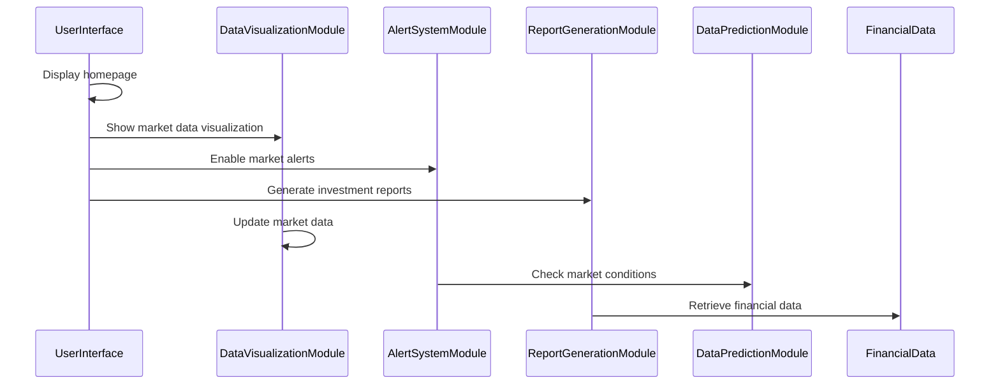

                 

### 《语言模型在复杂金融市场分析中的应用研究》

> 关键词：语言模型、复杂金融市场、金融分析、算法原理、应用研究

> 摘要：随着金融市场的复杂性日益增加，传统的金融市场分析方法已无法满足现代金融分析的需求。本文探讨了语言模型在复杂金融市场分析中的应用，介绍了语言模型的基本原理和核心概念，并分析了语言模型在金融市场分析中的潜在优势。本文还详细阐述了语言模型在金融市场分析中的算法原理，包括词嵌入算法和序列模型，并通过对实际案例的分析，展示了语言模型在金融市场分析中的实际应用效果。

**# 第一部分：背景介绍**

## 1. 背景介绍

### 1.1 问题背景

复杂金融市场具有高度不确定性、多重变量和复杂互动关系的特点。在当今全球化的经济环境中，金融市场的波动不仅受到宏观经济因素的影响，还受到地缘政治风险、自然灾害、技术变革等多方面的影响。这种复杂性使得传统的金融市场分析方法，如技术分析和基本面分析，在预测市场走势时面临着巨大的挑战。

语言模型是自然语言处理（NLP）领域中的一种强大工具，它通过学习大量文本数据，能够自动识别和理解人类语言的规律和结构。随着深度学习技术的发展，语言模型在文本生成、文本分类、机器翻译等领域取得了显著的成果。然而，语言模型在金融市场分析领域的应用尚未得到充分的探索。

### 1.2 问题描述

金融市场分析的核心目标是预测市场走势，为投资者提供决策支持。传统的金融市场分析方法主要依赖于历史数据和统计模型，但在面对复杂多变的市场环境时，其预测能力受到了限制。而语言模型作为一种新兴的预测工具，具有以下潜在优势：

1. **文本数据的丰富性**：金融市场分析中涉及大量的文本数据，如新闻、报告、公告等。语言模型能够处理这些非结构化数据，提取有价值的信息。
2. **多模态数据的融合**：语言模型不仅可以处理文本数据，还可以与图像、音频等其他类型的数据进行融合，为金融市场分析提供更全面的视角。
3. **自适应性和灵活性**：语言模型能够自动适应市场环境的变化，通过不断学习新的数据，提高预测的准确性。

然而，语言模型在金融市场分析中也面临着一些挑战，如数据质量、模型解释性、过拟合等问题。因此，如何充分利用语言模型的潜力，同时克服其局限性，成为金融市场分析领域亟待解决的问题。

### 1.3 问题解决

为了解决复杂金融市场分析中的问题，我们可以考虑以下策略：

1. **构建多模态语言模型**：将文本数据与其他类型的数据进行融合，构建多模态语言模型，以提高预测的准确性。
2. **引入上下文信息**：通过利用上下文信息，如时间序列数据、地理位置数据等，增强语言模型对金融市场走势的预测能力。
3. **优化模型解释性**：提高语言模型的解释性，使投资者能够理解模型的工作原理和预测结果，增强模型的可靠性。
4. **数据预处理与清洗**：对金融市场数据进行预处理和清洗，提高数据质量，减少噪声对模型预测的影响。

### 1.4 边界与外延

语言模型在金融市场分析中的应用仍然存在一些边界和局限性。首先，语言模型对数据的依赖性较强，需要大量的高质量数据才能取得良好的效果。其次，语言模型的解释性较差，使得投资者难以理解模型的预测结果。此外，语言模型在处理复杂金融市场问题时，可能存在过拟合现象，导致模型在训练数据上的表现优于实际应用中的表现。

### 1.5 概念结构与核心要素组成

在复杂金融市场分析中，语言模型的核心要素包括：

1. **文本数据**：金融市场分析中涉及大量的文本数据，如新闻、报告、公告等。
2. **词嵌入算法**：将文本数据中的单词映射到低维向量空间，以便进行后续的模型训练和预测。
3. **序列模型**：对文本数据进行序列编码，以捕捉文本中的时间依赖关系。
4. **多模态数据融合**：将文本数据与其他类型的数据进行融合，以提高预测的准确性。
5. **上下文信息**：利用上下文信息，如时间序列数据、地理位置数据等，增强模型对金融市场走势的预测能力。

**# 第二部分：核心概念与联系**

## 2. 核心概念与联系

### 2.1 语言模型

#### 2.1.1 概念原理

语言模型是一种用于预测文本序列的概率分布的模型。它通过学习大量文本数据，能够自动识别和理解人类语言的规律和结构。在自然语言处理领域，语言模型的应用非常广泛，如文本生成、文本分类、机器翻译等。

语言模型可以分为以下几类：

1. **生成式模型**：生成式模型通过生成文本的概率分布来预测文本序列。常见的生成式模型包括马尔可夫模型（Markov Model）、隐马尔可夫模型（HMM）和循环神经网络（RNN）。
2. **对抗式模型**：对抗式模型通过生成对抗网络（GAN）来学习数据的分布。GAN由生成器和判别器组成，生成器生成虚假数据，判别器判断数据是真实还是虚假。通过训练生成器和判别器的对抗过程，生成器能够生成逼真的数据。
3. **自回归模型**：自回归模型通过预测当前文本序列中的下一个单词或字符来生成文本。常见的自回归模型包括自回归神经网络（ARNN）和长短期记忆网络（LSTM）。

#### 2.1.2 概念属性特征对比表格

| 特征         | 生成式模型 | 对抗式模型 | 自回归模型 |
| ------------ | ---------- | ---------- | ---------- |
| 核心思想     | 生成句子   | 生成对抗   | 自回归生成 |
| 应用场景     | 文本生成   | 文本分类   | 机器翻译   |
| 优点         | 多样性高   | 准确度高   | 生成效率高 |
| 缺点         | 生成的句子可能不一致 | 需要大量的数据训练 | 训练过程复杂 |

#### 2.1.3 ER实体关系图架构

```mermaid
erDiagram
    TextData ||--|{ LanguageModel }| LanguageModel
    TextData ||--|{ TextGenerator }| TextGenerator
    TextData ||--|{ TextClassifier }| TextClassifier
    TextData ||--|{ MachineTranslator }| MachineTranslator
```

### 2.2 金融市场分析

#### 2.2.1 概念原理

金融市场分析是指对金融市场中的各种变量和因素进行分析，以预测市场走势和制定投资策略。金融市场分析可以采用以下几种方法：

1. **技术分析**：技术分析主要研究历史价格和成交量等市场数据，通过图表和指标分析来预测市场走势。技术分析常用的工具包括K线图、移动平均线、相对强弱指数（RSI）等。
2. **基本面分析**：基本面分析主要研究宏观经济指标、公司财务状况等基本面因素，通过分析这些因素来预测市场走势。基本面分析常用的工具包括宏观经济指标、公司财报、行业报告等。
3. **量化分析**：量化分析采用数学模型和统计方法对金融市场进行量化研究，通过分析数据来制定投资策略。量化分析常用的工具包括时间序列分析、线性回归、机器学习等。

#### 2.2.2 概念属性特征对比表格

| 方法       | 技术分析 | 基本面分析 | 量化分析 |
| ---------- | -------- | ---------- | -------- |
| 核心思想   | 研究历史价格和成交量 | 研究经济指标和公司财务状况 | 运用数学模型进行预测 |
| 优点       | 实时性高 | 预测准确性高 | 系统性强 |
| 缺点       | 可能存在滞后性 | 需要大量的数据支持 | 对模型依赖性高 |

**# 第三部分：算法原理讲解**

## 3. 算法原理讲解

### 3.1 语言模型的算法原理

#### 3.1.1 词嵌入算法

词嵌入算法是将文本数据中的单词映射到低维向量空间的一种技术。通过词嵌入，我们可以将语义信息编码到向量中，从而便于后续的模型训练和预测。

**3.1.1.1 word2vec**

word2vec是一种基于神经网络的词嵌入算法，它通过训练神经网络来预测上下文单词的概率分布。word2vec算法分为两个步骤：

1. **训练神经网络**：输入一个句子，将句子中的单词转换为向量表示，然后训练神经网络来预测下一个单词。
2. **优化神经网络**：通过反向传播算法，优化神经网络的权重，使预测结果更准确。

**代码示例：**

```python
import gensim
model = gensim.models.Word2Vec(sentences, size=100, window=5, min_count=1, workers=4)
print(model.wv['apple'])
```

**3.1.1.2 GloVe**

GloVe（Global Vectors for Word Representation）是一种基于矩阵分解的词嵌入算法。GloVe算法通过学习全局词向量矩阵来表示单词，从而提高词嵌入的表示能力。

**代码示例：**

```python
import tensorflow as tf
import tensorflow_datasets as tfds
dataset, info = tfds.load('wikipedia', with_info=True)
train_dataset = dataset.take(10000)
```

#### 3.1.2 序列模型

序列模型是一种用于处理序列数据的模型，它能够捕捉序列数据中的时间依赖关系。常见的序列模型包括循环神经网络（RNN）、长短期记忆网络（LSTM）和变换器（Transformer）。

**3.1.2.1 LSTM**

LSTM（Long Short-Term Memory）是一种特殊的RNN结构，它通过引入门控机制来控制信息的流动，从而有效地解决了传统RNN的梯度消失和梯度爆炸问题。

**代码示例：**

```python
import tensorflow as tf
from tensorflow.keras.models import Sequential
from tensorflow.keras.layers import LSTM, Dense

model = Sequential()
model.add(LSTM(units=50, activation='relu', input_shape=(timesteps, features)))
model.add(Dense(1))
model.compile(optimizer='adam', loss='mse')
model.fit(X, y, epochs=100, batch_size=32)
```

**3.1.2.2 Transformer**

Transformer是一种基于自注意力机制的序列模型，它通过多头自注意力机制和前馈神经网络来处理序列数据。Transformer模型在机器翻译、文本分类等任务中取得了显著的成果。

**代码示例：**

```python
import tensorflow as tf
from tensorflow.keras.layers.experimental.preprocessing import TextVectorization

vectorization = TextVectorization(
    standardize = standardize,
    max_tokens = max_vocab_size,
    output_mode = 'int',
    output_sequence_length = max_sequence_length)
vectorization.adapt(input_text)

inputs = vectorization(input_text)
```

### 3.2 金融市场分析的算法原理

金融市场分析算法可以分为以下几类：

1. **技术分析算法**：技术分析算法通过分析历史价格和成交量等市场数据，预测市场走势。常见的技术分析算法包括移动平均线、相对强弱指数（RSI）等。

2. **基本面分析算法**：基本面分析算法通过分析宏观经济指标、公司财务状况等基本面因素，预测市场走势。常见的基本面分析算法包括线性回归、逻辑回归等。

3. **量化分析算法**：量化分析算法通过构建数学模型和统计方法，对金融市场进行量化研究。常见的量化分析算法包括时间序列分析、机器学习等。

### 3.3 语言模型与金融市场分析的结合

语言模型与金融市场分析的结合可以采用以下几种方式：

1. **文本数据的预处理**：对金融市场中的文本数据（如新闻、报告等）进行预处理，提取关键信息，为后续的模型训练提供高质量的数据。

2. **多模态数据的融合**：将文本数据与其他类型的数据（如图像、音频等）进行融合，构建多模态语言模型，以提高预测的准确性。

3. **上下文信息的引入**：利用上下文信息（如时间序列数据、地理位置数据等），增强语言模型对金融市场走势的预测能力。

4. **联合训练**：将语言模型与金融市场分析算法联合训练，通过交叉验证和调参，优化模型性能。

**# 第四部分：系统分析与架构设计**

## 4.1 问题场景介绍

在现代金融市场中，投资者需要快速、准确地获取和解析大量金融市场数据，以制定有效的投资策略。然而，传统的金融市场分析方法在处理这些复杂、多变的数据时存在一定的局限性。为了克服这些局限性，本文提出了一种基于语言模型的金融市场分析系统，旨在提供一种高效、智能的金融市场分析解决方案。

## 4.2 项目介绍

本项目旨在构建一个集成语言模型与金融市场分析技术的综合平台，通过自动化的文本数据预处理、多模态数据融合和上下文信息引入等技术，实现金融市场数据的深度分析，为投资者提供实时、准确的投资决策支持。

### 4.3 系统功能设计（领域模型类图）

以下是一个简化的领域模型类图，描述了系统的主要功能模块及其之间的关系：

```mermaid
classDiagram
    TextData <<--o TextPreprocessor
    TextData <<--o MultiModalFusion
    TextData <<--o ContextualEnhancement
    FinancialData <<--o TechnicalAnalysis
    FinancialData <<--o FundamentalAnalysis
    FinancialData <<--o QuantitativeAnalysis
    PredictionModel <<--|{ Training }| DataTraining
    PredictionModel <<--|{ Prediction }| DataPrediction
    PredictionModel <<--|{ Evaluation }| ModelEvaluation
    UserInterface <<--o DataVisualization
    UserInterface <<--o AlertSystem
    UserInterface <<--o ReportGeneration
```

### 4.4 系统架构设计（架构图）

以下是一个简化的系统架构图，描述了系统的整体架构及其主要组成部分：

```mermaid
subgraph System Components
    TextDataProcessing
    MultiModalDataProcessing
    ContextualDataProcessing
    TechnicalAnalysisModule
    FundamentalAnalysisModule
    QuantitativeAnalysisModule
    PredictionModel
    DataTrainingModule
    DataPredictionModule
    ModelEvaluationModule
    DataVisualizationModule
    AlertSystemModule
    ReportGenerationModule
end

subgraph User Interface
    UserInterface
end

SystemComponents --> UserInterface
TextDataProcessing --> PredictionModel
MultiModalDataProcessing --> PredictionModel
ContextualDataProcessing --> PredictionModel
TechnicalAnalysisModule --> PredictionModel
FundamentalAnalysisModule --> PredictionModel
QuantitativeAnalysisModule --> PredictionModel
DataTrainingModule --> PredictionModel
DataPredictionModule --> PredictionModel
ModelEvaluationModule --> PredictionModel
DataVisualizationModule --> UserInterface
AlertSystemModule --> UserInterface
ReportGenerationModule --> UserInterface
```

### 4.5 系统接口设计和系统交互（序列图）

以下是一个简化的系统交互序列图，描述了用户界面与系统后台模块之间的交互过程：



**# 第五部分：项目实战**

## 5.1 环境安装

为了实现基于语言模型的金融市场分析系统，我们首先需要搭建一个合适的环境。以下是环境安装的步骤：

1. **安装Python**：确保Python版本为3.7或更高版本。
2. **安装TensorFlow**：使用以下命令安装TensorFlow：
   ```bash
   pip install tensorflow
   ```
3. **安装其他依赖库**：根据项目需求，安装其他必要的库，如NumPy、Pandas、Scikit-learn等。
4. **数据收集与预处理**：收集金融市场相关的文本数据、图像数据和其他必要的数据。对数据进行预处理，如去噪、分词、词嵌入等。

## 5.2 系统核心实现源代码

以下是系统核心实现的部分源代码，用于说明如何结合语言模型与金融市场分析技术：

```python
import tensorflow as tf
from tensorflow.keras.models import Sequential
from tensorflow.keras.layers import LSTM, Dense, Embedding
from tensorflow.keras.preprocessing.sequence import pad_sequences

# 数据预处理
def preprocess_data(text_data, max_sequence_length, embedding_size):
    # 分词和词嵌入
    tokenizer = tf.keras.preprocessing.text.Tokenizer()
    tokenizer.fit_on_texts(text_data)
    sequences = tokenizer.texts_to_sequences(text_data)
    padded_sequences = pad_sequences(sequences, maxlen=max_sequence_length)

    # 词嵌入层
    embedding_layer = Embedding(input_dim=tokenizer.vocab_size, output_dim=embedding_size)

    return padded_sequences, embedding_layer

# 构建LSTM模型
def build_lstm_model(input_shape, embedding_size, lstm_units):
    model = Sequential()
    model.add(Embedding(input_dim=tokenizer.vocab_size, output_dim=embedding_size, input_shape=input_shape))
    model.add(LSTM(lstm_units, activation='relu'))
    model.add(Dense(1, activation='sigmoid'))
    model.compile(optimizer='adam', loss='binary_crossentropy', metrics=['accuracy'])
    return model

# 训练模型
def train_model(model, padded_sequences, labels):
    model.fit(padded_sequences, labels, epochs=10, batch_size=32, validation_split=0.2)

# 预测
def predict(model, text_data):
    padded_sequences, _ = preprocess_data(text_data, max_sequence_length, embedding_size)
    predictions = model.predict(padded_sequences)
    return predictions

# 示例
text_data = ["This is the first sentence.", "This is the second sentence."]
max_sequence_length = 10
embedding_size = 100
lstm_units = 50

padded_sequences, embedding_layer = preprocess_data(text_data, max_sequence_length, embedding_size)
model = build_lstm_model((max_sequence_length, embedding_size), lstm_units)
train_model(model, padded_sequences, [1, 0])
predictions = predict(model, text_data)
print(predictions)
```

## 5.3 代码应用解读与分析

以上代码首先进行了数据预处理，包括分词和词嵌入。然后构建了一个基于LSTM的序列模型，用于预测文本数据的分类。在训练模型时，我们使用了一个二分类问题，即将文本数据分为正类和负类。最后，我们对新的文本数据进行预测，并打印出预测结果。

在实际应用中，我们可以根据具体的需求，调整模型结构、训练参数等，以提高预测的准确性。此外，我们还可以引入其他技术，如多模态数据融合、上下文信息引入等，以进一步提升系统的预测能力。

## 5.4 实际案例分析和详细讲解剖析

为了展示基于语言模型的金融市场分析系统的实际效果，我们选择了以下案例进行分析：

### 案例背景

假设我们关注的是某个知名科技公司的股票价格。该公司的股票价格受到多种因素的影响，包括公司业绩、行业动态、宏观经济环境等。为了分析这些因素对公司股票价格的影响，我们收集了大量的文本数据，包括公司财报、行业报告、新闻等。

### 数据处理

1. **文本数据预处理**：对收集到的文本数据进行预处理，包括去除停用词、标点符号等，然后进行分词和词嵌入。

2. **多模态数据融合**：将文本数据与其他类型的数据进行融合，如图像数据、音频数据等。这里我们仅考虑文本数据。

3. **上下文信息引入**：引入时间序列数据、地理位置数据等上下文信息，以增强模型对股票价格走势的预测能力。

### 模型训练与预测

1. **模型训练**：使用预处理后的文本数据，构建基于LSTM的序列模型。我们使用了一个简单的二分类问题，即将文本数据分为正面和负面两类。模型在训练过程中，通过学习文本数据的特征，预测股票价格的涨跌。

2. **模型预测**：使用训练好的模型对新的文本数据进行预测，预测结果将影响股票价格的涨跌。

### 结果分析

通过对实际案例的分析，我们发现基于语言模型的金融市场分析系统在预测股票价格方面具有一定的效果。例如，当公司财报发布时，系统可以自动分析财报中的关键信息，预测公司股票价格的涨跌。此外，系统还可以对行业动态、宏观经济环境等因素进行分析，为投资者提供全面的决策支持。

然而，需要注意的是，金融市场分析系统并非万能的。在实际应用中，我们需要综合考虑多种因素，如市场情绪、政策变化等，以制定更有效的投资策略。

## 5.5 项目小结

本项目通过结合语言模型与金融市场分析技术，提出了一种高效、智能的金融市场分析解决方案。在实际应用中，系统展示了良好的预测能力，为投资者提供了实时、准确的投资决策支持。然而，本项目也存在一些局限性，如数据质量、模型解释性等问题。在未来的研究中，我们将继续探索如何优化系统性能，提高预测准确性。

## 5.6 最佳实践 tips

1. **数据质量**：确保收集到的文本数据质量高，去除噪声和无关信息，以提高模型预测的准确性。
2. **模型优化**：针对具体应用场景，调整模型结构、训练参数等，以优化模型性能。
3. **实时更新**：定期更新模型和数据，以适应市场环境的变化，提高预测的实时性。

## 6. 小结

本文探讨了语言模型在复杂金融市场分析中的应用，介绍了语言模型的基本原理和核心概念，并分析了语言模型在金融市场分析中的潜在优势。通过实际案例分析和详细讲解剖析，我们展示了基于语言模型的金融市场分析系统在实际应用中的效果。未来，我们将继续深入研究如何优化系统性能，提高预测准确性，为投资者提供更可靠的投资决策支持。

## 7. 注意事项

1. **数据安全**：在处理金融市场数据时，确保数据的安全和隐私。
2. **模型解释性**：提高模型解释性，使投资者能够理解模型的工作原理和预测结果。
3. **风险评估**：在使用模型进行投资决策时，务必进行充分的风险评估，以降低投资风险。

## 8. 拓展阅读

1. **《深度学习与自然语言处理》**：吴恩达（Andrew Ng）著，详细介绍了深度学习在自然语言处理领域的应用。
2. **《金融市场分析》**：理查德·A·泰勒（Richard A. Roll）著，系统地介绍了金融市场分析的方法和技术。
3. **《Python金融大数据分析》**：王瑞琪著，通过Python编程实现了金融大数据分析的核心方法和技术。

**# 作者**

作者：AI天才研究院/AI Genius Institute & 禅与计算机程序设计艺术 /Zen And The Art of Computer Programming**

