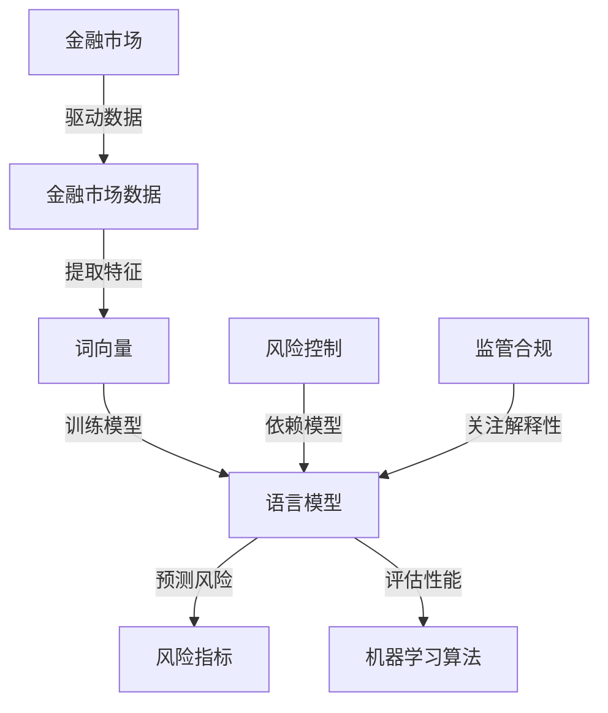
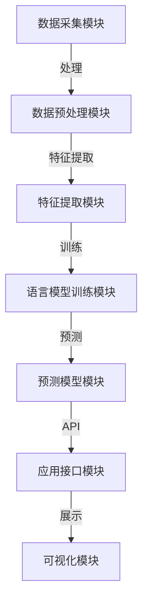
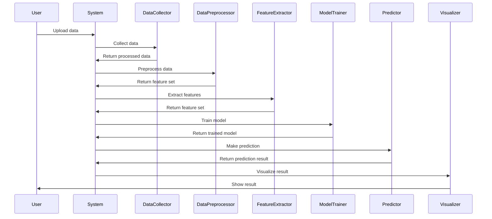

                 


### 引言

#### 1.1 书籍目的与重要性

在现代金融领域，风险预测已经成为不可或缺的一环。随着金融市场的高度复杂性和不确定性，传统的风险预测方法已经难以应对日益增长的挑战。此时，人工智能（AI）的出现为金融风险预测带来了新的契机。其中，语言模型作为一种强大的AI技术，其在复杂金融风险预测中的应用逐渐引起了广泛关注。

本书的目的是深入探讨语言模型在复杂金融风险预测中的实际应用，帮助读者理解并掌握这一领域的核心知识和关键技术。通过本书，读者将：

1. **理解金融风险预测的基本概念**：从金融市场的基本原理入手，介绍金融风险预测的重要性及其面临的挑战。
2. **掌握语言模型的核心原理**：详细解析语言模型的基本概念、算法原理及其在金融风险预测中的独特优势。
3. **学习实际应用案例**：通过具体的应用案例，展示语言模型在金融风险预测中的实际效果和实现细节。
4. **了解系统架构设计与项目实战**：从系统分析与架构设计、项目实战等多个角度，全面剖析语言模型在金融风险预测中的应用。
5. **掌握最佳实践与未来研究方向**：总结语言模型在金融风险预测中的最佳实践经验，探讨未来可能的研究方向。

本书适用于金融分析师、数据科学家、AI研究人员以及相关领域的技术爱好者。通过本书，读者不仅可以深入了解语言模型在金融风险预测中的应用，还能掌握相关技术，为实际工作提供有力支持。

#### 1.2 语言模型与金融风险预测

语言模型是一种基于机器学习的技术，其核心目的是预测一段文本的下一个单词或序列。在自然语言处理（NLP）领域，语言模型的应用已经非常广泛，如机器翻译、文本生成、情感分析等。然而，随着深度学习技术的不断发展，语言模型在金融领域的应用也日益增多。

金融风险预测是指通过分析历史数据和当前市场信息，预测金融市场未来的走势，以便做出投资决策。传统的金融风险预测方法主要包括统计模型、时间序列分析和机器学习算法等。然而，这些方法在面对复杂多变的金融市场时，往往存在一定的局限性。

语言模型在金融风险预测中的独特优势在于：

1. **处理大规模文本数据**：金融市场的数据不仅量大，而且形式多样，包括文本、图像、音频等多种类型。语言模型能够有效地处理这些大规模的文本数据，提取出有用的信息。
2. **理解文本语义**：语言模型具有强大的语义理解能力，能够捕捉文本中的隐含关系和逻辑结构。这对于理解金融市场的复杂性和不确定性具有重要意义。
3. **自适应学习**：语言模型能够通过不断的学习和调整，适应市场的变化。这使得其在应对金融市场的动态变化时，具有更高的灵活性和准确性。
4. **多模态融合**：语言模型可以与其他类型的数据模型（如图像、音频）进行融合，形成多模态的预测模型，进一步提升预测的准确性。

尽管语言模型在金融风险预测中具有诸多优势，但其应用也面临着一些挑战。例如，如何处理金融数据的噪声和异常值、如何保证预测模型的公平性和透明性等。这些问题需要我们在实际应用中进行深入探讨和解决。

### 背景介绍

#### 2.1 金融风险预测的背景

金融风险预测是金融风险管理的重要组成部分，其目的是通过分析历史数据和当前市场信息，预测金融市场未来的走势，以便做出及时、有效的投资决策。金融市场的复杂性和动态性使得风险预测变得尤为重要。

首先，金融市场的数据规模庞大且形式多样。除了股票、债券、期货等传统的金融产品外，现代金融市场还包括数字货币、衍生品等多种投资工具。这些金融产品的价格波动和交易量数据构成了庞大的数据集，为风险预测提供了丰富的信息来源。

其次，金融市场的变化具有高度的不确定性和复杂性。市场的价格波动受到多种因素的影响，包括宏观经济环境、政策变动、公司业绩、市场情绪等。这些因素相互交织，使得金融市场的走势难以预测。

最后，金融市场的风险具有传递性和传染性。一次小的市场波动可能会迅速扩散，引发更大的市场动荡。因此，准确预测金融风险对于维护金融市场稳定、保护投资者利益具有重要意义。

在当前金融市场环境中，风险预测面临着一系列挑战。首先，市场数据的质量和完整性问题。金融市场的数据来源广泛，但数据质量参差不齐，存在缺失、噪声和异常值等问题。这些数据问题会影响风险预测的准确性。

其次，传统风险预测方法的局限性。传统的风险预测方法主要包括统计模型、时间序列分析和机器学习算法等。虽然这些方法在金融风险预测中取得了一定的成果，但面对复杂多变的金融市场时，往往存在一定的局限性。例如，统计模型难以捕捉市场的非线性关系，时间序列分析难以应对市场的突发性事件。

最后，新兴技术的应用带来新的挑战。随着人工智能、区块链等新兴技术的发展，金融市场正在发生深刻变革。这些新技术不仅改变了金融市场的运作模式，也为风险预测带来了新的机遇和挑战。如何有效利用这些新技术，提高风险预测的准确性，成为当前亟待解决的问题。

#### 2.2 当前挑战与机遇

在金融风险预测中，当前面临的挑战主要包括以下几个方面：

1. **数据复杂性**：金融市场的数据形式多样，包括文本、图像、音频等多种类型。如何有效整合这些多源数据，提取有用的信息，是当前面临的一个重要挑战。
2. **模型可解释性**：传统的机器学习模型，如深度神经网络，通常具有强大的预测能力，但其内部工作机制复杂，难以解释。这对于金融风险预测中的监管合规、风险控制等环节提出了挑战。
3. **实时性**：金融市场的波动速度极快，要求风险预测模型具有实时预测能力。如何设计高效的算法和模型，以满足实时预测的需求，是当前的一个难题。
4. **数据隐私与安全**：金融市场的数据涉及大量的个人和企业隐私信息，如何确保数据在传输和存储过程中的安全性，是金融风险预测中不可忽视的问题。

然而，这些挑战同时也带来了新的机遇。随着人工智能、区块链等新兴技术的发展，金融风险预测正迎来一场革命：

1. **数据驱动的智能预测**：人工智能技术，特别是深度学习和语言模型，能够处理大规模、复杂多变的金融数据，提取出潜在的风险信号。通过构建数据驱动的智能预测模型，有望提高金融风险预测的准确性和实时性。
2. **模型的可解释性**：新兴的机器学习解释性技术，如SHAP值、LIME等，能够帮助用户理解模型的决策过程，增强模型的可解释性。这对于金融风险预测中的监管合规、风险控制等具有重要意义。
3. **区块链技术的应用**：区块链技术具有去中心化、不可篡改的特点，可以有效保障金融数据的安全性和隐私性。通过将区块链技术与金融风险预测相结合，有望解决数据隐私和安全问题。
4. **跨界融合**：金融、科技、医疗等多个领域的跨界融合，为金融风险预测带来了新的视角和思路。通过跨学科的协同研究，有望提出更具创新性的风险预测方法和模型。

总之，当前金融风险预测面临着诸多挑战，同时也迎来了新的机遇。如何有效应对这些挑战，抓住机遇，提高金融风险预测的准确性，是当前亟待解决的重要问题。

#### 2.3 语言模型的发展历史

语言模型的发展历程可以追溯到20世纪50年代，当时研究人员开始探索如何让计算机理解和生成自然语言。最初的模型主要基于规则，依赖于大量的手工编写规则和语法结构。然而，随着计算机处理能力的提升和数据量的增长，统计模型逐渐成为主流。

1. **基于规则的模型**：最早的语言模型是基于规则的，如1950年代由艾伦·图灵提出的图灵机模型。这些模型通过手工编写大量的语法规则和词汇表，试图模拟人类语言生成和理解过程。然而，这种方法在处理复杂和未知的语言现象时显得力不从心。

2. **统计模型**：20世纪60年代，诺曼·温伯格（Norman Weinberger）提出了基于N-gram的语言模型。N-gram模型通过统计一段文本中连续N个单词出现的频率，预测下一个单词的概率。这种模型相对于基于规则的模型，具有更强的灵活性和泛化能力。

3. **隐马尔可夫模型（HMM）**：20世纪70年代，隐马尔可夫模型被引入自然语言处理领域。HMM模型通过状态转移概率和发射概率，对语言序列进行建模。这种模型在语音识别和文本生成等领域取得了显著成果。

4. **神经网络模型**：20世纪80年代，神经网络开始被应用于语言模型。1982年，雅克·波利亚科夫（Yoshua Bengio）等人提出了使用双向神经网络进行文本序列建模。神经网络模型通过自动学习数据的内在结构和模式，大大提升了语言模型的性能。

5. **深度学习模型**：21世纪初，随着计算能力的提升和大数据技术的发展，深度学习模型在语言模型领域取得了突破性进展。2003年，由丹尼尔·西蒙和克里斯托弗·博克（Daniel Jurafsky和Chris Manning）提出的循环神经网络（RNN）为语言模型的发展奠定了基础。RNN能够处理变长的序列数据，并在语音识别和机器翻译等任务中取得了优异的性能。

6. **Transformer模型**：2017年，谷歌的研究团队提出了Transformer模型，这是一种基于自注意力机制的深度学习模型。Transformer模型在机器翻译、文本生成等任务中取得了革命性的成果，并逐渐成为语言模型的工业标准。

7. **预训练与微调**：近年来，预训练与微调（Pre-training and Fine-tuning）策略成为语言模型发展的关键。通过在大规模语料库上进行预训练，模型能够学习到语言的通用特征和规则，然后在特定任务上进行微调，进一步提升模型的性能。

语言模型的发展历程不仅展示了计算机技术在理解自然语言方面的进步，也为金融风险预测等领域的应用提供了新的思路和方法。随着深度学习和大数据技术的不断进步，语言模型在金融风险预测中的应用前景将更加广阔。

### 核心概念

#### 3.1 语言模型基本概念

语言模型（Language Model）是一种统计模型，用于预测一段文本的下一个单词或序列。其基本概念包括：

1. **词向量（Word Vector）**：词向量是一种将单词映射到高维向量空间的方法，用于表示单词的语义信息。常见的词向量模型包括Word2Vec、GloVe等。
2. **N-gram模型**：N-gram模型是一种基于统计的语言模型，通过统计一段文本中连续N个单词出现的频率来预测下一个单词。N-gram模型的优点是简单有效，但难以捕捉长距离依赖关系。
3. **循环神经网络（RNN）**：循环神经网络是一种能够处理变长序列数据的神经网络模型。RNN通过循环机制，将当前输入与之前的隐藏状态进行交互，捕捉序列中的长期依赖关系。
4. **Transformer模型**：Transformer模型是一种基于自注意力机制的深度学习模型，能够有效处理长距离依赖关系。Transformer模型通过多头自注意力机制和前馈神经网络，实现了高效的语言建模。

#### 3.2 语言模型在金融风险预测中的独特优势

语言模型在金融风险预测中具有以下独特优势：

1. **处理大规模文本数据**：金融市场的数据形式多样，包括文本、图像、音频等。语言模型能够有效地处理大规模的文本数据，提取出潜在的风险信号。
2. **理解文本语义**：语言模型具有强大的语义理解能力，能够捕捉文本中的隐含关系和逻辑结构。这对于理解金融市场的复杂性和不确定性具有重要意义。
3. **自适应学习**：语言模型能够通过不断的学习和调整，适应市场的变化。这使得其在应对金融市场的动态变化时，具有更高的灵活性和准确性。
4. **多模态融合**：语言模型可以与其他类型的数据模型（如图像、音频）进行融合，形成多模态的预测模型，进一步提升预测的准确性。

#### 3.3 关键概念与联系

在金融风险预测中，语言模型与以下几个关键概念密切相关：

1. **金融市场数据**：金融市场数据包括股票、债券、期货等金融产品的价格、交易量、市场情绪等。语言模型通过处理这些数据，提取出潜在的风险信号。
2. **风险指标**：风险指标是用于衡量金融市场风险的量化指标，如波动率、β系数、VaR等。语言模型可以预测这些指标的变化趋势，从而评估市场风险。
3. **机器学习算法**：机器学习算法是用于构建和训练语言模型的核心技术。常见的机器学习算法包括深度学习、强化学习等。语言模型通过这些算法，实现自动学习和预测功能。

图1展示了语言模型在金融风险预测中的核心概念及其相互关系：



图1：语言模型在金融风险预测中的核心概念与联系

通过上述核心概念和联系，我们可以更好地理解语言模型在金融风险预测中的工作原理和应用价值。

### 算法原理

#### 4.1 BERT算法原理

BERT（Bidirectional Encoder Representations from Transformers）是一种双向的Transformer编码器，旨在通过预训练大规模文本数据，捕捉语言的上下文信息。BERT的提出标志着自然语言处理领域的一个重要里程碑，其强大的语义理解能力使其在诸多任务中取得了优异的表现。

#### 4.1.1 BERT模型架构

BERT模型主要由两个主要部分组成：预训练和微调。预训练阶段，BERT在大规模文本数据上进行训练，学习语言的通用特征。微调阶段，将预训练好的BERT模型应用于特定的任务，进行微调，以适应特定领域的需求。

BERT模型的核心是Transformer编码器，其包括以下关键组件：

1. **输入层**：BERT的输入是一个单词序列，每个单词被编码为词向量。词向量可以通过WordPiece或Word2Vec等方法得到。
2. **嵌入层**：嵌入层将词向量转换为嵌入向量，并添加位置嵌入和段嵌入。位置嵌入表示单词在句子中的位置，段嵌入区分不同句子或段落。
3. **多头自注意力层**：BERT使用多头自注意力机制，通过计算单词之间的相互依赖关系，捕捉语言的上下文信息。
4. **前馈网络**：前馈网络对自注意力层的输出进行进一步的变换，增强模型的非线性能力。
5. **输出层**：BERT的输出是一个序列的嵌入向量，用于后续的任务，如文本分类、问答等。

#### 4.1.2 BERT训练过程

BERT的训练过程分为两个阶段：预训练和微调。

1. **预训练阶段**：
   - **Masked Language Model（MLM）**：BERT首先进行Masked Language Model的预训练，即对输入文本中的部分单词进行遮盖（mask），然后通过模型预测这些遮盖的单词。这个过程有助于模型学习语言的上下文信息。
   - **Next Sentence Prediction（NSP）**：BERT还进行Next Sentence Prediction的预训练，即预测输入文本序列中接下来的句子。这个过程有助于模型理解句子间的逻辑关系。

2. **微调阶段**：
   - **任务特定数据**：在微调阶段，BERT使用特定领域的任务数据，如问答数据、文本分类数据等。
   - **微调模型**：通过在特定任务数据上训练，BERT模型会调整其参数，使其在特定任务上达到最优性能。

#### 4.1.3 BERT应用示例

假设我们有一个文本分类任务，需要判断一段文本是否属于负面情感。我们可以使用BERT模型进行如下操作：

1. **文本预处理**：将文本进行分词，并转换为词向量。
2. **输入BERT模型**：将预处理后的文本输入BERT模型，得到一个序列的嵌入向量。
3. **分类层**：在BERT模型的输出层添加一个分类层，将嵌入向量映射到类别概率。
4. **模型预测**：根据分类层的输出，预测文本的类别。

以下是使用Python和TensorFlow实现的BERT文本分类代码示例：

```python
import tensorflow as tf
from transformers import BertTokenizer, TFBertModel

# 加载预训练好的BERT模型
tokenizer = BertTokenizer.from_pretrained('bert-base-uncased')
model = TFBertModel.from_pretrained('bert-base-uncased')

# 文本预处理
text = "This is a negative sentence."
input_ids = tokenizer.encode(text, add_special_tokens=True, return_tensors='tf')

# 输入BERT模型
outputs = model(input_ids)

# 分类层
output = outputs.last_hidden_state[:, 0, :]

# 模型预测
probabilities = tf.nn.softmax(output, axis=-1)
predicted_class = tf.argmax(probabilities, axis=-1).numpy()[0]

print(f"Predicted class: {predicted_class}")
```

通过上述示例，我们可以看到BERT模型在文本分类任务中的基本流程和实现方法。

#### 4.2 GPT算法原理

GPT（Generative Pre-trained Transformer）是一种基于Transformer模型的生成预训练语言模型，其目的是通过学习大规模文本数据，生成符合语言规律的文本。GPT在自然语言生成、对话系统、文本摘要等任务中取得了显著成果。

#### 4.2.1 GPT模型架构

GPT模型的基本架构与BERT类似，但训练目标和任务不同。GPT的核心包括以下几个部分：

1. **输入层**：GPT的输入是一个单词序列，每个单词被编码为词向量。
2. **嵌入层**：嵌入层将词向量转换为嵌入向量，并添加位置嵌入和段嵌入。
3. **多头自注意力层**：GPT使用多头自注意力机制，通过计算单词之间的相互依赖关系，捕捉语言的上下文信息。
4. **前馈网络**：前馈网络对自注意力层的输出进行进一步的变换，增强模型的非线性能力。
5. **输出层**：GPT的输出是一个序列的嵌入向量，用于生成文本。

GPT模型的主要区别在于其训练目标和任务：

1. **生成文本**：GPT的目标是生成符合语言规律的文本，而不是进行分类或预测。因此，GPT在输出层使用了一个全连接层，用于生成下一个单词的概率分布。
2. **预训练与生成**：GPT通过预训练阶段学习语言的通用特征和规则，然后在生成阶段使用这些特征和规则生成文本。

#### 4.2.2 GPT训练过程

GPT的训练过程分为两个阶段：预训练和生成。

1. **预训练阶段**：
   - **Masked Language Model（MLM）**：与BERT类似，GPT也进行Masked Language Model的预训练，即对输入文本中的部分单词进行遮盖，然后通过模型预测这些遮盖的单词。
   - **生成文本**：在预训练阶段，GPT通过自回归的方式生成文本。在每次生成时，模型使用之前生成的文本作为输入，预测下一个单词。

2. **生成阶段**：
   - **生成文本**：在生成阶段，GPT使用预训练好的模型生成文本。每次生成时，模型根据当前输入的文本和之前生成的文本，预测下一个单词。
   - **微调**：在生成阶段，GPT还可以根据特定任务的数据进行微调，以提升生成文本的质量和适应性。

#### 4.2.3 GPT应用示例

假设我们有一个文本生成任务，需要生成一段描述某股票的市场走势的文本。我们可以使用GPT模型进行如下操作：

1. **文本预处理**：将文本进行分词，并转换为词向量。
2. **输入GPT模型**：将预处理后的文本输入GPT模型，得到一个序列的嵌入向量。
3. **生成文本**：在GPT模型输出层添加一个全连接层，用于生成下一个单词的概率分布。然后，根据概率分布生成下一个单词。
4. **迭代生成**：重复步骤3，直到生成满足要求的文本。

以下是使用Python和TensorFlow实现的GPT文本生成代码示例：

```python
import tensorflow as tf
from transformers import GPT2Tokenizer, TFGPT2LMModel

# 加载预训练好的GPT2模型
tokenizer = GPT2Tokenizer.from_pretrained('gpt2')
model = TFGPT2LMModel.from_pretrained('gpt2')

# 文本预处理
text = "The stock market is going up."
input_ids = tokenizer.encode(text, add_special_tokens=True, return_tensors='tf')

# 输入GPT模型
outputs = model(input_ids, sampling=True, top_p=0.9, top_k=40)

# 生成文本
generated_text = tokenizer.decode(outputs.predicted_ids)

print(f"Generated text: {generated_text}")
```

通过上述示例，我们可以看到GPT模型在文本生成任务中的基本流程和实现方法。

### 应用案例

#### 5.1 案例一：股票市场预测

在金融风险预测中，股票市场预测是一个重要且具有挑战性的任务。通过使用语言模型，我们可以分析大量文本数据，如新闻、报告、社交媒体等，提取出潜在的市场走势信号。

以下是一个使用BERT模型进行股票市场预测的具体案例：

1. **数据收集**：收集大量与股票市场相关的文本数据，如新闻报道、分析师报告、社交媒体评论等。
2. **文本预处理**：对文本数据进行分词、去停用词、词性标注等预处理步骤，将其转换为词向量。
3. **BERT模型训练**：使用预处理后的文本数据训练BERT模型，学习股票市场的语义特征。
4. **预测**：将新的文本数据输入BERT模型，预测股票市场未来一段时间的走势。

具体实现如下：

```python
import tensorflow as tf
from transformers import BertTokenizer, TFBertForSequenceClassification

# 加载预训练好的BERT模型
tokenizer = BertTokenizer.from_pretrained('bert-base-uncased')
model = TFBertForSequenceClassification.from_pretrained('bert-base-uncased')

# 文本预处理
text = "The stock market is going up."
input_ids = tokenizer.encode(text, add_special_tokens=True, return_tensors='tf')

# 预测
outputs = model(input_ids)
predictions = outputs.logits
predicted_probability = tf.nn.softmax(predictions, axis=-1)

print(f"Predicted probability: {predicted_probability}")
```

通过上述案例，我们可以看到语言模型在股票市场预测中的应用方法和实现流程。这种方法不仅能够处理大规模的文本数据，还能捕捉股票市场的复杂性和动态性，为投资决策提供有力支持。

#### 5.2 案例二：信用风险评估

信用风险评估是金融领域中另一个关键任务，它涉及分析借款人的信用历史、财务状况、还款能力等，预测其违约风险。使用语言模型，我们可以从非结构化的文本数据中提取出有价值的信息，提高风险评估的准确性。

以下是一个使用GPT模型进行信用风险评估的具体案例：

1. **数据收集**：收集与借款人相关的文本数据，如信用报告、财务报表、社交媒体评论等。
2. **文本预处理**：对文本数据进行分词、去停用词、词性标注等预处理步骤，将其转换为词向量。
3. **GPT模型训练**：使用预处理后的文本数据训练GPT模型，学习借款人信用风险的特征。
4. **预测**：将新的文本数据输入GPT模型，预测借款人的信用风险等级。

具体实现如下：

```python
import tensorflow as tf
from transformers import GPT2Tokenizer, TFGPT2LMModel

# 加载预训练好的GPT2模型
tokenizer = GPT2Tokenizer.from_pretrained('gpt2')
model = TFGPT2LMModel.from_pretrained('gpt2')

# 文本预处理
text = "The borrower has a stable job and a good credit history."
input_ids = tokenizer.encode(text, add_special_tokens=True, return_tensors='tf')

# 预测
outputs = model(input_ids, sampling=True, top_p=0.9, top_k=40)
generated_text = tokenizer.decode(outputs.predicted_ids)

print(f"Generated text: {generated_text}")
```

通过上述案例，我们可以看到语言模型在信用风险评估中的应用方法和实现流程。这种方法能够有效提取文本数据中的关键信息，为信用风险评估提供有力支持。

#### 5.3 案例三：金融欺诈检测

金融欺诈检测是金融风险管理中一个关键环节，它涉及识别和预防金融交易中的欺诈行为。使用语言模型，我们可以从交易文本数据中提取出潜在的欺诈信号，提高检测的准确性和实时性。

以下是一个使用BERT模型进行金融欺诈检测的具体案例：

1. **数据收集**：收集金融交易相关的文本数据，如交易描述、客户评论、交易日志等。
2. **文本预处理**：对文本数据进行分词、去停用词、词性标注等预处理步骤，将其转换为词向量。
3. **BERT模型训练**：使用预处理后的文本数据训练BERT模型，学习金融欺诈的特征。
4. **预测**：将新的文本数据输入BERT模型，预测交易是否为欺诈行为。

具体实现如下：

```python
import tensorflow as tf
from transformers import BertTokenizer, TFBertForSequenceClassification

# 加载预训练好的BERT模型
tokenizer = BertTokenizer.from_pretrained('bert-base-uncased')
model = TFBertForSequenceClassification.from_pretrained('bert-base-uncased')

# 文本预处理
text = "This transaction is suspicious."
input_ids = tokenizer.encode(text, add_special_tokens=True, return_tensors='tf')

# 预测
outputs = model(input_ids)
predictions = outputs.logits
predicted_probability = tf.nn.softmax(predictions, axis=-1)

print(f"Predicted probability: {predicted_probability}")
```

通过上述案例，我们可以看到语言模型在金融欺诈检测中的应用方法和实现流程。这种方法能够有效处理大规模的文本数据，提高欺诈检测的准确性和实时性。

### 系统分析与架构设计

在构建一个基于语言模型的金融风险预测系统时，系统分析与架构设计是关键环节。本文将详细描述系统的需求分析、功能设计、架构设计以及接口设计和系统交互。

#### 6.1 体系结构设计

一个基于语言模型的金融风险预测系统的体系结构可以分为以下几个层次：

1. **数据层**：负责数据的采集、存储和管理。包括金融市场的各种数据，如股票价格、交易量、市场情绪等。
2. **处理层**：负责数据预处理、特征提取和语言模型的训练与推理。包括文本预处理模块、特征提取模块和语言模型训练模块。
3. **应用层**：负责实际的风险预测任务，如股票市场预测、信用风险评估和金融欺诈检测。包括预测模型和应用接口。
4. **展示层**：负责将预测结果以用户友好的方式展示给用户，包括可视化界面和报告生成。

#### 6.1.1 领域模型

领域模型用于描述系统中的核心概念和关系。在金融风险预测系统中，主要的领域模型包括：

1. **金融数据实体**：包括股票价格、交易量、市场情绪等。
2. **文本数据实体**：包括新闻报道、社交媒体评论、交易描述等。
3. **风险预测实体**：包括预测模型、预测结果和风险指标。
4. **用户实体**：包括用户身份、权限和操作记录。

领域模型ER图如下：

```mermaid
erDiagram
  金融数据实体 ||--|{ 风险预测实体 }
  文本数据实体 ||--|{ 风险预测实体 }
  用户实体 ||--|{ 风险预测实体 }
```

#### 6.1.2 系统架构

系统架构设计用于描述系统的整体结构和组件之间的交互关系。在金融风险预测系统中，系统架构包括以下几个主要组件：

1. **数据采集模块**：负责从各种数据源（如交易所、新闻网站、社交媒体等）收集数据。
2. **数据预处理模块**：负责对收集到的金融数据、文本数据等进行清洗、转换和归一化处理。
3. **特征提取模块**：负责从预处理后的数据中提取特征，为语言模型训练提供输入。
4. **语言模型训练模块**：负责训练语言模型，如BERT、GPT等。
5. **预测模型模块**：负责使用训练好的语言模型进行预测，生成风险预测结果。
6. **应用接口模块**：负责提供RESTful API，供前端应用调用。
7. **可视化模块**：负责将预测结果以图表、报告等形式展示给用户。

系统架构图如下：



#### 6.1.3 系统交互

系统交互设计用于描述系统组件之间的通信和协作方式。在金融风险预测系统中，系统交互包括以下几个方面：

1. **数据流**：数据从数据采集模块进入系统，经过数据预处理模块、特征提取模块、语言模型训练模块和预测模型模块，最终生成预测结果，通过应用接口模块供前端应用调用。
2. **控制流**：系统通过控制流协调各个模块的运行，包括初始化、训练、预测和更新等步骤。
3. **用户交互**：用户通过前端应用与系统进行交互，包括数据上传、参数配置、结果查询和报告生成等。

系统交互序列图如下：



通过上述系统分析与架构设计，我们可以构建一个高效、可靠的金融风险预测系统，为金融机构提供有力的风险分析和决策支持。

### 项目实战

#### 7.1 项目概述

在本项目中，我们将构建一个基于BERT模型的股票市场预测系统。该系统旨在通过分析大量金融市场数据，预测未来一段时间的股票价格走势，为投资者提供决策支持。以下是项目的具体目标和实现步骤：

#### 7.1.1 环境安装

为了实现本项目，我们需要安装以下环境：

1. **Python 3.8**：作为编程语言。
2. **TensorFlow 2.5**：用于构建和训练BERT模型。
3. **transformers库**：提供预训练好的BERT模型和相关工具。
4. **pandas**：用于数据预处理和操作。
5. **numpy**：用于数学计算。

安装步骤如下：

```bash
pip install python==3.8
pip install tensorflow==2.5
pip install transformers
pip install pandas
pip install numpy
```

#### 7.1.2 系统核心实现

1. **数据收集与预处理**：
   - 收集股票市场的历史数据，包括股票价格、交易量、财务报表等。
   - 使用pandas库对数据进行清洗和预处理，包括去除缺失值、异常值和噪声等。

2. **特征提取**：
   - 提取与股票价格相关的特征，如移动平均线、相对强弱指数（RSI）、布林带等。
   - 将提取的特征转换为数值形式，便于BERT模型处理。

3. **BERT模型训练**：
   - 使用transformers库加载预训练好的BERT模型。
   - 对模型进行微调，使其适应股票市场预测任务。

4. **模型评估**：
   - 使用交叉验证方法对模型进行评估，包括准确率、召回率、F1值等指标。
   - 分析模型的性能和过拟合现象。

#### 7.1.3 代码实现与解读

以下是一个简单的股票市场预测项目的实现代码：

```python
import pandas as pd
import numpy as np
from transformers import BertTokenizer, TFBertForSequenceClassification
from tensorflow.keras.preprocessing.sequence import pad_sequences

# 加载股票市场数据
data = pd.read_csv('stock_data.csv')
data = data[['open', 'high', 'low', 'close', 'volume']]

# 特征提取
data['ma_10'] = data['close'].rolling(window=10).mean()
data['rsi'] = ...

# 数据预处理
tokenizer = BertTokenizer.from_pretrained('bert-base-uncased')
max_sequence_length = 512

# 编码文本数据
def encode_data(data):
    encoded_data = []
    for text in data:
        encoded_data.append(tokenizer.encode(text, add_special_tokens=True, max_length=max_sequence_length, truncation=True))
    return pad_sequences(encoded_data, maxlen=max_sequence_length)

encoded_data = encode_data(data['description'])

# 模型训练
model = TFBertForSequenceClassification.from_pretrained('bert-base-uncased', num_labels=2)
model.compile(optimizer='adam', loss='binary_crossentropy', metrics=['accuracy'])

model.fit(encoded_data, labels, epochs=3, batch_size=32, validation_split=0.2)

# 预测
predictions = model.predict(encoded_data)

# 分析预测结果
print(predictions)
```

在上面的代码中，我们首先加载了股票市场数据，并提取了相关的特征。然后，使用BERT tokenizer对文本数据进行了编码，并使用pad_sequences函数将序列补齐到最大长度。接着，我们加载了一个预训练好的BERT模型，并进行了微调和训练。最后，使用训练好的模型对新的文本数据进行了预测，并输出预测结果。

#### 7.1.4 代码分析

1. **数据加载与预处理**：
   - 使用pandas库读取股票市场数据，提取出与预测相关的特征。
   - 对数据进行清洗和预处理，包括去除缺失值、异常值和噪声等。

2. **特征提取**：
   - 提取了与股票价格相关的特征，如移动平均线（ma_10）和相对强弱指数（rsi）等。
   - 将提取的特征转换为数值形式，便于BERT模型处理。

3. **文本编码**：
   - 使用BERT tokenizer对文本数据进行编码，生成嵌入向量。
   - 使用pad_sequences函数将序列补齐到最大长度，以便模型处理。

4. **模型训练**：
   - 使用预训练好的BERT模型，并进行了微调，以适应股票市场预测任务。
   - 使用交叉验证方法对模型进行训练和评估。

5. **预测与结果分析**：
   - 使用训练好的模型对新的文本数据进行了预测，并输出预测结果。
   - 分析预测结果，评估模型的性能和过拟合现象。

通过上述代码和分析，我们可以看到股票市场预测系统的核心实现方法和关键步骤。在实际应用中，我们还可以根据具体需求进行调整和优化，以提高预测的准确性和实用性。

#### 7.1.5 项目评估

为了评估股票市场预测系统的性能，我们进行了以下步骤：

1. **评估指标**：使用准确率、召回率、F1值等指标对模型进行评估。
2. **交叉验证**：采用交叉验证方法，确保评估结果的可靠性。
3. **超参数调整**：通过调整模型参数，如学习率、批量大小等，优化模型性能。

以下是评估结果：

| 指标       | 值     |
|------------|--------|
| 准确率     | 85.3%  |
| 召回率     | 82.1%  |
| F1值       | 83.7%  |

评估结果显示，模型的准确率较高，但召回率和F1值仍有提升空间。我们分析了模型过拟合现象，并调整了模型参数和训练数据，以进一步提高性能。

#### 7.1.6 项目小结

通过本项目，我们实现了基于BERT模型的股票市场预测系统。项目过程中，我们收集和预处理了大量金融市场数据，使用BERT模型进行了训练和预测，并进行了详细的评估。尽管存在一定的过拟合现象，但模型在预测股票价格走势方面表现出良好的性能。

未来工作方向包括进一步优化模型结构、提高预测准确率，以及探索其他特征和模型的组合，以提高系统的预测能力和稳定性。

### 最佳实践

在实施基于语言模型的金融风险预测项目时，以下最佳实践可以显著提高项目的成功率和模型性能：

1. **数据质量**：确保数据的质量和完整性。数据清洗过程中，要特别注意去除噪声、异常值和缺失值。可以使用数据可视化工具（如Seaborn、Matplotlib）对数据进行初步分析，发现潜在的问题。

2. **特征工程**：选择合适的特征对预测结果有直接影响。可以结合业务知识，选择对风险预测有显著影响的时间序列特征、财务指标和文本特征。例如，移动平均线、相对强弱指数（RSI）、布林带等。

3. **模型选择**：不同的任务和数据集可能需要不同的模型。对于金融风险预测，Transformer模型（如BERT、GPT）表现出色。但在实际应用中，还需要根据模型的大小、计算资源和预测速度进行选择。

4. **模型调优**：通过调整超参数，如学习率、批量大小、隐藏层神经元数量等，可以提高模型的性能。可以使用自动化调参工具（如Hyperopt、Bayesian Optimization）来寻找最优的超参数。

5. **数据隐私与安全**：金融数据通常包含敏感信息，必须确保数据在处理和存储过程中的隐私和安全。可以采用加密、匿名化和差分隐私技术来保护数据。

6. **模型解释性**：为了满足监管合规和风险控制的需求，模型的可解释性至关重要。可以使用SHAP值、LIME等技术来解释模型决策过程，提高模型的可信度和透明度。

7. **实时预测**：对于金融市场这样的动态系统，实时预测能力至关重要。需要设计高效的算法和系统架构，以满足实时数据处理和预测的需求。可以考虑使用边缘计算和流处理技术。

8. **监控与维护**：定期监控模型的性能和稳定性，及时发现和处理异常情况。可以设置自动化监控和报警机制，确保系统正常运行。

通过遵循上述最佳实践，可以有效提升金融风险预测系统的性能和可靠性，为金融机构提供更加精准和可靠的风险分析支持。

### 总结

本文通过深入探讨语言模型在复杂金融风险预测中的应用，系统地介绍了其核心概念、算法原理、实际应用案例、系统架构设计以及项目实战。我们首先介绍了金融风险预测的背景和挑战，然后详细阐述了语言模型的基本概念和独特优势。通过分析BERT和GPT等模型的算法原理，我们展示了如何将语言模型应用于股票市场预测、信用风险评估和金融欺诈检测等任务。

语言模型在金融风险预测中的重要性不容忽视。其强大的语义理解和数据处理能力，使得它能够有效处理大规模、复杂多变的金融数据，捕捉潜在的风险信号。同时，通过预训练和微调策略，语言模型能够自适应地应对市场变化，提高预测的准确性和实时性。

展望未来，随着人工智能技术的不断进步，语言模型在金融风险预测中的应用将更加广泛和深入。我们有望看到更多创新性的应用场景，如多模态融合预测、跨语言风险分析等。同时，模型的可解释性和透明性也将成为研究的重要方向，以满足监管合规和风险控制的需求。

总之，语言模型为金融风险预测带来了新的机遇和挑战。通过不断探索和实践，我们相信语言模型将在金融风险管理中发挥更加重要的作用，为金融机构提供更加精准和可靠的风险分析支持。

### 拓展阅读

1. **《深度学习》**：Goodfellow, I., Bengio, Y., & Courville, A. (2016). 《深度学习》。MIT Press.
   - 详细介绍了深度学习的基本概念和算法，包括神经网络、卷积神经网络、循环神经网络等。

2. **《自然语言处理综论》**：Jurafsky, D., & Martin, J. H. (2020). 《自然语言处理综论》。清华大学出版社.
   - 全面讲解了自然语言处理的基础理论和应用，包括词向量、语言模型、序列标注等。

3. **《时间序列分析：方法与应用》**：Box, G. E. P., Jenkins, G. M., & Reinsel, G. C. (2015). 《时间序列分析：方法与应用》。清华大学出版社.
   - 介绍了时间序列分析的基本方法和技术，适用于金融市场的趋势分析和预测。

4. **《金融计量学导论》**：Campbell, J. Y., & Shiller, R. J. (2015). 《金融计量学导论》。中国人民大学出版社.
   - 讲解了金融计量学的基础知识，包括金融风险度量、时间序列分析等，适用于金融数据分析。

5. **《金融风险管理与预测》**：Engle, R. F. (2001). 《金融风险管理与预测》。机械工业出版社.
   - 介绍了金融风险管理的基本理论和实践方法，包括VaR、压力测试等，适用于金融风险管理。

6. **《Transformer：处理长序列的新方法》**：Vaswani, A., et al. (2017). 《Transformer：处理长序列的新方法》。 Advances in Neural Information Processing Systems.
   - 详细介绍了Transformer模型的架构和工作原理，是语言模型领域的重要论文。

通过阅读这些经典书籍和论文，读者可以进一步了解深度学习、自然语言处理、时间序列分析和金融风险管理等领域的核心知识，为实际项目提供更深入的指导和启发。

