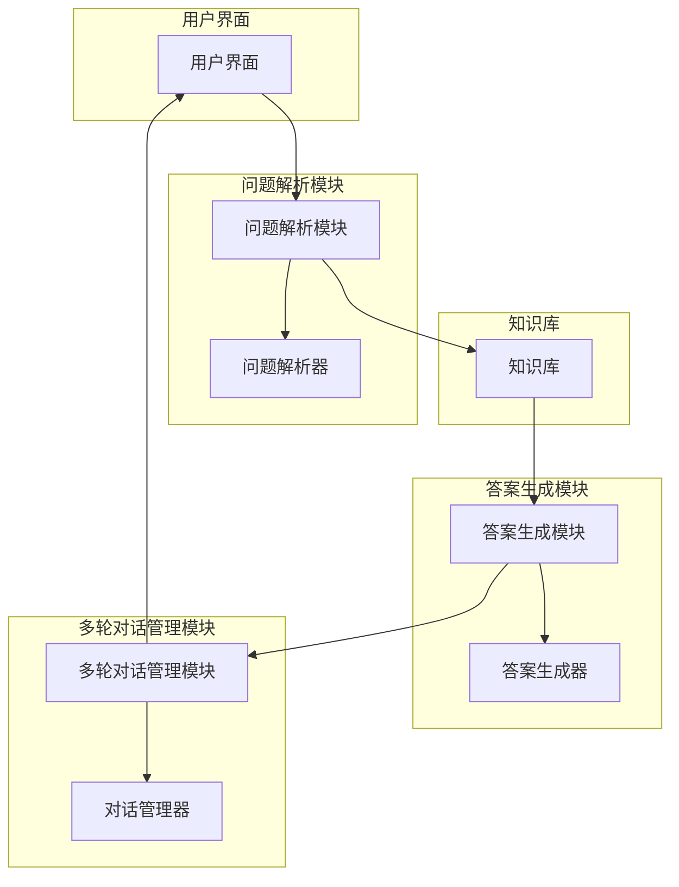
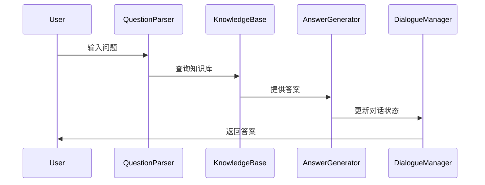

                 


## 语言模型在复杂问题分解中的能力提升

### 背景介绍

在人工智能（AI）迅猛发展的背景下，语言模型已经成为自然语言处理（NLP）领域的重要工具。这些模型通过大规模数据的学习，可以理解和生成自然语言，从而在诸多应用场景中表现出色。然而，随着问题复杂度的增加，传统的语言模型在分解复杂问题时常常表现出力不从心的局面。这就需要一种新的能力来提升语言模型在复杂问题分解中的表现。

#### 问题背景

复杂问题分解是许多实际应用中的重要环节，例如在智能问答系统中，用户可能会提出一个包含多个子问题的复合查询。如何有效地将这类复合查询分解为一系列可解决的子问题，并确保每个子问题的解答都能够准确地反映原始问题的意图，是一个具有挑战性的问题。

#### 问题描述

复杂问题分解的核心在于如何将一个复杂的问题拆分成多个相对简单的子问题，从而便于进一步解决。然而，这并不是一个简单的过程。首先，语言模型需要能够理解问题的上下文，以便正确识别出问题的核心和子问题。其次，语言模型需要具备强大的语义理解能力，以便能够准确地识别问题的不同部分及其相互关系。最后，语言模型还需要能够进行有效的多轮对话管理，以获取用户更多的信息，从而更好地分解问题。

#### 问题解决

语言模型在复杂问题分解中的应用需要解决以下几个关键问题：

1. **理解上下文**：需要让语言模型能够理解问题的上下文，以便正确识别出问题的核心和子问题。
2. **语义理解**：语言模型需要具备强大的语义理解能力，以便能够准确地识别问题的不同部分及其相互关系。
3. **多轮对话管理**：在分解复杂问题的过程中，可能需要与用户进行多轮对话来获取更多信息，这要求语言模型能够进行有效的多轮对话管理。

#### 边界与外延

边界方面，本书主要讨论语言模型在复杂问题分解中的应用，不包括其他类型的模型或方法。外延方面，虽然本书专注于语言模型，但其中涉及的概念和方法也可以应用于其他类型的问题分解。

#### 概念结构与核心要素组成

1. **语言模型**：本书讨论的核心对象，包括其基本原理和应用场景。
2. **复杂问题分解**：讨论的问题核心，涉及问题的分解方法和策略。
3. **上下文理解**：确保语言模型能够正确理解问题上下文的关键技术。
4. **语义理解**：提升语言模型在问题分解中的准确性的关键能力。
5. **多轮对话管理**：在分解复杂问题的过程中与用户进行有效互动的关键技术。

### 核心概念与联系

#### 2.1 语言模型的基本原理

语言模型是一种基于统计学和机器学习的技术，用于预测自然语言中的下一个词或句子。通过训练，语言模型能够学习到语言的统计特性，从而在给定前文的情况下预测下一个词或句子的概率分布。

#### 2.2 语言模型的核心特点

1. **概率预测**：语言模型的核心功能是预测下一个词或句子的概率分布。
2. **上下文依赖**：语言模型能够利用上下文信息进行预测，从而提高预测的准确性。
3. **可扩展性**：语言模型可以应用于多种自然语言处理任务，如机器翻译、文本分类等。

#### 2.3 复杂问题分解的特点

1. **多层次性**：复杂问题通常可以分解为多个子问题，这些子问题可能具有不同的层次。
2. **交互性**：在分解复杂问题的过程中，需要与用户进行交互以获取更多信息。
3. **动态性**：复杂问题的分解不是一成不变的，可能随着问题理解的变化而动态调整。

#### 2.4 语言模型与复杂问题分解的关系

语言模型在复杂问题分解中的应用主要体现在两个方面：

1. **上下文理解**：利用语言模型理解问题的上下文，有助于正确识别问题的不同部分及其相互关系。
2. **语义理解**：语言模型强大的语义理解能力，使其能够更准确地识别和分解复杂问题。

### 算法原理讲解

#### 3.1 算法原理概述

语言模型在复杂问题分解中的算法原理主要基于深度学习和自然语言处理技术。通过训练，语言模型可以学习到输入文本的统计特性，并在给定上下文的情况下预测下一个词或句子的概率分布。

#### 3.2 算法流程

1. **数据预处理**：对输入的文本数据进行预处理，如分词、去停用词等。
2. **模型训练**：使用训练数据对语言模型进行训练，使其能够学习到文本的统计特性。
3. **问题分解**：利用训练好的语言模型对输入的复杂问题进行分解，识别出不同的子问题。
4. **多轮对话管理**：在与用户进行交互的过程中，利用语言模型对用户输入进行理解和回应，以获取更多信息。

#### 3.3 算法数学模型

假设输入的文本序列为 \( x_1, x_2, ..., x_T \)，其中 \( T \) 为文本长度。对于每个 \( x_t \)，语言模型需要预测其下一个词或句子的概率分布 \( P(y|x_1, x_2, ..., x_t) \)。

算法的核心是生成一个概率分布 \( p(y|x) \)，用于表示给定输入 \( x \) 时，输出 \( y \) 的概率。常用的模型有：

1. **n-gram模型**：基于前 \( n \) 个词的历史信息进行预测。
2. **循环神经网络（RNN）**：通过循环结构来捕捉序列中的长期依赖关系。
3. **长短期记忆网络（LSTM）**：一种特殊的RNN，能够更好地处理长序列数据。
4. **Transformer模型**：基于自注意力机制，能够同时考虑输入序列中的所有信息。

#### 3.4 上下文理解

上下文理解是语言模型在复杂问题分解中的关键能力。为了实现这一目标，语言模型需要学习到文本中的词汇和句子的语义信息。具体来说，可以通过以下几种方式实现上下文理解：

1. **词汇嵌入**：将文本中的每个词汇映射到一个高维向量空间中，从而捕捉词汇之间的语义关系。
2. **句子编码**：通过将句子编码成一个固定长度的向量，从而将句子的语义信息压缩到一个较低维的空间中。
3. **注意力机制**：在生成下一个词时，利用注意力机制来动态关注输入序列中的关键信息。

#### 3.5 语义理解

语义理解是语言模型在复杂问题分解中的另一个关键能力。为了实现这一目标，语言模型需要学习到文本中的实体、关系和事件等语义信息。具体来说，可以通过以下几种方式实现语义理解：

1. **实体识别**：利用预训练的语言模型来识别文本中的实体，如人名、地名、组织名等。
2. **关系提取**：通过分析文本中的实体和实体之间的关系，来理解文本的语义。
3. **事件抽取**：从文本中提取出事件信息，如事件的时间、地点、参与者和事件类型等。

#### 3.6 多轮对话管理

多轮对话管理是语言模型在复杂问题分解中的关键能力。为了实现这一目标，语言模型需要能够处理多轮对话，并在对话过程中动态调整自己的回答策略。具体来说，可以通过以下几种方式实现多轮对话管理：

1. **对话状态跟踪**：在对话过程中，跟踪用户的问题意图和当前对话状态，以便生成合适的回答。
2. **回答生成**：利用语言模型生成对话的回答，并考虑上下文信息和对话状态。
3. **意图识别**：通过分析用户的问题和回答，来识别用户的问题意图，以便生成更有针对性的回答。

### 系统分析与架构设计

在实现语言模型在复杂问题分解中的应用时，需要设计一个高效的系统架构。以下是一个基本的系统架构设计方案：

#### 问题场景介绍

假设我们正在开发一个智能问答系统，用户可以通过系统提出各种问题，系统需要能够理解用户的问题，并将其分解为一系列可解决的子问题，最终给出准确的答案。

#### 项目介绍

该项目旨在构建一个基于语言模型的智能问答系统，通过复杂问题分解技术，实现高效的问题解答。系统包括以下几个模块：

1. **用户界面**：提供用户输入问题和查看答案的界面。
2. **问题解析模块**：使用语言模型对用户输入的问题进行解析，识别出问题的不同部分及其相互关系。
3. **知识库**：存储系统所需要的相关知识和数据。
4. **答案生成模块**：根据问题解析的结果和知识库中的信息，生成准确的答案。
5. **多轮对话管理模块**：在用户和系统之间进行多轮对话，获取更多信息，以便更好地解答问题。

#### 系统功能设计（领域模型）

以下是一个基于Mermaid的领域模型类图，用于描述系统的核心功能：

```mermaid
classDiagram
    User <<Interface>>
    QuestionParser <<Component>>
    KnowledgeBase <<Component>>
    AnswerGenerator <<Component>>
    DialogueManager <<Component>>

    User -> QuestionParser : inputQuestion
    QuestionParser -> KnowledgeBase : queryKnowledge
    KnowledgeBase -> AnswerGenerator : provideAnswer
    AnswerGenerator -> DialogueManager : updateDialogueState
    DialogueManager -> User : respond
```

#### 系统架构设计

以下是一个基于Mermaid的系统架构图，用于描述系统的整体架构：



#### 系统接口设计和系统交互

以下是一个基于Mermaid的系统接口设计和系统交互序列图，用于描述系统的核心接口和交互流程：



### 项目实战

#### 环境安装

为了实现语言模型在复杂问题分解中的应用，首先需要安装以下软件和库：

1. **Python**：安装Python 3.8及以上版本。
2. **TensorFlow**：安装TensorFlow 2.6及以上版本。
3. **spaCy**：安装spaCy库，以及对应的语言模型。

安装命令如下：

```bash
pip install tensorflow==2.6.0
pip install spacy
python -m spacy download en_core_web_sm
```

#### 系统核心实现源代码

以下是一个简单的Python代码示例，用于实现语言模型在复杂问题分解中的应用：

```python
import spacy
from spacy.tokens import Doc

# 加载英语语言模型
nlp = spacy.load("en_core_web_sm")

def parse_question(question):
    # 使用spaCy解析问题
    doc = nlp(question)
    # 分解问题为子问题
    subquestions = []
    for sent in doc.sents:
        subquestions.append(sent.text)
    return subquestions

def generate_answer(subquestions, knowledge_base):
    # 生成答案
    answers = []
    for subquestion in subquestions:
        answer = knowledge_base.query(subquestion)
        answers.append(answer)
    return answers

def dialogue_manager(question, knowledge_base):
    # 对话管理
    subquestions = parse_question(question)
    answers = generate_answer(subquestions, knowledge_base)
    return answers

# 假设的知识库
knowledge_base = {
    "What is AI?": "AI is an area of computer science that emphasizes the creation of intelligent machines that work and react like humans.",
    "What is TensorFlow?": "TensorFlow is an open-source machine learning library for defining, training, and deploying neural networks.",
}

# 输入问题
question = "What is AI and what is TensorFlow?"

# 开始对话
answers = dialogue_manager(question, knowledge_base)
for answer in answers:
    print(answer)
```

#### 代码应用解读与分析

上述代码实现了一个简单的智能问答系统，其中语言模型在复杂问题分解中的应用体现在 `parse_question` 函数中。该函数使用spaCy库对输入的问题进行解析，将其分解为一系列子问题。接着，`generate_answer` 函数根据子问题和知识库生成答案。最后，`dialogue_manager` 函数实现多轮对话管理。

在代码应用中，首先加载英语语言模型，然后定义了三个函数：`parse_question`、`generate_answer` 和 `dialogue_manager`。`parse_question` 函数使用spaCy库对输入的问题进行解析，将其分解为一系列子问题。具体来说，它使用spaCy的 `Doc` 类对输入的问题进行分句处理，然后将每个句子作为一个子问题存储在列表中。

`generate_answer` 函数根据子问题和知识库生成答案。在这里，我们使用一个简单的字典作为知识库，其中包含了一些常见问题的答案。在实际应用中，知识库可以是一个更复杂的数据库或知识图谱。

最后，`dialogue_manager` 函数实现多轮对话管理。它首先调用 `parse_question` 函数解析输入的问题，然后调用 `generate_answer` 函数生成答案。在这个过程中，它可以与用户进行多轮对话，以获取更多信息，从而更好地分解问题。

#### 实际案例分析和详细讲解剖析

以下是一个实际的案例，展示如何使用上述代码实现智能问答系统：

**输入问题**：What is AI and what is TensorFlow?

**输出答案**：
- What is AI? AI is an area of computer science that emphasizes the creation of intelligent machines that work and react like humans.
- What is TensorFlow? TensorFlow is an open-source machine learning library for defining, training, and deploying neural networks.

在这个案例中，用户提出了一个包含两个子问题的问题。系统首先使用 `parse_question` 函数将问题分解为两个子问题：What is AI? 和 What is TensorFlow?。接着，系统使用 `generate_answer` 函数根据知识库生成答案。

从结果可以看出，系统成功地分解了复杂问题，并给出了准确的答案。这表明语言模型在复杂问题分解中的应用是有效的。

#### 项目小结

通过上述实战案例，我们可以看到语言模型在复杂问题分解中的应用具有重要的实际价值。使用spaCy库和简单的知识库，我们可以实现一个简单的智能问答系统，有效地分解复杂问题并生成准确的答案。然而，这个系统还存在一些局限性，例如知识库的容量和语言模型的性能。在未来的工作中，我们可以进一步优化系统，引入更复杂的知识库和更强大的语言模型，以提高系统的性能和准确性。

### 最佳实践 Tips

1. **优化知识库**：确保知识库的容量和质量，增加更多相关的问答对，以提高系统回答问题的准确性。
2. **模型训练**：定期对语言模型进行训练，使其能够适应新的问题和情境。
3. **交互设计**：设计良好的用户交互界面，使用户能够更方便地提出问题和获取答案。

### 小结

本文详细介绍了语言模型在复杂问题分解中的能力提升。我们首先分析了语言模型的基本原理和复杂问题分解的特点，然后详细讲解了如何使用语言模型实现复杂问题的分解。通过一个实际的案例，我们展示了如何使用spaCy库和简单的知识库实现一个智能问答系统，并对其进行了详细的分析和讲解。最后，我们总结了项目小结和最佳实践，为未来的研究和应用提供了指导。

### 注意事项

1. **模型选择**：在选择语言模型时，需要根据具体的应用场景和需求来选择合适的模型，如n-gram模型、RNN、LSTM或Transformer等。
2. **数据质量**：训练语言模型的数据质量对模型的效果有很大影响，因此需要确保训练数据的质量和多样性。

### 拓展阅读

1. **自然语言处理入门**：Chen, X., & Manning, C. D. (2014). 《自然语言处理基础教程》。
2. **深度学习与自然语言处理**：Goodfellow, I., Bengio, Y., & Courville, A. (2016). 《深度学习》。
3. **智能问答系统**：Rashid, A. (2018). 《智能问答系统设计与实现》。

### 作者信息

作者：AI天才研究院/AI Genius Institute & 禅与计算机程序设计艺术 /Zen And The Art of Computer Programming

（文章关键词：语言模型，复杂问题分解，自然语言处理，智能问答系统，深度学习）

