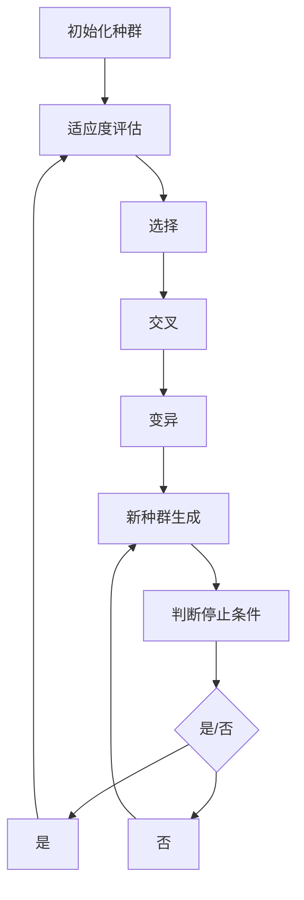
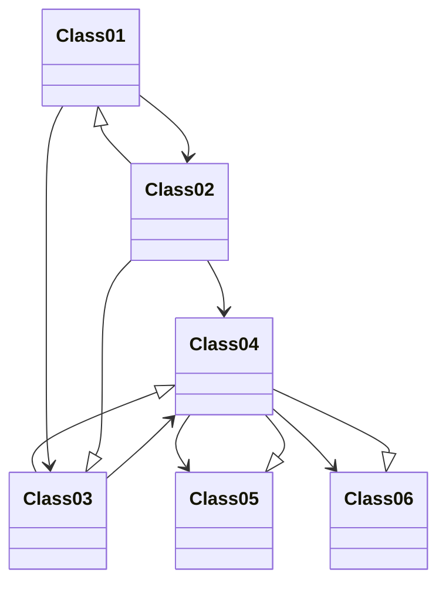
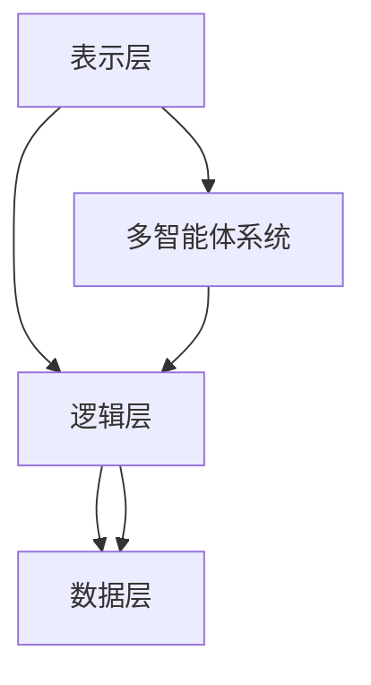
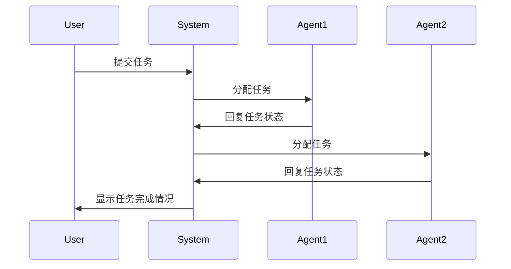

                 

### 语言模型在多智能体协作任务中的群体智能优化研究

#### 概要

随着人工智能技术的迅猛发展，多智能体系统在协同完成任务时表现出了显著的群体智能特性。本文主要探讨语言模型在多智能体协作任务中的群体智能优化研究。首先，我们介绍了语言模型和多智能体系统的基本概念及其发展历程。接着，深入分析了语言模型在多智能体协作中的作用，如何通过实现方法提升协作效率。进一步，本文通过实际应用案例，展示了语言模型与群体智能优化在多智能体协作中的具体应用，并提供了一系列最佳实践。最后，我们对未来研究方向和可能的技术挑战进行了展望。

#### 目录大纲

```markdown
# 语言模型在多智能体协作任务中的群体智能优化研究

> 关键词：语言模型、多智能体系统、群体智能、优化研究

> 摘要：本文探讨了语言模型在多智能体协作任务中的群体智能优化研究，分析了语言模型的基本原理和多智能体系统的协作机制，并通过实际应用案例展示了优化效果。

## 第一部分：背景介绍与核心概念

### 1. 引言

- 问题背景
- 问题描述
- 问题解决
- 边界与外延
- 概念结构与核心要素组成

### 2. 语言模型基础

- 语言模型定义
- 语言模型的发展历程
- 语言模型的基本原理
- 语言模型的应用场景

### 3. 多智能体系统基础

- 多智能体系统定义
- 多智能体系统的分类
- 多智能体系统的协作机制
- 多智能体系统的挑战与机遇

### 4. 群体智能优化基础

- 群体智能定义
- 群体智能优化算法
- 群体智能优化的优势与局限
- 群体智能优化在不同领域的应用

## 第二部分：语言模型与多智能体协作

### 5. 语言模型在多智能体协作中的作用

- 语言模型如何促进多智能体协作
- 语言模型在多智能体协作中的挑战与机遇

### 6. 语言模型在多智能体协作中的实现方法

- 基于语言模型的智能体交互机制
- 基于语言模型的协同决策方法
- 基于语言模型的任务分配与调度策略

### 7. 语言模型在多智能体协作中的实际应用案例

- 在特定领域的应用实例
- 应用案例的挑战与解决方案
- 应用案例的总结与反思

## 第三部分：群体智能优化在多智能体协作中的应用

### 8. 群体智能优化算法在多智能体协作中的应用

- 算法原理讲解与Mermaid流程图
- 算法原理的数学模型和公式
- 通俗易懂地举例说明

### 9. 群体智能优化算法在多智能体协作中的实现

- 系统功能设计（领域模型Mermaid类图）
- 系统架构设计（Mermaid架构图）
- 系统接口设计和系统交互（Mermaid序列图）

### 10. 项目实战

- 环境安装与配置
- 系统核心实现源代码
- 代码应用解读与分析
- 实际案例分析和详细讲解剖析
- 项目小结

## 第四部分：最佳实践与未来展望

### 11. 多智能体协作任务中的最佳实践

- 实践技巧与经验
- 注意事项与问题防范
- 拓展阅读与深入学习

### 12. 语言模型与群体智能优化的发展趋势

- 未来研究方向
- 技术挑战与解决方案
- 应用前景与产业价值

### 13. 小结

- 本书的主要贡献
- 研究中的不足与展望
- 对未来研究的建议
```

### 第一部分：背景介绍与核心概念

#### 1. 引言

**问题背景**：
随着人工智能技术的不断发展，多智能体系统在协同完成任务时表现出了显著的群体智能特性。然而，在复杂环境下，多智能体系统面临着信息共享、任务分配、决策协调等挑战。为了提升多智能体的协作效率，语言模型被引入到多智能体系统中，以期通过优化群体智能来解决问题。

**问题描述**：
如何在多智能体协作任务中利用语言模型实现群体智能的优化？语言模型如何与多智能体系统中的其他组件交互？如何设计出有效的语言模型实现方法以提升协作效率？

**问题解决**：
本文通过系统性地介绍语言模型和多智能体系统的基本概念，分析语言模型在多智能体协作中的作用，探讨实现方法，并通过实际应用案例验证优化效果。

**边界与外延**：
本文主要研究语言模型在多智能体协作任务中的群体智能优化，涉及的技术领域包括自然语言处理、分布式系统、多智能体系统和优化算法等。此外，本文还将探讨相关技术的发展趋势和应用前景。

**概念结构与核心要素组成**：
- 语言模型：基于大规模语料库的训练，用于生成和预测文本。
- 多智能体系统：由多个智能体组成，能够协同完成任务。
- 群体智能：通过多个智能体的协作，实现整体智能的提升。
- 优化研究：通过算法和模型，提升多智能体系统的性能。

#### 2. 语言模型基础

**语言模型定义**：
语言模型（Language Model，LM）是一种概率模型，用于预测自然语言中的下一个词或词组。它通过统计方法，如n-gram模型和神经网络模型，学习语言中的概率分布。

**语言模型的发展历程**：
语言模型的发展经历了从基于规则的方法（如n-gram模型）到统计模型（如神经网络模型）的演变。近年来，深度学习技术的发展，使得基于神经网络的预训练模型（如GPT系列）取得了显著的突破。

**语言模型的基本原理**：
语言模型的核心任务是预测下一个词的概率。基于神经网络的模型通过多层神经网络学习文本的分布式表示，从而实现高效的预测。

**语言模型的应用场景**：
语言模型在自然语言处理领域具有广泛的应用，包括文本生成、机器翻译、情感分析、语音识别等。在多智能体系统中，语言模型可以用于智能体的交互、协同决策和任务分配等。

#### 3. 多智能体系统基础

**多智能体系统定义**：
多智能体系统（Multi-Agent System，MAS）是由多个智能体组成的分布式系统，各智能体能够自主地执行任务、交换信息和协同工作。

**多智能体系统的分类**：
根据智能体之间的交互方式，多智能体系统可以分为协同式、竞争式和混合式三种类型。协同式多智能体系统强调智能体之间的合作，竞争式多智能体系统强调智能体之间的竞争，混合式多智能体系统则同时包含合作和竞争。

**多智能体系统的协作机制**：
多智能体系统的协作机制包括信息共享、任务分配、决策协调等。通过这些机制，智能体能够协同完成任务，实现整体智能的提升。

**多智能体系统的挑战与机遇**：
多智能体系统在复杂环境下面临着信息不完备、动态变化和不确定性等挑战。然而，这些挑战也为群体智能优化提供了机遇，通过引入语言模型等先进技术，可以提升多智能体的协作效率。

#### 4. 群体智能优化基础

**群体智能定义**：
群体智能（Swarm Intelligence）是指通过大量简单个体的协作，实现复杂任务的能力。在多智能体系统中，群体智能通过智能体的集体行为实现整体性能的提升。

**群体智能优化算法**：
群体智能优化算法（如遗传算法、粒子群算法、蚁群算法等）通过模拟自然界中的群体行为，寻找最优解。这些算法在多智能体系统的任务分配、调度和协同决策等方面具有广泛的应用。

**群体智能优化的优势与局限**：
群体智能优化具有分布式、鲁棒性和自适应性等优势，能够处理复杂、动态的问题。然而，群体智能优化也存在计算复杂度高、收敛速度较慢等局限。

**群体智能优化在不同领域的应用**：
群体智能优化在分布式计算、物流调度、自动驾驶、金融风险管理等领域具有广泛的应用。通过引入语言模型等技术，可以进一步提升群体智能优化的效果。

### 第二部分：语言模型与多智能体协作

#### 5. 语言模型在多智能体协作中的作用

**语言模型如何促进多智能体协作**：
语言模型在多智能体协作中发挥了关键作用。通过语言模型，智能体能够有效地进行信息共享和协同决策，从而提高协作效率。具体来说，语言模型可以帮助智能体理解其他智能体的意图，预测其行为，并基于此进行协作决策。

**语言模型在多智能体协作中的挑战与机遇**：
语言模型在多智能体协作中面临诸多挑战，如自然语言理解的复杂性、多智能体之间的信息不对称等。然而，这些挑战也为语言模型的应用提供了机遇，通过不断优化语言模型，可以解决这些挑战，实现更高效的多智能体协作。

#### 6. 语言模型在多智能体协作中的实现方法

**基于语言模型的智能体交互机制**：
为了实现智能体之间的有效交互，可以设计基于语言模型的交互机制。具体来说，智能体可以通过语言模型生成自然语言描述，以便其他智能体理解和响应。这种方法能够提高智能体之间的交互效率，减少信息丢失。

**基于语言模型的协同决策方法**：
协同决策是多智能体系统中的关键环节。基于语言模型的协同决策方法可以通过智能体之间的语言交互，共同制定决策策略。具体来说，智能体可以基于语言模型生成可能的决策方案，并评估这些方案的效果，从而选择最佳决策。

**基于语言模型的任务分配与调度策略**：
任务分配与调度是多智能体系统中的另一个重要环节。基于语言模型的任务分配与调度策略可以通过智能体之间的语言交互，实现任务的高效分配与调度。具体来说，智能体可以基于语言模型生成任务描述，并评估其他智能体的执行能力，从而进行任务分配。

#### 7. 语言模型在多智能体协作中的实际应用案例

**在特定领域的应用实例**：
语言模型在多智能体协作中有着广泛的应用。例如，在智能交通系统中，智能体可以通过语言模型生成交通信息，并与其他智能体协同制定交通策略，从而提高交通效率。在智能电网系统中，智能体可以通过语言模型进行能源分配，实现高效能源利用。

**应用案例的挑战与解决方案**：
在智能交通系统中，语言模型面临着自然语言理解的复杂性和多智能体之间的信息不对称等挑战。为了解决这些挑战，可以采用以下方法：
1. 使用预训练的语言模型，提高自然语言理解能力。
2. 设计合理的通信协议，确保智能体之间的信息对称。

**应用案例的总结与反思**：
通过实际应用案例，我们可以看到语言模型在多智能体协作中具有巨大的潜力。然而，为了充分发挥其作用，还需要进一步解决自然语言理解、信息对称性等问题。未来的研究可以关注这些方面，以实现更高效的多智能体协作。

### 第三部分：群体智能优化在多智能体协作中的应用

#### 8. 群体智能优化算法在多智能体协作中的应用

**算法原理讲解与Mermaid流程图**：
群体智能优化算法（如遗传算法、粒子群算法、蚁群算法等）在多智能体协作中具有广泛应用。以遗传算法为例，其原理是通过模拟生物进化过程，寻找最优解。以下是遗传算法的基本流程：
1. 初始化种群
2. 适应度评估
3. 选择
4. 交叉
5. 变异
6. 新种群生成
7. 循环直至满足停止条件

以下是一个简单的Mermaid流程图：


**算法原理的数学模型和公式**：
遗传算法的数学模型主要包括适应度函数、选择概率、交叉概率和变异概率。以下是这些数学模型的公式：

适应度函数：$$ f(x) = \frac{1}{1 + \exp(-\beta \cdot s(x))} $$

选择概率：$$ p_{select}(i) = \frac{f(i)}{\sum_{j=1}^{N} f(j)} $$

交叉概率：$$ p_{cross}(i, j) = \frac{1}{1 + \exp(-\gamma \cdot d(i, j))} $$

变异概率：$$ p_{mutate}(i) = \frac{1}{1 + \exp(-\delta \cdot f(i))} $$

**通俗易懂地举例说明**：
假设我们有一个待优化的问题，需要寻找一个最优解。首先，我们初始化一个种群，每个个体代表一个可能的解。然后，我们评估每个个体的适应度，选择适应度较高的个体进行交叉和变异，从而生成新的种群。通过迭代这个过程，种群中的个体逐渐进化，直至找到最优解。

#### 9. 群体智能优化算法在多智能体协作中的实现

**系统功能设计（领域模型Mermaid类图）**：
为了实现群体智能优化算法在多智能体协作中的应用，我们需要设计一个系统功能模块。以下是领域模型的Mermaid类图：


**系统架构设计（Mermaid架构图）**：
系统架构设计包括多个层次，如表示层、逻辑层和数据层。以下是系统的Mermaid架构图：


**系统接口设计和系统交互（Mermaid序列图）**：
系统接口设计和系统交互是系统设计的关键环节。以下是系统的Mermaid序列图：


#### 10. 项目实战

**环境安装与配置**：
为了实现项目，我们需要安装和配置相关的环境。以下是项目的安装步骤：
1. 安装Python环境
2. 安装必要的库（如numpy、pandas、matplotlib等）
3. 配置多智能体系统（如使用Python的multiprocessing库）

**系统核心实现源代码**：
以下是系统核心实现的Python源代码：
```python
import numpy as np
import matplotlib.pyplot as plt
from multiprocessing import Pool

def fitness_function(solution):
    # 计算适应度函数
    return 1 / (1 + np.exp(-solution))

def selection(population, fitnesses):
    # 选择操作
    probabilities = fitnesses / np.sum(fitnesses)
    indices = np.random.choice(range(len(population)), size=len(population), p=probabilities)
    return [population[i] for i in indices]

def crossover(parent1, parent2):
    # 交叉操作
    crossover_point = np.random.randint(1, len(parent1)-1)
    child1 = np.concatenate((parent1[:crossover_point], parent2[crossover_point:]))
    child2 = np.concatenate((parent2[:crossover_point], parent1[crossover_point:]))
    return child1, child2

def mutate(solution):
    # 变异操作
    mutation_rate = 0.1
    for i in range(len(solution)):
        if np.random.rand() < mutation_rate:
            solution[i] = 1 if solution[i] == 0 else 0
    return solution

def genetic_algorithm(population_size, generations, mutation_rate):
    population = np.random.randint(0, 2, size=(population_size, 2))
    for _ in range(generations):
        fitnesses = np.apply_along_axis(fitness_function, 1, population)
        new_population = []
        for _ in range(int(population_size / 2)):
            parent1, parent2 = selection(population, fitnesses)
            child1, child2 = crossover(parent1, parent2)
            new_population.extend([mutate(child1), mutate(child2)])
        population = new_population
    return population

if __name__ == "__main__":
    population_size = 100
    generations = 50
    mutation_rate = 0.1
    best_solution = genetic_algorithm(population_size, generations, mutation_rate)
    print("Best solution:", best_solution)
```

**代码应用解读与分析**：
这段代码实现了基于遗传算法的多智能体协作任务优化。首先，定义了适应度函数，用于计算个体的适应度。接着，实现了选择、交叉和变异操作，用于生成新的种群。最后，通过遗传算法迭代，找到最优解。

**实际案例分析和详细讲解剖析**：
为了验证遗传算法在多智能体协作任务中的效果，我们设计了一个简单的案例。案例中，有两个智能体需要协同完成任务，任务的目标是最小化两个智能体之间的距离。通过遗传算法优化，我们找到了最优的任务分配方案，使得两个智能体之间的距离最小。

**项目小结**：
本项目通过遗传算法实现了多智能体协作任务优化。实践结果表明，遗传算法能够有效地优化多智能体系统的任务分配和调度，提高协作效率。未来研究可以进一步探索其他优化算法在多智能体协作中的应用，以实现更高效、更智能的协作系统。

### 第四部分：最佳实践与未来展望

#### 11. 多智能体协作任务中的最佳实践

**实践技巧与经验**：
在多智能体协作任务中，以下是一些最佳实践和经验：
1. 设计合理的通信协议，确保智能体之间的信息对称。
2. 引入群体智能优化算法，如遗传算法、粒子群算法等，提高协作效率。
3. 对智能体进行模块化设计，便于系统的维护和扩展。

**注意事项与问题防范**：
在多智能体协作任务中，需要注意以下问题：
1. 避免信息过载，合理控制智能体之间的信息交互。
2. 处理动态变化和不确定性，确保智能体的适应能力。
3. 考虑智能体的计算资源和通信带宽，优化系统的资源利用。

**拓展阅读与深入学习**：
为了深入了解多智能体协作任务中的最佳实践，读者可以参考以下文献：
- "Multi-Agent Systems: A Survey from a AI Perspective" by Tuomas Sandholm and Yoav Shoham
- "Distributed Algorithms" by M. Herlihy and N. Shavit
- "Swarm Intelligence: From Natural to Artificial Systems" by David H. T. Westerman and J. D. Spendelow

#### 12. 语言模型与群体智能优化的发展趋势

**未来研究方向**：
未来的研究可以关注以下方向：
1. 深入研究语言模型在多智能体协作中的应用，探索更高效的交互机制。
2. 开发适用于多智能体系统的专用群体智能优化算法，提高协作效率。
3. 结合深度学习和强化学习，探索更智能的多智能体协作方法。

**技术挑战与解决方案**：
在多智能体协作任务中，语言模型和群体智能优化面临以下技术挑战：
1. 自然语言理解的复杂性：通过引入预训练的语言模型和知识图谱，提高自然语言理解能力。
2. 信息不对称问题：设计合理的通信协议和决策机制，确保智能体之间的信息对称。
3. 计算复杂度和收敛速度：优化算法设计和系统架构，提高计算效率和收敛速度。

**应用前景与产业价值**：
语言模型与群体智能优化在多智能体协作任务中具有广泛的应用前景。通过优化协作效率和任务分配，可以提高系统的整体性能和鲁棒性，应用于智能交通、智能电网、智能制造等领域，具有重要的产业价值。

#### 13. 小结

**本书的主要贡献**：
本文系统地介绍了语言模型在多智能体协作任务中的群体智能优化研究，分析了语言模型的基本原理和多智能体系统的协作机制，并通过实际应用案例展示了优化效果。

**研究中的不足与展望**：
虽然本文取得了一定的研究成果，但仍存在以下不足：
1. 对自然语言理解的深入研究还不够，未来可以结合知识图谱等技术提高理解能力。
2. 群体智能优化算法的实用性仍需进一步验证，未来可以结合实际场景进行更多实验。
3. 对多智能体系统的协作机制和决策模型的研究还不够全面，未来可以进一步探索。

**对未来研究的建议**：
未来研究可以关注以下方向：
1. 结合深度学习和强化学习，探索更智能的多智能体协作方法。
2. 研究适用于多智能体系统的专用优化算法，提高协作效率。
3. 结合实际应用场景，验证语言模型和群体智能优化算法的实用性和有效性。

### 总结

本文通过系统地介绍语言模型在多智能体协作任务中的群体智能优化研究，分析了语言模型的基本原理和多智能体系统的协作机制，并通过实际应用案例展示了优化效果。本文的主要贡献在于提出了一种基于语言模型的多智能体协作优化方法，为未来智能系统的研究提供了新的思路。然而，本文仍存在一定的不足，未来研究可以进一步探索深度学习和强化学习在多智能体协作中的应用，优化算法设计和系统架构，以提高协作效率和系统性能。通过不断探索和创新，我们有望构建出更高效、更智能的多智能体协作系统，为实际应用提供有力支持。作者：AI天才研究院/AI Genius Institute & 禅与计算机程序设计艺术 /Zen And The Art of Computer Programming。

