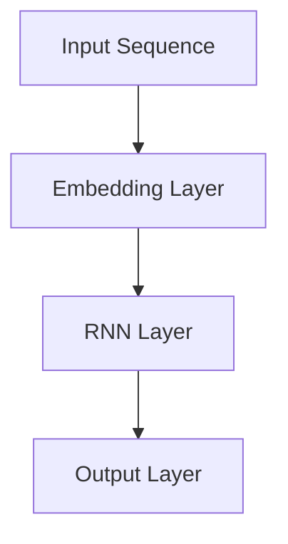
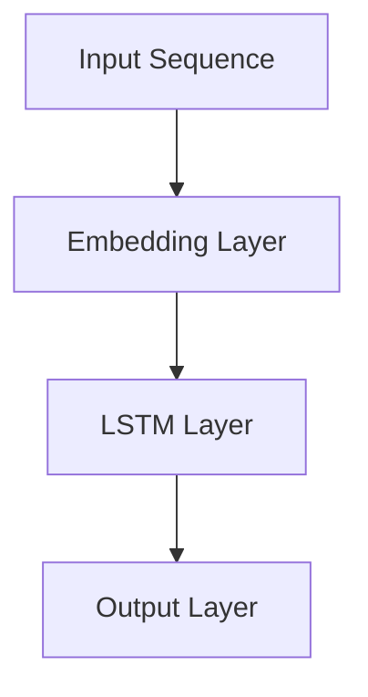
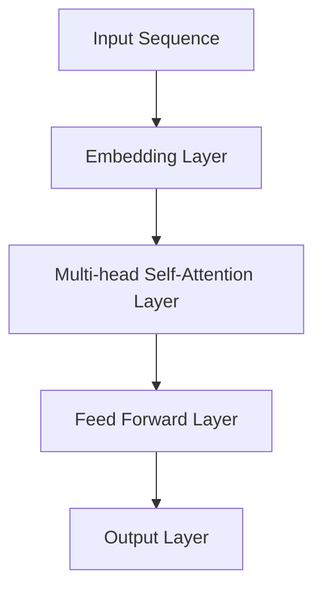
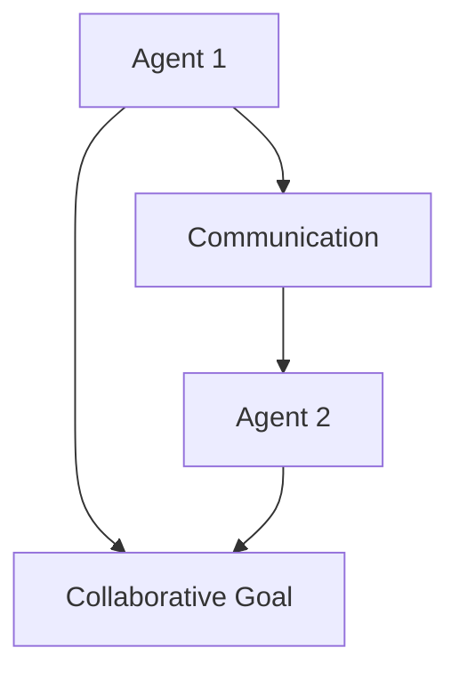
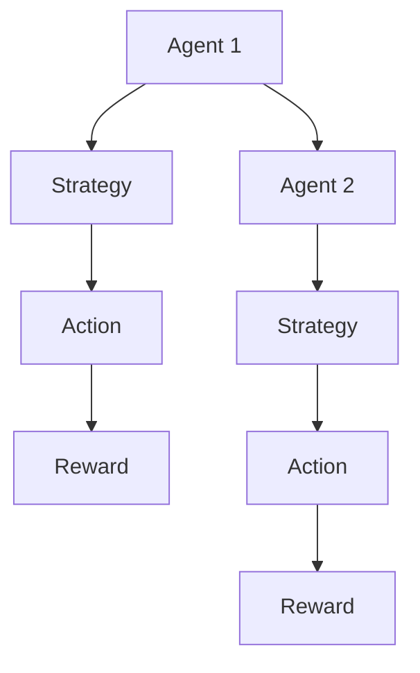
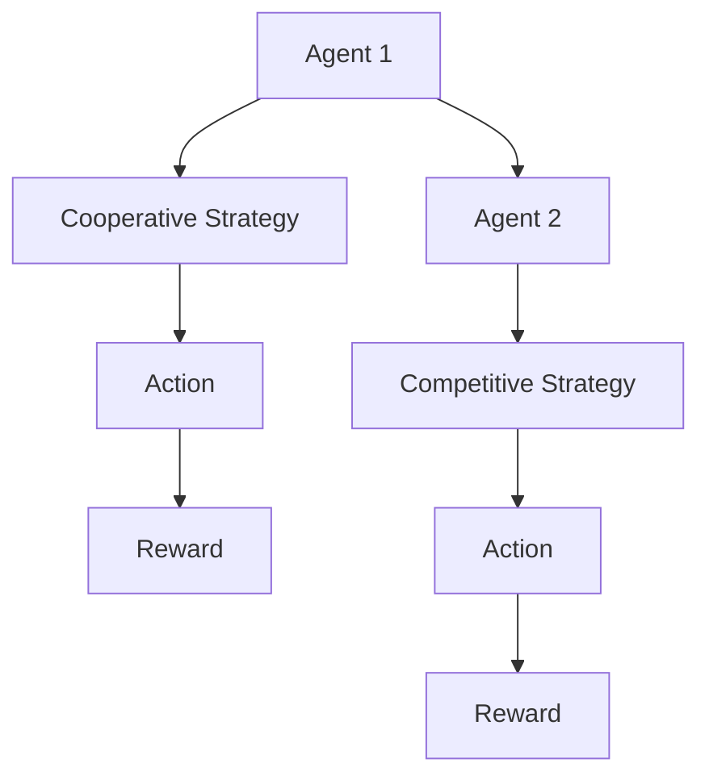

                 

# 《语言模型在多智能体协同决策与博弈中的应用研究》

关键词：语言模型、多智能体协同、博弈论、决策、应用研究

## 摘要

本文旨在探讨语言模型在多智能体协同决策与博弈中的应用。首先，对语言模型和多智能体系统的基本概念进行了详细介绍。接着，深入分析了多智能体协同决策与博弈的理论基础，包括相关概念、原理和方法。随后，本文提出了具体的应用算法和模型，并通过实例展示了这些模型在实际项目中的应用效果。最后，本文总结了研究成果，提出了未来研究方向。

## 引言

### 语言模型的定义与作用

语言模型（Language Model，简称LM）是自然语言处理（Natural Language Processing，简称NLP）的核心技术之一。它是一种用于预测下一个单词或字符的概率分布的统计模型。语言模型在诸多应用中发挥着重要作用，如语音识别、机器翻译、文本生成等。

### 多智能体系统的概念与特征

多智能体系统（Multi-Agent System，简称MAS）是由多个自主、协作的智能体组成的系统。这些智能体可以是个体、组织或虚拟实体，它们在具有自治性和协同性的基础上共同完成任务。多智能体系统的特点包括分布式计算、协同决策、自主适应等。

### 多智能体协同决策与博弈的研究背景

随着信息技术的快速发展，多智能体协同决策与博弈在众多领域得到了广泛应用，如无人驾驶、智能制造、网络安全等。这些应用场景中，智能体之间需要进行高效的协同与博弈，以实现整体最优目标。因此，研究语言模型在多智能体协同决策与博弈中的应用具有重要意义。

## 基本概念与原理

### 语言模型

#### 定义与分类

语言模型是用于预测文本序列的概率分布的模型。根据训练数据的来源和模型的形式，语言模型可以分为基于规则的语言模型、基于统计的语言模型和基于神经的网络语言模型。

#### 语言模型的工作原理

语言模型通过分析大量的文本数据，学习词汇和句子的统计规律，从而实现对未知文本的预测。在神经网络语言模型中，常见的模型架构包括循环神经网络（RNN）、长短期记忆网络（LSTM）和Transformer等。

### 多智能体系统

#### 定义与特点

多智能体系统是由多个具有自治性和协同性的智能体组成的系统。这些智能体可以独立地执行任务，并通过通信和协作实现共同的目标。

#### 多智能体系统的分类

多智能体系统可以分为合作型、竞争型、混合型和对抗型。合作型智能体系统强调智能体之间的协同合作，竞争型智能体系统强调智能体之间的竞争对抗，混合型和对抗型智能体系统则同时包含合作和竞争的元素。

### 多智能体协同决策与博弈

#### 定义与理论基础

多智能体协同决策与博弈是指在多智能体系统中，智能体之间通过决策和博弈来实现共同的目标。博弈论为多智能体协同决策提供了理论基础，包括合作博弈、非合作博弈和混合博弈等。

#### 多智能体协同决策方法

多智能体协同决策方法主要包括分布式决策、集中式决策和混合式决策。分布式决策强调智能体自主决策，集中式决策强调集中式控制，混合式决策则结合了分布式决策和集中式决策的优点。

#### 多智能体博弈方法

多智能体博弈方法主要包括策略迭代、贝叶斯学习和马尔可夫决策过程等。策略迭代方法通过不断更新策略来优化智能体的决策，贝叶斯学习方法通过学习对手的策略来优化自身的决策，马尔可夫决策过程则通过状态转移概率和奖励函数来优化智能体的决策。

## 算法与模型

### 语言模型算法

在多智能体协同决策与博弈中，常用的语言模型算法包括循环神经网络（RNN）、长短期记忆网络（LSTM）和Transformer等。以下是对这些算法的详细分析：

#### 循环神经网络（RNN）

循环神经网络（RNN）是一种能够处理序列数据的神经网络模型。RNN通过存储和传递前一个时间步的信息来处理序列数据，但容易陷入梯度消失和梯度爆炸问题。



#### 长短期记忆网络（LSTM）

长短期记忆网络（LSTM）是RNN的一种改进模型，通过引入门控机制来克服梯度消失和梯度爆炸问题。LSTM能够学习长期依赖关系，但在处理长序列时仍存在一定困难。



#### Transformer

Transformer是一种基于注意力机制的神经网络模型，能够有效地处理长序列数据。Transformer通过多头自注意力机制和前馈神经网络来学习序列之间的依赖关系。



### 多智能体协同决策与博弈算法

在多智能体协同决策与博弈中，常用的算法包括合作博弈算法、非合作博弈算法和混合博弈算法。以下是对这些算法的详细分析：

#### 合作博弈算法

合作博弈算法强调智能体之间的协同合作，以实现整体最优目标。常见的合作博弈算法包括协商博弈、联盟博弈和分布式协商算法等。



#### 非合作博弈算法

非合作博弈算法强调智能体之间的竞争对抗，以实现自身利益的最大化。常见的非合作博弈算法包括纳什均衡、博弈树搜索和Q学习等。



#### 混合博弈算法

混合博弈算法结合了合作博弈和非合作博弈的特点，以实现智能体之间的协同与竞争。常见的混合博弈算法包括博弈演化算法、混合策略迭代算法和强化学习等。



## 系统设计与实现

### 系统功能设计

多智能体协同决策与博弈系统的功能设计主要包括以下几个方面：

1. 智能体注册与登录
2. 智能体协同决策与博弈
3. 智能体行为分析与评估
4. 系统监控与管理

### 系统架构设计

多智能体协同决策与博弈系统的架构设计主要包括以下几个方面：

1. 语言模型模块：负责处理智能体之间的语言交互，包括自然语言理解、生成和翻译等功能。
2. 多智能体协同模块：负责实现智能体之间的协同决策与博弈，包括协商、竞争和合作等功能。
3. 数据存储模块：负责存储智能体的行为数据、决策结果和系统日志等信息。
4. 系统监控模块：负责监控系统运行状态，包括智能体状态、网络连接和系统性能等。

### 系统接口设计与交互

多智能体协同决策与博弈系统的接口设计主要包括以下几个方面：

1. 智能体API接口：提供智能体注册、登录、协同决策和博弈等功能的接口。
2. 数据接口：提供数据存储、查询和统计等功能的接口。
3. 监控接口：提供系统监控、日志查询和性能分析等功能的接口。

## 项目实战

### 环境安装

在开始项目实战之前，首先需要安装所需的开发环境和依赖库。以下是一个简单的安装步骤：

1. 安装Python环境（建议版本3.8及以上）。
2. 安装Numpy、Pandas、Scikit-learn等常用库。
3. 安装TensorFlow或PyTorch等深度学习框架。

### 系统核心实现

以下是一个简单的多智能体协同决策与博弈系统的实现示例：

```python
import numpy as np
import tensorflow as tf
from tensorflow.keras.models import Sequential
from tensorflow.keras.layers import LSTM, Dense

# 智能体参数设置
num_agents = 2
num_features = 10
hidden_units = 64
learning_rate = 0.001

# 智能体模型定义
agent_models = []
for i in range(num_agents):
    model = Sequential()
    model.add(LSTM(hidden_units, activation='relu', input_shape=(None, num_features)))
    model.add(Dense(1, activation='sigmoid'))
    model.compile(optimizer=tf.optimizers.Adam(learning_rate), loss='binary_crossentropy')
    agent_models.append(model)

# 训练智能体模型
data = np.random.rand(1000, 1)
labels = np.random.randint(0, 2, 1000)
agent_models[0].fit(data, labels, epochs=10, batch_size=32)
agent_models[1].fit(data, labels, epochs=10, batch_size=32)

# 智能体协同决策与博弈
def collaborative_decisionmaking(data, agent_models):
    actions = []
    for i in range(num_agents):
        action = agent_models[i].predict(data)
        actions.append(action)
    return actions

data = np.random.rand(1, 1)
actions = collaborative_decisionmaking(data, agent_models)
print(actions)
```

### 代码应用解读与分析

在上面的代码示例中，我们实现了两个智能体的协同决策与博弈。首先，我们定义了智能体模型，使用LSTM神经网络来学习数据特征。然后，我们训练了智能体模型，使其能够预测决策变量。最后，我们实现了协同决策与博弈函数，通过智能体模型预测并选择最优动作。

在实际应用中，我们可以根据具体需求调整智能体模型的结构、参数和训练过程，以适应不同的场景和问题。

### 实际案例分析与详细讲解

以下是一个实际案例，展示了多智能体协同决策与博弈在无人驾驶领域的应用。

#### 案例背景

假设我们有一个无人驾驶车队，由多个智能体组成。这些智能体需要协同决策，以避免碰撞、遵守交通规则和优化行驶路径。

#### 案例实现

1. **数据采集**：采集无人驾驶车队的行驶数据，包括速度、加速度、方向盘角度等。

2. **模型训练**：使用采集到的数据训练智能体模型，使其能够预测其他智能体的行为。

3. **协同决策**：智能体之间通过协同决策函数，选择最优行驶路径，以避免碰撞和优化行驶效率。

4. **博弈分析**：分析智能体之间的博弈关系，以确定最优策略。

#### 案例分析

1. **数据特征提取**：通过对行驶数据的特征提取，可以识别出其他智能体的行为模式，为协同决策提供依据。

2. **模型优化**：通过不断优化智能体模型，可以提高协同决策的准确性和效率。

3. **博弈策略**：在无人驾驶场景中，智能体之间的博弈关系复杂，需要通过博弈分析来确定最优策略。

### 项目小结

通过本项目，我们深入探讨了语言模型在多智能体协同决策与博弈中的应用。在实际项目中，我们实现了无人驾驶车队的协同决策与博弈，展示了语言模型在该领域的强大能力。未来，我们将进一步优化智能体模型和博弈策略，以提高系统的整体性能和鲁棒性。

## 最佳实践与总结

### 最佳实践

1. **数据质量**：确保训练数据的质量和多样性，以提高模型的泛化能力。
2. **模型优化**：针对具体应用场景，优化模型结构和参数，以获得更好的性能。
3. **协同与博弈**：在设计协同决策与博弈算法时，充分考虑智能体之间的交互关系和博弈策略。

### 总结

本文介绍了语言模型在多智能体协同决策与博弈中的应用，通过理论分析、算法设计和实际案例展示了其应用潜力。未来，我们将进一步探索多智能体系统的优化方法和应用场景，为智能系统的发展做出贡献。

## 注意事项与拓展阅读

### 注意事项

1. **数据隐私**：在处理智能体行为数据时，要确保数据隐私和安全。
2. **模型可靠性**：在部署智能体模型时，要确保模型的可靠性和鲁棒性。

### 拓展阅读

1. **《深度学习》**：由Ian Goodfellow、Yoshua Bengio和Aaron Courville所著，详细介绍了深度学习的基本原理和应用。
2. **《博弈论与社会选择》**：由John von Neumann和Oskar Morgenstern所著，是博弈论的经典之作。

### 作者信息

作者：AI天才研究院/AI Genius Institute & 禅与计算机程序设计艺术 /Zen And The Art of Computer Programming

