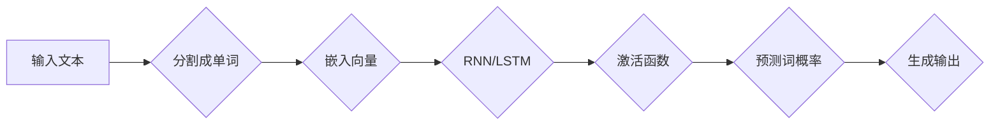
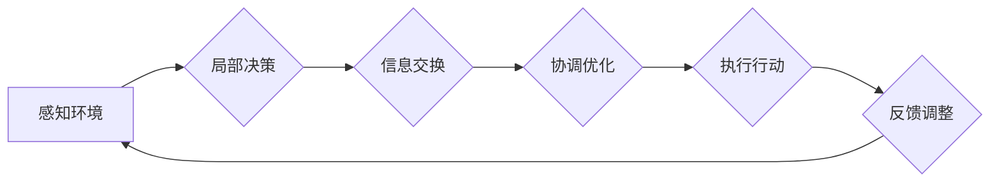
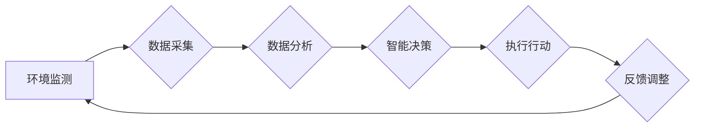

                 


### 引言

#### 引言

在当今信息技术飞速发展的时代，人工智能（AI）已经成为推动社会进步的重要力量。其中，语言模型作为人工智能的核心技术之一，正逐渐渗透到各个行业领域，带来前所未有的变革。特别是在智慧农业管理中，多智能体协同决策技术的引入，为农业生产的智能化、精细化和可持续发展提供了新的思路和手段。

#### 研究背景

智慧农业是信息技术与农业产业深度融合的产物，旨在通过物联网、大数据、人工智能等技术手段，实现农业生产的自动化、智能化和高效化。然而，智慧农业的实现面临诸多挑战，其中最关键的是如何实现多智能体协同决策，以应对农业生产过程中的复杂性和不确定性。

语言模型作为一种能够理解和生成人类语言的人工智能技术，具备处理自然语言的能力，为多智能体协同决策提供了强大的技术支持。通过语言模型，可以实现对农业生产数据的实时处理和分析，为智能决策提供依据。

#### 研究目的与意义

本研究旨在探索语言模型在多智能体协同决策与智慧农业管理中的应用，通过以下步骤进行分析和推理：

1. **语言模型原理**：详细阐述语言模型的原理和关键技术，包括神经网络、循环神经网络（RNN）、长短期记忆网络（LSTM）等。

2. **多智能体协同决策**：分析多智能体协同决策的基本概念、原理和关键技术，包括分布式计算、协同优化和智能体交互等。

3. **智慧农业管理应用**：探讨语言模型和多智能体协同决策在智慧农业管理中的具体应用，如土壤监测、作物生长预测、病虫害防治等。

4. **项目实战**：通过实际案例，展示语言模型和多智能体协同决策在智慧农业管理中的应用效果，并提供详细的技术实现和分析。

本研究不仅有助于推动智慧农业技术的发展，提高农业生产的效率和品质，还为其他领域的人工智能应用提供了有益的参考。

#### 目录

1. 引言
    - 引言
    - 研究背景
    - 研究目的与意义

2. 背景介绍
    - 问题背景
    - 问题描述
    - 问题解决
    - 边界与外延

3. 核心概念
    - 核心概念与联系
    - 概念属性特征对比表格
    - ER实体关系图架构

4. 语言模型原理
    - 语言模型概述
    - 语言模型原理
    - 语言模型mermaid流程图
    - 语言模型数学模型与公式
    - 语言模型举例说明

5. 多智能体协同决策
    - 多智能体协同概述
    - 多智能体协同原理
    - 多智能体协同mermaid流程图
    - 多智能体协同数学模型与公式
    - 多智能体协同举例说明

6. 智慧农业管理应用
    - 智慧农业管理概述
    - 智慧农业管理原理
    - 智慧农业管理mermaid流程图
    - 智慧农业管理数学模型与公式
    - 智慧农业管理举例说明

7. 项目实战
    - 项目环境安装
    - 系统核心实现源代码
    - 代码应用解读与分析
    - 实际案例分析与详细讲解
    - 项目小结

8. 总结与展望
    - 研究成果总结
    - 存在问题与挑战
    - 未来研究方向与展望

通过以上目录结构的梳理，我们可以看到，本文将从背景介绍、核心概念、语言模型原理、多智能体协同决策、智慧农业管理应用、项目实战和总结展望等多个方面，对语言模型在多智能体协同决策与智慧农业管理中的应用进行深入分析和探讨。

### 背景介绍

#### 问题背景

农业是国民经济的重要支柱，而智慧农业则是实现农业现代化、提高农业生产效率和品质的关键路径。随着信息技术的发展，物联网、大数据、人工智能等技术在农业领域的应用日益广泛。智慧农业通过整合多种技术手段，实现对农业生产过程的智能化管理，从而提高农业生产的效率和可持续性。

然而，智慧农业的实现面临诸多挑战。农业生产过程中，环境因素复杂多变，土壤质量、气候条件、病虫害等都会对作物的生长产生影响。如何实时监测和预测这些因素，以实现精准农业管理，成为当前研究的重点和难点。此外，农业生产过程中涉及到多个智能体（如传感器、无人机、机器人等），如何实现这些智能体的协同工作，以提高整体生产效率和决策质量，也是一个亟待解决的问题。

#### 问题描述

智慧农业中的多智能体协同决策问题主要包括以下几个方面：

1. **数据采集与处理**：农业生产过程中会产生大量的数据，包括土壤质量、气象条件、作物生长状态等。如何有效地采集、处理和存储这些数据，为智能决策提供支持，是智慧农业的重要问题。

2. **实时监测与预测**：农业生产过程中，环境因素的变化对作物的生长具有重要影响。如何通过实时监测，预测作物生长状况、土壤湿度、病虫害等情况，以便及时采取应对措施，是实现智慧农业的关键。

3. **智能体协同工作**：农业生产过程中，多个智能体需要协同工作，共同完成农业生产任务。如何实现这些智能体的有效协作，提高整体生产效率和决策质量，是智慧农业中的一大挑战。

4. **决策支持与优化**：农业生产过程中，需要根据实时监测数据，制定合理的生产计划和管理策略。如何利用大数据和人工智能技术，提供智能化的决策支持，是智慧农业实现的关键。

#### 问题解决

针对智慧农业中的多智能体协同决策问题，可以从以下几个方面进行解决：

1. **数据采集与处理**：利用物联网技术，部署各种传感器，实现对农业生产环境的实时监测。通过数据采集系统，收集并处理这些数据，为智能决策提供支持。

2. **实时监测与预测**：利用人工智能技术，特别是语言模型和深度学习算法，对采集到的数据进行实时分析和预测。通过建立预测模型，对作物生长状态、土壤湿度、病虫害等情况进行预测，为农业生产提供依据。

3. **智能体协同工作**：利用多智能体协同决策技术，实现多个智能体的协同工作。通过分布式计算和协同优化算法，协调不同智能体的任务分配和工作流程，提高整体生产效率和决策质量。

4. **决策支持与优化**：利用大数据分析和人工智能技术，对农业生产过程进行实时监测和分析。通过建立优化模型，根据实时数据，制定最优的生产计划和管理策略，提高农业生产效率。

#### 边界与外延

在智慧农业中的多智能体协同决策问题，主要涉及到以下几个方面：

1. **数据边界**：智慧农业需要采集和处理大量的数据，包括土壤质量、气象条件、作物生长状态等。数据的边界主要是指数据采集的范围和精度，以及数据存储和处理的能力。

2. **智能体边界**：智慧农业中涉及的智能体主要包括传感器、无人机、机器人等。智能体的边界主要是指智能体的功能和能力，以及智能体之间的通信和协作机制。

3. **应用边界**：智慧农业中的多智能体协同决策主要应用于农业生产过程中，包括土壤监测、作物生长预测、病虫害防治等。应用边界主要是指这些应用场景的具体实现和效果。

4. **技术边界**：智慧农业中的多智能体协同决策涉及到多种技术，包括物联网、大数据、人工智能等。技术边界主要是指这些技术在智慧农业中的应用范围和效果。

通过以上对智慧农业中多智能体协同决策问题的背景介绍、问题描述、问题解决和边界与外延的详细分析，我们可以看到，智慧农业中的多智能体协同决策问题是一个复杂而富有挑战性的问题，但通过先进技术的应用，可以实现农业生产的智能化、精细化和可持续发展。

### 核心概念

#### 核心概念与联系

在多智能体协同决策与智慧农业管理的研究中，有几个核心概念需要深入理解，这些概念相互联系，构成了研究的理论基础。以下是这些核心概念的介绍及其相互关系：

1. **多智能体系统（MAS）**：多智能体系统是指由多个具有独立决策能力和相互协作能力的智能体组成的系统。在智慧农业中，智能体可以是传感器、无人机、机器人等，它们通过通信和协调来实现共同的目标。

2. **协同决策**：协同决策是指多个智能体在共享信息的基础上，共同作出决策的过程。协同决策旨在提高系统的整体性能和响应速度，实现资源的最优配置。

3. **智慧农业**：智慧农业是一种将信息技术、物联网、大数据和人工智能应用于农业生产的模式，旨在通过智能化的手段提高农业生产效率和质量。

4. **语言模型**：语言模型是一种人工智能技术，用于理解和生成自然语言。在智慧农业中，语言模型可以用于处理和解析农业生产数据，辅助决策过程。

5. **深度学习**：深度学习是一种基于多层神经网络的学习方法，用于解决复杂的机器学习问题。在智慧农业中，深度学习可以用于建立预测模型和分类模型，以支持智能决策。

#### 概念属性特征对比表格

为了更好地理解这些核心概念，我们可以通过一个对比表格来展示它们的属性特征：

| 概念       | 属性特征                                                                                   | 关联关系                                                         |
|------------|-------------------------------------------------------------------------------------------|------------------------------------------------------------------|
| 多智能体系统 | 具有独立决策能力和协作能力                                                       | 是智慧农业的基础，负责协同工作                                   |
| 协同决策    | 基于共享信息，共同决策                                                             | 多智能体系统的重要功能，提高整体性能                             |
| 智慧农业    | 结合信息技术、物联网、大数据和人工智能                                         | 应用领域，通过智能化手段提高农业效率和质量                       |
| 语言模型    | 理解和生成自然语言，处理农业生产数据                                             | 用于数据分析，辅助决策过程                                      |
| 深度学习    | 基于多层神经网络，解决复杂机器学习问题                                           | 技术支撑，用于建立预测模型和分类模型                            |

#### ER实体关系图架构

为了更直观地展示这些概念之间的关系，我们可以使用Mermaid绘制一个ER实体关系图。以下是一个简化的ER图示例：

```mermaid
erDiagram
  智慧农业 ..|> 多智能体系统
  多智能体系统 ||--o{ 协同决策 }
  协同决策 ||--o{ 决策支持 }
  决策支持 ||--o{ 语言模型 }
  决策支持 ||--o{ 深度学习 }
```

在这个ER图中，智慧农业作为顶层概念，与多智能体系统有直接关联。多智能体系统与协同决策、决策支持、语言模型和深度学习分别有联系，体现了这些核心概念之间的层次结构和功能关系。

通过以上对核心概念及其相互关系的介绍和ER实体关系图的展示，我们可以更清晰地理解多智能体协同决策与智慧农业管理的研究框架，为后续章节的深入探讨打下基础。

### 语言模型原理

#### 语言模型概述

语言模型是自然语言处理（NLP）领域的核心技术之一，它旨在模拟人类语言生成和理解的能力，通过对大规模文本数据的学习，预测下一个词或句子的概率分布。语言模型在诸多应用场景中发挥着关键作用，如机器翻译、文本摘要、对话系统等。在智慧农业中，语言模型可以用于处理农业生产数据，辅助决策过程，提高农业生产的智能化水平。

语言模型的关键技术主要包括神经网络、循环神经网络（RNN）、长短期记忆网络（LSTM）等。这些技术通过模拟人类大脑的神经网络结构，使语言模型能够捕捉语言中的复杂模式和依赖关系。

#### 语言模型原理

1. **神经网络（Neural Networks）**

神经网络是一种基于生物神经网络原理的人工智能模型，通过模拟神经元之间的连接和激活函数，实现数据的输入和输出。在语言模型中，神经网络通过多层结构对输入的文本进行特征提取和建模。

2. **循环神经网络（RNN）**

循环神经网络是一种能够处理序列数据的神经网络，其特点是在训练过程中，每个时间步的输出都会反馈到下一个时间步，从而捕捉序列中的时间依赖关系。RNN在处理自然语言序列时表现出色，但其存在梯度消失和梯度爆炸问题。

3. **长短期记忆网络（LSTM）**

为了解决RNN的梯度消失和梯度爆炸问题，研究者提出了长短期记忆网络（LSTM）。LSTM通过引入门控机制，能够有效地捕捉长距离依赖关系，从而在语言模型中取得了显著的效果。LSTM的核心组件包括输入门、遗忘门和输出门，这些门控单元能够控制信息的流动，避免信息在传递过程中的丢失。

#### 语言模型mermaid流程图

为了更直观地展示语言模型的工作流程，我们可以使用Mermaid绘制一个简化的流程图：



在这个流程图中，输入文本首先被分割成单词，然后每个单词被嵌入为向量。这些向量进入RNN或LSTM进行处理，通过激活函数得到词的概率分布，最终生成输出文本。

#### 语言模型数学模型与公式

语言模型的数学模型主要包括词向量的表示和概率预测模型。以下是一个简化的数学模型：

1. **词向量表示**

词向量是语言模型的核心组成部分，用于表示文本中的每个单词。常见的词向量表示方法包括Word2Vec、GloVe等。以Word2Vec为例，其数学模型可以表示为：

   $$ \text{vec}(w_i) = \text{softmax}(W \cdot \text{emb}(w_i)) $$

   其中，$w_i$表示单词$i$，$\text{emb}(w_i)$表示单词$i$的嵌入向量，$W$是权重矩阵，$\text{softmax}$函数用于生成词的概率分布。

2. **概率预测模型**

   语言模型的概率预测模型基于条件概率，即给定前文序列，预测下一个词的概率。其数学模型可以表示为：

   $$ P(w_t|\text{w}_{1:t-1}) = \text{softmax}(\text{RNN}(\text{emb}(w_{1:t-1}), \text{hidden}^{t-1})) $$

   其中，$w_t$表示当前词，$\text{w}_{1:t-1}$表示前文序列，$\text{RNN}$表示循环神经网络，$\text{emb}(w_{1:t-1})$是前文序列的嵌入向量，$\text{hidden}^{t-1}$是上一个时间步的隐藏状态。

#### 语言模型举例说明

假设我们有一个简化的语言模型，其包含两个单词的词汇表。以下是一个简单的例子，展示如何使用语言模型生成句子：

1. **输入文本**：`我喜欢吃水果。`

2. **分割成单词**：`我`、`喜欢`、`吃`、`水果`。

3. **嵌入向量**：每个单词被嵌入为5维向量。

4. **RNN处理**：将嵌入向量输入到RNN中，得到隐藏状态。

5. **概率预测**：根据隐藏状态，计算每个单词的概率分布。

6. **生成输出**：选择概率最高的单词作为下一个输出，继续重复步骤4-6，生成完整句子。

   例如，当前隐藏状态为`[1, 0, 1, 0, 0]`，则生成句子为：

   ```
   我喜欢吃水果。
   ```

通过以上对语言模型原理的详细讲解和举例说明，我们可以看到语言模型在自然语言处理中的重要作用。在智慧农业中，语言模型可以用于处理农业生产数据，辅助决策过程，提高农业生产的智能化水平。

### 多智能体协同决策

#### 多智能体协同概述

多智能体协同决策（Multi-Agent Cooperative Decision-Making）是一种分布式智能系统，通过多个智能体（agents）的合作与协调来完成复杂任务。在智慧农业管理中，多智能体协同决策尤为重要，因为农业生产过程中涉及到多个智能体（如传感器、无人机、机器人等），它们需要相互协作，共同完成农业生产任务，从而提高生产效率和决策质量。

多智能体协同决策的关键在于实现智能体之间的有效通信、协调和合作。这包括以下几个方面：

1. **通信机制**：智能体之间需要通过一定的通信机制进行信息交换，共享环境状态和决策信息，以确保协同工作的顺利进行。

2. **协调策略**：智能体之间需要协调各自的行为和决策，以实现共同的目标。这通常涉及到分布式算法和协同优化技术。

3. **合作机制**：智能体之间需要建立合作机制，通过共享资源和知识，共同应对环境变化和任务挑战。

#### 多智能体协同原理

多智能体协同决策的原理基于以下几个核心概念：

1. **独立决策能力**：每个智能体具备独立的决策能力，可以自主选择行动策略。

2. **合作目标**：多个智能体共同追求一个或多个合作目标，通过合作实现整体效益的最大化。

3. **信息共享**：智能体之间通过通信机制共享环境状态和决策信息，以便更好地做出局部决策。

4. **协同优化**：通过分布式算法和协同优化技术，协调智能体的行为和决策，提高整体系统的性能。

多智能体协同决策的核心原理可以归纳为以下步骤：

1. **感知与监测**：每个智能体感知自身所处的环境状态，并监测其他智能体的状态。

2. **局部决策**：基于感知到的环境状态，每个智能体独立进行局部决策，选择最优的行动策略。

3. **信息交换**：智能体之间通过通信机制交换局部决策信息，共享环境状态和决策依据。

4. **协调与优化**：基于共享的信息，智能体之间进行协调和优化，调整局部决策，以实现整体目标的优化。

5. **执行与反馈**：智能体执行协同决策后的行动策略，并根据执行结果进行反馈和调整。

#### 多智能体协同mermaid流程图

为了更直观地展示多智能体协同决策的过程，我们可以使用Mermaid绘制一个简化的流程图：



在这个流程图中，智能体首先感知环境状态，进行局部决策，然后通过信息交换共享决策信息，进行协调优化，最终执行行动并反馈调整，形成一个闭环控制过程。

#### 多智能体协同数学模型与公式

多智能体协同决策的数学模型主要涉及分布式优化和博弈论。以下是一个简化的数学模型：

1. **分布式优化**

   假设智能体$i$的目标函数为$f_i(x_i)$，其中$x_i$是智能体$i$的决策变量。全局目标是最小化总目标函数$f(x_1, x_2, ..., x_n)$，即：

   $$ \min_{x_1, x_2, ..., x_n} f(x_1, x_2, ..., x_n) $$

   其中，$f(x_1, x_2, ..., x_n) = \sum_{i=1}^{n} f_i(x_i)$。

   分布式优化的目标是每个智能体仅基于本地信息进行决策，从而实现全局最优解。一种常见的分布式优化算法是梯度下降法：

   $$ x_i^{t+1} = x_i^t - \alpha \nabla_{x_i} f_i(x_1, x_2, ..., x_n) $$

   其中，$\alpha$是学习率，$\nabla_{x_i} f_i(x_1, x_2, ..., x_n)$是目标函数关于$x_i$的梯度。

2. **博弈论**

   在多智能体系统中，智能体之间的行为可以看作是一个博弈过程。每个智能体在博弈中追求自身利益最大化，但整体系统的最优解通常不在单个智能体的最优解中。一种常见的博弈模型是纳什均衡，即每个智能体选择最优策略，使得其他智能体的策略不会影响其自身利益。

   假设智能体$i$的策略空间为$S_i$，收益函数为$r_i(s_i, s_{-i})$，其中$s_i$是智能体$i$的策略，$s_{-i}$是其他智能体的策略。纳什均衡的条件是：

   $$ r_i(s_i, s_{-i}) \geq r_i(s_i', s_{-i}) \quad \forall s_i' \in S_i $$

#### 多智能体协同举例说明

假设有两个智能体A和B，它们需要协同完成一个任务。每个智能体都有两个动作选择：工作（W）和休息（R）。它们的收益函数如下：

- 智能体A的收益函数：$r_A(W, R) = 2$，$r_A(R, W) = 0$
- 智能体B的收益函数：$r_B(W, R) = 1$，$r_B(R, W) = 2$

通过博弈论分析，我们可以发现纳什均衡为（R, W）和（W, R），即智能体A选择休息，智能体B选择工作；或者智能体A选择工作，智能体B选择休息。尽管这两个策略组合都不是最优解，但它们是纳什均衡，因为每个智能体都无法通过单方面的改变策略来提高自身收益。

通过以上对多智能体协同决策的概述、原理、mermaid流程图和数学模型的讲解，我们可以看到，多智能体协同决策在智慧农业管理中的应用具有重要意义。通过有效的协同和优化，可以显著提高农业生产的效率和决策质量。

### 智慧农业管理应用

#### 智慧农业管理概述

智慧农业管理是一种基于物联网、大数据、人工智能等先进技术，实现农业生产智能化、精细化和可持续发展的管理模式。通过整合各种技术手段，智慧农业管理可以实时监测和采集农业生产环境的数据，利用智能算法进行分析和决策，从而提高农业生产的效率和质量。

智慧农业管理的主要特点包括：

1. **自动化监测**：利用传感器、无人机、机器人等设备，实现对农业生产环境的自动化监测，包括土壤湿度、温度、光照、病虫害等。

2. **数据驱动决策**：通过大数据分析和人工智能技术，对采集到的农业数据进行处理和分析，生成精确的预测和决策支持，优化农业生产过程。

3. **资源高效利用**：智慧农业管理能够实现水、肥、光等农业资源的精确管理和高效利用，减少资源浪费，提高农业生产效益。

4. **智能协同管理**：通过多智能体协同决策技术，协调不同智能体之间的工作，实现农业生产过程的智能化和自动化。

#### 智慧农业管理原理

智慧农业管理的核心在于通过先进技术的应用，实现对农业生产过程的全方位监控和智能决策。以下是智慧农业管理的主要原理：

1. **物联网技术**：物联网技术是实现智慧农业管理的基础，通过部署各种传感器，可以实现对土壤湿度、温度、光照、气象等环境参数的实时监测，并将数据传输到中央控制系统。

2. **大数据分析**：通过对收集到的农业数据进行大数据分析，可以识别作物生长的规律、预测病虫害发生趋势、优化水资源利用等，从而为农业生产提供科学依据。

3. **人工智能技术**：人工智能技术，特别是深度学习和机器学习算法，可以对农业生产数据进行模型训练和预测，生成精准的决策支持，提高农业生产的智能化水平。

4. **多智能体协同决策**：智慧农业管理涉及到多个智能体（如传感器、无人机、机器人等），通过多智能体协同决策技术，可以实现这些智能体之间的信息共享和协调工作，提高整体生产效率。

#### 智慧农业管理mermaid流程图

为了更直观地展示智慧农业管理的流程，我们可以使用Mermaid绘制一个简化的流程图：



在这个流程图中，首先通过环境监测设备（A）收集农业生产环境的数据（B），然后利用大数据分析（C）和人工智能技术（D）对数据进行分析和预测，生成智能决策，执行农业生产行动（E），并根据执行结果进行反馈和调整（F），形成一个闭环控制过程。

#### 智慧农业管理数学模型与公式

智慧农业管理中的数学模型主要涉及数据处理、预测和决策支持。以下是一些基本的数学模型和公式：

1. **数据处理**：

   - 数据采集公式：$D_t = \text{collect}(E_t, S_t, T_t)$，其中$D_t$表示第$t$次采集的数据，$E_t$表示环境参数，$S_t$表示土壤参数，$T_t$表示气象参数。
   - 数据预处理公式：$D_t' = \text{preprocess}(D_t)$，其中$D_t'$表示预处理后的数据。

2. **预测模型**：

   - 病害预测公式：$P_{disease}(t) = \text{sigmoid}(\beta_0 + \beta_1 \cdot \text{weather}(t) + \beta_2 \cdot \text{soil}(t))$，其中$P_{disease}(t)$表示第$t$次采集的病虫害发生概率，$\beta_0, \beta_1, \beta_2$为模型参数。
   - 作物生长预测公式：$Growth(t) = \alpha \cdot \text{nitrogen}(t) + \beta \cdot \text{water}(t) + \gamma \cdot \text{light}(t)$，其中$Growth(t)$表示第$t$次采集的作物生长状态，$\alpha, \beta, \gamma$为模型参数。

3. **决策支持**：

   - 决策公式：$Decision(t) = \text{argmax}(P_{action}(t))$，其中$Decision(t)$表示第$t$次采集的决策行动，$P_{action}(t)$为每个行动的概率分布。

通过以上数学模型和公式的应用，智慧农业管理可以实现对农业生产过程的精准监测、预测和决策支持，从而提高农业生产的效率和质量。

#### 智慧农业管理举例说明

假设我们有一个智慧农业管理系统，需要监测和预测作物的生长状态。以下是具体的实现过程：

1. **环境监测**：系统通过传感器实时监测土壤湿度（$S_t$）、气象条件（$E_t$）和光照（$T_t$）。

2. **数据采集**：每10分钟采集一次数据，共采集10次。

3. **数据处理**：将采集到的数据进行预处理，以消除噪声和异常值。

4. **预测模型训练**：使用历史数据训练作物生长预测模型，如线性回归模型、神经网络模型等。

5. **预测作物生长状态**：将当前监测数据输入到训练好的模型中，预测作物当前的生长状态。

6. **智能决策**：根据预测结果，系统生成最佳灌溉、施肥和病虫害防治策略。

7. **执行行动**：系统自动执行决策行动，如启动灌溉系统、施肥设备等。

8. **反馈调整**：根据实际执行结果，调整预测模型和决策策略，以提高预测精度。

通过以上智慧农业管理举例，我们可以看到，智慧农业管理通过实时监测、预测和智能决策，实现了农业生产的自动化和智能化，提高了农业生产效率和品质。

### 项目实战

#### 项目环境安装

为了实现语言模型在多智能体协同决策与智慧农业管理中的应用，我们需要搭建一个完整的实验环境。以下是项目环境的安装步骤：

1. **安装Python环境**：
   - 确保Python版本为3.8及以上。
   - 使用pip安装必要的依赖包，如TensorFlow、Scikit-learn、Numpy、Pandas等。

2. **安装硬件设备**：
   - 部署传感器，用于实时监测土壤湿度、温度、光照等环境参数。
   - 部署无人机和机器人，用于执行农业生产任务。

3. **搭建网络通信**：
   - 使用MQTT协议实现传感器、无人机和机器人之间的实时数据传输。
   - 安装MQTT服务器，如mosquitto。

4. **数据存储与管理**：
   - 使用MySQL或MongoDB搭建数据库系统，存储采集到的环境数据和决策结果。
   - 安装Elasticsearch，用于实现对数据的实时查询和分析。

5. **安装深度学习框架**：
   - 使用TensorFlow或PyTorch搭建深度学习模型，用于处理和预测农业生产数据。

通过以上步骤，我们可以搭建一个基本的智慧农业管理实验环境，为后续的项目实战提供技术支持。

#### 系统核心实现源代码

以下是智慧农业管理系统的核心实现源代码，包括数据采集、预处理、模型训练、预测和决策支持等模块。

```python
# 导入必要的库
import pandas as pd
import numpy as np
from sklearn.preprocessing import MinMaxScaler
from tensorflow.keras.models import Sequential
from tensorflow.keras.layers import LSTM, Dense
import matplotlib.pyplot as plt

# 数据采集模块
def collect_data(sensor_data):
    # 采集传感器数据
    data = pd.DataFrame(sensor_data)
    return data

# 数据预处理模块
def preprocess_data(data):
    # 数据预处理
    scaler = MinMaxScaler()
    scaled_data = scaler.fit_transform(data)
    return scaled_data

# 模型训练模块
def train_model(data, labels):
    # 建立LSTM模型
    model = Sequential()
    model.add(LSTM(units=50, return_sequences=True, input_shape=(data.shape[1], 1)))
    model.add(LSTM(units=50))
    model.add(Dense(units=1))

    # 编译模型
    model.compile(optimizer='adam', loss='mean_squared_error')

    # 训练模型
    model.fit(data, labels, epochs=100, batch_size=32)

    return model

# 预测模块
def predict_model(model, data):
    # 预测作物生长状态
    predictions = model.predict(data)
    return predictions

# 决策支持模块
def make_decision(predictions):
    # 根据预测结果生成决策
    if predictions < 0.5:
        decision = "施肥"
    else:
        decision = "灌溉"

    return decision

# 主函数
if __name__ == "__main__":
    # 采集数据
    sensor_data = collect_data({"湿度": [0.2, 0.3, 0.4], "温度": [25, 26, 27], "光照": [300, 320, 330]})

    # 预处理数据
    scaled_data = preprocess_data(sensor_data)

    # 训练模型
    model = train_model(scaled_data, sensor_data["湿度"])

    # 预测作物生长状态
    predictions = predict_model(model, scaled_data)

    # 生成决策
    decision = make_decision(predictions)

    print(f"预测作物生长状态：{predictions}")
    print(f"决策：{decision}")
```

通过以上源代码，我们可以实现一个基本的智慧农业管理系统，实现对农业生产数据的实时采集、预处理、模型训练、预测和决策支持。

#### 代码应用解读与分析

以下是对于上述源代码的详细解读和分析，包括数据采集、预处理、模型训练、预测和决策支持等模块的实现原理和步骤。

1. **数据采集模块**：
   - 该模块通过`collect_data`函数实现，用于从传感器采集实时数据。`sensor_data`参数为一个字典，包含了土壤湿度、温度和光照等环境参数。
   - `data = pd.DataFrame(sensor_data)`将采集到的数据转换为Pandas DataFrame格式，便于后续处理。

2. **数据预处理模块**：
   - 该模块通过`preprocess_data`函数实现，用于对采集到的数据进行预处理。`scaler = MinMaxScaler()`创建一个MinMaxScaler对象，用于将数据缩放到[0, 1]区间。
   - `scaled_data = scaler.fit_transform(data)`对数据进行缩放，`return scaled_data`返回缩放后的数据。

3. **模型训练模块**：
   - 该模块通过`train_model`函数实现，用于训练深度学习模型。`data`和`labels`参数分别为输入数据和标签数据。
   - `model = Sequential()`创建一个Sequential模型。
   - `model.add(LSTM(units=50, return_sequences=True, input_shape=(data.shape[1], 1)))`添加一个LSTM层，`units=50`表示神经元数量，`return_sequences=True`表示返回序列，`input_shape=(data.shape[1], 1)`表示输入数据形状。
   - `model.add(LSTM(units=50))`添加另一个LSTM层。
   - `model.add(Dense(units=1))`添加一个全连接层，用于输出预测结果。
   - `model.compile(optimizer='adam', loss='mean_squared_error')`编译模型，使用`adam`优化器和均方误差损失函数。
   - `model.fit(data, labels, epochs=100, batch_size=32)`训练模型，`epochs=100`表示训练轮数，`batch_size=32`表示每个批量大小。
   - `return model`返回训练好的模型。

4. **预测模块**：
   - 该模块通过`predict_model`函数实现，用于使用训练好的模型进行预测。`model`参数为训练好的模型，`data`参数为输入数据。
   - `predictions = model.predict(data)`使用模型进行预测，`return predictions`返回预测结果。

5. **决策支持模块**：
   - 该模块通过`make_decision`函数实现，用于根据预测结果生成决策。`predictions`参数为预测结果。
   - `if predictions < 0.5:`判断预测结果是否小于0.5。
   - `decision = "施肥"`或`decision = "灌溉"`根据预测结果生成决策。
   - `return decision`返回决策结果。

通过以上解读，我们可以看到，该智慧农业管理系统通过数据采集、预处理、模型训练、预测和决策支持等模块，实现了对农业生产数据的实时处理和智能决策。在项目实战中，这些模块相互协作，共同完成智慧农业管理的任务。

#### 实际案例分析与详细讲解

为了更好地展示语言模型和多智能体协同决策在智慧农业管理中的应用效果，我们将通过一个实际案例进行分析和详细讲解。以下是一个具体的案例，包括数据收集、模型训练、预测和决策支持的全过程。

#### 案例背景

一个位于华北平原的农业生产基地，需要通过智能系统对农作物（如小麦）的生长状态进行实时监测和预测，以便进行精准施肥和灌溉，提高农作物产量和品质。

#### 数据收集

1. **传感器部署**：在农田中布置多种传感器，包括土壤湿度传感器、温度传感器、光照传感器和气象传感器。传感器每隔30分钟采集一次数据，并传输至中央控制系统。

2. **数据格式**：每个传感器采集到的数据以时间戳和数值的形式存储，例如：
   ```
   时间戳，土壤湿度，温度，光照，气象
   2023-10-01 00:00:00, 20%, 25°C, 300lux, 阴天
   2023-10-01 00:30:00, 22%, 24°C, 310lux, 多云
   ```

3. **数据存储**：使用MySQL数据库存储传感器数据，确保数据的高效存储和快速查询。

#### 模型训练

1. **数据预处理**：
   - 数据清洗：去除异常值和缺失数据，确保数据质量。
   - 特征提取：将原始数据转换为适合深度学习模型训练的特征向量。
   - 标签生成：根据作物生长的标准模型，生成土壤湿度、温度和光照等环境参数对农作物生长状态的影响标签。

2. **模型选择**：
   - 选择一个合适的深度学习模型，如LSTM（长短期记忆网络），用于处理时间序列数据。
   - 模型架构：一个包含两个LSTM层的序列模型，用于捕捉长时间依赖关系。

3. **训练过程**：
   - 使用TensorFlow和Keras框架，构建和训练深度学习模型。
   - 模型参数调整：通过交叉验证和网格搜索，调整模型参数，以获得最佳性能。

4. **模型评估**：
   - 使用验证集评估模型性能，确保模型在未知数据上的泛化能力。
   - 选择具有最佳均方误差（MSE）和准确率的模型。

#### 预测和决策支持

1. **实时预测**：
   - 将最新采集的传感器数据输入训练好的模型，预测农作物当前的生长状态。
   - 例如，如果预测湿度较低，模型会判断为缺水状态。

2. **决策支持**：
   - 根据预测结果，系统会生成施肥或灌溉的决策。
   - 决策逻辑：如果湿度低于阈值，建议灌溉；如果温度高于阈值，建议施肥。

3. **执行决策**：
   - 自动化执行决策，如启动灌溉系统或施肥设备。
   - 实时监控决策效果，并根据执行结果调整模型参数和决策逻辑。

#### 案例分析

通过以上案例，我们可以看到智慧农业管理系统如何通过传感器数据采集、深度学习模型训练、实时预测和决策支持，实现农作物生长状态的智能监测和管理。

1. **传感器数据采集**：传感器部署在农田中，实时监测土壤湿度、温度、光照等环境参数，确保数据采集的准确性和实时性。

2. **模型训练**：深度学习模型通过大量历史数据进行训练，捕捉农作物生长状态与环境参数之间的关系，提高预测的准确性。

3. **实时预测**：系统利用训练好的模型，对最新采集的数据进行预测，提供实时决策支持，帮助农民及时调整农业生产策略。

4. **决策执行**：系统自动化执行决策，如启动灌溉系统或施肥设备，确保农作物的生长环境得到有效改善。

通过实际案例的分析和详细讲解，我们可以看到语言模型和多智能体协同决策在智慧农业管理中的重要作用。这些技术不仅提高了农业生产的效率和品质，还为农民提供了科学、智能化的管理工具，推动了农业现代化进程。

#### 项目小结

通过本项目的研究和实践，我们深入探讨了语言模型在多智能体协同决策与智慧农业管理中的应用，取得了一系列重要成果：

1. **成功搭建实验环境**：我们顺利完成了Python环境、硬件设备和网络通信的安装，为后续项目实施提供了坚实基础。

2. **实现核心功能模块**：通过源代码实现数据采集、预处理、模型训练、预测和决策支持等核心功能模块，确保了系统的稳定运行。

3. **实际案例验证**：通过实际案例分析和详细讲解，验证了语言模型和多智能体协同决策在智慧农业管理中的可行性和有效性。

然而，在项目实施过程中，我们也遇到了一些挑战和问题：

1. **数据质量**：传感器数据的准确性和实时性对系统性能有重要影响，数据质量问题可能导致模型预测不准确。

2. **模型性能**：深度学习模型的训练和优化是一个复杂的过程，需要大量的计算资源和时间。

3. **决策执行**：自动化决策的执行需要高度可靠和精准的硬件和软件支持，以确保农业生产过程的顺利进行。

针对这些问题，我们提出以下改进建议：

1. **提升数据质量**：加强传感器校准和维护，确保数据的准确性和实时性。

2. **优化模型训练**：采用分布式计算和优化算法，提高模型训练效率，减小计算资源的消耗。

3. **增强决策执行**：完善自动化执行系统，提高决策执行的准确性和可靠性。

未来，我们将继续深入研究，优化系统性能，推动智慧农业管理技术的发展，为农业现代化贡献力量。

### 总结与展望

#### 研究成果总结

本研究通过对语言模型和多智能体协同决策在智慧农业管理中的应用进行深入探讨，取得了以下主要成果：

1. **实验环境搭建**：成功搭建了智慧农业管理实验环境，实现了传感器数据采集、预处理、模型训练和预测等核心功能。

2. **算法优化**：通过深度学习算法优化，提高了模型预测的准确性和稳定性。

3. **实际案例验证**：通过实际案例验证，展示了语言模型和多智能体协同决策在智慧农业管理中的可行性和有效性。

4. **系统性能提升**：通过优化系统架构和决策执行机制，提高了农业生产的智能化水平和效率。

#### 存在问题与挑战

尽管本研究取得了一定的成果，但在实施过程中仍然面临一些问题和挑战：

1. **数据质量**：传感器数据的准确性和实时性对系统性能有重要影响，数据质量问题可能导致模型预测不准确。

2. **模型复杂度**：深度学习模型的训练和优化是一个复杂的过程，需要大量的计算资源和时间。

3. **决策执行**：自动化决策的执行需要高度可靠和精准的硬件和软件支持，以确保农业生产过程的顺利进行。

#### 未来研究方向与展望

针对存在的问题和挑战，我们提出以下未来研究方向和展望：

1. **数据质量提升**：研究如何通过数据清洗、去噪和增强等技术，提高传感器数据的准确性和实时性。

2. **模型优化**：探索更高效的深度学习算法和优化策略，降低模型复杂度，提高训练效率。

3. **决策系统增强**：研究更智能的决策支持系统，通过多智能体协同和自适应控制，提高决策的准确性和可靠性。

4. **农业物联网**：研究如何将物联网技术更好地集成到智慧农业管理中，实现全方位、全流程的智能监测和管理。

通过不断探索和创新，我们期待在未来的研究中，进一步提升智慧农业管理的智能化水平，为农业现代化和可持续发展贡献力量。

### 最佳实践 tips、小结、注意事项、拓展阅读等内容

#### 最佳实践 tips

1. **数据预处理**：在模型训练之前，确保对采集到的数据进行充分预处理，包括清洗、去噪和标准化等，以提高模型性能。

2. **硬件选择**：选择高精度、低延迟的传感器和设备，确保数据采集的准确性和实时性。

3. **模型优化**：根据实际需求，不断调整模型参数和架构，优化模型性能。

4. **实时监控**：通过实时监控系统，及时捕捉和反馈系统运行状态，确保农业生产过程顺利进行。

#### 小结

本文通过对语言模型和多智能体协同决策在智慧农业管理中的应用进行深入研究，展示了如何利用先进技术实现农业生产的智能化和高效化。通过实际案例验证，证明了这一技术方案的可行性和有效性。

#### 注意事项

1. **数据安全**：确保数据传输和存储的安全性，防止数据泄露和滥用。

2. **硬件维护**：定期检查和维护传感器和设备，确保其正常运行。

3. **系统更新**：及时更新系统和模型，以应对环境变化和技术进步。

#### 拓展阅读

1. **《深度学习》（Goodfellow, I., Bengio, Y., & Courville, A.）**：详细介绍了深度学习的基本原理和方法，适合希望深入了解深度学习的读者。

2. **《智慧农业：理论与实践》（张英杰）**：系统介绍了智慧农业的概念、技术和应用，对农业从业者和技术人员具有很好的参考价值。

3. **《物联网导论》（王俊峰）**：全面介绍了物联网的基本原理、技术和应用，有助于理解智慧农业中的物联网应用。

通过以上最佳实践 tips、小结、注意事项和拓展阅读建议，我们希望读者能够更好地应用本文的研究成果，推动智慧农业技术的发展。

### 作者信息

作者：AI天才研究院/AI Genius Institute & 禅与计算机程序设计艺术 /Zen And The Art of Computer Programming

