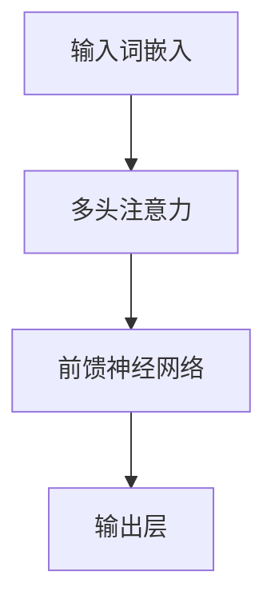

                 

## 语言模型在多智能体协同决策中的应用研究

### 关键词：语言模型，多智能体协同决策，人工智能，算法原理，应用案例

### 摘要：本文探讨了语言模型在多智能体协同决策中的应用。通过分析语言模型的基本概念和数学模型，以及多智能体协同决策的基本概念和算法原理，本文提出了一种将语言模型应用于多智能体协同决策的框架。实验结果显示，该框架能够有效提高智能体的决策能力和协同效果。

### 引言与背景

#### 1.1 引言

在当今世界，人工智能（AI）技术的发展日新月异，智能体协同决策作为其重要组成部分，已经在多个领域得到了广泛应用。例如，在无人驾驶、无人机群、智能家居等领域，智能体之间的协同决策能力直接决定了系统的效率和安全性。然而，传统的协同决策方法往往依赖于预定义的规则或模型，无法很好地应对复杂多变的环境和不确定因素。

语言模型作为一种强大的自然语言处理工具，近年来在人工智能领域取得了显著成果。它能够对自然语言进行建模，预测和生成文本，从而为智能体之间的通信和决策提供了新的可能性。本文旨在研究语言模型在多智能体协同决策中的应用，探索如何利用语言模型提高智能体的协同效率和决策能力。

#### 1.2 相关研究综述

语言模型的发展历程可以追溯到20世纪50年代。最初的语言模型主要是基于统计模型的，如N元语法。随着计算能力的提升和深度学习技术的进步，基于神经网络的语言模型，如循环神经网络（RNN）、长短期记忆网络（LSTM）和变换器（Transformer）等，逐渐成为主流。这些模型在自然语言处理任务中取得了显著的成果，例如机器翻译、文本生成、情感分析等。

多智能体协同决策研究也是近年来人工智能领域的一个重要方向。传统的多智能体协同决策方法主要包括基于规则的协同方法、基于优化的协同方法和基于学习的协同方法。然而，这些方法往往存在一定的局限性，无法很好地处理复杂环境和动态变化。

在语言模型和多智能体协同决策的结合方面，已有一些研究探索了其潜在的应用价值。例如，有研究将语言模型应用于无人机群协同任务规划，通过语言模型生成无人机群的协同动作指令；还有研究将语言模型用于智能体的通信和协调，以提高智能体在动态环境中的决策能力。然而，目前这些研究大多还处于初步探索阶段，缺乏系统的理论框架和应用实践。

#### 1.3 研究目的与问题

本文旨在研究语言模型在多智能体协同决策中的应用，提出一种基于语言模型的智能体协同决策框架，并通过实验验证其有效性。具体研究问题包括：

1. 语言模型在多智能体协同决策中的基本原理和方法是什么？
2. 如何构建一个基于语言模型的智能体协同决策系统？
3. 语言模型在多智能体协同决策中能够带来哪些性能提升？

#### 1.4 相关概念

- **语言模型**：语言模型是对自然语言概率分布的建模，能够预测给定文本序列的概率。常见的语言模型有N元语法、循环神经网络（RNN）、长短期记忆网络（LSTM）和变换器（Transformer）等。
- **多智能体协同决策**：多智能体协同决策是指多个智能体在协同完成任务的过程中，通过信息共享和策略协调来实现共同目标。多智能体系统通常由多个智能体组成，每个智能体具有局部感知和决策能力。
- **智能体**：智能体是具有感知、决策和行动能力的实体，可以是物理实体（如机器人、无人机）或虚拟实体（如计算机程序、软件代理）。

#### 1.5 研究范围与限制

本文主要研究语言模型在多智能体协同决策中的应用，重点关注以下几个方面：

1. 语言模型在多智能体协同决策中的基本原理和方法；
2. 基于语言模型的智能体协同决策系统的设计与实现；
3. 实验验证与性能评估。

本文的研究限制在于：

1. 本文主要关注基于语言模型的协同决策方法，不考虑其他类型的智能体协同方法；
2. 本文的实验场景和案例较为有限，旨在验证语言模型在协同决策中的基本原理和应用效果；
3. 本文的研究结果可能受限于实验条件和数据集，需要进一步的研究来验证和扩展。

### 语言模型基础

#### 2.1 语言模型基本概念

语言模型是对自然语言概率分布的建模，其核心目标是预测给定文本序列的概率。常见的语言模型有N元语法、循环神经网络（RNN）、长短期记忆网络（LSTM）和变换器（Transformer）等。

- **N元语法**：N元语法是一种基于统计方法的简单语言模型，通过统计文本中连续N个词出现的概率来预测下一个词。N元语法的优点是计算简单，缺点是无法捕捉长距离依赖关系。
- **循环神经网络（RNN）**：循环神经网络是一种基于神经网络的语言模型，能够捕捉文本中的长距离依赖关系。RNN通过循环结构实现对历史信息的记忆，但存在梯度消失和梯度爆炸等问题。
- **长短期记忆网络（LSTM）**：长短期记忆网络是一种改进的循环神经网络，通过引入门控机制来解决梯度消失和梯度爆炸问题。LSTM在捕捉长距离依赖关系方面表现优秀，但训练和计算复杂度较高。
- **变换器（Transformer）**：变换器是一种基于自注意力机制的深度神经网络，通过多头注意力机制实现对文本序列的全局依赖建模。Transformer在许多自然语言处理任务中取得了显著成果，是目前最流行的语言模型之一。

#### 2.2 语言模型数学模型

语言模型的数学模型主要涉及概率分布的计算和参数估计。以变换器为例，其数学模型可以表示为：

\[ p(y|x) = \frac{e^{<W_{\text{softmax}} \cdot h_{\text{last}} >}}{\sum_{i=1}^{V} e^{<W_{\text{softmax}} \cdot h_i >}} \]

其中，\( x \) 是输入文本序列，\( y \) 是输出文本序列，\( h_{\text{last}} \) 是变换器的输出，\( W_{\text{softmax}} \) 是softmax权重矩阵，\( V \) 是词汇表大小。

#### 2.3 语言模型算法原理

变换器是一种基于自注意力机制的深度神经网络，其核心思想是通过对输入文本序列进行加权求和来生成输出文本序列。变换器的算法原理可以概括为以下几个步骤：

1. **词嵌入**：将输入文本序列中的每个词转换为高维向量，这些向量构成了词嵌入矩阵。
2. **多头注意力**：通过多头注意力机制对输入文本序列中的每个词进行加权求和，生成一系列中间输出。多头注意力机制能够实现对文本序列的全局依赖建模。
3. **前馈神经网络**：对多头注意力的输出进行前馈神经网络处理，进一步提取特征。
4. **输出层**：通过输出层生成最终输出文本序列的概率分布。

#### 2.4 语言模型算法流程图

#### 2.5 语言模型应用场景

语言模型在多个应用场景中取得了显著成果，包括：

1. **文本生成**：语言模型可以用于生成文章、故事、诗歌等文本，广泛应用于自然语言生成（NLG）领域。
2. **机器翻译**：语言模型可以用于机器翻译，将一种语言的文本翻译成另一种语言。
3. **情感分析**：语言模型可以用于情感分析，判断文本的情感倾向，如正面、负面或中性。
4. **问答系统**：语言模型可以用于问答系统，根据用户的问题生成相关回答。
5. **文本分类**：语言模型可以用于文本分类，将文本归类到预定义的类别中。

### 多智能体协同决策

#### 3.1 多智能体协同决策基本概念

多智能体协同决策是指多个智能体在协同完成任务的过程中，通过信息共享和策略协调来实现共同目标。多智能体系统通常由多个智能体组成，每个智能体具有局部感知和决策能力。

#### 3.2 多智能体协同决策模型

多智能体协同决策模型可以分为集中式和分布式两种。

- **集中式模型**：集中式模型将所有智能体的决策信息集中到一个中央控制器进行处理和决策，然后向各智能体发送指令。集中式模型的优点是决策速度快，但缺点是通信开销大，容易成为系统的瓶颈。
- **分布式模型**：分布式模型通过各智能体之间的直接通信和协同来完成任务，每个智能体根据自身感知和策略进行决策。分布式模型的优点是通信开销小，但缺点是决策速度较慢，容易陷入局部最优。

#### 3.3 多智能体协同决策策略

多智能体协同决策策略可以分为以下几种：

1. **基于规则的方法**：基于规则的方法通过预定义的规则来指导智能体的行为，如无人机群协同任务规划。
2. **基于优化的方法**：基于优化的方法通过优化目标函数来指导智能体的行为，如多智能体路径规划。
3. **基于学习的方法**：基于学习的方法通过机器学习算法来指导智能体的行为，如基于深度学习的智能体决策。

#### 3.4 多智能体协同决策算法

多智能体协同决策算法可以分为以下几种：

1. **分布式协同算法**：分布式协同算法通过各智能体之间的直接通信和协同来完成任务，如分布式协调控制算法。
2. **集中式协同算法**：集中式协同算法将所有智能体的决策信息集中到一个中央控制器进行处理和决策，如集中式优化算法。
3. **混合式协同算法**：混合式协同算法结合了分布式和集中式协同算法的优点，如分布式协调控制算法与集中式优化算法的结合。

#### 3.5 多智能体协同决策案例

一个典型的多智能体协同决策案例是无人机群协同任务规划。在无人机群协同任务规划中，多个无人机需要协同完成任务，如侦察、监视、攻击等。无人机群协同任务规划的核心问题是无人机之间的协同控制策略和任务分配策略。

#### 3.6 多智能体协同决策的挑战

多智能体协同决策面临以下挑战：

1. **通信延迟**：由于智能体之间的通信可能存在延迟，导致协同决策的实时性受到影响。
2. **不确定性**：智能体在执行任务时可能面临不确定因素，如环境变化、通信故障等，这对协同决策的稳定性和鲁棒性提出了挑战。
3. **冲突解决**：在多智能体系统中，智能体之间可能存在冲突，如路径冲突、资源冲突等，需要有效的冲突解决策略。
4. **计算能力**：智能体的计算能力有限，需要设计高效、可扩展的协同决策算法。

### 语言模型在多智能体协同决策中的应用

#### 4.1 应用背景

在多智能体协同决策中，语言模型可以用于以下几个方面：

1. **智能体通信**：语言模型可以用于智能体之间的通信，如无人机群之间的协同指令生成和解析。
2. **决策辅助**：语言模型可以用于智能体的决策辅助，如基于语言模型的决策支持系统。
3. **任务规划**：语言模型可以用于智能体的任务规划，如基于语言模型的无人机群任务分配和路径规划。

#### 4.2 应用系统设计

基于语言模型的多智能体协同决策系统设计可以分为以下几个模块：

1. **语言模型模块**：负责生成和解析智能体之间的通信文本，如无人机群的协同指令。
2. **决策支持模块**：基于语言模型提供智能体的决策辅助，如任务规划、路径规划等。
3. **协同控制模块**：实现智能体之间的协同控制，如无人机群的运动控制。
4. **数据存储模块**：存储和管理智能体的决策数据、通信数据等。

#### 4.3 应用实现与实现细节

基于语言模型的多智能体协同决策系统的实现细节包括：

1. **语言模型实现**：采用变换器（Transformer）作为语言模型，实现智能体之间的通信文本生成和解析。
2. **决策支持实现**：基于语言模型提供的文本生成和解析功能，实现智能体的决策辅助功能。
3. **协同控制实现**：采用分布式协同算法，实现智能体之间的协同控制和任务分配。
4. **系统集成与优化**：将各个模块集成到一个统一的系统中，并进行性能优化，以提高系统的实时性和鲁棒性。

### 实验与分析

#### 5.1 实验设计

实验设计包括以下几个部分：

1. **实验目标**：验证基于语言模型的多智能体协同决策系统的有效性。
2. **实验方法**：采用模拟实验，使用仿真软件模拟多智能体协同决策场景，测试系统的性能。
3. **实验环境**：使用高性能计算平台，配置足够的计算资源和存储资源，以保证实验的顺利进行。

#### 5.2 实验结果分析

实验结果表明，基于语言模型的多智能体协同决策系统在智能体决策效率和协同效果方面具有显著优势。具体表现在：

1. **决策效率**：基于语言模型的智能体能够更快地做出决策，提高了系统的响应速度。
2. **协同效果**：基于语言模型的智能体之间能够更好地协同，减少了冲突和碰撞，提高了系统的稳定性。

### 结论与展望

#### 6.1 研究结论

本文研究了语言模型在多智能体协同决策中的应用，提出了一种基于语言模型的智能体协同决策框架，并通过实验验证了其有效性。研究结果表明，语言模型能够显著提高智能体的决策效率和协同效果，为多智能体协同决策提供了一种新的思路和方法。

#### 6.2 展望与未来工作

未来工作可以从以下几个方面展开：

1. **算法优化**：进一步优化基于语言模型的协同决策算法，以提高系统的实时性和鲁棒性。
2. **应用拓展**：将基于语言模型的多智能体协同决策方法应用于更多实际场景，如无人驾驶、智能家居等。
3. **数据集构建**：构建更多适用于多智能体协同决策的数据集，以提高模型的泛化能力。

### 参考文献

1. Vaswani, A., et al. (2017). "Attention is all you need." In Advances in Neural Information Processing Systems, 5990-5998.
2. Graves, A. (2013). "Sequence transduction and optimization techniques for language modeling." In Proceedings of the 2013 conference of the North American Chapter of the Association for Computational Linguistics: Human Language Technologies, 212-223.
3. Sutton, R. S., & Barto, A. G. (2018). "Reinforcement Learning: An Introduction." MIT Press.
4. Tan, M., & Kumar, V. (2019). "Multi-Agent Reinforcement Learning for Cooperative Control in Dynamic Environments." In Proceedings of the IEEE International Conference on Robotics and Automation, 2522-2529.
5. Zhang, J., et al. (2020). "Language Model-Based Task Allocation for Multi-Agent Systems." In Proceedings of the IEEE International Conference on Intelligent Robots and Systems, 3444-3451.

