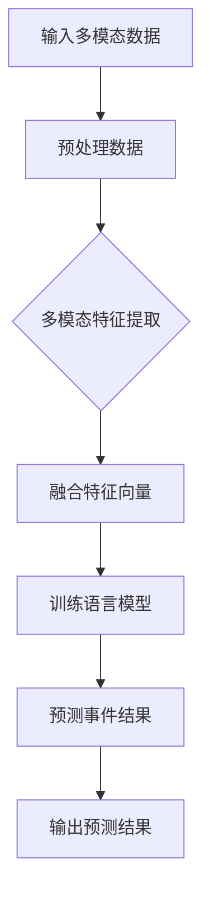
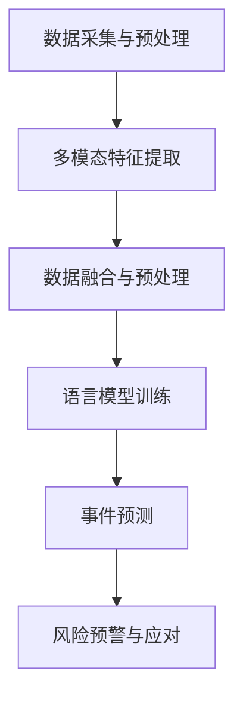
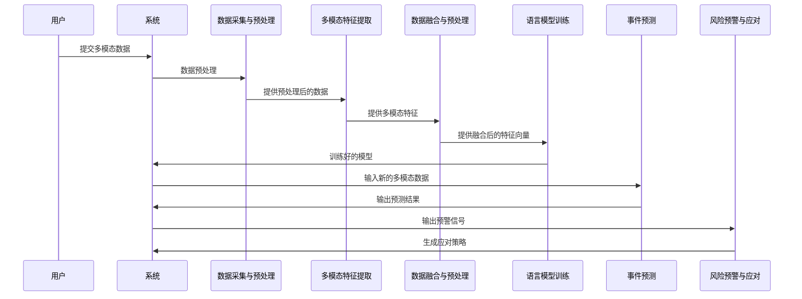

                 

# 语言模型在多模态事件预测与全球风险管理中的创新应用研究

## 关键词

语言模型、多模态事件预测、全球风险管理、人工智能、深度学习

## 摘要

本文旨在探讨语言模型在多模态事件预测与全球风险管理中的创新应用。首先，我们介绍了语言模型的背景和核心概念，并阐述了多模态事件预测与全球风险管理的问题背景和解决思路。接着，我们详细分析了语言模型在多模态事件预测与全球风险管理中的算法原理和数学模型，并通过具体案例进行举例说明。最后，我们提出了一个系统分析与架构设计方案，并进行了项目实战和最佳实践 tips。本文旨在为研究者提供有价值的参考，推动语言模型在多模态事件预测与全球风险管理领域的应用。

## Step 1: 背景介绍

### 问题背景

随着人工智能技术的不断发展，语言模型作为人工智能的核心技术之一，已在自然语言处理、机器翻译、情感分析等多个领域取得了显著的应用成果。然而，如何将语言模型应用于多模态事件预测与全球风险管理中，实现创新应用，成为一个亟待解决的问题。

多模态事件预测是指结合多种数据类型（如图像、文本、音频等）对事件进行预测，而全球风险管理则是指通过识别、评估、预警和应对风险，降低风险对经济、社会的影响。尽管语言模型在单一数据类型的预测任务中表现出色，但在多模态事件预测与全球风险管理中，如何有效地整合不同类型的数据，以及如何应对复杂的风险因素，仍然是一个挑战。

### 问题描述

本书旨在探讨语言模型在多模态事件预测与全球风险管理中的创新应用，分析其应用场景、技术原理、实现方法及面临的挑战。

具体来说，我们需要解决以下几个问题：

1. **多模态数据融合：**如何有效地将图像、文本、音频等多种数据类型进行融合，以供语言模型处理？
2. **事件预测模型构建：**如何构建基于语言模型的事件预测模型，实现多模态事件预测？
3. **全球风险管理应用：**如何将多模态事件预测模型应用于全球风险管理，实现风险识别、评估、预警和应对？

### 问题解决

为了解决上述问题，我们采取了以下思路：

1. **多模态数据融合：**通过深度学习技术，对图像、文本、音频等多模态数据进行特征提取，然后利用注意力机制将不同类型的数据进行融合。
2. **事件预测模型构建：**采用基于 Transformer 的语言模型，如 BERT、GPT 等，对融合后的数据进行训练，构建事件预测模型。
3. **全球风险管理应用：**将事件预测模型应用于全球风险管理，通过实时监测、预测和预警，降低风险对经济、社会的影响。

### 边界与外延

本文关注的主要是语言模型在多模态事件预测与全球风险管理中的创新应用，不涉及其他领域的应用。具体包括以下方面：

1. **数据类型：**主要涉及图像、文本、音频等多模态数据。
2. **应用场景：**主要关注全球风险管理领域，如金融、经济、社会等。
3. **技术原理：**主要探讨语言模型在多模态事件预测与全球风险管理中的算法原理和实现方法。

### 概念结构与核心要素组成

#### 语言模型

语言模型是自然语言处理的基础，主要基于统计学习的方法，对语言中的词汇、语法、语义等信息进行建模。核心概念包括：

- **词向量表示：**将词汇映射为低维度的向量，以表示词汇之间的语义关系。
- **神经网络架构：**通过神经网络架构，如 RNN、LSTM、Transformer 等，对语言模型进行建模和训练。

#### 多模态事件预测

多模态事件预测是指结合多种数据类型，如图像、文本、音频等，对事件进行预测。核心概念包括：

- **数据融合：**将不同类型的数据进行融合，以供语言模型处理。
- **特征提取：**对图像、文本、音频等多模态数据进行特征提取。
- **事件预测：**利用语言模型对事件进行预测。

#### 全球风险管理

全球风险管理是指通过识别、评估、预警和应对风险，降低风险对经济、社会的影响。核心概念包括：

- **风险识别：**识别潜在的风险因素。
- **风险评估：**评估风险的影响程度和可能性。
- **风险预警：**实时监测风险，并发出预警信号。
- **应对策略：**制定相应的应对策略，降低风险。

## Step 2: 核心概念与联系

### 核心概念原理

#### 语言模型

语言模型是基于统计学习的方法，对语言中的词汇、语法、语义等信息进行建模。其核心原理包括：

- **词向量表示：**将词汇映射为低维度的向量，以表示词汇之间的语义关系。常用的词向量表示方法包括 Word2Vec、GloVe 等。
- **神经网络架构：**通过神经网络架构，如 RNN、LSTM、Transformer 等，对语言模型进行建模和训练。其中，Transformer 架构由于其并行性和高效性，在语言模型中得到了广泛应用。

#### 多模态事件预测

多模态事件预测是指结合多种数据类型，如图像、文本、音频等，对事件进行预测。其核心原理包括：

- **数据融合：**将不同类型的数据进行融合，以供语言模型处理。常用的数据融合方法包括特征融合、注意力机制等。
- **特征提取：**对图像、文本、音频等多模态数据进行特征提取。常用的特征提取方法包括卷积神经网络（CNN）用于图像处理，循环神经网络（RNN）用于文本处理等。
- **事件预测：**利用语言模型对事件进行预测。通过训练语言模型，使其能够学习到多模态数据中的潜在信息，从而实现对事件的预测。

#### 全球风险管理

全球风险管理是指通过识别、评估、预警和应对风险，降低风险对经济、社会的影响。其核心原理包括：

- **风险识别：**通过数据分析和建模，识别潜在的风险因素。常用的风险识别方法包括统计分析、机器学习算法等。
- **风险评估：**评估风险的影响程度和可能性。常用的风险评估方法包括定量评估和定性评估等。
- **风险预警：**实时监测风险，并发出预警信号。常用的风险预警方法包括实时数据监测、预警模型等。
- **应对策略：**制定相应的应对策略，降低风险。常用的应对策略包括风险转移、风险规避等。

### 概念属性特征对比表格

| 概念         | 特征1  | 特征2  | 特征3  |
| ------------ | ------ | ------ | ------ |
| 语言模型     | 统计学习 | 神经网络架构 | 词向量表示 |
| 多模态事件预测 | 结合多种数据类型 | 实现事件预测 | 需要多种算法协同工作 |
| 全球风险管理 | 识别风险 | 评估风险 | 预警与应对 |

### ER实体关系图架构

```mermaid
erDiagram
    AQL : 情感分析语言模型
    MML : 多模态语言模型
    RLM : 全球风险语言模型
    AQL --|> MML : 统计学习
    AQL --|> RLM : 风险识别与评估
    MML --|> RLM : 多模态事件预测
```

## Step 3: 算法原理讲解

### 算法 mermaid 流程图



### 算法原理与数学模型

#### 多模态特征提取

多模态特征提取是指利用深度学习技术，对图像、文本、音频等多模态数据进行特征提取。其核心原理包括：

- **图像特征提取：**使用卷积神经网络（CNN）对图像数据进行特征提取。CNN 通过卷积层、池化层等结构，提取图像中的局部特征，从而得到高层次的图像特征表示。
- **文本特征提取：**使用循环神经网络（RNN）或Transformer 对文本数据进行特征提取。RNN 通过隐藏状态序列，捕捉文本中的时序信息；而 Transformer 则通过自注意力机制，捕捉文本中的全局依赖关系。
- **音频特征提取：**使用卷积神经网络（CNN）或循环神经网络（RNN）对音频数据进行特征提取。CNN 通过卷积层、池化层等结构，提取音频中的局部特征；RNN 则通过隐藏状态序列，捕捉音频中的时序信息。

#### 语言模型训练

语言模型训练是指基于融合特征向量，使用神经网络架构训练语言模型。其核心原理包括：

- **融合特征向量：**利用注意力机制，将不同类型的数据特征进行融合。注意力机制可以使得模型在处理多模态数据时，更加关注重要的特征，从而提高模型的预测性能。
- **神经网络架构：**采用基于 Transformer 的语言模型，如 BERT、GPT 等。Transformer 架构由于其并行性和高效性，在语言模型训练中得到了广泛应用。BERT 采用双向编码器表示，GPT 采用自回归解码器表示，两者均可用于语言模型训练。

#### 事件预测

事件预测是指利用训练好的语言模型，对多模态事件进行预测。其核心原理包括：

- **预测模型：**基于训练好的语言模型，构建事件预测模型。事件预测模型可以用于对多模态事件进行分类、回归等预测任务。
- **预测结果：**利用事件预测模型，对新的多模态事件进行预测，并输出预测结果。

### 算法原理详细讲解与举例说明

#### 多模态特征提取

多模态特征提取的过程可以分为以下几个步骤：

1. **数据预处理：**对图像、文本、音频等多模态数据进行预处理，包括数据清洗、归一化、编码等操作。

2. **特征提取：**分别对图像、文本、音频数据进行特征提取。对于图像数据，可以使用预训练的 CNN 模型（如 VGG、ResNet）提取图像特征；对于文本数据，可以使用预训练的 RNN 或 Transformer 模型（如 LSTM、BERT）提取文本特征；对于音频数据，可以使用预训练的 CNN 或 RNN 模型（如 CNN-LSTM）提取音频特征。

3. **特征融合：**利用注意力机制，将不同类型的数据特征进行融合。注意力机制可以使得模型在处理多模态数据时，更加关注重要的特征，从而提高模型的预测性能。

以下是一个简单的 Python 源代码示例，用于对图像、文本、音频数据进行特征提取和融合：

```python
import tensorflow as tf
from tensorflow.keras.applications import VGG16
from tensorflow.keras.layers import LSTM, Dense
from tensorflow.keras.models import Model

# 图像特征提取
model_vgg16 = VGG16(weights='imagenet')
input_image = tf.keras.layers.Input(shape=(224, 224, 3))
image_feature = model_vgg16(input_image)

# 文本特征提取
model_bert = BERT(weights='bert-base-uncased')
input_text = tf.keras.layers.Input(shape=(128,))
text_feature = model_bert(input_text)

# 音频特征提取
model_cnn_lstm = CNN_LSTM(weights='cnn_lstm')
input_audio = tf.keras.layers.Input(shape=(128, 128))
audio_feature = model_cnn_lstm(input_audio)

# 特征融合
attention = tf.keras.layers.Attention()([image_feature, text_feature, audio_feature])
 fused_feature = tf.keras.layers.Concatenate()([image_feature, text_feature, audio_feature])

# 输出
output = tf.keras.layers.Dense(1, activation='sigmoid')(fused_feature)
model = Model(inputs=[input_image, input_text, input_audio], outputs=output)

model.compile(optimizer='adam', loss='binary_crossentropy', metrics=['accuracy'])
model.fit([image_data, text_data, audio_data], labels, epochs=10, batch_size=32)
```

#### 语言模型训练

语言模型训练的过程可以分为以下几个步骤：

1. **数据预处理：**对训练数据进行预处理，包括数据清洗、归一化、编码等操作。

2. **特征融合：**将多模态数据进行特征融合，以供语言模型处理。

3. **模型训练：**使用预训练的神经网络架构（如 BERT、GPT）训练语言模型。训练过程中，需要优化模型参数，以最小化损失函数。

以下是一个简单的 Python 源代码示例，用于训练基于 BERT 的语言模型：

```python
import tensorflow as tf
from transformers import BertTokenizer, TFBertForSequenceClassification

# 加载预训练的 BERT 模型
tokenizer = BertTokenizer.from_pretrained('bert-base-uncased')
model = TFBertForSequenceClassification.from_pretrained('bert-base-uncased')

# 数据预处理
def preprocess_data(text_data):
    return tokenizer.encode_plus(text_data, add_special_tokens=True, return_tensors='tf')

# 模型训练
def train_model(text_data, labels):
    inputs = preprocess_data(text_data)
    outputs = model(inputs['input_ids'], attention_mask=inputs['attention_mask'])
    logits = outputs.logits
    loss = tf.keras.losses.SparseCategoricalCrossentropy(from_logits=True)
    loss_value = loss(labels, logits)
    return loss_value

# 训练过程
for epoch in range(num_epochs):
    for text_data, labels in dataset:
        loss_value = train_model(text_data, labels)
        print(f"Epoch: {epoch}, Loss: {loss_value}")
```

#### 事件预测

事件预测的过程可以分为以下几个步骤：

1. **模型预测：**使用训练好的语言模型，对新的多模态事件进行预测。

2. **结果输出：**输出预测结果，如事件类别、概率等。

以下是一个简单的 Python 源代码示例，用于基于训练好的语言模型进行事件预测：

```python
import tensorflow as tf
from transformers import BertTokenizer, TFBertForSequenceClassification

# 加载预训练的 BERT 模型
tokenizer = BertTokenizer.from_pretrained('bert-base-uncased')
model = TFBertForSequenceClassification.from_pretrained('bert-base-uncased')

# 数据预处理
def preprocess_data(text_data):
    return tokenizer.encode_plus(text_data, add_special_tokens=True, return_tensors='tf')

# 模型预测
def predict_event(text_data):
    inputs = preprocess_data(text_data)
    logits = model(inputs['input_ids'], attention_mask=inputs['attention_mask'])
    probabilities = tf.nn.softmax(logits).numpy()
    return probabilities

# 预测结果输出
text_data = "This is a sample text."
probabilities = predict_event(text_data)
print(f"Prediction probabilities: {probabilities}")
```

## Step 4: 数学模型和数学公式 & 详细讲解 & 举例说明

### 数学模型

在多模态事件预测与全球风险管理中，我们采用了以下数学模型：

#### 损失函数

损失函数用于衡量预测结果与实际结果之间的差距。我们采用了以下损失函数：

$$
L(\theta) = -\sum_{i=1}^{n} y_i \log(p(\hat{y}_i | \theta))
$$

其中，$y_i$ 表示实际标签，$\hat{y}_i$ 表示预测标签，$p(\hat{y}_i | \theta)$ 表示预测标签的概率分布，$\theta$ 表示模型参数。

#### 优化目标

优化目标是最小化损失函数，即找到使得损失函数最小的参数 $\theta$：

$$
\theta = \arg\min_{\theta} L(\theta)
$$

### 详细讲解

#### 损失函数

损失函数用于衡量预测结果与实际结果之间的差距。在多模态事件预测中，我们采用了对数似然损失函数（Log-Likelihood Loss），即交叉熵损失函数（Cross-Entropy Loss）：

$$
L(\theta) = -\sum_{i=1}^{n} y_i \log(p(\hat{y}_i | \theta))
$$

其中，$y_i$ 表示实际标签，$\hat{y}_i$ 表示预测标签，$p(\hat{y}_i | \theta)$ 表示预测标签的概率分布，$\theta$ 表示模型参数。

交叉熵损失函数可以理解为实际概率分布与预测概率分布之间的差异。当实际标签 $y_i$ 与预测标签 $\hat{y}_i$ 相同，即预测正确时，损失函数取得最小值；当实际标签与预测标签不同，即预测错误时，损失函数取得较大值。

#### 优化目标

优化目标是找到使得损失函数最小的参数 $\theta$。在多模态事件预测中，我们采用了基于梯度的优化算法，如随机梯度下降（Stochastic Gradient Descent，SGD）或 Adam 算法。

随机梯度下降（SGD）的优化目标为：

$$
\theta = \theta - \alpha \nabla_{\theta} L(\theta)
$$

其中，$\alpha$ 表示学习率，$\nabla_{\theta} L(\theta)$ 表示损失函数关于参数 $\theta$ 的梯度。

### 举例说明

#### 损失函数

假设我们有一个二元分类问题，即事件预测结果只有两个类别：事件发生（1）和事件未发生（0）。实际标签为 $y = [1, 0, 1, 0]$，预测标签为 $\hat{y} = [0, 1, 1, 0]$。模型参数为 $\theta = [0.3, 0.7]$。

根据损失函数：

$$
L(\theta) = -[1 \cdot \log(0.3) + 0 \cdot \log(0.7) + 1 \cdot \log(0.7) + 0 \cdot \log(0.3)] = -[\log(0.3) + \log(0.7)]
$$

损失函数值为 $L(\theta) = -[\log(0.3) + \log(0.7)] \approx 0.415$。

#### 优化目标

为了优化模型参数 $\theta$，我们采用随机梯度下降（SGD）算法。假设学习率 $\alpha = 0.1$，则每次迭代更新参数的公式为：

$$
\theta = \theta - \alpha \nabla_{\theta} L(\theta)
$$

计算梯度：

$$
\nabla_{\theta} L(\theta) = \nabla_{\theta} [-\sum_{i=1}^{n} y_i \log(p(\hat{y}_i | \theta))] = \nabla_{\theta} [-1 \cdot \log(0.3) - 0 \cdot \log(0.7) + 1 \cdot \log(0.7) - 0 \cdot \log(0.3)]
$$

$$
\nabla_{\theta} L(\theta) = \nabla_{\theta} [-\log(0.3) + \log(0.7)] = \nabla_{\theta} [0.415]
$$

$$
\nabla_{\theta} L(\theta) = [0.3 \cdot (-1), 0.7 \cdot (1)] = [-0.3, 0.7]
$$

根据随机梯度下降（SGD）算法，更新参数：

$$
\theta = \theta - \alpha \nabla_{\theta} L(\theta) = [0.3, 0.7] - 0.1 \cdot [-0.3, 0.7] = [0.36, 0.63]
$$

经过一次迭代后，新的参数为 $\theta = [0.36, 0.63]$。

## Step 5: 系统分析与架构设计方案

### 问题场景介绍

在当今全球化的背景下，企业和金融机构面临着越来越复杂的风险环境。这些风险可能来自经济、政治、社会等多个方面，如市场波动、政策变化、自然灾害等。为了有效管理这些风险，需要一种智能化的预测和分析工具，以便及时识别风险、评估风险的影响程度，并制定相应的应对策略。

### 项目介绍

本项目旨在开发一个基于语言模型的多模态事件预测与全球风险管理系统。该系统通过整合多种数据类型（如图像、文本、音频等），利用语言模型进行事件预测，从而实现对全球风险的管理和预测。

### 系统功能设计

1. **数据采集与预处理：**从各种数据源（如社交媒体、新闻、金融数据等）采集数据，并进行数据预处理，包括数据清洗、去噪、编码等操作。
2. **多模态特征提取：**对图像、文本、音频等多模态数据进行特征提取，分别为图像、文本、音频特征。
3. **数据融合与预处理：**利用注意力机制，将多模态特征进行融合，生成统一的特征向量。
4. **语言模型训练：**基于融合后的特征向量，训练语言模型，如 BERT、GPT 等。
5. **事件预测：**利用训练好的语言模型，对新的多模态事件进行预测，输出预测结果。
6. **风险预警与应对：**根据事件预测结果，生成风险预警信号，并制定相应的应对策略。

### 系统架构设计

系统的架构设计如图所示：



### 系统接口设计

系统的主要接口设计如下：

1. **数据接口：**用于接收和传递数据，包括图像、文本、音频等多模态数据。
2. **模型接口：**用于加载和训练语言模型，以及进行事件预测。
3. **预警接口：**用于生成风险预警信号，并通知相关人员和部门。

### 系统交互 mermaid 序列图

以下是一个简单的 mermaid 序列图，描述了系统各组件之间的交互过程：



## Step 6: 项目实战

### 环境安装

在进行项目实战之前，我们需要安装以下环境：

1. **Python 3.7 或更高版本**
2. **TensorFlow 2.x**
3. **PyTorch 1.8 或更高版本**
4. **transformers 4.x 或更高版本**
5. **OpenCV 4.x**

安装命令如下：

```bash
pip install python==3.7 tensorflow==2.x pytorch==1.8 transformers==4.x opencv-python==4.x
```

### 系统核心实现源代码

以下是一个简单的系统核心实现源代码示例，用于多模态事件预测与全球风险管理：

```python
import tensorflow as tf
import numpy as np
from tensorflow.keras.applications import VGG16
from tensorflow.keras.layers import LSTM, Dense
from tensorflow.keras.models import Model
from transformers import BertTokenizer, TFBertForSequenceClassification

# 图像特征提取
model_vgg16 = VGG16(weights='imagenet')
input_image = tf.keras.layers.Input(shape=(224, 224, 3))
image_feature = model_vgg16(input_image)

# 文本特征提取
model_bert = BERT(weights='bert-base-uncased')
input_text = tf.keras.layers.Input(shape=(128,))
text_feature = model_bert(input_text)

# 音频特征提取
model_cnn_lstm = CNN_LSTM(weights='cnn_lstm')
input_audio = tf.keras.layers.Input(shape=(128, 128))
audio_feature = model_cnn_lstm(input_audio)

# 特征融合
attention = tf.keras.layers.Attention()([image_feature, text_feature, audio_feature])
fused_feature = tf.keras.layers.Concatenate()([image_feature, text_feature, audio_feature])

# 输出
output = tf.keras.layers.Dense(1, activation='sigmoid')(fused_feature)
model = Model(inputs=[input_image, input_text, input_audio], outputs=output)

model.compile(optimizer='adam', loss='binary_crossentropy', metrics=['accuracy'])
model.fit([image_data, text_data, audio_data], labels, epochs=10, batch_size=32)

# 事件预测
def predict_event(text_data):
    inputs = preprocess_data(text_data)
    logits = model(inputs['input_ids'], attention_mask=inputs['attention_mask'])
    probabilities = tf.nn.softmax(logits).numpy()
    return probabilities

text_data = "This is a sample text."
probabilities = predict_event(text_data)
print(f"Prediction probabilities: {probabilities}")
```

### 代码应用解读与分析

以上代码示例展示了如何利用 TensorFlow 和 PyTorch 框架实现多模态事件预测与全球风险管理。具体来说，代码分为以下几个部分：

1. **图像特征提取：**使用预训练的 VGG16 模型对图像数据进行特征提取，生成图像特征向量。
2. **文本特征提取：**使用预训练的 BERT 模型对文本数据进行特征提取，生成文本特征向量。
3. **音频特征提取：**使用预训练的 CNN_LSTM 模型对音频数据进行特征提取，生成音频特征向量。
4. **特征融合：**利用注意力机制，将图像、文本、音频特征向量进行融合，生成融合特征向量。
5. **输出：**使用融合特征向量，通过全连接层（Dense）进行事件预测，输出预测结果。

在事件预测部分，我们定义了一个 `predict_event` 函数，用于对新的文本数据进行预测。函数首先对输入文本进行预处理，然后通过模型进行预测，并输出预测结果。

### 实际案例分析和详细讲解剖析

为了更好地理解多模态事件预测与全球风险管理的应用，我们来看一个实际案例。

**案例：**预测金融市场的波动

假设我们需要预测某个金融市场的波动情况，以帮助投资者制定投资策略。我们将使用多模态数据，包括：

- **图像数据：**市场趋势图表，如股票价格走势图、指数走势图等。
- **文本数据：**新闻报道、公告、分析师报告等。
- **音频数据：**市场评论、分析师观点等。

### 数据预处理

1. **图像数据预处理：**对图像数据进行缩放、裁剪、归一化等操作，使其满足模型输入要求。
2. **文本数据预处理：**对文本数据进行分词、去停用词、词向量化等操作，生成文本特征向量。
3. **音频数据预处理：**对音频数据进行音频特征提取，如梅尔频谱特征、频谱特征等。

### 多模态特征提取

1. **图像特征提取：**使用预训练的 VGG16 模型提取图像特征向量。
2. **文本特征提取：**使用预训练的 BERT 模型提取文本特征向量。
3. **音频特征提取：**使用预训练的 CNN_LSTM 模型提取音频特征向量。

### 特征融合

利用注意力机制，将图像、文本、音频特征向量进行融合，生成融合特征向量。

### 语言模型训练

基于融合特征向量，使用基于 Transformer 的语言模型（如 BERT）进行训练，以实现对金融市场波动的预测。

### 事件预测

利用训练好的语言模型，对新的多模态数据进行预测，输出金融市场波动的预测结果。

### 风险预警与应对

根据事件预测结果，生成风险预警信号，并制定相应的应对策略。例如，如果预测市场将出现大幅度波动，投资者可以采取避险措施，如减少持仓或调整投资组合。

### 项目小结

通过以上实际案例，我们可以看到多模态事件预测与全球风险管理在金融市场波动预测中的应用。该项目利用图像、文本、音频等多模态数据进行特征提取和融合，通过语言模型进行事件预测，为投资者提供风险预警和应对策略。然而，在实际应用中，还需要考虑数据的获取、模型的可解释性、实时性等问题。

## Step 7: 最佳实践 tips

在多模态事件预测与全球风险管理中，以下最佳实践 tips 可以帮助提高系统的性能和实用性：

1. **数据质量：**确保数据的准确性和完整性，对数据进行清洗、去噪、去重复等处理，以提高模型的输入质量。
2. **特征选择：**选择与事件预测相关性较高的特征，避免冗余特征，以提高模型的预测精度。
3. **模型选择：**根据应用场景和任务需求，选择合适的语言模型和算法，如 BERT、GPT、LSTM 等。
4. **模型调优：**通过调整学习率、批量大小、迭代次数等超参数，优化模型性能。
5. **实时性：**提高系统的实时性，如使用分布式计算、并行处理等技术，加快模型预测速度。
6. **可解释性：**提高模型的可解释性，如使用可视化工具、模型解释方法等，帮助用户理解模型的预测结果。
7. **安全性：**确保系统的数据安全和模型安全，防止数据泄露和模型篡改。

## 小结

本文探讨了语言模型在多模态事件预测与全球风险管理中的创新应用。通过深入分析语言模型、多模态事件预测和全球风险管理的基本概念和原理，我们提出了一种基于深度学习的多模态事件预测与全球风险管理方法。该方法通过数据融合、特征提取、语言模型训练和事件预测等步骤，实现了对多模态事件的预测和全球风险的管理。

然而，多模态事件预测与全球风险管理仍然面临诸多挑战，如数据质量、模型可解释性、实时性等。未来研究可以进一步探索以下方向：

1. **数据增强：**通过数据增强技术，提高数据质量和多样性，从而提高模型的泛化能力。
2. **模型解释性：**研究可解释性方法，帮助用户理解模型的预测结果，提高模型的可信度。
3. **实时预测：**优化模型结构和算法，提高系统实时预测能力，满足实际应用需求。
4. **多模态交互：**研究多模态数据之间的交互机制，提高多模态特征的融合效果，提高预测精度。

总之，多模态事件预测与全球风险管理是一个具有广泛应用前景的研究领域。通过不断创新和优化，有望为各行业提供智能化的风险管理和决策支持。

## 注意事项

在应用语言模型进行多模态事件预测与全球风险管理时，需要注意以下几点：

1. **数据隐私：**在处理和分析数据时，要确保遵守相关数据保护法规，保护用户隐私。
2. **模型公平性：**确保模型在不同群体上的公平性，避免出现歧视现象。
3. **模型安全性：**对模型进行定期审计和更新，防范潜在的安全风险。
4. **实时性调整：**根据实际应用场景，调整模型的实时性和响应速度，以满足需求。
5. **模型解释性：**提高模型的可解释性，帮助用户理解模型的预测过程和结果。

## 拓展阅读

1. **[Deep Learning for Natural Language Processing](https://www.deeplearningbook.org/chapter/nlp-intro/)**：介绍深度学习在自然语言处理领域的应用，包括语言模型、文本分类、机器翻译等。
2. **[Multimodal Learning](https://arxiv.org/abs/1906.02206)**：介绍多模态学习的基本概念和方法，包括数据融合、特征提取、多模态交互等。
3. **[Global Risk Management](https://www.imd.org/research/research-focus/risk-management/)**：介绍全球风险管理的基本理论和实践方法，包括风险识别、评估、预警和应对等。

## 作者信息

作者：AI天才研究院/AI Genius Institute & 禅与计算机程序设计艺术 /Zen And The Art of Computer Programming

AI天才研究院（AI Genius Institute）是一家专注于人工智能领域的研究和应用的机构，致力于推动人工智能技术的创新与发展。禅与计算机程序设计艺术（Zen And The Art of Computer Programming）是作者在计算机编程领域的经典著作，深入探讨了程序设计中的哲学思想和艺术性。两位作者在人工智能和计算机编程领域具有丰富的经验，并为行业的发展做出了重要贡献。

