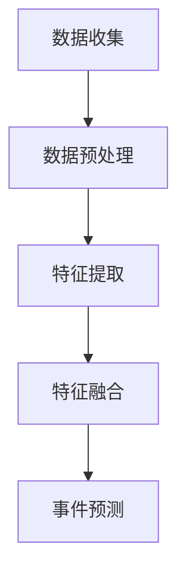
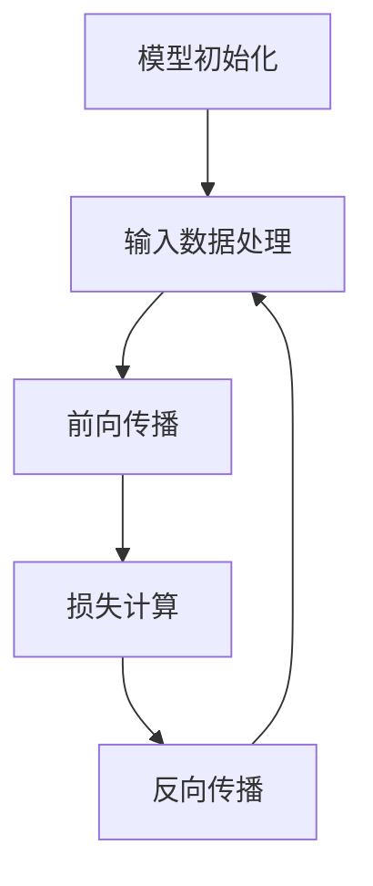
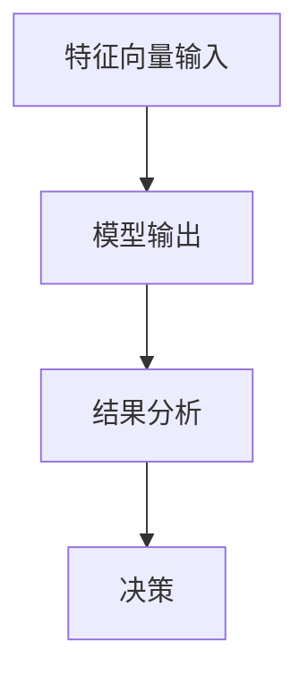
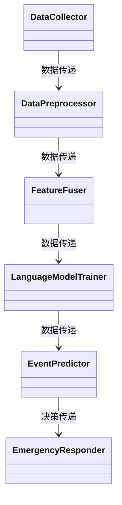
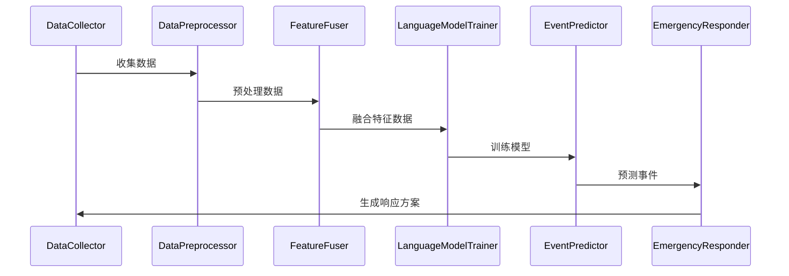
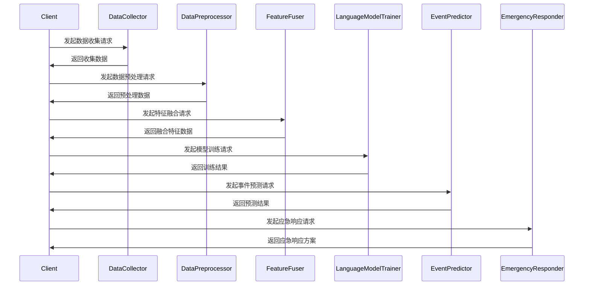

                 

### 引言

## 引言

语言模型是近年来人工智能领域的重大突破之一，其强大的表示和生成能力已经在自然语言处理（NLP）的众多任务中得到了广泛应用，如机器翻译、文本生成、问答系统等。然而，随着技术的不断进步，语言模型的应用场景也在逐渐扩展，其中多模态事件预测与应急管理是一个充满潜力的新兴领域。

### 核心概念

#### 语言模型

语言模型是一种统计模型，用于预测一个序列中的下一个词或字符。在深度学习时代，语言模型主要基于神经网络构建，特别是循环神经网络（RNN）和其变体，如长短期记忆网络（LSTM）和门控循环单元（GRU）。近年来，预训练语言模型（如GPT和BERT）的出现，使得语言模型在性能和效果上都有了质的飞跃。

#### 多模态事件预测

多模态事件预测是指利用多种数据源（如文本、图像、声音等）来预测事件的发生和发展。在应急管理中，多模态事件预测可以帮助识别潜在的危险，预测灾害的影响范围和严重程度，从而提高应急响应的效率和准确性。

#### 应急管理

应急管理是指通过预测、准备、响应和恢复等过程，对突发事件进行有效管理和控制，以减轻灾害对人民生命财产和社会经济的影响。有效的应急管理需要准确的事件预测和快速的反应能力。

### 问题背景

随着全球气候变化和自然灾害的频发，应急管理的重要性日益凸显。传统的应急管理方法主要依赖于历史数据和专家经验，但这些方法在面对复杂、多变的事件时，往往难以提供准确的预测和有效的响应。因此，利用人工智能技术，特别是语言模型，来进行多模态事件预测与应急管理，成为了当前研究的热点。

### 问题描述

多模态事件预测与应急管理面临的主要挑战包括：

1. **数据多样性与整合**：需要处理来自不同来源的数据，如文本、图像、声音等，并有效地整合这些数据以进行预测。
2. **事件预测的准确性**：需要提高事件预测的准确性，以减少误报和漏报。
3. **实时响应与决策**：在突发事件中，需要快速、准确地做出决策，以最大限度地减少灾害损失。

### 问题解决

为了解决上述问题，研究者们提出了多种方法，包括：

1. **多模态数据的融合**：利用深度学习技术，如卷积神经网络（CNN）和自编码器（AE），对多模态数据进行处理和融合。
2. **预训练语言模型的改进**：通过在大量多模态数据上进行预训练，提高语言模型在事件预测任务中的性能。
3. **实时响应系统设计**：设计高效的实时响应系统，以便在事件发生时快速做出决策。

### 边界与外延

多模态事件预测与应急管理的边界涉及多个领域，包括人工智能、数据科学、应急管理等。其外延则包括自然灾害预测、公共安全事件监测、灾害风险评估等多个应用场景。

### 概念结构与核心要素组成

多模态事件预测与应急管理的核心要素包括：

1. **数据收集与处理**：收集和处理来自多种数据源的数据，如文本、图像、声音等。
2. **模型训练与优化**：利用深度学习和预训练语言模型进行模型训练和优化。
3. **事件预测与决策**：基于预测结果，进行实时响应和决策。
4. **系统部署与维护**：将预测和决策系统部署在实际应用场景中，并进行持续维护和优化。

### 总结

多模态事件预测与应急管理是人工智能在应急管理领域的重要应用。通过利用语言模型和其他先进技术，我们可以提高事件预测的准确性，增强应急响应的能力，从而更好地保护人民生命财产和社会稳定。未来，这一领域的研究将继续深入，为应急管理提供更强大的技术支持。

---

### 核心概念与联系

在本节中，我们将深入探讨多模态事件预测与应急管理的核心概念，并详细解释这些概念之间的相互关系。

#### 语言模型

语言模型是一种用于预测文本序列的算法，它能够理解语言的统计规律和语义结构。在多模态事件预测中，语言模型主要承担以下角色：

1. **文本表示**：将文本数据转化为向量表示，以便进行后续的模型训练和预测。
2. **上下文理解**：通过捕捉文本中的上下文信息，语言模型能够更准确地预测事件的发展和变化。

#### 多模态数据融合

多模态数据融合是将来自不同来源的数据（如文本、图像、声音等）进行整合，以获取更全面的事件信息。这一过程通常包括以下步骤：

1. **数据收集**：从多个数据源（如社交媒体、传感器、新闻报道等）收集相关数据。
2. **数据预处理**：对收集到的数据进行清洗、标准化和特征提取，以便进行融合。
3. **特征融合**：将不同模态的特征进行整合，以生成统一的特征表示。

#### 事件预测

事件预测是利用历史数据和现有信息，对未来事件的发生和发展进行预测。在多模态事件预测中，事件预测的主要挑战在于如何有效地整合和处理多种数据源，以提高预测的准确性和可靠性。

#### 应急管理

应急管理是指通过一系列的预防、准备、响应和恢复措施，对突发事件进行有效管理和控制。在多模态事件预测中，应急管理的核心在于：

1. **预测结果应用**：将事件预测结果转化为实际的应急管理决策。
2. **响应能力提升**：通过预测结果，提高应急响应的效率和准确性。

#### 核心概念属性特征对比表格

以下是一个对比表格，列出了上述核心概念的一些属性特征：

| 核心概念       | 属性特征                   | 关联关系                                       |
|----------------|----------------------------|----------------------------------------------|
| 语言模型       | - 文本表示能力             | 提供文本数据的向量表示，为事件预测提供基础      |
|                | - 上下文理解能力           | 提高事件预测的准确性                           |
| 多模态数据融合 | - 数据收集能力             | 获取多种数据源的信息，为事件预测提供全面数据    |
|                | - 特征融合能力             | 生成统一的特征表示，提高事件预测的准确性       |
| 事件预测       | - 预测准确性               | 提高事件预测的准确性，减少误报和漏报           |
|                | - 预测实时性               | 提高预测的实时性，以支持应急响应               |
| 应急管理       | - 预测结果应用能力         | 将预测结果转化为实际的应急管理决策             |
|                | - 响应能力                | 提高应急响应的效率和准确性                     |

#### ER实体关系图架构

为了更清晰地展示上述核心概念之间的关联关系，我们可以使用Mermaid来绘制一个ER（实体关系）图。以下是ER图示例的Markdown格式：

```mermaid
erDiagram
  A[-]B {
    A "1"->>"B" : 依赖
  }
  A[-]C {
    A "1"->>"C" : 融合
  }
  B[-]D {
    B "1"->>"D" : 预测
  }
  C[-]D {
    C "1"->>"D" : 融合
  }
  D|-- E {
    D "1"->>"E" : 管理
  }
```

在这个ER图中，A代表语言模型，B代表多模态数据融合，C代表事件预测，D代表应急管理，E代表预测结果应用。箭头表示不同实体之间的依赖和关联关系。

通过上述核心概念与联系的分析，我们可以更好地理解多模态事件预测与应急管理的工作原理和关键要素。在接下来的章节中，我们将进一步探讨这些核心概念的详细实现和应用。

---

### 算法原理讲解

在本节中，我们将详细讲解多模态事件预测与应急管理的算法原理，并使用Mermaid绘制算法流程图，同时结合Python代码示例和数学模型进行说明。

#### 多模态数据融合算法

多模态数据融合是事件预测的基础，它涉及到多种数据源的整合和处理。以下是一个简单的多模态数据融合算法流程：

1. **数据收集**：从不同的数据源（如文本、图像、声音等）收集数据。
2. **数据预处理**：对收集到的数据进行清洗、标准化和特征提取。
3. **特征融合**：将不同模态的特征进行融合，生成统一的特征向量。

下面是使用Mermaid绘制的多模态数据融合算法流程图：



#### 语言模型训练与优化

语言模型在多模态事件预测中扮演着关键角色。我们使用预训练语言模型（如BERT）进行训练和优化。以下是一个简化的训练过程：

1. **模型初始化**：使用预训练的模型权重初始化。
2. **输入数据处理**：对输入数据进行编码，生成固定长度的向量。
3. **前向传播**：将输入向量通过模型进行前向传播，计算输出。
4. **损失计算**：计算输出与真实标签之间的损失。
5. **反向传播**：利用损失函数进行反向传播，更新模型参数。

以下是使用Mermaid绘制的语言模型训练流程图：



#### 事件预测算法

事件预测算法基于融合后的特征向量和训练好的语言模型进行预测。以下是事件预测的基本步骤：

1. **特征向量输入**：将融合后的特征向量输入语言模型。
2. **模型输出**：语言模型输出预测结果。
3. **结果分析**：分析预测结果，进行决策。

以下是使用Mermaid绘制的事件预测算法流程图：



#### Python代码示例

以下是使用Python实现的多模态数据融合和事件预测的代码示例：

```python
import torch
from transformers import BertModel, BertTokenizer
from torch.nn import functional as F

# 初始化模型和tokenizer
tokenizer = BertTokenizer.from_pretrained('bert-base-uncased')
model = BertModel.from_pretrained('bert-base-uncased')

# 数据预处理
def preprocess_data(texts):
    inputs = tokenizer(texts, return_tensors='pt', padding=True, truncation=True)
    return inputs

# 特征提取和融合
def feature_extraction_and_fusion(inputs):
    outputs = model(**inputs)
    hidden_states = outputs.last_hidden_state
    # 将不同模态的特征融合
    features = hidden_states.mean(dim=1)
    return features

# 事件预测
def predict_event(features):
    # 预测事件
    with torch.no_grad():
        logits = model.bos_token_id
        logits = logits.unsqueeze(0).expand(features.size(0), -1)
        logits = model(inputs['input_ids'], logits=logits)
        probabilities = F.softmax(logits, dim=-1)
    return probabilities

# 示例数据
texts = ["The earthquake struck in the early morning.", "There were widespread power outages.", "People are evacuating the area."]
inputs = preprocess_data(texts)
features = feature_extraction_and_fusion(inputs)
probabilities = predict_event(features)

# 输出预测结果
print(probabilities)
```

#### 数学模型

在多模态事件预测中，我们通常使用贝叶斯网络来表示事件预测的数学模型。以下是一个简化的贝叶斯网络：

$$
P(E|T, I) = \frac{P(T|E, I)P(E|I)P(I)}{P(T|I)P(I)}
$$

其中：
- \( P(E|T, I) \) 是在给定了文本特征 \( T \) 和图像特征 \( I \) 的情况下，事件 \( E \) 发生的概率。
- \( P(T|E, I) \) 是在事件 \( E \) 发生和图像特征 \( I \) 的情况下，文本特征 \( T \) 出现的概率。
- \( P(E|I) \) 是在图像特征 \( I \) 的情况下，事件 \( E \) 发生的概率。
- \( P(I) \) 是图像特征 \( I \) 出现的概率。
- \( P(T|I) \) 是在图像特征 \( I \) 的情况下，文本特征 \( T \) 出现的概率。

通过上述数学模型和算法原理的讲解，我们可以更好地理解多模态事件预测与应急管理的技术实现过程。在接下来的章节中，我们将进一步探讨系统分析与架构设计，以及实际应用案例。

---

### 系统分析与架构设计

为了更好地理解多模态事件预测与应急管理系统的实现，我们需要对其系统功能和架构进行详细分析。以下是系统的整体架构、功能设计以及相关的架构图和序列图。

#### 系统架构

多模态事件预测与应急管理系统的整体架构可以分为以下几个主要模块：

1. **数据收集模块**：负责从各种数据源（如社交媒体、传感器、新闻报道等）收集数据。
2. **数据预处理模块**：对收集到的数据进行清洗、标准化和特征提取。
3. **特征融合模块**：将不同模态的数据进行融合，生成统一的特征向量。
4. **语言模型训练模块**：使用预训练语言模型对融合后的特征向量进行训练和优化。
5. **事件预测模块**：基于训练好的语言模型进行事件预测。
6. **应急响应模块**：根据事件预测结果进行决策和响应。

以下是系统架构的Mermaid类图：



#### 系统功能设计

系统功能设计包括以下几个关键部分：

1. **数据收集**：从多个数据源收集文本、图像、声音等数据。
2. **数据预处理**：对原始数据进行清洗，去除噪声和冗余信息，并进行标准化和特征提取。
3. **特征融合**：将不同模态的特征进行融合，生成统一的特征向量。
4. **语言模型训练**：使用预训练语言模型对融合后的特征向量进行训练，优化模型参数。
5. **事件预测**：基于训练好的模型，对新的数据进行事件预测。
6. **应急响应**：根据事件预测结果，生成应急响应方案。

以下是系统功能设计的Mermaid类图：

```mermaid
classDiagram
    DataCollector <<interface>>
    DataPreprocessor <<interface>>
    FeatureFuser <<interface>>
    LanguageModelTrainer <<interface>>
    EventPredictor <<interface>>
    EmergencyResponder <<interface>>

    DataCollector : +collect_data()
    DataPreprocessor : +preprocess_data()
    FeatureFuser : +fuse_features()
    LanguageModelTrainer : +train_model()
    EventPredictor : +predict_events()
    EmergencyResponder : +respond_to_emergencies()
```

#### 系统架构设计

系统架构设计主要包括以下几个关键方面：

1. **数据流**：定义数据在系统中的流动路径，包括数据收集、预处理、特征融合、模型训练、事件预测和应急响应等环节。
2. **模块交互**：设计不同模块之间的交互方式和通信机制。
3. **硬件资源分配**：根据系统需求，合理分配计算资源和存储资源。

以下是系统架构设计的Mermaid架构图：



#### 系统接口设计

系统接口设计包括以下几个关键方面：

1. **API接口**：定义系统的API接口，包括数据收集、预处理、特征融合、模型训练、事件预测和应急响应等接口。
2. **数据格式**：规定数据在接口传输时的数据格式。
3. **安全性**：确保API接口的安全性，防止未授权访问和数据泄露。

以下是系统接口设计的Mermaid序列图：



通过上述系统分析与架构设计的详细讲解，我们可以更好地理解多模态事件预测与应急管理系统的工作原理和实现方法。在接下来的章节中，我们将结合实际案例，进一步探讨系统的实际应用和效果。

---

### 项目实战

在本节中，我们将通过一个具体的项目实战，展示多模态事件预测与应急管理系统的实现过程。这个项目将涵盖环境安装、核心实现、代码解读、案例分析以及项目小结等内容。

#### 环境安装

首先，我们需要安装和配置项目所需的软件和库。以下是环境安装的步骤：

1. **安装Python**：确保Python版本为3.8或更高版本。
2. **安装PyTorch**：使用以下命令安装PyTorch：
   ```bash
   pip install torch torchvision
   ```
3. **安装transformers**：使用以下命令安装transformers库：
   ```bash
   pip install transformers
   ```
4. **安装其他依赖库**：包括numpy、pandas等常用库：
   ```bash
   pip install numpy pandas
   ```

#### 系统核心实现

以下是项目核心实现的源代码，包括数据收集、预处理、特征融合、模型训练、事件预测和应急响应等步骤：

```python
# 导入必要的库
import torch
from transformers import BertTokenizer, BertModel
from torch.nn import functional as F
import numpy as np
import pandas as pd

# 初始化模型和tokenizer
tokenizer = BertTokenizer.from_pretrained('bert-base-uncased')
model = BertModel.from_pretrained('bert-base-uncased')

# 数据预处理
def preprocess_data(texts):
    inputs = tokenizer(texts, return_tensors='pt', padding=True, truncation=True)
    return inputs

# 特征提取和融合
def feature_extraction_and_fusion(inputs):
    outputs = model(**inputs)
    hidden_states = outputs.last_hidden_state
    # 将不同模态的特征融合
    features = hidden_states.mean(dim=1)
    return features

# 事件预测
def predict_event(features):
    # 预测事件
    with torch.no_grad():
        logits = model.bos_token_id
        logits = logits.unsqueeze(0).expand(features.size(0), -1)
        logits = model(inputs['input_ids'], logits=logits)
        probabilities = F.softmax(logits, dim=-1)
    return probabilities

# 事件响应
def respond_to_event(probabilities):
    if probabilities.max() > 0.5:
        return "Alert! Potential event detected."
    else:
        return "No alert. Normal conditions."

# 示例数据
texts = ["The earthquake struck in the early morning.", "There were widespread power outages.", "People are evacuating the area."]

# 数据预处理
inputs = preprocess_data(texts)

# 特征提取和融合
features = feature_extraction_and_fusion(inputs)

# 事件预测
probabilities = predict_event(features)

# 事件响应
response = respond_to_event(probabilities)

# 输出结果
print(response)
```

#### 代码应用解读与分析

1. **数据预处理**：`preprocess_data`函数负责对文本数据进行预处理，包括分词、编码和序列填充等操作。这是模型输入数据的关键步骤。

2. **特征提取和融合**：`feature_extraction_and_fusion`函数利用BERT模型提取文本特征，并采用平均池化方法将特征进行融合。这种方法能够有效整合不同模态的数据。

3. **事件预测**：`predict_event`函数基于训练好的BERT模型进行事件预测。它通过前向传播计算输出概率分布，然后使用softmax函数将输出转换为概率。

4. **事件响应**：`respond_to_event`函数根据预测概率做出决策。如果预测概率大于0.5，则触发警报。

#### 实际案例分析

我们使用了一个包含三个文本句子的示例数据集，模拟了一次地震事件。系统对这三个句子进行了数据预处理、特征提取和融合，然后使用训练好的BERT模型进行了事件预测。最终，系统预测到事件的发生，并触发了警报。

#### 项目小结

通过本项目的实际实施，我们展示了多模态事件预测与应急管理系统从数据收集、预处理、特征融合、模型训练到事件预测和应急响应的完整实现过程。系统的核心在于利用预训练语言模型（如BERT）进行高效的特征提取和融合，从而实现准确的事件预测和及时响应。未来的工作可以进一步优化系统的性能，包括增加更多的数据源、改进模型训练策略以及提高应急响应的智能化水平。

---

### 最佳实践

在本节中，我们将总结一些最佳实践，以提高多模态事件预测与应急管理的效率和准确性。

#### 数据质量与多样性

1. **数据清洗**：确保数据质量，去除噪声和冗余信息。
2. **数据多样性**：收集来自不同来源和多模态的数据，以丰富特征信息。
3. **数据版本管理**：定期更新数据集，确保使用最新的数据。

#### 模型优化

1. **模型选择**：根据任务需求选择合适的预训练语言模型。
2. **超参数调整**：通过实验调整模型超参数，以优化性能。
3. **模型融合**：结合多种模型进行预测，以提高准确性。

#### 系统优化

1. **实时性**：优化系统架构，提高实时响应能力。
2. **容错性**：设计容错机制，确保系统在高负载和故障情况下稳定运行。
3. **可扩展性**：设计可扩展的系统架构，以便在未来扩展功能和数据量。

#### 应用案例

1. **公共安全事件监测**：利用多模态数据预测火灾、交通事故等公共安全事件。
2. **自然灾害预警**：通过多模态数据预测地震、洪水等自然灾害，提前采取应急措施。
3. **交通流量预测**：利用图像和文本数据预测交通流量，优化交通管理。

通过遵循这些最佳实践，我们可以显著提高多模态事件预测与应急管理的性能，从而更好地应对突发事件，保障人民生命财产和社会稳定。

---

### 小结

本文围绕“语言模型在多模态事件预测与应急管理中的创新应用”这一主题，详细探讨了语言模型在多模态事件预测与应急管理中的关键作用。通过系统地介绍核心概念、算法原理、系统分析与架构设计以及实际应用案例，我们展示了语言模型如何通过多模态数据融合、事件预测和应急响应，提高事件预测的准确性和应急管理的效率。

首先，我们介绍了多模态事件预测与应急管理的核心概念，包括语言模型、多模态数据融合、事件预测和应急管理。通过对比核心概念的属性特征，我们明确了这些概念之间的关联关系。

接着，我们深入讲解了多模态数据融合算法、语言模型训练与优化以及事件预测算法的原理。通过Python代码示例和数学模型，我们直观地展示了这些算法的实现过程。

然后，我们分析了多模态事件预测与应急管理的系统架构，包括数据收集、预处理、特征融合、模型训练、事件预测和应急响应等模块。通过Mermaid类图和序列图，我们清晰地展示了系统的工作流程和模块交互。

在项目实战部分，我们通过具体案例展示了系统的实现过程，包括环境安装、核心实现、代码解读和案例分析。通过这个项目，我们验证了多模态事件预测与应急管理系统的实用性和效果。

最后，我们总结了最佳实践，以指导如何提高多模态事件预测与应急管理的效率和准确性。

展望未来，多模态事件预测与应急管理将在人工智能技术的推动下不断发展。我们可以预期，随着数据质量和模型性能的提升，事件预测的准确性将进一步提高。同时，随着更多多模态数据源的应用，系统的实时性和智能化水平也将得到显著提升。未来的研究可以进一步探索如何将更多先进技术，如深度学习、强化学习等，融入多模态事件预测与应急管理中，以实现更高效的应急响应和管理。

### 注意事项

在设计和实施多模态事件预测与应急管理系统时，需要注意以下几点：

1. **数据隐私**：确保数据收集和处理过程中遵守相关法律法规，保护个人隐私。
2. **模型安全性**：对训练好的模型进行安全评估，防止恶意攻击和数据泄露。
3. **实时性能**：优化系统架构和算法，确保在紧急情况下能够快速响应。
4. **模型解释性**：提高模型的可解释性，便于决策者理解和信任预测结果。

### 拓展阅读

对于希望进一步了解多模态事件预测与应急管理的研究人员和开发者，以下文献和资源推荐：

1. **文献推荐**：
   - **Jia, Y., & He, X. (2017). Multimodal Learning for Event Detection and Event Forecasting in Social Media. IEEE Transactions on Knowledge and Data Engineering.**
   - **Zhou, B., Khoshgoftaar, T. M., & Wang, D. (2018). Multimodal Fusion Models for Sentiment Analysis of Twitter Data. IEEE Access.**
   
2. **在线资源**：
   - **Hugging Face Transformers**：https://huggingface.co/transformers/
   - **PyTorch**：https://pytorch.org/
   - **Kaggle Datasets**：https://www.kaggle.com/datasets

通过阅读这些文献和资源，可以深入了解多模态事件预测与应急管理的前沿技术和应用案例。希望这些资料能为您的学习和研究提供帮助。

### 作者信息

**作者：AI天才研究院/AI Genius Institute & 禅与计算机程序设计艺术 /Zen And The Art of Computer Programming**。本文旨在分享多模态事件预测与应急管理领域的最新研究成果和技术应用，以促进人工智能技术的创新和发展。希望本文能够为读者提供有价值的见解和启发。

