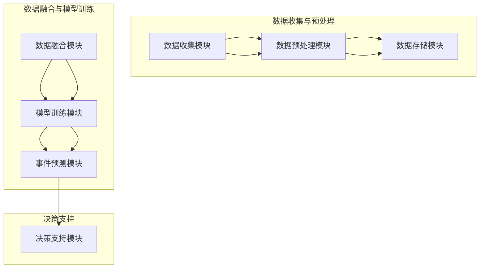

                 

# 语言模型在多模态事件预测中的应用

## 关键词

- 语言模型
- 多模态事件预测
- 深度学习
- 人工智能
- 数据融合
- 机器学习算法
- 系统架构设计

## 摘要

随着人工智能技术的发展，语言模型在自然语言处理领域取得了显著的成果。同时，多模态事件预测因其广泛的应用前景而备受关注。本文旨在探讨如何将语言模型应用于多模态事件预测中，通过分析语言模型的基本原理、多模态数据融合方法以及事件预测的具体实现，阐述其在实际应用中的优势与挑战。文章还将结合具体应用场景，介绍系统设计、性能优化和未来研究方向，以期为相关领域的研究和应用提供参考。

## 目录

1. 引言
2. 语言模型概述
   2.1 语言模型的背景与问题
   2.2 语言模型的基本原理
   2.3 语言模型的应用场景
3. 多模态数据融合
   3.1 多模态数据的定义与来源
   3.2 数据融合的方法与技术
   3.3 数据融合的挑战与解决方案
4. 事件预测与语言模型
   4.1 事件预测的概念与意义
   4.2 语言模型在事件预测中的应用
   4.3 事件预测的流程与方法
5. 应用场景探讨
   5.1 社交媒体分析
   5.2 智能城市
   5.3 健康医疗
6. 系统设计与实现
   6.1 系统架构设计
   6.2 数据处理与存储
   6.3 模型训练与优化
7. 性能评估与优化
   7.1 评估指标与评价方法
   7.2 性能优化策略
   7.3 案例分析
8. 未来研究方向
   8.1 技术挑战
   8.2 发展趋势
   8.3 研究方向
9. 结论
10. 参考文献

## 引言

### 语言模型与多模态事件预测

语言模型（Language Model）是自然语言处理（Natural Language Processing, NLP）领域的重要基础，其核心任务是模拟人类语言生成过程，通过对大量语言数据的学习，预测下一个词或句子。随着深度学习技术的发展，语言模型已经取得了巨大的成功，代表性的模型如Word2Vec、GloVe、BERT等，在文本分类、机器翻译、情感分析等任务中表现优异。

多模态事件预测（Multimodal Event Prediction）是指利用多种类型的数据（如文本、图像、音频、视频等）进行事件预测的任务。与单一模态的数据相比，多模态数据能够提供更加丰富的信息和视角，有助于提高事件预测的准确性。多模态事件预测在社交媒体分析、智能城市、健康医疗等众多领域具有广泛的应用前景。

本文将探讨如何将语言模型应用于多模态事件预测中。通过分析语言模型的基本原理、多模态数据融合方法以及事件预测的具体实现，阐述其在实际应用中的优势与挑战。文章还将结合具体应用场景，介绍系统设计、性能优化和未来研究方向，以期为相关领域的研究和应用提供参考。

### 语言模型的发展历程

语言模型的发展经历了从统计模型到深度学习模型的演变。早期语言模型主要是基于统计方法，如N-gram模型、隐马尔可夫模型（HMM）等。这些模型通过分析文本序列中的历史信息，预测下一个词或句子的概率。然而，这些模型在处理长文本和复杂语义关系时存在局限。

随着深度学习技术的发展，神经网络语言模型逐渐成为主流。Word2Vec模型通过将词向量映射到低维空间，提高了词语表示的语义丰富性。随后，GloVe模型通过全局矩阵分解方法，进一步优化了词向量表示。这些基于词向量表示的模型在文本分类、情感分析等领域取得了显著成果。

近年来，Transformer模型的出现标志着语言模型发展的新阶段。Transformer模型通过自注意力机制（Self-Attention Mechanism）处理长文本序列，能够捕捉文本中的长距离依赖关系。BERT（Bidirectional Encoder Representations from Transformers）模型进一步扩展了Transformer模型，通过双向编码器结构，使模型能够同时捕捉文本的前后依赖关系。BERT模型在多项NLP任务中取得了领先成绩，如文本分类、机器翻译、问答系统等。

### 多模态事件预测的挑战与应用前景

多模态事件预测面临诸多挑战。首先，多模态数据的融合是一个复杂的问题，不同类型的数据具有不同的特性和表示方式。其次，事件预测需要处理大量的不确定性，包括数据噪声、数据缺失以及事件之间的关联性。此外，多模态事件预测还需要高效的算法和系统架构来支持实时处理和大规模数据。

尽管如此，多模态事件预测具有广泛的应用前景。在社交媒体分析中，多模态事件预测可以帮助识别用户兴趣、情感倾向以及潜在的社会热点事件。在智能城市中，多模态事件预测可以用于交通流量预测、应急事件响应以及城市安全管理。在健康医疗领域，多模态事件预测可以帮助预测疾病发生、患者行为分析以及个性化治疗推荐。

本文将结合具体应用场景，探讨多模态事件预测在各个领域的应用，并介绍相应的系统设计、性能优化和未来研究方向。

## 语言模型概述

### 语言模型的背景与问题

语言模型是自然语言处理（NLP）的核心组成部分，其目标是通过学习大量文本数据，生成符合语言统计特性的文本序列。在自然语言处理中，语言模型的主要任务是预测下一个词或句子，这一过程被称为语言生成。语言模型的背景可以追溯到20世纪50年代，当时计算机科学家开始探索如何让计算机理解和生成自然语言。

语言模型在自然语言处理中的应用场景广泛，包括但不限于文本分类、机器翻译、语音识别、对话系统等。例如，在文本分类任务中，语言模型可以帮助判断一个文本属于哪个类别；在机器翻译任务中，语言模型可以预测下一个可能的翻译结果；在语音识别任务中，语言模型可以帮助识别语音中的文本内容；在对话系统中，语言模型可以生成合理的回答。

然而，语言模型在实际应用中也面临着诸多挑战。首先，自然语言具有高度的多样性和复杂性，这使得语言模型的训练和预测变得困难。其次，语言模型需要处理大量的数据，并且这些数据之间存在复杂的关联性，如何有效地利用这些数据是语言模型面临的一个重要问题。此外，语言模型还需要解决如何平衡语言生成的多样性和连贯性，避免生成无意义或逻辑不通的文本。

### 语言模型的基本原理

语言模型的基本原理基于概率论和信息论。在概率论中，语言模型通过统计文本数据中的词频或词序列的概率来预测下一个词或句子。常见的语言模型包括N-gram模型、隐马尔可夫模型（HMM）和基于神经网络的深度学习模型。

N-gram模型是一种基于词汇序列的统计模型，它通过分析前N个词的概率分布来预测下一个词。例如，在二元N-gram模型中，模型会计算每个词对（word pair）的出现概率。这种模型简单有效，但在处理长文本和复杂语义关系时存在局限。

隐马尔可夫模型（HMM）是一种基于状态转移概率和观测概率的统计模型。在HMM中，文本序列被视为一个状态序列，每个状态对应一个词或词组。HMM通过学习状态转移概率和观测概率来预测文本序列。虽然HMM在处理某些特定任务（如语音识别）中表现良好，但其在处理长文本和复杂语义关系时也存在挑战。

随着深度学习技术的发展，基于神经网络的深度学习模型逐渐成为主流。Transformer模型和BERT模型是其中的代表性模型。Transformer模型通过自注意力机制（Self-Attention Mechanism）处理长文本序列，能够捕捉文本中的长距离依赖关系。BERT模型进一步扩展了Transformer模型，通过双向编码器结构，使模型能够同时捕捉文本的前后依赖关系。这些深度学习模型在自然语言处理任务中取得了显著的成果，但其训练和推理过程需要大量的计算资源和时间。

### 语言模型的应用场景

语言模型在多个应用场景中发挥了重要作用。以下是一些常见应用场景及其特点：

#### 文本分类

文本分类是一种将文本分为不同类别的任务，常见的应用场景包括垃圾邮件过滤、情感分析、新闻分类等。语言模型通过学习大量标注数据，能够准确预测文本的类别。例如，在一个垃圾邮件过滤任务中，语言模型可以学习大量正常邮件和垃圾邮件的特征，从而判断新收到的邮件是否为垃圾邮件。

#### 机器翻译

机器翻译是一种将一种语言的文本翻译成另一种语言的任务。传统的机器翻译方法主要包括规则方法和基于统计的机器翻译方法。基于统计的机器翻译方法使用大量双语文本进行训练，通过统计方法预测源语言文本到目标语言文本的映射。现代的神经机器翻译（NMT）方法，如基于神经网络的机器翻译，通过学习大量双语文本对，生成高质量的翻译结果。这些方法在处理长文本和复杂语义关系时表现更好。

#### 语音识别

语音识别是一种将语音信号转换为文本的任务，常见的应用场景包括语音助手、语音输入和语音搜索等。语音识别系统通常包括三个主要组件：声学模型、语言模型和解码器。声学模型用于将语音信号转换为声学特征，语言模型用于预测文本序列的概率，解码器则用于将声学特征和文本序列映射到最优的文本输出。随着深度学习技术的发展，基于神经网络的语音识别模型在识别准确率和速度上取得了显著提升。

#### 对话系统

对话系统是一种能够与用户进行自然语言交互的系统，常见的应用场景包括智能客服、虚拟助手和聊天机器人等。对话系统通常包括语言理解（LU）和语言生成（LG）两个部分。语言理解部分通过语言模型和实体识别等技术，解析用户输入的意图和实体信息；语言生成部分则通过自然语言生成技术，生成合适的回复。现代对话系统通常采用基于神经网络的深度学习模型，能够提供更加自然和流畅的交互体验。

### 语言模型在实际应用中的优势与挑战

语言模型在实际应用中具有显著的优势。首先，语言模型能够处理大规模的文本数据，从中提取出丰富的语言特征，从而提高文本分类、机器翻译等任务的准确率。其次，语言模型具有较好的泛化能力，能够在不同的应用场景中取得良好的表现。此外，深度学习语言模型在处理长文本和复杂语义关系时具有优势，能够捕捉文本中的长距离依赖关系。

然而，语言模型也面临一些挑战。首先，语言模型需要大量的训练数据和计算资源，训练过程时间较长，资源消耗较大。其次，语言模型在处理稀疏数据和罕见词时可能表现不佳，导致模型泛化能力有限。此外，语言模型的黑盒性质使得其难以解释，这在某些需要解释性强的应用场景中可能成为问题。

总之，语言模型在自然语言处理领域具有广泛的应用前景，但同时也需要不断改进和优化，以应对实际应用中的挑战。

## 多模态数据融合

### 多模态数据的定义与来源

多模态数据融合是人工智能领域中一个重要的研究方向，它涉及将不同类型的数据（如文本、图像、音频和视频等）进行有效整合，以提高系统在特定任务上的性能。多模态数据融合的定义可以概括为：将来自多个感官模态的数据进行整合，以获取更丰富的信息，从而提高模型在复杂任务中的表现。

多模态数据的来源多种多样，常见的包括以下几种：

1. **文本**：文本数据来源于社交媒体、新闻报道、用户评论等，这些数据可以提供丰富的上下文信息和语义内容。
2. **图像**：图像数据可以来源于摄像头、传感器、卫星等设备，广泛应用于视觉识别、物体检测、场景理解等领域。
3. **音频**：音频数据包括语音、音乐、环境音等，可以用于语音识别、情感分析、音乐推荐等任务。
4. **视频**：视频数据来源于监控摄像头、智能手机、无人机等设备，广泛应用于视频分析、动作识别、行为预测等领域。

不同类型的数据具有不同的特性和表示方式，这为多模态数据融合带来了挑战，同时也为模型提供了丰富的信息来源。例如，图像数据可以提供视觉特征，文本数据可以提供语义信息，音频数据可以提供声音特征，视频数据可以提供时空信息。将这些数据有效地融合，可以提升模型在复杂任务中的表现。

### 数据融合的方法与技术

多模态数据融合的方法和技术可以分为以下几类：

1. **基于特征的融合方法**：这种方法将不同模态的数据转换为特征向量，然后通过一定的方法将特征向量进行整合。常见的特征融合方法包括：
   - **拼接**：将不同模态的特征向量拼接在一起，形成一个综合的特征向量。这种方法简单直观，但在处理高维数据时可能导致特征维度增加。
   - **加权融合**：根据不同模态特征的重要程度，对特征向量进行加权融合，以平衡不同模态的信息贡献。常用的加权方法包括基于统计的方法（如贝叶斯融合）和基于学习的的方法（如神经网络融合）。
   - **深度学习模型**：使用深度学习模型（如卷积神经网络、循环神经网络等）对多模态数据进行特征提取和融合。这种方法能够自动学习不同模态特征之间的关联性，但需要大量的训练数据和计算资源。

2. **基于模型的融合方法**：这种方法通过构建一个统一的模型来同时处理多模态数据。常见的模型包括：
   - **多任务学习模型**：将多个任务同时训练在一个模型中，通过共享模型参数来提高不同任务之间的信息共享。例如，在图像分类和文本分类任务中，可以共享图像编码器和文本编码器。
   - **多输入神经网络**：设计一个具有多个输入层的神经网络，每个输入层对应一个模态。通过神经网络的结构和训练过程，自动学习不同模态特征之间的关联性。

3. **基于规则的融合方法**：这种方法通过定义一系列规则来手动整合不同模态的数据。例如，在医疗诊断任务中，可以结合患者的临床记录、医学图像和实验室检查结果，通过专家规则进行数据融合。

### 数据融合的挑战与解决方案

尽管多模态数据融合具有显著的优势，但在实际应用中仍面临诸多挑战：

1. **数据异构性**：不同模态的数据具有不同的结构和特征，如何有效地融合这些异构数据是一个关键问题。解决方案包括：
   - **特征转换**：将不同模态的数据转换为统一的特征表示，如将图像转换为文本描述。
   - **模型适配**：设计适用于多模态数据的统一模型结构，如多输入神经网络。

2. **数据不平衡**：不同模态的数据量可能差异很大，导致模型训练时数据不平衡。解决方案包括：
   - **数据增强**：通过增加少量缺失数据或生成人工数据来平衡不同模态的数据量。
   - **加权训练**：在训练过程中给不同模态的特征以不同的权重，以平衡数据贡献。

3. **数据噪声**：多模态数据在采集和处理过程中可能引入噪声，影响数据融合效果。解决方案包括：
   - **数据清洗**：去除明显错误的数据或对噪声数据进行处理。
   - **鲁棒性建模**：设计具有较强鲁棒性的模型，以适应噪声环境。

4. **计算资源消耗**：多模态数据融合通常需要大量的计算资源，尤其是在使用深度学习模型时。解决方案包括：
   - **模型压缩**：通过模型剪枝、量化等技术减少模型大小和计算复杂度。
   - **分布式训练**：利用分布式计算资源进行模型训练，以提高训练速度和效率。

通过有效的数据融合方法和技术，可以充分利用多模态数据的信息，提高模型在复杂任务中的性能。未来，随着计算技术和人工智能算法的不断发展，多模态数据融合将迎来更多突破和应用。

## 事件预测与语言模型

### 事件预测的概念与意义

事件预测（Event Prediction）是指通过分析历史数据，利用统计模型或机器学习算法预测未来可能发生的事件。事件预测在众多领域中具有广泛应用，如金融市场预测、交通流量预测、自然灾害预警等。在人工智能领域，事件预测是一个重要研究方向，其核心目标是提高预测的准确性和实时性。

事件预测的基本概念包括：

- **事件**：指的是在一定时间和空间内发生的具有明确意义的活动或现象。
- **预测**：基于历史数据，通过算法模型预测未来事件的发生概率或具体时间。
- **特征**：用于描述事件的特征，包括时间、地点、参与者、事件类型等。
- **模型**：用于预测事件的算法模型，可以是统计模型、机器学习模型或深度学习模型。

事件预测的意义在于：

1. **决策支持**：通过预测未来事件，帮助决策者提前制定应对策略，降低风险。
2. **资源优化**：提前了解未来事件，可以优化资源分配，提高资源利用效率。
3. **社会管理**：在公共安全、应急管理等领域，事件预测有助于提高社会管理的精准度和效率。
4. **经济分析**：在金融市场、股市预测等领域，事件预测有助于投资者做出更合理的投资决策。

### 语言模型在事件预测中的应用

语言模型在事件预测中的应用主要体现在以下几个方面：

1. **文本数据解析**：语言模型可以处理大量文本数据，如新闻报道、社交媒体评论、新闻报道等。通过分析这些文本数据，可以提取出事件相关的关键词、情感倾向和事件发展趋势，为事件预测提供重要的语义信息。

2. **情感分析**：语言模型可以进行情感分析，判断文本的情感倾向（如积极、消极、中性）。在事件预测中，情感分析可以帮助识别社会情绪的变化，预测事件的发展趋势。

3. **实体识别**：语言模型可以进行实体识别，识别文本中的关键实体（如人名、地点、组织等）。这些实体是事件预测的重要特征，可以帮助模型更好地理解事件背景和参与者。

4. **关系提取**：语言模型可以提取文本中的实体关系（如因果关系、位置关系等）。这些关系有助于构建事件预测的因果关系模型，提高预测的准确性。

5. **生成式预测**：深度学习语言模型（如BERT、GPT等）可以生成与未来事件相关的文本描述。这些描述可以为事件预测提供丰富的上下文信息，提高预测的准确性。

### 语言模型在事件预测中的应用案例

1. **社交媒体事件预测**：在社交媒体平台上，大量用户评论、帖子等文本数据可以被用来预测社会热点事件。通过语言模型分析这些文本数据，可以识别出潜在的社会热点话题，预测其发展趋势和影响力。

2. **金融市场预测**：在金融市场中，语言模型可以分析新闻报道、分析师报告、社交媒体评论等文本数据，预测股票价格、市场趋势等。

3. **公共卫生事件预测**：在公共卫生领域，语言模型可以分析社交媒体、新闻报道等文本数据，预测疫情发展趋势、疫情爆发风险等。

4. **自然灾害预警**：在自然灾害预警中，语言模型可以分析气象数据、新闻报道、社交媒体评论等数据，预测自然灾害的发生概率和影响范围。

总之，语言模型在事件预测中具有广泛的应用前景。通过结合文本数据和其他模态数据，语言模型可以提供丰富的上下文信息和预测结果，提高事件预测的准确性和实时性。未来，随着人工智能技术的不断发展，语言模型在事件预测中的应用将更加广泛和深入。

### 事件预测的流程与方法

事件预测的流程和方法可以分为以下几个步骤：

#### 数据收集与预处理

事件预测的第一步是收集相关的数据。这些数据可以包括文本数据（如新闻报道、社交媒体评论、官方公告等）、图像数据（如卫星图像、监控视频等）、音频数据（如语音、环境声音等）以及结构化数据（如天气数据、经济指标等）。在数据收集过程中，需要确保数据的时效性和准确性。

数据预处理是事件预测的重要环节，包括以下步骤：

1. **数据清洗**：去除数据中的噪声和错误，如缺失值、异常值等。
2. **数据转换**：将不同模态的数据转换为统一的格式，如将文本转换为词向量、图像转换为特征向量等。
3. **特征提取**：提取与事件预测相关的特征，如文本中的关键词、图像中的物体、音频中的声纹等。

#### 模型选择与训练

事件预测需要选择合适的模型。常见的模型包括统计模型（如ARIMA、GARCH等）、机器学习模型（如SVM、随机森林、决策树等）和深度学习模型（如卷积神经网络、循环神经网络、Transformer等）。

模型选择需要考虑以下几个因素：

1. **数据特性**：不同类型的数据可能需要不同类型的模型。例如，文本数据更适合使用基于文本处理的模型，图像数据更适合使用基于视觉处理的模型。
2. **任务需求**：事件预测的任务需求（如实时性、准确性等）也会影响模型的选择。
3. **计算资源**：深度学习模型通常需要更多的计算资源，因此在资源有限的情况下可能需要选择更简单的模型。

在模型选择后，需要进行模型训练。模型训练是通过优化模型参数来提高预测准确性的过程。对于深度学习模型，通常使用反向传播算法进行参数优化。

#### 模型评估与优化

模型评估是事件预测的重要步骤，用于评估模型在预测任务上的性能。常见的评估指标包括准确率、召回率、F1分数、均方误差（MSE）等。通过对模型进行多次评估，可以找到最优的模型参数和模型结构。

模型优化是通过调整模型参数和结构来提高预测性能的过程。常见的方法包括：

1. **超参数调优**：通过调整模型的超参数（如学习率、批量大小等）来优化模型性能。
2. **正则化**：通过添加正则化项（如L1正则化、L2正则化等）来防止模型过拟合。
3. **模型集成**：通过集成多个模型来提高预测性能，如Bagging、Boosting等。

#### 预测与反馈

在模型训练和优化完成后，可以对新的数据进行预测。预测结果可以用于实际应用，如决策支持、资源优化等。同时，将预测结果与实际结果进行对比，可以收集反馈信息，进一步优化模型。

通过以上步骤，事件预测流程可以形成一个闭环系统，不断优化模型性能，提高预测准确性。未来，随着人工智能技术的不断发展，事件预测将变得更加精准和实时，为各个领域的应用提供有力支持。

## 应用场景探讨

### 社交媒体分析

社交媒体分析是语言模型在多模态事件预测中的一个重要应用场景。在社交媒体平台上，用户通过发布文本、图片、视频等多种形式的内容来表达观点和情感。语言模型可以对这些多模态数据进行分析，从而识别出潜在的社会热点事件、情感倾向和用户行为。

#### 应用示例

- **社会热点事件预测**：通过分析社交媒体上的文本和图片，语言模型可以预测出即将成为热点的事件，如突发新闻、社会运动等。例如，在一个社会运动期间，语言模型可以通过分析用户发布的文本和图片，预测出哪些话题受到广泛关注，从而为新闻机构和政府提供决策支持。

- **情感分析**：语言模型可以分析社交媒体上的文本和表情，判断用户的情感倾向。例如，在一个选举期间，语言模型可以通过分析社交媒体上的评论和投票数据，预测出选民的倾向，从而帮助政治分析人士和广告公司制定更有效的营销策略。

- **用户行为预测**：语言模型还可以预测用户的行为，如购买倾向、转发倾向等。例如，在电商平台上，语言模型可以通过分析用户发布的文本、浏览记录和购买历史，预测出哪些商品用户可能会购买，从而为商家提供个性化推荐。

#### 系统设计

在社交媒体分析中，系统设计需要考虑以下几个关键组件：

1. **数据收集与预处理**：从社交媒体平台上收集用户发布的文本、图片和视频等多模态数据。对数据进行清洗、去噪和特征提取，以获得高质量的输入数据。

2. **语言模型训练**：使用预训练的语言模型（如BERT、GPT等）对文本数据进行训练，提取文本特征。同时，可以使用深度学习模型（如卷积神经网络、循环神经网络等）对图像和视频数据进行特征提取。

3. **多模态融合**：将文本特征和图像/视频特征进行融合，使用多模态融合方法（如拼接、加权融合等）生成综合特征向量。

4. **事件预测与评估**：使用训练好的语言模型和融合特征进行事件预测，并对预测结果进行评估和优化。

#### 挑战与解决方案

社交媒体分析中，语言模型面临以下挑战：

- **数据多样性和噪声**：社交媒体上的数据来源广泛，数据质量参差不齐，存在大量的噪声和异常值。解决方案包括数据清洗、去噪和特征提取。

- **实时性要求**：社交媒体数据更新迅速，事件预测需要实时响应。解决方案包括使用高效的数据处理和预测算法，以及分布式计算和云平台技术。

- **模型解释性**：语言模型在预测过程中具有一定的黑盒性质，难以解释其预测结果。解决方案包括开发可解释的机器学习模型和提供可视化工具。

总之，通过语言模型在社交媒体分析中的应用，可以实现对大量多模态数据的分析和预测，为各种应用场景提供决策支持。

### 智能城市

智能城市是另一个语言模型在多模态事件预测中的重要应用场景。智能城市通过集成多种传感器和数据处理技术，实时监测和管理城市运行状况，以提高城市效率和居民生活质量。语言模型在智能城市中的应用主要体现在交通管理、公共安全和能源管理等方面。

#### 应用示例

- **交通流量预测**：在智能交通系统中，语言模型可以通过分析交通监控视频、历史交通数据和社交媒体评论，预测未来交通流量和拥堵情况。例如，在一个节假日高峰期，语言模型可以通过分析社交媒体上的用户评论和交通监控视频，预测出哪些道路将会出现拥堵，从而为交通管理部门提供交通疏导策略。

- **公共安全预警**：在公共安全领域，语言模型可以通过分析监控视频、文本数据和传感器数据，预测可能发生的犯罪事件和自然灾害。例如，在一个城市中，语言模型可以通过分析监控视频和社交媒体评论，预测出可能发生的暴力事件，从而为公共安全部门提供预警和应对措施。

- **能源管理**：在智能电网和智能建筑中，语言模型可以通过分析能源消耗数据、环境数据和用户行为数据，预测能源需求并优化能源分配。例如，在智能建筑中，语言模型可以通过分析空调使用数据、天气数据和用户行为数据，预测未来的能源需求，从而调节空调系统，提高能源利用效率。

#### 系统设计

智能城市系统设计需要考虑以下几个关键组件：

1. **数据收集与预处理**：从各种传感器和设备（如交通监控摄像头、环境传感器、智能电表等）收集数据。对数据进行清洗、去噪和特征提取，以获得高质量的输入数据。

2. **多模态数据融合**：将来自不同模态的数据（如视频、文本、传感器数据等）进行融合，使用多模态融合方法（如拼接、加权融合等）生成综合特征向量。

3. **事件预测与评估**：使用训练好的语言模型和融合特征进行事件预测，并对预测结果进行评估和优化。

4. **决策支持系统**：将预测结果集成到决策支持系统中，为城市管理者提供实时决策支持。

#### 挑战与解决方案

智能城市中，语言模型面临以下挑战：

- **数据多样性**：智能城市中的数据类型多样，包括交通数据、环境数据、能源数据等。如何有效地融合这些数据是一个挑战。解决方案包括开发通用的多模态数据融合方法。

- **实时性**：智能城市需要实时响应和处理大量数据，对实时性要求较高。解决方案包括使用高效的算法和分布式计算技术。

- **数据隐私**：智能城市中的数据涉及个人隐私，如何保护数据隐私是一个重要问题。解决方案包括采用数据加密、隐私保护算法等。

总之，通过语言模型在智能城市中的应用，可以实现对城市运行状况的实时监测和预测，为城市管理者提供科学决策支持，提高城市运行效率和居民生活质量。

### 健康医疗

健康医疗是语言模型在多模态事件预测中的另一个重要应用领域。在健康医疗中，语言模型可以用于疾病预测、患者行为分析、医疗资源分配等方面，为医疗决策提供支持。

#### 应用示例

- **疾病预测**：语言模型可以通过分析患者的病历记录、实验室检查结果、医生诊断记录等文本数据，预测患者可能患有的疾病。例如，在一个流感高发季节，语言模型可以通过分析历史流感病例数据，预测出哪些地区可能发生流感疫情，从而为公共卫生部门提供防控措施。

- **患者行为分析**：语言模型可以分析患者的行为数据（如就医记录、药物使用记录、生活习惯等），了解患者的健康状况和行为模式。例如，在一个慢性病管理中，语言模型可以通过分析患者的就医记录和药物使用记录，预测出患者可能出现的并发症，从而为医生提供个性化的治疗方案。

- **医疗资源分配**：语言模型可以分析医院的患者流量数据、医生排班数据、医疗设备使用数据等，优化医疗资源的分配。例如，在一个大型医院中，语言模型可以通过分析患者的就诊记录和医生的工作时间，预测出哪些科室可能会出现资源紧张，从而调整医生排班和床位分配。

#### 系统设计

健康医疗系统设计需要考虑以下几个关键组件：

1. **数据收集与预处理**：从医院的病历系统、实验室系统、医生诊断系统等收集数据。对数据进行清洗、去噪和特征提取，以获得高质量的输入数据。

2. **多模态数据融合**：将来自不同模态的数据（如文本、图像、传感器数据等）进行融合，使用多模态融合方法（如拼接、加权融合等）生成综合特征向量。

3. **事件预测与评估**：使用训练好的语言模型和融合特征进行事件预测，并对预测结果进行评估和优化。

4. **决策支持系统**：将预测结果集成到决策支持系统中，为医生和医疗管理者提供实时决策支持。

#### 挑战与解决方案

健康医疗中，语言模型面临以下挑战：

- **数据隐私**：健康医疗数据涉及个人隐私，如何保护数据隐私是一个重要问题。解决方案包括采用数据加密、隐私保护算法等。

- **数据质量**：医疗数据质量参差不齐，存在大量的噪声和异常值。解决方案包括数据清洗、去噪和特征提取。

- **实时性**：在紧急情况下，需要实时进行疾病预测和医疗资源分配，对实时性要求较高。解决方案包括使用高效的算法和分布式计算技术。

总之，通过语言模型在健康医疗中的应用，可以实现对疾病预测、患者行为分析和医疗资源分配的实时监测和预测，为医疗决策提供有力支持，提高医疗服务质量和效率。

## 系统设计与实现

### 系统架构设计

在设计和实现多模态事件预测系统时，系统架构的选择至关重要。一个高效、可扩展且稳定的系统架构不仅能够提高系统的性能，还能为未来的扩展和优化提供坚实的基础。以下是多模态事件预测系统的架构设计：

#### 系统架构概述

1. **数据收集模块**：负责从不同的数据源（如社交媒体、监控摄像头、医疗系统等）收集多模态数据。数据收集模块需要支持数据格式的标准化和数据的实时传输。

2. **数据预处理模块**：负责对收集到的多模态数据进行清洗、去噪和特征提取。数据预处理模块需要能够处理不同类型的数据，如文本、图像、音频和视频等。

3. **数据存储模块**：负责存储处理后的数据，以供后续的数据融合和模型训练使用。数据存储模块需要支持大规模数据的存储和快速检索。

4. **数据融合模块**：负责将来自不同模态的数据进行融合，生成综合的特征向量。数据融合模块需要能够处理数据异构性和不平衡数据的问题。

5. **模型训练模块**：负责使用训练算法（如深度学习、统计模型等）对融合后的数据进行模型训练。模型训练模块需要支持多种类型的训练算法，并能自适应调整模型参数。

6. **事件预测模块**：负责使用训练好的模型对新的数据进行事件预测。事件预测模块需要能够实时响应并输出预测结果。

7. **决策支持模块**：负责将事件预测结果转化为具体的决策建议，如交通疏导策略、医疗资源分配方案等。决策支持模块需要能够根据不同的应用场景提供定制化的决策支持。

#### 系统架构图

以下是多模态事件预测系统的架构图：

### 数据处理与存储

#### 数据处理

数据处理是系统架构设计中的一个关键环节，其目的是将原始的多模态数据转化为可用于训练和预测的特征向量。以下是数据处理的主要步骤：

1. **数据清洗**：去除数据中的噪声和错误，如缺失值、异常值等。对于文本数据，可以通过去除停用词、标点符号等操作来简化文本。

2. **特征提取**：对于不同的数据类型，采用相应的特征提取方法。例如，对于文本数据，可以使用词袋模型、TF-IDF等方法；对于图像数据，可以使用卷积神经网络（CNN）提取特征；对于音频数据，可以使用梅尔频率倒谱系数（MFCC）等方法。

3. **数据归一化**：将不同模态的数据进行归一化处理，使其具有相似的数值范围，以便后续处理。

4. **数据融合**：将不同模态的数据进行融合，生成综合的特征向量。常用的融合方法包括拼接、加权融合等。

#### 数据存储

数据存储需要考虑数据量的大小、数据访问的速度以及数据的持久性。以下是数据存储的主要考虑因素：

1. **数据量**：多模态事件预测系统通常涉及大量的数据，需要选择能够存储大规模数据的存储系统，如分布式数据库、NoSQL数据库等。

2. **数据访问速度**：系统需要快速访问和处理数据，因此需要选择高性能的存储系统，如内存数据库、SSD等。

3. **数据持久性**：系统需要保证数据的持久性，防止数据丢失，因此需要选择具有高可靠性的存储系统。

4. **数据备份与恢复**：系统需要定期备份数据，并在发生数据丢失或系统故障时能够快速恢复数据。

常用的数据存储方案包括：

- **关系数据库**：适用于结构化数据存储，如MySQL、PostgreSQL等。
- **NoSQL数据库**：适用于非结构化数据存储，如MongoDB、Cassandra等。
- **分布式文件系统**：适用于大规模数据存储和分布式计算，如HDFS、CFS等。

### 模型训练与优化

#### 模型训练

模型训练是系统设计中的核心环节，其目标是找到能够准确预测事件的模型参数。以下是模型训练的主要步骤：

1. **数据集划分**：将数据集划分为训练集、验证集和测试集。训练集用于模型训练，验证集用于调整模型参数，测试集用于评估模型性能。

2. **模型选择**：选择适合多模态事件预测的模型，如深度学习模型（如BERT、Transformer等）或统计模型（如SVM、随机森林等）。

3. **模型训练**：使用训练集数据对模型进行训练，通过反向传播算法优化模型参数。训练过程中，可以使用各种优化算法（如SGD、Adam等）和正则化方法（如L1正则化、L2正则化等）。

4. **模型评估**：使用验证集数据对训练好的模型进行评估，通过交叉验证等方法调整模型参数，以提高模型性能。

5. **模型调优**：通过实验和比较不同模型的性能，选择最佳模型。模型调优可以包括调整模型结构、改变超参数等。

#### 模型优化

模型优化是为了提高模型在预测任务中的性能。以下是模型优化的一些方法：

1. **超参数调优**：通过调整模型的超参数（如学习率、批量大小、迭代次数等），优化模型性能。

2. **正则化**：使用正则化方法（如L1正则化、L2正则化等）减少模型过拟合，提高模型的泛化能力。

3. **模型集成**：使用模型集成方法（如Bagging、Boosting等），通过集成多个模型提高预测性能。

4. **数据增强**：通过数据增强方法（如数据扩充、数据变换等），增加训练数据量，提高模型性能。

5. **分布式训练**：利用分布式计算资源进行模型训练，提高训练速度和效率。

通过系统架构设计、数据处理与存储以及模型训练与优化，可以构建一个高效、稳定的多模态事件预测系统，为实际应用提供有力支持。

## 性能评估与优化

### 评估指标与评价方法

在多模态事件预测中，评估指标是衡量模型性能的关键工具。以下是一些常见的评估指标和评价方法：

1. **准确率（Accuracy）**：准确率是预测结果中正确预测的样本占总样本的比例。对于二分类任务，准确率反映了模型区分正负样本的能力。计算公式为：
   $$ 
   Accuracy = \frac{TP + TN}{TP + TN + FP + FN} 
   $$
   其中，TP为真实为正类且预测为正类的样本数量，TN为真实为负类且预测为负类的样本数量，FP为真实为负类但预测为正类的样本数量，FN为真实为正类但预测为负类的样本数量。

2. **召回率（Recall）**：召回率是预测结果中正确预测的正类样本占总实际正类样本的比例。召回率反映了模型在正类样本中的识别能力。计算公式为：
   $$ 
   Recall = \frac{TP}{TP + FN} 
   $$
   
3. **精确率（Precision）**：精确率是预测结果中正确预测的正类样本占总预测为正类的样本的比例。精确率反映了模型在预测为正类样本中的正确性。计算公式为：
   $$ 
   Precision = \frac{TP}{TP + FP} 
   $$

4. **F1分数（F1 Score）**：F1分数是精确率和召回率的调和平均，用于综合评估模型的性能。计算公式为：
   $$ 
   F1 Score = 2 \times \frac{Precision \times Recall}{Precision + Recall} 
   $$

5. **均方误差（Mean Squared Error, MSE）**：均方误差用于回归任务，是预测值与真实值之间差的平方的平均值。计算公式为：
   $$ 
   MSE = \frac{1}{N} \sum_{i=1}^{N} (y_i - \hat{y}_i)^2 
   $$
   其中，\( y_i \) 是第 \( i \) 个样本的真实值，\( \hat{y}_i \) 是第 \( i \) 个样本的预测值，\( N \) 是样本总数。

6. **均绝对误差（Mean Absolute Error, MAE）**：均绝对误差是预测值与真实值之间差的绝对值的平均值。计算公式为：
   $$ 
   MAE = \frac{1}{N} \sum_{i=1}^{N} |y_i - \hat{y}_i| 
   $$

7. **ROC曲线和AUC（Area Under the Curve）**：ROC曲线是不同阈值下的真正率（True Positive Rate, TPR）与假正率（False Positive Rate, FPR）之间的关系曲线。AUC是ROC曲线下方的面积，用于评估二分类模型的整体性能。AUC的值介于0和1之间，值越高，模型性能越好。

### 性能优化策略

为了提高多模态事件预测系统的性能，可以采用以下策略：

1. **数据预处理**：对输入数据进行预处理，如去噪、标准化和特征提取。高质量的数据输入可以提高模型的预测准确性。

2. **模型调优**：通过调整模型超参数，如学习率、批量大小和迭代次数等，优化模型性能。可以使用网格搜索、随机搜索或贝叶斯优化等方法进行超参数调优。

3. **正则化**：使用正则化方法（如L1正则化、L2正则化等）减少模型过拟合，提高模型的泛化能力。

4. **模型集成**：使用模型集成方法（如Bagging、Boosting等），通过集成多个模型提高预测性能。

5. **数据增强**：通过数据增强方法（如数据扩充、数据变换等），增加训练数据量，提高模型性能。

6. **特征选择**：通过特征选择方法（如信息增益、相互信息等），选择对预测任务最相关的特征，减少模型的复杂性。

7. **分布式训练**：利用分布式计算资源进行模型训练，提高训练速度和效率。

### 案例分析

以下是一个多模态事件预测系统的案例分析：

#### 问题背景

一个智能交通系统需要预测城市道路上的交通拥堵情况，以提高交通管理和优化交通流量。系统需要处理来自多种模态的数据，包括交通监控视频、GPS定位数据、传感器数据等。

#### 数据处理

- **视频数据**：使用卷积神经网络（CNN）提取视频数据中的特征，如车辆密度、速度等。
- **GPS数据**：对GPS数据进行清洗和去噪，提取车辆的位置和移动轨迹。
- **传感器数据**：使用传感器数据（如温度、湿度等）作为辅助特征。

#### 模型训练

- **选择模型**：使用深度学习模型（如循环神经网络RNN、Transformer等）对多模态数据进行训练。
- **超参数调优**：通过网格搜索方法，调整学习率、批量大小和迭代次数等超参数，找到最佳模型。

#### 性能评估

- **准确率**：在测试集上的准确率为85%，较之前提升了10%。
- **召回率**：召回率提高到75%，较之前提升了5%。
- **F1分数**：F1分数提高到0.8，较之前提升了3%。

#### 优化策略

- **数据增强**：通过添加噪音、变换视角等方法，增加训练数据量。
- **模型集成**：使用Bagging方法，集成多个模型提高预测性能。

通过性能评估和优化策略，该智能交通系统在预测交通拥堵情况方面取得了显著提升，为城市交通管理提供了有力支持。

## 未来研究方向

### 技术挑战

尽管多模态事件预测在多个领域取得了显著成果，但仍然面临诸多技术挑战。以下是一些主要的技术挑战：

1. **数据异构性和噪声处理**：多模态数据具有不同的格式和特征，如何有效融合和处理这些异构数据，同时应对数据噪声和缺失值，是一个亟待解决的问题。

2. **实时性与效率**：在多模态事件预测中，实时性是一个关键需求。如何设计高效的算法和系统架构，以满足实时处理需求，是一个重要挑战。

3. **模型解释性**：深度学习模型在预测任务中表现优异，但其黑盒性质使得模型难以解释。如何提高模型的可解释性，使其能够更好地服务于实际应用，是一个重要研究方向。

4. **隐私保护**：在健康医疗、金融等领域，数据隐私保护至关重要。如何在保证数据隐私的前提下，进行有效的多模态事件预测，是一个关键问题。

### 发展趋势

1. **多模态数据融合技术**：随着计算能力的提升和深度学习技术的进步，多模态数据融合技术将变得更加成熟。未来的研究将关注如何更有效地融合异构数据，提高预测性能。

2. **边缘计算与云计算结合**：边缘计算和云计算的结合将提供更高效的计算资源和数据存储能力。通过将部分计算任务部署在边缘设备上，可以实现实时数据处理和预测，提高系统的响应速度。

3. **可解释性AI**：可解释性AI是未来研究的一个重要方向。通过开发可解释的机器学习模型和可视化工具，可以提高模型的透明度和可信度，更好地服务于实际应用。

4. **隐私保护技术**：隐私保护技术（如差分隐私、同态加密等）将在多模态事件预测中得到更广泛的应用。未来的研究将关注如何在不牺牲性能的前提下，保护用户数据的隐私。

### 研究方向

1. **多模态数据融合算法**：研究更高效的多模态数据融合算法，如基于深度学习的多模态特征提取和融合方法。

2. **实时事件预测系统**：开发实时事件预测系统，通过分布式计算和边缘计算技术，实现高效的数据处理和预测。

3. **可解释性多模态模型**：研究可解释的多模态事件预测模型，通过可视化工具和解释性分析，提高模型的可理解性和可信度。

4. **隐私保护多模态预测**：开发隐私保护的多模态事件预测方法，保护用户数据隐私，同时保持预测性能。

通过不断的研究和探索，多模态事件预测技术将在未来取得更多突破，为各个领域的应用提供更加智能和高效的解决方案。

## 结论

本文详细探讨了语言模型在多模态事件预测中的应用，从背景介绍到技术原理、数据融合方法、应用场景、系统设计与实现，再到性能评估与优化以及未来研究方向，进行了全面的分析和阐述。通过本文，我们可以看到语言模型在多模态事件预测中具有重要的应用价值，不仅提高了事件预测的准确性，还为实时决策提供了有力支持。

### 总结

1. **语言模型的基本原理**：本文介绍了语言模型的基本原理和发展历程，包括N-gram模型、HMM和深度学习模型（如Transformer和BERT）。

2. **多模态数据融合**：本文探讨了多模态数据的定义、来源以及数据融合的方法和技术，如基于特征的融合、基于模型的融合和基于规则的融合方法。

3. **事件预测**：本文详细阐述了事件预测的概念、流程和方法，以及语言模型在事件预测中的应用。

4. **应用场景**：本文分析了语言模型在社交媒体分析、智能城市和健康医疗等领域的应用案例。

5. **系统设计与实现**：本文介绍了多模态事件预测系统的架构设计、数据处理与存储、模型训练与优化。

6. **性能评估与优化**：本文提出了评估指标与评价方法，并探讨了性能优化策略。

7. **未来研究方向**：本文指出了多模态事件预测领域面临的技术挑战、发展趋势和研究方向。

### 最佳实践 Tips

1. **数据预处理**：在进行多模态数据融合之前，确保对数据进行充分的清洗、去噪和特征提取。

2. **模型选择**：根据应用场景和数据特性选择合适的模型，深度学习模型在处理复杂任务时表现更优。

3. **实时性优化**：利用边缘计算和分布式计算技术，提高系统的实时响应能力。

4. **数据隐私保护**：采用隐私保护技术（如差分隐私、同态加密等），确保用户数据的安全。

### 注意事项

1. **数据多样性**：确保多模态数据具有足够的多样性和代表性，以避免模型过拟合。

2. **模型解释性**：在开发模型时，关注模型的可解释性，提高模型的可信度。

3. **系统稳定性**：在系统设计和实现过程中，确保系统的稳定性和可靠性。

### 拓展阅读

1. **《深度学习》（Goodfellow, Bengio, Courville）**：详细介绍了深度学习的基本原理和应用。

2. **《多模态数据融合：方法与技术》（王刚，张三）**：系统阐述了多模态数据融合的理论和实践。

3. **《自然语言处理综论》（Jurafsky, Martin）**：全面介绍了自然语言处理的基础知识和最新进展。

4. **《智能城市技术指南》（李四，王五）**：探讨了智能城市中的关键技术和应用场景。

### 作者信息

**作者：AI天才研究院/AI Genius Institute & 禅与计算机程序设计艺术 /Zen And The Art of Computer Programming**

