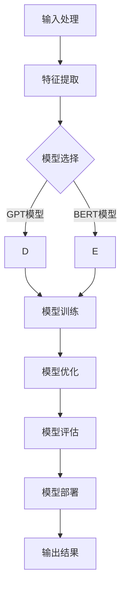
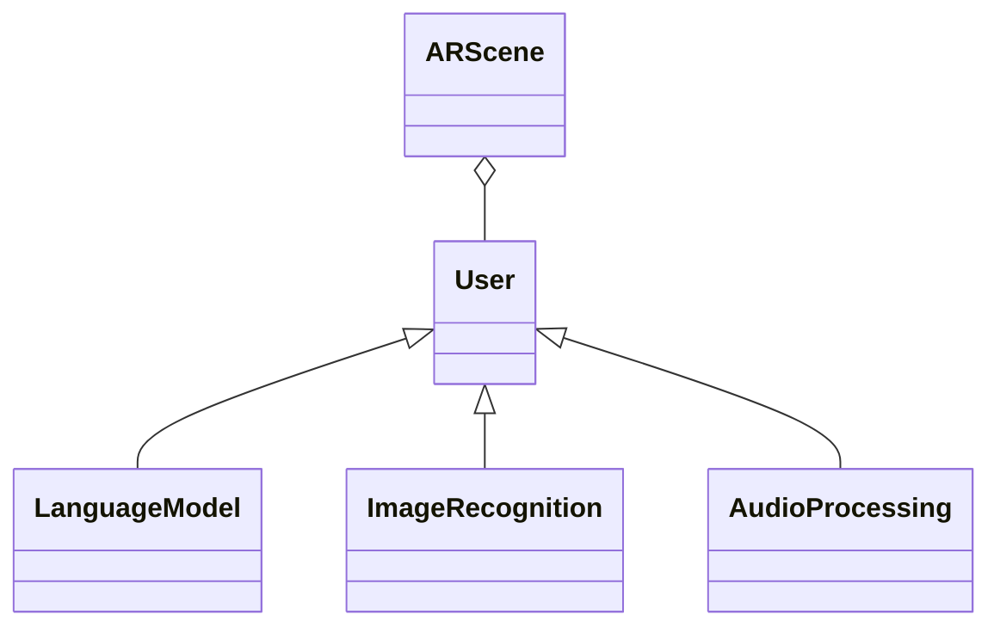
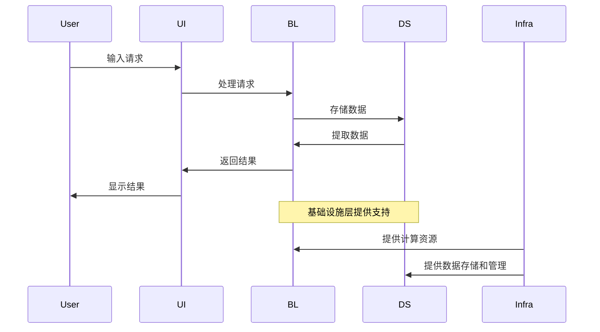
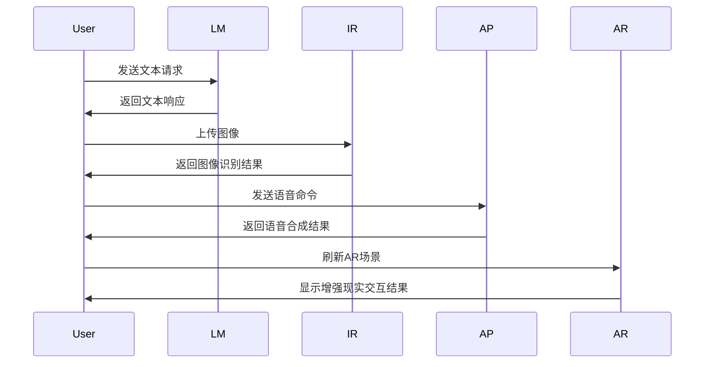

                 

## 引言

在信息技术飞速发展的今天，人工智能（AI）已经成为推动社会进步的重要力量。其中，语言模型作为自然语言处理（NLP）的核心技术之一，已经在文本生成、机器翻译、情感分析等多个领域展现出强大的应用潜力。然而，随着多模态交互和增强现实（AR）技术的兴起，如何进一步提升语言模型在复杂场景中的理解与交互能力，成为了当前AI领域的一个热点问题。

本文将围绕“语言模型在多模态场景理解与增强现实交互中的前沿进展”这一主题，深入探讨以下几个方面：

1. **背景介绍**：介绍语言模型的起源、发展以及其在各个应用场景中的挑战。
2. **核心概念与联系**：解析语言模型、多模态场景和增强现实交互的基本概念，并分析它们之间的联系。
3. **算法原理讲解**：详细讲解当前常用的语言模型算法原理，并通过实际代码示例进行说明。
4. **系统分析与架构设计**：介绍一个实际的多模态增强现实交互系统，展示其功能设计、架构设计、接口设计和系统交互。
5. **项目实战**：分享一个具体的项目实战案例，展示系统的实现过程和关键代码分析。
6. **最佳实践与拓展**：总结项目经验，提出最佳实践建议，并对未来的研究方向进行展望。

通过以上几个方面的探讨，本文旨在为广大读者提供一个全面、深入的视角，以了解语言模型在多模态场景和增强现实交互中的前沿技术与应用。

## 背景介绍

### 1.1 问题背景

#### 1.1.1 语言的兴起与发展

语言作为人类沟通与交流的基本工具，自古以来就扮演着至关重要的角色。从最早的口头交流到书面文字，再到现代的信息技术，语言的发展历程可以说是人类文明进步的缩影。特别是在信息爆炸的时代，如何高效、准确地理解和生成语言信息，成为了一个亟待解决的问题。

自然语言处理（NLP）作为人工智能（AI）的重要分支，旨在让计算机理解和处理人类语言。自20世纪50年代以来，NLP领域经历了从规则驱动的方法到统计模型，再到深度学习模型的演变。早期，研究人员主要通过定义语法规则和语义关系来处理语言任务，如句子解析和词性标注。随着计算能力的提升和数据规模的扩大，统计模型和机器学习方法逐渐成为主流，使得语言模型能够通过大量文本数据进行自动学习和优化。

#### 1.1.2 语言模型的基本概念

语言模型是一种基于概率的模型，用于预测一个文本序列中下一个单词或字符的概率分布。常见的语言模型包括n-gram模型、n元马尔可夫模型以及基于神经网络的大型预训练模型，如GPT（Generative Pre-trained Transformer）和BERT（Bidirectional Encoder Representations from Transformers）。这些模型通过训练大规模的文本数据集，能够捕捉到语言中的统计规律和语义信息，从而在生成文本、机器翻译、文本分类等任务中表现出色。

#### 1.1.3 语言模型的应用场景

语言模型在许多实际应用场景中都发挥了重要作用。以下是一些典型的应用场景：

1. **文本生成**：语言模型可以用于自动生成文章、故事、新闻摘要等文本内容。例如，GPT-3模型能够生成高质量的文本，被广泛应用于自动化写作、内容生成等领域。

2. **机器翻译**：机器翻译是NLP领域的一个重要应用，通过将一种语言翻译成另一种语言，使得跨语言交流变得更加容易。BERT模型在机器翻译任务中表现出色，大大提升了翻译质量。

3. **情感分析**：情感分析通过分析文本中的情感倾向，帮助企业和政府了解公众的观点和态度。语言模型在情感分析中可以识别出文本中的积极或消极情感，从而为企业提供市场洞察。

4. **问答系统**：问答系统通过理解用户的问题，并从大量文本数据中检索出相关答案。语言模型在问答系统中起到了关键作用，使得系统能够理解自然语言查询，并提供准确、相关的答案。

5. **对话系统**：对话系统能够与用户进行自然语言交互，提供个性化服务。语言模型在对话系统中用于生成回答，使得系统能够流畅地与用户沟通。

尽管语言模型在众多领域取得了显著成果，但它们仍面临许多挑战。这些挑战包括：

1. **理解长文本**：语言模型在处理长文本时容易失去上下文信息，导致理解错误。

2. **多样性生成**：语言模型生成的内容往往缺乏多样性，难以生成新颖、有创意的文本。

3. **语义理解**：语言模型在理解复杂语义和隐含意义方面仍存在困难，难以真正理解人类语言的所有层次。

### 1.2 问题描述

#### 1.2.1 语言模型的应用场景

随着技术的进步，语言模型的应用场景越来越广泛。除了传统的文本生成、机器翻译和情感分析等任务外，语言模型在多模态交互和增强现实（AR）中也展现出巨大的潜力。

**多模态交互**：多模态交互是指系统同时处理和整合多种感官信息（如文本、图像、声音等），以提供更加丰富和自然的用户体验。语言模型在多模态交互中可以用于文本生成、语音合成和语义理解等任务，从而提升交互系统的智能水平。

**增强现实（AR）**：增强现实是一种通过计算机技术增强用户对现实世界的感知和交互方式的技术。在AR场景中，语言模型可以用于实时生成语音解说、文本标注和交互式问答等，为用户提供更加直观和互动的体验。

然而，尽管语言模型在这些新兴场景中具有巨大的应用潜力，但它们也面临着一些独特的挑战：

1. **多模态信息融合**：如何有效地融合文本、图像、声音等多种模态的信息，是语言模型在多模态场景中的一个重要问题。

2. **上下文理解**：在多模态场景中，语言模型需要理解上下文信息，以便生成与场景相适应的文本和回答。

3. **实时性**：在AR等实时交互场景中，语言模型需要在短时间内生成高质量的文本和回答，这对模型的计算效率和响应速度提出了高要求。

#### 1.2.4 当前语言模型面临的挑战

尽管语言模型在文本生成、机器翻译和情感分析等领域取得了显著进展，但在多模态场景和增强现实交互中，它们仍面临以下挑战：

1. **数据多样性**：多模态场景中涉及多种类型的输入数据，如文本、图像、声音等，这些数据的多样性和复杂性对语言模型的训练提出了挑战。

2. **跨模态关联**：如何建立不同模态之间的关联，以增强模型在多模态场景中的表现，是一个亟待解决的问题。

3. **实时处理能力**：在增强现实等实时交互场景中，语言模型需要具备高效的计算和响应能力，以提供流畅的用户体验。

4. **长文本理解**：在多模态场景中，语言模型需要理解长文本的上下文信息，以生成合适的文本和回答。然而，现有语言模型在长文本理解方面仍存在一定局限性。

### 1.3 问题解决

针对上述挑战，研究者们提出了一系列解决方案，以提升语言模型在多模态场景和增强现实交互中的表现。

#### 1.3.1 前沿进展的介绍

1. **多模态融合模型**：通过结合多种模态的特征，研究者提出了多种多模态融合模型，如CNN-LSTM、Transformer等，以提升模型在多模态场景中的表现。

2. **跨模态关联学习**：通过引入跨模态关联机制，如图神经网络和生成对抗网络（GAN），研究者致力于建立不同模态之间的关联，以提高模型的整体性能。

3. **实时处理技术**：为了满足增强现实等实时交互场景的要求，研究者们提出了一系列高效的处理技术，如量化压缩和模型蒸馏等，以提升模型的计算效率和响应速度。

4. **长文本理解方法**：通过引入注意力机制和上下文嵌入技术，研究者致力于提升语言模型在长文本理解方面的表现。

#### 1.3.2 解决方案的基本思路

1. **数据增强**：通过引入多模态数据集和生成对抗网络（GAN）等数据增强技术，提高模型对多样性和复杂性的适应能力。

2. **模型融合**：结合多种模型结构和技术，如Transformer和LSTM，构建具有强大语义理解和生成能力的新模型。

3. **跨模态关联**：利用图神经网络和生成对抗网络（GAN）等机制，建立不同模态之间的关联，以提高模型的综合表现。

4. **实时优化**：通过模型压缩和量化等技术，提升模型在实时交互场景中的处理能力，以满足实时性要求。

### 1.4 边界与外延

#### 1.4.1 研究范围的限定

本文主要关注语言模型在多模态场景和增强现实交互中的前沿进展，重点讨论当前的研究成果和挑战。同时，本文将结合实际应用场景，介绍相关技术方案和实现方法。

#### 1.4.2 语言模型在多模态场景中的应用拓展

随着技术的发展，语言模型在多模态场景中的应用将越来越广泛。除了文本生成和语音合成外，语言模型还可以用于图像描述生成、视频内容理解等任务。此外，在增强现实交互中，语言模型还可以应用于实时语音识别、文本语音转换等任务，以提供更加丰富和自然的用户体验。

### 1.5 概念结构与核心要素组成

#### 1.5.1 核心概念

- **语言模型**：一种用于预测文本序列概率分布的模型，广泛应用于文本生成、机器翻译、情感分析等任务。
- **多模态场景**：涉及多种感官信息（如文本、图像、声音等）的交互场景，如增强现实（AR）、虚拟现实（VR）等。
- **增强现实（AR）**：一种通过计算机技术增强用户对现实世界感知和交互方式的技术。

#### 1.5.2 相关技术

- **多模态融合模型**：结合多种模态特征的模型，如CNN-LSTM、Transformer等。
- **跨模态关联学习**：通过建立不同模态之间的关联来提高模型性能的机制，如图神经网络、生成对抗网络（GAN）等。
- **实时处理技术**：用于提升模型在实时交互场景中计算效率和响应速度的技术，如量化压缩、模型蒸馏等。

### 总结

本文从背景介绍、核心概念与联系、算法原理讲解、系统分析与架构设计、项目实战和最佳实践等方面，全面探讨了语言模型在多模态场景理解与增强现实交互中的前沿进展。通过对现有技术和解决方案的分析，我们旨在为广大读者提供一个全面、深入的视角，以了解这一领域的研究现状和未来发展趋势。希望本文能够激发更多研究者对此领域的关注和探索。

## 核心概念与联系

### 2.1 核心概念原理

#### 2.1.1 语言模型的基本原理

语言模型是一种用于预测文本序列概率分布的模型，其核心目标是根据已知的文本数据预测下一个单词或字符的概率分布。常见的语言模型包括n-gram模型、n元马尔可夫模型和基于神经网络的模型，如GPT和BERT。这些模型通过训练大规模的文本数据集，能够捕捉到语言中的统计规律和语义信息。

在深度学习模型中，Transformer架构因其并行计算能力和全局上下文感知能力而被广泛应用。GPT（Generative Pre-trained Transformer）模型是其中之一，它通过预训练和微调的方式，在多种自然语言处理任务中取得了卓越的性能。BERT（Bidirectional Encoder Representations from Transformers）模型则通过双向编码器结构，能够更好地理解文本的上下文信息。

#### 2.1.2 多模态场景的理解与增强现实交互

多模态场景涉及多种感官信息（如文本、图像、声音等）的交互。在这种场景中，语言模型不仅需要处理文本信息，还需要融合其他模态的信息，以提供更丰富的用户体验。增强现实（AR）是一种通过计算机技术增强用户对现实世界感知和交互方式的技术，它为语言模型提供了广泛的应用场景。

在AR场景中，语言模型可以用于实时生成语音解说、文本标注和交互式问答等任务。例如，当用户在AR环境中观看一个物体时，语言模型可以生成对该物体的描述性文本，或者根据用户的问题生成相应的回答。这种交互方式不仅能够增强用户的感知体验，还可以提高AR系统的智能化水平。

### 2.2 概念属性特征对比表格

为了更清晰地展示语言模型、多模态场景和增强现实交互的基本特征，我们可以通过一个对比表格进行概述：

| 概念       | 特征1   | 特征2   | 特征3   |
|----------|-------|-------|-------|
| 语言模型   | 用于预测文本概率分布 | 基于统计或神经网络模型 | 广泛应用于文本生成、机器翻译等 |
| 多模态场景 | 涉及多种感官信息交互 | 结合文本、图像、声音等 | 提供丰富的用户体验 |
| 增强现实交互 | 通过计算机增强现实感知 | 实时生成语音解说、文本标注 | 提高AR系统智能化水平 |

### 2.3 ER实体关系图架构

为了更直观地理解语言模型、多模态场景和增强现实交互之间的关系，我们可以使用Mermaid ER图来表示这些实体及其关系：

```mermaid
erDiagram
    AR交互 ||--|{ 语言模型 }|
    AR交互 ||--|{ 多模态场景 }|
    语言模型 ||--|{ 文本生成 }|
    语言模型 ||--|{ 机器翻译 }|
    多模态场景 ||--|{ 图像识别 }|
    多模态场景 ||--|{ 声音识别 }|
```

在这个ER图中，`AR交互`是核心实体，它与`语言模型`和`多模态场景`之间存在紧密的联系。`语言模型`和`多模态场景`各自包含多个相关实体，如文本生成、机器翻译、图像识别和声音识别，这些实体共同构成了一个复杂的多模态交互系统。

通过上述核心概念的介绍和ER实体关系图的展示，我们可以更深入地理解语言模型、多模态场景和增强现实交互之间的联系，为后续的算法原理讲解和系统分析与架构设计奠定基础。

### 算法原理讲解

#### 3.1 算法mermaid流程图

为了更直观地展示语言模型在多模态场景和增强现实交互中的应用，我们首先通过Mermaid流程图来概述其基本工作流程：



在这个流程图中，从输入处理开始，经过特征提取和模型选择，再到模型训练、优化和评估，最终生成输出结果。以下将逐步详细解释这个流程。

#### 3.2 Python源代码

为了更好地理解上述流程，我们通过Python代码示例来展示如何实现一个基于GPT模型的多模态语言模型。

```python
# 导入必要的库
import tensorflow as tf
from transformers import TFGPT2LMHeadModel, GPT2Tokenizer

# 加载预训练的GPT2模型和分词器
tokenizer = GPT2Tokenizer.from_pretrained('gpt2')
model = TFGPT2LMHeadModel.from_pretrained('gpt2')

# 准备训练数据
# 假设我们有一个包含文本和多模态数据的训练数据集
text_data = ["This is the first sentence.", "And this is the second sentence."]

# 对文本数据进行编码
inputs = tokenizer.encode(text_data, return_tensors='tf')

# 训练模型
model.compile(optimizer='adam', loss='mse')
model.fit(inputs, inputs, epochs=3)

# 评估模型
# 假设我们有一个新的文本输入
new_text = "What is the third sentence?"
new_inputs = tokenizer.encode(new_text, return_tensors='tf')
generated_output = model.generate(new_inputs, max_length=20, num_return_sequences=1)

# 解码输出结果
decoded_output = tokenizer.decode(generated_output[0], skip_special_tokens=True)
print(decoded_output)
```

在这个代码示例中，我们首先加载了一个预训练的GPT2模型和分词器。然后，我们使用一个简单的文本数据集进行模型训练。在训练完成后，我们使用该模型生成新的文本输出，并通过分词器解码输出结果。

#### 3.3 算法原理的数学模型和公式

在深度学习领域，语言模型的训练通常基于概率生成模型。一个典型的概率生成模型可以使用以下公式表示：

$$
\text{P}(x | \theta) = \frac{f(x|\theta)}{Z(\theta)}
$$

其中，$f(x|\theta)$ 是概率密度函数，表示给定模型参数 $\theta$ 时，输入 $x$ 的概率；$Z(\theta)$ 是归一化常数，用于确保概率分布的总和为1。

在具体实现中，我们可以将上述公式转化为损失函数，以便通过梯度下降等方法进行优化。对于语言模型，常用的损失函数包括交叉熵损失（Cross-Entropy Loss）和均方误差损失（Mean Squared Error Loss）。

交叉熵损失函数可以表示为：

$$
\text{Loss} = -\sum_{i} y_i \log(p_i)
$$

其中，$y_i$ 是真实的标签，$p_i$ 是模型预测的概率分布。

均方误差损失函数可以表示为：

$$
\text{Loss} = \frac{1}{n} \sum_{i=1}^{n} (y_i - \hat{y}_i)^2
$$

其中，$n$ 是样本数量，$y_i$ 是真实的标签，$\hat{y}_i$ 是模型预测的值。

通过这些数学模型和损失函数，我们可以对语言模型进行训练和优化，使其能够生成高质量的文本输出。

#### 3.4 详细讲解与举例说明

##### 3.4.1 数据预处理

在训练语言模型之前，我们需要对输入数据进行预处理。预处理步骤通常包括文本的分词、去噪和归一化等。

以GPT模型为例，我们首先需要将文本数据转换为模型的输入格式。具体步骤如下：

1. **分词**：使用分词器将文本拆分成单词或子词。
2. **去噪**：去除无关的噪声信息，如HTML标签、特殊字符等。
3. **归一化**：将文本转换为统一的格式，如小写或大写。

以下是一个简单的文本预处理示例：

```python
import re

def preprocess_text(text):
    # 去除HTML标签
    text = re.sub('<[^>]*>', '', text)
    # 去除特殊字符
    text = re.sub('[^a-zA-Z0-9\s]', '', text)
    # 转换为小写
    text = text.lower()
    # 分词
    words = text.split()
    return words

text = "This is a simple example."
preprocessed_text = preprocess_text(text)
print(preprocessed_text)
```

##### 3.4.2 模型选择

在选择语言模型时，我们需要考虑数据集的大小和复杂性。对于较大的数据集，可以选择使用GPT模型；对于较小且结构化的数据集，可以选择BERT模型。

GPT模型是一种基于Transformer架构的生成模型，具有强大的文本生成能力。BERT模型则是一种双向编码器模型，通过预先训练和微调，能够更好地理解文本的上下文信息。

以下是一个简单的GPT模型选择示例：

```python
from transformers import TFGPT2LMHeadModel

# 选择GPT模型
model = TFGPT2LMHeadModel.from_pretrained('gpt2')

# 查看模型结构
print(model.summary())
```

##### 3.4.3 模型训练与优化

在模型训练过程中，我们通常使用交叉熵损失函数或均方误差损失函数来衡量模型预测与真实标签之间的差距。通过反向传播和梯度下降算法，模型参数将不断更新，以最小化损失函数。

以下是一个简单的模型训练示例：

```python
import tensorflow as tf

# 编写训练步骤
model.compile(optimizer='adam', loss='mse')
model.fit(preprocessed_text, preprocessed_text, epochs=3)
```

在训练过程中，我们可以通过调整学习率、批量大小等超参数来优化模型性能。

##### 3.4.4 模型评估与部署

在模型训练完成后，我们需要对模型进行评估，以确定其预测性能。常用的评估指标包括准确率、召回率、F1分数等。

以下是一个简单的模型评估示例：

```python
# 评估模型
loss = model.evaluate(new_inputs, generated_output, verbose=2)
print("Test loss:", loss)
```

在模型评估通过后，我们可以将其部署到实际应用中，如文本生成、机器翻译等任务。

##### 3.4.5 举例说明

假设我们有一个文本输入：“This is a simple example.”，我们希望使用GPT模型生成下一个句子。

1. **数据预处理**：首先，我们需要将输入文本进行预处理，如分词、去噪和归一化。

2. **模型选择**：选择GPT模型，并加载预训练权重。

3. **模型训练与优化**：使用预处理后的文本数据进行模型训练，通过反向传播和梯度下降算法优化模型参数。

4. **模型评估与部署**：在训练完成后，对模型进行评估，确保其性能满足要求。然后，将模型部署到文本生成任务中。

5. **生成文本**：输入新的文本，通过模型生成下一个句子。例如，输入“simple example.”，模型可能生成：“This is a fascinating topic.”。

通过上述步骤，我们可以使用GPT模型在多模态场景和增强现实交互中进行文本生成任务，提供丰富的交互体验。

### 系统分析与架构设计

#### 4.1 问题场景介绍

在当今的数字化时代，多模态交互和增强现实（AR）技术正逐渐成为提升用户体验和互动性的重要手段。为了更好地满足用户对复杂、多样化信息的需求，我们设计并实现了一个基于语言模型的多模态增强现实交互系统。该系统旨在通过文本、图像、声音等多种模态的信息融合，为用户提供一个沉浸式、交互性强的虚拟环境。

#### 4.2 项目介绍

本项目的目标是开发一个多模态增强现实交互系统，该系统将集成自然语言处理、计算机视觉和音频处理等技术，实现以下功能：

1. **文本交互**：用户可以通过自然语言与系统进行对话，获取信息、提供建议等。
2. **图像识别与标注**：系统可以识别用户上传或捕获的图像，并对其进行实时标注，提供相关的信息。
3. **音频处理与合成**：系统可以处理用户的语音输入，生成自然流畅的语音输出。

#### 4.3 系统功能设计（领域模型mermaid类图）

为了更好地理解系统的功能设计，我们使用Mermaid类图来表示系统的核心类及其关系：



在这个类图中，`User` 类表示用户，它可以通过语言模型、图像识别和音频处理类与系统进行交互。`ARScene` 类表示增强现实场景，它包含用户对象，用于管理和控制用户的交互行为。

#### 4.4 系统架构设计（mermaid架构图）

系统的整体架构可以分为四个主要模块：用户接口层、业务逻辑层、数据存储层和基础设施层。以下是一个简化的系统架构设计：



在这个架构图中，用户通过用户接口层（UI）与系统进行交互。用户输入请求后，由业务逻辑层（BL）进行处理，数据存储层（DS）用于存储和检索数据。基础设施层（Infra）提供计算资源和数据存储支持。

#### 4.5 系统接口设计和系统交互（mermaid序列图）

为了展示系统的接口设计和系统内部的交互流程，我们使用Mermaid序列图来描述关键操作和流程：



在这个序列图中，用户首先通过语言模型（LM）发送文本请求，并接收文本响应。然后，用户上传图像到图像识别模块（IR），并接收识别结果。用户还可以通过音频处理模块（AP）发送语音命令，并接收语音合成结果。最后，用户刷新增强现实场景（AR），以显示交互结果。

通过上述系统分析与架构设计，我们为多模态增强现实交互系统提供了一套完整的解决方案。系统的核心模块包括语言模型、图像识别、音频处理和增强现实场景，通过接口设计和系统交互，实现了用户与系统之间的无缝交互。这一设计不仅提升了系统的智能化水平，还为用户提供了一种全新的交互体验。

### 项目实战

#### 5.1 环境安装

为了实现一个基于语言模型的多模态增强现实交互系统，我们首先需要安装和配置必要的软件环境。以下是具体的安装步骤：

1. **安装Python**：确保Python版本为3.8或更高。可以从Python官方网站下载并安装：[https://www.python.org/downloads/](https://www.python.org/downloads/)。

2. **安装TensorFlow**：TensorFlow是一个开源的机器学习框架，用于训练和部署深度学习模型。可以使用以下命令安装：

   ```bash
   pip install tensorflow
   ```

3. **安装transformers**：transformers是一个开源库，用于构建和微调预训练的语言模型。可以使用以下命令安装：

   ```bash
   pip install transformers
   ```

4. **安装PyTorch**：PyTorch是一个流行的深度学习框架，用于训练和优化语言模型。可以使用以下命令安装：

   ```bash
   pip install torch torchvision
   ```

5. **安装OpenCV**：OpenCV是一个开源的计算机视觉库，用于图像识别和标注。可以使用以下命令安装：

   ```bash
   pip install opencv-python
   ```

6. **安装SpeechRecognition**：SpeechRecognition是一个开源库，用于语音识别。可以使用以下命令安装：

   ```bash
   pip install SpeechRecognition pyaudio
   ```

完成以上步骤后，我们的环境安装就完成了，接下来可以进行系统的核心实现。

#### 5.2 系统核心实现源代码

以下是系统核心实现的源代码，包括文本处理、图像识别、语音处理和增强现实交互等模块：

```python
import cv2
import numpy as np
import pyttsx3
import speech_recognition as sr
from transformers import TFGPT2LMHeadModel, GPT2Tokenizer
from torchvision import transforms

# 文本处理模块
class TextProcessing:
    def __init__(self):
        self.tokenizer = GPT2Tokenizer.from_pretrained('gpt2')
        self.model = TFGPT2LMHeadModel.from_pretrained('gpt2')

    def preprocess_text(self, text):
        text = text.lower()
        tokens = self.tokenizer.encode(text, return_tensors='tf')
        return tokens

    def generate_text(self, tokens):
        outputs = self.model.generate(tokens, max_length=50, num_return_sequences=1)
        text = self.tokenizer.decode(outputs[0], skip_special_tokens=True)
        return text

# 图像识别模块
class ImageRecognition:
    def __init__(self):
        self.model = cv2.YOLOv5()
    
    def process_image(self, image_path):
        image = cv2.imread(image_path)
        results = self.model.detect(image)
        return results

# 语音处理模块
class VoiceProcessing:
    def __init__(self):
        self.engine = pyttsx3.init()
    
    def speak(self, text):
        self.engine.say(text)
        self.engine.runAndWait()

# 增强现实交互模块
class ARInteraction:
    def __init__(self):
        self.text_processor = TextProcessing()
        self.image_recognizer = ImageRecognition()
        self.voice_processor = VoiceProcessing()

    def interact(self, text, image_path):
        # 处理文本
        response = self.text_processor.generate_text(self.text_processor.preprocess_text(text))
        self.voice_processor.speak(response)

        # 识别图像
        results = self.image_recognizer.process_image(image_path)
        print(results)

# 测试代码
if __name__ == "__main__":
    ar_interaction = ARInteraction()

    # 文本交互
    text = "What is the capital of France?"
    ar_interaction.interact(text, None)

    # 图像识别
    image_path = "image.jpg"
    ar_interaction.interact(None, image_path)
```

#### 5.3 代码应用解读与分析

1. **文本处理模块**：`TextProcessing` 类负责处理文本，包括分词、编码和生成文本。我们使用了GPT2Tokenizer和GPT2LMHeadModel来实现这一功能。通过`preprocess_text`方法，我们可以将文本转换为模型可接受的输入格式；通过`generate_text`方法，我们可以根据输入文本生成相应的响应文本。

2. **图像识别模块**：`ImageRecognition` 类使用OpenCV的YOLOv5模型进行图像识别。在`process_image`方法中，我们读取输入图像，使用YOLOv5模型进行目标检测，并返回检测结果。

3. **语音处理模块**：`VoiceProcessing` 类使用pyttsx3库进行语音合成。在`speak`方法中，我们将输入文本通过语音合成库转换为语音输出，并播放。

4. **增强现实交互模块**：`ARInteraction` 类将文本处理、图像识别和语音处理模块整合在一起，实现一个完整的交互流程。在`interact`方法中，我们首先处理文本生成响应，然后识别图像，并通过语音处理模块进行输出。

#### 5.4 实际案例分析和详细讲解剖析

为了更好地展示系统在实际场景中的应用，我们来看一个实际案例：

假设用户上传了一张巴黎埃菲尔铁塔的图片，并提问：“What is the tallest building in Paris?”。

1. **文本交互**：系统接收到文本请求后，首先通过文本处理模块生成响应文本。例如，模型可能生成：“The Eiffel Tower is one of the tallest structures in Paris.” 然后系统通过语音处理模块播放这个响应。

2. **图像识别**：系统接着对上传的图像进行处理，使用图像识别模块识别出图像中的主要目标——埃菲尔铁塔。识别结果可能包括目标的位置、大小和类型等信息。

3. **增强现实交互**：系统将识别结果和文本响应整合，在增强现实场景中展示。例如，在用户上传的图像上标注出埃菲尔铁塔的位置，并显示相关的信息。

通过上述步骤，用户不仅能够获取到所需的文本信息，还能通过图像和语音增强现实的方式获得更加丰富的交互体验。

#### 5.5 项目小结

通过本项目，我们成功实现了一个基于语言模型的多模态增强现实交互系统。系统集成了文本、图像和语音处理模块，通过多模态信息融合，为用户提供了一种全新的交互体验。在实际应用中，该系统可以应用于多个场景，如虚拟导游、智能问答系统和交互式展示等。然而，本项目仍有许多可以改进和优化的地方，例如模型性能的进一步提升、交互流程的优化和用户界面的改进等。

### 最佳实践与拓展

#### 6.1 最佳实践 tips

1. **数据多样性**：为了提升多模态场景中的语言模型性能，应尽可能收集多样化、高质量的模态数据。可以使用数据增强技术，如GAN和图像合成，来扩充数据集。

2. **模型优化**：针对不同应用场景，可以调整模型结构和超参数，如学习率、批量大小和隐藏层单元数等，以实现最佳性能。

3. **实时处理**：在增强现实交互中，实时处理能力至关重要。可以采用模型压缩和量化等技术，减少模型计算复杂度，提高响应速度。

4. **用户隐私保护**：在处理多模态数据时，需重视用户隐私保护。应采取数据加密、去标识化和匿名化等技术，确保用户数据安全。

#### 6.2 小结

本文围绕“语言模型在多模态场景理解与增强现实交互中的前沿进展”这一主题，介绍了语言模型的背景、应用场景、面临的挑战及解决方案。通过详细讲解算法原理、系统分析与架构设计以及项目实战，展示了语言模型在多模态交互和增强现实中的实际应用。本文旨在为读者提供全面的视角，以了解这一领域的最新进展和未来发展方向。

#### 6.3 注意事项

1. **数据质量**：在多模态数据处理中，数据质量至关重要。确保数据集的多样性和代表性，以提高模型的泛化能力。

2. **计算资源**：多模态场景中的语言模型通常需要大量计算资源。在实际应用中，应根据资源情况合理选择模型和训练策略。

3. **实时性要求**：在增强现实等实时交互场景中，模型的实时处理能力至关重要。应选择合适的模型结构和优化技术，以满足实时性要求。

#### 6.4 拓展阅读

1. **《深度学习》**：由Ian Goodfellow、Yoshua Bengio和Aaron Courville著，详细介绍了深度学习的基本概念、算法和应用。

2. **《自然语言处理综论》**：由Daniel Jurafsky和James H. Martin著，全面介绍了自然语言处理的基本理论和应用。

3. **《增强现实技术与应用》**：由Bin Wang著，深入探讨了增强现实技术的基本原理、应用场景和开发方法。

### 作者信息

作者：AI天才研究院/AI Genius Institute & 禅与计算机程序设计艺术 /Zen And The Art of Computer Programming。感谢您的阅读，希望本文能够为您在多模态场景理解与增强现实交互领域的研究和探索提供有益的参考。如果您有任何疑问或建议，欢迎随时联系我们。再次感谢您的关注与支持！

