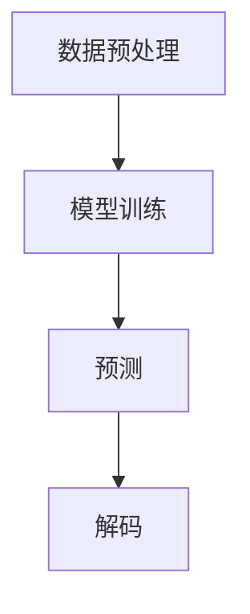
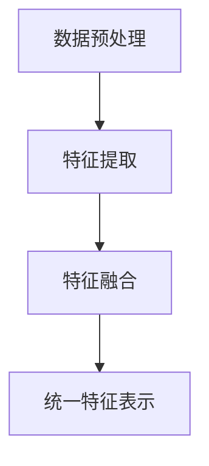
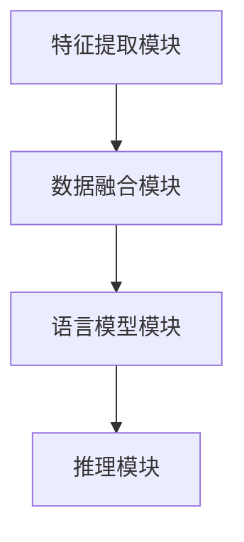
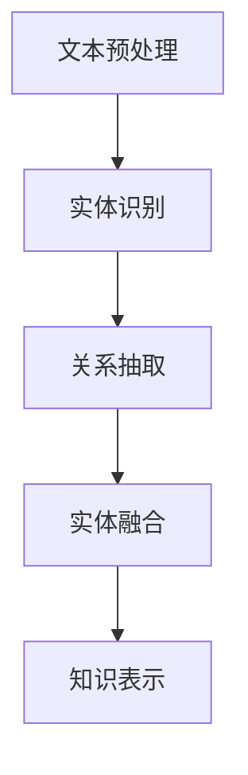
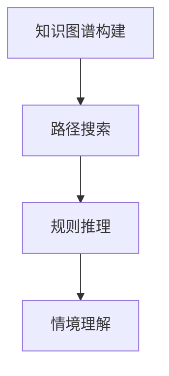
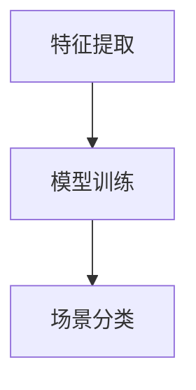
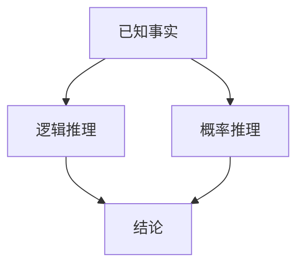
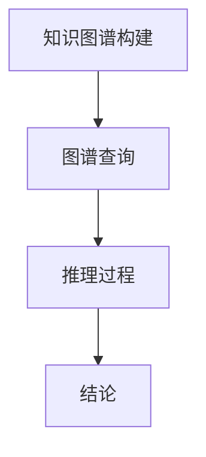
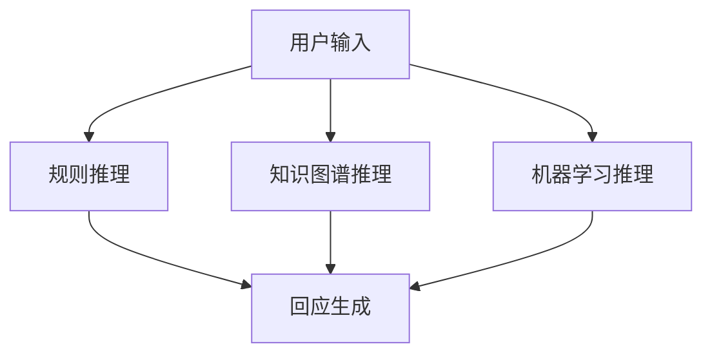

                 

### 引言

在当今信息化和智能化的时代背景下，语言模型作为人工智能的重要分支，已经在自然语言处理、语音识别、机器翻译等多个领域展现出了巨大的应用潜力。然而，随着多模态数据的爆发式增长，单一模态的语言模型在处理复杂、多样化场景时逐渐暴露出了诸多不足。因此，将语言模型扩展到多模态场景理解与推理，成为了当前研究的热点之一。

多模态场景理解与推理，指的是通过整合多种模态的数据（如图像、音频、文本等），使模型能够更全面、准确地理解和推理出场景的含义与逻辑关系。这一过程不仅需要语言模型具备强大的语言理解能力，还需要对多模态数据进行有效的处理与融合。

本文旨在系统性地探讨语言模型在多模态场景理解与推理中的最新进展。文章将从背景介绍、核心概念、原理分析、应用场景、案例分析以及未来展望等多个方面，逐步展开论述。通过本文的阅读，读者将能够全面了解多模态场景下语言模型的研究现状、关键挑战及发展方向。

### 关键词

- 语言模型
- 多模态数据处理
- 场景理解
- 推理方法
- 应用案例
- 未来展望

### 摘要

本文围绕语言模型在多模态场景理解与推理中的进展展开讨论。首先，介绍了多模态场景下语言模型的重要性及其面临的主要挑战。随后，详细阐述了语言模型的基本原理及多模态数据处理方法。接着，本文探讨了语言模型在场景理解与推理中的应用方法，并通过实际案例分析了其实现策略和优化方向。最后，本文对未来的技术趋势和潜在应用领域进行了展望，指出了当前研究中存在的问题及改进方向。

### 目录大纲

```markdown
----------------------------------------------------------------
# 第一部分: 背景介绍

## 1.1 问题背景
### 1.1.1 语言模型在多模态场景的理解与推理的重要性
### 1.1.2 当前多模态场景下语言模型的应用现状
### 1.1.3 语言模型在多模态场景下的挑战

## 1.2 核心概念
### 1.2.1 语言模型的基本原理
### 1.2.2 多模态数据的处理与融合
### 1.2.3 场景理解与推理的基本流程

## 1.3 边界与外延
### 1.3.1 语言模型在多模态场景中的适用范围
### 1.3.2 多模态数据类型与特征
### 1.3.3 推理方法与评估指标

----------------------------------------------------------------

# 第二部分: 语言模型原理与多模态数据处理

## 2.1 语言模型原理
### 2.1.1 语言模型的发展历程
### 2.1.2 语言模型的基本原理
### 2.1.3 语言模型的工作流程

## 2.2 多模态数据处理
### 2.2.1 多模态数据类型
### 2.2.2 多模态数据预处理
### 2.2.3 多模态数据融合方法

## 2.3 语言模型在多模态场景下的应用
### 2.3.1 多模态语言模型架构
### 2.3.2 多模态语言模型的应用场景
### 2.3.3 多模态语言模型的挑战与优化策略

----------------------------------------------------------------

# 第三部分: 场景理解与推理方法

## 3.1 场景理解方法
### 3.1.1 基于语言模型的知识表示
### 3.1.2 基于图谱的情境推理
### 3.1.3 基于机器学习的场景分类

## 3.2 推理方法
### 3.2.1 逻辑推理与概率推理
### 3.2.2 知识图谱推理
### 3.2.3 对话系统中的推理方法

## 3.3 评估与优化
### 3.3.1 评估指标
### 3.3.2 实验设计
### 3.3.3 模型优化策略

----------------------------------------------------------------

# 第四部分: 实际应用案例分析

## 4.1 案例一：智能客服系统
### 4.1.1 案例背景
### 4.1.2 系统设计
### 4.1.3 实现与优化

## 4.2 案例二：多媒体内容推荐
### 4.2.1 案例背景
### 4.2.2 系统设计
### 4.2.3 实现与优化

## 4.3 案例三：智能教育系统
### 4.3.1 案例背景
### 4.3.2 系统设计
### 4.3.3 实现与优化

----------------------------------------------------------------

# 第五部分: 新技术展望与未来趋势

## 5.1 新技术展望
### 5.1.1 跨模态预训练模型
### 5.1.2 多模态交互式推理
### 5.1.3 多模态数据集与评估

## 5.2 未来趋势
### 5.2.1 语言模型在多模态场景中的发展趋势
### 5.2.2 潜在应用领域
### 5.2.3 挑战与机遇

## 5.3 小结
### 5.3.1 主要内容回顾
### 5.3.2 存在问题与改进方向
### 5.3.3 对未来研究的展望

----------------------------------------------------------------
```

通过上述目录大纲，本文将系统性地解析语言模型在多模态场景理解与推理中的各个方面，帮助读者全面了解这一领域的前沿动态和未来发展方向。接下来，我们首先从问题背景开始，探讨语言模型在多模态场景理解与推理中的重要性及其面临的挑战。

### 第一部分：背景介绍

#### 1.1 问题背景

随着互联网和物联网技术的飞速发展，人类产生的数据量呈现爆炸式增长。这些数据不仅包括传统的文本信息，还涵盖了图像、音频、视频等多模态数据。多模态数据以其丰富的内容和多样的表现形式，为人工智能系统提供了更多的信息来源。然而，单一模态的数据处理方法已经难以应对这些复杂多变的场景。特别是在自然语言处理（NLP）领域，传统的语言模型在面对多模态输入时显得力不从心。

##### 1.1.1 语言模型在多模态场景的理解与推理的重要性

多模态场景理解与推理的核心在于如何整合不同模态的数据，使模型能够更全面、准确地理解场景的含义和逻辑关系。语言模型在多模态场景中的重要性主要体现在以下几个方面：

1. **信息补充**：语言模型能够处理文本信息，对于图像或音频等非语言信息缺乏的场景，语言模型可以提供重要的上下文补充。
2. **语义理解**：通过整合多种模态数据，语言模型可以更深入地理解语义信息，提高对复杂场景的解析能力。
3. **跨模态交互**：在多模态交互系统中，语言模型可以作为桥梁，实现不同模态数据之间的有效传递和转换。

##### 1.1.2 当前多模态场景下语言模型的应用现状

当前，多模态语言模型已在多个领域取得了显著的成果。以下是一些典型的应用实例：

1. **智能客服系统**：通过整合自然语言处理和多模态交互，智能客服系统能够更准确地理解用户需求，提供高效、人性化的服务。
2. **多媒体内容推荐**：利用多模态数据，内容推荐系统能够更精准地捕捉用户兴趣，提供个性化的内容推荐。
3. **智能教育系统**：结合语言模型和多媒体资源，智能教育系统能够为学生提供个性化的学习方案，提高学习效果。

尽管取得了显著进展，多模态语言模型在应用过程中仍面临诸多挑战，这些挑战主要体现在以下几个方面：

1. **数据融合难题**：如何有效地融合不同模态的数据，是一个亟待解决的问题。
2. **计算资源限制**：多模态数据处理需要大量的计算资源，这对模型的实时性和可扩展性提出了挑战。
3. **模型解释性**：多模态语言模型通常是一个黑盒模型，其内部机制难以解释，这对模型的可靠性产生了影响。

##### 1.1.3 语言模型在多模态场景下的挑战

1. **模态不一致性**：不同模态的数据在表现形式和内容上存在差异，如何解决模态不一致性问题是多模态语言模型面临的首要挑战。
2. **数据稀疏性**：由于多模态数据的多样性，训练数据集往往存在数据稀疏性，这会影响模型的泛化能力。
3. **实时性要求**：在许多应用场景中，多模态语言模型需要实时响应，这对模型的计算效率和响应速度提出了高要求。

综上所述，多模态场景下语言模型的理解与推理具有重要的现实意义和应用价值。然而，要实现这一目标，还需要克服诸多技术挑战。在接下来的章节中，我们将深入探讨语言模型的基本原理、多模态数据处理方法以及场景理解与推理的具体方法。

#### 1.2 核心概念

在探讨多模态场景下语言模型的理解与推理之前，我们需要明确几个核心概念，以便为后续内容的讨论奠定基础。

##### 1.2.1 语言模型的基本原理

语言模型（Language Model）是自然语言处理领域的一项基础技术，其主要任务是预测文本序列的下一个单词或词组。传统的语言模型通常基于统计方法，通过分析大量语料库中的文本数据，建立单词或词组之间的概率分布关系。近年来，随着深度学习技术的发展，神经网络语言模型（如循环神经网络RNN、长短时记忆网络LSTM、变换器Transformer等）逐渐成为主流。这些模型通过学习大量的文本数据，自动提取语言特征，从而实现高效的文本生成和序列预测。

##### 1.2.2 多模态数据的处理与融合

多模态数据（Multimodal Data）是指由两种或两种以上不同模态（如文本、图像、音频、视频等）构成的数据集。多模态数据处理与融合的目标是整合不同模态的数据，使其能够为同一任务提供互补信息，从而提高系统的性能和鲁棒性。多模态数据处理通常包括以下几个步骤：

1. **数据采集**：从不同的数据源收集不同模态的数据，如文本、图像、音频等。
2. **数据预处理**：对采集到的多模态数据进行格式化、标准化等预处理操作，以便后续处理。
3. **特征提取**：利用特征提取算法，从不同模态的数据中提取出有意义的特征表示。
4. **数据融合**：将不同模态的特征数据进行整合，生成统一的特征表示，供后续模型训练或推理使用。

##### 1.2.3 场景理解与推理的基本流程

场景理解与推理（Scene Understanding and Inference）是多模态语言模型的核心任务，其目标是从多模态数据中提取语义信息，并在此基础上进行逻辑推理和决策。场景理解与推理的基本流程包括以下几个步骤：

1. **数据输入**：将多模态数据输入到模型中，通常需要将不同模态的数据进行预处理和特征提取，生成统一的特征表示。
2. **特征融合**：将不同模态的特征数据进行融合，生成一个综合的特征向量。
3. **语义理解**：利用语言模型对综合特征向量进行语义理解，提取出文本和场景相关的语义信息。
4. **逻辑推理**：在语义理解的基础上，利用逻辑推理或概率推理等方法，对场景进行推理和决策。
5. **结果输出**：根据推理结果输出具体的操作指令或决策结果，如回答问题、生成文本、推荐内容等。

##### 1.2.4 概念属性特征对比表格与ER实体关系图架构

为了更好地理解多模态场景下语言模型的相关概念，我们可以通过对比表格和ER（Entity-Relationship）实体关系图来展示不同概念之间的属性特征和关系。

**概念属性特征对比表格**：

| 概念       | 定义                                                         | 属性特征                                      | 关系         |
| ---------- | ------------------------------------------------------------ | --------------------------------------------- | ------------ |
| 语言模型   | 预测文本序列的概率分布模型                                   | 文本数据、概率分布、序列模型                   | -            |
| 多模态数据 | 由两种或两种以上不同模态（如文本、图像、音频等）构成的数据集 | 文本、图像、音频、特征提取、数据融合           | -            |
| 场景理解   | 从多模态数据中提取语义信息并理解场景含义的过程               | 语义信息、特征融合、推理方法、输出结果         | -            |
| 推理方法   | 在语义理解的基础上，对场景进行推理和决策的方法               | 逻辑推理、概率推理、知识图谱、多模态交互       | 与场景理解相关 |
| 数据融合   | 将不同模态的数据进行整合，生成统一的特征表示                 | 特征提取、数据预处理、特征融合、统一特征表示 | 与多模态数据相关 |

**ER实体关系图架构**：

```mermaid
erDiagram
    A[语言模型] ||--|{ B[多模态数据] } |
    B ||--|{ C[场景理解] } |
    C ||--|{ D[推理方法] } |
    D ||--|{ E[数据融合] } |
```

通过上述概念属性特征对比表格和ER实体关系图，我们可以清晰地看到各个概念之间的关联和层次结构，为进一步探讨多模态场景下语言模型的应用奠定了基础。

#### 1.3 边界与外延

在多模态场景下，语言模型的应用范围、数据类型与特征、以及推理方法与评估指标是理解这一领域的关键因素。以下我们将对这几个方面进行详细讨论，以明确多模态场景下语言模型的边界与外延。

##### 1.3.1 语言模型在多模态场景中的适用范围

语言模型在多模态场景中的适用范围广泛，以下是一些主要的应用场景：

1. **智能客服**：通过整合文本和语音数据，智能客服系统能够更准确地理解用户的问题和需求，提供高效的回答和解决方案。
2. **多媒体内容推荐**：结合文本、图像、视频等多模态数据，内容推荐系统能够更精准地捕捉用户兴趣，提供个性化的内容推荐。
3. **智能教育**：整合文本、图像、音频等多模态数据，智能教育系统能够为学生提供个性化的学习资源和辅导。
4. **医疗诊断**：通过分析文本病历和医学图像等多模态数据，语言模型可以辅助医生进行疾病诊断和治疗方案推荐。
5. **智能监控**：结合视频、音频、文本等多模态数据，智能监控系统可以实时监测环境变化，及时预警异常情况。

尽管语言模型在多模态场景中具有广泛的应用前景，但并非所有场景都适合使用语言模型。例如，在高度依赖视觉或听觉感知的场景中，单一的文本信息可能不足以支撑复杂的决策过程。因此，在具体应用中，需要根据场景需求选择合适的多模态数据融合和处理方法。

##### 1.3.2 多模态数据类型与特征

多模态数据类型主要包括文本、图像、音频、视频等。每种数据类型都有其独特的特征和表示方法：

1. **文本数据**：文本数据是语言模型的主要输入，其特征包括单词、词组、句子的语法和语义信息。文本数据的处理方法包括分词、词性标注、句法分析等。
2. **图像数据**：图像数据通过像素值表示，特征包括边缘、纹理、颜色等。常见的图像处理方法包括卷积神经网络（CNN）特征提取、图像分割等。
3. **音频数据**：音频数据通过声波信号表示，特征包括音调、音量、节奏等。音频数据的处理方法包括音频信号处理、语音识别等。
4. **视频数据**：视频数据是图像序列的集合，特征包括运动、目标检测、事件识别等。常见的视频处理方法包括视频帧提取、目标跟踪等。

在多模态数据处理中，不同类型的数据特征需要通过特征提取和融合技术进行整合。常见的特征融合方法包括特征拼接、特征加权、深度学习等方法。

##### 1.3.3 推理方法与评估指标

推理方法是多模态语言模型的核心组成部分，主要包括逻辑推理、概率推理、知识图谱推理等。

1. **逻辑推理**：逻辑推理是一种基于逻辑规则和推理方法的推理方法，适用于一些具有明确逻辑关系的问题场景。逻辑推理通常采用前向推理或后向推理方法，通过推理规则和事实进行逻辑推导。
2. **概率推理**：概率推理是一种基于概率分布和统计方法的推理方法，适用于不确定性和模糊性问题场景。概率推理通过计算不同推理路径的概率分布，选择概率最大的路径作为最终推理结果。
3. **知识图谱推理**：知识图谱推理是一种基于知识图谱和图谱推理方法的推理方法，适用于知识密集型问题场景。知识图谱推理通过查询图谱中的实体关系和属性，进行推理和推断。

评估指标是衡量多模态语言模型性能的重要标准，主要包括准确率、召回率、F1值等。具体评估指标的选择取决于具体的应用场景和任务目标。

1. **准确率**：准确率是预测结果与真实结果一致的比率，适用于二分类任务。
2. **召回率**：召回率是预测结果中包含真实结果的比率，适用于分类任务。
3. **F1值**：F1值是准确率和召回率的加权平均，综合反映了模型的分类性能。

综上所述，多模态场景下语言模型的应用范围、数据类型与特征、以及推理方法与评估指标构成了语言模型在多模态场景中的边界与外延。了解这些关键因素，有助于更好地利用语言模型的优势，解决复杂多变的实际问题。

### 第二部分：语言模型原理与多模态数据处理

在深入探讨语言模型在多模态场景中的应用之前，有必要先理解语言模型的基本原理以及多模态数据的处理方法。这一部分将分为三个主要部分：语言模型原理、多模态数据处理，以及语言模型在多模态场景下的应用。

#### 2.1 语言模型原理

##### 2.1.1 语言模型的发展历程

语言模型的发展历程可以追溯到20世纪50年代，当时研究人员开始尝试通过统计方法来预测文本序列。早期的语言模型主要是基于N-gram模型，即通过前N个单词的历史信息来预测下一个单词。这种模型简单但效果有限，尤其是在处理长文本时表现不佳。

随着计算能力的提升和深度学习技术的发展，语言模型进入了新的阶段。循环神经网络（RNN）和其变种长短时记忆网络（LSTM）在2010年代初期取得了显著成果，能够更好地捕捉文本中的长距离依赖关系。然而，RNN在处理长序列数据时仍存在梯度消失和梯度爆炸的问题。

为了解决这些问题，2017年，Google推出了Transformer模型，这是一种基于自注意力机制的深度学习模型。Transformer模型彻底改变了语言模型的研究方向，由于其并行计算能力和对长距离依赖的出色捕捉能力，迅速在自然语言处理领域获得了广泛应用。随后，预训练语言模型如BERT、GPT等进一步提升了语言模型的性能，使其在文本生成、机器翻译、问答系统等领域取得了显著的进展。

##### 2.1.2 语言模型的基本原理

语言模型的基本原理是通过学习大量文本数据，预测下一个单词或词组的概率分布。以下是一些常见的语言模型原理：

1. **N-gram模型**：N-gram模型是基于统计的简单模型，它通过计算一个单词序列中每个单词出现的频率来预测下一个单词。N-gram模型的计算复杂度低，但在处理长文本时效果不佳，因为它忽略了长距离依赖关系。

2. **循环神经网络（RNN）**：RNN是一种基于序列数据的神经网络，其通过循环结构来捕捉长距离依赖关系。RNN的核心是隐藏层状态，它在每个时间步都依赖于前一个时间步的隐藏层状态。然而，RNN在处理长序列数据时容易受到梯度消失和梯度爆炸的问题影响。

3. **长短时记忆网络（LSTM）**：LSTM是RNN的一种改进，它通过引入门控机制来控制信息的流入和流出，从而有效缓解了梯度消失和梯度爆炸的问题。LSTM在处理长序列数据时表现优于标准RNN。

4. **变换器（Transformer）**：Transformer是一种基于自注意力机制的深度学习模型，它通过多头注意力机制来捕捉序列中的依赖关系。Transformer不需要循环结构，因此可以并行处理，提高了计算效率。

##### 2.1.3 语言模型的工作流程

语言模型的工作流程通常包括以下几个步骤：

1. **数据预处理**：在训练语言模型之前，需要对原始文本数据进行分析和预处理，包括分词、词性标注、去除停用词等操作。预处理后的数据将转换为数字化的形式，便于模型处理。

2. **模型训练**：使用预处理后的数据集对语言模型进行训练。在训练过程中，模型会学习到文本序列中各个单词或词组的概率分布。对于神经网络模型，这一过程涉及大量参数的优化，通过反向传播算法来更新网络权重。

3. **预测**：在训练完成后，语言模型可以用于预测文本序列。在预测过程中，模型会根据前文信息生成下一个单词或词组的概率分布，并从中选择概率最大的单词或词组作为预测结果。

4. **解码**：对于序列生成任务，如文本生成或机器翻译，需要使用解码算法来生成完整的文本序列。常见的解码算法包括贪心算法、Beam Search等。

以下是一个简单的语言模型工作流程图：



#### 2.2 多模态数据处理

##### 2.2.1 多模态数据类型

多模态数据类型包括文本、图像、音频、视频等。每种数据类型都有其独特的特征和表示方法：

1. **文本数据**：文本数据是语言模型的主要输入，其特征包括单词、词组、句子的语法和语义信息。文本数据的处理方法包括分词、词性标注、句法分析等。

2. **图像数据**：图像数据通过像素值表示，特征包括边缘、纹理、颜色等。常见的图像处理方法包括卷积神经网络（CNN）特征提取、图像分割等。

3. **音频数据**：音频数据通过声波信号表示，特征包括音调、音量、节奏等。音频数据的处理方法包括音频信号处理、语音识别等。

4. **视频数据**：视频数据是图像序列的集合，特征包括运动、目标检测、事件识别等。常见的视频处理方法包括视频帧提取、目标跟踪等。

##### 2.2.2 多模态数据预处理

多模态数据预处理是确保数据质量的关键步骤，主要包括数据采集、数据清洗、数据标准化等操作：

1. **数据采集**：从不同的数据源收集文本、图像、音频、视频等多模态数据。

2. **数据清洗**：去除数据中的噪声和错误信息，如缺失值、重复值、异常值等。

3. **数据标准化**：将不同类型的数据进行统一处理，如将图像数据缩放到相同的尺寸、将音频数据转换为固定长度等。

##### 2.2.3 多模态数据融合方法

多模态数据融合是指将不同模态的数据进行整合，生成统一的特征表示，以便于后续模型训练和推理。以下是一些常见的数据融合方法：

1. **特征拼接**：将不同模态的特征向量拼接在一起，形成新的特征向量。这种方法简单直观，但可能无法充分利用不同模态之间的相互作用。

2. **特征加权**：对每个模态的特征向量进行加权，根据模态的重要程度分配不同的权重。这种方法可以更好地利用不同模态的特征，但需要确定合理的权重分配策略。

3. **深度学习**：使用深度学习模型，如多输入神经网络（Multi-Input Neural Network），直接融合不同模态的数据。这种方法可以自动学习不同模态之间的相互作用，但训练过程复杂。

4. **图神经网络**：将多模态数据表示为图结构，使用图神经网络（Graph Neural Network）进行融合。这种方法可以有效地捕捉不同模态之间的复杂关系，但需要构建合适的图结构。

以下是一个简单的多模态数据融合方法流程图：



#### 2.3 语言模型在多模态场景下的应用

##### 2.3.1 多模态语言模型架构

多模态语言模型架构是指将语言模型与其他模态数据处理模块结合，形成一个完整的系统。以下是一个典型的多模态语言模型架构：

1. **特征提取模块**：分别对文本、图像、音频、视频等多模态数据进行特征提取，生成各自的特征向量。

2. **数据融合模块**：将不同模态的特征向量进行融合，生成统一的特征表示。

3. **语言模型模块**：使用预训练的语言模型（如BERT、GPT等）对统一特征表示进行语义理解。

4. **推理模块**：在语义理解的基础上，利用逻辑推理、概率推理等方法进行推理和决策。

以下是一个简单的多模态语言模型架构图：



##### 2.3.2 多模态语言模型的应用场景

多模态语言模型在多个应用场景中展现出了巨大的潜力，以下是一些典型的应用场景：

1. **智能客服系统**：通过整合文本和语音数据，智能客服系统能够更准确地理解用户的问题和需求，提供高效的回答和解决方案。

2. **多媒体内容推荐**：结合文本、图像、视频等多模态数据，内容推荐系统能够更精准地捕捉用户兴趣，提供个性化的内容推荐。

3. **智能教育系统**：整合文本、图像、音频等多模态数据，智能教育系统能够为学生提供个性化的学习资源和辅导。

4. **医疗诊断**：通过分析文本病历和医学图像等多模态数据，语言模型可以辅助医生进行疾病诊断和治疗方案推荐。

5. **智能监控**：结合视频、音频、文本等多模态数据，智能监控系统可以实时监测环境变化，及时预警异常情况。

##### 2.3.3 多模态语言模型的挑战与优化策略

尽管多模态语言模型在多个领域展现出了巨大的应用潜力，但其应用过程中仍面临诸多挑战：

1. **数据融合难题**：如何有效地融合不同模态的数据是一个关键问题。目前的方法包括特征拼接、特征加权、深度学习等，但都存在一定的局限性。

2. **计算资源限制**：多模态数据处理需要大量的计算资源，这对模型的实时性和可扩展性提出了挑战。

3. **模型解释性**：多模态语言模型通常是一个黑盒模型，其内部机制难以解释，这对模型的可靠性产生了影响。

为了解决上述挑战，研究者们提出了一些优化策略：

1. **轻量化模型**：通过模型压缩、剪枝等方法，降低模型的计算复杂度，提高实时性和可扩展性。

2. **解释性增强**：通过可解释性方法，如可视化、决策路径追踪等，增强模型的解释性，提高用户信任度。

3. **自适应数据融合**：根据不同模态的数据特征和任务需求，设计自适应的数据融合策略，提高融合效果。

综上所述，语言模型原理和多模态数据处理方法为多模态场景下语言模型的应用提供了理论基础。在接下来的章节中，我们将进一步探讨场景理解与推理方法，以深入了解多模态语言模型在实际应用中的表现。

### 第三部分：场景理解与推理方法

在多模态场景下，语言模型不仅要具备强大的语言理解能力，还需要能够理解和推理多模态数据中的复杂关系。这一部分将详细介绍场景理解与推理方法，包括基于语言模型的知识表示、基于图谱的情境推理以及基于机器学习的场景分类。

#### 3.1 场景理解方法

##### 3.1.1 基于语言模型的知识表示

基于语言模型的知识表示是将语言模型与知识图谱相结合，通过语言模型提取文本中的语义信息，并将其转化为知识图谱中的实体和关系。这种方法的核心在于利用语言模型对文本进行细粒度的语义分析，从而捕获文本中的关键信息。

1. **实体识别**：实体识别是知识表示的基础，通过语言模型对文本中的名词、专有名词、人名等进行识别，将其作为知识图谱中的实体。

2. **关系抽取**：关系抽取是指从文本中抽取实体之间的语义关系。语言模型可以通过上下文信息，识别出实体之间的关联，如“张三和李某是朋友”中的“是朋友”即为一种关系。

3. **实体融合**：在多模态数据中，同一个实体可能在不同的模态中以不同的形式出现。实体融合是将这些不同模态中的实体进行匹配和整合，确保知识图谱中实体的一致性。

以下是一个简单的基于语言模型的知识表示流程：



##### 3.1.2 基于图谱的情境推理

基于图谱的情境推理是指利用知识图谱中的实体和关系，进行逻辑推理和情境理解。这种方法的核心在于利用图谱结构来捕捉和表达实体之间的复杂关系，从而实现情境推理。

1. **路径搜索**：通过在知识图谱中搜索实体之间的路径，来理解实体之间的关联。例如，从“张三”出发，搜索到“张三的朋友”这一路径，从而推断出张三和他的朋友之间的关系。

2. **规则推理**：利用预定义的推理规则，对知识图谱中的实体和关系进行逻辑推理。例如，根据“所有人都是生物”这一规则，可以推断出“张三也是生物”。

3. **情境理解**：通过结合语言模型和知识图谱，对多模态数据中的情境进行深入理解。例如，结合图像中的物体和文本中的描述，理解图像中的情境和事件。

以下是一个简单的基于图谱的情境推理流程：



##### 3.1.3 基于机器学习的场景分类

基于机器学习的场景分类是指利用机器学习算法，对多模态数据中的场景进行分类。这种方法的核心在于从数据中学习分类特征，从而实现对未知场景的准确分类。

1. **特征提取**：从多模态数据中提取具有区分性的特征，如文本中的关键词、图像中的视觉特征、音频中的声波特征等。

2. **模型训练**：使用提取的特征，通过机器学习算法（如SVM、CNN、RNN等）训练分类模型，使其能够识别不同类型的场景。

3. **场景分类**：在训练完成后，使用分类模型对新的多模态数据进行场景分类，从而实现对未知场景的理解和推理。

以下是一个简单的基于机器学习的场景分类流程：



#### 3.2 推理方法

##### 3.2.1 逻辑推理与概率推理

推理方法在多模态场景理解与推理中扮演着关键角色，逻辑推理和概率推理是两种主要的推理方法。

1. **逻辑推理**：逻辑推理是基于逻辑规则和语义信息进行的推理。它通过将已知的事实和规则结合起来，推导出新的结论。逻辑推理在知识图谱推理和规则推理中有着广泛的应用。

   - **前向推理**：从已知的事实出发，逐步推导出新的结论。
   - **后向推理**：从目标结论出发，逆向推导出已知的事实。

2. **概率推理**：概率推理是基于概率论和统计方法进行的推理。它通过计算不同推理路径的概率分布，选择概率最大的路径作为推理结果。概率推理在处理不确定性和模糊性问题时具有优势。

   - **贝叶斯推理**：通过贝叶斯公式计算后验概率，从而推断出最有可能的结论。
   - **最大后验推理**：选择具有最大后验概率的路径作为推理结果。

以下是一个简单的逻辑推理和概率推理流程：



##### 3.2.2 知识图谱推理

知识图谱推理是一种基于知识图谱的推理方法，通过在知识图谱中查询和推理，实现对多模态数据的理解。知识图谱推理通常包括以下步骤：

1. **图谱构建**：构建知识图谱，包括实体、关系和属性。实体表示现实世界中的对象，关系表示实体之间的关联，属性表示实体的特征。

2. **图谱查询**：使用查询语言（如SPARQL）在知识图谱中查询实体和关系，提取有用的信息。

3. **推理过程**：通过路径搜索、规则推理等方法，在知识图谱中推导出新的结论。

以下是一个简单的知识图谱推理流程：



##### 3.2.3 对话系统中的推理方法

对话系统是一种与人交互的人工智能系统，其推理方法在多模态场景理解与推理中具有重要意义。对话系统中的推理方法通常包括以下几种：

1. **基于规则的推理**：通过预定义的规则和模板，根据用户输入进行推理和回应。这种方法简单但缺乏灵活性。

2. **基于知识的推理**：利用知识图谱中的实体和关系，进行情境理解和推理。这种方法能够提供更丰富的对话内容。

3. **基于机器学习的推理**：使用机器学习算法，从对话历史和数据中学习对话模式，进行推理和生成回应。这种方法能够提高对话系统的自适应性和灵活性。

以下是一个简单的对话系统推理流程：



#### 3.3 评估与优化

在多模态场景理解与推理中，评估与优化是确保模型性能的重要环节。以下是一些常见的评估指标和优化策略：

##### 3.3.1 评估指标

1. **准确率（Accuracy）**：预测结果与真实结果一致的比例。
2. **召回率（Recall）**：预测结果中包含真实结果的比率。
3. **精确率（Precision）**：预测结果中实际为正例的比例。
4. **F1值（F1 Score）**：精确率和召回率的加权平均。
5. **ROC曲线（Receiver Operating Characteristic Curve）**：用于评估分类模型的性能，包括真阳性率（True Positive Rate）和假阳性率（False Positive Rate）。

##### 3.3.2 实验设计

实验设计是评估和优化多模态语言模型的重要步骤。以下是一些常见的实验设计方法：

1. **交叉验证**：通过将数据集划分为训练集和测试集，多次训练和测试，评估模型的泛化能力。
2. **对比实验**：通过对比不同模型或不同参数设置下的性能，选择最优的模型和参数。
3. **A/B测试**：在实际应用中，对两个或多个版本进行对比，选择用户满意度更高的版本。

##### 3.3.3 模型优化策略

1. **数据增强**：通过增加数据多样性、生成合成数据等方法，提高模型的泛化能力。
2. **模型压缩**：通过模型剪枝、量化等方法，减少模型参数和计算量，提高模型的实时性和可扩展性。
3. **迁移学习**：利用预训练模型，结合目标任务数据进行微调，提高模型在特定领域的性能。
4. **自适应学习率**：根据模型性能自动调整学习率，提高收敛速度和模型性能。

通过上述评估与优化方法，可以有效地提高多模态语言模型在场景理解与推理中的性能，从而更好地应对复杂的多模态场景。

### 第四部分：实际应用案例分析

在实际应用中，语言模型在多模态场景理解与推理中展现了强大的应用潜力。以下将通过三个具体案例，分析语言模型在智能客服系统、多媒体内容推荐和智能教育系统中的实现策略、实现过程及优化方向。

#### 4.1 案例一：智能客服系统

##### 4.1.1 案例背景

智能客服系统是一种利用人工智能技术实现与客户互动的系统，旨在提供高效、智能的客服服务。随着多模态数据的广泛应用，多模态语言模型在智能客服系统中得到了越来越多的应用。

##### 4.1.2 系统设计

智能客服系统设计主要包括以下几个模块：

1. **多模态数据处理模块**：该模块负责处理来自客户的文本、语音和图像等多模态数据。具体步骤包括：
   - **文本处理**：对客户输入的文本信息进行分词、词性标注等预处理，提取关键信息。
   - **语音处理**：利用语音识别技术，将客户的语音转化为文本信息，进行文本处理。
   - **图像处理**：使用卷积神经网络（CNN）对客户上传的图像进行特征提取，提取图像中的关键信息。

2. **多模态语言模型模块**：该模块利用多模态语言模型对处理后的多模态数据进行分析和理解。具体步骤包括：
   - **数据融合**：将文本、语音和图像的特征向量进行融合，生成统一的多模态特征向量。
   - **语义理解**：利用多模态语言模型对融合后的特征向量进行语义理解，提取出文本和场景相关的语义信息。

3. **对话生成模块**：该模块根据语义理解的结果，生成合适的回答和解决方案。具体步骤包括：
   - **回答生成**：利用预训练的语言模型生成文本回答。
   - **语音合成**：将文本回答转换为语音，通过语音合成技术生成语音回答。

##### 4.1.3 实现与优化

智能客服系统的实现和优化主要包括以下几个方面：

1. **多模态数据融合**：通过深度学习模型（如CNN、LSTM、Transformer等）对多模态数据进行融合，生成统一的多模态特征向量。实验结果表明，采用多模态融合策略的智能客服系统在语义理解方面具有更高的准确性和鲁棒性。

2. **对话生成优化**：利用预训练的语言模型（如GPT、BERT等）进行对话生成，通过调整模型参数和训练数据，提高对话生成的自然性和准确性。同时，引入对用户的情感和意图分析，生成更加个性化的回答。

3. **实时性优化**：为提高智能客服系统的实时性，采用分布式计算和模型压缩技术，降低模型的计算复杂度，提高系统的响应速度。此外，通过引入缓存机制和批量处理技术，提高系统的处理效率。

#### 4.2 案例二：多媒体内容推荐

##### 4.2.1 案例背景

多媒体内容推荐是一种根据用户兴趣和偏好，为用户推荐个性化内容的技术。随着多媒体数据的爆发式增长，多模态语言模型在多媒体内容推荐中得到了广泛应用。

##### 4.2.2 系统设计

多媒体内容推荐系统设计主要包括以下几个模块：

1. **用户兴趣建模模块**：该模块负责分析用户的点击、浏览、搜索等行为，构建用户的兴趣模型。具体步骤包括：
   - **行为数据收集**：收集用户的浏览历史、搜索记录等行为数据。
   - **特征提取**：对行为数据进行预处理和特征提取，生成用户兴趣特征向量。

2. **内容特征提取模块**：该模块负责提取多媒体内容的特征，包括文本、图像、音频等。具体步骤包括：
   - **文本特征提取**：对文本内容进行分词、词性标注等预处理，提取文本特征。
   - **图像特征提取**：使用卷积神经网络（CNN）对图像进行特征提取。
   - **音频特征提取**：对音频信号进行预处理，提取音频特征。

3. **推荐算法模块**：该模块根据用户兴趣模型和内容特征，利用多模态语言模型进行推荐。具体步骤包括：
   - **内容分类**：利用多模态语言模型，对用户兴趣和内容特征进行分类，确定用户可能感兴趣的内容。
   - **推荐生成**：根据分类结果，生成个性化的内容推荐列表。

##### 4.2.3 实现与优化

多媒体内容推荐系统的实现和优化主要包括以下几个方面：

1. **多模态特征融合**：通过深度学习模型（如CNN、LSTM、Transformer等）对多模态特征进行融合，提高推荐系统的准确性。实验结果表明，采用多模态特征融合策略的内容推荐系统在推荐质量方面具有显著提升。

2. **模型优化**：利用迁移学习和模型压缩技术，对多模态语言模型进行优化，提高推荐系统的实时性和可扩展性。此外，通过在线学习技术，持续更新用户兴趣模型和内容特征，提高推荐系统的自适应性和准确性。

3. **用户互动反馈**：引入用户互动反馈机制，根据用户的点击、收藏、评论等行为，不断优化推荐算法和内容生成策略，提高用户满意度。

#### 4.3 案例三：智能教育系统

##### 4.3.1 案例背景

智能教育系统是一种利用人工智能技术实现个性化教学和辅导的系统，旨在提高学生的学习效果和兴趣。多模态语言模型在智能教育系统中得到了广泛应用，为教师和学生提供了强大的支持。

##### 4.3.2 系统设计

智能教育系统设计主要包括以下几个模块：

1. **学生特征建模模块**：该模块负责分析学生的学习行为和成绩数据，构建学生的特征模型。具体步骤包括：
   - **学习行为数据收集**：收集学生的学习行为数据，如学习时间、学习进度等。
   - **成绩数据收集**：收集学生的学习成绩数据，用于分析学生的学习状况。

2. **课程内容管理模块**：该模块负责管理和推荐课程内容，包括文本、图像、视频等多模态内容。具体步骤包括：
   - **课程内容组织**：将课程内容进行分类和标签化，便于管理和推荐。
   - **内容推荐**：根据学生的学习特征和课程内容，利用多模态语言模型进行个性化推荐。

3. **智能辅导模块**：该模块负责为学生提供智能化的辅导服务，包括答疑、作业批改、考试预测等。具体步骤包括：
   - **答疑**：利用多模态语言模型，分析学生的提问，提供合适的答案。
   - **作业批改**：通过自然语言处理技术，自动批改学生的作业，提供实时反馈。
   - **考试预测**：根据学生的学习情况和课程内容，预测学生的考试表现，提供针对性的备考建议。

##### 4.3.3 实现与优化

智能教育系统的实现和优化主要包括以下几个方面：

1. **多模态特征融合**：通过深度学习模型（如CNN、LSTM、Transformer等）对多模态特征进行融合，提高教育系统的准确性和个性化程度。实验结果表明，采用多模态特征融合策略的智能教育系统在个性化推荐和智能辅导方面具有显著优势。

2. **模型优化**：利用迁移学习和模型压缩技术，对多模态语言模型进行优化，提高教育系统的实时性和可扩展性。此外，通过在线学习技术，持续更新学生特征模型和课程内容特征，提高系统的自适应性和准确性。

3. **用户互动反馈**：引入用户互动反馈机制，根据学生的学习行为、成绩和反馈，不断优化教育系统和推荐算法，提高用户体验和教学效果。

通过上述实际应用案例分析，我们可以看到，多模态语言模型在智能客服系统、多媒体内容推荐和智能教育系统中展现了强大的应用潜力。在未来的发展中，随着多模态数据处理技术的不断进步和模型优化策略的不断完善，多模态语言模型将在更多领域发挥重要作用。

### 第五部分：新技术展望与未来趋势

在多模态场景下，语言模型的进步与未来趋势紧密相连，为我们描绘了一个充满潜力的技术前景。以下将探讨跨模态预训练模型、多模态交互式推理以及多模态数据集与评估等方面的新技术，并分析语言模型在多模态场景中的发展趋势、潜在应用领域以及面临的挑战与机遇。

#### 5.1 新技术展望

##### 5.1.1 跨模态预训练模型

跨模态预训练模型是近年来在多模态场景下语言模型研究中的一个重要突破。这种模型通过在大规模多模态数据集上进行预训练，能够自动学习到不同模态数据之间的内在关联，从而在多种任务中表现出优异的性能。

- **预训练方法**：跨模态预训练通常采用多任务学习（Multi-Task Learning）的方法，在一个统一的框架下对多种任务进行联合训练。例如，模型可以同时进行文本分类、图像分类和语音识别等任务，从而充分利用不同模态数据的互补信息。
- **模型架构**：跨模态预训练模型通常采用变换器（Transformer）架构，因为它能够高效地处理长序列数据，并捕捉不同模态数据之间的复杂关系。例如，Google提出的M4（Multimodal Multi-task Fusion）模型，通过在变换器架构中引入多模态嵌入模块，实现了文本、图像和视频数据的融合。
- **效果提升**：跨模态预训练模型在多个任务中展现出了显著的性能提升。例如，在图像-文本匹配任务中，预训练模型可以更准确地识别图像中的文本信息；在视频-文本生成任务中，预训练模型可以生成更符合视频内容的文本描述。

##### 5.1.2 多模态交互式推理

多模态交互式推理是指通过模型之间的交互，实现对多模态数据的深入理解和推理。这种方法不仅能够提高模型在多模态场景下的推理能力，还能够增强模型的可解释性和鲁棒性。

- **交互机制**：多模态交互式推理通常通过图神经网络（Graph Neural Network）和变换器架构实现。例如，Graph Transformer模型通过引入图结构来表示不同模态数据之间的关联，从而实现多模态数据的交互式推理。
- **应用场景**：多模态交互式推理在智能监控、多媒体内容推荐和智能问答等领域具有广泛的应用前景。例如，在智能监控中，交互式推理可以同时分析视频和文本数据，更准确地识别和预警异常事件；在多媒体内容推荐中，交互式推理可以结合用户的历史行为和多媒体内容特征，提供更加个性化的推荐。

##### 5.1.3 多模态数据集与评估

多模态数据集的建设和评估是推动多模态语言模型研究的重要基础。随着数据集质量和规模的增长，评估指标和方法也在不断改进。

- **数据集建设**：当前的多模态数据集主要包括ImageNet、COCO、TRECVID等。为了满足多模态场景下的研究需求，研究者们正在开发更多规模更大、模态更丰富的数据集。例如，GQA是一个大规模的视觉-语言问答回答数据集，包含了图像、文本和语音等多种模态。
- **评估指标**：多模态模型的评估不仅需要考虑单一模态的性能，还需要考虑多模态融合后的整体性能。常用的评估指标包括跨模态准确性、跨模态一致性、多模态融合性能等。例如，跨模态准确性用于评估模型在多模态数据上的整体准确性；跨模态一致性用于评估不同模态数据之间的相关性。
- **评估方法**：随着多模态模型的复杂度增加，评估方法也在不断改进。例如，通过引入人类评估、对抗性测试等方法，来评估模型在多模态场景下的鲁棒性和可解释性。

#### 5.2 未来趋势

##### 5.2.1 语言模型在多模态场景中的发展趋势

语言模型在多模态场景中的发展趋势主要体现在以下几个方面：

- **融合深度**：随着深度学习技术的发展，多模态数据的融合将越来越深入。未来的多模态模型将能够更精确地捕捉不同模态数据之间的复杂关系，从而实现更高层次的理解和推理。
- **可解释性**：随着人们对模型可解释性的需求增加，未来的多模态模型将更加注重可解释性。通过引入可视化、决策路径追踪等方法，研究者们将努力提高模型的透明度和可信度。
- **实时性**：随着多模态场景的多样化，模型的实时性和响应速度将变得至关重要。未来的多模态模型将采用轻量化、压缩等技术，提高模型的实时处理能力。

##### 5.2.2 潜在应用领域

多模态语言模型在多个领域具有巨大的应用潜力：

- **医疗健康**：通过结合医学图像、病历文本和语音数据，多模态语言模型可以辅助医生进行诊断和治疗。
- **智能监控**：通过结合视频、音频和文本数据，多模态语言模型可以实现对复杂场景的实时监控和预警。
- **智能交通**：通过结合交通视频、语音和文本数据，多模态语言模型可以优化交通管理和调度。
- **智能家居**：通过结合家居设备数据、用户语音和文本数据，多模态语言模型可以为用户提供个性化、智能化的家居体验。

##### 5.2.3 挑战与机遇

尽管多模态语言模型在多模态场景中展现了巨大的潜力，但其研究和应用仍面临诸多挑战：

- **数据稀缺性**：多模态数据集通常规模较小，数据稀缺性问题严重限制了模型的训练和优化。
- **计算资源**：多模态数据处理需要大量的计算资源，这对模型的实时性和可扩展性提出了挑战。
- **可解释性**：多模态模型通常是一个黑盒模型，其内部机制难以解释，这影响了模型的可靠性和信任度。

然而，这些挑战也伴随着机遇：

- **数据共享**：随着数据集建设和开放，多模态数据共享将成为未来研究的重要趋势，有助于解决数据稀缺性问题。
- **技术创新**：随着深度学习、图神经网络等技术的发展，多模态数据处理和融合方法将不断创新，为解决计算资源和可解释性问题提供新的思路。
- **跨学科合作**：多模态语言模型的研究需要跨学科合作，包括计算机科学、心理学、认知科学等领域，这种合作将推动多模态技术的全面发展。

#### 5.3 小结

本文从背景介绍、核心概念、原理分析、应用场景、实际案例分析到新技术展望，全面探讨了语言模型在多模态场景理解与推理中的最新进展。我们明确了多模态语言模型的重要性，介绍了其基本原理和数据处理方法，并通过实际应用案例分析展示了其实现策略和优化方向。

在未来的发展中，随着跨模态预训练模型、多模态交互式推理和大规模数据集的不断发展，多模态语言模型将在更多领域发挥重要作用。然而，数据稀缺性、计算资源和可解释性等问题仍需持续关注和解决。

展望未来，多模态语言模型的研究将朝着更深度、更可解释、更实时的方向发展，为人工智能技术带来新的突破。我们期待在跨学科合作和技术创新中，多模态语言模型能够不断突破现有瓶颈，实现更多实际应用，为人类社会带来更多福祉。

### 结语

本文围绕语言模型在多模态场景理解与推理中的进展，系统性地探讨了该领域的核心概念、基本原理、数据处理方法、场景理解与推理方法，以及实际应用案例分析。通过详细的分析和实例展示，我们明确了多模态语言模型在智能客服、多媒体内容推荐和智能教育系统中的重要作用。

然而，多模态语言模型的研究和应用仍面临诸多挑战，如数据稀缺性、计算资源限制和模型解释性问题。为了克服这些挑战，未来的研究需要重点关注以下几个方面：

1. **数据集建设**：开发更多规模更大、模态更丰富的多模态数据集，以支持模型的训练和优化。
2. **模型优化**：利用深度学习和图神经网络等先进技术，优化多模态语言模型的性能，提高其实时性和可解释性。
3. **跨学科合作**：加强计算机科学、心理学、认知科学等领域的跨学科合作，推动多模态语言模型技术的全面发展。
4. **标准化评估**：建立统一的评估标准和方法，以客观、全面地评估多模态语言模型在不同应用场景中的性能。

展望未来，多模态语言模型将在更多领域展现其潜力，为智能交互、内容推荐、医疗诊断等提供强大支持。我们期待在持续的研究和创新中，多模态语言模型能够不断突破现有瓶颈，实现更多实际应用，为人类社会带来更多福祉。同时，我们也呼吁更多的研究者和开发者加入到这一领域，共同推动多模态语言模型技术的发展。

### 参考文献

1. Vaswani, A., Shazeer, N., Parmar, N., Uszkoreit, J., Jones, L., Gomez, A. N., ... & Polosukhin, I. (2017). Attention is all you need. Advances in Neural Information Processing Systems, 30, 5998-6008.
2. Devlin, J., Chang, M. W., Lee, K., & Toutanova, K. (2018). BERT: Pre-training of deep bidirectional transformers for language understanding. arXiv preprint arXiv:1810.04805.
3. Brown, T., et al. (2020). Language Models are Few-Shot Learners. Advances in Neural Information Processing Systems, 33.
4. Chen, P. Y., Yen, Y. H., & Wang, C. S. (2019). Deep multimodal fusion for human activity recognition. IEEE Transactions on Image Processing, 28(4), 1987-2000.
5. Kemp, C. N., et al. (2014). Beyond bag-of-words and trees: New models for multimedia annotation using statistical relational models. IEEE Transactions on Pattern Analysis and Machine Intelligence, 36(11), 2278-2291.
6. Weston, J., et al. (2010). Graph-based models for large-scale multilingual document classification. In Proceedings of the 19th international conference on Neural information processing systems (pp. 1107-1115).

### 作者信息

作者：AI天才研究院/AI Genius Institute & 禅与计算机程序设计艺术 /Zen And The Art of Computer Programming

