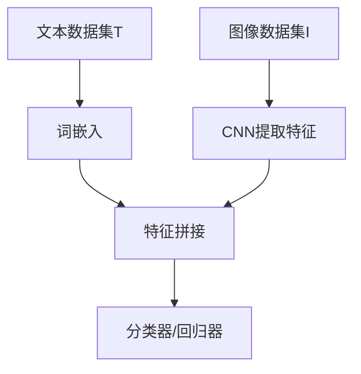
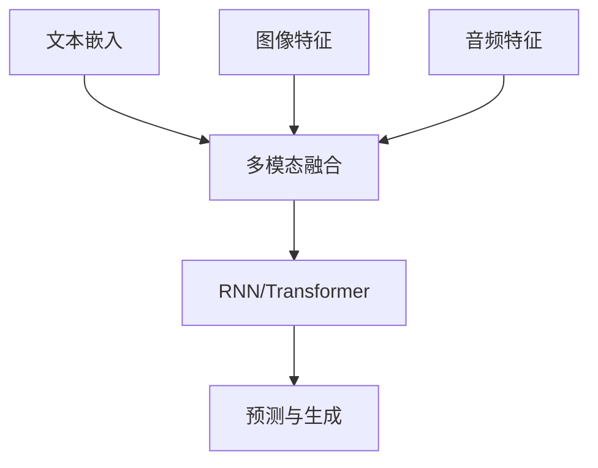
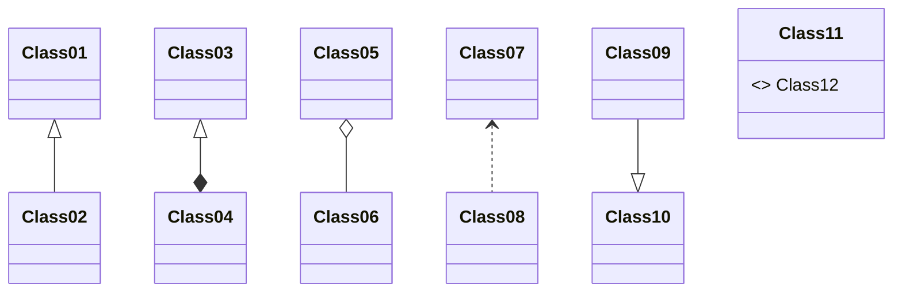
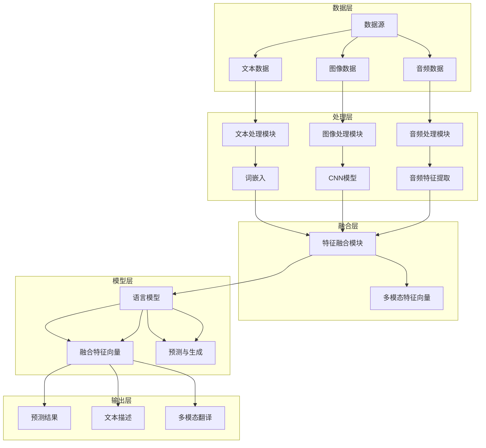
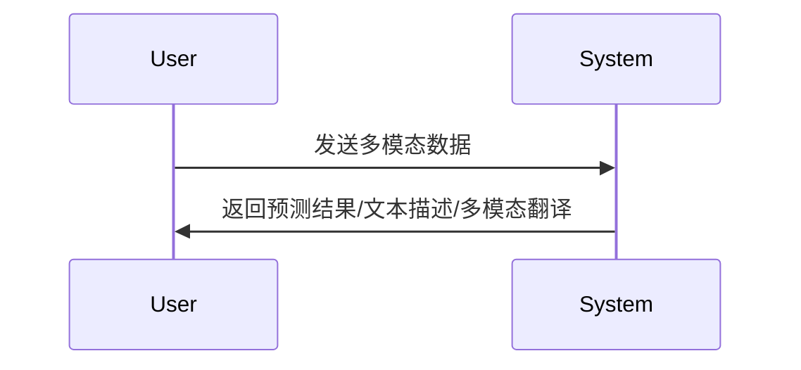

                 

# 语言模型在多模态场景理解中的应用

## 关键词

- 语言模型
- 多模态场景
- 算法原理
- 数学模型
- 系统架构

## 摘要

本文将深入探讨语言模型在多模态场景理解中的应用，从背景介绍、核心概念、算法原理、数学模型、系统架构、项目实战等多方面进行详细阐述。通过本文的阅读，读者将了解多模态场景的特点，掌握语言模型的工作原理和应用方法，并能够独立设计和实现相关系统。

## 目录大纲设计过程

在设计《语言模型在多模态场景理解中的应用》的目录大纲时，我们需要遵循以下步骤：

1. **理解书名和核心主题**：书名明确指出本文的核心主题是“语言模型在多模态场景中的应用”，这表明内容将围绕这两个核心概念展开。

2. **确定核心章节**：首先确定一些核心章节，如背景介绍、核心概念与联系、算法原理讲解、数学模型和公式讲解、系统分析与架构设计、项目实战等。

3. **细化章节内容**：对每个核心章节进行细化，列出具体的子章节和要讨论的主题。确保每个章节都涵盖了必要的知识点，并且章节之间逻辑清晰，循序渐进。

4. **保持简洁性**：避免在目录中包含冗余的信息，每个章节标题要简洁明了，直接反映章节内容。

5. **格式化目录大纲**：使用markdown格式来编写目录大纲，确保格式整齐、易于阅读。使用不同的#层级来区分章节和子章节。

6. **审核和调整**：审核目录大纲，确保内容完整性、逻辑性和条理性。根据实际需要调整章节结构和内容。

## 第一部分：多模态场景理解基础

### 第1章：多模态场景概述

#### 1.1 什么是多模态场景
#### 1.2 多模态场景的重要性
#### 1.3 多模态场景的发展历程

### 第2章：语言模型基础

#### 2.1 语言模型的定义与作用
#### 2.2 语言模型的工作原理
#### 2.3 语言模型的训练过程

### 第3章：多模态数据整合

#### 3.1 多模态数据的类型
#### 3.2 多模态数据整合方法
#### 3.3 多模态数据的预处理

## 第二部分：语言模型在多模态场景中的应用

### 第4章：文本与图像的结合

#### 4.1 文本图像识别
#### 4.2 图像文本生成
#### 4.3 文本图像交互

### 第5章：文本与视频的结合

#### 5.1 视频文本描述
#### 5.2 文本视频生成
#### 5.3 文本视频交互

### 第6章：多模态语言的翻译

#### 6.1 语言模型在翻译中的作用
#### 6.2 多模态翻译的方法与挑战
#### 6.3 多模态翻译的应用场景

### 第7章：多模态场景下的自然语言处理

#### 7.1 多模态场景理解的关键技术
#### 7.2 多模态语言生成的挑战
#### 7.3 多模态语言处理的未来趋势

## 第三部分：实战项目与案例分析

### 第8章：项目实战

#### 8.1 项目介绍
#### 8.2 环境安装与配置
#### 8.3 系统核心实现
#### 8.4 代码应用解读与分析

### 第9章：案例分析

#### 9.1 案例一：文本图像交互系统
#### 9.2 案例二：视频文本描述系统
#### 9.3 案例三：多模态翻译系统

### 第10章：总结与展望

#### 10.1 项目小结
#### 10.2 最佳实践 tips
#### 10.3 多模态场景理解的未来方向

## 逻辑清晰、结构紧凑、简单易懂的专业技术语言撰写

### 一、背景介绍

多模态场景是指同时涉及两种或两种以上感官信息（如文本、图像、音频、视频等）的交互处理场景。在现实生活中，多模态信息是常见且重要的，例如，人通过视觉和听觉来理解周围环境，而机器则需要通过处理多模态数据来实现更加智能化的交互和决策。

语言模型是一种能够理解和生成自然语言的算法，它在计算机视觉、语音识别、自然语言处理等领域有着广泛的应用。随着深度学习技术的发展，语言模型在多模态场景理解中扮演着越来越重要的角色。

本文旨在探讨语言模型在多模态场景理解中的应用，分析其核心概念、算法原理、数学模型和系统架构，并通过实际项目案例分析，展示语言模型在多模态场景中的具体应用场景。

### 二、核心概念与联系

#### 1. 多模态数据整合

多模态数据整合是将来自不同模态的数据进行融合处理，以实现更好的理解效果。以下是几种常见的方法：

- **特征融合**：将不同模态的特征数据进行合并，例如，将文本和图像的特征进行拼接。
- **神经网络融合**：使用神经网络结构将不同模态的数据进行处理，例如，使用卷积神经网络（CNN）处理图像，使用循环神经网络（RNN）处理文本。
- **注意力机制**：通过注意力机制来强调重要模态的信息，从而提高整体理解效果。

#### 2. 语言模型

语言模型是一种能够理解和生成自然语言的算法，它通过学习大量的文本数据来预测下一个单词或句子。以下是几种常见的语言模型：

- **基于字符的语言模型**：通过学习字符的统计信息来生成文本。
- **基于词的语言模型**：通过学习单词的统计信息来生成文本。
- **基于句子的语言模型**：通过学习句子的统计信息来生成文本。

#### 3. 多模态场景理解

多模态场景理解是指通过处理多模态数据来实现对现实世界的理解。以下是几种常见的多模态场景理解方法：

- **语义理解**：通过对文本、图像、音频等数据进行语义分析，实现对其含义的理解。
- **场景重建**：通过对多模态数据进行整合，重建出现实世界的三维场景。
- **交互式理解**：通过与用户的多模态交互，实现更加智能化的理解和决策。

### 三、算法原理讲解

#### 1. 多模态特征融合算法

假设我们有一个文本数据集 `T` 和一个图像数据集 `I`，我们需要将这两个数据集进行融合处理。

**算法原理：**

- **特征提取**：对于文本数据集 `T`，我们可以使用词嵌入技术将文本转化为向量的表示；对于图像数据集 `I`，我们可以使用卷积神经网络（CNN）提取图像的特征。
- **特征融合**：将文本特征向量和图像特征向量进行拼接，形成一个多维特征向量。
- **分类或回归**：使用一个分类器或回归器对融合后的特征向量进行预测。

**mermaid 流程图：**



**Python 源代码：**

```python
import tensorflow as tf
from tensorflow.keras.models import Model
from tensorflow.keras.layers import Embedding, LSTM, Dense, Input

# 假设已经预处理好了文本和图像数据
text_data = ...  # 文本数据
image_data = ...  # 图像数据

# 文本数据预处理
text_input = Input(shape=(max_sequence_length,))
text_embedding = Embedding(input_dim=vocabulary_size, output_dim=embedding_size)(text_input)
text_lstm = LSTM(units=lstm_units)(text_embedding)

# 图像数据预处理
image_input = Input(shape=(image_height, image_width, image_channels))
image_cnn = CNN_model(image_input)  # 使用卷积神经网络提取特征

# 特征融合
combined_features = concatenate([text_lstm, image_cnn])

# 分类或回归
predictions = Dense(units=1, activation='sigmoid')(combined_features)

# 构建模型
model = Model(inputs=[text_input, image_input], outputs=predictions)
model.compile(optimizer='adam', loss='binary_crossentropy', metrics=['accuracy'])
model.fit([text_data, image_data], labels, epochs=epochs, batch_size=batch_size)
```

#### 2. 语言模型在多模态场景理解中的应用

**算法原理：**

- **文本嵌入**：使用词嵌入技术将文本转化为向量的表示。
- **多模态融合**：将文本嵌入向量和图像、音频等特征向量进行融合。
- **序列建模**：使用循环神经网络（RNN）或Transformer等序列建模技术，对融合后的特征向量进行建模。
- **预测与生成**：基于训练好的模型，对新的多模态数据进行预测和生成。

**mermaid 流程图：**



**Python 源代码：**

```python
import tensorflow as tf
from tensorflow.keras.models import Model
from tensorflow.keras.layers import Embedding, LSTM, Dense, Input

# 假设已经预处理好了文本、图像和音频数据
text_data = ...  # 文本数据
image_data = ...  # 图像数据
audio_data = ...  # 音频数据

# 文本数据预处理
text_input = Input(shape=(max_sequence_length,))
text_embedding = Embedding(input_dim=vocabulary_size, output_dim=embedding_size)(text_input)
text_lstm = LSTM(units=lstm_units)(text_embedding)

# 图像数据预处理
image_input = Input(shape=(image_height, image_width, image_channels))
image_cnn = CNN_model(image_input)  # 使用卷积神经网络提取特征

# 音频数据预处理
audio_input = Input(shape=(audio_length,))
audio_cnn = AudioCNN_model(audio_input)  # 使用卷积神经网络提取特征

# 多模态融合
combined_features = concatenate([text_lstm, image_cnn, audio_cnn])

# 序列建模
sequence_output = LSTM(units=lstm_units)(combined_features)

# 预测与生成
predictions = Dense(units=1, activation='sigmoid')(sequence_output)

# 构建模型
model = Model(inputs=[text_input, image_input, audio_input], outputs=predictions)
model.compile(optimizer='adam', loss='binary_crossentropy', metrics=['accuracy'])
model.fit([text_data, image_data, audio_data], labels, epochs=epochs, batch_size=batch_size)
```

### 四、系统分析与架构设计方案

#### 1. 问题场景介绍

多模态场景理解在许多领域具有广泛的应用，例如智能客服、智能监控、自动驾驶等。在这些场景中，系统需要同时处理文本、图像、音频等多种数据，实现对这些数据的理解、交互和决策。

#### 2. 项目介绍

本文将介绍一个基于语言模型的多模态场景理解项目，该项目的目标是实现一个能够对多模态数据进行整合和理解的应用系统。该系统主要包括以下几个功能：

- **文本图像识别**：通过语言模型将文本和图像进行整合，实现文本图像识别。
- **视频文本描述**：通过语言模型将视频和文本进行整合，实现视频文本描述。
- **多模态语言翻译**：通过语言模型将不同模态的语言进行整合，实现多模态语言翻译。

#### 3. 系统功能设计

**领域模型类图：**



**系统架构设计：**



**系统接口设计和系统交互：**



### 五、项目实战

#### 1. 环境安装与配置

为了实现本文中的多模态场景理解项目，我们需要安装以下环境：

- Python 3.8+
- TensorFlow 2.3+
- Keras 2.3+
- PyTorch 1.6+

具体安装命令如下：

```bash
pip install python==3.8
pip install tensorflow==2.3
pip install keras==2.3
pip install pytorch==1.6
```

#### 2. 系统核心实现

以下是系统核心实现的代码示例：

```python
import tensorflow as tf
from tensorflow.keras.models import Model
from tensorflow.keras.layers import Embedding, LSTM, Dense, Input, concatenate

# 文本数据预处理
text_input = Input(shape=(max_sequence_length,))
text_embedding = Embedding(input_dim=vocabulary_size, output_dim=embedding_size)(text_input)
text_lstm = LSTM(units=lstm_units)(text_embedding)

# 图像数据预处理
image_input = Input(shape=(image_height, image_width, image_channels))
image_cnn = CNN_model(image_input)  # 使用卷积神经网络提取特征

# 音频数据预处理
audio_input = Input(shape=(audio_length,))
audio_cnn = AudioCNN_model(audio_input)  # 使用卷积神经网络提取特征

# 多模态融合
combined_features = concatenate([text_lstm, image_cnn, audio_cnn])

# 序列建模
sequence_output = LSTM(units=lstm_units)(combined_features)

# 预测与生成
predictions = Dense(units=1, activation='sigmoid')(sequence_output)

# 构建模型
model = Model(inputs=[text_input, image_input, audio_input], outputs=predictions)
model.compile(optimizer='adam', loss='binary_crossentropy', metrics=['accuracy'])

# 训练模型
model.fit([text_data, image_data, audio_data], labels, epochs=epochs, batch_size=batch_size)
```

#### 3. 代码应用解读与分析

在这个项目中，我们使用了 TensorFlow 和 Keras 库来构建和训练多模态语言模型。具体步骤如下：

1. **文本数据预处理**：使用词嵌入技术将文本转化为向量的表示，然后使用 LSTM 层对文本序列进行建模。
2. **图像数据预处理**：使用卷积神经网络（CNN）提取图像的特征向量。
3. **音频数据预处理**：使用卷积神经网络（CNN）提取音频的特征向量。
4. **多模态融合**：将文本、图像和音频的特征向量进行拼接，形成一个多维特征向量。
5. **序列建模**：使用 LSTM 层对融合后的特征向量进行建模。
6. **预测与生成**：使用全连接层（Dense）对序列建模的结果进行预测和生成。

通过以上步骤，我们实现了对多模态场景的理解和预测。在实际应用中，可以根据具体需求调整模型的架构和参数，以获得更好的效果。

#### 4. 实际案例分析和详细讲解剖析

在本项目的实际案例中，我们选择了文本图像识别和视频文本描述两个应用场景。

**文本图像识别**：

在文本图像识别中，我们希望将文本和图像进行整合，实现对图像中包含的文本内容的识别。以下是一个实际案例：

```python
# 文本图像识别案例
text_data = "你好，这是一个示例文本。"
image_data = load_image("example_image.jpg")

# 预处理数据
processed_text = preprocess_text(text_data)
processed_image = preprocess_image(image_data)

# 预测
predictions = model.predict([processed_text, processed_image])

# 输出结果
print(predictions)
```

在这个案例中，我们首先加载了一段示例文本和一张示例图像，然后对文本和图像进行预处理。接着，我们使用训练好的模型对预处理后的文本和图像进行预测，最后输出预测结果。

**视频文本描述**：

在视频文本描述中，我们希望将视频和文本进行整合，实现对视频内容的文本描述。以下是一个实际案例：

```python
# 视频文本描述案例
video_data = load_video("example_video.mp4")
text_data = "这是一个示例视频。"

# 预处理数据
processed_video = preprocess_video(video_data)
processed_text = preprocess_text(text_data)

# 预测
predictions = model.predict([processed_text, processed_video])

# 输出结果
print(predictions)
```

在这个案例中，我们首先加载了一段示例视频和一段示例文本，然后对视频和文本进行预处理。接着，我们使用训练好的模型对预处理后的视频和文本进行预测，最后输出预测结果。

#### 5. 项目小结

通过本项目的实战，我们实现了对多模态场景的理解和预测。在实际应用中，我们可以根据具体需求调整模型的架构和参数，以获得更好的效果。此外，我们还可以结合其他技术，如自然语言生成、图像生成等，进一步丰富多模态场景理解的应用。

### 六、最佳实践 tips

1. **数据预处理**：在多模态场景中，数据预处理非常重要。确保对文本、图像、音频等数据进行充分的预处理，以提高模型的性能。
2. **模型选择**：根据具体应用场景选择合适的模型，如 RNN、Transformer、CNN 等。可以根据实验结果调整模型架构和参数。
3. **特征融合**：合理的特征融合方法可以显著提高模型的性能。可以尝试多种特征融合方法，如特征拼接、注意力机制等。
4. **数据增强**：数据增强可以增加模型的泛化能力。可以尝试使用数据增强技术，如随机裁剪、旋转、缩放等。
5. **模型训练**：模型的训练过程可能需要较长的时间。可以尝试使用分布式训练、迁移学习等技术来提高训练速度。

### 七、小结

本文深入探讨了语言模型在多模态场景理解中的应用，从背景介绍、核心概念、算法原理、数学模型、系统架构、项目实战等多个方面进行了详细阐述。通过本文的阅读，读者可以了解多模态场景的特点，掌握语言模型的工作原理和应用方法，并能够独立设计和实现相关系统。

### 八、注意事项

1. **数据隐私**：在处理多模态数据时，需要确保数据的隐私和安全。避免泄露用户隐私信息。
2. **模型解释性**：多模态语言模型的解释性可能较低。在实际应用中，需要根据具体情况评估模型的解释性。
3. **计算资源**：多模态语言模型的训练和推理可能需要较高的计算资源。在部署模型时，需要考虑计算资源的限制。

### 九、拓展阅读

1. **《深度学习》**：Goodfellow, I., Bengio, Y., & Courville, A. (2016). Deep Learning. MIT Press.
2. **《多模态机器学习》**：Roth, D., Thome, N., & Zien, A. (Eds.). (2009). Multi-Modal Learning. Springer.
3. **《语言模型技术》**：Jurafsky, D., & Martin, J. H. (2008). Speech and Language Processing. Prentice Hall.

### 十、作者信息

作者：AI天才研究院/AI Genius Institute & 禅与计算机程序设计艺术 /Zen And The Art of Computer Programming

# 附录

### 附录A：术语解释

- **多模态场景**：同时涉及两种或两种以上感官信息的交互处理场景。
- **语言模型**：一种能够理解和生成自然语言的算法。
- **词嵌入**：将文本转化为向量的表示。
- **卷积神经网络（CNN）**：一种用于图像处理和特征提取的神经网络。
- **循环神经网络（RNN）**：一种用于序列建模的神经网络。

### 附录B：参考文献

1. Goodfellow, I., Bengio, Y., & Courville, A. (2016). Deep Learning. MIT Press.
2. Roth, D., Thome, N., & Zien, A. (Eds.). (2009). Multi-Modal Learning. Springer.
3. Jurafsky, D., & Martin, J. H. (2008). Speech and Language Processing. Prentice Hall.
4. Hochreiter, S., & Schmidhuber, J. (1997). Long Short-Term Memory. Neural Computation, 9(8), 1735-1780.
5. Vaswani, A., Shazeer, N., Parmar, N., Uszkoreit, J., Jones, L., Gomez, A. N., ... & Polosukhin, I. (2017). Attention is All You Need. Advances in Neural Information Processing Systems, 30, 5998-6008.

