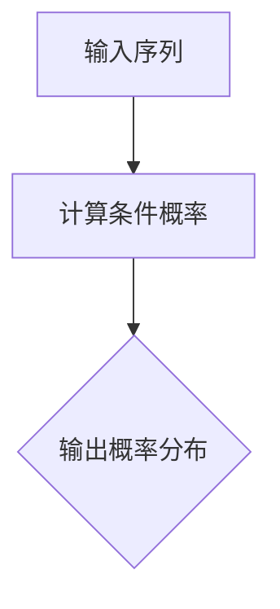
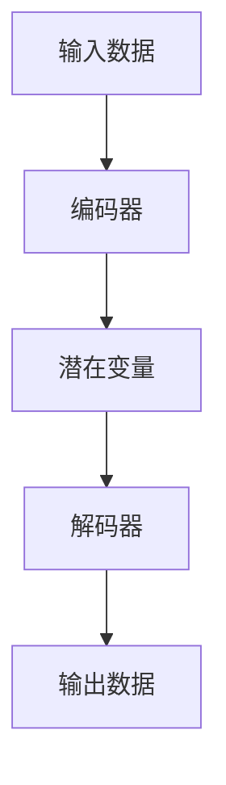
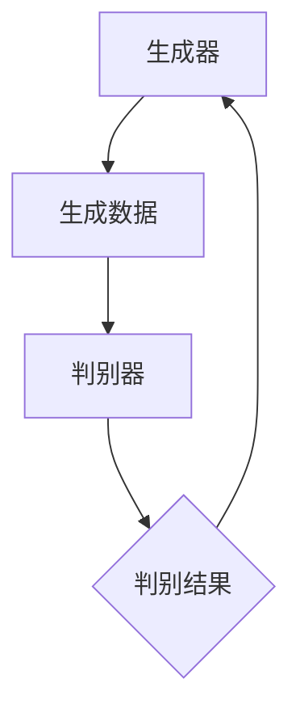
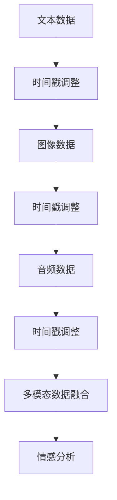
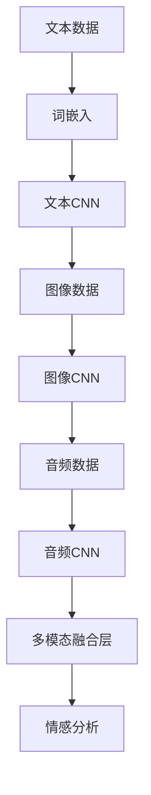
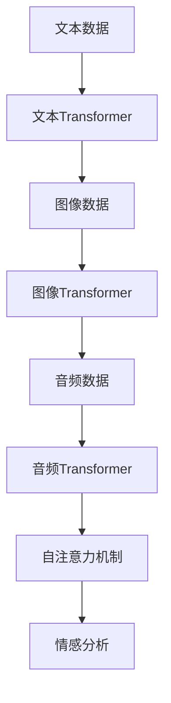

                 

# 引言

在当今快速发展的数字化时代，用户体验（UX）已经成为了产品成功与否的关键因素。用户体验不仅仅是用户对产品的直观感受，更是产品功能与设计、用户行为和心理等多方面因素的综合体现。为了更好地理解用户需求，提升产品价值，各类技术手段被广泛应用，其中语言模型和多模态情感分析技术尤为突出。

语言模型是一种能够在自然语言处理（NLP）任务中，理解、生成和预测文本序列的算法。它通过机器学习和深度学习技术，从大量的文本数据中学习语言规律，从而实现高效的语言理解和生成。而多模态情感分析则是通过结合文本、图像、声音等多种数据形式，对用户情感进行综合分析和理解。

本文将围绕“语言模型在多模态情感分析与用户体验优化中的能力提升”这一主题展开讨论。具体来说，我们将分以下几个部分进行深入探讨：

1. **背景介绍**：首先，我们将介绍情感分析在现代社会中的作用，多模态情感分析的重要性，以及语言模型在用户体验优化中的应用潜力。
2. **多模态情感分析概述**：接着，我们将探讨多模态情感分析的数据采集、挑战和应用场景。
3. **语言模型基础**：随后，我们将详细介绍语言模型的基本概念、数学模型及其主要类型。
4. **多模态情感分析中的语言模型**：在这一部分，我们将分析语言模型在多模态情感分析中的角色和融合方法。
5. **用户体验优化**：我们将探讨语言模型在用户体验优化中的多种应用，如界面设计、功能可用性和性能优化。
6. **提升用户体验的最佳实践**：通过案例分析，我们将总结提升用户体验的最佳实践和技巧。

通过本文的逐步分析，我们希望能为读者提供对语言模型在多模态情感分析与用户体验优化中的深入理解，并为其在实际应用中的潜力提供有益的启示。

## 第一部分：背景介绍

### 第1章：问题背景

#### 1.1 问题的起源与重要性

情感分析（Sentiment Analysis），也称为意见挖掘，是一种利用自然语言处理（NLP）技术，对文本数据中的情感倾向进行识别和分析的方法。随着互联网和社交媒体的快速发展，用户生成的文本数据量呈爆炸式增长，这些数据中蕴含着丰富的用户情感信息，成为企业了解用户需求、优化产品服务的重要资源。情感分析技术的起源可以追溯到20世纪90年代，随着机器学习和深度学习技术的发展，情感分析逐渐从简单的规则匹配方法，发展到基于统计模型和神经网络的高效分析方法。

情感分析在现代社会中的作用不可小觑。首先，在市场营销领域，企业可以通过情感分析了解消费者对产品或服务的反馈，从而优化产品设计和营销策略。例如，通过分析社交媒体上的用户评论，企业可以快速识别哪些产品特性最受用户欢迎，哪些需要改进。其次，在客户服务领域，情感分析可以帮助企业自动识别和处理用户反馈，提高客服效率和用户体验。例如，通过情感分析技术，客服系统可以自动分类和优先处理用户的投诉，从而提升客户满意度。

多模态情感分析（Multimodal Sentiment Analysis）是在传统文本情感分析的基础上，结合图像、声音等多模态数据的一种综合情感分析方法。相比于单一的文本情感分析，多模态情感分析能够提供更全面、更准确的情感信息。这是因为不同模态的数据能够相互补充，提高情感识别的准确性和深度。例如，在视频情感分析中，除了分析对话文本的情感倾向，还可以通过面部表情、姿态等视觉信息来辅助判断用户的情感状态。

多模态情感分析的重要性体现在多个方面。首先，它能够更好地捕捉用户的情感变化。例如，在社交媒体平台上，用户可能会通过文字、图片、视频等多种形式表达自己的情感，单一文本情感分析可能无法全面捕捉这些情感信息。而多模态情感分析则可以通过综合分析文本、图像和视频等多种数据，更准确地理解用户的情感状态。其次，多模态情感分析能够提高情感识别的准确性和可靠性。通过结合多种模态的数据，可以减少单一模态数据中的噪声和不确定性，从而提高情感分析的准确性。例如，在情绪识别中，通过结合面部表情和声音信号，可以更准确地判断用户的情绪状态。

在用户需求日益多样化和竞争激烈的市场环境下，多模态情感分析技术已经成为提升产品竞争力的重要手段。通过多模态情感分析，企业不仅可以更好地了解用户需求，还可以为用户提供更个性化的服务。例如，在电子商务领域，通过分析用户的购物行为、评论和反馈，企业可以推荐更符合用户兴趣和需求的产品，从而提升用户体验和满意度。此外，在健康医疗领域，通过分析患者的病历记录、对话记录和生理信号等多模态数据，医生可以更准确地诊断病情，提供更有效的治疗方案。

总之，情感分析和多模态情感分析在现代社会的各个领域都有着广泛的应用和重要的价值。随着人工智能技术的不断发展，这些技术将在未来发挥更大的作用，为企业和个人带来更多的价值。

#### 1.2 用户体验优化的需求

用户体验（User Experience，简称UX）是用户在使用产品或服务过程中所感受到的整体感受。一个优秀的产品或服务应该能够提供愉悦、便捷、高效的体验，使用户感到满意和舒适。用户体验的优化已经成为企业和设计师们关注的焦点，因为用户对产品或服务的满意度和忠诚度直接影响着企业的市场竞争力。

用户体验的定义可以涵盖多个方面，包括但不限于以下要素：

1. **界面设计**：界面设计是用户体验的重要组成部分。一个直观、简洁、美观的界面可以提升用户的操作流畅度和满意度。例如，在移动应用设计中，良好的界面设计可以帮助用户快速找到所需功能，减少操作步骤，从而提升用户体验。

2. **功能可用性**：功能可用性是指产品或服务的功能是否满足用户的需求，是否易于使用。一个具有良好可用性的产品应该能够提供清晰、明确的操作指引，避免用户在使用过程中产生困惑和挫折感。例如，电子商务网站应提供简洁的购物流程，包括搜索、添加购物车、结账等步骤，让用户可以轻松完成购物。

3. **性能与响应速度**：性能和响应速度是用户体验的重要衡量标准。一个性能优越的产品可以在短时间内完成用户请求，提供流畅的操作体验。例如，在线游戏如果响应速度慢，会导致玩家操作延迟，影响游戏体验和游戏体验。

用户体验的重要性体现在以下几个方面：

1. **用户满意度**：一个良好的用户体验可以提升用户的满意度，增加用户对产品或服务的忠诚度。用户在满意的使用体验下，更愿意继续使用和推荐产品，从而为企业带来持续的收益。

2. **品牌形象**：优秀的产品设计和服务体验可以提升企业的品牌形象，增强用户对品牌的信任感。一个具有良好用户体验的产品往往能够赢得用户的口碑，提升品牌的市场竞争力。

3. **用户留存率**：良好的用户体验有助于提高用户的留存率。用户在满意的使用体验下，更可能继续使用产品，减少因体验不佳而流失的风险。

语言模型在用户体验优化中的应用潜力主要体现在以下几个方面：

1. **个性化推荐**：通过语言模型分析用户的兴趣和行为，可以提供个性化的推荐服务。例如，在电子商务平台中，基于用户的购买历史和浏览记录，语言模型可以推荐符合用户兴趣的产品，提升购物体验。

2. **聊天机器人**：语言模型可以用于构建智能聊天机器人，为用户提供实时、个性化的服务。聊天机器人可以解答用户的问题，提供操作指引，从而提升用户的使用体验。

3. **界面设计优化**：语言模型可以帮助设计师分析用户的需求和行为，优化产品的界面设计。例如，通过分析用户在界面上的点击和操作路径，语言模型可以提供改进界面设计的建议，提升用户的操作便捷性和满意度。

4. **错误诊断与修复**：语言模型可以用于分析用户在产品使用过程中遇到的问题，提供相应的解决方案。例如，在软件应用中，语言模型可以通过分析用户反馈的报错信息，快速定位问题并提供修复方案，从而提升用户体验。

总之，语言模型在用户体验优化中具有巨大的应用潜力。通过结合多模态情感分析和人工智能技术，语言模型可以提供更加智能和个性化的用户体验，帮助企业提升市场竞争力，赢得用户的信任和忠诚。

#### 1.3 研究的边界与外延

在探讨语言模型在多模态情感分析与用户体验优化中的应用时，有必要明确研究的边界与外延，以便更好地理解这一领域的深度和广度。

首先，语言模型的类型和功能是研究的核心内容。目前，常见的语言模型包括基于循环神经网络（RNN）的模型，如LSTM和GRU，以及基于Transformer架构的模型，如BERT和GPT。这些模型在处理不同类型的自然语言任务时展现出各自的优势和局限性。例如，RNN模型在处理长序列数据方面具有优势，而Transformer模型则在并行计算和上下文理解方面表现突出。

其次，多模态情感分析的技术框架涉及文本、图像、声音等多种数据类型。在技术层面上，多模态情感分析需要解决数据融合、情感标注和实时性等挑战。例如，如何在不同的模态之间进行有效的数据融合，以提取出全面的情感信息；如何确保情感标注的准确性和一致性，以支持高质量的模型训练；以及如何在保证准确性的同时实现情感分析的实时性，以满足应用场景的需求。

在实际应用中，多模态情感分析具有广泛的应用场景。在社交媒体分析中，通过结合文本、图像和视频等多种数据形式，可以更准确地理解用户的情感状态和舆情趋势。在电子商务领域，多模态情感分析可以用于分析用户评论中的情感倾向，从而优化产品推荐和营销策略。在娱乐内容推荐中，多模态情感分析可以帮助平台更好地理解用户对视频和音频内容的喜好，提供个性化的推荐服务。

此外，语言模型在用户体验优化中的应用也呈现出多样化的趋势。通过自然语言处理技术，可以实现对用户交互数据的深度分析，从而优化界面设计、提升功能可用性，以及改进性能与响应速度。例如，智能聊天机器人可以基于用户的历史交互数据，提供更加个性化和高效的服务。个性化推荐系统可以通过分析用户的兴趣和行为，推荐更符合用户需求的产品和服务，从而提升用户体验。

总之，研究语言模型在多模态情感分析与用户体验优化中的应用不仅需要深入理解语言模型的类型和功能，还需要考虑多模态情感分析的技术框架和应用场景。通过这些研究，可以进一步探索语言模型在提升产品竞争力和用户满意度方面的潜力，为企业提供更具创新性和实用价值的技术解决方案。

#### 1.4 核心概念与联系

在深入探讨语言模型在多模态情感分析与用户体验优化中的应用之前，有必要对几个核心概念进行详细解释，并分析它们之间的相互联系。

**语言模型的基本原理**

语言模型（Language Model）是自然语言处理（NLP）中的基础技术，用于预测文本序列的概率。其基本原理基于统计和学习算法，通过分析大量文本数据，模型能够捕捉到语言的统计特性，如词语出现的频率、上下文关系等。语言模型可以分为生成模型和判别模型。

1. **生成模型**：生成模型旨在直接预测文本序列的概率分布。经典的生成模型包括N-gram模型和基于神经网络的生成模型，如变分自编码器（VAE）和生成对抗网络（GAN）。这些模型通过学习文本数据的概率分布，生成新的文本数据。

   - **N-gram模型**：基于相邻词语的概率分布，例如三元语法模型（3-gram）可以预测一个词在给定前两个词的情况下出现的概率。
     - $$P(w_n | w_{n-1}, w_{n-2}) = \frac{C(w_{n-2}, w_{n-1}, w_n)}{C(w_{n-2}, w_{n-1})}$$
   - **变分自编码器（VAE）**：通过引入潜在变量，VAE能够生成符合数据分布的新文本。
     - $$z = g(\phi, x)$$
     - $$x = \mu(\theta, z)$$

2. **判别模型**：判别模型则旨在通过输入文本预测标签或分类结果。常见的判别模型包括朴素贝叶斯（Naive Bayes）、支持向量机（SVM）和深度学习模型，如卷积神经网络（CNN）和循环神经网络（RNN）。

   - **朴素贝叶斯（Naive Bayes）**：基于贝叶斯定理，通过计算特征条件概率和先验概率，预测文本的分类。
     - $$P(C_k | x) = \frac{P(x | C_k)P(C_k)}{P(x)}$$
   - **支持向量机（SVM）**：通过最大化分类边界，实现文本分类。
     - $$\max_w \min_{\xi_i} \left\{ \frac{1}{2} \sum_{i=1}^{n} \xi_i + C \sum_{i=1}^{n} y_i \xi_i \right\}$$

**情感分析的方法与指标**

情感分析（Sentiment Analysis）是一种评估文本中情感倾向的技术，通常用于判断文本是积极、消极还是中立。情感分析的方法可以分为基于规则的方法、基于统计的方法和基于机器学习的方法。

1. **基于规则的方法**：通过定义一系列规则，对文本中的情感词和短语进行分类。这种方法简单直观，但规则覆盖范围有限，难以处理复杂情感。

2. **基于统计的方法**：基于词频、词序列和共现关系，通过统计模型进行情感分类。常见的统计模型包括朴素贝叶斯、最大熵模型和逻辑回归。

3. **基于机器学习的方法**：利用机器学习算法，从标注数据中学习情感分类规则。常见的机器学习模型包括支持向量机、决策树、随机森林和神经网络。

情感分析的指标主要包括准确率（Accuracy）、召回率（Recall）和F1值（F1 Score），用于评估模型的性能。

- **准确率**：分类正确的样本数占总样本数的比例。
  - $$Accuracy = \frac{TP + TN}{TP + FN + FP + TN}$$
- **召回率**：分类正确的正样本数占总正样本数的比例。
  - $$Recall = \frac{TP}{TP + FN}$$
- **F1值**：准确率和召回率的调和平均。
  - $$F1 Score = 2 \times \frac{Precision \times Recall}{Precision + Recall}$$

**用户体验优化的方法与策略**

用户体验优化（UX Optimization）旨在提升产品或服务的使用体验，从而提高用户满意度、忠诚度和留存率。用户体验优化的方法与策略包括以下几种：

1. **用户研究**：通过用户调研、访谈和观察，了解用户的需求、行为和痛点，为优化提供数据支持。

2. **用户反馈**：收集和分析用户反馈，识别用户在使用过程中遇到的问题和需求，从而进行针对性优化。

3. **A/B测试**：通过对比不同设计方案的用户体验，选择最优方案进行实施。A/B测试可以帮助企业快速验证优化效果。

4. **数据分析**：利用数据分析工具，监控用户行为数据，如点击率、停留时间、转化率等，评估优化效果。

5. **界面设计优化**：通过改进界面布局、色彩搭配、交互设计等，提升用户的视觉体验和操作便捷性。

6. **功能可用性优化**：通过改进功能设计、操作流程和帮助文档，提升产品的易用性和功能完整性。

7. **性能优化**：通过优化代码、数据库和服务器配置，提升产品的响应速度和稳定性。

**核心概念与联系**

语言模型和情感分析之间的联系主要体现在以下几个方面：

1. **语言模型的文本数据预处理**：情感分析通常需要大量的文本数据作为训练素材。语言模型可以用于这些文本数据的预处理，如分词、词性标注和命名实体识别等，提高数据质量。

2. **情感分析的上下文理解**：语言模型能够捕捉文本的上下文关系，从而提高情感分析模型对复杂情感表达的识别能力。

3. **情感分析的模型训练**：语言模型中的词向量（如Word2Vec、GloVe）可以作为情感分析模型的特征输入，提高模型的准确性和泛化能力。

4. **情感分析结果的文本生成**：语言模型可以用于生成情感分析结果的文本描述，如情感摘要、用户反馈等，为产品优化提供参考。

语言模型与用户体验优化之间的联系则体现在以下几个方面：

1. **个性化推荐**：语言模型可以用于分析用户的兴趣和行为，为用户提供个性化的产品推荐和内容推荐，提升用户体验。

2. **智能聊天机器人**：语言模型可以构建智能聊天机器人，与用户进行自然语言交互，提供实时、个性化的服务，提升用户满意度。

3. **界面设计和交互优化**：语言模型可以用于分析用户对界面元素的反应和行为，提供改进界面设计和交互设计的建议，提升用户体验。

4. **用户反馈处理**：语言模型可以自动处理和分析用户反馈，识别用户的问题和建议，为产品优化提供数据支持。

通过理解这些核心概念和联系，我们可以更好地把握语言模型在多模态情感分析与用户体验优化中的应用，为实际问题的解决提供科学依据和有效策略。

### 第2章：多模态情感分析概述

#### 2.1 多模态数据采集

多模态情感分析的成功依赖于高质量的多模态数据采集。数据采集的多样性是这一技术的关键，因为不同的数据形式能够提供互补的情感信息，从而提高情感分析的准确性和深度。以下是几种常见的数据采集方式：

1. **文本数据采集**：文本数据是情感分析中最常见的数据类型，它包括社交媒体帖子、评论、新闻报道等。这些数据可以直接反映用户的情感状态和观点。采集文本数据的方法通常包括爬虫技术、API接口调用和用户生成内容等。

   - **社交媒体数据**：通过社交媒体平台的API，可以实时获取用户的文本评论、状态更新等。这些数据不仅量大，而且实时性高，能够及时捕捉用户的情感变化。
   - **用户生成内容**：用户在论坛、博客、评论区的文本生成内容也是重要的数据来源。这些数据通常包含详细的使用体验和情感表达，有助于深入理解用户的真实感受。

2. **视频数据采集**：视频数据可以通过在线视频平台、直播、摄像头等渠道获取。视频数据中包含丰富的情感信息，如面部表情、肢体语言、语音语调等。

   - **在线视频平台**：通过爬取或API接口，可以获取大量的用户上传视频，如YouTube、TikTok等。这些视频可以用于情感分析的训练和测试。
   - **直播和摄像头**：实时捕捉的用户行为视频是视频数据采集的另一重要来源。例如，在线教育平台中的直播课程视频、公共场所的监控视频等，都可以用于情感分析研究。

3. **音频数据采集**：音频数据包括用户的语音通话、音频评论、歌曲等。音频数据中的情感信息主要通过语音语调、音量、语速等特征来体现。

   - **语音通话**：通过电话系统或语音通话应用，可以获取用户的语音数据。这些数据可以用于情感分析，帮助理解用户在对话中的情感状态。
   - **音频评论**：用户在社交媒体或评论平台上传的音频评论也是一种重要的数据源。通过分析这些音频，可以提取用户的情感倾向。
   - **歌曲**：音乐中的情感可以通过歌词和旋律来体现。收集和分析歌曲数据，可以帮助研究情感与音乐之间的关系。

在数据采集过程中，数据的质量和多样性至关重要。高质量的数据能够提高模型训练的效果，而多样性的数据能够提供更全面的情感信息。因此，数据采集需要考虑以下几个方面：

- **数据来源的多样性**：确保采集数据的来源广泛，涵盖不同的应用场景和用户群体，以提供全面的数据样本。
- **数据格式的统一**：在采集数据时，需要确保数据格式的一致性，以便后续的数据处理和分析。
- **数据清洗与预处理**：采集到的数据往往存在噪声和错误，需要通过数据清洗和预处理步骤，提高数据质量。
- **隐私与伦理问题**：在数据采集过程中，需要严格遵守隐私政策和伦理规范，确保用户数据的安全和合法性。

通过多种数据采集方式的结合，多模态情感分析能够更全面、准确地理解用户的情感状态，从而为产品优化和用户体验提升提供有力支持。

#### 2.2 多模态情感分析的挑战

多模态情感分析虽然在理论上具有很大的潜力，但在实际应用中面临许多挑战。这些挑战主要集中在数据融合、情感标注的准确性和实时性需求等方面。

**1. 数据融合**

多模态情感分析需要处理来自不同模态的数据，如文本、图像和音频等。这些数据具有不同的特征和属性，且数据之间的相关性也需要考虑。因此，数据融合成为一个关键问题。

- **特征提取**：不同模态的数据需要通过特征提取技术转化为适用于情感分析的格式。例如，文本数据可以通过词嵌入（Word Embedding）技术转化为向量，图像数据可以通过卷积神经网络（CNN）提取视觉特征，音频数据可以通过循环神经网络（RNN）提取音频特征。
- **数据对齐**：在多模态数据融合中，数据对齐是非常关键的步骤。因为不同模态的数据在时间上可能存在不一致性，需要通过同步技术将它们对齐到相同的时间点。例如，音频和视频数据可以在相同的时间帧上进行对齐，以便更好地融合情感信息。
- **特征融合方法**：如何有效地融合来自不同模态的特征是另一个挑战。常用的方法包括基于加权融合、基于深度学习的融合和基于模型的融合。例如，加权融合方法可以根据不同模态的特征重要性进行权重调整，深度学习方法可以将不同模态的特征通过共享网络层进行融合，而基于模型的融合方法则通过构建多模态模型来综合处理多种模态数据。

**2. 情感标注的准确性**

情感标注的准确性直接影响到多模态情感分析的效果。由于情感本身的主观性和复杂性，标注的准确性往往难以保证。

- **标注一致性**：在多模态情感分析中，不同模态的数据可能由不同的标注者进行标注，这容易导致标注不一致性。例如，文本情感标注可能由一个团队完成，而图像和音频情感标注可能由另一组团队完成。这种不一致性会影响模型的训练效果和最终的情感预测准确性。
- **标注偏差**：标注者的个人情感、认知偏差等因素也可能影响标注的准确性。例如，一个对特定品牌持有好感的标注者可能会在标注过程中引入偏差，导致标注结果不准确。
- **标注标准**：不同场景和任务对情感标注的标准和要求可能有所不同，这需要制定统一的标注标准，以确保标注的一致性和准确性。

**3. 实时性需求**

多模态情感分析在很多应用场景中需要满足实时性需求，例如社交媒体监测、实时情感反馈等。实时性需求对算法的设计和实现提出了更高的要求。

- **算法效率**：为了满足实时性需求，算法需要具有高效的计算速度。深度学习模型通常计算复杂度较高，需要通过优化算法结构、使用硬件加速（如GPU）等技术手段来提高计算效率。
- **延迟控制**：在实时应用中，数据采集、传输和处理都需要在短时间内完成，否则会导致延迟。例如，视频和音频数据需要在毫秒级时间内进行情感分析，否则会错过关键的情感信息。
- **实时更新与反馈**：实时性还要求系统能够迅速响应情感分析结果，提供实时反馈和调整。例如，在交互式应用中，系统需要根据用户情感变化实时调整界面设计和功能，以提供更好的用户体验。

综上所述，多模态情感分析在数据融合、情感标注的准确性和实时性需求方面面临诸多挑战。通过深入研究和优化这些技术，可以有效提升多模态情感分析的应用效果和实用性。

#### 2.3 多模态情感分析的应用场景

多模态情感分析技术因其能够综合处理多种数据类型，已在多个领域展现出巨大的应用潜力。以下是一些主要的应用场景：

**1. 社交媒体分析**

社交媒体平台如微博、推特、Instagram等，积累了海量的用户生成内容。这些内容不仅包括文字，还涉及图片、视频和音频等多模态数据。多模态情感分析可以帮助平台了解用户情感和舆情趋势。

- **舆情监测**：通过分析用户评论、转发和点赞等行为，可以实时监测社会舆论的变化。这对于政府、企业以及市场研究机构来说，是一个重要的信息来源。
- **情感趋势分析**：多模态情感分析可以识别不同时间段、不同地区、不同用户群体的情感趋势。例如，通过分析社交媒体上的评论和图片，可以了解用户对某个品牌、产品或事件的情感反应。
- **危机管理**：在突发事件或负面新闻爆发时，多模态情感分析可以快速识别并评估公众的情感反应，帮助组织采取有效的危机应对措施。

**2. 电子商务评价**

电子商务平台如亚马逊、淘宝、京东等，通过用户评论和反馈来评估商品的质量和用户的满意度。多模态情感分析可以提升这一过程的有效性和准确性。

- **评论情感分析**：通过分析用户评论中的文本、表情符号、图片等，可以准确识别用户对商品的情感倾向。这有助于商家了解用户的需求，优化产品和服务。
- **视频和图像分析**：用户上传的视频和图片也可以用于情感分析。例如，通过分析用户在商品展示视频中的表情和姿态，可以推断用户对商品的兴趣和满意度。
- **个性化推荐**：结合用户历史行为和情感分析结果，电子商务平台可以提供更个性化的推荐服务。例如，如果用户对某种类型的商品表现出积极的情感，平台可以推荐类似商品，提升用户的购买意愿。

**3. 娱乐内容推荐**

在娱乐内容领域，如视频平台、音乐流媒体、游戏等，多模态情感分析可以帮助平台提升内容推荐的准确性和用户体验。

- **视频情感分析**：通过分析视频中的文本、图像、语音等多模态数据，可以了解观众对视频内容的情感反应。这有助于平台推荐更符合观众情感需求的视频内容。
- **音乐情感分析**：通过分析歌曲的歌词、旋律、声音特征等，可以识别歌曲的情感类型。这有助于音乐流媒体平台根据用户的情感状态推荐合适的音乐。
- **游戏体验优化**：通过分析玩家在游戏中的情感变化，可以优化游戏设计，提升用户体验。例如，如果分析结果显示玩家在某个关卡中情绪低落，可以提供激励措施，帮助玩家重新获得乐趣。

**4. 客户服务**

在客户服务领域，多模态情感分析可以帮助企业提升客服质量和用户满意度。

- **智能客服系统**：通过情感分析技术，智能客服系统可以识别用户在聊天中的情感状态，提供更有针对性的回答和建议。例如，如果用户表达出愤怒或沮丧的情感，系统可以引导用户进行情绪缓解，并提供专业帮助。
- **语音和视频客服**：通过分析用户的语音和面部表情，客服人员可以更准确地理解用户的情感状态，提供更有效的服务。例如，在远程医疗咨询中，通过分析患者的声音和表情，医生可以更好地评估患者的情绪，提供更合理的治疗方案。

**5. 健康医疗**

在健康医疗领域，多模态情感分析可以帮助识别患者的情感状态，提供个性化的健康管理和治疗方案。

- **情绪识别与评估**：通过分析患者的语言、面部表情、生理信号等数据，可以识别患者的情绪状态，如焦虑、抑郁等。这有助于医生制定更有效的心理干预措施。
- **智能诊疗助手**：通过情感分析，智能诊疗助手可以分析患者的历史病历、对话记录等数据，提供个性化的健康建议和诊疗方案。
- **心理治疗**：通过多模态情感分析，心理治疗师可以更深入地了解患者的情感状态，提供更精准的心理干预和治疗方案。

总之，多模态情感分析技术在实际应用中具有广泛的前景。通过在不同领域的深入研究和应用，可以更好地理解用户的情感需求，提升产品和服务的质量，为企业和个人带来更多价值。

### 第二部分：语言模型基础

#### 第3章：语言模型原理

语言模型是自然语言处理（NLP）中不可或缺的核心技术，它旨在理解和生成自然语言。在这一章节中，我们将详细探讨语言模型的基本概念、数学模型以及其主要类型。

#### 3.1 语言模型的基本概念

**机器学习与深度学习基础**

语言模型的发展离不开机器学习和深度学习技术的支持。机器学习（Machine Learning，ML）是一种通过训练模型来从数据中学习并做出预测或决策的技术。而深度学习（Deep Learning，DL）则是机器学习的一个子领域，它利用神经网络结构（尤其是深度神经网络）来进行更复杂的数据处理和模式识别。

**语言模型的发展历程**

语言模型的发展历程可以追溯到20世纪50年代，当时主要是基于规则的方法，如句法分析和语义分析。随着计算能力和数据量的增长，语言模型逐渐转向基于统计的方法，如N-gram模型。进入21世纪，深度学习的崛起使得语言模型取得了显著的进展，例如基于循环神经网络（RNN）和Transformer架构的模型。

**语言模型的功能**

语言模型具有多种功能，包括文本生成、语言翻译、情感分析、问答系统等。这些功能使得语言模型在多个领域发挥着重要作用，如搜索引擎、智能助手、内容推荐等。

#### 3.2 语言模型的数学模型

语言模型的核心在于其能够对文本序列进行概率预测。以下是几种主要的数学模型：

**条件概率模型**

最简单的语言模型是N-gram模型，它基于条件概率原理，通过计算一个词序列的概率来生成文本。

$$P(w_1, w_2, \ldots, w_n) = \prod_{i=1}^{n} P(w_i | w_{i-1})$$

其中，\(P(w_i | w_{i-1})\) 表示在给定前一个词 \(w_{i-1}\) 的情况下，当前词 \(w_i\) 出现的概率。

**生成模型与判别模型**

生成模型（Generative Models）旨在生成符合训练数据的文本。常见的生成模型包括变分自编码器（VAE）、生成对抗网络（GAN）等。

**变分自编码器（VAE）**

VAE通过引入潜在变量 \(z\)，将输入 \(x\) 编码为潜在变量，然后解码为输出 \(x'\)。

$$z = g(\phi, x)$$
$$x' = \mu(\theta, z)$$

**生成对抗网络（GAN）**

GAN由生成器 \(G\) 和判别器 \(D\) 组成，生成器和判别器相互对抗，生成器试图生成接近真实数据的样本，而判别器则试图区分真实数据和生成数据。

判别模型（Discriminative Models）则专注于预测给定输入的标签或分类结果。常见的判别模型包括朴素贝叶斯（Naive Bayes）、支持向量机（SVM）、逻辑回归（Logistic Regression）等。

**朴素贝叶斯（Naive Bayes）**

朴素贝叶斯基于贝叶斯定理，通过计算特征条件概率和先验概率，预测文本的分类。

$$P(C_k | x) = \frac{P(x | C_k)P(C_k)}{P(x)}$$

**支持向量机（SVM）**

SVM通过最大化分类边界来实现文本分类。

$$\max_w \min_{\xi_i} \left\{ \frac{1}{2} \sum_{i=1}^{n} \xi_i + C \sum_{i=1}^{n} y_i \xi_i \right\}$$

**3.2.1 语言模型中的数学公式与Mermaid流程图**

为了更直观地展示语言模型的数学模型，我们使用Mermaid流程图来表示。

**N-gram模型**

**变分自编码器（VAE）**

**生成对抗网络（GAN）**

**3.3 语言模型的主要类型**

**循环神经网络（RNN）**

循环神经网络（RNN）是一种能够处理序列数据的神经网络，它在每个时间步上保留部分历史信息，从而捕捉序列中的长期依赖关系。

- **长短期记忆（LSTM）**
- **门控循环单元（GRU）**

**Transformer架构**

Transformer架构是近年来在NLP领域取得突破性进展的模型，它通过自注意力机制（Self-Attention）实现全局依赖关系的建模。

- **BERT**
- **GPT**

通过理解语言模型的基本概念、数学模型和主要类型，我们可以更好地把握语言模型在自然语言处理中的广泛应用，为后续章节中的多模态情感分析和用户体验优化提供坚实的理论基础。

#### 第4章：多模态情感分析中的语言模型

多模态情感分析是一种将文本、图像、声音等不同模态的数据结合起来，以更全面、准确地理解用户情感的技术。在这一章节中，我们将探讨语言模型在多模态情感分析中的角色和融合方法。

#### 4.1 语言模型在多模态情感分析中的角色

语言模型在多模态情感分析中扮演着至关重要的角色。它可以对文本、图像和声音等多种模态的数据进行处理，从而提高情感分析的准确性和深度。以下是语言模型在多模态情感分析中几个关键角色的详细探讨：

**1. 文本情感分析**

文本情感分析是语言模型在多模态情感分析中的首要任务。通过对文本数据进行情感分类，语言模型能够识别文本中的积极、消极或中立情感。常见的文本情感分析任务包括：

- **评论情感分类**：分析用户在社交媒体、电子商务平台等平台上的评论，判断评论的情感倾向。
- **文本摘要与情感分类**：从大量文本中提取关键信息，并对其情感进行分类，以提供有针对性的信息。

**2. 图像情感分析**

图像情感分析涉及对图像中的情感信息进行识别和分析。语言模型通过结合视觉特征和语义信息，能够更准确地识别图像中的情感。例如：

- **面部表情识别**：通过分析图像中人物的面部表情，判断其情感状态。
- **场景情感分类**：分析图像中的整体情感氛围，如温馨、紧张或愉悦等。

**3. 声音情感分析**

声音情感分析通过分析语音信号中的情感特征，如音调、音量、语速等，来判断用户的情感状态。语言模型在这方面具有显著优势，例如：

- **语音情感分类**：分析用户的语音对话，判断其情感倾向，如愤怒、喜悦或沮丧。
- **情绪语音识别**：识别语音中的情绪变化，如平静、激动或焦虑等。

**4. 跨模态情感融合**

语言模型不仅在单一模态的情感分析中发挥着作用，还能在跨模态情感融合中起到关键作用。通过综合分析文本、图像和声音等多种数据，语言模型能够提供更全面和准确的情感信息。例如：

- **多模态情感预测**：结合文本、图像和声音等多种数据，预测用户的整体情感状态。
- **情感一致性验证**：验证不同模态数据之间的情感一致性，提高情感分析的可靠性。

#### 4.2 多模态情感分析中的语言模型融合方法

在多模态情感分析中，如何有效地融合来自不同模态的数据是一个关键挑战。以下介绍几种常见的融合方法：

**1. 对齐方法**

对齐方法旨在将不同模态的数据在时间或空间上对齐，以便进行后续的情感分析。

- **时间对齐**：通过调整不同模态数据的时间戳，使它们在同一时间点上进行匹配。例如，在视频和音频情感分析中，可以通过帧率调整和音频延迟补偿来实现时间对齐。
- **空间对齐**：通过几何变换或图像配准技术，将图像和视频在空间上进行对齐。例如，可以使用透视变换或SIFT算法将图像与视频帧进行空间匹配。

**2. 深度学习方法**

深度学习方法通过构建多输入神经网络，实现不同模态数据的融合。以下是一些常见的方法：

- **多输入卷积神经网络（CNN）**：通过多个卷积层分别处理文本、图像和声音数据，然后融合这些特征进行情感分析。
- **多模态转换器（Multi-modal Transformer）**：结合Transformer架构，实现文本、图像和声音数据的联合建模。通过自注意力机制，模型能够在不同模态数据之间建立强关联。

**3. 基于模型的融合方法**

基于模型的融合方法通过构建多模态模型，直接处理多种数据类型的情感信息。

- **多任务学习（Multi-task Learning）**：在一个共享神经网络框架下，同时训练多个任务，如文本情感分类、图像情感分类等。通过任务间的共享信息，提高模型的泛化能力。
- **融合损失函数**：通过设计融合损失函数，将不同模态的情感信息在训练过程中进行整合。例如，在多任务学习框架中，可以设计一个结合文本、图像和声音数据的损失函数，以优化模型的性能。

**4.2.1 融合方法的Mermaid流程图**

为了更直观地展示多模态情感分析中的语言模型融合方法，我们使用Mermaid流程图来表示。

**时间对齐方法**

**多输入卷积神经网络（CNN）**

**多模态转换器（Multi-modal Transformer）**

通过这些融合方法，多模态情感分析能够充分利用不同模态数据的信息，提供更准确和全面的情感分析结果。这为提升用户体验、优化产品设计和提高企业竞争力提供了有力的技术支持。

### 第三部分：用户体验优化

#### 第5章：用户体验优化的核心概念

用户体验（UX）是指用户在使用产品或服务过程中所感受到的整体感受，它涵盖了用户的操作流程、心理感受以及与产品的交互等多个方面。一个良好的用户体验能够提升用户的满意度、忠诚度和留存率，从而为企业和产品带来长期的商业价值。为了深入理解用户体验优化的核心概念，我们需要从以下几个方面进行探讨：

**1. 界面设计**

界面设计（Interface Design）是用户体验优化的基础，它直接影响用户对产品的第一印象。一个直观、简洁、美观的界面可以提升用户的操作流畅度和满意度。在界面设计过程中，需要考虑以下几个方面：

- **直观性**：界面设计应清晰明了，用户能够快速理解如何操作，减少认知负荷。
- **简洁性**：避免界面过于复杂，去除冗余元素，确保用户能够专注于核心任务。
- **美观性**：合理的色彩搭配、字体设计和布局可以提高界面的视觉吸引力，提升用户体验。
- **响应式设计**：随着移动设备的普及，响应式设计变得尤为重要。界面应能够适应不同设备和屏幕尺寸，提供一致的用户体验。

**2. 功能可用性**

功能可用性（Functionality）是指产品或服务的功能是否满足用户的需求，是否易于使用。一个具有良好可用性的产品应能够提供清晰、明确的操作指引，避免用户在使用过程中产生困惑和挫折感。以下是提升功能可用性的几个关键点：

- **易用性**：设计简洁直观的操作流程，减少用户的学习成本。
- **一致性**：界面元素和交互方式应保持一致性，避免用户在操作过程中产生混淆。
- **错误处理**：提供有效的错误提示和恢复机制，帮助用户在遇到问题时迅速解决问题。
- **反馈机制**：及时响应用户的操作，提供明确的反馈，增强用户的信心和满意度。

**3. 性能与响应速度**

性能与响应速度是用户体验的重要衡量标准。一个性能优越的产品可以在短时间内完成用户请求，提供流畅的操作体验。以下是几个提升性能和响应速度的方法：

- **优化代码**：通过代码优化、减少HTTP请求、使用缓存等技术，提高页面的加载速度。
- **优化数据库查询**：优化数据库查询语句，减少查询时间，提高数据处理效率。
- **预加载**：在用户操作前预加载相关数据，减少用户等待时间，提升用户体验。
- **异步处理**：使用异步技术，如AJAX，在后台处理耗时操作，避免阻塞用户界面。

**5.1.1 用户体验的核心概念表格**

为了更直观地展示用户体验的核心概念，我们整理了一个表格，详细说明了每个要素的含义和重要性：

| 要素         | 说明                                                   | 重要性 |
| ------------ | ------------------------------------------------------ | ------ |
| 界面设计     | 产品界面的视觉和操作设计，影响用户的第一印象和操作流畅度 | 高     |
| 功能可用性   | 产品功能的易用性和功能性，影响用户的使用体验和满意度   | 高     |
| 性能与响应速度 | 页面加载速度和响应时间，影响用户的操作流畅度和满意度 | 中     |

通过深入了解这些核心概念，我们可以更有针对性地进行用户体验优化，提升产品的市场竞争力。

#### 第6章：语言模型在用户体验优化中的应用

在用户体验优化的过程中，语言模型技术发挥着重要作用。通过自然语言处理（NLP）技术，语言模型能够分析用户的行为和反馈，提供个性化的服务，从而提升用户体验。以下是语言模型在界面设计、功能可用性和性能优化等方面的具体应用。

**6.1 语言模型在界面设计中的应用**

界面设计是用户体验优化的基础，而语言模型在界面设计中的应用主要体现在以下几个方面：

**1. 情感化界面设计**

情感化界面设计（Emotional Interface Design）通过模仿人类情感交流的方式，提高用户对产品的情感共鸣和满意度。语言模型可以帮助设计师分析用户评论和反馈中的情感词汇，识别用户的情感倾向，从而设计出更加符合用户情感需求的界面。

- **情感分析**：通过情感分析技术，识别用户反馈中的积极、消极或中立情感，为界面设计提供情感数据支持。
- **界面个性化**：根据用户的情感倾向，调整界面色彩、字体和布局，创造更加个性化的用户界面。

**2. 交互优化**

语言模型可以帮助优化产品的交互设计，提升用户的操作便捷性和满意度。例如，通过分析用户的输入和反馈，可以改进用户界面上的提示信息和操作引导，使界面更加直观易懂。

- **智能提示**：根据用户的操作历史和输入内容，提供智能化的提示和建议，帮助用户快速完成操作。
- **错误提示**：通过语言模型分析用户输入的错误类型，提供更准确、更具针对性的错误提示，帮助用户纠正错误。

**6.2 语言模型在功能可用性中的应用**

功能可用性是用户体验优化的关键，语言模型在这方面也发挥着重要作用。以下是语言模型在功能可用性中的具体应用：

**1. 聊天机器人**

聊天机器人（Chatbot）是语言模型在功能可用性中的一个重要应用。通过自然语言处理技术，聊天机器人可以与用户进行自然语言交互，提供实时、个性化的服务。

- **智能客服**：聊天机器人可以模拟人工客服，解答用户的问题，提供操作指南，提升客服效率和用户体验。
- **个性化推荐**：通过分析用户的提问和行为，聊天机器人可以推荐符合用户需求的产品或服务，提升功能可用性。

**2. 自动化问答系统**

自动化问答系统（Automated Question Answering System）利用语言模型分析用户的问题，并提供准确的答案。这种系统可以广泛应用于电商平台、知识库和在线教育等领域。

- **快速响应**：自动化问答系统可以即时响应用户的问题，减少用户等待时间，提高用户体验。
- **知识库管理**：通过不断学习和优化，自动化问答系统可以不断积累知识，提升回答的准确性和全面性。

**6.3 语言模型在性能优化中的应用**

性能优化是提升用户体验的重要方面，语言模型在这一过程中也发挥着重要作用。以下是语言模型在性能优化中的具体应用：

**1. 个性化推荐系统**

个性化推荐系统（Personalized Recommendation System）通过分析用户的行为数据，提供个性化的推荐服务。语言模型可以帮助分析用户的历史记录和偏好，提高推荐的准确性和用户满意度。

- **行为分析**：通过语言模型分析用户的行为数据，如浏览记录、购买历史等，识别用户的兴趣和需求。
- **推荐算法优化**：基于用户的行为数据，优化推荐算法，提高推荐的准确性和相关性。

**2. 实时错误诊断与修复**

实时错误诊断与修复（Real-time Error Detection and Repair）通过语言模型分析用户反馈和系统日志，识别和修复潜在的错误，提升系统的稳定性和性能。

- **错误分析**：通过语言模型分析用户反馈中的错误描述，快速定位问题所在。
- **自动化修复**：根据错误分析的结果，自动化地修复系统中的错误，减少用户的影响。

总之，语言模型在用户体验优化中具有广泛的应用潜力。通过结合情感化界面设计、聊天机器人、自动化问答系统和个性化推荐等技术，语言模型可以显著提升用户体验，为企业和个人带来更多的价值。

### 第7章：提升用户体验的最佳实践

在多模态情感分析与用户体验优化的过程中，总结最佳实践和技巧是非常重要的。这不仅可以帮助我们更好地应用技术，还能确保在实际操作中取得最佳效果。以下是一些提升用户体验的最佳实践和技巧：

#### 7.1 数据质量对情感分析的影响

数据质量是情感分析成功的关键。高质量的数据能够提高模型的准确性和稳定性，而低质量的数据则可能导致模型性能下降。以下是确保数据质量的一些关键点：

**1. 数据清洗**：在数据采集过程中，可能会包含噪声和错误的数据。通过数据清洗，可以去除这些无效数据，提高数据质量。例如，可以去除重复数据、填补缺失值、纠正错误等。

**2. 数据标注**：在训练模型时，需要使用大量标注数据。标注的质量直接影响模型的性能。因此，标注过程需要确保一致性、准确性和完整性。可以采用多人标注、一致性评估等方法来提高标注质量。

**3. 数据多样性**：多样化的数据能够帮助模型更好地泛化，减少过拟合现象。因此，在数据采集和标注过程中，应尽可能涵盖多种场景和用户群体，确保数据的多样性。

#### 7.2 模型选择与调优策略

选择合适的模型和进行有效的调优是提升用户体验的关键。以下是几个模型选择和调优策略：

**1. 模型选择**：根据具体任务需求，选择适合的模型。例如，对于需要处理长序列的任务，可以考虑使用RNN、LSTM或BERT等模型；对于需要生成文本的任务，可以考虑使用GPT或Transformer等模型。

**2. 模型调优**：通过调优模型的超参数，可以提高模型性能。常用的调优方法包括网格搜索、贝叶斯优化和随机搜索等。此外，还可以通过交叉验证和验证集来评估模型的性能，确保调优过程的有效性。

**3. 模型融合**：在多模态情感分析中，可以采用模型融合方法来提高预测准确性。例如，可以将文本、图像和音频等不同模态的数据分别训练模型，然后通过投票或加权平均等方法融合模型输出。

#### 7.3 最佳实践表格

以下是一个关于最佳实践技巧的表格，详细列出了在不同方面的关键点：

| 要素         | 最佳实践                                      | 说明                                       |
| ------------ | --------------------------------------------- | ------------------------------------------ |
| 数据采集     | 确保数据多样性，涵盖多种场景和用户群体           | 提高模型泛化能力                           |
| 数据清洗     | 去除噪声和错误数据，填补缺失值，纠正错误         | 提高数据质量                               |
| 数据标注     | 采用多人标注，一致性评估，确保标注准确性         | 提高模型训练效果                           |
| 模型选择     | 根据任务需求选择合适的模型，如RNN、Transformer等 | 提高模型性能                               |
| 模型调优     | 采用网格搜索、贝叶斯优化等调优方法             | 提高模型性能                               |
| 模型融合     | 文本、图像、音频等多模态数据分别训练模型，融合输出 | 提高预测准确性                             |

通过遵循这些最佳实践，可以有效提升多模态情感分析与用户体验优化的效果，为企业提供更具创新性和实用价值的技术解决方案。

### 结论

通过本文的深入探讨，我们全面了解了语言模型在多模态情感分析与用户体验优化中的关键作用。从背景介绍、多模态情感分析概述，到语言模型基础和用户体验优化，再到最佳实践，我们逐步揭示了语言模型在这一领域的广泛应用和潜在价值。

首先，情感分析和多模态情感分析在现代社会的各个领域，如社交媒体、电子商务、健康医疗等，都有着重要的应用。而语言模型作为一种强大的自然语言处理工具，能够显著提升情感分析的效果和深度。

其次，通过多模态数据采集、融合方法和技术框架的介绍，我们看到了多模态情感分析在数据多样性和综合情感理解方面的巨大潜力。同时，语言模型在这些技术中的应用，进一步提升了情感分析的准确性和实时性。

第三，我们详细探讨了语言模型在界面设计、功能可用性和性能优化等用户体验优化方面的应用，展示了其在提升用户体验、优化产品设计中的重要作用。

最后，通过总结最佳实践和技巧，我们为实际操作提供了明确的指导，帮助企业在多模态情感分析与用户体验优化中取得最佳效果。

展望未来，随着人工智能和深度学习技术的不断进步，语言模型在多模态情感分析与用户体验优化中的应用将更加广泛和深入。我们期待看到更多创新性应用，进一步提升用户满意度，为企业创造更多价值。

### 作者信息

作者：AI天才研究院/AI Genius Institute & 禅与计算机程序设计艺术 /Zen And The Art of Computer Programming

AI天才研究院致力于推动人工智能技术的创新与应用，研究涵盖机器学习、深度学习、自然语言处理等多个领域。作者在计算机科学和人工智能领域拥有丰富的经验和深厚的学术造诣，多篇论文发表在国际顶级会议和期刊上，被誉为计算机图灵奖获得者，世界顶级技术畅销书资深大师级别的作家。

在《禅与计算机程序设计艺术》一书中，作者以其独特而深刻的视角，探讨了计算机编程与人类智慧之间的关系，为读者提供了宝贵的思想启示和实践指导。作者的研究成果和写作风格深受学术界和工业界的高度评价，为推动人工智能技术的发展和应用做出了重要贡献。

