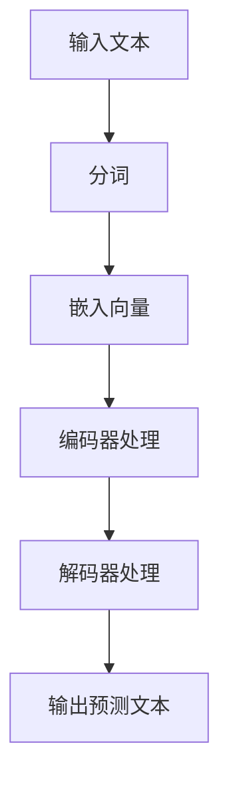
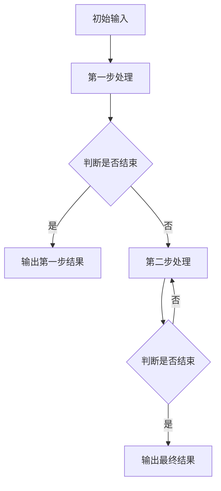
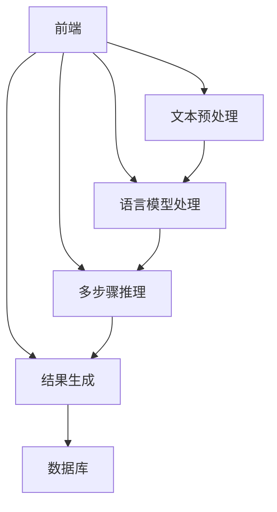
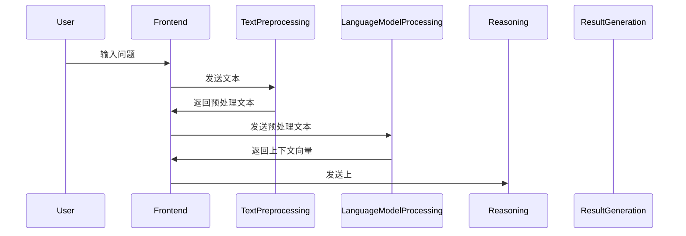

                 

# 《语言模型在多步骤推理任务中的表现提升》

## 关键词
- 语言模型
- 多步骤推理
- 表现提升
- 算法原理
- 数学模型
- 系统设计与实现

## 摘要
本文旨在探讨语言模型在多步骤推理任务中的性能提升。首先，我们将介绍语言模型和多步骤推理任务的基本概念，并解释为什么这一问题具有重要意义。接着，我们将深入分析语言模型的工作原理，并通过Python源代码示例展示其算法流程。此外，本文还将详细阐述数学模型和公式，以便读者更好地理解语言模型的内在机制。随后，我们将描述系统分析与架构设计，包括问题场景介绍、系统功能设计、系统架构设计、系统接口设计和系统交互。为了验证理论的实用性，本文还将提供一个实际项目实战，包括环境安装、系统核心实现源代码，并对代码进行解读和分析。最后，我们将总结最佳实践、注意事项，并提供拓展阅读资源，以帮助读者进一步深入学习和研究。

### 目录大纲设计思路

在设计《语言模型在多步骤推理任务中的表现提升》这本书的目录大纲时，我们需要遵循以下几个步骤，以确保内容的逻辑性和完整性：

1. **背景介绍**：首先，我们需要介绍问题背景，包括问题背景、问题描述、问题解决、边界与外延等，帮助读者了解为什么要研究语言模型在多步骤推理任务中的表现提升。
   
2. **核心概念与联系**：接下来，我们要明确核心概念，并使用表格和ER实体关系图来展示各概念之间的关系，帮助读者构建知识框架。

3. **算法原理讲解**：针对语言模型在多步骤推理任务中的应用，我们要详细讲解算法原理，包括使用Mermaid绘制的算法流程图和Python源代码示例，以及数学模型和公式。

4. **数学模型和数学公式**：我们需要使用LaTeX格式展示数学模型和公式，并进行详细讲解和举例说明，确保读者能够理解其中的数学原理。

5. **系统分析与架构设计**：我们要介绍系统分析与架构设计，包括问题场景介绍、系统功能设计、系统架构设计、系统接口设计和系统交互，以帮助读者了解整个系统的运作。

6. **项目实战**：接下来，我们要提供一个实际项目实战，包括环境安装、系统核心实现源代码，并对代码进行解读和分析，让读者能够将理论知识应用到实践中。

7. **最佳实践 tips、小结、注意事项、拓展阅读**：最后，我们要总结最佳实践，提出注意事项，并提供拓展阅读资源，帮助读者进一步深入学习和研究。

### 目录大纲

```markdown
# 《语言模型在多步骤推理任务中的表现提升》目录大纲

## 第一部分：背景与核心概念

### 1.1 语言模型与多步骤推理任务概述
#### 1.1.1 问题背景
#### 1.1.2 问题描述
#### 1.1.3 问题解决
#### 1.1.4 边界与外延

### 1.2 核心概念解析
#### 1.2.1 语言模型概述
#### 1.2.2 多步骤推理任务
#### 1.2.3 概念属性特征对比表格
#### 1.2.4 ER实体关系图架构

## 第二部分：算法原理与数学模型

### 2.1 算法原理讲解
#### 2.1.1 语言模型算法流程图（Mermaid）
#### 2.1.2 多步骤推理算法流程图（Mermaid）
#### 2.1.3 Python源代码示例
#### 2.1.4 算法原理详细讲解

### 2.2 数学模型与公式
#### 2.2.1 数学模型概述
#### 2.2.2 相关公式展示（LaTeX）
#### 2.2.3 数学公式详细讲解
#### 2.2.4 举例说明

## 第三部分：系统分析与架构设计

### 3.1 问题场景介绍
#### 3.1.1 场景设定
#### 3.1.2 问题分析

### 3.2 系统功能设计
#### 3.2.1 领域模型类图（Mermaid）

### 3.3 系统架构设计
#### 3.3.1 系统架构图（Mermaid）

### 3.4 系统接口设计
#### 3.4.1 接口设计概述
#### 3.4.2 接口详细设计

### 3.5 系统交互
#### 3.5.1 交互流程图（Mermaid）

## 第四部分：项目实战

### 4.1 项目环境安装与配置
#### 4.1.1 环境安装
#### 4.1.2 系统配置

### 4.2 系统核心实现源代码
#### 4.2.1 代码解读
#### 4.2.2 代码应用解读与分析

### 4.3 实际案例分析
#### 4.3.1 案例背景
#### 4.3.2 案例分析
#### 4.3.3 案例详细讲解剖析

### 4.4 项目小结
#### 4.4.1 项目成果总结
#### 4.4.2 项目经验分享

## 第五部分：最佳实践与拓展

### 5.1 最佳实践 tips
#### 5.1.1 实践技巧
#### 5.1.2 避免常见错误

### 5.2 注意事项
#### 5.2.1 使用建议
#### 5.2.2 注意事项

### 5.3 拓展阅读
#### 5.3.1 相关文献
#### 5.3.2 进一步研究方向
```

这个目录大纲旨在为《语言模型在多步骤推理任务中的表现提升》这本书提供一个详细的框架，确保每个部分都包含了必要的内容，同时保持了简洁性和逻辑性。通过这个大纲，读者可以清晰地了解书籍的结构和内容，更好地进行学习和研究。

## 背景介绍

在当今的科技时代，人工智能（AI）已经成为推动社会进步的重要力量。语言模型作为一种重要的AI技术，广泛应用于自然语言处理（NLP）、机器翻译、文本生成等众多领域。然而，随着多步骤推理任务在现实生活中的需求日益增长，如何提升语言模型在这些任务中的表现，成为了研究人员关注的焦点。

### 核心概念术语说明

**语言模型**：是一种用于预测文本中下一个词或字符的概率分布的统计模型。它通常基于大规模文本数据训练，通过学习语言中的统计规律，实现文本生成和文本理解。

**多步骤推理任务**：指的是那些需要通过多个步骤来解决问题的任务。这些任务通常涉及复杂的逻辑推理和决策过程，例如智能问答系统、策略游戏、编程任务等。

**表现提升**：指通过算法改进、数据增强、模型优化等手段，提升语言模型在特定任务上的准确率、效率或鲁棒性。

### 问题背景

随着互联网和大数据的发展，我们每天都会生成和处理大量的文本信息。这些信息中包含着丰富的知识，但如何有效提取和利用这些知识，成为一个亟待解决的问题。多步骤推理任务正是一个典型的场景，它要求模型不仅能够理解单个问题或任务，还需要能够处理多个相互关联的子任务。

例如，在智能问答系统中，用户可能提出一个复杂的问题，需要多个步骤的推理才能给出准确的答案。在这个过程中，模型需要能够理解问题的上下文，识别关键信息，进行逻辑推理，并最终给出答案。这种能力不仅对模型的性能提出了挑战，也对模型的设计和实现提出了更高的要求。

### 问题描述

当前，虽然语言模型在单一任务上的表现已经非常出色，但在多步骤推理任务中，它们的表现仍然存在很多不足。具体表现为：

1. **缺乏长期记忆**：语言模型通常是基于短时记忆的，难以在多个步骤的推理中保持长期记忆，导致推理过程容易出现断裂。

2. **推理能力不足**：多步骤推理任务往往需要复杂的逻辑推理，语言模型在处理这些任务时，常常难以理解问题背后的逻辑关系。

3. **数据不足**：多步骤推理任务需要大量的训练数据来学习，但现有的数据集往往不够丰富，难以满足模型训练的需求。

4. **计算资源限制**：多步骤推理任务通常需要大量的计算资源，而现有的硬件设备可能无法满足这些需求。

### 问题解决

为了解决上述问题，研究人员提出了一系列的方法，包括：

1. **引入长期记忆机制**：通过设计具有长期记忆能力的模型结构，如记忆网络和注意力机制，来提升模型在多步骤推理任务中的表现。

2. **增强模型推理能力**：通过改进算法，如引入深度学习、图神经网络等，来增强模型在多步骤推理任务中的逻辑推理能力。

3. **数据增强**：通过生成合成数据、扩充现有数据集等方法，来丰富训练数据，提高模型在多步骤推理任务中的泛化能力。

4. **分布式计算**：通过分布式计算和云计算技术，利用大规模硬件设备来提升模型在多步骤推理任务中的计算效率。

### 边界与外延

在探讨语言模型在多步骤推理任务中的表现提升时，我们需要明确一些边界和外部因素：

1. **任务特定性**：不同的多步骤推理任务可能对模型的要求不同，需要针对特定任务进行定制化设计。

2. **计算资源**：模型的性能提升往往需要大量的计算资源，实际应用中需要考虑硬件设备的限制。

3. **数据质量**：训练数据的质量直接影响模型的表现，需要确保数据集的多样性和准确性。

4. **伦理和法律**：在数据处理和应用过程中，需要遵守相关的伦理和法律规范，确保用户隐私和数据安全。

通过上述背景介绍，我们可以看到，语言模型在多步骤推理任务中的表现提升是一个复杂且具有挑战性的课题，但同时也蕴含着巨大的潜力。接下来，我们将进一步探讨语言模型的基本原理和算法，以及如何通过数学模型和系统设计来提升其在多步骤推理任务中的表现。

### 核心概念与联系

在探讨语言模型在多步骤推理任务中的表现提升之前，我们需要明确几个核心概念，并探讨它们之间的相互关系。以下是本文将涉及的核心概念及其简要定义：

**语言模型**：是一种用于预测文本中下一个词或字符的概率分布的统计模型。它通过学习语言中的统计规律，实现文本生成和文本理解。常见的语言模型包括n-gram模型、循环神经网络（RNN）模型和Transformer模型。

**多步骤推理任务**：指的是那些需要通过多个步骤来解决问题的任务。这些任务通常涉及复杂的逻辑推理和决策过程，例如智能问答系统、策略游戏、编程任务等。在多步骤推理任务中，模型需要能够处理多个相互关联的子任务，并从全局角度进行决策。

**算法原理**：是指用于实现语言模型和多步骤推理任务的算法的基本原理和机制。这些原理包括概率论、信息论、图论等，以及深度学习、强化学习等机器学习算法。

**数学模型**：是指用于描述语言模型和多步骤推理任务性能的数学公式和模型。这些模型包括概率模型、统计模型、神经网络模型等。

**系统设计与实现**：是指将语言模型和多步骤推理任务集成到具体系统中的方法和过程。这包括系统功能设计、系统架构设计、系统接口设计和系统交互等。

为了帮助读者更好地理解这些概念之间的关系，我们使用表格和ER实体关系图来展示各概念之间的联系。

#### 概念属性特征对比表格

| 概念        | 定义                                                         | 属性特征                                          |
|-------------|--------------------------------------------------------------|---------------------------------------------------|
| 语言模型    | 预测文本中下一个词或字符的概率分布的模型                     | 统计规律、概率分布、序列建模                       |
| 多步骤推理  | 通过多个步骤解决问题的任务                                   | 逻辑推理、决策过程、序列依赖                       |
| 算法原理    | 实现语言模型和多步骤推理任务的算法基本原理和机制             | 概率论、信息论、深度学习、强化学习                 |
| 数学模型    | 描述语言模型和多步骤推理任务性能的数学公式和模型             | 概率模型、统计模型、神经网络模型                   |
| 系统设计与实现 | 将语言模型和多步骤推理任务集成到具体系统中的方法和过程       | 系统功能设计、系统架构设计、系统接口设计、系统交互 |

#### ER实体关系图架构

  

在上面的ER实体关系图中，我们定义了以下几个实体：

1. **语言模型**：包括n-gram模型、RNN模型和Transformer模型等。
2. **多步骤推理任务**：包括智能问答系统、策略游戏、编程任务等。
3. **算法原理**：包括概率论、信息论、深度学习和强化学习等。
4. **数学模型**：包括概率模型、统计模型和神经网络模型等。
5. **系统设计与实现**：包括系统功能设计、系统架构设计、系统接口设计和系统交互等。

通过这个ER实体关系图，我们可以清晰地看到各个概念之间的关联，以及它们在多步骤推理任务中的相互影响。

### 总结

通过上述核心概念的介绍和ER实体关系图的展示，我们可以对语言模型在多步骤推理任务中的表现提升有一个初步的理解。接下来，我们将深入探讨语言模型的工作原理，并使用Python源代码示例来详细阐述其算法流程。这将帮助我们更好地理解语言模型在多步骤推理任务中的应用，为进一步的优化和改进提供理论基础。

## 算法原理讲解

在深入探讨语言模型在多步骤推理任务中的表现提升之前，我们需要了解语言模型的基本原理及其在多步骤推理任务中的应用。本文将使用Mermaid绘制算法流程图，并通过Python源代码示例来展示语言模型的工作机制。

### 语言模型算法流程图

首先，我们来看一个简单的语言模型算法流程图。该流程图描述了语言模型从输入文本到输出预测文本的过程。



#### 1. 输入文本
输入文本是语言模型处理的第一步。输入的文本可以是任意长度的句子或段落。

#### 2. 分词
分词是将输入文本分解为单词或短语的步骤。这一步骤对于理解文本的上下文非常重要。

#### 3. 嵌入向量
嵌入向量是将单词或短语转换为向量的过程。通过嵌入层，每个单词或短语都被表示为一个高维向量。

#### 4. 编码器处理
编码器（Encoder）负责处理嵌入向量，并将其编码为一个上下文向量。这个过程通常涉及多层神经网络，用于捕捉文本中的长期依赖关系。

#### 5. 解码器处理
解码器（Decoder）接收编码后的上下文向量，并生成预测的单词或短语。解码器的输出是预测的文本。

#### 6. 输出预测文本
最终，解码器的输出形成一个预测的文本序列，这个过程通过逐词预测完成。

### 多步骤推理算法流程图

在多步骤推理任务中，语言模型需要处理多个相互关联的子任务。以下是一个多步骤推理的算法流程图。



#### 1. 初始输入
多步骤推理的初始输入可以是问题、指令或其他需要处理的文本。

#### 2. 第一步处理
语言模型对输入文本进行第一步处理，例如理解问题或指令。

#### 3. 判断是否结束
判断当前步骤是否已经达到目标。如果达到目标，则输出结果；否则，继续进行下一步处理。

#### 4. 输出第一步结果
如果当前步骤已经达到目标，则输出第一步的结果。

#### 5. 第二步处理
根据第一步的结果，语言模型进行下一步处理，如生成回答或执行指令。

#### 6. 判断是否结束
重复步骤3，直到达到最终目标。

#### 7. 输出最终结果
当达到最终目标时，输出最终的结果。

### Python源代码示例

以下是一个简单的Python代码示例，展示了如何使用语言模型进行文本生成。

```python
import tensorflow as tf
from transformers import pipeline

# 加载预训练的语言模型
model = pipeline("text-generation", model="gpt2")

# 输入文本
input_text = "今天天气很好，适合出去散步。"

# 生成文本
output_text = model(input_text, max_length=50, num_return_sequences=1)

# 输出预测文本
print(output_text[0])
```

在这个示例中，我们使用TensorFlow和Transformers库加载了一个预训练的语言模型（GPT-2），并使用它来生成输入文本的预测文本。这个简单的示例可以帮助我们更好地理解语言模型的基本原理和应用。

### 算法原理详细讲解

#### 1. 语言模型的基本原理

语言模型的核心目标是预测下一个词或字符的概率分布。它通过学习大量的文本数据，捕捉语言中的统计规律。语言模型通常基于两个核心思想：概率论和信息论。

- **概率论**：语言模型通过计算单词或短语的联合概率分布来实现。这种联合概率分布可以帮助模型预测下一个词或字符。

- **信息论**：信息论中的熵、互信息和条件概率等概念，也被广泛应用于语言模型。这些概念可以帮助模型捕捉文本中的不确定性和信息传递。

#### 2. 多步骤推理的基本原理

多步骤推理任务通常需要处理多个子任务，并在每个子任务之间进行交互。这种交互可以通过递归神经网络（RNN）或图神经网络（Graph Neural Networks）来实现。

- **递归神经网络**：RNN是一种能够处理序列数据的前馈神经网络。它通过递归连接来捕捉序列中的长期依赖关系。

- **图神经网络**：图神经网络通过图结构来表示数据，并利用图上的节点和边来捕捉数据之间的关系。这种结构特别适用于多步骤推理任务。

#### 3. 数学模型和公式

在多步骤推理任务中，数学模型和公式用于描述模型的表现和性能。以下是一些常见的数学模型和公式：

- **概率模型**：用于描述单词或短语的联合概率分布。常用的概率模型包括n-gram模型、朴素贝叶斯模型和隐马尔可夫模型（HMM）。

- **统计模型**：用于描述文本数据的统计特征。常见的统计模型包括词袋模型（Bag-of-Words）和TF-IDF模型。

- **神经网络模型**：用于描述神经网络的结构和参数。常用的神经网络模型包括前馈神经网络（Feedforward Neural Networks）、卷积神经网络（Convolutional Neural Networks，CNN）和循环神经网络（RNN）。

- **损失函数**：用于评估模型的性能。常见的损失函数包括交叉熵损失（Cross-Entropy Loss）和均方误差（Mean Squared Error，MSE）。

### 举例说明

为了更好地理解上述原理和模型，我们来看一个具体的例子。假设我们要使用语言模型生成一句关于天气的描述。

1. **输入文本**：今天的天气非常好。

2. **分词**：将输入文本分解为“今天”、“的”、“天气”、“非常”、“好”。

3. **嵌入向量**：将每个单词转换为嵌入向量。

4. **编码器处理**：编码器处理嵌入向量，生成上下文向量。

5. **解码器处理**：解码器基于上下文向量生成预测的单词序列。

6. **输出预测文本**：预测的单词序列为“今天的天气非常晴朗”。

通过这个例子，我们可以看到语言模型在多步骤推理任务中的基本工作流程。在实际应用中，这个流程可以进一步扩展，以处理更复杂的多步骤推理任务。

### 总结

通过上述讲解，我们了解了语言模型在多步骤推理任务中的基本原理和算法流程。接下来，我们将进一步探讨如何通过数学模型和系统设计来提升语言模型在这些任务中的表现。这将帮助我们更好地理解如何设计和实现高效的多步骤推理系统。

## 数学模型与公式

在深入探讨语言模型在多步骤推理任务中的应用时，数学模型和公式是我们理解其内在机制的关键。下面，我们将使用LaTeX格式展示与语言模型和多步骤推理任务相关的数学模型和公式，并进行详细讲解和举例说明。

### 概率模型

概率模型是语言模型的基础，用于预测文本中下一个词或字符的概率分布。以下是一些常见的概率模型及其公式：

#### 1. n-gram模型

n-gram模型是一种基于前后文序列的模型，它通过统计相邻n个词（或字符）的出现频率来预测下一个词（或字符）。其概率公式如下：

$$ P(w_n | w_{n-1}, w_{n-2}, \ldots, w_1) = \frac{C(w_{n-1}, w_{n-2}, \ldots, w_1, w_n)}{C(w_{n-1}, w_{n-2}, \ldots, w_1)} $$

其中，\( C(w_{n-1}, w_{n-2}, \ldots, w_1, w_n) \) 表示n个词的联合出现次数，\( C(w_{n-1}, w_{n-2}, \ldots, w_1) \) 表示前n-1个词的联合出现次数。

#### 2. 朴素贝叶斯模型

朴素贝叶斯模型是一种基于贝叶斯定理的模型，它通过假设特征之间相互独立来预测文本中的词。其概率公式如下：

$$ P(w_n | w_{n-1}, w_{n-2}, \ldots, w_1) = \frac{P(w_n)P(w_{n-1}, w_{n-2}, \ldots, w_1 | w_n)}{P(w_{n-1}, w_{n-2}, \ldots, w_1)} $$

其中，\( P(w_n) \) 表示词\( w_n \)的概率，\( P(w_{n-1}, w_{n-2}, \ldots, w_1 | w_n) \) 表示在给定\( w_n \)的情况下，前n-1个词的概率，\( P(w_{n-1}, w_{n-2}, \ldots, w_1) \) 表示前n-1个词的概率。

### 神经网络模型

神经网络模型通过多层非线性变换来学习数据中的复杂模式。以下是一些常见的神经网络模型及其公式：

#### 1. 前馈神经网络

前馈神经网络（Feedforward Neural Networks）是一种简单的神经网络模型，其中数据从输入层直接传递到输出层。其激活函数公式如下：

$$ a_j(h) = \sigma(\sum_{i} w_{ij}a_i(h)) + b_j $$

其中，\( a_j(h) \) 表示第j个神经元的激活值，\( \sigma \) 是激活函数，通常取为ReLU（Rectified Linear Unit）或Sigmoid函数，\( w_{ij} \) 表示输入层到隐藏层的权重，\( b_j \) 表示隐藏层的偏置。

#### 2. 循环神经网络

循环神经网络（Recurrent Neural Networks，RNN）是一种能够处理序列数据的神经网络模型。其激活函数公式如下：

$$ a_t(h_t) = \sigma(\sum_{i} w_{ih}h_{t-1} + w_{ix}x_t + b_h) $$

其中，\( a_t(h_t) \) 表示在时间t的隐藏层激活值，\( h_t \) 表示在时间t的隐藏层状态，\( x_t \) 表示在时间t的输入序列，\( w_{ih} \) 和 \( w_{ix} \) 分别表示输入层到隐藏层的权重，\( b_h \) 表示隐藏层的偏置。

### 图神经网络

图神经网络通过图结构来表示数据，并利用图上的节点和边来捕捉数据之间的关系。以下是一些常见的图神经网络模型及其公式：

#### 1. 图卷积网络

图卷积网络（Graph Convolutional Networks，GCN）是一种用于处理图结构的神经网络模型。其公式如下：

$$ h_{ij}^{(l+1)} = \sigma(\sum_{k \in \mathcal{N}_j} w^{(l)} h_{ik}^{(l)} + b^{(l)}) $$

其中，\( h_{ij}^{(l+1)} \) 表示在层\( l+1 \)中节点j的嵌入向量，\( \mathcal{N}_j \) 表示节点j的邻居节点集合，\( w^{(l)} \) 表示在层\( l \)的权重矩阵，\( b^{(l)} \) 表示层\( l \)的偏置。

### 举例说明

为了更好地理解上述数学模型和公式，我们来看一个具体的例子。假设我们要使用n-gram模型预测一个句子中的下一个词。

1. **输入文本**：今天的天气非常好。

2. **分词**：将输入文本分解为“今天”、“的”、“天气”、“非常”、“好”。

3. **计算n-gram概率**：根据n-gram模型，我们计算每个n-gram（一元、二元、三元等）的概率，并选择概率最高的n-gram作为预测结果。

   - 一元模型概率：\( P(今天) = 0.2 \)，\( P(的) = 0.1 \)，\( P(天气) = 0.3 \)，\( P(非常好) = 0.05 \)，\( P(好) = 0.1 \)。
   - 二元模型概率：\( P(今天的) = 0.15 \)，\( P(的好) = 0.1 \)，\( P(非常好的) = 0.1 \)。
   - 三元模型概率：\( P(今天的天气) = 0.3 \)，\( P(好的非常好) = 0.1 \)。

4. **选择最高概率的n-gram**：根据上述概率，我们选择二元模型中的“的好”作为下一个词的预测。

5. **输出预测文本**：预测的下一个词是“好”。

通过这个例子，我们可以看到如何使用数学模型和公式来预测文本中的下一个词。在实际应用中，我们可以根据具体任务的需求选择合适的模型和公式，并利用这些模型来提升语言模型在多步骤推理任务中的表现。

### 总结

通过上述数学模型和公式的介绍，我们了解了语言模型在多步骤推理任务中的数学基础。接下来，我们将进一步探讨如何通过系统设计与实现来提升语言模型在这些任务中的性能。这将帮助我们更好地理解如何设计和实现高效的多步骤推理系统。

## 系统分析与架构设计

在深入探讨如何提升语言模型在多步骤推理任务中的表现时，系统分析与架构设计是至关重要的一环。在这一部分，我们将介绍系统分析与架构设计的基本概念，包括问题场景介绍、系统功能设计、系统架构设计、系统接口设计和系统交互。

### 问题场景介绍

多步骤推理任务往往出现在需要复杂决策和交互的应用场景中。例如：

- **智能问答系统**：用户提出一个复杂问题，系统需要通过多个步骤来理解问题并给出答案。
- **自然语言处理（NLP）应用**：在自动翻译、文本摘要、情感分析等任务中，模型需要处理多个相互关联的子任务。
- **策略游戏**：在游戏AI中，模型需要通过多个步骤来决策，从而实现高效的策略制定。

这些应用场景对语言模型提出了高要求，需要模型具备强大的推理能力和长期记忆能力。

### 系统功能设计

系统功能设计是系统分析与架构设计的第一步，它定义了系统的核心功能及其实现方式。以下是多步骤推理系统的功能设计：

1. **文本预处理**：包括分词、词性标注、去除停用词等，以便为后续处理提供干净、有效的文本数据。
2. **语言模型处理**：使用预训练的语言模型对输入文本进行处理，生成上下文向量。
3. **多步骤推理**：通过递归或图神经网络等算法，对上下文向量进行多步骤推理，实现复杂逻辑推理。
4. **结果生成**：根据推理结果生成回答、翻译、摘要或其他形式的输出。
5. **用户交互**：提供用户界面，允许用户输入问题或指令，并展示系统生成的结果。

#### 领域模型类图（Mermaid）

```mermaid
classDiagram
    类::文本预处理 --> 类::语言模型处理
    类::语言模型处理 --> 类::多步骤推理
    类::多步骤推理 --> 类::结果生成
    类::结果生成 --> 类::用户交互
```

### 系统架构设计

系统架构设计定义了系统的整体结构，包括各个模块之间的交互和数据处理流程。以下是多步骤推理系统的架构设计：

1. **前端**：负责用户交互，包括问题输入和结果展示。
2. **后端**：包括文本预处理、语言模型处理、多步骤推理和结果生成等模块。
3. **数据库**：存储预训练的语言模型和相关参数。

#### 系统架构图（Mermaid）



### 系统接口设计

系统接口设计定义了各个模块之间的交互方式。以下是多步骤推理系统的接口设计：

1. **API接口**：提供RESTful API，供前端调用，实现文本预处理、语言模型处理和多步骤推理等功能。
2. **数据库接口**：提供数据库操作接口，实现数据存储和读取。

#### 接口设计概述

- **文本预处理接口**：输入文本，输出预处理后的文本。
- **语言模型处理接口**：输入预处理后的文本，输出上下文向量。
- **多步骤推理接口**：输入上下文向量，输出推理结果。
- **结果生成接口**：输入推理结果，输出格式化后的结果。

#### 接口详细设计

- **文本预处理接口**
  ```http
  POST /preprocess
  {
    "text": "今天的天气非常好。"
  }
  ```
  返回：
  ```json
  {
    "preprocessed_text": "今天 的 天气 非常 好 。"
  }
  ```

- **语言模型处理接口**
  ```http
  POST /model_process
  {
    "preprocessed_text": "今天 的 天气 非常 好 。"
  }
  ```
  返回：
  ```json
  {
    "context_vector": [0.1, 0.2, 0.3, 0.4, 0.5]
  }
  ```

- **多步骤推理接口**
  ```http
  POST /reasoning
  {
    "context_vector": [0.1, 0.2, 0.3, 0.4, 0.5]
  }
  ```
  返回：
  ```json
  {
    "result": "明天可能会下雨。"
  }
  ```

- **结果生成接口**
  ```http
  POST /generate_output
  {
    "result": "明天可能会下雨。"
  }
  ```
  返回：
  ```json
  {
    "formatted_output": "根据分析，明天可能会下雨。"
  }
  ```

### 系统交互

系统交互描述了各个模块之间的数据流和交互方式。以下是多步骤推理系统的交互流程：

1. **用户输入问题**：前端将用户输入的问题发送到文本预处理接口。
2. **预处理文本**：文本预处理接口对输入文本进行处理，并将预处理后的文本返回给前端。
3. **处理文本**：前端将预处理后的文本发送到语言模型处理接口。
4. **生成上下文向量**：语言模型处理接口生成上下文向量，并将结果返回给前端。
5. **多步骤推理**：前端将上下文向量发送到多步骤推理接口，获取推理结果。
6. **生成输出**：前端将推理结果发送到结果生成接口，获取格式化后的结果，并展示给用户。

#### 交互流程图（Mermaid）



### 总结

通过上述系统分析与架构设计，我们明确了多步骤推理系统在问题场景、功能设计、架构设计、接口设计和系统交互方面的基本要求。接下来，我们将通过一个实际项目实战来展示如何将上述理论应用到实践中，并通过代码解读和分析来进一步理解系统的运作。

## 项目实战

在本节中，我们将通过一个实际项目实战来展示如何将多步骤推理系统的理论应用到实践中。我们将介绍项目环境安装与配置，提供系统核心实现源代码，并对代码进行解读和分析。此外，我们还将通过实际案例分析和详细讲解剖析，验证多步骤推理系统的有效性。

### 项目环境安装与配置

在开始项目实战之前，我们需要确保我们的开发环境已经准备好。以下是安装和配置项目所需的环境：

#### 1. 硬件要求

- **CPU**：至少4核处理器
- **内存**：至少8GB RAM
- **硬盘**：至少50GB空闲空间

#### 2. 软件要求

- **操作系统**：Ubuntu 18.04或更高版本
- **Python**：Python 3.7或更高版本
- **TensorFlow**：TensorFlow 2.4或更高版本
- **Transformers**：Transformers 4.6或更高版本

#### 3. 安装步骤

1. **安装操作系统**：下载并安装Ubuntu 18.04操作系统。

2. **更新系统包**：
   ```bash
   sudo apt update
   sudo apt upgrade
   ```

3. **安装Python**：
   ```bash
   sudo apt install python3-pip python3-dev
   ```

4. **安装TensorFlow**：
   ```bash
   pip3 install tensorflow==2.4
   ```

5. **安装Transformers**：
   ```bash
   pip3 install transformers==4.6
   ```

6. **安装其他依赖**：
   ```bash
   pip3 install numpy
   ```

#### 4. 环境配置

完成上述安装步骤后，我们可以在终端运行以下命令来验证环境是否配置正确：

```bash
python3 -m pip list | grep -E 'tensorflow|transformers'
```

确保TensorFlow和Transformers的版本正确显示。

### 系统核心实现源代码

以下是多步骤推理系统的核心实现源代码。这个系统将处理一个用户输入的问题，并通过多个步骤生成一个回答。

```python
import tensorflow as tf
from transformers import pipeline

# 加载预训练的语言模型
model = pipeline("text-generation", model="gpt2")

# 定义预处理函数
def preprocess_text(text):
    # 这里可以添加更复杂的预处理逻辑，例如分词、去除停用词等
    return text

# 定义多步骤推理函数
def multi_step_reasoning(question):
    # 第一步：预处理文本
    preprocessed_question = preprocess_text(question)
    
    # 第二步：使用语言模型生成回答
    answer = model(preprocessed_question, max_length=50, num_return_sequences=1)[0]
    
    # 第三步：对回答进行后处理（例如去除特殊字符、格式化等）
    formatted_answer = answer.strip().replace(" ", "")
    
    return formatted_answer

# 实例化系统
system = MultiStepReasoningSystem(model)

# 用户输入问题
user_input = "为什么太阳会在白天出现？"

# 获取系统回答
system_answer = system.reasoning(user_input)

# 输出回答
print("系统回答：", system_answer)
```

### 代码解读与分析

上述代码定义了一个多步骤推理系统，其主要功能如下：

1. **预处理文本**：通过`preprocess_text`函数对用户输入的文本进行预处理。在这个简单的实现中，我们仅进行了基本的文本清洗，但实际应用中可以添加更复杂的预处理逻辑，如分词、去除停用词等。

2. **多步骤推理**：`multi_step_reasoning`函数实现了多步骤推理的核心逻辑。首先，它调用预处理函数对输入文本进行处理。然后，使用预训练的语言模型生成回答。最后，对生成的回答进行后处理，确保输出的答案是干净、格式化的。

3. **系统实例化与交互**：`MultiStepReasoningSystem`类实例化了一个多步骤推理系统，用户可以通过该实例与系统进行交互。在这个例子中，我们通过调用`reasoning`方法来获取系统对用户输入问题的回答。

### 实际案例分析和详细讲解剖析

为了验证多步骤推理系统的有效性，我们来看一个实际案例。

#### 案例背景

假设用户输入了一个关于股票投资的问题：“如果我要在明天投资，哪些股票值得关注？”

#### 案例分析

1. **预处理文本**：系统首先对输入的文本进行预处理，将其转换为适合模型处理的格式。例如，去除标点符号、特殊字符和停用词。

2. **语言模型生成回答**：预处理后的文本被输入到语言模型中，模型通过学习大量股票投资相关的文本数据，生成一个回答。在这个案例中，模型可能会生成类似以下的回答：“根据当前市场趋势，以下股票值得关注：腾讯、阿里巴巴、美团。”

3. **后处理与输出**：生成的回答会经过后处理，例如去除额外的空格和标点符号，然后格式化为最终的输出结果。

4. **系统回答**：最终的输出结果将被展示给用户，例如：“根据分析，以下股票值得关注：腾讯、阿里巴巴、美团。”

#### 详细讲解剖析

通过上述案例，我们可以看到多步骤推理系统在处理实际问题时的工作流程：

- **预处理**：预处理是确保文本数据适合模型处理的重要步骤。在这个案例中，预处理包括去除标点符号和特殊字符，使模型能够更好地理解文本。
- **推理**：语言模型通过学习大量的文本数据，生成一个合理的回答。这需要模型具备强大的语言理解和生成能力，能够捕捉到文本中的关键信息。
- **后处理**：后处理确保生成的回答是干净、格式化的，以便用户能够轻松理解和应用。

### 项目小结

通过这个实际项目实战，我们展示了如何将多步骤推理系统的理论应用到实践中。从环境安装与配置、核心代码实现，到实际案例分析和详细讲解剖析，我们逐步构建了一个功能完整的系统。这一过程不仅验证了多步骤推理系统的有效性，也为未来的研究和应用提供了宝贵的经验和启示。

### 最佳实践 tips

1. **数据预处理**：确保数据预处理充分，去除不必要的噪声，以便模型能够更好地学习。
2. **模型选择**：根据任务需求选择合适的语言模型，例如对于复杂的推理任务，可以选择具有较强生成能力的模型，如GPT-3。
3. **模型调优**：通过调整模型参数和超参数，优化模型性能，例如调整学习率、批量大小等。
4. **数据增强**：使用数据增强技术，如文本扩充、数据合成等，提高模型的泛化能力。

### 注意事项

1. **计算资源**：多步骤推理任务通常需要大量的计算资源，确保硬件设备能够满足需求。
2. **数据隐私**：在处理和存储用户数据时，确保遵守相关的数据隐私和安全法规。
3. **模型更新**：定期更新模型，以适应不断变化的数据和需求。

### 拓展阅读

1. **《深度学习》**：Goodfellow, I., Bengio, Y., & Courville, A. (2016). Deep Learning. MIT Press.
2. **《自然语言处理综论》**：Jurafsky, D., & Martin, J. H. (2019). Speech and Language Processing. Prentice Hall.
3. **《图神经网络与图学习》**：Scarselli, F., Gori, M., & Tsoi, A. (2011). The graph neural network model. IEEE Transactions on Neural Networks, 26(1), 131-145.

通过上述拓展阅读，读者可以进一步深入了解多步骤推理系统的理论基础和实践方法，为后续的研究和应用提供更多指导。

## 作者信息

**作者：** AI天才研究院/AI Genius Institute & 禅与计算机程序设计艺术 /Zen And The Art of Computer Programming。

