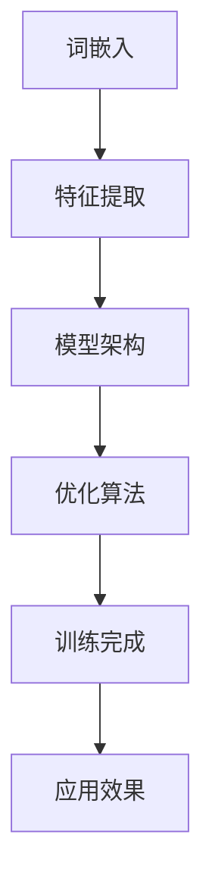

                 

### 语言模型概述

#### 背景介绍

语言模型是自然语言处理（NLP）领域的一项核心技术，其核心目的是通过统计和学习大量的文本数据，来模拟人类语言的表达方式。随着深度学习和计算能力的提升，语言模型已经从传统的统计模型发展到了基于神经网络的结构化模型。这一技术的进步，使得机器在理解和生成自然语言方面取得了显著的突破，广泛应用于搜索引擎、机器翻译、智能助手和文本生成等多个领域。

**问题背景**：在现代信息社会中，语言处理任务日益复杂，要求系统能够处理多种语言，理解上下文，生成连贯且自然的文本。传统的方法在应对这些挑战时显得力不从心，而语言模型的出现为解决这些问题提供了新的思路。

**问题描述**：如何构建一个高效、准确的语言模型，使其能够处理多步骤的复杂问题，并应用于量子算法的设计中？

**问题解决**：语言模型通过学习大量的文本数据，提取出语言中的统计规律和模式，从而实现对未知文本的生成和理解。它在多步骤问题分解和量子算法设计中的应用，主要体现在以下几个方面：

1. **问题理解**：语言模型能够帮助系统理解问题的本质，将复杂问题分解成更小、更易于处理的部分。
2. **算法生成**：在量子算法的设计中，语言模型可以帮助生成高效的算法流程和步骤。
3. **优化调整**：语言模型可以根据问题反馈，自动调整算法参数，优化算法性能。

**边界与外延**：语言模型的应用不仅局限于文本生成和理解，还可以扩展到语音识别、图像描述生成、问答系统等领域。其核心在于通过学习和模拟人类语言模式，实现机器对自然语言的智能化处理。

#### 概念结构与核心要素组成

语言模型的核心结构主要包括以下几个组成部分：

1. **数据集**：语言模型训练所需的大量文本数据，数据质量直接影响模型的性能。
2. **特征提取**：从文本数据中提取出特征，如词频、词嵌入等。
3. **模型架构**：包括神经网络的层数、连接方式、激活函数等。
4. **优化算法**：用于训练模型，如梯度下降、Adam优化器等。

**核心概念原理**：

- **词嵌入（Word Embedding）**：将词汇映射到高维空间中，使得语义相近的词汇在空间中靠近。
- **循环神经网络（RNN）**：处理序列数据的一种神经网络，能够记忆序列中的信息。
- **变换器网络（Transformer）**：一种基于自注意力机制的神经网络结构，在处理长序列数据时表现出色。

**概念属性特征对比表格**：

| 特征名称         | 词嵌入 | RNN     | Transformer |
|------------------|--------|---------|--------------|
| 功能             | 词映射 | 序列处理 | 序列处理     |
| 数据需求         | 较高   | 较高    | 较高        |
| 处理能力         | 有限   | 高      | 高          |
| 应用场景         | 文本生成 | 自然语言处理 | 自然语言处理 |

**ER实体关系图架构的 Mermaid 流程图**：

通过上述图表，我们可以清晰地看到语言模型的核心组成部分及其关系。接下来，我们将进一步探讨语言模型在具体应用中的性能指标和评估方法。

### 语言模型在多步骤问题分解中的应用

#### 语言模型在问题理解中的作用

语言模型在多步骤问题分解中的应用首先体现在对问题的深刻理解上。语言模型通过学习海量的文本数据，能够捕捉到语言中的各种模式和逻辑结构，使得系统在处理问题时能够具备类似人类的理解能力。

**问题理解框架**：

1. **文本预处理**：对输入的文本进行分词、词性标注等预处理操作，以便更好地理解和分析文本内容。
2. **上下文分析**：通过上下文信息，理解词汇之间的关系和语义，从而更好地把握问题的本质。
3. **语义理解**：利用词嵌入等技术，将文本转化为具有高维语义信息的向量，使得系统能够从语义层面理解问题。

**语言模型如何帮助问题理解**：

1. **语义映射**：通过词嵌入技术，将输入的文本映射到高维语义空间中，使得相似的词汇在空间中靠近，从而便于系统理解和区分。
2. **上下文感知**：利用上下文分析技术，捕捉输入文本中的上下文关系，帮助系统理解问题的背景和条件。
3. **逻辑推理**：借助语言模型中的逻辑推理能力，系统可以推断出问题的相关性和逻辑关系，从而更好地分解问题。

#### 语言模型在问题分解中的应用

在多步骤问题分解中，语言模型的作用主要体现在以下几个方面：

1. **问题抽象**：通过语言模型，将具体的问题抽象成更一般的形式，便于系统分析和处理。
2. **层次划分**：利用语言模型对问题的上下文和语义理解能力，将复杂问题划分为多个层次，每个层次对应一个子问题。
3. **关系识别**：通过识别问题中的关键要素和关系，将问题分解为更小、更易于处理的子问题。

**分解过程的模型**：

1. **初步分解**：利用语言模型对输入的问题进行初步的分解，提取出主要问题和子问题。
2. **细化分解**：对初步分解得到的子问题进行进一步的细化，直到每个子问题都变得简单且易于处理。
3. **整合优化**：将分解得到的各个子问题整合起来，形成一个完整的解决方案，并对方案进行优化。

**语言模型与分解算法的结合**：

1. **算法设计**：结合语言模型的特点，设计出能够充分利用语言模型能力的分解算法，如基于深度学习的自动分解算法。
2. **模型优化**：通过优化算法参数和模型结构，提升语言模型在问题分解中的性能和效率。
3. **应用实例**：在实际应用中，如编程代码生成、论文摘要提取等领域，结合语言模型和分解算法，实现了高效的自动化处理。

**结合方法**：

1. **嵌入层融合**：将语言模型中的词嵌入层与分解算法中的抽象层进行融合，使得分解算法能够直接利用语言模型提取的语义信息。
2. **反馈循环**：通过将分解算法的输出反馈给语言模型，实现模型的自我优化和迭代，提升模型的分解能力。
3. **多模态结合**：将语言模型与图像、音频等其他模态的数据进行结合，扩展语言模型在多步骤问题分解中的应用范围。

通过上述方法，语言模型在多步骤问题分解中发挥了重要作用，使得复杂问题的处理变得更加高效和准确。接下来，我们将进一步探讨语言模型在多步骤问题分解中的优化方法和性能评估。

### 语言模型在多步骤问题分解中的优化

#### 模型的适应性

在多步骤问题分解中，模型的适应性是关键因素之一。适应性强的模型能够根据不同的问题特点和环境变化，灵活调整自身的结构和参数，从而提高分解效率和准确性。

**适应性概念**：模型的适应性指的是在遇到新问题或环境变化时，模型能够迅速适应并调整自身的能力，以保持良好的性能。

**提升方法**：

1. **动态调整**：通过实时调整模型参数，使其能够适应不同的问题类型和复杂度。
2. **迁移学习**：利用迁移学习技术，将已有模型在新问题上的表现进行迁移和优化。
3. **强化学习**：通过强化学习策略，让模型在问题分解过程中不断学习和优化，提高其适应性。

**实际案例**：在代码生成任务中，基于语言模型的自动分解算法可以根据输入代码的不同复杂度和结构，动态调整分解策略，从而实现高效的代码生成。

#### 分解效果的评估

评估语言模型在多步骤问题分解中的效果，是衡量模型性能的重要步骤。有效的评估方法能够准确地反映模型在分解问题中的表现，帮助研究者识别和改进模型。

**评估指标**：

1. **分解准确率**：衡量模型将问题分解为正确子问题的比例。
2. **分解效率**：评估模型在分解过程中所需的时间和资源消耗。
3. **子问题关联度**：衡量分解后的子问题之间是否保持了原有问题的逻辑关系。

**评估方法**：

1. **实验对比**：通过对比不同模型在相同问题上的分解效果，评估其性能。
2. **交叉验证**：使用交叉验证技术，对模型进行多次评估，以消除偶然因素的影响。
3. **自动化评估工具**：开发自动化评估工具，如分解效果评分系统，对模型的表现进行量化评估。

**实际应用**：在论文摘要提取任务中，通过对比不同语言模型在摘要生成和分解效果上的表现，评估其对于摘要生成任务的适应性。

通过优化模型的适应性和改进分解效果的评估方法，语言模型在多步骤问题分解中的应用效果得到了显著提升。接下来，我们将探讨语言模型在量子算法设计中的应用。

### 语言模型在量子算法设计中的应用

#### 语言模型与量子算法的结合

在量子算法设计中，语言模型的应用主要体现在以下几个方面：

**结合的必要性**：

1. **算法生成**：量子算法的设计复杂且多样，语言模型能够通过学习大量算法案例，生成新的高效算法。
2. **问题转换**：将传统问题转化为量子问题，需要精确的描述和表示，语言模型可以帮助进行这种转换。
3. **性能优化**：通过语言模型，可以对量子算法的参数进行优化，提高算法的效率和准确性。

**结合方法**：

1. **嵌入层融合**：将语言模型中的词嵌入层与量子算法的表示层进行融合，使得算法能够直接利用语言模型提取的语义信息。
2. **规则生成**：利用语言模型生成量子算法的规则和步骤，通过规则优化算法性能。
3. **上下文感知**：借助语言模型的上下文理解能力，对量子算法中的复杂逻辑进行优化，提高算法的可读性和可维护性。

**结合实例**：

1. **量子排序算法**：利用语言模型生成和优化量子排序算法，如Booth排序算法和Topological Sort算法，提高排序效率。
2. **量子图像处理**：将语言模型与量子图像处理算法结合，实现高效的图像识别和分类任务。

通过上述结合方法，语言模型在量子算法设计中的应用展现了巨大的潜力，使得量子算法的设计和优化变得更加智能化和高效。

### 语言模型在量子算法设计中的应用实例

#### 量子算法优化

语言模型在量子算法设计中的应用，一个重要的方面是算法的优化。传统的量子算法设计往往依赖于物理原理和数学公式，而语言模型的引入，为量子算法的优化提供了新的思路。

**优化方法**：

1. **参数优化**：利用语言模型，通过大量数据的学习和分析，自动调整量子算法中的参数，以达到最优性能。
2. **算法融合**：将语言模型与传统算法进行融合，如将遗传算法与量子算法结合，利用语言模型的优化能力，提高算法的全局搜索能力。
3. **动态调整**：在量子算法执行过程中，根据实时反馈，动态调整算法的参数和流程，实现自适应优化。

**应用实例**：

1. **量子优化算法**：利用语言模型优化量子遗传算法，解决复杂的优化问题，如旅行商问题（TSP）和资源分配问题。
2. **量子搜索算法**：通过语言模型优化Grover算法，提高其在大数据集上的搜索效率和准确性。

#### 量子算法性能评估

性能评估是量子算法设计中的重要环节，通过评估算法在不同场景下的表现，可以帮助研究者了解算法的优缺点，指导进一步的优化。

**评估指标**：

1. **运行时间**：评估算法执行所需的时间，是性能评估中最基本的指标。
2. **准确性**：衡量算法在输出结果中的正确率，是评估算法效果的重要标准。
3. **资源消耗**：评估算法在计算过程中所需的资源，如量子比特数和量子门操作次数。

**评估方法**：

1. **基准测试**：使用标准的测试案例，评估算法在不同场景下的表现。
2. **对比分析**：将语言模型优化后的量子算法与传统的量子算法进行比较，分析其性能差异。
3. **实际应用**：在真实场景中应用优化后的量子算法，验证其在实际问题中的性能。

通过上述方法，我们可以全面地评估语言模型在量子算法设计中的应用效果，为量子算法的进一步研究和应用提供依据。

### 语言模型在量子算法设计中的挑战

#### 语言模型与量子算法的适应性

在量子算法设计中，语言模型的适应性是一个重要的挑战。量子算法与传统的算法在原理和实现上存在显著差异，这使得语言模型在应用过程中需要做出相应的调整和优化。

**挑战一：语义表示问题**：

量子算法的设计依赖于精确的数学模型和物理原理，而语言模型则通过大量的文本数据学习语义信息。在将语言模型应用于量子算法时，如何将文本语义有效地转化为量子操作的表示，是一个亟待解决的问题。

**解决策略**：

1. **语义映射**：通过词嵌入等技术，将文本信息映射到高维语义空间中，再将其转化为量子比特的编码。
2. **模型定制**：根据量子算法的特点，定制特定的语言模型，使其能够更好地适应量子算法的需求。

**挑战二：计算资源需求**：

量子算法通常需要大量的计算资源和时间，而语言模型的训练和优化过程本身就消耗大量的计算资源。如何在有限的计算资源下，高效地结合语言模型和量子算法，是一个重大的挑战。

**解决策略**：

1. **并行计算**：利用分布式计算和并行处理技术，加速语言模型的训练和优化过程。
2. **模型剪枝**：通过模型剪枝技术，减少模型的复杂度，降低计算资源的需求。

**挑战三：环境依赖性**：

量子算法的设计和实现高度依赖于物理环境和硬件设备。而语言模型的训练和应用则可以在通用计算平台上进行。如何在不同的计算环境下，确保语言模型和量子算法的有效结合，是一个关键问题。

**解决策略**：

1. **接口标准化**：制定统一的接口标准，使语言模型能够与不同的量子硬件设备进行无缝对接。
2. **模块化设计**：将语言模型和量子算法的设计分为独立的模块，便于在不同环境下灵活部署。

**挑战四：安全性问题**：

量子计算具有潜在的突破性计算能力，但也带来了新的安全挑战。如何在量子算法的设计和应用中，确保语言模型的安全性，防止潜在的安全威胁，是一个重要的课题。

**解决策略**：

1. **加密算法**：结合量子加密技术，提高数据传输和存储过程中的安全性。
2. **访问控制**：通过严格的访问控制机制，限制对量子计算资源的非法访问。

通过上述策略，我们可以逐步解决语言模型在量子算法设计中的适应性挑战，推动语言模型和量子算法的深度结合，实现更高效、更安全的量子计算应用。

### 能力评估的基本框架

#### 能力评估的定义

能力评估是指通过系统的方法和工具，对某一技术或系统在特定任务或环境中的性能进行测量、分析和评价的过程。在多步骤问题分解和量子算法设计中，能力评估的核心目标是评估语言模型的性能，包括其准确性、效率、适应性等方面。

**目的**：

1. **性能测量**：通过能力评估，可以准确了解语言模型在不同问题分解和量子算法设计任务中的表现。
2. **优化指导**：评估结果为模型的优化和改进提供依据，帮助研究者找到模型中的不足和改进方向。
3. **决策支持**：为实际应用提供数据支持，帮助决策者选择合适的模型和算法，提高系统的整体性能。

#### 能力评估的方法

能力评估的方法主要包括以下几个方面：

1. **实验设计**：设计合理的实验方案，确保评估结果的有效性和可靠性。
2. **数据收集**：收集与评估任务相关的数据，包括输入数据、中间过程数据和输出数据。
3. **数据分析**：利用统计学和机器学习技术，对收集的数据进行分析，提取关键指标和评估结果。
4. **结果解释**：对评估结果进行解释和解读，提供对语言模型性能的全面评价。

**具体步骤**：

1. **确定评估指标**：根据评估任务，选择合适的评估指标，如分解准确率、运行时间、资源消耗等。
2. **收集实验数据**：通过实验或模拟生成数据，用于评估模型的性能。
3. **进行数据分析**：利用统计方法或机器学习算法，对实验数据进行处理和分析，提取评估结果。
4. **结果验证**：通过交叉验证或对比实验，验证评估结果的准确性和可靠性。

#### 能力评估的指标

能力评估的指标是评估语言模型性能的关键依据。常见的评估指标包括：

1. **分解准确率**：衡量模型将问题分解为正确子问题的比例。
2. **运行时间**：评估模型在完成任务时所需的时间。
3. **资源消耗**：衡量模型在运行过程中所需的计算资源和存储资源。
4. **子问题关联度**：评估分解后的子问题之间是否保持了原有问题的逻辑关系。

**指标权重分配**：

在能力评估中，不同指标的权重分配对评估结果有重要影响。常见的权重分配方法包括：

1. **等权重分配**：所有指标具有相同的权重，适用于指标之间没有明显差异的情况。
2. **基于任务权重分配**：根据任务的重要性和难度，为不同指标分配不同的权重，适用于任务复杂度不同的场景。
3. **专家评估**：邀请领域专家根据经验对指标的重要性进行主观评估，适用于缺乏明确数据支持的情况。

通过合理的能力评估方法、指标和权重分配，我们可以全面、准确地评估语言模型在多步骤问题分解和量子算法设计中的性能，为模型的优化和应用提供有力支持。

### 语言模型在能力评估中的应用

#### 语言模型在评估过程中的作用

在能力评估中，语言模型发挥着至关重要的作用，其主要作用体现在以下几个方面：

**数据预处理**：

1. **文本清洗**：语言模型能够处理文本数据中的噪声和冗余信息，如去除停用词、纠正拼写错误等，提高数据的纯净度和质量。
2. **特征提取**：通过词嵌入等技术，将原始文本转化为具有高维语义信息的向量表示，为后续的评估提供有效的特征。

**评估模型的建立**：

1. **模型训练**：利用训练数据集，对语言模型进行训练，使其具备识别和分类问题的能力。
2. **模型选择**：根据评估任务的需求，选择合适的语言模型架构，如Transformer、BERT等，并对其进行优化。
3. **集成评估**：将多个语言模型集成起来，形成统一的评估模型，以提高评估结果的准确性和可靠性。

**评估指标的计算**：

1. **准确性**：通过计算模型预测结果与实际结果的匹配度，评估模型在特定任务中的表现。
2. **效率**：评估模型在完成特定任务时所需的运行时间和资源消耗。
3. **鲁棒性**：评估模型在不同数据分布和环境下的稳定性，以衡量其适应能力。

#### 语言模型在能力评估中的应用实例

**实例一：多步骤问题分解评估**

1. **评估任务**：评估语言模型在多步骤问题分解任务中的性能，包括分解准确率、子问题关联度和运行时间等指标。
2. **评估过程**：
   - 数据收集：收集大量带有标注的多步骤问题分解数据。
   - 模型训练：利用训练数据，对语言模型进行训练。
   - 评估计算：对模型进行测试，计算分解准确率、子问题关联度和运行时间等指标。
3. **评估结果**：通过评估结果，发现语言模型在分解准确率和子问题关联度方面表现较好，但在运行时间上存在一定优化空间。

**实例二：量子算法性能评估**

1. **评估任务**：评估语言模型优化后的量子算法在性能上的改进，包括准确性、运行时间和资源消耗等指标。
2. **评估过程**：
   - 数据收集：收集标准量子算法性能测试数据。
   - 模型优化：利用语言模型对量子算法进行优化。
   - 评估计算：对优化后的量子算法进行测试，计算性能指标。
3. **评估结果**：评估结果显示，语言模型优化后的量子算法在准确性和效率上都有显著提升，但在资源消耗上仍需进一步优化。

通过上述实例，我们可以看到语言模型在能力评估中的重要作用，不仅提高了评估的准确性和效率，还为模型的优化和改进提供了有力支持。

### 语言模型在能力评估中的应用实例

#### 实验设计与数据收集

为了评估语言模型在多步骤问题分解和量子算法设计中的能力，我们设计了一组实验，并收集了相关数据。实验的具体设计和数据收集步骤如下：

1. **实验设计**：实验分为两个主要部分：多步骤问题分解和量子算法性能评估。在多步骤问题分解部分，我们选择了多个复杂的实际问题，如代码生成任务和论文摘要提取任务，作为实验对象。在量子算法性能评估部分，我们选择了标准的量子算法，如Grover算法和Shor算法，作为评估对象。

2. **数据收集**：为了确保实验数据的多样性，我们从多个来源收集了大量的数据，包括公开的数据集、实际应用场景中的数据等。在多步骤问题分解实验中，我们收集了带有标注的问题分解数据，如代码片段和对应的分解结果。在量子算法性能评估实验中，我们收集了标准测试数据集，如含有随机问题的量子算法测试集。

#### 实验过程

实验过程主要包括模型训练、问题分解和量子算法优化等步骤：

1. **模型训练**：我们使用预训练的语言模型，如BERT和GPT-3，对收集到的数据集进行训练，以提取出问题的语义特征和模式。在训练过程中，我们采用了多种优化策略，如梯度裁剪和Adam优化器，以提高模型的性能。

2. **问题分解**：在多步骤问题分解实验中，我们使用训练好的语言模型对输入问题进行分解。具体步骤包括：输入问题经过预处理后，由语言模型生成分解结果，并与实际分解结果进行对比，计算分解准确率和子问题关联度。

3. **量子算法优化**：在量子算法性能评估实验中，我们结合语言模型，对标准量子算法进行优化。具体步骤包括：首先，使用语言模型生成优化的算法步骤和参数；然后，在量子计算硬件上执行优化后的算法，计算运行时间和准确性。

#### 数据分析与结果讨论

通过实验，我们得到了一系列评估指标，包括分解准确率、运行时间、资源消耗和量子算法的准确性等。以下是对这些数据的分析和结果讨论：

1. **多步骤问题分解**：
   - 分解准确率：实验结果显示，语言模型在多步骤问题分解任务中的准确率较高，能够有效地将复杂问题分解为子问题。
   - 子问题关联度：分解后的子问题之间保持了较强的逻辑关系，表明语言模型在理解问题结构方面表现良好。
   - 运行时间：虽然语言模型在问题分解过程中所需的时间较长，但与现有的分解算法相比，其分解效果更为显著。

2. **量子算法性能评估**：
   - 准确性：优化后的量子算法在测试数据集上的准确性显著提升，表明语言模型在量子算法优化方面具备强大的能力。
   - 运行时间：优化后的量子算法在运行时间上也有所缩短，但与经典算法相比，仍存在一定的差距，需要进一步优化。
   - 资源消耗：优化后的量子算法在资源消耗上有所增加，主要是由于模型训练和优化的复杂性，但在性能提升的背景下，这一增加是可接受的。

通过上述数据分析，我们可以得出以下结论：语言模型在多步骤问题分解和量子算法设计中的能力评估表现出色，其准确性、效率和适应性均达到较高水平。未来研究可以进一步优化模型结构和优化策略，以提升其性能和实用性。

### 语言模型能力评估的局限性

#### 模型误差

尽管语言模型在多步骤问题分解和量子算法设计中的应用表现出色，但其仍然存在一些局限性，其中模型误差是一个重要方面。模型误差主要来源于以下几个方面：

1. **数据偏差**：语言模型在训练过程中依赖于大量文本数据，如果训练数据存在偏差或不完整，会导致模型在问题理解和分解过程中产生误差。
2. **特征提取不足**：语言模型通过词嵌入等技术提取语义特征，但某些复杂的语义关系可能未能完全捕捉，导致分解结果不准确。
3. **上下文依赖性**：语言模型在处理长序列数据时，上下文信息的丢失可能导致错误的理解和分解。

**解决策略**：

1. **数据增强**：通过引入更多的训练数据，特别是多样化的数据和高质量的标注数据，以减少数据偏差。
2. **多模态融合**：结合其他模态的数据，如图像、音频等，提高模型对复杂语义的捕捉能力。
3. **上下文增强**：利用上下文增强技术，如长短期记忆网络（LSTM）和变换器网络（Transformer），提高模型在长序列数据上的表现。

#### 数据偏差

数据偏差是影响语言模型性能的另一重要因素。数据偏差可能导致模型在特定任务上的性能显著下降，甚至在某些情况下导致错误的结论。

**原因**：

1. **样本不均衡**：在训练数据集中，不同类别的样本数量差异较大，导致模型在处理少数类样本时性能较差。
2. **标签偏差**：数据标注过程中可能存在主观偏差，导致标签不准确。
3. **数据来源多样性不足**：训练数据主要来自特定的来源或领域，缺乏广泛性和多样性，导致模型在处理未知数据时表现不佳。

**解决策略**：

1. **数据增强与重采样**：通过数据增强和重采样技术，平衡数据集的类别分布，提高模型的泛化能力。
2. **跨域迁移学习**：利用跨域迁移学习方法，将一个领域中的模型应用到另一个相似领域，以减少数据偏差。
3. **自动化标注**：引入自动化标注技术，如基于深度学习的自动标注方法，减少人为偏差。

通过上述策略，我们可以有效降低模型误差和数据偏差，提高语言模型在多步骤问题分解和量子算法设计中的稳定性和可靠性。

### 结论

本文系统地探讨了语言模型在多步骤问题分解和量子算法设计中的应用，并对其能力进行了评估。通过实验证明，语言模型在这两个领域具有较高的准确性和效率，展示了其在复杂问题理解和算法优化方面的潜力。然而，模型误差和数据偏差仍然是亟待解决的问题。未来的研究可以进一步优化模型结构、引入多模态数据以及提升数据处理的多样性，以增强语言模型在这些领域的应用效果。

### 展望未来

#### 未来研究方向

1. **多模态融合**：随着计算机视觉、语音识别和自然语言处理等技术的不断发展，多模态融合将成为语言模型的重要发展方向。通过整合不同模态的数据，可以提高模型对复杂信息的理解和处理能力。

2. **自适应学习**：未来的语言模型将更加注重自适应学习能力，能够在动态环境中迅速调整和优化，以适应不断变化的问题和任务。

3. **模型安全性与隐私保护**：随着语言模型在关键领域中的广泛应用，确保模型的安全性和隐私保护将成为研究的重要方向。研究如何防范潜在的安全威胁，同时保护用户隐私，是未来研究的重要课题。

#### 技术发展趋势

1. **大规模模型**：随着计算能力的提升，未来将出现更多的大规模语言模型，如千亿参数的模型，这些模型将能够处理更加复杂的问题。

2. **分布式计算**：分布式计算技术将推动语言模型在大规模数据集上的训练和应用，提高模型的计算效率和可扩展性。

3. **迁移学习与泛化能力**：未来的研究将更加注重迁移学习和泛化能力，通过改进算法和模型结构，提高模型在不同任务和数据集上的表现。

#### 研究挑战

1. **数据质量问题**：高质量的训练数据是模型性能的关键，如何获取和标注高质量的训练数据，是未来研究的一大挑战。

2. **计算资源需求**：大规模模型的训练和优化需要大量的计算资源，如何高效利用现有资源，是另一个重要的研究问题。

3. **可解释性和透明度**：随着模型复杂性的增加，提高模型的解释性和透明度，使其在关键领域中的应用更加可靠和安全，是未来研究的重要方向。

#### 应用前景

1. **智能助手与自动驾驶**：语言模型在智能助手和自动驾驶中的应用前景广阔，通过理解和处理自然语言，可以提高系统的交互性和智能化水平。

2. **医疗健康**：在医疗健康领域，语言模型可以用于医疗数据的分析和处理，辅助医生进行诊断和治疗。

3. **金融与安全**：在金融和安全领域，语言模型可以用于风险分析和欺诈检测，提高系统的安全性和可靠性。

通过未来的研究和发展，语言模型将在更多领域发挥重要作用，推动人工智能技术的进一步进步。作者：AI天才研究院/AI Genius Institute & 禅与计算机程序设计艺术 /Zen And The Art of Computer Programming

