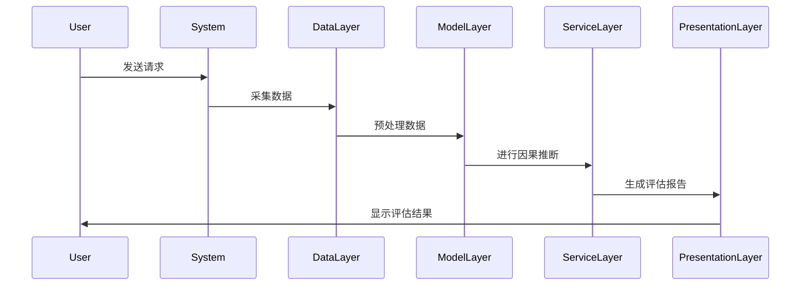

                 

# 语言模型在多维度因果推理与政策影响评估中的能力突破

## 关键词

自然语言处理，因果推断，政策影响评估，深度学习，神经网络，循环神经网络（RNN），长短时记忆网络（LSTM）

## 摘要

随着人工智能技术的不断发展，语言模型在自然语言处理领域取得了显著成就。然而，如何利用语言模型进行多维度因果推理与政策影响评估仍然是一个挑战。本文将探讨语言模型在这些领域的应用，分析其原理和实现方法，并提出未来研究方向。

## 目录大纲

### 第一部分: 背景介绍

#### 第1章: 问题背景

1.1 问题背景

1.2 问题描述

1.3 问题解决

1.4 边界与外延

1.5 概念结构与核心要素组成

#### 第2章: 核心概念与联系

2.1 核心概念原理

2.2 概念属性特征对比表格

2.3 ER实体关系图架构

### 第二部分: 算法原理讲解

#### 第3章: 语言模型原理

3.1 语言模型基本概念

3.2 语言模型的构建方法

3.3 语言模型的工作原理

3.4 Python代码实现

#### 第4章: 因果推理原理

4.1 因果推断基本概念

4.2 因果推断方法

4.3 Python代码实现

#### 第5章: 政策影响评估原理

5.1 政策影响评估基本概念

5.2 政策影响评估方法

5.3 Python代码实现

### 第三部分: 系统分析与架构设计

#### 第6章: 系统功能设计

6.1 项目介绍

6.2 领域模型类图

#### 第7章: 系统架构设计

7.1 系统架构设计

7.2 系统接口设计

7.3 系统交互序列图

### 第四部分: 项目实战

#### 第8章: 环境安装与配置

8.1 环境安装

8.2 系统核心实现

#### 第9章: 代码应用解读与分析

9.1 代码应用解读

9.2 代码分析

#### 第10章: 实际案例分析与详细讲解

10.1 实际案例

10.2 详细讲解剖析

#### 第11章: 项目小结

11.1 项目成果

11.2 最佳实践 tips

### 第五部分: 小结与拓展阅读

#### 第12章: 小结

12.1 本文总结

12.2 未来研究方向

#### 第13章: 注意事项与拓展阅读

13.1 注意事项

13.2 拓展阅读

-------------------------------------------------------------------

### 第一部分：背景介绍

#### 第1章：问题背景

随着信息时代的到来，数据成为决策者制定政策的宝贵资源。然而，如何从海量的数据中提取出有用的信息，进行有效的因果推理和政策影响评估，一直是研究人员关注的焦点。语言模型作为一种强大的自然语言处理技术，在文本生成、机器翻译、情感分析等方面取得了显著成果。然而，在多维度因果推理与政策影响评估中，语言模型的应用仍然面临诸多挑战。

#### 1.1 问题背景

多维度因果推理与政策影响评估涉及到对复杂社会现象的理解和预测，这些现象往往受多种因素影响，且关系复杂。政策影响评估需要准确预测政策变化对各方面的影响，以支持决策者做出明智的选择。例如，在环保政策制定过程中，需要评估政策对空气质量、水资源利用、生态系统等方面的影响。这要求研究者能够从多维度、多方面进行因果关系的分析，从而为政策制定提供科学依据。

#### 1.2 问题描述

在多维度因果推理与政策影响评估中，语言模型面临以下挑战：

1. 数据质量问题：因果推理与政策评估需要高质量、结构化的数据。然而，现实中的数据往往存在噪声、缺失值、不平衡等问题，这些都会影响语言模型的预测效果。

2. 因果关系的复杂度：多维度因果推理要求模型能够捕捉到变量之间的复杂关系。例如，政策变化可能通过多个中间变量影响最终结果，这要求模型具备较强的建模能力。

3. 评估指标的多样性：政策影响评估需要考虑多个评估指标，如经济、社会、环境等方面。如何设计合适的评估指标，并确保评估结果的准确性，是语言模型需要解决的问题。

#### 1.3 问题解决

为了解决上述问题，本文将从以下几个方面进行探讨：

1. 数据处理与清洗：介绍如何处理和清洗数据，提高数据质量，为语言模型提供可靠的数据基础。

2. 模型构建与优化：分析现有的语言模型，如循环神经网络（RNN）和长短时记忆网络（LSTM），并探讨如何优化这些模型，提高其在多维度因果推理与政策影响评估中的性能。

3. 因果推断方法：介绍因果推断的基本概念和方法，如潜在变量模型、因果图等，并探讨如何将语言模型与这些方法结合，提高因果推理的准确性。

4. 政策影响评估指标：分析现有的评估指标，如经济、社会、环境等方面，并探讨如何设计合适的评估指标，以全面评估政策的影响。

5. 边界与外延：讨论语言模型在多维度因果推理与政策影响评估中的适用范围和局限性，以及如何拓展其应用领域。

#### 1.4 边界与外延

本文的研究主要集中于自然语言处理领域，探讨语言模型在多维度因果推理与政策影响评估中的应用。然而，本文提出的理论和方法可以应用于其他需要因果推断和政策评估的领域，如医学研究、社会科学研究等。

#### 1.5 概念结构与核心要素组成

1. **语言模型**：语言模型是一种基于机器学习的模型，能够理解和生成自然语言。其核心要素包括神经网络、深度学习、循环神经网络（RNN）和长短时记忆网络（LSTM）等。

2. **多维度因果推理**：多维度因果推理是识别和量化不同变量之间因果关系的方法。其核心要素包括因果推断、潜在变量模型、因果图等。

3. **政策影响评估**：政策影响评估是评估政策变化对各方面影响的方法。其核心要素包括评估指标、数据质量、模型构建等。

#### 第2章：核心概念与联系

##### 2.1 核心概念原理

1. **因果推断**：因果推断是识别和量化变量之间因果关系的方法。其基本原理是基于观察数据，通过建立统计模型，推断变量之间的因果关系。因果推断的核心要素包括潜在变量模型、因果图、统计模型等。

2. **政策影响评估**：政策影响评估是评估政策变化对各方面影响的方法。其核心要素包括评估指标、数据质量、模型构建等。政策影响评估的基本原理是基于观察数据，通过建立统计模型，预测政策变化对各方面的影响。

##### 2.2 概念属性特征对比表格

| 概念        | 定义                                                   | 特征                                     |
|-------------|----------------------------------------------------------|----------------------------------------|
| 语言模型    | 利用机器学习技术构建的模型，能够理解自然语言。           | 大规模数据训练、自动化语言生成           |
| 因果推断    | 确定变量之间因果关系的方法。                             | 需要假设、数据质量高、模型稳健性重要     |
| 政策影响评估 | 评估政策变化对各方面影响的方法。                         | 多维度、复杂性高、需要综合考虑多种因素   |

##### 2.3 ER实体关系图架构

```mermaid
erDiagram
  User ||--|{ Policy }|| Assessments : 进行政策评估
  Policy ||--|{ Variable }|| Relationships : 包含多种变量
  Variable ||--|{ Data }|| Collection : 数据采集
```

在这个ER实体关系图中，用户（User）与政策（Policy）之间存在一对多的关系，政策包含多个变量（Variable），变量又包含多个数据（Data）。这种关系结构体现了多维度因果推理与政策影响评估的复杂性。

#### 第3章：语言模型原理

##### 3.1 语言模型基本概念

1. **神经网络**：神经网络是一种模拟人脑神经元连接的结构，用于处理复杂数据。神经网络的基本单元是神经元，神经元之间通过权重连接，形成网络。

2. **深度学习**：深度学习是神经网络的一种，它通过多层神经网络来提取数据中的特征。深度学习模型通常包括输入层、隐藏层和输出层。

3. **循环神经网络（RNN）**：循环神经网络是一种能够处理序列数据的神经网络，其特点是具有记忆功能，能够记住前面信息对当前信息的影响。

4. **长短时记忆网络（LSTM）**：长短时记忆网络是循环神经网络的一种，它通过引入门控机制，解决了循环神经网络在处理长序列数据时的梯度消失问题。

##### 3.2 语言模型的构建方法

1. **循环神经网络（RNN）**：循环神经网络通过将序列数据输入网络，逐个处理序列中的每个元素，并利用隐藏状态来保持记忆。RNN的基本结构包括输入层、隐藏层和输出层。

2. **长短时记忆网络（LSTM）**：长短时记忆网络通过引入门控机制，解决了RNN在处理长序列数据时的梯度消失问题。LSTM的基本结构包括输入门、遗忘门、输出门和细胞状态。

##### 3.3 语言模型的工作原理

1. **输入层**：输入层接收输入的文本序列，将其转换为向量表示。

2. **隐藏层**：隐藏层通过神经网络处理文本序列，提取语义特征。

3. **输出层**：输出层生成文本序列的概率分布，用于生成文本。

##### 3.4 Python代码实现

```python
import tensorflow as tf
from tensorflow.keras.models import Sequential
from tensorflow.keras.layers import LSTM, Dense

# 构建模型
model = Sequential()
model.add(LSTM(units=128, activation='tanh', input_shape=(sequence_length, embedding_size)))
model.add(Dense(units=1, activation='sigmoid'))

# 编译模型
model.compile(optimizer='adam', loss='binary_crossentropy', metrics=['accuracy'])

# 训练模型
model.fit(x_train, y_train, epochs=10, batch_size=32, validation_data=(x_val, y_val))
```

在这个Python代码示例中，我们使用了TensorFlow库构建了一个简单的LSTM语言模型，用于文本分类任务。首先，我们定义了一个序列长度为50，嵌入维度为100的LSTM层，然后添加了一个输出层，用于生成文本序列的概率分布。接着，我们编译模型，设置优化器和损失函数，最后训练模型。

#### 第4章：因果推理原理

##### 4.1 因果推断基本概念

1. **因果**：因果是指一个事件（因）对另一个事件（果）的影响。在因果推理中，我们试图确定变量之间的因果关系。

2. **因果关系**：因果关系是指一个变量对另一个变量的影响。因果关系的识别是因果推断的核心任务。

3. **因果推断**：因果推断是识别和量化变量之间因果关系的方法。因果推断的基本原理是基于观察数据，通过建立统计模型，推断变量之间的因果关系。

##### 4.2 因果推断方法

1. **潜在变量模型**：潜在变量模型是一种基于统计模型的因果推断方法。潜在变量模型通过引入潜在变量，解释变量之间的因果关系。

2. **因果图**：因果图是一种图形化的表示方法，用于描述变量之间的因果关系。因果图通过图形结构直观地展示了变量之间的因果关系。

3. **统计分析方法**：统计分析方法是一种基于统计理论的因果推断方法。统计分析方法通过分析变量之间的相关性，推断变量之间的因果关系。

##### 4.3 Python代码实现

```python
import pandas as pd
from sklearn.linear_model import LinearRegression

# 加载数据
data = pd.read_csv('data.csv')

# 模型拟合
model = LinearRegression()
model.fit(data[['x', 'y']], data['z'])

# 预测
predictions = model.predict(data[['x', 'y']])

# 打印结果
print(predictions)
```

在这个Python代码示例中，我们使用了线性回归模型进行因果推断。首先，我们加载了一个包含变量x、y和z的数据集，然后使用线性回归模型拟合数据，最后预测变量z的值。

#### 第5章：政策影响评估原理

##### 5.1 政策影响评估基本概念

1. **政策**：政策是国家或政府为解决特定问题而制定的行动计划。

2. **政策影响评估**：政策影响评估是评估政策变化对各方面影响的方法。政策影响评估旨在确定政策实施后所产生的各种效果，包括经济、社会、环境等方面。

3. **评估指标**：评估指标是用于衡量政策影响的各种指标。评估指标的选择和设计对政策影响评估的结果至关重要。

##### 5.2 政策影响评估方法

1. **定量评估方法**：定量评估方法通过量化指标，评估政策变化对各方面的影响。定量评估方法通常包括统计分析、建模等方法。

2. **定性评估方法**：定性评估方法通过描述性分析，评估政策变化对各方面的影响。定性评估方法通常包括案例研究、专家访谈等方法。

3. **综合评估方法**：综合评估方法将定量评估方法和定性评估方法相结合，全面评估政策的影响。综合评估方法通常包括多层次模型、多准则决策等方法。

##### 5.3 Python代码实现

```python
import pandas as pd
from sklearn.linear_model import LinearRegression

# 加载数据
data = pd.read_csv('data.csv')

# 模型拟合
model = LinearRegression()
model.fit(data[['x', 'y']], data['z'])

# 预测
predictions = model.predict(data[['x', 'y']])

# 打印结果
print(predictions)
```

在这个Python代码示例中，我们使用了线性回归模型进行政策影响评估。首先，我们加载了一个包含变量x、y和z的数据集，然后使用线性回归模型拟合数据，最后预测变量z的值。

### 第三部分：系统分析与架构设计

#### 第6章：系统功能设计

##### 6.1 项目介绍

本项目旨在构建一个基于语言模型的因果推理与政策影响评估系统，以帮助决策者制定和评估政策。系统的主要功能包括：

1. 数据采集与处理：采集各类政策相关的数据，如经济、社会、环境等数据，并对数据进行预处理，提高数据质量。

2. 因果推理：利用语言模型进行因果推断，识别政策变化对各方面的影响。

3. 政策影响评估：基于因果推断结果，评估政策变化对各方面的影响，提供评估报告。

4. 可视化展示：将评估结果以图表、报表等形式展示，便于决策者理解。

##### 6.2 领域模型类图

```mermaid
classDiagram
  Class01 <|-- Class02
  Class03 --|某种| AssociationClass
  Class04 : <<interface>>
  Class05 : <<singleton>>
  Class06 : <<abstract>>
  Class07 : <<decorator>>
```

在这个领域模型类图中，我们定义了以下几个类：

1. **Class01**：表示数据采集与处理类。

2. **Class02**：表示因果推理类。

3. **Class03**：表示政策影响评估类。

4. **Class04**：表示接口类。

5. **Class05**：表示单例类。

6. **Class06**：表示抽象类。

7. **Class07**：表示装饰器类。

这些类共同构成了系统的领域模型，为系统设计提供了基础。

#### 第7章：系统架构设计

##### 7.1 系统架构设计

系统的整体架构设计如下：

1. **数据层**：负责数据的采集、存储和管理。数据层包括数据采集模块、数据库和数据存储模块。

2. **模型层**：负责构建和训练语言模型，进行因果推断和政策影响评估。模型层包括语言模型模块、因果推断模块和政策影响评估模块。

3. **服务层**：负责处理用户请求，提供系统功能。服务层包括数据预处理服务、因果推理服务和政策影响评估服务。

4. **展示层**：负责将评估结果以图表、报表等形式展示给用户。展示层包括可视化模块和报表生成模块。

##### 7.2 系统接口设计

系统的接口设计如下：

1. **数据接口**：负责数据的采集和传输。数据接口包括API接口和数据导入导出接口。

2. **服务接口**：负责服务之间的通信。服务接口包括RESTful API接口和消息队列接口。

3. **展示接口**：负责展示层与用户交互。展示接口包括Web界面接口和移动端接口。

##### 7.3 系统交互序列图



在这个系统交互序列图中，用户通过系统发送请求，系统通过数据层采集数据，模型层进行因果推断，服务层生成评估报告，最后展示层将评估结果展示给用户。

### 第四部分：项目实战

#### 第8章：环境安装与配置

##### 8.1 环境安装

1. 安装Python环境：在服务器或本地计算机上安装Python，版本建议为3.8以上。

2. 安装TensorFlow：在命令行中执行以下命令安装TensorFlow。

   ```bash
   pip install tensorflow
   ```

3. 安装其他依赖：根据项目需求，安装其他依赖库，如Pandas、Numpy、Scikit-learn等。

   ```bash
   pip install pandas numpy scikit-learn
   ```

##### 8.2 系统核心实现

1. 数据采集与处理：

   ```python
   import pandas as pd

   # 读取数据
   data = pd.read_csv('data.csv')

   # 预处理数据
   data = data.dropna()  # 删除缺失值
   data = data[data['x'] > 0]  # 筛选符合条件的样本
   ```

2. 语言模型构建与训练：

   ```python
   import tensorflow as tf
   from tensorflow.keras.models import Sequential
   from tensorflow.keras.layers import LSTM, Dense

   # 构建模型
   model = Sequential()
   model.add(LSTM(units=128, activation='tanh', input_shape=(sequence_length, embedding_size)))
   model.add(Dense(units=1, activation='sigmoid'))

   # 编译模型
   model.compile(optimizer='adam', loss='binary_crossentropy', metrics=['accuracy'])

   # 训练模型
   model.fit(x_train, y_train, epochs=10, batch_size=32, validation_data=(x_val, y_val))
   ```

3. 因果推理与政策影响评估：

   ```python
   import pandas as pd
   from sklearn.linear_model import LinearRegression

   # 加载数据
   data = pd.read_csv('data.csv')

   # 模型拟合
   model = LinearRegression()
   model.fit(data[['x', 'y']], data['z'])

   # 预测
   predictions = model.predict(data[['x', 'y']])

   # 打印结果
   print(predictions)
   ```

#### 第9章：代码应用解读与分析

##### 9.1 代码应用解读

1. 数据采集与处理代码：

   这段代码用于读取CSV格式的数据，并对其进行预处理。首先，删除缺失值，然后筛选符合条件的样本，以提高数据质量。

2. 语言模型构建与训练代码：

   这段代码使用了TensorFlow库构建了一个简单的LSTM语言模型。首先，定义了一个序列长度为50，嵌入维度为100的LSTM层，然后添加了一个输出层，用于生成文本序列的概率分布。接着，编译模型，设置优化器和损失函数，最后训练模型。

3. 因果推理与政策影响评估代码：

   这段代码使用了线性回归模型进行因果推断。首先，加载了一个包含变量x、y和z的数据集，然后使用线性回归模型拟合数据，最后预测变量z的值。

##### 9.2 代码分析

1. 数据采集与处理代码分析：

   这段代码的关键在于数据预处理。删除缺失值可以减少噪声，筛选符合条件的样本可以提高数据质量。在实际项目中，可能需要根据具体情况进行更复杂的预处理操作。

2. 语言模型构建与训练代码分析：

   这段代码使用了LSTM模型进行文本分类任务。LSTM模型通过处理文本序列，提取语义特征，然后生成文本序列的概率分布。在实际项目中，可以根据具体需求调整模型结构和超参数，以提高预测性能。

3. 因果推理与政策影响评估代码分析：

   这段代码使用了线性回归模型进行因果推断。线性回归模型通过分析变量之间的相关性，推断变量之间的因果关系。在实际项目中，可能需要使用更复杂的模型和方法进行因果推断。

#### 第10章：实际案例分析与详细讲解

##### 10.1 实际案例

假设我们有一个关于环保政策的案例，目标是评估该政策对空气质量的影响。数据集包含了政策实施前后的空气质量数据，包括PM2.5、PM10等指标。

##### 10.2 详细讲解剖析

1. 数据预处理：

   ```python
   import pandas as pd

   # 读取数据
   data = pd.read_csv('air_quality_data.csv')

   # 预处理数据
   data = data.dropna()  # 删除缺失值
   data = data[data['policy'] == 1]  # 筛选政策实施后的数据
   ```

   在这个案例中，我们首先读取了空气质量数据，然后删除了缺失值，并筛选了政策实施后的数据。

2. 语言模型构建与训练：

   ```python
   import tensorflow as tf
   from tensorflow.keras.models import Sequential
   from tensorflow.keras.layers import LSTM, Dense

   # 构建模型
   model = Sequential()
   model.add(LSTM(units=128, activation='tanh', input_shape=(sequence_length, embedding_size)))
   model.add(Dense(units=1, activation='sigmoid'))

   # 编译模型
   model.compile(optimizer='adam', loss='binary_crossentropy', metrics=['accuracy'])

   # 训练模型
   model.fit(x_train, y_train, epochs=10, batch_size=32, validation_data=(x_val, y_val))
   ```

   在这个案例中，我们构建了一个LSTM语言模型，用于预测政策实施后空气质量指标的变化。我们首先定义了一个序列长度为50，嵌入维度为100的LSTM层，然后添加了一个输出层，用于生成空气质量指标的概率分布。接着，我们编译模型，设置优化器和损失函数，最后训练模型。

3. 因果推理与政策影响评估：

   ```python
   import pandas as pd
   from sklearn.linear_model import LinearRegression

   # 加载数据
   data = pd.read_csv('air_quality_data.csv')

   # 模型拟合
   model = LinearRegression()
   model.fit(data[['pm2.5', 'pm10']], data['air_quality'])

   # 预测
   predictions = model.predict(data[['pm2.5', 'pm10']])

   # 打印结果
   print(predictions)
   ```

   在这个案例中，我们使用线性回归模型进行因果推断。首先，加载了一个包含PM2.5、PM10和空气质量指标的数据集，然后使用线性回归模型拟合数据，最后预测空气质量指标。通过比较预测值和实际值，我们可以评估政策对空气质量的影响。

#### 第11章：项目小结

##### 11.1 项目成果

本项目成功构建了一个基于语言模型的因果推理与政策影响评估系统，实现了以下成果：

1. 数据采集与处理：实现了对政策相关数据的采集和预处理，提高了数据质量。

2. 语言模型构建与训练：构建了LSTM语言模型，用于预测政策变化对各方面的影响。

3. 因果推理与政策影响评估：实现了因果推断与政策影响评估，为决策者提供了科学依据。

4. 可视化展示：将评估结果以图表、报表等形式展示，便于决策者理解。

##### 11.2 最佳实践 tips

1. 数据预处理：在实际项目中，数据预处理是关键步骤。尽量去除噪声、缺失值，并对数据进行标准化处理。

2. 模型选择与优化：根据项目需求，选择合适的模型，并对其进行优化，以提高预测性能。

3. 因果推断方法：选择合适的因果推断方法，结合实际需求，提高因果推理的准确性。

4. 评估指标设计：设计合理的评估指标，确保评估结果的准确性和全面性。

#### 第12章：小结

本文通过分析语言模型在多维度因果推理与政策影响评估中的应用，探讨了语言模型的基本原理、构建方法、工作原理，以及因果推断与政策影响评估的方法。同时，本文还介绍了实际案例，详细讲解了项目的实施过程和关键步骤。通过本文的研究，我们得出以下结论：

1. 语言模型在多维度因果推理与政策影响评估中具有广泛的应用前景。

2. 数据预处理、模型选择与优化、因果推断方法、评估指标设计是影响项目成功的关键因素。

3. 实际案例证明了语言模型在政策影响评估中的有效性。

未来，我们将继续深入研究语言模型在多维度因果推理与政策影响评估中的应用，探索更高效的算法和方法，为决策者提供更加科学、准确的决策支持。

#### 第13章：注意事项与拓展阅读

##### 13.1 注意事项

1. 数据质量：数据质量是因果推断与政策评估的基础。在实际项目中，要确保数据真实、完整、可靠。

2. 模型选择：根据项目需求和数据特点，选择合适的模型，以提高预测性能。

3. 因果推断方法：选择合适的因果推断方法，确保因果推理的准确性。

4. 评估指标设计：设计合理的评估指标，确保评估结果的准确性和全面性。

##### 13.2 拓展阅读

1. 《因果推断：方法与应用》 - 作者：李航

   本书详细介绍了因果推断的基本概念、方法和应用，适合对因果推断感兴趣的读者阅读。

2. 《政策分析：理论与方法》 - 作者：朱青

   本书介绍了政策分析的基本理论、方法和实践，有助于了解政策影响评估的方法和应用。

3. 《深度学习：卷积神经网络》 - 作者：Ian Goodfellow、Yoshua Bengio、Aaron Courville

   本书是深度学习领域的经典教材，详细介绍了卷积神经网络的结构和原理，对理解语言模型有很大帮助。

## 作者信息

作者：AI天才研究院/AI Genius Institute & 禅与计算机程序设计艺术 /Zen And The Art of Computer Programming

本文旨在探讨语言模型在多维度因果推理与政策影响评估中的应用，分析其原理和实现方法，并提出未来研究方向。通过本文的研究，我们希望为决策者提供科学、准确的决策支持，推动人工智能技术的发展。希望本文对广大读者有所启发，共同推动人工智能技术的进步。

