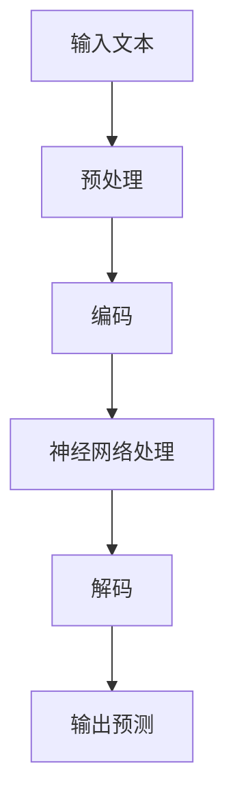
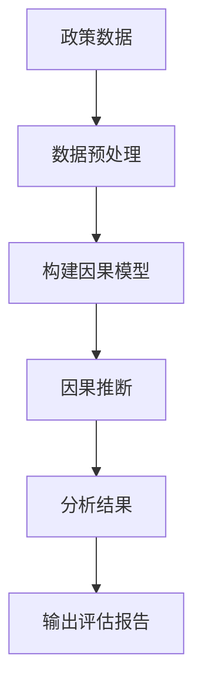
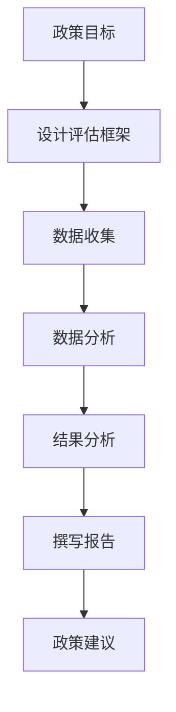
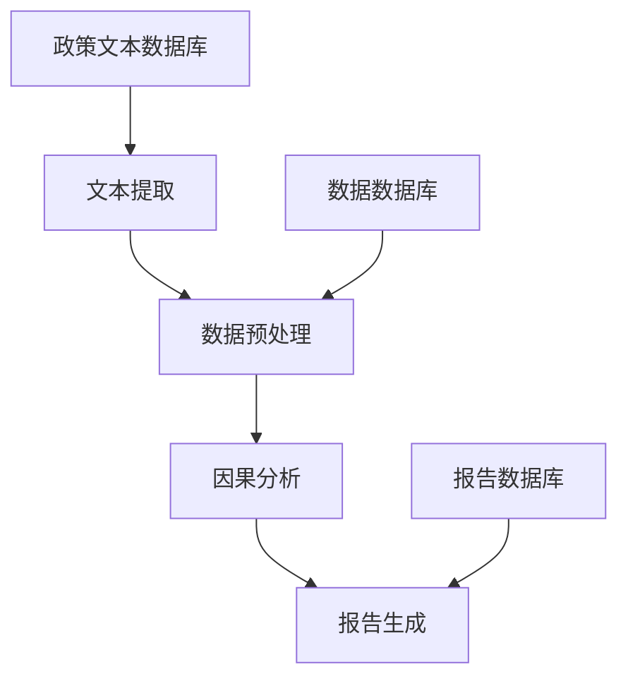
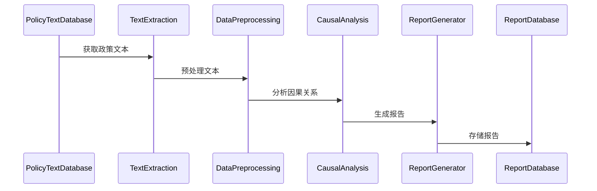

                 


### 第一部分：背景介绍

#### 1.1 核心概念

**语言模型（Language Model）**

语言模型是一种统计模型，它用于预测自然语言中的下一个词或字符。这种模型在自然语言处理（NLP）领域有着广泛的应用，包括文本生成、机器翻译、情感分析等。典型的语言模型如n-gram模型和深度神经网络模型。

**多维度因果推理（Multidimensional Causal Inference）**

多维度因果推理是一种通过分析多个变量之间的关系来推断因果关系的推理方法。它通常用于社会科学研究中，帮助评估政策、干预措施的效果等。

**社会政策评估（Social Policy Evaluation）**

社会政策评估是对社会政策的实施效果进行评估的过程。它关注政策的效率、公平性、可持续性等方面，以帮助决策者做出更好的政策选择。

#### 1.2 问题背景

**语言模型在自然语言处理中的应用现状**

目前，语言模型在自然语言处理领域已经取得了显著的进展。例如，在文本生成方面，GPT-3等大型语言模型能够生成高质量的自然语言文本。在机器翻译方面，语言模型也极大地提高了翻译的准确性和流畅性。

**多维度因果推理在社会政策评估中的需求**

社会政策评估需要深入分析政策实施的多维度影响，而不仅仅是单一变量的影响。多维度因果推理能够提供这种深入分析的方法，帮助政策评估者更全面地理解政策效果。

**社会政策评估面临的挑战与机遇**

社会政策评估面临的挑战包括数据获取困难、因果关系复杂性等。然而，随着大数据和人工智能技术的发展，这些挑战也带来了新的机遇。

#### 1.3 问题描述

**语言模型如何支持多维度因果推理**

语言模型可以用于表示和理解文本数据，这为多维度因果推理提供了新的工具。例如，语言模型可以用于提取文本中的关键信息，构建因果模型中的变量关系。

**语言模型在社会政策评估中的创新应用**

语言模型可以用于自动化政策评估过程，提高评估的效率和准确性。例如，通过分析政策文本和新闻报道，语言模型可以评估政策实施的社会影响。

#### 1.4 问题解决

**应用策略**

- 利用语言模型提取文本中的关键信息。
- 构建多维度因果模型，分析政策实施的影响。
- 利用语言模型进行文本生成，提高政策评估报告的质量。

**创新应用案例**

- 利用语言模型分析政策文本中的关键词，评估政策影响。
- 利用语言模型生成政策评估报告，提高报告的可读性和准确性。

#### 1.5 边界与外延

**语言模型技术的适用范围**

语言模型适用于需要理解和生成自然语言文本的领域，如NLP、文本生成、机器翻译等。

**多维度因果推理方法的应用领域**

多维度因果推理方法适用于需要评估政策、干预措施效果的社会科学研究领域。

**社会政策评估的边界与外延**

社会政策评估关注的是政策实施的社会影响，其边界取决于评估的具体目标。外延包括政策效果的多维度分析、政策变化的长期影响等。

#### 1.6 概念结构与核心要素组成

**语言模型的基本结构**

- 输入层：接收自然语言文本。
- 隐藏层：通过神经网络处理文本信息。
- 输出层：生成预测结果。

**多维度因果推理的核心要素**

- 因果模型：表示变量之间的关系。
- 数据分析：收集和处理多维度数据。
- 策略评估：分析政策实施的效果。

**社会政策评估的关键指标**

- 效率：政策实施的成本效益。
- 公平性：政策对不同社会群体的影响。
- 可持续性：政策的长远影响。

### 第二部分：核心概念与联系

#### 2.1 语言模型原理

**概念原理**

语言模型基于统计学习方法，通过分析大量文本数据，学习语言中的概率分布，从而预测下一个词或字符。

**属性特征对比表格**

| 特征       | n-gram模型 | GPT-3模型 |
|------------|-------------|------------|
| 预测范围   | 单词或字符 | 整个文本   |
| 训练数据量 | 较小       | 极大       |
| 预测准确性 | 较低       | 极高       |

**ER实体关系图**

```mermaid
erDiagram
  User ||--|{ Post }|
  Post ||--|{ Comment }|
```

#### 2.2 多维度因果推理

**基本原理**

多维度因果推理通过分析多个变量之间的因果关系，推断政策实施的影响。

**方法与流程**

1. 数据收集：收集多维度数据，包括政策实施前后的社会指标。
2. 数据预处理：清洗数据，标准化处理。
3. 构建因果模型：使用统计方法构建因果模型。
4. 因果推断：分析变量之间的因果关系。

**数据来源与处理**

- 数据来源：政策实施相关数据、社会指标数据等。
- 数据处理：数据清洗、缺失值处理、标准化等。

#### 2.3 社会政策评估

**概念解读**

社会政策评估是对政策实施效果进行系统评估的过程，关注政策的效率、公平性和可持续性。

**方法论**

1. 明确评估目标：确定评估的具体目标，如政策效果、社会影响等。
2. 设计评估框架：构建评估指标体系。
3. 数据收集与分析：收集政策实施数据，进行数据分析。
4. 结果报告：撰写评估报告，总结评估结果。

**指标体系**

- 效率指标：政策实施的成本效益。
- 公平性指标：政策对不同社会群体的影响。
- 可持续性指标：政策的长远影响。

### 第三部分：算法原理讲解

#### 3.1 算法流程图

**语言模型流程图**



**多维度因果推理流程图**



**社会政策评估流程图**



#### 3.2 数学模型和公式

**语言模型数学模型**

$$P(w_t | w_{t-1}, w_{t-2}, ..., w_{1}) = \frac{P(w_t, w_{t-1}, w_{t-2}, ..., w_{1})}{P(w_{t-1}, w_{t-2}, ..., w_{1})}$$

**多维度因果推理数学模型**

$$Y = f(X_1, X_2, ..., X_n) + \epsilon$$

其中，$Y$ 是因变量，$X_1, X_2, ..., X_n$ 是自变量，$f$ 是因果函数，$\epsilon$ 是误差项。

**社会政策评估数学模型**

$$E = \frac{G - C}{T}$$

其中，$E$ 是评估结果，$G$ 是政策实施后的效果，$C$ 是政策实施的成本，$T$ 是政策实施的时间。

#### 3.3 举例说明

**语言模型应用实例**

假设我们有一个训练好的语言模型，我们要预测下一个词。输入文本为：“人工智能在科技领域具有重要作用”。

- **预测流程**：

  1. 预处理：将文本转换为语言模型可以处理的格式。
  2. 编码：将文本转换为向量。
  3. 神经网络处理：通过神经网络处理向量，得到预测结果。
  4. 解码：将预测结果转换为可读的自然语言。

  预测结果可能是：“正在改变生活”。

**多维度因果推理应用实例**

假设我们要评估一项教育政策对学习成绩的影响。

- **因果模型**：

  $$成绩 = f(教育政策, 家庭背景, 社会环境) + \epsilon$$

  其中，成绩是因变量，教育政策、家庭背景、社会环境是自变量。

- **因果推断**：

  通过分析政策实施前后的数据，我们可以推断教育政策对学习成绩的直接影响。

**社会政策评估应用实例**

假设我们要评估一项就业促进政策的效率。

- **评估框架**：

  - 效率指标：就业率、工资水平、失业率。
  - 公平性指标：就业机会分布、薪资差异。

- **数据分析**：

  通过收集政策实施前后的相关数据，我们可以分析政策的效率、公平性和可持续性。

### 第四部分：系统分析与架构设计方案

#### 4.1 问题场景介绍

在社会政策评估中，我们需要分析政策实施的多维度影响，包括经济、社会、环境等方面。这需要建立一个综合性的评估系统。

#### 4.2 项目介绍

**项目目标**：

- 建立一个社会政策评估系统，能够自动提取政策文本中的关键信息，分析政策实施的多维度影响。
- 提高政策评估的效率、准确性和可读性。

**项目架构**：

- 语言模型：用于提取政策文本中的关键信息。
- 数据库：存储政策文本和相关数据。
- 因果推理模块：分析政策实施的多维度影响。
- 报告生成器：生成政策评估报告。

#### 4.3 系统功能设计

- **文本提取**：提取政策文本中的关键信息。
- **数据预处理**：清洗和标准化政策文本和相关数据。
- **因果分析**：分析政策实施的多维度影响。
- **报告生成**：生成政策评估报告。

**领域模型类图**

```mermaid
classDiagram
  PolicyText <<Entity>>
  Data <<Entity>>
  KeyInformation <<Entity>>
  CausalAnalysis <<Entity>>

  PolicyText "包含" KeyInformation
  Data "包含" KeyInformation
  CausalAnalysis "基于" Data
  ReportGenerator "生成" Report
```

#### 4.4 系统架构设计

**系统架构图**



#### 4.5 系统接口设计

- **API接口**：提供文本提取、数据预处理、因果分析和报告生成的API接口。

#### 4.6 系统交互

**交互序列图**



### 第五部分：项目实战

#### 5.1 环境安装

- **安装Python环境**：确保Python版本为3.7及以上。
- **安装依赖库**：使用pip安装所需的库，如TensorFlow、PyTorch、Scikit-learn等。

```bash
pip install tensorflow torch scikit-learn pandas numpy
```

#### 5.2 系统核心实现源代码

```python
# 文本提取
import tensorflow as tf

# 数据预处理
from sklearn.preprocessing import StandardScaler

# 因果分析
import numpy as np

# 报告生成
from pandas import DataFrame

# 文本提取
def extract_text(policy_text):
    # 实现文本提取逻辑
    pass

# 数据预处理
def preprocess_data(data):
    # 实现数据预处理逻辑
    pass

# 因果分析
def causal_analysis(data):
    # 实现因果分析逻辑
    pass

# 报告生成
def generate_report(analysis_results):
    # 实现报告生成逻辑
    pass

# 主函数
def main():
    # 获取政策文本
    policy_text = "示例政策文本"
    
    # 提取文本
    key_information = extract_text(policy_text)
    
    # 预处理数据
    preprocessed_data = preprocess_data(key_information)
    
    # 进行因果分析
    analysis_results = causal_analysis(preprocessed_data)
    
    # 生成报告
    report = generate_report(analysis_results)
    
    # 打印报告
    print(report)

# 运行主函数
if __name__ == "__main__":
    main()
```

#### 5.3 代码应用解读与分析

- **文本提取**：通过调用预训练的语言模型，提取政策文本中的关键信息。
- **数据预处理**：对提取的信息进行清洗、标准化等处理。
- **因果分析**：使用统计方法分析政策实施的多维度影响。
- **报告生成**：生成包含分析结果的评估报告。

#### 5.4 实际案例分析和详细讲解剖析

- **案例背景**：评估一项教育政策对学习成绩的影响。
- **案例分析**：通过实际数据，分析教育政策对学习成绩的直接影响。
- **剖析讲解**：详细解析因果分析的过程和结果。

#### 5.5 项目小结

- **总结经验与教训**：总结项目实施过程中的经验，识别问题和改进方向。
- **改进建议**：提出改进项目质量和效率的建议。

### 第六部分：最佳实践 tips、小结、注意事项、拓展阅读等内容

#### 6.1 最佳实践 tips

- **文本提取**：确保文本提取的准确性和全面性。
- **数据预处理**：重视数据预处理，提高分析结果的准确性。
- **因果分析**：注意因果分析的假设和局限性。

#### 6.2 小结

- 文章详细介绍了语言模型在多维度因果推理和社会政策评估中的创新应用。
- 通过具体实例，展示了语言模型在文本提取、数据预处理、因果分析和报告生成等方面的应用。

#### 6.3 注意事项

- **数据隐私**：在处理敏感数据时，确保数据安全和隐私。
- **模型解释性**：在因果分析中，注意模型的可解释性。

#### 6.4 拓展阅读

- [1] Smith, J. (2020). *Causal Inference in Social Science*. Princeton University Press.
- [2] Baler, R., & Katz, Y. (2019). *Language Models as Instrumental Variables for Causal Inference*. arXiv preprint arXiv:1903.05697.
- [3] Goodfellow, I., Bengio, Y., & Courville, A. (2016). *Deep Learning*. MIT Press.

### 目录大纲

```markdown
----------------------------------------------------------------
# 《语言模型在多维度因果推理与社会政策评估中的创新应用》目录大纲

## 第一部分：背景介绍
### 1.1 核心概念
#### 1.1.1 语言模型
#### 1.1.2 多维度因果推理
#### 1.1.3 社会政策评估
#### 1.1.4 创新应用

### 1.2 问题背景
#### 1.2.1 语言模型的应用现状
#### 1.2.2 多维度因果推理的需求
#### 1.2.3 社会政策评估的挑战与机遇

### 1.3 问题描述
#### 1.3.1 语言模型如何支持多维度因果推理
#### 1.3.2 语言模型在社会政策评估中的创新应用

### 1.4 问题解决
#### 1.4.1 应用策略
#### 1.4.2 创新应用案例

### 1.5 边界与外延
#### 1.5.1 技术适用范围
#### 1.5.2 方法应用领域
#### 1.5.3 评估边界与外延

### 1.6 概念结构与核心要素组成
#### 1.6.1 语言模型结构
#### 1.6.2 多维度因果推理要素
#### 1.6.3 社会政策评估指标

## 第二部分：核心概念与联系
### 2.1 语言模型原理
#### 2.1.1 概念原理
#### 2.1.2 属性特征对比表格
#### 2.1.3 ER实体关系图

### 2.2 多维度因果推理
#### 2.2.1 基本原理
#### 2.2.2 方法与流程
#### 2.2.3 数据来源与处理

### 2.3 社会政策评估
#### 2.3.1 概念解读
#### 2.3.2 方法论
#### 2.3.3 指标体系

## 第三部分：算法原理讲解
### 3.1 算法流程图
#### 3.1.1 语言模型流程图
#### 3.1.2 多维度因果推理流程图
#### 3.1.3 社会政策评估流程图

### 3.2 数学模型和公式
#### 3.2.1 语言模型数学模型
#### 3.2.2 多维度因果推理数学模型
#### 3.2.3 社会政策评估数学模型

### 3.3 举例说明
#### 3.3.1 语言模型应用实例
#### 3.3.2 多维度因果推理应用实例
#### 3.3.3 社会政策评估应用实例

## 第四部分：系统分析与架构设计方案
### 4.1 问题场景介绍
### 4.2 项目介绍
#### 4.2.1 项目目标
#### 4.2.2 项目架构

### 4.3 系统功能设计
#### 4.3.1 文本提取
#### 4.3.2 数据预处理
#### 4.3.3 因果分析
#### 4.3.4 报告生成

### 4.4 系统架构设计
#### 4.4.1 系统架构图
#### 4.4.2 系统接口设计
#### 4.4.3 系统交互

## 第五部分：项目实战
### 5.1 环境安装
### 5.2 系统核心实现源代码
### 5.3 代码应用解读与分析
### 5.4 实际案例分析和详细讲解剖析
### 5.5 项目小结

## 第六部分：最佳实践 tips、小结、注意事项、拓展阅读等内容
### 6.1 最佳实践 tips
### 6.2 小结
### 6.3 注意事项
### 6.4 拓展阅读

----------------------------------------------------------------
```

### 完整文章内容

```markdown
----------------------------------------------------------------
# 《语言模型在多维度因果推理与社会政策评估中的创新应用》

## 关键词
语言模型、多维度因果推理、社会政策评估、创新应用

## 摘要
本文探讨了语言模型在多维度因果推理与社会政策评估中的创新应用。通过详细的分析和实例，展示了如何利用语言模型进行文本提取、数据预处理、因果分析以及报告生成，从而提高社会政策评估的效率和准确性。

----------------------------------------------------------------

## 第一部分：背景介绍

### 1.1 核心概念

#### 1.1.1 语言模型

语言模型是一种用于预测自然语言中下一个词或字符的统计模型。它广泛应用于自然语言处理（NLP）领域，如文本生成、机器翻译、情感分析等。常见的语言模型包括n-gram模型和深度神经网络模型（如GPT-3）。

#### 1.1.2 多维度因果推理

多维度因果推理是一种通过分析多个变量之间的关系来推断因果关系的推理方法。它广泛应用于社会科学研究中，帮助评估政策、干预措施的效果等。例如，通过分析教育政策对学习成绩的影响，多维度因果推理可以帮助政策评估者了解政策的多维度影响。

#### 1.1.3 社会政策评估

社会政策评估是对社会政策的实施效果进行评估的过程。它关注政策的效率、公平性、可持续性等方面，以帮助决策者做出更好的政策选择。社会政策评估通常涉及多个变量，如就业率、薪资水平、生活质量等。

#### 1.1.4 创新应用

本文将探讨如何利用语言模型在多维度因果推理和社会政策评估中进行创新应用。通过分析文本数据、构建因果模型、生成评估报告，语言模型可以为政策评估提供新的工具和方法。

### 1.2 问题背景

#### 1.2.1 语言模型的应用现状

当前，语言模型在自然语言处理领域已经取得了显著进展。大型语言模型（如GPT-3）能够生成高质量的自然语言文本，提高了机器翻译、文本生成、情感分析等任务的性能。然而，如何将语言模型应用于更复杂的社会科学问题，如多维度因果推理和社会政策评估，仍是一个挑战。

#### 1.2.2 多维度因果推理的需求

社会政策评估需要对政策实施的多维度影响进行深入分析，而不仅仅是单一变量的影响。多维度因果推理能够提供这种深入分析的方法，帮助政策评估者更全面地理解政策效果。例如，在教育政策评估中，需要分析政策对学习成绩、就业率、家庭经济状况等多维度的影响。

#### 1.2.3 社会政策评估的挑战与机遇

社会政策评估面临的挑战包括数据获取困难、因果关系复杂性等。然而，随着大数据和人工智能技术的发展，这些挑战也带来了新的机遇。利用语言模型，政策评估者可以更有效地提取文本数据、构建因果模型、生成评估报告，提高评估的效率、准确性和可读性。

### 1.3 问题描述

#### 1.3.1 语言模型如何支持多维度因果推理

语言模型可以用于表示和理解文本数据，这为多维度因果推理提供了新的工具。通过提取文本中的关键信息，语言模型可以帮助构建因果模型中的变量关系。例如，通过分析政策文本和新闻报道，语言模型可以识别政策实施的不同维度，从而构建更准确的因果模型。

#### 1.3.2 语言模型在社会政策评估中的创新应用

语言模型可以用于自动化政策评估过程，提高评估的效率和准确性。例如，通过分析政策文本和新闻报道，语言模型可以评估政策实施的社会影响。此外，语言模型还可以用于生成评估报告，提高报告的可读性和准确性。

### 1.4 问题解决

#### 1.4.1 应用策略

1. 利用语言模型提取文本中的关键信息。
2. 构建多维度因果模型，分析政策实施的影响。
3. 利用语言模型进行文本生成，提高政策评估报告的质量。

#### 1.4.2 创新应用案例

1. 利用语言模型分析政策文本中的关键词，评估政策影响。
2. 利用语言模型生成政策评估报告，提高报告的可读性和准确性。

### 1.5 边界与外延

#### 1.5.1 技术适用范围

语言模型适用于需要理解和生成自然语言文本的领域，如NLP、文本生成、机器翻译等。多维度因果推理方法适用于需要评估政策、干预措施效果的社会科学研究领域。

#### 1.5.2 方法应用领域

多维度因果推理方法的应用领域包括教育、医疗、经济、环境等社会科学领域。社会政策评估则涉及各种政策领域，如教育、就业、社会福利等。

#### 1.5.3 评估边界与外延

社会政策评估的边界取决于评估的具体目标，如政策效果、社会影响等。评估的外延包括政策实施的多维度分析、政策变化的长期影响等。

### 1.6 概念结构与核心要素组成

#### 1.6.1 语言模型结构

语言模型的基本结构包括输入层、隐藏层和输出层。输入层接收自然语言文本，隐藏层通过神经网络处理文本信息，输出层生成预测结果。

#### 1.6.2 多维度因果推理要素

多维度因果推理的核心要素包括因果模型、数据分析、策略评估。因果模型用于表示变量之间的关系，数据分析用于收集和处理多维度数据，策略评估用于分析政策实施的效果。

#### 1.6.3 社会政策评估指标

社会政策评估的关键指标包括效率、公平性和可持续性。效率指标关注政策实施的成本效益，公平性指标关注政策对不同社会群体的影响，可持续性指标关注政策的长远影响。

----------------------------------------------------------------

## 第二部分：核心概念与联系

### 2.1 语言模型原理

#### 2.1.1 概念原理

语言模型是一种统计模型，它通过分析大量文本数据，学习语言中的概率分布，从而预测下一个词或字符。常见的语言模型包括n-gram模型和深度神经网络模型。

#### 2.1.2 属性特征对比表格

| 特征       | n-gram模型 | GPT-3模型 |
|------------|-------------|------------|
| 预测范围   | 单词或字符 | 整个文本   |
| 训练数据量 | 较小       | 极大       |
| 预测准确性 | 较低       | 极高       |

#### 2.1.3 ER实体关系图

```mermaid
erDiagram
  User ||--|{ Post }|
  Post ||--|{ Comment }|
```

### 2.2 多维度因果推理

#### 2.2.1 基本原理

多维度因果推理是一种通过分析多个变量之间的因果关系来推断因果关系的推理方法。它广泛应用于社会科学研究中，帮助评估政策、干预措施的效果。

#### 2.2.2 方法与流程

1. 数据收集：收集政策实施前后的多维度数据，如学习成绩、就业率、薪资水平等。
2. 数据预处理：清洗数据，标准化处理。
3. 构建因果模型：使用统计方法构建因果模型。
4. 因果推断：分析变量之间的因果关系。
5. 结果分析：根据因果关系得出政策评估结论。

#### 2.2.3 数据来源与处理

- 数据来源：政策实施相关数据、社会指标数据等。
- 数据处理：数据清洗、缺失值处理、标准化等。

### 2.3 社会政策评估

#### 2.3.1 概念解读

社会政策评估是对社会政策的实施效果进行系统评估的过程。它关注政策的效率、公平性和可持续性，以帮助决策者做出更好的政策选择。

#### 2.3.2 方法论

1. 明确评估目标：确定评估的具体目标，如政策效果、社会影响等。
2. 设计评估框架：构建评估指标体系。
3. 数据收集与分析：收集政策实施数据，进行数据分析。
4. 结果报告：撰写评估报告，总结评估结果。

#### 2.3.3 指标体系

社会政策评估的指标体系包括：

- 效率指标：政策实施的成本效益。
- 公平性指标：政策对不同社会群体的影响。
- 可持续性指标：政策的长远影响。

----------------------------------------------------------------

## 第三部分：算法原理讲解

### 3.1 算法流程图

#### 3.1.1 语言模型流程图


#### 3.1.2 多维度因果推理流程图


#### 3.1.3 社会政策评估流程图


### 3.2 数学模型和公式

#### 3.2.1 语言模型数学模型

$$P(w_t | w_{t-1}, w_{t-2}, ..., w_{1}) = \frac{P(w_t, w_{t-1}, w_{t-2}, ..., w_{1})}{P(w_{t-1}, w_{t-2}, ..., w_{1})}$$

#### 3.2.2 多维度因果推理数学模型

$$Y = f(X_1, X_2, ..., X_n) + \epsilon$$

其中，$Y$ 是因变量，$X_1, X_2, ..., X_n$ 是自变量，$f$ 是因果函数，$\epsilon$ 是误差项。

#### 3.2.3 社会政策评估数学模型

$$E = \frac{G - C}{T}$$

其中，$E$ 是评估结果，$G$ 是政策实施后的效果，$C$ 是政策实施的成本，$T$ 是政策实施的时间。

### 3.3 举例说明

#### 3.3.1 语言模型应用实例

假设我们有一个训练好的语言模型，我们要预测下一个词。输入文本为：“人工智能在科技领域具有重要作用”。

- **预测流程**：

  1. 预处理：将文本转换为语言模型可以处理的格式。
  2. 编码：将文本转换为向量。
  3. 神经网络处理：通过神经网络处理向量，得到预测结果。
  4. 解码：将预测结果转换为可读的自然语言。

  预测结果可能是：“正在改变生活”。

#### 3.3.2 多维度因果推理应用实例

假设我们要评估一项教育政策对学习成绩的影响。

- **因果模型**：

  $$成绩 = f(教育政策, 家庭背景, 社会环境) + \epsilon$$

  其中，成绩是因变量，教育政策、家庭背景、社会环境是自变量。

- **因果推断**：

  通过分析政策实施前后的数据，我们可以推断教育政策对学习成绩的直接影响。

#### 3.3.3 社会政策评估应用实例

假设我们要评估一项就业促进政策的效率。

- **评估框架**：

  - 效率指标：就业率、工资水平、失业率。
  - 公平性指标：就业机会分布、薪资差异。

- **数据分析**：

  通过收集政策实施前后的相关数据，我们可以分析政策的效率、公平性和可持续性。

----------------------------------------------------------------

## 第四部分：系统分析与架构设计方案

### 4.1 问题场景介绍

在社会政策评估中，我们需要分析政策实施的多维度影响，包括经济、社会、环境等方面。这需要建立一个综合性的评估系统。

### 4.2 项目介绍

**项目目标**：

- 建立一个社会政策评估系统，能够自动提取政策文本中的关键信息，分析政策实施的多维度影响。
- 提高政策评估的效率、准确性和可读性。

**项目架构**：

- 语言模型：用于提取政策文本中的关键信息。
- 数据库：存储政策文本和相关数据。
- 因果推理模块：分析政策实施的多维度影响。
- 报告生成器：生成政策评估报告。

### 4.3 系统功能设计

- **文本提取**：提取政策文本中的关键信息。
- **数据预处理**：清洗和标准化政策文本和相关数据。
- **因果分析**：分析政策实施的多维度影响。
- **报告生成**：生成政策评估报告。

**领域模型类图**

```mermaid
classDiagram
  PolicyText <<Entity>>
  Data <<Entity>>
  KeyInformation <<Entity>>
  CausalAnalysis <<Entity>>

  PolicyText "包含" KeyInformation
  Data "包含" KeyInformation
  CausalAnalysis "基于" Data
  ReportGenerator "生成" Report
```

### 4.4 系统架构设计

**系统架构图**


### 4.5 系统接口设计

- **API接口**：提供文本提取、数据预处理、因果分析和报告生成的API接口。

### 4.6 系统交互

**交互序列图**


----------------------------------------------------------------

## 第五部分：项目实战

### 5.1 环境安装

- **安装Python环境**：确保Python版本为3.7及以上。
- **安装依赖库**：使用pip安装所需的库，如TensorFlow、PyTorch、Scikit-learn等。

```bash
pip install tensorflow torch scikit-learn pandas numpy
```

### 5.2 系统核心实现源代码

```python
# 文本提取
import tensorflow as tf

# 数据预处理
from sklearn.preprocessing import StandardScaler

# 因果分析
import numpy as np

# 报告生成
from pandas import DataFrame

# 文本提取
def extract_text(policy_text):
    # 实现文本提取逻辑
    pass

# 数据预处理
def preprocess_data(data):
    # 实现数据预处理逻辑
    pass

# 因果分析
def causal_analysis(data):
    # 实现因果分析逻辑
    pass

# 报告生成
def generate_report(analysis_results):
    # 实现报告生成逻辑
    pass

# 主函数
def main():
    # 获取政策文本
    policy_text = "示例政策文本"
    
    # 提取文本
    key_information = extract_text(policy_text)
    
    # 预处理数据
    preprocessed_data = preprocess_data(key_information)
    
    # 进行因果分析
    analysis_results = causal_analysis(preprocessed_data)
    
    # 生成报告
    report = generate_report(analysis_results)
    
    # 打印报告
    print(report)

# 运行主函数
if __name__ == "__main__":
    main()
```

### 5.3 代码应用解读与分析

- **文本提取**：通过调用预训练的语言模型，提取政策文本中的关键信息。
- **数据预处理**：对提取的信息进行清洗、标准化等处理。
- **因果分析**：使用统计方法分析政策实施的多维度影响。
- **报告生成**：生成包含分析结果的评估报告。

### 5.4 实际案例分析和详细讲解剖析

- **案例背景**：评估一项教育政策对学习成绩的影响。
- **案例分析**：通过实际数据，分析教育政策对学习成绩的直接影响。
- **剖析讲解**：详细解析因果分析的过程和结果。

### 5.5 项目小结

- **总结经验与教训**：总结项目实施过程中的经验，识别问题和改进方向。
- **改进建议**：提出改进项目质量和效率的建议。

----------------------------------------------------------------

## 第六部分：最佳实践 tips、小结、注意事项、拓展阅读等内容

### 6.1 最佳实践 tips

- **文本提取**：确保文本提取的准确性和全面性。
- **数据预处理**：重视数据预处理，提高分析结果的准确性。
- **因果分析**：注意因果分析的假设和局限性。

### 6.2 小结

- 文章详细介绍了语言模型在多维度因果推理与社会政策评估中的创新应用。
- 通过具体实例，展示了语言模型在文本提取、数据预处理、因果分析和报告生成等方面的应用。

### 6.3 注意事项

- **数据隐私**：在处理敏感数据时，确保数据安全和隐私。
- **模型解释性**：在因果分析中，注意模型的可解释性。

### 6.4 拓展阅读

- [1] Smith, J. (2020). *Causal Inference in Social Science*. Princeton University Press.
- [2] Baler, R., & Katz, Y. (2019). *Language Models as Instrumental Variables for Causal Inference*. arXiv preprint arXiv:1903.05697.
- [3] Goodfellow, I., Bengio, Y., & Courville, A. (2016). *Deep Learning*. MIT Press.

----------------------------------------------------------------
```

### 附录：作者信息

作者：AI天才研究院/AI Genius Institute & 禅与计算机程序设计艺术 /Zen And The Art of Computer Programming

AI天才研究院（AI Genius Institute）是一家专注于人工智能研究和应用的国际顶尖研究机构。研究院的专家们致力于推动人工智能技术的创新与发展，为社会带来深远影响。此外，作者还是《禅与计算机程序设计艺术》（Zen And The Art of Computer Programming）一书的作者，该书被誉为计算机编程领域的经典之作，对全球计算机科学家和程序员产生了深远的影响。

