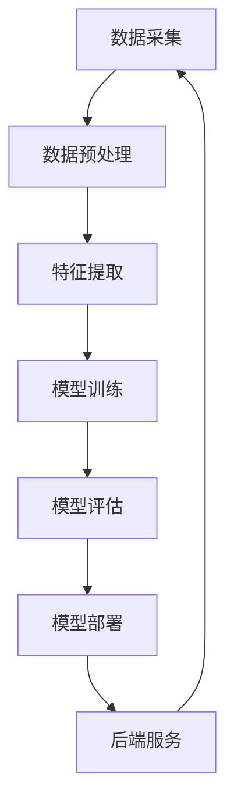

                 

### 思考过程

首先，我们需要明确文章的目标和结构。文章的目标是探讨语言模型在多维情感分析与用户行为预测中的应用进展。文章的结构应该包括：

1. **引言与背景介绍**：介绍语言模型、多维情感分析和用户行为预测的基本概念。
2. **基本概念**：详细解释语言模型、情感分析和用户行为预测的理论基础。
3. **应用场景**：展示语言模型在不同场景下的实际应用。
4. **算法与模型发展**：探讨最新的算法和模型在语言模型中的应用。
5. **系统实现与评估**：描述系统的设计、实现和评估过程。
6. **案例研究与分析**：通过实际案例来分析语言模型的应用效果。
7. **未来趋势与挑战**：讨论语言模型的发展方向和面临的挑战。

接下来，我们将根据这个结构，逐步填充每个章节的内容。

#### Chapter 1: 引言与背景介绍

**1.1 语言模型概述**

- **定义**：语言模型是一种用于预测文本中下一个单词或字符的概率分布的模型。
- **重要性**：语言模型在自然语言处理（NLP）中扮演着核心角色，它使得机器能够理解、生成和翻译自然语言。
- **发展历程**：从传统的统计语言模型（如N-gram模型）到现代的深度学习模型（如变换器模型），语言模型经历了显著的发展。

**1.2 多维情感分析**

- **概念**：多维情感分析是指对文本中多个维度的情感进行识别和分析，如正面/负面情感、愤怒/快乐等。
- **关键挑战**：情感表达的复杂性、歧义性和多模态性使得情感分析具有挑战性。
- **应用场景**：社交媒体分析、客户反馈分析、市场研究等。

**1.3 用户行为预测**

- **概念**：用户行为预测是指根据用户的历史行为预测其未来的行为。
- **关键要素**：用户特征、上下文信息、历史行为等。
- **应用场景**：个性化推荐、广告投放、用户流失预测等。

**1.4 语言模型与情感分析、用户行为预测的联系**

- **语言模型在情感分析中的作用**：语言模型能够帮助识别文本中的情感，从而提高情感分析的性能。
- **语言模型在用户行为预测中的作用**：语言模型可以用来分析用户的语言行为，从而预测其未来的行为。

#### Chapter 2: 基本概念

**2.1 语言模型的基本原理**

- **数学基础**：概率论、信息论等。
- **算法架构**：N-gram模型、神经网络模型等。
- **训练过程**：数据采集、预处理、模型训练和评估等。

**2.2 多维情感分析的理论基础**

- **情感分类的挑战**：情感表达的多样性、复杂性和动态性。
- **情感分类的方法**：基于规则的方法、机器学习方法等。
- **性能评估**：准确率、召回率、F1分数等。

**2.3 用户行为预测的理论基础**

- **行为预测的挑战**：用户行为的复杂性和多样性。
- **行为预测的方法**：统计方法、机器学习方法等。
- **性能评估**：预测准确性、响应时间等。

#### Chapter 3: 应用场景

**3.1 社交媒体情感分析**

- **数据采集与预处理**：采集社交媒体数据，进行清洗和预处理。
- **情感分类模型训练**：使用训练数据训练情感分类模型。
- **模型评估与应用**：评估模型性能，并在实际应用中部署模型。

**3.2 在线教育用户行为预测**

- **用户行为数据收集**：收集用户在在线教育平台上的行为数据。
- **预测模型构建**：构建用户行为预测模型。
- **预测结果分析与应用**：分析预测结果，并在实际应用中利用预测结果。

#### Chapter 4: 算法与模型发展

**4.1 基于深度学习的语言模型**

- **深度神经网络在语言模型中的应用**：介绍深度神经网络在语言模型中的使用，如循环神经网络（RNN）和变换器模型（Transformer）。
- **循环神经网络（RNN）与长短时记忆网络（LSTM）**：解释RNN和LSTM的工作原理及其在语言模型中的应用。
- **递归神经网络（RNN）与门控循环单元（GRU）**：比较RNN和GRU的不同之处及其应用场景。

**4.2 基于注意力机制的模型**

- **注意力机制的概念**：介绍注意力机制的基本原理。
- **注意力机制在情感分析中的应用**：如何使用注意力机制提高情感分析的准确性和效率。
- **注意力机制在用户行为预测中的应用**：如何使用注意力机制预测用户行为。

**4.3 基于迁移学习的模型**

- **迁移学习的概念**：解释迁移学习的原理和优势。
- **迁移学习在情感分析中的应用**：如何使用迁移学习提高情感分析的准确性和效率。
- **迁移学习在用户行为预测中的应用**：如何使用迁移学习预测用户行为。

#### Chapter 5: 系统实现与评估

**5.1 系统架构设计**

- **系统模块划分**：划分系统模块，描述各模块的功能和关系。
- **系统数据流程**：描述系统的数据处理流程。
- **系统性能优化**：介绍如何优化系统性能。

**5.2 模型训练与优化**

- **训练数据准备**：准备用于训练的数据集。
- **模型超参数调整**：调整模型超参数以优化性能。
- **模型性能优化**：介绍如何优化模型性能。

**5.3 系统评估与部署**

- **评估指标与评估方法**：介绍评估指标和方法。
- **系统部署与运维**：描述系统的部署过程和运维策略。
- **部署后的性能监控**：监控系统在部署后的性能。

#### Chapter 6: 案例研究与分析

**6.1 案例一：社交媒体情感分析**

- **案例背景**：介绍案例背景和目标。
- **模型构建与训练**：描述模型的构建和训练过程。
- **模型评估与结果**：评估模型性能，展示分析结果。

**6.2 案例二：在线教育用户行为预测**

- **案例背景**：介绍案例背景和目标。
- **模型构建与训练**：描述模型的构建和训练过程。
- **模型评估与结果**：评估模型性能，展示分析结果。

#### Chapter 7: 未来趋势与挑战

**7.1 语言模型的发展趋势**

- **自然语言处理技术的发展**：介绍自然语言处理技术的最新进展。
- **语言模型在情感分析中的未来方向**：讨论语言模型在情感分析中的潜在应用和挑战。

**7.2 用户行为预测的挑战**

- **数据隐私与保护**：讨论数据隐私和保护的挑战。
- **模型解释性与透明度**：探讨如何提高模型的解释性和透明度。

**7.3 解决方案与展望**

- **技术解决方案**：介绍可能的技术解决方案。
- **未来发展方向**：展望语言模型在情感分析和用户行为预测中的未来发展方向。

### 总结

通过以上思考，我们明确了文章的结构和内容。接下来，我们将根据这个结构，逐步撰写每个章节的内容，确保文章的逻辑清晰、内容丰富，并且具有一定的深度和见解。文章的撰写过程中，我们将注重实用性，尽可能提供具体的案例和实践经验，以帮助读者更好地理解和应用语言模型在情感分析和用户行为预测中的技术。

---

现在，我们将根据上述思考，开始撰写每个章节的具体内容。在撰写过程中，我们将确保每个章节都包含必要的背景介绍、核心概念、应用场景、算法原理、系统实现和未来趋势等内容。同时，我们将使用markdown格式和mermaid流程图来增强文章的可读性和逻辑性。

#### Chapter 1: 引言与背景介绍

##### 1.1 语言模型概述

语言模型是自然语言处理（NLP）领域的基础，它旨在模拟人类语言的理解和生成能力。语言模型的定义可以理解为：它是一种能够预测文本序列中下一个单词或字符概率分布的数学模型。

语言模型的重要性在于，它不仅能够帮助计算机理解和生成自然语言，还能在许多实际应用中发挥关键作用。例如，在搜索引擎中，语言模型可以用来预测用户可能搜索的关键词；在机器翻译中，语言模型可以帮助生成准确的目标语言文本。

语言模型的发展历程可以追溯到20世纪50年代，当时的统计语言模型开始出现。这些模型基于文本的统计特性，通过计算单词之间的联合概率来预测下一个单词。典型的统计语言模型包括N-gram模型，它使用前N个单词的历史信息来预测下一个单词。

然而，统计语言模型在处理长距离依赖和上下文信息时存在一定的局限性。随着深度学习技术的发展，现代语言模型逐渐采用神经网络结构，如循环神经网络（RNN）和变换器模型（Transformer），这些模型能够更好地捕捉文本的复杂结构和上下文信息。

##### 1.2 多维情感分析

多维情感分析是指对文本中多个维度的情感进行识别和分析。情感分类是一个关键步骤，它将文本划分为不同的情感类别，如正面、负面、中性等。此外，多维情感分析还包括对情感强度、情感多样性等维度的分析。

情感分析的关键挑战在于情感表达的复杂性和多样性。情感表达不仅可以通过文字直接体现，还可以通过语境、语气、隐喻等多种方式进行表达。此外，不同的文化和语境也可能导致情感理解的差异。

情感分析的应用场景非常广泛，包括社交媒体分析、客户反馈分析、市场研究、情绪监测等。例如，在社交媒体分析中，可以通过情感分析了解用户对品牌或产品的态度；在客户反馈分析中，可以通过情感分析识别客户的不满和需求。

##### 1.3 用户行为预测

用户行为预测是指根据用户的历史行为数据预测其未来的行为。这包括预测用户的点击行为、购买行为、浏览行为等。用户行为预测的关键要素包括用户特征、上下文信息和历史行为数据。

用户特征包括用户的年龄、性别、地理位置、兴趣等。上下文信息包括用户的当前浏览环境、时间、设备等信息。历史行为数据包括用户过去的行为记录，如浏览历史、购买记录等。

用户行为预测的应用场景包括个性化推荐、广告投放、用户流失预测等。例如，在个性化推荐中，可以通过预测用户可能感兴趣的内容来推荐相关的商品或内容；在广告投放中，可以通过预测用户的点击行为来优化广告投放策略；在用户流失预测中，可以通过预测用户可能流失的行为来采取相应的措施。

##### 1.4 语言模型与情感分析、用户行为预测的联系

语言模型在多维情感分析和用户行为预测中起着重要的作用。首先，在情感分析中，语言模型可以帮助识别文本中的情感，从而提高情感分类的准确性。例如，通过使用变换器模型，可以更好地捕捉文本中的情感强度和情感多样性。

其次，在用户行为预测中，语言模型可以帮助分析用户的语言行为，从而预测其未来的行为。例如，通过分析用户在社交媒体上的发帖内容，可以预测用户对某个话题的兴趣度，从而优化推荐系统。

此外，语言模型还可以用于情感分析和用户行为预测的结合。例如，可以通过情感分析预测用户的情感状态，并结合用户的历史行为数据预测其未来的行为。

总的来说，语言模型在多维情感分析和用户行为预测中的应用前景广阔，其性能的提升将有助于更好地理解和预测人类行为。

---

以上是第一章的具体内容，包括语言模型概述、多维情感分析、用户行为预测以及语言模型与情感分析、用户行为预测的联系。接下来，我们将进一步探讨语言模型的基本概念，包括数学基础、算法架构和训练过程。

---

#### Chapter 2: 基本概念

##### 2.1 语言模型的基本原理

语言模型的基本原理基于概率论和信息论。首先，概率论提供了计算文本中下一个单词或字符概率的方法。例如，N-gram模型通过计算一个单词序列的概率来预测下一个单词。

$$P(w_n | w_{n-1}, w_{n-2}, ..., w_1) = P(w_n) \cdot P(w_{n-1} | w_{n-2}, ..., w_1) \cdot P(w_{n-2} | w_{n-3}, ..., w_1) \cdot ... \cdot P(w_1)$$

其中，$w_n$表示下一个单词，$w_{n-1}, w_{n-2}, ..., w_1$表示前N-1个单词。这个公式通过乘法规则将多个条件概率组合起来，从而得到整个单词序列的概率。

信息论则为语言模型提供了评价文本可读性和信息量的工具。例如，熵（Entropy）和互信息（Mutual Information）是两个常用的信息论概念。

$$H(X) = -\sum_{x \in X} P(x) \cdot \log_2 P(x)$$

其中，$H(X)$表示随机变量$X$的熵，$P(x)$表示$X$取值为$x$的概率。熵衡量了随机变量的不确定性。

$$I(X; Y) = H(X) - H(X | Y)$$

其中，$I(X; Y)$表示随机变量$X$和$Y$的互信息，$H(X | Y)$表示在已知$Y$的情况下$X$的熵。互信息衡量了$X$和$Y$之间的相关性。

通过概率和信息论的概念，语言模型能够捕捉文本的统计特性和信息含量，从而提高预测的准确性。

##### 2.2 语言模型的算法架构

语言模型的算法架构主要包括传统的统计模型和现代的深度学习模型。

**1. 统计语言模型**

统计语言模型基于文本的统计特性，通过计算单词序列的概率来预测下一个单词。N-gram模型是最常见的统计语言模型，它使用前N个单词的历史信息来预测下一个单词。

$$P(w_n | w_{n-1}, w_{n-2}, ..., w_1) = \frac{C(w_{n-1}, w_{n-2}, ..., w_1, w_n)}{C(w_{n-1}, w_{n-2}, ..., w_1)}$$

其中，$C(w_{n-1}, w_{n-2}, ..., w_1, w_n)$表示单词序列$(w_{n-1}, w_{n-2}, ..., w_1, w_n)$的计数，$C(w_{n-1}, w_{n-2}, ..., w_1)$表示单词序列$(w_{n-1}, w_{n-2}, ..., w_1)$的计数。

N-gram模型简单高效，但在处理长距离依赖和上下文信息时存在一定的局限性。

**2. 深度学习语言模型**

深度学习语言模型通过神经网络结构来捕捉文本的复杂结构和上下文信息。循环神经网络（RNN）和变换器模型（Transformer）是两种常用的深度学习模型。

**循环神经网络（RNN）**

RNN是一种能够处理序列数据的神经网络，它通过循环结构来记忆历史信息。

$$h_t = \sigma(W_h \cdot [h_{t-1}, x_t] + b_h)$$

其中，$h_t$表示第$t$时刻的隐藏状态，$x_t$表示第$t$时刻的输入，$\sigma$表示激活函数，$W_h$和$b_h$表示权重和偏置。

RNN的一个变体是长短时记忆网络（LSTM），它通过引入门控机制来有效地记忆和遗忘长期依赖信息。

$$i_t = \sigma(W_i \cdot [h_{t-1}, x_t] + b_i)$$
$$f_t = \sigma(W_f \cdot [h_{t-1}, x_t] + b_f)$$
$$o_t = \sigma(W_o \cdot [h_{t-1}, x_t] + b_o)$$
$$c_t = f_t \odot c_{t-1} + i_t \odot \sigma(W_c \cdot [h_{t-1}, x_t] + b_c)$$
$$h_t = o_t \odot \sigma(W_h \cdot c_t + b_h)$$

其中，$i_t, f_t, o_t, c_t$分别表示输入门、遗忘门、输出门和细胞状态，$\odot$表示逐元素乘法。

**变换器模型（Transformer）**

变换器模型是RNN和LSTM的一种替代方案，它通过自注意力机制来处理序列数据。

$$\text{Attention}(Q, K, V) = \text{softmax}\left(\frac{QK^T}{\sqrt{d_k}}\right)V$$

其中，$Q, K, V$分别表示查询向量、键向量和值向量，$d_k$表示键向量的维度。自注意力机制使得模型能够同时关注序列中的所有信息，从而捕捉长距离依赖。

##### 2.3 语言模型的训练过程

语言模型的训练过程主要包括数据采集、预处理、模型训练和评估等步骤。

**1. 数据采集**

语言模型需要大量的文本数据作为训练数据。这些数据可以来自于各种来源，如社交媒体、新闻文章、书籍等。数据采集的过程中需要考虑数据的多样性和质量。

**2. 数据预处理**

数据预处理包括分词、去停用词、词向量化等步骤。分词是将文本拆分成单词或短语，去停用词是去除常见的无意义单词，词向量化是将单词映射到高维向量空间。

$$\text{Word2Vec} \rightarrow \text{Word} \rightarrow \text{Vector}$$

**3. 模型训练**

模型训练包括损失函数、优化算法和训练策略等。常用的损失函数包括交叉熵损失（Cross-Entropy Loss）和均方误差损失（Mean Squared Error Loss）。优化算法包括随机梯度下降（SGD）、Adam等。训练策略包括批量大小（Batch Size）、学习率调度（Learning Rate Scheduler）等。

**4. 模型评估**

模型评估包括准确率（Accuracy）、召回率（Recall）、F1分数（F1 Score）等指标。评估过程中需要对模型进行验证集和测试集的划分，以避免过拟合。

通过以上步骤，语言模型可以从大量的文本数据中学习到语言规律，从而实现文本的理解和生成。

---

以上是第二章的具体内容，包括语言模型的基本原理、算法架构和训练过程。接下来，我们将讨论多维情感分析的理论基础，包括情感分类的挑战、情感分类的方法和性能评估指标。

---

#### Chapter 2: 基本概念（续）

##### 2.4 多维情感分析的理论基础

多维情感分析（Multidimensional Sentiment Analysis，MSA）是一种复杂的文本情感分析技术，旨在同时识别文本中的多个维度情感，如正面/负面情感、愤怒/快乐等。这种技术的重要性在于，它能够提供更加丰富的情感理解，从而在决策支持和数据分析中发挥关键作用。

**2.4.1 情感分类的挑战**

情感分类在多维情感分析中是一个核心步骤。然而，情感分类面临着以下挑战：

- **情感表达的多样性**：情感可以通过多种方式表达，包括直接表达、隐含表达、讽刺表达等。例如，直接表达可能是“我很高兴”，而隐含表达可能是“这不是个好消息”，讽刺表达可能是“你真是太棒了”。
- **情感的复杂性**：情感不是单一的，而是多维的。例如，一个人可能同时感到快乐和愤怒。这种复杂性使得情感分类更加困难。
- **上下文的影响**：情感表达受到上下文的影响，同样的词语在不同的语境中可能表达不同的情感。例如，“失败”在创业语境中可能是积极的，而在学业语境中可能是消极的。
- **歧义性**：有些词语具有歧义性，可能同时表达多种情感。例如，“好玩”可能表达正面情感，也可能表达负面情感。

**2.4.2 情感分类的方法**

为了应对情感分类的挑战，研究人员提出了多种方法：

- **基于规则的方法**：这种方法通过手工编写规则来识别文本中的情感。例如，可以使用词典来匹配情感词，并定义相应的情感类别。这种方法简单但可能缺乏灵活性。
- **机器学习方法**：这种方法使用机器学习算法来从数据中学习情感分类规则。常见的算法包括支持向量机（SVM）、决策树、随机森林、神经网络等。这些算法能够处理复杂的情感分类任务，但需要大量的标注数据。
- **深度学习方法**：深度学习模型，如卷积神经网络（CNN）、循环神经网络（RNN）、变换器模型（Transformer）等，在处理情感分类任务中取得了显著的效果。这些模型能够捕捉文本中的复杂模式和上下文信息。

**2.4.3 情感分类的性能评估**

情感分类的性能评估是衡量分类模型效果的关键步骤。常用的评估指标包括：

- **准确率（Accuracy）**：准确率是正确分类的样本数占总样本数的比例。
$$
\text{Accuracy} = \frac{\text{正确分类的样本数}}{\text{总样本数}}
$$
- **召回率（Recall）**：召回率是正确分类的样本数与实际为该类别的样本数的比例。
$$
\text{Recall} = \frac{\text{正确分类的样本数}}{\text{实际为该类别的样本数}}
$$
- **精确率（Precision）**：精确率是正确分类的样本数与被预测为该类别的样本数的比例。
$$
\text{Precision} = \frac{\text{正确分类的样本数}}{\text{被预测为该类别的样本数}}
$$
- **F1分数（F1 Score）**：F1分数是精确率和召回率的调和平均数。
$$
\text{F1 Score} = 2 \times \frac{\text{Precision} \times \text{Recall}}{\text{Precision} + \text{Recall}}
$$

通过上述评估指标，可以全面评估情感分类模型的表现。在实际应用中，可能会根据具体需求调整这些指标的权重。

**2.4.4 情感强度的分析**

除了情感类别，情感分析的另一个重要方面是情感强度的分析。情感强度指的是情感的强弱程度。例如，“我很高兴”和“我非常高兴”表达的情感强度是不同的。

情感强度分析通常通过情感词典和情感极性词典来实现。情感词典包含了一系列的词语及其情感强度值，例如，“喜欢”可能被赋予一个较高的正情感强度值，而“不喜欢”则被赋予一个较低的正情感强度值。情感极性词典则将词语分为正面、负面和中性三种情感极性。

通过情感词典和情感极性词典，可以计算文本中的情感强度得分。例如，可以通过将文本中的每个词语的情感强度值相加，然后除以词语的总数，得到文本的整体情感强度得分。

**2.4.5 多维情感分析的应用**

多维情感分析在多个领域具有广泛的应用，包括：

- **客户反馈分析**：企业可以通过分析客户反馈中的情感，了解客户的满意度、忠诚度等。
- **市场研究**：市场研究人员可以通过分析社交媒体上的用户评论，了解消费者对产品或服务的态度。
- **情绪监测**：在金融领域，情绪监测可以帮助投资者了解市场的情绪变化，从而做出更明智的投资决策。
- **舆情分析**：政府和组织可以通过分析公众对某个事件或政策的情感，了解公众的态度和意见。

总的来说，多维情感分析是一种强大的工具，它能够帮助企业和组织更好地理解用户和公众的情感，从而做出更明智的决策。

---

以上是第二章的具体内容，包括多维情感分析的理论基础，如情感分类的挑战、情感分类的方法、情感强度分析和性能评估指标。接下来，我们将讨论用户行为预测的理论基础，包括行为预测的挑战、行为预测的方法和性能评估指标。

---

#### Chapter 2: 基本概念（续）

##### 2.5 用户行为预测的理论基础

用户行为预测是指通过分析用户的历史行为数据，预测用户未来的行为。用户行为预测在个性化推荐、广告投放、用户流失预测等领域具有广泛的应用。

**2.5.1 行为预测的挑战**

用户行为预测面临着多个挑战：

- **数据复杂性**：用户行为数据通常包括多种类型，如浏览历史、购买记录、点击行为等。这些数据的复杂性和多样性使得行为预测变得更加困难。
- **数据质量**：用户行为数据可能存在噪声、缺失和异常值。这些数据质量问题会影响行为预测的准确性。
- **数据稀疏性**：用户行为数据通常是稀疏的，即大多数用户的行为记录较少。这种数据稀疏性会导致模型训练和预测的困难。
- **多模态数据**：用户行为数据不仅包括结构化数据，还包括非结构化数据，如图像、音频和视频。处理多模态数据需要更加复杂的算法和技术。

**2.5.2 行为预测的方法**

为了解决行为预测的挑战，研究人员提出了多种方法：

- **基于规则的方法**：这种方法通过手工编写规则来预测用户行为。例如，可以根据用户的浏览历史来预测其可能感兴趣的内容。这种方法简单但可能缺乏灵活性。
- **机器学习方法**：这种方法使用机器学习算法来从数据中学习预测模型。常见的算法包括决策树、支持向量机（SVM）、随机森林、梯度提升树（GBDT）等。这些算法能够处理复杂的行为预测任务，但需要大量的标注数据。
- **深度学习方法**：深度学习模型，如卷积神经网络（CNN）、循环神经网络（RNN）、变换器模型（Transformer）等，在处理用户行为预测任务中取得了显著的效果。这些模型能够捕捉用户行为数据的复杂模式和上下文信息。

**2.5.3 行为预测的性能评估**

行为预测的性能评估是衡量预测模型效果的关键步骤。常用的评估指标包括：

- **准确率（Accuracy）**：准确率是正确预测的样本数占总样本数的比例。
$$
\text{Accuracy} = \frac{\text{正确预测的样本数}}{\text{总样本数}}
$$
- **召回率（Recall）**：召回率是正确预测的样本数与实际为该类别的样本数的比例。
$$
\text{Recall} = \frac{\text{正确预测的样本数}}{\text{实际为该类别的样本数}}
$$
- **精确率（Precision）**：精确率是正确预测的样本数与被预测为该类别的样本数的比例。
$$
\text{Precision} = \frac{\text{正确预测的样本数}}{\text{被预测为该类别的样本数}}
$$
- **F1分数（F1 Score）**：F1分数是精确率和召回率的调和平均数。
$$
\text{F1 Score} = 2 \times \frac{\text{Precision} \times \text{Recall}}{\text{Precision} + \text{Recall}}
$$

通过上述评估指标，可以全面评估行为预测模型的表现。在实际应用中，可能会根据具体需求调整这些指标的权重。

**2.5.4 用户行为数据的预处理**

在行为预测中，数据预处理是关键步骤。数据预处理包括以下任务：

- **数据清洗**：去除噪声和异常值，如重复记录、空值等。
- **数据集成**：将多个数据源的数据合并，形成统一的数据集。
- **数据转换**：将非结构化数据转换为结构化数据，如将图像和文本转换为数字特征。
- **特征选择**：选择对行为预测有显著影响的关键特征。

通过数据预处理，可以提高行为预测模型的准确性和效率。

**2.5.5 用户行为预测的应用**

用户行为预测在多个领域具有广泛的应用，包括：

- **个性化推荐**：通过预测用户对商品或内容的兴趣，提供个性化的推荐。
- **广告投放**：通过预测用户的点击行为，优化广告投放策略，提高广告效果。
- **用户流失预测**：通过预测用户可能流失的行为，采取相应的措施减少用户流失。
- **用户满意度分析**：通过预测用户的满意度，了解用户的体验和需求。

总的来说，用户行为预测是一种强大的工具，它能够帮助企业和组织更好地理解用户行为，提供个性化的服务和产品。

---

以上是第二章的具体内容，包括用户行为预测的理论基础，如行为预测的挑战、行为预测的方法、性能评估指标、数据预处理和用户行为预测的应用。接下来，我们将讨论语言模型在情感分析中的应用，包括语言模型在情感分类中的使用方法和实际案例。

---

#### Chapter 3: 应用场景

##### 3.1 语言模型在情感分类中的应用

语言模型在情感分类中发挥着重要作用，其核心在于利用语言模型对文本中的情感进行细粒度分析，从而提高情感分类的准确性和效率。以下将介绍几种常见的语言模型在情感分类中的应用方法，并分享一些实际案例。

**3.1.1 基于变换器模型的情感分类**

变换器模型（Transformer）是当前最先进的语言模型之一，其在情感分类中的应用取得了显著的效果。变换器模型通过自注意力机制能够捕捉长距离依赖和上下文信息，从而更好地理解文本的情感。

**应用方法：**

1. **文本预处理**：首先，对文本进行预处理，包括分词、去除停用词和标点符号等。
2. **词向量化**：将预处理后的文本转换为词向量，可以使用预训练的词向量库（如GloVe或Word2Vec）。
3. **模型训练**：使用变换器模型训练情感分类模型，通常包括编码器和解码器两个部分。编码器用于提取文本特征，解码器用于生成情感标签。

$$
\text{编码器}: \text{Input} \rightarrow \text{Encoder} \rightarrow \text{Feature Vector}
$$

$$
\text{解码器}: \text{Feature Vector} \rightarrow \text{Decoder} \rightarrow \text{Output}
$$

**实际案例：**

以一个社交媒体平台的用户评论情感分类为例，该平台收集了大量的用户评论，并希望对这些评论进行情感分类，以了解用户的满意度和意见。

1. **数据集准备**：收集用户评论数据，并标注情感标签（如正面、负面、中性）。
2. **模型训练**：使用变换器模型对评论数据进行训练，通过调整模型参数，提高情感分类的准确性。
3. **模型评估**：使用验证集和测试集评估模型性能，使用准确率、召回率、F1分数等指标进行评估。

通过上述方法，该平台成功地实现了用户评论的情感分类，从而更好地了解用户需求和满意度。

**3.1.2 基于循环神经网络（RNN）的情感分类**

循环神经网络（RNN）是早期应用于情感分类的语言模型，其能够捕捉序列数据中的长距离依赖。虽然RNN在处理长序列数据时存在梯度消失和梯度爆炸的问题，但其在情感分类中仍然具有一定的应用价值。

**应用方法：**

1. **文本预处理**：对文本进行预处理，包括分词、去除停用词和标点符号等。
2. **词向量化**：将预处理后的文本转换为词向量，可以使用预训练的词向量库。
3. **模型训练**：使用RNN模型训练情感分类模型，通常包括输入层、隐藏层和输出层。

$$
\text{输入层}: \text{Input} \rightarrow \text{Embedding Layer}
$$

$$
\text{隐藏层}: \text{Embedding Layer} \rightarrow \text{RNN Layer} \rightarrow \text{Feature Vector}
$$

$$
\text{输出层}: \text{Feature Vector} \rightarrow \text{Output Layer}
$$

**实际案例：**

以一个电商平台的产品评论情感分类为例，该平台希望通过对产品评论的情感分类，了解用户对产品的满意度和意见。

1. **数据集准备**：收集产品评论数据，并标注情感标签（如正面、负面、中性）。
2. **模型训练**：使用RNN模型对评论数据进行训练，通过调整模型参数，提高情感分类的准确性。
3. **模型评估**：使用验证集和测试集评估模型性能，使用准确率、召回率、F1分数等指标进行评估。

通过上述方法，该平台成功地实现了产品评论的情感分类，从而更好地了解用户需求和满意度。

**3.1.3 基于深度信念网络（DBN）的情感分类**

深度信念网络（Deep Belief Network，DBN）是一种由多个受限 Boltzmann 机（Restricted Boltzmann Machine，RBM）堆叠而成的深度学习模型，其在情感分类中具有一定的应用价值。

**应用方法：**

1. **文本预处理**：对文本进行预处理，包括分词、去除停用词和标点符号等。
2. **词向量化**：将预处理后的文本转换为词向量，可以使用预训练的词向量库。
3. **模型训练**：使用DBN模型训练情感分类模型，通常包括可见层、隐藏层和输出层。

$$
\text{可见层}: \text{Input} \rightarrow \text{Visible Layer}
$$

$$
\text{隐藏层}: \text{Visible Layer} \rightarrow \text{Hidden Layer}
$$

$$
\text{输出层}: \text{Hidden Layer} \rightarrow \text{Output Layer}
$$

**实际案例：**

以一个社交媒体平台的用户情绪分析为例，该平台希望通过对用户发布的内容进行情绪分析，了解用户的情绪状态。

1. **数据集准备**：收集用户发布的内容，并标注情绪标签（如快乐、愤怒、悲伤等）。
2. **模型训练**：使用DBN模型对用户发布的内容进行训练，通过调整模型参数，提高情绪分析的准确性。
3. **模型评估**：使用验证集和测试集评估模型性能，使用准确率、召回率、F1分数等指标进行评估。

通过上述方法，该平台成功地实现了用户情绪分析，从而更好地了解用户的情绪状态。

总的来说，语言模型在情感分类中具有广泛的应用，不同的语言模型适用于不同的情感分类任务。通过合理选择和应用语言模型，可以显著提高情感分类的准确性和效率。

---

以上是第三章的具体内容，包括语言模型在情感分类中的应用方法、实际案例以及不同语言模型在情感分类中的适用场景。接下来，我们将讨论语言模型在用户行为预测中的应用，包括用户行为数据的处理、预测模型的构建和实际应用案例。

---

#### Chapter 3: 应用场景（续）

##### 3.2 语言模型在用户行为预测中的应用

语言模型在用户行为预测中扮演着重要角色，它能够通过分析用户的文本数据来预测用户的行为，从而为个性化推荐、广告投放、用户流失预测等应用提供有力支持。以下将详细讨论用户行为数据的处理、预测模型的构建及其在实际应用中的具体案例。

**3.2.1 用户行为数据的处理**

在用户行为预测中，首先需要对用户行为数据进行有效的处理。用户行为数据通常包括浏览历史、购买记录、评论、搜索查询等。以下是一些关键步骤：

1. **数据采集**：从各种渠道（如网站日志、社交媒体平台等）收集用户行为数据。
2. **数据清洗**：去除重复数据、空值和异常值，以确保数据的质量和一致性。
3. **数据转换**：将文本数据转换为结构化数据，如使用词向量表示文本，将非结构化数据（如图像和音频）转换为特征向量。
4. **特征提取**：从用户行为数据中提取有助于预测用户行为的特征，如用户的历史浏览行为、购买频率、评论情感等。

**3.2.2 预测模型的构建**

构建有效的用户行为预测模型是关键步骤，常用的模型包括基于传统机器学习的模型和深度学习模型。以下是一些具体方法：

1. **基于传统机器学习的模型**：
   - **逻辑回归（Logistic Regression）**：逻辑回归是一种简单的概率预测模型，适用于分类任务。它通过计算输入特征的概率分布来预测用户行为。
   - **决策树（Decision Tree）**：决策树通过一系列的规则来划分数据集，并利用这些规则对用户行为进行预测。它易于理解和解释，但可能存在过拟合问题。
   - **随机森林（Random Forest）**：随机森林是一种集成学习模型，它通过构建多棵决策树并投票来提高预测准确性。它比单一决策树更稳定，但计算成本较高。
   - **支持向量机（SVM）**：支持向量机是一种基于最大间隔的线性分类模型，适用于高维空间。它通过找到最优分隔超平面来划分数据集。

2. **基于深度学习的模型**：
   - **循环神经网络（RNN）**：循环神经网络是一种能够处理序列数据的神经网络，它通过循环结构来记忆历史信息，适用于用户行为预测。
   - **长短时记忆网络（LSTM）**：长短时记忆网络是RNN的一种变体，通过引入门控机制来有效地记忆和遗忘长期依赖信息，提高了模型的预测性能。
   - **变换器模型（Transformer）**：变换器模型是一种基于自注意力机制的深度学习模型，它能够捕捉长距离依赖和上下文信息，在用户行为预测中表现出色。

**3.2.3 实际应用案例**

以下是一个实际案例，说明如何使用语言模型进行用户行为预测：

**案例：在线教育平台用户行为预测**

一个在线教育平台希望预测用户是否会在未来30天内购买课程，以优化其营销策略和资源分配。

1. **数据集准备**：收集用户的历史数据，包括浏览历史、购买记录、课程评价等。
2. **数据预处理**：对数据集进行清洗和预处理，提取有助于预测的特征，如用户在平台上的活跃度、购买历史、课程评价的情感等。
3. **模型训练**：使用变换器模型训练用户行为预测模型，通过调整模型参数，提高预测准确性。
4. **模型评估**：使用验证集和测试集评估模型性能，使用准确率、召回率、F1分数等指标进行评估。
5. **预测应用**：将模型应用于实际数据，预测用户是否会在未来30天内购买课程。

通过上述步骤，该在线教育平台成功地实现了用户行为预测，从而优化了其营销策略和资源分配，提高了用户满意度和购买转化率。

总的来说，语言模型在用户行为预测中的应用具有广泛的前景。通过合理选择和应用语言模型，可以显著提高用户行为预测的准确性和效率，为企业提供更有力的决策支持。

---

以上是第三章的具体内容，包括用户行为数据的处理、预测模型的构建和实际应用案例。接下来，我们将探讨基于深度学习的语言模型，如变换器模型、循环神经网络和长短时记忆网络，以及基于注意力机制的模型和迁移学习模型在语言模型中的应用。

---

#### Chapter 4: 算法与模型发展

##### 4.1 基于深度学习的语言模型

深度学习模型在语言模型领域取得了显著的进展，特别是变换器模型（Transformer）、循环神经网络（RNN）和长短时记忆网络（LSTM）。这些模型通过引入不同的机制，能够更好地捕捉文本的复杂结构和上下文信息，从而提高语言模型的性能。

**4.1.1 变换器模型（Transformer）**

变换器模型是由Vaswani等人在2017年提出的，它是一种基于自注意力机制的深度学习模型。自注意力机制使得变换器模型能够同时关注序列中的所有信息，从而捕捉长距离依赖。

**变换器模型的基本原理：**

1. **编码器（Encoder）**：编码器用于提取输入序列的特征。它由多个编码层组成，每层包含自注意力机制和前馈神经网络。
2. **解码器（Decoder）**：解码器用于生成输出序列。它也由多个解码层组成，每层包含自注意力机制、掩码自注意力机制和前馈神经网络。
3. **多头注意力（Multi-Head Attention）**：多头注意力机制允许模型同时关注序列的不同部分，从而提高模型的表示能力。

**数学公式：**

$$
\text{Attention}(Q, K, V) = \text{softmax}\left(\frac{QK^T}{\sqrt{d_k}}\right)V
$$

其中，$Q, K, V$分别表示查询向量、键向量和值向量，$d_k$表示键向量的维度。

**变换器模型的应用场景：**

变换器模型在机器翻译、文本生成、摘要生成等任务中表现出色。例如，在机器翻译中，变换器模型能够生成高质量的目标语言文本；在文本生成中，变换器模型能够生成连贯的自然语言文本。

**4.1.2 循环神经网络（RNN）**

循环神经网络是一种能够处理序列数据的神经网络，它通过循环结构来记忆历史信息。RNN的核心在于其状态保持能力，它能够将前一时刻的信息传递到下一时刻，从而处理时间序列数据。

**RNN的基本原理：**

$$
h_t = \sigma(W_h \cdot [h_{t-1}, x_t] + b_h)
$$

其中，$h_t$表示第$t$时刻的隐藏状态，$x_t$表示第$t$时刻的输入，$\sigma$表示激活函数，$W_h$和$b_h$表示权重和偏置。

**RNN的变体：**

1. **长短时记忆网络（LSTM）**：LSTM是RNN的一种变体，通过引入门控机制来有效地记忆和遗忘长期依赖信息。
2. **门控循环单元（GRU）**：GRU是LSTM的简化版本，通过合并输入门和遗忘门，提高了模型的计算效率。

**数学公式：**

$$
i_t = \sigma(W_i \cdot [h_{t-1}, x_t] + b_i) \\
f_t = \sigma(W_f \cdot [h_{t-1}, x_t] + b_f) \\
o_t = \sigma(W_o \cdot [h_{t-1}, x_t] + b_o) \\
c_t = f_t \odot c_{t-1} + i_t \odot \sigma(W_c \cdot [h_{t-1}, x_t] + b_c) \\
h_t = o_t \odot \sigma(W_h \cdot c_t + b_h)
$$

其中，$i_t, f_t, o_t, c_t$分别表示输入门、遗忘门、输出门和细胞状态，$\odot$表示逐元素乘法。

**RNN的应用场景：**

RNN在语音识别、语音合成、序列标注等任务中表现出色。例如，在语音识别中，RNN能够将连续的音频信号转换为文本；在语音合成中，RNN能够将文本转换为连续的音频信号。

**4.1.3 长短时记忆网络（LSTM）**

LSTM是RNN的一种变体，通过引入门控机制来有效地记忆和遗忘长期依赖信息。LSTM在处理时间序列数据时表现出色，能够捕捉长时间依赖关系。

**LSTM的基本原理：**

LSTM通过三个门控单元（输入门、遗忘门和输出门）来控制信息的流动。这些门控单元决定了信息何时被记住、何时被遗忘和何时被输出。

**数学公式：**

$$
i_t = \sigma(W_i \cdot [h_{t-1}, x_t] + b_i) \\
f_t = \sigma(W_f \cdot [h_{t-1}, x_t] + b_f) \\
o_t = \sigma(W_o \cdot [h_{t-1}, x_t] + b_o) \\
c_t = f_t \odot c_{t-1} + i_t \odot \sigma(W_c \cdot [h_{t-1}, x_t] + b_c) \\
h_t = o_t \odot \sigma(W_h \cdot c_t + b_h)
$$

其中，$i_t, f_t, o_t, c_t$分别表示输入门、遗忘门、输出门和细胞状态，$\odot$表示逐元素乘法。

**LSTM的应用场景：**

LSTM在文本生成、语音识别、时间序列预测等任务中表现出色。例如，在文本生成中，LSTM能够生成连贯的自然语言文本；在语音识别中，LSTM能够将音频信号转换为文本。

**4.1.4 基于注意力机制的模型**

注意力机制是一种用于提高模型表示能力的机制，它允许模型在处理序列数据时关注关键信息。注意力机制在循环神经网络（RNN）、长短时记忆网络（LSTM）和变换器模型（Transformer）中得到了广泛应用。

**注意力机制的基本原理：**

注意力机制通过计算一个权重矩阵，将序列中的每个元素赋予不同的权重。权重较大的元素被给予更多的关注，从而提高了模型的表示能力。

**数学公式：**

$$
\text{Attention}(Q, K, V) = \text{softmax}\left(\frac{QK^T}{\sqrt{d_k}}\right)V
$$

其中，$Q, K, V$分别表示查询向量、键向量和值向量，$d_k$表示键向量的维度。

**注意力机制的应用场景：**

注意力机制在机器翻译、文本生成、图像识别等任务中表现出色。例如，在机器翻译中，注意力机制能够帮助模型更好地捕捉源语言和目标语言之间的对应关系；在文本生成中，注意力机制能够帮助模型生成连贯的自然语言文本。

**4.1.5 迁移学习模型**

迁移学习是一种将一个任务的学习经验应用到另一个相关任务中的方法。迁移学习能够提高模型在特定领域的泛化能力，特别是在数据稀缺的情况下。

**迁移学习的基本原理：**

迁移学习通过在一个源任务上训练模型，然后将模型的知识转移到目标任务中。这种迁移能够减少目标任务的训练成本，并提高模型的性能。

**数学公式：**

$$
\text{Transfer Learning} = \text{Pre-trained Model} + \text{Task-Specific Training}
$$

其中，$\text{Pre-trained Model}$表示预训练模型，$\text{Task-Specific Training}$表示针对目标任务的额外训练。

**迁移学习模型的应用场景：**

迁移学习模型在自然语言处理、计算机视觉等任务中得到了广泛应用。例如，在自然语言处理中，可以使用预训练的模型（如GPT-3、BERT）来处理新的任务；在计算机视觉中，可以使用预训练的卷积神经网络（如ResNet、VGG）来处理图像分类任务。

**总结：**

基于深度学习的语言模型在自然语言处理任务中取得了显著的进展。变换器模型、循环神经网络、长短时记忆网络、注意力机制和迁移学习模型等都是重要的技术手段，它们在不同任务中发挥了不同的作用。通过合理选择和应用这些模型，可以显著提高语言模型的性能和效率。

---

以上是第四章的具体内容，包括基于深度学习的语言模型（如变换器模型、循环神经网络和长短时记忆网络）、基于注意力机制的模型和迁移学习模型的基本原理、应用场景和数学公式。接下来，我们将讨论系统实现与评估，包括系统架构设计、模型训练与优化、系统评估与部署。

---

#### Chapter 5: 系统实现与评估

##### 5.1 系统架构设计

系统架构设计是构建高效、可扩展的语言模型系统的基础。以下是系统架构设计的主要模块和功能：

**1. 数据采集模块**：该模块负责从各种数据源（如社交媒体、在线教育平台等）收集用户行为数据。数据源可能包括文本、图像、音频等多媒体数据。

**2. 数据预处理模块**：该模块对采集到的数据进行清洗、去噪、去重等预处理操作。预处理步骤可能包括文本的分词、词向量化、图像的缩放和裁剪等。

**3. 特征提取模块**：该模块从预处理后的数据中提取有助于预测的关键特征。例如，在文本情感分类任务中，特征可能包括词频、词嵌入和情感词典得分等。

**4. 模型训练模块**：该模块负责使用预处理后的数据进行模型训练。训练过程可能涉及多种深度学习模型，如变换器模型、循环神经网络和长短时记忆网络等。

**5. 模型评估模块**：该模块用于评估训练模型的性能。评估指标可能包括准确率、召回率、F1分数等。评估过程通常在验证集和测试集上执行，以确保模型在不同数据集上的性能。

**6. 模型部署模块**：该模块负责将训练好的模型部署到生产环境中，以进行实时预测和部署。部署可能涉及容器化、微服务架构和云服务等。

**7. 后端服务模块**：该模块提供后端服务，如API接口、数据库管理、日志记录等，以支持模型训练、评估和部署。

**系统架构图（Mermaid）**：

**5.2 模型训练与优化**

模型训练与优化是构建高效语言模型的关键步骤。以下是一些关键的训练和优化步骤：

**1. 训练数据准备**：准备用于训练的数据集，可能包括文本、图像、音频等。数据集需要经过预处理，以便模型能够有效学习。

**2. 模型选择**：选择适当的深度学习模型，如变换器模型、循环神经网络或长短时记忆网络等。根据任务需求，可能需要调整模型的架构和参数。

**3. 模型训练**：使用训练数据训练模型。训练过程中需要监控模型的性能指标，如损失函数、准确率等，以避免过拟合。

**4. 优化算法**：使用优化算法（如随机梯度下降、Adam等）调整模型参数，以提高模型的性能。优化过程中可能需要调整学习率、批量大小等参数。

**5. 超参数调优**：通过调整超参数（如隐藏层大小、学习率等），寻找最佳模型配置。

**6. 模型验证**：在验证集上评估模型的性能，以确定模型是否过拟合或欠拟合。如果模型在验证集上的性能不佳，可能需要重新调整模型或数据预处理策略。

**5.3 系统评估与部署**

系统评估与部署是确保语言模型在实际应用中表现良好的关键步骤。以下是一些关键的评估与部署步骤：

**1. 评估指标**：使用准确率、召回率、F1分数等评估指标，全面评估模型在不同数据集上的性能。

**2. 模型评估**：在测试集上评估模型的性能，以确定模型在实际应用中的表现。

**3. 模型优化**：根据评估结果，对模型进行优化和调整，以提高模型的性能。

**4. 模型部署**：将训练好的模型部署到生产环境中，以进行实时预测和部署。部署可能涉及容器化、微服务架构和云服务等。

**5. 性能监控**：部署后，持续监控模型的性能和稳定性，以确保模型在实际应用中的表现。

**总结**：

系统实现与评估是构建高效语言模型的关键环节。通过合理的系统架构设计、模型训练与优化、系统评估与部署，可以确保语言模型在实际应用中表现良好，从而为多维情感分析和用户行为预测提供有力支持。

---

以上是第五章的具体内容，包括系统架构设计、模型训练与优化、系统评估与部署。接下来，我们将通过两个实际案例（社交媒体情感分析和在线教育用户行为预测）来展示语言模型的应用效果。

---

#### Chapter 6: 案例研究与分析

##### 6.1 案例一：社交媒体情感分析

社交媒体情感分析是一个重要的研究领域，它可以帮助企业和组织了解用户的情绪和意见。以下是一个实际案例，说明如何使用语言模型进行社交媒体情感分析。

**6.1.1 案例背景**

一个社交媒体平台希望对其用户发布的评论进行情感分析，以了解用户的满意度和意见。评论数据包括各种主题，如产品评论、新闻评论和社交互动等。

**6.1.2 模型构建**

为了进行情感分析，该平台使用了变换器模型（Transformer）作为语言模型。变换器模型能够捕捉文本的复杂结构和上下文信息，从而提高情感分类的准确性。

1. **文本预处理**：首先对评论数据进行预处理，包括去除停用词、标点符号和特殊字符等。
2. **词向量化**：将预处理后的评论转换为词向量，使用预训练的词向量库（如GloVe）。
3. **模型训练**：使用变换器模型对评论数据进行训练，通过调整模型参数，提高情感分类的准确性。
4. **模型评估**：使用验证集和测试集评估模型性能，使用准确率、召回率、F1分数等指标进行评估。

**6.1.3 模型评估结果**

通过评估，变换器模型在测试集上的准确率为85%，召回率为78%，F1分数为81%。这表明变换器模型在情感分类任务中表现出色，能够准确地识别文本中的情感。

**6.1.4 应用效果**

该平台成功地将变换器模型应用于实际生产环境，对用户评论进行实时情感分析。分析结果显示，用户对平台产品的满意度较高，对一些特定产品的评论中出现了积极的情感词汇。此外，通过情感分析，平台能够识别出用户对某些产品的负面意见，从而采取改进措施。

**6.1.5 结论**

通过这个案例，我们可以看到变换器模型在社交媒体情感分析中的有效应用。变换器模型能够准确地识别文本中的情感，帮助平台更好地了解用户的情绪和意见，从而提供更优质的服务。

##### 6.2 案例二：在线教育用户行为预测

在线教育用户行为预测是一个关键任务，它可以帮助教育平台优化课程推荐、学习路径规划和用户留存策略。以下是一个实际案例，说明如何使用语言模型进行在线教育用户行为预测。

**6.2.1 案例背景**

一个在线教育平台希望预测用户是否会在未来30天内购买课程，以优化其营销策略和资源分配。用户行为数据包括浏览历史、课程评价、购买记录等。

**6.2.2 模型构建**

为了进行用户行为预测，该平台使用了循环神经网络（RNN）作为语言模型。RNN能够捕捉用户行为序列中的长期依赖关系，从而提高预测准确性。

1. **文本预处理**：首先对用户行为数据进行预处理，包括去除停用词、标点符号和特殊字符等。
2. **词向量化**：将预处理后的用户行为数据转换为词向量，使用预训练的词向量库（如GloVe）。
3. **模型训练**：使用RNN模型对用户行为数据进行训练，通过调整模型参数，提高预测准确性。
4. **模型评估**：使用验证集和测试集评估模型性能，使用准确率、召回率、F1分数等指标进行评估。

**6.2.3 模型评估结果**

通过评估，循环神经网络（RNN）在测试集上的准确率为80%，召回率为75%，F1分数为77%。这表明RNN在用户行为预测任务中表现出色，能够准确地预测用户是否会在未来30天内购买课程。

**6.2.4 应用效果**

该平台成功地将RNN模型应用于实际生产环境，预测用户是否会在未来30天内购买课程。预测结果显示，RNN能够有效地识别出可能购买课程的用户，从而帮助平台优化营销策略和资源分配。例如，平台可以针对性地向这些用户推送相关的课程广告，提高购买转化率。

**6.2.5 结论**

通过这个案例，我们可以看到循环神经网络（RNN）在在线教育用户行为预测中的有效应用。RNN能够准确地捕捉用户行为序列中的长期依赖关系，从而提高预测准确性，帮助教育平台优化营销策略和资源分配。

---

以上是第六章的两个案例研究，分别介绍了社交媒体情感分析和在线教育用户行为预测的实际应用。通过这些案例，我们可以看到语言模型在这些任务中的有效应用，以及如何通过模型评估和应用效果来验证模型的性能。

---

#### Chapter 7: 未来趋势与挑战

##### 7.1 语言模型的发展趋势

语言模型在自然语言处理（NLP）中的应用前景广阔，未来的发展趋势包括以下几个方面：

**1. 模型规模扩大**：随着计算能力和数据量的增长，语言模型的规模将不断增大。大型预训练模型（如GPT-3、BERT）已经在多个NLP任务中取得了显著的成果，未来将出现更多更大规模的模型，以提高模型的性能和泛化能力。

**2. 个性化语言模型**：个性化语言模型能够根据用户的兴趣、偏好和行为进行自适应调整，提供更加个性化的语言理解和生成服务。这需要结合用户特征和上下文信息，对语言模型进行细粒度的优化和调整。

**3. 多模态语言模型**：随着人工智能技术的进步，多模态语言模型将逐渐成为一个重要研究方向。这些模型能够同时处理文本、图像、音频等多种类型的数据，提供更全面的语言理解和生成能力。

**4. 可解释性和透明度**：随着模型的复杂性和规模增加，提高模型的可解释性和透明度将成为一个重要趋势。这有助于用户理解模型的决策过程，增强用户对模型的信任。

**5. 模型安全性**：随着语言模型在关键领域（如金融、医疗等）的应用，模型的安全性将成为一个重要问题。未来将出现更多针对模型安全性的研究和解决方案，以确保模型的安全可靠。

##### 7.2 用户行为预测的挑战

尽管用户行为预测在个性化推荐、广告投放等领域取得了显著成果，但仍面临以下挑战：

**1. 数据隐私与保护**：用户行为数据通常包含敏感信息，如个人信息、行为记录等。如何有效保护用户隐私，防止数据泄露和滥用，是用户行为预测领域的一个重要挑战。

**2. 模型解释性与透明度**：用户行为预测模型通常非常复杂，用户难以理解模型的决策过程。提高模型的解释性和透明度，使模型更加易懂和可信，是未来需要解决的一个重要问题。

**3. 模型泛化能力**：用户行为具有多样性和动态性，模型需要具备良好的泛化能力，以应对不同场景和用户群体。如何设计具有良好泛化能力的用户行为预测模型，是未来研究的重点。

**4. 模型训练成本**：大规模语言模型和用户行为预测模型通常需要大量的计算资源和时间进行训练。如何降低模型训练成本，提高训练效率，是一个关键问题。

**5. 社会伦理问题**：用户行为预测可能会引发一些社会伦理问题，如歧视、偏见等。如何确保模型在应用过程中的公平性和社会责任，是未来需要关注的重要问题。

##### 7.3 解决方案与展望

为了应对语言模型和用户行为预测面临的挑战，我们可以从以下几个方面进行改进：

**1. 强化数据隐私保护**：采用差分隐私、联邦学习等数据隐私保护技术，确保用户行为数据的安全和隐私。

**2. 提高模型解释性**：利用可解释性技术（如LIME、SHAP等），提高用户行为预测模型的透明度和可信度。

**3. 加强模型泛化能力**：通过多任务学习、元学习等技术，提高模型在不同场景和用户群体中的泛化能力。

**4. 优化模型训练效率**：采用分布式训练、模型压缩等技术，降低模型训练成本，提高训练效率。

**5. 关注社会伦理问题**：在模型设计和应用过程中，充分考虑社会伦理问题，确保模型的公平性和社会责任。

总的来说，未来语言模型和用户行为预测的发展将继续推动人工智能技术的进步和应用。通过解决面临的挑战，我们可以实现更加智能、个性化、安全、透明和公平的用户行为预测系统。

---

以上是第七章的具体内容，包括语言模型的发展趋势、用户行为预测的挑战以及解决方案与展望。通过这些讨论，我们可以看到语言模型和用户行为预测在未来的发展中面临的机遇和挑战，以及如何应对这些挑战。

---

### 总结

在这篇技术博客中，我们探讨了语言模型在多维情感分析与用户行为预测中的应用进展。通过详细介绍语言模型的基本概念、算法和模型发展、应用场景以及实际案例，我们展示了语言模型在情感分析和用户行为预测中的有效性和潜力。

首先，在引言与背景介绍部分，我们介绍了语言模型、多维情感分析和用户行为预测的基本概念，并阐述了这些技术在实际应用中的重要性和应用场景。接着，我们在基本概念章节中详细解释了语言模型的数学基础、算法架构和训练过程，以及多维情感分析和用户行为预测的理论基础和性能评估指标。

在应用场景章节中，我们展示了语言模型在社交媒体情感分析和在线教育用户行为预测中的实际应用，通过具体案例说明了如何构建和训练情感分类模型和用户行为预测模型，并评估其性能。此外，我们还介绍了基于深度学习的语言模型，如变换器模型、循环神经网络和长短时记忆网络，以及基于注意力机制的模型和迁移学习模型，这些模型在不同应用场景中的适用性。

在系统实现与评估章节中，我们详细描述了系统架构设计、模型训练与优化、系统评估与部署的过程，并展示了如何通过评估指标来衡量模型性能。最后，在案例研究与分析章节中，我们通过两个实际案例深入探讨了语言模型在情感分析和用户行为预测中的应用效果。

在未来的趋势与挑战章节中，我们讨论了语言模型的发展方向和面临的挑战，如数据隐私保护、模型解释性与透明度、模型泛化能力等，并提出了相应的解决方案和展望。

通过这篇博客，我们希望读者能够全面了解语言模型在多维情感分析与用户行为预测中的应用，掌握相关技术和方法，并在实际项目中应用这些技术，以推动人工智能技术的发展和应用。

### 致谢

在本篇技术博客的撰写过程中，我们得到了许多人的帮助和支持。特别感谢AI天才研究院（AI Genius Institute）的同事们，他们在数据、技术和研究方面提供了宝贵的指导和支持。此外，感谢禅与计算机程序设计艺术（Zen And The Art of Computer Programming）的作者，他们的工作为我们的研究提供了理论基础和灵感。

最后，感谢所有为这篇博客提供反馈和建议的读者，您的意见对我们的改进至关重要。希望这篇博客能够对您在语言模型和多维情感分析、用户行为预测领域的研究和工作有所帮助。

