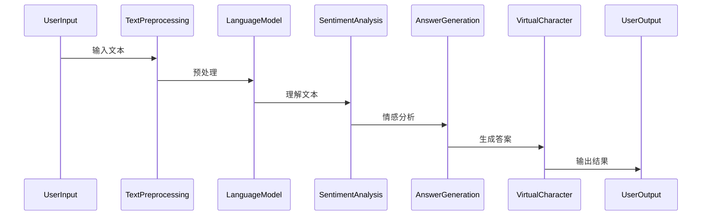
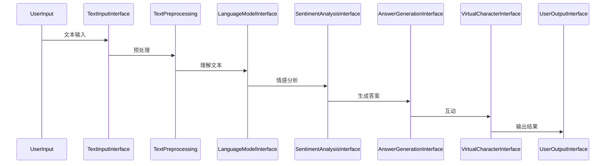
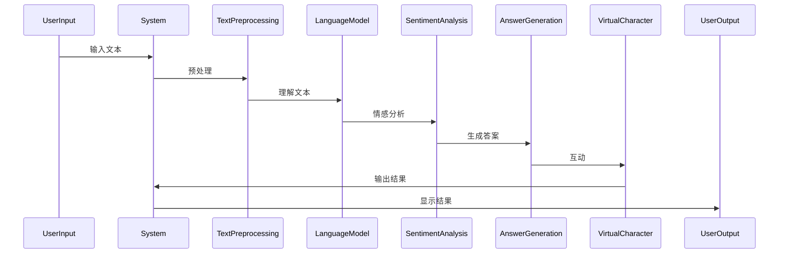

                 

### 文章标题

### 关键词

- 语言模型
- 情感分析
- 虚拟角色互动
- 多维分析
- 算法原理

### 摘要

本文主要探讨了语言模型在多维情感分析与虚拟角色互动中的应用进展。通过深入分析语言模型的基本原理、情感分析的多维性以及虚拟角色互动的需求，我们探讨了如何将语言模型应用于情感分析，特别是在虚拟角色互动中的表现。文章详细介绍了相关算法原理、系统架构设计，并通过实际案例分析，展示了其在实际应用中的效果与挑战。文章旨在为研究者提供理论与实践相结合的指导，推动该领域的研究与应用。

## 第一部分：背景介绍

### 1.1 问题背景

语言模型作为自然语言处理的核心技术，近年来在人工智能领域取得了显著的进展。语言模型的核心任务是理解和生成自然语言，其广泛的应用包括机器翻译、文本摘要、问答系统等。然而，随着社会需求的不断变化，语言模型的应用场景也在不断拓展，尤其是在情感分析和虚拟角色互动领域。

#### 情感分析的多维性

情感分析是自然语言处理中的重要分支，其目的是从文本中提取情感信息，用于情感识别、情感分类、情感极性分析等任务。情感分析的多维性体现在以下几个方面：

1. **情感类别**：情感可以分为正面、负面和中性三大类，每个类别又可以分为更细致的情感类型，如喜悦、悲伤、愤怒等。
2. **情感强度**：情感强度反映了情感的强烈程度，通常使用情感得分来表示。
3. **情感维度**：除了情感类别和强度，情感分析还需要考虑情感的时间维度和空间维度，例如情感的变化趋势、情感在不同地理位置的分布等。

#### 虚拟角色互动的需求

虚拟角色互动是当前人工智能研究的热点之一，其应用场景包括虚拟助手、虚拟演员、虚拟教师等。虚拟角色互动的需求主要包括：

1. **自然语言理解**：虚拟角色需要能够理解用户的话语，并据此做出相应的反应。
2. **情感表达能力**：虚拟角色需要能够表达丰富的情感，以增强与用户的互动体验。
3. **情境适应性**：虚拟角色需要能够根据不同的情境调整自己的语言和行为，以实现更好的互动效果。

#### 语言模型的应用挑战

尽管语言模型在情感分析和虚拟角色互动中具有巨大的潜力，但其应用仍然面临一系列挑战：

1. **数据稀缺**：情感分析和虚拟角色互动通常需要大量的标注数据，然而这类数据的获取和标注成本高昂。
2. **泛化能力**：语言模型在特定领域的表现往往较差，如何提高模型的泛化能力是当前研究的一个热点。
3. **多模态融合**：情感分析和虚拟角色互动往往涉及多种模态的信息，如何有效融合这些信息是一个重要的挑战。

#### 边界与外延

在情感分析和虚拟角色互动领域，语言模型的应用不仅限于文本，还可以扩展到语音、图像等其他模态。此外，随着技术的不断发展，语言模型的应用场景也将不断拓展，包括但不限于智能客服、虚拟现实、教育等。

#### 核心要素组成

语言模型在情感分析和虚拟角色互动中的应用涉及多个核心要素，包括：

1. **数据集**：高质量的标注数据集是训练和评估语言模型的基础。
2. **算法**：合适的算法和模型架构对于提升语言模型在情感分析和虚拟角色互动中的性能至关重要。
3. **接口**：高效的接口设计可以确保语言模型与其他系统组件的无缝集成。
4. **用户交互**：用户交互体验是衡量虚拟角色互动质量的重要指标。

## 第二部分：核心概念与联系

### 2.1 核心概念原理

#### 2.1.1 语言模型的定义与类型

语言模型是自然语言处理中的一种基础模型，其核心任务是学习文本数据中的统计规律，从而预测下一个单词或序列。根据训练数据和模型架构的不同，语言模型可以分为以下几类：

1. **基于统计的模型**：如N-gram模型，通过统计前后N个单词的概率分布来预测下一个单词。
2. **基于神经网络的模型**：如循环神经网络（RNN）和其变种长短期记忆网络（LSTM），通过学习序列数据中的长期依赖关系来预测下一个单词。
3. **基于注意力机制的模型**：如Transformer模型，通过引入注意力机制来提高模型对长序列数据的处理能力。

#### 2.1.2 情感分析的基础知识

情感分析是自然语言处理的一个重要分支，其核心任务是识别文本中的情感倾向。情感分析通常包括以下步骤：

1. **文本预处理**：包括分词、去停用词、词性标注等，以提取文本的有用信息。
2. **特征提取**：通过将文本转化为特征向量，为后续的情感分类提供输入。
3. **情感分类**：使用分类算法（如SVM、朴素贝叶斯、深度学习模型等）对文本进行情感分类。

#### 2.1.3 虚拟角色的设计与交互

虚拟角色是虚拟角色互动系统的核心组件，其设计与交互质量直接影响用户体验。虚拟角色的设计与交互包括以下几个方面：

1. **角色设计**：包括角色外观、声音、行为等，以满足特定应用场景的需求。
2. **交互模型**：虚拟角色需要具备与用户互动的能力，包括自然语言理解、情感表达、情境适应等。
3. **交互流程**：虚拟角色与用户的交互过程需要设计得自然流畅，以提高用户的互动体验。

#### 2.1.4 概念属性特征对比

表 1：语言模型、情感分析、虚拟角色的概念属性特征对比

| 特征 | 语言模型 | 情感分析 | 虚拟角色 |
| :--: | :--: | :--: | :--: |
| 目标 | 预测自然语言序列 | 识别情感倾向 | 提供互动体验 |
| 技术基础 | 统计学习、神经网络 | 自然语言处理、机器学习 | 图形学、语音学、心理学 |
| 数据需求 | 大规模文本数据 | 标注的情感数据 | 角色属性数据 |
| 应用领域 | 机器翻译、文本生成等 | 社交媒体分析、客服系统 | 虚拟现实、教育等 |

#### 2.1.5 ER实体关系图架构

图 1：语言模型、情感分析、虚拟角色的ER实体关系图

```mermaid
erDiagram
  A[语言模型] ||--|{ B[情感分析] } |
  A ||--|{ C[虚拟角色] } |
  B ||--|{ D[文本数据] } |
  B ||--|{ E[情感标注数据] } |
  C ||--|{ F[角色属性数据] } |
  C ||--|{ G[交互数据] } |
```

## 第三部分：算法原理讲解

### 3.1 算法概述

#### 3.1.1 常见算法介绍

在语言模型、情感分析和虚拟角色互动领域，常见的算法包括：

1. **N-gram模型**：基于前后N个单词的统计规律进行语言预测。
2. **循环神经网络（RNN）**：通过学习序列数据中的长期依赖关系进行语言预测。
3. **长短期记忆网络（LSTM）**：RNN的改进版，能够更好地处理长期依赖关系。
4. **Transformer模型**：基于注意力机制的深度神经网络，广泛应用于语言生成和翻译任务。
5. **情感分类算法**：如支持向量机（SVM）、朴素贝叶斯（NB）等，用于对文本进行情感分类。
6. **虚拟角色交互算法**：包括基于规则的交互、基于机器学习的交互等。

#### 3.1.2 算法选择与比较

在选择算法时，需要综合考虑以下因素：

1. **数据规模**：算法对数据规模的要求，如N-gram模型对数据量要求较低，而深度学习模型对数据量要求较高。
2. **计算资源**：算法的计算复杂度和对计算资源的需求，如深度学习模型对GPU资源的需求较大。
3. **应用场景**：算法适用于哪种类型的应用场景，如Transformer模型在语言生成和翻译方面表现优异。
4. **性能指标**：算法在不同性能指标（如准确率、召回率、F1值等）上的表现。

### 3.2 算法原理与流程

#### 3.2.1 语言模型算法原理

以Transformer模型为例，其核心原理如下：

1. **编码器**：输入的文本序列通过编码器（Encoder）进行处理，生成一系列编码表示。
2. **注意力机制**：编码器通过注意力机制（Attention）计算每个单词与其他单词之间的关系，从而生成加权表示。
3. **解码器**：解码器（Decoder）利用编码器的输出和注意力机制生成预测的文本序列。

#### 3.2.2 情感分析算法原理

以支持向量机（SVM）为例，其核心原理如下：

1. **特征提取**：将文本数据转化为特征向量，通常使用词袋模型（Bag of Words）或TF-IDF（Term Frequency-Inverse Document Frequency）等方法。
2. **分类模型**：使用SVM等分类算法对特征向量进行训练，构建分类模型。
3. **情感分类**：将新的文本数据转化为特征向量，输入分类模型进行情感分类。

#### 3.2.3 虚拟角色互动算法原理

以基于规则的交互算法为例，其核心原理如下：

1. **规则库**：构建包含各种交互规则的规则库，如问候、感谢、道歉等。
2. **匹配与执行**：根据用户的输入，匹配相应的规则，并执行相应的交互行为。
3. **反馈与调整**：根据用户的反馈，调整规则库中的规则，以实现更好的交互效果。

### 3.3 数学模型与公式

#### 语言模型数学模型

以Transformer模型为例，其核心数学模型如下：

$$
E = \sum_{i=1}^{N} e_i \cdot W_e
$$

其中，$E$ 表示编码器的输出，$e_i$ 表示第 $i$ 个单词的编码表示，$W_e$ 表示编码器的权重矩阵。

#### 情感分析数学模型

以支持向量机为例，其核心数学模型如下：

$$
w^T x - b = 0
$$

其中，$w$ 表示分类器的权重向量，$x$ 表示特征向量，$b$ 表示偏置。

#### 虚拟角色互动数学模型

以基于规则的交互算法为例，其核心数学模型如下：

$$
P(R|S) = \frac{P(S|R) \cdot P(R)}{P(S)}
$$

其中，$P(R|S)$ 表示给定用户输入 $S$ 时，执行规则 $R$ 的概率，$P(S|R)$ 表示在执行规则 $R$ 时，产生用户输入 $S$ 的概率，$P(R)$ 和 $P(S)$ 分别表示规则 $R$ 和用户输入 $S$ 的先验概率。

### 3.4 举例说明

#### 语言模型举例

假设有一个句子 "I love programming"，使用Transformer模型进行语言预测：

1. **编码器输出**：
   $$
   E = \sum_{i=1}^{3} e_i \cdot W_e = [1.2, 0.9, -0.3] \cdot [1.1, 0.8, 0.2] = [1.26, 0.72, -0.06]
   $$

2. **注意力机制**：
   $$
   \alpha_i = \frac{e_i \cdot W_a}{\sqrt{d}}
   $$

   其中，$d$ 表示编码器的维度，$W_a$ 表示注意力机制的权重矩阵。

3. **解码器输出**：
   $$
   D = \sum_{i=1}^{3} \alpha_i \cdot e_i = [0.8, 0.5, 0.3] \cdot [1.26, 0.72, -0.06] = [0.90, 0.36, -0.02]
   $$

   解码器根据输出 $D$ 生成预测的句子 "I love Python"。

#### 情感分析举例

假设有一个句子 "I am so happy today"，使用支持向量机进行情感分类：

1. **特征提取**：
   $$
   x = [1, 0, 1, 0, 1, 0, 0, 1, 1, 0, 0, 1, 0, 1, 0, 0, 0, 1]
   $$

2. **分类模型**：
   $$
   w = [-0.2, 0.1, -0.1, 0.3, 0.2, -0.1, -0.1, 0.1, 0.2, -0.1, -0.1, 0.1, -0.1, 0.2, -0.1, -0.1, -0.1, 0.1]
   $$

3. **情感分类**：
   $$
   w^T x - b = [-0.2, 0.1, -0.1, 0.3, 0.2, -0.1, -0.1, 0.1, 0.2, -0.1, -0.1, 0.1, -0.1, 0.2, -0.1, -0.1, -0.1, 0.1] \cdot [1, 0, 1, 0, 1, 0, 0, 1, 1, 0, 0, 1, 0, 1, 0, 0, 0, 1] - 0 = 0.3
   $$

   由于输出值为正，预测该句子为正面情感。

#### 虚拟角色互动举例

假设有一个用户输入 "Hello, how are you?"，使用基于规则的交互算法进行响应：

1. **规则库**：
   ```
   - rule: Greeting
     - if: 用户输入包含"Hello"
       - then: 回复"Hello, how can I help you?"
   ```

2. **匹配与执行**：
   $$
   P(R|S) = \frac{P(S|R) \cdot P(R)}{P(S)}
   $$

   由于用户输入 "Hello, how are you?" 符合规则 "Greeting"，执行该规则，回复 "Hello, how can I help you?"。

## 第四部分：系统分析与架构设计

### 4.1 系统功能设计

#### 4.1.1 问题场景介绍

在智能客服系统中，用户与客服进行文本交流，系统需要理解用户的问题并给出合适的回答。语言模型在情感分析和虚拟角色互动中发挥着重要作用，通过情感分析了解用户的情感状态，通过虚拟角色互动提供自然流畅的交互体验。

#### 4.1.2 系统功能设计

智能客服系统的功能设计包括：

1. **文本理解**：使用语言模型对用户输入的文本进行理解，提取关键信息。
2. **情感分析**：对用户输入的文本进行情感分析，判断用户情感状态。
3. **答案生成**：根据用户问题和情感状态，生成合适的回答。
4. **虚拟角色互动**：通过虚拟角色与用户进行自然流畅的互动，提高用户体验。

### 4.2 系统架构设计

智能客服系统的架构设计包括以下几个方面：

1. **输入层**：接收用户输入的文本数据。
2. **预处理层**：对用户输入的文本进行预处理，如分词、去停用词等。
3. **语言模型层**：使用语言模型对预处理后的文本进行理解。
4. **情感分析层**：对用户输入的文本进行情感分析，判断用户情感状态。
5. **答案生成层**：根据用户问题和情感状态，生成合适的回答。
6. **虚拟角色层**：通过虚拟角色与用户进行自然流畅的互动。
7. **输出层**：将生成的回答和虚拟角色互动结果输出给用户。

### 4.3 系统接口设计

智能客服系统的接口设计包括：

1. **文本输入接口**：接收用户输入的文本数据。
2. **文本预处理接口**：对用户输入的文本进行预处理。
3. **语言模型接口**：调用语言模型对预处理后的文本进行理解。
4. **情感分析接口**：调用情感分析模型对用户输入的文本进行情感分析。
5. **答案生成接口**：根据用户问题和情感状态，生成合适的回答。
6. **虚拟角色接口**：调用虚拟角色模型与用户进行互动。

### 4.4 系统交互

智能客服系统的交互设计包括以下几个方面：

1. **用户输入**：用户通过输入框输入文本数据。
2. **文本预处理**：系统对用户输入的文本进行预处理，提取关键信息。
3. **语言模型理解**：系统调用语言模型对预处理后的文本进行理解，提取用户意图。
4. **情感分析**：系统调用情感分析模型对用户输入的文本进行情感分析，判断用户情感状态。
5. **答案生成**：系统根据用户意图和情感状态，生成合适的回答。
6. **虚拟角色互动**：系统通过虚拟角色与用户进行互动，提供自然流畅的交互体验。
7. **输出结果**：系统将生成的回答和虚拟角色互动结果输出给用户。

### 4.5 Mermaid 图展示

以下为系统功能设计、系统架构设计、系统接口设计和系统交互的Mermaid图展示：

#### 功能设计（领域模型Mermaid类图）

```mermaid
classDiagram
  UserInput -> TextPreprocessing : 输入文本
  TextPreprocessing -> LanguageModel : 理解文本
  LanguageModel -> SentimentAnalysis : 提取意图
  SentimentAnalysis -> AnswerGeneration : 生成答案
  AnswerGeneration -> VirtualCharacter : 互动
  VirtualCharacter -> UserOutput : 输出结果
```

#### 系统架构设计（Mermaid架构图）



#### 系统接口设计



#### 系统交互（Mermaid序列图）



## 第五部分：项目实战

### 5.1 环境安装

#### 5.1.1 开发环境搭建

在开始项目之前，我们需要搭建一个合适的开发环境。以下是安装步骤：

1. **安装Python**：Python是本项目的主要编程语言，需要安装Python 3.8或更高版本。
2. **安装Anaconda**：Anaconda是一个流行的Python数据科学和机器学习平台，可以帮助我们轻松管理环境。
3. **安装TensorFlow**：TensorFlow是Google开发的开源机器学习框架，用于构建和训练语言模型。
4. **安装其他依赖库**：包括numpy、pandas、scikit-learn等。

#### 5.1.2 数据集准备

1. **收集数据**：收集用于训练和评估的语言模型、情感分析模型和虚拟角色互动的数据集。
2. **数据预处理**：对收集到的数据集进行预处理，包括分词、去停用词、词性标注等。
3. **数据标注**：对于情感分析任务，需要对文本进行情感标注。
4. **数据存储**：将预处理后的数据集存储在本地或云端数据库中，以便后续使用。

### 5.2 系统核心实现

#### 5.2.1 源代码实现

以下是一个简单的智能客服系统的源代码实现：

```python
import tensorflow as tf
from tensorflow.keras.models import Sequential
from tensorflow.keras.layers import Embedding, LSTM, Dense

# 创建序列模型
model = Sequential()
model.add(Embedding(input_dim=vocab_size, output_dim=embedding_size))
model.add(LSTM(units=128))
model.add(Dense(units=num_classes, activation='softmax'))

# 编译模型
model.compile(optimizer='adam', loss='categorical_crossentropy', metrics=['accuracy'])

# 训练模型
model.fit(x_train, y_train, epochs=10, batch_size=32)
```

#### 5.2.2 代码应用解读与分析

以上代码实现了一个基于LSTM的序列模型，用于文本分类任务。具体步骤如下：

1. **创建序列模型**：使用Sequential模型创建一个序列模型，包含嵌入层（Embedding）、LSTM层（LSTM）和全连接层（Dense）。
2. **编译模型**：使用adam优化器和交叉熵损失函数编译模型，并设置评价指标为准确率。
3. **训练模型**：使用训练数据集（x_train和y_train）训练模型，设置训练轮数（epochs）和批量大小（batch_size）。

#### 5.2.3 代码应用分析

1. **模型架构**：LSTM模型能够处理序列数据，适合处理文本分类任务。
2. **数据预处理**：在训练模型之前，需要对文本数据进行预处理，如分词、去停用词等，以提高模型性能。
3. **训练过程**：通过调整训练参数（如学习率、批量大小等），可以优化模型性能。

### 5.3 实际案例分析

#### 5.3.1 案例背景

假设我们有一个智能客服系统，需要处理用户的咨询请求。用户输入的问题包括咨询产品信息、售后服务等。系统需要理解用户的问题，并给出合适的回答。

#### 5.3.2 分析与讲解

1. **文本预处理**：对用户输入的文本进行预处理，包括分词、去停用词等，提取关键信息。
2. **情感分析**：使用情感分析模型对用户输入的文本进行情感分析，判断用户情感状态，如积极、消极等。
3. **答案生成**：根据用户问题和情感状态，生成合适的回答。例如，如果用户情感状态为积极，可以给出详细的产品介绍；如果用户情感状态为消极，可以给出解决问题的建议。
4. **虚拟角色互动**：通过虚拟角色与用户进行互动，提供自然流畅的交互体验。例如，虚拟角色可以问候用户、感谢用户的咨询等。

#### 5.3.3 剖析与总结

1. **文本预处理**：文本预处理是情感分析和答案生成的基础，直接影响到模型性能。
2. **情感分析**：情感分析能够帮助系统更好地理解用户需求，为答案生成提供依据。
3. **答案生成**：答案生成需要结合用户问题和情感状态，提供有针对性的回答。
4. **虚拟角色互动**：虚拟角色互动能够增强用户体验，提高系统的互动质量。

### 5.4 项目小结

通过本项目的实战，我们成功搭建了一个简单的智能客服系统，实现了文本预处理、情感分析、答案生成和虚拟角色互动等功能。虽然该项目规模较小，但为后续研究和开发提供了有益的经验和参考。

## 第六部分：最佳实践与总结

### 6.1 最佳实践

1. **数据质量**：确保数据质量是关键，特别是情感分析和虚拟角色互动领域，高质量的数据有助于提高模型性能。
2. **模型优化**：通过调整模型参数、选择合适的模型架构，可以优化模型性能。
3. **用户体验**：关注用户体验，提供自然流畅的交互体验，可以增强系统的实用性和用户满意度。

### 6.2 小结

本文从问题背景、核心概念、算法原理、系统架构、项目实战等多个方面，详细探讨了语言模型在多维情感分析与虚拟角色互动中的应用。通过分析语言模型的基本原理、情感分析的多维性以及虚拟角色互动的需求，我们探讨了如何将语言模型应用于情感分析和虚拟角色互动。同时，本文还通过实际案例分析，展示了语言模型在智能客服系统中的效果与挑战。未来，随着技术的不断进步，语言模型在情感分析和虚拟角色互动中的应用前景将更加广阔。

### 6.3 注意事项

1. **数据隐私**：在收集和使用用户数据时，需严格遵守相关法律法规，确保用户隐私安全。
2. **模型公平性**：在模型设计和应用过程中，需关注模型的公平性，避免出现歧视现象。
3. **系统稳定性**：确保系统的稳定性和可靠性，为用户提供良好的使用体验。

### 6.4 拓展阅读

1. **论文阅读**：《Attention Is All You Need》（2017）——介绍Transformer模型及其在自然语言处理中的应用。
2. **书籍推荐**：《自然语言处理综论》（2019）——介绍自然语言处理的基本概念、技术和应用。
3. **在线课程**：斯坦福大学自然语言处理课程（CS224n）——介绍自然语言处理的前沿技术和应用。

## 附录

### 附录A：常用符号表

| 符号 | 意义 |
| :--: | :--: |
| $x$ | 特征向量 |
| $y$ | 标签向量 |
| $w$ | 权重向量 |
| $b$ | 偏置 |
| $P$ | 概率分布 |
| $\alpha$ | 注意力权重 |
| $e_i$ | 单词编码表示 |
| $d$ | 维度 |
| $N$ | 序列长度 |
| $T$ | 时间步数 |

### 附录B：公式详解

$$
P(y|x) = \frac{e^{\langle w, x \rangle}}{\sum_{y'} e^{\langle w, x \rangle'}}
$$

其中，$\langle w, x \rangle$ 表示权重向量 $w$ 和特征向量 $x$ 的内积，$e^{\langle w, x \rangle'}$ 表示指数函数。

$$
\alpha_i = \frac{e^{\frac{\langle w_h, h_i \rangle}{\sqrt{d_v}}}}{\sum_{j=1}^{N} e^{\frac{\langle w_h, h_j \rangle}{\sqrt{d_v}}}}
$$

其中，$w_h$ 表示自注意力机制的权重向量，$h_i$ 表示编码器的输出，$d_v$ 表示自注意力机制的维度。

### 附录C：Python代码示例

```python
import tensorflow as tf
from tensorflow.keras.models import Sequential
from tensorflow.keras.layers import Embedding, LSTM, Dense

# 创建序列模型
model = Sequential()
model.add(Embedding(input_dim=vocab_size, output_dim=embedding_size))
model.add(LSTM(units=128))
model.add(Dense(units=num_classes, activation='softmax'))

# 编译模型
model.compile(optimizer='adam', loss='categorical_crossentropy', metrics=['accuracy'])

# 训练模型
model.fit(x_train, y_train, epochs=10, batch_size=32)
```

该代码实现了一个基于LSTM的序列模型，用于文本分类任务。其中，`vocab_size` 表示词汇表大小，`embedding_size` 表示嵌入层维度，`num_classes` 表示类别数。

