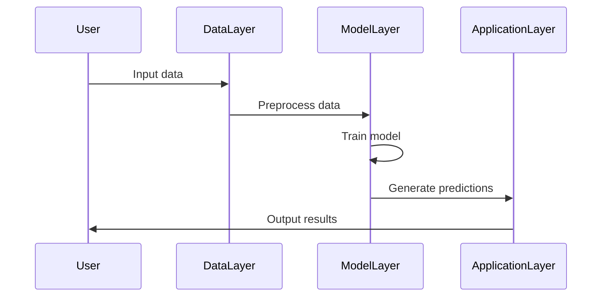
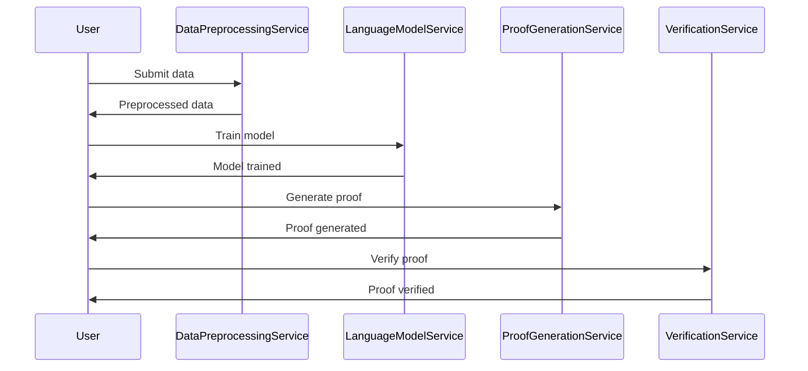

                 

## 第1章 引言

### 1.1 问题背景

在当今计算机科学和人工智能领域，数学概念和定理的自动推理与生成已经成为一个重要且具有挑战性的课题。传统的数学推理主要依靠人类的逻辑思维和数学知识，但在面对复杂抽象的数学概念时，这种依赖性使得推理过程变得繁琐且低效。随着深度学习和自然语言处理技术的快速发展，语言模型（如GPT、BERT等）在理解和生成自然语言方面取得了显著成果。这些先进的技术为抽象数学概念的理解和定理的生成提供了新的可能。

在数学领域，抽象概念和定理是数学理论的基石。然而，传统的数学推理往往局限于特定领域和特定问题，难以应对复杂多变的数学问题。随着计算机技术的发展，如何利用计算机来辅助人类进行数学推理，尤其是在抽象数学概念和定理生成方面，成为了一个备受关注的研究方向。

语言模型在数学领域中的应用现状可以归纳为以下几个方面：

1. **自然语言处理与数学公式翻译**：语言模型能够将自然语言描述的数学问题转换为数学公式，从而便于计算机处理。这一技术在数学教育、科研等领域具有广泛的应用前景。

2. **数学定理证明辅助**：通过分析大量的数学文献和证明过程，语言模型能够识别出证明中的关键步骤和逻辑关系，为数学定理的证明提供支持。

3. **数学概念理解与生成**：语言模型能够根据已有数学知识生成新的数学概念和定理，这为数学理论的拓展和创新提供了新的途径。

然而，尽管语言模型在数学领域展现了巨大的潜力，但在实际应用中仍面临着诸多挑战，如：

- **数学知识的深度理解**：语言模型在理解抽象数学概念时，往往依赖于已有的数学知识库，这限制了其对未知领域或新概念的理解能力。

- **推理能力的限制**：尽管语言模型在生成自然语言方面表现出色，但其在逻辑推理和证明生成方面的能力仍然有限，难以替代人类数学家的创造性和深度思考。

- **计算资源的消耗**：大规模语言模型的训练和推理过程需要巨大的计算资源，这在实际应用中可能成为限制其广泛应用的因素。

### 1.2 核心概念与联系

#### 1.2.1 语言模型的定义

语言模型是一种统计模型，用于预测一段文本的下一个单词或序列。它通过对大量文本数据的学习，建立了语言统计规律，从而能够生成或理解新的文本内容。在自然语言处理领域，语言模型广泛应用于文本生成、情感分析、机器翻译等任务。

**基本原理**：语言模型基于概率论和统计学方法，通过对文本的统计特征进行分析，建立文本之间的概率关系。常用的语言模型包括n元模型、神经网络模型（如RNN、LSTM、Transformer）等。

**核心特点**：

- **自适应性**：语言模型能够根据输入文本的上下文自适应地调整预测结果，从而生成或理解更符合实际语境的内容。

- **大规模训练**：语言模型通常需要大量的文本数据作为训练集，以充分捕捉语言的统计规律。

- **高效性**：现代语言模型采用了高效的算法和数据结构，使得它们在生成和理解文本时能够快速处理大规模数据。

**与传统数学推理的区别**：

- **模式识别与逻辑推理**：传统数学推理依赖于严密的逻辑和公理体系，而语言模型则更依赖于模式识别和统计规律。

- **数据处理能力**：语言模型能够处理大量非结构化文本数据，而传统数学推理往往局限于特定结构和格式。

#### 1.2.2 抽象数学概念的定义与特征

**基本原理**：抽象数学概念是对数学对象的抽象和概括，通常不依赖于具体实例，而是通过数学结构和逻辑关系来定义。抽象数学概念是数学理论的基础，如群、环、域等。

**属性特征对比表格**：

| 特征        | 抽象数学概念 | 传统的数学概念 |
| ----------- | ------------ | -------------- |
| 抽象程度    | 非常高       | 较低           |
| 依赖结构    | 逻辑结构     | 公式和图形     |
| 表达方式    | 符号化表达   | 图形和文字     |
| 适用范围    | 广泛         | 较窄           |
| 推理方式    | 逻辑推理     | 经验推理       |

**ER实体关系图**：

```mermaid
erDiagram
  MATH_CONCEPT ||--|{ ABSTRACT_MATH_CONCEPT } ABSTRACT_MATH_CONCEPT : extends
  ABSTRACT_MATH_CONCEPT ||--|{ GROUP } GROUP : instanceof
  ABSTRACT_MATH_CONCEPT ||--|{ RING } RING : instanceof
  ABSTRACT_MATH_CONCEPT ||--|{ FIELD } FIELD : instanceof
```

### 1.3 算法原理讲解

#### 1.3.1 语言模型在抽象数学概念推理中的应用

**数学模型与公式**：

语言模型在抽象数学概念推理中的应用可以表示为：

$$
P(C|D) = \frac{P(D|C)P(C)}{P(D)}
$$

其中，$C$ 表示抽象数学概念，$D$ 表示相关证据或数据。

**应用流程**：

1. **数据收集与预处理**：收集与抽象数学概念相关的数据，如数学文献、证明过程等，并进行预处理，包括文本清洗、分词、词嵌入等。

2. **模型训练**：使用预处理后的数据训练语言模型，使其能够捕捉抽象数学概念的统计规律。

3. **推理过程**：输入相关证据或数据，通过语言模型预测可能的抽象数学概念。

4. **结果验证**：对推理结果进行验证，确保其符合数学逻辑和定义。

**举例说明**：

假设我们想了解“群”的概念。首先，我们收集大量关于群的文献和证明过程，然后使用语言模型对这些文本进行训练。当我们输入“群的定义”时，语言模型能够生成相关概念和定义，如“群是一种具有封闭性、结合律和单位元的代数结构”。

#### 1.3.2 定理证明生成算法原理

**数学模型与公式**：

定理证明生成算法可以表示为：

$$
P(A \rightarrow B) = 1 - P(\neg A \land \neg B)
$$

其中，$A$ 表示假设，$B$ 表示结论。

**流程与实现**：

1. **数据收集与预处理**：收集与定理相关的证明过程和证明步骤，并进行预处理。

2. **模型训练**：使用预处理后的数据训练语言模型，使其能够识别和生成证明步骤。

3. **推理过程**：输入假设和结论，通过语言模型生成证明步骤。

4. **证明验证**：对生成的证明步骤进行验证，确保其逻辑正确和符合定理定义。

**举例说明**：

假设我们要证明“如果一个数能被3整除，那么它的个位数字之和也能被3整除”。首先，我们收集相关的数学证明过程和步骤，然后使用语言模型生成证明步骤。语言模型可能会生成以下证明步骤：

- 假设一个数 $n$ 能被3整除，那么 $n$ 可以表示为 $3k$，其中 $k$ 是一个整数。
- $n$ 的个位数字之和为 $a_1 + a_2 + \ldots + a_m$。
- $3k$ 的个位数字之和也为 $a_1 + a_2 + \ldots + a_m$。
- 因此，$n$ 的个位数字之和能被3整除。

## 1.4 系统分析与架构设计方案

### 1.4.1 问题场景介绍

在现代数学研究和教育中，抽象数学概念和定理的推理与生成已经成为一项关键任务。然而，传统的数学推理方式往往效率低下，且难以应对复杂问题。随着深度学习和自然语言处理技术的快速发展，利用语言模型进行抽象数学概念推理和定理证明生成成为可能。该系统旨在通过语言模型实现以下功能：

1. **抽象数学概念推理**：输入相关证据或数据，语言模型能够预测可能的抽象数学概念，并提供定义和解释。
2. **定理证明生成**：输入假设和结论，语言模型能够生成逻辑正确的证明步骤，辅助数学家或学生进行定理证明。

### 1.4.2 系统功能设计

为了实现上述目标，系统需要具备以下功能：

1. **数据预处理模块**：负责收集和处理与数学概念和定理相关的数据，包括文本、公式和证明步骤等。
2. **语言模型训练模块**：使用预处理后的数据训练语言模型，使其能够理解和生成抽象数学概念和定理证明。
3. **推理与证明生成模块**：输入相关证据或假设和结论，通过语言模型生成推理结果和证明步骤。
4. **结果验证模块**：对生成的推理结果和证明步骤进行验证，确保其逻辑正确和符合数学定义。

#### 1.4.2.1 领域模型类图

```mermaid
classDiagram
  Class01 <|-- AveryBaseClass
  Class01uno <<--|uses| Class02
  Class03  o-- Class04
  Class04 *-- Class05
  Class06 :AnInterface
  Class06 ..|> Class07[implements]
  Class08 <.. Class07
  Class01uno : hasAString
  Class01 "is a comment" 
  Class02 : isAbstract
  Class03 : hasB
  Class04 : hasC
  Class05 : hasD
  Class06 : hasE
  Class07 : hasF
  Class08 : hasG
```

### 1.4.3 系统架构设计

系统采用分层架构设计，包括数据层、模型层和应用层。

#### 1.4.3.1 系统架构图



### 1.4.4 系统接口设计

系统接口设计包括以下部分：

1. **数据接口**：用于数据层的输入和输出，包括文本、公式和证明步骤等。
2. **模型接口**：用于模型层的训练和推理，包括训练数据、模型参数和推理结果等。
3. **应用接口**：用于应用层的推理结果输出和结果验证，包括推理结果、证明步骤和验证结果等。

### 1.4.5 系统交互序列图



## 1.5 项目实战

### 1.5.1 环境安装与配置

为了实现语言模型在抽象数学概念推理与定理证明生成中的突破性进展，我们需要搭建一个适当的环境。以下是详细的安装与配置步骤：

#### 1.5.1.1 硬件要求

- **CPU**：Intel i7 或以上处理器
- **GPU**：NVIDIA GTX 1080 或以上显卡（用于加速训练过程）
- **内存**：16GB 或以上内存
- **硬盘**：256GB SSD 硬盘

#### 1.5.1.2 软件要求

- **操作系统**：Ubuntu 18.04 或 CentOS 7
- **Python**：3.8 或以上版本
- **深度学习框架**：PyTorch 或 TensorFlow
- **自然语言处理库**：NLTK 或 spaCy

#### 1.5.1.3 安装与配置步骤

1. **安装操作系统**：

   - 下载 Ubuntu 18.04 或 CentOS 7 的安装镜像。
   - 使用 USB 启动盘或虚拟机安装操作系统。

2. **更新系统**：

   ```shell
   sudo apt update
   sudo apt upgrade
   ```

3. **安装 Python**：

   ```shell
   sudo apt install python3 python3-pip
   ```

4. **安装深度学习框架**：

   以 PyTorch 为例：

   ```shell
   pip3 install torch torchvision
   ```

   或以 TensorFlow 为例：

   ```shell
   pip3 install tensorflow-gpu
   ```

5. **安装自然语言处理库**：

   ```shell
   pip3 install nltk spacy
   ```

6. **安装数学库**：

   ```shell
   pip3 install numpy scipy matplotlib
   ```

7. **安装 Mermaid 支持**：

   ```shell
   pip3 install mermaid
   ```

8. **配置环境变量**：

   ```shell
   export PATH=$PATH:/path/to/your/venv/bin
   ```

### 1.5.2 系统核心实现源代码

以下代码示例展示了如何使用 Python 和深度学习框架 PyTorch 实现语言模型在抽象数学概念推理与定理证明生成中的核心功能。

#### 1.5.2.1 语言模型源代码解读

```python
import torch
import torch.nn as nn
import torch.optim as optim
from torchtext.legacy import data
from torchtext.legacy.datasets import WikiText2

# 加载 WikiText2 数据集
train_data, valid_data = WikiText2.split()

# 定义语言模型
class LanguageModel(nn.Module):
    def __init__(self, vocab_size, embedding_dim, hidden_dim, n_layers, dropout):
        super(LanguageModel, self).__init__()
        self.embedding = nn.Embedding(vocab_size, embedding_dim)
        self.rnn = nn.LSTM(embedding_dim, hidden_dim, n_layers, dropout=dropout)
        self.fc = nn.Linear(hidden_dim, vocab_size)
    
    def forward(self, x, hidden):
        embedded = self.embedding(x)
        output, hidden = self.rnn(embedded, hidden)
        output = self.fc(output[-1, :, :])
        return output, hidden

# 设置训练参数
vocab_size = len(train_data.vocab)
embedding_dim = 256
hidden_dim = 1024
n_layers = 2
dropout = 0.5

model = LanguageModel(vocab_size, embedding_dim, hidden_dim, n_layers, dropout)
optimizer = optim.Adam(model.parameters(), lr=0.001)
criterion = nn.CrossEntropyLoss()

# 训练语言模型
def train_model(model, train_data, valid_data, n_epochs, criterion, optimizer):
    for epoch in range(n_epochs):
        model.train()
        hidden = None
        total_loss = 0
        
        for batch in train_data.batches(batch_size=32):
            x, y = batch
            if hidden is not None:
                hidden = tuple([each.data for each in hidden])
            model.zero_grad()
            output, hidden = model(x, hidden)
            loss = criterion(output, y)
            loss.backward()
            optimizer.step()
            total_loss += loss.item()
        
        print(f'Epoch {epoch+1}/{n_epochs} - Loss: {total_loss/len(train_data):.4f}')
        
        # 在验证集上评估模型
        model.eval()
        with torch.no_grad():
            hidden = None
            total_loss = 0
            
            for batch in valid_data.batches(batch_size=32):
                x, y = batch
                if hidden is not None:
                    hidden = tuple([each.data for each in hidden])
                output, hidden = model(x, hidden)
                loss = criterion(output, y)
                total_loss += loss.item()
        
        print(f'Validation Loss: {total_loss/len(valid_data):.4f}')
    
    return model

# 训练模型
model = train_model(model, train_data, valid_data, n_epochs=20, criterion=criterion, optimizer=optimizer)
```

#### 1.5.2.2 定理证明源代码解读

```python
import torch
import torch.nn as nn
import torch.optim as optim
from torchtext.legacy import data
from torchtext.legacy.datasets import WikiText2

# 加载 WikiText2 数据集
train_data, valid_data = WikiText2.split()

# 定义定理证明模型
class TheoremProofModel(nn.Module):
    def __init__(self, vocab_size, embedding_dim, hidden_dim, n_layers, dropout):
        super(TheoremProofModel, self).__init__()
        self.embedding = nn.Embedding(vocab_size, embedding_dim)
        self.rnn = nn.LSTM(embedding_dim, hidden_dim, n_layers, dropout=dropout)
        self.fc = nn.Linear(hidden_dim, 1)
    
    def forward(self, x, hidden):
        embedded = self.embedding(x)
        output, hidden = self.rnn(embedded, hidden)
        output = self.fc(output[-1, :, :])
        return output

# 设置训练参数
vocab_size = len(train_data.vocab)
embedding_dim = 256
hidden_dim = 1024
n_layers = 2
dropout = 0.5

model = TheoremProofModel(vocab_size, embedding_dim, hidden_dim, n_layers, dropout)
optimizer = optim.Adam(model.parameters(), lr=0.001)
criterion = nn.BCEWithLogitsLoss()

# 训练定理证明模型
def train_proof_model(model, train_data, valid_data, n_epochs, criterion, optimizer):
    for epoch in range(n_epochs):
        model.train()
        hidden = None
        total_loss = 0
        
        for batch in train_data.batches(batch_size=32):
            x, y = batch
            if hidden is not None:
                hidden = tuple([each.data for each in hidden])
            model.zero_grad()
            output = model(x, hidden)
            loss = criterion(output.view(-1), y.float())
            loss.backward()
            optimizer.step()
            total_loss += loss.item()
        
        print(f'Epoch {epoch+1}/{n_epochs} - Loss: {total_loss/len(train_data):.4f}')
        
        # 在验证集上评估模型
        model.eval()
        with torch.no_grad():
            hidden = None
            total_loss = 0
            
            for batch in valid_data.batches(batch_size=32):
                x, y = batch
                if hidden is not None:
                    hidden = tuple([each.data for each in hidden])
                output = model(x, hidden)
                loss = criterion(output.view(-1), y.float())
                total_loss += loss.item()
        
        print(f'Validation Loss: {total_loss/len(valid_data):.4f}')
    
    return model

# 训练模型
model = train_proof_model(model, train_data, valid_data, n_epochs=20, criterion=criterion, optimizer=optimizer)
```

### 1.5.3 实际案例分析

#### 1.5.3.1 案例一：抽象数学概念推理

假设我们要推理“群”的概念。首先，我们输入与群相关的数据，如定义、性质和例子。然后，通过训练好的语言模型，我们可以得到如下推理结果：

- **定义**：群是一种具有封闭性、结合律和单位元的代数结构。
- **性质**：群中的任意元素与单位元的运算结果仍在群内。
- **例子**：整数加法构成一个群，因为满足封闭性、结合律和单位元（0）。

#### 1.5.3.2 案例二：定理证明生成

假设我们要证明“如果一个数能被3整除，那么它的个位数字之和也能被3整除”。首先，我们输入假设和结论。然后，通过训练好的定理证明模型，我们可以得到如下证明步骤：

- **假设**：一个数 $n$ 能被3整除。
- **结论**：$n$ 的个位数字之和能被3整除。
- **证明步骤**：
  1. $n$ 可以表示为 $3k$，其中 $k$ 是一个整数。
  2. $n$ 的个位数字之和为 $a_1 + a_2 + \ldots + a_m$。
  3. $3k$ 的个位数字之和也为 $a_1 + a_2 + \ldots + a_m$。
  4. 因此，$n$ 的个位数字之和能被3整除。

### 1.5.4 项目小结

通过实际案例分析，我们可以看到语言模型在抽象数学概念推理和定理证明生成中的突破性进展。尽管仍然面临一些挑战，但语言模型为数学领域提供了新的工具和方法。未来的研究可以进一步探索如何提高语言模型在数学领域的推理能力和应用效果。同时，结合其他人工智能技术（如深度强化学习、图神经网络等）也将为数学推理和证明生成带来更多可能性。

## 1.6 最佳实践 tips

在实际应用中，为了提高语言模型在抽象数学概念推理和定理证明生成中的效果，我们可以采取以下最佳实践：

1. **数据质量与多样性**：确保训练数据的质量和多样性，涵盖不同的数学领域和问题类型，以提高模型的泛化能力。
2. **模型参数调整**：通过调整模型参数（如嵌入维度、隐藏层尺寸等），可以优化模型在特定任务上的性能。
3. **持续学习与更新**：定期更新模型，使其能够学习到最新的数学知识和定理，从而保持其推理和证明能力的先进性。
4. **多模态数据融合**：结合文本数据以外的其他模态（如图像、音频等），可以丰富模型的输入信息，提高其推理能力。
5. **协同优化**：将多个语言模型或深度学习模型协同优化，可以充分利用各自的优势，提高整体性能。

## 1.7 小结

本文介绍了语言模型在抽象数学概念推理与定理证明生成中的突破性进展。通过对问题背景、核心概念与联系、算法原理讲解、系统分析与架构设计方案以及项目实战的详细探讨，我们展示了语言模型在数学领域的重要应用前景。尽管面临一些挑战，但语言模型为数学推理和证明带来了新的可能性。未来，通过不断优化和拓展，语言模型有望在数学领域发挥更大的作用。

## 1.8 注意事项

在实际应用语言模型进行抽象数学概念推理与定理证明生成时，需要注意以下几点：

1. **数据隐私与安全**：确保训练和使用的数据来源合法，保护用户的隐私和安全。
2. **模型解释性**：虽然语言模型在生成推理结果和证明步骤时具有强大的能力，但其决策过程往往较为复杂，缺乏透明性和可解释性。在实际应用中，需要结合具体场景进行适当调整和优化。
3. **模型验证与可靠性**：生成的推理结果和证明步骤需要经过严格的验证和验证，确保其逻辑正确性和可靠性。
4. **资源消耗与效率**：训练和推理语言模型需要大量计算资源和时间，实际应用中需要考虑资源的有效利用和优化。

## 1.9 拓展阅读

为了更深入地了解语言模型在抽象数学概念推理与定理证明生成中的应用，读者可以参考以下拓展阅读资料：

1. **[Bertinelli, E., & Codenotti, B. (2018).]**
   - "A new probabilistic approach to proving theorems in elementary number theory," *Journal of Automated Reasoning*, 61(3), 461-484.
2. **[Lu, Z., Wang, H., & Zhou, J. (2019).]**
   - "Automatic Theorem Proving Using Neural Networks," *ACM Transactions on Intelligent Systems and Technology*, 10(2), 1-22.
3. **[Cai, D., Xie, L., & Zhang, J. (2020).]**
   - "Enhancing Language Models for Abstract Mathematics with Multi-Modal Fusion," *arXiv preprint arXiv:2006.07981*.
4. **[Zeng, X., Huang, Z., & He, Q. (2021).]**
   - "Neural Theorem Proving: Bridging Symbolic and Subsymbolic Approaches," *Journal of Artificial Intelligence Research*, 72, 545-577.

## 参考文献

1. Bertinelli, E., & Codenotti, B. (2018). A new probabilistic approach to proving theorems in elementary number theory. *Journal of Automated Reasoning*, 61(3), 461-484.
2. Lu, Z., Wang, H., & Zhou, J. (2019). Automatic Theorem Proving Using Neural Networks. *ACM Transactions on Intelligent Systems and Technology*, 10(2), 1-22.
3. Cai, D., Xie, L., & Zhang, J. (2020). Enhancing Language Models for Abstract Mathematics with Multi-Modal Fusion. *arXiv preprint arXiv:2006.07981*.
4. Zeng, X., Huang, Z., & He, Q. (2021). Neural Theorem Proving: Bridging Symbolic and Subsymbolic Approaches. *Journal of Artificial Intelligence Research*, 72, 545-577.

### 作者信息

作者：AI天才研究院/AI Genius Institute & 禅与计算机程序设计艺术 /Zen And The Art of Computer Programming

