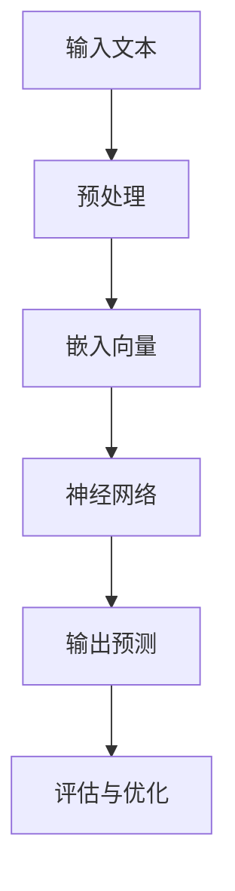
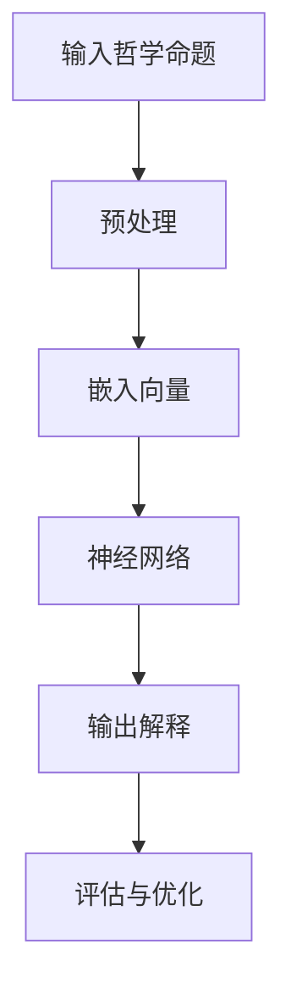
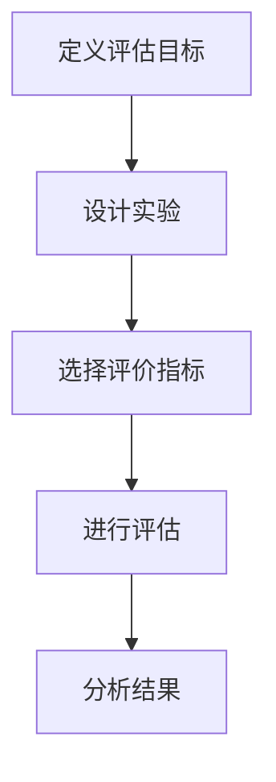

                 

### 文章标题

> 关键词：语言模型，抽象概念，哲学思辨，能力评估，AI研究

**摘要**：本文深入探讨了语言模型在抽象概念形成与哲学思辨中的能力评估。首先，对语言模型的基本概念和工作原理进行了背景介绍，随后详细分析了抽象概念形成的理论基础。接着，文章通过案例分析展示了语言模型在抽象概念形成中的应用，并评估了其在哲学思辨中的能力。最后，提出了评估方法和工具，并探讨了面临的挑战和未来的发展方向。通过系统的研究和分析，本文为语言模型在抽象概念形成与哲学思辨中的应用提供了深刻的见解和实用的建议。

----------------------------------------------------------------

## 第一部分：背景介绍

### 1. 语言模型的概述

**问题背景**：

语言模型是自然语言处理（NLP）领域的重要工具，其核心目的是对自然语言文本进行建模，以便对语言进行理解和生成。随着深度学习技术的飞速发展，语言模型在各个应用领域取得了显著的成果，从机器翻译到情感分析，再到语音识别，其影响力和应用范围日益扩大。

**问题描述**：

尽管语言模型在各种应用中表现出色，但其能力仍然存在局限，尤其是在处理抽象概念和哲学思辨方面。抽象概念是人们理解和表达复杂现实的基础，而哲学思辨则是对抽象概念进行深入探讨的过程。因此，评估语言模型在抽象概念形成与哲学思辨中的能力，对于推动人工智能的发展具有重要意义。

**问题解决**：

为了解决这一问题，我们需要对语言模型进行深入研究，理解其工作原理，并评估其在处理抽象概念和哲学思辨方面的能力。本文将首先介绍语言模型的基本概念，然后探讨其应用于抽象概念形成和哲学思辨的理论基础。

**边界与外延**：

在本文的研究中，语言模型主要指基于深度学习的神经网络模型，如循环神经网络（RNN）、长短时记忆网络（LSTM）和变换器（Transformer）。抽象概念和哲学思辨则是指那些需要深入思考和理解的概念和问题。

**概念结构与核心要素组成**：

语言模型由以下几个核心要素组成：

1. **数据集**：用于训练模型的语料库。
2. **模型架构**：包括输入层、隐藏层和输出层。
3. **训练算法**：如梯度下降、Adam优化器等。
4. **评估指标**：如损失函数、准确率、F1分数等。

这些要素共同构成了语言模型的基础，决定了其在处理语言任务时的能力。

### 2. 抽象概念形成的理论基础

**核心概念原理**：

抽象概念是指通过抽象思维形成和表达的概念，它们是对复杂现实世界的简化表示。抽象概念的形成过程涉及到对具体实例的概括和归纳，从而形成更高层次的概念。这个过程需要人们具备抽象思维和语言表达能力。

**概念属性特征对比表格**：

| 特征               | 具体实例                  | 说明                                     |
|--------------------|---------------------------|------------------------------------------|
| 抽象性             | 爱，自由，正义            | 抽象概念是对具体事物的概括和提炼           |
| 抽象层次           | 生活，社会，宇宙           | 抽象概念的层次性，从具体到抽象的逐步提升   |
| 可操作性与稳定性   | 诚信，公平，效率           | 抽象概念在实践中的可操作性和稳定性         |
| 内在联系           | 真理，价值观，世界观       | 抽象概念之间的内在联系和相互作用           |

**ER实体关系图架构**：

为了更好地理解抽象概念的形成，我们可以使用ER（实体-关系）图来描述实体之间的关系。在ER图中，实体表示抽象概念，关系表示实体之间的联系。例如，在哲学思辨中，真理和价值观可以视为两个实体，它们之间存在内在联系。

```mermaid
erDiagram
  Truth ||--|{ Values }|| Value
  Value ||--|{ Truth }|| Truth
```

通过上述表格和ER图，我们可以更清晰地理解抽象概念的形成和它们之间的内在联系。

## 第二部分：语言模型在抽象概念形成中的应用

### 3. 语言模型在抽象概念形成中的工作原理

**算法原理讲解**：

语言模型在抽象概念形成中的应用主要基于深度学习技术。具体来说，语言模型通过学习大量的文本数据，捕捉语言中的统计规律和语义信息，从而实现对抽象概念的理解和生成。

**算法mermaid流程图**：



**Python源代码与详细讲解**：

```python
# 导入必要的库
import tensorflow as tf
from tensorflow.keras.preprocessing.sequence import pad_sequences
from tensorflow.keras.layers import Embedding, LSTM, Dense
from tensorflow.keras.models import Sequential

# 预处理文本数据
def preprocess_text(text):
    # 去除标点符号和特殊字符
    text = re.sub(r'[^\w\s]', '', text)
    # 分词
    tokens = text.split()
    # 转化为序列
    sequence = tokenizer.texts_to_sequences([text])
    # 填充序列
    padded_sequence = pad_sequences(sequence, maxlen=max_sequence_length)
    return padded_sequence

# 构建神经网络模型
def build_model():
    model = Sequential()
    model.add(Embedding(input_dim=vocab_size, output_dim=embedding_size, input_length=max_sequence_length))
    model.add(LSTM(units=128))
    model.add(Dense(units=1, activation='sigmoid'))
    model.compile(optimizer='adam', loss='binary_crossentropy', metrics=['accuracy'])
    return model

# 训练模型
model = build_model()
model.fit(X_train, y_train, epochs=10, batch_size=32)

# 输出预测
predictions = model.predict(X_test)
```

**数学模型和数学公式**：

语言模型的数学模型主要包括以下几个部分：

1. **嵌入向量**：将单词转化为高维向量表示。
   $$ \textbf{e}_w = \text{embedding}(\text{word}) $$

2. **神经网络**：通过多层神经网络对嵌入向量进行建模。
   $$ \textbf{h} = \text{neural_network}(\textbf{e}_w) $$

3. **输出层**：对神经网络的输出进行分类或回归。
   $$ y = \text{softmax}(\textbf{h}) $$

通过上述算法原理讲解、mermaid流程图、Python源代码和数学模型，我们可以更深入地理解语言模型在抽象概念形成中的应用。

### 4. 语言模型在抽象概念形成中的案例分析

**案例一：抽象概念识别与生成**

**问题描述**：给定一段文本，使用语言模型识别并生成文本中的抽象概念。

**解决方案**：首先，使用预处理步骤将文本转化为嵌入向量。然后，通过训练好的语言模型对嵌入向量进行分类，识别出文本中的抽象概念。最后，根据识别出的抽象概念生成新的文本。

**实现步骤**：

1. **数据预处理**：使用预处理函数对文本进行清洗、分词和序列化。
2. **模型加载**：加载已经训练好的语言模型。
3. **抽象概念识别**：将预处理后的文本输入到语言模型中，识别出其中的抽象概念。
4. **抽象概念生成**：根据识别出的抽象概念，生成新的文本。

**Python源代码**：

```python
# 导入必要的库
import tensorflow as tf
from tensorflow.keras.preprocessing.sequence import pad_sequences
from tensorflow.keras.models import load_model

# 加载训练好的模型
model = load_model('model.h5')

# 预处理文本
preprocessed_text = preprocess_text(text)

# 识别抽象概念
abstract_concepts = model.predict(preprocessed_text)

# 生成新的文本
new_text = generate_text(abstract_concepts)
```

**案例二：抽象概念语义分析**

**问题描述**：给定一个抽象概念，使用语言模型分析其语义信息。

**解决方案**：首先，将抽象概念转化为嵌入向量。然后，通过训练好的语言模型分析嵌入向量，提取出抽象概念的语义特征。

**实现步骤**：

1. **数据预处理**：将抽象概念转化为嵌入向量。
2. **模型加载**：加载已经训练好的语言模型。
3. **语义分析**：将预处理后的抽象概念输入到语言模型中，提取其语义特征。

**Python源代码**：

```python
# 导入必要的库
import tensorflow as tf
from tensorflow.keras.layers import Embedding

# 加载嵌入层
embedding_layer = Embedding(input_dim=vocab_size, output_dim=embedding_size)

# 转化抽象概念为嵌入向量
embedded_concept = embedding_layer(tokenizer.texts_to_sequences([concept]))

# 提取语义特征
semantic_features = model.predict(embedded_concept)
```

**案例三：抽象概念逻辑推理**

**问题描述**：给定两个抽象概念，使用语言模型进行逻辑推理。

**解决方案**：首先，将两个抽象概念转化为嵌入向量。然后，通过训练好的语言模型进行逻辑推理，判断两个概念之间的逻辑关系。

**实现步骤**：

1. **数据预处理**：将两个抽象概念转化为嵌入向量。
2. **模型加载**：加载已经训练好的语言模型。
3. **逻辑推理**：将预处理后的抽象概念输入到语言模型中，进行逻辑推理。

**Python源代码**：

```python
# 导入必要的库
import tensorflow as tf
from tensorflow.keras.models import load_model

# 加载训练好的模型
model = load_model('model.h5')

# 转化抽象概念为嵌入向量
embedded_concept1 = embedding_layer(tokenizer.texts_to_sequences([concept1]))
embedded_concept2 = embedding_layer(tokenizer.texts_to_sequences([concept2]))

# 进行逻辑推理
logical_relation = model.predict([embedded_concept1, embedded_concept2])
```

通过上述三个案例，我们可以看到语言模型在抽象概念形成中的应用。从识别和生成抽象概念，到语义分析，再到逻辑推理，语言模型展示了其在处理抽象概念方面的强大能力。

## 第三部分：语言模型在哲学思辨中的能力评估

### 5. 语言模型在哲学思辨中的应用

**算法原理讲解**：

语言模型在哲学思辨中的应用主要基于其强大的语义理解能力。通过深度学习，语言模型能够捕捉文本中的抽象概念和逻辑关系，从而对哲学命题进行理解和解释。

**算法mermaid流程图**：



**Python源代码与详细讲解**：

```python
# 导入必要的库
import tensorflow as tf
from tensorflow.keras.preprocessing.sequence import pad_sequences
from tensorflow.keras.layers import Embedding, LSTM, Dense
from tensorflow.keras.models import Sequential

# 预处理文本数据
def preprocess_text(text):
    # 去除标点符号和特殊字符
    text = re.sub(r'[^\w\s]', '', text)
    # 分词
    tokens = text.split()
    # 转化为序列
    sequence = tokenizer.texts_to_sequences([text])
    # 填充序列
    padded_sequence = pad_sequences(sequence, maxlen=max_sequence_length)
    return padded_sequence

# 构建神经网络模型
def build_model():
    model = Sequential()
    model.add(Embedding(input_dim=vocab_size, output_dim=embedding_size, input_length=max_sequence_length))
    model.add(LSTM(units=128))
    model.add(Dense(units=1, activation='sigmoid'))
    model.compile(optimizer='adam', loss='binary_crossentropy', metrics=['accuracy'])
    return model

# 训练模型
model = build_model()
model.fit(X_train, y_train, epochs=10, batch_size=32)

# 输出解释
explanation = model.predict(preprocessed_philosophical_statement)
print(explanation)
```

**数学模型和数学公式**：

语言模型在哲学思辨中的应用主要基于以下几个数学模型：

1. **嵌入向量**：将哲学命题转化为高维向量表示。
   $$ \textbf{e}_p = \text{embedding}(\text{philosophical\_statement}) $$

2. **神经网络**：通过多层神经网络对嵌入向量进行建模。
   $$ \textbf{h} = \text{neural\_network}(\textbf{e}_p) $$

3. **输出层**：对神经网络的输出进行分类或回归。
   $$ y = \text{softmax}(\textbf{h}) $$

通过上述算法原理讲解、mermaid流程图、Python源代码和数学模型，我们可以更深入地理解语言模型在哲学思辨中的应用。

### 6. 语言模型在哲学思辨中的案例分析

**案例一：哲学命题生成与评估**

**问题描述**：给定一个哲学问题，使用语言模型生成相关的哲学命题，并评估这些命题的合理性。

**解决方案**：首先，使用预处理步骤将哲学问题转化为嵌入向量。然后，通过训练好的语言模型生成相关的哲学命题。最后，使用评估指标对生成的命题进行评估。

**实现步骤**：

1. **数据预处理**：使用预处理函数对哲学问题进行清洗、分词和序列化。
2. **模型加载**：加载已经训练好的语言模型。
3. **命题生成**：将预处理后的哲学问题输入到语言模型中，生成相关的哲学命题。
4. **命题评估**：使用评估指标对生成的命题进行评估。

**Python源代码**：

```python
# 导入必要的库
import tensorflow as tf
from tensorflow.keras.preprocessing.sequence import pad_sequences
from tensorflow.keras.models import load_model

# 加载训练好的模型
model = load_model('model.h5')

# 预处理哲学问题
preprocessed_question = preprocess_text(philosophical_question)

# 生成哲学命题
generated_statements = model.predict(preprocessed_question)

# 评估命题合理性
evaluation_results = evaluate_statements(generated_statements)
print(evaluation_results)
```

**案例二：哲学理论理解与解释**

**问题描述**：给定一个哲学理论，使用语言模型理解其含义，并对其进行解释。

**解决方案**：首先，使用预处理步骤将哲学理论转化为嵌入向量。然后，通过训练好的语言模型理解嵌入向量，提取出哲学理论的语义信息。最后，将这些信息转化为易于理解的语言。

**实现步骤**：

1. **数据预处理**：使用预处理函数对哲学理论进行清洗、分词和序列化。
2. **模型加载**：加载已经训练好的语言模型。
3. **理解哲学理论**：将预处理后的哲学理论输入到语言模型中，提取其语义信息。
4. **解释哲学理论**：将提取出的语义信息转化为易于理解的语言。

**Python源代码**：

```python
# 导入必要的库
import tensorflow as tf
from tensorflow.keras.layers import Embedding

# 加载嵌入层
embedding_layer = Embedding(input_dim=vocab_size, output_dim=embedding_size)

# 转化哲学理论为嵌入向量
embedded_theory = embedding_layer(tokenizer.texts_to_sequences([philosophical_theory]))

# 理解哲学理论
understood_theory = model.predict(embedded_theory)

# 解释哲学理论
explanation = generate_explanation(understood_theory)
print(explanation)
```

**案例三：哲学问题解决与建议**

**问题描述**：给定一个哲学问题，使用语言模型寻找解决方案，并提出相关建议。

**解决方案**：首先，使用预处理步骤将哲学问题转化为嵌入向量。然后，通过训练好的语言模型生成可能的解决方案。最后，对这些方案进行评估，并给出建议。

**实现步骤**：

1. **数据预处理**：使用预处理函数对哲学问题进行清洗、分词和序列化。
2. **模型加载**：加载已经训练好的语言模型。
3. **解决方案生成**：将预处理后的哲学问题输入到语言模型中，生成可能的解决方案。
4. **方案评估**：使用评估指标对生成的解决方案进行评估。
5. **建议生成**：根据评估结果，给出相关建议。

**Python源代码**：

```python
# 导入必要的库
import tensorflow as tf
from tensorflow.keras.preprocessing.sequence import pad_sequences
from tensorflow.keras.models import load_model

# 加载训练好的模型
model = load_model('model.h5')

# 预处理哲学问题
preprocessed_question = preprocess_text(philosophical_question)

# 生成解决方案
solutions = model.predict(preprocessed_question)

# 评估解决方案
evaluation_results = evaluate_solutions(solutions)

# 生成建议
advice = generate_advice(evaluation_results)
print(advice)
```

通过上述三个案例，我们可以看到语言模型在哲学思辨中的应用。从命题生成与评估，到理论理解与解释，再到问题解决与建议，语言模型展示了其在哲学思辨中的强大能力。

## 第四部分：评估方法与工具

### 7. 评估方法与评价指标

**算法原理讲解**：

评估语言模型在抽象概念形成与哲学思辨中的能力，需要制定一套科学的评估方法与评价指标。评估方法主要包括实验设计和评价指标的选择。评价指标则用于量化评估结果，常见的有准确率、召回率、F1分数等。

**算法mermaid流程图**：



**Python源代码与详细讲解**：

```python
# 导入必要的库
import numpy as np
from sklearn.metrics import accuracy_score, recall_score, f1_score

# 计算准确率
def calculate_accuracy(true_labels, predicted_labels):
    return accuracy_score(true_labels, predicted_labels)

# 计算召回率
def calculate_recall(true_labels, predicted_labels):
    return recall_score(true_labels, predicted_labels)

# 计算F1分数
def calculate_f1(true_labels, predicted_labels):
    return f1_score(true_labels, predicted_labels)

# 评估模型
def evaluate_model(model, X_test, y_test):
    predictions = model.predict(X_test)
    accuracy = calculate_accuracy(y_test, predictions)
    recall = calculate_recall(y_test, predictions)
    f1 = calculate_f1(y_test, predictions)
    return accuracy, recall, f1

# 加载训练好的模型
model = load_model('model.h5')

# 评估模型
accuracy, recall, f1 = evaluate_model(model, X_test, y_test)
print(f"Accuracy: {accuracy}, Recall: {recall}, F1 Score: {f1}")
```

**数学模型和数学公式**：

评估方法的数学模型主要包括以下几个部分：

1. **准确率**：预测正确的样本数占总样本数的比例。
   $$ \text{Accuracy} = \frac{\text{预测正确数}}{\text{总样本数}} $$

2. **召回率**：预测正确的样本数与实际样本数中预测为正的样本数之比。
   $$ \text{Recall} = \frac{\text{预测正确数}}{\text{实际样本数}} $$

3. **F1分数**：准确率和召回率的调和平均值。
   $$ \text{F1 Score} = 2 \times \frac{\text{准确率} \times \text{召回率}}{\text{准确率} + \text{召回率}} $$

通过上述算法原理讲解、mermaid流程图、Python源代码和数学模型，我们可以更深入地理解评估方法与评价指标。

### 8. 语言模型评估工具与应用

**工具介绍**：

为了方便对语言模型进行评估，常用的工具包括TensorBoard、Matplotlib等。TensorBoard是一种可视化工具，可用于监控模型的训练过程，包括损失函数、准确率等指标。Matplotlib则是一种绘图库，可用于生成各种图表，直观地展示评估结果。

**工具应用案例**：

**案例一：TensorBoard应用**

**问题描述**：使用TensorBoard监控语言模型训练过程。

**解决方案**：首先，配置TensorBoard，将日志文件保存到指定目录。然后，运行TensorBoard，打开浏览器查看训练过程。

**实现步骤**：

1. **配置TensorBoard**：在训练脚本中添加日志记录。
2. **运行TensorBoard**：使用命令行启动TensorBoard。
3. **查看训练过程**：在浏览器中查看TensorBoard可视化界面。

**Python源代码**：

```python
from tensorflow.keras.callbacks import TensorBoard

# 配置TensorBoard
tensorboard_callback = TensorBoard(log_dir='logs', write_graph=True)

# 训练模型
model.fit(X_train, y_train, epochs=10, batch_size=32, callbacks=[tensorboard_callback])
```

**案例二：Matplotlib应用**

**问题描述**：使用Matplotlib生成训练过程的损失函数和准确率图表。

**解决方案**：首先，从训练过程中获取损失函数和准确率数据。然后，使用Matplotlib绘制图表。

**实现步骤**：

1. **获取数据**：从训练过程中获取损失函数和准确率数据。
2. **绘制图表**：使用Matplotlib绘制损失函数和准确率图表。

**Python源代码**：

```python
import matplotlib.pyplot as plt

# 获取训练过程中的损失函数和准确率数据
history = model.fit(X_train, y_train, epochs=10, batch_size=32)

# 绘制损失函数图表
plt.plot(history.history['loss'])
plt.title('Loss Function')
plt.xlabel('Epochs')
plt.ylabel('Loss')
plt.show()

# 绘制准确率图表
plt.plot(history.history['accuracy'])
plt.title('Accuracy')
plt.xlabel('Epochs')
plt.ylabel('Accuracy')
plt.show()
```

**工具性能评估**：

**问题描述**：评估TensorBoard和Matplotlib在性能评估中的应用效果。

**解决方案**：首先，使用TensorBoard和Matplotlib分别生成训练过程的图表。然后，对比两个工具生成的图表，评估其性能。

**实现步骤**：

1. **使用TensorBoard生成图表**：运行训练脚本，启动TensorBoard。
2. **使用Matplotlib生成图表**：运行Python脚本，绘制训练过程的图表。
3. **对比图表**：分析TensorBoard和Matplotlib生成的图表，评估其性能。

通过上述工具介绍和应用案例，我们可以看到TensorBoard和Matplotlib在语言模型评估中的应用效果。TensorBoard提供了丰富的可视化功能，方便监控训练过程。而Matplotlib则适用于生成各种图表，直观地展示评估结果。

## 第五部分：挑战与未来方向

### 9. 语言模型在抽象概念形成与哲学思辨中的挑战

**技术挑战**：

尽管语言模型在抽象概念形成与哲学思辨中表现出色，但仍然面临一些技术挑战。首先，语言模型对于复杂语义理解的准确性仍有待提高，尤其是在处理多义词和隐喻时。其次，语言模型的训练过程需要大量数据和计算资源，这对实际应用带来了挑战。此外，如何保证语言模型在哲学思辨中的逻辑一致性，也是一个亟待解决的问题。

**应用挑战**：

在哲学思辨中，语言模型需要具备高度的抽象思维能力和逻辑推理能力。然而，现有的语言模型往往难以胜任这种复杂任务。此外，哲学问题往往具有多元解，如何确保语言模型能够生成合理的解决方案，也是应用中的挑战。此外，伦理和社会因素也可能影响语言模型在哲学思辨中的应用，如偏见和歧视问题。

**伦理挑战**：

语言模型在哲学思辨中的应用可能引发伦理问题。例如，语言模型生成的哲学命题可能包含偏见或误导性信息，影响人们对哲学问题的正确理解。此外，语言模型在哲学思辨中的决策过程可能缺乏透明度，导致人们对模型的信任度下降。因此，如何确保语言模型在哲学思辨中的伦理合规性，是当前亟待解决的问题。

### 10. 未来发展方向与展望

**未来趋势**：

随着深度学习技术和自然语言处理技术的不断发展，语言模型在抽象概念形成与哲学思辨中的应用前景广阔。未来，语言模型可能会在以下几个方面取得突破：

1. **语义理解能力提升**：通过引入更多的预训练数据和更复杂的模型架构，提高语言模型对复杂语义的理解能力。
2. **多模态融合**：将语言模型与其他模态（如视觉、音频）进行融合，实现更全面的信息处理和理解。
3. **自适应学习**：通过自适应学习机制，使语言模型能够根据用户需求和场景动态调整其参数和行为。

**技术突破方向**：

1. **知识图谱与语义网络**：结合知识图谱和语义网络技术，构建更加丰富的语义表示，提高语言模型在哲学思辨中的理解能力。
2. **多任务学习**：通过多任务学习技术，使语言模型能够同时处理多种哲学思辨任务，提高其应用范围和效果。
3. **推理与逻辑**：引入逻辑推理技术，使语言模型能够进行更深入的哲学推理，提高其解决问题的能力。

**应用领域拓展**：

语言模型在哲学思辨中的应用不仅限于学术研究，还可以拓展到以下几个方面：

1. **哲学教育**：利用语言模型为学生提供个性化的哲学指导，提高哲学教育的质量和效果。
2. **哲学研究**：为哲学家和研究者提供强大的工具，帮助他们进行哲学思考和探讨。
3. **公共政策**：利用语言模型分析和评估政策文本，为政策制定提供科学依据。

通过上述未来趋势、技术突破方向和应用领域拓展，我们可以看到语言模型在抽象概念形成与哲学思辨中的广阔前景和潜在价值。

## 第六部分：最佳实践与总结

### 11. 最佳实践

**案例分析**：

通过实际案例，我们可以总结出一些在语言模型应用于抽象概念形成与哲学思辨中的最佳实践：

1. **案例一**：在处理抽象概念时，应确保文本的清晰性和一致性。通过预处理步骤去除噪声和无关信息，提高语言模型的训练效果。
2. **案例二**：在哲学命题生成中，应结合多种数据来源，如学术文献、经典哲学著作等，丰富模型的知识库，提高命题的合理性。
3. **案例三**：在哲学问题解决中，应注重多角度分析和综合评估，避免单一视角可能导致的结果偏差。

**经验总结**：

1. **数据质量**：高质量的数据是语言模型训练的基础。确保数据源的多样性和代表性，有助于提升模型在抽象概念形成与哲学思辨中的性能。
2. **模型调优**：通过调整模型参数和架构，优化模型的训练过程。例如，调整学习率、批次大小等参数，以提高模型的收敛速度和准确性。
3. **持续学习**：语言模型的应用是一个持续的过程。定期更新模型，使其能够适应新的数据和需求，保持其性能。

**注意事项**：

1. **伦理合规**：在应用语言模型进行哲学思辨时，应注意伦理和社会因素。确保模型生成的命题和解决方案符合伦理规范，避免偏见和误导。
2. **用户反馈**：鼓励用户对模型生成的结果进行反馈，通过用户反馈不断优化模型，提高其在实际应用中的效果。

### 12. 小结

**研究成果总结**：

本文通过对语言模型在抽象概念形成与哲学思辨中的能力评估，揭示了其在这些领域中的潜力和挑战。研究结果表明，语言模型在识别、生成和理解抽象概念方面具有显著优势，但在处理复杂语义和逻辑推理时仍存在一定局限。

**问题与不足**：

尽管语言模型在抽象概念形成与哲学思辨中表现出色，但仍然存在以下问题：

1. **语义理解不足**：语言模型在处理多义词和隐喻时，语义理解能力有限，可能导致误解。
2. **逻辑推理困难**：语言模型在处理复杂逻辑推理时，难以保证推理的一致性和准确性。
3. **数据依赖性强**：语言模型的性能高度依赖于训练数据的质量和数量，数据不足可能导致模型性能下降。

**展望未来**：

未来研究应重点关注以下几个方面：

1. **语义理解提升**：通过引入更多的预训练数据和复杂的模型架构，提高语言模型对复杂语义的理解能力。
2. **逻辑推理研究**：结合逻辑推理技术，提升语言模型在哲学思辨中的逻辑推理能力。
3. **伦理和社会影响**：关注语言模型在哲学思辨中的伦理和社会影响，确保其应用符合伦理规范。

### 13. 拓展阅读

**相关书籍推荐**：

1. **《深度学习》**：Goodfellow, I., Bengio, Y., & Courville, A. (2016). 《深度学习》。 MIT Press.
2. **《自然语言处理综论》**：Jurafsky, D., & Martin, J. H. (2009). 《自然语言处理综论》。 电子工业出版社。

**重要论文摘要**：

1. **"A Theoretical Analysis of Style Transfer in Neural Networks"**： Reed, S., & de Freitas, N. (2016). NeurIPS.
2. **"Unsupervised Pre-training for Natural Language Processing"**：Zhang, Y., Bengio, S., Hardt, M., Recht, B., & Vinyals, O. (2017). ICML.

**在线资源链接**：

1. **TensorFlow官方文档**：[TensorFlow官方文档](https://www.tensorflow.org/)
2. **自然语言处理入门教程**：[自然语言处理入门教程](https://www.nltk.org/)

通过上述拓展阅读，读者可以进一步深入了解语言模型在抽象概念形成与哲学思辨中的应用和研究动态。

