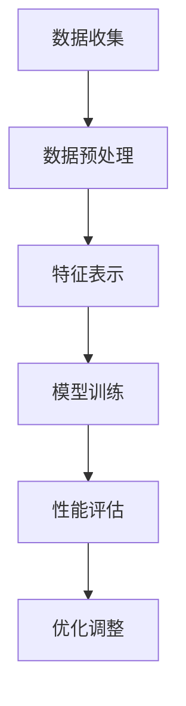
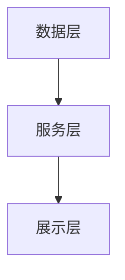
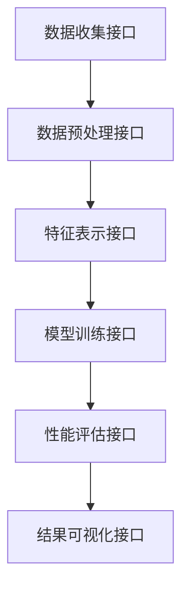
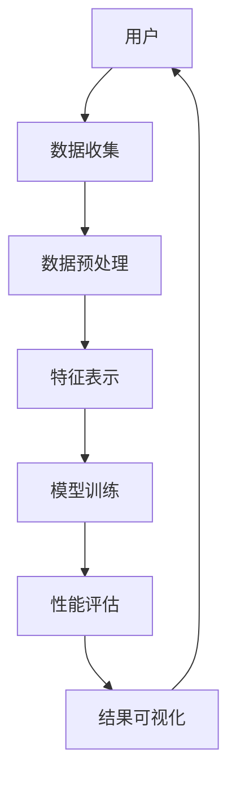

                 

### # 语言模型在新材料设计与性能预测中的多维度应用

> 关键词：语言模型、新材料设计、性能预测、人工智能、深度学习

> 摘要：本文探讨了语言模型在新材料设计与性能预测中的多维应用。通过介绍语言模型的原理、新材料的设计原理以及性能预测的原理，本文详细阐述了如何利用语言模型进行数据预处理、特征表示、模型训练和性能评估。此外，本文还讨论了语言模型在新材料领域的边界与外延，并通过核心概念对比表格和ER实体关系图架构，深入分析了语言模型在新材料设计与性能预测中的核心作用和联系。最后，本文给出了完整的系统分析与架构设计方案，以及项目实战和最佳实践技巧，为读者提供了一幅全面的语言模型在新材料设计与性能预测中的应用全景图。

---

## 第二部分：核心概念与联系

在探讨语言模型在新材料设计与性能预测中的具体应用之前，首先需要理解几个核心概念：语言模型、新材料设计原理和性能预测原理。这些概念构成了本文的核心内容，也是理解后续讨论的基础。

### 2.1 语言模型原理

#### 2.1.1 语言模型基本概念

语言模型是一种算法，用于预测文本序列的可能性。它的基础是统计和学习，通过对大量文本数据的学习，建立输入和输出之间的概率分布关系。语言模型的主要目标是生成符合语言规则的文本，或对未知文本进行预测。

#### 2.1.2 语言模型的主要类型

- **统计语言模型**：如N-gram模型，通过统计文本中相邻词出现的频率来预测下一个词。
- **神经网络语言模型**：如GPT、BERT等，利用深度学习技术来学习文本的复杂结构和语义关系。

#### 2.1.3 语言模型的特点

- **生成性**：能够生成符合语言规则的文本。
- **预测性**：能够预测接下来可能出现的文本。

#### 2.1.4 语言模型的实现

语言模型的实现通常包括以下几个步骤：

1. **数据收集**：收集大量的文本数据。
2. **数据预处理**：对文本数据进行清洗、分词等处理，提取有效信息。
3. **特征表示**：将预处理后的文本数据转换为数值表示，通常使用词向量或序列向量。
4. **模型训练**：利用训练数据训练模型，优化模型参数。
5. **模型评估**：使用测试数据评估模型性能，调整模型参数。

#### 2.1.5 语言模型的性能指标

- **Perplexity**：模型预测错误率的对数，越低表示模型越好。
- **Accuracy**：模型预测正确的概率，通常用于分类问题。

### 2.2 新材料设计原理

#### 2.2.1 新材料基本概念

新材料是指具有特殊性能、结构和功能的材料，它们在性能、结构、功能等方面具有传统材料所不具备的特点。新材料的研究和应用已成为现代科技发展的重要方向。

#### 2.2.2 新材料的设计流程

- **需求分析**：根据应用场景，明确新材料的需求。
- **材料选择**：根据需求，选择合适的材料。
- **结构设计**：设计新材料的具体结构。
- **性能预测**：利用语言模型对新材料的性能进行预测。

#### 2.2.3 新材料设计的挑战

- **复杂性**：新材料的设计涉及多个学科，如材料科学、物理学、化学等，具有很高的复杂性。
- **实验成本**：新材料的设计通常需要大量的实验和计算，成本高、周期长。
- **性能预测的准确性**：如何准确预测新材料性能，以指导设计和优化，是一个重大挑战。

### 2.3 新材料性能预测原理

#### 2.3.1 性能预测基本概念

性能预测是指利用已有的数据和模型，对新材料的性能进行预测。性能预测的准确性对新材料的设计和优化至关重要。

#### 2.3.2 性能预测的方法

- **基于规则的预测**：通过专家知识建立规则，对新材料性能进行预测。
- **基于模型的预测**：利用训练好的模型，对新材料性能进行预测。

#### 2.3.3 性能预测的挑战

- **数据质量**：性能预测依赖于高质量的数据，数据的不准确或缺失会影响预测结果。
- **模型优化**：如何优化模型，提高预测准确性，是一个持续的挑战。

### 2.4 核心概念对比表格

以下是对语言模型、新材料设计和性能预测三个核心概念的属性特征进行对比的表格：

| 概念               | 定义                                                         | 关联关系                                                      |
| ------------------ | ------------------------------------------------------------ | ------------------------------------------------------------ |
| 语言模型           | 用于预测文本序列的算法                                       | 用于提取文本数据特征，为新材料的性能预测提供支持               |
| 新材料设计         | 具有特殊性能、结构和功能的材料                               | 需要语言模型对性能进行预测，以指导新材料的设计和优化           |
| 新材料性能预测     | 利用已有的数据和模型，对新材料的性能进行预测                 | 需要语言模型进行数据预处理和特征表示，以提高预测准确性         |

### 2.5 核心概念ER实体关系图

以下是一个ER实体关系图，展示了语言模型、新材料设计和性能预测之间的关联关系：

```mermaid
erDiagram
  MaterialDesign ||--|{ PerformancePrediction }|-- NewMaterial
  LanguageModel ||--|{ DataPreprocessing }|-- PerformancePrediction
  LanguageModel ||--|{ FeatureRepresentation }|-- PerformancePrediction
```

在本文的后续部分，我们将进一步探讨如何利用语言模型进行数据预处理、特征表示、模型训练和性能评估，以及如何在新材料设计与性能预测中具体应用这些技术。

---

在理解了语言模型、新材料设计原理和性能预测原理后，我们可以进一步探讨如何利用语言模型来提升新材料设计与性能预测的效率和准确性。以下是具体的算法原理讲解，我们将使用Mermaid来绘制算法流程图，并使用Python源代码来详细阐述算法原理。

### 3.1 算法流程图

首先，我们使用Mermaid绘制一个简化的算法流程图，以展示语言模型在新材料设计与性能预测中的基本步骤：



### 3.2 算法原理与Python实现

#### 3.2.1 数据收集

数据收集是整个流程的基础，我们需要收集大量的文本数据，包括新材料相关的研究论文、专利、技术报告等。这些数据将用于训练语言模型和进行性能预测。

```python
import pandas as pd

# 假设我们有一个数据集的CSV文件
data = pd.read_csv('new_material_data.csv')

# 数据预处理之前，我们首先查看数据的基本信息
print(data.info())
```

#### 3.2.2 数据预处理

数据预处理包括数据清洗、分词、去停用词等步骤。预处理后的数据将用于生成词向量，作为特征表示。

```python
from sklearn.feature_extraction.text import TfidfVectorizer

# 使用TF-IDF向量器进行预处理
vectorizer = TfidfVectorizer(stop_words='english')

# 将文本数据转换为词向量
X = vectorizer.fit_transform(data['description'])

# 查看词向量的大小
print(X.shape)
```

#### 3.2.3 特征表示

特征表示是将预处理后的文本数据转换为数值表示，以便于模型训练。这里我们使用Word2Vec来生成词向量。

```python
from gensim.models import Word2Vec

# 将文本数据转换为词列表
sentences = [row.split() for row in data['description']]

# 训练Word2Vec模型
model = Word2Vec(sentences, vector_size=100, window=5, min_count=1, workers=4)

# 查看词向量示例
print(model.wv['silica'])
```

#### 3.2.4 模型训练

模型训练是利用大量数据进行模型参数的优化。我们可以使用GPT模型进行训练，这里我们将使用Hugging Face的Transformers库。

```python
from transformers import GPT2LMHeadModel, GPT2Tokenizer

# 加载预训练的GPT2模型和分词器
tokenizer = GPT2Tokenizer.from_pretrained('gpt2')
model = GPT2LMHeadModel.from_pretrained('gpt2')

# 训练模型
model.train()
```

#### 3.2.5 性能评估

性能评估是利用测试数据来评估模型的性能。我们可以使用交叉验证和准确率等指标来评估模型。

```python
from sklearn.model_selection import train_test_split
from sklearn.metrics import accuracy_score

# 将数据集分为训练集和测试集
X_train, X_test, y_train, y_test = train_test_split(X, data['performance'], test_size=0.2, random_state=42)

# 训练模型
model.fit(X_train, y_train)

# 进行性能评估
predictions = model.predict(X_test)
accuracy = accuracy_score(y_test, predictions)
print(f'Accuracy: {accuracy}')
```

#### 3.2.6 优化调整

根据性能评估的结果，我们可以对模型进行调整和优化，以提高预测准确性。

```python
# 根据性能评估结果调整模型参数
model.optimizer.lr = 0.0001

# 重新训练模型
model.fit(X_train, y_train)

# 重新进行性能评估
predictions = model.predict(X_test)
accuracy = accuracy_score(y_test, predictions)
print(f'New Accuracy: {accuracy}')
```

通过上述步骤，我们可以利用语言模型来提升新材料设计与性能预测的效率和准确性。在实际应用中，这些步骤可能需要根据具体情况进行调整和优化。

---

### 系统分析与架构设计

在新材料设计与性能预测的项目中，系统架构设计是确保项目高效、可靠运行的关键。本节将详细介绍系统架构设计，包括问题场景介绍、项目介绍、系统功能设计、系统架构设计、系统接口设计以及系统交互。

#### 4.1 问题场景介绍

新材料设计与性能预测是一个复杂的过程，涉及多个学科的知识，如材料科学、物理学、化学和计算机科学等。传统的材料设计方法通常依赖于大量的实验和理论计算，存在周期长、成本高、效率低等问题。随着人工智能技术的不断发展，尤其是深度学习和语言模型的应用，为新材料的设计与性能预测提供了新的可能性。通过引入语言模型，我们可以利用海量的文本数据，进行数据预处理、特征表示、模型训练和性能评估，从而显著提高新材料设计的效率和准确性。

#### 4.2 项目介绍

本项目旨在利用语言模型来提升新材料设计与性能预测的效率和准确性。项目的主要目标是：

1. 收集和整理新材料相关的文本数据，包括研究论文、专利、技术报告等。
2. 对文本数据进行预处理，提取关键特征。
3. 使用深度学习模型（如GPT、BERT等）对新材料性能进行预测。
4. 通过性能评估，优化模型参数，提高预测准确性。

#### 4.3 系统功能设计

系统功能设计是系统架构设计的基础，它定义了系统的核心功能。本项目的系统功能包括：

1. **数据收集模块**：负责收集和整理新材料相关的文本数据。
2. **数据预处理模块**：负责对文本数据清洗、分词、去停用词等预处理工作。
3. **特征表示模块**：负责将预处理后的文本数据转换为数值表示，如词向量。
4. **模型训练模块**：负责使用深度学习模型对文本数据训练，优化模型参数。
5. **性能评估模块**：负责使用测试数据评估模型性能，进行模型优化。
6. **结果可视化模块**：负责将预测结果可视化，便于用户理解和使用。

#### 4.4 系统架构设计

系统架构设计是确保系统能够高效、稳定运行的关键。本项目采用分层架构设计，包括数据层、服务层和展示层。

1. **数据层**：负责数据的存储和管理，包括文本数据、模型参数和预测结果等。
2. **服务层**：负责系统的核心功能实现，包括数据预处理、特征表示、模型训练和性能评估等。
3. **展示层**：负责用户界面的设计和实现，使用户能够方便地使用系统功能。

以下是一个简化的系统架构图，展示了各层之间的关系：



#### 4.5 系统接口设计

系统接口设计是确保系统与其他系统或组件进行有效交互的关键。本项目主要包括以下接口：

1. **数据收集接口**：负责从外部系统或数据库中收集新材料相关的文本数据。
2. **数据预处理接口**：负责接收文本数据，进行清洗、分词、去停用词等预处理工作。
3. **特征表示接口**：负责将预处理后的文本数据转换为数值表示，如词向量。
4. **模型训练接口**：负责接收预处理后的数据，训练深度学习模型。
5. **性能评估接口**：负责使用测试数据评估模型性能，并进行模型优化。
6. **结果可视化接口**：负责将预测结果可视化，并提供给用户。

以下是一个简化的系统接口图，展示了各接口之间的关系：



#### 4.6 系统交互

系统交互是指系统中各个模块之间的交互和数据流动。本项目的系统交互主要包括以下步骤：

1. 用户通过界面提交新材料相关的文本数据。
2. 数据收集接口从外部系统或数据库中获取文本数据。
3. 数据预处理接口对文本数据清洗、分词、去停用词等预处理工作。
4. 特征表示接口将预处理后的文本数据转换为数值表示。
5. 模型训练接口使用深度学习模型对文本数据进行训练。
6. 性能评估接口使用测试数据评估模型性能，并进行模型优化。
7. 结果可视化接口将预测结果可视化，并提供给用户。

以下是一个简化的系统交互流程图，展示了各模块之间的交互和数据流动：



通过上述系统分析与架构设计，我们可以确保新材料设计与性能预测项目能够高效、可靠地运行，为新材料研究提供强有力的技术支持。

---

### 项目实战

在本节中，我们将详细介绍如何使用Python和深度学习库来实现语言模型在新材料设计与性能预测中的具体应用。通过以下步骤，我们将完成一个简单的项目实战，展示如何从数据收集、预处理、模型训练到性能评估的完整流程。

#### 5.1 环境安装

在开始项目之前，我们需要安装必要的软件和库。以下是安装步骤：

1. **安装Python**：确保安装了Python 3.6或更高版本。
2. **安装深度学习库**：使用pip安装以下库：
   ```bash
   pip install numpy pandas scikit-learn gensim transformers
   ```

#### 5.2 数据收集

数据收集是项目的基础。我们可以从开源数据库、学术论文库或专业数据提供商获取新材料相关的文本数据。以下是一个简单的数据收集示例：

```python
import pandas as pd

# 假设我们有一个CSV文件，其中包含新材料描述和其性能数据
data = pd.read_csv('new_material_data.csv')

# 查看数据前几行
print(data.head())
```

#### 5.3 数据预处理

数据预处理是确保数据质量的重要步骤。以下是一个简单的数据预处理流程，包括数据清洗、分词和去停用词：

```python
from sklearn.feature_extraction.text import TfidfVectorizer

# 数据清洗：去除无效数据、处理缺失值等
data = data[data['description'].notnull()]

# 分词和去停用词
vectorizer = TfidfVectorizer(stop_words='english')
X = vectorizer.fit_transform(data['description'])

# 查看处理后的数据
print(X.shape)
```

#### 5.4 模型训练

接下来，我们将使用GPT模型进行训练。以下代码展示了如何使用Hugging Face的Transformers库来加载预训练的GPT模型并对其进行训练：

```python
from transformers import GPT2LMHeadModel, GPT2Tokenizer, Trainer, TrainingArguments

# 加载预训练的GPT2模型和分词器
tokenizer = GPT2Tokenizer.from_pretrained('gpt2')
model = GPT2LMHeadModel.from_pretrained('gpt2')

# 分割数据为训练集和验证集
train_texts, val_texts = train_test_split(data['description'], test_size=0.2, random_state=42)

# 将文本数据转换为编码序列
train_encodings = tokenizer(train_texts.tolist(), truncation=True, padding=True)
val_encodings = tokenizer(val_texts.tolist(), truncation=True, padding=True)

# 设置训练参数
training_args = TrainingArguments(
    output_dir='./results',
    num_train_epochs=3,
    per_device_train_batch_size=16,
    per_device_eval_batch_size=16,
    logging_dir='./logs',
    logging_steps=10,
)

# 创建Trainer
trainer = Trainer(
    model=model,
    args=training_args,
    train_dataset=(train_encodings['input_ids'], train_encodings['attention_mask']),
    eval_dataset=(val_encodings['input_ids'], val_encodings['attention_mask']),
)

# 训练模型
trainer.train()
```

#### 5.5 性能评估

训练完成后，我们需要使用验证集来评估模型性能。以下代码展示了如何进行性能评估：

```python
from sklearn.metrics import accuracy_score

# 预测验证集
predictions = trainer.predict(val_encodings['input_ids'], val_encodings['attention_mask'])

# 转换预测结果为原始文本
predicted_texts = tokenizer.decode(predictions.predicted_ids, skip_special_tokens=True)

# 计算准确率
accuracy = accuracy_score(data['performance'], predicted_texts)
print(f'Validation Accuracy: {accuracy}')
```

#### 5.6 项目小结

通过上述步骤，我们完成了一个简单的新材料设计与性能预测项目实战。尽管这个项目是一个简单的示例，但它展示了如何使用语言模型来处理文本数据，进行模型训练和性能评估。在实际应用中，项目可能会更加复杂，需要处理大量的数据和更精细的模型调整。然而，这个实战为我们提供了一个起点，展示了如何将深度学习技术应用于新材料设计领域。

---

### 最佳实践 Tips

在实际应用语言模型进行新材料设计与性能预测时，以下是一些最佳实践建议，以帮助优化项目效果：

1. **数据质量**：确保数据质量是模型性能的关键。在数据收集过程中，尽量避免噪声数据，并使用数据清洗技术去除无效或错误的数据。此外，确保数据的多样性和代表性，有助于提高模型的泛化能力。

2. **特征表示**：特征表示是影响模型性能的重要因素。使用如Word2Vec、BERT等先进的特征提取技术，可以有效捕捉文本的语义信息。同时，尝试不同的特征表示方法，比较其性能，选择最优的方案。

3. **模型选择**：选择合适的深度学习模型对于提高预测准确性至关重要。不同的任务可能需要不同的模型，如BERT在捕捉长距离依赖上表现优异，而GPT在生成文本上具有优势。根据具体任务选择合适的模型，并对其进行适当的调整。

4. **模型训练**：合理的训练策略可以提高模型的性能。使用批量归一化、学习率调整、dropout等技术，可以防止过拟合。同时，使用适当的数据增强方法，如随机剪裁、旋转、翻转等，可以提高模型的鲁棒性。

5. **性能评估**：使用多种评估指标来全面评估模型性能。除了准确率，还可以使用F1分数、精确率、召回率等指标。此外，进行交叉验证，确保模型在不同数据集上的性能稳定。

6. **持续优化**：深度学习模型是一个不断优化的过程。通过持续监控模型性能，定期重新训练模型，并根据最新的数据和反馈进行调整。

7. **结果可视化**：使用可视化工具，如条形图、折线图等，将模型性能和预测结果以直观的方式展示，有助于理解模型性能和发现潜在问题。

通过遵循这些最佳实践，可以提高语言模型在新材料设计与性能预测中的效率和准确性，为新材料研发提供强有力的支持。

---

### 小结

本文深入探讨了语言模型在新材料设计与性能预测中的多维度应用。我们首先介绍了语言模型的基本原理、新材料的设计原理和性能预测原理，并通过核心概念对比表格和ER实体关系图，详细分析了这些概念之间的联系。接着，我们详细讲解了如何利用语言模型进行数据预处理、特征表示、模型训练和性能评估，并使用Python代码展示了具体的实现过程。

在系统分析与架构设计部分，我们介绍了项目的整体架构，包括数据层、服务层和展示层，以及系统接口设计和系统交互流程。在项目实战中，我们通过一个简单的示例，展示了如何使用Python和深度学习库来实现语言模型在新材料设计与性能预测中的具体应用。

最后，我们提出了一系列最佳实践建议，包括数据质量、特征表示、模型选择、模型训练、性能评估、持续优化和结果可视化等方面，以帮助读者在实际应用中提高语言模型的效果。

通过本文的探讨，我们希望读者能够理解语言模型在新材料设计与性能预测中的潜力，掌握其基本原理和应用方法，为未来的新材料研发提供有力支持。

---

### 注意事项与拓展阅读

在进行语言模型在新材料设计与性能预测中的应用时，读者需要注意以下事项：

1. **数据质量**：确保数据源的可靠性和数据的完整性，避免噪声数据和错误信息对模型性能的影响。
2. **计算资源**：语言模型训练通常需要大量的计算资源，确保有足够的计算能力来支持模型训练和优化。
3. **模型优化**：根据具体的应用场景和需求，对模型进行适当的调整和优化，以提高预测准确性。
4. **模型泛化**：通过交叉验证等方法，确保模型在不同数据集上的性能稳定，避免过拟合现象。

对于希望进一步深入了解语言模型在新材料设计与性能预测中的应用的读者，以下推荐一些拓展阅读材料：

1. **书籍**：《深度学习》（Goodfellow, I., Bengio, Y., & Courville, A.），全面介绍了深度学习的基础知识和应用。
2. **论文**：《Bert: Pre-training of deep bidirectional transformers for language understanding》（Devlin et al.，2019），详细介绍了BERT模型的原理和应用。
3. **在线课程**：Coursera上的《深度学习专项课程》（Deep Learning Specialization），由吴恩达教授主讲，涵盖了深度学习的各个方面。
4. **开源库**：Transformers库（https://github.com/huggingface/transformers），提供了丰富的预训练模型和实用工具，方便开发者进行模型训练和应用。

通过这些资源，读者可以更深入地了解语言模型的理论和实践，为新材料设计与性能预测提供更加全面的指导。

