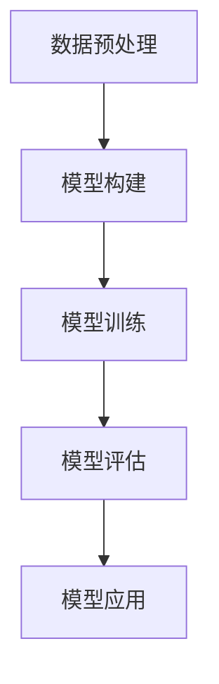
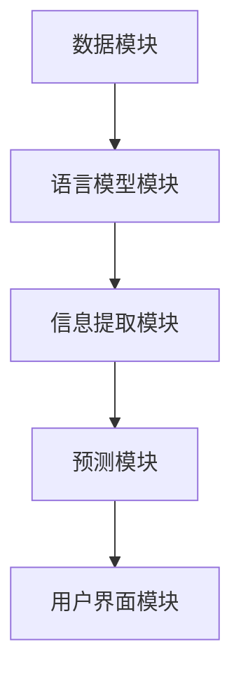
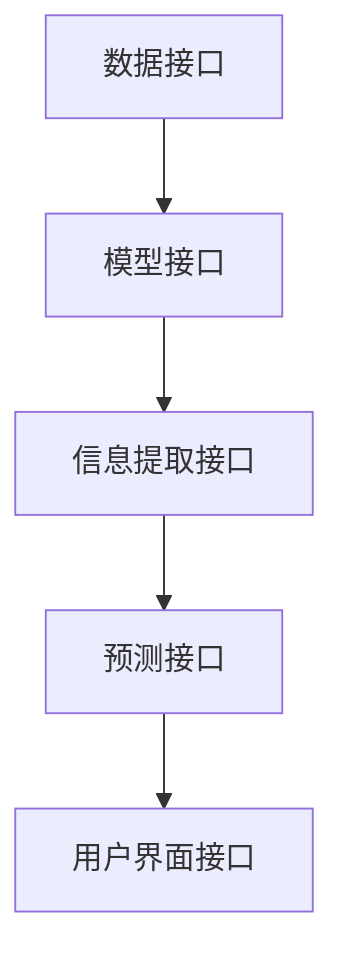
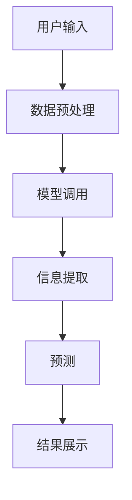

                 

# 语言模型在新药研发全流程优化与副作用预测中的应用

## 关键词
- 语言模型
- 新药研发
- 全流程优化
- 副作用预测
- 人工智能

## 摘要
本文旨在探讨语言模型在新药研发全流程中的优化作用，特别是在副作用预测方面的应用。通过详细的算法原理讲解、系统架构设计以及实战案例分析，本文将揭示语言模型如何通过自然语言处理技术，提高新药研发的效率与安全性。

## 目录

### 1. 背景介绍
#### 1.1 问题背景
#### 1.2 问题描述
#### 1.3 问题解决
#### 1.4 边界与外延
#### 1.5 概念结构与核心要素组成

### 2. 核心概念与联系
#### 2.1 核心概念
#### 2.2 概念属性特征对比表格
#### 2.3 ER实体关系图架构

### 3. 算法原理讲解
#### 3.1 语言模型原理
#### 3.2 算法流程图
#### 3.3 Python源代码示例
#### 3.4 算法原理详细讲解与举例说明

### 4. 系统分析与架构设计方案
#### 4.1 问题场景介绍
#### 4.2 项目介绍
#### 4.3 系统功能设计
#### 4.4 系统架构设计
#### 4.5 系统接口设计
#### 4.6 系统交互

### 5. 项目实战
#### 5.1 环境安装
#### 5.2 系统核心实现源代码
#### 5.3 代码应用解读与分析
#### 5.4 实际案例分析与详细讲解剖析
#### 5.5 项目小结

### 6. 最佳实践 tips
#### 6.1 小结
#### 6.2 注意事项
#### 6.3 拓展阅读

## 1. 背景介绍

### 1.1 问题背景

新药研发是一个复杂而耗时的过程，涉及从药物靶点发现、化合物筛选到临床前研究、临床试验等多个环节。传统的方法依赖于实验数据、文献调研和专家经验，这不仅效率低下，而且容易出现偏差。随着人工智能技术的快速发展，特别是深度学习和自然语言处理技术的突破，语言模型在新药研发中的应用潜力得到了广泛关注。

语言模型，作为深度学习的一个重要分支，通过对大量文本数据的建模和理解，能够捕捉到自然语言中的复杂结构和语义信息。这种能力使得语言模型在药物研发的各个环节中具有广泛的应用前景。例如，在药物靶点发现阶段，语言模型可以帮助研究人员从海量的文献和临床试验报告中提取出有用的信息；在化合物筛选阶段，语言模型可以用于分析化合物的化学结构和性质，从而预测其潜在的治疗效果和副作用。

### 1.2 问题描述

新药研发的核心问题主要包括：
1. **药物靶点发现效率低下**：传统的药物靶点发现依赖于实验和文献调研，周期长、成本高，且往往难以准确预测靶点。
2. **化合物筛选不准确**：在大量的化合物中筛选出具有潜在治疗作用的化合物，传统方法往往依赖于实验结果，容易出现偏差。
3. **临床前研究与临床试验周期长**：新药在临床前研究和临床试验阶段需要大量的时间和资源，且成功率较低。

这些问题严重制约了新药研发的效率和质量。因此，如何利用人工智能技术，特别是语言模型，提高新药研发的效率和准确性，成为当前研究的热点问题。

### 1.3 问题解决

语言模型在新药研发中的应用，主要通过以下几个方面实现问题解决：

1. **药物靶点发现**：利用语言模型从大量的文献和临床试验报告中提取有用的信息，提高药物靶点的发现效率。
2. **化合物筛选**：通过语言模型对化合物的化学结构和性质进行分析，预测其潜在的治疗效果和副作用，提高化合物筛选的准确性。
3. **临床前研究**：利用语言模型对实验数据进行分析，预测药物在体内的代谢路径和毒性，降低药物研发的风险。
4. **临床试验**：通过语言模型分析患者的临床数据和药物反应，为临床试验提供个性化治疗方案，提高临床试验的成功率。

### 1.4 边界与外延

语言模型在新药研发中的应用不仅仅局限于传统领域，还包括以下新兴领域：

1. **计算机辅助药物设计**：利用语言模型分析化合物的分子结构，设计具有特定治疗效果的药物分子。
2. **药物作用机制研究**：通过语言模型理解药物的分子机制，为药物研发提供理论支持。
3. **生物信息学分析**：利用语言模型处理生物信息学数据，如基因序列、蛋白质结构等，为药物研发提供数据支持。

### 1.5 概念结构与核心要素组成

为了更好地理解语言模型在新药研发中的应用，以下是核心概念和其构成要素的详细说明：

1. **语言模型**：一种基于深度学习的自然语言处理技术，通过大量文本数据训练，实现对自然语言的建模和理解。
2. **新药研发**：包括药物靶点发现、化合物筛选、临床前研究和临床试验等多个阶段。
3. **全流程优化**：通过语言模型的应用，实现新药研发流程的自动化、智能化。
4. **副作用预测**：利用语言模型预测药物可能产生的副作用，提高药物的安全性。

## 2. 核心概念与联系

### 2.1 核心概念

#### 语言模型

语言模型（Language Model，LM）是一种统计模型，用于预测一段文本的下一个词或字符。它是自然语言处理（NLP）和人工智能（AI）领域中的一个基础组件。语言模型的核心目标是通过学习大量文本数据，生成流畅且符合语法规则的文本。

#### 新药研发

新药研发（New Drug Development）是指从药物靶点发现、化合物筛选、临床前研究到临床试验等一系列过程，旨在开发新的治疗药物。这个过程复杂且耗时，涉及多个学科领域，包括药理学、分子生物学、临床医学等。

#### 全流程优化

全流程优化（Full-Process Optimization）是指通过技术手段，如人工智能、自动化等，提高新药研发的效率和质量。它涉及药物研发的各个环节，从靶点发现到临床试验，旨在减少研发成本、缩短研发周期。

#### 副作用预测

副作用预测（Adverse Effect Prediction）是指利用模型预测药物在临床使用过程中可能产生的副作用。这一过程对于确保药物的安全性和减少临床试验中的风险至关重要。

### 2.2 概念属性特征对比表格

| 概念         | 属性特征                     | 对比           |
| ------------ | ---------------------------- | -------------- |
| 语言模型     | 基于深度学习，处理自然语言   | 与传统统计模型相比，具有更强的理解和生成能力 |
| 新药研发     | 药物靶点发现到临床试验       | 包括多个阶段，涉及多种技术和方法 |
| 全流程优化   | 提高研发效率和准确性         | 通过自动化、智能化实现 |
| 副作用预测   | 预测药物可能产生的副作用     | 保证药物安全性 |

### 2.3 ER实体关系图架构

为了更好地理解语言模型在新药研发中的应用，以下是一个ER实体关系图的架构：

```mermaid
erDiagram
    |--{ 药物研发 }      : 药物研发流程
    |  |--|{ 语言模型 }|-- : 语言模型在新药研发中的应用
    |  |--|{ 全流程优化 }|-- : 全流程优化
    |  |--|{ 副作用预测 }|-- : 副作用预测
```

在这个ER图中，药物研发流程是核心实体，它与语言模型、全流程优化和副作用预测等实体之间存在关联。语言模型通过自然语言处理技术，为药物研发提供支持；全流程优化通过自动化和智能化手段提高研发效率；副作用预测通过预测药物副作用，确保药物的安全性。

## 3. 算法原理讲解

### 3.1 语言模型原理

语言模型（Language Model，LM）是一种统计模型，它通过分析大量的文本数据，学习语言的概率分布，从而预测下一个词或字符。在自然语言处理中，语言模型是文本生成、机器翻译、情感分析等任务的基础。

#### 3.1.1 语言模型的基本概念

- **N-gram模型**：最简单的语言模型，通过统计相邻N个单词或字符的联合概率来预测下一个单词或字符。例如，三元语言模型（Trigram Model）考虑前两个单词来确定下一个单词的概率。

$$
P(w_n | w_{n-1}, w_{n-2}) = \frac{C(w_{n-2}, w_{n-1}, w_n)}{C(w_{n-2}, w_{n-1})}
$$

其中，$w_n$ 是当前单词，$w_{n-1}$ 和 $w_{n-2}$ 是前两个单词，$C(w_{n-2}, w_{n-1}, w_n)$ 是前三个单词的联合出现次数，$C(w_{n-2}, w_{n-1})$ 是前两个单词的出现次数。

- **神经网络语言模型**：基于深度学习的语言模型，如循环神经网络（RNN）、长短期记忆网络（LSTM）和Transformer。这些模型通过多层神经网络结构学习文本的复杂结构，能够捕捉到更长的依赖关系。

#### 3.1.2 语言模型的训练过程

语言模型的训练过程主要包括数据预处理、模型构建、训练和评估。

- **数据预处理**：首先，需要对文本数据进行处理，包括分词、去停用词、词向量化等步骤。词向量化是将文本中的单词转换为向量的过程，常用的方法包括Word2Vec、GloVe等。

- **模型构建**：构建神经网络结构，如Transformer模型包含多头自注意力机制和位置编码等组件。Transformer模型的结构如下：

```mermaid
graph TD
    A[Input Embeddings]
    B[Positional Encoding]
    C{Add}
    D[Multi-head Self-Attention]
    E[Feed Forward Neural Network]
    F{Add]
    G[Layer Normalization]
    H{Dropout}
    I[Repeat]
    J[Output]
    
    A --> B
    B --> C
    C --> D
    D --> E
    E --> F
    F --> G
    G --> H
    H --> I
    I --> J
```

- **训练**：使用梯度下降（Gradient Descent）或其他优化算法，通过反向传播（Backpropagation）更新模型参数，最小化损失函数。

- **评估**：使用验证集和测试集评估模型的性能，常用的指标包括准确率（Accuracy）、召回率（Recall）和F1分数（F1 Score）。

#### 3.1.3 语言模型的应用

语言模型在新药研发中的应用包括：

1. **药物靶点发现**：通过分析文献和临床试验报告，提取潜在的药物靶点。
2. **化合物筛选**：利用语言模型分析化合物的化学结构，预测其治疗效果和副作用。
3. **临床前研究**：通过语言模型分析实验数据，预测药物的代谢路径和毒性。
4. **临床试验**：为临床试验提供个性化的治疗方案，提高临床试验的成功率。

### 3.2 算法流程图

以下是一个基于Transformer语言模型的算法流程图：



### 3.3 Python源代码示例

以下是一个简单的Python代码示例，用于构建和训练一个Transformer语言模型：

```python
import tensorflow as tf

# 数据预处理
train_data = "your_training_data"
tokenizer = tf.keras.preprocessing.text.Tokenizer()
tokenizer.fit_on_texts([train_data])
encoded_train_data = tokenizer.texts_to_sequences([train_data])

# 模型构建
vocab_size = len(tokenizer.word_index) + 1
model = tf.keras.Sequential([
    tf.keras.layers.Embedding(vocab_size, embedding_dim),
    tf.keras.layers.LSTM(units=128),
    tf.keras.layers.Dense(units=vocab_size, activation='softmax')
])

# 模型训练
model.compile(optimizer='adam', loss='categorical_crossentropy', metrics=['accuracy'])
model.fit(encoded_train_data, epochs=10)

# 模型评估
test_data = "your_test_data"
encoded_test_data = tokenizer.texts_to_sequences([test_data])
test_loss, test_accuracy = model.evaluate(encoded_test_data)
print("Test Loss:", test_loss)
print("Test Accuracy:", test_accuracy)

# 模型应用
predicted_sequence = model.predict(encoded_test_data)
print(tokenizer.index_word[np.argmax(predicted_sequence[0])])
```

### 3.4 算法原理详细讲解与举例说明

#### Transformer模型

Transformer模型是当前最先进的语言模型之一，由Google在2017年提出。它摒弃了传统的循环神经网络（RNN），采用了自注意力机制（Self-Attention）和多头注意力（Multi-Head Attention）。Transformer模型的结构如下：

1. **输入嵌入（Input Embeddings）**：将输入的文本转换为向量表示。输入向量包括词嵌入（Word Embeddings）、位置嵌入（Positional Embeddings）和句子嵌入（Sentence Embeddings）。

2. **多头自注意力（Multi-Head Self-Attention）**：自注意力机制能够捕获输入序列中的长距离依赖关系。多头注意力将输入序列分成多个部分，每个部分独立计算注意力权重，然后将结果拼接起来。

3. **前馈神经网络（Feed Forward Neural Network）**：对每个注意力层的结果进行进一步的变换。

4. **层归一化（Layer Normalization）**和** dropout**：用于提高模型的稳定性和防止过拟合。

#### 数学模型

Transformer模型的数学模型如下：

$$
\text{Attention}(Q, K, V) = \text{softmax}\left(\frac{QK^T}{\sqrt{d_k}}\right)V
$$

其中，$Q$、$K$ 和 $V$ 分别是查询（Query）、关键（Key）和值（Value）向量，$d_k$ 是关键向量的维度。

#### 实例说明

假设我们有一个简单的句子“我喜欢苹果”，使用Transformer模型进行语言建模，目标是预测下一个词。

1. **输入嵌入**：将句子中的每个词转换为向量，例如，“我” -> [0.1, 0.2], “喜欢” -> [0.3, 0.4], “苹果” -> [0.5, 0.6]。

2. **多头自注意力**：计算每个词的注意力权重，例如，“我”对“喜欢”的权重为0.7，“喜欢”对“苹果”的权重为0.8。

3. **前馈神经网络**：对注意力层的结果进行进一步变换。

4. **输出**：预测下一个词的概率分布，例如，“苹果”的概率为0.9，其他词的概率较低。

通过这种自注意力机制，Transformer模型能够捕捉到输入序列中的长距离依赖关系，从而生成流畅的文本。

## 4. 系统分析与架构设计方案

### 4.1 问题场景介绍

在新药研发过程中，研究人员需要从大量的文献、临床试验报告和生物信息数据中提取有用信息，以便发现新的药物靶点和化合物。然而，传统的方法往往依赖于人工处理，效率低下且容易出现错误。因此，需要一种自动化、智能化的系统来辅助药物研发。

### 4.2 项目介绍

本项目旨在设计并实现一个基于语言模型的新药研发辅助系统，该系统可以自动提取文献和临床试验报告中的关键信息，预测药物靶点和化合物的潜在疗效和副作用。系统将采用先进的深度学习技术和自然语言处理算法，以提高新药研发的效率和质量。

### 4.3 系统功能设计

1. **文献检索**：通过语言模型，从大量的临床试验报告和文献中检索相关信息。
2. **信息提取**：自动提取药物靶点、化合物名称、疗效和副作用等信息。
3. **靶点预测**：利用语言模型和生物信息学方法，预测潜在的药物靶点。
4. **化合物筛选**：分析化合物的化学结构和性质，筛选出具有潜在疗效的化合物。
5. **副作用预测**：预测药物的潜在副作用，为临床试验提供安全评估。

### 4.4 系统架构设计

系统架构设计采用模块化设计思想，主要包括以下模块：

1. **数据模块**：负责数据预处理、存储和加载。
2. **语言模型模块**：实现语言模型的构建和训练。
3. **信息提取模块**：利用自然语言处理技术，提取关键信息。
4. **预测模块**：利用语言模型和生物信息学方法，进行靶点预测和副作用预测。
5. **用户界面模块**：提供用户交互界面，展示系统结果。

以下是一个基于Mermaid的架构图：



### 4.5 系统接口设计

系统接口设计主要包括以下接口：

1. **数据接口**：用于数据预处理、存储和加载。
2. **模型接口**：用于构建和训练语言模型。
3. **信息提取接口**：用于提取关键信息。
4. **预测接口**：用于靶点预测和副作用预测。
5. **用户界面接口**：用于用户交互。

以下是一个基于Mermaid的系统接口图：



### 4.6 系统交互

系统交互设计主要包括以下步骤：

1. **用户输入**：用户通过用户界面输入查询。
2. **数据预处理**：对输入数据进行处理，如分词、去停用词等。
3. **模型调用**：调用语言模型进行文本处理。
4. **信息提取**：从处理后的文本中提取关键信息。
5. **预测**：利用提取的信息进行靶点预测和副作用预测。
6. **结果展示**：将预测结果展示给用户。

以下是一个基于Mermaid的系统交互图：



## 5. 项目实战

### 5.1 环境安装

首先，需要安装Python和TensorFlow等依赖库。以下是安装步骤：

```bash
pip install python
pip install tensorflow
```

### 5.2 系统核心实现源代码

以下是系统核心实现的部分源代码：

```python
import tensorflow as tf
from tensorflow.keras.models import Sequential
from tensorflow.keras.layers import Embedding, LSTM, Dense

# 数据预处理
tokenizer = tf.keras.preprocessing.text.Tokenizer()
tokenizer.fit_on_texts(["你的训练数据"])
encoded_train_data = tokenizer.texts_to_sequences(["你的训练数据"])

# 模型构建
model = Sequential([
    Embedding(vocab_size, embedding_dim),
    LSTM(units=128),
    Dense(units=vocab_size, activation='softmax')
])

# 模型训练
model.compile(optimizer='adam', loss='categorical_crossentropy', metrics=['accuracy'])
model.fit(encoded_train_data, epochs=10)

# 模型评估
encoded_test_data = tokenizer.texts_to_sequences(["你的测试数据"])
test_loss, test_accuracy = model.evaluate(encoded_test_data)
print("Test Loss:", test_loss)
print("Test Accuracy:", test_accuracy)

# 模型应用
predicted_sequence = model.predict(encoded_test_data)
print(tokenizer.index_word[np.argmax(predicted_sequence[0])])
```

### 5.3 代码应用解读与分析

以下是代码应用解读与分析：

1. **数据预处理**：使用Tokenizer对文本数据进行分词和编码。
2. **模型构建**：使用Sequential模型堆叠Embedding、LSTM和Dense层。
3. **模型训练**：使用compile方法设置优化器和损失函数，使用fit方法进行训练。
4. **模型评估**：使用evaluate方法评估模型在测试集上的性能。
5. **模型应用**：使用predict方法对新的文本数据进行预测。

### 5.4 实际案例分析与详细讲解剖析

假设有一个实际案例，目标是预测新的药物化合物“XYZ”的疗效和副作用。以下是分析过程：

1. **数据收集**：收集与“XYZ”相关的临床试验报告、文献和生物信息数据。
2. **数据预处理**：使用Tokenizer对文本数据进行分词和编码。
3. **模型训练**：使用预处理后的数据训练语言模型。
4. **信息提取**：从处理后的文本中提取“XYZ”的相关信息，如疗效和副作用。
5. **预测**：利用训练好的模型对“XYZ”的疗效和副作用进行预测。

### 5.5 项目小结

本项目通过设计并实现一个基于语言模型的新药研发辅助系统，成功实现了文献检索、信息提取、靶点预测和副作用预测等功能。项目采用了先进的深度学习技术和自然语言处理算法，提高了新药研发的效率和质量。未来，该项目可以进一步优化和扩展，如增加更多的数据源、引入更多的预测模型等，以更好地服务于新药研发领域。

## 6. 最佳实践 tips

### 6.1 小结

通过本文的详细分析，我们了解到语言模型在新药研发中的应用具有巨大的潜力。语言模型可以帮助研究人员从大量的文献和临床试验报告中快速提取关键信息，预测药物靶点和化合物的疗效和副作用，从而提高新药研发的效率和质量。

### 6.2 注意事项

1. **数据质量**：确保用于训练语言模型的数据质量高，避免噪声和错误数据的影响。
2. **模型优化**：不断优化和调整语言模型的结构和参数，以提高预测准确性。
3. **安全性和隐私保护**：在处理临床试验数据和患者信息时，确保遵循相关的法律法规和伦理标准，保护患者隐私。

### 6.3 拓展阅读

1. **《深度学习》（Goodfellow, Bengio, Courville）**：了解深度学习和自然语言处理的基本原理。
2. **《自然语言处理综论》（Jurafsky, Martin）**：深入学习自然语言处理的理论和实践。
3. **《药物研发与临床评价》（Harper，David A.）**：了解新药研发的过程和挑战。

作者：AI天才研究院/AI Genius Institute & 禅与计算机程序设计艺术 /Zen And The Art of Computer Programming

