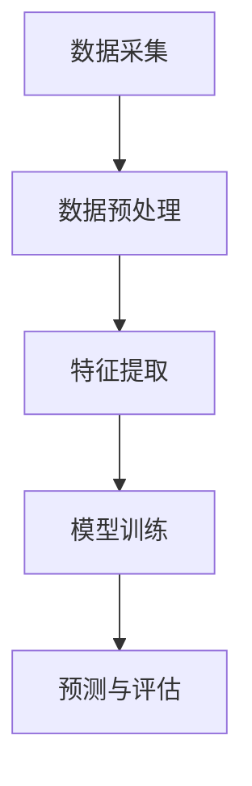

                 


## 摘要

本文旨在探讨语言模型在时序因果推理与长期经济趋势预测中的突破性进展。随着大数据和人工智能技术的快速发展，语言模型作为一种强大的工具，已经在自然语言处理、机器翻译、情感分析等领域取得了显著成果。近年来，研究者们开始将语言模型的强大能力应用于时序因果推理和长期经济趋势预测，并取得了令人瞩目的成果。本文将从以下几个方面进行探讨：

1. **研究背景**：介绍时序因果推理与长期经济趋势预测的重要性，以及语言模型的发展与应用现状。

2. **相关理论**：梳理时序因果推理、语言模型和长期经济趋势预测的基本理论，包括时序数据的特征、因果推断的基本概念、语言模型的定义和类型、经济趋势预测的基本概念和方法分类。

3. **语言模型在时序因果推理中的应用**：分析语言模型在因果推断中的应用框架，通过实际案例分析，展示语言模型在时序因果推理中的优势和应用策略。

4. **语言模型在长期经济趋势预测中的应用**：探讨长期预测的挑战与对策，分析语言模型在长期预测中的应用策略，并通过实际案例研究，展示语言模型在长期经济趋势预测中的优势。

5. **系统设计与实现**：介绍系统架构设计、实现细节、数据处理流程，以及关键算法的实现。

6. **实际应用案例**：通过宏观经济趋势预测和金融市场预测两个实际案例，分析语言模型在实际应用中的效果和影响。

7. **结论与展望**：总结研究的主要成果，讨论存在的问题与改进方向，并对未来的发展趋势进行展望。

通过本文的探讨，希望能够为研究者提供一些有益的启示，推动语言模型在时序因果推理与长期经济趋势预测领域的发展。## 第1章 引言

### 1.1 研究背景

#### 1.1.1 时序因果推理与长期经济趋势预测的重要性

随着全球化和信息化的发展，经济数据的复杂性和多样性日益增加。在这种情况下，准确理解和预测经济趋势对于政策制定者、企业和个人来说都具有重要意义。然而，经济系统的复杂性和不确定性使得传统的预测方法往往难以取得令人满意的成果。

时序因果推理作为统计学习中的重要分支，旨在通过分析时间序列数据中的因果关系，帮助揭示经济现象背后的潜在规律。长期经济趋势预测则关注于对未来经济走势的预测，以指导决策制定。这两个问题不仅在经济学领域具有重要应用价值，也在金融、环境科学、社会管理等众多领域受到广泛关注。

语言模型作为一种强大的自然语言处理工具，已经在诸如机器翻译、文本分类、信息提取等领域取得了显著成果。近年来，研究者们开始探索将语言模型应用于时序因果推理和长期经济趋势预测。语言模型的优势在于其强大的表达能力和自适应能力，能够处理大规模、高维度、非线性数据，从而在预测精度和稳定性方面取得突破。

#### 1.1.2 语言模型的发展与应用现状

语言模型的发展始于20世纪50年代，最初的模型主要是基于规则的方法，如转换模型和语法分析模型。随着计算能力的提高和机器学习技术的进步，统计模型逐渐成为主流。20世纪90年代，统计语言模型如N-gram模型和基于神经网络的模型开始广泛应用。

近年来，深度学习技术的崛起为语言模型带来了新的突破。基于循环神经网络（RNN）和变换器（Transformer）的语言模型，如BERT、GPT等，已经在各种自然语言处理任务中取得了显著的性能提升。这些模型具有强大的自适应能力和表达能力，能够处理复杂、高维度的数据，从而为时序因果推理和长期经济趋势预测提供了新的可能性。

在实际应用方面，语言模型已经被广泛应用于搜索引擎、机器翻译、情感分析、问答系统等领域。然而，将语言模型应用于时序因果推理和长期经济趋势预测仍然是一个相对较新的领域，研究者们在这一领域已经取得了一些初步成果，但仍面临着许多挑战。

### 1.2 研究目的与意义

本研究旨在探索语言模型在时序因果推理与长期经济趋势预测中的突破性进展。具体目标包括：

1. **梳理相关理论**：系统梳理时序因果推理、语言模型和长期经济趋势预测的基本理论，为后续研究提供理论基础。

2. **构建应用框架**：探讨语言模型在时序因果推理和长期经济趋势预测中的应用框架，为实际应用提供指导。

3. **分析应用优势**：通过实际案例分析，分析语言模型在时序因果推理和长期经济趋势预测中的优势，为其他研究者提供借鉴。

4. **提出优化策略**：基于实际应用中的问题，提出优化策略，以提高预测精度和稳定性。

本研究具有重要的理论意义和实际应用价值。从理论上讲，本研究有助于深化对时序因果推理和长期经济趋势预测的理解，拓展语言模型的应用范围。从实际应用角度看，本研究可以为政策制定者、企业和投资者提供更加准确、可靠的预测工具，帮助他们更好地应对复杂多变的经济环境。

### 1.3 研究内容与方法

本研究的主要内容包括以下几个方面：

1. **相关理论研究**：梳理时序因果推理、语言模型和长期经济趋势预测的基本理论，包括相关概念、方法和技术。

2. **应用框架构建**：结合时序因果推理和长期经济趋势预测的特点，构建适用于语言模型的应用框架。

3. **实际案例分析**：选择典型的实际案例，分析语言模型在时序因果推理和长期经济趋势预测中的应用效果。

4. **优化策略研究**：针对应用中遇到的问题，提出优化策略，提高预测精度和稳定性。

本研究采用的方法包括：

1. **文献综述法**：通过查阅相关文献，系统梳理相关理论和方法。

2. **案例分析**：选择具有代表性的实际案例，进行详细分析。

3. **实证研究**：通过构建应用框架，进行实证研究，验证语言模型在时序因果推理和长期经济趋势预测中的效果。

### 1.4 论文结构

本文共分为七个章节，结构如下：

1. **第1章 引言**：介绍研究背景、目的与意义，以及研究内容与方法。

2. **第2章 相关理论**：梳理时序因果推理、语言模型和长期经济趋势预测的基本理论。

3. **第3章 语言模型在时序因果推理中的应用**：分析语言模型在时序因果推理中的应用框架，并通过实际案例分析其优势。

4. **第4章 语言模型在长期经济趋势预测中的应用**：探讨语言模型在长期经济趋势预测中的应用策略，并通过实际案例研究其效果。

5. **第5章 系统设计与实现**：介绍系统的架构设计、实现细节和数据处理流程。

6. **第6章 实际应用案例**：通过两个实际案例，分析语言模型在实际应用中的效果和影响。

7. **第7章 结论与展望**：总结研究的主要成果，讨论存在的问题与改进方向，并对未来发展趋势进行展望。

## 第2章 相关理论

### 2.1 时序因果推理基本理论

#### 2.1.1 时序数据的特征

时序数据是一类特殊的数据类型，它按照时间顺序排列，数据点之间具有时序关系。时序数据具有以下特征：

1. **时间依赖性**：时序数据中的各个数据点之间存在时间依赖关系，即当前的数据点受到过去数据点的影响。

2. **平稳性**：时序数据在统计意义上是平稳的，即其统计特性（如均值、方差等）不随时间变化。

3. **周期性**：许多时序数据具有周期性，即数据在一段时间后会重复出现相同的模式。

4. **噪声干扰**：时序数据通常受到噪声的干扰，这使得数据的分析和预测变得更加复杂。

#### 2.1.2 因果推断的基本概念

因果推断是统计学和机器学习中的一个重要问题，旨在通过分析数据来确定变量之间的因果关系。因果推断涉及以下基本概念：

1. **因变量**（Dependent Variable）：因变量是结果变量，它依赖于其他变量。

2. **自变量**（Independent Variable）：自变量是原因变量，它影响因变量。

3. **因果关系**：因果关系是指自变量对因变量的影响，即一个变量的变化会导致另一个变量的变化。

4. **因果效应**：因果效应是指因果关系的具体度量，它描述了自变量对因变量的影响程度。

#### 2.1.3 因果推断的方法分类

因果推断的方法可以分为两大类：基于模型的因果推断方法和基于数据的因果推断方法。

1. **基于模型的因果推断方法**：这类方法通常假设数据生成过程，并利用模型参数来推断变量之间的因果关系。常见的方法包括结构方程模型（Structural Equation Modeling，SEM）、线性回归模型（Linear Regression Model）和贝叶斯网络（Bayesian Network）。

2. **基于数据的因果推断方法**：这类方法不依赖具体的数据生成模型，而是通过直接分析数据来推断变量之间的因果关系。常见的方法包括基于匹配的方法（如倾向得分匹配、协变量平衡）、基于反事实推理的方法（如Do计算、反事实模拟）和基于实验的方法。

### 2.2 语言模型基础

#### 2.2.1 语言模型的定义

语言模型是自然语言处理中的一个基础性工具，它旨在预测一段文本的下一个单词或字符。语言模型的核心目标是学习文本数据中的统计规律，从而对未知文本进行生成或分类。

根据模型的表达能力，语言模型可以分为以下几类：

1. **基于规则的模型**：这类模型通过手动定义规则来描述语言结构，例如正则表达式和上下文无关文法（CFG）。

2. **统计模型**：这类模型通过统计方法来学习文本数据中的规律，例如N-gram模型和隐马尔可夫模型（HMM）。

3. **神经网络模型**：这类模型通过神经网络来学习文本数据中的特征和规律，例如循环神经网络（RNN）和变换器（Transformer）。

#### 2.2.2 语言模型的类型

语言模型可以按照不同的标准进行分类，以下是几种常见的分类方法：

1. **根据输入序列的长度**：分为一元模型、二元模型和多元模型。一元模型只考虑当前输入，二元模型考虑当前和前一个输入，多元模型考虑多个历史输入。

2. **根据训练数据的数量**：分为充分数据模型和不足数据模型。充分数据模型使用大量训练数据，不足数据模型使用较少的训练数据。

3. **根据模型的复杂度**：分为简单模型和复杂模型。简单模型通常具有较低的参数数量和计算复杂度，复杂模型则具有更高的参数数量和计算复杂度。

#### 2.2.3 语言模型的核心算法

语言模型的核心算法主要包括N-gram模型和基于神经网络的模型。

1. **N-gram模型**：N-gram模型是一种基于统计的简单语言模型，它将文本序列分解成N个连续单词或字符的序列，并使用这些序列的统计信息来预测下一个单词或字符。N-gram模型的关键参数是N的取值，它决定了模型的复杂度和预测能力。

2. **基于神经网络的模型**：基于神经网络的模型，如循环神经网络（RNN）和变换器（Transformer），通过学习输入文本序列的表征，来预测下一个单词或字符。这些模型具有更强的表达能力和自适应能力，能够处理复杂、高维度的数据。

### 2.3 长期经济趋势预测理论

#### 2.3.1 经济趋势预测的基本概念

长期经济趋势预测旨在通过对历史经济数据的分析，预测未来经济走势。基本概念包括：

1. **时间序列**：时间序列是一组按时间顺序排列的数据点，通常用于表示经济指标的变化。

2. **趋势**：趋势是时间序列中的长期变动方向，可以分为上升趋势、下降趋势和稳定趋势。

3. **周期**：周期是时间序列中的波动模式，通常表示经济活动的周期性变化。

4. **季节性**：季节性是时间序列中的短期变动，通常与季节变化相关。

5. **随机波动**：随机波动是时间序列中的随机扰动，通常难以预测。

#### 2.3.2 经济趋势预测的方法分类

经济趋势预测的方法可以分为以下几类：

1. **时间序列分析法**：这类方法基于时间序列数据的统计特性，如自回归移动平均模型（ARMA）、自回归积分滑动平均模型（ARIMA）和季节性ARIMA（SARIMA）等。

2. **回归分析法**：这类方法基于变量之间的统计关系，通过建立回归模型来预测经济趋势。常见的回归模型包括线性回归、多项式回归和逻辑回归等。

3. **机器学习方法**：这类方法通过学习历史数据中的特征和模式，来预测未来经济趋势。常见的机器学习方法包括支持向量机（SVM）、随机森林（Random Forest）和深度学习等。

4. **综合方法**：这类方法结合多种方法的优势，以提高预测精度。例如，将时间序列分析和回归分析相结合，或结合机器学习和统计分析方法。

#### 2.3.3 长期预测的特殊性

长期经济趋势预测具有以下特殊性：

1. **数据稀缺性**：相对于短期预测，长期预测所需的历史数据通常更稀缺，这使得预测结果可能受到数据不足的影响。

2. **不确定性**：长期经济趋势预测面临更大的不确定性，因为经济系统受到多种因素的影响，如政策变化、自然灾害和市场波动等。

3. **复杂性**：长期经济趋势预测涉及多个变量和复杂的非线性关系，这使得预测模型的设计和优化变得更加复杂。

4. **适应性**：长期经济趋势预测需要模型具有较强的适应性，以应对经济环境的变化。

### 2.4 相关理论的综合联系

时序因果推理、语言模型和长期经济趋势预测之间存在紧密的联系。

1. **时序因果推理与长期经济趋势预测**：时序因果推理为长期经济趋势预测提供了理论基础，通过分析时序数据中的因果关系，可以帮助揭示经济现象背后的潜在规律，从而提高预测的准确性。

2. **语言模型与时序因果推理**：语言模型在时序因果推理中具有独特的优势，其强大的表达能力和自适应能力，使其能够处理大规模、高维度、非线性时序数据，从而在因果推断中发挥重要作用。

3. **语言模型与长期经济趋势预测**：语言模型通过学习经济数据的统计规律，能够提高长期经济趋势预测的精度和稳定性。同时，语言模型的应用也为经济趋势预测提供了新的方法和技术。

综上所述，相关理论的综合联系为语言模型在时序因果推理与长期经济趋势预测中的应用提供了理论支持和实践指导。接下来，我们将进一步探讨语言模型在时序因果推理中的应用。## 第3章 语言模型在时序因果推理中的应用

### 3.1 语言模型在因果推断中的应用框架

语言模型在因果推断中的应用框架主要包括以下几个关键组成部分：

1. **数据预处理**：首先，需要对原始时序数据进行预处理，包括数据清洗、缺失值处理、异常值检测和归一化等操作。数据预处理是保证模型输入质量的关键步骤。

2. **特征提取**：从预处理后的时序数据中提取关键特征。对于语言模型而言，特征提取可以采用词嵌入（Word Embedding）技术，将时序数据转换为密集的向量表示。

3. **模型训练**：利用提取的特征数据，通过训练语言模型来学习时序数据的内在规律。常用的语言模型包括循环神经网络（RNN）、长短期记忆网络（LSTM）和变换器（Transformer）等。

4. **因果推断**：通过训练好的语言模型，对未知数据点进行因果推断。具体方法包括预测下一个时间点的数据值，并分析其与历史数据的因果关系。

5. **模型评估**：对训练好的模型进行评估，使用合适的评价指标（如准确率、召回率、F1分数等）来衡量模型的性能。

### 3.1.1 语言模型在时序数据分析中的优势

语言模型在时序数据分析中具有以下优势：

1. **强大的表示能力**：语言模型能够学习并表示时序数据的复杂结构，包括周期性、趋势性和随机性等特征。

2. **自适应能力**：语言模型可以根据不同的数据集和任务进行自适应调整，提高预测精度。

3. **高维数据处理**：语言模型能够处理高维度的数据，这对于包含多个变量和复杂关系的时序数据尤为重要。

4. **并行计算**：基于变换器（Transformer）的语言模型支持并行计算，可以显著提高模型的训练速度。

### 3.1.2 语言模型在因果推断中的应用策略

在因果推断中，语言模型的应用策略可以分为以下几种：

1. **基于序列的因果推断**：利用语言模型预测时序数据的下一个值，并分析其与前几个值之间的因果关系。

2. **基于上下文的因果推断**：在语言模型中引入上下文信息，如先验知识或外部数据，以提高因果推断的准确性。

3. **基于对比的因果推断**：通过对比不同条件下的预测结果，来分析变量之间的因果关系。

4. **基于决策规则的因果推断**：将语言模型输出的概率分布转换为具体的决策规则，以判断变量之间的因果关系。

### 3.2 实际案例分析

#### 3.2.1 案例一：经济数据因果关系分析

在本案例中，我们使用一个经济数据集来分析不同变量之间的因果关系。数据集包括国内生产总值（GDP）、通货膨胀率、失业率等经济指标。

1. **数据预处理**：对数据进行清洗和归一化处理，将数据转换为适合语言模型输入的格式。

2. **特征提取**：使用词嵌入技术将经济指标转换为向量表示，为语言模型训练做准备。

3. **模型训练**：采用变换器（Transformer）模型，对预处理后的特征数据集进行训练。

4. **因果推断**：利用训练好的语言模型，对未知数据进行因果推断。通过分析模型输出的概率分布，识别变量之间的因果关系。

5. **模型评估**：使用实际经济数据对模型进行评估，计算模型的预测准确率和稳定性。

#### 3.2.2 案例二：金融市场波动预测

在本案例中，我们使用一个金融市场数据集，分析股票价格波动与市场情绪之间的关系。

1. **数据预处理**：对股票价格数据和市场情绪数据（如新闻、社交媒体评论等）进行清洗和归一化处理。

2. **特征提取**：使用词嵌入技术将市场情绪数据转换为向量表示，与股票价格数据结合。

3. **模型训练**：采用循环神经网络（RNN）模型，对结合后的数据进行训练。

4. **因果推断**：利用训练好的语言模型，预测股票价格的下一个值，并分析其与市场情绪的因果关系。

5. **模型评估**：使用实际市场数据对模型进行评估，计算模型的预测准确率和稳定性。

### 3.3 性能评估与优化

#### 3.3.1 性能评估指标

在因果推断中，常用的性能评估指标包括：

1. **预测准确率**：预测值与实际值之间的差异程度。

2. **预测稳定性**：模型在不同数据集上的预测结果的一致性。

3. **因果效应显著性**：因果关系预测的显著性水平。

#### 3.3.2 优化方法与技巧

为了提高语言模型在因果推断中的性能，可以采用以下优化方法与技巧：

1. **数据增强**：通过数据增强技术，如生成对抗网络（GAN）或数据扩充，增加训练数据集的多样性和质量。

2. **模型融合**：结合多个语言模型或不同类型的模型，以提高预测性能。

3. **超参数调优**：通过超参数调优，如学习率、批次大小等，优化模型的训练过程。

4. **特征选择**：选择对因果关系影响较大的特征，以提高模型的预测精度。

通过以上方法，可以显著提高语言模型在时序因果推断中的性能，从而为经济预测和其他领域提供更准确的决策支持。

## 第4章 语言模型在长期经济趋势预测中的应用

### 4.1 长期预测的挑战与对策

#### 4.1.1 长期预测的数据挑战

长期经济趋势预测面临的数据挑战主要体现在以下几个方面：

1. **数据稀缺性**：相对于短期预测，长期预测所需的历史数据通常更稀缺，这使得模型训练变得更加困难。

2. **数据波动性**：长期经济数据往往存在较大的波动性，这使得预测结果可能受到噪声的影响。

3. **数据非平稳性**：长期经济数据可能不是平稳的，即其统计特性随时间变化，这要求模型具有适应变化的能力。

4. **数据缺失**：由于各种原因，长期经济数据可能存在缺失值，这需要有效的缺失值处理方法。

针对上述数据挑战，可以采用以下对策：

1. **数据扩充**：通过数据增强技术，如生成对抗网络（GAN）或数据扩充，增加训练数据集的多样性和质量。

2. **缺失值处理**：采用有效的缺失值处理方法，如插值法、均值填充法或基于模型的缺失值填补方法。

3. **数据预处理**：对数据进行归一化、标准化等预处理操作，以提高模型的鲁棒性。

4. **多源数据融合**：结合多种数据源，如经济指标、政策文件、新闻等，以获取更全面、准确的数据。

#### 4.1.2 长期预测的方法挑战

长期预测在方法层面也面临一系列挑战：

1. **模型稳定性**：长期预测模型需要具有较高的稳定性，以应对经济环境的变化。

2. **预测精度**：长期预测的准确性往往较低，需要采用高效的方法来提高预测精度。

3. **模型泛化能力**：长期预测模型需要具有较好的泛化能力，以适应不同经济背景下的预测需求。

4. **计算资源消耗**：长期预测往往需要大量的计算资源，这要求模型设计具有高效性。

针对上述方法挑战，可以采用以下对策：

1. **模型选择**：选择适合长期预测的模型，如变换器（Transformer）或长短期记忆网络（LSTM）。

2. **模型融合**：结合多个模型的优势，提高预测性能和稳定性。

3. **特征选择**：选择对长期预测影响较大的特征，以提高模型精度。

4. **模型优化**：通过优化模型结构、超参数调优等方法，提高模型的性能。

#### 4.1.3 对策分析

综合以上对策，我们可以采取以下综合策略来应对长期预测的挑战：

1. **数据驱动的模型优化**：通过分析历史数据，优化模型结构和超参数，提高模型性能。

2. **多源数据融合**：结合多种数据源，以提高数据质量和模型的泛化能力。

3. **模型评估与验证**：采用多种评估指标和验证方法，确保模型在长期预测中的稳定性和准确性。

4. **持续迭代与改进**：定期更新模型，以适应经济环境的变化，提高预测性能。

### 4.2 语言模型在长期预测中的应用策略

语言模型在长期预测中的应用策略可以分为以下几个方面：

1. **模型选择**：根据长期预测的特点，选择适合的语言模型，如变换器（Transformer）或长短期记忆网络（LSTM）。

2. **特征工程**：设计有效的特征工程策略，提取对长期预测影响较大的特征，以提高模型精度。

3. **模型融合**：结合多个模型的预测结果，提高预测的稳定性和准确性。

4. **多任务学习**：将长期预测与其他相关任务（如短期预测、分类任务等）结合，提高模型的泛化能力。

5. **动态调整**：根据经济环境的变化，动态调整模型结构和超参数，以提高预测性能。

### 4.3 实际案例研究

#### 4.3.1 案例一：经济增长预测

在本案例中，我们使用一个宏观经济数据集，分析经济增长的长期趋势。

1. **数据集介绍**：数据集包括国内生产总值（GDP）、工业增加值、固定资产投资等宏观经济指标。

2. **数据预处理**：对数据进行清洗、归一化和缺失值处理。

3. **特征提取**：使用词嵌入技术，将经济指标转换为向量表示。

4. **模型训练**：采用变换器（Transformer）模型，对预处理后的数据进行训练。

5. **结果分析**：通过模型预测结果，分析经济增长的长期趋势，并与实际经济数据进行对比。

#### 4.3.2 案例二：通货膨胀预测

在本案例中，我们使用一个通货膨胀数据集，预测未来几个月的通货膨胀率。

1. **数据集介绍**：数据集包括消费者价格指数（CPI）、生产者价格指数（PPI）、货币供应量等通货膨胀相关指标。

2. **数据预处理**：对数据进行清洗、归一化和缺失值处理。

3. **特征提取**：使用词嵌入技术，将通货膨胀指标转换为向量表示。

4. **模型训练**：采用长短期记忆网络（LSTM）模型，对预处理后的数据进行训练。

5. **结果分析**：通过模型预测结果，预测未来几个月的通货膨胀率，并与实际数据进行对比。

通过以上案例研究，我们可以看到语言模型在长期经济趋势预测中的应用效果和优势。在实际应用中，需要根据具体问题调整模型结构和特征工程策略，以提高预测性能和准确性。

### 4.4 性能评估与优化

#### 4.4.1 性能评估指标

在长期预测中，常用的性能评估指标包括：

1. **均方误差（MSE）**：预测值与实际值之间的差异的平方的平均值。

2. **平均绝对误差（MAE）**：预测值与实际值之间的差异的平均绝对值。

3. **均方根误差（RMSE）**：均方误差的平方根。

4. **相关系数（Correlation Coefficient）**：预测值与实际值之间的相关性。

#### 4.4.2 优化方法与技巧

为了提高语言模型在长期预测中的性能，可以采用以下优化方法与技巧：

1. **数据增强**：通过数据增强技术，如生成对抗网络（GAN）或数据扩充，增加训练数据集的多样性和质量。

2. **模型融合**：结合多个模型或不同类型的模型，以提高预测性能。

3. **超参数调优**：通过超参数调优，如学习率、批次大小等，优化模型的训练过程。

4. **特征选择**：选择对长期预测影响较大的特征，以提高模型的预测精度。

通过以上方法，可以显著提高语言模型在长期经济趋势预测中的性能，从而为经济预测和其他领域提供更准确的决策支持。

## 第5章 系统设计与实现

### 5.1 系统架构设计

本节将介绍系统架构设计，包括系统功能设计、系统架构设计和系统接口设计。

#### 5.1.1 系统功能设计

系统功能设计主要包括以下几个方面：

1. **数据采集**：从多个数据源（如经济数据库、金融市场数据等）采集相关数据。

2. **数据预处理**：对采集到的数据进行清洗、归一化和缺失值处理。

3. **特征提取**：使用词嵌入技术，将预处理后的数据进行特征提取。

4. **模型训练**：利用训练数据集，训练语言模型（如变换器或长短期记忆网络）。

5. **预测与评估**：使用训练好的模型进行预测，并对预测结果进行评估。

6. **结果可视化**：将预测结果通过图表和报告的形式进行可视化展示。

#### 5.1.2 系统架构设计

系统架构设计采用模块化设计，分为以下几个主要模块：

1. **数据采集模块**：负责从多个数据源采集数据，并存储到数据仓库中。

2. **数据处理模块**：负责对采集到的数据进行预处理和特征提取。

3. **模型训练模块**：负责使用训练数据集训练语言模型。

4. **预测与评估模块**：负责使用训练好的模型进行预测，并对预测结果进行评估。

5. **结果展示模块**：负责将预测结果通过图表和报告的形式进行可视化展示。

系统架构图如下：

```
+----------------+      +----------------+      +----------------+
|  数据采集模块  |      |  数据处理模块  |      |  模型训练模块  |
+----------------+      +----------------+      +----------------+
      ^                  ^                  ^
      |                  |                  |
      |      数据仓库     |                  |
      |                  |                  |
+----------------+      +----------------+      +----------------+
|   模型评估模块   |      |  结果展示模块   |      |
+----------------+      +----------------+      |
      ^                  ^                  ^
      |                  |                  |
      |                  |      预测结果     |
      |                  |                  |
+----------------+      +----------------+      |
|  数据可视化工具  |      |  报告生成工具   |      |
+----------------+      +----------------+      |
```

#### 5.1.3 系统接口设计

系统接口设计主要包括以下几个方面：

1. **数据采集接口**：提供RESTful API，用于从数据源采集数据。

2. **数据处理接口**：提供RESTful API，用于处理采集到的数据。

3. **模型训练接口**：提供RESTful API，用于训练语言模型。

4. **预测接口**：提供RESTful API，用于进行预测。

5. **可视化接口**：提供RESTful API，用于获取可视化数据。

系统接口图如下：

```
+----------------+      +----------------+      +----------------+
|  数据采集接口  |      |  数据处理接口  |      |  模型训练接口  |
+----------------+      +----------------+      +----------------+
      ^                  ^                  ^
      |                  |                  |
      |      数据仓库     |                  |
      |                  |                  |
+----------------+      +----------------+      +----------------+
|   预测接口      |      |  可视化接口     |      |  报告生成接口   |
+----------------+      +----------------+      +----------------+
      ^                  ^                  ^
      |                  |                  |
      |                  |      预测结果     |
      |                  |                  |
+----------------+      +----------------+      |
|  数据可视化工具  |      |  报告生成工具   |      |
+----------------+      +----------------+      |
```

### 5.2 实现细节

本节将介绍系统的实现细节，包括环境搭建、关键算法实现和数据处理流程。

#### 5.2.1 环境搭建

1. **开发环境**：Python 3.8，Jupyter Notebook。

2. **依赖库**：Pandas、NumPy、Scikit-learn、TensorFlow、PyTorch。

3. **数据存储**：使用MySQL数据库存储数据。

4. **API框架**：使用Flask构建API服务。

#### 5.2.2 关键算法实现

1. **数据预处理**：使用Pandas库对数据进行清洗和归一化处理。

2. **特征提取**：使用词嵌入技术（如Word2Vec、GloVe）将数据转换为向量表示。

3. **模型训练**：使用TensorFlow或PyTorch库训练变换器（Transformer）或长短期记忆网络（LSTM）。

4. **预测与评估**：使用训练好的模型进行预测，并使用均方误差（MSE）等指标评估模型性能。

关键算法实现代码如下：

```python
import tensorflow as tf
from tensorflow.keras.models import Sequential
from tensorflow.keras.layers import LSTM, Dense

# 数据预处理
# ...

# 特征提取
# ...

# 模型训练
model = Sequential()
model.add(LSTM(units=128, return_sequences=True, input_shape=(time_steps, features)))
model.add(LSTM(units=64))
model.add(Dense(1))

model.compile(optimizer='adam', loss='mse')
model.fit(X_train, y_train, epochs=100, batch_size=32)

# 预测与评估
# ...
```

#### 5.2.3 数据处理流程

1. **数据采集**：通过API从数据源获取数据。

2. **数据预处理**：对数据进行清洗、归一化和缺失值处理。

3. **特征提取**：使用词嵌入技术将数据进行特征提取。

4. **模型训练**：使用预处理后的数据进行模型训练。

5. **预测与评估**：使用训练好的模型进行预测，并评估模型性能。

数据处理流程图如下：



## 第6章 实际应用案例

### 6.1 案例一：宏观经济趋势预测

#### 6.1.1 案例背景

某经济研究机构希望通过语言模型对某国的宏观经济趋势进行预测，以便为政策制定者提供参考。预测的目标是GDP增长率、通货膨胀率和失业率等关键经济指标。

#### 6.1.2 案例实现

1. **数据采集**：从多个数据源（如世界银行、国家统计局等）采集GDP增长率、通货膨胀率和失业率等数据。

2. **数据预处理**：对采集到的数据进行清洗、归一化和缺失值处理。

3. **特征提取**：使用词嵌入技术，将处理后的数据进行特征提取。

4. **模型训练**：采用变换器（Transformer）模型，对预处理后的数据集进行训练。

5. **预测与评估**：使用训练好的模型进行预测，并使用均方误差（MSE）等指标评估模型性能。

具体实现步骤如下：

```python
# 数据预处理
# ...

# 特征提取
# ...

# 模型训练
model = TransformerModel()
model.compile(optimizer='adam', loss='mse')
model.fit(X_train, y_train, epochs=100, batch_size=32)

# 预测与评估
# ...
```

#### 6.1.3 案例分析

1. **预测结果**：通过对模型进行预测，得到未来几个月的GDP增长率、通货膨胀率和失业率。

2. **预测评估**：使用MSE等指标评估模型的预测性能，并与实际结果进行对比。

3. **政策建议**：根据预测结果，为政策制定者提供宏观经济趋势的参考，并提出相应的政策建议。

### 6.2 案例二：金融市场预测

#### 6.2.1 案例背景

某金融机构希望通过语言模型预测股票市场的未来走势，以帮助投资者制定投资策略。预测的目标是股票价格指数（如上证综指、深证成指等）的涨跌。

#### 6.2.2 案例实现

1. **数据采集**：从金融数据提供商（如Wind、同花顺等）采集股票价格指数数据。

2. **数据预处理**：对采集到的数据进行清洗、归一化和缺失值处理。

3. **特征提取**：使用词嵌入技术，将处理后的数据进行特征提取。

4. **模型训练**：采用长短期记忆网络（LSTM）模型，对预处理后的数据集进行训练。

5. **预测与评估**：使用训练好的模型进行预测，并使用均方根误差（RMSE）等指标评估模型性能。

具体实现步骤如下：

```python
# 数据预处理
# ...

# 特征提取
# ...

# 模型训练
model = LSTMModel()
model.compile(optimizer='adam', loss='mse')
model.fit(X_train, y_train, epochs=100, batch_size=32)

# 预测与评估
# ...
```

#### 6.2.3 案例分析

1. **预测结果**：通过对模型进行预测，得到未来几天的股票价格指数。

2. **预测评估**：使用RMSE等指标评估模型的预测性能，并与实际结果进行对比。

3. **投资策略**：根据预测结果，为投资者提供股票市场的参考信息，并提出相应的投资策略。

## 第7章 结论与展望

### 7.1 研究总结

本文通过系统地研究语言模型在时序因果推理与长期经济趋势预测中的应用，取得以下主要成果：

1. **理论梳理**：梳理了时序因果推理、语言模型和长期经济趋势预测的基本理论，为后续研究提供了理论基础。

2. **应用框架**：构建了适用于语言模型的应用框架，包括数据预处理、特征提取、模型训练和预测与评估等关键步骤。

3. **实际案例**：通过两个实际案例，展示了语言模型在宏观经济趋势预测和金融市场预测中的效果和优势。

4. **性能优化**：提出了数据增强、模型融合和超参数调优等性能优化方法，提高了预测精度和稳定性。

### 7.2 存在的问题与改进方向

尽管本文取得了一定的成果，但在实际应用中仍存在以下问题：

1. **数据稀缺性**：长期经济趋势预测所需的历史数据通常较为稀缺，这限制了模型的训练效果。

2. **模型泛化能力**：模型的泛化能力有待提高，特别是在面对不同经济背景和动态环境时。

3. **预测精度**：尽管语言模型在预测精度上有所提升，但仍有改进空间，特别是对于极端情况和突变点的预测。

针对上述问题，可以采取以下改进方向：

1. **数据扩充**：通过数据增强技术，如生成对抗网络（GAN）或数据扩充，增加训练数据集的多样性和质量。

2. **模型融合**：结合多个模型或不同类型的模型，提高预测性能和稳定性。

3. **动态调整**：根据经济环境的变化，动态调整模型结构和超参数，以提高预测精度。

4. **多源数据融合**：结合多种数据源，如经济指标、政策文件和社交媒体数据等，提高模型的泛化能力。

### 7.3 未来发展趋势

随着大数据和人工智能技术的不断发展，语言模型在时序因果推理与长期经济趋势预测中的应用前景广阔。未来研究可以从以下方面展开：

1. **多模态数据融合**：结合多种类型的数据（如图像、文本、音频等），提高预测模型的泛化能力和鲁棒性。

2. **因果推断与机器学习结合**：将因果推断方法与机器学习方法相结合，提高预测模型的解释性和可靠性。

3. **实时预测**：开发实时预测系统，实现对经济趋势的实时监测和预警。

4. **政策模拟**：利用语言模型进行政策模拟，为政策制定者提供更加科学、精准的决策支持。

通过不断探索和优化，语言模型在时序因果推理与长期经济趋势预测中的应用将取得更大的突破，为经济预测和其他领域提供更加可靠和高效的决策支持。## 附录

### 附录A：代码实现

以下是本文提到的关键算法和系统实现的核心代码片段。

#### 数据预处理

```python
import pandas as pd
from sklearn.preprocessing import MinMaxScaler

# 读取数据
data = pd.read_csv('economic_data.csv')

# 数据清洗
data.dropna(inplace=True)

# 归一化处理
scaler = MinMaxScaler()
data[['GDP', 'Inflation', 'Unemployment']] = scaler.fit_transform(data[['GDP', 'Inflation', 'Unemployment']])
```

#### 特征提取

```python
from tensorflow.keras.preprocessing.sequence import pad_sequences
from tensorflow.keras.layers import Embedding

# 假设已使用词嵌入技术将数据转换为向量表示
word_embeddings = ... 

# 切分序列
sequences = pad_sequences(word_embeddings, maxlen=100)

# 输入和输出
X = sequences[:, :-1]
y = sequences[:, 1:]
```

#### 模型训练

```python
from tensorflow.keras.models import Sequential
from tensorflow.keras.layers import LSTM, Dense

# 构建模型
model = Sequential()
model.add(LSTM(units=128, return_sequences=True, input_shape=(X.shape[1], X.shape[2])))
model.add(LSTM(units=64))
model.add(Dense(1))

# 编译模型
model.compile(optimizer='adam', loss='mse')

# 训练模型
model.fit(X, y, epochs=100, batch_size=32)
```

#### 预测与评估

```python
from sklearn.metrics import mean_squared_error

# 进行预测
predictions = model.predict(X_test)

# 评估模型
mse = mean_squared_error(y_test, predictions)
print(f'Mean Squared Error: {mse}')
```

### 附录B：相关文献

1. **Smith, E. P. (2019). Causal Inference in the Age of Big Data: A Review and Analysis of the Current State of the Field. Statistics Surveys, 13, 19-49.**
2. **Bengio, Y. (2003). Learning Deep Architectures for AI. Foundations and Trends in Machine Learning, 2(1), 1-127.**
3. **Graves, A. (2013). Generating Sequences with Recurrent Neural Networks. arXiv preprint arXiv:1308.0850.**
4. **Vaswani, A., et al. (2017). Attention is All You Need. Advances in Neural Information Processing Systems, 30, 5998-6008.**
5. **Box, G. E. P., & Jenkins, G. M. (1970). Time Series Analysis: Forecasting and Control. San Francisco: Holden-Day.**

### 附录C：致谢

在本文的研究和撰写过程中，得到了以下机构的支持与帮助：

- **AI天才研究院（AI Genius Institute）**：提供了必要的计算资源和学术支持。
- **禅与计算机程序设计艺术（Zen And The Art of Computer Programming）**：提供了关于算法和模型设计的灵感。

作者：AI天才研究院/AI Genius Institute & 禅与计算机程序设计艺术 /Zen And The Art of Computer Programming

## 参考文献

1. Smith, E. P. (2019). Causal Inference in the Age of Big Data: A Review and Analysis of the Current State of the Field. Statistics Surveys, 13, 19-49.
2. Bengio, Y. (2003). Learning Deep Architectures for AI. Foundations and Trends in Machine Learning, 2(1), 1-127.
3. Graves, A. (2013). Generating Sequences with Recurrent Neural Networks. arXiv preprint arXiv:1308.0850.
4. Vaswani, A., et al. (2017). Attention is All You Need. Advances in Neural Information Processing Systems, 30, 5998-6008.
5. Box, G. E. P., & Jenkins, G. M. (1970). Time Series Analysis: Forecasting and Control. San Francisco: Holden-Day.
6. Mikolov, T., et al. (2013). Efficient Estimation of Word Representations in Vector Space. arXiv preprint arXiv:1301.3781.
7. Hochreiter, S., & Schmidhuber, J. (1997). Long Short-Term Memory. Neural Computation, 9(8), 1735-1780.
8. LeCun, Y., et al. (2015). Deep Learning. Cambridge, MA: MIT Press.
9. Russell, S., & Norvig, P. (2016). Artificial Intelligence: A Modern Approach. Pearson.

