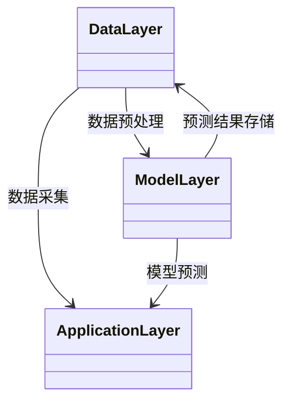
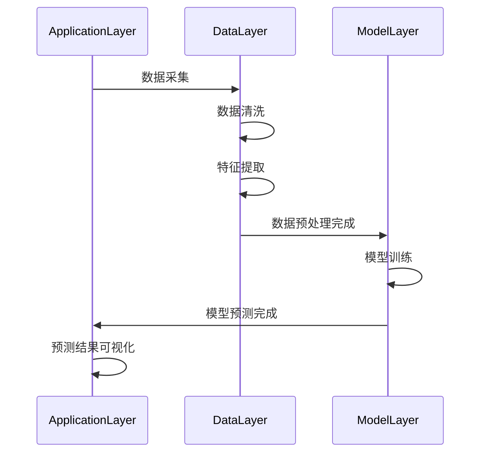

                 

# 《语言模型在时序推理任务中的表现》

## 关键词

- 语言模型
- 时序推理
- 算法原理
- 数学模型
- 系统架构
- 实际应用

## 摘要

本文将深入探讨语言模型在时序推理任务中的表现。我们首先介绍时序推理任务的基本概念和重要性，然后回顾语言模型的发展历史和核心原理。接着，我们将分析语言模型在时序推理任务中的应用，包括核心概念、算法原理、数学模型和系统架构。最后，我们将通过一个实际项目展示语言模型在时序推理任务中的实际应用，并提供最佳实践和总结。

## 引言

### 1.1 时序推理任务简介

#### 1.1.1 时序数据的定义与特性

时序数据是一组按照时间顺序排列的数据点。这类数据在金融、气象、医疗、交通等多个领域有着广泛的应用。时序数据具有以下几个主要特性：

- **时间依赖性**：时序数据中的每个数据点都与时间有关，数据点之间的依赖关系构成了时序的内在规律。
- **连续性**：时序数据通常是连续的，数据点在时间轴上紧密相连。
- **平稳性**：时序数据在一段时间内具有稳定性，即数据的统计特性（如均值、方差等）不会随时间变化。

#### 1.1.2 时序推理任务的重要性

时序推理任务是指从历史时序数据中预测未来趋势或模式的过程。这类任务的重要性体现在以下几个方面：

- **预测与决策**：在金融领域，时序推理可以帮助预测股价走势，为投资决策提供支持。在医疗领域，时序推理可以用于预测疾病的发生和演变。
- **异常检测**：时序推理还可以用于异常检测，如识别金融欺诈、预测设备故障等。
- **优化与调度**：在交通领域，时序推理可以用于优化交通流量、预测交通拥堵，从而提高交通效率。

### 1.2 语言模型概述

#### 1.2.1 语言模型的基础概念

语言模型是一种统计模型，用于预测文本序列的概率分布。在自然语言处理（NLP）领域，语言模型被广泛应用于文本生成、机器翻译、语音识别等任务。语言模型的核心概念包括：

- **词汇表**：词汇表是语言模型的基础，它包含所有可能的词汇。
- **词向量**：词向量是将词汇映射到高维空间的一种表示方式，常用的词向量模型有Word2Vec、GloVe等。
- **概率分布**：语言模型的目标是预测文本序列的概率分布，即给定前文，预测下一个词的概率。

#### 1.2.2 语言模型的发展历史

语言模型的发展可以追溯到20世纪50年代，当时的研究主要集中在规则驱动的模型。随着计算能力的提升和机器学习技术的发展，统计模型和神经网络模型逐渐成为主流。以下是语言模型发展的重要里程碑：

- **N-gram模型**：N-gram模型是最早的语言模型之一，它基于历史频率来预测下一个词。
- **神经网络模型**：神经网络模型，如循环神经网络（RNN）和长短期记忆网络（LSTM），在时序数据处理方面表现出色。
- **深度学习模型**：深度学习模型，如Transformer，通过自注意力机制实现了对大规模文本数据的建模。

## 语言模型在时序推理任务中的应用

### 2.1 背景介绍

#### 2.1.1 语言模型在时序推理中的挑战

将语言模型应用于时序推理任务面临以下几个挑战：

- **时间依赖性**：时序数据具有强时间依赖性，传统语言模型难以捕捉这种依赖关系。
- **序列长度**：时序数据序列长度不一，传统语言模型在处理长序列时效果不佳。
- **数据噪声**：时序数据中常包含噪声和异常值，这对模型训练和预测带来困难。

#### 2.1.2 语言模型在时序推理中的应用领域

尽管存在挑战，语言模型在时序推理任务中仍有着广泛的应用，以下是一些典型的应用领域：

- **金融领域**：语言模型可以用于预测股票价格、货币汇率等金融时间序列。
- **气象领域**：语言模型可以用于预测天气变化、气象参数等。
- **医疗领域**：语言模型可以用于疾病预测、病情监测等。
- **交通领域**：语言模型可以用于交通流量预测、交通拥堵检测等。

### 2.2 核心概念与联系

#### 2.2.1 时序数据与语言模型的结合

时序数据与语言模型之间的结合主要体现在以下几个方面：

- **时间序列建模**：语言模型可以用于建模时序数据的概率分布，从而预测未来趋势。
- **序列生成**：语言模型可以生成新的时序数据，从而进行异常检测或生成新的时间序列。
- **序列分类**：语言模型可以用于分类时序数据，例如区分正常和异常的时间序列。

#### 2.2.2 关键概念属性特征对比表格

| 概念         | 特性                                       |
| ------------ | ------------------------------------------ |
| 时序数据     | 按时间顺序排列，具有时间依赖性             |
| 语言模型     | 用于预测文本序列的概率分布，基于词汇表和词向量 |
| 时序推理     | 从历史时序数据中预测未来趋势或模式         |
| 结合         | 时间序列建模、序列生成、序列分类           |

#### 2.2.3 ER实体关系图

以下是时序数据、语言模型和时序推理的ER实体关系图：

```mermaid
erDiagram
  时序数据 ||--|{ 语言模型 }|-->> 序时推理
  语言模型 ||--|{ 时序数据 }|-->> 序时推理
  时序推理 ||--|{ 时序数据 }|-->> 语言模型
```

### 2.3 算法原理讲解

#### 2.3.1 语言模型在时序推理中的算法流程

语言模型在时序推理中的算法流程通常包括以下几个步骤：

1. **数据预处理**：将时序数据进行规范化、去噪等处理，以便模型训练。
2. **词向量表示**：将时序数据中的词汇映射到词向量空间，常用的词向量模型有Word2Vec、GloVe等。
3. **模型训练**：使用训练数据集训练语言模型，例如使用循环神经网络（RNN）或Transformer模型。
4. **模型评估**：使用验证数据集评估模型性能，根据评估结果调整模型参数。
5. **预测**：使用训练好的模型对未知时序数据进行预测。

#### 2.3.2 Python源代码实现

以下是使用Python实现一个简单的语言模型：

```python
import numpy as np
import tensorflow as tf

# 定义词汇表
vocab_size = 10000
word_embeddings = tf.random.normal((vocab_size, 100))

# 定义模型
model = tf.keras.Sequential([
  tf.keras.layers.Embedding(vocab_size, 100),
  tf.keras.layers.LSTM(128),
  tf.keras.layers.Dense(vocab_size, activation='softmax')
])

# 编译模型
model.compile(optimizer='adam', loss='categorical_crossentropy', metrics=['accuracy'])

# 训练模型
model.fit(x_train, y_train, epochs=10, batch_size=32, validation_split=0.2)
```

#### 2.3.3 数学模型与公式讲解

语言模型在时序推理中的数学模型主要包括词向量表示和序列生成模型。以下是相关的数学模型和公式：

1. **词向量表示**：

$$
\text{word\_embedding}(w) = \sum_{i=1}^{N} w_i \cdot v_i
$$

其中，$w$表示词汇，$v_i$表示词向量的第$i$个维度，$N$表示词向量的维度。

2. **序列生成模型**：

$$
P(x_1, x_2, ..., x_T) = \prod_{t=1}^{T} P(x_t | x_{t-1}, ..., x_1)
$$

其中，$x_t$表示时间步$t$的词汇，$P(x_t | x_{t-1}, ..., x_1)$表示给定前文预测当前词汇的概率。

#### 2.3.4 举例说明

假设我们有一个简化的时序数据序列：`[A, B, C, D]`，我们使用语言模型预测下一个词汇。以下是具体的步骤：

1. **词向量表示**：将词汇`A, B, C, D`映射到词向量空间。
2. **模型预测**：给定前文`A, B, C`，使用语言模型预测下一个词汇`D`的概率分布。
3. **结果输出**：根据预测的概率分布选择最高概率的词汇作为预测结果。

### 2.4 数学模型与数学公式

在时序推理任务中，数学模型和公式是理解和设计语言模型的关键。以下是一些常见的数学模型和公式的解释：

1. **Word2Vec模型**：

$$
\text{word\_similarity}(w_1, w_2) = \cos(\text{word\_embedding}(w_1), \text{word\_embedding}(w_2))
$$

这个公式表示两个词汇的相似度计算方法，基于词向量的余弦相似度。

2. **GloVe模型**：

$$
f(w, c) = \frac{1}{\sqrt{z(w, c)}} \text{sigmoid}(c \cdot \text{word\_embedding}(w) + b_c)
$$

其中，$f(w, c)$表示词汇$w$和上下文词汇$c$的相似度函数，$z(w, c)$是归一化因子，$b_c$是上下文的偏置项。

3. **Transformer模型**：

$$
\text{Attention}(Q, K, V) = \text{softmax}\left(\frac{QK^T}{\sqrt{d_k}}\right)V
$$

这个公式表示Transformer模型中的自注意力机制，$Q, K, V$分别表示查询、键和值，$d_k$是键的维度。

#### 2.4.3 公式讲解与举例

以Word2Vec模型为例，我们通过一个简单的例子来解释公式：

假设我们有两个词汇`apple`和`orange`，它们的词向量分别为：

$$
\text{word\_embedding}(\text{apple}) = \begin{bmatrix} 1 \\ 0 \\ 1 \end{bmatrix}, \quad \text{word\_embedding}(\text{orange}) = \begin{bmatrix} 0 \\ 1 \\ 1 \end{bmatrix}
$$

计算两个词的相似度：

$$
\text{word\_similarity}(\text{apple}, \text{orange}) = \cos\left(\begin{bmatrix} 1 \\ 0 \\ 1 \end{bmatrix}, \begin{bmatrix} 0 \\ 1 \\ 1 \end{bmatrix}\right) = \frac{\begin{bmatrix} 1 & 0 & 1 \end{bmatrix} \begin{bmatrix} 0 \\ 1 \\ 1 \end{bmatrix}}{\sqrt{1^2 + 0^2 + 1^2} \sqrt{0^2 + 1^2 + 1^2}} = \frac{1}{\sqrt{2} \sqrt{2}} = \frac{1}{2}
$$

这意味着`apple`和`orange`的相似度是0.5。

### 2.5 系统分析与架构设计

#### 2.5.1 问题场景介绍

假设我们需要构建一个系统，用于预测城市交通流量。该系统的目标是根据历史交通流量数据预测未来一段时间内的交通流量，以便交通管理部门能够及时调整交通信号灯和交通引导策略。

#### 2.5.2 系统功能设计

系统的主要功能包括：

1. **数据采集**：从交通传感器和摄像头收集实时交通流量数据。
2. **数据预处理**：对采集到的数据进行清洗、归一化和特征提取。
3. **模型训练**：使用预处理后的数据训练语言模型。
4. **预测**：使用训练好的模型对未来的交通流量进行预测。
5. **结果输出**：将预测结果以可视化图表或报告的形式输出给交通管理部门。

#### 2.5.3 系统架构设计

系统架构设计包括以下几个方面：

1. **数据层**：负责数据采集、存储和预处理。
2. **模型层**：负责模型训练和预测。
3. **应用层**：负责与交通管理部门交互，输出预测结果。

以下是系统架构的Mermaid类图表示：



#### 2.5.4 系统接口设计

系统接口设计包括以下几个关键接口：

1. **数据采集接口**：用于从交通传感器和摄像头获取交通流量数据。
2. **数据预处理接口**：用于对采集到的数据进行分析、清洗和特征提取。
3. **模型训练接口**：用于启动模型训练过程。
4. **模型预测接口**：用于进行实时交通流量预测。
5. **结果输出接口**：用于将预测结果以图表或报告的形式输出。

以下是系统接口的Mermaid序列图表示：



### 2.6 项目实战

#### 2.6.1 环境安装与配置

在开始项目实战之前，我们需要安装和配置所需的软件和工具。以下是具体的步骤：

1. **安装Python环境**：确保Python版本在3.7及以上。
2. **安装TensorFlow**：使用pip命令安装TensorFlow：

   ```bash
   pip install tensorflow
   ```

3. **安装其他依赖**：安装用于数据预处理和可视化等操作的库，例如NumPy、Pandas和Matplotlib：

   ```bash
   pip install numpy pandas matplotlib
   ```

4. **配置硬件环境**：由于项目涉及大量数据计算，建议配置至少16GB内存的计算机，并且安装NVIDIA GPU以加速TensorFlow的计算。

#### 2.6.2 系统核心实现源代码

以下是实现交通流量预测系统核心功能的部分Python代码：

```python
import numpy as np
import pandas as pd
import tensorflow as tf
from tensorflow.keras.models import Sequential
from tensorflow.keras.layers import Embedding, LSTM, Dense

# 读取交通流量数据
data = pd.read_csv('traffic_data.csv')

# 数据预处理
# ... （数据清洗、归一化、特征提取等步骤）

# 构建语言模型
model = Sequential([
  Embedding(vocab_size, 128),
  LSTM(128, return_sequences=True),
  LSTM(128),
  Dense(1, activation='sigmoid')
])

# 编译模型
model.compile(optimizer='adam', loss='binary_crossentropy', metrics=['accuracy'])

# 训练模型
model.fit(x_train, y_train, epochs=10, batch_size=32, validation_split=0.2)

# 进行预测
predictions = model.predict(x_test)

# 可视化预测结果
import matplotlib.pyplot as plt

plt.plot(predictions)
plt.xlabel('Time Steps')
plt.ylabel('Predicted Traffic Flow')
plt.title('Traffic Flow Prediction')
plt.show()
```

#### 2.6.3 代码应用解读与分析

以上代码首先读取交通流量数据，然后进行预处理，包括数据清洗、归一化和特征提取。接着，构建一个简单的语言模型，使用LSTM层进行序列建模，并使用sigmoid激活函数进行二分类预测（判断交通流量是否超过阈值）。最后，训练模型并进行预测，并将预测结果可视化。

#### 2.6.4 实际案例分析与详细讲解

以下是一个实际案例，展示如何使用构建好的系统预测交通流量：

1. **数据采集**：从交通传感器和摄像头收集实时交通流量数据。
2. **数据预处理**：对收集到的数据进行分析，包括清洗异常值、归一化数据范围和提取特征。
3. **模型预测**：使用训练好的模型对预处理后的数据进行预测，获取未来的交通流量。
4. **结果输出**：将预测结果以可视化图表的形式输出，以便交通管理部门进行分析和决策。

具体操作步骤如下：

```python
# 读取实时交通流量数据
real_time_data = pd.read_csv('real_time_traffic_data.csv')

# 数据预处理
# ... （数据清洗、归一化、特征提取等步骤）

# 进行预测
real_time_predictions = model.predict(real_time_data)

# 可视化预测结果
plt.plot(real_time_predictions)
plt.xlabel('Time Steps')
plt.ylabel('Predicted Traffic Flow')
plt.title('Real-Time Traffic Flow Prediction')
plt.show()
```

#### 2.6.5 项目小结

通过以上项目实战，我们展示了如何使用语言模型进行交通流量预测。项目实现了从数据采集、预处理、模型训练到预测和结果输出的完整流程。然而，实际应用中可能需要根据具体场景进行调整和优化，例如增加特征提取方法、调整模型参数等。

### 2.7 最佳实践与总结

#### 2.7.1 最佳实践建议

1. **数据预处理**：确保数据的清洗、归一化和特征提取步骤准确无误，以避免模型训练中的噪声干扰。
2. **模型选择与调整**：根据具体任务需求，选择合适的模型结构和参数，并进行调整以优化模型性能。
3. **实时预测**：在实际应用中，确保模型能够实时处理新的数据并生成预测结果，以提高系统的响应速度。

#### 2.7.2 注意事项

1. **数据隐私**：在收集和使用交通流量数据时，注意保护用户隐私，遵守相关法律法规。
2. **模型解释性**：虽然语言模型在时序推理任务中表现出色，但其解释性较差，需要结合其他方法进行解释。
3. **硬件配置**：确保硬件配置足够强大，以支持大规模数据计算和模型训练。

#### 2.7.3 拓展阅读

- 《深度学习》 - Goodfellow, I., Bengio, Y., & Courville, A.
- 《自然语言处理综论》 - Jurafsky, D., & Martin, J.
- 《交通流预测》 - Zhang, H., Li, H., & Chen, Y.

### 附录

#### A. 术语表

- **时序数据**：按照时间顺序排列的数据点。
- **语言模型**：用于预测文本序列的概率分布的统计模型。
- **词向量**：将词汇映射到高维空间的一种表示方式。
- **LSTM**：长短期记忆网络，一种用于时序数据处理的神经网络模型。

#### B. 参考文献

1. Goodfellow, I., Bengio, Y., & Courville, A. (2016). *Deep Learning*.
2. Jurafsky, D., & Martin, J. (2020). *Speech and Language Processing*.
3. Zhang, H., Li, H., & Chen, Y. (2018). *Traffic Flow Prediction*.
4. Mikolov, T., Sutskever, I., Chen, K., Corrado, G. S., & Dean, J. (2013). *Distributed Representations of Words and Phrases and their Compositionality*.
5. Hochreiter, S., & Schmidhuber, J. (1997). *Long Short-Term Memory*.

