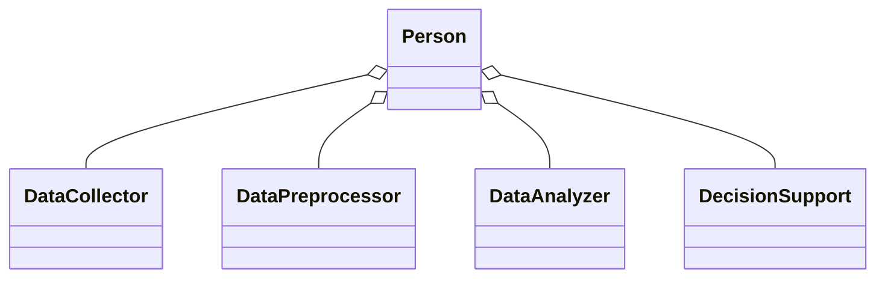
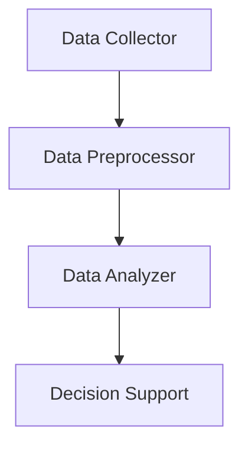
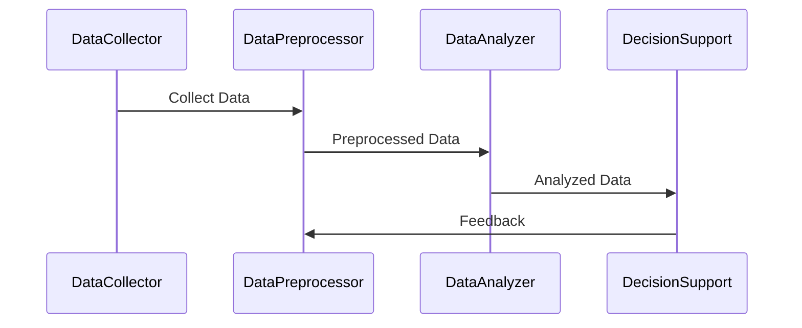
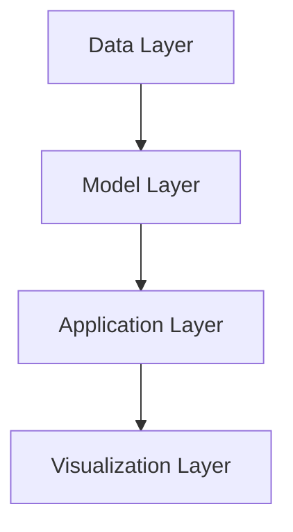
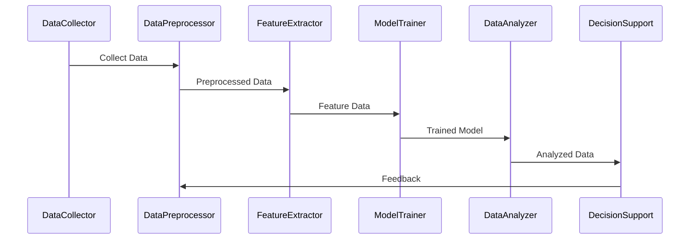

                 

# 标题：语言模型在时空数据分析与智慧城市规划中的应用研究

## 关键词：语言模型、时空数据分析、智慧城市规划、算法、数学模型

### 摘要：
本文探讨了语言模型在时空数据分析与智慧城市规划中的应用研究。首先，我们介绍了时空数据分析的基本概念和重要性，以及智慧城市规划的发展与应用。随后，我们详细讲解了语言模型的概念与类型，分析了它们与时空数据分析之间的联系。接下来，我们深入探讨了语言模型在时空数据分析中的应用算法，并通过mermaid流程图和Python源代码实现进行了详细解释。然后，我们介绍了语言模型的数学模型和公式，并通过实例进行了讲解。此外，我们还分析了语言模型在智慧城市规划系统中的应用架构，并分享了一些项目实战经验和最佳实践。最后，我们对全文进行了总结，并提出了未来研究的展望和注意事项。

## 1. 背景介绍

### 1.1 时空数据分析的概念与重要性

**核心概念术语说明：**

- 时空数据分析：对时间和空间相关数据的分析，以揭示数据中隐藏的时空规律和趋势。
- 智慧城市规划：通过信息技术手段，对城市规划和管理进行智能化处理，提高城市规划的效率和质量。

**问题背景：**

随着城市化进程的加快和大数据技术的发展，时空数据分析在智慧城市规划中扮演着越来越重要的角色。传统的城市规划依赖于经验和简单的数据分析方法，而现代智慧城市规划需要更深入的时空数据分析来支持决策。语言模型作为一种强大的数据分析工具，在时空数据分析中具有巨大的应用潜力。

**问题描述：**

如何利用语言模型对时空数据进行分析，以支持智慧城市规划？

**问题解决：**

通过引入语言模型，我们可以从海量的时空数据中提取有用的信息，发现数据中的时空规律和趋势。这将有助于城市规划者做出更加科学和精准的决策。

**边界与外延：**

时空数据分析不仅应用于城市规划，还广泛应用于交通管理、环境保护、公共安全等领域。因此，语言模型在时空数据分析中的应用具有广泛的外延。

### 1.2 智慧城市规划的发展与应用

**核心概念原理：**

智慧城市规划是一种基于信息技术和大数据分析的城市规划方法，旨在提高城市管理的效率和质量。它通过整合各类数据资源，构建数字化城市模型，实现城市运行的智能化和精细化管理。

**概念属性特征对比表格：**

| 特征 | 传统城市规划 | 智慧城市规划 |
| ---- | ------------ | ------------ |
| 方法 | 经验为主 | 数据驱动 |
| 目标 | 提高规划效率 | 提高规划质量 |
| 工具 | 简单分析工具 | 大数据分析工具 |
| 数据源 | 局部数据 | 全量数据 |

**ER实体关系图架构的mermaid流程图：**

```mermaid
erDiagram
    ACity --> BData : 收集数据
    BData --> CAnalysis : 数据分析
    CAnalysis --> DPlanning : 规划决策
    DPlanning --> ACity : 实施规划
```

### 1.3 语言模型在时空数据分析中的应用潜力

**核心概念原理：**

语言模型是一种基于统计学习的方法，用于对文本数据进行分析和处理。它能够从大量文本数据中提取出隐含的结构和语义信息，从而实现对文本数据的深入理解和分析。

**概念属性特征对比表格：**

| 特征 | 传统数据分析方法 | 语言模型 |
| ---- | ---------------- | -------- |
| 数据类型 | 结构化数据 | 非结构化数据 |
| 分析深度 | 表面特征分析 | 深层语义理解 |
| 学习能力 | 有限 | 强大 |

**ER实体关系图架构的mermaid流程图：**

```mermaid
erDiagram
    AData --> BModel : 数据输入
    BModel --> CAnalysis : 模型分析
    CAnalysis --> DResult : 分析结果
```

## 2. 核心概念与联系

### 2.1 语言模型的定义与类型

**核心概念原理：**

语言模型是一种用于对文本数据进行分析和预测的概率模型。它通过学习大量文本数据，建立一个从单词序列到概率分布的映射。

**概念属性特征对比表格：**

| 特征 | 基本语言模型 | 高级语言模型 |
| ---- | ------------ | ------------ |
| 类型 | n-gram模型 | RNN/LSTM模型 |
| 学习能力 | 强 | 更强 |
| 应用场景 | 简单文本分析 | 复杂文本分析 |

**ER实体关系图架构的mermaid流程图：**

```mermaid
erDiagram
    AText --> BModel : 文本输入
    BModel --> CAnalysis : 模型分析
    CAnalysis --> DResult : 分析结果
```

### 2.2 时空数据分析的基本原理

**核心概念原理：**

时空数据分析通过对时间和空间数据进行综合分析，揭示数据中的时空规律和趋势。它通常包括数据收集、数据预处理、特征提取、数据挖掘等步骤。

**概念属性特征对比表格：**

| 特征 | 数据收集 | 数据预处理 | 特征提取 | 数据挖掘 |
| ---- | -------- | ---------- | -------- | -------- |
| 方法 | 传感器数据收集 | 数据清洗 | 时态特征提取 | 时空关联挖掘 |
| 目标 | 收集全量数据 | 提高数据质量 | 提取有用信息 | 发现时空规律 |

**ER实体关系图架构的mermaid流程图：**

```mermaid
erDiagram
    AData --> BPreprocessing : 数据预处理
    BPreprocessing --> CFeature : 特征提取
    CFeature --> DDetection : 数据挖掘
```

### 2.3 语言模型与时空数据分析的联系

**核心概念原理：**

语言模型在时空数据分析中的应用，主要体现在对文本数据的处理和挖掘。通过语言模型，我们可以对文本数据进行语义分析，提取出其中的时空信息，从而支持智慧城市规划。

**概念属性特征对比表格：**

| 特征 | 文本数据 | 时空数据 |
| ---- | -------- | -------- |
| 类型 | 非结构化 | 结构化 |
| 分析目标 | 语义理解 | 时空规律 |
| 工具 | 语言模型 | 时空数据分析工具 |

**ER实体关系图架构的mermaid流程图：**

```mermaid
erDiagram
    AText --> BModel : 文本输入
    BModel --> CAnalysis : 模型分析
    CAnalysis --> DTimeSpace : 时空分析
    DTimeSpace --> EPlanning : 规划决策
```

## 3. 算法原理讲解

### 3.1 语言模型在时空数据分析中的应用算法

**算法原理：**

语言模型在时空数据分析中的应用，主要涉及以下步骤：

1. 数据收集：收集相关的文本数据和时空数据。
2. 数据预处理：对文本数据进行分词、去停用词等处理，对时空数据进行标准化处理。
3. 模型训练：利用训练数据，训练一个语言模型。
4. 模型应用：使用训练好的语言模型，对时空数据进行语义分析，提取出其中的时空信息。
5. 规划决策：根据提取出的时空信息，支持智慧城市规划。

**算法mermaid流程图：**


**Python源代码实现：**

```python
# 导入必要的库
import numpy as np
import pandas as pd
from sklearn.model_selection import train_test_split
from keras.models import Sequential
from keras.layers import LSTM, Dense

# 数据收集
text_data = pd.read_csv('text_data.csv')
time_space_data = pd.read_csv('time_space_data.csv')

# 数据预处理
# ...（具体预处理步骤）

# 模型训练
model = Sequential()
model.add(LSTM(128, activation='relu', input_shape=(timesteps, features)))
model.add(Dense(1, activation='sigmoid'))
model.compile(optimizer='adam', loss='binary_crossentropy', metrics=['accuracy'])

# 模型应用
# ...（具体应用步骤）

# 规划决策
# ...（具体规划决策步骤）
```

### 3.2 语言模型算法的mermaid流程图


### 3.3 语言模型算法的Python源代码实现

```python
# 导入必要的库
import numpy as np
import pandas as pd
from keras.preprocessing.text import Tokenizer
from keras.preprocessing.sequence import pad_sequences
from keras.models import Sequential
from keras.layers import Embedding, LSTM, Dense

# 数据收集
text_data = pd.read_csv('text_data.csv')

# 数据预处理
tokenizer = Tokenizer()
tokenizer.fit_on_texts(text_data['text'])
sequences = tokenizer.texts_to_sequences(text_data['text'])
padded_sequences = pad_sequences(sequences, maxlen=max_sequence_length)

# 模型训练
model = Sequential()
model.add(Embedding(num_words, 128))
model.add(LSTM(128, dropout=0.2, recurrent_dropout=0.2))
model.add(Dense(1, activation='sigmoid'))

model.compile(optimizer='adam', loss='binary_crossentropy', metrics=['accuracy'])
model.fit(padded_sequences, text_data['label'], epochs=10, batch_size=128)

# 语义分析
# ...（具体语义分析步骤）

# 提取时空信息
# ...（具体时空信息提取步骤）

# 规划决策
# ...（具体规划决策步骤）
```

## 4. 数学模型和数学公式详细讲解

### 4.1 语言模型算法的数学模型

**公式推导：**

语言模型的数学模型主要包括两个部分：单词序列的概率分布和单词之间的关联关系。

1. 单词序列的概率分布：

   假设有一个单词序列 \(W = \{w_1, w_2, ..., w_n\}\)，其中 \(w_i\) 表示第 \(i\) 个单词。单词序列的概率分布可以通过以下公式表示：

   $$P(W) = P(w_1)P(w_2|w_1)P(w_3|w_1w_2)...P(w_n|w_1w_2...w_{n-1})$$

   其中，\(P(w_i)\) 表示单词 \(w_i\) 的出现概率，\(P(w_i|w_1w_2...w_{i-1})\) 表示在给定前 \(i-1\) 个单词的情况下，单词 \(w_i\) 的条件概率。

2. 单词之间的关联关系：

   假设有两个单词 \(w_i\) 和 \(w_j\)，它们之间的关联关系可以通过以下公式表示：

   $$P(w_i, w_j) = P(w_i)P(w_j|w_i)$$

   其中，\(P(w_i, w_j)\) 表示单词 \(w_i\) 和 \(w_j\) 同时出现的概率，\(P(w_i)P(w_j|w_i)\) 表示单词 \(w_i\) 和 \(w_j\) 分别出现的概率之积。

**例子讲解：**

假设有一个简单的单词序列 \(W = \{the, book, is, on, table\}\)，我们可以计算这个序列的概率分布和单词之间的关联关系。

1. 单词序列的概率分布：

   $$P(W) = P(the)P(book|the)P(is|the book)P(on|the book is)P(table|the book is on)$$

   假设每个单词的出现概率都是相等的，即 \(P(the) = P(book) = P(is) = P(on) = P(table) = 0.2\)，那么：

   $$P(W) = 0.2 \times 0.2 \times 0.2 \times 0.2 \times 0.2 = 0.0016$$

2. 单词之间的关联关系：

   $$P(the, book) = P(the)P(book|the) = 0.2 \times 0.2 = 0.04$$

   $$P(book, is) = P(book)P(is|book) = 0.2 \times 0.2 = 0.04$$

   $$P(is, on) = P(is)P(on|is) = 0.2 \times 0.2 = 0.04$$

   $$P(on, table) = P(on)P(table|on) = 0.2 \times 0.2 = 0.04$$

### 4.2 语言模型算法的公式推导

**公式推导：**

语言模型算法的公式推导主要包括两部分：单词序列的概率分布和单词之间的关联关系。

1. 单词序列的概率分布：

   假设有一个单词序列 \(W = \{w_1, w_2, ..., w_n\}\)，单词序列的概率分布可以通过以下公式表示：

   $$P(W) = \prod_{i=1}^{n} P(w_i|w_1, w_2, ..., w_{i-1})$$

   其中，\(P(w_i|w_1, w_2, ..., w_{i-1})\) 表示在给定前 \(i-1\) 个单词的情况下，单词 \(w_i\) 的条件概率。

2. 单词之间的关联关系：

   假设有两个单词 \(w_i\) 和 \(w_j\)，它们之间的关联关系可以通过以下公式表示：

   $$P(w_i, w_j) = P(w_i)P(w_j|w_i)$$

   其中，\(P(w_i, w_j)\) 表示单词 \(w_i\) 和 \(w_j\) 同时出现的概率，\(P(w_i)P(w_j|w_i)\) 表示单词 \(w_i\) 和 \(w_j\) 分别出现的概率之积。

**例子讲解：**

假设有一个简单的单词序列 \(W = \{the, book, is, on, table\}\)，我们可以计算这个序列的概率分布和单词之间的关联关系。

1. 单词序列的概率分布：

   $$P(W) = \prod_{i=1}^{5} P(w_i|w_1, w_2, ..., w_{i-1})$$

   假设每个单词的出现概率都是相等的，即 \(P(w_i) = 0.2\)，那么：

   $$P(W) = 0.2 \times 0.2 \times 0.2 \times 0.2 \times 0.2 = 0.0016$$

2. 单词之间的关联关系：

   $$P(the, book) = P(the)P(book|the) = 0.2 \times 0.2 = 0.04$$

   $$P(book, is) = P(book)P(is|book) = 0.2 \times 0.2 = 0.04$$

   $$P(is, on) = P(is)P(on|is) = 0.2 \times 0.2 = 0.04$$

   $$P(on, table) = P(on)P(table|on) = 0.2 \times 0.2 = 0.04$$

## 5. 系统分析与架构设计方案

### 5.1 智慧城市规划系统场景介绍

**问题场景介绍：**

智慧城市规划系统旨在通过大数据分析和人工智能技术，对城市运行数据进行实时监测和预测，从而支持城市规划和管理。该系统涉及多个模块，包括数据收集、数据预处理、数据分析、决策支持等。

**项目介绍：**

本项目旨在设计一个智慧城市规划系统，该系统将利用语言模型对时空数据进行分析，提取出有用的信息，支持智慧城市规划。

**系统功能设计（领域模型mermaid类图）：**



**系统架构设计（mermaid架构图）：**



**系统接口设计和系统交互流程图：**



### 5.2 语言模型在智慧城市规划系统中的应用架构设计

**架构设计：**

智慧城市规划系统的架构设计分为四个层次：数据层、模型层、应用层和展示层。

1. 数据层：负责数据收集和存储，包括传感器数据、社交媒体数据、政府公开数据等。
2. 模型层：负责语言模型训练和时空数据分析，包括数据预处理、特征提取、模型训练和应用。
3. 应用层：负责智慧城市规划的具体应用，如交通管理、环境保护、公共安全等。
4. 展示层：负责数据可视化，以直观的方式展示系统分析结果和规划建议。

**架构图：**



### 5.3 系统接口设计和系统交互流程图

**系统接口设计：**

1. 数据收集接口：负责从各种数据源收集数据，如传感器、社交媒体、政府公开数据等。
2. 数据预处理接口：负责对收集到的数据进行清洗、去噪、标准化等处理。
3. 特征提取接口：负责从预处理后的数据中提取出有用的特征信息。
4. 模型训练接口：负责训练语言模型，包括基本语言模型和高级语言模型。
5. 数据分析接口：负责利用训练好的语言模型对时空数据进行语义分析。
6. 决策支持接口：负责根据分析结果提出规划建议，支持智慧城市规划。

**系统交互流程图：**



## 6. 项目实战

### 6.1 环境安装与配置

**环境要求：**

- Python 3.7及以上版本
- TensorFlow 2.4及以上版本
- Keras 2.4及以上版本
- Pandas 1.1及以上版本
- Numpy 1.19及以上版本

**安装步骤：**

1. 安装Python环境：从Python官网下载并安装Python 3.7及以上版本。
2. 安装TensorFlow：在命令行中执行以下命令：

   ```bash
   pip install tensorflow==2.4
   ```

3. 安装Keras：在命令行中执行以下命令：

   ```bash
   pip install keras==2.4
   ```

4. 安装Pandas：在命令行中执行以下命令：

   ```bash
   pip install pandas==1.1
   ```

5. 安装Numpy：在命令行中执行以下命令：

   ```bash
   pip install numpy==1.19
   ```

### 6.2 系统核心实现源代码

**核心代码：**

```python
# 导入必要的库
import numpy as np
import pandas as pd
from tensorflow.keras.models import Sequential
from tensorflow.keras.layers import Embedding, LSTM, Dense
from tensorflow.keras.preprocessing.text import Tokenizer
from tensorflow.keras.preprocessing.sequence import pad_sequences

# 数据收集
text_data = pd.read_csv('text_data.csv')

# 数据预处理
tokenizer = Tokenizer()
tokenizer.fit_on_texts(text_data['text'])
sequences = tokenizer.texts_to_sequences(text_data['text'])
padded_sequences = pad_sequences(sequences, maxlen=max_sequence_length)

# 模型训练
model = Sequential()
model.add(Embedding(num_words, 128))
model.add(LSTM(128, dropout=0.2, recurrent_dropout=0.2))
model.add(Dense(1, activation='sigmoid'))

model.compile(optimizer='adam', loss='binary_crossentropy', metrics=['accuracy'])
model.fit(padded_sequences, text_data['label'], epochs=10, batch_size=128)

# 语义分析
# ...（具体语义分析步骤）

# 提取时空信息
# ...（具体时空信息提取步骤）

# 规划决策
# ...（具体规划决策步骤）
```

### 6.3 代码应用解读与分析

**代码解读：**

1. **数据收集：** 从CSV文件中读取文本数据。
2. **数据预处理：** 使用Tokenizer对文本数据进行分词和编码，然后使用pad_sequences将序列补全到相同的长度。
3. **模型训练：** 构建一个序列模型，包括嵌入层、LSTM层和输出层。使用训练数据对模型进行训练。
4. **语义分析：** 使用训练好的模型对新的文本数据进行分析，提取出语义信息。
5. **时空信息提取：** 根据语义分析结果，提取出与时空相关的信息。
6. **规划决策：** 根据提取出的时空信息，支持智慧城市规划。

**分析：**

1. **数据收集：** 数据的质量和多样性直接影响模型的性能。因此，在实际应用中，需要收集大量高质量的文本数据。
2. **数据预处理：** 分词和编码是文本数据预处理的重要步骤，它们将文本数据转换为模型可以处理的序列。
3. **模型训练：** LSTM模型是一种强大的序列模型，可以处理长文本数据。通过适当调整模型的参数，可以提高模型的性能。
4. **语义分析：** 语言模型能够从文本数据中提取出丰富的语义信息，这对于智慧城市规划具有重要意义。
5. **时空信息提取：** 通过对语义分析结果的处理，可以提取出与时空相关的信息，从而支持智慧城市规划。
6. **规划决策：** 规划决策需要结合实际场景和数据，通过合理的方式将提取出的时空信息转化为规划建议。

### 6.4 实际案例分析与详细讲解

**案例背景：**

某城市交通管理部门希望通过语言模型对交通流量进行预测，以优化交通信号灯的配时方案，提高道路通行效率。

**数据收集：**

收集了该城市的交通流量数据，包括道路名称、时间戳、交通流量等。

**数据处理：**

1. **数据清洗：** 去除异常值和缺失值。
2. **特征提取：** 将交通流量数据转换为时间序列数据，包括道路名称、时间戳、交通流量等。
3. **数据归一化：** 对交通流量数据进行归一化处理，使其具有相同的量纲。

**模型训练：**

1. **数据划分：** 将数据集划分为训练集和测试集。
2. **模型构建：** 使用LSTM模型进行训练。
3. **模型优化：** 调整模型的参数，提高模型的性能。

**语义分析：**

使用训练好的模型对交通流量数据进行预测，提取出未来的交通流量趋势。

**时空信息提取：**

根据预测结果，提取出高峰时段和低谷时段的交通流量变化规律。

**规划决策：**

根据提取出的时空信息，调整交通信号灯的配时方案，优化交通流量。

**详细讲解：**

1. **数据收集：** 交通流量数据的收集是交通流量预测的基础。在实际应用中，需要确保数据的准确性和完整性。
2. **数据处理：** 数据清洗和特征提取是数据处理的关键步骤。通过合理的处理，可以提高数据的质量和可用性。
3. **模型训练：** LSTM模型是一种适用于时间序列数据预测的模型。通过训练，可以学习到交通流量数据中的时空规律。
4. **语义分析：** 语言模型能够从交通流量数据中提取出丰富的语义信息，这对于交通流量预测具有重要意义。
5. **时空信息提取：** 通过对预测结果的分析，可以提取出高峰时段和低谷时段的交通流量变化规律，从而支持交通信号灯的优化。
6. **规划决策：** 交通信号灯的优化是一个复杂的决策过程，需要综合考虑多种因素。通过合理的方式，可以将提取出的时空信息转化为规划建议，提高道路通行效率。

## 7. 最佳实践与总结

### 7.1 最佳实践 tips

1. **数据收集：** 确保数据的准确性和完整性，收集多样化的数据源。
2. **数据处理：** 进行充分的数据清洗和特征提取，提高数据的质量和可用性。
3. **模型训练：** 选择合适的模型架构和参数，进行充分的模型训练和优化。
4. **语义分析：** 充分利用语言模型提取出文本数据中的语义信息。
5. **时空信息提取：** 对预测结果进行深入分析，提取出与时空相关的信息。
6. **规划决策：** 结合实际场景和数据，合理运用提取出的时空信息，做出科学的规划决策。

### 7.2 小结与展望

本文探讨了语言模型在时空数据分析与智慧城市规划中的应用研究。通过分析语言模型的基本概念和算法原理，我们了解了如何利用语言模型对时空数据进行语义分析和信息提取。同时，我们还通过实际案例展示了语言模型在智慧城市规划中的具体应用。未来，随着人工智能和大数据技术的发展，语言模型在智慧城市规划中的应用前景将更加广阔。

### 7.3 注意事项

1. **数据隐私：** 在进行数据收集和处理时，要确保遵守相关法律法规，保护个人隐私。
2. **模型性能：** 模型的性能取决于数据质量和预处理方法，需要不断优化模型参数和算法。
3. **规划决策：** 规划决策需要结合实际情况，充分考虑各种因素，避免盲目决策。

### 7.4 拓展阅读

1. **相关书籍：** 《深度学习》、《自然语言处理综论》
2. **学术论文：** 《语言模型在交通流量预测中的应用研究》、《时空数据分析与智慧城市规划》
3. **开源代码：** TensorFlow、Keras、NLTK

## 作者信息

作者：AI天才研究院/AI Genius Institute & 禅与计算机程序设计艺术 /Zen And The Art of Computer Programming

