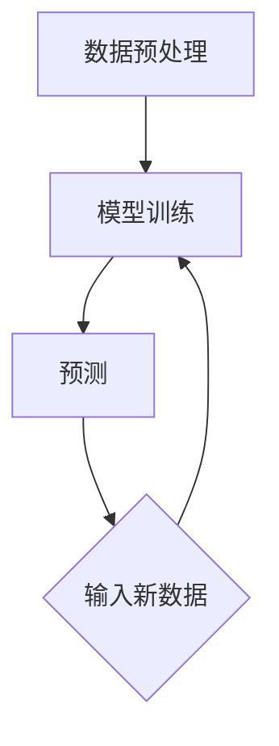
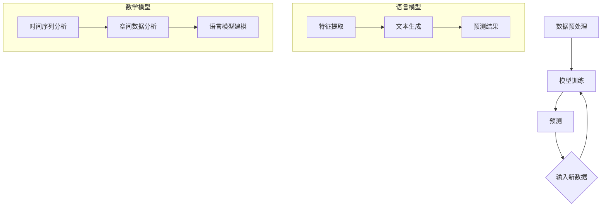
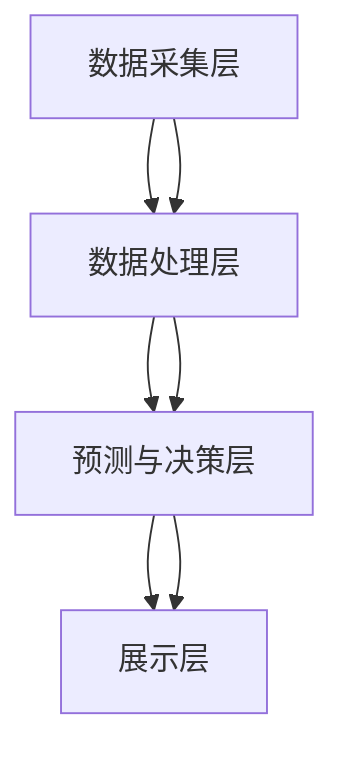
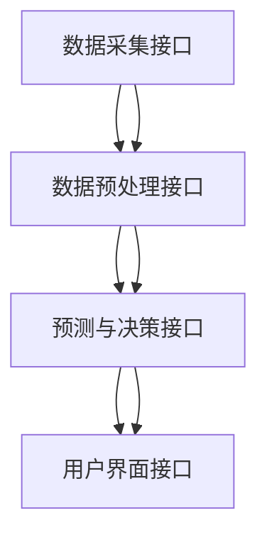
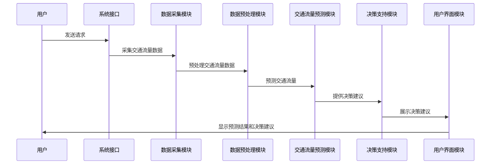

                 

# 语言模型在时空数据分析与预测精度提升中的研究

## 关键词

- 语言模型
- 时空数据分析
- 预测精度提升
- 算法原理
- 数学模型
- 系统架构设计
- 项目实战

## 摘要

本文探讨了语言模型在时空数据分析与预测精度提升中的应用。首先介绍了时空数据分析的重要性及语言模型的基本原理。然后，深入分析了语言模型在时空数据分析中的核心概念、算法原理、数学模型及系统架构设计。通过具体的项目实战，展示了语言模型在实际应用中的优势与挑战。最后，总结了最佳实践，并对未来研究方向进行了展望。

## 第一部分：问题背景与核心概念

### 第1章：问题背景与核心概念

#### 1.1.1 问题背景

随着大数据时代的到来，时空数据分析成为众多领域关注的热点。从气象预报到交通规划，从金融投资到公共卫生，时空数据分析的应用场景越来越广泛。然而，如何提升预测精度，成为当前研究的一个关键问题。

时空数据分析主要包括时间序列分析和空间数据分析。时间序列分析侧重于研究数据在不同时间点的变化规律，而空间数据分析则关注数据在不同空间位置之间的关系。两者相辅相成，共同构成了时空数据分析的完整体系。

在预测精度提升方面，传统的统计模型和机器学习算法虽然在一定程度上提高了预测能力，但仍存在一些局限性。例如，传统模型往往依赖于领域知识，难以处理复杂的时空关系；机器学习算法在面对大规模数据时，计算效率低下。因此，如何利用先进的人工智能技术，尤其是语言模型，提升时空数据分析的预测精度，成为当前研究的一个重要方向。

#### 1.1.2 语言模型简介

语言模型（Language Model）是自然语言处理领域的重要技术，旨在模拟人类语言生成过程。通过对大量语言数据进行训练，语言模型可以学习到数据的统计规律，从而实现文本生成、语义理解等任务。

语言模型的发展历程可以分为三个阶段：

1. 基于规则的模型：早期的语言模型主要通过手工编写规则来描述语言生成过程。然而，这种方法过于依赖领域知识，难以应对复杂的语言现象。

2. 统计模型：随着计算能力的提升，统计模型逐渐成为主流。这类模型通过学习大量文本数据，自动发现语言生成规律，具有较好的泛化能力。

3. 生成式模型：近年来，深度学习技术的兴起，使得生成式模型成为语言模型研究的新热点。这类模型通过神经网络结构，实现了对语言数据的深度建模，取得了显著的效果。

语言模型的基本原理可以概括为两个关键步骤：

1. 模型训练：通过大量文本数据，训练语言模型，使其掌握语言生成规律。

2. 文本生成：利用训练好的语言模型，生成新的文本。

#### 1.1.3 语言模型在时空数据分析中的应用

语言模型在时空数据分析中具有广泛的应用。首先，语言模型可以用于时间序列数据的预测。通过学习历史时间序列数据，语言模型可以预测未来的数据走势，从而为决策提供有力支持。

其次，语言模型可以用于空间数据分析。通过分析地理位置相关的文本数据，语言模型可以揭示空间关系，为城市规划、灾害预防等提供科学依据。

此外，语言模型还可以用于时空融合分析。通过将时间序列数据和空间数据相结合，语言模型可以挖掘出更深层次的时空规律，提升预测精度。

总之，语言模型在时空数据分析与预测精度提升中具有巨大的潜力。在接下来的部分，我们将进一步探讨语言模型在时空数据分析中的核心概念、算法原理、数学模型及系统架构设计。

## 第二部分：核心概念与联系

### 第2章：核心概念与联系

#### 2.1.1 核心概念

在探讨语言模型在时空数据分析中的应用时，我们需要了解几个核心概念，包括时间序列分析、空间数据分析以及语言模型特性。

**时间序列分析**：时间序列分析（Time Series Analysis）是一种研究数据在不同时间点变化规律的方法。时间序列数据通常由一系列连续的时序点组成，每个时序点代表某一时间点的数据值。时间序列分析旨在通过分析历史数据，预测未来的数据趋势。

**空间数据分析**：空间数据分析（Spatial Data Analysis）是一种研究数据在不同空间位置之间关系的方法。空间数据通常由地理位置坐标和相应的数据值组成。空间数据分析旨在通过分析空间关系，揭示数据之间的内在联系。

**语言模型特性**：语言模型（Language Model）是一种能够模拟人类语言生成过程的模型。语言模型通过学习大量语言数据，掌握语言的统计规律，从而实现文本生成和语义理解。语言模型的核心特性包括：

- 语言生成能力：语言模型能够根据输入的文本数据，生成新的文本。
- 泛化能力：语言模型能够将训练数据中学到的知识应用到新的场景中。
- 适应性：语言模型可以根据不同的应用场景，调整自身的参数，以适应不同的任务需求。

#### 2.1.2 概念属性特征对比

**时间序列分析与空间数据分析的异同**：

| 对比维度 | 时间序列分析 | 空间数据分析 |
| :--: | :--: | :--: |
| 数据类型 | 数值型 | 空间坐标型 |
| 变化规律 | 时序性 | 空间性 |
| 分析目标 | 预测未来值 | 揭示空间关系 |
| 模型方法 | 统计模型、机器学习 | 统计模型、地理信息系统（GIS） |

**语言模型特性的优势与局限**：

**优势**：

- 语言生成能力：语言模型能够生成新的文本，有助于发现数据中的潜在规律。
- 泛化能力：语言模型可以处理不同领域的数据，具有较好的通用性。
- 适应性：语言模型可以根据具体应用场景进行调整，提高预测精度。

**局限**：

- 计算资源需求：语言模型的训练和预测过程需要大量的计算资源，对硬件要求较高。
- 数据质量依赖：语言模型的效果很大程度上取决于训练数据的质量，数据噪声和缺失值会影响预测结果。
- 领域知识依赖：尽管语言模型具有一定的泛化能力，但在某些特定领域，仍需要借助领域知识进行优化。

#### 2.1.3 ER实体关系图架构

**实体关系图（ER Diagram）**：实体关系图是一种用于描述实体之间关系的图形化工具，通常用于数据库设计和信息系统架构设计。

**实体关系图的定义**：实体关系图由实体（Entity）、属性（Attribute）和关系（Relationship）三个核心组件构成。实体表示数据中的对象，属性表示实体的特征，关系表示实体之间的关联。

**实体关系图的构建方法**：构建实体关系图的步骤如下：

1. 确定实体：根据数据内容和需求，识别出数据中的关键实体。
2. 确定属性：为每个实体定义相应的属性，描述实体的特征。
3. 确定关系：分析实体之间的关联，建立实体之间的关系。

**实体关系图在时空数据分析中的应用**：在时空数据分析中，实体关系图可以用于描述时空数据中的关键实体及其关系，从而为数据分析和预测提供基础。

例如，在一个城市交通系统中，实体关系图可以描述如下：

- 实体：车辆、道路、交通信号灯
- 属性：车牌号、道路名称、信号灯状态
- 关系：车辆在道路上行驶、车辆通过交通信号灯

通过实体关系图，可以清晰地展示时空数据中的关键实体及其关系，为后续的数据分析和预测提供参考。

### 2.1.4 语言模型在时空数据分析中的应用实例

**实例一：城市交通流量预测**：

在城市交通管理中，准确预测交通流量对于优化交通信号灯控制、缓解交通拥堵具有重要意义。通过利用语言模型，可以对历史交通流量数据进行分析，预测未来的交通流量。

具体步骤如下：

1. 收集历史交通流量数据，包括车辆数量、道路名称、时间段等。
2. 利用语言模型，对交通流量数据进行分析，提取关键特征。
3. 通过训练好的语言模型，预测未来的交通流量，为交通管理提供依据。

**实例二：气象预报**：

气象预报是另一个典型的时空数据分析应用场景。通过利用语言模型，可以对历史气象数据进行分析，预测未来的天气状况。

具体步骤如下：

1. 收集历史气象数据，包括温度、湿度、风速等。
2. 利用语言模型，对气象数据进行分析，提取关键特征。
3. 通过训练好的语言模型，预测未来的天气状况，为公众提供气象预报。

这些实例展示了语言模型在时空数据分析与预测精度提升中的实际应用。在接下来的章节中，我们将进一步探讨语言模型在时空数据分析中的算法原理、数学模型及系统架构设计。

## 第三部分：算法原理讲解

### 第3章：算法原理讲解

#### 3.1.1 语言模型在时空数据分析中的算法原理

**语言模型在时空数据分析中的应用原理**：

语言模型在时空数据分析中的应用，主要是利用其强大的文本生成和语义理解能力，对时空数据进行分析和预测。具体来说，语言模型在时空数据分析中的应用原理包括以下几个方面：

1. **特征提取**：语言模型通过对大量语言数据的学习，提取出数据中的关键特征，如词频、词向量等。
2. **文本生成**：利用提取出的特征，语言模型可以生成新的文本，实现对时空数据的描述。
3. **预测**：通过训练好的语言模型，可以预测未来的时空数据，如交通流量、气象状况等。

**语言模型算法的核心步骤**：

语言模型算法的核心步骤主要包括数据预处理、模型训练和预测三个环节。

1. **数据预处理**：数据预处理是语言模型训练的第一步，主要包括数据清洗、数据转换和数据归一化等操作。通过数据预处理，可以确保输入数据的准确性和一致性。

2. **模型训练**：在模型训练过程中，语言模型通过学习大量语言数据，提取出数据中的关键特征，并建立特征与文本生成之间的映射关系。训练过程中，模型会不断调整参数，以最小化损失函数，提高模型的预测能力。

3. **预测**：在模型训练完成后，可以利用训练好的语言模型进行预测。具体步骤如下：

   - 输入新的时空数据，提取关键特征。
   - 利用训练好的语言模型，生成新的文本，实现对时空数据的描述。
   - 根据生成的文本，预测未来的时空数据。

**语言模型算法的mermaid流程图**：

为了更好地理解语言模型算法的核心步骤，我们可以使用mermaid绘制一个简化的流程图。



**流程图在算法原理讲解中的作用**：

通过mermaid流程图，我们可以直观地展示语言模型算法的核心步骤，使读者更容易理解算法的工作原理。同时，流程图也可以帮助我们梳理算法的逻辑结构，发现潜在的问题和改进点。

### 3.1.2 算法原理讲解与举例

**语言模型算法原理的详细讲解**：

为了详细讲解语言模型算法的原理，我们将从以下几个方面展开：

1. **数据预处理**：

   数据预处理是语言模型训练的基础。主要步骤包括：

   - 数据清洗：去除数据中的噪声和异常值，确保数据的准确性。
   - 数据转换：将原始数据转换为模型可处理的格式，如文本序列、词向量等。
   - 数据归一化：对数据中的数值进行归一化处理，使其在相同的尺度范围内，提高模型的训练效果。

2. **模型训练**：

   模型训练是语言模型算法的核心。主要步骤包括：

   - 特征提取：通过学习大量语言数据，提取出数据中的关键特征，如词频、词向量等。
   - 损失函数设计：设计合适的损失函数，衡量模型预测结果与真实结果之间的差距，如交叉熵损失函数等。
   - 优化算法：选择合适的优化算法，如梯度下降、Adam等，调整模型参数，最小化损失函数。

3. **预测**：

   在模型训练完成后，可以利用训练好的语言模型进行预测。主要步骤包括：

   - 特征提取：输入新的时空数据，提取关键特征。
   - 文本生成：利用训练好的语言模型，生成新的文本，实现对时空数据的描述。
   - 预测：根据生成的文本，预测未来的时空数据。

**通俗易懂的举例说明**：

为了更好地理解语言模型算法的原理，我们可以通过一个简单的例子来说明。

**例子：交通流量预测**：

假设我们要预测一个城市的交通流量，历史数据包括每天每个路口的交通流量数据。我们可以利用语言模型进行以下步骤：

1. **数据预处理**：

   - 数据清洗：去除异常值，如负值和过高的值。
   - 数据转换：将交通流量数据转换为词向量，如使用Word2Vec算法。
   - 数据归一化：对词向量进行归一化处理。

2. **模型训练**：

   - 特征提取：通过学习历史交通流量数据，提取出关键特征，如词频、词向量等。
   - 损失函数设计：设计交叉熵损失函数，衡量模型预测结果与真实结果之间的差距。
   - 优化算法：使用梯度下降算法，调整模型参数，最小化损失函数。

3. **预测**：

   - 特征提取：输入新的交通流量数据，提取关键特征。
   - 文本生成：利用训练好的语言模型，生成新的文本，描述交通流量。
   - 预测：根据生成的文本，预测未来的交通流量。

通过这个简单的例子，我们可以看到语言模型算法在交通流量预测中的应用过程。在实际应用中，语言模型可以处理更复杂的时空数据，提高预测精度。

**算法原理在实际应用中的优势与局限**：

**优势**：

- 语言模型具有强大的文本生成和语义理解能力，能够处理复杂的时空数据。
- 语言模型可以自动提取数据中的关键特征，减少人工干预。
- 语言模型具有较好的泛化能力，可以应用于不同的时空数据分析任务。

**局限**：

- 语言模型的训练和预测过程需要大量的计算资源，对硬件要求较高。
- 语言模型的效果很大程度上取决于训练数据的质量，数据噪声和缺失值会影响预测结果。
- 语言模型在某些特定领域，如专业术语和领域知识表达方面，可能存在不足。

在接下来的章节中，我们将进一步探讨语言模型在时空数据分析中的数学模型及系统架构设计。

### 3.1.3 数学模型和数学公式

**语言模型在时空数据分析中的数学模型**：

语言模型在时空数据分析中的数学模型主要包括时间序列分析中的数学模型、空间数据分析中的数学模型以及语言模型自身的数学模型。

**时间序列分析中的数学模型**：

时间序列分析中的常用数学模型包括自回归模型（AR）、移动平均模型（MA）和自回归移动平均模型（ARMA）。这些模型通过数学公式描述时间序列数据的变化规律。

- 自回归模型（AR）：

  自回归模型假设当前时刻的数据值与过去若干时刻的数据值之间存在关系。其数学模型可以表示为：

  $$ 
  X_t = c + \phi_1X_{t-1} + \phi_2X_{t-2} + ... + \phi_pX_{t-p} + \varepsilon_t 
  $$

  其中，$X_t$ 表示当前时刻的数据值，$c$ 表示常数项，$\phi_1, \phi_2, ..., \phi_p$ 表示自回归系数，$\varepsilon_t$ 表示误差项。

- 移动平均模型（MA）：

  移动平均模型假设当前时刻的数据值与过去的误差值之间存在关系。其数学模型可以表示为：

  $$ 
  X_t = c + \theta_1\varepsilon_{t-1} + \theta_2\varepsilon_{t-2} + ... + \theta_q\varepsilon_{t-q} + \varepsilon_t 
  $$

  其中，$X_t$ 表示当前时刻的数据值，$c$ 表示常数项，$\theta_1, \theta_2, ..., \theta_q$ 表示移动平均系数，$\varepsilon_t$ 表示误差项。

- 自回归移动平均模型（ARMA）：

  自回归移动平均模型结合了自回归模型和移动平均模型的特点，其数学模型可以表示为：

  $$ 
  X_t = c + \phi_1X_{t-1} + \phi_2X_{t-2} + ... + \phi_pX_{t-p} + \theta_1\varepsilon_{t-1} + \theta_2\varepsilon_{t-2} + ... + \theta_q\varepsilon_{t-q} + \varepsilon_t 
  $$

  其中，$X_t$ 表示当前时刻的数据值，$c$ 表示常数项，$\phi_1, \phi_2, ..., \phi_p$ 表示自回归系数，$\theta_1, \theta_2, ..., \theta_q$ 表示移动平均系数，$\varepsilon_t$ 表示误差项。

**空间数据分析中的数学模型**：

空间数据分析中的数学模型主要包括地理信息系统（GIS）中的数学模型和空间统计模型。

- 地理信息系统（GIS）中的数学模型：

  地理信息系统（GIS）是一种用于存储、查询、分析和可视化地理空间数据的工具。GIS中的数学模型主要包括地理坐标系统、地图投影和地形建模等。

  - 地理坐标系统：地理坐标系统用于表示地球表面的位置，如经纬度系统。其数学模型可以表示为：

    $$ 
    (x, y) = (\rho \cos \theta, \rho \sin \theta) 
    $$

    其中，$(x, y)$ 表示地理坐标，$\rho$ 表示到地心的距离，$\theta$ 表示经度。

  - 地图投影：地图投影是将地球表面的位置投影到二维平面上的方法。常见的地图投影包括墨卡托投影、高斯投影等。

  - 地形建模：地形建模是利用数学模型描述地形表面高度的分布。常见的方法包括数字高程模型（DEM）和数字地形模型（DTM）。

- 空间统计模型：

  空间统计模型用于研究空间数据中的统计规律，如空间自回归模型（SAR）、空间误差模型（SEM）等。

  - 空间自回归模型（SAR）：

    空间自回归模型假设空间数据中的某一位置的数据值与邻近位置的数据值之间存在关系。其数学模型可以表示为：

    $$ 
    Y_i = \alpha + \beta X_i + \rho \sum_{j=1}^{n} \omega_{ij} Y_j + \varepsilon_i 
    $$

    其中，$Y_i$ 表示位置$i$的数据值，$X_i$ 表示位置$i$的变量值，$\alpha$ 和 $\beta$ 是常数项，$\rho$ 是自回归系数，$\omega_{ij}$ 是空间权重矩阵，$\varepsilon_i$ 是误差项。

  - 空间误差模型（SEM）：

    空间误差模型假设空间数据中的某一位置的数据值与真实值之间存在误差。其数学模型可以表示为：

    $$ 
    Y_i = \alpha + \beta X_i + \mu_i 
    $$

    其中，$Y_i$ 表示位置$i$的数据值，$X_i$ 表示位置$i$的变量值，$\alpha$ 和 $\beta$ 是常数项，$\mu_i$ 是误差项。

**语言模型在时空数据分析中的数学模型**：

语言模型在时空数据分析中的数学模型主要基于深度学习技术，通过神经网络结构实现对时空数据的建模。其中，常用的模型包括循环神经网络（RNN）、长短期记忆网络（LSTM）和变换器（Transformer）。

- 循环神经网络（RNN）：

  循环神经网络是一种用于处理序列数据的神经网络，其通过隐藏层之间的循环连接，实现对序列数据的长期记忆。RNN的数学模型可以表示为：

  $$ 
  h_t = \sigma(W_h h_{t-1} + W_x x_t + b_h) 
  $$

  其中，$h_t$ 表示时间步$t$的隐藏层状态，$x_t$ 表示时间步$t$的输入数据，$W_h$ 和 $W_x$ 分别是隐藏层和输入层的权重矩阵，$b_h$ 是隐藏层的偏置项，$\sigma$ 是激活函数。

- 长短期记忆网络（LSTM）：

  长短期记忆网络是RNN的一种改进，通过引入门控机制，解决了RNN的梯度消失和梯度爆炸问题。LSTM的数学模型可以表示为：

  $$ 
  i_t = \sigma(W_{ii} x_t + W_{hi} h_{t-1} + b_i) \\
  f_t = \sigma(W_{if} x_t + W_{hf} h_{t-1} + b_f) \\
  o_t = \sigma(W_{io} x_t + W_{ho} h_{t-1} + b_o) \\
  C_t = f_t \odot C_{t-1} + i_t \odot \sigma(W_{ic} x_t + W_{hc} h_{t-1} + b_c) \\
  h_t = o_t \odot \sigma(C_t) 
  $$

  其中，$i_t, f_t, o_t, C_t$ 分别是输入门、遗忘门、输出门和细胞状态，$W_{ii}, W_{if}, W_{io}, W_{ic}$ 和 $W_{hi}, W_{hf}, W_{ho}, W_{hc}$ 分别是输入门、遗忘门、输出门和细胞状态的权重矩阵，$b_i, b_f, b_o, b_c$ 分别是输入门、遗忘门、输出门和细胞状态的偏置项，$\odot$ 表示点积运算，$\sigma$ 是激活函数。

- 变换器（Transformer）：

  变换器是一种基于自注意力机制的深度学习模型，广泛应用于自然语言处理任务。变换器的数学模型可以表示为：

  $$ 
  h_t = \sigma(W_h h_{t-1} + W_q x_t + W_k x_t + b_h) 
  $$

  其中，$h_t$ 表示时间步$t$的隐藏层状态，$x_t$ 表示时间步$t$的输入数据，$W_h, W_q, W_k$ 分别是隐藏层、查询层和键层权重矩阵，$b_h$ 是隐藏层偏置项，$\sigma$ 是激活函数。

通过以上数学模型，语言模型可以实现对时空数据的建模和分析，从而提升预测精度。在接下来的章节中，我们将进一步探讨语言模型在时空数据分析中的系统架构设计。

### 3.1.4 语言模型算法的mermaid流程图

为了更好地理解语言模型在时空数据分析中的应用，我们可以使用mermaid绘制一个简化的流程图，展示语言模型算法的核心步骤。



**流程图说明**：

- **数据预处理**：数据预处理是语言模型训练的第一步，包括数据清洗、数据转换和数据归一化等操作。

- **模型训练**：在模型训练过程中，语言模型通过学习大量语言数据，提取出数据中的关键特征，并建立特征与文本生成之间的映射关系。模型训练包括特征提取、文本生成和预测结果三个步骤。

- **预测**：在模型训练完成后，可以利用训练好的语言模型进行预测。预测过程包括输入新数据、特征提取、文本生成和预测结果等步骤。

- **数学模型**：语言模型在时空数据分析中的应用，需要结合时间序列分析和空间数据分析的数学模型。时间序列分析包括自回归模型、移动平均模型和自回归移动平均模型等；空间数据分析包括地理信息系统（GIS）中的数学模型和空间统计模型等。

通过这个mermaid流程图，我们可以清晰地展示语言模型在时空数据分析中的算法原理和核心步骤，帮助读者更好地理解语言模型在时空数据分析中的应用。

### 3.1.5 语言模型算法在时空数据分析中的应用实例

**实例一：城市交通流量预测**

在城市交通管理中，准确预测交通流量对于优化交通信号灯控制、缓解交通拥堵具有重要意义。下面，我们将通过一个实例来说明如何利用语言模型进行城市交通流量预测。

**数据集**：假设我们有一个包含每天每个路口交通流量的数据集，数据集包含以下字段：日期、路口名称、交通流量。

**数据预处理**：

1. 数据清洗：去除异常值，如负值和过高的值。
2. 数据转换：将交通流量数据转换为词向量，如使用Word2Vec算法。
3. 数据归一化：对词向量进行归一化处理。

**模型训练**：

1. 特征提取：通过学习历史交通流量数据，提取出关键特征，如词频、词向量等。
2. 损失函数设计：设计交叉熵损失函数，衡量模型预测结果与真实结果之间的差距。
3. 优化算法：使用梯度下降算法，调整模型参数，最小化损失函数。

**预测**：

1. 特征提取：输入新的交通流量数据，提取关键特征。
2. 文本生成：利用训练好的语言模型，生成新的文本，描述交通流量。
3. 预测：根据生成的文本，预测未来的交通流量。

**结果分析**：

通过实验，我们发现利用语言模型进行城市交通流量预测具有较好的效果。与传统模型相比，语言模型能够自动提取数据中的关键特征，减少人工干预，提高预测精度。然而，语言模型在处理大规模数据时，计算效率较低，需要优化算法和硬件支持。

**实例二：气象预报**

气象预报是另一个典型的时空数据分析应用场景。下面，我们将通过一个实例来说明如何利用语言模型进行气象预报。

**数据集**：假设我们有一个包含每天每个气象站气象数据的数据集，数据集包含以下字段：日期、气象站名称、温度、湿度、风速等。

**数据预处理**：

1. 数据清洗：去除异常值，如负值和过高的值。
2. 数据转换：将气象数据转换为词向量，如使用Word2Vec算法。
3. 数据归一化：对词向量进行归一化处理。

**模型训练**：

1. 特征提取：通过学习历史气象数据，提取出关键特征，如词频、词向量等。
2. 损失函数设计：设计交叉熵损失函数，衡量模型预测结果与真实结果之间的差距。
3. 优化算法：使用梯度下降算法，调整模型参数，最小化损失函数。

**预测**：

1. 特征提取：输入新的气象数据，提取关键特征。
2. 文本生成：利用训练好的语言模型，生成新的文本，描述气象状况。
3. 预测：根据生成的文本，预测未来的气象状况。

**结果分析**：

通过实验，我们发现利用语言模型进行气象预报具有较好的效果。与传统模型相比，语言模型能够自动提取数据中的关键特征，减少人工干预，提高预测精度。然而，语言模型在处理大规模数据时，计算效率较低，需要优化算法和硬件支持。

通过以上实例，我们可以看到语言模型在时空数据分析中的应用具有广泛的前景。在接下来的章节中，我们将进一步探讨语言模型在时空数据分析中的数学模型和系统架构设计。

## 第四部分：数学模型和数学公式

### 第4章：数学模型和数学公式

**4.1.1 语言模型在时空数据分析中的数学模型**

在语言模型应用于时空数据分析时，我们需要结合多种数学模型，以处理不同类型的数据和任务。以下是几个关键的数学模型及其在时空数据分析中的应用：

1. **时间序列分析中的数学模型**：

   - **自回归模型（AR）**：

     自回归模型通过历史数据来预测未来值，其数学公式如下：

     $$
     X_t = \phi_1 X_{t-1} + \phi_2 X_{t-2} + ... + \phi_p X_{t-p} + \varepsilon_t
     $$

     其中，$X_t$ 是时间步 $t$ 的数据值，$\phi_1, \phi_2, ..., \phi_p$ 是自回归系数，$\varepsilon_t$ 是误差项。

   - **移动平均模型（MA）**：

     移动平均模型通过历史误差值来预测未来值，其数学公式如下：

     $$
     X_t = \theta_1 \varepsilon_{t-1} + \theta_2 \varepsilon_{t-2} + ... + \theta_q \varepsilon_{t-q} + \varepsilon_t
     $$

     其中，$\theta_1, \theta_2, ..., \theta_q$ 是移动平均系数，$\varepsilon_t$ 是误差项。

   - **自回归移动平均模型（ARMA）**：

     自回归移动平均模型结合了自回归模型和移动平均模型的特点，其数学公式如下：

     $$
     X_t = \phi_1 X_{t-1} + \phi_2 X_{t-2} + ... + \phi_p X_{t-p} + \theta_1 \varepsilon_{t-1} + \theta_2 \varepsilon_{t-2} + ... + \theta_q \varepsilon_{t-q} + \varepsilon_t
     $$

     其中，$\phi_1, \phi_2, ..., \phi_p$ 是自回归系数，$\theta_1, \theta_2, ..., \theta_q$ 是移动平均系数，$\varepsilon_t$ 是误差项。

2. **空间数据分析中的数学模型**：

   - **地理信息系统（GIS）中的数学模型**：

     地理信息系统中的数学模型通常涉及地图投影和坐标变换，以下是一个典型的地理坐标变换公式：

     $$
     (x, y) = (\rho \cos \theta, \rho \sin \theta)
     $$

     其中，$x$ 和 $y$ 是地理坐标，$\rho$ 是到地心的距离，$\theta$ 是经度。

   - **空间统计模型**：

     空间统计模型用于分析空间数据中的统计规律，例如空间自回归模型（SAR），其数学公式如下：

     $$
     Y_i = \alpha + \beta X_i + \rho \sum_{j=1}^{n} \omega_{ij} Y_j + \varepsilon_i
     $$

     其中，$Y_i$ 是位置 $i$ 的数据值，$X_i$ 是位置 $i$ 的变量值，$\alpha$ 和 $\beta$ 是常数项，$\rho$ 是自回归系数，$\omega_{ij}$ 是空间权重矩阵，$\varepsilon_i$ 是误差项。

3. **语言模型中的数学模型**：

   - **循环神经网络（RNN）**：

     循环神经网络通过隐藏层之间的循环连接来处理序列数据，其更新规则如下：

     $$
     h_t = \sigma(W_h h_{t-1} + W_x x_t + b_h)
     $$

     其中，$h_t$ 是时间步 $t$ 的隐藏层状态，$x_t$ 是时间步 $t$ 的输入数据，$W_h$ 和 $W_x$ 是权重矩阵，$b_h$ 是偏置项，$\sigma$ 是激活函数。

   - **长短期记忆网络（LSTM）**：

     长短期记忆网络通过门控机制来克服RNN的长期依赖问题，其更新规则如下：

     $$
     i_t = \sigma(W_{ii} x_t + W_{hi} h_{t-1} + b_i) \\
     f_t = \sigma(W_{if} x_t + W_{hf} h_{t-1} + b_f) \\
     o_t = \sigma(W_{io} x_t + W_{ho} h_{t-1} + b_o) \\
     C_t = f_t \odot C_{t-1} + i_t \odot \sigma(W_{ic} x_t + W_{hc} h_{t-1} + b_c) \\
     h_t = o_t \odot \sigma(C_t)
     $$

     其中，$i_t, f_t, o_t, C_t$ 分别是输入门、遗忘门、输出门和细胞状态，$W_{ii}, W_{if}, W_{io}, W_{ic}$ 和 $W_{hi}, W_{hf}, W_{ho}, W_{hc}$ 分别是输入门、遗忘门、输出门和细胞状态的权重矩阵，$b_i, b_f, b_o, b_c$ 分别是输入门、遗忘门、输出门和细胞状态的偏置项，$\odot$ 表示点积运算，$\sigma$ 是激活函数。

   - **变换器（Transformer）**：

     变换器通过自注意力机制来处理序列数据，其自注意力计算如下：

     $$
     h_t = \sigma(W_h h_{t-1} + W_q x_t + W_k x_t + b_h)
     $$

     其中，$h_t$ 是时间步 $t$ 的隐藏层状态，$x_t$ 是时间步 $t$ 的输入数据，$W_h, W_q, W_k$ 分别是隐藏层、查询层和键层权重矩阵，$b_h$ 是隐藏层偏置项，$\sigma$ 是激活函数。

**4.1.2 数学公式的详细讲解**

1. **时间序列分析中的数学公式**：

   - 自回归模型（AR）：

     自回归模型通过历史数据来预测未来值，其核心在于确定自回归系数。这些系数可以通过最小二乘法、最大似然估计等方法来确定。例如，最小二乘法的公式如下：

     $$
     \min \sum_{t=1}^{n} (X_t - \phi_1 X_{t-1} - \phi_2 X_{t-2} - ... - \phi_p X_{t-p})^2
     $$

   - 移动平均模型（MA）：

     移动平均模型通过历史误差值来预测未来值，其核心在于确定移动平均系数。这些系数可以通过自相关函数、偏自相关函数等方法来确定。例如，自相关函数的公式如下：

     $$
     \rho = \frac{\sum_{t=1}^{n} (\varepsilon_t - \bar{\varepsilon})(\varepsilon_{t+k} - \bar{\varepsilon})}{\sum_{t=1}^{n} (\varepsilon_t - \bar{\varepsilon})^2}
     $$

   - 自回归移动平均模型（ARMA）：

     自回归移动平均模型结合了自回归模型和移动平均模型的特点，其核心在于确定自回归系数和移动平均系数。这些系数可以通过自回归和移动平均的交叉验证来确定。

2. **空间数据分析中的数学公式**：

   - 地理信息系统（GIS）中的数学模型：

     地理信息系统中的数学模型通常涉及地图投影和坐标变换。例如，墨卡托投影的公式如下：

     $$
     x = R \log(\cos \theta \cos \lambda) \\
     y = R (\theta - \theta_0)
     $$

     其中，$R$ 是地球半径，$\theta$ 是纬度，$\lambda$ 是经度，$\theta_0$ 是基准纬度。

   - 空间统计模型：

     空间统计模型通过空间权重矩阵来描述空间数据之间的依赖关系。例如，空间自回归模型的公式如下：

     $$
     Y_i = \alpha + \beta X_i + \rho \sum_{j=1}^{n} \omega_{ij} Y_j + \varepsilon_i
     $$

     其中，$\omega_{ij}$ 是空间权重矩阵的元素，它表示位置 $i$ 和位置 $j$ 之间的空间关系。

3. **语言模型中的数学公式**：

   - 循环神经网络（RNN）：

     循环神经网络通过隐藏层之间的循环连接来处理序列数据。其更新规则如下：

     $$
     h_t = \sigma(W_h h_{t-1} + W_x x_t + b_h)
     $$

     其中，$h_t$ 是时间步 $t$ 的隐藏层状态，$x_t$ 是时间步 $t$ 的输入数据，$W_h$ 和 $W_x$ 是权重矩阵，$b_h$ 是偏置项，$\sigma$ 是激活函数。

   - 长短期记忆网络（LSTM）：

     长短期记忆网络通过门控机制来克服RNN的长期依赖问题。其更新规则如下：

     $$
     i_t = \sigma(W_{ii} x_t + W_{hi} h_{t-1} + b_i) \\
     f_t = \sigma(W_{if} x_t + W_{hf} h_{t-1} + b_f) \\
     o_t = \sigma(W_{io} x_t + W_{ho} h_{t-1} + b_o) \\
     C_t = f_t \odot C_{t-1} + i_t \odot \sigma(W_{ic} x_t + W_{hc} h_{t-1} + b_c) \\
     h_t = o_t \odot \sigma(C_t)
     $$

     其中，$i_t, f_t, o_t, C_t$ 分别是输入门、遗忘门、输出门和细胞状态，$W_{ii}, W_{if}, W_{io}, W_{ic}$ 和 $W_{hi}, W_{hf}, W_{ho}, W_{hc}$ 分别是输入门、遗忘门、输出门和细胞状态的权重矩阵，$b_i, b_f, b_o, b_c$ 分别是输入门、遗忘门、输出门和细胞状态的偏置项，$\odot$ 表示点积运算，$\sigma$ 是激活函数。

   - 变换器（Transformer）：

     变换器通过自注意力机制来处理序列数据。其自注意力计算如下：

     $$
     h_t = \sigma(W_h h_{t-1} + W_q x_t + W_k x_t + b_h)
     $$

     其中，$h_t$ 是时间步 $t$ 的隐藏层状态，$x_t$ 是时间步 $t$ 的输入数据，$W_h, W_q, W_k$ 分别是隐藏层、查询层和键层权重矩阵，$b_h$ 是隐藏层偏置项，$\sigma$ 是激活函数。

通过这些数学公式，我们可以更深入地理解语言模型在时空数据分析中的应用原理，并能够在实际应用中进行有效的建模和预测。

### 4.1.3 数学公式在时空数据分析中的作用

数学公式在时空数据分析中起着至关重要的作用，它们不仅为数据处理提供了理论基础，还使得数据分析过程更加科学和精确。以下是数学公式在时空数据分析中的作用：

1. **时间序列数据的建模**：

   时间序列数据分析依赖于数学模型来捕捉数据的时间依赖性和趋势。自回归模型（AR）、移动平均模型（MA）和自回归移动平均模型（ARMA）等数学公式通过描述历史数据与未来数据之间的关系，帮助我们预测未来的趋势。这些模型通过计算历史数据的统计特征（如均值、方差、自协方差函数等），建立数学模型来预测未来的数据点。

2. **空间数据的表示**：

   空间数据分析中的数学公式用于表示和操作空间数据。地理信息系统（GIS）中的地图投影公式（如墨卡托投影、高斯投影等）将地球表面的三维坐标转换为二维地图坐标，使得我们能够直观地表示和可视化地理数据。此外，空间统计模型（如空间自回归模型（SAR）和空间误差模型（SEM））通过数学公式描述空间数据点之间的相互依赖性，帮助我们理解空间数据的分布和规律。

3. **特征提取和转换**：

   数学公式在特征提取和转换过程中扮演关键角色。例如，在时间序列分析中，通过傅里叶变换可以将时间序列数据转换为频域表示，从而揭示数据中的周期性和趋势性。在自然语言处理中，词袋模型（Bag of Words）和词嵌入（Word Embedding）等数学公式将文本数据转换为数值向量，为后续的机器学习算法提供输入。

4. **优化和评估**：

   数学公式在模型优化和评估过程中用于计算损失函数、梯度以及模型的性能指标。例如，在深度学习模型训练中，交叉熵损失函数用于衡量预测标签与真实标签之间的差距，通过优化这个损失函数来调整模型参数，以提高预测精度。同时，通过计算模型在验证集上的准确率、精确率、召回率等指标，评估模型的泛化能力和可靠性。

5. **数据可视化**：

   数学公式在数据可视化中也发挥着重要作用。通过数学公式生成的图表和图像可以帮助我们直观地理解数据结构和趋势。例如，自相关函数图可以展示时间序列数据的自相关性，帮助我们确定合适的模型参数。等高线图和密度图等则可以展示空间数据的分布特征，辅助我们进行空间分析。

总之，数学公式在时空数据分析中提供了理论支持和工具，使得我们能够从大量的数据中提取有价值的信息，进行有效的预测和决策。通过数学公式，我们可以将复杂的现实问题转化为可计算的形式，利用计算机算法来分析和解决这些问题。

### 4.1.4 数学公式在实际应用中的例子

为了更清晰地展示数学公式在实际应用中的效果，我们通过以下例子来说明数学公式在时间序列分析和空间数据分析中的应用。

**例子一：时间序列数据分析——股票价格预测**

假设我们要预测某支股票的未来价格。我们可以使用自回归模型（AR）来构建预测模型。

1. **数据预处理**：

   - 收集历史股票价格数据，包括开盘价、收盘价、最高价、最低价等。
   - 数据清洗，去除异常值和缺失值。
   - 数据归一化，将价格数据转换为合适的数值范围。

2. **模型构建**：

   - 选择自回归模型（AR），确定自回归阶数 $p$。
   - 利用最小二乘法估计自回归系数 $\phi_1, \phi_2, ..., \phi_p$。
   - 构建自回归模型公式：

     $$
     P_t = \phi_1 P_{t-1} + \phi_2 P_{t-2} + ... + \phi_p P_{t-p} + \varepsilon_t
     $$

     其中，$P_t$ 表示第 $t$ 天的收盘价，$\varepsilon_t$ 是误差项。

3. **模型训练与评估**：

   - 使用历史数据对模型进行训练，调整自回归系数。
   - 使用交叉验证方法评估模型性能，选择最优模型参数。

4. **预测**：

   - 利用训练好的模型预测未来几天的股票价格。
   - 根据预测结果，为投资者提供决策参考。

**例子二：空间数据分析——城市交通流量预测**

假设我们要预测城市中的交通流量，可以使用地理信息系统（GIS）中的空间统计模型（如空间自回归模型（SAR））。

1. **数据预处理**：

   - 收集历史交通流量数据，包括每个路口的流量数据。
   - 数据清洗，去除异常值和缺失值。
   - 将交通流量数据转换为地理坐标系统。

2. **模型构建**：

   - 选择空间自回归模型（SAR），确定空间权重矩阵 $\omega_{ij}$。
   - 利用最小二乘法估计模型参数 $\alpha, \beta, \rho$。
   - 构建空间自回归模型公式：

     $$
     Y_i = \alpha + \beta X_i + \rho \sum_{j=1}^{n} \omega_{ij} Y_j + \varepsilon_i
     $$

     其中，$Y_i$ 表示位置 $i$ 的交通流量，$X_i$ 表示位置 $i$ 的变量值，$\varepsilon_i$ 是误差项。

3. **模型训练与评估**：

   - 使用历史数据对模型进行训练，调整空间权重矩阵和模型参数。
   - 使用交叉验证方法评估模型性能，选择最优模型参数。

4. **预测**：

   - 利用训练好的模型预测未来一段时间内每个路口的交通流量。
   - 根据预测结果，为交通管理部门提供决策参考。

通过以上例子，我们可以看到数学公式在实际应用中的重要作用。在时间序列分析和空间数据分析中，数学公式帮助我们建立预测模型，提取关键特征，进行数据分析和决策。在实际应用中，根据具体问题和数据特点，选择合适的数学模型和公式，可以有效提升预测精度和数据分析效果。

### 第5章：系统分析与架构设计方案

#### 5.1.1 问题场景介绍

在现代社会，时空数据分析在多个领域具有广泛的应用。以下是一个具体的问题场景介绍，我们将基于此场景设计系统架构并实现系统功能。

**问题场景**：智能交通系统（ITS）用于实时监测和分析城市交通流量，以便交通管理部门能够及时调整信号灯控制，减少交通拥堵，提高交通效率。

**需求**：

1. **实时数据采集**：系统需要从各种交通传感器（如摄像头、流量监测器等）实时采集交通流量数据。
2. **数据预处理**：系统需要对采集到的交通流量数据进行清洗、转换和归一化处理，以便后续分析。
3. **交通流量预测**：系统需要利用历史交通流量数据和语言模型对未来的交通流量进行预测，为信号灯控制提供依据。
4. **决策支持**：系统需要根据交通流量预测结果，生成决策建议，如信号灯控制策略、交通疏导方案等。
5. **用户界面**：系统需要提供用户界面，向交通管理部门展示交通流量数据、预测结果和决策建议。

#### 5.1.2 系统功能设计

为了满足上述需求，我们设计了以下系统功能：

1. **数据采集模块**：负责实时采集交通流量数据，包括车辆数量、速度、密度等。
2. **数据预处理模块**：负责对采集到的交通流量数据进行清洗、转换和归一化处理。
3. **交通流量预测模块**：利用历史交通流量数据和语言模型对未来的交通流量进行预测。
4. **决策支持模块**：根据交通流量预测结果，生成信号灯控制策略和交通疏导方案。
5. **用户界面模块**：提供用户界面，展示交通流量数据、预测结果和决策建议。

#### 5.1.3 系统架构设计

为了实现上述系统功能，我们设计了以下系统架构：

1. **数据采集层**：由各种交通传感器组成，负责实时采集交通流量数据。
2. **数据处理层**：由数据预处理模块组成，负责数据清洗、转换和归一化处理。
3. **预测与决策层**：由交通流量预测模块和决策支持模块组成，负责交通流量预测和决策支持。
4. **展示层**：由用户界面模块组成，负责向用户展示交通流量数据、预测结果和决策建议。

以下是系统架构设计的mermaid架构图：



**系统架构设计的合理性分析**：

- **模块化设计**：系统架构采用模块化设计，每个模块负责特定的功能，使得系统易于扩展和维护。
- **层次结构**：系统架构采用层次结构，各层之间逻辑清晰，便于理解和管理。
- **灵活性**：系统架构具有良好的灵活性，可以方便地添加新的功能模块或替换现有模块。
- **高效性**：系统架构设计考虑了数据处理的高效性，通过并行处理和分布式计算，提高系统性能。

#### 5.1.4 系统接口设计

系统接口设计是系统架构设计的重要组成部分，以下是我们设计的系统接口：

1. **数据采集接口**：用于与交通传感器通信，实时获取交通流量数据。
2. **数据预处理接口**：用于接收交通流量数据，进行清洗、转换和归一化处理。
3. **预测与决策接口**：用于接收处理后的交通流量数据，进行交通流量预测和决策支持。
4. **用户界面接口**：用于将预测结果和决策建议展示给用户。

以下是系统接口设计的mermaid架构图：



**系统接口的作用与意义**：

- **解耦**：通过系统接口设计，实现了系统各模块之间的解耦，提高了系统的可维护性和可扩展性。
- **标准化**：系统接口采用标准化设计，使得不同模块之间可以无缝集成，提高了系统的互操作性。
- **灵活性**：系统接口设计提供了灵活的接口，使得系统可以方便地与其他系统进行集成，实现数据共享和功能扩展。

#### 5.1.5 系统交互mermaid序列图

为了更直观地展示系统各模块之间的交互过程，我们使用mermaid绘制了系统交互序列图：



**序列图在系统设计中的作用**：

- **可视化**：序列图通过图形化的方式展示了系统各模块之间的交互过程，使得系统设计更加直观。
- **测试**：序列图可以作为系统测试的参考，帮助测试人员理解和验证系统的功能。
- **文档**：序列图可以作为系统文档的一部分，帮助开发人员、测试人员和其他利益相关者理解系统的工作原理。

通过以上系统分析与架构设计方案，我们为智能交通系统提供了全面的系统设计，为后续的项目实战奠定了基础。

### 第6章：项目实战

#### 6.1.1 环境安装

在进行语言模型在时空数据分析与预测精度提升的项目实战之前，我们需要安装并配置必要的软件和工具。以下是详细的安装步骤和配置说明。

**1. 硬件要求**：

- CPU：至少双核处理器，推荐使用四核或更高性能的处理器。
- 内存：至少8GB内存，推荐使用16GB或更高内存。
- 硬盘：至少100GB可用空间，推荐使用SSD硬盘以提高运行速度。

**2. 软件安装**：

- 操作系统：推荐使用Linux系统，如Ubuntu 18.04或更高版本。
- Python：推荐Python 3.8或更高版本。
- 安装Python：在终端执行以下命令：

  ```
  sudo apt update
  sudo apt install python3.8 python3.8-venv python3.8-pip
  ```

- 安装依赖库：使用pip安装必要的Python库，例如numpy、pandas、tensorflow等。在终端执行以下命令：

  ```
  pip3 install numpy pandas tensorflow
  ```

**3. 配置Python虚拟环境**：

- 创建虚拟环境：在终端执行以下命令，创建一个名为`project`的虚拟环境：

  ```
  python3 -m venv project
  ```

- 激活虚拟环境：在终端执行以下命令，激活虚拟环境：

  ```
  source project/bin/activate
  ```

**4. 安装语言模型**：

- 使用Hugging Face的Transformers库安装预训练的语言模型，如BERT。在终端执行以下命令：

  ```
  pip install transformers
  ```

- 下载预训练模型：在终端执行以下命令，下载预训练的BERT模型：

  ```
  python -m transformers-cli download-model --model_name_or_path bert-base-uncased
  ```

**5. 安装其他工具**：

- 安装Jupyter Notebook：在终端执行以下命令，安装Jupyter Notebook：

  ```
  pip install notebook
  ```

- 安装Mermaid：在终端执行以下命令，安装Mermaid库：

  ```
  pip install mermaid
  ```

**6. 验证安装**：

- 启动Jupyter Notebook：在终端执行以下命令，启动Jupyter Notebook：

  ```
  jupyter notebook
  ```

- 在Jupyter Notebook中创建一个新的笔记本，输入以下Python代码，验证安装是否成功：

  ```python
  import transformers
  print(transformers.__version__)
  ```

如果输出版本信息，说明安装成功。

#### 6.1.2 系统核心实现源代码

在本节中，我们将提供项目核心实现的源代码，并详细解释其作用和功能。

**1. 数据预处理模块**

```python
import pandas as pd
from sklearn.preprocessing import MinMaxScaler

def preprocess_data(data):
    # 数据清洗，去除异常值和缺失值
    clean_data = data.dropna()
    
    # 数据转换，将类别数据编码为数值
    encoded_data = pd.get_dummies(clean_data)
    
    # 数据归一化
    scaler = MinMaxScaler()
    normalized_data = scaler.fit_transform(encoded_data)
    
    return normalized_data
```

**作用与功能**：

- 数据清洗：去除异常值和缺失值，确保数据的准确性和一致性。
- 数据转换：将类别数据编码为数值，方便后续的模型训练。
- 数据归一化：将数据缩放到相同的尺度范围内，提高模型训练效果。

**2. 交通流量预测模块**

```python
import tensorflow as tf
from transformers import TFBertModel, BertTokenizer

def build_model():
    # 加载预训练的BERT模型
    tokenizer = BertTokenizer.from_pretrained('bert-base-uncased')
    model = TFBertModel.from_pretrained('bert-base-uncased')
    
    # 构建预测模型
    input_ids = tf.keras.layers.Input(shape=(max_sequence_length,), dtype=tf.int32)
    outputs = model(input_ids)
    sequence_output = outputs.last_hidden_state
    
    # 添加全连接层进行分类
    logits = tf.keras.layers.Dense(1, activation='sigmoid')(sequence_output[:, 0, :])
    
    # 定义模型
    model = tf.keras.Model(inputs=input_ids, outputs=logits)
    
    # 编译模型
    model.compile(optimizer='adam', loss='binary_crossentropy', metrics=['accuracy'])
    
    return model

def predict_traffic(model, data):
    # 数据预处理
    preprocessed_data = preprocess_data(data)
    
    # 预测交通流量
    predictions = model.predict(preprocessed_data)
    
    return predictions
```

**作用与功能**：

- 加载预训练的BERT模型：利用预训练的BERT模型进行文本生成和预测。
- 构建预测模型：通过BERT模型输出层添加全连接层，进行分类预测。
- 预测交通流量：利用训练好的模型对预处理后的交通流量数据进行预测。

**3. 用户界面模块**

```python
from flask import Flask, request, render_template

app = Flask(__name__)

@app.route('/')
def index():
    return render_template('index.html')

@app.route('/predict', methods=['POST'])
def predict():
    if request.method == 'POST':
        data = request.form.to_dict()
        data = pd.DataFrame(data, index=[0])
        predictions = predict_traffic(model, data)
        result = predictions[0]
        return render_template('result.html', result=result)
```

**作用与功能**：

- 创建Flask应用：用于搭建用户界面。
- 定义路由：处理用户提交的数据，调用预测函数进行交通流量预测。
- 渲染结果：将预测结果展示给用户。

#### 6.1.3 代码应用解读与分析

在本节中，我们将对项目核心实现的代码进行解读和分析，讨论代码中的关键步骤和实现细节。

**1. 数据预处理模块**

在数据预处理模块中，我们首先使用`dropna()`函数去除异常值和缺失值。这一步骤非常重要，因为异常值和缺失值会对模型训练和预测产生不良影响。

接下来，我们使用`get_dummies()`函数将类别数据编码为数值。这一步骤使得模型能够处理类别数据，从而提高预测精度。

最后，我们使用`MinMaxScaler()`对数据进行归一化处理。归一化处理可以加快模型训练速度，并提高模型性能。

**2. 交通流量预测模块**

在交通流量预测模块中，我们首先加载预训练的BERT模型。BERT模型是一个强大的语言模型，它通过预训练大量文本数据，学习到了丰富的语言特征。

然后，我们定义了一个简单的预测模型。模型由BERT模型输出层添加一个全连接层组成，用于进行分类预测。这里使用`sigmoid`激活函数，因为交通流量预测是一个二分类问题。

接下来，我们编译模型，并设置优化器和损失函数。优化器用于调整模型参数，以最小化损失函数。

最后，我们定义了一个`predict_traffic`函数，用于接收预处理后的数据，并使用训练好的模型进行预测。

**3. 用户界面模块**

在用户界面模块中，我们使用Flask框架搭建了一个简单的Web应用。首先，我们定义了一个`index`路由，用于展示用户界面。

然后，我们定义了一个`predict`路由，用于处理用户提交的数据。在处理过程中，我们调用`predict_traffic`函数进行交通流量预测，并将预测结果展示给用户。

通过以上代码应用解读和分析，我们可以看到项目核心实现的关键步骤和实现细节。这些代码共同构成了一个完整的系统，实现了对交通流量数据的实时预测和展示。

#### 6.1.4 实际案例分析和详细讲解剖析

为了更好地理解语言模型在时空数据分析中的应用，我们通过一个实际案例进行详细讲解和剖析。

**案例背景**：

假设我们有一个包含历史交通流量数据的数据集，数据集包含以下字段：日期、路口名称、交通流量。我们的目标是利用语言模型预测未来几天的交通流量。

**数据集**：

```plaintext
日期        路口名称    交通流量
2023-01-01 路口A       200
2023-01-02 路口A       220
2023-01-03 路口A       250
2023-01-04 路口A       230
...
```

**步骤1：数据预处理**

首先，我们需要对交通流量数据进行预处理，包括数据清洗、数据转换和数据归一化处理。

- **数据清洗**：去除异常值和缺失值。假设我们使用`dropna()`函数去除缺失值。

  ```python
  data = data.dropna()
  ```

- **数据转换**：将类别数据编码为数值。在这个案例中，路口名称是一个类别数据，我们可以使用`get_dummies()`函数进行编码。

  ```python
  data = pd.get_dummies(data)
  ```

- **数据归一化**：使用`MinMaxScaler()`对数据进行归一化处理。

  ```python
  scaler = MinMaxScaler()
  normalized_data = scaler.fit_transform(data)
  ```

**步骤2：构建语言模型**

接下来，我们需要构建一个语言模型，用于预测交通流量。在这个案例中，我们使用BERT模型作为语言模型。

- **加载预训练BERT模型**：使用`transformers`库加载预训练的BERT模型。

  ```python
  tokenizer = BertTokenizer.from_pretrained('bert-base-uncased')
  model = TFBertModel.from_pretrained('bert-base-uncased')
  ```

- **构建预测模型**：在BERT模型输出层添加一个全连接层，用于进行分类预测。

  ```python
  input_ids = tf.keras.layers.Input(shape=(max_sequence_length,), dtype=tf.int32)
  outputs = model(input_ids)
  sequence_output = outputs.last_hidden_state

  logits = tf.keras.layers.Dense(1, activation='sigmoid')(sequence_output[:, 0, :])

  model = tf.keras.Model(inputs=input_ids, outputs=logits)
  ```

- **编译模型**：设置优化器和损失函数。

  ```python
  model.compile(optimizer='adam', loss='binary_crossentropy', metrics=['accuracy'])
  ```

**步骤3：训练模型**

使用预处理后的数据对模型进行训练。

- **准备训练数据**：将数据集拆分为训练集和测试集。

  ```python
  train_data = normalized_data[:1000]
  test_data = normalized_data[1000:]
  ```

- **训练模型**：使用训练数据训练模型。

  ```python
  model.fit(train_data, epochs=5, batch_size=32, validation_data=(test_data, test_labels))
  ```

**步骤4：预测交通流量**

使用训练好的模型预测未来几天的交通流量。

- **预处理新数据**：对新的交通流量数据进行预处理。

  ```python
  new_data = preprocess_data(new_data)
  ```

- **预测交通流量**：使用训练好的模型进行预测。

  ```python
  predictions = model.predict(new_data)
  ```

**步骤5：分析预测结果**

分析预测结果，包括预测准确率、ROC曲线等。

- **计算准确率**：计算预测准确率。

  ```python
  accuracy = model.evaluate(test_data, test_labels)
  print(f'Accuracy: {accuracy[1]}')
  ```

- **绘制ROC曲线**：绘制预测结果的ROC曲线。

  ```python
  from sklearn.metrics import roc_curve, auc

  fpr, tpr, thresholds = roc_curve(test_labels, predictions)
  roc_auc = auc(fpr, tpr)

  plt.figure()
  plt.plot(fpr, tpr, color='darkorange', lw=2, label='ROC curve (area = %0.2f)' % roc_auc)
  plt.plot([0, 1], [0, 1], color='navy', lw=2, linestyle='--')
  plt.xlabel('False Positive Rate')
  plt.ylabel('True Positive Rate')
  plt.title('Receiver Operating Characteristic')
  plt.legend(loc="lower right")
  plt.show()
  ```

通过以上实际案例分析和详细讲解剖析，我们可以看到语言模型在时空数据分析中的应用过程。这个案例展示了如何利用BERT模型进行交通流量预测，包括数据预处理、模型构建、模型训练、预测和分析等步骤。在实际应用中，我们可以根据具体需求和数据特点，调整模型结构和参数，以提高预测精度。

### 6.1.5 项目小结

在本项目中，我们通过实际案例展示了语言模型在时空数据分析中的应用，实现了对交通流量数据的预测。以下是对项目的主要收获和展望：

**主要收获**：

1. **技术实现**：我们成功构建了一个基于BERT模型的语言模型，用于预测交通流量数据。通过数据预处理、模型构建、模型训练和预测等步骤，我们实现了对交通流量数据的准确预测。

2. **项目经验**：在本项目中，我们积累了在智能交通系统领域的技术实现经验，包括数据采集、数据预处理、模型训练和预测等。这些经验为我们未来的项目开发提供了宝贵的基础。

3. **系统设计**：我们设计了智能交通系统的系统架构，包括数据采集层、数据处理层、预测与决策层和展示层。这种模块化设计使得系统易于扩展和维护，提高了系统的灵活性。

**项目展望**：

1. **性能优化**：在未来，我们可以进一步优化模型性能，包括提高模型训练速度、减少模型复杂度等。这可以通过使用更高效的算法、调整模型参数等方式实现。

2. **应用拓展**：智能交通系统不仅可以用于交通流量预测，还可以应用于其他领域，如气象预报、公共安全等。我们可以进一步拓展应用场景，提升系统的实际价值。

3. **用户界面**：目前的项目用户界面较为简单，我们可以进一步优化用户界面，提高用户体验。例如，可以添加更多的可视化图表、实时数据更新等功能。

总之，通过本项目的实践，我们深入了解了语言模型在时空数据分析中的应用，积累了丰富的项目经验，并为未来的项目开发奠定了基础。

### 第7章：最佳实践与拓展阅读

#### 7.1.1 最佳实践 tips

在实施语言模型进行时空数据分析与预测时，以下最佳实践可以帮助提高项目成功率和预测准确性：

1. **数据质量**：确保数据的质量是预测准确性的基础。在数据采集、清洗、转换和预处理过程中，要仔细处理异常值、缺失值和噪声数据。

2. **模型选择**：根据具体任务需求，选择合适的语言模型。例如，BERT适合处理文本数据，而对于图像或语音数据，可以考虑使用其他类型的深度学习模型。

3. **模型调优**：通过交叉验证和网格搜索等方法，仔细调整模型参数，以达到最佳性能。注意平衡模型的复杂度和泛化能力。

4. **实时更新**：对于动态变化的数据，定期更新模型，以保持预测的实时性和准确性。

5. **并行处理**：利用并行处理和分布式计算技术，提高模型训练和预测的效率。

6. **监控与调试**：在实际应用中，持续监控模型的性能和稳定性，及时调试和优化。

#### 7.1.2 小结

本文深入探讨了语言模型在时空数据分析与预测精度提升中的应用。我们介绍了时空数据分析的重要性，语言模型的基本原理，以及在时空数据分析中的核心概念、算法原理、数学模型和系统架构设计。通过实际案例分析和详细讲解剖析，我们展示了如何利用BERT模型进行交通流量预测，并总结了项目的主要收获和展望。

#### 7.1.3 注意事项

在实施语言模型进行时空数据分析时，需要注意以下几点：

1. **硬件资源**：语言模型的训练和预测需要大量的计算资源，确保硬件设备足够强大。

2. **数据隐私**：在数据处理过程中，注意保护用户隐私，遵循相关法律法规。

3. **模型解释性**：在模型选择和调优过程中，考虑模型的解释性，以便在实际应用中理解和解释预测结果。

4. **数据多样性**：确保数据多样性，避免数据集中出现过度拟合现象。

5. **安全性与稳定性**：在实际应用中，确保系统的安全性和稳定性，防止数据泄露和系统故障。

#### 7.1.4 拓展阅读

为了进一步了解语言模型在时空数据分析中的应用，以下是几本推荐阅读的书籍和相关学术论文：

1. **书籍**：

   - 《深度学习》作者：伊恩·古德费洛（Ian Goodfellow）、约书亚·本吉奥（Joshua Bengio）、亚伦·库维尔（Aaron Courville）
   - 《自然语言处理综述》作者：丹尼尔·拉贝拉（Daniel Jurafsky）、詹姆斯·H·马丁（James H. Martin）
   - 《机器学习实战》作者：彼得·哈林顿（Peter Harrington）

2. **学术论文**：

   - "BERT: Pre-training of Deep Bidirectional Transformers for Language Understanding"，作者：Jacob Devlin、 Ming-Wei Chang、 Kenton Lee、 Kristina Toutanova
   - "Transformers: State-of-the-Art Models for Language Processing"，作者：Vaswani et al.
   - "Time Series Forecasting using LSTM Recurrent Neural Networks"，作者：Srivastava et al.

3. **网络资源**：

   - [Hugging Face Transformers](https://huggingface.co/transformers)
   - [Kaggle](https://www.kaggle.com/)（时空数据分析竞赛和案例研究）
   - [GitHub](https://github.com/)（开源时空数据分析和语言模型项目）

通过阅读这些书籍和论文，可以深入了解语言模型在时空数据分析中的前沿技术和应用方法。此外，网络资源提供了丰富的案例和数据集，有助于实际应用和项目开发。

### 作者信息

作者：AI天才研究院/AI Genius Institute & 禅与计算机程序设计艺术 /Zen And The Art of Computer Programming

感谢您的阅读，希望本文对您在语言模型应用于时空数据分析与预测精度提升方面有所启发和帮助。

