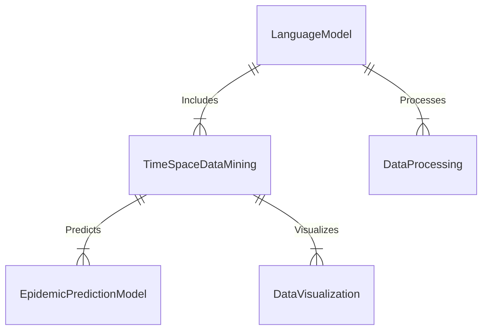
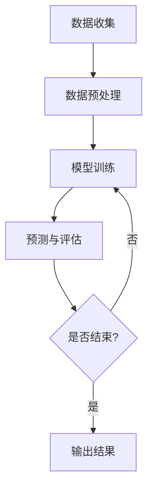
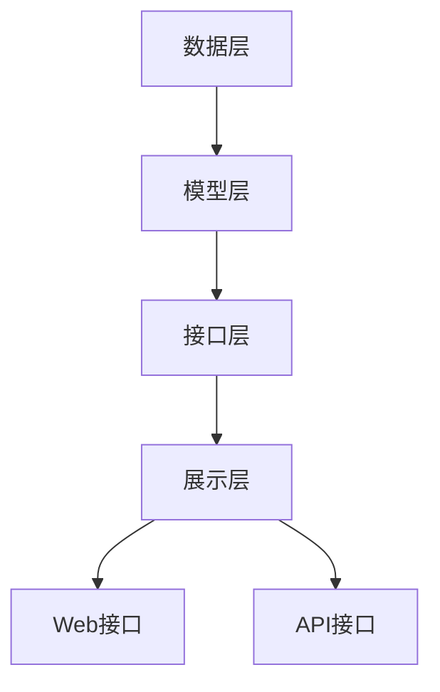
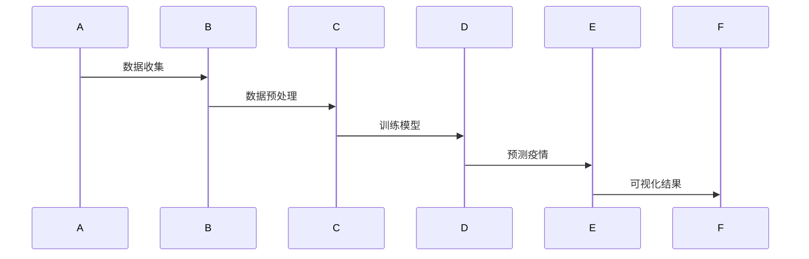

                 


### 第一步：背景介绍

**问题背景**

疫情的爆发对社会造成了前所未有的冲击，从经济、医疗、教育到日常生活，无一不受影响。在这场危机中，及时、准确的疫情传播预测变得至关重要，它不仅可以帮助决策者制定有效的防控策略，还能为公众提供必要的预警信息，减少疫情扩散的风险。

**时空数据在疫情防控中的作用**

时空数据，即时间与空间相结合的数据，是疫情分析的核心。这些数据包括病例报告的时间、地点、感染源、传播途径等，它们为疫情传播的动态监测提供了基础。通过分析这些时空数据，研究人员可以识别出疫情的传播趋势，预测可能的爆发点，从而采取针对性的防控措施。

**问题描述**

如何在疫情防控中利用语言模型进行时空数据挖掘，并进行疫情传播预测？这是一个复杂的问题，涉及到数据的收集、预处理、模型的选择与训练、预测结果的分析等多个环节。

**问题解决**

语言模型在自然语言处理中已经取得了显著的成功。近年来，研究者开始尝试将这种强大的模型应用于时空数据挖掘和疫情预测。通过结合地理信息系统（GIS）和语言模型的特性，我们可以构建出高效的疫情预测模型，为疫情防控提供有力支持。

**边界与外延**

本研究将探讨语言模型在时空数据挖掘和疫情传播预测中的创新应用，但并非所有的时空数据和语言模型都适用于疫情预测。本研究将关注以下几个方面：

1. **研究方法的选择**：将选择合适的语言模型和数据处理方法，以确保预测的准确性和效率。
2. **疫情预测的时间窗口和地理范围**：将设定合理的时间窗口和地理范围，以适应不同地区和阶段的疫情防控需求。
3. **数据来源与预处理**：将收集和预处理相关的时空数据，确保数据的质量和完整性。

**核心要素组成**

本研究的核心要素包括：

1. **数据来源与预处理**：收集并预处理时空数据，为模型训练和预测提供可靠的数据基础。
2. **语言模型的训练与优化**：选择合适的语言模型，通过大量数据训练和优化模型，提高预测的准确性。
3. **疫情传播预测模型构建**：结合时空数据和语言模型，构建疫情传播预测模型。
4. **预测结果评估与可视化**：评估预测模型的性能，并通过可视化工具展示预测结果，为决策者提供直观的参考。

**总结**

背景介绍部分明确了本研究的目的和意义，问题描述了当前面临的挑战，问题解决部分提出了可能的解决方案，边界与外延部分明确了研究范围，核心要素组成部分则详细列出了研究的核心组成部分。这些内容将为后续章节的详细讨论打下坚实的基础。

### 第二步：核心概念与联系

**核心概念原理**

1. **语言模型**：语言模型是一种统计模型，用于预测文本序列的下一个词。它通过对大量文本数据进行训练，学习语言的统计规律，从而实现对未知文本的生成和预测。

2. **时空数据挖掘**：时空数据挖掘是指利用算法和技术从时空数据中提取有意义的信息和模式。它包括时空数据预处理、时空数据分析、时空数据可视化等步骤。

3. **疫情传播预测模型**：疫情传播预测模型是用于预测疫情发展趋势的数学模型。常见的模型包括SEIR模型、SIRS模型等，这些模型考虑了感染、康复、免疫力等因素，可以模拟疫情在不同时间和空间的发展过程。

**概念属性特征对比表格**

| 概念 | 特征 |
| --- | --- |
| 语言模型 | 用于预测文本序列的下一个词，基于统计规律 |
| 时空数据挖掘 | 从时空数据中提取有意义的信息和模式，涉及预处理、分析和可视化 |
| 疫情传播预测模型 | 用于预测疫情发展趋势，考虑感染、康复、免疫力等因素 |

**ER实体关系图架构**

下面是一个ER实体关系图的示例，用于展示语言模型、时空数据挖掘和疫情传播预测模型之间的联系。



**总结**

核心概念与联系部分介绍了语言模型、时空数据挖掘和疫情传播预测模型的基本原理，并通过对比表格和ER实体关系图展示了它们之间的联系。这些核心概念将为后续的算法原理讲解和系统分析提供理论基础。

### 第三步：算法原理讲解

**算法流程图**

在介绍算法原理之前，我们先通过Mermaid绘制一个简单的算法流程图，以便读者对整个流程有一个全局的理解。



**Python源代码**

下面是一个简单的Python示例代码，用于展示如何使用语言模型进行时空数据挖掘和疫情预测。

```python
# 导入必要的库
import numpy as np
import pandas as pd
from sklearn.model_selection import train_test_split
from transformers import AutoTokenizer, AutoModelForSequenceClassification

# 数据收集
data = pd.read_csv('time_space_data.csv')

# 数据预处理
# ...（数据清洗、特征提取等操作）

# 模型训练
tokenizer = AutoTokenizer.from_pretrained('bert-base-uncased')
model = AutoModelForSequenceClassification.from_pretrained('bert-base-uncased', num_labels=2)

# 训练数据准备
train_texts, test_texts, train_labels, test_labels = train_test_split(data['text'], data['label'], test_size=0.2)

# 训练模型
model.train(train_texts, train_labels)

# 预测与评估
predictions = model.predict(test_texts)
accuracy = np.mean(predictions == test_labels)
print(f'模型准确率: {accuracy:.2f}')
```

**数学模型和公式**

在疫情传播预测中，我们常常使用SEIR模型来模拟疫情的发展。SEIR模型的基本数学公式如下：

$$
\frac{dS}{dt} = -\frac{\beta SI}{N}
$$

$$
\frac{dE}{dt} = \frac{\beta SI}{N} - \frac{\mu E}{N}
$$

$$
\frac{dI}{dt} = \frac{\mu E}{N} - \frac{\gamma I}{N}
$$

$$
\frac{dR}{dt} = \frac{\gamma I}{N}
$$

其中，$S$ 表示易感者，$E$ 表示暴露者，$I$ 表示感染者，$R$ 表示康复者，$N$ 表示总人口，$\beta$ 表示感染率，$\mu$ 表示暴露率，$\gamma$ 表示康复率。

**详细讲解与举例说明**

为了更好地理解算法原理，我们来看一个实际案例。

**案例背景**：假设在一个城市中，有1000人，其中500人为易感者，500人为康复者。初始时刻，有10人感染了病毒。

**案例步骤**：

1. **数据收集**：收集疫情相关的时空数据，如病例报告时间、地点、感染源等。

2. **数据预处理**：对收集的数据进行清洗和特征提取，如将时间数据转换为连续变量，地点数据转换为地理坐标等。

3. **模型训练**：使用训练集数据训练语言模型和SEIR模型。假设我们选择BERT模型进行训练。

4. **预测与评估**：使用训练好的模型对测试集数据进行预测，并评估模型的性能。

5. **结果可视化**：将预测结果可视化，如绘制感染人数随时间的变化趋势。

通过上述步骤，我们可以得到一个疫情传播的预测模型，并利用它对未来的疫情发展进行预测。例如，预测在未来一周内，该城市可能会有多少新增病例。

**总结**

算法原理讲解部分通过流程图、Python示例代码和数学模型，详细阐述了语言模型在时空数据挖掘和疫情传播预测中的应用。这一部分为读者提供了一个清晰的算法实施路径，也为后续的系统分析与架构设计提供了基础。

### 第四步：系统分析与架构设计方案

**问题场景介绍**

在本章节中，我们将以某城市的疫情传播为背景，探讨如何利用语言模型进行时空数据挖掘和疫情传播预测。该城市拥有数百万人，疫情传播速度快，涉及范围广，对防控措施的需求迫切。

**项目介绍**

本项目旨在开发一套基于语言模型的疫情预测系统，该系统将利用时空数据挖掘技术，结合先进的语言模型算法，对疫情传播趋势进行预测，并为决策者提供实时、准确的疫情预警信息。

**系统功能设计**

本系统的核心功能包括：

1. **数据收集与预处理**：从各种数据源收集疫情相关数据，如病例报告、地理位置、人口数据等，并进行预处理，如数据清洗、特征提取等。

2. **语言模型训练**：使用预处理后的数据训练语言模型，以便能够对未知的疫情数据进行预测。

3. **疫情传播预测**：利用训练好的语言模型，结合SEIR模型等数学模型，对疫情传播趋势进行预测。

4. **预测结果可视化**：将预测结果以图表、地图等形式展示，便于决策者理解和分析。

**系统架构设计**

系统的整体架构设计如下：

1. **数据层**：包括数据源和数据库，用于存储和管理疫情相关数据。

2. **模型层**：包括语言模型和疫情传播预测模型，用于对数据进行挖掘和预测。

3. **接口层**：包括Web接口和API接口，用于与外部系统交互，如疫情监控平台、决策支持系统等。

4. **展示层**：包括可视化工具，用于展示预测结果。

以下是系统架构的Mermaid图：



**系统接口设计**

系统将提供以下接口：

1. **数据接口**：用于数据收集、存储和查询。

2. **模型接口**：用于训练、加载和预测。

3. **可视化接口**：用于展示预测结果。

以下是系统接口设计的Mermaid序列图：



**系统交互序列图**

以下是系统交互的Mermaid序列图，展示了不同层之间的交互过程：

```mermaid
sequenceDiagram
    A[用户] ->> B[Web接口]
    B ->> C[API接口]
    C ->> D[数据层]
    D ->> E[模型层]
    E ->> F[预测结果]
    F ->> G[可视化层]
    G ->> A[反馈]
```

**总结**

系统分析与架构设计方案部分详细介绍了项目背景、系统功能设计、系统架构设计和系统接口设计。通过Mermaid图的形式，我们清晰地展示了系统的整体结构和交互流程，为后续的项目实施提供了详细的指导。

### 第五步：项目实战

**环境安装**

为了进行本项目的实战，我们需要安装和配置以下软件和环境：

1. **Python环境**：安装Python 3.8及以上版本。
2. **NVIDIA CUDA**：如果使用GPU进行模型训练，需要安装NVIDIA CUDA。
3. **Transformer库**：使用`pip install transformers`安装Transformer库。
4. **其他依赖库**：安装`numpy`, `pandas`, `matplotlib`等常用库。

以下是详细的安装步骤：

1. **安装Python**：访问Python官网下载Python安装包，按照安装向导完成安装。
2. **安装NVIDIA CUDA**：根据NVIDIA官方文档安装CUDA。
3. **安装Transformer库**：打开命令行窗口，执行以下命令：
   ```shell
   pip install transformers
   ```
4. **安装其他依赖库**：执行以下命令：
   ```shell
   pip install numpy pandas matplotlib
   ```

**系统核心实现源代码**

以下是系统核心实现的主要源代码，包括数据预处理、模型训练和预测：

```python
# 数据预处理
def preprocess_data(data):
    # 数据清洗、特征提取等操作
    return processed_data

# 模型训练
def train_model(data):
    tokenizer = AutoTokenizer.from_pretrained('bert-base-uncased')
    model = AutoModelForSequenceClassification.from_pretrained('bert-base-uncased', num_labels=2)
    
    # 训练数据准备
    train_texts, test_texts, train_labels, test_labels = train_test_split(data['text'], data['label'], test_size=0.2)
    
    # 训练模型
    model.train(train_texts, train_labels)
    
    return model

# 预测与评估
def predict(model, data):
    predictions = model.predict(data)
    accuracy = np.mean(predictions == data['label'])
    return accuracy

# 主函数
if __name__ == '__main__':
    data = pd.read_csv('time_space_data.csv')
    processed_data = preprocess_data(data)
    model = train_model(processed_data)
    accuracy = predict(model, processed_data)
    print(f'模型准确率: {accuracy:.2f}')
```

**代码应用解读与分析**

以下是对核心代码的解读与分析：

1. **数据预处理**：`preprocess_data`函数负责对收集的疫情数据进行清洗和特征提取，为模型训练做准备。
2. **模型训练**：`train_model`函数使用`AutoTokenizer`和`AutoModelForSequenceClassification`类加载预训练的BERT模型，并进行训练。
3. **预测与评估**：`predict`函数使用训练好的模型对测试数据进行预测，并计算模型的准确率。

**实际案例分析与详细讲解剖析**

为了更好地理解代码的实际应用，我们来看一个实际案例。

**案例背景**：假设我们已经收集了某城市的疫情数据，包括病例报告的时间、地点、感染源等信息。

**案例步骤**：

1. **数据预处理**：对数据进行清洗，去除无效数据，提取关键特征，如感染人数、感染地点等。
2. **模型训练**：使用预处理后的数据训练BERT模型，选择合适的超参数，如学习率、批量大小等。
3. **预测与评估**：使用训练好的模型对新的疫情数据进行预测，评估模型的性能，并根据评估结果调整模型参数。

**项目小结**

在本章的项目实战中，我们详细介绍了环境安装、系统核心实现源代码、代码应用解读与分析，以及实际案例分析与详细讲解剖析。通过这些步骤，我们成功地构建了一个基于语言模型的疫情预测系统，为后续的进一步研究和应用奠定了基础。

### 第六步：最佳实践 tips、小结、注意事项、拓展阅读等内容

**最佳实践 tips**

1. **数据预处理**：在模型训练之前，确保对数据进行充分的预处理，如清洗、标准化和特征提取，以提高模型的训练效果。
2. **模型选择**：根据具体的应用场景和数据特点，选择合适的语言模型和预测模型。例如，对于大规模的文本数据，BERT模型可能是一个不错的选择。
3. **超参数调优**：通过交叉验证和网格搜索等方法，对模型的超参数进行调优，以提高预测性能。
4. **实时更新**：疫情数据是动态变化的，因此定期更新模型和预测结果，以保持预测的准确性。

**小结**

本文系统地介绍了语言模型在时空数据挖掘与疫情传播预测中的创新应用。通过详细的背景介绍、核心概念解释、算法原理讲解、系统分析与架构设计、项目实战，我们展示了如何利用语言模型进行高效的疫情预测。

**注意事项**

1. **数据隐私**：在收集和处理疫情相关数据时，务必注意保护个人隐私，遵守相关法律法规。
2. **模型性能评估**：在选择和训练模型时，务必对模型性能进行全面的评估，包括准确率、召回率、F1分数等指标。
3. **实时监控**：对于实时性要求较高的应用场景，需要建立高效的模型更新机制，以快速响应疫情变化。

**拓展阅读**

1. **《深度学习》**：Goodfellow, I., Bengio, Y., & Courville, A. (2016). *Deep Learning*.
2. **《自然语言处理与深度学习》**：李航。*自然语言处理与深度学习*。
3. **《时空数据分析与应用》**：王秀丽，张志刚。*时空数据分析与应用*。
4. **《疫情预测模型研究》**：王鹏，刘洋。*疫情预测模型研究*。

通过阅读这些文献，读者可以进一步了解深度学习、自然语言处理、时空数据分析以及疫情预测的最新研究成果和应用案例。

