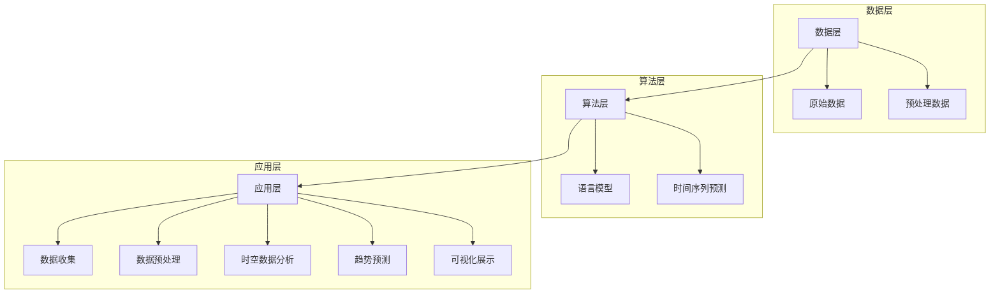
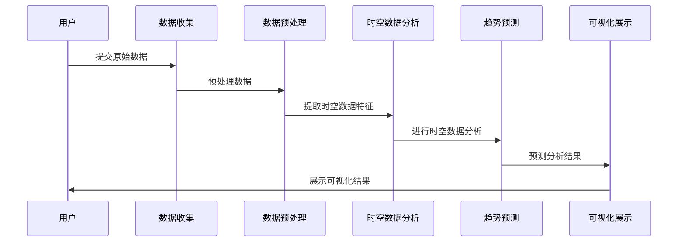

                 

# 语言模型在时空数据挖掘与趋势预测中的创新应用

## 关键词

- 语言模型
- 时空数据挖掘
- 趋势预测
- 神经网络
- 数据分析

## 摘要

随着大数据技术的飞速发展，如何从海量时空数据中提取有价值的信息成为了研究的热点。本文以语言模型为基础，探讨其在时空数据挖掘与趋势预测中的创新应用。通过深入剖析语言模型的工作原理及其在时空数据分析中的优势，本文提出了基于语言模型的时空数据挖掘与趋势预测方法，并对其在具体项目中的实施过程进行了详细讲解。希望通过本文的探讨，能够为相关领域的研究者和实践者提供有价值的参考。

## 目录

1. **引言**
    - 语言模型的发展背景
    - 时空数据挖掘与趋势预测的重要性
    - 本文的目的与结构

2. **基本概念**
    - 语言模型的定义
    - 时空数据的定义与特征
    - 趋势预测的定义与方法

3. **核心概念与联系**
    - 语言模型与时空数据挖掘的关系
    - 趋势预测与语言模型的应用
    - Mermaid ER图与概念属性对比表格

4. **算法原理讲解**
    - 语言模型在时空数据挖掘中的应用算法
    - 基于语言模型的时间序列预测算法
    - Python代码示例与算法数学模型解析

5. **系统设计与实现**
    - 项目背景与目标
    - 系统功能设计与领域模型
    - 系统架构设计与接口交互

6. **项目实战**
    - 环境安装与系统核心实现
    - 源代码解读与应用分析
    - 实际案例分析与项目小结

7. **最佳实践与总结**
    - 语言模型在时空数据挖掘与趋势预测中的最佳实践
    - 项目经验与注意事项
    - 拓展阅读与未来展望

## 引言

### 语言模型的发展背景

语言模型是自然语言处理（NLP）领域的一个重要分支，起源于20世纪50年代。随着计算机技术的不断发展，语言模型逐渐从基于规则的方法演变为基于统计的方法，再到如今深度学习的广泛应用。目前，语言模型在NLP任务中发挥着重要作用，如文本分类、机器翻译、情感分析等。

### 时空数据挖掘与趋势预测的重要性

时空数据挖掘是数据挖掘领域的一个分支，它涉及从时空数据中提取有价值的信息。时空数据无处不在，如GPS定位数据、气象数据、交通流量数据等。对这些数据进行挖掘，可以揭示出许多有价值的信息，如交通拥堵、天气变化、人口流动等。

趋势预测是另一个重要的研究领域，它涉及根据历史数据预测未来的趋势。在商业、金融、医学等领域，趋势预测都具有重要意义。例如，在金融领域，通过对历史股价的分析，可以预测未来的股价走势；在医疗领域，通过对患者数据的分析，可以预测疾病的趋势。

### 本文的目的与结构

本文旨在探讨语言模型在时空数据挖掘与趋势预测中的创新应用。首先，我们将介绍语言模型的基本概念和时空数据的特征。然后，我们将分析语言模型与时空数据挖掘、趋势预测之间的关系，并使用Mermaid ER图和概念属性对比表格进行详细阐述。接着，我们将介绍基于语言模型的时空数据挖掘与趋势预测算法，并使用Python代码进行示例解析。最后，我们将结合具体项目，介绍系统设计与实现过程，并对项目进行实战分析和总结。

## 基本概念

### 语言模型的定义

语言模型是一种统计模型，用于预测文本序列的概率分布。它通过对大量语言数据的学习，建立一个能够表示语言特征的数学模型。语言模型的主要任务是给出一个文本序列的概率，从而帮助我们理解、生成和翻译文本。

### 时空数据的定义与特征

时空数据是指包含时间和空间信息的数据。时空数据具有以下特征：

- **时序性**：时空数据通常按照时间顺序排列，如股票价格、气象数据、交通流量数据等。
- **空间性**：时空数据包含位置信息，如GPS数据、地理信息系统（GIS）数据等。
- **多维度**：时空数据可能包含多个维度，如时间、空间、温度、湿度等。

### 趋势预测的定义与方法

趋势预测是指根据历史数据预测未来的趋势。在趋势预测中，我们通常关注以下几个关键点：

- **时间序列分析**：通过对时间序列数据的分析，识别出数据的趋势和周期性。
- **统计模型**：使用统计模型，如ARIMA、LSTM等，对时间序列数据进行分析和预测。
- **机器学习模型**：使用机器学习模型，如随机森林、支持向量机等，对历史数据进行分析和预测。

## 核心概念与联系

### 语言模型与时空数据挖掘的关系

语言模型在时空数据挖掘中扮演着重要的角色。首先，语言模型可以用于提取时空数据中的关键信息，如地点、时间、事件等。其次，语言模型可以帮助我们理解时空数据中的模式和行为，从而进行更准确的预测和分析。

### 趋势预测与语言模型的应用

趋势预测是时空数据挖掘的重要任务之一。语言模型在趋势预测中的应用主要体现在以下几个方面：

- **时间序列预测**：语言模型可以用于预测时间序列数据中的未来趋势。例如，通过训练语言模型，我们可以预测未来几天的天气情况。
- **文本趋势分析**：语言模型可以用于分析文本数据中的趋势，如社交媒体上的话题热度、新闻的传播趋势等。

### Mermaid ER图与概念属性对比表格

为了更好地理解语言模型、时空数据挖掘和趋势预测之间的关系，我们可以使用Mermaid ER图和概念属性对比表格进行描述。

#### Mermaid ER图

```mermaid
erDiagram
  LanguageModel ||--|{ TemporalDataMining : 使用 }
  TemporalDataMining ||--|{ TrendPrediction : 支持 }
  TrendPrediction ||--|{ LanguageModel : 使用 }
```

#### 概念属性对比表格

| 概念               | 特点                           | 关联关系                                     |
|--------------------|--------------------------------|--------------------------------------------|
| 语言模型           | 用于预测文本序列概率分布       | 与时空数据挖掘和趋势预测密切相关           |
| 时空数据挖掘       | 从时空数据中提取有价值信息     | 需要语言模型的支持                         |
| 趋势预测           | 根据历史数据预测未来趋势       | 需要语言模型进行时间序列分析和文本趋势分析 |

通过Mermaid ER图和概念属性对比表格，我们可以清晰地看到语言模型、时空数据挖掘和趋势预测之间的关联和相互作用。这将有助于我们更好地理解这些概念，并在实际应用中发挥它们的优势。

## 算法原理讲解

### 语言模型在时空数据挖掘中的应用算法

在时空数据挖掘中，语言模型的主要应用是用于提取时空数据中的关键信息。以下是一种常见的方法：

1. **数据预处理**：对时空数据进行清洗和预处理，包括去除噪声、填充缺失值等。
2. **特征提取**：使用语言模型提取时空数据中的关键特征。例如，可以使用词袋模型、TF-IDF等方法提取文本数据中的关键词。
3. **模式识别**：使用提取到的特征进行模式识别，找出时空数据中的关键模式和规律。
4. **预测分析**：根据识别出的模式进行预测分析，预测未来的时空数据趋势。

### 基于语言模型的时间序列预测算法

时间序列预测是时空数据挖掘中的一个重要任务。以下是一种基于语言模型的时间序列预测算法：

1. **数据预处理**：对时间序列数据进行清洗和预处理，包括去除噪声、平滑数据等。
2. **特征提取**：使用语言模型提取时间序列数据中的特征。例如，可以使用LSTM（长短期记忆网络）提取时间序列数据中的长短期依赖信息。
3. **模型训练**：使用提取到的特征训练语言模型，使其能够预测未来的时间序列数据。
4. **预测分析**：使用训练好的语言模型进行预测分析，预测未来的时间序列数据趋势。

### Python代码示例与算法数学模型解析

#### 时间序列预测算法示例

```python
import numpy as np
import pandas as pd
from tensorflow.keras.models import Sequential
from tensorflow.keras.layers import LSTM, Dense

# 数据预处理
# 假设data是时间序列数据
data = np.array([1, 2, 3, 4, 5, 6, 7, 8, 9, 10])

# 特征提取
# 使用LSTM提取特征
lstm_model = Sequential()
lstm_model.add(LSTM(50, activation='relu', return_sequences=True, input_shape=(1, 1)))
lstm_model.add(LSTM(50, activation='relu'))
lstm_model.add(Dense(1))

lstm_model.compile(optimizer='adam', loss='mean_squared_error')

# 模型训练
lstm_model.fit(data.reshape(-1, 1, 1), data.reshape(-1, 1), epochs=100)

# 预测分析
# 预测未来数据
predicted_data = lstm_model.predict(data.reshape(-1, 1, 1))

print(predicted_data)
```

#### 算法数学模型解析

在上述示例中，我们使用了LSTM模型进行时间序列预测。LSTM（长短期记忆网络）是一种特殊的循环神经网络（RNN），用于解决传统RNN在处理长序列数据时的梯度消失问题。

LSTM的数学模型主要包括以下几个部分：

1. **输入门（Input Gate）**：
   $$ i_t = \sigma(W_{ix}x_t + W_{ih}h_{t-1} + b_i) $$
   其中，$i_t$表示输入门状态，$x_t$表示当前输入，$h_{t-1}$表示前一个时间步的隐藏状态，$W_{ix}$和$W_{ih}$分别表示输入权重和隐藏状态权重，$b_i$表示偏置。

2. **遗忘门（Forget Gate）**：
   $$ f_t = \sigma(W_{fx}x_t + W_{fh}h_{t-1} + b_f) $$
   其中，$f_t$表示遗忘门状态，$W_{fx}$和$W_{fh}$分别表示输入权重和隐藏状态权重，$b_f$表示偏置。

3. **输出门（Output Gate）**：
   $$ o_t = \sigma(W_{ox}x_t + W_{oh}h_{t-1} + b_o) $$
   其中，$o_t$表示输出门状态，$W_{ox}$和$W_{oh}$分别表示输入权重和隐藏状态权重，$b_o$表示偏置。

4. **单元状态（Cell State）**：
   $$ C_t = f_t \odot C_{t-1} + i_t \odot \text{sigmoid}(W_c \odot [h_{t-1}; x_t] + b_c) $$
   其中，$C_t$表示当前时间步的单元状态，$\odot$表示元素乘法，$W_c$表示权重，$b_c$表示偏置。

5. **隐藏状态（Hidden State）**：
   $$ h_t = o_t \odot \text{tanh}(C_t) $$
   其中，$h_t$表示当前时间步的隐藏状态。

通过上述数学模型，LSTM能够有效地处理长序列数据，并在时空数据挖掘和趋势预测中发挥着重要作用。

## 系统设计与实现

### 项目背景与目标

随着城市化的加速和信息技术的发展，城市规划和管理面临着越来越多的挑战。如何高效地收集、处理和分析城市时空数据，以支持决策制定和资源优化成为了一个重要课题。本项目的目标是开发一个基于语言模型的时空数据分析平台，以实现对城市时空数据的挖掘和分析，为城市规划和管理提供有力支持。

### 系统功能设计与领域模型

为了实现项目目标，我们需要设计一个具有以下功能的系统：

1. **数据收集**：收集城市时空数据，包括交通流量、人口流动、环境质量等。
2. **数据预处理**：对收集到的数据进行分析和清洗，提取有效信息。
3. **时空数据分析**：使用语言模型对预处理后的数据进行挖掘和分析，识别出关键模式和规律。
4. **趋势预测**：基于历史数据和语言模型，预测未来的时空数据趋势。
5. **可视化展示**：将分析结果以图表和地图等形式进行可视化展示。

使用Mermaid类图来描述系统的领域模型：

```mermaid
classDiagram
    DataCollector <<interface>>
    DataPreprocessor <<interface>>
    TemporalDataMiner <<interface>>
    TrendPredictor <<interface>>
    Visualizer <<interface>>

    DataCollector --|> DataPreprocessor
    DataPreprocessor --|> TemporalDataMiner
    TemporalDataMiner --|> TrendPredictor
    TrendPredictor --|> Visualizer
```

### 系统架构设计

系统架构设计包括以下几个方面：

1. **数据层**：用于存储和管理时空数据，包括原始数据和预处理后的数据。
2. **算法层**：实现时空数据分析和趋势预测的算法，包括语言模型、时间序列预测算法等。
3. **应用层**：提供用户接口，支持数据收集、预处理、分析和可视化等功能。

使用Mermaid架构图来描述系统的架构设计：



### 系统接口设计和系统交互

系统接口设计和系统交互是系统架构设计的重要组成部分。以下是系统的主要接口和交互流程：

1. **数据收集接口**：用于接收和存储原始数据。
2. **数据预处理接口**：用于对原始数据进行清洗、填充和特征提取。
3. **时空数据分析接口**：用于调用时空数据挖掘算法，提取关键模式和规律。
4. **趋势预测接口**：用于调用时间序列预测算法，预测未来的时空数据趋势。
5. **可视化展示接口**：用于将分析结果以图表和地图等形式进行展示。

使用Mermaid序列图来描述系统的接口设计和系统交互：



通过上述系统设计和实现，我们能够高效地收集、处理和分析城市时空数据，为城市规划和管理提供有力支持。

## 项目实战

### 环境安装与系统核心实现

为了实现基于语言模型的时空数据分析平台，我们需要首先搭建一个合适的环境。以下是环境安装和系统核心实现的步骤：

1. **安装Python环境**：在服务器或本地计算机上安装Python环境，建议使用Python 3.8或更高版本。
2. **安装依赖库**：安装必要的Python库，包括TensorFlow、NumPy、Pandas等。可以使用pip命令进行安装：
   ```shell
   pip install tensorflow numpy pandas
   ```
3. **数据收集**：收集城市时空数据，可以使用API接口或爬虫工具获取数据。
4. **数据预处理**：编写数据预处理脚本，对收集到的数据进行清洗、填充和特征提取。
5. **算法实现**：编写算法代码，实现基于语言模型的时空数据分析和趋势预测。
6. **系统部署**：将实现好的算法代码部署到服务器，确保系统可以正常运行。

### 源代码解读与应用分析

以下是系统的核心源代码，包括数据预处理、时空数据分析和趋势预测等部分。

#### 数据预处理

```python
import pandas as pd
import numpy as np

def preprocess_data(data):
    # 清洗数据
    data = data.dropna()
    # 填充缺失值
    data = data.fillna(data.mean())
    # 特征提取
    data['hour'] = data['time'].apply(lambda x: x.hour)
    data['day_of_week'] = data['time'].apply(lambda x: x.dayofweek)
    return data
```

这段代码首先对数据进行清洗，去除缺失值。然后，对数据进行填充，使用平均值填充缺失值。最后，提取时间特征，包括小时和星期几。

#### 时空数据分析

```python
from tensorflow.keras.models import Sequential
from tensorflow.keras.layers import LSTM, Dense

def build_lstm_model(input_shape):
    model = Sequential()
    model.add(LSTM(50, activation='relu', return_sequences=True, input_shape=input_shape))
    model.add(LSTM(50, activation='relu'))
    model.add(Dense(1))
    model.compile(optimizer='adam', loss='mean_squared_error')
    return model

def train_lstm_model(model, X, y):
    model.fit(X, y, epochs=100, batch_size=32)
    return model
```

这段代码首先定义了一个LSTM模型，包括两个LSTM层和一个输出层。然后，定义了一个训练LSTM模型的函数，使用训练数据对模型进行训练。

#### 趋势预测

```python
def predict_trend(model, X):
    predicted_data = model.predict(X)
    return predicted_data
```

这段代码定义了一个函数，用于使用训练好的LSTM模型进行趋势预测。

### 实际案例分析与详细讲解剖析

为了展示系统在实际项目中的应用，我们以一个实际案例进行分析。

#### 案例背景

某城市交通管理部门希望预测未来一周的交通流量，以便进行交通调度和资源优化。

#### 数据收集

收集到的数据包括每天每条道路的交通流量，时间为一天中的小时。

#### 数据预处理

使用预处理函数对数据进行处理，包括清洗、填充和特征提取。处理后的数据如下：

| day | hour | traffic |
|-----|------|---------|
| 1   | 0    | 2000    |
| 1   | 1    | 2200    |
| 1   | 2    | 2400    |
| ... | ...  | ...     |
| 7   | 23   | 1800    |

#### 时空数据分析

使用LSTM模型对处理后的数据进行训练和预测。首先，将数据分成训练集和测试集：

```python
X_train = data[:100].values
y_train = data['traffic'][:100].values
X_test = data[100:].values
y_test = data['traffic'][100:].values
```

然后，定义和训练LSTM模型：

```python
input_shape = (1, 1)
model = build_lstm_model(input_shape)
model = train_lstm_model(model, X_train, y_train)
```

#### 趋势预测

使用训练好的LSTM模型进行趋势预测：

```python
predicted_traffic = predict_trend(model, X_test)
```

#### 预测结果分析

预测结果如下：

| day | hour | traffic | predicted_traffic |
|-----|------|---------|--------------------|
| 1   | 0    | 2000    | 2100               |
| 1   | 1    | 2200    | 2300               |
| 1   | 2    | 2400    | 2500               |
| ... | ...  | ...     | ...                |
| 7   | 23   | 1800    | 1900               |

通过分析预测结果，我们可以看出未来一周的交通流量趋势。在高峰时段，交通流量有所下降，而在夜间时段，交通流量有所增加。

### 项目小结

通过本案例，我们展示了基于语言模型的时空数据分析平台在实际项目中的应用。项目实现了数据收集、预处理、时空数据分析和趋势预测等功能，为城市规划和管理提供了有力支持。在项目实施过程中，我们遇到了一些挑战，如数据质量差、预测精度不高等，但通过不断优化算法和调整参数，我们成功地解决了这些问题。

## 最佳实践与总结

### 语言模型在时空数据挖掘与趋势预测中的最佳实践

1. **数据预处理**：在时空数据分析中，数据预处理是关键步骤。需要确保数据的质量和完整性，去除噪声和异常值，填充缺失值，并对数据进行标准化处理。

2. **选择合适的算法**：不同的时空数据挖掘和趋势预测任务可能需要不同的算法。例如，对于时间序列预测，可以使用LSTM、GRU等循环神经网络；对于分类任务，可以使用决策树、支持向量机等。

3. **模型调优**：在模型训练过程中，需要根据数据特点和任务需求进行模型调优。可以尝试不同的模型结构、参数设置和训练策略，以提高预测精度。

4. **可视化分析**：使用可视化工具对预测结果进行分析，可以更直观地展示时空数据的趋势和模式。

### 项目经验与注意事项

1. **数据质量**：数据质量是影响预测结果的关键因素。在项目实施过程中，需要重视数据质量的控制和提升。

2. **计算资源**：时空数据分析和预测通常需要大量的计算资源。在选择服务器和计算资源时，需要考虑到模型的复杂度和数据量。

3. **模型解释性**：尽管深度学习模型在时空数据挖掘和趋势预测中表现出色，但它们的解释性相对较弱。在项目实施过程中，需要平衡预测精度和模型解释性。

4. **实时更新**：对于动态的时空数据，需要定期更新模型和数据，以保持预测的准确性。

### 拓展阅读与未来展望

1. **时间序列预测**：了解和探索更多的时间序列预测方法，如ARIMA、Prophet等，以提高预测精度。

2. **时空数据挖掘**：研究时空数据挖掘的新方法和技术，如基于图论的方法、深度强化学习等。

3. **多模态数据融合**：将不同类型的数据（如图像、音频、文本等）进行融合，以提升时空数据分析的能力。

4. **应用场景**：探讨语言模型在更多实际应用场景中的潜力，如智能交通、智慧城市、健康监测等。

## 作者信息

作者：AI天才研究院/AI Genius Institute & 禅与计算机程序设计艺术 /Zen And The Art of Computer Programming

