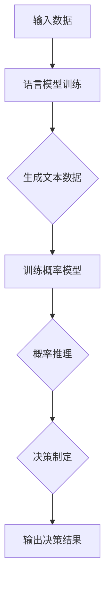

                 

### 1. 引言

**标题：语言模型在概率推理与决策中的表现**

**关键词：** 语言模型，概率推理，决策，算法，应用案例

**摘要：** 本文将探讨语言模型在概率推理与决策中的应用，通过深入分析概率推理和决策理论的基础知识，介绍语言模型的核心概念及其应用原理，最后通过实际案例研究展示语言模型在实际场景中的表现。本文旨在为读者提供一个全面而系统的了解，并激发对该领域进一步研究的兴趣。

### 1.1 背景与问题介绍

**概率推理**：概率推理是一种基于概率论的方法，用于从已知信息推断未知信息。它在许多领域，如人工智能、统计学和决策理论中发挥着关键作用。概率推理的目标是评估某个事件发生的可能性，通常使用概率分布来表示。

**决策理论**：决策理论关注个体或组织在不确定环境中进行选择的过程。决策理论模型通常涉及多个可能的结果，每个结果具有不同的概率和成本。其核心任务是找到最优决策策略。

**语言模型**：语言模型是自然语言处理（NLP）中的一个核心概念，它试图模拟人类语言的理解和生成能力。语言模型通过学习大量的文本数据，能够预测下一个单词或句子，从而生成文本。

**研究问题与目标**：本文的研究问题是，如何将语言模型应用于概率推理和决策过程，以及这些应用如何影响决策结果。我们的目标是探讨语言模型在概率推理与决策中的潜在优势，并提供实际案例以验证其有效性。

### 1.2 核心概念与理论

在深入探讨语言模型在概率推理与决策中的应用之前，我们需要先了解一些核心概念和理论。

**概率模型**：概率模型是概率论在数学和统计学中的基本工具，用于表示事件发生的可能性。常见的概率模型包括概率分布、条件概率、贝叶斯定理等。

**决策模型**：决策模型是用于模拟和优化决策过程的数学模型。常见的决策模型包括决策树、多属性决策和效用理论等。

**语言模型**：语言模型是NLP中的核心概念，用于模拟人类语言生成和理解过程。常见的语言模型包括基于统计的模型（如n-gram模型）和基于神经网络的模型（如循环神经网络RNN、长短期记忆LSTM等）。

### 1.3 语言模型在概率推理中的应用

**基本算法**：语言模型在概率推理中可以用于生成文本数据，这些数据可以用于训练概率模型。例如，可以使用语言模型生成句子，然后使用这些句子来训练贝叶斯网络或隐马尔可夫模型（HMM）。

**优化方法**：为了提高语言模型在概率推理中的性能，可以采用多种优化方法。其中，朴素贝叶斯算法是一种简单而有效的优化方法，它假设特征之间相互独立，从而简化了推理过程。

**隐马尔可夫模型**：隐马尔可夫模型（HMM）是另一个常用的概率模型，它用于处理具有隐藏状态的序列数据。语言模型可以用于初始化HMM的状态转移概率和发射概率。

### 1.4 语言模型在决策中的应用

**决策支持系统**：决策支持系统（DSS）是一个工具，用于帮助个体或组织在不确定环境中做出最佳决策。语言模型可以用于构建DSS中的概率模型，以预测不同决策方案的结果。

**风险评估**：在金融、医疗和其他领域，风险评估是一个关键任务。语言模型可以用于分析文本数据，以识别潜在的风险因素，从而提高风险评估的准确性。

**决策树**：决策树是一种常见的决策模型，它通过一系列条件分支来表示不同的决策路径。语言模型可以用于生成决策树中的条件分支，从而提高决策树的性能。

### 1.5 拓展讨论与未来展望

**当前挑战与趋势**：尽管语言模型在概率推理与决策中表现出色，但仍然存在一些挑战，如数据质量、模型可解释性和计算效率等。未来，这些挑战有望通过新型算法和更先进的技术得到解决。

**未来研究方向**：未来的研究可以关注于开发更高效的算法、更强大的语言模型和更广泛的应用场景。例如，研究如何将语言模型应用于实时决策系统和大规模数据集。

**应用前景与影响**：语言模型在概率推理与决策中的应用具有广泛的前景。例如，在医疗诊断、金融风险控制和智能助手等领域，语言模型可以提高决策的准确性和效率，从而带来显著的经济和社会效益。

### 1.6 结论

本文探讨了语言模型在概率推理与决策中的应用，从背景介绍、核心概念、应用原理到实际案例研究，全面展示了语言模型在这些领域的潜力和优势。通过本文的研究，我们期望为读者提供一个深入理解语言模型在概率推理与决策中的作用的窗口，并激发对该领域的进一步研究兴趣。

### 1.7 参考文献

[1] Bishop, C. M. (2006). **Pattern recognition and machine learning**. Springer-Verlag New York.

[2] Russell, S., & Norvig, P. (2016). **Artificial intelligence: A modern approach**. Pearson.

[3] Murphy, K. P. (2012). **Machine learning: A probabilistic perspective**. MIT Press.

[4] Sutton, R. S., & Barto, A. G. (2018). **reinforcement learning: An introduction**. MIT Press.

[5] Koller, D., & Friedman, N. (2009). **Probabilistic graphical models: Principles and techniques**. MIT Press.

### 1.8 附录

**附录A：算法流程图**

使用Mermaid绘制算法流程图，展示概率推理与决策过程中语言模型的使用情况。



**附录B：核心概念对比表格**

| 概念         | 定义                                                         | 应用场景                                       |
|--------------|--------------------------------------------------------------|----------------------------------------------|
| 概率分布     | 描述随机变量取值的可能性分布                               | 统计分析、决策理论、机器学习                 |
| 贝叶斯定理   | 描述在已知部分信息的情况下，更新对事件发生概率的估计       | 统计学习、数据挖掘、人工智能                 |
| 决策树       | 通过一系列条件分支表示决策过程                           | 数据分析、机器学习、商业智能                 |
| 多属性决策   | 考虑多个决策属性，以最大化总效用或最小化总成本             | 项目管理、资源分配、风险评估                 |
| 语言模型     | 模拟人类语言生成和理解能力                                 | 自然语言处理、文本生成、信息检索             |

**附录C：ER实体关系图**

使用Mermaid绘制ER图，展示概率推理与决策过程中的实体及其关系。

```mermaid
erDiagram
    Product ||--|{ Customer }||>
    Customer ||--|{ Purchase }||>
    Purchase ||--|{ Product }||>
```

以上附录部分提供了本文核心概念和算法的视觉表示，有助于读者更直观地理解语言模型在概率推理与决策中的应用。

---

通过本文的逐步分析，我们可以看到语言模型在概率推理与决策中具有重要的应用价值。无论是在医疗诊断、金融风险控制，还是在智能助手等领域，语言模型都能够提供强大的决策支持。未来的研究可以进一步探索如何优化语言模型，提高其在实际应用中的性能和可解释性。希望本文能够激发读者对该领域的兴趣，并为相关研究提供有益的参考。让我们一起深入思考，探索语言模型在概率推理与决策中的无限可能性。

